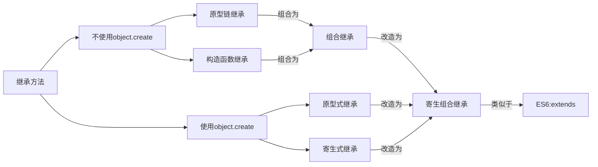

## JS自定义事件

在日常开发中，我们习惯监听页面许多事件，诸如：点击事件（ `click` ）、鼠标移动事件（ `mousemove` ）、元素失去焦点事件（ `blur` ）等等。

事件本质是一种通信方式，是一种消息，只有在多对象多模块时，才有可能需要使用事件进行通信。在多模块化开发时，可以使用**自定义事件**进行模块间通信。

目前实现**自定义事件**的两种主要方式是 JS 原生的 `Event()` 构造函数和 `CustomEvent()` 构造函数来创建。

### Event

```js
let myEvent = new Event(typeArg, eventInit);
```

- `typeArg` ： `DOMString` 类型，表示创建事件的名称；
- `eventInit` ：可选配置项，包括：

|   字段名称   |                       说明                        | 是否可选 |   类型    | 默认值 |
| :----------: | :-----------------------------------------------: | :------: | :-------: | :----: |
|  `bubbles`   |             表示该事件**是否冒泡**。              |   可选   | `Boolean` | false  |
| `cancelable` |            表示该事件**能否被取消**。             |   可选   | `Boolean` | false  |
|  `composed`  | 指示事件是否会在**影子DOM根节点之外**触发侦听器。 |   可选   | `Boolean` | false  |


示例代码：

```js
// 创建一个支持冒泡且不能被取消的 pingan 事件
let myEvent = new Event("pingan", {"bubbles":true, "cancelable":false});
document.dispatchEvent(myEvent);

// 事件可以在任何元素触发，不仅仅是document
testDOM.dispatchEvent(myEvent);
```


### CustomEvent

```
let myEvent = new CustomEvent(typeArg, eventInit);
```

- `typeArg` ： `DOMString` 类型，表示创建事件的名称；
- `eventInit` ：可选配置项，包括：

|   字段名称   |                          说明                           | 是否可选 |   类型    | 默认值 |
| :----------: | :-----------------------------------------------------: | :------: | :-------: | :----: |
|   `detail`   | 表示该事件中需要被传递的数据，在 `EventListener` 获取。 |   可选   |   `Any`   |  null  |
|  `bubbles`   |                表示该事件**是否冒泡**。                 |   可选   | `Boolean` | false  |
| `cancelable` |               表示该事件**能否被取消**。                |   可选   | `Boolean` | false  |

示例代码：

```js
// 创建事件
let myEvent = new CustomEvent("pingan", {
    detail: { name: "wangpingan" }
});

// 添加适当的事件监听器
window.addEventListener("pingan", e => {
    alert(`pingan事件触发，是 ${e.detail.name} 触发。`);
});
document.getElementById("leo2").addEventListener(
  "click", function () {
    // 派发事件
    window.dispatchEvent(myEvent);
  }
)
```


### 区别

从两者支持的参数中，可以看出：
`Event()` 适合创建简单的自定义事件，而 `CustomEvent()` 支持参数传递的自定义事件，它支持 `detail` 参数，作为事件中**需要被传递的数据**，并在 `EventListener` 获取。

注意：

当一个事件触发时，若相应的元素及其上级元素没有进行事件监听，则不会有回调操作执行。 当需要对于子元素进行监听，可以在其父元素进行事件托管，让事件在事件冒泡阶段被监听器捕获并执行。此时可以使用 `event.target` 获取到具体触发事件的元素。

## ==JS的继承方式==

1. 函数声明和类声明的区别

   函数声明会提升，类声明不会。首先需要声明你的类，然后访问它，否则像下面的代码会抛出一个ReferenceError。

2. ES5继承和ES6继承的区别

   - ES5的继承实质上是先创建子类的实例对象，然后再将父类的方法添加到this上（Parent.call(this)）。
   - ES6的继承有所不同，实质上是先创建父类的实例对象this，然后再用子类的构造函数修改this。因为子类没有自己的this对象，所以必须先调用父类的super()方法，否则新建实例报错。


继承的目的是为了多个实例让可以共享原型上的属性和方法，以实现代码复用。


继承方法关系图：


