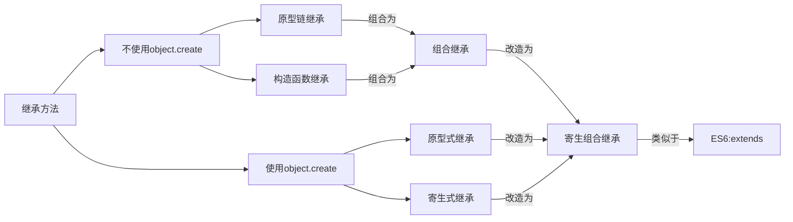

# 数据类型

## JS中的数据类型

7种基本数据类型：字符串（String）、数字(Number)、布尔(Boolean)、对空（Null）、未定义（Undefined）、Symbol、BigInt。

1种引用数据类型：对象(Object)。

两种类型的区别在于**存储位置的不同：**

- 原始数据类型直接存储在栈（stack）中的简单数据段，占据空间小、大小固定，属于被频繁使用数据，所以放入栈中存储；
- 引用数据类型存储在堆（heap）中的对象，占据空间大、大小不固定。如果存储在栈中，将会影响程序运行的性能；引用数据类型在栈中存储了指针，该指针指向堆中该实体的起始地址。当解释器寻找引用值时，会首先检索其在栈中的地址，取得地址后从堆中获得实体。


### null 空类型

表示为一个对象类型的特殊值，是一个不存在或无效的对象或者地址引用。

注意：因为 JavaScript 是区分大小写的，所以 `null` 和 `Null`、`NULL` 或其他变体是不一样的。

`typeof null` 的结果是Object，这是一个历史遗留问题，在 JavaScript 第一个版本中，所有值都存储在 32 位的单元中，每个单元由类型标签（低一或低三位）和存储值（余下的位）构成。

在类型标签中，如果最低位是 1，则类型标签标志位的长度只有一位；如果最低位是 0，则类型标签标志位的长度占三位。这样存储了五种数据类型：

```
000: object   - 当前存储的数据指向一个对象。
__1: int      - 当前存储的数据是一个 31 位的有符号整数。
010: double   - 当前存储的数据指向一个双精度的浮点数。
100: string   - 当前存储的数据指向一个字符串。
110: boolean  - 当前存储的数据是布尔值。
```

有两种特殊数据类型：

- `undefined` 的值是 $(-2)^{30}$(一个超出整数范围的数字)；
- `null` 的值是机器码 NULL 指针(null 指针的值全是 0)。

那也就是说null的类型标签也是000，和Object的类型标签一样，所以会被判定为Object。


## 数据类型检测

### typeof

- typeof 以字符串的形式将判断的类型返回。
- typeof是通过变量存储的机器码的低位1-3位存储类型信息来判断的。
- typeof可以判断基本类型，但引用类型的不一定能具体地判断，比如数组、对象、null都会被判断为object，其他判断都正确。

```js
console.log(typeof 2);               // number
console.log(typeof true);            // boolean
console.log(typeof 'str');           // string
console.log(typeof []);              // object    
console.log(typeof function(){});    // function
console.log(typeof {});              // object
console.log(typeof undefined);       // undefined
console.log(typeof null);            // object
```


### instanceof

`instanceof`可以正确判断对象的类型，其内部运行机制是判断在其原型链中能否找到该类型的原型。

```js
console.log(2 instanceof Number);                    // false
console.log(true instanceof Boolean);                // false 
console.log('str' instanceof String);                // false 
 
console.log([] instanceof Array);                    // true
console.log(function(){} instanceof Function);       // true
console.log({} instanceof Object);                   // true
```

可以看到，`instanceof`**只能正确判断引用数据类型**，而不能判断基本数据类型。`instanceof` 运算符可以用来测试一个对象在其原型链中是否存在一个构造函数的 `prototype` 属性。

```js
let a = new Number();
typeof a;								// "object"
a instanceof Number;    // true
a=10;
typeof a;								// "number"
a instanceof Number;    // false
```

上面的例子中，`instanceof` 检查的是 **对象是否为某个构造函数的实例**，而原始类型（如 `10`）不是对象，因此返回 `false`。


### constructor

```js
console.log((2).constructor === Number); 									// true
console.log((true).constructor === Boolean); 							// true
console.log(('str').constructor === String); 							// true
console.log(([]).constructor === Array); 									// true
console.log((function() {}).constructor === Function); 		// true
console.log(({}).constructor === Object); 								// true
```

`constructor`有两个作用，一是判断数据的类型，二是对象实例通过 `constrcutor` 对象访问它的构造函数。

注意，如果创建一个对象来改变它的原型，`constructor`就不能用来判断数据类型了：

```js
function Fn(){};
 
Fn.prototype = new Array();
 
var f = new Fn();
 
console.log(f.constructor===Fn);    // false
console.log(f.constructor===Array); // true
```


### Object.prototype.toString.call()

`Object.prototype.toString.call()` 使用 Object 对象的原型方法 toString 来判断数据类型：

```js
var a = Object.prototype.toString;

console.log(a.call(2));								// [object Number]
console.log(a.call(true));						// [object Boolean]
console.log(a.call('str'));						// [object String]
console.log(a.call([]));							// [object Array]
console.log(a.call(function(){}));		// [object Function]
console.log(a.call({}));							// [object Object]
console.log(a.call(undefined));				// [object Undefined]
console.log(a.call(null));						// [object Null]
// 若想只获得类型则可
a.call(null).slice(8,-1);							// Null
```


注意：被检测对象obj调用toString方法的结果和用Object调用toString方法的结果是不同的。原因是Array、function等类型作为Object的实例，都重写了toString方法，这与Object的原型方法并不一样，在调用时会根据原型链去调用重写之后的toString方法，所以结果也不一样。

> Object.prototype.toString：返回对象的具体类型；
>
> Function.toString：将Function转换为字符串类型，返回内容为函数体的字符串；
>
> Array.toString：将Array转换为字符串类型，返回元素组成的字符串；


## 数据类型转换

[js中的数据类型、数据类型判断、数据类型转换，一篇全搞定！今天我们要聊聊在js中的各个**数据类型**的区别，各自的功能 - 掘金](https://juejin.cn/post/7379092541025452084?searchId=2025041415042261FD7405180E7568EE12#heading-2)

### 显式转换

因为一般不会转向null和undefined，这两种特殊值在转换为其他类型时有特定行为，而在js中`symbol`类型是唯一的，不能由其他类型转换而来。所以常见的就是下表中涉及到的规则：

| **原始值**         | **转换为 `Number`** (`Number(x)`) | **转换为 `String`** (`String(x)`) | **转换为 `Boolean`** (`Boolean(x)`) | **特殊说明**                                                 |
| :----------------- | :-------------------------------- | :-------------------------------- | :---------------------------------- | :----------------------------------------------------------- |
| `number` (非零)    | 原值                              | 数字字符串 (`"42"`)               | `true`                              | `NaN` 是特殊的 `number` 类型；转字符串时，极小和极大的数字会使用指数形式。 |
| `0`                | `0`                               | `"0"`                             | `false`                             | `+0`、`-0` 转换结果相同                                      |
| `NaN`              | `NaN`                             | `"NaN"`                           | `false`                             | 唯一一个 `x !== x` 为 `true` 的值                            |
| `Infinity`         | `Infinity`                        | `"Infinity"`                      | `true`                              | 正负 `Infinity` 行为一致                                     |
| `"123"`            | 解析为数字 `123`                  | 原值                              | `true`                              | 含非数字字符时返回 `NaN` (`"123a"` → `NaN`)                  |
| `"awp"`            | `NaN`                             | 原值                              | `true`                              | 含非数字字符时返回 `NaN` (`"123a"` → `NaN`)                  |
| `""` (空字符串)    | `0`                               | `""`                              | `false`                             | 唯一为 `false` 的字符串                                      |
| `" "` (空格)       | `0`                               | 原值（保留空格）                  | `true`                              | 仅纯空格字符串在 `Boolean` 中为 `true`                       |
| `true`             | `1`                               | `"true"`                          | `true`                              |                                                              |
| `false`            | `0`                               | `"false"`                         | `false`                             |                                                              |
| `null`             | `0`                               | `"null"`                          | `false`                             | 与 `undefined` 不同，`Number(null)` 为 `0`                   |
| `undefined`        | `NaN`                             | `"undefined"`                     | `false`                             | 唯一在 `Number()` 中转为 `NaN` 的非字符串                    |
| `Symbol("foo")`    | **报错** (`TypeError`)            | `"Symbol(foo)"`                   | `true`                              | 无法隐式转换为 `number`，显式调用 `Number()` 会报错，且只能显示转换成字符串。 |
| `123n` (BigInt)    | 数字 (`123`)                      | `"123"`                           | `true`                              | 超出 `Number` 范围时丢失精度 (`9007199254740993n` → `9007199254740992`) |
| `Object` (`Array`) | （具体见下面解释）                |                                   | `true`                              | 所有引用类型包括`{}`空对象和`[]`空数组转成布尔都是`true`。   |


**引用类型转数字类型：**

优先尝试 `valueOf()`方法，如果无法得到原始值，失败后再调用 `toString()` 方法返回字符串，再按照上面的规则尝试将字符串强制转换为数字。

如下代码就能很清晰地展示出引用数据类型对象obj转换为Number数据类型的逻辑。

```js
// 自定义对象，包含valueOf和toString方法 
let obj = {
    valueOf: function() {
        console.log("valueOf called");
        return "123"; // 返回字符串，之后会被转换为Number }, 
    toString: function() { 
        console.log("toString called"); 
        return "456"; // 备用转换路径 } }; // 尝试将对象转换为Number 

let num = Number(obj);
console.log(num); // 输出：123
```

**引用类型转字符串类型：**

要自行定义 `toString()` 方法，否则调用`Object.prototype.toString()`返回其内部属性类型值。


### 隐式转换

首先要介绍`ToPrimitive`方法，这是 JavaScript 中每个值隐含的自带的方法，用来将值 （无论是基本类型值还是对象）转换为基本类型值。如果值为基本类型，则直接返回值本身；如果值为对象，其看起来大概是这样：

```js
/**
* @obj 需要转换的对象
* @type 期望的结果类型
*/
ToPrimitive(obj,type)
```

`type`的值为`number`或者`string`。

（1）当`type`为`number`时规则如下：

- 调用`obj`的`valueOf`方法，如果为原始值，则返回，否则下一步；
- 调用`obj`的`toString`方法，后续同上；
- 抛出`TypeError` 异常。

（2）当`type`为`string`时规则如下：

- 调用`obj`的`toString`方法，如果为原始值，则返回，否则下一步；
- 调用`obj`的`valueOf`方法，后续同上；
- 抛出`TypeError` 异常。

可以看出两者的主要区别在于调用`toString`和`valueOf`的先后顺序。默认情况下：

- 如果对象为 Date 对象，则`type`默认为`string`；
- 其他情况下，`type`默认为`number`。

总结上面的规则，对于 Date 以外的对象，转换为基本类型的大概规则可以概括为一个函数：

```js
var objToNumber = value => Number(value.valueOf().toString())
objToNumber([]) === 0
objToNumber({}) === NaN
```

而 JavaScript 中的隐式类型转换主要发生在`+、-、*、/`以及`==、>、<`这些运算符之间。而这些运算符只能操作基本类型值，所以在进行这些运算前的第一步就是将两边的值用`ToPrimitive`转换成基本类型，再进行操作。


以下是基本类型的值在不同操作符的情况下隐式转换的规则 （对于对象，其会被`ToPrimitive`转换成基本类型，所以最终还是要应用基本类型转换规则）：

1. `+`操作符的两边有至少一个`string`类型变量时，两边的变量都会被隐式转换为字符串；其他情况下两边的变量都会被转换为数字。

   ```js
   1 + '23' // '123'
   1 + false // 1 
   1 + Symbol() // Uncaught TypeError: Cannot convert a Symbol value to a number
   '1' + false // '1false'
   false + true // 1
   
   Number(null) // 0
   5 + null // 5
   Number(undefined) // NaN
   5 + undefined // NaN
   ```

2. `-`、`*`、`\`操作符：

   ```
   1 - '23' // -22
   1 * '23' // 23
   1 * false // 0
   1 / 'aa' // NaN也是一个数字
   ```

3. 对于`==`操作符，其符号两边的值都尽量会转成`number`

   ```js
   3 == true // false, 3 转为number为3，true转为number为1
   '0' == false //true, '0'转为number为0，false转为number为0
   '0' == 0 // '0'转为number为0
   ```

   `null`与`undefined`都可以表示“没有”，含义非常相似。将一个变量赋值为`undefined`或`null`，老实说，语法效果几乎没区别。在if语句中，它们都会被自动转为false，相等运算符（==）甚至直接报告两者相等。

   ```js
   //等同，下列式子返回true
   null == undefined;
   
   //但全等会返回false
   null === undefined;
   ```

4. 对于大于和小于比较符

   如果两边都是字符串，则比较字母表顺序：

   ```js
   'ca' < 'bd' // false
   'a' < 'b' // true
   ```

   其他情况下，转换为数字再比较：

   ```js
   '12' < 13 // true
   false > -1 // true
   ```

   以上说的是基本类型的隐式转换，而对象会被`ToPrimitive`转换为基本类型再进行转换：

   ```js
   var a = {}
   a > 2 // false
   
   比较过程如下：
   a.valueOf() // {}, 上面提到过，ToPrimitive默认type为number，所以先valueOf，结果还是个对象，下一步
   a.toString() // "[object Object]"，现在是一个字符串了
   Number(a.toString()) // NaN，根据上面 < 和 > 操作符的规则，要转换成数字
   NaN > 2 //false，得出比较结果
   ```

   


## JS中的内置对象

### Number

存储整数或浮点数或NAN。例如，`42` 或 `3.14159`。

注意：

- NaN 是一个特殊值，它和自身不相等，是唯一一个非自反的值。即，`NaN !== NaN` 为 `true`。


```
const a={
va=true;

}
```


#### JS浮点数的固有缺陷

```
console.log(0.1 + 0.2);  // 0.30000000000000004
console.log(0.1 + 0.7);  // 0.79999999999999999
console.log(0.3 - 0.1);  // 0.19999999999999998
```

由于 **JavaScript 使用 IEEE 754 双精度浮点数**（64位二进制）来表示数字，会存在一些固有缺陷：

- **二进制无法精确表示某些十进制小数**。在二进制中，`0.1` 和 `0.2` 是无限循环小数：

  ```
  0.1 → 0.0001100110011001100110011001100110011001100110011001101...（二进制）
  0.2 → 0.001100110011001100110011001100110011001100110011001101...（二进制）
  存储时会截断为 52 位尾数，导致精度丢失。
  ```

- **相加时会二次精度丢失**。JS会将 `0.1` 和 `0.2` 转换为二进制近似值，然后对两个不精确的二进制值相加。最后结果再转换回十进制，放大了误差。

  ```
  0.1 (近似) → 0.1000000000000000055511151231257827021181583404541015625
  0.2 (近似) → 0.200000000000000011102230246251565404236316680908203125
  相加结果 → 0.3000000000000000444089209850062616169452667236328125
  控制台输出时缩短为 0.30000000000000004
  ```

- **IEEE 754的舍入规则**。JavaScript 遵循“向最近偶数舍入”，这进一步加剧了误差。

解决方法：

1. 使用 `toFixed()` 显示时截断

   ```js
   console.log((a + b).toFixed(2)); // "0.30"（注意返回的是字符串）
   ```

2. 将小数转换为整数后计算，最后再还原

   ```js
   console.log((a * 10 + b * 10) / 10); // 0.3
   ```

3. 使用如 `big.js` 等第三方库可精确处理小数运算。


#### isNaN 和 Number.isNaN 函数的区别？

`isNaN` 是JS内置的函数，用来确定一个值是否为 `NaN`，若有必要，则首先将值转换为数字。`Number.isNaN` 是JS中的Number对象的静态方法，也是用判断传入的值是否为 `NaN`。主要区别如下：

- 函数 isNaN 接收参数后，会尝试将这个参数转换为数值，任何不能被转换为数值的的值都会返回 true，因此非数字值传入也会返回 true ，会影响 NaN 的判断。
- 函数 Number.isNaN 会首先判断传入参数是否为数字，如果是数字再继续判断是否为 NaN ，不会进行数据类型的转换，这种方法对于 NaN 的判断更为准确。


### String

用于表示文本，字符串

#### 实例属性

##### String.length

String 类型的 **`length`** 数据属性表示字符串的 UTF-16 码元长度。对于空字符串，length 为 0。

静态属性 String.length 与字符串的长度无关。它是 String 函数的参数数量（简单地说，就是它有多少个形参），也就是 1。

由于 length 统计的是码元而不是字符。码原是指在字符编码中用于表示一个字符的基本单位。它是字符在计算机内存中存储的最小单元,有兴趣的可以去了解下。

#### 实例方法

##### String.includes()

 **`includes()`** 方法执行区分大小写的搜索，以确定是否可以在一个字符串中找到另一个字符串，并根据情况返回 `true` 或 `false`。

这是ES6新增的方法，简化了判断一个字符/字符串是否在某字符串中。

##### String.startsWith()

**`startsWith()`** 方法用来判断当前字符串是否以另外一个给定的子字符串开头，并根据判断结果返回 `true` 或 `false`。

这是ES6新增的方法。

##### String.endsWith()

**`endsWith()`** 方法用于判断一个字符串是否以指定字符串结尾，如果是则返回 `true`，否则返回 `false`。


### Boolean

表示逻辑，共有两个值`true`或者`false`


### Symbol

这是es6新增的数据类型，一种唯一且不可变的数据类型，常用于对象的键名以避免属性名的冲突。


### BigInt

这是es10新增的数据类型，用来存储大于 `2^53 - 1`（即大于 `Number.MAX_SAFE_INTEGER`）的整数，用于表示任意大小的安全整数。

`BigInt`是一种内置的数值数据类型，用于表示任意精度的整数。它突破了`Number`类型的限制，能够表示非常大的整数，而不会因为精度不足而产生误差。

#### 构造函数

`BigInt()`函数是该包装类型的构造函数，可以用来创建一个类型为`BigInt`的值。除此之外，作为基础数据类型之一，也可以通过直接赋值的方法创建，即在整数末尾添加n后缀：

```js
const bigIntNum = 1234567890123456789012345678901234567890n;
console.log(bigIntNum); // 1234567890123456789012345678901234567890n

const bigIntNum = BigInt("1234567890123456789012345678901234567890");
console.log(bigIntNum); // 1234567890123456789012345678901234567890n
```

注意事项：

- BigInt只能表示整数，不能表示小数。
- BigInt与Number类型的数值不能直接混合运算，需要进行类型转换。

### ----------


### Object

这是引用类型的统称，其子类型有`Array`（数组）、`Function`（函数）、`Date`（日期）、`RegExp`（正则表达式）`Math`（数学）、自定义对象。

对“JS万物皆对象”的理解：

- 这句话是一种简化表述，实际含义是：**JavaScript 中几乎所有数据都可以表现出对象的特性**，但并非所有数据都是对象。
- 其深层原理是：
  - 所有对象共享原型链机制：所有对象（包括构造函数创建的实例）都继承自 `Object.prototype`，因此可以调用通用方法。
  - 原始类型可通过包装对象临时表现为对象（自动装箱）：当对原始类型调用方法时，JavaScript 自动将其包装为对象（通过构造函数），调用后立即销毁。
  - 引用类型本身就是对象。


#### 如何获取普通对象Object的长度

对象的长度不能通过length来获取，主要有两种方法：

##### Object.keys()

通过Object.keys()，这个方法主要接受一个对象返回实例中可枚举的属性的数组，然后使用数组的length属性来得到对象的长度。

```js
	var obj = {'id':1,'name':'叶落森','sex':'女'};
	var arr = Object.keys(obj);
	console.log(arr);  // ['id','name','sex']
	console.log(arr.length);  //3
```

##### for…in…

```js
var i=0;
for(x in obj){
  i++;
}
console.log(i)
```

### Function

#### 实例属性

##### Function.length

funtion 实例的 **`length`** 数据属性表示函数期望的参数数量。

一个 Funtion 对象的 `length` 属性表示函数期望的参数个数，即形参的个数。这个数字不包括剩余参数，只包括在第一个具有默认值的参数之前的参数。相比之下，`arguments.length` 是局限于函数内部的，它提供了实际传递给函数的参数个数。 

在JavaScript中，Number类型采用双精度64位二进制格式（IEEE 754标准），因此能安全表示的整数范围是$-(2^{53}-1)$到$2^{53}-1$，即`Number.MIN_SAFE_INTEGER` 到 `Number.MAX_SAFE_INTEGER`。超过这个范围的整数将无法精确表示，可能导致计算错误。为了解决这个问题，`BigInt`应运而生。

### Array

数组本质是数据集合，操作数据无非就是增删改查语法，下面是常用的一些实例方法：

- 数组和字符串的转换方法：toString()、toLocalString()、join() 其中 join() 方法可以指定转换为字符串时的分隔符。
- 数组尾部操作的方法 pop() 和 push()，push 方法可以传入多个参数。
- 数组首部操作的方法 shift() 和 unshift()。
- 重排序的方法 reverse() 和 sort()，sort() 方法可以传入一个函数来进行比较，传入前后两个值，如果返回值为正数，则交换两个参数的位置。
- 数组连接的方法 concat() ，返回的是拼接好的数组，不影响原数组。
- 数组截取办法 slice()，用于截取数组中的一部分返回，不影响原数组，而是返回一个新的数组。
- 数组插入方法 splice()，影响原数组。
- 查找特定项的索引的方法，indexOf() 和 lastIndexOf()。
- 迭代方法 every()、some()、filter()、map() 和 forEach() 方法。
- 数组归并方法 reduce() 和 reduceRight() 方法。


#### 构造函数

调用 `Array()` 时可以使用或不使用 `new`。两者都会创建一个新的 `Array` 实例。

```js
new Array()  // 空数组
new Array(element0)  // 长度为element0的空数组
new Array(element0, element1)  // 长度为2，元素为element0, element1的数组
new Array(element0, element1, /* … ,*/ elementN)
new Array(arrayLength) // 长度为arrayLength的空数组

Array()
Array(element0)
Array(element0, element1)
Array(element0, element1, /* … ,*/ elementN)
Array(arrayLength)
/* 参数说明：
当只有一个参数且为数字时，代表创建一个该长度的空数组，其中的值为空槽undefined。
当有两个及以上的数字参数时，代表将这些参数作为值进行数组的创建。
*/
```

#### 静态方法

##### Array.from()

**`Array.from()`** 静态方法从**可迭代对象**（例如Map和Set）或**类数组对象**（带有 `length` 属性和索引元素的对象）创建一个新的浅拷贝的数组实例。

`Array.from()` 绝不会创建稀疏数组。如果 `arrayLike` 对象缺少一些索引属性，那么这些属性在新数组中将是 `undefined`。

```
Array.from("foo");  // [ "f", "o", "o" ]

const set = new Set(["foo", "bar", "baz", "foo"]);
Array.from(set);   // [ "foo", "bar", "baz" ]

```

##### Array.isArrat()

**`Array.isArray()`** 静态方法用于确定传递的值是否是一个数组，返回值是一个布尔类型的值。它不检查值的原型链，也不依赖于它所附加的 `Array` 构造函数。对于使用数组字面量语法或 `Array` 构造函数创建的任何值，它都会返回 `true`。这使得它可以安全地使用跨领域（cross-realm）对象，其中 `Array` 构造函数的标识是不同的，因此会导致 `instanceof Array` 失败。

`Array.isArray()` 也拒绝原型链中带有 `Array.prototype`，而实际不是数组的对象，但 `instanceof Array` 会接受。

```js
// 下面的函数调用都返回 true
Array.isArray([]);
Array.isArray([1]);
Array.isArray(new Array());
Array.isArray(new Array("a", "b", "c", "d"));
Array.isArray(new Array(3));
// 鲜为人知的事实：其实 Array.prototype 也是一个数组：
Array.isArray(Array.prototype);

// 下面的函数调用都返回 false
Array.isArray();
Array.isArray({});
Array.isArray(null);
Array.isArray(undefined);
Array.isArray(17);
Array.isArray("Array");
Array.isArray(true);
Array.isArray(false);
Array.isArray(new Uint8Array(32));
// 这不是一个数组，因为它不是使用数组字面量语法或 Array 构造函数创建的
Array.isArray({ __proto__: Array.prototype });
```

当检测 `Array` 实例时，`Array.isArray` 优于 `instanceof`，因为 `Array.isArray` 能跨领域工作。

```js
const iframe = document.createElement("iframe");
document.body.appendChild(iframe);
const xArray = window.frames[window.frames.length - 1].Array;
const arr = new xArray(1, 2, 3); // [1, 2, 3]

// 正确检查 Array
Array.isArray(arr); // true
// arr 的原型是 xArray.prototype，它是一个不同于 Array.prototype 的对象
arr instanceof Array; // false
```


#### 实例属性

##### Array.length

`length` 是 `Array` 的实例属性，表示该数组中元素的个数。该值是一个无符号 32 位整数，并且其数值总是大于数组最大索引。

数组对象会观察 length 属性，并自动将 length 值与数组的内容同步。这意味着：

- 设置 length 小于当前长度的值将会截断数组，即超过新 length 的元素将被删除。

  ```js
  const numbers = [1, 2, 3, 4, 5];
   
  if (numbers.length > 3) {
    numbers.length = 3;
  }
   
  console.log(numbers); // [1, 2, 3]
  console.log(numbers.length); // 3
  console.log(numbers[3]); // undefined；多余的元素会被删除
  ```

- 设置超过当前 length 的任何数组索引（小于 232 的非负整数）将会扩展数组，即 length 属性增加以反映新的最高索引。

- 将 length 设置为无效值（例如负数或非整数）会引发 RangeError 异常。

- 当 length 被设置为比当前长度更大的值时，数组通过添加空槽来扩展，而不是实际的 undefined 值。空槽与数组方法有一些特殊的交互作用。

  ```js
  const arr = [1, 2];
  console.log(arr);
  // [ 1, 2 ]
   
  arr.length = 5; // 将数组长度设置为 5，而当前为 2。
  console.log(arr);
  // [ 1, 2, <3 empty items> ]
   
  arr.forEach((element) => console.log(element));
  // 1
  // 2
  // 剩下的3个空槽不会打印undefined
  ```


**JS中length与size的区别：**

他们两个的功能相同，都是用来返回元素的个数。`Array`，`String`和`Function`才具有`length`实例属性。对于 `Map` 和 `Set` 数据结构，JavaScript提供了 `size` 属性来获取其元素数量。

**jquery中length和size()：**

length用法同js，但是jquery是基于js的轻量级框架，在获取元素时多了个size()方法。

size()是jQuery中的方法，用来获取元素个数，从1开始


#### 实例方法

##### Array.fill()

`fill()`方法用一个固定值填充一个数组中从起始索引（默认为 `0`）到终止索引（默认为 `array.length`）内的全部元素。它返回修改后的数组。

##### Array.map()

**`map()`** 方法**创建一个新数组**，这个新数组由原数组中的每个元素都调用一次提供的函数后的返回值组成。

```js
const arr = ['red','blue','pink']
// 数组map力法处理数据并且返回一个数组
const newArr = arr.map(function(ele,index){
    //console.log(ele)// 数组汇素
    //console.log(index)//索引号
    return ele +'颜色
})
console.log(newArr)
```

##### Array.slice()

**`slice()`** 方法返回一个新的数组对象，这一对象是一个由 `start` 和 `end` 决定的原数组的[浅拷贝](https://developer.mozilla.org/zh-CN/docs/Glossary/Shallow_copy)（包括 `start`，不包括 `end`），其中 `start` 和 `end` 代表了数组元素的索引。原始数组不会被改变。

##### Array.join()

**`join()`** 方法将一个数组（或类数组对象）的所有元素连接成一个字符串并返回这个字符串，用逗号或指定的分隔符字符串分隔。如果数组只有一个元素，那么将返回该元素而不使用分隔符。

```js
// 数组join力法把数组转换为字符串
// 小括号为空则逗号分割
console.log(newArr.join()) // red颜色,blue颜色,pink颜色
// 小括号是空字符串，则无素之间没有分隔符
console.log(newArr.join('')) // red颜色blue颜色pink颜色
console.log(newArr.join('|')) // red颜色|blue颜色|pink颜色
```

所有数组元素被转换成字符串并连接到一个字符串中。如果一个元素是 `undefined` 或 `null`，它将被转换为空字符串，而不是字符串 `"undefined"` 或 `"null"`。

##### Array.reduce()

`reduce()` 方法是一个迭代方法。它按升序对数组中的所有元素运行一个“reducer”回调函数，并将它们累积到一个单一的值中。每次调用时，`callbackFn` 的返回值都作为 `accumulator` 参数传递到下一次调用中。`accumulator` 的最终值（也就是在数组的最后一次迭代中从 `callbackFn` 返回的值）将作为 `reduce()` 的返回值。

第一次执行回调函数时，不存在“上一次的计算结果”。如果需要回调函数从数组索引为 0 的元素开始执行，则需要传递初始值。否则，数组索引为 0 的元素将被用作初始值，迭代器将从第二个元素开始执行（即从索引为 1 而不是 0 的位置开始）。

`reduce()` 不会改变被调用的数组，但是作为 `callbackFn` 提供的函数可能会改变数组。但需要注意的是，在第一次调用 `callbackFn` *之前*，数组的长度会被保存。因此：

- 当开始调用 `reduce()` 时，`callbackFn` 将不会访问超出数组初始长度的任何元素。
- 对已访问索引的更改不会导致再次在这些元素上调用 `callbackFn`。
- 如果数组中一个现有的、尚未访问的元素被 `callbackFn` 更改，则它传递给 `callbackFn` 的值将是该元素被修改后的值。

reduce()的边界情况：

- 如果提供了 `initialValue`且数组不为空，则 `reduce` 方法将始终从索引 0 开始调用回调函数。

  ```js
  const getMax = (a, b) => Math.max(a, b);
  // 从索引 0 开始为数组中的每个元素调用回调函数
  [1, 100].reduce(getMax, 50); // 100
  [50].reduce(getMax, 10); // 50
  ```

- 如果提供了 `initialValue`但数组为空，则将返回该提供的初始值，而不调用 `callbackFn`。

  ```js
  // 不调用回调函数
  [].reduce(getMax, 1); // 1
  ```

- 如果未提供 `initialValue`，则对于长度大于 1、等于 1 和 0 的数组，`reduce` 方法将有不同的表现，如以下示例所示：

  ```js
  // 仅为索引 1 处的元素调用回调函数
  [1, 100].reduce(getMax); // 100
  
  // 不调用回调函数
  [50].reduce(getMax); // 50
  
  // 报错
  [].reduce(getMax); // TypeError
  ```

  


#### 遍历数组的方法

| **方法**                            | **可中断** | **修改原数组** | **用途**                               | **示例**                               |
| :---------------------------------- | :--------- | :------------- | :------------------------------------- | :------------------------------------- |
| `for` / `while` / `do...while`循环  | ✅ 是       | ❌ 否           | 通用遍历，灵活控制                     | `for (let i = 0; i < arr.length; i++)` |
| `for...of`                          | ✅ 是       | ❌ 否           | 遍历值（支持 `break`）                 | `for (const item of arr)`              |
| `forEach()`                         | ❌ 否       | ❌ 否           | 仅遍历，无返回值。（无法中断）         | `arr.forEach(item => {})`              |
| `map()`                             | ❌ 否       | ❌ 否           | 返回新数组，适合链式调用。             | `arr.map(x => x * 2)`                  |
| `filter()`                          | ❌ 否       | ❌ 否           | 返回过滤后的新数组                     | `arr.filter(x => x > 5)`               |
| `reduce()` / `reduceRight()`        | ❌ 否       | ❌ 否           | 累积计算                               | `arr.reduce((sum, x) => sum + x, 0)`   |
| `some()`                            | ✅ 是       | ❌ 否           | 检查是否有元素满足条件（可提前退出）   | `arr.some(x => x > 10)`                |
| `every()`                           | ✅ 是       | ❌ 否           | 检查是否所有元素满足条件（可提前退出） | `arr.every(x => x > 0)`                |
| `find()` / `findIndex()`            | ✅ 是       | ❌ 否           | 查找首个匹配元素/索引（可提前退出）    | `arr.find(x => x === 5)`               |
| `entries()` / `keys()` / `values()` | ✅ 是       | ❌ 否           | 遍历键/值/键值对（配合 `for...of`）    | `for (const [i, v] of arr.entries())`  |
| `splice()`                          | ❌ 否       | ✅ 是           | 删除/替换元素                          | `arr.splice(0, 1)`                     |
| `sort()`                            | ❌ 否       | ✅ 是           | 排序                                   | `arr.sort((a, b) => a - b)`            |
| `reverse()`                         | ❌ 否       | ✅ 是           | 反转数组                               | `arr.reverse()`                        |
| `fill()`                            | ❌ 否       | ✅ 是           | 填充数组                               | `arr.fill(0)`                          |
| `copyWithin()`                      | ❌ 否       | ✅ 是           | 内部复制元素                           | `arr.copyWithin(0, 1)`                 |
| `Object.keys()`                     | ❌ 否       | ❌ 否           | 遍历对象，返回由可枚举属性组成的数组   | `Object.keys(['a', 'b', 'c'])`         |

其中可中断为`是`的，可以通过 `return`、`break` 或 `throw` 提前终止遍历；

其中会修改原数组为`是`的，表明其方法会在原数组上做修改，而非返回新数组。


##### `for...of` 和 `for...in` 的区别

| **特性**       | `for...of`                     | `for...in`                 |
| :------------- | :----------------------------- | :------------------------- |
| **遍历目标**   | 值（如数组元素、字符）         | 键（如对象属性、数组索引） |
| **适用对象**   | 可迭代对象（数组、Map、Set等） | 任意对象（包括普通对象）   |
| **原型链属性** | 不遍历                         | 遍历（需过滤）             |
| **中断支持**   | 支持 `break`/`continue`        | 支持 `break`/`continue`    |
| **索引类型**   | 无索引（直接访问值）           | 字符串（如 `"0"`）         |

**总结：**

- for...in 循环主要是为了遍历对象而生，不适用于遍历数组；for...of 循环可以用来遍历数组、类数组对象，字符串、Set、Map 以及 Generator 对象。
- 对于数组的遍历，for…in 会返回数组中所有可枚举的属性(包括原型链上可枚举的属性)，for…of 只返回数组的下标对应的属性值；

##### `forEach()` 和 `map()` 的区别

| **特性**       | `forEach()`                        | `map()`                  |
| :------------- | :--------------------------------- | :----------------------- |
| **返回值**     | `undefined`                        | 新数组                   |
| **原数组修改** | 否（但回调内可修改元素）           | 否                       |
| **中断支持**   | 否                                 | 否                       |
| **使用场景**   | 执行副作用（如打印、更新外部变量） | 数据转换（如生成新数组） |


#### 判断数组的方法

##### 方法一：instanceof

判断一个实例是否属于某构造函数

```js
let arr = []
console.log(arr instanceof Array) // true
```

缺点：instanceof 底层原理是检测构造函数的 prototype 属性是否出现在该实例的原型链上，如果被检测的实例的原型链发生变化，则无法做出正确判断。

```js
let arr = []
arr.__proto__ = function() {}
console.log(arr instanceof Array) // false
```

##### 方法二：constructor

实例的构造函数属性 constructor 指向构造函数本身。

```js
let arr = []
console.log(arr.constructor === Array) // true
```

缺点：如果 arr 的 constructor 被修改，则无法做出正确判断。

```js
let arr = []
arr.constructor = function() {}
console.log(arr.constructor === Array) // false
```

##### 方法三：`__proto__`

实例的 `__proto__` 指向构造函数的原型对象

```js
let arr = []
console.log(arr.__proto__ === Array.prototype) // true
```

缺点：如果实例的原型链的被修改，则无法做出正确判断

```js
let arr = []
arr.__proto__ = function() {}
console.log(arr.__proto__ === Array.prototype) // false
```

##### 方法四：Object.getPrototypeOf()

Object 自带的方法，获取某个对象所属的原型对象

```js
let arr = [];
console.log(Object.getPrototypeOf(arr) === Array.prototype) // true
```

缺点同上。

##### 方法五：Array.prototype.isPrototypeOf()

Array 原型对象的方法，判断其是不是某个对象的原型对象

```js
let arr = [];
console.log(Array.prototype.isPrototypeOf(arr)) // true
```

缺点同上。

##### 方法六：Object.prototype.toString.call()

Object 的原型对象上有一个 toString 方法，toString 方法默认被所有对象继承，返回 "`[object type]`" 字符串。但此方法经常被原型链上的同名方法覆盖，需要通过 `Object.prototype.toString.call()` 强行调用。

```js
let arr = [];
console.log(Object.prototype.toString.call(arr) === '[object Array]') // true
```

这个类型就像胎记，一出生就刻在了身上，因此修改原型链不会对它造成任何影响。

```js
let arr = [];
arr.__proto__ = function() {};
console.log(Object.prototype.toString.call(arr) === '[object Array]') // true
```

##### 方法七：Array.isArray()

Array.isArray() 是 ES6 新增的方法，专门用于数组类型判断，原理同上。

```js
let arr = [];
console.log(Array.isArray(arr)) // true
```


#### 转换类数组的方法

一个拥有 **length 属性**和若干**数字索引属性**的对象就可以被称为类数组对象，类数组对象和数组类似，但它们并不是由`Array`构造函数创建的，因此不继承自`Array.prototype`，也就没有数组的原生方法，例如`push`、`pop`、`map`等。

常见的类数组对象有：

- 字符串；
- 函数的 arguments 参数；
- 函数本身：
  - 因为它含有 length 属性值，代表可接收的参数个数。
- DOM 方法的返回结果：
  - 使用`document.getElementsByTagName`来获取元素集合，返回`HTMLCollection`。
  - 使用`document.querySelectorAll`来获取元素集合，返回`NodeList`。
- 手动定义的类数组对象


常见的类数组转换为数组的方法有：

1. 通过 call 调用数组的 slice 方法来实现转换

   ```
   Array.prototype.slice.call(arrayLike);
   ```

2. 通过 call 调用数组的 splice 方法来实现转换

   ```
   Array.prototype.splice.call(arrayLike, 0);
   ```

3. 通过 apply 调用数组的 concat 方法来实现转换

   ```
   Array.prototype.concat.apply([], arrayLike);
   ```

4. 通过 Array.from 方法来实现转换

   ```
   Array.from(arrayLike);
   ```

#### 遍历类数组的方法

要遍历类数组，有三个方法：

1. 可以使用`call`和`apply`方法将数组的方法应用到类数组上，如：

   ```js
   function foo(){ 
     Array.prototype.forEach.call(arguments, a => console.log(a))
   }
   ```

2. 使用Array.from方法将类数组转化成数组：‌

   ```js
   function foo(){ 
     const arrArgs = Array.from(arguments) 
     arrArgs.forEach(a => console.log(a))
   }
   ```

3. 使用展开运算符将类数组转化成数组

   ```js
   function foo(){ 
       const arrArgs = [...arguments] 
       arrArgs.forEach(a => console.log(a)) 
   }
   ```


### Set


### Map

`Map` 对象是键值对的集合。`Map` 中的一个键**只能出现一次**；它在 `Map` 的集合中是独一无二的。`Map` 对象按键值对迭代，一个 `for...of` 循环在每次迭代后会返回一个形式为 `[key, value]` 的数组。迭代按**插入顺序**进行，即键值对按 `set()` 方法首次插入到集合中的顺序（也就是说，当调用 `set()` 时，map 中没有具有相同值的键）进行迭代。

#### 实例属性

##### Map.size

`size` 的值是一个整数，表示 `Map` 对象有多少个键值对。`size` 的设置访问器函数是 `undefined`；你无法更改此属性的值。

#### 实例方法

##### Map.set()

Map实例的 **`set()`** 方法会向 `Map` 对象追加或更新一个指定的键值对。如果key已经有值，则键值会被更新，否则就新生成该键。

```js
Map.set(key, value);
```

##### Map.get()

Map实例的 **`get()`** 方法依据提供的键key返回该 map 中的指定元素value。如果与所提供的键相关联的值是一个对象，那么你将获得该对象的引用，对该对象所做的任何更改都会有效地在 `Map` 对象中修改它；如果找不到key，返回`undefined`。

```js
Map.get(key);
```

##### Map.has()

Map实例的 **`has()`** 方法返回一个布尔值，指示具有指定键的元素是否存在。

```js
Map.has(key);
```

##### Map.delete()

Map实例的 **`delete()`** 方法从该 map 中删除指定键的元素。

```js
Map.delete();
```

##### Map.clear()

Map实例的 **`clear()`** 方法会移除该 map 中的所有元素，没有返回值。

```js
Map.clear();
```


Map结构原生提供是三个遍历器生成函数和一个遍历方法

- keys()：返回键名的遍历器。
- values()：返回键值的遍历器。
- entries()：返回所有成员的遍历器。
- forEach()：遍历Map的所有成员。


#### Map和Object的区别

| Map                                                          | Object                                                       |
| ------------------------------------------------------------ | ------------------------------------------------------------ |
| Map默认情况不包含任何键，只包含显式插入的键。                | Object 有一个原型, 原型链上的键名有可能和自己在对象上的设置的键名产生冲突。 |
| Map的键可以是任意值，包括函数、对象或任意基本类型。          | Object 的键必须是 String 或是Symbol。                        |
| Map 中的 key 是有序的。因此，当迭代的时候， Map 对象以插入的顺序返回键值。 | Object 的键是无序的                                          |
| Map 的键值对个数可以轻易地通过size 属性获取                  | Object 的键值对个数只能手动计算                              |
| Map 是 iterable 的，所以可以直接被迭代。                     | 迭代Object需要以某种方式获取它的键然后才能迭代。             |
| 在频繁增删键值对的场景下表现更好。                           | 在频繁添加和删除键值对的场景下未作出优化。                   |


### WeakMap

weakMap的意义：

在 JavaScript 里，map API *可以*通过使其四个 API 方法共用两个数组（一个存放键，一个存放值）来实现。给这种映射设置值时会同时将键和值添加到这两个数组的末尾。从而使得键和值的索引在两个数组中相对应。当从该映射取值的时候，需要遍历所有的键，然后使用索引从存储值的数组中检索出相应的值。

但这样的实现会有两个很大的缺点：

1. 首先赋值和搜索操作都是 `O(n)` 的时间复杂度（*n* 是键值对的个数），因为这两个操作都需要遍历全部整个数组来进行匹配。
2. 另外一个缺点是可能会导致内存泄漏，因为数组会一直引用着每个键和值。这种引用使得垃圾回收算法不能回收处理他们，即使没有其他任何引用存在了。

相较之下，`WeakMap` 的键对象会强引用其值，直到该键对象被垃圾回收，但从那时起，它会变为弱引用。因此，`WeakMap`：

- 不会阻止垃圾回收，直到垃圾回收器移除了键对象的引用
- 任何值都可以被垃圾回收，只要它们的键对象没有被 `WeakMap` 以外的地方引用

当将键映射到与键相关的信息，而该信息仅在键未被垃圾回收的情况下具有价值时，`WeakMap` 是一个特别有用的构造。

但因为 `WeakMap` 不允许观察其键的生命周期，所以其键是不可枚举的。没有方法可以获得键的列表。如果有的话，该列表将会依赖于垃圾回收的状态，这引入了不确定性。如果你想要可以获得键的列表，你应该使用 `Map`。


#### 实例方法

weakMap对象有以下几种实例方法：

- **set(key,value)**：设置键名key对应的键值value，然后返回整个Map结构，如果key已经有值，则键值会被更新，否则就新生成该键。（因为返回的是当前Map对象，所以可以链式调用）
- **get(key)**：该方法读取key对应的键值，如果找不到key，返回undefined。
- **has(key)**：该方法返回一个布尔值，表示某个键是否在当前Map对象中。
- **delete(key)**：该方法删除某个键，返回true，如果删除失败，返回false。


### Math

Math对象是Javascript提供的一个“数学”对象，它提供了一系列做数学运算的方法。

Math对象包含的方法有：

- random：生成0-1之间的随机数（包含0不包括1）
- ceil： 向上取整
- floor：向下取整
- max：找最大数
- min： 找最小数
- pow：幂运算
- abs：绝对值

```
// 整数除法向零截断、向下取整、向上取整、四舍五入
stack.push(num2 / num1 > 0 ? Math.floor(num2 / num1) : Math.ceil(num2 / num1));
```

结合[取整，取余和取模的区别](#取整，取余和取模的区别)阅读


### JSON

与大多数全局对象不同，`JSON` 不是一个构造函数。不能将它与 `new` 运算符 一起使用，也不能将 `JSON` 对象作为函数调用。`JSON` 的所有属性和方法都是静态的就像 `Math` 对象一样。

JSON 是一种基于文本的轻量级的数据交换格式。它可以被任何的编程语言读取和作为数据格式来传递。在项目开发中，常使用 JSON 作为前后端数据交换的方式。在前端通过将一个符合 JSON 格式的数据结构序列化为 JSON 字符串，然后将它传递到后端，后端通过 JSON 格式的字符串解析后生成对应的数据结构，以此来实现前后端数据的一个传递。

应该注意的是 JSON 和 js 中的对象不是一回事，JSON 中对象格式更加严格，比如说在 JSON 中属性值不能为函数，不能出现 NaN 这样的属性值等，因此大多数的 js 对象是不符合 JSON 对象的格式的。

在 js 中提供了两个函数来实现 js 数据结构和 JSON 格式的转换处理，

- `JSON.stringify()` 函数，通过传入一个符合 JSON 格式的数据结构，将其转换为一个 JSON 字符串。如果传入的数据结构不符合 JSON 格式，那么在序列化的时候会对这些值进行对应的特殊处理，使其符合规范。在前端向后端发送数据时，可以调用这个函数将数据对象转化为 JSON 格式的字符串。
- `JSON.parse()` 函数，这个函数用来将 JSON 格式的字符串转换为一个 js 数据结构，如果传入的字符串不是标准的 JSON 格式的字符串的话，将会抛出错误。当从后端接收到 JSON 格式的字符串时，可以通过这个方法来将其解析为一个 js 数据结构，以此来进行数据的访问。

### Date


### RegExp


#### 常用的正则表达式

```js
// （1）匹配 16 进制颜色值
var regex = /#([0-9a-fA-F]{6}|[0-9a-fA-F]{3})/g;

// （2）匹配日期，如 yyyy-mm-dd 格式
var regex = /^[0-9]{4}-(0[1-9]|1[0-2])-(0[1-9]|[12][0-9]|3[01])$/;

// （3）匹配 qq 号
var regex = /^[1-9][0-9]{4,10}$/g;

// （4）手机号码正则
var regex = /^1[34578]\d{9}$/g;

// （5）用户名正则
var regex = /^[a-zA-Z\$][a-zA-Z0-9_\$]{4,16}$/;
```


### ----------

### Infinity

`Infinity` 是全局对象（global object）的一个属性，即它是一个**全局变量**。`Infinity` 的初始值是 `Number.POSITIVE_INFINITY`。`Infinity`（正无穷大）大于任何值，但该值的意义与数学无穷大略有不同：

- 任何正值，包括 `POSITIVE_INFINITY`，乘以 `POSITIVE_INFINITY` 等于 `POSITIVE_INFINITY`。
- 任何负值，包括 `NEGATIVE_INFINITY`，除以 `POSITIVE_INFINITY` 等于 `NEGATIVE_INFINITY`。
- 任何正数除以 `POSITIVE_INFINITY` 都是**正零**（正如 [IEEE 754](https://zh.wikipedia.org/wiki/IEEE_754) 中所定义的）。
- 任何负数除以 `POSITIVE_INFINITY` 都是**负零**（正如 [IEEE 754](https://zh.wikipedia.org/wiki/IEEE_754) 中所定义的）。
- 零乘以 `POSITIVE_INFINITY` 等于 `NaN`。
- `NaN` 乘以 `POSITIVE_INFINITY` 等于`NaN`。
- `POSITIVE_INFINITY`，除以任何负值（除了 `NEGATIVE_INFINITY`）都等于`NEGATIVE_INFINITY`。
- `POSITIVE_INFINITY`，除以任何正值（除了 `POSITIVE_INFINITY`）都等于 `POSITIVE_INFINITY`。
- `POSITIVE_INFINITY`，除以`NEGATIVE_INFINITY`或 `POSITIVE_INFINITY`，都等于 `NaN`。
- `Number.POSITIVE_INFINITY > x` 对于任何不是 `POSITIVE_INFINITY` 的数字 `x` 都为真。


示例：

```js
console.log(Infinity); /* Infinity */
console.log(Infinity + 1); /* Infinity */
console.log(Math.pow(10, 1000)); /* Infinity */
console.log(Math.log(0)); /* -Infinity */
console.log(1 / Infinity); /* 0 */
console.log(1 / 0); /* Infinity */
```


### undefined

`undefined` 是全局对象的一个属性，即**全局变量**。一个已经被声明但还没有被赋值的变量的类型是 `undefined`，也可以表示对象中未定义的属性。一个函数如果没有使用 `return` 语句指定返回值，就会返回一个 `undefined` 值。正是由于这种特性，可以利用 `undefined` 来检查变量的值是否成功传入。

注意：由于`undefined`不是保留的关键字，所以它有可能在非全局作用域中被当作变量名来使用，这是非常不建议的。


#### 判断一个变量是否是`undefined`的方法

##### 方法一：严格相等操作符

```js
let x;
x === undefined; // true
```

注意：这里是必须使用严格相等操作符（`===`）而不是标准相等操作符（`==`），因为 `x == undefined` 会检查 `x` 是不是 `null`，但是严格相等不会检查。（但实际浏览器对`x == undefined`也会返回`true`）

##### 方法二：typeof操作符

```js
let x;
typeof x === undefined; // true
```

##### 方法三：void操作符

void 并不改变表达式的结果，只是让表达式不返回值，而没有返回值的表达式或函数回返回一个 undefined 值。

```js
let x;
x === void 0; // true
```


### NaN

`NaN` 是全局对象的一个属性，即全局属性。换句话说，它是全局作用域中的一个变量。

### ----------

### eval()

`eval()` 是全局对象的一个函数属性。**`eval()`** 函数会将传入的字符串当做 JavaScript 代码进行执行。`eval()` 的参数是一个字符串。如果字符串表示的是表达式，`eval()` 会对表达式进行求值。如果参数表示一个或多个 JavaScript 语句，那么`eval()` 就会执行这些语句。如果 `eval()` 的参数不是字符串， `eval()` 会将参数原封不动地返回。

### parseInt()

`parseInt(string, radix)` 是一个全局函数，用于解析一个字符串string并返回指定基数radix的十进制整数，`radix` 是 2-36 之间的整数，表示被解析字符串的基数。

`parseInt`函数将其第一个参数转换为一个字符串，对该字符串进行解析，然后返回一个整数或 `NaN`。如果不是 `NaN`，返回值将是以第一个参数作为指定基数 radix 的转换后的十进制整数。(例如，`radix` 为 `10`，就是可以转换十进制数，为 `8` 可以转换八进制数 "07"，`16`可以转换十六进制数"0xff"，以此类推)。

对于 `radix` 为 `10` 以上的，英文字母表示大于 `9` 的数字。例如，对于十六进制数（基数 `16`），则使用 `A` 到 `F`。

如果 `parseInt` 遇到的字符不是指定 `radix` 参数中的数字，它将忽略该字符以及所有后续字符，并返回到该点为止已解析的整数值。`parseInt` 将数字截断为整数值。允许前导和尾随空格。

### parseFloat()

**`parseFloat()`** 函数解析一个参数（必要时先转换为字符串）并返回一个浮点数。

注意：

- 如果 `parseFloat` 在解析过程中遇到了正号（`+`）、负号（`-` U+002D HYPHEN-MINUS）、数字（`0`-`9`）、小数点（`.`）、或者科学记数法中的指数（e 或 E）以外的字符，则它会忽略该字符以及之后的所有字符，返回当前已经解析到的浮点数。
- 第二个小数点的出现也会使解析停止（在这之前的字符都会被解析）。
- 参数首位和末位的空白符会被忽略。
- 如果参数字符串的第一个字符不能被解析成为数字，则 `parseFloat` 返回 `NaN`。
- `parseFloat` 也可以解析并返回 `Infinity`。
- `parseFloat` 会将 `BigInt` 解析为 `Numbers` ，进而导致丢失精度。因为末位 `n` 字符被丢弃。


# 运算符&操作符

## 汇总表

| 运算符                             | 含义                                                         | 举例                                                         | 结果                                 |
| ---------------------------------- | ------------------------------------------------------------ | ------------------------------------------------------------ | ------------------------------------ |
| **算术运算符**                     | 用于基本的数学运算                                           |                                                              |                                      |
| `+`                                | 加法                                                         | `5 + 3`                                                      | `8`                                  |
| `-`                                | 减法                                                         | `10 - 4`                                                     | `6`                                  |
| `*`                                | 乘法                                                         | `7 * 2`                                                      | `14`                                 |
| `/`                                | 除法                                                         | `5 / 2`                                                      | `2.5`                                |
| `%`                                | 取余                                                         | `11 % 3`，`5%2`                                              | `2`，`1`                             |
| `++`                               | 自增（前置或后置）                                           | `let a = 5; ++a` 或 `a++`                                    | `6` （前置为6，后置为5）             |
| `--`                               | 自减（前置或后置）                                           | `let b = 5; --b` 或 `b--`                                    | `4` （前置为4，后置为5）             |
| `**`                               | 指数                                                         | `2 ** 3`                                                     | `8`                                  |
| **赋值运算符**                     | 用于赋值操作                                                 |                                                              |                                      |
| `=`                                | 简单赋值                                                     | `let x = 10`                                                 | `x = 10`                             |
| `+=`                               | 加法赋值                                                     | `let y = 5; y += 3`                                          | `y = 8`                              |
| `-=`, `*=`, `/=`, `%=`, `**=`      | 减法、乘法、除法、取余、指数赋值                             | `let z = 10; z -= 2; z *= 3; z /= 4; z %= 2; z **= 3`        | `z = 8, z = 24, z = 6, z = 0, z = 0` |
| **比较运算符**                     | 用于比较两个值                                               |                                                              |                                      |
| `==`                               | 等于（值相等）                                               | `5 == '5'`                                                   | `true`                               |
| `===`                              | 严格等于（值和类型都相等）                                   | `5 === '5'`                                                  | `false`                              |
| `!=`                               | 不等于（值不相等）                                           | `5 != '5'`                                                   | `false`                              |
| `!==`                              | 严格不等于（值或类型不相等）                                 | `5 !== '5'`                                                  | `true`                               |
| `>`                                | 大于                                                         | `10 > 5`                                                     | `true`                               |
| `<`                                | 小于                                                         | `10 < 5`                                                     | `false`                              |
| `>=`                               | 大于等于                                                     | `10 >= 10`                                                   | `true`                               |
| `<=`                               | 小于等于                                                     | `10 <= 10`                                                   | `true`                               |
| **逻辑运算符**                     | 用于逻辑判断                                                 |                                                              |                                      |
| `&&`                               | 逻辑与（短路运算）                                           | `true && false`                                              | `false`                              |
| `||`                               | 逻辑或（短路运算）                                           | `true || false`                                              | `true`                               |
| `!`                                | 逻辑非                                                       | `!false`                                                     | `true`                               |
| **位运算符**                       | 对数字的二进制位进行操作                                     |                                                              |                                      |
| `&`                                | 按位与，两个位都为1时，结果才为1                             | `5 & 3` （二进制 `101 & 011`）                               | `1`                                  |
| `|`                                | 按位或，两个位都为0时，结果才为0                             | `5 | 3` （二进制 `101 | 011`）                               | `7`                                  |
| `^`                                | 按位异或，两个位相同为0，相异为1                             | `5 ^ 3` （二进制 `101 ^ 011`）                               | `6`                                  |
| `~`                                | 按位取反                                                     | `~5` （二进制 `~101`）                                       | `-6`                                 |
| `<<`                               | 左移，各二进制位全部左移若干位，高位丢弃，低位补0            | `5 << 1` （二进制 `101 << 1`）                               | `10`                                 |
| `>>`                               | 右移（符号位右移），各二进制位全部右移若干位，正数左补0，负数左补1，右边丢弃 | `-5 >> 1` （二进制 `-101 >> 1`）                             | `-3`                                 |
| `>>>`                              | 无符号右移                                                   | `-5 >>> 1` （二进制 `-101 >>> 1`）                           | `2147483645`                         |
| **条件运算符**                     | 三元运算符，用于条件判断                                     |                                                              |                                      |
| `condition ? exprTrue : exprFalse` | 条件表达式                                                   | `let result = 10 > 5 ? 'Yes' : 'No'`                         | `'Yes'`                              |
| **逗号操作符**                     | 用于分隔多个表达式                                           |                                                              |                                      |
| `,`                                | 逗号运算符                                                   | `let a = (1, 2, 3)`                                          | `a = 3`                              |
| **其他操作符**                     | 特殊用途的运算符                                             |                                                              |                                      |
| `typeof`                           | 返回变量的类型                                               | `typeof 'Hello'`                                             | `'string'`                           |
| `instanceof`                       | 检查对象是否是某个类的实例                                   | `let arr = []; arr instanceof Array`                         | `true`                               |
| `delete`                           | 删除对象的属性                                               | `let obj = { a: 1 }; delete obj.a`                           | `true`                               |
| 展开运算符`...`                    | 用于展开数组或对象                                           | `let arr = [1, 2, 3]; let newArr = [...arr, 4, 5] `          | `newArr=[1, 2, 3, 4, 5]`             |
| 空值合并运算符`??`                 | 用于检查左侧操作数是否为`null`或`undefined`，如果是，则返回右侧操作数；否则返回左侧操作数。 | `let value = null ?? 'default';let value2 = 0 ?? 'default';` | `value='default';value2=0`           |
| 可选链运算符`?.`                   | 用于安全地访问对象的深层属性，避免因属性不存在而导致的错误。 | `let user = { name: 'John', address: { city: 'New York' } }; let city = user.address?.city;let city2 = user.address?.state?.name;` | `city=New York;city2=undefined;`     |

## 运算符的优先级和结合性

| 优先级 | 运算符类型         |  结合性  | 运算符                                                       |
| :----: | :----------------- | :------: | :----------------------------------------------------------- |
|   19   | 分组               |    无    | `( … )`                                                      |
|   18   | 成员访问           | 从左到右 | `… . …`、`… [ … ]`、`new … ( … )`、`… ( … )`、`?.`           |
|   17   | new（无参数列表）  | 从右到左 | `new …`                                                      |
|   16   | 后置递增/递减      |    无    | `… ++`、`… --`                                               |
|   15   | 一元运算符         | 从右到左 | `! …`、`~ …`、`+ …`、`- …`、`++ …`、`-- …`、`typeof …`、`void …`、`delete …`、`await …` |
|   14   | 幂                 | 从右到左 | `… ** …`                                                     |
|   13   | 乘除取余           | 从左到右 | `… * …`、`… / …`、`… % …`                                    |
|   12   | 加减               | 从左到右 | `… + …`、`… - …`                                             |
|   11   | 按位移位           | 从左到右 | `… << …`、`… >> …`、`… >>> …`                                |
|   10   | 比较               | 从左到右 | `… < …`、`… <= …`、`… > …`、`… >= …`、`… in …`、`… instanceof …` |
|   9    | 相等性比较         | 从左到右 | `… == …`、`… != …`、`… === …`、`… !== …`                     |
|   8    | 按位与             | 从左到右 | `… & …`                                                      |
|   7    | 按位异或           | 从左到右 | `… ^ …`                                                      |
|   6    | 按位或             | 从左到右 | `… | …`                                                      |
|   5    | 逻辑与             | 从左到右 | `… && …`                                                     |
|   4    | 逻辑或/空值合并    | 从左到右 | `… || …`、`… ?? …`                                           |
|   3    | 条件（三元）运算符 | 从右到左 | `… ? … : …`                                                  |
|   2    | 赋值               | 从右到左 | `… = …`、`… += …`、`… -= …`、`… **= …`、`… *= …`、`… /= …`、`… %= …`、`… <<= …`、<br>`… >>= …`、`… >>>= …`、`… &= …`、`… ^= …`、`… |= …`、`… &&= …`、`… ||= …`、`… ??= …` |
|   1    | 逗号/序列          | 从左到右 | `… , …`                                                      |


## `new`运算符

new操作符的实现步骤如下：

1. 创建一个对象
2. 将构造函数的作用域赋给新对象（也就是将对象的`__proto__`属性指向构造函数的prototype属性）
3. 指向构造函数中的代码，构造函数中的this指向该对象（也就是为这个对象添加属性和方法）
4. 返回新的对象


## `...`展开运算符

`...` 在函数形参前面是剩余参数的符号，用于把一个分离的参数序列整合成一个真数组：

```js
function mutiple(...args) {
  console.log(args)  // [1, 2, 3, 4]
  let result = 1;
  for (var val of args) {
    result *= val;
  }
  return result;
}
mutiple(1, 2, 3, 4) // 24
```

剩余参数经常用于获取函数的多余参数，或者像上面这样处理函数参数个数不确定的情况。


`...` 在数组或对象的前面则是展开运算符，用于用于取出参数对象中的所有可遍历属性，拷贝到当前对象之中。

比如展开数组的应用：

```js
const arr = [1, 2, 3];
console.log(...arr); // 1 2 3
const arr1=[3, 4, 5];
const arr2=[...arr, ...arr1];  // 合并数组
console.log(arr2)  // [1, 2, 3, 3, 4, 5]

console.log(Math.max(arr)) // NaN
// 求数组最大值(最小值)
console.log(Math.max(...arr)) // 3
console.log(Math.min(...arr))	// 1

// 将字符串转为真正的数组
[...'hello']    // [ "h", "e", "l", "l", "o" ]
```

展开对象：

```js
let outObj = {
  inObj: {a: 1, b: 2}
}
let newObj = {...outObj}
newObj.inObj.a = 2
console.log(outObj) // {inObj: {a: 2, b: 2}}
```

除此之外可以看到，展开运算符是浅拷贝。

与之相似的还有`Object.assign()` 函数，它可以将一个或多个源对象合并到目标对象中（如果目标对象与源对象有同名属性，或多个源对象有同名属性，则后面的属性会覆盖前面的属性）。

```js
let outObj = {
  inObj: {a: 1, b: 2}
}
let newObj = Object.assign({}, outObj)
newObj.inObj.a = 2
console.log(outObj) // {inObj: {a: 2, b: 2}}
```


这两种方法都是浅拷贝，它们两个的区别是：

- `Object.assign()`方法接收的第一个参数作为目标对象，后面的所有参数作为源对象。然后把所有的源对象合并到目标对象中。它会修改了一个对象，因此会触发 ES6 setter。
- 扩展操作符`…`使用它时，数组或对象中的每一个值都会被拷贝到一个新的数组或对象中。它不复制继承的属性或类的属性，但是它会复制ES6的 `symbols` 属性。


## 解构操作符

解构是 ES6 提供的一种新的提取数据的模式，这种模式能够从对象或数组里有针对性地拿到想要的数值。

### 数组解构

数组解构是将数组的单元值快速批量赋值给一系列变量的简洁语法，也可以以元素的位置为匹配条件来提取想要的数据。

基本语法:

1. 赋值运算符`=`左侧的`[]`用于批量声明变量，右侧数组的单元值将被赋值给左侧的变量。
2. 变量的顺序对应数组单元值的位置依次进行赋值操作。

```js
// 同时将数组单元值123依次赋值给变量abc
const [a, b, c] = [1, 2, 3]

// 对数组中某几个元素的精准提取
const [a,,c] = [1,2,3]
```

注意：数组开头的，特别是前面有语句的一定注意加分号。

```js
let b = 3;
[b, a]= [a, b]

或
let b = 3
;[b, a]= [a, b]
```

多维数组解构：

```js
const [a, b, c]=[1, 2, [3, 4]]
console.log(a) // 1
console.log(b) // 2
console.log(c) // [3, 4]

const [a, b, [c, d]]=[1, 2, [3, 4]]
```


### 对象解构

对象解构是将对象属性和方法快速批量赋值给一系列变量的简洁语法。

基本语法：

1. 赋值运算符`=`左侧的`{}`用于批量声明变量，右侧对象的属性值将被赋值给左侧的变量。
2. 对象解构严格以属性名作为定位依据，所以对象属性的值将被赋值给与属性名相同的变量，与先后顺序无关。
3. 注意解构的变量名不要和外面的变量名冲突否则报错。
4. 对象中找不到与变量名一致的属性时变量值为 `undefined`。


```js
// 普通对象
const user = {
    name:'小明',
	age: 18
}
//批量声明变量 name age，同时将数组单元值小明和18依次赋值给变量name和age。
const {name, age} = user
console.log(name) // 小明
console.log(age) // 18

// 可以从一个对象中提取变量并同时修改新的变量名。如把原来的name变量重新命名为uname
const {name:uname, age} = user
```

对象数组解构：

```js
const pig = [
	{
        name:'peiqi',
        age: 6
    }
]

const [{ name, age }] = pig
console.log(name, age)
```

多级对象解构：

```js
cosnt pig = {
    name:'peiqi',
    famliy: {
        mom: 'mm',
        dad: 'dd',
        bro: 'bb'
    },
    age: 6
}

const { name, famliy: {mom, dad, bro} } = pig;
console.log(name, mom, dad, bro);
```

需求案例：

```JS
// 将后端传递过来的msg数据进行解构，得到里面的data。
// 将data部分的内容作为参数传递给函数进行处理。
// 为了防止msg里面的data名字混淆，要求染函数里面的数据名改为myData。

function render({ data: myData }){
    // 内部处理
    console.log(myData)
}
render(msg)
```


## 取整，取余和取模的区别

[JS 四舍五入方法 和 toFixed()最全总结(包括toFixed()的坑以及四舍五入实现方法)_js tofixed-CSDN博客](https://blog.csdn.net/weixin_44880202/article/details/134786329)

### 取整

- `parseInt()`：JS全局函数可以仅取整数部分，也就是不管小数点后的数是否大于5，一律舍弃。

  ```js
  parseInt(3/2)  // 1
  ```

- `Math.ceil()`：向上取整，求最小的整数但不小于本身。

  ```js
  Math.ceil(3/2)  // 2
  ```

- `Math.floor()`：向下取整，求最大的整数但不大于本身。

  ```js
  Math.floor(3/2)  // 1
  ```

- `Math.round()`：可以对小数进行四舍五入。

  ```
  Math.round(5/2)  // 3
  ```

  还可以用`Number.toFixed()`将数字“四舍留入五考虑”为指定小数位数的数字，但其返回值是string。

  ```js
  (3/2).toFixed() //2
  ```


**`Number.toFixed()`的原理**

基本遵循银行家算法：四舍六入五考虑，五后非零就进一，五后为零看奇偶，五前为偶应舍去，五前为奇要进一。

但实际是按照公式计算得来的：

```js
对于N.toFixed(F)，计算多个整数X，保留使得Math.abs(X / Math.pow(10, F) - N)最接近零的那个X，返回(X / Math.pow(10, F)).
```

比如下面的例子：

```js
// 按照“五前为偶应舍去”的规则，那结果应该为1.8854, 但结果却是1.8855
(1.88545000).toFixed(4) // 1.8855

// 原因是：
let X1 = 18855;
let X2 = 18854;
let F = 4;
let N = 1.88545000;
// 为方便查看那个更接近0，使用绝对值判断
console.log(Math.abs(X1 / Math.pow(10, F) - N)); // 0.00004999999999
console.log(Math.abs(X2 / Math.pow(10, F) - N)); // 0.00005000000000

// 原来X1为18855时带入公式最接近0，也就是说18855/10^4 最接近 N=1.88545000
```


### 取余和取模

取余是数学中的概念，取模是计算机中的概念，两者都是求两数相除的余数，但运算时有些许不同：

1. 当两数符号相同时，结果相同，比如：

   ```js
   7 % 4 	 // 3 
   7 Mod 4  // 3
   ```

2. 当两数符号不同时，结果不同，比如：

   ```js
   (-7) % 4    // -3
   9 % -5 = 4;
   -9 % 5 = -4;
   
   (-7) Mod 4  // 1
   9 Mod -5 = -1;
   -9 Mod 5 = 1;
   ```

   取余运算，求商采用 `fix()` 函数，向0方向取整，取 -1。因此 (-7) % 4 商 -1 余数为 -3。

   取模运算，求商采用 `floor()` 函数，向负无穷方向取整，取 -2。因此 (-7) Mod 4 商 -2 余数为 1。

3. 两者的实现方法不同：

   ```js
   // 取余可以用取余运算符 %: 一个表达式的值除以另一个表达式的值，返回余数
   // 取模可以用Number对象的.mod方法，或手写mod方法。如：
   (-7).mod(3) // 2
   
   // 手写mod方法
   function mod(n, m) {
     return ((n % m) + m) % m;
   }
   mod(-7, 3) // 2
   ```


## `||` 和 `&&` 操作符的返回值

`||` 和 `&&` 首先会对第一个操作数执行条件判断，如果其不是布尔值就先强制转换为布尔类型，然后再执行条件判断。

- 对于 `||` 来说，如果条件判断结果为 true 就返回第一个操作数的值，如果为 false 就返回第二个操作数的值。
- `&&` 则相反，如果条件判断结果为 true 就返回第二个操作数的值，如果为 false 就返回第一个操作数的值。


`||` 和 `&&` 返回它们其中一个操作数的值，而非条件判断的结果


## 比较操作符 `===` he `==` 的区别


## `Object.is()` 与比较操作符 `===`、`==` 的区别

- 使用双等号（==）进行相等判断时，如果两边的类型不一致，则会进行强制类型转化后再进行比较。
- 使用三等号（===）进行相等判断时，如果两边的类型不一致时，不会做强制类型准换，直接返回 false。
- 使用 Object.is 来进行相等判断时，一般情况下和三等号的判断相同，它处理了一些特殊的情况，比如 -0 和 +0 不再相等，两个 NaN 是相等的。


# JavaScript基础


## 作用域

### 局部作用域

局部作用域分为函数作用域和块作用域。

在 JavaScript 中使用 {} 包裹的代码称为代码块，代码块内部声明的变量外部将【有可能】无法被访问。

```js
for(let t=1;t<=6;t++){
    // t只能在该代码块中被访问
    console.log(t) // 正常
}
// 超出了t的作用域
console.log(t) // 报错
```

1. let声明的变量会产生块作用域，var不会产生块作用域
2. const声明的常量也会产生块作用域
3. 不同代码块之间的变量无法互相访问
4. 推荐使用 let 或 const

### 全局作用域

`<script>`标签和.js文件的【最外层】就是所谓的全局作用域，在此声明的变量在函数内部也可以被访问。全局作用域中声明的变量，任何其它作用域都可以被访问。

注意：

1. 为 window 对象动态添加的属性默认也是全局的，不推荐!
2. 函数中未使用任何关键字声明的变量为全局变量，不推荐!
3. 尽可能少的声明全局变量，防止全局变量被污染

### 作用域链

作用域链本质上是底层的变量查找机制。在函数被执行时，会优先查找当前函数作用域中查找变量，如果当前作用域查找不到则会依次逐级查找父级作用域直到全局作用域。


总结：

1. 嵌套关系的作用域串联起来形成了作用域链
2. 相同作用域链中按着从小到大的规则查找变量
3. 子作用域能够访问父作用域，父级作用域无法访问子级作用域


## 垃圾回收机制

JS环境中分配的内存，一般有如下生命周期：

1. 内存分配：当我们声明变量、函数、对象的时候，系统会自动为他们分配内存。
2. 内存使用：即读写内存，也就是使用变量、函数等。
3. 内存回收：使用完毕，由垃圾回收器自动回收不再使用的内存。


说明：

1. 全局变量一般不会回收(关闭页面回收)。
2. 一般情况下局部变量的值，不用了，会被自动回收掉。


内存泄漏：程序中分配的内存由于某种原因程序未释放或无法释放叫做内存泄漏。


堆栈空间分配区别：

1. 栈(操作系统):由操作系统自动分配释放函数的参数值、局部变量等，基本数据类型放到栈里面。
2. 堆(操作系统):一般由程序员分配释放，若程序员不释放，由垃圾回收机制回收。复杂数据类型放到堆里面。


### 浏览器垃圾回收算法-引用计数法

IE采用的引用计数算法，定义“内存不再使用”，就是看一个对象是否有指向它的引用，没有引用了就回收对象。

算法：

1. 跟踪记录被引用的次数1.
2. 如果被引用了一次，那么就记录次数1,多次引用会累加 ++2.
3. 如果减少一个引用就减1-3.
4. 如果引用次数是0，则释放内存


该算法存在一个致命的问题：嵌套引用(循环引用)。如果两个对象相互引用，尽管他们已不再使用，垃圾回收器不会进行回收，导致内存泄露。

```js
function fn(){
    let o1 = {}
    let o2 = {}
    o1.a = o2
    o2.a = o2
    return '引用计数无法回收'
}
fn()
```


### 浏览器垃圾回收算法-标记清除法

现代的浏览器已经不再使用引用计数算法了，现代浏览器通用的大多是基于标记清除算法的某些改进算法，总体思想都是一致的。

核心思想：

1. 标记清除算法将“不再使用的对象”定义为“无法达到的对象”。
2. 就是从根部(在JS中就是全局对象)出发定时扫描内存中的对象。凡是能从根部到达的对象，都是还需要使用的。 
3. 那些无法由根部出发触及到的对象被标记为不再使用，稍后进行回收。


## 闭包

概念：一个函数对周围状态的引用捆绑在一起，内层函数中访问到其外层函数的作用域。

简单理解：闭包 = 内层函数 + 外层函数的变量


**闭包函数：**声明在一个函数中的函数，叫做闭包函数。

**闭包：**内部函数总是可以访问其所在的外部函数中声明的参数和变量，即使在其外部函数被返回（寿命终结）了之后。

特点：

- 让外部访问函数内部变量成为可能；
- 局部变量会常驻在内存中；
- 可以避免使用全局变量，防止全局变量污染；
- 会造成内存泄漏（有一块内存空间被长期占用，而不被释放）


闭包找到的是同一地址中父级函数中对应变量最终的值。简单的闭包形式：

```js
function out(){
  let n = 0;
  return function in(){
    console.log(n);
  }
}
```


### 闭包的应用

闭包可以实现数据的私有，让外部访问函数内部变量成为可能。比如，我们要做个统计函数调用次数，函数调用一次，就++，但如果这个统计的变量作为全局变量则可能导致被修改，但包装成闭包后就保护了该变量。

```js
// 闭包实现了数据私有，无法直接修改count
function fn(){
    let count = 1
    function fun(){
        count++
        console.log(`函数被调用${count}次`)
        return fun
    }
}
const result = fn()
result()// 2
result()// 3
```


## 函数表达式

函数表达式和具名函数的不同：

- 具名函数的调用可以写到任意位置，而函数表达式必须**先声明后调用**。

## 函数提升

函数提升与变量提升比较类似，是指函数在声明之前即可被调用。

总结：

1. 函数提升能够使函数的声明调用更灵活
2. 函数表达式不存在提升的现象
3. 函数提升出现在相同作用域当中

## 函数参数

### 动态参数

arguments 是函数内部内置的伪数组变量，它包含了调用函数时传入的所有实参。

```js
// 求和函数，计算所有参数的和
function sum(){
    // console.log(arguments)
    let s=0
    for(let i=0;i<arguments.length;i++){
        s += arguments[i]
        console.log(s)
    }
}
// 调用求和函数
sum(5, 10)	// 两个参数
sum(1, 2, 4)	// 三个参数
```

总结：

1. arguments 是一个伪数组，只存在于函数中
2. arquments 的作用是动态获取函数的实参
3. 可以通过for循环依次得到传递过来的实参

### 剩余参数

"…"是语法符号，置于最末函数形参之前，用于获取多余的实参。使用"…"获取的剩余实参，是真数组。

```js
function config(baseURL, ...other){
    console.log(baseURL)	// 得到'http://baidu.com
    console.log(other)		// other 得到['get'，'json']
}
// 调用函数
config('http://baidu.com', 'get', 'json');
```


## 立即执行函数

```js
// 1. 第一种写法 (function(){ })();
(function(x, y){
	console. log (x + y)
})(1, 2);

// 2.第二种写法 (function(){ }());
(function(x, y){
	console. log(x + y)
}(1, 3));
```

注意：立即执行函数必须要加分号';'来断开语句。


## 对象的使用

### 属性

对象本质是无序的数据集合，操作数据无非就是**增删改查**语法：

- 查：查询对象

  对象.属性

- 改：重新赋值

  对象.属性=值

- 增：对象添加新的数据

  对象名.新属性名=新值

- 删：删除对象中属性

  delete 对象名.属性名


### 方法

数据行为性的信息称为方法，如跑步、唱歌等，一般是动词性的，其本质是函数。

```js
let person = {
    name: 'andy',
    sayHi: function() {
    	document.write('hi~~')
    }
}
```


1. 方法是由方法名和函数两部分构成，它们之间使用冒号：分隔。
2. 多个属性之间使用逗号，分隔。
3. 方法是依附在对象中的函数。
4. 方法名可以使用单双引号""或''，一般情况下省略，除非名称遇到特殊符号如空格、中横线等。


### 遍历对象

1. for in语法

   ```js
   // 定义对象
   let obj ={
   	uname : 'pink老师'，
   	age: 18,
   	gender: '男'
   }
   
   // 遍历对象
   for (let k in obj) {
   	console.1og(k) // 属性名 ' uname '，'age'
   	// console.1og(obj.uname)
   	// console.1og(obj.k)
   	// console.1og(obj.'uname')
   	// console.1og(obj['uname'])  //'uname' === k
   	console.log(obj[k])  // 输出属性值 obj[k]
   }
   ```


## 接口和抽象类

`interface`通常是某种类型声明，而`class`或`abstract class`是`class`声明，它们在JS中只是构造函数，尽管它们通常定义值的特定“类型”。`abstract`是介于两者之间的一个特例，因为它们定义了一个新的具体值(JS中的构造函数)，但不能在没有子类的情况下实例化。归根结底，`interfaces`是类型空间中的声明，而`[abstract] class`是值空间中的声明。


接口只描述应该实现的属性和方法，而不描述方法应该如何工作。但是抽象类可以描述方法是如何工作的，就像在常规类中一样。

代码示例：

```js
interface MyInterface {
   method_1(): void;
   method_2(): string;
}

abstract class MyClass {
   abstract method_1() // 一个没有实现的方法

   method_2() { // 一个实现了的方法
      // 代码逻辑
   }
}
```


## 构造函数

构造函数语法：大写字母开头的函数

```js
// 1.创建构造函数
function Pig(name){
    this.name = name
}

// 2.new关键字调用构造函数来生成一个实例，并用变量进行接收。
const peppa = new Pig('佩奇')
console.log(peppa)
```

说明：

1. 使用 new 关键字调用函数的行为被称为实例化。
2. 实例化构造函数时没有参数时可以省略()。
3. 构造函数内部无需写return，返回值即为新创建的对象。
4. 构造函数内部的 return 返回的值无效，所以不要写return。
5. new Obiect() 和 new Date() 也是实例化构造函数。

### 实例成员

通过构造函数创建的对象称为实例对象，实例对象中的属性和方法称为实例成员(实例属性和实例方法)


说明：

1. 为构造函数传入参数，创建结构相同但值不同的对象
2. 构造函数创建的实例对象彼此独立互不影响

### 静态成员

构造函数的属性和方法被称为静态成员(静态属性和静态方法)

说明：

1. 静态成员只能构造函数来访问
2. 静态方法中的this指向构造函数


实例成员和静态成员的区别：

- 实例对象的属性和方法即为实例成员
- 实例对象相互独立，实例成员当前实例对象使用
- 构造函数的属性和方法被称为静态成员
- 静态成员只能构造函数访问


## 继承

1. 函数声明和类声明的区别

   函数声明会提升，类声明不会。首先需要声明你的类，然后访问它，否则像下面的代码会抛出一个ReferenceError。

2. ES5继承和ES6继承的区别

   - ES5的继承实质上是先创建子类的实例对象，然后再将父类的方法添加到this上（Parent.call(this)）。
   - ES6的继承有所不同，实质上是先创建父类的实例对象this，然后再用子类的构造函数修改this。因为子类没有自己的this对象，所以必须先调用父类的super()方法，否则新建实例报错。


继承的目的是为了多个实例让可以共享原型上的属性和方法，以实现代码复用。


继承方法关系图：



### 1. 原型链继承

原型链（Prototype Chain）是 JavaScript 中实现对象继承的一种机制，其核心思想是通过对象的 `prototype` 属性连接多个对象，形成一个链式结构。每个对象都有一个内部 `prototype` 属性，指向它的原型对象。当访问一个对象的属性或方法时，如果当前对象上不存在该属性或方法，JS引擎会沿着属性向上查找，直到找到对应的属性或方法，或者到达原型链的终点（通常是 `Object.prototype`）为止。所有引用类型默认继承自 `Object.prototype`，而 `Object.prototype` 的原型是 `null`，因此原型链最终会终止于 `null`。

原型链继承是比较常见的继承方式之一，其中涉及的构造函数、原型和实例，三者之间存在着一定的关系，即每一个构造函数都有一个原型对象，原型对象又包含一个指向构造函数的指针，而实例则包含一个原型对象的指针。使用原型链继承本质就是重写原型对象，代之以一个新类型的实例。

实现方法：

1. 创建SuperType的实例，并将该实例赋值给SubType.prototype

代码示例：

```js
function SuperType() {
  this.property = true;
  this.colors = ["red", "blue", "green"];
}

SuperType.prototype.getSuperValue = function() {
  return this.property;
}

function SubType() {
  this.subproperty = false;
}

// 这里是关键，创建SuperType的实例，并将该实例赋值给SubType.prototype
SubType.prototype = new SuperType(); 

SubType.prototype.getSubValue = function() {
  return this.subproperty;
}

var instance1 = new SubType();
console.log(instance1.getSuperValue()); // true

// 下面是原型链继承的缺点，子类的操作会导致被继承的父类内容被篡改
instance1.colors.push("black")
console.log(instance1.colors); //"red,blue,green,black"

var instance2 = new SubType(); 
alert(instance2.colors); //"red,blue,green,black"
```

缺点：

- 若不手动修正，则多个实例对引用类型的操作会被篡改。

### 2. 构造函数继承（call）

实现方法：

使用父类的构造函数`call`来增强子类实例，本质上等同于复制父类的实例给子类（不使用原型）。核心代码是`SuperType.call(this)`，创建子类实例时调用`SuperType`构造函数，于是`SubType`的每个实例都会将SuperType中的属性复制一份。

代码示例：

```js
function SuperType(){
  this.color=["red","green","blue"]; // this指向SuperType类实例对象。
}

// 在类原型对象中定义了一个getName方法
SuperType.prototype.getName = function () {
  return this.color;
}

function SubType(){
  //继承自SuperType
  SuperType.call(this);
}
var instance1 = new SubType();
instance1.color.push("black");
alert(instance1.color);//"red,green,blue,black"

// 避免了原型链导致的父类引用被篡改。
var instance2 = new SubType();
alert(instance2.color);//"red,green,blue"

alert(instance2.getName()); // 会报错，子类无法拿到父类原型对象的方法。
```

缺点：

- 只能继承父类的**实例**属性和方法，不能继承**原型**属性和方法。
- 无法实现复用，每个子类都有父类实例函数的副本，影响性能。


### 3. 组合继承

实现方法：

这种方法是结合上面的两种方法的优点，用原型链实现对**原型**属性和方法的继承，用借用构造函数call来实现**实例**属性和方法的继承。

代码示例：

```js
function SuperType(name){
  this.name = name;
  this.colors = ["red", "blue", "green"];
}
SuperType.prototype.sayName = function(){
  alert(this.name);
};

function SubType(name, age){
  // 继承属性
  // 第二次调用SuperType()
  SuperType.call(this, name);
  this.age = age;
}

// 构建原型链继承方法
// 第一次调用SuperType()
SubType.prototype = new SuperType(); 
// 重写SubType.prototype的constructor属性，指向自己的构造函数SubType
SubType.prototype.constructor = SubType; 
SubType.prototype.sayAge = function(){
    alert(this.age);
};

var instance1 = new SubType("Nicholas", 29);
instance1.colors.push("black");
alert(instance1.colors); //"red,blue,green,black"
instance1.sayName(); //"Nicholas";
instance1.sayAge(); //29

var instance2 = new SubType("Greg", 27);
alert(instance2.colors); //"red,blue,green"
instance2.sayName(); //"Greg";
instance2.sayAge(); //27
```

缺点：

这种方法由于调用了两次父类的构造函数，会使得在使用子类创建实例对象时，其原型中会存在两份相同的属性/方法，这对性能有一定的影响。

### 4. 原型式继承

实现方法：

利用一个空对象作为中介，将某个对象直接赋值给空对象构造函数的原型。或使用ES5中的 `Object.create()` 方法，这个方法接收两个参数：一是用作新对象原型的对象、二是为新对象定义额外属性的对象（可选参数）。

示例代码：

```js
// 方法一：利用一个空对象作为中介，将某个对象直接赋值给空对象构造函数的原型。
// 这种方法可以对普通对象进行继承。
function object(obj){
  function F(){}
  F.prototype = obj;
  return new F();
}

var person = {
  name: "Nicholas",
  friends: ["Shelby", "Court", "Van"]
};

var anotherPerson = object(person);
anotherPerson.name = "Greg";
anotherPerson.friends.push("Rob");

var yetAnotherPerson = object(person);
yetAnotherPerson.name = "Linda";
yetAnotherPerson.friends.push("Barbie");

alert(person.friends);   //"Shelby,Court,Van,Rob,Barbie"

//--------------------------------------------------------------------------------------------------------

// 方法二：使用ES5中的 `Object.create()` 方法
// 这种方法可以对普通对象进行继承。
let parent4 = {
  name: "parent4",
  friends: ["p1", "p2", "p3"],
  getName: function() {
    return this.name;
  }
};
 
let person4 = Object.create(parent4);
person4.name = "tom";
person4.friends.push("jerry");
let person5 = Object.create(parent4);
person5.friends.push("lucy");
 
console.log(person4.name); // tom。person4 继承了 parent4 的 name 属性，但是在这个基础上又进行了自定义。
console.log(person4.name === person4.getName()); // true。继承过来的 getName 方法检查自己的 name 是否和属性里面的值一样，答案是 true。
console.log(person5.name); // parent4。person5 继承了 parent4 的 name 属性，没有进行覆盖，因此输出父对象的属性。
console.log(person4.friends); // ["p1", "p2", "p3", "jerry", "lucy"] 该方法浅拷贝的特性会导致多个实例的引用类型属性指向相同的内存。
console.log(person5.friends); // ["p1", "p2", "p3", "jerry", "lucy"]
```

缺点：

- 原型链继承多个实例的引用类型属性指向相同，存在篡改的可能。
- 无法传递参数


### 5. 寄生式继承

使用原型式继承可以获得一份目标对象的浅拷贝，然后利用这个浅拷贝的能力再进行增强，添加一些方法，返回构造函数，这样的继承方式就叫作寄生式继承。

虽然其优缺点和原型式继承一样，但是对于普通对象的继承方式来说，寄生式继承相比于原型式继承，还是在父类基础上添加了更多的方法。

示例代码：

```js
let parent5 = {
  name: "parent5",
  friends: ["p1", "p2", "p3"],
  getName: function() {
    return this.name;
  }
};
 
function clone(original) {
  let clone = Object.create(original);
  clone.getFriends = function() {
    return this.friends
  };
  return clone;
}
 
let person5 = clone(parent5);
console.log(person5.getName());
console.log(person5.getFriends());
```

缺点（同原型式继承）：

- 原型链继承多个实例的引用类型属性指向相同，存在篡改的可能。
- 无法传递参数

### 6. 寄生组合式继承

结合借用构造函数传递参数和寄生模式实现继承，这种方法是所有继承方式里面相对最优的继承方式，也是现在库实现的方法。

代码示例：

```js
function inheritPrototype(subType, superType){
  // 这里改用 Object.create 就可以减少组合继承中多进行一次构造的过程
  var prototype = Object.create(superType.prototype); // 创建对象，创建父类原型的一个副本
  prototype.constructor = subType;                    // 增强对象，手动修改原型的构造函数指向，进而弥补因重写原型而失去的默认的constructor属性
  subType.prototype = prototype;                      // 指定对象，将新创建的父类对象赋值给子类的原型
}

// 父类初始化实例属性和原型属性
function SuperType(name){
  this.name = name;
  this.colors = ["red", "blue", "green"];
}
SuperType.prototype.sayName = function(){
  alert(this.name);
};

// 借用构造函数传递增强子类实例属性（支持传参和避免篡改）
function SubType(name, age){
  SuperType.call(this, name);
  this.age = age;
}

// 将父类原型指向子类
inheritPrototype(SubType, SuperType);

// 新增子类原型属性
SubType.prototype.sayAge = function(){
  alert(this.age);
}

var instance1 = new SubType("xyc", 23);
var instance2 = new SubType("lxy", 23);

instance1.colors.push("2"); // ["red", "blue", "green", "2"]
instance2.colors.push("3"); // ["red", "blue", "green", "3"]
```

这个例子的高效率体现在它只调用了一次`SuperType` 构造函数，并且因此避免了在`SubType.prototype` 上创建不必要的、多余的属性。于此同时，原型链还能保持不变；因此，还能够正常使用`instanceof` 和`isPrototypeOf()`。

### 7. ES6类式继承

ES6 引入了 `class` 关键字，使得面向对象编程更加直观和简洁。通过 `extends` 关键字实现继承。`extends`关键字主要用于类声明或者类表达式中，以创建一个类，该类是另一个类的子类。其中`constructor`表示构造函数，一个类中只能有一个构造函数，有多个会报出`SyntaxError`错误,如果没有显式指定构造方法，则会添加默认的 `constructor`方法。`extends`内部也是采用的寄生组合继承方式。

代码示例：

```js
class SuperType {
    constructor(value) {
        this.value = value;
    }
 
    getSuperValue() {
        return this.value;
    }
}
 
class SubType extends SuperType {
    constructor(value, subValue) {
        super(value); // 调用父类构造函数
        // 如果子类中存在构造函数，则需要在使用“this”之前首先调用 super()。
        this.subValue = subValue;
    }
 
    getSubValue() {
        return this.subValue;
    }
}
 
const instance = new SubType('Hello', 'Sub Value');
console.log(instance.getSuperValue()); // 继承自 SuperType 的 getSuperValue 方法
console.log(instance.getSubValue());   // 子类自定义的方法
```


## 重载和重写

重载是指对同一个函数可以根据传入参数的不同，执行不同的功能。JavaScript中无法直接像在java中那样使用重载，必须得迂回处理来实现类似的重载功能。

方法：

可以先用js自带的arguments方法来判断传入参数的数量，然后再根据判断结果进行功能的书写。


重写本意是指子类继承父类的方法，但是子类有时候并不想完全拿着父类的方法用，所以就重新写了该方法，不过并不影响父类，也叫方法覆盖。

代码示例：

```js
function A(){
  this.name = "A";
}

A.prototype.say=()=>{
  console.log("my name is A");
}

// 实例化类并重写say方法
let test=new A();
test.say=()=>{
  console.log("my name is test");
}
test.say(); // my name is test
```


## 同步操作和异步操作

[超硬核五千字！彻底讲明白JavaScript中的异步和同步，以及JavaScript代码执行顺序_js同步执行-CSDN博客](https://blog.csdn.net/weixin_43242942/article/details/139730533)


### 同步操作 (Synchronous)

定义：

同步操作会阻塞当前线程或进程，直到该操作完成。这意味着当一段代码执行同步操作时，后面的代码必须等待该操作完成才能继续执行。在同步操作中，任务按顺序执行，一个任务必须完成后才能执行下一个任务。这种方式会阻塞程序的执行，直到当前任务完成。

特点：

- 简单直观，代码按照从上到下的顺序执行。
- 在执行耗时操作时会阻塞其他任务，可能导致UI无响应（在前端JavaScript中）。


### 异步操作 (Asynchronous)

定义：

异步操作允许程序在等待某个操作完成的同时继续执行其他任务，不阻塞当前线程。异步操作通常用于处理I/O操作、网络请求、定时器等潜在的长时间操作。

特点：

- 程序可以继续执行其他任务，提高应用的响应性和性能，特别是在处理I/O密集型任务时。
- 代码逻辑更复杂，需要回调函数、`Promises`或`async/await`来处理异步流程。

#### 使用 `Promise` 处理异步操作

代码示例：

```js
console.log('Start');

function asynchronousTask() {
    return new Promise((resolve) => {
        setTimeout(() => {
            resolve('Task done');
        }, 1000);
    });
}

asynchronousTask().then(message => {
    console.log(message);
});

console.log('End');
```

在这个例子中：

1. `asynchronousTask` 返回一个 `Promise`，它在 1 秒后解决（resolve）
2. `console.log('Start');` 和 `console.log('End');` 立即执行
3. 1 秒后，`Promise` 被解决，`console.log(message);` 打印 `Task done`


##### Promise对象都有哪些方法以及它们的作用分别是什么？

Promise 是 JavaScript 中用于处理异步操作的对象。以下是 Promise 的主要方法及其作用：

- `then`：用于注册成功和失败的回调函数，处理 Promise 成功或失败的结果。
- `catch`：专门用于捕获 Promise 链中的错误，通常用来处理异常。
- `finally`：无论 Promise 是成功还是失败，都会执行的回调函数，通常用于清理资源或统一处理逻辑。
- `Promise.all`：接收一个 Promise 数组，当所有 Promise 都成功时返回它们的结果数组，数组中都是Promise或常量；如果任意一个失败，则返回第一个失败的错误。
- `Promise.race`：接收一个 Promise 数组，返回第一个完成（无论是成功还是失败）的 Promise 的结果。
- `Promise.allSettled`：接收一个 Promise 数组，等待所有 Promise 都完成（无论成功或失败），并返回每个 Promise 的状态和结果。
- `Promise.any`：接收一个 Promise 数组，返回第一个成功的 Promise 的结果；如果所有 Promise 都失败，则抛出 AggregateError。
- `resolve`：将值包装为一个已成功的 Promise 对象。
- `reject`：创建一个已失败的 Promise 对象。


##### 手写Promise.all

[手写Promise.all()前言 面试官问：你了解Promise吗？用的多吗? 如果你说了解，用的多，面试官基本上不会 - 掘金](https://juejin.cn/post/6988740933885886472)

[面试题 - 手写promise.all最近面试遇到的问题，面试官让手写一个promise.all，觉得这个问题值得思考， - 掘金](https://juejin.cn/post/6969767955420676133)

[因为实现不了Promise.all，一场面试凉凉了Promise.all、new、apply、call、bind这些常见 - 掘金](https://juejin.cn/post/7038371452084551694)

#### 使用 `async/await` 处理异步操作

示例代码：

```js
console.log('Start');

async function runAsyncTask() {
    const message = await asynchronousTask();
    console.log(message);
}

runAsyncTask();

console.log('End');
```

在这个例子中：

1. `async` 函数 `runAsyncTask` 内部使用 `await` 等待 `asynchronousTask` 完成，但不会阻塞外部代码
2. `console.log('Start');` 和 `console.log('End');` 立即执行
3. 1 秒后，`asynchronousTask` 完成，`console.log(message);` 打印 `Task done`


**`await`关键字仅会暂停当前的异步函数，等待异步操作完成，但不会阻塞外部代码，不会阻塞事件循环，它会让出控制权给事件循环，以便处理其他任务**。当一个异步函数遇到 `await` 时，它会暂停该函数的执行，等待 `Promise` 被解决（resolved）或者被拒绝（rejected）。然而，这种暂停并不等同于传统的同步阻塞，因为其他任务依然可以执行。

### 事件循环 (Event Loop)

事件循环（Event Loop）是JavaScript运行时的一个重要机制，它允许非阻塞的异步编程，即使JavaScript是单线程的。事件循环负责管理和调度异步操作的执行，使得异步任务能够在任务完成后被处理，而不会阻塞主线程。下面是它的简要工作原理：

**调用栈（Call Stack）：**

- JavaScript引擎有一个调用栈，这是一个LIFO（后进先出）数据结构，用于跟踪正在执行的函数。
- 当一个函数被调用时，它会被推入调用栈，当函数执行完成后，它会从调用栈中弹出。

**任务队列（Task Queue）：**

- 任务队列是一个FIFO（先进先出）数据结构，用于存储等待执行的回调函数。
- 异步操作（如定时器、网络请求、事件处理等）完成后，其回调函数会被放入任务队列中。

**事件循环（Event Loop）：**

- 事件循环不断地检查调用栈是否为空。
- 如果调用栈为空，并且任务队列中有待处理的任务，事件循环会将任务队列中的第一个任务移到调用栈中执行。


事件循环的主要步骤如下：

1. 开始事件循环：JavaScript引擎开始执行代码。
2. 同步任务队列：引擎首先检查同步任务队列（实际上是调用栈中的任务），执行队列中的任务。
3. 执行同步任务：引擎开始执行同步任务，直到队列为空。
4. 检查微任务队列：同步任务执行完毕后，引擎检查微任务队列。
5. 执行微任务：如果有微任务（如`Promise`的`.then()`回调），引擎会执行这些微任务。
6. 检查宏任务队列：微任务执行完毕后，引擎检查宏任务队列。
7. 执行宏任务：如果有宏任务（如`setTimeout`回调），引擎会执行这些宏任务。执行完毕后再次检查微任务队列。
8. 等待新任务：如果宏任务执行完毕，引擎会等待新的任务（如新的异步操作或宏任务）。
9. 循环：引擎会不断地循环执行上述步骤。

### 微任务 (microtasks) 和 宏任务 (macrotasks)

在JavaScript中，微任务（microtasks）和宏任务（macrotasks）是事件循环中处理异步任务的两种类型。它们代表了不同优先级的任务队列，事件循环会按照特定的顺序执行这些任务。

#### 微任务

**微任务是一些需要在当前任务执行完毕后立即执行的任务**。它们通常是由`Promises`、`process.nextTick`（Node.js特有）或者`MutationObserver`等机制产生的。微任务会被推入到微任务队列中，微任务队列优先级高于宏任务队列，这意味着事件循环在每次执行完一个宏任务后，事件循环会优先检查并执行微任务队列中的所有微任务，直到微任务队列为空后，然后再处理下一个宏任务。它们通常包括以下几类操作：

- Promises的`.then()`、`.catch()`和`.finally()`回调
- `process.nextTick()`（Node.js）
- `queueMicrotask()`（浏览器和Node.js）
- `MutationObserver`（用于监听DOM变化）


#### 宏任务

**宏任务是那些在每个执行栈执行完毕后，从任务队列中取出并执行的任务**。实际上也就是之前提到的任务队列中的任务。宏任务的执行频率低于微任务，因为它们需要等待整个执行栈清空后再执行。它们通常包括以下几类操作：

- `setTimeout`：定时函数
- `setInterval`：周期函数
- `setImmediate()`（Node.js特有）：[setTimeout和setImmediate到底谁先执行，本文让你彻底理解Event Loop - _蒋鹏飞 - 博客园](https://www.cnblogs.com/dennisj/p/12550996.html)
- `requestAnimationFrame()`（浏览器特有）
- `I/O` 操作
- UI渲染（浏览器）
- 其他一些异步任务


### 代码示例

[面试官：Promise中存在多个resolve，最终会执行哪一个？ - 知乎](https://zhuanlan.zhihu.com/p/14460440870)

```js
// 如需使用参数输入，请直接去掉下面注释
// const readline = require('readline');
//
// const rl = readline.createInterface({
//     input: process.stdin,
//     output: process.stdout
// });

async function async1() {
    console.log("async1 start");
    await async2();
    console.log("async1 end");
}

async function async2() {
    console.log("async2");
}

console.log("js start");
setTimeout(function () {
    console.log("timeout");
}, 0);

async1();

new Promise(function (resolve) {
    console.log("promise");
    resolve();
}).then(function () {
    console.log("then");
});

console.log("js end");

// resolve之前的算同步；之后的（不知道会不会执行，若执行算同步？）。
// then中的算异步，包装到微任务中
// await之前的算同步；之后的算异步，await的那一行的下面的代码会被包成微任务

按照执行顺序，同步代码会先执行，然后是微任务，最后是宏任务。比如setTimeout的回调属于宏任务，而Promise的then和async函数中的await后面的代码属于微任务。

首先，开始执行代码：
1. 定义async1和async2函数，这时候不会执行函数体里的代码。
2. 执行console.log("js start")，输出“js start”。
3. 遇到setTimeout，将回调函数放入宏任务队列，等待执行。此时宏任务队列有一个任务。
4. 调用async1()，进入async1函数内部：
- 执行console.log("async1 start")，输出“async1 start”。
- 然后遇到await async2()，这里先执行async2()函数：
* async2中的console.log("async2")，输出“async2”。
- await后面的表达式执行完async2之后，会返回一个Promise。根据await的处理逻辑，后面的代码会被放入微任务队列。也就是说，console.log("async1 end")会被放入微任务队列，这时候微任务队列有一个任务。
5. 接着执行new Promise里的回调函数：
- 执行console.log("promise")，输出“promise”。
- 执行resolve()，此时Promise的状态变为resolved，then中的回调被放入微任务队列。此时微任务队列有两个任务：async1的结束和then的回调。
6. 执行console.log("js end")，输出“js end”。

现在同步代码执行完毕，开始处理微任务队列。微任务队列按照先进先出的顺序执行。
第一个微任务是await async2()后的console.log("async1 end")，所以输出“async1 end”。
第二个微任务是Promise的then回调，输出“then”。
微任务处理完毕后，检查宏任务队列，此时有setTimeout的回调，执行它，输出“timeout”。

那最终的输出顺序应该是：
js start
async1 start
async2
promise
js end
async1 end
then
timeout

不过，可能需要注意async函数中的await处理是否正确。例如，async函数中的await会让后面的代码变成微任务。这里可能要注意，当调用async2的时候，如果async2返回的是Promise，那么await会等待它解决。不过在这个例子中，async2没有显式返回Promise，但因为async函数默认返回Promise，所以async2返回的是一个立即resolve的Promise。所以await后面的代码会被放入微任务队列。

所以，当执行到await async2()时，先执行async2，输出“async2”，然后await将async1函数后面的代码（即console.log("async1 end")）包装成一个微任务，放入队列。这时候同步代码继续执行后面的Promise和js end。
```


[使用Promise过程中resolve或reject后，后面代码还会执行，默认加return较妥_promise resolve()之后的语句还执不执行-CSDN博客](https://blog.csdn.net/funkstill/article/details/103521985)

```js
    console.log(111)
    p()
      .then(result => {
        console.log(`p result:${result}`)
      })
      .catch(err => {
        console.log(`p err :${err}`)
      })
    p1()
      .then(result => {
        console.log(`p1 result:${result}`)
      })
      .catch(err => {
        console.log(`p1 err :${err}`)
      })
    p2()
      .then(result => {
        console.log(`p2 result:${result}`)
      })
      .catch(err => {
        console.log(`p2 err :${err.message}`)
      })
    function p() {
      return new Promise((resolve, reject) => {
        console.log(222)
        setTimeout(() => {
          console.log('async in p')
          reject('err in p')
          console.log('content after p reject')
        }, 200)
      })
    }
    function p1() {
      return new Promise((resolve, reject) => {
        console.log(333)
        setTimeout(() => {
          console.log('async in p1')
          resolve('resolev in p1')
          console.log('content after p1 resolve')
        }, 250)
      })
    }
    function p2() {
      return new Promise((resoleve, reject) => {
        console.log(444)
        setTimeout(() => {
          console.log('async in p2')
          return reject(new Error('p2error'))
          console.log('content after p2 return')
        }, 300)
      })
    }
```


## JavaScript脚本加载时机

### JavaScript脚本放在head和放在body尾部的区别

如果将JS文件放在`<head>`中，浏览器会先解析并加载JS文件，然后再继续解析HTML内容，这可能会导致页面阻塞渲染。而将JS文件放在`<body>`尾部，则会在HTML文档结构完全加载后再执行JS代码，从而避免阻塞页面渲染。

### JavaScript脚本延迟加载的方式

延迟加载就是等页面加载完成之后再加载 JavaScript 文件。 js 延迟加载有助于提高页面加载速度。

一般有以下几种方式：

- **defer 属性：**给 js 脚本添加 defer 属性，这个属性会让脚本的加载与文档的解析同步解析，然后在文档解析完成后再执行这个脚本文件，这样的话就能使页面的渲染不被阻塞。多个设置了 defer 属性的脚本按规范来说最后是顺序执行的，但是在一些浏览器中可能不是这样。
- **async 属性：**给 js 脚本添加 async 属性，这个属性会使脚本异步加载，不会阻塞页面的解析过程，但是当脚本加载完成后立即执行 js 脚本，这个时候如果文档没有解析完成的话同样会阻塞。多个 async 属性的脚本的执行顺序是不可预测的，一般不会按照代码的顺序依次执行。
- **动态创建 DOM 方式：**动态创建 DOM 标签的方式，可以对文档的加载事件进行监听，当文档加载完成后再动态的创建 script 标签来引入 js 脚本。
- **使用 setTimeout 延迟方法：**设置一个定时器来延迟加载js脚本文件
- **让 JS 最后加载：**将 js 脚本放在文档的底部，来使 js 脚本尽可能的在最后来加载执行。


## 赋值，深拷贝和浅拷贝的区别

[JS中的赋值、浅拷贝与深拷贝 - 知乎](https://zhuanlan.zhihu.com/p/120752078)

### 赋值

对于基本数据类型来说，当我们进行赋值操作（=）时，实际上是在内存中新开一段栈内存，然后再将值赋值到新的栈中。

而对于引用数据类型来说，在进行赋值操作时，实际上是把变量的地址传给了另一个变量，所以称为传址。传址之后，两个变量就指向同一个地址，两者的操作是互有影响的。

### 浅拷贝

只有当拷贝引用数据类型时，拷贝才存在浅拷贝与深拷贝之分。

浅拷贝就是指创建一个新对象，该对象拥有原始对象第一层属性的精确拷贝。即：如果原始对象的属性是基本类型数据，则拷贝的就是基本数据类型的值；如果原始对象的属性是引用类型，则拷贝的是内存地址。当原始对象的引用类型属性发生改变时，拷贝对象的对应属性值也会发生变化。

这里需要强调一下，浅拷贝与赋值是有所区别的，赋值时与原数据指向同一对象，而浅拷贝则指向了不同对象。

浅拷贝的实现：

```js
function shallowCopy(src) {
  const dist = {}
  for (let prop in src) {
    if (src.hasOwnProperty(prop)) {
      dist[prop] = src[prop]
    }
  }
  return dist
}
```

### 深拷贝

浅拷贝是对原始对象第一层属性的精确拷贝，而深拷贝则是对原始对象所有层级属性的递归精确拷贝，包括嵌套的对象或数组。在需要确保数据独立性时，比如当对象中包含可变的数据结构（如数组、字典等），就需要使用深拷贝来避免数据被意外修改。

深拷贝的实现：

```
// JSON方法
function deepCopy (src) {
    let temp = JSON.stringify(src)
    let dist = JSON.parse(temp)
    return dist
}
```


## Unicode、UTF-8、UTF-16和UTF-32的区别

- `Unicode` 是编码字符集（字符集），而`UTF-8`、`UTF-16`、`UTF-32`是字符集编码（编码规则）；
- `UTF-16` 使用变长码元序列的编码方式，相较于定长码元序列的`UTF-32`算法更复杂，甚至比同样是变长码元序列的`UTF-8`也更为复杂，因为其引入了独特的**代理对**这样的代理机制；
- `UTF-8`需要判断每个字节中的开头标志信息，所以如果某个字节在传送过程中出错了，就会导致后面的字节也会解析出错；而`UTF-16`不会判断开头标志，即使错也只会错一个字符，所以容错能力教强；
- 如果字符内容全部英文或英文与其他文字混合，但英文占绝大部分，那么用`UTF-8`就比`UTF-16`节省了很多空间；而如果字符内容全部是中文这样类似的字符或者混合字符中中文占绝大多数，那么`UTF-16`就占优势了，可以节省很多空间；

## escape()、encodeURI()、encodeURIComponent()区别详解

1、escape() 方法：

采用`ISO Latin`字符集对指定的字符串进行编码。所有的空格符、标点符号、特殊字符以及其他非ASCII字符都将被转化成`%xx`格式的字符编码（xx等于该字符在字符集表里面的编码的16进制数字）。比如，空格符对应的编码是`%20`。不会被此方法编码的字符： `@ * / +`

```
javascript:escape("春节");
//输出 "%u6625%u8282"

javascript:escape("hello word");
//输出 "hello%20word"
```

2、encodeURI() 方法：

把URI字符串采用`UTF-8`编码格式转化成escape格式的字符串。该方法不会对 ASCII 字母和数字进行编码，也不会对这些 ASCII 标点符号进行编码： `@ $ & = : ; ? + - * / _ . ! ~ ' ( )` 。

```
var uri="my test.asp?name=ståle&car=saab"; 
document.write(encodeURI(uri)); //上面的输出如下： //my%20test.asp?name=st%C3%A5le&car=saab 
```

3、encodeURIComponent() 方法：

把 URI字符串采用`UTF-8`编码格式转化成escape格式的字符串。与encodeURI()相比，这个方法将对更多的字符进行编码，比如 `/ `等字符。所以如果字符串里面包含了URI的几个部分的话，不能用这个方法来进行编码，否则 / 字符被编码之后URL将显示错误。

该方法不会对 ASCII 字母和数字进行编码，也不会对这些 ASCII 标点符号进行编码：` - _ . ! ~ * ' ( ) `。

其他字符（比如 ：`;/?:@&=+$,#` 这些用于分隔 URI 组件的标点符号），都是由一个或多个十六进制的转义序列替换的。

```
var uri="http://jb51.net/my test.asp?name=ståle&car=saab"; 
document.write(encodeURIComponent(uri)); //上面的输出如下： //http%3A%2F%2Fjb51.net%2Fmy%20test.asp%3Fname%3Dst%C3%A5le%26car%3Dsaab 
```

因此，对于中文字符串来说，如果不希望把字符串编码格式转化成UTF-8格式的（比如原页面和目标页面的charset是一致的时候），只需要使用 escape。如果你的页面是GB2312或者其他的编码，而接受参数的页面是UTF-8编码的，就要采用encodeURI或者 encodeURIComponent。

而且，escape()除了 ASCII 字母、数字和特定的符号外，对传进来的字符串全部进行转义编码，因此如果想对URL编码，最好不要使用此方法。而encodeURI() 用于编码整个URI,因为URI中的合法字符都不会被编码转换。encodeURIComponent方法在编码单个URIComponent（指请求参 数）应当是最常用的，它可以讲参数中的中文、特殊字符进行转义，而不会影响整个URL。

另外，encodeURI/encodeURIComponent是在javascript1.5之后引进的，escape则在javascript1.0版本就有。

## AJAX、Fetch和Axios的区别

[【JavaScript】爆肝 2 万字！一次性搞懂 Ajax、Fetch 和 Axios 的区别~爆肝2万字，深入研究常 - 掘金](https://juejin.cn/post/7211103821082394682?searchId=202504161656078D8CC3B6DA30CE66A3FE)

AJAX是指通过 JavaScript 的 异步通信技术，最原始的方法是使用 `XMLHttpRequest` 对象来发送 HTTP 请求，并通过回调函数处理响应数据。它可以在无需重新加载整个网页的情况下，通过在后台与服务器进行少量数据交换，实现对部分网页进行异步更新。`Ajax` 的优点是简单易用，缺点是需要手动编写大量的回调函数来处理请求和响应，代码可读性较差。

Fetch是在ES6出现的，它是基于ES6中的promise对象来处理请求和响应的，它相较于前者使用了更简洁的语法，也不用再去需要处理 `readyState`复杂的逻辑。

Axios是一个比较常用的HTTP客户端库，也是基于Promise对象实现的，它相较于Fetch带来了更多的扩展功能，如请求取消、拦截请求和响应、转换请求和响应数据等。

区别对比表：

| 特性                     | AJAX (`XMLHttpRequest`)          | Fetch API                                 | Axios                                    |
| ------------------------ | -------------------------------- | ----------------------------------------- | ---------------------------------------- |
| ✅ **基本语法**           | 繁琐，需监听状态                 | 简洁，基于 Promise                        | 简洁，基于 Promise                       |
| ✅ **响应处理**           | 手动解析 JSON                    | 手动 `response.json()`                    | 自动解析为 JSON（默认）                  |
| ✅ **错误处理**           | 手动监听 `onerror`               | 仅网络错误会 reject，状态码错误需手动处理 | 网络错误 + 非 2xx 状态码都会 reject      |
| ✅ **超时处理**           | `xhr.timeout + ontimeout`        | 需结合 `AbortController`                  | 内置 `timeout` 参数                      |
| ✅ **请求/响应拦截器**    | 不支持                           | 不支持                                    | 支持请求/响应拦截器（request/response）  |
| ✅ **Download 进度监听**  | 支持 `xhr.onprogress`            | 需手动监听 `ReadableStream`               | 支持（配置 `onDownloadProgress`）        |
| ✅ **并行请求**           | 通过多个 `xhr` 实现              | 使用 `Promise.all` 实现                   | 使用 `axios.all` / `Promise.all` 实现    |
| ✅ **自动取消请求**       | 手动实现                         | `AbortController`                         | 支持取消令牌 `CancelToken`（或新写法）   |
| ✅ **请求数据格式**       | 需手动设置 headers + 格式化 body | 手动设置 headers + body                   | 自动处理 JSON、FormData、URLSearchParams |
| ✅ **兼容性（旧浏览器）** | 高，支持 IE                      | 不支持 IE（需 polyfill）                  | 支持 IE（部分功能限制）                  |
| ✅ **上传文件**           | 支持                             | 支持                                      | 支持，且处理更简单                       |
| ✅ **请求配置封装性**     | 差                               | 中等                                      | 强，可配置默认 baseURL、headers 等       |


浏览器中的 `http请求` 有哪些方式？有这些：

1. `URL`
2. `Links`
3. `JavaScript（window.location.href = 'http://www.google.com'`）
4. `XMLHttpRequest (XHR)`
5. `Fetch API`
6. `Axios`
7. `WebSocket`

在实际开发中，`XHR` 和 `Fetch API` 是发送异步 `HTTP` 请求的两种主要方式，在使用它们时需要注意跨域问题和安全问题。`Axios` 提供了更多易于使用的功能和选项，使得发送 `HTTP` 请求更加方便和灵活。`WebSocket` 则适用于需要实现实时双向通信的应用场景。


### AJAX

`Ajax`：是一种早期的用于在浏览器中发送异步 `HTTP` 请求的技术。`Ajax` 通过 `XMLHttpRequest` 对象来发送请求，并通过回调函数处理响应数据。`Ajax` 的优点是简单易用，缺点是需要手动编写大量的回调函数来处理请求和响应，代码可读性较差。


创建AJAX请求的步骤：

- **创建一个 XMLHttpRequest 对象。**
- 在这个对象上**使用 open 方法创建一个 HTTP 请求**，open 方法所需要的参数是请求的方法、请求的地址、是否异步和用户的认证信息。
- 在发起请求前，可以为这个对象**添加一些信息和监听函数**。比如说可以通过 setRequestHeader 方法来为请求添加头信息。还可以为这个对象添加一个状态监听函数。一个 XMLHttpRequest 对象一共有 5 个状态，当它的状态变化时会触发onreadystatechange 事件，可以通过设置监听函数，来处理请求成功后的结果。当对象的 readyState 变为 4 的时候，代表服务器返回的数据接收完成，这个时候可以通过判断请求的状态，如果状态是 2xx 或者 304 的话则代表返回正常。这个时候就可以通过 response 中的数据来对页面进行更新了。
- 当对象的属性和监听函数设置完成后，最后调**用 sent 方法来向服务器发起请求**，可以传入参数作为发送的数据体。

```
const SERVER_URL = "/server";
let xhr = new XMLHttpRequest();
// 创建 Http 请求
xhr.open("GET", url, true);
// 设置状态监听函数
xhr.onreadystatechange = function() {
  if (this.readyState !== 4) return;
  // 当请求成功时
  if (this.status === 200) {
    handle(this.response);
  } else {
    console.error(this.statusText);
  }
};
// 设置请求失败时的监听函数
xhr.onerror = function() {
  console.error(this.statusText);
};
// 设置请求头信息
xhr.responseType = "json";
xhr.setRequestHeader("Accept", "application/json");
// 发送 Http 请求
xhr.send(null);
```

使用Promise封装AJAX：

```
// promise 封装实现：
function getJSON(url) {
  // 创建一个 promise 对象
  let promise = new Promise(function(resolve, reject) {
    let xhr = new XMLHttpRequest();
    // 新建一个 http 请求
    xhr.open("GET", url, true);
    // 设置状态的监听函数
    xhr.onreadystatechange = function() {
      if (this.readyState !== 4) return;
      // 当请求成功或失败时，改变 promise 的状态
      if (this.status === 200) {
        resolve(this.response);
      } else {
        reject(new Error(this.statusText));
      }
    };
    // 设置错误监听函数
    xhr.onerror = function() {
      reject(new Error(this.statusText));
    };
    // 设置响应的数据类型
    xhr.responseType = "json";
    // 设置请求头信息
    xhr.setRequestHeader("Accept", "application/json");
    // 发送 http 请求
    xhr.send(null);
  });
  return promise;
}
```

特点：

- 语法繁琐，需要手动监听状态变化（readyState）。
- 错误处理、超时、取消请求等操作复杂。
- 原生支持老旧浏览器。

### Fetch

`Fetch API`：是一个新的 `JavaScript API`，用于在浏览器中发送异步 `HTTP` 请求。`Fetch` 使用 `Promise` 对象来处理请求和响应，支持链式调用和异步处理，代码可读性较好。`Fetch` 的优点是支持跨域请求、使用标准的 `Promise API`、返回的是 `Response` 对象，可以使用各种方法处理响应数据。缺点是不兼容低版本的浏览器，需要使用 `polyfill` 来解决。


**优点：**

- 更简洁的代码：相比 `XMLHttpRequest`，`Fetch API` 的语法更加简单易懂，使用起来更加方便。
- 基于 `Promise` 设计：`Promise` 是 `JavaScript` 中一种非常强大的异步编程机制，可以帮助开发者更好地处理异步操作，避免回调地狱。
- 支持跨域请求：`Fetch API` 内置了跨域请求的支持，可以让开发者更加轻松地处理跨域问题。
- 更好的错误处理：`Fetch API` 在网络请求失败时会抛出异常，可以帮助开发者更好地处理错误。
- 可以自定义请求头：`Fetch API` 允许开发者自定义请求头，可以更好地控制请求。

**缺点：**

- fetch只对网络请求报错，对400，500都当做成功的请求，服务器返回 400，500 错误码时并不会 reject，只有网络错误这些导致请求不能完成时，fetch 才会被 reject。不会自动 reject 非 200 状态码，需要开发者自己处理。
- fetch默认不会带cookie，需要手动添加配置项：`fetch(url, {credentials: 'include'})`.
- fetch不支持abort，不支持超时控制，使用setTimeout及Promise.reject的实现的超时控制并不能阻止请求过程继续在后台运行，造成了流量的浪费。取消请求不够方便（早期不能取消，请求需配合 AbortController 实现）。
- fetch没有办法原生监测请求的进度，而XHR可以。
- 不兼容低版本的浏览器，需要使用 `polyfill` 来解决。

#### get请求

要发送GET请求，只需调用 `fetch()` 函数并传递URL作为参数即可。`fetch()` 返回一个 `Promise` 对象，该对象将在响应可用时解析为 `Response` 对象。

```js
fetch(url).then(function(response) {
  return response.json()  // 处理响应数据
}).then(function(data) {
  console.log(data)
}).catch(function(e) {
  console.error(e)      // 处理错误
});
```

上面的例子中，使用了 `Response对象` 提供的`json`方法将响应正文解析为 `JSON格式` 的数据。并使用 `console.log()` 方法输出解析后的数据。

在 `catch()` 方法中处理错误，并使用 `console.error()` 方法将其输出到控制台。

#### post请求

要发送 `POST` 请求，需要创建一个包含请求选项的对象，并将其作为`fetch()`函数的第二个参数传递。请求选项对象应包含请求的方法、请求头、请求体等信息。

注意，`headers属性` 必须设置为包含 `Content-Type` 标头的对象，以指示请求正文的类型。

```js
fetch(url, {
  method: "POST",
  headers: { 'Content-Type': 'application/json' },
  body: JSON.stringify(data),
}).then(function(data) {
  console.log(data)
}).catch(function(e) {
  console.log(e)
})
```

#### 处理HTTP错误

如果服务器返回HTTP错误状态代码（例如404或500），`fetch()` 方法不会引发错误。相反，它会将响应对象传递给 `then()` 方法。您可以使用 `Response` 对象的属性来确定响应的状态代码，并相应地处理响应。

```js
fetch(url)
  .then(response => {
    if (!response.ok) {
      throw new Error(`HTTP error! status: ${response.status}`);
    }
    return response.json();
  })
  .then(data => console.log(data))
  .catch(error => console.error(error));
```

在上面的例子中，我们使用 `Response对象` 的`.ok属性`来检查响应的状态代码是否成功（即为200-299之间的数字）。如果不是，我们将抛出一个错误，以使 `catch()` 方法被调用。

#### 使用异步语法

`Fetch API` 也可以使用 `async/await` 语法进行异步请求。

```js
async function fetchData() {
  try {
    const response = await fetch('https://example.com/data.json');
    const data = await response.json();
    console.log(data);
  } catch (error) {
    console.error(error);
  }
}

fetchData();
```

在这个例子中，我们定义了一个异步函数 `fetchData()`，它使用 `async` 关键字进行标记。在函数中，我们使用await关键字来等待`fetch()` 函数的响应，并将其存储在 `response` 变量中。然后，我们使用await关键字等待将响应解析为JSON的过程，并将结果存储在data变量中。


### Axios

`Axios`：是一个流行的 `JavaScript HTTP` 客户端库，用于在浏览器和 `Node.js` 环境中发送 `HTTP` 请求。`Axios` 使用 `Promise` 对象来处理请求和响应，支持链式调用和异步处理，代码可读性较好。`Axios` 的优点是具有丰富的功能和选项，如请求取消、拦截请求和响应、转换请求和响应数据等。缺点是需要手动引入库文件，增加了代码量和体积。

特点：

- 从浏览器中发出 [XMLHttpRequests](https://link.juejin.cn?target=https%3A%2F%2Fdeveloper.mozilla.org%2Fen-US%2Fdocs%2FWeb%2FAPI%2FXMLHttpRequest)
- 从 `node.js` 发出[http](https://link.juejin.cn?target=http%3A%2F%2Fnodejs.org%2Fapi%2Fhttp.html)请求
- 支持 [Promise API](https://link.juejin.cn?target=https%3A%2F%2Fdeveloper.mozilla.org%2Fen-US%2Fdocs%2FWeb%2FJavaScript%2FReference%2FGlobal_Objects%2FPromise)
- 拦截请求和响应，便于统一处理 token、错误等。
- 转换请求和响应数据
- 支持取消请求、超时设置和处理、请求重试。
- 查询参数序列化，支持嵌套条目
- 自动将请求主体序列化为:
  - `JSON (application/json)`
  - `Multipart/FormData(multipart/form-data)`
  - `URL编码的表单（application/x-www-form-urlencoded）`
- 默认发送 JSON 请求，也可以方便地处理表单数据、上传文件。
- 响应中自动将返回数据转换为 `JSON数据`
- 为浏览器和 `node.js` 捕捉进度，并提供额外的信息（速度、剩余时间）。
- 客户端和 Node.js 都能使用，并可以为 `node.js` 设置带宽限制
- 与符合规范的 `FormData` 和 `Blob`（包括node.js）兼容
- 客户端支持对 [XSRF](https://link.juejin.cn?target=http%3A%2F%2Fen.wikipedia.org%2Fwiki%2FCross-site_request_forgery) 的保护


优点：

1. `Promise API`：Axios使用`Promise API`，因此可以轻松处理异步操作。`Promise API`具有更清晰的语法和更好的可读性，因为它们允许在异步操作完成之前进行链式调用，从而避免了回调地狱问题。
2. 简单易用：`Axios`的API设计简单且易于使用，而且它还提供了许多可用的配置选项，例如设置请求头、超时时间、认证等等，让开发者可以更轻松地定制请求。
3. 可扩展性：`Axios`可以通过添加拦截器(`interceptors`)来实现许多自定义功能，例如添加请求拦截器、响应拦截器和错误拦截器等等。这些拦截器可以让开发者在请求和响应过程中进行自定义操作。
4. 支持浏览器和`Node.js`：`Axios`可以同时在浏览器和`Node.js`环境中使用。这意味着开发者可以使用相同的代码库在两个不同的环境中实现网络请求功能。
5. 轻量级：`Axios`是一个轻量级库，它只依赖于`Promise`和一些基本的`JavaScript`库，因此它的体积相对较小。

缺点：

1. 学习曲线：尽管`Axios`的`API`设计简单且易于使用，但是它仍然需要一些学习和理解。特别是对于初学者来说，可能需要一些时间才能掌握如何使用`Axios`。
2. 对于大型应用程序可能不够强大：对于大型应用程序来说，`Axios`可能会显得有些简单。因为它不提供复杂的数据管理功能，例如状态管理、数据缓存等等。这时候可能需要使用其他更为强大的`HTTP客户端库`（比如 `TanStack Query`）来实现这些功能。
3. 可能出现跨域问题：`Axios`不能直接解决跨域请求的问题。尽管`Axios`可以设置跨域请求头，但是它不能绕过浏览器的安全限制。这意味着在某些情况下，开发者可能需要通过其他方式来解决跨域请求的问题。

#### Axios实例

可以用自定义配置创建一个新的 `axios` 实例：

```js
const instance = axios.create({
    baseURL: 'https://some-domain.com/api/',
    timeout: 1000,
    headers: {'X-Custom-Header': 'foobar'}
});
```

#### get请求

```js
// 写法一，用？带参数
axios.get('/user?ID=12345').then(function (response) {
  console.log(response);
}) .catch(function (error) {
  console.log(error);
});

// 写法二，把参数写在params中
axios.get('/user', {
    params: {
      ID: 12345
    }
}).then(function (response) {
    console.log(response);
  }).catch(function (error) {
    console.log(error);
});

// 写法三，异步的方式
async function getUser() {
  try {
    const response = await axios.get('/user?ID=12345');
    console.log(response);
  } catch (error) {
    console.error(error);
  }
}

// 写法四，多个并行请求
function getUserAccount() {
    return axios.get('/user/12345');
}
function getUserPermissions() {
    return axios.get('/user/12345/permissions');
}
const [acct, perm] = await Promise.all([getUserAccount(), getUserPermissions()]);
  
// 写法四的精简版
Promise.all([getUserAccount(), getUserPermissions()])
    .then(function ([acct, perm]) {
        // ...
    });
```

#### post请求

```js
// 写法一，以字符串形式传参
axios.post("/data.json", "uname=dingding&upwd=123456")
  .then(res=>{
      console.log(res)
});

// 写法二，以对象的形式传参
axios.post('/user', {
    firstName: 'Fred',
    lastName: 'Flintstone'
  }).then(function (response) {
    console.log(response);
  }).catch(function (error) {
    console.log(error);
});

// 写法三，通过向axios传递相关配置来创建请求
let data = {uname:"dingding",upwd:123456};
axios({
  method:'post',
  url:'/data.json',
  // 与get请求使用params不同的是，post请求使用data属性
  data:data
  }).then(res=>{
    console.log(res)
});

// 添加请求头处理表单数据发往服务端
const {data} = await axios.post('/user', document.querySelector('#my-form'), {
  headers: {
    'Content-Type': 'application/json' // 表示请求的主体数据是 JSON 格式
  }
})

// 添加请求头处理多文件上传
const {data} = await axios.post('https://httpbin.org/post', {
    firstName: 'Fred',
    lastName: 'Flintstone',
    orders: [1, 2, 3],
    photo: document.querySelector('#fileInput').files
  }, {
    headers: {
      'Content-Type': 'multipart/form-data'
    }
  }
)

// 添加请求头让表单以编码的形式发送
const {data} = await axios.post('https://httpbin.org/post', {
    firstName: 'Fred',
    lastName: 'Flintstone',
    orders: [1, 2, 3]
  }, {
    headers: {
      'Content-Type': 'application/x-www-form-urlencoded'  // 请求体将以表单编码的形式发送。
    }
})
```

#### 取消请求

`AbortSignal.timeout()`在 `axios` 调用中设置属性会处理与**响应**相关的超时。在某些情况下（例如网络连接变得不可用），`axios` 调用将受益于提前取消 **连接**。如果不取消，`axios` 调用可能会挂起，直到父代码/堆栈超时（在服务器端应用程序中可能是几分钟）。

要终止 `axios` 调用，可以使用`signal`（终止控制器）：

```js
const controller = new AbortController();

axios.get('/foo/bar', {
   signal: controller.signal
}).then(function(response) {
   //...
});

// 取消请求
controller.abort()
```

带有超时辅助函数的请求取消示例：

```js
function newAbortSignal(timeoutMs) {
  const abortController = new AbortController();
  setTimeout(() => abortController.abort(), timeoutMs || 0);

  return abortController.signal;
}

axios.get('/foo/bar', {
   signal: newAbortSignal(5000) //Aborts request after 5 seconds
}).then(function(response) {
   //...
});
```

#### 请求拦截

请求发出去之前统一做处理，比如加上 token。

```js
api.interceptors.request.use(
  config => {
    const token = localStorage.getItem('token');
    if (token) {
      config.headers['Authorization'] = `Bearer ${token}`; // 自动加token
    }
    return config;
  },
  error => {
    return Promise.reject(error); // 请求错误直接抛出
  }
);
```

#### 响应拦截

统一处理返回结果，比如：

- 统一处理错误弹窗
- 自动跳转登录页
- 提取返回 data 数据

```js
api.interceptors.response.use(
  response => {
    // 接口成功返回时，统一只返回 data 部分
    return response.data;
  },
  error => {
    if (error.response) {
      const status = error.response.status;
      switch (status) {
        case 401:
          alert('未登录或登录过期，请重新登录');
          window.location.href = '/login'; // 跳转登录
          break;
        case 403:
          alert('没有权限访问资源');
          break;
        case 500:
          alert('服务器错误，请稍后重试');
          break;
        default:
          alert(`请求错误：${status}`);
      }
    } else if (error.request) {
      alert('请求超时或服务器无响应');
    } else {
      alert(`请求配置异常：${error.message}`);
    }

    return Promise.reject(error); // 抛出异常让业务层能 catch
  }
);
```

#### 错误处理

错误处理一般在相应拦截器中进行处理，但也可以在请求发出后通过`.catch`进行处理：

```js
axios.get('/user/12345')
  .catch(function (error) {
    if (error.response) {
      // 请求已经发出，但是服务器回应的状态码不是 2xx。
      console.log(error.response.data);
      console.log(error.response.status);
      console.log(error.response.headers);
    } else if (error.request) {
      // 请求已经发出，但没有收到响应
      // `error.request`在浏览器中是 XMLHttpRequest 的一个实例
      // 在node.js中是 http.ClientRequest 的一个实例。  
      console.log(error.request);
    } else {
      // 设置触发错误的请求时需要处理的一些事情
      console.log('Error', error.message);
    }
    console.log(error.config);
  });
```


## 严格模式

use strict 是一种 ECMAscript5 添加的（严格模式）运行模式，这种模式使得 Javascript 在更严格的条件下运行。

设立严格模式的目的如下：

- 消除 Javascript 语法的不合理、不严谨之处，减少怪异行为;
- 消除代码运行的不安全之处，保证代码运行的安全；
- 提高编译器效率，增加运行速度；
- 为未来新版本的 Javascript 做好铺垫。

区别：

- 禁止使用 with 语句。
- 禁止 this 关键字指向全局对象。
- 对象不能有重名的属性。


# ES6

## let、const、var的区别

1. 块级作用域：块作用域由 `{ }` 包括，let和const具有块级作用域，var不存在块级作用域。块级作用域解决了ES5中的两个问题：
   - 内层变量可能覆盖外层变量
   - 用来计数的循环变量泄露为全局变量
2. 变量提升：var存在变量提升，let和const不存在变量提升，即在变量只能在声明之后使用，否在会报错。
3. 给全局添加属性：浏览器的全局对象是window，Node的全局对象是global。var声明的变量为全局变量，并且会将该变量添加为全局对象的属性，但是let和const不会。
4. 重复声明：var声明变量时，可以重复声明变量，后声明的同名变量会覆盖之前声明的遍历。const和let不允许重复声明变量。
5. 暂时性死区：在使用let、const命令声明变量之前，该变量都是不可用的。这在语法上，称为暂时性死区。使用var声明的变量不存在暂时性死区。
6. 初始值设置：在变量声明时，var 和 let 可以不用设置初始值。而const声明变量必须设置初始值。
7. 指针指向：let和const都是ES6新增的用于创建变量的语法。 let创建的变量是可以更改指针指向（可以重新赋值）。但const声明的变量是不允许改变指针的指向。

## JavaScript为什么要进行变量提升，这会带来什么问题

变量提升的表现是，无论在函数中何处位置声明的变量，好像都被提升到了函数的首部，可以在变量声明前访问到而不会报错。

造成变量声明提升的**本质原因**是 js 引擎在代码执行前有一个解析的过程，创建了执行上下文，初始化了一些代码执行时需要用到的对象。当访问一个变量时，会到当前执行上下文中的作用域链中去查找，而作用域链的首端指向的是当前执行上下文的变量对象，这个变量对象是执行上下文的一个属性，它包含了函数的形参、所有的函数和变量声明，这个对象的是在代码解析的时候创建的。

首先要知道，JS在拿到一个变量或者一个函数的时候，会有两步操作，即解析和执行。

- **在解析阶段**，JS会检查语法，并对函数进行预编译。解析的时候会先创建一个全局执行上下文环境，先把代码中即将执行的变量、函数声明都拿出来，变量先赋值为undefined，函数先声明好可使用。在一个函数执行之前，也会创建一个函数执行上下文环境，跟全局执行上下文类似，不过函数执行上下文会多出this、arguments和函数的参数。

- - 全局上下文：变量定义，函数声明
  - 函数上下文：变量定义，函数声明，this，arguments

- **在执行阶段**，就是按照代码的顺序依次执行。


那为什么要进行变量提升呢？主要有以下两个原因：

- 提高性能：

  在JS代码执行之前，会进行语法检查和预编译，并且这一操作只进行一次。这么做就是为了提高性能，如果没有这一步，那么每次执行代码前都必须重新解析一遍该变量（函数），而这是没有必要的，因为变量（函数）的代码并不会改变，解析一遍就够了。

  在解析的过程中，还会为函数生成预编译代码。在预编译时，会统计声明了哪些变量、创建了哪些函数，并对函数的代码进行压缩，去除注释、不必要的空白等。这样做的好处就是每次执行函数时都可以直接为该函数分配栈空间（不需要再解析一遍去获取代码中声明了哪些变量，创建了哪些函数），并且因为代码压缩的原因，代码执行也更快了。

- 容错性更好

  变量提升可以在一定程度上提高JS的容错性，使一些不规范的代码也可以正常执行


会导致什么问题？

| **问题类型**       | **原因**                 | **解决方案**               |
| :----------------- | :----------------------- | :------------------------- |
| 变量覆盖           | `var` 提升导致作用域混淆 | 使用 `let`/`const`         |
| 函数与变量声明冲突 | 函数声明优先级高于变量   | 避免同名，或使用函数表达式 |
| 循环变量泄露       | `var` 无块级作用域       | 循环内用 `let`             |
| 未定义的函数调用   | 函数表达式未提升         | 优先用函数声明             |

## 使用 let 全局声明变量，能通过 window 对象取到吗

使用 let 全局声明变量，不可以通过window对象直接访问。因为虽然在浏览器环境中window是全局对象，但ES6规范中引入的let和const即使声明了全局变量，也不再绑定到window对象上，这样做是为了改善全局变量污染的问题。但是var声明的全局变量仍然会绑定到window对象上。


## const对象的属性可以修改吗

const保证的并不是变量的值不能改动，而是变量指向的那个内存地址不能改动。对于基本类型的数据（数值、字符串、布尔值），其值就保存在变量指向的那个内存地址，因此等同于常量。

但对于引用类型的数据（主要是对象和数组）来说，变量指向数据的内存地址，保存的只是一个指针，const只能保证这个指针是固定不变的，至于它指向的数据结构是不是可变的，就完全不能控制了。

## const常量的命名规则

常量名通常采用全大写字母加下划线的命名规则，以示区分。


## 箭头函数

普通函数定义

```js
function test() {
    
}
```

变量函数

```js
const f1 = function() {

}
```

写法：箭头函数是将变量函数的关键字”function“省略后加上箭头得到的。

```js
const f1 = () => {
    
}
```

特点：

1. 箭头函数属于表达式函数，因此不存在函数提升。

2. 加括号的函数体返回对象字面量表达式。

3. 当仅有一个形参时，箭头函数的"()"可以省略。

   ```js
   const test = a => {
   	console.log(a)
   }
   ```

4. 当代码主体仅有一行（包括仅有返回值）时，箭头函数的大括号可以省略，并且该行代码会自动作为返回值被返回，进而可以省略“return”关键字。

   缩写前的代码

   ```js
   const test1 = (a) => {
       console.log(a)
   }
   
   const test2 = (a) => {
       return 100*a
   }
   
   const test3 = () => {
       return {
           name:"ming"
           age:18
       }
   }
   ```

   缩写后

   ```js
   const test1 = a => console.log(a)
   
   const test2 = a => 100*a
   
   // 注意当仅返回一个对象值的时候，需要用小括号包起来以作区分。
   const test3 = () => ({
           name:"ming"
           age:18
       })
   ```

   这样可以使得代码变得简洁，比如map遍历的代码

   ```jsx
   // 缩写前
   var testList = ['a', 'b', 'c']
   var showList = list.map(function(item){
       return `<li>${item}</li>`
   })
   
   // 缩写后
   var showList = list.map(item => `<li>${item}</li>`)
   ```

5. 没有`arguments`属性，若有实参传入则必须要有对应的形参。

   在普通函数中有arguments这个属性来记录传入的实参，若函数不写形参也可以用该属性获取到参数的值。

   ```js
   var test = function() {
       console.log(arguments[0], arguments[1])
   }
   test(2,3)
   ```

   注意arguments这个属性是个伪数组，不能像真数组那样调用map方法。需要先将其转化成真数组：

   ```js
   var tureArray = Array.from(arguments)
   ```

6. 在普通函数中this会指向当前函数，箭头函数的this是父级作用域的，它本身是没有this的。

   ```js
   // 在普通函数中this会指向当前函数，若想要父级函数的this需要在函数外存一份。
   mytext.oniput = function() {
       var fatherThis = this
       setTimeout(function(){
           console.log(this.value) // 当前函数的this没有value属性
           console.log(fatherThis.value) // 父级函数是个输入框，其this具有value属性，可以取到输入框的文本值。
       },1000)
   }
   ```

   因为箭头函数自身没有this，所以可以直接用this取到父级的对象。

   ```js
   mytext.oniput = function() {
       setTimeout(() => {
           console.log(this.value) // 父级函数是个输入框，其this具有value属性，可以取到输入框的文本值。
       },1000)
   }
   ```

7. 箭头函数不止不绑定 this，还不绑定arguments、super(ES6)和new.target(ES6)，也没有prototype，因此不能使用new关键字。


### 箭头函数与普通函数的区别

**（1）箭头函数比普通函数更加简洁**

- 如果没有参数，就直接写一个空括号即可
- 如果只有一个参数，可以省去参数的括号
- 如果有多个参数，用逗号分割
- 如果函数体的返回值只有一句，可以省略大括号
- 如果函数体不需要返回值，且只有一句话，可以给这个语句前面加一个void关键字。最常见的就是调用一个函数：

```javascript
let fn = () => void doesNotReturn();
```

**（2）箭头函数没有自己的this**

箭头函数不会创建自己的this， 所以它没有自己的this，它只会在自己作用域的上一层继承this。所以箭头函数中this的指向在它在定义时已经确定了，之后不会改变。

**（3）箭头函数继承来的this指向永远不会改变**

```javascript
var id = 'GLOBAL';
var obj = {
  id: 'OBJ',
  a: function(){
    console.log(this.id);
  },
  b: () => {
    console.log(this.id);
  }
};
obj.a();    // 'OBJ'
obj.b();    // 'GLOBAL'
new obj.a()  // undefined
new obj.b()  // Uncaught TypeError: obj.b is not a constructor
```

对象obj的方法b是使用箭头函数定义的，这个函数中的this就永远指向它定义时所处的全局执行环境中的this，即便这个函数是作为对象obj的方法调用，this依旧指向Window对象。需要注意，定义对象的大括号`{}`是无法形成一个单独的执行环境的，它依旧是处于全局执行环境中。

**（4）call()、apply()、bind()等方法不能改变箭头函数中this的指向**

```javascript
var id = 'Global';
let fun1 = () => {
    console.log(this.id)
};
fun1();                     // 'Global'
fun1.call({id: 'Obj'});     // 'Global'
fun1.apply({id: 'Obj'});    // 'Global'
fun1.bind({id: 'Obj'})();   // 'Global'
```

**（5）箭头函数不能作为构造函数使用**

构造函数在new的步骤在上面已经说过了，实际上第二步就是将函数中的this指向该对象。 但是由于箭头函数时没有自己的this的，且this指向外层的执行环境，且不能改变指向，所以不能当做构造函数使用。

**（6）箭头函数没有自己的arguments**

箭头函数没有自己的arguments对象。在箭头函数中访问arguments实际上获得的是它外层函数的arguments值。

**（7）箭头函数没有prototype**

**（8）箭头函数不能用作Generator函数，不能使用yeild关键字**


## ES6模块与CommonJS模块的异同

ES6 模块（`import/export`）和 CommonJS 模块（`require/module.exports`）是 JavaScript 中两种主流的模块化方案。


ES6 Module和CommonJS Module的区别： 

- 值传递和引用传递

  import引入的是一个模块的地址，默认是只读的，但是在不改变指向的情况下，可以改变模块里变量的值，所有用到这个值的地方数据都会改变。而require引入的是一个经过拷贝的对象，改变它的值，原模版里的值无法改变。

  | **特性**   | **ES6 模块**                           | **CommonJS 模块**                |
  | :--------- | :------------------------------------- | :------------------------------- |
  | **导出值** | 值引用，动态绑定（实时反映原模块变化） | 值拷贝（导出后与原模块断开联系） |
  | **可变性** | 导入的值随原模块变化而更新             | 导入的值是静态快照               |

- 加载时机不同

  import命令具有提升效果，可以先使用后加载，require必须先加载才能使用。

  | **特性**     | **ES6 模块**                                | **CommonJS 模块**          |
  | :----------- | :------------------------------------------ | :------------------------- |
  | **加载方式** | 静态分析（编译时确定依赖，输出接口）        | 动态加载（运行时解析依赖） |
  | **执行顺序** | 预处理阶段解析所有 `import`，代码按顺序执行 | 运行时按需加载，同步执行   |
  | **循环依赖** | 通过绑定引用解决（值动态更新）              | 可能缓存未完全初始化的模块 |

- 基本语法不同

  | **特性**     | **ES6 模块**                      | **CommonJS 模块**            |
  | :----------- | :-------------------------------- | :--------------------------- |
  | **导出语法** | `export` / `export default`       | `module.exports` / `exports` |
  | **导入语法** | `import`（有多种写法）            | `require()`（只有一种）      |
  | **默认导出** | `export default foo;`             | `module.exports = foo;`      |
  | **命名导出** | `export { foo, bar };`            | `exports.foo = foo;`         |
  | **动态导入** | `import('./module.js').then(...)` | `require()` 本身是动态的     |
  
  ```js
  //import有多种写法。require只有一种
  import fs from 'fs'
  import {readFile} from 'fs' //从 fs 导入 readFile 模块
  import {default as fs} from 'fs' //从 fs 中导入使用 export default 导出的模块
  import * as fileSystem from 'fs' //从 fs 导入所有模块，引用对象名为 fileSystem
  import {readFile as read} from 'fs' //从 fs 导入 readFile 模块，引用对象名为 read
  
  const data=require(./content.js)
  ```
  
  


ES6 Module和CommonJS模块的共同点： 

- CommonJS和ES6 Module都可以对引⼊的对象进⾏赋值，即对对象内部属性的值进⾏改变。 

# 原型链与继承


# API

## JS的组成

JS = ECMAScript + Web APIs

Web APIs是DOM（文档对象模型）+BOM（浏览器对象模型）

## DOM和BOM

- DOM 指的是文档对象模型，它指的是把文档当做一个对象，这个对象主要定义了处理网页内容的方法和接口。
- BOM 指的是浏览器对象模型，它指的是把浏览器当做一个对象来对待，这个对象主要定义了与浏览器进行交互的方法和接口。BOM的核心是 window，而 window 对象具有双重角色，它既是通过 js 访问浏览器窗口的一个接口，又是一个 Global（全局）对象。这意味着在网页中定义的任何对象，变量和函数，都作为全局对象的一个属性或者方法存在。window 对象含有 location 对象、navigator 对象、screen 对象等子对象，并且 DOM 的最根本的对象 document 对象也是 BOM 的 window 对象的子对象。


### 常见的DOM操作

#### 获取DOM节点

DOM 节点的获取的API及使用：

```js
getElementById // 按照 id 查询
getElementsByTagName // 按照标签名查询
getElementsByClassName // 按照类名查询
querySelectorAll // 按照 css 选择器查询

// 按照 id 查询
var imooc = document.getElementById('imooc') // 查询到 id 为 imooc 的元素
// 按照标签名查询
var pList = document.getElementsByTagName('p')  // 查询到标签为 p 的集合
console.log(divList.length)
console.log(divList[0])
// 按照类名查询
var moocList = document.getElementsByClassName('mooc') // 查询到类名为 mooc 的集合
// 按照 css 选择器查询
var pList = document.querySelectorAll('.mooc') // 查询到类名为 mooc 的集合
```

#### 创建DOM节点

使用`createElement`创建一个新节点，并把它添加到指定节点的后面。已知的 HTML 结构如下：

```html
<html>
  <head>
    <title>DEMO</title>
  </head>
  <body>
    <div id="container"> 
      <h1 id="title">我是标题</h1>
    </div>   
  </body>
</html>
```

要求添加一个有内容的 span 节点到 id 为 title 的节点后面，做法就是：

```js
// 首先获取父节点
var container = document.getElementById('container')
// 创建新节点
var targetSpan = document.createElement('span')
// 设置 span 节点的内容
targetSpan.innerHTML = 'hello world'
// 把新创建的元素塞进父节点里去
container.appendChild(targetSpan)
```

#### 删除DOM节点

删除指定的 DOM 节点，已知的 HTML 结构如下：

```html
<html>
  <head>
    <title>DEMO</title>
  </head>
  <body>
    <div id="container"> 
      <h1 id="title">我是标题</h1>
    </div>   
  </body>
</html>
```

需要删除 id 为 title 的元素，做法是：

```js
// 获取目标元素的父元素
var container = document.getElementById('container')

// 获取目标元素
var targetNode = document.getElementById('title')
// 或者通过父元素的子节点数组来完成目标元素的获取
var targetNode = container.childNodes[1]

// 删除目标元素
container.removeChild(targetNode)
```

#### 修改 DOM 元素

修改 DOM 元素这个动作可以分很多维度，比如说移动 DOM 元素的位置，修改 DOM 元素的属性等。

将指定的两个 DOM 元素交换位置，已知的 HTML 结构如下：

```html
<html>
  <head>
    <title>DEMO</title>
  </head>
  <body>
    <div id="container"> 
      <h1 id="title">我是标题</h1>
      <p id="content">我是内容</p>
    </div>   
  </body>
</html>
```

现在需要调换 title 和 content 的位置，可以考虑 `insertBefore` 或者 `appendChild`：

```js
// 获取父元素
var container = document.getElementById('container')   
 
// 获取两个需要被交换的元素
var title = document.getElementById('title')
var content = document.getElementById('content')
// 交换两个元素，把 content 置于 title 前面
container.insertBefore(content, title)
```


### DOM树

DOM树是什么

- 将HTML文档以树状结构直观的表现出来，我们称之为文档树或 DOM树。
- 描述网页内容关系的名词。
- 作用：文档树直观的体现了标签与标签之间的关系。


DOM对象怎么创建的

- 浏览器根据HTML标签生成的JS对象（DOM对象）。
- DOM的核心就说把内容当成对象来处理。


## JS执行机制

JS是单线程的，但浏览器可以执行多线程任务。

1. JS的主线程的执行栈中是所有同步任务；
2. 当有异步任务时，提交给对应的异步进程处理；
3. 异步任务完毕，推入任务队列中；
4. 主线程执行完毕后，查询任务队列中的任务，若有则取出并推入主线程处理；
5. 重复该动作，该过程称为事件循环。

## 表单元素属性

disabled

checked

selected

## 自定义属性

在标签上一律以`data-`开头

在DOM对象上一律以dataset对象方式获取

```html
<body>
    <div class="box" data-id="10" data-html="html5">盒子</div›
    <script>
        const box = document.querySelector ('.box')
        console.log(box.dataset.id) // 10
        console.log(box.dataset.html) // html5
    </script>
</body>
```


## 定时器

### 间歇函数

```js
function fn() {
	console.1og('一秒执行一次')
}

// 语法：setInterval(函数名，间隔时间)
let n = setInterval(fn, 1000)
console.log(n)

// 关闭定时器
clearInterval(n)

// 简单写法
Let m = setInterval(function() {
	console.log(11)
}, 2000)
console.log(m)
```

### 定时函数

```html
<body>
    <a herf="www.baidu.com">支付将在<span>5</span>秒之后自动跳转首页!</a>
    <script>
        // 获取元素
        const a = document.querySelector('a')
        let num = 5
        let timerId = setInterval(function(){
            num--
            a.innerHTML ='支付将在<span>${num}</span>秒之后自动跳转首页!'
            // 如果num === 0 时间到了，我们停止定时器，并且自动跳转页面
            if(num === 0){
                clearInterval(timerId)
                // 跳转页面
                location.href = 'http://www.itcast.cn
            }
        }, 1000)
    </script>
</body>
```


## 事件监听

什么是事件监听？

就是让程序检测是否有事件产生，一旦有事件触发，就立即调用一个函数做出响应，也称为**注册事件**。

语法：

```
元素对象.addEventListener('事件类型', 要执行的函数名)
```

事件监听三要素：
- 事件源：那个dom元素被事件触发了，要获取dom元素。
- 事件类型：用什么方式触发，比如鼠标单击 click、鼠标经过 mouseover 等。
- 事件调用的函数：要做什么事。

举例：

```js
const btn = document.querySelector('button')

btn.addEventListener('click', function() {
	alert (11)
})
btn.addEventListener('click', function() {
	alert (22)
})
```


### 事件监听版本
- DOM L0

  事件源.on事件=function(){}

- DOM L2

  事件源.addEventListener(事件，事件处理函数)

- 区别：
  on方式会被覆盖，addEventListener方式可绑定多次，拥有事件更多特性，推荐使用。

### 事件类型

- 鼠标事件
  - click 鼠标点击
  - mouseenter 鼠标经过
  - mouseleave 鼠标离开
- 焦点事件
  - focus 获得焦点
  - blur 失去焦点
- 键盘事件
  - keydown 键盘按下
  - keyup 键盘抬起
- 文本事件
  - input 用户输入


### 获取事件对象


```js
const input = document.querySelector('input')
input.addEventListener('keyup', function(e){
    if(e.key === 'Enter') {
        console.log('回车')
    }
})
```


## 事件冒泡

### 阻止冒泡

由于默认就有冒泡模式的存在，所以容易导致事件影响到父级元素。若想把事件就限制在当前元素内，就需要阻止事件冒泡。阻止事件冒泡需要拿到事件对象。

语法：

```js
事件对象.stopPropagation()
```

注意：此方法可以阻断事件流动传播，不光在冒泡阶段有效，捕获阶段也有效


举例：

```html
<div class="father">
	<div class="son"></div>
</div>

<script> 
  const fa = document.querySelector('.father')
	const son = document.querySelector('.son')
	
  // 从大目标到小目标是捕获阶段；反之是冒泡阶段。
	// 冒泡阶段
	document.addEventListener('click', function(){
		alert('我是爷爷')
	})
	fa.addEventListener('click', function(){
		alert('我是爸爸')
	})
	son.addEventListener('click', function(e){
    alert('我是儿子')
    // 阻止流动传播
		e.stopPropagation()
  })

</script>
```

## 事件解绑

语法：

```js
// L2事件解绑
元素.removeEventListener('事件动作', 函数名)
```


## 事件委托

事件委托是利用事件流的特征解决一些开发需求的知识技巧。事件委托可以减少注册次数，可以提高程序性能。

原理：事件委托其实是利用事件冒泡的特点。给父元素注册事件，当我们触发子元素的时候，会冒泡到父元素身上，从而触发父元素的事件。

实现：事件对象.target.tagName 可以获得真正触发事件的元素。

例子：

```html
<ul>
    <li>点击变色</li>
    <li>点击变色</li>
    <p>我不需要变色</p>
</ul>
<script>
    // 需求：点击每个小li，当前小li文字变为红色，点击p标签则无变色效果。
    // 思路：按照事件委托的技巧，将事件写在父级上，并进行标签的判断。
    
    // 获取父元素
    const ul = document.querySelector('ul')
    ul.addEventListener('click', function(e){
        if(e.traget.tagName === 'LI'){
            e.traget.style.color = 'red'
        }
    })
</script>
```


## location对象

- location.href 属性获取完整的 URL地址，对其赋值时用于地址的跳转
- search 属性获取地址中携带的参数，符号?后面部分
- hash 属性获取地址中的哈希值，符号#后面部分
- reload 方法用来刷新当前页面，传入参数 true 时表示强制刷新


## navigator对象

navigator的数据类型是对象，该对象下记录了浏览器自身的相关信息

- 通过 userAgent 检测浏览器的版本及平台

  ```js
  // 检测 userAgent(浏览器信息)
  !(function() {
  	const userAgent = navigator.userAgent
      // 验证是否为Android或iPhone
  	const android = userAgent.match(/(Android);?[¥s¥/+([¥d.1+)?/)
      const iphone =userAgent.match(/(iPhone¥sOS)¥s(l￥d ]-/)
  	// 如果是Android或iPhone，则跳转至移动站点
      if(android || iphone){
          location.href = 'http://m.itcast.cn'
      }
  })()
  ```


## localstorage本地存储

语法：

- 存储数据：localStorage.setltem(key, value)
- 获取数据：localStorage.getltem(key)
- 删除数据：localStorage.removeltem(key)


举例：

```html
<body>
    <script>
        // 1、增：要存储一个名字uname，
        localStorage.setItem('uname','pink老师')
        // 2、查：获取方式都加引号
        console.log(localStorage.getItem('uname'))
        // 3、删除本地存储 只删除名字
        localStorage.removeItem('uname')
        // 4、改
        localStorage.setItem('uname','red老师')
        // 我要存一个年龄
        // 本地存储只能存储字符串数据类型
        localStorage.setItem('age'，18)console.log(localStorage.getItem('age'))
    </script>
</body>
```


存储复杂数据类型：

```js
<script>
    const obj = {
        uname:'pink老师',
        age: 18,
        gender:'女'
    }
    // 存储复杂数据类型无法直接使用，复杂数据类型存储必须转换为JSON字符串存储
	localStorage.setItem('obj',JSON.stringify(obj))
	// JSON对象属性和值都有引号，且统一是双引号

	// 使用的时候要把JSON字符串转换为对象
	const str = localStorage.getItem('obj') // {"uname": "pink老师", "age":18, "gender":"女”}
	console.log(JSON.parse(str))
</script>
```


## 正则表达式

- 正则表达式检测查找test方法和exec方法有什么区别？

  test方法用于判断是否有符合规则的字符串，返回的是布尔值找到返回true，否则false。

  exec方法用于检索(查找)符合规则的字符串，找到返回数组，否则为null。


### 元字符

#### 边界符

正则表达式中的边界符(位置符)用来提示字符所处的位置，主要有两个字符：

- ^：表示匹配行首的文本(以谁开始)
- $：表示匹配行尾的文本(以谁结束)

如果^和$在一起，表示必须是精确匹配。

#### 量词

量词用来设定某个模式出现的次数。

| 量词  |       说明       |
| :---: | :--------------: |
|   *   | 重复零次或更多次 |
|   +   | 重复一次或更多次 |
|   ?   |  重复零次或一次  |
|  {n}  |     重复n次      |
| {n,}  | 重复n次或更多次  |
| {n,m} |    重复n到m次    |


#### 字符类

[]里面加上连字符”-“表示一个范围：

```js
console.log(/^[a-z]$/.test('c')) // true

[a-z]表示a到z26个英文字母都可以
[a-zA-Z]表示大小写都可以
[0-9]表示0~9的数字都可以

腾讯QQ号: ^[1-9][0-9]{4,}$ (腾讯QQ号从18008开始)
```

[]里面加上^取反符号：

```js
[^a-z]匹配除了小写字母以外的字符
注意要写到中括号里面
```

”.“匹配除换行符之外的任何单个字符


预定义：指的是某些常见模式的简写方式：

| 预定类 | 说明                                |
| :----: | :---------------------------------: |
| \d     | 匹配0-9之间的任一数字，相当于[0-9]  |
| \D     | 匹配所有0-9以外的字符，相当于[0-9]取反 |
| \w | 匹配任意的字母、数字和下划线，相当于[A-Za-z0-9_] |
| \W | 除所有字母、数字和下划线以外的字符，相当于[A-Za-z0-9_]取反 |
| \s | 匹配空格(包括换行符、制表符、空格符等)，相等于[\t\r\n\v\f] |

日期格式：

```js
^\d{4}-\d{1,2}-\d{1,2}
```


#### 修饰符

修饰符约束正则执行的某些细节行为，如是否区分大小写、是否支持多行匹配等

语法：

```js
/表达式/修饰符
```

- i是单词 ignore 的缩写，正则匹配时字母不区分大小写。

- q是单词 global的缩写，匹配所有满足正则表达式的结果。

```js
console.log(/a/i.test('a'))// true
console.log(/a/i.test('A'))// true
```


## 防抖 Debounce

作用：

防抖是指单位时间内，频繁触发的事件，只执行最后一次。

防抖的使用场景：

- 搜索框搜索输入。只需用户最后一次输入完，再发送请求。
- 手机号或邮箱验证输入检测。

### lodash库

使用lodash库中的防抖函数，其底层是通过定时器(setTimeout)实现的。

代码示例：

```js
//需求:鼠标在盒子上移动，里面的数字就会变化+1
const box = document.querySelector('.box');
let i=1;
function mouseMove(){
  box.innerHTML = i++;
	// 如果里面存在大量消耗性能的代码，比如dom操作，比如数据处理，可能造成卡顿。
}

// 添加事件，未防抖效果
// box.addEventListener('mousemove', mouseMove)

// 利用lodash库实现防抖：500亳秒之后再+1
// 语法：_.debounce(fun，时间)
box.addEventListener('mousemove', _.debounce(mouseMove,500))
```


### 手写防抖函数

防抖的核心就是利用定时器(setTimeout)来实现。

实现思路：

1. 声明一个定时器变量
2. 当鼠标每次滑动都先判断是否有定时器了，如果有定时器先清除以前的定时器
3. 如果没有定时器则开启定时器，记得存到变量里面
4. 在定时器里面调用要执行的函数

实现代码：

```js
function debounce(fn, t){
  let timer;
	// return 返回一个匿名函数
  return function(){
    // 2.3.4
    if(timer) clearTimeout(timer)
    timer = setTimeout(function(){
      fn(); // 加小括号调用 fn函数
    }, t)
  }
}
box.addEventListener('mousemove', debounce(mouseMove, 500));
```


## 节流 Throttle

```js
// 用lodash库实现
_.throttle(mouseMove,500)

// 手写实现
function throttle(){
  
}
```


## 懒加载 Lazyload

实现思路：

首先将页面上的图片的 src 属性设为一个加载中的图片loading.gif，而图片的真实路径则设置在 data-src 属性中，页面滚动的时候计算图片的位置与滚动的位置，当图片出现在浏览器视口内时，将图片的 src 属性设置为 data-src 的值，这样，就可以实现延迟加载。

比较 image 元素的顶部偏移像素值 offsetTop 与 屏幕高度seeHeight + 顶部滚动值scrollTop 的大小，当小于时则说明图片已经出现过在视口中，这时候继续判断图片是否已经替换过，如果没有替换过，则进行替换。

还需要一个变量 n 是用来保存已经加载的图片数量，避免每次都从第一张图片开始遍历，提升性能。

示例代码（手写版）：

```html
<!DOCTYPE html>
<html lang="en">
<head>
    <meta charset="UTF-8">
    <title>Lazyload 2</title>
    <style>
	img {
	    display: block;
	    margin-bottom: 50px;
	    height: 200px;
	}
    </style>
</head>
<body>
    
    
    
    
    
    
    
    
    
    
    
    
    <script>
	function throttle(fn, delay, atleast) {
	    var timeout = null,
		startTime = new Date();
	    return function() {
		var curTime = new Date();
		clearTimeout(timeout);
		if(curTime - startTime >= atleast) {
		    fn();
		    startTime = curTime;
		}else {
		    timeout = setTimeout(fn, delay);
		}
	    }
	}
	function lazyload() {
	    var images = document.getElementsByTagName('img');
	    var len    = images.length;
	    var n      = 0;      //存储图片加载到的位置，避免每次都从第一张图片开始遍历		
	    return function() {
		var seeHeight = document.documentElement.clientHeight;
		var scrollTop = document.documentElement.scrollTop || document.body.scrollTop;
		for(var i = n; i < len; i++) {
		    if(images[i].offsetTop < seeHeight + scrollTop) {
		        if(images[i].getAttribute('src') === 'images/loading.gif') {
			     images[i].src = images[i].getAttribute('data-src');
		        }
			n = n + 1;
		     }
		}
	    }
	}
	var loadImages = lazyload();
	loadImages();          //初始化首页的页面图片
	window.addEventListener('scroll', throttle(loadImages, 500, 1000), false);
    </script>
</body>
</html>
```


在React中可以在组件外部调用 `lazy()`函数，以声明一个懒加载的 React 组件：

```react
import { lazy } from 'react';

const MarkdownPreview = lazy(() => import('./MarkdownPreview.js'));
```


# 手写题


# 读代码题


# END

