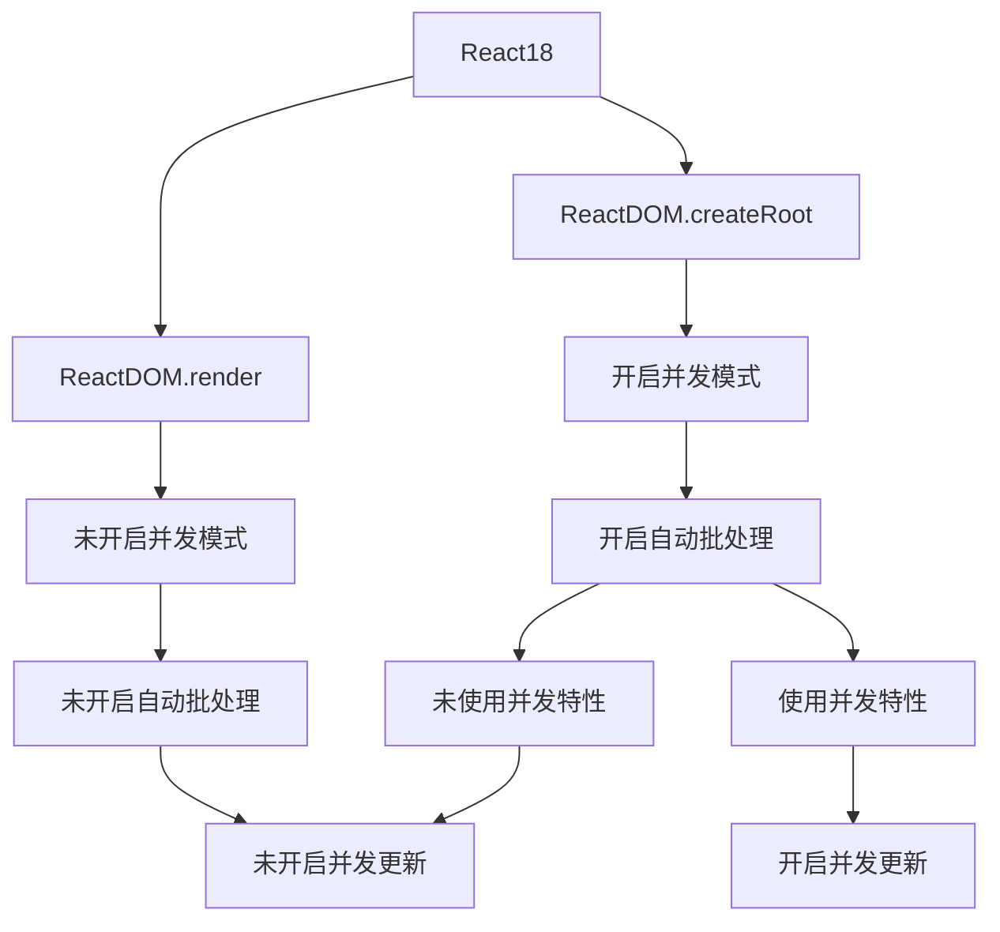

# 新版本特性

## React19 新特性

### 1. Actions

React 19 引入了 **Actions**，通过支持异步函数来管理数据变更、加载状态、错误处理和乐观更新（optimistic updates），使复杂逻辑的处理变得更加简单。

- **自动管理 Pending 状态**：使用 `useActionState` 和 `useFormStatus` 等新钩子轻松处理表单的加载状态。
- **内置乐观更新支持**：通过 `useOptimistic` 实现实时数据更新。
- **更智能的错误处理**：集成错误边界，简化错误回退逻辑。

```jsx
function ChangeName({ currentName }) {
  const [error, submitAction, isPending] = useActionState(async (prev, formData) => {
    const error = await updateName(formData.get("name"));
    if (error) return error;
    return null;
  });

  return (
    <form action={submitAction}>
      <input type="text" name="name" defaultValue={currentName} />
      <button type="submit" disabled={isPending}>Update</button>
      {error && <p>{error}</p>}
    </form>
  );
}
```


### 2. 原生支持 Document Metadata

React 19 原生支持 `<title>`、`<meta>` 和 `<link>` 等文档元数据标签。这些标签可直接在组件中声明，React 会自动将它们提升至 `<head>`，并确保与服务端渲染和客户端渲染兼容。

这样可以直接 简化 SEO 和元数据管理逻辑，并且不需要像以前一样手动插入标签了

```jsx
javascript 代码解读复制代码function BlogPost({ post }) {
  return (
    <article>
      <h1>{post.title}</h1>
      <title>{post.title}</title>
      <meta name="author" content={post.author} />
    </article>
  );
}
```


### 3. 支持样式表优先级管理

React 19 增强了样式表的加载管理，通过指定 `precedence` 属性，React 可以动态调整样式表的插入顺序，确保正确的样式覆盖。

```jsx
javascript 代码解读复制代码function Component() {
  return (
    <div>
      <link rel="stylesheet" href="styles.css" precedence="high" />
      <p>Styled Content</p>
    </div>
  );
}
```


### 4. Server Components 的稳定支持

Server Components 提供了一种全新的组件渲染模式，在服务器上提前渲染，减少了客户端的渲染负担。React 19 将此功能推向稳定，并引入了相关的 API 和最佳实践。

- 支持在构建时或请求时生成组件。
- 无需引入额外的工具链，即可与现有 React 项目集成。


### 5. 更好的错误展示系统

React 19 改进了错误日志系统，减少了重复日志，并添加了更详细的调试信息。例如，对于 SSR 和客户端渲染不匹配的问题，提供了差异化日志。

- 单一错误消息：减少日志冗余。
- 支持 `onCaughtError` 和 `onUncaughtError` 回调，增强了错误管理能力。


### 6. 支持 `<Context>` 简写

React 19 引入了更简洁的 Context 写法，现在可以直接使用 `<Context>` 代替 `<Context.Provider>`：

```jsx
const ThemeContext = createContext('');
function App({children}) {
  return <ThemeContext value="dark">{children}</ThemeContext>;
}
```

### 7. Async 脚本和资源预加载支持

React 19 为 `<script>` 标签添加了异步加载支持，同时优化了资源的预加载和预初始化功能。

- 异步脚本加载：允许在组件内部声明脚本，并由 React 自动去重。
- 预加载 API：通过 preload 和 preinit 指定浏览器提前加载的资源。

```jsx
import { preinit, preload } from 'react-dom';

function MyComponent() {
  preinit('https://example.com/script.js', { as: 'script' });
  preload('https://example.com/font.woff', { as: 'font' });
}
```


### 8. `use` API

React 19 引入了全新的 `use API`，用于在渲染期间读取资源。use() 是 React19 提升异步开发体验最重要的 hook。也是让 useEffect 重要性大幅度削弱的主要原因。

#### 读取直接创建的Promise中的值

例如，我们可以利用 use 读取完成状态的 Promise 中的值。也可以使用 use 读取 context 中的资源。

```react
import React from 'react'
import { use } from 'react'
import { resolve } from 'styled-jsx/css'

const page = () => {
  // 已完成状态的 Promise
  const api2 = new Promise((resolve)=>{
    resolve({value:2})
  });
  const result = use(api2);
  console.log(result); // 可以成功读取到值：{value:2}
  
  return (
    <div>
      <h1>{result.value}</h1>
    </div>
  )
}

export default page;
```

#### 读取未直接创建的Promise中的值

如果直接使用 use 获取未直接创建的 Promise 中的值，会抛出一个异常

```react
function _api3() {
  return new Promise((resolve) => {
    resolve({ value: '_api3' });
  });
}

const result = use(_api3()); // 会报错，无法拿到值
```

但是实际上在开发过程中，大多数情况都是这种并没有直接得到 `Promise resolve` 的结果状态，这个时候我们可以利用 `Suspense` 来捕获这种异常：

```react
import { Suspense, use } from 'react';
import Message from './Message';

function _api3() {
  return new Promise((resolve) => {
    resolve({ value: 'React does not preserve any state for renders that got suspended before they were able to mount for the first time. When the component has loaded, React will retry rendering the suspended tree from scratch.' });
  });
}

export default function Demo01() {
  const promise = _api3();
  return (
    // 2.使用 Suspense 包裹捕获该组件的错误，防止错误溢出到更高层级的组件。
    <Suspense fallback="骨架屏 Skeleton 组件"> 
      // 3.Suspense 捕获到该异常后，会先渲染 fallback 中设置的组件。然后等promise请求成功之后，use 渲染 Message 组件。
      <Content promise={promise} />
    </Suspense>
  );
}

// 1.定义一个子组件，并在组件上自定义一个属性为promise用于通信，在子组件内部利用props获取到父组件传进来的值，并用use取出props中promise的值。
function Content(props) {
  const { value } = use(props.promise);
  return (
    // 3.当 Message 组件首次渲染时，由于直接读取 promise 会导致报错。
    <Message message={value} />
  );
}
```

在这段代码中，为了让 Suspense 捕获更小范围的组件，我们单独定义了一个子组件 Content 来使用 use 获取 promise 中的数据。

`Suspense` 能够捕获到子组件首次渲染的异常。因此我们常常将 `Suspense` 当成一种组件错误边界来处理。但是需要注意的是，传递给 Suspense 的异步组件必须在报错时返回一个 Promise 对象，它才能正常工作。

在 React 19 中，`use(promise)`被设计成完全符合 Suspense 规范的 hook，因此我们可以轻松的结合他们两者来完成页面开发。


#### 读取context中的内容

#### 在条件判断中使用

和其他 hook 一样，`use()` 必须在函数组件中使用。但是很不一样的是，`use` 可以在循环和条件判断语句中使用。

我们在如下案例来演示这个结论。在这个例子中，`use` 被使用在 `if(!loading)` 条件判断中来获取 `result` 的值。

```react
import { use } from 'react';
import { useState } from 'react';
import Message from './Message';
import Button from './Button';
import Skeleton from './Skeleton';

const _api2 = new Promise((resolve) => {
  resolve({ value: 'Unlike React Hooks, use can be called within loops and conditional statements like if. Like React Hooks, the function that calls use must be a Component or Hook.' });
});

const page = () => {
  const [loading, setLoading] = useState(false);
  let result = { value: '' };
  if (!loading) {
    result = use(_api2);
  }
  return (
    <>
      {loading ? <Skeleton /> : <Message message={result.value} />}
      <div>
        <Button signal onClick={() => setLoading(!loading)}>切换</Button>
      </div>
    </>
  );
}

export default page
```


这种模式允许条件调用，并与 Suspense 结合使用。

- 支持条件调用：突破了传统 Hooks 的调用限制。
- 与 Suspense 深度集成：自动管理异步状态，简化异步渲染逻辑。

```jsx
import { use } from 'react';

function Comments({ commentsPromise }) {
  const comments = use(commentsPromise);
  return comments.map(comment => <p key={comment.id}>{comment}</p>);
}
```

### 9. ref 回调的清理功能

React 19 为 ref 回调增加了清理函数支持，允许在组件卸载时自动执行清理逻辑：

```jsx
<input ref={(ref) => {
  // ref 创建时的逻辑
  return () => {
    // ref 清理时的逻辑
  };
}} />
```


## React18 新特性

[React18 新特性解读 & 完整版升级指南React 18 正式版它来啦！一起来看看 React 18 有哪些新特性 - 掘金](https://juejin.cn/post/7094037148088664078)

注意：`React 18` 已经放弃了对 `ie11` 的支持，将于 `2022年6月15日` 停止支持 `ie`，如需兼容，需要回退到 `React 17` 版本。

React 18 中引入的新特性是使用现代浏览器的特性构建的，在IE中无法充分polyfill，比如`micro-tasks`.

### 1. createRoot API

改变根节点的挂载方式使用新的 API `createRoot`，使用旧的 API 仍然兼容，只有在使用 `createRoot` 了之后才会有 React 18 的新特性。

```js
// React 17
import React from 'react';
import ReactDOM from 'react-dom';
import App from './App';

const root = document.getElementById('root')!;
ReactDOM.render(<App />, root);

// React 18
import React from 'react';
import ReactDOM from 'react-dom/client';
import App from './App';

const root = document.getElementById('root')!;
ReactDOM.createRoot(root).render(<App />);
```

同时，在卸载组件时，我们也需要将 `unmountComponentAtNode` 升级为 `root.unmount`:

```js
// React 17
ReactDOM.unmountComponentAtNode(root);

// React 18
root.unmount();
```

除此之外，`React 18` 还从 `render` 方法中删除了`回调函数`，因为当使用`Suspense`时，它通常不会有预期的结果。

在新版本中，如果需要在 `render` 方法中使用回调函数，我们可以在组件中通过 `useEffect` 实现：

```js
// React 17
const root = document.getElementById('root')!;
ReactDOM.render(<App />, root, () => {
  console.log('渲染完成');
});

// React 18
const AppWithCallback: React.FC = () => {
  useEffect(() => {
    console.log('渲染完成');
  }, []);
  return <App />;
};
const root = document.getElementById('root')!;
ReactDOM.createRoot(root).render(<AppWithCallback />);
```

最后，如果你的项目使用了`ssr`服务端渲染，需要把`hydration`升级为`hydrateRoot`：

```js
// React 17
import ReactDOM from 'react-dom';
const root = document.getElementById('root');
ReactDOM.hydrate(<App />, root);

// React 18
import ReactDOM from 'react-dom/client';
const root = document.getElementById('root')!;
ReactDOM.hydrateRoot(root, <App />);
```


### 2. 自动批处理

批处理是指为了获得更好的性能，在数据层，将`多个状态更新`批量处理，合并成`一次更新`（在视图层，将`多个渲染`合并成`一次渲染`）。

- 在 18 之前，只有在react事件处理函数中，才会自动执行批处理，其它情况会多次更新。
- 在 18 之后，任何情况都会自动执行批处理，多次更新始终合并为一次。

#### React18之前

在`React 18 之前`，我们只在 `React 事件处理函数` 中进行批处理更新。

> 在 React 中，事件处理函数是用于响应用户交互（如点击、输入、鼠标移动等）的函数。
>
> - 事件处理函数通常以 `handle` 开头，例如 `handleClick`、`handleInputChange` 等。
> - 传递给事件属性的函数名通常以 `on` 开头，例如 `onClick`、`onChange` 等。

```tsx
import React, { useState } from 'react';

// React 18 之前
const App: React.FC = () => {
  console.log('App组件渲染了！');
  const [count1, setCount1] = useState(0);
  const [count2, setCount2] = useState(0);
  return (
    <button
      onClick={() => {
        setCount1(count => count + 1);
        setCount2(count => count + 1);
        // 在React事件中被批处理：即两个状态一起更新，且App组件只渲染一次。
      }}
    >
      {`count1 is ${count1}, count2 is ${count2}`}
    </button>
  );
};

export default App;
```

默认情况下，在`promise`、`setTimeout`、`原生事件处理函数`中、或`任何其它事件内`的更新都不会进行批处理：

```tsx
import React, { useState } from 'react';

// React 18 之前
const App: React.FC = () => {
  console.log('App组件渲染了！');
  const [count1, setCount1] = useState(0);
  const [count2, setCount2] = useState(0);
  return (
    <div
      onClick={() => {
        setTimeout(() => {
          setCount1(count => count + 1);
          setCount2(count => count + 1);
        });
        // 在 setTimeout 中不会进行批处理：两个状态分别更新，渲染了两次App组件
      }}
    >
      <div>count1： {count1}</div>
      <div>count2： {count2}</div>
    </div>
  );
};

export default App;
```

#### React18中

在 `React 18` 中上面的例子都只会有一次 `render`渲染，因为所有的更新都将自动批处理。这样无疑是很好的提高了应用的整体性能。但下面在事件处理函数中用到异步的例子会在 `React 18` 中执行两次 render：

```tsx
import React, { useState } from 'react';

// React 18
const App: React.FC = () => {
  console.log('App组件渲染了！');
  const [count1, setCount1] = useState(0);
  const [count2, setCount2] = useState(0);
  return (
    <div
      onClick={async () => {
        await setCount1(count => count + 1);
        setCount2(count => count + 1);
      }}
    >
      <div>count1： {count1}</div>
      <div>count2： {count2}</div>
    </div>
  );
};

export default App;
```

#### flushSync

自动批处理是一个`破坏性改动`，如果你想不执行批量更新，你可以使用 `flushSync`：

```tsx
import React, { useState } from 'react';
import { flushSync } from 'react-dom';

const App: React.FC = () => {
  const [count1, setCount1] = useState(0);
  const [count2, setCount2] = useState(0);
  const [count3, setCount3] = useState(0);
  return (
    <div
      onClick={() => {
        // 第一次更新
        flushSync(() => {
          setCount1(count => count + 1);
        });
        
        // 第二次更新，内部两个仍为批量更新
        flushSync(() => {
          setCount2(count => count + 1);
          setCount3(count => count + 1);
        });
      }}
    >
      <div>count1： {count1}</div>
      <div>count2： {count2}</div>
      <div>count3： {count3}</div>
    </div>
  );
};

export default App;
```

注意：**`flushSync` 函数内部的多个 `setState` 仍然为批量更新**，这样可以精准控制哪些不需要的批量更新。

### 3. 严格模式更新

不再抑制控制台日志：

当你使用`严格模式`时，React 会对每个组件进行`两次渲染`，以便你观察一些意想不到的结果。在 `React 17` 中，取消了`其中一次渲染`的控制台日志，以便让日志更容易阅读。

### 4. 并发更新渲染机制

并发渲染本身并不是一个功能。它是一个新的底层机制，使得 React 能够同时准备多个版本的 UI。

并发模式的一个关键特性是渲染可中断。在之前的版本中，更新内容渲染的方式是通过一个单一的且不可中断的同步事务进行处理。同步渲染意味着，一旦开始渲染就无法中断，直到用户可以在屏幕上看到渲染结果。

而在并发更新渲染中，react会在整个 DOM 树被计算完毕前一直等待，完毕后再执行 DOM 变更。这样做，React 就可以在后台提前准备新的屏幕内容，而不阻塞主线程。这意味着用户输入可以被立即响应，即使存在大量渲染任务，也能有流畅的用户体验。

要判断React18中是否开启了并发更新，可以根据下面的流程图：



### 5. 并发特性

#### 过渡更新 Transition

Transition 是由并发渲染提供支持的新特性之一。它旨在与现有状态管理 API 一起使用，以区分`紧急`和`非紧急`状态更新。通过这种方式，React 知道哪些更新需要优先考虑，哪些更新需要在后台通过并发渲染准备。

使用场景：

要知道何时使用 transition，你必须更好地了解用户是如何与你的应交互的。例如，在字段中键入或单击按钮是用户期望立即获得响应的操作——响应可能是出现在文本字段中的一个值，或是要打开的某个菜单。但对于搜索、加载或处理数据（例如搜索栏、图表、过滤表等）这些事情，用户也会期望它们需要一些时间来完成。后者就是你使用 transition 的场景了。

使用方法：

可以使用 `useTransition()` 钩子来创建一个 `transition`。这个钩子返回一个函数`startTransition()`来启动一个 `transition`，还有一个挂起的指示器`isPending`来通知你 `transition` 的进度：

```react
import { useTransition, useState } from "react";

const App = () => {
  // hook函数的声明
  const [isPending, startTransition] = useTransition();
  const [value, setValue] = useState(0);

  // 在事件处理函数中使用startTransition()，将其包裹的内容赋予低优先级
  function handleClick() {
    startTransition(() => {
      setValue((value) => value + 1);
    });
  }

  return (
    <div>
      {isPending && <Loader />}
      <button onClick={handleClick}>{value}</button>
    </div>
  );
};
```

在 `startTransition()` 回调中提交的任何状态更新都将被标记为 `transition`，从而使其他更新具有优先权。

如果你不能使用 `useTransition()` 这个钩子，还有一个单独的 `startTransition()` 函数API可用，但它不会通知你转换的进度。如，对于下面的React18代码，由于 `setList` 在 `startTransition()` 的回调函数中执行（使用了`并发特性`），所以 `setList` 会触发`并发更新`。简单来说，就是被 `startTransition` 回调包裹的 `setState` 触发的渲染被标记为不紧急渲染，这些渲染可能被其他`紧急渲染`所抢占。

```tsx
import React, { useState, useEffect, useTransition } from 'react';

const App: React.FC = () => {
  const [list, setList] = useState<any[]>([]);
  const [isPending, startTransition] = useTransition();
  useEffect(() => {
    // 使用了并发特性，开启并发更新
    startTransition(() => {
      setList(new Array(10000).fill(null));
    });
  }, []);
  return (
    <>
      {list.map((_, i) => (
        <div key={i}>{i}</div>
      ))}
    </>
  );
};

export default App;
```


#### useDeferredValue

`useDeferredValue` 是一个新的函数API，可以将某个状态值的更新延迟一段时间后再执行，从而提高应用程序的性能和用户体验。该函数会返回一个延迟响应的值，可以让一个`state` 延迟生效，只有当前没有紧急更新时，该值才会变为最新值。`useDeferredValue()` 和 `startTransition()` 一样，都是标记了一次非紧急更新。

`useDeferredValue` 与 `useTransition`的区别：

- 相同：`useDeferredValue` 本质上和内部实现与 `useTransition` 一样，都是标记成了`延迟更新`任务。
- 不同：`useTransition` 是把更新任务变成了延迟更新任务，而 `useDeferredValue` 是产生一个新的值，这个值作为延时状态。（一个用来包装方法，一个用来包装值）

所以，上面 `startTransition` 的例子，我们也可以用 `useDeferredValue` 来实现：

```tsx
import React, { useState, useEffect, useDeferredValue } from 'react';

const App: React.FC = () => {
  const [list, setList] = useState<any[]>([]);
  useEffect(() => {
    setList(new Array(10000).fill(null));
  }, []);
  // 使用了并发特性，开启并发更新
  const deferredList = useDeferredValue(list);
  return (
    <>
      {deferredList.map((_, i) => (
        <div key={i}>{i}</div>
      ))}
    </>
  );
};

export default App;
```

### 6. Suspense更新

在 `React 18` 的 `Suspense` 组件中，官方对 `空的fallback` 属性的处理方式做了改变：不再跳过 `缺失值` 或 `值为null` 的 `fallback` 的 `Suspense` 边界。相反，会捕获边界并且向外层查找，如果查找不到，将会把 `fallback` 呈现为 `null`。

**更新前：**

以前，如果你的 `Suspense` 组件没有提供 `fallback` 属性，React 就会悄悄跳过它，继续向上搜索下一个边界：

```jsx
// React 17
const App = () => {
  return (
    <Suspense fallback={<Loading />}> // <--- 这个边界被使用，显示 Loading 组件
      <Suspense>                      // <--- 这个边界被跳过，没有 fallback 属性
        <Page />
      </Suspense>
    </Suspense>
  );
};

export default App;
```


**更新后：**

现在，React将使用当前组件的 `Suspense` 作为边界，即使当前组件的 `Suspense` 的值为 `null` 或 `undefined`：

```jsx
// React 18
const App = () => {
  return (
    <Suspense fallback={<Loading />}> // <--- 不使用
      <Suspense>                      // <--- 这个边界被使用，将 fallback 渲染为 null
        <Page />
      </Suspense>
    </Suspense>
  );
};

export default App;
```

这个更新意味着我们`不再跨越边界组件`。相反，我们将在边界处捕获并呈现 `fallback`，就像你提供了一个返回值为 `null` 的组件一样。这意味着被挂起的 `Suspense` 组件将按照预期结果去执行，如果忘记提供 `fallback` 属性，也不会有什么问题。


# JSX基础

JSX 是 JavaScript XML 的缩写，它是一种 JavaScript 的语法扩展。简单来说，它允许我们在 JavaScript 代码中编写类似 HTML 的结构。这种语法看起来像是在 JavaScript 中直接写 HTML，但实际上它既不是JavaScript 也不是 HTML。虽然 JSX 看起来像模板语言，但它的本质是语法糖。所有的 JSX 最终都会被转译器（如 Babel）转换为普通的 JavaScript 函数调用。

**为什么React选择使用JSX？**

- React 的核心哲学之一是**声明式编程**。与命令式编程（描述"如何做"）不同，声明式编程关注"做什么"。JSX 完美契合了这一理念。
- JSX 代码更接近最终的 DOM 结构，一目了然。这种直观性显著提高了代码的可读性和开发效率。
- React 的另一个核心理念是**组件化**。JSX 为组件提供了自然的语法表示，这种嵌套结构与最终渲染的 UI 结构高度一致，使得组件组合变得直观而简单。


## JS表达式

在JSX中可以通过`大括号{}`识别JavaScript中的表达式，比如常见的变量、函数调用、方法调用等等。

```jsx
// App.js
const number = 100

function getName() {
	return "GG"
}

function App() {
	return(
		<div className="App">
            this is App
            {/*1.使用引号传递字符串*/}
            {"This is a strings."}
            {/*2.使用JavaScript变量*/}
            {number}
            {/*3.函数调用和方法调用*/}
            {getName(); new Date().getDate()}
            {/*4.使用JavaScript对象*/}
            <div style={{ color: "red" }}>This is a div.</div>
        </div>
	)
}
```


## JSX列表渲染

在JSX中可以使用原生JS中的map方法遍历渲染列表

```jsx
const list = [
	{id:101, name:"ming"},
	{id:102, name:"tian"},
	{id:103, name:"doinb"}
]

function App() {
    return(
        <div className="App">
            this is App
            {/*渲染列表*/}
            <ul>
                {/*列表遍历渲染时通常需要一个唯一的值做绑定标记*/}
                {list.map(item => <li key={item.id}>{item.name}</li>)}
            </ul>
        </div>
    )
}
```


## JSX条件渲染

条件渲染是指根据不同的条件，渲染不同的模板。比如一个函数查看用户是否登录，若登录就显示其用户名，反之则显示“请登录”。

在React中，可以通过逻辑与运算符&&、三元表达式(?:)实现基础的条件渲染。

```jsx
const flag = true
const loading = true

function App() {
    return(
        <div className="App">
            {/*若flag为true，则渲染后面的<span>*/}
            {flag && <span>this is span</span>}

            {/*若loading为true，则渲染“loading...”，否则渲染“this is span”*/}
            {loading ? <span>loading...</span> : <span>this is span</span>}
        </div>
    )
}
```


对于复杂的条件渲染，可以通过自定义函数+if判断语句来实现。比如实现下面的需求：

列表中需要根据文章状态适配三种情况，单图，三图，和无图三种模式

```jsx
// 定义文章的类型
const artcleTypes = [0, 1, 3]

// 定义判断函数，根据不同的文章类型返回不同的JSX模板
function getType(artcleType) {
    if(artcleType === 0) {
        return <div>无图</div>
    }else if(artcleType === 1) {
        return <div>单图</div>
    }else {
        return <div>三图</div>
    }
}

function App() {
	return(
        <div className="App">
            {/*调用判断函数来渲染不同的模板*/}
            {getType(artcleTypes[0])}
		</div>
    )
}
export default App
```


# React基础

## React命名规范

### 组件命名的基本原则

一个组件就是用户界面的一部分，它可以有自己的逻辑和外观，组件之间可以互相嵌套，也可以复用多次。

1. **大写字母开头**：React官方推荐组件名称以大写字母开头。这是因为在JSX中，大写字母开头的标签被视为自定义组件，而小写字母开头的标签被视为原生HTML标签。
2. **PascalCase命名方式**：组件名称应采用PascalCase（驼峰命名法），即每个单词的首字母都大写，如`MyComponent`。
3. **文件名与组件名一致**：文件名应与导出的组件名称保持一致，便于查找和维护。例如，`MyButton`组件应放在`MyButton.js`文件中。
4. 对于页面或根组件，建议使用`export default`进行默认导出，以保证名称一致性。
5. 对于其他组件，建议使用`export const`进行具名导出，便于按需使用且避免命名冲突。
6. **分类组织**：建议按功能或模块对组件进行分类，组织在不同的文件夹中。例如，所有与用户相关的组件可以放在`components/User`文件夹中。


### 为什么组件使用大写字母开头

1. **区分自定义组件和原生HTML标签**。在JSX中，使用大写字母开头的命名约定有助于区分自定义组件和原生HTML标签。例如：

   ```jsx
      <div>这是一个原生HTML标签</div>  
      <MyComponent>这是一个自定义组件</MyComponent>  
   ```

   这种区分使得代码更加直观，减少了混淆的可能性。

2. **避免命名冲突**。使用大写字母开头可以减少与全局变量或内置对象的命名冲突。例如，如果你有一个组件叫`div`，它可能会与HTML的`<div>`标签冲突，从而导致不可预见的错误。而`DivComponent`则不会产生这种问题。

3. **提高代码可读性**。大写字母开头的命名方式使得组件名称在代码中更加突出，提高了代码的可读性。


## 类组件

类组件是 React 中用于定义组件的传统方式，通过继承 `React.Component` 或 `React.PureComponent` 来实现。然后在类组件中还需要一个`render()`方法，用于返回HTML代码。然后把类名写成标签后就可以使用类组件了。然后组件的属性需要放在构造函数中的`this.state`状态对象中，当 `state` 对象发生变化时，组件会重新渲染，要更改状态对象中的值需要使用`this.setState()`方法。

类组件通常包含继承和构造函数，this，生命周期和render方法这几个内容。

```jsx
class Demol extends React.Component{
    constructor(props) {
        super(praps);
		this.state={date: new Date()};
    }
    
	timerID = null;
    tick() {
        this.setState({
            date: new Date(),
        });
    }
        
	componentDidMount() {
		this.timerID=setInterval(()=> this.tick()，1000);
    }

	componentWillUnmount() {
        clearInterval(this.timerID);
    }

	render() {
		return (
			<div>
				<h1>Hello, world!</h1>
                <h2>It is {this.state.date.toLocaleTimestring()}.</h2>
            </div>
		);
    }
}
```

### 类组件的生命周期

React 中的每个组件都有一个生命周期，您可以在其三个主要阶段对其进行监控和操作。

三个阶段是:**安装**、**更新**和**卸载**。

#### 挂载

挂在意味着将元素放入 DOM。

React 有四个内置方法，在安装组件时按此顺序调用:

1. `constructor()`
2. `getDerivedStateFromProps()`
3. `render()`
4. `componentDidMount()`方法会在组件已经被渲染到 DOM 中后运行

`render()` 方法是必需的并且总是被调用，其他是可选的，如果你定义了它们就会被调用。

#### 更新

只要组件的 `state` 或 `props` 发生变化，组件就会更新。

React 有五个内置方法，在组件更新时按此顺序调用:

1. `getDerivedStateFromProps()`
2. `shouldComponentUpdate()`
3. `render()`
4. `getSnapshotBeforeUpdate()`
5. `componentDidUpdate()`

`render()` 方法是必需的并且总是被调用，其他是可选的，如果你定义了它们就会被调用。

#### 卸载

当一个组件在页面中不显示，则可以认为它被卸载掉了。

生命周期的下一个阶段是从 DOM 中删除组件，或者 `unmounting` 卸载， React 喜欢这样称呼它。

React 只有一个内置方法，在卸载组件时会被调用:

- `componentWillUnmount()`


### 类组件的不足

**状态逻辑难复用：** 在组件之间复用状态逻辑很难，可能要用到 **render props** （**渲染属性**）或者 **HOC**（**高阶组件**），但无论是渲染属性，还是高阶组件，都会在原先的组件外包裹一层父容器（一般都是 div 元素），**导致层级冗余**

**趋向复杂难以维护：**

- 在生命周期函数中混杂不相干的逻辑（如：在 `componentDidMount` 中注册事件以及其他的逻辑，在 `componentWillUnmount` 中卸载事件，这样分散不集中的写法，很容易写出 bug ）
- 类组件中到处都是对状态的访问和处理，导致组件难以拆分成更小的组件

**this 指向问题**：父组件给子组件传递函数时，必须绑定 this

- react 中的组件四种绑定 this 方法的区别

  - 第一种是**在构造函数中绑定 this**：那么每次父组件刷新的时候，如果传递给子组件其他的 props 值不变，那么子组件就不会刷新；

  - 第二种是**在 render() 函数里面绑定 this**：因为 **bind 函数会返回一个新的函数**，所以每次父组件刷新时，都会重新生成一个函数，即使父组件传递给子组件其他的 props 值不变，子组件每次都会刷新；

  - 第三种是**使用箭头函数**：父组件刷新的时候，即使两个箭头函数的函数体是一样的，都会生成一个新的箭头函数，所以子组件每次都会刷新；

  - 第四种是**使用类的静态属性：原理和第一种方法差不多，比第一种更简洁**

    

类组件基类extends

未实现 shouldComponentUpdate()，内置了prsps 和state 浅层对比
高阶组件，仅比较props 变更
创建并返回 React 元素，不使用JSX场景
克隆并返回新 React 元素，并且可以为新元素添加额外 propsmap遍历并返回:forEach仅遍历;count子组件数量;only是否只有一个子节点创建一个ref，并附加到具体元素上，class 组件中获取dom结构常用转发ref 或者与useImperativeHandler 联合使用暴露方法
实现组件动态加载
组件加载过程优雅降级


## 函数式组件

在React中，一个函数组件就是首字母大写的函数，内部存放了组件的逻辑和视图UI，渲染组件只需要把组件当成标签书写即可。

```jsx
// 1.定义组件。可以用函数声明方式或箭头函数的方式
function Button() {
    // 组件业务逻辑
    return <button>可点击的按钮</button>
}

const Button1 = () => {
    return <button>可点击的按钮</button>
}

function App() {
	return(
        <div className="App">
            {/* 2.使用组件。有自闭合方式和成对标签方式 */}
            <Button />
            <Button></Button>
		</div>
    )
}
```


## 组件的样式处理

React组件的基础样式控制的方式有两种：**行内样式**和**class类名控制**。

```css
// 样式文件，index.css或index.less(Less是css的扩展语言)
.App{
	backgrandColor: green;
}

.foo{
    color: red;
    fontSize: 50px;
}
```

在React中类型用`className`标识而不是html中的`class`，原因是`class`在React中是关键字。

```jsx
// index.jsx
import './index.css'
function App() {
	return(
        <div className="App">
            <span className="foo"></span>
		</div>
    )
}
```


# Hooks

Hooks 是 React 16.8 新增的特性，它可以让你在不编写 class 的情况下使用 state 以及其他的 React 特性。它的出现是为了解决类组件的不足。

**Hooks的优势：**

- 能优化类组件的三大问题；
- 能在无需修改组件结构的情况下复用状态逻辑（自定义 Hooks ）；
- 能将组件中相互关联的部分拆分成更小的函数（比如设置订阅或请求数据）；
- **副作用的关注点分离**：**副作用指那些没有发生在数据向视图转换过程中的逻辑，如 `ajax` 请求、访问原生`dom` 元素、本地持久化缓存、绑定/解绑事件、添加订阅、设置定时器、记录日志等**。以往这些副作用都是写在类组件生命周期函数中的。而 `useEffect` 在全部渲染完毕后才会执行，`useLayoutEffect` 会在浏览器 `layout` 之后，`painting` 之前执行。

## useState

useState是一个React Hook(函数)，它允许我们向组件添加一个**状态变量**，从而控制影响组件的渲染结果，它返回一个由状态变量和一个更新该状态的函数组成的数组。和普通JS变量不同的是，**状态变量**一旦发生变化，组件的视图Ul也会跟着变化，即数据驱动视图的概念。

```jsx
// 语法如下：
const [count, setCount] = useState(0)
/* 解释：
	1.useState是一个函数，返回值是一个数组。
	2.数组中的第一个参数是状态变量，第二个参数是set函数，用来修改状态变量的值。
	3.useState函数中的参数将作为count的初始值。
*/
```

练习：实现count自增按钮计数器。

```jsx
import {useState} from "react"

function clickCount() {
    setCount(count + 1)
}

function App() {
    const [count, setCount] = useState(0)
	return(
        <div className="App">
            <Button onClick=clickCount>Click counter, the count is {count}</Button>
		</div>
    )
}
```

useState修改状态的规则：在React中，状态变量被认为是只读的，我们应该始终替换它而不是修改它，直接修改状态变量不能引发视图更新。

```
// 直接修改不能使视图更新，但可以使变量的值真实变化。即console.log(count)的结果是1，2，3...
count++
// 应该通过函数将新值替换掉。
setCount(count + 1)
```

修改对象状态变量

```jsx
// 定义一个person对象，其中有两个属性，并进行了初始化
const [person, setPerson] = useState({name:"white",age:18})

// 定义错误的对象状态变量修改函数
const wrongHandleChangName = () => {
    // 这样直接修改虽然使得name属性确实是black，但无法自动渲染到页面中，即直接修改状态变量不能引发视图更新。
    person.name = "black"
}

// 正确的对象状态变量修改函数
const rightHandleChangeName = () => {
    // 使用对象展开运算符 ... 来创建person对象的一个新副本，并修改name属性为"black"，React可以识别状态的变化并重新渲染组件。
    setPerson({
        ...person,
        name:"black"
    })
}
```


> 对象展开运算符 `...` 是一个在 ECMAScript 2015（ES6）中引入的语言特性，它允许你在 JavaScript 中进行对象的浅拷贝、合并对象以及在函数调用时扩展参数。以下是对象展开运算符的一些常见用途：
>
> 1. 浅拷贝对象
> 你可以使用对象展开运算符来创建一个对象的浅拷贝。浅拷贝意味着对象的直接属性被复制，但如果属性值是对象或数组，那么拷贝的只是引用，而不是深层的副本。
>
> ```javascript
> const original = { a: 1, b: 2 };
> const copy = { ...original };
> console.log(copy); // { a: 1, b: 2 }
> ```
>
> 2. 合并对象
> 对象展开运算符可以用于合并两个或多个对象，结果是一个新的对象，包含了所有源对象的属性。
>
> ```javascript
> const obj1 = { a: 1, b: 2 };
> const obj2 = { b: 3, c: 4 };
> const merged = { ...obj1, ...obj2 };
> console.log(merged); // { a: 1, b: 3, c: 4 }
> ```
>
> 注意，如果对象有相同的属性，后面的对象会覆盖前面的对象的属性。
>
> 3. 在函数调用中扩展参数
> 对象展开运算符可以在函数调用时用来扩展对象参数，这在处理函数的默认参数或传递多个参数时非常有用。
>
> ```javascript
> function printCoordinates({ x, y }) {
>   console.log(`x: ${x}, y: ${y}`);
> }
> 
> const coordinates = { x: 10, y: 20 };
> printCoordinates({ ...coordinates });
> ```
>
> 4. 与解构赋值一起使用
> 对象展开运算符可以与解构赋值一起使用，允许你从对象中提取属性并创建一个新的对象。
>
> ```javascript
> const { a, ...rest } = { a: 1, b: 2, c: 3 };
> console.log(rest); // { b: 2, c: 3 }
> ```
>
> 5. 在数组中使用
> 虽然对象展开运算符主要用于对象，但它也可以在数组中使用，用于合并数组或在数组字面量中扩展元素。
>
> ```javascript
> const array1 = [1, 2];
> const array2 = [3, 4];
> const combined = [...array1, ...array2, 5];
> console.log(combined); // [1, 2, 3, 4, 5]
> ```
>
> 注意事项：
> - **浅拷贝**：对象展开运算符进行的是浅拷贝，这意味着如果对象的属性值是数组或对象，那么拷贝的只是引用。如果你需要深拷贝，可能需要使用其他方法或库。
> - **属性覆盖**：在合并对象时，如果存在相同的属性，后面的属性会覆盖前面的属性。
> - **性能考虑**：在性能敏感的应用中，过度使用对象展开运算符可能会导致性能问题，因为它会创建更多的对象。

### 惰性初始化

惰性初始化即将函数作为初始值传入。

有时，组件可能需要通过计算生成状态的初始值。例如，组件被传入来自legacy存储系统中的一个错综复杂的数据串，并且需要从错综复杂的数据中提取有用的信息。解析该数据串可能需要一段时间，而你想一次性地完成该工作。以下代码描述了一种比较耗费资源的方法：

```jsx
function untangle(aFrayedKnot){
  //perform expensive untangling manoeuvers
  return nugget;
}
function ShinyComponent({tangledweb}){
	const [shiny, setShiny] = useState(untangle(tangledweb));
	//use shiny value and allow new shiny values to be set
}
```

当 ShinyComponent 运行时，可能是为了响应另一个状态值的设置，高开销的 untangle 函数也会运行。但是useState仅在第一次调用时使用其初始值参数。在第一次调用之后，它不会再使用 untangle 返回的值。反复运行高开销的 untangle 函数比较费时。

幸运的是，useStatehook可以接收一个函数作为它的参数，该参数是一个惰性的初始状态，React 仅在组件第一次被渲染时执行该函数，它将使用该函数的返回值作为初始值：

```jsx
function untangle(aFrayedKnot){
  //perform expensive untangling manoeuvers
  return nugget;
}
function ShinyComponent({tangledweb}){
	const [shiny, setShiny] = useState(() => untangle(tangledweb));
	//use shiny value and allow new shiny values to be set
}
```

**惰性初始化的优势：**

- 由于第二种方法使用了函数式初始化，这使得该函数仅会在组件首次渲染时执行一次，而第一种写法 `useState(untangle(tangledweb))` 会在每次组件渲染时都重新执行该函数。
- 当 untangle() 是昂贵计算时（如复杂对象操作/数据处理），第一种写法每次渲染都会重复计算，即使结果未被使用；第二种写法避免了重复计算，提升渲染性能。
- 即使 untangle() 返回的是简单值，使用函数初始化也能避免：
  - 在 Fast Refresh 热更新时的意外重新初始化
  - 在服务端渲染（SSR）时可能出现的重复计算

### 函数式更新

即在更新状态变量时依赖之前的状态变量值。在`setUseState()`中可以传入一个函数，使得更新的值依赖上一个值。

由于状态更新是异步的且会进行批量更新，所以同时多次set无法让状态变量依次改变，只会同时改变为同样的值，这时通过函数式更新，你可以确保每次状态变更都基于最新的准确值，避免因 React 的异步批量更新特性导致的意外行为。

```jsx
const [count, setCount] = useState();
const handleClick = () => {
  setCount(prev => prev++);
}
```

### 为什么使用数组接收而不是对象

因为数组形式相对来讲更方便，具体有以下几点：

- 数组解构自定义命名更方便；如果是对象形式，命名必须和useState函数内部返回的对象的key同名，虽然也可以重命名，但不如数组方便。
- 也正是由于命名方便，所以在多Hook调用时代码更简洁。

## useReducer

当有多个相关联的状态时，使用reducer可以更容易地修改状态和理解状态的变化。

- reducer 通过一种集中的、定义明确的、仅针对状态的 action 帮助管理状态变化。
- reducer 使用 action 并根据先前的状态，生成新的状态，使得涉及多个相关联状态的复杂更新更容易。
- React使用useReducer hook帮助组件明确初始状态,访问当前的状态,并可通过 dispatch action 更新状态，触发重新渲染。
- 分派明确定义的 action,以便更易于跟踪状态的变化和理解组件如何在不同的事件中与状态交互。


`useReducer` 的核心思想是将状态更新逻辑集中到一个函数（称为 `reducer`）中，通过派发 `action` 来触发状态更新。**`useReducer`** 是 React 中用于管理复杂状态的 Hook，适合处理多个操作更新状态的场景。

基本用法：

```react
const [state, dispatch] = useReducer(reducer, initialState, initFunction);
```

- **`reducer`**：一个纯函数，接收当前状态和一个 `action`，返回新的状态。
- **`initialState`**：状态的初始值。
- **`initFunction`**（可选）：一个初始化函数，用于惰性计算初始状态。
- **返回值**：
  - `state`：当前状态。
  - `dispatch`：用于派发 `action` 的函数。


`reducer`函数接收两个参数：

- **当前状态**（`state`）。
- **动作**（`action`），通常是一个对象，包含 `type` 字段和其他数据。

`reducer` 根据 `action.type` 决定如何更新状态，并返回新的状态。

简单计数器代码示例：

```react
function reducer(state, action) {
  switch (action.type) {
    case 'increment':
      return { count: state.count + 1 };
    case 'decrement':
      return { count: state.count - 1 };
    case 'incrementNum':
      return { count: state.count + action.num };
    case 'decrementNum':
      return { count: state.count - action.num };
    case 'reset':
      return { count: 0 };
    default:
      throw new Error(`Unknown action type: ${action.type}`);
  }
}
action = {
  type:'incrementNum', // increment | decrement | reset | incrementNum | decrementNum
  num:'2',
}
// countState = reducer(countState.count, action);

const [countState, dispatch] = useReducer(reducer, {count: 0})

countState = dispactch(action);
```


## useEffect

[【React Hooks 专题】useEffect 使用指南-腾讯云开发者社区-腾讯云](https://cloud.tencent.com/developer/article/2112445)

[一份完整的useEffect指南-CSDN博客](https://blog.csdn.net/hesongGG/article/details/88824592)

`useEffect`是一个React Hook函数，给函数组件增加了操作副作用的能力，即用于在React组件中创建不是由事件引起而是由渲染本身引起的操作（没有发生在数据向视图转换过程中的逻辑），如 `ajax` 请求、强制设置页面标题、访问原生`dom` 元素（测量DOM的宽高和位置）、本地持久化缓存、绑定/解绑事件、添加或取消订阅服务、设置定时器、记录日志等。它跟 class 组件中的 `componentDidMount`、`componentDidUpdate` 和 `componentWillUnmount` 具有相同的用途，只不过被合并成了一个 API。

**语法**：

```jsx
// 函数包括两个参数。第一个参数是一个函数（副作用回调函数），用于执行想要的操作。第二个参数是一个数组，是可选的，在数组中填写要监控的变量。
useEffect(() => {},[])
```

**依赖项参数**：

[React useEffect 两个参数你用对了吗，这也许是最全的使用说明书-CSDN博客](https://blog.csdn.net/Android062005/article/details/125200236)

|     依赖项     |        副作用函数执行时机         |
| :------------: | :-------------------------------: |
|   没有依赖项   |    组件初始渲染+组件更新时执行    |
| 依赖项是空数组 | 只会在组件初始渲染完毕后执行一次  |
| 添加特定依赖项 | 组件初始渲染+特性依赖项变化时执行 |

注意：`useEffect()`第二个参数是浅比较，即对数据所有键（索引）对应的值进行**严格相等比较**。

> 关于引用比较，浅比较和深比较的区别：[我一直以为这就是JS中的浅比较，直到...本文介绍了浅比较，将其与容易混淆的===进行了对比，并结合React.memo - 掘金](https://juejin.cn/post/7170364934889406495)


**副作用函数需求举例**：在组件渲染完毕之后，立刻从服务端获取频道列表数据并显示到页面中。

```jsx
import {useEffect, useState} from 'react'

const URL = "https://baidu.com"

function App() {
    
    const [list, setList] = useState([])
    async useEffect(() => {
        function getURL() {
            const res = await fetch(URL)
            const jsonRes = await res.json()
            console.log(jsonRes)
            setList(jsonRes.data.channles)
        }
        getURL()
    }, [])
	return(
        <div>
            this is app
            <ul>
                {list.map((item) => <li key=item.id>{item.name}</li>})}
            </ul>
		</div>
    )
}
```


**清除副作用：**

在useEffect中编写的由渲染本身引起的对接组件外部的操作，社区也经常把它叫做副作用操作，比如在useEffect中开启了一个定时器，我们想在组件卸载时把这个定时器再清理掉，这个过程就是清理副作用。

清除副作用的函数最常见的执行时机是在组件卸载时自动执行，但这并不是它唯一一次运行该函数，每当组件重新渲染时，如果efect再次运行，React都会在运行efect函数之前调用 cleanup 函数。如果需要再次运行多个 effect，React就会调用所有efect的cleanup函数。清理完成后，React 会根据需要重新运行 effect 函数。

**清除副作用需求举例：**

在Son组件渲染时开启一个定制器，卸载时清除这个定时器。

```jsx
import {useState, useEffect} from 'react'

function Son() {
    useEffect(() => {
        const timer = setInterval(() => {
            console.log('timer is runing...')
        }, 1000)
        
        return () => {
            // 清除副作用函数
            clearInterval(timer)
        }
        
    }, [])
    
    return (
    	<div>Son div</div>
    )
}

function App() {
    const [show, setShow] = useState(true)
    return (
        <div>
            this is app div
            {show && <Son />}
            <button onClick={() => {setShow(false)}}>uninstall Son</button>
        </div>
    )
}

export default App
```


## useContext

`useContext` 用于在多层级的组件之间共享值，简化了上下文状态变量的使用。

使用方法：

- 在provider组件中

  - 导入hook：`import React, { createContext } from "react";`

  - 创建上下文变量并导出：`export const MyContext = createContext();`

  - 用上下文变量组件包裹住子组件：

    ```
    <MyContext.Provider value={value}>
    	<Child />
    </MyContext.Provider>
    ```

- 在consumer组件中

  - 导入hook及上下文变量：

    ```
    import React, { usecontext } from 'react';
    import { MyContext } from './componentA';
    ```

  - 使用上下文变量：

    ```
    const value = useContext(MyContext);
    ```

    

`useContext(AppContext)` 只是让你能够读取 context 的值以及订阅 context 的变化。你仍然需要在上层组件树中使用 `<MyContext.Provider>` 来为下层组件提供 context。

代码示例：

```react
import React, { useContext } from "react";
import ReactDOM from "react-dom";
import "./styles.css";

const AppContext = React.createContext({});

const Navbar = () => {
  const { username } = useContext(AppContext)

  return (
    <div className="navbar">
      <p>AwesomeSite</p>
      <p>{username}</p>
    </div>
  )
}

const Messages = () => {
  const { username } = useContext(AppContext)

  return (
    <div className="messages">
      <h1>Messages</h1>
      <p>1 message for {username}</p>
      <p className="message">useContext is awesome!</p>
    </div>
  )
}

function App() {
  return (
    <AppContext.Provider value={{
      username: 'superawesome'
    }}>
      <div className="App">
        <Navbar />
        <Messages />
      </div>
    </AppContext.Provider>
  );
}

const rootElement = document.getElementById("root");
ReactDOM.render(<App />, rootElement);
```


## useRef

`useRef` 可以在函数组件中创建一个 ref 对象，可用于引用 DOM 元素或保存可变变量，这是一种在渲染的过程中将状态持久化的方式。对于`useState` hook 来说，调用某一个状态的 updater 函数通常意味着会触发重新渲染。而利用 `useRef` hook 可以更新状态的值，但不会改变UI。

```jsx
const refObject = useRef(initialValue);
```

Refs 是 React 提供的用来保存 object 引用的一个解决方案，在函数式组件使用 useRef 创建一个 ref 对象，ref 对象存在一个可直接修改的 current 属性，内容都是存在 current 上。

第一次调用该组件的代码时，React会将传给useRef函数的初始值赋值给ref对象的current属性。在接下来的每次渲染中，React将根据useRef的调用顺序，把相同的这些ref对象分别赋值到各自对应的变量上。可以通过将状态赋值给ref对象的current属性，持久化这些状态。

```jsx
const refl = useRef("Towel");
const ref2 = useRef(42);
refl.current;//"Towel"
ref2.current;//42

refl.current = "Babel Fish";
ref2.current = "1,000,000,000,000";
```

修改ref对象的 current 属性不会触发重新渲染。这是因为 `useRef` 返回的 ref 对象在组件的整个生命周期内保持不变，也就是说每次重新渲染函数组件时，返回的 ref 对象都是同一个（使用 `React.createRef `，每次重新渲染组件都会重新创建 ref ），当该组件再次被执行时，便可以访问到状态最新的值。

**使用流程：**

1. 使用 `useRef` 创建 ref 对象（useRef 是函数 hooks， class 组件使用 `React.createRef() `创建 ）。
2. 赋值&使用。操作dom则绑定为dom的ref属性的值，用于保存值的时候传递内容给 `ref.current`。
3. 访问ref内容。进行dom对应的api访问，进行 scroll 、focus等操作。又或者从current中读取保存的数据。

**适用场景：**

- 访问或交互DOM元素
  - 如果需要进行**焦点管理**、**位置滚动等非破坏性行为**以及调用 dom 节点的 api 那么推荐使用 Refs。
  - 如果是为了修改 dom ，比如修改dom属性，标签名称等等，可能会与 React 存在冲突，不推荐这样使用Refs 而是应该换种思路考虑使用 state 进行条件渲染。
- 在两次render之间传递数据。
  - 如果组件中大部分功能都依赖该数据，那么不应该存放在ref中。
  - 如果数据在jsx中使用，那么不推荐放在ref中， 这会带来问题，推荐使用 useState。
  - 想要保存数据并且不希望数据变化时引起组件 re-render， 而只是在回调函数中需要获取到对应内容时，推荐使用 Ref。如 `interval id` 。
- 管理定时器
  - 如timer，interval。


### 管理定时器

实现一个演示模式，在演示模式中，组件会循环遍历一个组中的所有可预订信息。当遍历到最后一个时，返回到开头重新遍历。我们使用一个计时器来规划组件如何遍历下一个可预订信息。如果用户单击了 Stop按钮，演示模式就会结束，同时还要取消所有正在运行的计时器。代码清单5.2显示了用于保存计时器ID的ref，用于设置计时器的全新effect，以及 Stop 按钮的 UI。

```jsx
import React, { useEffect, useRef } from 'react';
function demoMode(){
  const timerRef = useRef(null);
  
  useEffect(()=>{
    timerRef.current = setInerval(()=>{
      // 使用useState或useReducer改变状态变量，控制循环播放
    }, 3000);
    return clearnUp;
  }, [])
  
  // 清理函数
  function clearnUp(){
    clearInterval(timerRef.current);
  }
  
  return (
    <button>
      stop
    </button>
  )
}
```


### 获取DOM的引用

在 React 中，我们**一般不会直接操作 DOM**，而是通过 **组件状态（state）和 props 来“声明式”更新 UI**，这也是 React 的核心理念之一。

但是，通过 `useRef` hook，React可以自动将 DOM 元素的引用，并赋值到ref对象的 current 属性上，这样就可以直接操作元素，或者从元素中读取数据。

**常见的场景：**

- 响应事件，将焦点设置到指定元素上。
- 读取非受控文本框的值。

**使用`useRef`在React中获取DOM的步骤：**

1. 用useRef生成ref对象 绑定到dom标签身上
2. 当dom可用时，用ref.current获取dom。渲染完毕后等dom生成了才可用。


场景一，响应事件，将焦点设置到输入框元素上。代码示例：

```react
import React, { useRef } from 'react';

function TextInput() {
  const inputRef = useRef(null);

  const focusInput = () => {
    inputRef.current.focus();
  };

  return (
    <>
      <input ref={inputRef} type="text" />
      <button onClick={focusInput}>聚焦输入框</button>
    </>
  );
}
```


场景二，读取非受控文本框的值。代码示例：

```jsx
import React, { useRef } from 'react';

function TextInput() {
  const inputRef = useRef(null);

  const getInputValue = () => {
    console.log(inputRef.current.value);
  };

  return (
    <>
      <input ref={inputRef} type="text" />
      <button onClick={getInputValue}>获取输入框中的值</button>
    </>
  );
}
```

但是这样做会使得该输入框成为非受控组件，这与React的理念是违背的，因此更建议使用`useState` hook取而代之：

```jsx
const [textValue, setTextValue]  = useState("");
<input value={textValue} onChange={(e)=>setTextValue(e.target.value)} type="text" />
```

 

### 获取子组件的引用

[forwardRef导读--实际上函数式组件是没有ref的。那我们想拿到函数组件内部某个dom实例，就可以通过forwa - 掘金](https://juejin.cn/post/7441136881271914530#heading-10)

[React 中ref 的使用 - 广东靓仔-啊锋 - 博客园](https://www.cnblogs.com/cczlovexw/p/17085491.html)

[react父级组件和子组件方法互相调用 - 攀仔博客 - 博客园](https://www.cnblogs.com/panzai/p/18463717)

在一个父组件中，我们可以通过`ref`对象来获取到其中的节点元素或者子组件实例，从而直接调用其上面的方法。

但是创建和绑定ref对象在类组件和函数组件具有不同的写法。

在**类组件**中，可以使用 `React.createRef()` API创建ref对象，并通过DOM上的ref属性将其挂到了原生DOM元素 input 上面，然后就可以通过 `ref.current` 获取到这个DOM元素，并且可以调用上面的方法。ref 如果挂载到了一个Class 组件上面，`this.ref.current` 获取到的就是这个 Class 子组件的实例，也可以访问该 Class子组件身上的方法。

```jsx
class Parent extends React.Component {
    constructor(props) {
        super(props)
        this.inputRef = React.createRef();
    }
    
    componentDidMount() {
        console.log(this.inputRef)
        this.inputRef.current.focus();
    }
    render() {
        return <input ref={this.inputRef} />
    }
}
```


在**函数组件**中，由于函数组件没有实例，所以`React.createRef()` API这种通过回调在组件被挂载之后将组件实例传递给函数的方法不可行。但函数组件可以通过 `useRef` hook来创建 ref 对象，通过 `ref.current` 来获取原生的DOM元素，但这种方法仍无法获取子组件的实例。

```jsx
import React, { memo, useEffect,  useRef, useState } from 'react';
const Parent = () => {
    const inputRef = useRef(null)
    input childRef = useRef(null)
    
    return (
        <>
        	<input ref={inputRef} onChange={onChange} />  
        	<Child ref={childRef} handSave={handSave} /> // 错误：函数组件不能直接接收 ref，childRef.current仍然为null。
        </>
    )
}
export default memo(Parent)
```

在函数组件中使用`forwardRef` API 来实现获取子组件的实例。`forwardRef `（引用传递API）是一种通过组件向子组件自动传递引用 ref 的技术。

`forwardRef` 可以直接包裹一个函数式组件（必须是一个函数） ，被包裹的函数式组件会获得被分配给自己的ref（作为第二个参数）。如果直接将 ref 分配给没有被 forwardRef 包裹的函数式组件，React 会在控制台会报错。`forwardRef` 会创建一个 React 组件，这个组件能够将其接受的 ref 属性转发到其组件树下的另一个组件中，也即是透传。

但是直接使用 `forwardRef` ，无法控制要暴露给父组件的值，所以我们使用 `useImperativeHandle` hook 来控制要将哪些东西暴露给父组件。`useImperativeHandle` 为我们提供了一个类似实例的东西，帮助我们通过 `useImperativeHandle` 的 第二个参数，将所返回的对象的内容挂载到附件的 `ref.current` 上。

`useImperativeHandle` 函数的参数：

- 第一个参数：ref：接收从 forwardRef 传递过来的 ref。
- 第二个参数：createHandle：处理函数，返回值作为暴露给父组件的 ref 对象。
- 第三个参数：deps：依赖项 deps，依赖项更改形成新的 ref 对象，可不传

代码示例：

```jsx
import React, { forwardRef, useRef, useImperativeHandle } from 'react';

const App = () => {
    const childRef = useRef(null)
    
    const getFocus = () => {
        // 调用子组件暴露的方法
        childRef.current.inputFocus()
        childRef.current.setData(20)
        // 获取子组件暴露出来的值
        console.log(childRef.current.data)
    }
    
    return (
        <>
        	<Child ref={childRef}/>
        	<button onClick ={getFocus}>点击获取焦点<button/>
        </>
    )
}

// 子组件
const Child = forwardRef((props, ref) => {
    const inputRef = useRef(null)
    const [data, setData] = useState('10')
    
    // 使输入框获取焦点的方法
    const inputFocus = () => {
        inputRef.current.ocus()
    }
    // 输入框内容改变回调
    const changeValue = () => {
    	console.log('哈哈哈')
    }
    
    // 使用hook将子组件中的方法暴露给父组件
    useImperativeHandle(ref, () => ({
        inputFocus,
        changeValue,
        getValue: () => inputRef.current.value, // 暴露函数的另一种写法
        data,
        setData
    }))
    
    return <input  ref={inputRef} onChange={changeValue}>
});
```

但是在React19中，`forwardRef` API 将被删除，使用更简单的Ref进行替代。


### `useState` 和 `useRef` 的区别

|                | `useState`                         | `useRef`                           |
| :------------- | :--------------------------------- | :--------------------------------- |
| **触发渲染**   | ✅ 状态变化会触发组件重新渲染       | ❌ 修改 `.current` 不会触发重新渲染 |
| **值的存储**   | 状态值独立存储                     | 使用可变对象存储（`.current`属性） |
| **数据特性**   | 应该用于需要反映 UI 变化的动态数据 | 适合存储与渲染无关的"附属品"数据   |
| **访问方式**   | 直接通过状态变量访问               | 必须通过 `.current` 属性访问       |
| **数据持久性** | 重新渲染时会被保留                 | 跨渲染周期持久存在                 |

### `createRef` 与 `useRef` 的区别

- createRef 只能用于 Class 类组件中，useRef 只能用在函数式组件中。
- createRef 每次渲染都会返回一个新的引用，useRef 每次都会返回相同的引用。
- 在函数式组件中使用 createRef 创建的 ref，其值会随着函数式组件的重新执行而不断初始化。


## useMemo

`useMemo` 用于缓存计算结果，如果确定计算的输出结果不会改变，则应使用该hook来避免重复进行该计算。它有两个参数：

- **第一个参数**：一个函数，返回需要缓存的值。
- **第二个参数**：依赖数组，只有当依赖项发生变化时，才会重新计算值。注意确保依赖数组包含所有影响计算结果的变量，否则可能导致缓存的值不准确。

它返回的值是具有记忆化的，适用于优化计算密集型的操作。正因如此，我们一般使用 `useMemo` 进行**计算属性**的计算（当依赖列表变化时重新计算）。

比如当实现一个输出变位词的需求，由于计算变位词是开销较大的操作，因此要求除改变源文本外的其他导致重新渲染的操作都不应触发变位词的计算（如勾选”显示不同“和”显示全部“复选框）。代码示例：

```jsx
import React, { useState, useMemo } from 'react';
export default function App() {
  const	[sourceText,setSourceText]=useState.("ball");
	const [useDistinct,setUseDistinct]=useState(false);
	const [showAnagrams,setShowAnagrams]=useState(false);
  
  function getAnagrams(source) {
    if(source.length < 2){
      return [...source];
    }
    const anagrams = [];
    const letters = [...source];
    
		letters.forEach((letter,i)=>{
      const without = [...letters];
      without.splice(i,1);
      // 在源文本的基础上删除一个字母，递归地调用该函数
      getAnagrams(without).forEach(anagram => {
        anagrams.push(letter + anagram);
      });
    });
    return anagrams;
  }
  
  // 创建一个函数，移除数组中重复的变位词
  function getDistinct(anagrams){
    return [...new Set(anagrams)];
  }
  
  const anagrams = useMemo(
    () => getAnagrams(sourceText),  // 计算变位词的函数
    [sourceText]                    // 依赖项，只有源文本变化了才会进行重新计算
  );
  const distinct = useMemo(
    () => getDistinct(sourceText),  // 对变位词去set的函数
    [anagrams]                    // 依赖项，只有重新生成了变位词才会进行重新计算
  );
  return(
    UI
  )
}
```


下面是计算斐波那契数的代码示例：

```react
import React, { useState, useMemo } from 'react';

function Fibonacci({ n }) {
  const fib = useMemo(() => {
    function fibonacci(num) {
      if (num <= 1) return 1;
      return fibonacci(num - 1) + fibonacci(num - 2);
    }
    return fibonacci(n);
  }, [n]);

  return <div>斐波那契数：{fib}</div>;
}
```


### 用`useMemo`缓存函数

`useCallback(fn, deps)` 等价于 `useMemo(() => fn, deps)`，即缓存函数本身。


## useCallback

React调用组件的本质是调用函数，这意味着每次渲染时函数都会被重新定义。这种重复定义可能会导致请求数据 -> 改变状态变量 -> 触发渲染 -> 再次请求数据的死循环。为了解决此类问题，可以在每次渲染时都使用相同的函数（而不是每次都重新定义），即使用`useCallback` 用于缓存函数。

`useCallback` 用于缓存函数，避免在每次渲染时都创建新的函数实例。它有两个参数：

- **第一个参数**：需要缓存的函数。
- **第二个参数**：依赖数组，只有当依赖项发生变化时，才会重新创建函数。确保依赖数组包含所有函数内部使用的状态或 props，否则可能导致函数闭包问题。

它返回一个记忆化的回调函数，适用于优化性能，防止不必要的重新渲染。

代码示例：

```react
import React, { useState, useCallback } from 'react';

function Parent() {
  const [count, setCount] = useState(0);

  const handleClick = useCallback(() => {
    setCount(c => c + 1);
  }, []);

  return <Child onClick={handleClick} />;
}

function Child({ onClick }) {
  return <button onClick={onClick}>点击增加</button>;
}
```


## useLayoutEffect

大多数情况下，通过调用 useEfect 来同步副作用和状态。React会在组件渲染之后和浏览器重绘屏幕之后运行 effect。但有些时候，可能想在React 更新 DOM之后、浏览器重绘之前，变更状态。例如，可能希望使用 DOM 元素的尺寸以某种方式设置状态。在useEfect中进行更改将向用户显示一个中间状态，而该状态会被立即更新。

可以通过调用 `useLayoutEfect` hook而不是调用useEfect来避免这种状态变化引起的闪烁。这个 hook与 useEfect具有相同的 API，但会在 **React 更新 DOM 之后、浏览器重绘之前同步**运行。如果effect对状态进行了进一步的更新，则中间状态不会被绘制在屏幕上。通常情况下，并不需要使用 useLayoutEfect，但如果遇到了某些问题(类似于元素在不同的状态间闪烁)，就可将疑似导致问题的useEffect和effect换掉。

示例代码：

```react
function LayoutEffect() {
    const [color, setColor] = useState('red');
    useLayoutEffect(() => {
        alert(color);
    });
    useEffect(() => {
        console.log('color', color);
    });
    return (
        <>
            <div id="myDiv" style={{ background: color }}>颜色</div>
            <button onClick={() => setColor('red')}>红</button>
            <button onClick={() => setColor('yellow')}>黄</button>
            <button onClick={() => setColor('blue')}>蓝</button>
        </>
    );
}
```


### `useLayoutEffect` 和 `useEffect` 的区别

- `useEffect` 在组件渲染之后和浏览器重绘屏幕之后运行（全部渲染完毕后才会执行）；`useLayoutEffect` 会在React更新DOM之后，浏览器重绘之前执行。
- `useEffect` 是异步调用的；`useLayoutEffect` 是在所有的 DOM 变更之后浏览器执行绘制之前被**同步**调用，所以尽可能地使用标准的 `useEffect` 以避免阻塞视图更新。


## 自定义Hook

### 自定义Hook的规则

- 自定义Hook要类似React中的hooks，以 `use` 开头，通过自定义Hook函数可以用来实现逻辑的封装和复用。
- 只能在函数式组件中或者其他自定义Hook函数中调用。
- 只能在组件的顶层调用，不能嵌套在if、for、其他函数中，因为这可能导致React跳过hook的执行或改变组件调用hook的次数，我们必须保证hook总是被调用，但可以在hook内部进行逻辑的判断。


### 自定义Hook示例

#### 获取浏览器窗口尺寸

测量浏览器窗口宽度和高度并显示结果，若用户缩放窗口，屏幕上显示的尺寸还可以自动更新。

```jsx
import React, {useState, useEffect} from react;
function getSize(){
  return {
    width: window.innerwidth,
    height: window.innerHeight
  };
}

export default function useWindowSize(){
  const [size, setSize] = useState(getSize());
  useEffect(()=>{
    function handleResize(){
      setSize(getSize());
    }
    window.addEventListener('resize', handleResize);
    return ()=>window.removeEventListener('resize', handleResize);
  }, [])
  return size;
}
```

#### 操作本地存储值

```jsx
import {useEffect, useState} from "react";

export default function useLocalStorage(key, initialValue){  // 将键值以及初始值作为useLocalStorage的参数
	const [value，setValue] = useState(initialValue);  // 在本地管理状态
  useEffect(()=>{
    const storedValue = window.localStorage.getItem(key);  //根据键值从本地存储中获取数据
    if(storedValue){
      setValue(storedValue);  // 如果从本地存储中检索到值，那么将其更新到本地状态
    }
  }, [key]);  //当变量key变化时重新运行这个effect
  
  useEffect(()=>{
    window.localStorage.setItem(key, value);  // 将最新的值保存到本地存储中
  }, [key, value]);  // 如果变量key或者变量value发生变化，则重新运行这个effect
  
  return [value，setValue];  // 返回一个数组
}
```

#### 控制div的显示与隐藏

通过按钮实现一个div的显示与隐藏。

```jsx
import {useState, useEffect} from 'react'

// 自定义hook函数，用于复用
function useToggle() {
    // 可套用的逻辑代码
	const[value, setValue]= useState(true)
	const toggle=()=> setValue(!value)
	// 将需要在其他组件中使用的状态和回调函数return出去
	return {
		value,
		toggle,
    }
}

function App() {
    // 直接实现
    //const [value, setValue] = useState(true)
    //const toggle = () => {setValue(!value)}
    
    // 使用自定义Hook实现
    const {value, toggle} = useToggle()
    
    return (
        <div>
            this is app div
            {value && <div>to show div</div>}
            <button onClick={toggle}>toggle</button>
        </div>
    )
}
```

#### 封装数据请求

创建一个用于请求数据的自定义hook。我们将URL传入hook中，hook 返回数据以及状态值。如果请求发生错误，还会返回异常对象。可以用下面的方法使用该自定义Hook：

```jsx
const {data,status,error} = useFetch(url);
```

hook代码：

```jsx
import {useEffect, useState}from"react";
import getData from "./api";
export default function useFetch(url){
  const [data,setData]=useState();
  const [status,setstatus]=usestate("idle");
	const [error,setError]=useState(null);
  
  useEffect(()=>{
    let doUpdate = true;
    setstatus("loading");
    setData(undefined);
    setError(null);
    
    fetch(url) //使用外部库或fetch API进行HTTP请求
    	.then(data => {
      	if(doUpdate){
          setData(data);
          setStatus("success");
        }
    	})
    	.catch(error => {
      	if(doUpdate){
          setData(error);
          setStatus("error");
        }
    	});
    
    return ()=> doUpdate = false;
  }, [url]);
  return {data, status, error};
}
```


# React进阶

## render方法

首先，`render`函数在`react`中有两种形式：

- 在类组件中，指的是`render`方法：

  ```react
  class Foo extends React.Component {
      render() {
          return <h1> Foo </h1>;
      }
  }
  ```

- 在函数组件中，指的是函数组件本身：

  ```react
  function Foo() {
      return <h1> Foo </h1>;
  }
  ```

在`render`中，我们会编写`jsx`，`jsx`通过`babel`编译后就会转化成我们熟悉的且浏览器可以执行的`js`格式。


### 触发时机

`render` 方法的触发时机与组件的状态（state）和属性（props）的变化密切相关。

#### 1. 组件初始化

- 当组件首次挂载时，`render` 方法会被调用。
- 这是组件的第一次渲染，用于生成初始的 UI。

触发时机：

- 类组件：在 `componentDidMount` 生命周期方法之前调用。
- 函数组件：在组件函数首次执行时调用。

------

#### 2. 状态更新（State Change）

- 当组件的状态（`state`）发生变化时，`render` 方法会被调用。
- 状态更新通常通过 `this.setState`（类组件）或 `useState` 的更新函数（函数组件）触发。

触发时机：

- 类组件：调用 `this.setState` 后，React 会重新渲染组件。
- 函数组件：调用 `useState` 的更新函数`setState`对状态变量进行数值改变后，React 会重新渲染组件。

------

#### 3. 属性更新（Props Change）

- 当组件的属性（`props`）发生变化时，`render` 方法会被调用。
- 属性更新通常由父组件传递新的 `props` 触发。

触发时机：

- 类组件：父组件重新渲染并传递新的 `props` 时。
- 函数组件：父组件重新渲染并传递新的 `props` 时。

------

#### 4. 父组件重新渲染

- 当父组件重新渲染时，即使子组件的 `state` 和 `props` 没有变化，子组件的 `render` 方法也会被调用。
- 这是因为 React 默认会递归渲染所有子组件。

触发时机：

- 父组件的 `state` 或 `props` 发生变化，导致父组件重新渲染。

------

#### 5. 强制更新

- 在某些情况下，可以通过调用 `forceUpdate` 方法强制组件重新渲染。
- 强制更新会跳过 `shouldComponentUpdate` 生命周期方法。

触发时机：

- 类组件：调用 `this.forceUpdate` 时。
- 函数组件：函数组件没有 `forceUpdate`，但可以通过状态或 `key` 的变化实现类似效果。

------

#### 6. Context 更新

- 当组件订阅的 Context 值发生变化时，`render` 方法会被调用。
- 这适用于通过 `Context.Consumer` 或 `useContext` 订阅 Context 的组件。

触发时机：

- Context 的值发生变化时。

------

#### 7. Hooks 的依赖变化

- 对于函数组件，某些 Hooks（如 `useEffect`、`useMemo`、`useCallback`）的依赖项变化可能会导致组件重新渲染。
- 例如，`useState` 或 `useReducer` 的状态更新会触发重新渲染。

触发时机：

- Hooks 的依赖项发生变化时。

------

#### 8. React.memo 和 PureComponent 的优化

- 如果组件使用了 `React.memo`（函数组件）或 `PureComponent`（类组件），React 会对 `props` 进行浅比较。
- 只有当 `props` 发生变化时，`render` 方法才会被调用。

触发时机：

- `props` 发生变化时（浅比较结果为 `true`）。

------

#### 9. Redux 或状态管理库的更新

- 如果组件连接到 Redux 或其他状态管理库（如 MobX、Recoil），当状态管理库中的状态发生变化时，组件可能会重新渲染。

触发时机：

- 状态管理库中的状态发生变化，并且组件订阅了相关状态。


在`React` 中，类组件只要执行了 `setState` 方法，就一定会触发 `render` 函数执行，函数组件使用`useState`更改状态不一定导致重新`render`

组件的`props` 改变了，不一定触发 `render` 函数的执行，但是如果 `props` 的值来自于父组件或者祖先组件的 `state`，在这种情况下，父组件或者祖先组件的 `state` 发生了改变，就会导致子组件的重新渲染

所以，一旦执行了`setState`就会执行`render`方法，`useState` 会判断当前值有无发生改变确定是否执行`render`方法，一旦父组件发生渲染，子组件也会渲染

## 事件绑定

语法：on+事件名称={事件处理程序}，整体上遵循驼峰命名法。

```jsx
function App() {
    // 这是一个使用箭头函数语法定义的匿名函数，并使用 const 关键字声明。这意味着 handleClick 是一个常量引用，指向这个匿名函数。
    // 可以在形参处添加事件参数e
    const handleClick = (e) => {
        console.log("按钮被点击了", e)
    }
	return(
        <div className="App">
            <button onClick={handleClic}>click me</button>
		</div>
    )
}
export default App
```


> JS中的匿名箭头函数：() => { ... }
>
> - 这是箭头函数的简写形式，表示这个函数不接受任何参数（括号内为空）


若想在点击函数中传递自定义参数，则要将事件绑定的位置改造成**箭头函数**的写法，在执行clickHandler实际处理业务函数的时候传递实参。

```jsx
function App() {
    // 传递自定有参数
    const handleClick = (name) => {
        console.log("按钮被点击了", name)
    }
	return(
        <div className="App">
            <button onClick={() => handleClic('white')}>click me</button>
		</div>
    )
}
```


同时要传递事件对象和自定义参数时，可以在事件绑定的位置传递事件实参e和自定义参数，在clickHandler中声明形参，注意实参和形参的顺序要对应。

```jsx
function App() {
    // 传递自定有参数
    const handleClick = (name, e) => {
        console.log("按钮被点击了", name, e)
    }
	return(
        <div className="App">
            <button onClick={(e) => handleClic('white', e)}>click me</button>
		</div>
    )
}
```


## 表单处理

### 受控和非受控组件

`React`中的组件根据是否受`React`控制可分为受控的(controlled)和非受控的(uncontrolled)。在受控组件中，表单数据由组件控制。在非受控组件中，表单数据由DOM自身控制。

通过自己维护一个 state 来获取或更新 input 输入的值，以这种方式控制取值的 **表单输入元素** 就叫做 **受控组件**。

使用 `useRef` Hook 创建了一个 ref 对象，并将其赋值给每个 input 元素的 `ref` 属性。在 `handleSubmit` 函数中，我们使用 `ref.current.value` 来获取每个 input 元素的值。这里的每个input 元素都是非受控组件，因为它们的值由 DOM 节点直接处理，而不是由 React 组件来管理。

在 React 中，通常使用受控组件来处理表单。受控组件表单元素的值由 React 组件来管理，当表单数据发生变化时，React 会自动更新组件状态，并重新渲染组件。这种方式可以使得表单处理更加可靠和方便，也可以使得表单数据和应用状态之间保持一致。


### 受控表单绑定

```jsx
import { useState } from "react"
//1.声明一个react状态-useState

//2.核心绑定流程
//2-1.通过value属性绑定react状态
//2-2.绑定onChange事件 通过事件参数e拿到输入框最新的值 反向修改到react状态
function App () {
    const [value, setValue] = useState('')
    return (
        <div>
			<input
                value={value}
                onChange={(e) => setValue(e.target.value)]
                type="text" />
		</div>
    )
}
export default App
```


### React Hook Form

React Hook Form 是一个基于 React 的 **轻量级表单验证库**。它使用了 React Hook API，让表单验证变得简单、易用、高效。React Hook Form 的主要目标是提供一个简单易用的表单验证解决方案，同时还能保持高性能和低开销。


使用示例：

```react
import React from "react";
import { useForm } from "react-hook-form";

function MyForm() {
    const onSubmit = (data) => {
      console.log(data);
    };

    const { register, handleSubmit, formState: { errors } } = useForm();

    return (
      <form onSubmit={handleSubmit(onSubmit)}>
        <input {...register("firstName", { required: true })} />
        {errors.firstName && <p>First name is required.</p>}
        
        <input {...register("lastName", { required: true })} />
        {errors.lastName && <p>Last name is required.</p>}
        
        <button type="submit">Submit</button>
      </form>
    );
}
```

代码分析：

1. 使用 `useForm` 函数创建一个表单对象，该函数返回一个包含 `register` 和 `handleSubmit` 等方法的对象。`register` 函数中可以指定表单输入组件的 **验证规则** ，例如使用 `required` 规则来验证输入框的必填项。
2. 在表单中定义两个输入框，使用 `register` 函数注册表单输入组件，并指定组件的名称为 `firstName` 和 `lastName`。
3. 使用 React Hook Form 提供的 `handleSubmit` 函数来管理表单的提交和数据验证。在表单提交处理函数中，可以调用 React Hook Form 提供的 `handleSubmit` 函数来自动执行表单验证，并返回验证结果。只有表单验证通过才会执行 `onSubmit` 方法。如果表单验证失败，可以使用 `errors` 对象来获取每个表单输入组件的验证错误信息，并在 UI 上显示错误提示。

`register` 函数是用来注册表单输入组件的，当组件注册之后，React Hook Form 会自动收集该组件的值，并根据验证规则进行验证。 `register` 函数会返回一个对象，其中包含了一些属性和方法，例如：

```js
const { ref, onChange, onBlur, name } = register("firstName");
```

`ref` 属性是一个引用，指向该输入组件的 DOM 元素，`onChange` 和 `onBlur` 是回调函数，用于处理该组件的值变化和失去焦点事件，`name` 是该组件的名称。

`register` 函数内部会创建一个管理表单输入组件的对象，包含了该组件的名称、引用、验证规则等信息。同时，还会将该对象保存在 React Hook Form 内部的一个数据结构中。

在表单提交时，React Hook Form 会遍历管理的所有表单输入组件，并收集它们的值，并根据其注册时定义的验证规则进行验证。


## 公共组件复用

**复用过程和细节：**

React公共组件的实现与原生js实现函数基本一致，接受形参，处理数据，返回or不返回一个结果。在不同场景调用组件时，可以通过props属性，传递状态与方法，如果是展示型组件，传入不同样式对象（形参），就可以在不同场景使用多样化展示ui。

封装可复用组件的步骤：

1. 定义组件的结构和样式。明确组件的功能和用途，设计其结构和样式。例如，封装一个通用的模态框组件，需要考虑标题、内容、关闭按钮等元素。
2. 封装组件逻辑。将组件的HTML和CSS代码封装进一个组件类或函数中，提供必要的props接口。使用props和state管理组件内部状态。
3. 抽象通用逻辑。将组件的JavaScript代码抽象成一个独立的对象或函数，通过props和state进行数据管理。确保组件的功能单一，复用性高。
4. 定义清晰的API。为组件编写清晰的API文档，确保在不同场景中能够方便地使用。明确每个prop的作用和使用方式。
5. 发布到NPM。将封装好的组件发布到NPM包管理器，方便在其他项目中引入和使用。


## 高阶组件 HOC

在 React 中，高阶组件（HOC）是一个接收组件作为参数并返回一个新组件的函数。换句话说，它是一种组件的转换器。高阶组件通常用于在组件之间复用逻辑，例如状态管理、数据获取、访问控制等。

HOC 的一个常见示例是 React-Redux 的 `connect` 函数，它将 Redux store 连接到 React 组件，使组件可以访问和更新 store 中的状态。

让我们通过一个简单的示例来了解如何创建和使用高阶组件。我们将创建一个名为 `withLoading` 的高阶组件，它将在加载状态下显示一个加载指示器。

```react
import React from "react";

function withLoading(WrappedComponent) {
  return function WithLoadingComponent({ isLoading, ...props }) {
    if (isLoading) {
      return <div>Loading...</div>;
    } else {
      return <WrappedComponent {...props} />;
    }
  };
}

export default withLoading;
```

在上述代码中，我们定义了一个 `withLoading` 函数，它接受一个组件作为参数（`WrappedComponent`），并返回一个新的组件 `WithLoadingComponent`。新组件接收一个名为 `isLoading` 的属性，如果 `isLoading` 为 `true`，则显示一个加载指示器；否则，渲染 `WrappedComponent`。


假设我们有一个名为 `DataList` 的组件，它接收一个名为 `data` 的属性，并将其渲染为一个列表。我们希望在获取数据时显示一个加载指示器。为此，我们可以使用 `withLoading` 高阶组件。

```react
import React from "react";
import withLoading from "./withLoading";

function DataList({ data }) {
  return (
    <ul>
      {data.map((item, index) => (
        <li key={index}>{item}</li>
      ))}
    </ul>
  );
}

const DataListWithLoading = withLoading(DataList);

export default DataListWithLoading;
```

在这个示例中，我们首先导入了 `withLoading` 高阶组件，然后使用它来包装我们的 `DataList` 组件。这将创建一个名为 `DataListWithLoading` 的新组件，它在加载状态下显示一个加载指示器，否则显示数据列表。现在我们可以在其他组件中使用 `DataListWithLoading` 组件，例如：

```react
import React, { useState, useEffect } from "react";
import DataListWithLoading from "./DataListWithLoading";

function App() {
  const [data, setData] = useState([]);
  const [isLoading, setIsLoading] = useState(false);

  useEffect(() => {
    const fetchData = async () => {
      setIsLoading(true);
      const response = await fetch("https://api.example.com/data");
      const data = await response.json();
      setData(data);
      setIsLoading(false);
    };

    fetchData();
  }, []);

  return (
    <div>
      <h1>Data List</h1>
      <DataListWithLoading data={data} isLoading={isLoading} />
    </div>
  );
}

export default App;
```

在这个 `App` 组件中，我们使用 `useState` 和 `useEffect` Hooks 来获取数据，并在数据获取过程中设置 `isLoading` 为 `true`。我们将 `data` 和 `isLoading` 作为属性传递给 `DataListWithLoading` 组件。当数据正在加载时，组件将显示加载指示器；当数据加载完成时，组件将显示数据列表。


高阶组件在实际应用中有多种用途：

1. **复用逻辑**：HOC 可以帮助我们在组件之间复用逻辑，避免重复代码。在上面的示例中，我们可以将加载状态的逻辑复用在多个组件中，而无需在每个组件中单独实现。
2. **修改 props**：HOC 可以用来修改传递给组件的 props，从而改变组件的行为。例如，我们可以使用 HOC 来根据权限级别显示或隐藏组件的某些部分。
3. **条件渲染**：HOC 可以用来根据特定条件决定是否渲染组件。例如，在上面的示例中，我们根据 `isLoading` 属性的值来决定是渲染加载指示器还是渲染 `WrappedComponent`。
4. **提供额外的功能**：HOC 可以用来为组件提供额外的功能，例如错误处理、性能监控或者数据获取。


但在使用高阶组件的同时，一般遵循一些约定，如下：

- props 保持一致
- 你不能在函数式（无状态）组件上使用 ref 属性，因为它没有实例
- 不要以任何方式改变原始组件 WrappedComponent
- 透传不相关 props 属性给被包裹的组件 WrappedComponent
- 不要再 render() 方法中使用高阶组件
- 使用 compose 组合高阶组件
- 包装显示名字以便于调试

这里需要注意的是，高阶组件可以传递所有的`props`，但是不能传递`ref`

如果向一个高阶组件添加`refe`引用，那么`ref` 指向的是最外层容器组件实例的，而不是被包裹的组件，如果需要传递`refs`的话，则使用`React.forwardRef`，如下：

```jsx
function withLogging(WrappedComponent) {
    class Enhance extends WrappedComponent {
        componentWillReceiveProps() {
            console.log('Current props', this.props);
            console.log('Next props', nextProps);
        }
        render() {
            const {forwardedRef, ...rest} = this.props;
            // 把 forwardedRef 赋值给 ref
            return <WrappedComponent {...rest} ref={forwardedRef} />;
        }
    };

    // React.forwardRef 方法会传入 props 和 ref 两个参数给其回调函数
    // 所以这边的 ref 是由 React.forwardRef 提供的
    function forwardRef(props, ref) {
        return <Enhance {...props} forwardRef={ref} />
    }

    return React.forwardRef(forwardRef);
}
const EnhancedComponent = withLogging(SomeComponent);
```


当使用 HOC 包装后组件的时候，标记的 ref 会指向 HOC 返回的组件，而并不是 HOC 包裹的原始类组件，为了解决这个问题，forwardRef 可以对 HOC 做一层处理。

## Suspense

`<Suspense>` 组件可以包裹React应用的任何部分，用于内容正在加载时显示后备方案（loading组件或骨架屏）。

用法：

```jsx
import { Suspense } from 'react';
<Suspense fallback={<Loading />}>
  <Children />
</Suspense>
```

参数：

- `children`：真正的 UI 渲染内容。如果 `children` 在渲染中被挂起，Suspense 边界将会渲染 `fallback`。
- `fallback`：真正的 UI 未渲染完成时代替其渲染的备用 UI，它可以是任何有效的 React 节点。后备方案通常是一个轻量的占位符，例如表示加载中的图标或者骨架屏。当 `children` 被挂起时，Suspense 将自动切换至渲染 `fallback`；当数据准备好时，又会自动切换至渲染 `children`。如果 `fallback` 在渲染中被挂起，那么将自动激活最近的 Suspense 边界。

### 使用示例

#### 同时展示内容

默认情况下，Suspense 内部的整棵组件树都被视为一个单独的单元。例如，即使 **只有一个** 组件因等待数据而被挂起，Suspense 内部的整棵组件树中的 **所有** 的组件都将被替换为加载中指示器：

```jsx
<Suspense fallback={<Loading />}>
  <Biography />
  <Panel>
    <Albums />
  </Panel>
</Suspense>
```

然后，当它们都准备好展示时，它们将一起出现。

加载数据的组件不必是 Suspense 边界的直接子组件。例如，你可以将 `Biography` 和 `Albums` 移动到一个新的 `Details` 组件中——这不会改变其行为。`Biography` 和 `Albums` 共享最近的父级 `<Suspense>` 边界，因此它们是同时显示的。

```jsx
<Suspense fallback={<Loading />}>
  <Details artistId={artist.id} />
</Suspense>

function Details({ artistId }) {
  return (
    <>
      <Biography artistId={artistId} />
      <Panel>
        <Albums artistId={artistId} />
      </Panel>
    </>
  );
}
```


#### 逐步加载内容

当一个组件被挂起时，最近的父级 `Suspense` 组件会展示后备方案。这允许你嵌套多个 `Suspense` 组件创建一个加载序列。每个 `Suspense` 边界的后备方案都会在下一级内容可用时填充。例如，你可以给专辑列表设置自己的后备方案。

```jsx
<Suspense fallback={<BigSpinner />}>
  <Biography />
  <Suspense fallback={<AlbumsGlimmer />}>
    <Panel>
      <Albums />
    </Panel>
  </Suspense>
</Suspense>
```

调整之后，`Biography` 不需要“等待” `Albums` 加载完成就可以展示。

加载序列将会是：

1. 如果 `Biography` 没有加载完成，`BigSpinner` 会显示在整个内容区域的位置。
2. 一旦 `Biography` 加载完成，`BigSpinner` 会被内容替换。
3. 如果 `Albums` 没有加载完成，`AlbumsGlimmer` 会显示在 `Albums` 和它的父级 `Panel` 的位置。
4. 最后，一旦 `Albums` 加载完成，它会替换 `AlbumsGlimmer`。

Suspense 边界允许协调 UI 的哪些部分应该总是一起“浮现”，以及哪些部分应该按照加载状态的序列逐步显示更多内容。你可以在树的任何位置添加、移动或删除 Suspense 边界，而不会影响应用程序的其余的行为。

不要在每个组件周围都放置 Suspense 边界。为了提供更好的用户体验，Suspense 边界的粒度应该与期望的加载粒度相匹配。如果你与设计师合作，请询问他们应该放置加载状态的位置——他们很可能已经在设计线框图中包含了它们。

## 错误边界

[React之错误边界（Error Boundaries）部分组件的错误不应该导致整个页面白屏，为了解决这个问题，Reac - 掘金](https://juejin.cn/post/7040689855205998605)

[为什么Hook没有ErrorBoundary？大家好，我卡颂。 在很多全面使用Hooks开发的团队，唯一使用ClassC - 掘金](https://juejin.cn/post/7108551322739146765#heading-2)

错误边界是一种 React 组件，这种组件可以捕获发生在其子组件树任何位置的异常，并打印这些错误，同时展示降级 UI，而并不会渲染那些发生崩溃的子组件树。

注意：

- 错误边界目前只在 `Class Component` 中实现了，没有在 `hooks` 中实现（因为`Error Boundaries`的实现借助了`this.setState`可以传递`callback`的特性，而`useState`无法传入回调，所以无法完全对标）;

- 错误边界仅捕获到 React 生命周期中发生的错误。在生命周期之外发生的错误，如以下四种场景中产生的错误，错误边界 **无法捕获** ：

  - 事件处理函数（因为 `Error Boundaries` 实现的本质是触发更新，但是事件处理函数不在`render`或者`commit`阶段，所以无法进行捕获，如果你需要在事件处理器内部捕获错误，可以使用原生的 `try` / `catch` 语句）
  - 异步代码（例如 `setTimeout` 或 `resolved promise`）
  - 服务端渲染（因为触发更新只能在客户端进行，不能在serve端进行）
  - 它自身抛出来的错误（因为错误抛出要向父节点冒泡寻找 `Error Boundaries` 处理，无法处理自身产生的错误）

- 无法捕获生命周期之外发生的错误的原因是：

  错误边界的本质是 **React 组件的一个生命周期方法**（`componentDidCatch` 或 `getDerivedStateFromError`）。这些方法只会在**组件树的渲染和生命周期方法**中捕获错误，而不会影响组件外部的代码，如异步回调。

  异步中的错误不是在 React 渲染阶段发生的，而是在 JavaScript 事件循环的后续任务中发生的。由于错误已经脱离 React 的控制，React **无法感知到它们**，自然无法由错误边界捕获。

### 实现

React中提供了两个与错误处理相关的api：

- `getderivedstatefromerror`：静态方法，当错误发生后，提供一个机会渲染 Fallback UI
- `componentDidCatch`：组件实例方法，当错误发生后，提供一个机会记录错误信息

如果一个 class 组件中定义了 `getDerivedStateFromError()` 或 `componentDidCatch()` 这两个生命周期方法中的任意一个（或两个）时，那么它就变成一个错误边界。当抛出错误后，使用 `getDerivedStateFromError()` 渲染备用 UI ，使用 `componentDidCatch()` 打印错误信息。

代码示例：

```jsx
class ErrorBoundary extends React.Component {
  constructor(props) {
    super(props);
    this.state = {
      hasError: false,
    };
  }
  getDerivedStateFromError(error) {
    // 更新 state 使下一次渲染能够显示降级后的 UI
    return { hasError: true };
  }
  componentDidCatch(error, errorInfo) {
    // 你同样可以将错误日志上报给服务器
    logErrorToService(error, errorInfo);
  }
  render() {
    if (this.state.hasError) {
      // 你可以自定义降级后的 UI 并渲染
      return <h1>wrong message</h1>;
      /*
      也可以把想要渲染的替代组件以fallback参数的形式传入。
      return this.props.fallback;
      这里的 fallback 是组件的一个属性，它允许你指定一个组件或者元素，用于在错误发生时显示给用户。需要写在组件标签上，如：
      <ErrorBoundary fallback={<>Oh no! Do something!</>}>
      </ErrorBoundary>
      */ 
    }
    // 如果没有错误，this.state.hasError 为 false，则渲染传入组件的子元素，通过 this.props.children 表示。
    return this.props.children;
  }
}

export default ErrorBoundary;
```

然后你可以将它作为一个常规组件去使用：

```jsx
<ErrorBoundary>
  <A />
  <B />
  <C />
</ErrorBoundary>
```

错误边界的工作方式类似于原生的 `catch {}`，不同的地方在于，错误边界只针对 React 组件。并且只有 class 组件才可以成为错误边界组件。大多数情况下, 你只需要声明一次错误边界组件, 并在整个应用中使用它。

那具体放在哪里取决于开发者对错误边界的粒度，可以将其包装在最顶层的路由组件中，并为用户展示一个 “xxx” 的错误信息，就像服务端框架经常处理崩溃一样。也可以将单独的组件包装在错误边界，从而保护其它组件不会崩溃。（例如，Facebook Messenger 将侧边栏、信息面板、聊天记录以及信息输入框包装在单独的错误边界中。如果其中的某些 UI 组件崩溃，其余部分仍然能够交互。）


### 强化版

我们知道`try/catch`和`Error Boundaries`都有一定的局限性，都捕获不到自己的错误，那么能不能将他们两个结合起来，用于捕获所有错误。

实现思路：[Throwing Error from hook not caught in error boundary · Issue #14981 · facebook/react](https://link.juejin.cn/?target=https%3A%2F%2Fgithub.com%2Ffacebook%2Freact%2Fissues%2F14981%23issuecomment-468460187)

先用 `try/catch` 捕获这些错误，然后在 `catch` 语句内触发正常的 React 重新渲染，然后将这些错误重新抛出到重新渲染生命周期中。这样，错误边界可以像其它错误一样捕获它们。由于状态更新是触发重新渲染的方式，并且 `setState` 函数实际上可以接受函数作为参数。

```react
const Component = () => {
  // create some random state that we'll use to throw errors
  const [state, setState] = useState();

  const onClick = () => {
    // 以 try/catch 块捕捉发生的错误。
    try {
      // 模拟一些“不良”操作，这里假设这些操作导致了一个错误。
    } catch (e) {
      // 通过调用 setState 并传递一个更新函数来更新状态。
      setState(() => {
        // 这个更新函数内部再次抛出捕获到的错误 e。这将触发 React 状态更新机制，并使得 Error Boundary 能够捕获到这个错误。
        throw e;
      })
      /*
      请注意，抛出错误的时机是在 setState 的回调函数中。
      这一点很关键，因为 React 的状态更新通常是异步的，你想要确保错误在状态更新过程中被抛出，就需要在 setState 的回调函数里执行这个操作。
      */
    }
  }
}
```

最后，我们对这个方案做一些抽象，这样我们就不必在每个组件中创建随机 state。我们可以在这里发挥创意，自定义一个 Hook，为我们提供一个异步错误抛出工具：

```react
export const useThrowAsyncError = () => {
  const [state, setState] = useState();
  // 返回一个以错误为参数的函数，这允许调用者（通常是组件）传入它想要抛出的错误。
  return (error) => {
    /*
    它使用了 setState 的一个特殊用法，在更新函数中抛出错误。
    这种用法确保了在 React 进行下一次渲染之前，错误被抛出，从而允许错误边界（Error Boundary）机制介入并捕获错误。
    */
    setState(() => throw error)
  }
}
```

然后结合错误边界使用，让点击按钮后请求API，失败后抛出异常，并由错误边界捕获并渲染错误提示：

```react
import useThrowAsyncError from './useThrowAsyncError';

class MyErrorHandler extends React.Component {
  constructor(props) {
    super(props);
    this.state = { hasError: false };
  }

  static getDerivedStateFromError(error) {
    // 当错误发生时，更新状态以显示错误UI
    return { hasError: true };
  }

  // 你可以在这里定义错误报告逻辑
  componentDidCatch(error, errorInfo) {
    console.error("错误:", error);
    console.error("错误详情:", errorInfo);
  }

  render() {
    if (this.state.hasError) {
      // 渲染错误UI
      return <h1>出错了！请重试</h1>;
    }
    return this.props.children; 
  }
}

function MyComponent() {
  
  const throwError = useThrowAsyncError();
  
  function handleClick() {
    fetch('/etherscanAPI?UID=123').then().catch((e) => {
      // 假设请求出现问题，捕获错误并传给异步错误抛出函数以触发错误边界。
      throwAsyncError(e);
    })
  }
  
  return (
    <div>
      <p>一些内容</p>
      {/* 使用错误边界组件 */}
      <MyErrorHandler>
        {/* 这里是可能抛出错误的组件或者代码 */}
        <button onClick={handleClick}>点击我请求资源，错误时会抛出错误并处罚错误边界</button>
      </MyErrorHandler>
    </div>
  );
}
```


### 源码解析

[React 错误边界组件 react-error-boundary 源码解析-CSDN博客](https://blog.csdn.net/weixin_43294560/article/details/136045691)


## SSR 服务端渲染

[SSR 它到底香不香？细数 SSR 的利与弊 - 知乎](https://zhuanlan.zhihu.com/p/270149478)

服务端渲染是指由服务侧完成页面的 `HTML` 结构拼接的页面处理技术，发送到浏览器，然后为其绑定状态与事件，成为完全可交互页面的过程。

其解决的问题主要有两个：

- 有利于SEO（搜索引擎优化），由于页面在服务器生成，搜索引擎直接抓取到最终页面结果，可以提升在搜索结果中的排名。
- 有利于首屏渲染，html所需要的数据都在服务器处理好，直接生成html，省去了客户端二次请求数据的网络传输开销，使得首屏渲染时间变短，可解决首屏白屏问题。

### 原理

- `node server` 接收客户端请求，得到当前的请求`url` 路径，然后在已有的路由表内查找到对应的组件，拿到需要请求的数据，将数据作为 `props`、`context`或者`store` 形式传入组件。
- 然后基于 `react` 内置的服务端渲染方法 `renderToString()`把组件渲染为 `html`字符串在把最终的 `html`进行输出前需要将数据注入到浏览器端。
- 浏览器开始进行渲染和节点对比，然后执行完成组件内事件绑定和一些交互，浏览器重用了服务端输出的 `html` 节点，整个流程结束


### 实现

在`react`中，实现`SSR`主要有两种形式：

- 手动搭建一个 SSR 框架
- 使用成熟的SSR 框架，如 Next.JS

这里主要以手动搭建一个`SSR`框架进行实现：

首先通过`express`启动一个`app.js`文件，用于监听3000端口的请求，当请求根目录时，返回`HTML`，如下：

```jsx
const express = require('express')
const app = express()
app.get('/', (req,res) => res.send(`
<html>
   <head>
       <title>ssr demo</title>
   </head>
   <body>
       Hello world
   </body>
</html>
`))

app.listen(3000, () => console.log('Exampleapp listening on port 3000!'))
```

然后再服务器中编写`react`代码，在`app.js`中进行引用

```jsx
import React from 'react'

const Home = () =>{
    return <div>home</div>
}

export default Home
```

为了让服务器能够识别`JSX`，这里需要使用`webpakc`对项目进行打包转换，创建一个配置文件`webpack.server.js`并进行相关配置，如下：

```js
const path = require('path')    //node的path模块
const nodeExternals = require('webpack-node-externals')

module.exports = {
    target:'node',
    mode:'development',           //开发模式
    entry:'./app.js',             //入口
    output: {                     //打包出口
        filename:'bundle.js',     //打包后的文件名
        path:path.resolve(__dirname,'build')    //存放到根目录的build文件夹
    },
    externals: [nodeExternals()],  //保持node中require的引用方式
    module: {
        rules: [{                  //打包规则
           test:   /\.js?$/,       //对所有js文件进行打包
           loader:'babel-loader',  //使用babel-loader进行打包
           exclude: /node_modules/,//不打包node_modules中的js文件
           options: {
               presets: ['react','stage-0',['env', { 
                                  //loader时额外的打包规则,对react,JSX，ES6进行转换
                    targets: {
                        browsers: ['last 2versions']   //对主流浏览器最近两个版本进行兼容
                    }
               }]]
           }
       }]
    }
}
```

接着借助`react-dom`提供了服务端渲染的 `renderToString`方法，负责把`React`组件解析成`html`：

```jsx
import express from 'express'
import React from 'react'//引入React以支持JSX的语法
import { renderToString } from 'react-dom/server'//引入renderToString方法
import Home from'./src/containers/Home'

const app= express()
const content = renderToString(<Home/>)
app.get('/',(req,res) => res.send(`
<html>
   <head>
       <title>ssr demo</title>
   </head>
   <body>
        ${content}
   </body>
</html>
`))

app.listen(3001, () => console.log('Exampleapp listening on port 3001!'))
```

上面的过程中，已经能够成功将组件渲染到了页面上

但是像一些事件处理的方法，是无法在服务端完成，因此需要将组件代码在浏览器中再执行一遍，这种服务器端和客户端共用一套代码的方式就称之为**同构**

重构通俗讲就是一套React代码在服务器上运行一遍，到达浏览器又运行一遍：

- 服务端渲染完成页面结构
- 浏览器端渲染完成事件绑定

浏览器实现事件绑定的方式为让浏览器去拉取`JS`文件执行，让`JS`代码来控制，因此需要引入`script`标签


# 组件通信

## 父传子

1. 父组件传递数据：在子组件标签身上绑定属性。
2. 子组件接收数据：props的参数

```jsx
function Son (props) {
    //props对象中包含了父组件传递的所有数据。
    console.log(props)
    return <div>Son div, {props.name}, {props.children}</div>
}

function App () {
	const fatherData = 'Father data'
    return (
        <div>
            <Son name={fatherData}>
                <span>children span</span>
            </Son>/>
		</div>
    )
}
export default App
```

props可传递任意的数据，如数字、字符串、布尔值、数组、对象、函数、JSX。props是只读的数据，子组件中不可以进行修改。

如果在子组件中直接书写嵌套标签，则props会自动将嵌套的标签存入children属性中，并且可以读取。


### 1. props属性传递

子组件通过props属性获取在父组件中写到子组件身上的值。

```jsx
// 子组件中
import React, { Component } from 'react'

export default class Small extends Component {
    render() {
        const { name, age } = this.props; // 这样直接拿到父组件的值，且是只读的，不可修改
        return ( 
            <div>名字{name}-年龄{age}</div>
        )
    }
}
```

```jsx
// 父组件中
import React, { Component } from 'react'
import Small from "./Small"

export default class App extends Component {
    render() {
        return (
            <div>
                <Small name="xiaoming" age="18"></Small>
            </div>
        )
    }
}
```

注意：

- 其实只要是写在子组件标签中的属性都可以被带到props中，比如className。

- 如果在闭合标签中里写内容，那么props会自动生成一个children属性把内容放进去，这也就有了第二种方法，通过组件复合实现类似于Vue中的插槽。


### 2. 组件复合

首先创建一个TopBar.js文件

```jsx
import React from 'react';

const TopBar = (props) => {
	return (
    	<div>顶部导航</div>
    )
}
export default TopBar;
```

再创建一个BottomBar.js文件

```jsx
import React from 'react';

const BottomBar = (props) => {
	return (
    	<div>底部tab栏</div>
    )
}
export default BottomBar;
```

创建子组件Home

```jsx
// 创建一个Home组件，在Home组件中引入子组件TopBar和BottomBar
import React, { useEffect } from 'react';
import TopBar from './TopBar.js';
import BottomBar from './BottomBar.js';
const Home = (props) => {
	const { children, isShowTopBar, isShowBottomBar, title } = props;
    useEffect(() => {
    	document.title = title;
    } , [title]);
    return (
    	<div>
            {isShowTopBar && <TopBar />}
            
            // 中间的内容(插槽)
            {props.children}
            
            // 使用具名插槽
            {children[1].content}
            {children[1].txt}
            <button onClick={children[1].clickMe}></button>

            {isShowBottomBar && <BottomBar />}
            <BottomBar />
        </div>
    )
}
export default Home;
```

创建父组件Layout，给Home组件添加”插槽“

```jsx
// 创建一个Layout组件
import React from 'react';
import Home from '../Home/Home';
const Layout = (props) => {
    return (
    	<Home isShowTopBar={false} isShowBottomBar={true} title="react实现插槽">
        	// 首页内容主体(插槽)
            <div>
                <h1>使用组合的方式实现插槽</h1>
                <p>滴答滴答滴答~~~~~~~~~</p>
            </div>
            
            // 实现传递具名插槽，可以从父组件中传递一个对像给子组件，这个对象中的内容可以是jsx，也可以是一段文本内容，还可以是一个事件方法
            {{
            	content: (
                    <div>
                        <h1>使用组合的方式实现插槽</h1>
                        <p>滴答滴答滴答~~~~~~~~~</p>
                    </div>
                ),
                txt: '这是一段文本内容',
                clickMe: () => {console.log('这是一个事件方法！')}
            }}
        </Home>
    )
}
export default Layout;
```


### 3. 使用Hook函数useContext

`useContext`传递的数据，在`Context.Provider`的所有子组件中都可以获取到，`value`一旦更新，所有子组件也会同步更新。

父组件代码：

```jsx
import React from 'react';
import ChildB from './ChildB';

export const Context = React.createContext()  // 引入API，类似定义了一个空组件，该组件是负责传递数据的状态组件

function App() {
  return (
    // 用状态组件把子组件包裹起来，并传入需要传递的变量，可以是对象的形式
    <Context.Provider value={{ username = 'xiaoming', age = 12 }}>
      <div>
       	<ChildB></ChildB>
      </div>
    </Context.Provider>
  )
}

export default App
```

子组件代码：

```jsx
import { useContext } from "react"
import { Context } from "./App" // 注意，引入的是状态组件而不是父组件

const ChildB = () => {
    //在子组件中使用hook获取传入的变量
    const objectInfo = useContext(Context)

    return (
        <div>
        	这是ChildB {objectInfo.age}
            
            // 如果不用hook则用这个获取，因为函数式组件没有this，不能const {username,age} = this.context
            <Context.Consumer>
                {(value) => { // 用函数接收数据
                  return `${value.name}, 年龄是${value.age}`;
                }}
          </Context.Consumer>
    	</div>
    )
}

export default ChildB
```

这种方法可以实现跨层级组件（爷孙）之间的通信。


## 子传父

```jsx
function Son ({onGetSonMessage}) {
    const sonMsg = "Son message"
    //props对象中包含了父组件传递的所有数据。
    console.log(props)
    return (
        <div>Son</div>
		<button onClick={ () => onGetSonMessage(sonMsg) }>get son message</button>
    )
}

function App () {
    const [msg, setMsg] = useState('')
    const getMessage = (MSG) => {
        console.log(MSG)
        setMsg(MSG)
    }
    return (
        <div>
            this is div, {msg}
            <Son onGetSonMessage={getMessage}>
            </Son>/>
		</div>
    )
}
export default App
```

> Q：onClick={ () => onGetSonMessage(sonMsg) }为什么一定要写成箭头函数？onGetSonMessage()是从父组件中解构的函数，直接写成onClick={onGetSonMessage(sonMsg)}不可以吗？
>
> A：这与函数调用的时机有关
>
> - **箭头函数方式**: `onClick={ () => onGetSonMessage(sonMsg) }`
>   - 在这里，`() => onGetSonMessage(sonMsg)` 是一个箭头函数，只有在用户点击按钮时才会执行这个函数。
>   - React 会将 `() => onGetSonMessage(sonMsg)` 作为一个**回调函数**传递给 `onClick` 属性，而不会立即调用。
> - **直接调用方式**: `onClick={onGetSonMessage(sonMsg)}`
>   - 这里的 `onGetSonMessage(sonMsg)` 会在组件渲染时**立即执行**，而不是在用户点击时才执行。
>   - React 会将 `onGetSonMessage(sonMsg)` 的**返回值**（而不是函数本身）绑定到 `onClick`，因此点击事件将无法正确工作。


### 1. props回调函数

向子组件`props`中传一个在父组件中定义的函数，然后在子组件需要向父组件传递数据时，调用此函数即可。子组件代码：

```jsx
// 子组件 Root
const Root = (props) => {
	// 获取父组件传递的callback属性值(getName函数)
	const getName = props.callback;
	const name = "my name is Root";
	// 调用getName函数
	getName && getName(name);
	return null;
}

export default Root;
```

父组件代码：

```jsx
// 父组件 App
import Root from "./components/Root";

const App = (props) => {
  // 定义好供子组件调用的函数
  const getName = (name) => {
		console.log(name); // 输出my name is root
  }
  return (
    <div className="app">
      {/*向子组件传递callback属性，属性值为一个回调函数 */}
      <Root callback={getName} />
    </div>
  );
}

export default App;
```

### 2. 使用Hook函数useRef

`ref`的方式可以为父组件提供一个可以调用子组件的函数，在子组件被调用的函数中可以返回相应的数据至父组件，父组件则需要在子组件的`Props`中传入一个`ref`。

子组件代码：

```jsx
import { MutableRefObject, useImperativeHandle } from "react"

export interface ChildDCurrent {
  refresh: () => string
}

interface ChildDProps {
    cref: MutableRefObject<ChildDCurrent>
}

const ChildD: React.FC<ChildDProps> = ({cref}) => {

    useImperativeHandle(cref, ()=>({
        refresh: () => {
            return '123'
        }
    }))

    return <div></div>
}

export default ChildD
```

父组件代码：

```jsx
import { MutableRefObject, useRef } from "react"
import ChildD, { ChildDCurrent } from "./ChildD"

const ChildC = () => {

    const ref = useRef() as MutableRefObject<ChildDCurrent>

    return <div>
        <button onClick={()=> {
            // ChildD传过来的数据
            const title = ref.current.refresh()
            console.log(`子组件传递过来的数据 ${title}`)
        }}>
            点击刷新
        </button>
        <ChildD cref={ref}></ChildD>
    </div>
}

export default ChildC
```


## 兄弟通信

借助“状态提升”机制，通过父组件进行兄弟组件之间的数据传递。即先子传父，再父传子。

```jsx
import {useState} from 'react'

function A({onGetAName}) {
	const name="my name is A"
    return(
        <div>this is div in A</div>
        <button onClick={() => onGetAName(name)}>send name of A to B</button>
    )
}

function B({name}) {
    return(
        <div>this is div in B,{name}</div>
    )
}

function App() {
    const [name,setName] = useState('')
    const getName = (name) => {
        console.log(name)
        setName(name)
    }
    return(
        <div>
            this is app div
            <A onGetAName={getName}></A>
            <B name={name}></B>
		</div>
    )
}
```


非嵌套组件，就是通信组件间没有任何包含关系，包括兄弟组件以及不在同一个父级中的非兄弟组件。

对于有共同的父组件的兄弟组件之间的数据传递，可以利用组件的`Props`以及`Props`回调函数来进行，或利用二者共同父组件的 `context` 对象进行通信。

对于关系不明确或层级很深的组件，可以利用 events (发布订阅) 的方式实现通信。

首先我们需要执行以下命令安装`event`：

```shell
yarn add events
```

装成功后，我们新建一个`event.js`文件，导出一个全局对象，代码：

```js
import EventEmitter from "events";

export default new EventEmitter()
```

接收数据的组件代码：

```js
import { useEffect, useState } from "react"
import event from "./class/event"

const ChildI = () => {
    const [message, setMessage] = useState('')
    useEffect(() => {
        //监听消息
        event.addListener('message', (message) => {
            setMessage(message)
        })
        return () => {
            event.removeListener('message', (message) => {
                console.log(message)
            })
        }
    })

    return <div>{message}</div>
}

export default ChildI
```

发送数据的组件代码：

```js
import event from "./class/event"

const  ChildJ = () => {
    return <div>
        <button onClick={() => {
            //发送消息
            event.emit('message','这是我发的消息')
        }}>发送消息</button>
    </div>
}

export default ChildJ
```


## 跨层通信

使用Context机制实现跨层组件通信的步骤：

1. 使用**createContext**方法创建一个上下文对象Ctx
2. 在顶层组件(App)中通过 **Ctx.Provider** 组件提供数据
3. 在底层组件(B)中通过 **usecontext** 钩子函数获取消费数据

```jsx
// App -> A -> B
import {createContext} from 'react'
const MsgContext = createContext()

function A() {
	return (
        <div>
        	this is A component
        	<B />
        </div>
    )
}

function B() {
	const msg= useContext(MsgContext)
	return(
        <div>this is B div, {msg}</div>
    )
}

function App() {
    const message = "watting for trans"
    return(
        <div>
            <MsgContext.Provider value={message}>
            	this is app div
            	<A></A>
            </MsgContext.Provider>
		</div>
    )
}
```

跨级组件是指父组件的子组件的子组件，或者更深层的嵌套关系，跨级组件之间想要通信，有两种常见方式：

### 1. 中间组件层层传递

### 2. 使用Context对象

利用 `Context` 对象，以`Context.Provider`和`Context.Consumer`的方式实现通信。这种方法要在标签内以函数的方式使用context。

```jsx
<App.Context.Consumer>
			{/* 以函数的方式使用context */}
			{context => (
				<div className='content'>
					{context.name}  {/* 赵云 */}
				</div>
			)}
		</App.Context.Consumer>
```

或

利用 `Context` 对象，以`Context.Provider`和hook函数`useContext`实现通信。


后者示例，爷组件：

```jsx
// 顶层组件 App
import React, { createContext, useContext, useState } from 'react';
import ParentComponent from './ParentComponent';

// 创建一个Context对象
const MessageContext = createContext();

const App = () => {
  const [message, setMessage] = useState("Hello from App");

  return (
    // Provider(生产者)共享容器,在顶层传入value
    <MessageContext.Provider value={{ message, setMessage }}>
      <ParentComponent />
    </MessageContext.Provider>
  );
};

export default App;
```

父组件：

```jsx
// 中间组件ParentComponent
import React from 'react';
import ChildComponent from './ChildComponent';

const ParentComponent = () => {
  return (
    // 中间组件
    <div>
      <h1>Parent Component</h1>
      <ChildComponent />
    </div>
  );
};

export default ParentComponent;
```

子组件：

```jsx
// 目标通信组件ChildComponent
import React, { useContext } from 'react';
import { MessageContext } from './App';

const ChildComponent = () => {
  const { message, setMessage } = useContext(MessageContext);

  const updateMessage = () => {
    setMessage("Hello from Child");
  };

  return (
    <div>
      <h2>Child Component</h2>
      <p>Message: {message}</p>
      <button onClick={updateMessage}>Update Message</button>
    </div>
  );
};

export default ChildComponent;
```


## 注意事项

- Props 钻透（Prop Drilling）

  问题描述：在多层嵌套的组件中，通过层层传递 props 来实现数据共享，导致代码冗余且难以维护。

  解决方法：使用 Context API 或 Redux 等状态管理工具来管理跨层级组件的数据。

- 回调地狱（Callback Hell）

  问题描述：在复杂的组件结构中，频繁使用回调函数传递数据，导致代码可读性和可维护性降低。

  解决方法：使用 Context API 或 Redux 等状态管理工具来简化数据传递。使用高阶组件（HOC）或 Render Props 模式来封装通用逻辑。

- 状态提升（Lifting State Up）

  问题描述：多个子组件需要共享同一状态时，将状态提升到最近的共同父组件中管理。

  解决方法：将状态提升到最近的共同父组件中，并通过 props 将状态和回调函数传递给子组件。

- Context API 的性能问题

  问题描述：在大型应用中，频繁使用 Context API 可能会导致不必要的重新渲染。

  解决方法：使用 React.memo 或 useMemo 等优化手段来减少不必要的重新渲染。仅在必要时使用 Context API，避免滥用。

- Redux 的复杂性

  问题描述：对于简单的应用，使用 Redux 可能会增加不必要的复杂性。

  解决方法：对于简单的应用，可以使用 Context API 或其他轻量级的状态管理工具。在确实需要全局状态管理的场景下，再考虑使用 Redux。


# React API

- [`createContext`](https://react.docschina.org/reference/react/createContext) API 可以创建一个 context，你可以将其提供给子组件，通常会与 [`useContext`](https://react.docschina.org/reference/react/useContext) 一起配合使用。
- [`forwardRef`](https://react.docschina.org/reference/react/forwardRef) 允许组件将 DOM 节点作为 ref 暴露给父组件。
- [`lazy`](https://react.docschina.org/reference/react/lazy) 允许你延迟加载组件，直到该组件需要第一次被渲染。
- [`memo`](https://react.docschina.org/reference/react/memo) 允许你在 props 没有变化的情况下跳过组件的重渲染。通常 [`useMemo`](https://react.docschina.org/reference/react/useMemo) 与 [`useCallback`](https://react.docschina.org/reference/react/useCallback) 会一起配合使用。
- [`startTransition`](https://react.docschina.org/reference/react/startTransition) 允许你可以标记一个状态更新是不紧急的。类似于 [`useTransition`](https://react.docschina.org/reference/react/useTransition)。

React.Component

React.PureComponent

React.memo

React.createElement

React.cloneElement

React.Children.[Fn]

React.createRef

React.forwardRef

React.lazy

React.Suspense


# React原理

## 虚拟DOM

对虚拟DOM的理解？虚拟DOM主要做了什么？本身是什么？

## diff算法

跟`Vue`一致，`React`通过引入`Virtual DOM`的概念，极大地避免无效的`Dom`操作，使我们的页面的构建效率提到了极大的提升。而`diff`算法就是更高效地通过对比新旧`Virtual DOM`来找出真正的`Dom`变化之处。

传统`diff`算法通过循环递归对节点进行依次对比，其时间复杂度为$O(n^3)$，其中 n 是树中节点的总数；`react`将算法进行了优化将时间复杂度降为了$O(n)$。

`react`中的`diff`算法主要遵循三个层级的策略：

- tree 层级
- conponent 层级
- element 层级

### tree 层级

React对虚拟DOM树进行 **分层比较、层级控制**，只对相同颜色框内的节点进行比较（同一父节点的全部子节点），当发现某一子节点不在了直接删除该节点以及其所有子节点，不会进一步的比较，在算法层面上就是说只需要遍历一次就可以了，而无需进行其他不必要的比较，便能完成整个DOM树的比较。


只有删除、创建操作，没有移动操作，如下图：


`react` 发现新树中，`R` 节点下没有了 `A`，那么直接删除 `A`，在 `D` 节点下创建 `A` 以及下属节点，上述操作中，只有删除和创建操作。


### conponent 层级

在组件层级中，React的判断依据如下：

- 对于**同一类型的组件**，根据Virtual DOM是否变化也分两种，可以用`shouldComponentUpdate()`判断Virtual DOM是否发生了变化
  - 若没有变化就不需要在进行`diff`，这样可以节省大量时间。
  - 若变化了，就对相关节点进行`update`。
- 对于**非同一类的组件**，则将该组件判断为 `dirty component`，从而替换整个组件下的所有子节点。

> React 通过以下方式判断组件是否属于“非同一类”：
>
> 1. 类组件
>    对于类组件，React 会比较新旧组件的构造函数（constructor）。如果构造函数不同，React 会认为它们是“非同一类”的组件。
> 2. 函数组件
>    对于函数组件，React 会比较函数本身。如果函数不同，React 会认为它们是“非同一类”的组件。
> 3. 原生 DOM 元素
>    对于原生 DOM 元素（如 <div>、<span>），React 会比较标签名。如果标签名不同，React 会认为它们是“非同一类”的组件。


如下图，当 component D 改变为 component G 时，即使这两个 component 结构相似，一旦 React 判断 D 和 G 是不同类型的组件，就不会比较二者的结构，而是直接删除 component D，重新创建 component G 以及其子节点。


### element 层级

对于比较同一层级的节点们，每个节点在对应的层级用唯一的 `key` 作为标识，并提供了 3 种节点操作，分别为 `INSERT_MARKUP`(插入)、`MOVE_EXISTING` (移动) 和 `REMOVE_NODE` (删除)。

场景一：新老集合包含相同的节点

此时React `diff算法`的做法是：新老集合进行 diff 差异化对比，通过 key 发现新老集合中的节点都是相同的节点，因此无需进行节点删除和创建，只需要将老集合中节点的位置进行移动，更新为新集合中节点的位置，此时 React 给出的 diff 结果为：B、D 不做任何操作，A、C 进行移动操作，即可。


场景二：新老集合包含不同的节点

相同的节点保留，插入或删除不同的节点。


## fiber架构

`JavaScript`引擎和页面渲染引擎两个线程是互斥的，当其中一个线程执行时，另一个线程只能挂起等待

如果 `JavaScript` 线程长时间地占用了主线程，那么渲染层面的更新就不得不长时间地等待，界面长时间不更新，会导致页面响应度变差，用户可能会感觉到卡顿

而这也正是 `React 15` 的 `Stack Reconciler`所面临的问题，当 `React`在渲染组件时，从开始到渲染完成整个过程是一气呵成的，无法中断

如果组件较大，那么`js`线程会一直执行，然后等到整棵`VDOM`树计算完成后，才会交给渲染的线程

这就会导致一些用户交互、动画等任务无法立即得到处理，导致卡顿的情况


### 主要特性

React Fiber 是对 React 核心算法的一次重新实现，并在React 16 版本上发布。

fiber的出现是为了解决 `Stack Reconciler 堆栈协调器` 给React带来的同步渲染、不可中断和缺乏优先级控制等方面的局限性。它通过以下方式改进了 React 的渲染机制：

- 单元工作：

  Fiber 将渲染任务拆分为多个小任务（称为 Fiber 节点），并可以在多个帧中逐步完成。这种方式避免了长时间占用主线程，确保页面保持流畅。所有Fiber节点共同组成一个Fiber链表树（有链接属性，同时又有树的结构），这种结构让React可以细粒度控制节点的行为。**Fiber本质上是一个JavaScript对象**，代表React的一个工作单元，它包含了与组件相关的信息。一个简化的Fiber对象如下，其中**`child`**、**`sibling`** 和 **`return`** 字段构成了Fiber之间的链接关系，使React能够遍历组件树并知道从哪里开始、继续或停止工作。

  ```js
  {
    type: 'h1',  // 组件类型
    key: null,   // React key
    props: { ... }, // 输入的props
    state: { ... }, // 组件的state (如果是class组件或带有state的function组件)
    child: Fiber | null,  // 第一个子元素的Fiber
    sibling: Fiber | null,  // 下一个兄弟元素的Fiber
    return: Fiber | null,  // 父元素的Fiber
    // ...其他属性
  }
  ```

- 可中断和恢复：

  Fiber 任务可以被中断，并在稍后重新执行。如果用户进行了高优先级的交互（如点击按钮），React 可以中断当前的渲染任务，优先处理用户交互。

- 优先级调度：

  Fiber 支持根据任务的优先级动态调整任务的执行顺序。例如，用户交互和动画更新会被赋予更高的优先级，而数据更新和后台任务则会被赋予较低的优先级。

  具体是通过 **expirationTime 过期时间模型** 来实现的，其核心思想是为每个任务分配一个过期时间（expiration time），任务的优先级由过期时间决定。过期时间越早的任务，优先级越高。但这种模型也存在一些局限性，如优先级级别较少，无法满足更复杂的调度需求；计算依赖于当前时间和任务的优先级，逻辑较为复杂。

  也正是因为这些局限性，React在17版本中引入了更先进的 **Lane 车道模型** 来替代它，Lane 模型将任务优先级划分为多个 **Lane**（车道），每个 Lane 对应一个优先级，它是一个32位的二进制数，其中位数越少的赛道`优先级` 就越高。值得注意的是有些变量占用了好几条赛道（如过渡赛道有16条），这就是 `批` 的概念其主要原因在于越低 `优先级` 的更新越容易被打断，导致积压下来，所以需要更多的位，相反最高优先级的同步更新 `SyncLane` 不需要多余的 `lanes`。


### 工作流程

以下是 Fiber 的工作流程的详细步骤：

#### （1）**开始更新**

- 当组件的状态或 props 发生变化时，React 会创建一个新的 WorkInProgress 树。
- React 从根节点开始遍历 Fiber 树，执行协调（Reconciliation）算法。

#### （2）**渲染阶段（Render Phase）**

渲染阶段是异步的，可以被中断和恢复。它包括以下步骤：

##### 1. **构建 WorkInProgress 树**

- React 从根节点开始，递归遍历 Current 树，为每个节点创建对应的 WorkInProgress 节点。
- 如果节点没有变化，React 会复用 Current 树的节点。

##### 2. **协调子节点**

- React 比较新旧 Fiber 节点，确定需要更新的部分。
- 如果节点类型不同，React 会标记该节点为需要替换。
- 如果节点类型相同，React 会更新节点的属性，并递归比较子节点。

##### 3. **生成副作用列表**

- React 将需要更新的节点标记为“待处理”，并生成一个副作用列表（Effect List）。
- 副作用列表包括需要插入、更新或删除的节点。

##### 4. **中断和恢复**

- 如果在渲染阶段有更高优先级的任务（如用户输入），React 会中断当前任务，优先处理高优先级任务。
- 当高优先级任务完成后，React 会恢复之前的渲染任务。

#### （3）**提交阶段（Commit Phase）**

提交阶段是同步的，不可中断。它包括以下步骤：

##### 1. **应用副作用**

- React 遍历副作用列表，将更新应用到真实的 DOM 上。
- 包括插入新节点、更新节点属性和删除旧节点。

##### 2. **调用生命周期方法**

- 对于类组件，React 会调用相应的生命周期方法：
  - `componentDidMount`：组件挂载后调用。
  - `componentDidUpdate`：组件更新后调用。
  - `componentWillUnmount`：组件卸载前调用。

##### 3. **更新 Current 树**

- 将 WorkInProgress 树设置为 Current 树，完成更新。


## React的事件机制

React使用**合成事件（Synthetic Event）**机制，将所有事件委托到文档根节点（React 17后改为组件根节点），通过事件代理统一管理。

- **特点**：
  - 跨浏览器兼容（封装原生事件对象，统一API）。
  - 事件池机制（事件对象会被复用，异步访问需调用 `e.persist()`）。
  - 自动解绑（组件卸载时自动移除事件监听）。
- **原理**：通过事件冒泡到根节点，再根据组件树结构分发事件，避免直接绑定到DOM元素。

## React的更新流程

Scheduler(调度器)  -> Reconciler(协调器)  -> Renderer(渲染器)


Scheduler

- 维护时间切片 (类似requestldleCallback)

- 与浏览器任务调度

- 优先级调度

Reconciler(协调器)

- 将 JSX 转化为 Fiber

- Fiber 树对比(双缓存)

- 确定本次更新的 Fiber

Renderer(渲染器)

- 渲染器用于管理一棵 React 树,

- 使其根据底层平台进行不同的调用


## 浏览器的渲染流程

```
// 项目的根组件App.js/App.ts
function App() {
	return(
        <div className="App">
		</div>
    )
}
export default App
    
// 项目的入口是index.js/index.ts

// 浏览器的渲染流程是：App.js -> index.js -> /public/index.html中的root div上
```


## React对浏览器的快速响应

**等待资源加载时间**和**大部分情况下浏览器单线程执行**是影响 web 性能的两大主要原因。

对于等待资源加载时间的问题：

- 一次请求太多资源的问题：用React.Lazy的动态加载来将代码分割成一个个块，仅优先加载用户看到的部分内容。
- 网络请求慢的问题：用React.Suspense标明加载时的UI来缓解加载时突兀的白屏。
- 资源加载失败：用ErrorBoundary来提示用户出现错误。

对于浏览器线程的问题：

- 由于JS加载会阻塞浏览器的渲染，所以React通过异步更新和时间切片将JS的加载分散到组件渲染的空隙。
- 此外React会使用React Fiber先将内容渲染到一个虚拟DOM中，等全部加载完毕后再渲染到真实的DOM中。


# END

学习参考

1. [Day1-09.React组件基础使用_哔哩哔哩_bilibili](https://www.bilibili.com/video/BV1ZB4y1Z7o8?spm_id_from=333.788.videopod.episodes&vd_source=6c5598aa8c959c49f206edcf7b5182d2&p=10)
2. [尚硅谷React教程（已加更新版内容，B站最火）_哔哩哔哩_bilibili](https://www.bilibili.com/video/BV1wy4y1D7JT/?spm_id_from=333.999.0.0&vd_source=6c5598aa8c959c49f206edcf7b5182d2)
3. [React示例代码 github.com](https://github.com/xzlaptt/React)

