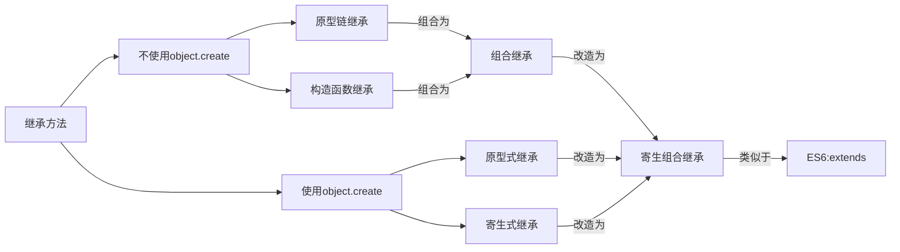
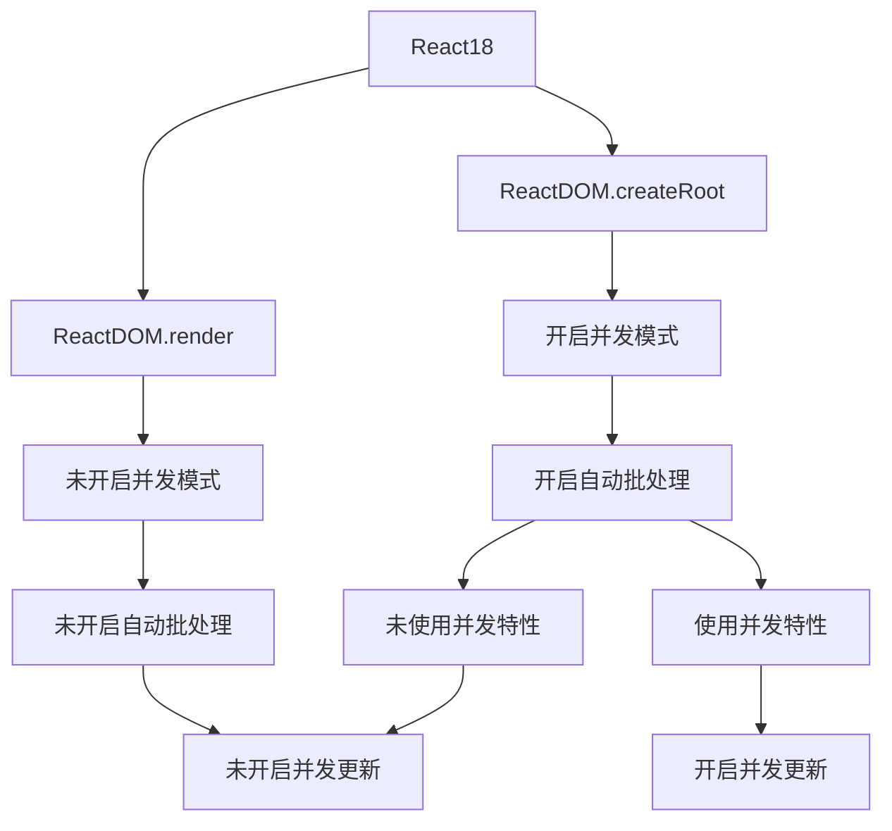
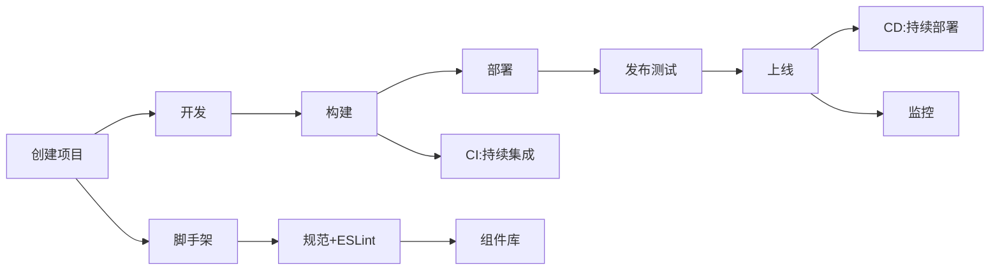
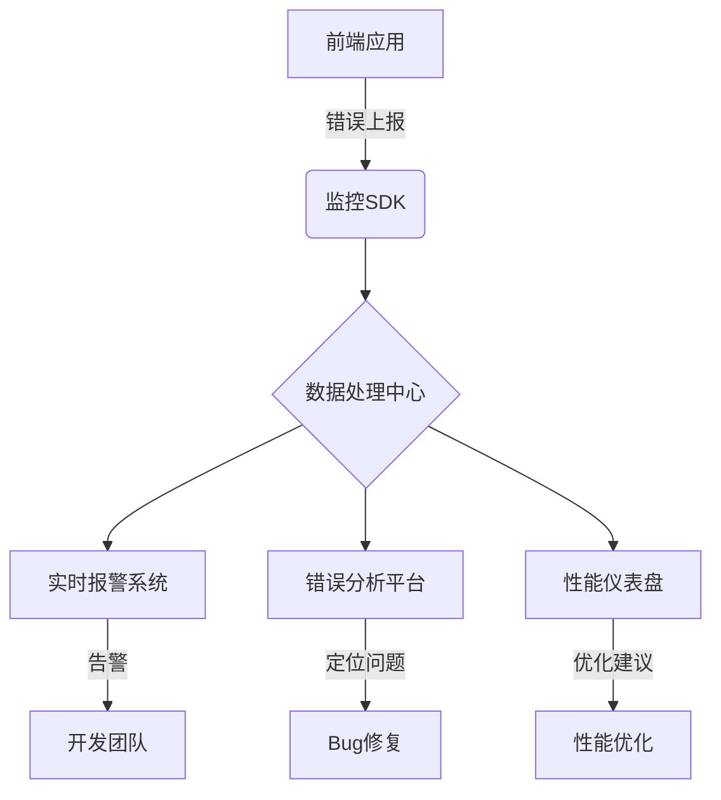

#### 冰箱

**食材管理**：

⼀期完成的功能主要有手动添加食材以及食材到期提醒。这部分的功能和其他竞品其实类似，没有什么特别的点。然后一期主要就是完成基础的功能，比如冰箱食材展示列表中食材的添加，删除和编辑。然后对每个存入的食材通过公式的计算生成一个食材期限时间轴，然后这个轴分为三种状态，最佳赏味期：100% ~  30%  ；临近保质期：30% ~  1%；超过保质期：0%。每种状态的时间轴具有不同的颜色，用于提醒用户食材的新鲜程度。此外如果有食材的新鲜状态是临近保质期或超过保质期则会使用模态框进行弹窗提醒。（触发规则：每天第一次进入冰箱插件时才提醒。使用`react-native-async-storage`第三方库的异步存储记录用户进入插件的日期，然后和当天的日期比对，来判断是否已在当天收到过提醒。）

> 计算规则：（当前时间 - 存放时间）/ 保质期天数 * 100%

**峰谷用电**：

一期计划开发的用峰谷用电功能只有一个：谷电进行化霜，冰箱冷藏室如果水蒸气过多的话可能会导致结霜，结霜会进一步影响到冰箱的制冷效果。所以智能冰箱都会有化霜的功能，其实就是通过电热丝去融冰，但是化霜的这一个过程是比较费电的，所以我们做的这个需求就是在城市用电低谷的时候再去进行化霜的这个操作，一般的冰箱可能需要去手动设置时间段，比如我们对标的竞品，美的的一款冰箱，它也是做了错峰省电的功能，但是它存在的问题是较多的地区都不支持自动获取谷值时间，并且很多信息项都需要⽤户⼿动输⼊，比如电价的峰值谷值信息，这些在实际的使用过程中用户都不需要用到，所以就显得很麻烦。然后我们做的那款⽶家冰箱”平嵌Pro⼗字，是用我们的智能谷时用电功能，只需要用户一键开启，然后我们会通过定位来获取到用户所在的城市，再去查询相对应的供电局公布的用电低谷时间段，然后我们把这个时间段设置为自动执行化霜任务的时间。

一期仅针对“化霜”进行错峰谷时用电，之后考虑冷冻、异常耗电等情况，更多利用谷电，进一步提升价值。⼀期版本仅针对化霜的⾕时⽤电，经计算⼤约周节能金额0.3元，年度只有15元，节省效果比较平庸。

#### 空调

攻克了 MIot Spec 协议对接难点，实现了精准远程控制与指令传输，优化用户体验。

Spec 是小米自研的 IoT 通信协议，然后空调就是通过wifi连接然后使用Spec进行通信。然后在实现用户通过app远程启动的时候，是统一调用`callMethodFromCloud` 函数，强制通过云端调用设备。这样就导致用户如果在家里使用App启动的话，指令的传输是从手机到小米IoT云平台，然后再通过云平台向设备下发RPC指令，这样就会有明显的延迟，导致用户的体验不太好嘛。然后我进行的优化是，先使用SDK中暴露的`localPing`函数对设备进行检测，看是否在同一个局域网下，如果不在同一个局域网下的话还是走云端下发指令。如果在同一个局域网下，对设备发送的指令就直接调用`callMethodFromLocal`，使用UDP进行RPC指令的传达。这样就可以几乎感觉不到启动的延迟。

> SPEC 协议和RPC指令之间有什么关系？
>
> **SPEC 协议** 定义的是**设备能力模型和语义标准**，而 **RPC（Remote Procedure Call） 是远程过程调用 指令** 是**具体通信时的调用方式**。简单来说就是**SPEC 告诉你“能干什么”，RPC 告诉你“怎么去干”**。
>
> MIOT-SPEC 是小米 IoT 的设备能力描述规范，它标准化了设备的服务（siid）、属性（piid）和动作；
> 而 RPC 是具体的通信手段，用来根据 SPEC 定义的能力与设备通信。
> 所有的 set、get、action 调用，都会通过 RPC 指令（如 `spec.set_properties`）传输到设备，实现真正的控制。
> 我们开发中主要是根据 SPEC 来生成 UI 和功能页面，再通过 RPC 执行指令，最终联调实现完整功能闭环。


对于设备状态的缓存是有两套的，一套在本地，一套在云端，本地的缓存也是依靠从云端获取，通过Spec接口从小米IoT平台获取数据时，可以传一个datasource参数，用于指定获取数据的策略，有三个值分别是1，2，3。1代表优先从服务器缓存读取，没有读取到再下发rpc进行获取；2代表直接下发rpc获取设备的最新值然后再返回给app；3代表直接读缓存，若没有则返回空。


> BUG：设备上的aqi数据和APP数据不同步，APP端获取到的数据滞后
>
> 解决：[[Spec\] getPropertiesValues使用问题 · Issue #1497 · MiEcosystem/miot-plugin-sdk](https://github.com/MiEcosystem/miot-plugin-sdk/issues/1497)
>
> android和ios都出现这样的情况，测试发现getPropertiesValue 获取的属性值是上报的值，不是实时值。
>
> 设备端，如果值改变了，就上报，会有问题吗
>
> 会有问题，举个栗子，类似pm2.5这样的数据，改变会很频繁，如果每次改变都上报，会导致上报很频繁，米家服务端的同学以前也提过上报频繁的问题。个人觉得需要实时数据的时候就去获取一下比较合适，以前使用Device.getDeviceWifi().callMethod('get_props')也是实时获取，不明白现在为什么要改成缓存获取？
>
> 解决：param需要传一个{sid，pid, did}的对象


### 为什么选用RN技术栈

一是React Native在米家生态中已经有成熟的插件开发体系，然后RN也是比较优秀的移动端跨平台的解决方案。二是，RN相较于H5会有更好的用户体验。因为H5需要面临首次加载白屏的问题，这样当用户网络环境比较差的时候体验会很不好，可能没等到渲染完就退了。而RN的话由于是写好的嘛，至少可以让用户进入到应用中看到应用的功能。

### 如何设计插件架构以应对设备差异与快速迭代

是通过分层设计来消除设备的差异性，首先SDK是通用的，主要提供双向通信的功能，然后对于同一类型产品是有一个通用的基础UI，然后我们针对不同的型号去做特定功能的插件开发。比如智能冰箱，一般设置和查看温度的功能都有，那这块就可以复用之前的插件，然后对于一些特定的型号，可能还有食材管理啊，食材提醒啊之类的新功能，那这块是需要我们单独进行开发的。

### 开发流程

1. 配置环境和安装依赖

2. 将⽶家BD包安装到测试机，然后登陆IOT仿真系统，绑定需要测试的设备型号。

3. 打开手机里米家Bata的开发者模式写入server所在的ip地址（就是开发的本机IP地址）、设备的model和package信息。

4. 本地建一个分支去开发，在⽶家app首页的九宫格卡⽚中可以找到相应的设备，点击进去就会⾃动拉取 server上的代码。每次开发时修改代码后再重新进⼊就能在⼿机上查看对应效果。

5. 开发完成后本地测试/边开发边测试（如何测试？）

   ```
   一、UI 设计、文案检查
   文字样式
   确保所有页面和组件的文字大小、字体、颜色、行高、字间距与设计稿一致。
   检查所有标题、副标题、正文、按钮文字等的样式是否一致。
   颜色
   所有颜色必须符合设计规范，包括背景颜色、文字颜色、按钮颜色等。
   检查不同状态下（如hover、active、disabled）的颜色是否正确。
   布局
   确保页面布局与设计稿一致，包括间距、对齐、宽高比例等。
   检查所有页面和组件的响应式布局是否正确，在不同屏幕尺寸下是否显示正常。
   图标和图片
   确保所有图标和图片使用的是最新的资源，且大小、位置与设计稿一致。
   检查图片的加载速度和质量，避免模糊或失真。
   组件一致性
   所有相同类型的组件（如按钮、输入框、卡片等）样式和行为一致。
   检查组件的交互效果，如按钮点击、输入框聚焦等是否符合设计规范。
   分辨率显示
   改变浏览器大小或分辨率显示是否正常，最低分辨率支持到1366*768，特定要求除外。
   改变浏览器大小或分辨率，横向滚动是否有空白；
   国际化
   必须切换其他语言查看是否有漏翻译场景；
   切换语言后是否样式错乱
   二、功能和交互测试
   基本功能检查
   确保所有开发的功能模块均正常运行，包括数据输入、按钮点击、表单提交等。
   检查页面跳转、数据加载、交互动画等是否正常。
   冒烟测试
   对核心功能进行冒烟测试，确保没有严重的功能性错误。
   核心功能包括：登录/注册、数据提交/获取、主要业务流程等。
   边界条件测试
   检查表单输入的边界条件，如最大/最小输入长度、特殊字符处理等。
   测试各种极端情况，如空数据、数据溢出等，确保页面表现正常。
   三、文案一致性检查
   文案内容
   确保所有页面和组件的文案与需求文档一致，且没有拼写错误或语法错误。
   检查多语言支持，确保不同语言的文案均正确显示。
   占位符文本
   确保所有占位符文本（如输入框提示、加载提示等）均为最终版文案，不存在临时文本。
   四、性能与兼容性检查
   页面性能
   检查页面加载速度，确保没有阻塞资源影响加载性能。
   优化资源加载，是否有重复资源，减少不必要的请求，使用缓存等手段提高性能。
   浏览器兼容性
   在主流浏览器进行测试（部分页面需要IE浏览器测试），确保页面显示和功能正常。
   检查移动端和桌面端的兼容性，确保响应式布局和交互效果正常。
   五、代码质量检查
   代码规范
   确保代码符合团队的编码规范，包括命名规则、注释规范、格式化规则等。
   使用Lint工具进行代码静态检查，修复所有发现的问题。
   版本控制
   确保所有代码变更均已提交到版本控制系统，且分支管理清晰。
   检查提交记录，确保每次提交都有清晰的描述，便于追溯。
   六、其他注意事项
   依赖检查
   确保所有第三方依赖均为最新版本，且没有已知的安全漏洞。
   检查依赖库的许可证，确保没有违反开源协议。
   错误日志
   检查浏览器控制台是否有错误或警告日志，修复所有发现的问题。
   确保错误处理机制健全，能够捕获并处理常见的错误情况。
   ```

6. git提交代码 

7. 在插件所在的分⽀下运⾏`npm run package`打包脚本，然后会在桌⾯生成⼀个`.mpkg`的⽂件，然后把这个文件上传到开发平台的扩展程序开发里再选择使用线上的SDK打包后就可以开启测试了。

   > 等待20分钟左右，企业⽩名单⽤户和内测⽤户即可更新到最新版本的插件。插件更新策略由native决定，当native拉取到最新插件后，在下⼀次打开插件时，才会加载最新插件代码。

8. 然后开启测试后，需要给测试的同学发邮件，进行提测。然后关闭jira中的问题，在邮件中填写提测的设备型号以及修复的插件版本和问题。另外还要抄送UI进⾏UIUE验证。

9. 测试那边如果返回BUG，这边就要去修复然后再走一遍流程。

### 灰度发布过程中遇到的问题

自定义睡眠最后一个参数执行失败

有一次空调插件在外部灰度期间，出现了部分型号远程控制指令无响应的情况，后台日志显示发送成功但设备无响应。

**排查过程：**

- 通过日志定位到是指令结构不兼容部分老旧固件。
- 临时关闭该型号灰度推送，联合设备团队抓包分析。
- 最终通过配置文件方式为该型号单独添加了旧指令映射，并在插件中兼容判断。

**追问：如何验收和决策是否全量？**

我们关注三个指标：

1. 崩溃率是否明显提升。
2. 核心功能使用率与失败率。
3. 用户反馈中是否有负面评价增加。

这些数据通过米家内部的监控平台和问卷收集进行综合评估。

### 为什么离开小米？下一步希望获得哪些经验？

一是，我更希望能够学习和积累一些系统架构和性能优化的相关经验，而小米的项目非常系统化，大多数都是在做应用层的基础开发。

二是，我希望接触更多类型的项目场景，扩展一下自己的技术边界。


**追问：如何适应团队协作？**

我从一开始就主动对接产品和后端，参与周会并在Confluence记录开发流程，推动测试联调。慢慢地，不仅仅是写代码，而是在推动整个模块的进展。


我认为前端需要和产品多交流，多花些心思从用户的角度去做页面开发，这样做出来的界面才是符合用户习惯的，否则做出来的产品是冷冰冰的，用户感觉不出来产品的温度。


# 项目描述

Novaro这个项目是以社区social为基础，为加密货币爱好者提供了一个类似于discord的集文字、语音和视频为一体的即时通讯软件，并且通过喂养社区的图腾来提升社区的活跃度和知名度，这个图腾本质是一个NFT，他有不同的等级，达到一定的等级后该社区可以发行专属的社区代币。并且每个成员都可以通过质押链上的原生代币来换取社区代币，社区代币更类似于一个可以带来收益的理财产品。社区代币的价值是由该社区质押的原生代币的数量决定的，并且不同的社区代币之间也可以流通，这本质上是链上的原生代币的流通。

考虑到社区代币是由原生代币换取的，所以我们为了防止闪电贷的发生，我们要求用户在进行质押时，不仅看其原生代币的数量是否足够，还看该用户在链上总共消耗的gas费是否达标，以及还有一些其他的要求。都满足时才允许其交易。

# 项目难点

## 文件上传

一个优秀的文件上传功能并不好做，要考虑很多点，比如文件分块、并发上传、断点续传、秒传、异步上传、文件存储、文件管理等。

[老弟做了个网盘，炸了！](https://mp.weixin.qq.com/s/3QXe4MSObJTP43M2gXWSlA)

## 双向通信

[即时通讯开发中的两个关键问题及解决方案](https://mbd.baidu.com/newspage/data/dtlandingsuper?nid=dt_3749049513075408577&sourceFrom=search_a)

[【WebSocket连接异常】前端使用WebSocket子协议传递token时，Java后端的正确打开方式！！！_websocket token-CSDN博客](https://blog.csdn.net/weixin_65837702/article/details/137673454)

[WebSocket的11个面试常见知识点 - 知乎](https://zhuanlan.zhihu.com/p/662472907)

[Netty聊天系统开发记](https://mbd.baidu.com/newspage/data/dtlandingsuper?nid=dt_5228359313509068777&sourceFrom=search_a)

[解决 WebSocket 连接断开问题：前端心跳机制的实现与优化 - Yang9710 - 博客园](https://www.cnblogs.com/little-sheep10/p/18684360)

[前端使用 WebSocket 的四大注意事项（线上踩坑，含泪分享）-腾讯云开发者社区-腾讯云](https://cloud.tencent.com/developer/article/2299661)

WebSocket请求不经过HTTP请求的拦截器，这使得将用户信息保存到ThreadLocal中以便全局获取变得困难。为了解决这个问题，我们考虑了一种方法：让前端在握手时将用户ID作为参数传递，然后将channelID和用户ID的关联关系保存到内存中。这样，我们就可以根据channelID来获取用户ID了

- 自动重连：采用指数退避算法，最大重连间隔可配置

  ```
  _getReconnectDelay() {
    // 基础延迟 * 2^重试次数 + 随机抖动
    return Math.min(
      this.config.reconnect.baseDelay * Math.pow(2, this._reconnectAttempts) 
      + Math.random() * 1000,
      this.config.reconnect.maxDelay
    );
  ```

- 心跳检测：可配置的心跳间隔和丢失阈值

- 消息队列：网络波动时自动缓存未发送消息

- 大消息压缩：超过阈值自动启用gzip压缩


##  ==1.socket错误排查==

就是刚开始使用websocket进行社区聊天室的开发的时候，总是遇到链接意外断开的问题，然后我和后端的小伙伴同时排查问题，主要就是先查看断开连接时收到的错误码，然后检查代码上是否书写错误，后端那边反馈总是收到1005或1006的连接异常关闭状态码，然后对于1005状态码，我搜资料查到是这个状态码表示“即使预期会有状态代码，但没有提供”。所以我就想，噢可能是我客户端调用`ws.close()`函数关闭连接时的写法有问题，后来我了解到，这个close函数如果不填参数，它默认的错误码是1005，而不是以为正常关闭的1000，如果想给服务端返回1000的正常断开的状态码要显式地写出。然后对于1006异常码，我排查到可能和心跳函数或服务器的超时设置相关，然后也是花了一段时间确定了是与发送的心跳消息格式有关，WebSocket 的消息可以是文本或二进制数据，而我发送的自定义字符串可能不符合服务器端的预期格式。然后我通过将心跳消息通过 `JSON.stringify` 方法转换为 JSON 格式，解决了这个问题。后来我查到具体原因是websocsket有个ws.binaryType属性，默认的是blob值，这就导致在收到二进制数据后需要调用`arrayBuffer()`来特殊获取ArrayBuffer类型的数据。

再后来我考虑到websocket实在是有些不好用，然后选用了封装性更高的socket.io，这个库有对比websocket有很多优势。

[websocket和socket.io的区别](#WebSocket和Socket.io)

## 构思并实现WebSocket断线重连与数据一致性保障方案

目标是：

- 保证前端在 WebSocket 断线后能自动重连；
- 尽可能避免消息丢失、重复；
- 保证前后端数据状态一致，避免“假数据”或状态错乱。

### 断线重连机制

对于断线重连机制，常见策略是**指数退避 + 最大重试次数**：

```js
private retryCount = 0;
private maxRetries = 5;

private onClose = () => {
  if (this.retryCount < this.maxRetries) {
    const delay = Math.pow(2, this.retryCount) * 1000;
    setTimeout(() => {
      this.retryCount++;
      this.connect();
    }, delay);
  } else {
    console.warn("达到最大重连次数");
  }
};
```

此外，还可以判断网络状态（`navigator.onLine`）配合监听 `window.addEventListener('online')` 再重连。

### 心跳机制

为了防止服务器长时间未响应却保持连接状态，有必要实现**心跳机制**：

```js
private heartbeatInterval = 30000;
private heartbeatTimer: number | null = null;

private heartbeat() {
  if (this.heartbeatTimer) clearInterval(this.heartbeatTimer);
  this.heartbeatTimer = setInterval(() => {
    this.send({ type: "ping" });
  }, this.heartbeatInterval);
}
```

### 消息唯一性与幂等处理

为防止断线重连后数据重复，需要：

1. **消息带唯一 ID**（由后端生成或客户端本地生成）；
2. **使用前端缓存处理幂等**（如 `Set` 存储处理过的消息 ID）；

```ts
const handledMessages = new Set<string>();

function onMessage(event: MessageEvent) {
  const msg = JSON.parse(event.data);
  if (handledMessages.has(msg.id)) return;
  handledMessages.add(msg.id);

  // 正常处理消息
}
```

### 状态同步与数据一致性保障

**重连后需要重新同步状态：**

- 比如前端缓存的数据可能已经过期；
- 我会在重连成功后，重新发起一次数据请求（或通过 WebSocket 发送 `resync` 请求）；
- 或者服务端支持 session ID 恢复现场（stateful reconnect）。

**补发丢失的消息：**

- 后端支持基于客户端“最后已读消息 ID”的补发；
- 客户端断线前保存一个 `lastMessageId`，重连后通过 WebSocket 发送：

```
{ "type": "resync", "lastMessageId": "123456" }
```

### 用户体验

如果多次重连失败，我会提示用户 “连接失败，点击重试”；

页面上也会标识“离线状态”或“正在重新连接”；

避免因数据不可用导致用户误操作。


## 复杂的状态管理

现代前端开发通常使用状态管理库如Redux、MobX等来解决这个问题。Redux通过单一状态树和不可变数据的理念，提供了一个可预测的状态管理方案。然而，Redux的学习曲线较陡，开发者需要深入理解其核心概念和中间件的使用。MobX则提供了更加灵活和简洁的状态管理方式，但可能在大型团队协作中存在一些问题。

### 项目难点完整分析（含代码示例）

---

#### **问题背景**

假设项目中存在以下场景：

1. **环境变量过多**：不同环境（开发/测试/生产）需要动态配置 API 地址、功能开关等参数。

2. **组件层级过深**：父组件需要将参数传递给多层嵌套的子组件，例如：

   ```jsx
   <App>
     <Layout>
       <Content>
         <UserPanel>
           <Profile>
             <AvatarConfigurator /> // 需要获取用户数据和环境变量
           </Profile>
         </UserPanel>
       </Content>
     </Layout>
   </App>
   ```

---

### **阶段一：使用 `useContext` 的尝试**

#### **实现代码示例**

```jsx
// 创建多个 Context
const EnvContext = createContext({});
const UserContext = createContext(null);

function App() {
  const [env] = useState({ apiUrl: process.env.API_URL, theme: 'dark' });
  const [user, setUser] = useState(null);

  return (
    <EnvContext.Provider value={env}>
      <UserContext.Provider value={{ user, setUser }}>
        <Layout />
      </UserContext.Provider>
    </EnvContext.Provider>
  );
}

// 深层子组件
function AvatarConfigurator() {
  const { apiUrl } = useContext(EnvContext);       // 获取环境变量
  const { user } = useContext(UserContext);       // 获取用户数据
  return ;
}
```

#### **遇到的问题**

1. **性能问题**：

   - 当任何一个 Context 的值变化时，所有消费该 Context 的组件都会重新渲染，即使它们只依赖其中的部分数据。
   - 例如修改 `user` 时，`EnvContext` 的消费者也会重新渲染。

2. **维护困难**：

   - 多个 Context 嵌套导致代码可读性差：

     ```jsx
     <ContextA.Provider>
       <ContextB.Provider>
         <ContextC.Provider> // 多层嵌套地狱
           <Component />
         </ContextC.Provider>
       </ContextB.Provider>
     </ContextA.Provider>
     ```

   - 难以追踪数据流，尤其是当多个 Context 的值相互依赖时。

---

### **阶段二：转向 Redux 状态管理**

#### **Redux 实现代码示例**

```jsx
// store.js
const store = configureStore({
  reducer: {
    env: (state = { apiUrl: process.env.API_URL }) => state,
    user: userReducer // 处理用户状态的 reducer
  }
});

// AvatarConfigurator.js
function AvatarConfigurator() {
  const apiUrl = useSelector(state => state.env.apiUrl);  // 精准订阅
  const user = useSelector(state => state.user);         // 精准订阅
  return ;
}
```

#### **Redux 解决的问题**

1. **精准渲染控制**：
   - 通过 `useSelector` 选择性订阅状态，只有相关数据变化时才会触发组件更新。
2. **集中管理**：
   - 所有状态存放在单一 Store 中，便于调试和追踪数据流。
3. **解耦嵌套**：
   - 组件无需通过层层传递 Props 或 Context 即可直接访问状态。

---

#### **Redux 引入的新问题**

1. **样板代码过多**：

   - 需要定义 Action、Reducer、Store，简单场景显得冗余：

     ```javascript
     // userReducer.js
     const initialState = null;
     export default function userReducer(state = initialState, action) {
       switch (action.type) {
         case 'SET_USER':
           return action.payload;
         default:
           return state;
       }
     }
     ```

2. **异步处理复杂**：

   - 需要额外引入 Redux-Thunk/Redux-Saga 等中间件处理异步逻辑：

     ```javascript
     // 异步 Action
     const fetchUser = () => async (dispatch) => {
       const res = await fetch('/api/user');
       dispatch({ type: 'SET_USER', payload: await res.json() });
     };
     ```

3. **过度抽象风险**：

   - 将局部状态（如表单输入）也存入 Redux，导致 Store 臃肿。

---

### **阶段三：Redux 问题的解决方案**

#### **1. 使用 Redux Toolkit 简化代码**

```javascript
// store.js
import { createSlice, configureStore } from '@reduxjs/toolkit';

const userSlice = createSlice({
  name: 'user',
  initialState: null,
  reducers: {
    setUser: (state, action) => action.payload
  }
});

const store = configureStore({
  reducer: {
    user: userSlice.reducer
  }
});

// 组件中使用
dispatch(userSlice.actions.setUser(response.data)); // 直接调用自动生成的 Action
```

- **优势**：自动生成 Action Creators，内置 Immer 实现不可变更新，减少手写模板代码。

#### **2. 合理拆分状态**

- **全局状态**（如用户登录态、环境变量）存入 Redux。

- **局部状态**（如表单输入、弹窗开关）使用 `useState` 或 `useReducer` 管理：

  ```jsx
  function LoginForm() {
    const [username, setUsername] = useState(''); // 局部状态
    const dispatch = useDispatch();
  
    const handleSubmit = () => {
      dispatch(loginUser(username)); // 仅提交时与 Redux 交互
    };
  }
  ```

#### **3. 异步处理标准化**

- 使用 RTK Query 替代手动管理异步请求：

  ```javascript
  // apiSlice.js
  import { createApi, fetchBaseQuery } from '@reduxjs/toolkit/query/react';
  
  export const api = createApi({
    baseQuery: fetchBaseQuery({ baseUrl: process.env.API_URL }),
    endpoints: (builder) => ({
      getUser: builder.query({
        query: (id) => `/users/${id}`
      })
    })
  });
  
  // 组件中自动生成 Hook
  const { data: user } = api.useGetUserQuery(1);
  ```

- **优势**：自动处理加载状态、缓存和请求重复问题。

---

### **最终方案总结**

| 问题场景              | 工具选择                | 最佳实践                                       |
| --------------------- | ----------------------- | ---------------------------------------------- |
| 全局环境变量/用户状态 | Redux + RTK             | 通过精准订阅和模块化切片管理                   |
| 局部组件状态          | `useState`/`useReducer` | 避免过度抽象，保持组件自治                     |
| 复杂异步逻辑          | RTK Query               | 替代Redux-Thunk/Saga，内置缓存和请求管理       |
| 组件通信              | Context + `useMemo`     | 对低频更新且范围明确的数据使用，配合`memo`优化 |

通过 Redux Toolkit 和 RTK Query 的现代化组合，能在保持状态可维护性的同时，显著减少样板代码，最终实现 **“全局状态集中化，局部状态自治化”** 的平衡架构。


## 在社区卡片上展示社区token的价格浮动，如何在高性能的前提下获取到token在交易所的实时价格？

## 股票K线图怎么画的？怎么实时更新价格的？

## 路由懒加载

点击社区的卡片可以跳转到对应的社区，但是不用在首页直接渲染各个社区的路由，点击那个社区再去渲染哪个社区。

实现思路：

1. **动态路由配置** - 使用`:id`参数匹配不同社区

2. **组件懒加载** - 通过`React.lazy`+`import()`实现按需加载

3. **预加载策略**：鼠标悬停时预加载目标组件

   ```jsx
   // 在CommunityCard组件中添加
   const preloadComponent = (id) => {
     import(`../communities/Community${id}`);
   };
   
   // 卡片悬停时调用
   <div 
     onMouseEnter={() => preloadComponent(id)}
     // ...其他属性
   >
   ```

   

4. **代码分割** - Webpack自动生成独立chunk文件

5. **加载状态管理** - 使用`Suspense`展示加载中状态

6. **错误边界处理** - 捕获加载失败情况


### 代码实现

1. 路由配置（App.js）

   ```jsx
   import { BrowserRouter as Router, Routes, Route } from 'react-router-dom';
   import Home from './pages/Home';
   import ErrorBoundary from './components/ErrorBoundary';
   
   function App() {
     return (
       <Router>
         <Routes>
           <Route path="/" element={<Home />} />
           <Route
             path="/community/:id"
             element={
               <ErrorBoundary>
                 <LazyCommunityPage />
               </ErrorBoundary>
             }
           />
         </Routes>
       </Router>
     );
   }
   
   // 懒加载包装组件
   const LazyCommunityPage = () => {
     const CommunityPage = React.lazy(() => import('./pages/CommunityPage'));
     
     return (
       <React.Suspense fallback={<div>Loading Community...</div>}>
         <CommunityPage />
       </React.Suspense>
     );
   };
   
   export default App;
   ```

2. 社区页面组件

   ```
   import React from 'react';
   import { useParams } from 'react-router-dom';
   
   const CommunityPage = () => {
     const { id } = useParams();
     const CommunityComponent = React.lazy(() => 
       import(`../communities/Community${id}`)
     );
   
     return (
       <React.Suspense fallback={<div>Loading Component...</div>}>
         <CommunityComponent />
       </React.Suspense>
     );
   };
   
   export default CommunityPage;
   ```

3. 错误边界组件

   ```jsx
   import React from 'react';
   
   class ErrorBoundary extends React.Component {
     constructor(props) {
       super(props);
       this.state = { hasError: false };
     }
   
     static getDerivedStateFromError(error) {
       return { hasError: true };
     }
   
     componentDidCatch(error, errorInfo) {
       console.error('Error caught:', error, errorInfo);
     }
   
     render() {
       if (this.state.hasError) {
         return (
           <div className="error-fallback">
             <h2>社区加载失败</h2>
             <button onClick={() => window.location.reload()}>
               重试
             </button>
           </div>
         );
       }
   
       return this.props.children;
     }
   }
   
   export default ErrorBoundary;
   ```

4. 社区信息卡片组件

   ```jsx
   import { Link } from 'react-router-dom';
   
   const CommunityCard = ({ id, name }) => (
     <Link to={`/community/${id}`}>
       <div className="community-card">
         <h3>{name}</h3>
         <p>点击查看详情</p>
       </div>
     </Link>
   );
   
   const Home = () => {
     const communities = [
       { id: 1, name: '技术社区' },
       { id: 2, name: '设计社区' },
       { id: 3, name: '产品社区' }
     ];
   
     return (
       <div className="home-page">
         <h1>社区列表</h1>
         <div className="community-grid">
           {communities.map(community => (
             <CommunityCard key={community.id} {...community} />
           ))}
         </div>
       </div>
     );
   };
   
   export default Home;
   ```

   


## ==2、社区首页展示所有社区信息卡片 -> 骨架屏&无限加载列表&懒加载&防抖==

可以使用react-query实现性能优化（分页和懒加载）


有一个需求是进入社区板块后，把所有的社区信息卡片都展示在首页中，然后做成一个无限加载的列表，让用户可以一直往下刷。

刚开始我实现的是通过一次请求把数据全部保存到一个状态变量中，然后再使用map把它们渲染出来，为了在加载的时候照顾用户的体验，我在首屏加载的时候显示个骨架屏，等拿到数据后再用真实的渲染替换掉。

但后来随着我们创建的社区数量越来越多，我发现这样做有时候会等好久。然后我就想反正屏幕能显示的大小有限，并且当初为了避免出现在不同尺寸的显示器上显示的社区数量不同的问题。我们把社区卡片组件的大小设置为自适应布局，然后一个屏幕最多显示3行4列12个数据。这样我就想到可以用懒加载来进行优化，然后我让后端的小伙伴把接口支持分页。一开始让首屏加载的时候只请求2屏幕的数据量，然后当滚动到最底部时触发懒加载再请求两页的数据。这样就解决了一次请求等待时间过长的问题。

但是后面又发现了一个新问题，就是加载数据的次数多了之后，状态变量中保存的数据也会越来越多，然后导致渲染的时间越来越长，后来我发现原来是列表项没写key属性，导致每次状态变量发生变化时，React重新渲染组件生成的虚拟DOM树没法快速地找出新增加的DOM节点。后来把社区的唯一ID作为key后，React 就能识别出新增项，然后只插入新的DOM节点，复用旧节点。这样就缓解了数据量大的那个问题。


再后来我又了解到了可以用虚拟列表来优化，它可以只渲染可见区域的列表项。但后面项目快提交了，就没再尝试。


### 实现方法

在首屏加载的时候使用了一个骨架屏组件，

JS原生实现懒加载：

首先将页面上的图片的 src 属性设为一个加载中的图片loading.gif，而图片的真实路径则设置在 data-src 属性中，页面滚动的时候计算图片的位置与滚动的位置，当图片出现在浏览器视口内时，将图片的 src 属性设置为 data-src 的值，这样，就可以实现延迟加载。

比较 image 元素的顶部偏移像素值 offsetTop 与 屏幕高度seeHeight + 顶部滚动值scrollTop 的大小，当小于时则说明图片已经出现过在视口中，这时候继续判断图片是否已经替换过，如果没有替换过，则进行替换。

还需要一个变量 n 是用来保存已经加载的图片数量，避免每次都从第一张图片开始遍历，提升性能。


更简单的方法：

react的lazy函数配合Suspense标签实现懒加载


节流和防抖：

在向下滚动的时候会频繁触发懒加载函数，其中可以利用节流和防抖技术让其在一段时间内只执行一次。


无限加载：


### 代码实现


定义骨架屏组件：

```react
import React from 'react'
import ContentLoader from 'react-content-loader'

const YoutubeMagic = ({
  heading = { width: 140, height: 24 },
  row = 2,
  column = 5,
  width = 1366,
  padding = 12,
  borderRadius = 4,
  ...props
}) => {
  const list = []
  let height

  for (let i = 1; i <= row; i++) {
    const itemWidth = (width - padding * (column + 1)) / column
    const height1 = (itemWidth * 9) / 16
    const height2 = 20
    const height3 = 20
    const headingWidth = heading.width
    const headingHeight = heading.height

    const space =
      padding +
      headingHeight +
      (padding + height1) +
      (padding / 2 + height2) +
      height3 +
      padding * 6

    const yHeading = padding + space * (i - 1)

    list.push(
      <rect
        x={padding}
        y={yHeading}
        rx={0}
        ry={0}
        width={headingWidth}
        height={headingHeight}
      />
    )

    for (let j = 0; j < column; j++) {
      const x = padding + j * (itemWidth + padding)
      const y1 = yHeading + headingHeight + (padding * 3) / 2
      const y2 = y1 + padding + height1
      const y3 = y2 + padding / 2 + height2

      list.push(
        <>
          <rect
            x={x}
            y={y1}
            rx={borderRadius}
            ry={borderRadius}
            width={itemWidth}
            height={height1}
          />
          <rect x={x} y={y2} rx={0} ry={0} width={itemWidth} height={height2} />
          <rect
            x={x}
            y={y3}
            rx={0}
            ry={0}
            width={itemWidth * 0.6}
            height={height3}
          />
        </>
      )

      if (i === row) {
        height = y3 + height3
      }
    }
  }

  return (
    <ContentLoader
      viewBox={`0 0 ${width} ${height}`}
      width={width}
      height={height}
      {...props}
    >
      {list}
    </ContentLoader>
  )
}

YoutubeMagic.metadata = {
  name: 'I am Doong - I come from Việt Nam',
  github: 'toiladoong',
  description: 'YoutubeMagic',
  filename: 'YoutubeMagic',
}

export default YoutubeMagic
```

使用骨架屏组件：

```js
import React, { useState, useEffect } from 'react';
import SkeletonLoader from './SkeletonLoader';
import YourContentComponent from './YourContentComponent';

const YourPage = () => {
  const [loading, setLoading] = useState(true);

  useEffect(() => {
    // 模拟数据加载
    setTimeout(() => {
      setLoading(false);
    }, 2000);
  }, []);

  return (
    <div>
      {loading ? <SkeletonLoader /> : <YourContentComponent />}
    </div>
  );
};

export default YourPage;
```


懒加载：

```react
// React.lazy 用于动态导入组件
// Suspense 用于包装懒加载组件，提供加载状态
import React, { lazy, Suspense } from 'react';

// 懒加载组件
const LazyComponent = lazy(() => import('./LazyComponent'));

// 使用 Suspense 包装
function App() {
  return (
    <Suspense fallback={<div>Loading...</div>}>
      <LazyComponent />
    </Suspense>
  );
}
```


参考：

[React 中如何实现无限滚动列表及遇到的问题-JavaScript中文网-JavaScript教程资源分享门户](https://www.javascriptcn.com/post/67d5c527a941bf7134afd1eb)

## 用户创建、编辑和检索社区

### 创建

1. 检查是否已连接钱包，未连接则提示用户连接Web3钱包。

   1. 【检查钱包是否连接和账户是否绑定是通过什么做的？】

      ```
      //会在localStorage里面存放Token
      localStorage.getItem('token')
      localStorage.setItem('token',token)
      ```

      

2. 检查是否存在绑定账户

   1. 如果未绑定，则要绑定账户。
   2. 如果绑定了，则可直接创建社区。

3. 用户填入社区信息后，点击创建，通过abi的调用把数据写入到智能合约中。

### 编辑（修改）

修改和创建差不多的流程，只不过是在智能合约中把原来的数据覆盖为修改后的数据。

### 检索

1. 用户首次进入社区页面时会看到首页展示所有社区的信息卡片，这是通过读取智能合约中的所有社区信息，然后存储到一个状态变量A中，然后使用map遍历渲染到组件中。
2. 然后用户想要检索某个社区时，通过onChange监听输入框的变化，用A的fiter函数把输入的值过滤出来再给到一个变量B中，然后把B中的数据渲染出来即可。B的取值是通过三元运算符来判断的，若搜索框中的值为空，则B取A，否则B取A对搜索值过滤后的数据。


```react
const TokenPage = () => {
  const { address, isConnected, chain } = useAccount();
  const { writeContractAsync } = useWriteContract();
  const { openConnectModal } = useConnectModal();

  const [followerPassTokens, setFollowerPassTokens] = useState<TNft[]>([]);
  const [createTokenLoading, setCreateTokenLoading] = useState(false);
  const [boundTokenAccount, setBoundTokenAccount] = useState("");
  const [searchValue, setSearchValue] = useState("");
  const [launchTokenVisible, setLaunchTokenVisible] = useState(false);
  const [confirmLoading, setConfirmLoading] = useState(false);

  const CLIENT_CONTRACT_ADDRESS = getContractAddress(chain?.name || "")
    .NovaroClient as 0x${string};

  const ACCOUNT_FACTORY_CONTRACT_ADDRESS = getContractAddress(
    chain?.name || ""
  ).AccountFactory;

  /**
   * 获取 bound token account
   */
  const getBoundTokenAccount = async () => {
    const boundTokenAccount =
      ((await readContract(config as any, {
        address: CLIENT_CONTRACT_ADDRESS,
        abi: clientContract.abi,
        functionName: "getBoundAccount",
        args: [address],
      })) as string) || "";

    let account = boundTokenAccount === BLANK_ADDRESS ? "" : boundTokenAccount;
    setBoundTokenAccount(account);
    return account;
  };

  /**
   * 创建 bound token account
   */
  const createBoundTokenAccount = async () => {
    try {
      if (!chain) {
        message.warning("Please connect wallet first");
        return;
      }
      const dynamicSocialTokenAddress = (await readContract(config as any, {
        address: CLIENT_CONTRACT_ADDRESS,
        abi: clientContract.abi,
        chainId: chain.id,
        functionName: "getDynamicSocialToken",
      })) as `0x${string}`;

      let tokenId = (await readContract(config as any, {
        address: dynamicSocialTokenAddress,
        chainId: chain.id,
        abi: dstContract.abi,
        functionName: "getDstTokenId",
        args: [address],
      })) as string;
      console.log({ originTokenId: tokenId, address });

      if (!tokenId) {
        await writeContractAsync({
          address: dynamicSocialTokenAddress,
          chainId: chain.id,
          abi: dstContract.abi,
          functionName: "mint",
          args: [address, 0],
        });
        tokenId = (await readContract(config as any, {
          address: dynamicSocialTokenAddress,
          chainId: chain.id,
          abi: dstContract.abi,
          functionName: "getDstTokenId",
          args: [address],
        })) as string;
      }

      const boundTokenAccount = (await writeContractAsync({
        address: CLIENT_CONTRACT_ADDRESS,
        chainId: chain.id,
        abi: clientContract.abi,
        functionName: "createOrFetchAccount",
        args: [
          ACCOUNT_FACTORY_CONTRACT_ADDRESS,
          chain.id,
          dynamicSocialTokenAddress,
          tokenId,
          1,
          "0x",
        ],
      })) as string;
      if (boundTokenAccount) {
        setLaunchTokenVisible(true);
        setBoundTokenAccount(boundTokenAccount);
      }
    } catch (error) {
      console.error(error);
    }
  };

  /** 唤起创建token弹窗
   * 首先判断有无 bound token account
   * 没有，先去创建
   * 有，则打开弹窗
   */
  const invokeCreateToken = async () => {
    try {
      setCreateTokenLoading(true);
      if (!boundTokenAccount) {
        const confirmCreateAccount = await confirmPromise({
          icon: null,
          width: 360,
          closable: true,
          content: (
            <div className="font-medium text-2xl text-center mb-6 px-14">
              Connect and Claim your Token Account
            </div>
          ),
          cancelText: "Cancel",
          okText: "Confirm",
          centered: true,
        });
        if (!confirmCreateAccount) {
          setCreateTokenLoading(false);
          return;
        }
        await createBoundTokenAccount();
        setCreateTokenLoading(false);
      } else {
        setLaunchTokenVisible(true);
      }
    } catch (err) {
      message.error("Error creating token");
      setCreateTokenLoading(false);
    }
  };

  /** 创建 token 方法*/
  const handleCreateToken = async ({
    tokenName,
    tokenSymbol,
    tokenDescription,
    sourceId,
  }: {
    tokenName: string;
    tokenSymbol: string;
    tokenDescription: string;
    sourceId: string;
  }) => {
    if (!chain) {
      message.warning("Please connect wallet first");
      return false;
    }
    setConfirmLoading(true);

    try {
      await writeContractAsync({
        address: CLIENT_CONTRACT_ADDRESS,
        chainId: chain.id,
        abi: clientContract.abi,
        functionName: "createFollowerPassToken",
        args: [tokenName, tokenSymbol, sourceId, tokenDescription],
      });
      setTimeout(() => {
        getTokens();
      }, 2000);
      setLaunchTokenVisible(false);
      setConfirmLoading(false);
      return true;
    } catch (err) {
      message.error("Error creating token");
      setCreateTokenLoading(false);
      setConfirmLoading(false);
    }
    return false;
  };

  /** 获取当前用户所有创建的token */
  const getTokens = async () => {
    const tokens = (await readContract(config as any, {
      address: CLIENT_CONTRACT_ADDRESS,
      abi: clientContract.abi,
      functionName: "getAllFollowerPassToken",
    })) as any;
    setFollowerPassTokens(tokens);
  };

  useEffect(() => {
    if (isConnected && address) {
      getBoundTokenAccount();
    }
  }, [isConnected, chain?.id]);

  useEffect(() => {
    getTokens();
  }, [chain?.id]);

  const filterTokens =
    searchValue === ""
      ? followerPassTokens
      : followerPassTokens.filter((x) => x.name.includes(searchValue));

  const handleVisible = (v: boolean | ((prevState: boolean) => boolean)) => {
    setLaunchTokenVisible(v);
  };

  return (
    <div className="pl-8 py-8">
      <div className="flex gap-20">
        <div className="space-y-8">
          
          {/* <div className="text-2xl font-extrabold">
            Create Your Own Token, Attract More Followers
          </div> */}

          {!isConnected ? (
            openConnectModal && (
              <button
                className="btn rounded px-6 h-10 flex justify-center items-center text-white bg-blue-500"
                onClick={() => openConnectModal()}
              >
                Connect wallet
              </button>
            )
          ) : (
            <button
              className={cn(
                "btn rounded-xl px-8 h-12 flex justify-center items-center text-white bg-blue-500",
                createTokenLoading && "loading"
              )}
              onClick={invokeCreateToken}
            >
              Create Token
            </button>
          )}
        </div>
        {boundTokenAccount ? (
          <div className="space-y-3 relative">
            
            <div className="relative z-10 w-full space-y-4 p-6 font-bold">
              <div className="flex space-x-4">
                
                <span>DST Account</span>
              </div>
              <div className="text-sm">{boundTokenAccount}</div>
            </div>
          </div>
        ) : null}
      </div>
      <div className="mt-16">
        <Input
          style={{
            height: "40px",
            background: "#f7f7f7", // A2A5B1
            outline: "none",
          }}
          placeholder="Search for tokens"
          width="323px"
          prefixIcon={
            <Search style={{ color: "#A2A5B1" }} className="size-3" />
          }
          name="Test text Input"
          value={searchValue}
          onChange={(e: React.ChangeEvent<HTMLInputElement>) => {
            setSearchValue(e.target.value);
            setFollowerPassTokens(
              followerPassTokens.filter(
                (token) =>
                  token.name.includes(e.target.value) ||
                  token.des.includes(e.target.value)
              )
            );
          }}
        />
      </div>
      <div className="bg-[#eee] w-full h-[1px] my-8"></div>
      <div className="grid grid-cols-3 gap-12 pr-8">
        {filterTokens.map((nft) => (
          <TokenCard nft={nft} key={nft.id} />
        ))}
      </div>
      <CreateTokenModal
        visible={launchTokenVisible}
        handleVisible={handleVisible}
        confirmLoading={confirmLoading}
        onLaunch={handleCreateToken}
      />
    </div>
  );
};
export default TokenPage;
```


## 带有情感分析的实时聊天应用


## 3、三级评论区的实现 -> 组件设计&组件通信

telegram的聊天是怎么做的？存储是怎么做的？引用是怎么做的？

在设计社区的评论区的时候，项目经理没说具体的要求，只说了要实现用户可以在评论区里留言的功能。所以刚开始的时候，我想的是怎么简单怎么来，所以就把每个人的评论都存在一个列表里，然后按时间顺序依次渲染出来。但这样的问题就是


一个父组件，两个子组件。父组件同样只展示顶级留言，但是父组件中引入了两个子组件，分别展示了二级留言和三级以上留言，三级以上留言使用了**递归**来实现。


怎么样进入到某个社区的？

使用react-router中的`useNavigate`钩子函数，并将其绑定到社区卡片的onClick事件上，触发时会将社区的ID作为参数进行具体路由的跳转。

```react
import { useNavigate } from "react-router-dom";

  let navigate = useNavigate();
  const routeToDetail = (followPassToken: string) => {
    navigate(`/token-detail/${followPassToken}`);
  };

	<button
    onClick={() => routeToDetail(nft.token)}
    className="bg-blue-500 rounded w-full h-10 flex items-center justify-center text-white"
  >
    详情，浏览社区
  </button>
```


### header部分

存放社区的名称

```
const Header = ()=>{
	
	return (
		<div class="comments-header">
      <h3>${community.Name}</h3>
    </div>
  )
}
```

### 评论父组件 一级

- 遍历分页获取的留言列表，并设置唯一的 key 值
- 顶级留言包括：头像、昵称、角色名标签、留言内容、发布时间
- 点击 “回复” 会触发事件 handleReply，同时传入两个参数：当前被回复留言的根ID、当前被回复留言的直接父级ID
  - 这两个参数用于给【即将发布的留言】设置根ID与直接父级ID，做到 “回复框的定位” 
  - 对于二级留言，这两个值传入顶级留言本身的ID就行

```jsx
import { useState } from 'react';
import SecondComment from './SecondComment';

function CommentList({ comments }) {
  const [showReplyIndex, setShowReplyIndex] = useState(null); // 控制回复框显示
  const [replyComment, setReplyComment] = useState(''); // 回复框内容

  // 处理回复按钮点击
  const handleReply = (rootId, parentId) => {
    setShowReplyIndex(rootId); // 设置当前显示的回复框
  };

  // 发布回复
  const handlePublish = async () => {
    if (!comment.trim()) return;

    setIsSubmitting(true);
    try {
      await axios.post('/api/comments', {
        content: comment,
        communityId:community.id,
        userId: user.id
      });
      
      setReplyComment(''); // 清空回复框
      onPublish?.();
    } catch (error) {
      console.error('发布失败:', error);
    } finally {
      setShowReplyIndex(null); // 隐藏回复框
    }
  };

  return (
    <div>
      {comments.map((item) => (
        <div key={item.id} className="comment-item">
          <div className="comment-header">
            
            <span className="name">{item.name}</span>
            <span className="role">{item.role}</span>
          </div>
          <div className="comment-content">{item.content}</div>
          <div className="comment-footer">
            <span className="time">{item.time}</span>
            <button onClick={() => handleReply(item.id, item.id)}>回复</button>
          </div>

          {/* 显示回复框 */}
          {showReplyIndex === item.id && (
            <div className="reply-box">
              <textarea
                value={replyComment}
                onChange={(e) => setReplyComment(e.target.value)}
                placeholder="输入回复内容"
              />
              <button onClick={() => handlePublish(item.id, item.id)}>发布</button>
            </div>
          )}

          {/* 渲染二级评论 */}
          {item.children && item.children.length > 0 && (
            <SecondComment
              comments={item.children}
              handleReply={handleReply}
              showReplyIndex={showReplyIndex}
              setShowReplyIndex={setShowReplyIndex}
              replyComment={replyComment}
              setReplyComment={setReplyComment}
              handlePublish={handlePublish}
            />
          )}
        </div>
      ))}
    </div>
  );
}

export default CommentList;
```


### 评论子组件 二级

- 判断顶层留言是否存在二级子留言，ture则引入 SecondComment 子组件
- 父组件传递参数：二级评论 item.children
- 处理 “回复” 功能，使用同一个方法实现（handleReply），这里的根ID和直接父ID是子组件传过来的
- handle-reply 是子组件中声明需要抛出的事件，handle-reply 代表监听子组件的自定义事件

```jsx
import ChildComment from './ChildComment';

function SecondComment({
  comments,
  handleReply,
  showReplyIndex,
  setShowReplyIndex,
  replyComment,
  setReplyComment,
  handlePublish,
}) {
  return (
    <div className="second-comments">
      {comments.map((item) => (
        <div key={item.id} className="comment-item">
          <div className="comment-header">
            
            <span className="name">{item.name}</span>
          </div>
          <div className="comment-content">{item.content}</div>
          <div className="comment-footer">
            <span className="time">{item.time}</span>
            <button onClick={() => handleReply(item.rootId, item.id)}>回复</button>
          </div>

          {/* 显示回复框 */}
          {showReplyIndex === item.id && (
            <div className="reply-box">
              <textarea
                value={replyComment}
                onChange={(e) => setReplyComment(e.target.value)}
                placeholder="输入回复内容"
              />
              <button onClick={() => handlePublish(item.rootId, item.id)}>发布</button>
            </div>
          )}

          {/* 渲染三级评论 */}
          {item.children && item.children.length > 0 && (
            <ChildComment
              comments={item.children}
              handleReply={handleReply}
              showReplyIndex={showReplyIndex}
              setShowReplyIndex={setShowReplyIndex}
              replyComment={replyComment}
              setReplyComment={setReplyComment}
              handlePublish={handlePublish}
              parentName={item.name} // 传递父级昵称
            />
          )}
        </div>
      ))}
    </div>
  );
}

export default SecondComment;
```


### 评论子组件 三级

- 因为使用的同级结构，所以需要先遍历每一个二级留言，判断其下是否存在子留言，是则引入 ChildComment 子组件。
- 同样要给子组件传递参数：三级评论 child.children
- 同时将二级留言的发表人昵称传递给子组件，用于非二级留言的子留言显示 “ @nickname ” 
- 同样拥有 “回复” 功能，使用同一个方法实现（handleReply），这里的根ID和直接父ID是子组件传过来的
- 子组件中声明的抛出事件（to-reply）不能与其他组件重复

```jsx
function ChildComment({
  comments,
  handleReply,
  showReplyIndex,
  setShowReplyIndex,
  replyComment,
  setReplyComment,
  handlePublish,
  parentName,
}) {
  return (
    <div className="child-comments">
      {comments.map((item) => (
        <div key={item.id} className="comment-item">
          <div className="comment-header">
            
            <span className="name">{item.name}</span>
          </div>
          <div className="comment-content">
            @{parentName} {item.content}
          </div>
          <div className="comment-footer">
            <span className="time">{item.time}</span>
            <button onClick={() => handleReply(item.rootId, item.id)}>回复</button>
          </div>

          {/* 显示回复框 */}
          {showReplyIndex === item.id && (
            <div className="reply-box">
              <textarea
                value={replyComment}
                onChange={(e) => setReplyComment(e.target.value)}
                placeholder="输入回复内容"
              />
              <button onClick={() => handlePublish(item.rootId, item.id)}>发布</button>
            </div>
          )}
        </div>
      ))}
    </div>
  );
}

export default ChildComment;
```


### 回复框

- 使用一个变量 showReply 来控制显示隐藏
- 同时使用变量 showReplyIndex 用来确定是在哪条留言下显示回复框，否则点击 “回复” 会在所有留言下都出现回复框
- 当 handleReply 方法被触发时，改变 showReply 和 showReplyIndex 的值
- 使用 replyComment 收集回复框输入的内容，当触发 handlePublish 方法时作为参数传进去

### 分页器

[【前端项目——分页器】手写分页器实现（JS / React）-CSDN博客](https://blog.csdn.net/Everglowwwwww/article/details/138415872)

```react
import React, { useEffect, useState } from 'react'
import styles from './App.module.css'

export default function App() {
    //创建大小为32的数组，内容为索引+1
    const content = Array.from({ length: 32 }, (_, i) => i + 1);

    const [currentPage, setCurrentPage] = useState([]);//当前页内容
    const [current, setCurrent] = useState(1);//当前页码
    const [pagenum, setPagenum] = useState(5);//每页显示条数
    const num = Math.ceil(content.length / pagenum);//总页数

    const [previousDisabled, setPreviousDisabled] = useState(true);//上一页按钮是否禁用
    const [nextDisabled, setNextDisabled] = useState(false);//下一页按钮是否禁用

    const [inputValue, setInputValue] = useState('');//跳转页码输入框值

    function showContent() {//显示当前页内容
        let start = (current - 1) * pagenum;
        let end = start + pagenum;
        setCurrentPage(content.slice(start, end));
    }
    function buttonStatus() {//按钮状态
        if (current == 1) {//第一页
            setPreviousDisabled(true);
            setNextDisabled(false);
        }
        if (current == num) {//最后一页
            setNextDisabled(true);
            setPreviousDisabled(false);
        }
        if (current != 1 && current != num) {//中间页
            setPreviousDisabled(false);
            setNextDisabled(false);
        }
    }

    useEffect(() => {//页面初始化
        showContent();
        buttonStatus();
    }, [current, pagenum]);

    return (
        <div style={{ padding: '20px' }}>
            <div className={styles.content}>
                {
                    // 创建模拟数据内容
                    currentPage.map((item, index) => (
                        <div key={index}>{item}</div>
                    ))
                }
            </div>
            <div className={styles.page}>
                {/*  向前按钮 */}
                <button className={`${styles.prev} ${previousDisabled ? styles.disabled : ''}`}
                    onClick={() => { setCurrent(1) }}
                >&lt;&lt;</button>
                <button className={`${styles.prev} ${previousDisabled ? styles.disabled : ''}`}
                    onClick={() => { current > 1 ? setCurrent(current - 1) : null }}
                >&lt;</button>
                {/*  页码 */}
                <ul className={styles.pageList}>
                    {
                        Array.from({ length: num }, (_, i) => i + 1).map(item => (
                            <li key={item}
                                className={current === item ? styles.active : ''}
                                onClick={() => {
                                    setCurrent(item);
                                }}>
                                <a href={`#${item}`}>{item}</a>
                            </li>
                        ))
                    }
                </ul>
                {/* 向后按钮 */}
                <button className={`${styles.next} ${nextDisabled ? styles.disabled : ''}`}
                    onClick={() => { current < num ? setCurrent(current + 1) : null }}
                >&gt;</button>
                <button className={`${styles.next} ${nextDisabled ? styles.disabled : ''}`}
                    onClick={() => { setCurrent(num) }}
                >&gt;&gt;</button>
                {/* 页面数量选择框 */}
                <select className={styles.pageSize} onChange={(e) => {
                    setPagenum(parseInt(e.target.value));
                    setCurrent(1);
                    setInputValue(1);
                }}>
                    <option value="5">每页显示5条</option>
                    <option value="10">每页显示10条</option>
                    <option value="20">每页显示20条</option>
                </select>
                {/* 跳转页面输入框 */}
                <span>跳转到</span>
                <input className={styles.jumpTo} type="number" defaultValue={inputValue} value={inputValue}
                    //记录输入框值
                    onChange={(e) => {
                        setInputValue(e.target.value);
                    }}
                    //跳转到指定页码,回车键触发,限制输入范围
                    onKeyDown={(e) => {
                        if (e.key === 'Enter') {//回车键触发
                            let value = parseInt(e.target.value);
                            if (value > num) value = num;//限制输入范围
                            if (value < 1) value = 1;
                            setCurrent(value);//指定页码
                            setInputValue(value);//更新输入框（因为限制输入范围）
                        }
                    }} />
                <span>页</span>
            </div>
        </div>
    )
}
```


###  社区编辑区

1. 左侧：显示当前登录用户头像
2. 中间：输入框，使用收集用户输入的内容 comment
3. 右侧：在 handlePublish 方法中请求新增留言接口

代码实现：

```react
import { useState } from 'react';
import axios from 'axios';
import styled from 'styled-components';

// 样式组件
const EditorContainer = styled.div`
  display: flex;
  align-items: center;
  gap: 16px;
  padding: 16px;
  border: 1px solid #e0e0e0;
  border-radius: 8px;
  background: #fff;
`;

const Avatar = styled.img`
  width: 40px;
  height: 40px;
  border-radius: 50%;
  object-fit: cover;
`;

const Input = styled.textarea`
  flex: 1;
  min-height: 80px;
  padding: 8px;
  border: 1px solid #e0e0e0;
  border-radius: 4px;
  resize: vertical;
  font-size: 14px;

  &:focus {
    outline: none;
    border-color: #007bff;
    box-shadow: 0 0 0 2px rgba(0, 123, 255, 0.25);
  }
`;

const Button = styled.button`
  padding: 8px 16px;
  background: #007bff;
  color: white;
  border: none;
  border-radius: 4px;
  cursor: pointer;
  transition: background 0.2s;

  &:hover {
    background: #0056b3;
  }

  &:disabled {
    background: #cccccc;
    cursor: not-allowed;
  }
`;

// 编辑区组件
function CommentEditor({ user, onPublish }) {
  const [comment, setComment] = useState('');
  const [isSubmitting, setIsSubmitting] = useState(false);

  const handlePublish = async () => {
    if (!comment.trim()) return;

    setIsSubmitting(true);
    try {
      await axios.post('/api/comments', {
        content: comment,
        communityId:community.id,
        userId: user.id
      });
      
      setComment('');
      onPublish?.();
    } catch (error) {
      console.error('发布失败:', error);
    } finally {
      setIsSubmitting(false);
    }
  };

  return (
    <EditorContainer>
      <Avatar src={user.avatar} alt={user.name} />
      
      <textarea
        value={comment}
        onChange={(e) => setComment(e.target.value)}
        placeholder="输入你的留言..."
        maxLength={500}
      />
      
      <Button 
        onClick={handlePublish}
        disabled={!comment.trim() || isSubmitting}
      >
        {isSubmitting ? '发布中...' : '发布'}
      </Button>
    </EditorContainer>
  );
}

export default CommentEditor;
```


## ==请求错误 -> 错误边界==

在开发的过程中，遇到的一个印象比较深刻的小bug。发币的时候需要向系统提供持有的原生代币的数量证明，这个是通过用户将自己的账户地址作为参数然后去请求区块链浏览器的api，api会返回相关的账户数据。但区块链浏览器的服务器在国外，有一定的概率会请求失败，这就导致数据获取不到。然后我尝试用`try/catch`捕获该错误并把错误抛出，来让错误边界捕获，但结果是错误边界并没有捕获到该错误，没有去渲染我想要的错误提示。后来我查资料才知道错误边界无法捕捉到非渲染期间的错误，所以后面只能用`try/catch`捕获后直接去进行错误提示。

然后后面我在查资料的时候发现一种比较巧妙的写法，让错误边界也可以捕捉到异步的错误：就是先用 `try/catch` 捕获这些错误，然后在 `catch` 语句内把错误抛出写在 `setState`的回调函数中，这样会触发 React 状态更新进行重新渲染，进而使得 `Error Boundary` 能够捕获到这个错误。

[错误边界](#错误边界)

```react
const Component = () => {
  // create some random state that we'll use to throw errors
  const [state, setState] = useState();

  const onClick = () => {
    // 以 try/catch 块捕捉发生的错误。
    try {
      // 模拟一些“不良”操作，这里假设这些操作导致了一个错误。
    } catch (e) {
      // 通过调用 setState 并传递一个更新函数来更新状态。
      setState(() => {
        // 这个更新函数内部再次抛出捕获到的错误 e。这将触发 React 状态更新机制，并使得 Error Boundary 能够捕获到这个错误。
        throw e;
      })
      /*
      请注意，抛出错误的时机是在 setState 的回调函数中。
      这一点很关键，因为 React 的状态更新通常是异步的，你想要确保错误在状态更新过程中被抛出，就需要在 setState 的回调函数里执行这个操作。
      */
    }
  }
}
```


> 然后这个数据是要展示在社区创建的一个子组件中，子组件拿不到数据就会报错，然后触发错误边界去提示用户网络问题，请重试。
>
> 有两个错误，无法只用一个方法去捕获，然后在react issue中发现一个方法，可以完美解决我们的问题。同时也弥补了错误边界无法捕获全部错误的遗憾。
>
> 错误一（try能做的）：异步代码通常会出现什么错误？（）事件处理函数一般会出现什么错误？
>
> 错误二（错误边界能做的）：子组件中一般会出现什么错误？
>
> 为了方便，把错误边界放在了社区最外层。
>
> 错误边界捕获：React组件渲染错误，尝试从未安装的组件更新组件（在组件卸载后，通过回调函数或异步操作重新渲染组件。在组件卸载后，仍然持有对组件的引用，导致组件未正确释放。）


try也无法捕获：事件处理函数中的异步代码错误

```
若 try 中异步的模块产生了错误，catch 也是捕获不到的，例如：

// setTimeout中的错误
try {
  setTimeout(function () {
    throw new Error('error in setTimeout'); // 200ms后会把异常抛出到全局
  }, 200);
} catch (err) {
  console.error('catch error', err); // 不会执行
}

// Promise中的错误
try {
  Promise.resolve().then(() => {
    throw new Error('error in Promise.then');
  });
} catch (err) {
  console.error('catch error', err);
}
```

但把 try-catch 放到异步代码的里面，就可以捕获到。

```
// 将try-catch放到setTimeout内部
setTimeout(() => {
  try {
    throw new Error('error in setTimeout');
  } catch (err) {
    console.error('catch error', err);
  }
}, 200);

// 将try-catch放到then内部
Promise.resolve().then(() => {
  try {
    throw new Error('error in Promise.then');
  } catch (err) {
    console.error('catch error', err);
  }
});

// 使用Promse自带的catch捕获异常
Promise.resolve()
  .then(() => {
    throw new Error('error in Promise.then');
  })
  .catch((err) => {
    console.error('Promise.catch error', err);
  });
```


# 反问

- 对于在校生来说，什么类型的前端项目可以称得上是一个优秀的项目呢？
- 现在的企业在真实开发中使用的技术栈是什么？
- 项目难点这一问题是想考察面试者的哪方面能力？应该重点回答什么？
- 面试官对前端的前景发展怎么看（AI会不会取代前端程序员）
- 我知道贵公司比较优秀，我想了解一下，假如我取得了实习，那我作为新人，我能参与哪些具体项目？团队会如何帮助我快速适应并作出贡献？您觉得我还需要加强哪些技术储备？
- 可以举几个项目中真实遇到的难题吗？我想了解一下企业项目和demo之间的差距。
- 您对前端学习的方法有什么建议吗？
- 公司现在有和ai相关的业务嘛？因为你们公司应该是和金融相关的嘛，然后我目前和同学正在做一个结合舆论分析股价的波动情况的AI，所以想了解一下目前企业中是否有这种需求。
- 通过这次的面试，您觉得我还有哪些方面需要加强学习？
- 客户端依次发送了2个请求，但由于网络原因，第二个请求先到服务器，服务器也依次对这两个请求分别进行响应，那前端如何分别处理这两个响应较为妥善？
- 什么样的方法自定义antDesign组件的样式比较优雅？有的组件涉及到嵌套，如何修改深层次的元素的样式？

# ---------CSS---------

# CSS基础

## CSS3中有哪些新特性

- 新增各种CSS选择器 （`:not(.input)`：所有 class 不是“input”的节点）
- 圆角 （`border-radius:8px`）
- 多列布局 （`multi-column layout`）
- 阴影和反射 （`Shadoweflect`）
- 文字特效 （text-shadow）
- 文字渲染 （Text-decoration）
- 线性渐变 （gradient）
- 旋转 （transform）
- 增加了旋转,缩放,定位,倾斜,动画,多背景

## 伪类和伪元素的区别和作用？

### 伪元素

伪元素是指在内容元素的前后插入额外的元素或样式，但是这些元素实际上并不在文档中生成。它们只在外部显示可见，但不会在文档的源代码中找到它们，因此，称为“伪”元素。它们以双冒号 `::` 开头。例如：

- **`::before`**：在元素内容之前插入内容。

  ```css
  p::before {
    content: "Note: ";
    color: gray;
  }
  ```

- **`::after`**：在元素内容之后插入内容。

  ```css
  p::after {
    content: " (end)";
    color: gray;
  }
  ```

- **`::first-letter`**：为元素的第一个字母设置样式。

  ```css
  p::first-letter {
    font-size: 24px;
    font-weight: bold;
  }
  ```

- **`::first-line`**：为元素的第一行设置样式。

  ```css
  p::first-line {
    color: red;
  }
  ```

- **`::selection`**：为用户选中的文本设置样式。

  ```css
  p::selection {
    background: yellow;
    color: black;
  }
  ```

- **`::placeholder`**：为输入框的占位符文本设置样式。

  ```css
  input::placeholder {
    color: gray;
  }
  ```

### 伪类

  将特殊的效果添加到特定选择器上。它是在已有元素上添加类别的，不会产生新的元素。例如：

- **`:hover`**：当鼠标悬停在元素上时的样式。

  ```css
  a:hover {
    color: red;
  }
  ```

- **`:active`**：当元素被激活（如点击时）的样式。

  ```css
  button:active {
    background-color: black;
  }
  ```

- **`:focus`**：当元素获得焦点时的样式（如输入框被选中）。

  ```css
  input:focus {
    border: 2px solid blue;
  }
  ```

- **`:checked`**：当复选框或单选按钮被选中时的样式。

  ```css
  input[type="checkbox"]:checked {
    background-color: green;
  }
  ```

- **`:first-child`**：当元素是其父元素的第一个子元素时的样式。

  ```css
  li:first-child {
    font-weight: bold;
  }
  ```

- **`:last-child`**：当元素是其父元素的最后一个子元素时的样式。

  ```css
  li:last-child {
    font-style: italic;
  }
  ```

- **`:nth-child(n)`**：当元素是其父元素的第 `n` 个子元素时的样式。

  ```css
  li:nth-child(2) {
    color: red;
  }
  ```

- **`:nth-of-type(n)`**：当元素是其父元素的第 `n` 个特定类型的子元素时的样式。

  ```css
  p:nth-of-type(3) {
    font-size: 20px;
  }
  ```

- **`:not(selector)`**：当元素不匹配指定选择器时的样式。

  ```css
  p:not(.intro) {
    color: gray;
  }
  ```

- **`:link` 和 `:visited`**：分别用于未访问和已访问的链接。

  ```css
  a:link {
    color: blue;
  }
  a:visited {
    color: purple;
  }
  ```

**总结：**伪类是通过在元素选择器上加⼊伪类改变元素状态，⽽伪元素通过对元素的操作进⾏对元素的改变。


### 伪类和伪元素的区别

- **伪类**：
  - 用于定义元素的特定状态或位置。
  - 不会创建新的虚拟元素。
  - 以单冒号 `:` 开头。
- **伪元素**：
  - 用于为元素的特定部分添加样式。
  - 会创建一个虚拟的子元素。
  - 以双冒号 `::` 开头（但在CSS2中也可以用单冒号 `:`，但不推荐）。

### 使用场景

- **伪类**：
  - 用于交互效果（如按钮的悬停、点击状态）。
  - 用于选择特定的子元素（如第一个子元素、偶数子元素）。
  - 用于表单元素的状态（如输入框获得焦点）。
- **伪元素**：
  - 用于插入额外的内容（如图标、提示文字）。
  - 用于装饰性效果（如首字母大写、第一行样式）。
  - 用于实现一些布局技巧（如清除浮动、添加边框）。


## CSS选择器及其优先级

| **选择器**     | **格式**      | **优先级权重** |
| -------------- | ------------- | -------------- |
| id选择器       | #id           | 100            |
| 类选择器       | .classname    | 10             |
| 属性选择器     | a[ref=“eee”]  | 10             |
| 伪类选择器     | li:last-child | 10             |
| 标签选择器     | div           | 1              |
| 伪元素选择器   | li::after     | 1              |
| 相邻兄弟选择器 | h1+p          | 0              |
| 子选择器       | ul>li         | 0              |
| 后代选择器     | li a          | 0              |
| 通配符选择器   | *             | 0              |


对于选择器的**优先级**：

- 标签选择器、伪元素选择器：1；
- 类选择器、伪类选择器、属性选择器：10；
- id 选择器：100；
- 内联样式：1000；
- `!important`声明的样式的优先级最高；
- 如果优先级相同，则最后出现的样式生效；
- 继承得到的样式的优先级最低；
- 内联样式 > 内部样式 > 外部样式 > 浏览器用户自定义样式 > 浏览器默认样式。
- !important>内联>id>类、伪类、属性>元素、伪元素


## CSS中可继承与不可继承属性有哪些

**一、无继承性的属性**

1. **display**：规定元素应该生成的框的类型
2. **文本属性**：
   - vertical-align：垂直文本对齐
   - text-decoration：规定添加到文本的装饰
   - text-shadow：文本阴影效果
   - white-space：空白符的处理
   - unicode-bidi：设置文本的方向
3. **盒子模型的属性**：width、height、margin、border、padding
4. **背景属性**：background、background-color、background-image、background-repeat、background-position、background-attachment
5. **定位属性**：float、clear、position、top、right、bottom、left、min-width、min-height、max-width、max-height、overflow、clip、z-index
6. **生成内容属性**：content、counter-reset、counter-increment
7. **轮廓样式属性**：outline-style、outline-width、outline-color、outline
8. **页面样式属性**：size、page-break-before、page-break-after
9. **声音样式属性**：pause-before、pause-after、pause、cue-before、cue-after、cue、play-during


**二、有继承性的属性**

1. **字体系列属性**
   - font-family：字体系列
   - font-weight：字体的粗细
   - font-size：字体的大小
   - font-style：字体的风格
2. **文本系列属性**
   - text-indent：文本缩进
   - text-align：文本水平对齐
   - line-height：行高
   - word-spacing：单词之间的间距
   - letter-spacing：中文或者字母之间的间距
   - text-transform：控制文本大小写（就是uppercase、lowercase、capitalize这三个）
   - color：文本颜色
3. **元素可见性**
   - visibility：控制元素显示隐藏
4. **列表布局属性**
   - list-style：列表风格，包括list-style-type、list-style-image等
5. **光标属性**
   - cursor：光标显示为何种形态


##  display的属性值及其作用

`display`是一个用于定义元素在文档流中的显示方式的属性。

| **属性值**   | **作用**                                                     |
| ------------ | ------------------------------------------------------------ |
| none         | 元素不显示且不占用空间（完全从渲染树移除）                   |
| block        | 块类型。元素独占一行，默认宽度为父元素宽度，可设置宽高，换行显示。 |
| inline       | 行内元素类型。默认宽度为内容宽度，不可设置宽高，同行显示。   |
| inline-block | 默认宽度为内容宽度，可以设置宽高和边距，同行显示。           |
| list-item    | 像块类型元素`<li>`一样显示，并添加样式列表标记。             |
| table        | 此元素会作为块级表格来显示。                                 |
| inherit      | 规定应该从父元素继承display属性的值。                        |
| flex         | 容器启用弹性布局，子项成为弹性项目                           |
| grid         | 容器启用网格布局                                             |


对于行内元素和块级元素，其特点如下：

**（1）行内元素**

- 设置宽高无效；
- 可以设置水平方向的margin和padding属性，不能设置垂直方向的padding和margin；
- 不会自动换行；

**（2）块级元素**

- 可以设置宽高；
- 设置margin和padding都有效；
- 可以自动换行；
- 多个块状，默认排列从上到下。


## 隐藏元素的方法有哪些

- **display: none**：渲染树不会包含该渲染对象，因此该元素不会在页面中占据位置，也不会响应绑定的监听事件。

  > 为了性能优化，应避免频繁切换 `display: none`（触发重排），可用 `visibility: hidden` 替代

- **visibility: hidden**：元素在页面中仍占据空间，但是不会响应绑定的监听事件。

- **opacity: 0**：将元素的透明度设置为 0，以此来实现元素的隐藏。元素在页面中仍然占据空间，并且能够响应元素绑定的监听事件。

- **position: absolute**：通过使用绝对定位将元素移除可视区域内，以此来实现元素的隐藏。

- **z-index: 负值**：来使其他元素遮盖住该元素，以此来实现隐藏。

- **clip/clip-path** ：使用元素裁剪的方法来实现元素的隐藏，这种方法下，元素仍在页面中占据位置，但是不会响应绑定的监听事件。

- **transform: scale(0,0)**：将元素缩放为 0，来实现元素的隐藏。这种方法下，元素仍在页面中占据位置，但是不会响应绑定的监听事件。


## display:none与visibility:hidden的区别

这两个属性都是让元素隐藏，不可见。**两者****区别如下：**

（1）**在渲染树中**

- `display:none`会让元素完全从渲染树中消失，渲染时不会占据任何空间；
- `visibility:hidden`不会让元素从渲染树中消失，渲染的元素还会占据相应的空间，只是内容不可见。

（2）**是否是****继承属性**

- `display:none`是非继承属性，子孙节点会随着父节点从渲染树消失，通过修改子孙节点的属性也无法显示；
- `visibility:hidden`是继承属性，子孙节点消失是由于继承了`hidden`，通过设置`visibility:visible`可以让子孙节点显示；

（3）修改常规文档流中元素的 `display` 通常会造成文档的重排，但是修改`visibility`属性只会造成本元素的重绘；

（4）如果使用读屏器，设置为`display:none`的内容不会被读取，设置为`visibility:hidden`的内容会被读取。


## link和@import的区别

```
<link href="style.css" type="text/css" />

<style type="text/css">@import url("style.css");</style>
```

两者都是外部引用CSS的方式，它们的区别如下：

- 从属关系区别
  - @import 是 CSS 提供的语法规则，只有导入样式表的作用; 
  - link 是HTML提供的标签，不仅可以加载 CSS 文件，还可以定义 RSS、rel 连接属性等。
- 加载顺序区别
  - 加载页面时，link 标签引入的 CSS 被同时加载; 
  - @import 引入的 CSS 将在页面加载完毕后被加载。
- 兼容性区别
  - @import 是 CSS2.1 才有的语法，故只可在 IE5+ 才能识别; 
  - link 标签作为 HTML 元素，不存在兼容性问题。
- DOM可控性区别
  - 可以通过 JS 操作 DOM ，插入 link 标签来改变样式;
  - 由于 DOM 方法是基于文档的，无法使用 @import 的方式插入样式。
- 权重区别
  - link 引入的样式权重大于 @import 引入的样式。严谨表述为：在`link`标签引入的 CSS 文件中使用`@import`时，相同样式将被该 CSS 文件本身的样式层叠。


## transition和animation的区别

- **transition是过渡属性**，强调过度，它的实现需要触发一个事件（比如鼠标移动上去，焦点，点击等）才执行动画。它类似于flash的补间动画，设置一个开始关键帧，一个结束关键帧。
- **animation是动画属性**，它的实现不需要触发事件，设定好时间之后可以自己执行，且可以循环一个动画。它也类似于flash的补间动画，但是它可以设置多个关键帧（用@keyframe定义）完成动画。


## CSS3中的盒子模型

CSS3中的盒模型有以下两种：标准盒子模型、IE盒子模型，这两种盒模型都是由四个部分组成的，分别是margin、border、padding和content。

标准盒模型和IE盒模型的区别在于设置width和height时，所对应的范围不同：

- 标准盒模型的width和height属性的范围只包含了content，
- IE盒模型的width和height属性的范围包含了border、padding和content。

可以通过修改元素的box-sizing属性来改变元素的盒模型：

- `box-sizing: content-box`表示标准盒模型（默认值）
- `box-sizing: border-box`表示IE盒模型（怪异盒模型）


## 为什么有时候用translate来改变位置而不是定位？ 

translate 是 transform 属性的⼀个值。改变transform或opacity不会触发浏览器重新布局（reflow）或重绘（repaint），只会触发复合（compositions）。⽽改变绝对定位会触发重新布局，进⽽触发重绘和复合。transform使浏览器为元素创建⼀个 GPU 图层，但改变绝对定位会使⽤到 CPU。 因此translate()更⾼效，可以缩短平滑动画的绘制时间。 ⽽translate改变位置时，元素依然会占据其原始空间，绝对定位就不会发⽣这种情况。

## 文本溢出隐藏

**单行文本溢出**

当文本长度超过其容器的宽度时，超出的部分将会被隐藏，同时在文本末尾显示省略号（…），表示文本已被截断。

```css
.single-line-text {
  overflow: hidden; /* 隐藏溢出内容 */
  text-overflow: ellipsis; /* 当文本溢出时显示省略号 */
  white-space: nowrap; /* 禁止文本换行 */
}
```

**多行文本溢出**

`-webkit-line-clamp` 是 WebKit 内核浏览器（如 Chrome、Safari）支持的属性，用于限制文本显示的行数并显示省略号。

```css
.multi-line {
  display: -webkit-box; /* 将元素设置为弹性盒子 */
  -webkit-box-orient: vertical; /* 设置盒子方向为垂直 */
  -webkit-line-clamp: 3; /* 限制显示的行数 */
  overflow: hidden; /* 隐藏溢出内容 */
  text-overflow: ellipsis; /* 显示省略号 */
}
```


通过伪元素绝对定位到行尾并遮住文字，再通过 `overflow: hidden` 隐藏多余文字。

```html
<style>
    .demo {
        position: relative;
        line-height: 20px;
        height: 40px;
        overflow: hidden;
    }
    .demo::after {
        content: "...";
        position: absolute;
        bottom: 0;
        right: 0;
        padding: 0 20px 0 10px;
    }
</style>

<body>
    <div class='demo'>这是一段很长的文本</div>
</body>
```


## 常见的图片格式及使用场景

（1）**BMP**，是无损的、既支持索引色也支持直接色的点阵图。这种图片格式几乎没有对数据进行压缩，所以BMP格式的图片通常是较大的文件。

（2）**GIF**是无损的、采用索引色的点阵图。采用LZW压缩算法进行编码。文件小，是GIF格式的优点，同时，GIF格式还具有支持动画以及透明的优点。但是GIF格式仅支持8bit的索引色，所以GIF格式适用于对色彩要求不高同时需要文件体积较小的场景。

（3）**JPEG**是有损的、采用直接色的点阵图。JPEG的图片的优点是采用了直接色，得益于更丰富的色彩，JPEG非常适合用来存储照片，与GIF相比，JPEG不适合用来存储企业Logo、线框类的图。因为有损压缩会导致图片模糊，而直接色的选用，又会导致图片文件较GIF更大。

（4）**PNG-8**是无损的、使用索引色的点阵图。PNG是一种比较新的图片格式，PNG-8是非常好的GIF格式替代者，在可能的情况下，应该尽可能的使用PNG-8而不是GIF，因为在相同的图片效果下，PNG-8具有更小的文件体积。除此之外，PNG-8还支持透明度的调节，而GIF并不支持。除非需要动画的支持，否则没有理由使用GIF而不是PNG-8。

（5）**PNG-24**是无损的、使用直接色的点阵图。PNG-24的优点在于它压缩了图片的数据，使得同样效果的图片，PNG-24格式的文件大小要比BMP小得多。当然，PNG24的图片还是要比JPEG、GIF、PNG-8大得多。

（6）**SVG**是无损的矢量图。SVG是矢量图意味着SVG图片由直线和曲线以及绘制它们的方法组成。当放大SVG图片时，看到的还是线和曲线，而不会出现像素点。SVG图片在放大时，不会失真，所以它适合用来绘制Logo、Icon等。

（7）**WebP**是谷歌开发的一种新图片格式，WebP是同时支持有损和无损压缩的、使用直接色的点阵图。从名字就可以看出来它是为Web而生的，什么叫为Web而生呢？就是说相同质量的图片，WebP具有更小的文件体积。现在网站上充满了大量的图片，如果能够降低每一个图片的文件大小，那么将大大减少浏览器和服务器之间的数据传输量，进而降低访问延迟，提升访问体验。目前只有Chrome、safari、firefox和Opera浏览器支持WebP格式，兼容性不太好。

- 在无损压缩的情况下，相同质量的WebP图片，文件大小要比PNG小26%；
- 在有损压缩的情况下，具有相同图片精度的WebP图片，文件大小要比JPEG小25%~34%；
- WebP图片格式支持图片透明度，一个无损压缩的WebP图片，如果要支持透明度只需要22%的格外文件大小。


## 对 CSS Sprites 的理解

CSS Sprites（精灵图），将一个页面涉及到的所有图片都包含到一张大图中去，然后利用CSS的 background-image，background-repeat，background-position属性的组合进行背景定位。

**优点：**

- 利用`CSS Sprites`能很好地减少网页的http请求，从而大大提高了页面的性能，这是`CSS Sprites`最大的优点；
- `CSS Sprites`能减少图片的字节，把3张图片合并成1张图片的字节总是小于这3张图片的字节总和。

**缺点：**

- 在图片合并时，要把多张图片有序的、合理的合并成一张图片，还要留好足够的空间，防止板块内出现不必要的背景。在宽屏及高分辨率下的自适应页面，如果背景不够宽，很容易出现背景断裂；
- `CSS Sprites`在开发的时候相对来说有点麻烦，需要借助`photoshop`或其他工具来对每个背景单元测量其准确的位置。
- 维护方面：`CSS Sprites`在维护的时候比较麻烦，页面背景有少许改动时，就要改这张合并的图片，无需改的地方尽量不要动，这样避免改动更多的`CSS`，如果在原来的地方放不下，又只能（最好）往下加图片，这样图片的字节就增加了，还要改动`CSS`。


## 物理像素和逻辑像素

物理像素：是设备屏幕（或图像）实际具有的像素数目，设备一出厂就确定的，固定的，是屏幕的最小物理单位。

逻辑像素：是css中设置的像素。

像素密度：每英寸显示像素的数量是像素密度

默认情况下1物理像素 = 1逻辑像素，在高像素密度的设备上1逻辑像素 = 多个物理像素。若在单边上一个逻辑像素=3个物理像素，就说这个屏幕的像素密度为 3，也就是常说的 3 倍屏。

对于图片来说，为了保证其不失真，1 个图片像素至少要对应一个物理像素，假如原始图片是 500300 像素，那么在 3 倍屏上就要放一个 1500900 像素的图片才能保证 1 个物理像素至少对应一个图片像素，才能不失真。当然，也可以针对所有屏幕，都只提供最高清图片。虽然低密度屏幕用不到那么多图片像素，而且会因为下载多余的像素造成带宽浪费和下载延迟，但从结果上说能保证图片在所有屏幕上都不会失真。

还可以使用 CSS 媒体查询来判断不同的像素密度，从而选择不同的图片：

```css
my-image { background: (low.png); }
@media only screen and (min-device-pixel-ratio: 1.5) {
  #my-image { background: (high.png); }
}
```


## margin 和 padding 的使用场景

- 需要在border外侧添加空白，且空白处不需要背景（色）时，使用 margin；
- 需要在border内测添加空白，且空白处需要背景（色）时，使用 padding。


## 对line-height 的理解及其赋值方式

**（1）line-height的概念：**

- `line-height` 是指文本行高，定义了文本行框的高度，包括文字和行间的垂直间距。
- 如果一个标签没有定义 height 属性，那么其最终表现的高度由 line-height 决定；
- 一个容器没有设置高度，那么撑开容器高度的是 line-height，而不是容器内的文本内容；
- 把 line-height 值设置为 height 一样大小的值可以实现单行文字的垂直居中；
- line-height 和 height 都能撑开一个高度；

**（2）line-height 的赋值方式：**

- 带单位：px 是固定值，而 em 会参考父元素 font-size 值计算自身的行高

- 纯数字：表示行高和字体大小的倍数关系，也可以看作是数字百分比，比如值为1.5和150%一样，表示行高是自身的font-size大小的1.5倍，若自身没有font-size属性则会相对于其父元素的font-size。

  ```css
  p {
    line-height: 1.5; /* 行高为字体大小的 1.5 倍 */
  }
  ```

- 百分比：同上，将计算后的值传递给后代


## CSS 优化和提高性能的方法有哪些？

**加载性能：**

（1）css压缩：将写好的css进行打包压缩，可以减小文件体积。

（2）css单一样式：当需要下边距和左边距的时候，很多时候会选择使用 margin:top 0 bottom 0；但margin-bottom:bottom;margin-left:left;执行效率会更高。

（3）减少使用@import，建议使用link，因为后者在页面加载时一起加载，前者是等待页面加载完成之后再进行加载。


**选择器性能：**

（1）关键选择器（key selector）。选择器的最后面的部分为关键选择器（即用来匹配目标元素的部分）。CSS选择符是从右到左进行匹配的。当使用后代选择器的时候，浏览器会遍历所有子元素来确定是否是指定的元素等等；

（2）如果规则拥有ID选择器作为其关键选择器，则不要为规则增加标签。过滤掉无关的规则（这样样式系统就不会浪费时间去匹配它们了）。

（3）避免使用通配规则，如*{}计算次数惊人，只对需要用到的元素进行选择。

（4）尽量少的去对标签进行选择，而是用class。

（5）尽量少的去使用后代选择器，降低选择器的权重值。后代选择器的开销是最高的，尽量将选择器的深度降到最低，最高不要超过三层，更多的使用类来关联每一个标签元素。

（6）了解哪些属性是可以通过继承而来的，然后避免对这些属性重复指定规则。


**渲染性能：**

（1）慎重使用高性能属性：浮动、定位。

（2）尽量减少页面重排、重绘。

（3）去除空规则：｛｝。空规则的产生原因一般来说是为了预留样式。去除这些空规则无疑能减少css文档体积。

（4）属性值为0时，不加单位。

（5）属性值为浮动小数0.**，可以省略小数点之前的0。

（6）标准化各种浏览器前缀：带浏览器前缀的在前。标准属性在后。

（7）不使用@import前缀，它会影响css的加载速度。

（8）选择器优化嵌套，尽量避免层级过深。

（9）css精灵图，同一页面相近部分的小图标，方便使用，减少页面的请求次数，但是同时图片本身会变大，使用时，优劣考虑清楚，再使用。

（10）正确使用display的属性，由于display的作用，某些样式组合会无效，徒增样式体积的同时也影响解析性能。

（11）不滥用web字体。对于中文网站来说WebFonts可能很陌生，国外却很流行。web fonts通常体积庞大，而且一些浏览器在下载web fonts时会阻塞页面渲染损伤性能。


**可维护性、健壮性：**

（1）将具有相同属性的样式抽离出来，整合并通过class在页面中进行使用，提高css的可维护性。

（2）样式与内容分离：将css代码定义到外部css中。


## 回流和重绘

[前端面试 第四篇 重绘和重排（回流）前端八股文 怎么能不懂一点呢~ 你会不会存在这样一些质疑： 什么是浏览器的重绘重 - 掘金](https://juejin.cn/post/7159155955987382309?searchId=20250413235731DD12E7E0983B7441A96E)


## 层叠顺序

（1）背景和边框：建立当前层叠上下文元素的背景和边框。

（2）负的z-index：当前层叠上下文中，z-index属性值为负的元素。

（3）块级盒：文档流内非行内级非定位后代元素。

（4）浮动盒：非定位浮动元素。

（5）行内盒：文档流内行内级非定位后代元素。

（6）z-index:0：层叠级数为0的定位元素。

（7）正z-index：z-index属性值为正的定位元素。

**注意:** 当定位元素z-index:auto，生成盒在当前层叠上下文中的层级为 0，不会建立新的层叠上下文，除非是根元素。

## z-index属性在什么情况下会失效

通常 z-index 的使用是在有两个重叠的标签，在一定的情况下控制其中一个在另一个的上方或者下方出现。z-index值越大就越是在上层。z-index元素的position属性需要是relative，absolute或是fixed。


z-index属性在下列情况下会失效：

- 父元素position为relative时，子元素的z-index失效。解决：父元素position改为absolute或static；
- 元素没有设置position属性为非static属性。解决：设置该元素的position属性为relative，absolute或是fixed中的一种；
- 元素在设置z-index的同时还设置了float浮动。解决：float去除，改为display：inline-block；


# 动画

[一文带你搞懂前端实现动画的7种实现方式们_前端动画-CSDN博客](https://blog.csdn.net/xingyu_qie/article/details/139528172)

[【前端动画】实现动画的6种方式-阿里云开发者社区](https://developer.aliyun.com/article/937880)

[前端有几种实现动画的方式？最近把一年前实现过的动画组件整理了一遍，同时也想把相关的这个问题："前端有几种实现动画的方式？ - 掘金](https://juejin.cn/post/7040372629039464484)

# 媒体查询

媒体查询（Media Queries）是CSS3中新增的一种机制（CSS2中已经可以使用），它利用浏览器的媒体类型和特性，对目标媒体（通常为桌面、平板等的显示器、移动设备等）的种类、尺寸、分辨率和支持的颜色深度等特性进行查询，从而根据这些特性设置相应的样式，进而决定其渲染的具体效果。这是实现响应式网页设计的关键技术，确保网站或应用能够在多种设备上，包括桌面、平板、手机等，提供良好的用户体验。

### 基础语法

有三种方式来定义和使用媒体查询：

- 使用`@media`在**样式表**中指定媒体类型和媒体特性；

  ```css
      // css文件中或style内容中
      // 媒体类型为屏幕且为彩色设备。
      @media screen and (color) {
          ...
      }
  ```

- 使用`@import`在**样式表**中指定媒体类型和媒体特性；

  ```css
      // css文件中或style内容中
      // 样式表example.css仅用于彩色屏幕。
      @import url(example.css) screen and (color);
  ```

- 使用`media属性`在`<style>、<link>、<source>`或其他元素中指定媒体类型和媒体特性。

  ```html
      // html文件中 <link>标签
      // 彩色屏幕时，引入并应用样式表example.css。
      <link rel="stylesheet" media="screen and (color)" href="example.css" />
      
      // html文件中  <link>标签
      // 通过mdeia属性指定媒体类型及条件来区别引入css文件 
      <link rel="stylesheet" media="screen and (min-width:500px)" href="example.css" />
      
      // <style> 标签中
      // 通过mdeia指定媒体类型及条件来实现区别当前style是否生效
      <style media="screen and (max-width: 500px)">
          body{
              ...
          }
      </style>
  ```

  注意：在`<link>`标签中使用媒体查询会浪费页面http的请求次数，加重页面负担，不推荐使用。原因是**无论是否匹配媒体查询**，浏览器都会**立即发起请求**下载 `<link>` 标签指定的资源，但会根据媒体查询条件决定是否应用该资源，对于那些因媒体查询不匹配的资源，浏览器不会应用它。


媒体查询的基本结构如下：

```css
@media media-type and (media-feature: value) {
    /* CSS 样式规则 */
}
```

- `@media`：声明这是一个媒体查询语句。
- `media-type`：定义媒体类型，如 screen（用于电脑屏幕、手机屏幕等）、print（用于打印）、speech（用于屏幕阅读器）。默认值为 all，意味着规则适用于所有类型的媒体。
- `media-feature`：媒体特性，用来检查设备的特定条件，比如视口宽度(width)、高度(height)、设备像素比(device-pixel-ratio)、颜色(color)等，这些特性允许你根据不同的设备条件和环境来定制样式。
- `value`：媒体特性所对应的值或范围。
- `and`：逻辑操作符，用于结合多个媒体类型或特性，实现更复杂的查询条件。可用的逻辑操作符有`not`、`and`、`only` 、`,`和 `or`。


#### 媒体类型

- **all**：匹配所有设备，默认。
- **print**：匹配打印机和用于再现打印显示的设备，例如在“打印预览”中显示文档的 Web 浏览器。
- **screen**：匹配所有与打印不匹配的设备。

#### 媒体特性

CSS媒体查询支持多种媒体特，以下是一些常用的媒体特性的详细说明：

**宽度和高度特性：**

- width: 目标输出设备的视口宽度。
- min-width: 视口宽度的最小值。
- max-width: 视口宽度的最大值。
- height: 目标输出设备的视口高度。
- min-height: 视口高度的最小值。
- max-height: 视口高度的最大值。

**分辨率和像素比：**

- device-width 和 device-height: 设备的屏幕物理宽度和高度。
- min-device-width 和 max-device-width: 设备屏幕物理宽度的最小值和最大值。
- min-device-height 和 max-device-height: 设备屏幕物理高度的最小值和最大值。
- resolution: 设备的分辨率，可以是dpi（每英寸点数）, dpcm（每厘米点数）或 dppx（每像素点数）。
- min-resolution 和 max-resolution: 分辨率的最小值和最大值。

**方向和比例：**

- orientation: 设备的方向，取值为portrait（竖屏）或landscape（横屏）。
- aspect-ratio: 输出设备的宽高比，格式为x/y。
- device-aspect-ratio: 设备的屏幕宽高比。

**颜色和颜色索引：**

- color: 设备的颜色位数。
- min-color 和 max-color: 设备颜色位数的最小值和最大值。
- color-index: 设备的颜色索引数。
- min-color-index 和 max-color-index: 设备颜色索引数的最小值和最大值。

**环境和设备特性：**

- monochrome: 单色设备的颜色位数。
- grid: 是否为网格设备，如终端。
- scan: 显示设备的扫描方式，如progressive（逐行扫描）或interlace（隔行扫描）。
- update-frequency: 显示更新频率，如slow或fast。

**其他特性：**

- any-hover: 检测是否有任何指针设备能悬停。
- any-pointer: 指针精度，如fine、coarse或none。
- hover: 指针是否能悬停。
- pointer: 主要输入设备的精度。
- inverted-colors: 用户是否启用了颜色反转。
- prefers-color-scheme: 用户偏好颜色方案，如light、dark或no-preference。
- prefers-reduced-motion: 用户是否偏好减少动画或运动。
- prefers-contrast: 用户的对比度偏好，如no-preference、high或low。


#### 逻辑操作符

媒体查询时可用的逻辑操作符有`not`、`and`、`only` 、`,`和 `or`。

- **and**  用于将多个媒体查询规则组合成单条媒体查询，当每个查询规则都为真时则该条媒体查询为 true，它还用于将媒体功能与媒体类型结合在一起。

  ```css
  css 代码解读复制代码// 满足横屏（未区分媒体类型，默认all）以及最小宽度为500px
  @media (min-width: 500px) and (orientation: landscape) { 
      ...
  }
  ```

- **not** 用于否定媒体查询，如果不满足这个条件则返回 true，否则返回 false。如果出现在以逗号分隔的查询列表中，它将仅否定应用了该查询的特定查询。如果使用 `not` 运算符，则还必须指定媒体类型。

  ```
   代码解读
  复制代码备注：  在 Media Queries Level 3 中，not 关键字不能用于否定单个媒体特性表达式，而只能用于否定整个媒体查询，这个在实际开发中使用不多，更多细节和使用方式可查看MDN中相关规范。
  ```

- **only** 仅在整个查询匹配时才用于应用样式，并且对于防止较早的浏览器应用所选样式很有用。当不使用only时，旧版本的浏览器会将 `screen and (max-width: 500px)` 简单地解释为 `screen`，忽略查询的其余部分，并将其样式应用于所有screen。如果使用only运算符，则还必须指定媒体类型。通过它让选中的样式在老式浏览器中不被应用。

  ```css
  css 代码解读复制代码// 在老式浏览器中被解析为@media only，因为没有一个叫only的设备，所以实际上老式浏览器不会应用样式。
  @media only screen and (max-width:500px) {
      ...
  }
  
  // 在老式浏览器中被解析为@media screen，样式应用于所有screen。
  @media screen and (max-width:500px) {
      ...
  }
  
  // only关键字可防止不支持带有媒体功能的媒体查询的旧版浏览器应用给定的样式。它对现代浏览器没有影响。
  
  // 所以，在使用中最好不要忽略only,虽然无论是否带上only在老式浏览器中都会有错误（带上会使样式不使用，不带会使样式应用于所有的screen），但是带上only可以避免较早的浏览器应用样式引起更大的页面错误。
  ```

- **,（逗号）** 逗号用于将多个媒体查询合并为一个规则。逗号分隔列表中的每个查询都与其他查询分开处理。因此，如果列表中的任何查询为true，则整个媒体查询语句返回true。换句话说，列表的行为类似于逻辑或（`or`）运算符。

- **or** 等价于 `,` 运算符。在 Media Queries Level 4 中被添加。

  ```css
  css 代码解读复制代码// 满足最小宽度为500像素或是横屏设备应用样式表
  media (min-width: 500px) or (orientation: landscape) { 
      ...
  }
  // 等同于
  media (min-width: 500px), (orientation: landscape) { 
      ...
  }
  ```


### 切换导航栏布局

当屏幕宽度足够大时，显示水平导航栏；当屏幕较窄时，将其转换为垂直折叠式导航。

```css
/* 默认样式，可能适用于移动端 */
.navbar {
    display: flex;
    flex-direction: column;
}

/* 当屏幕宽度至少为768px时，变为水平布局 */
@media (min-width: 768px) {
    .navbar {
        flex-direction: row;
    }
}
```


### 调整字体大小

在屏幕宽度小于600px时减小文本的字体大小，以提高阅读体验。

```css
@media (max-width: 600px) {
    body {
        font-size: 14px;
    }
}
```


### 调整列布局

在不同屏幕尺寸下自动调整网格布局，比如从单列到两列再到多列布局。

```css
.container {
    display: grid;
    grid-template-columns: repeat(1, 1fr);
}

@media (min-width: 768px) {
    .container {
        grid-template-columns: repeat(2, 1fr);
    }
}

@media (min-width: 1024px) {
    .container {
        grid-template-columns: repeat(3, 1fr);
    }
}
```


### 针对不同分辨率和方向优化视频尺寸

在宽屏设备上保持视频的宽高比，并在窄屏设备上全屏显示视频。

```css
@media (min-aspect-ratio: 16/9) {
    video {
        width: 100%;
        height: auto;
    }
}

@media (max-aspect-ratio: 16/9) {
    video {
        width: auto;
        height: 100%;
    }
}
```


### 三端适配

移动端适配怎么做的（rem加媒体查询修改根节点font-size）

[手写rem + flexible.js自动适配方案全解析](https://mp.weixin.qq.com/s/OptLX_za-vM7pIMRLj9xow)

#### 常见的设备屏幕尺寸分界

| 设备     | 尺寸         |                         |
| -------- | ------------ | ----------------------- |
| 超小屏幕 | 手机         | < 768px                 |
| 小屏幕   | 平板及个别PC | 768px >= size < 992px   |
| 中等屏幕 | PC           | 992px >= size < 1200px  |
| 大屏幕   | PC           | 1200px >= size < 1680px |
| 超大屏幕 | PC           | >= 1680px               |

#### 常见响应式设计实现方案

**方案一：** 一套代码，针对不同屏幕对css进行调整，控制样式和布局，达到在不同设备、不同分辨率的屏幕上呈现合理布局的效果（一般官网开发常用）。

**方案二：** 多套代码，根据设备类型不同，加载不同的页面资源（各端区别较大、大型中后台管理系统常用）。

#### 方案一实施示例

**项目实施注意事项：**

- 浏览器兼容性，`避免使用较新的技术`，比如CSS中的flex（IE10以下的浏览器不支持）；

- 代码的可维护性，相对于一般不需要适配多端的管理系统，官网往往使用媒体查询，这增加了代码的复杂程度，同时也给后来的维护带来了较大的困难和挑战，所以在开发之初，要针对项目`定义一些通用的样式`，尽量降低代码维护的难度。

**实现思路：**主要使用浮动 + 定位 + 百分比布局（vw, padding、margin、min-height等）+ table标签（替代flex）实现。

> table标签中的`<tr>、 <td>` 更易控制元素垂直居中，而且是html的原生标签，这些标签及其属性能够兼容大部分浏览器，所以用来替代CSS中的flex，缺点就是原来用flex一两行代码就能实现的效果，使用`<teble>`可能要嵌套多层才行，但是为了兼容大部分浏览器，也只有这一个合适的方案
>
> 在实际开发中，在PC端屏幕较大的时候可能需要设置页面内容区域的宽度，一般有两种设计方案： 
>
> - 方案一（常用）：页面达到`1360px`的时候，设置内容宽度为1280px，左右padding各40px （content-box）; 
> - 方案二：页面达到`1280px`的时候，设置内容宽度为1200px，左右padding各40px （content-box）。

**实现代码：**

```css
    // CSS文件中
    
    ...通用样式书写...
    
    // 移动端
    @media only screen and (max-width: 767px) {
        ...移动端样式...
    }
    
    // pad端（平板）
    @media only screen and (min-width: 768px) {
        ...pad端样式...
    } 
    
    // PC端 、一般屏幕
    @media only screen and (min-width: 992px) {
        ...PC端 、一般屏幕样式...
    }
    
    // PC端 、大屏幕
    @media only screen and (min-width: 1200px) {
        ...PC端 、大屏幕样式...
    }
    
    // PC端、超大屏幕
    @media only screen and (min-width: 1680px) {
        ...超大屏幕样式...
    }
```

## 响应式设计

响应式网站设计`（Responsive Web design`）是一个网站能够兼容多个终端，而不是为每一个终端做一个特定的版本。

关于原理： 基本原理是通过媒体查询`（@media）`查询检测不同的设备屏幕尺寸做处理。

关于兼容： 页面头部必须有mate声明的`viewport`。

```html
<meta name="’viewport’" content="”width=device-width," initial-scale="1." maximum-scale="1,user-scalable=no”"/>
```

# 页面布局

## CSS布局单位

常用的布局单位包括像素（`px`），百分比（`%`），`em`，`rem`，`vw/vh`。

**（1）像素**（`px`）是页面布局的基础，一个像素表示终端（电脑、手机、平板等）屏幕所能显示的最小的区域，像素分为两种类型：CSS像素和物理像素：

- **CSS像素**：为web开发者提供，在CSS中使用的一个抽象单位；
- **物理像素**：只与设备的硬件密度有关，任何设备的物理像素都是固定的。

**（2）百分比**（`%`），当浏览器的宽度或者高度发生变化时，通过百分比单位可以使得浏览器中的组件的宽和高随着浏览器的变化而变化，从而实现响应式的效果。一般认为子元素的百分比相对于直接父元素。

**（3）em和rem**相对于px更具灵活性，它们都是相对长度单位，它们之间的区别：**em相对于父元素，rem相对于根元素。**

- **em：** 文本相对长度单位。相对于当前对象内文本的字体尺寸。如果当前行内文本的字体尺寸未被人为设置，则相对于浏览器的默认字体尺寸(默认16px)。(相对父元素的字体大小倍数)。
- **rem：** rem是CSS3新增的一个相对单位，相对于根元素（html元素）的font-size的倍数。**作用**：利用rem可以实现简单的响应式布局，可以利用html元素中字体的大小与屏幕间的比值来设置font-size的值，以此实现当屏幕分辨率变化时让元素也随之变化。

**（4）vw/vh**是与视图窗口有关的单位，vw表示相对于视图窗口的宽度，vh表示相对于视图窗口高度，除了vw和vh外，还有vmin和vmax两个相关的单位。

- vw：相对于视窗的宽度，视窗宽度是100vw；
- vh：相对于视窗的高度，视窗高度是100vh；
- vmin：vw和vh中的较小值；
- vmax：vw和vh中的较大值；


**vw/vh** 和百分比很类似，两者的区别：

- 百分比（`%`）：大部分相对于祖先元素，也有相对于自身的情况比如（border-radius、translate等)
- vw/vm：相对于视窗的尺寸

**三者的区别：**

- px是固定的像素，一旦设置了就无法因为适应页面大小而改变。
- em是相对于其自身的font-size的px值来参考的，若自身没有设置font-size的px值，则根据其父元素的font-size的px值来设置大小，并且该值是可继承的，若父元素也没有设置则会一直向上溯源。
- rem是相对于根元素，这样就意味着，只需要在根元素确定一个参考值。


**使用场景：**

- 对于只需要适配少部分移动设备，且分辨率对页面影响不大的，使用px即可 。
- 对于需要适配各种移动设备，使用rem，例如需要适配iPhone和iPad等分辨率差别比较挺大的设备。


## Flex 布局

Flex是FlexibleBox的缩写，意为"弹性布局"，用来为盒状模型提供最大的灵活性。任何一个容器都可以指定为Flex布局。行内元素也可以使用Flex布局。注意，设为Flex布局以后，**子元素的float、clear和vertical-align属性将失效**。

采用Flex布局的元素，称为Flex容器（flex container），简称"容器"。它的所有子元素（仅子元素，不是全部后代元素）自动成为容器成员，称为Flex项目（flex item），简称"项目"。


容器默认存在两根轴：水平的主轴（main axis）和垂直的交叉轴（cross axis），主轴的开始位置（与边框的交叉点）叫做`main start`，结束位置叫做`main end`；交叉轴的开始位置叫做`cross start`，结束位置叫做`cross end`。

项目默认沿主轴排列。单个项目占据的主轴空间叫做`main size`，占据的交叉轴空间叫做`cross size`。


### 容器属性

#### flex-direction

flex-direction 属性决定主轴的方向（即项目的排列方向）。

```css
.box {
  flex-direction: row | row-reverse | column | column-reverse;
}
```

可选的属性值及其含义：

| 属性值         | 含义                                                         |
| -------------- | ------------------------------------------------------------ |
| row            | 默认值，主轴为水平方向（水平布局），起点在左端，从左向右排列 |
| row-reverse    | 主轴为水平方向（水平布局），起点在右端，从右向左排列         |
| column         | 主轴为垂直方向（垂直布局），起点在上沿，从上往下排列         |
| column-reverse | 主轴为垂直方向（垂直布局），起点在下沿，从下往上排列         |


#### flex-wrap

默认情况下，项目都排在一条线（又称"轴线"）上。`flex-wrap`属性定义，如果一条轴线排不下，如何换行。

```css
.box{
  flex-wrap: nowrap | wrap | wrap-reverse;
}
```

可选的属性值及其含义：

| 属性值       | 含义                                                         |
| ------------ | ------------------------------------------------------------ |
| nowrap       | 默认值，不换行。当主轴的长度是固定并且空间不足时，项目尺寸会随之进行调整，而不会换行。 |
| wrap         | 换行，第一行在上面。                                         |
| wrap-reverse | 换行，第一行在下面。                                         |

#### flex-flow

`flex-flow`属性是`flex-direction`属性和`flex-wrap`属性的简写形式，默认值为`row nowrap`。

```css
.box {
  flex-flow: <flex-direction> || <flex-wrap>;
  /* initial表示设置为默认值；inherit表示采用其父元素flex-flow的属性值 */
}
```

#### justify-content

`justify-content`属性定义了项目在主轴上的对齐方式。

```css
.box {
  justify-content: flex-start | flex-end | center | space-between | space-around;
}
```

可选的属性值及其含义：

| 属性值        | 含义                                                         |
| ------------- | ------------------------------------------------------------ |
| flex-start    | 默认值，左对齐                                               |
| flex-end      | 右对齐                                                       |
| center        | 居中                                                         |
| space-between | 两端对齐，项目之间的间隔都相等                               |
| space-around  | 每个项目两侧的间隔相等。所以，项目之间的间隔比项目与边框的间隔大一倍 |


#### align-items

`align-items`属性定义项目在交叉轴上如何对齐。

```css
.box {
  align-items: flex-start | flex-end | center | baseline | stretch;
}
```

可选的属性值及其含义：

| 属性值     | 含义                                                         |
| ---------- | ------------------------------------------------------------ |
| flex-start | 交叉轴的起点对齐                                             |
| flex-end   | 交叉轴的终点对齐                                             |
| center     | 交叉轴的中点对齐                                             |
| baseline   | 项目的第一行文字的基线对齐                                   |
| stretch    | （默认值） 如果项目未设置高度或设为auto，将占满整个容器的高度 |

（1）`flex-start`: 交叉轴的起点对齐（上面或左边）。设置容器高度为 100px，项目高度分别为 20px、40px、60px、80px、100px，效果如图所示：


（2）`flex-end`: 交叉轴的终点对齐（下面或右边）。设置容器高度为 100px，项目高度分别为 20px、40px、60px、80px、100px，效果如图所示：


（3）`center`: 交叉轴的中点对齐。设置容器高度为 100px，项目高度分别为 20px、40px、60px、80px、100px，效果如图所示：


（4）`baseline`:以元素的第一行文字的基线对齐


（5）`stretch`: 默认值。如果项目未设置高度或设为auto，将占满整个容器的高度。假设容器高度设置为 100px，而项目没有设置高度，则项目的高度也为 100px，如图：


#### align-content

`align-content`属性定义了换行后多条项目元素主轴线的对齐方式。如果项目只有一根主轴线（项目都在一行上），该属性不起作用。该属性类似 `justify-content` 但对齐交叉轴。

```css
.box {
  align-content: flex-start | flex-end | center | space-between | space-around | stretch;
}
```

可选的属性值及其含义：

| 属性值        | 含义                                                         |
| ------------- | ------------------------------------------------------------ |
| flex-start    | 与交叉轴的起点对齐，所有行紧贴容器起点                       |
| flex-end      | 与交叉轴的终点对齐，所有行紧贴容器终点                       |
| center        | 与交叉轴的中点对齐，所有行整体居中                           |
| space-between | 与交叉轴两端对齐，轴线之间的间隔平均分布，首尾行贴边，中间均匀分布 |
| space-around  | 每根轴线（每行）两侧的间隔都相等。所以，轴线之间的间隔比轴线与边框的间隔大一倍。 |
| stretch       | 默认值，轴线占满整个交叉轴，行项目元素拉伸填满容器           |

`align-items` 和 `align-content` 的区别：

| 属性                | 作用对象               | 生效条件              | 典型应用场景             |
| :------------------ | :--------------------- | :-------------------- | :----------------------- |
| **`align-items`**   | **单行/单列** 内的项目 | 始终生效              | 控制项目在交叉轴上的对齐 |
| **`align-content`** | **多行/多列** 的整体   | 仅在有多行/多列时生效 | 控制行/列在容器内的分布  |


### 项目属性

#### order

`order`属性用来定义项目的排列顺序。数值越小，排列越靠前，默认为 0 。使用形式如下：

```css
.item {
    order: <integer>;
}
```


#### flex-grow

`flex-grow`属性定义项目的放大比例，默认为 0 ，即如果存在剩余空间，也不放大。

```css
.item {
  flex-grow: <number>; /* default 0 */
}
```

如果所有项目的`flex-grow`属性都为 1，则它们将等分剩余空间（如果有的话）。


如果一个项目的`flex-grow`属性为2，其他项目都为1，则前者占据的剩余空间将比其他项多一倍。


#### flex-shrink

`flex-shrink`属性定义了项目的缩小比例，默认为 1 ，即如果空间不足，该项目将缩小。

```css
.item {
  flex-shrink: <number>; /* default 1 */
}
```

如果所有项目的`flex-shrink`属性都为 1，当空间不足时，都将等比例缩小。


如果一个项目的`flex-shrink`属性为 0，其他项目都为 1，则空间不足时，前者不缩小。


负值对该属性无效。

#### flex-basis

`flex-basis`属性定义了在分配多余空间之前，项目占据的主轴空间（main size）。浏览器根据这个属性，计算主轴是否有多余空间。它的默认值为`auto`，即项目的本来大小。

```css
.item {
  flex-basis: <length> | auto; /* default auto */
}
```

它可以设为跟`width`或`height`属性一样的值（比如350px），则项目将占据固定空间。

当主轴设置为水平时，当设置了`flex-basis`，设置的项目宽度值会失效，`flex-basis`需要跟`flex-grow`和`flex-shrink`配合使用才能生效。有两种特殊的值:

- 当 flex-basis 值为 0 % 时，项目尺寸会被认为是0，因此无论项目尺寸设置多少都没用；
- 当 flex-basis 值为 auto 时，则跟根据尺寸的设定值来设置大小。


#### flex

`flex`属性是`flex-grow`, `flex-shrink` 和 `flex-basis`的简写，默认值为`0 1 auto`。后两个属性可选。

```css
.item {
  flex: auto | none | [ <'flex-grow'> <'flex-shrink'>? || <'flex-basis'> ]
}
```

该属性有两个快捷值`auto (1 1 auto)` 和 `none (0 0 auto)`。

（1）默认值：`flex:0 1 auto`，即在有剩余空间时，只放大不缩小。

```css
.item {
  flex:0 1 auto;
  /* 等价于
  flex-grow: 0;
  flex-shrink: 1;
  flex-basis: auto;
  */
}
```

（2）`flex: auto`，即元素尺寸可以弹性增大，也可以弹性变小，具有十足的弹性，但在尺寸不足时会优先最大化内容尺寸。

```css
.item {
  flex:1 1 auto;
  /* 等价于
  flex-grow: 1;
  flex-shrink: 1;
  flex-basis: auto;
  */
}
```

（3）`flex: none`，即有剩余空间时，不放大也不缩小，最终尺寸通常表现为最大内容宽度。

```css
.item {
  flex:0 0 auto;
  /* 等价于
  flex-grow: 0;
  flex-shrink: 0;
  flex-basis: auto;
  */
}
```

（4）`flex: 0`，即当有剩余空间时，项目宽度为其内容的宽度，最终尺寸表现为最小内容宽度。

```css
.item {
  flex:0 1 0%;
  /* 等价于
  flex-grow: 0;
  flex-shrink: 1;
  flex-basis: 0%;
  */
}
```

（5）`flex: 1`，即元素尺寸可以弹性增大，也可以弹性变小，具有十足的弹性，但是在尺寸不足时会优先最小化内容尺寸。

```css
.item {
  flex:1 1 0%;
  /* 等价于
  flex-grow: 1;
  flex-shrink: 1;
  flex-basis: 0%;
  */
}
```


辨析：

- `flex:1` 和 `flex:auto` 的主要区别：
  - 在充分分配父元素宽度的情况下，子元素是优先扩展（auto）自己的尺寸还是优先减小（1）自己的尺寸
- `flex:0` 和 `flex: none` 的主要区别：
  - 不考考虑父元素宽度的情况下，最大化内容宽度（none）还是最小化内容宽度（0）

#### align-self

`align-self`属性允许单个项目有与其他项目不一样的对齐方式，可覆盖`align-items`属性。默认值为`auto`，表示继承父元素的`align-items`属性，如果没有父元素，则等同于`stretch`。

```css
.item {
  align-self: auto | flex-start | flex-end | center | baseline | stretch;
}
```


## Grid 布局

**gird(网格)** 布局与 **Flex** 弹性布局有相似之处理，都是由父容器包含多个项目元素的使用。

### 容器属性

#### dispaly

我们通过在元素上声明 `display：grid` 或 `display：inline-grid` 来创建一个网格容器。声明 `display：grid` 则该容器是一个块级元素，设置成 `display: inline-grid` 则容器元素为行内元素。

#### grid-template-columns

`grid-template-columns` 属性设置列数和列宽，有几个值代表有几列，列与列之间用空格隔开。

使用方法：

```css
.wrapper {
  display: grid;
  
  grid-template-columns: num | % | fr | auto | repeat(repeatNum, repeatVal) | minmax(min, max);
  /* 
     如下面的代码声明了三列，宽度分别为 200px 100px 200px 
     grid-template-columns: 200px 100px 200px;
  */
  
  /*  声明了两行，行高分别为 50px 50px  */
  grid-template-rows: 50px 50px;
}
```

可选的属性值及其含义：

| 属性值                       | 含义                                                         | 示例                                                 |
| ---------------------------- | ------------------------------------------------------------ | ---------------------------------------------------- |
| num                          | 固定宽度。可以选`px,em,rem`。数字个数为列的个数，数字大小为列的宽度。 | `grid-template-columns: 200px 100px 200px;`          |
| %                            | 百分比自动适应容器。可以选`25%,25vw`。数字个数为列的个数，数字大小为列的宽度占容器的百分比。 | `grid-template-columns: 25% 25% 25%;`                |
| fr                           | 比例划分。使用 `fr` 单位设置元素在剩余空间中所占的比例，下面按`1份-2份` 分成两组共四列。 | `grid-template-columns: 1fr 2fr;`                    |
| auto                         | 自动填充。让该列自动获取所有剩余空间。其优先级比fr低，会在fr分掉空间后再填充，导致获得的宽度等于自身内容的宽度。建议和固定值搭配使用。 | `grid-template-columns: 100px auto 200px;`           |
| repeat(repeatNum, repeatVal) | 使用 `repeat` 统一设置值，第一个参数为重复次数，第二个参数是重复的值 |                                                      |
| 参数repeatNum                | 这个参数可以是数字，表示重复的次数；也可以是`auto-fill`或`auto-fit`关键字，表示自动填充，让一行中尽可能的容纳更多的单元格。 | `grid-template-columns: repeat(auto-fit, 100px);`    |
| 参数repeatVal                | 这个参数可以是前四行的任意一种，表示该列设置的宽度。并且可以多个值组合，之间用空格隔开。如示例中就是`2*(100px 1fr 2fr)=6`列。 | `grid-template-columns: repeat(2, 100px 1fr 2fr);`   |
| minmax(min, max)             | 函数产生一个长度范围，表示长度在这个范围内的都可以应用到网格项目中。它有两个参数，分别为最小值和最大值。示例的意思是，第三个列宽最小是300px，最大不大于第一第二列宽的两倍。 | `grid-template-columns: 1fr 1fr minmax(300px, 2fr);` |

**`auto-fill`和`auto-fit`的区别**：

- `auto-fill`：**单元格宽度固定，容器宽度不固定。**尽可能多地创建列，即使没有内容，也会保留空轨道

- `auto-fit`：**单元格宽度不固定，容器宽度固定。**会将空轨道折叠，让现有列尽量填充空间

  | **特性**     | `auto-fill`                                      | `auto-fit`                                 |
  | :----------- | :----------------------------------------------- | :----------------------------------------- |
  | **行为差异** | 始终创建尽可能多的轨道（即使空轨道也会占据空间） | 合并空轨道，拉伸有效内容轨道以填充剩余空间 |
  | **空间分配** | 保留空白轨道                                     | 折叠空白轨道，重新分配空间给有效内容       |
  | **适用场景** | 需要严格保持轨道数量（如日历布局）               | 希望内容自适应填满容器（如响应式卡片）     |

#### grid-template-rows

`grid-template-rows` 属性设置行数和行高。具体值同上。

#### grid-template-areas

`grid-template-areas` 属性用于**声明区域**，一个区域由一个或者多个单元格组成。一对引号代表一个区域，其内部的项目当作行内元素，显示在一行中，对于一个两行三列的grid，若`grid-template-areas: "header sidebar content content";`表示前四个项目划分为一个区域，分别命名为`header`，`sidebar`，`content`和`content`，这四个单元格会显示在同一行中，由于只设置了3列的宽度，则多出来的第四列宽度为`auto`铺满余下的空间。

一般这个属性跟网格元素的 `grid-area` 一起使用，`grid-area`在子项样式里使用`grid-template-areas`所声明的区域名称，注意不要加引号，否则不生效。

HTML代码：

```html
<div className="wrapper">
  <div className="item">1</div>
  <div className="item">2</div>
  <div className="item">3</div>
  <div className="item">4</div>
  <div className="item">5</div>
  <div className="item">6</div>
</div>
```

CSS代码：

```css
.wrapper {
  display: grid;
  grid-gap: 10px;
  grid-template-columns: 120px  120px  120px;
  grid-template-rows: 50px 50px;
  grid-template-areas:
    ". header  header"
    "sidebar content content";
  background: pink;
  color: #444;
}

.item:nth-child(1){
  background: red;
  grid-area: header;
}

.item:nth-child(2){
  background: blue;
  grid-area: sidebar;
}

.item:nth-child(3){
  background: green;
  grid-area: content;
}
```

其中：`:nth-child(1)`它表示要选择父元素中索引为该数值的子元素（此时的索引值从1开始）

```
参数是奇数偶数
:nth-child(odd) odd表示选择奇数项的子元素
:nth-child(even) even表示选择偶数项的子元素

参数是倍数
:nth-child(3n) 表示选择3，6，9
:nth-child(2n) 表示选择2，4，6
:nth-child(n+3) 表示选择4，8，12
```

上面的样式效果如下图所示，明显出现了布局错乱的问题：


原因是：

通过 `grid-template-areas` 定义的命名区域（`header`、`sidebar`、`content`）会**强制重排网格**，忽略原始的 `grid-template-columns/rows` 划分的 3 列 2 行结构。重排后实际生效的网格变为：仅剩 2x2 的有效区域（共 4 个格子），但只显式分配了 3 个命名区域。

```
[空白]  header   header
sidebar content  content
```

后 3 个 `.item`（4、5、6）**未被分配 `grid-area`**，会按默认流排列：

- 先填充未命名的网格单元格，即 `.` 符号代表空的单元格（未使用的单元格）。

- 然后将其余的`item`挤到**隐式网格**（即网格定义之外），堆叠在容器左下方。

修复建议：

- 让html中的项目元素与定义的区域中的单元格一一对应。
- 减少实际html中的项目元素，使用区域来实现单元格的视觉效果。

#### grid-template

该属性是 `grid-template-columns` 和 `grid-template-rows` 和 `grid-template-areas` 的简写形式。引号里面定义区域，后面空格隔开定义该行的行高，在最后一行用 `/` 隔开依次定义各个列的列宽。

语法格式为：

```css
 grid-template:
      '栅格名称 栅格名称 栅格名称 栅格名称' 1行高
      '栅格名称 栅格名称 栅格名称 栅格名称' 2行高
      '栅格名称 栅格名称 栅格名称 栅格名称' 3行高 / 1列宽 2列宽 3列宽;
```

常见网页布局HTML代码示例：

```jsx
{/* 由于header，leftSideBar，content，rightSideBar，footer只有五部分，所以只需要五个项目元素即可。*/}
<div className="wrapper">
   <div className="item">1</div>
   <div className="item">2</div>
   <div className="item">3</div>
   <div className="item">4</div>
   <div className="item">5</div>
</div>
```

CSS代码：

```less
.wrapper {
  display: grid;
  height: 800px;
  grid-gap: 10px;
  background: pink;
  color: #444;
 
  // 简写形式
  grid-template:
    "header header header" 100px
    "leftSideBar content rightSideBar" auto
    "footer footer  footer" 50px / 100px auto 50px;
  
  // 等效下面的代码：
  // grid-template-columns: 100px auto 50px;
  // grid-template-rows: 100px auto 50px;
  // grid-template-areas:
  //   "header header header"
  //   "leftSideBar content rightSideBar"
  //   "footer footer  footer";
}

.item:nth-child(1) {
  background: red;
  grid-area: header;
}

.item:nth-child(2) {
  background: blue;
  grid-area: leftSideBar;
}

.item:nth-child(3) {
  background: green;
  grid-area: content;
}

.item:nth-child(4) {
  background: darkblue;
  grid-area: rightSideBar;
}

.item:nth-child(5) {
  background: darkgreen;
  grid-area: footer;
}
```

#### grid-auto-columns

当网格项目数量超出显式定义的网格行数时，浏览器会自动创建新的行，而 `grid-auto-columns` 决定了这些隐式行的列宽度。

```css
.wrapper {
  /* 属性值写法和 grid-template-columns 的相同 */
  grid-auto-columns: 50px;
}
```

#### grid-auto-rows

当网格项目数量超出显式定义的网格行数时，浏览器会自动创建新的行，而 `grid-auto-rows`决定了这些隐式行的行高度。

```css
.wrapper {
  /* 属性值写法和 grid-template-columns 的相同 */
  grid-auto-rows: 50px;
}
```

#### grid

`grid` 是 `grid-template-rows`、`grid-template-columns`、`grid-template-areas`、 `grid-auto-rows`、`grid-auto-columns`、`grid-auto-flow` 这六个属性的简写。

```css
.container {
  grid: 
    /* 必须，grid-template-rows 和 grid-template-columns 用 / 分隔 */
    [grid-template-rows] / [grid-template-columns] 
    /* 可选，需紧跟在尺寸定义后 */
    [grid-template-areas] 
    /* 可选，顺序自由 */
    [grid-auto-flow]
    [grid-auto-rows] [grid-auto-columns];
}
```

#### column-gap

使用 `column-gap` 设置列间距。注意：`grid-column-gap`这种写法已被弃用。

```
.wrapper {
  display: grid;
  grid-template-columns: 1fr 1fr 2fr;
  column-gap: 30px;
}
```

#### row-gap

使用 `row-gap` 设置行间距。注意：`grid-row-gap`这种写法已被弃用。

```css
.wrapper {
  display: grid;
  grid-template-columns: 1fr 1fr 2fr;
  row-gap: 30px;
}
```

#### gap

` grid-gap` 属性是 `row-gap` 和 `cloumn-gap` 的简写形式。可以一次定义行、列间距，如果间距一样可以只设置一个值。

```css
.wrapper {
  display: grid;
  grid-template-columns: 1fr 1fr 2fr;
  gap: 10px 30px; /* 行间距为10px，列间距为30px */
}
```

#### grid-auto-flow

`grid-auto-flow` 属性控制着在网格中被自动布局的元素怎样排列。默认的放置顺序是"先行后列"，即先填满第一行，再开始放入第二行。

```
.wrapper {
  grid-auto-flow: row | column | row dense | column dense;
}
```

可选的属性值及其含义：

| 属性值       | 含义                                                         |
| ------------ | ------------------------------------------------------------ |
| row          | 默认值，按行填充，从左到右排列项目。                         |
| row dense    | 按行排列的紧凑模式，若当前行的最后一格不够容纳下一个项目，则使用后面较小的项目补充，使得尽可能填满表格 |
| column       | 按列填充，从上到下排列项目。                                 |
| column dense | 按列排列的紧凑模式，若当前列的最后一格不够容纳下一个项目，则使用后面较小的项目补充，使得尽可能填满表格 |

#### justify-items

控制项目在单元格内的水平对齐方式。

```css
.wrapper {
	justify-items: stretch | start | end | center;
}
```

- `stretch`：默认值，拉伸至占满单元格的整个宽度（项目大小未指定）
- `start`：对齐单元格的起始边缘
- `end`：对齐单元格的结束边缘
- `center`：单元格内部居中


Flexbox 没有 `justify-items` 属性，是因为：

1. **一维布局特性**：主轴项目默认拉伸填满，无需单独控制。
2. **设计简化**：`justify-content` 已满足主轴对齐需求。
3. **替代方案**：通过 `margin` 或 `order` 实现个别项目的位置调整。

#### align-items

控制项目在单元格内的垂直对齐方式。

```css
.wrapper {
	align-items: stretch | start | end | center;
}
```

#### place-items

`place-items`是组合写法：`place-items:垂直 水平;`。

```css
.wrapper {
	place-items: <align-items> <justify-items>;
}
```

#### justify-content

控制整个内容区域在容器内的水平对齐方式。

```css
.wrapper {
	justify-content: stretch | start | end | center | space-around | space-between | space-evenly;
}
```

- `stretch`：默认值，拉伸至占满整个网格容器（需配合 grid-template-columns: auto 或未设置固定列宽）
- `start`：对齐容器的起始边缘
- `end`：对齐容器的结束边缘
- `center`：容器内部居中
- `space-between`：两端对齐，项目之间间距相等，首尾项目与容器边缘没有间距
- `space-around`：项目两侧的间距相等，首尾项目与容器边缘的间距是项目之间间距的一半
- `space-evenly`：项目之间间距相等，首尾项目与容器边缘的间距也等于项目之间间距

#### align-content

控制整个内容区域在容器内的垂直对齐方式

```css
.wrapper {
	align-content: stretch | start | end | center | space-around | space-between | space-evenly;
}
```

#### place-content

`place-content`是组合写法，`place-content: 垂直 水平;`。

```css
.wrapper {
	place-items: <align-content> <justify-content>;
}
```


### 项目属性

#### grid-column-start & grid-column-end

```css
.item {
  /* 通过网格线编号定位 */
  grid-column-start: 2;  /* 项目左边框是第二根垂直网格线 */
  grid-column-end: 3 ;  /* 项目右边框是第三根垂直网格线 */
}
```

- 除了指定为第几根网格线，还可以指定为网格线的名字，**例如** `grid-column-start: header-start`。

#### grid-row-start & grid-row-end

```css
.item {
  /* 通过网格线编号定位 */
  grid-row-start: 2 ;  /* 项目上边框是第二根水平网格线 */
  grid-row-end: 4 ;  /* 项目下边框是第四根水平网格线 */
}
```


#### grid-column & grid-row

是上面两个的简写形式。

```css
.item {
  /* 简写 */
  grid-column: <start-line> / <end-line>;
  grid-row: <start-line> / <end-line>;
  
  grid-column: 1 / span 2;  /* 等同于 grid-column: 1 / 3; */
  grid-row: 1 / span 2;
  /* 可以只写一个编号，默认跨越一个网格 */
  grid-column: 2;
}
```

- `span`：表示跨越多少个网格。

#### grid-area

将项目分配到命名区域，或通过行、列起止线自定义位置。

```css
.container {
  display: grid;
  grid-template-columns: 100px 100px 100px;
  grid-template-rows: 100px 100px 100px;
  grid-template-areas:
    "header header header"
    "sidebar main main"
    "footer footer footer";
}
.item {
  /* 等同于：grid-row: 1 / 2; grid-column: 1 / 4; */
  grid-area: header;  /* 分配到 header 区域 */
  /* 也可以简写为 grid-area: <row-start> / <column-start> / <row-end> / <column-end>; */
  grid-area: 1 / 1 / 2 / 4;
}
```


#### justify-self & align-self & place-self

单个项目在单元格内的对齐方式，与容器的 `justify-items` / `align-items` 属性的用法完全一致，但只作用于单个项目。

```css
.container {
  /* 控制项目在单元格内的水平对齐方式 */
  justify-self: stretch | start | end | center; 
  /* 控制项目在单元格内的垂直对齐方式 */
  align-self: stretch | start | end | center; 
  /* 简写 */
  place-self: <align-self> <justify-self>;
}
```


## 两栏布局的实现

一般两栏布局指的是**左边一栏宽度固定，右边一栏宽度自适应**。下面是常用的实现方法总结

| 方法         | 兼容性 | 等高布局 | 响应式 | 代码简洁度 | 适用场景      |
| :----------- | :----- | :------- | :----- | :--------- | :------------ |
| Flexbox      | IE10+  | ✅        | ✅      | ⭐⭐⭐⭐       | 通用布局      |
| Grid         | IE11+  | ✅        | ✅      | ⭐⭐⭐⭐⭐      | 现代项目      |
| Float        | IE6+   | ❌        | ⚠️      | ⭐⭐         | 传统项目      |
| Columns      | IE10+  | ❌        | ✅      | ⭐⭐⭐        | 新闻/杂志排版 |
| Position     | IE6+   | ❌        | ❌      | ⭐⭐⭐        | 固定位置元素  |
| Inline-Block | IE8+   | ❌        | ⚠️      | ⭐⭐         | 文本对齐需求  |

### 方法一：Flexbox 弹性布局（推荐）

**原理**：利用 Flex 容器的主轴排列特性，简单高效。

```css
.container {
  display: flex;
  gap: 20px; /* 间距 */
}
.left {
  flex: 0 0 200px; /* 固定左侧宽度 */
}
.right {
  flex: 1; /* 右侧自适应 */
}
```

**特点**：

- 天然等高布局
- 无需清除浮动
- 支持响应式调整（通过 `flex-direction`）

### 方法二：Grid 网格布局（现代方案）

**原理**：通过网格划分实现精准控制。

```css
.container {
  display: grid;
  grid-template-columns: 200px 1fr; /* 两列定义 */
  gap: 20px;
}
```

**特点**：

- 代码最简洁
- 支持复杂嵌套布局
- 可配合 `minmax()` 实现弹性约束

### 方法三：Float + Margin（传统方案）

**原理**：浮动脱离文档流，需手动处理清除。

将左边元素宽度设置为200px，并且设置向左浮动。将右边元素的margin-left设置为200px，宽度设置为auto（默认为auto，撑满整个父元素）。

```css
.outer {
  height: 100px;
}
.left {
  float: left;
  width: 200px;
  background: red;
}
.right {
  margin-left: 220px; /* 200px + 20px间距 */
  width: auto;
  background: gold;
}
```

**特点**：

- 兼容性好（IE8+）
- 需要额外处理浮动清除

### 方法四：CSS Columns 多列布局

**原理**：将容器分为多列（适合文字内容）。

```css
.container {
  column-count: 2;
  column-gap: 20px;
}
.left, .right {
  break-inside: avoid; /* 防止内容断裂 */
}
```

**特点**：

- 内容自动平衡填充
- 不适合复杂结构

### 方法五：Position 绝对定位

**原理**：通过绝对定位脱离文档流。父元素相对定位，子元素绝对定位，

```css
.container {
  position: relative;
}
.left {
  position: absolute;
  left: 0;   /* 将 .left 紧贴父容器（.container）的左侧边缘。类似于 float: left 的定位效果，但更精确。 */
  width: 200px;  /* 绝对定位元素的宽度默认由内容撑开，需显式设置宽度。 */
}
.right {
  position: absolute;
  left: 220px; /* 将 .right 的左侧边缘定位在距父容器左侧 220px 处, 200px + 20px间距 ,也可用 margin-left: 220px; 实现类似效果。*/
  right: 0; /* 将 .right 的右侧边缘紧贴父容器右侧边缘。与 left: 220px 共同作用，实现右侧栏的自适应宽度（自动填充剩余空间）。 */
}
```

**特点**：

- 需已知高度
- 可能影响其他元素布局


## 三栏布局的实现

### 方法一：Flexbox 弹性布局

利用flex布局，左右两栏设置固定大小，中间一栏设置为flex:1，自适应宽度。

```css
.container {
  display: flex;
  height: 100px;
}

.left {
  width: 100px;
  background: tomato;
}

.right {
  width: 100px;
  background: gold;
}

.center {
  flex: 1; /* 中间自适应 */
  background: lightgreen;
}
```

**特点**：

- 天然等高布局
- 支持动态调整顺序（通过 `order` 属性）
- 响应式适配只需修改 `flex-direction`

### 方法二：Grid 网格布局（现代方案）

通过网格模板精确控制三栏的尺寸和位置。

```css
.container {
  display: grid;
  grid-template-columns: 200px 1fr 200px; /* 三列定义 */
  height: 100vh;
}
.left { background: #f0f0f0; }
.right { background: #f0f0f0; }
.center { background: #e0e0e0; }
```

**特点**：

- 代码最简洁
- 支持复杂嵌套布局
- 可配合 `minmax()` 实现弹性约束（如 `minmax(200px, 300px)`）


### 方法三：Float + Margin（传统方案）

利用浮动，左右两栏设置固定大小，并设置对应方向的浮动。中间一栏设置左右两个方向的margin值避开浮动元素。

```css
.left {
  float: left;
  width: 200px;
  background: #f0f0f0;
}
.right {
  float: right;
  width: 200px;
  background: #f0f0f0;
}
/* CSS 样式的书写顺序（无论是将 .center 的样式写在前面还是后面）对布局结果无影响，因为浏览器会先解析 HTML 结构，再应用 CSS 样式。 */
.center {
  margin-left: 100px;
  margin-right: 200px; /* 避开左右浮动元素 */
  background: #e0e0e0;
}

/* 清除浮动 */
.container::after {
  content: '';
  display: table;
  clear: both;
}
```

注意：这种方式，HTML 中中间栏的 DOM 元素必须写在左右栏之后。原因是，当元素设置 `float` 时，会**脱离普通文档流**，后续的**非浮动元素**会尝试填充浮动元素留下的空间。只有按照left、right、center的顺序，让中间栏最后渲染，才能正确计算左右浮动元素占据的空间。

如果在HTML中按照center、left、right的顺序写DOM元素，渲染时，浏览器会先看到 `center`，此时左右栏尚未浮动，`center` 会占据整行宽度。接着渲染左右栏时，它们会浮动到两侧，但**无法将已经渲染的 `center` 挤到中间**，导致布局错乱。

如果在HTML中按照正常的left、center、right的顺序写DOM元素，会导致右边的浮动盒子在右下方。

正确的书写顺序是left、right、center，即：

```html
<div class="left">左栏（float: left）</div>
<div class="right">右栏（float: right）</div>
<div class="center">中间栏（最后渲染）</div>
```

**特点**：

- 兼容性好（IE8+）
- 需要手动清除浮动
- 中间栏必须最后渲染（HTML 中顺序为左→右→中）

### 方法四：Position 绝对定位

利用**绝对定位**，左右两栏设置为绝对定位，中间设置对应方向大小的margin的值。

```css
.container {
  position: relative;
  height: 100vh;
}
.left, .right {
  position: absolute;
  top: 0;
  width: 200px;
  background: #f0f0f0;
}
.left { left: 0; }
.right { right: 0; }
.center {
  margin: 0 200px;
  height: 100%;
  background: #e0e0e0;
}
```

**特点**：

- 脱离文档流，需手动处理高度
- 适合固定宽度侧边栏场景

### 方法五：圣杯布局

[双飞翼布局、圣杯布局 - xiaoxustudy - 博客园](https://www.cnblogs.com/xiaoxuStudy/p/13412057.html)

利用浮动和负边距来实现。使三个区域都处于左浮动方式，并使 `center` 的宽度成为父容器的 100%，实现三栏布局的左右固定，中间自适应。然后为主容器`container`设置左右 padding 值，使其为以后的侧边栏定位空出位置，padding 的值为侧边栏的宽。为两侧侧边栏添加负 margin，用以调整位置，其中摆在左边的 left 的 `margin-left` 为 -100%，而右边 right 的 `margin-left` 则为负的自身宽度。（利用了浮动元素的 margin 负到一定值后会使自身往上一行移动的原理）。接下来对 left 和 right 添加 `position:relative`，然后对它们进行定位，移动到两侧，圣杯布局就完成了。

html代码：

```html
<body>
  <div className='container'>
    <div className='center'>中间栏</div>
    <div className='left'>左边栏</div>
    <div className='right'>右边栏</div>
  </div>
</body>
```

CSS代码：

```css
.container{
  min-width:400px;
  height:200px;
  background:green;
  padding:0 200px;
}

.left{
  float:left;
  width:200px;
  height:200px;
  background:red;
  
  margin-left:100%;
  position:relative;
  left:-200px
}

.right{
  float:left;
  width:200px;
  height:200px;
  background:red;
  
  margin-left:-200px;
  position:relative;
  right:-200px
}

.center{
  float:left;
  width:100%;
  height:200px;
  background:blue;
}
```


### 方法六：双飞翼布局

跟圣杯布局实现方式相似，不同的是通过在`center`内部插入一个div `center-content`后，设置`center-content`的左右 margin 值为左右侧边栏的宽度来为左、右边栏留出位置的，而不是通过父容器元素的padding值。但其本质上来说，也是通过浮动和外边距负值来实现的。

html代码：

```html
<body>
  <div className='container'>
    <div className='center'>中间栏</div>
    <div className='left'>左边栏</div>
    <div className='right'>右边栏</div>
  </div>
</body>
```

css代码：

```css
.container{
  min-width:400px;
  height:200px;
  background:green;
}

.left{
  float:left;
  width:200px;
  height:200px;
  background:red;
  
  margin-left:-100%;
}

.right{
  float:left;
  width:200px;
  height:200px;
  background:red;
  
  margin-left:-200px;
}

.center{
  float:left;
  width:100%;
  height:200px;
  background:blue;
}

/* 不同点 */
.center-content{
  margin: 0 200px;
}
```


## ==水平垂直居中==

### 方法一：Flexbox 弹性布局

给待居中的块状元素的父元素添加属性 `display: flex;` ，`justify-content: center;` 和 `align-items: center;` 即可。

```html
<style>
    #father {
        width: 500px;
        height: 300px;
        background-color: skyblue;
        display: flex;
        justify-content: center;
        align-items: center;
		}
 
    #son {
        background-color: green;
		}
</style>
 
<div id="father">
    <div id="son">我是块级元素</div>
</div>
```

**优点：**

1. **简单直观**
   - 只需几行代码即可实现居中，无需计算偏移量。
   - 适用于大多数现代布局场景。
2. **响应式友好**
   - Flexbox 自动适应容器大小，适合不同屏幕尺寸。
   - 调整 `flex-direction` 可轻松切换水平/垂直布局。
3. **子元素自动对齐**
   - 子元素默认按主轴（`justify-content`）和交叉轴（`align-items`）对齐，无需额外调整。
4. **无依赖父元素尺寸**
   - 即使父元素没有固定宽高，Flexbox 仍然有效。

**缺点：**

1. **兼容性稍旧**
   - IE 11 部分支持（需 `-ms-` 前缀），但对现代浏览器完全兼容。
2. **不适合绝对定位场景**
   - 如果子元素需要脱离文档流（如 `position: absolute`），Flexbox 的对齐方式可能失效。


### 方法二：Grid 网格布局

这个方法不同于flex，在父元素上添加`display: grid;`，然后在子元素上添加`align-self: center;`和`justify-self: center;`即可。

```html
<style>
    #father {
      width: 500px;
      height: 300px;
      background-color: skyblue;
      
      display: grid;
		}
 
    #son {
      background-color: green;
      align-self: center;
    	justify-self: center;
		}
</style>
 
<div id="father">
    <div id="son">我是块级元素</div>
</div>
```

注意：

- 该方法但兼容性不如flex，不推荐使用。


### 方法三：Position 绝对定位 + translate

设置父元素为相对定位，给子元素设置绝对定位，然后在要居中的元素身上设置 `left: 50%; top: 50%;` 让其左上角定位到页面的中心，然后再设置 ` transform: translateX(-50%) translateY(-50%);` 或 `transform: translate(-50%,-50%);` 来将元素的中心点调整到页面的中心。

```css
.parent {
    position: relative;
}
 
.child {
    position: absolute;
    left: 50%;
    top: 50%;
		transform: translate(-50%, -50%);
    /* 也可以这样写 transform: translateX(-50%) translateY(-50%); */
}
```

**优点:**

- 精准控制
  - 适用于需要精确计算位置的场景（如模态框、悬浮菜单）。
  - 不受 Flexbox 布局限制，可单独调整。
- 脱离文档流
  - position: absolute 让子元素不受父元素流式布局影响，适合叠加元素（如弹窗）。
- 兼容性极佳
  - 支持所有浏览器，包括旧版 IE。

**缺点:**

- 依赖父元素定位
  - 必须设置 position: relative | absolute | fixed，否则可能相对于视口定位。
- 需要手动计算偏移
  - 必须用 transform: translate(-50%, -50%) 修正元素自身宽高，否则无法真正居中。
- 不适用于流式布局
  - 如果父元素尺寸变化（如响应式设计），可能需要额外 JS 计算。
- 该方法需要考虑浏览器兼容问题。
  - ie9及以上可以支持使用。


### 方法四：Position 绝对定位 + margin auto

利用绝对定位，设置四个方向的值都为0，并将margin设置为auto，由于宽高固定，因此对应方向实现平分，可以实现水平和垂直方向上的居中。

```css
.parent {
    position: relative;
}
 
.child {
    position: absolute;
    top: 0;
    bottom: 0;
    left: 0;
    right: 0;
    margin: auto;
}
```

注意：

- 该方法适用于**盒子有宽高**的情况。
- 对于绝对定位元素来说：
  - 定位参照对象的宽度= left + right + margin-left + margin-right + 绝对定位元素实际占用的宽度
  - 定位参照对象的高度 = top + bottom + margin-top + margin-bottom +绝对定位元素实际占用的高度


### 方法五：Position 绝对定位 + margin 负的宽高的一半

利用绝对定位，先将元素的左上角通过top:50%和left:50%定位到页面的中心，然后再通过margin负值来调整元素的中心点到页面的中心。

```css
.parent {
    position: relative;
}
 
.child {
    position: absolute;
    top: 50%;
    left: 50%;
    margin-top: -50px;     /* 自身 height 的一半 */
    margin-left: -50px;    /* 自身 width 的一半 */
}
```

注意：

- 该方法适用于**子元素盒子宽高已知**的情况。


### 方法六：Position 绝对定位 + calc

这种方式也要求居中元素的宽高必须固定，所以我们为box增加size类

```css
.parent {
    position: relative;
}
 
.child {
    position: absolute;
    top: calc(50% - 50px); 	 /* 50px是自身 height 的一半 */
    left: calc(50% - 50px);  /* 50px是自身 width 的一半 */
}
```


## 品字布局的实现

基本的思路为：

- 用 `margin: 0 auto;` 将第一个盒子水平居中。
- 将另外两个盒子放到第二层。
- 将第二个盒子定位到右下角，将第三个盒子定位到第二个盒子左边。

HTML 代码如下：

```html
<div class="div1">div1</div>
<div class="div2">div2</div>
<div class="div3">div3</div>
```

### 方法一：float + margin

- 用 `margin: 0 auto;` 将第一个盒子水平居中。
- 将第二个和第三个盒子设置向左浮动，使其浮动到下一行。
- 设置 `margin-left` 将下面两个盒子移动到对应位置。

```css
div {
  width: 100px;
  height: 100px;
}
.div1 {
  background-color: red;
  margin: 0 auto;
}
.div2 {
  background-color: green;
  float: left;
  margin-left: 50%;
}
.div3 {
  background-color: blue;
  float: left;
  margin-left: -200px;
}
```


### 方法二：float + relative

- 与上面的方法相似，最大的不同是使用相对定位使第三个盒子移动到第二个盒子的左边。

```css
div {
  width: 100px;
  height: 100px;
}
.div1 {
  background-color: red;
  margin: 0 auto;
}
.div2 {
  background-color: green;
  float: left;
  margin-left: 50%;
}
.div3 {
  background-color: blue;
  float: left;
  position: relative;
  left: -200px;
}
```

### 方法三：float + transform

- 与上面的方法相似，最大的不同是使用 `transform` 使第三个盒子移动到第二个盒子的左边。

```css
div {
  width: 100px;
  height: 100px;
}
.div1 {
  background-color: red;
  margin: 0 auto;
}
.div2 {
  background-color: green;
  float: left;
  margin-left: 50%;
}
.div3 {
  background-color: blue;
  float: left;
  transform: translate(-200%);
}
```


### 方法四：inline-block

- 与 `float + margin` 的方法很相似，最大的不同是将第二个和第三个盒子设置 `display: inline-block;`，使其换行并处于同一行，这里的效果与使用 `float: left;` 一样。
- 设置 `margin-left` 将下面两个盒子移动到对应位置。
- 其实对于第三个盒子的定位同样可以换用相对定位和 `transform` 。

```
div {
  width: 100px;
  height: 100px;
}
.div1 {
  background-color: red;
  margin: 0 auto;
}
.div2 {
  background-color: green;
  display: inline-block;
  margin-left: 50%;
}
.div3 {
  background-color: blue;
  display: inline-block;
  margin-left: -200px;
}
```


## 九宫格布局的实现

首先，定义好通用的HTML结构：

```HTML
<div class="box">
  <ul>
    <li>1</li>
    <li>2</li>
    <li>3</li>
    <li>4</li>
    <li>5</li>
    <li>6</li>
    <li>7</li>
    <li>8</li>
    <li>9</li>
  </ul>
</div>
```

公共样式：

```css
ul {
	padding: 0;
}

li { 
  list-style: none;
  text-align: center;
  border-radius: 5px;
  background: skyblue;
}
```


### 方法一：Flexbox

- 使用`flex-wrap: wrap;`允许多行显示，使元素自动换行。

- 由于我们给每个元素设置了下边距和右边距，所以最后同一列（3、6、9）的右边距和最后一行（7、8、9）的下边距撑大了`ul`，所以这里需要使用 `:nth-of-type()` 伪类对边距进行单独设置，以便消除他们的影响。

  > `:nth-child()` 是相对这个 CSS 伪类找到的**所有**当前元素的兄弟元素。 `:nth-of-type()` 是相对这个 CSS 伪类找到的**同种**兄弟元素。

最终的实现代码如下：

```css
ul {
  display: flex;
  flex-wrap: wrap;
  width: 100%;
  height: 100%;
}

li {
  width: 30%;
  height: 30%;
  margin-right: 5%;
  margin-bottom: 5%;
}

li:nth-of-type(3n){ 
  margin-right: 0;
}

li:nth-of-type(n+7){ 
  margin-bottom: 0;
}
```


### 方法二：Grid

思路：

- `display: grid;`设置网格布局。
- 用`grid-template-columns`属性来设置每一行中单个元素的宽度；用`grid-template-rows`来设置每一列中单个元素的高度。
- 设置 `grid-gap` 控制九宫格间隙大小。
- 网格大小或者设置 `repeat(3, 1fr)` 也可以实现自适应三等分。

```css
ul {
  display: grid;
  grid-template-columns: 30% 30% 30%; 
  grid-template-rows: 30% 30% 30%; 
  grid-gap: 5%; 
}
```


### 方法三：float

- 首先给每个盒子设置固定的宽高，然后使用float来实现自动换行。由于子元素的浮动，形成了BFC，所以父元素ul使用`overflow:hidden`来消除浮动带来的影响。
- 子元素设置浮动，调整长宽，利用 `margin-right` 和 `margin-bottom` 调成间距。第 3、6、9 个盒子的右边距是不需要的，第 7、8、9 个盒子的下边距是不需要的。利用 `:nth-of-type()` 伪类对边距进行单独设置。

```css
ul {
  width: 100%;
  height: 100%;
  overflow: hidden;
}

li {
  float: left;
  width: 30%;
  height: 30%;
  margin-right: 5%;
  margin-bottom: 5%;
}

li:nth-of-type(3n){ 
  margin-right: 0;
}

li:nth-of-type(n+7){ 
  margin-bottom: 0;
}
```


### 方法四：inline-block

- `inline-block` 的作用与上一方法的浮动类似，都是为了让元素排列在同一行。
- 同样需要利用 `:nth-of-type()` 伪类对边距进行单独设置。
- 设置为`inline-block`的行内元素间常会出现间距，导致元素被挤到下一行。这种间距是由于换行符被转译产生的，可以在父元素`ul`设置 `font-size: 0;` 来消除，但这又会导致子元素继承字体大小，需要重新设置。也可以在父元素设置减小字符间距 `letter-spacing: -5px;`（或 `word-spacing` 为负值）来消除间距，但这又会影响子元素。很难找到有效好用的方法来消除间距。

```css
ul {
  width: 100%;
  height: 100%;
  letter-spacing: -5px;
  /* 或者用font-size: 0;来消除盒子之间的字符间距 */
}

li {
  width: 30%;
  height: 30%;
  display: inline-block;
  margin-right: 5%;
  margin-bottom: 5%;
}

li:nth-of-type(3n){ 
  margin-right: 0;
}

li:nth-of-type(n+7){ 
  margin-bottom: 0;
}
```


### 方法五：table

首先给父元素设置为table布局，然后使用`border-spacing`设置单元格之间的间距，最后将li设置为表格行，将div设置为表格单元格。

HTML结构：

```html
<ul class="table">
  <li>
    <div>1</div>
    <div>2</div>
    <div>3</div>
  </li>
  <li>
    <div>4</div>
    <div>5</div>
    <div>6</div>
  </li>
  <li>
    <div>7</div>
    <div>8</div>
    <div>9</div>
  </li>
</ul>
```

CSS代码：

```css
.table {
  width: 100%;
  height: 100%;
  display: table;
  border-spacing: 10px;
}

li {
  display: table-row; 
}

div {
  width: 30%;
  height: 30%;
  background: skyblue;
  
  display: table-cell;
}
```


# 定位与浮动

## display

[css中display所有属性简单了解及使用_css display属性的值及用法-CSDN博客](https://blog.csdn.net/weixin_48040732/article/details/137255412)

该属性定义元素的显示类型。

常用的值：

| 值              | 效果                                                         |
| :-------------- | :----------------------------------------------------------- |
| `block`         | 块级元素（独占一行，可设宽高）                               |
| `inline`        | 行内元素（不独占一行，不可设宽高）                           |
| `inline-block`  | 行内块（不独占一行，可设宽高）                               |
| `flex` / `grid` | 弹性盒或网格布局                                             |
| `none`          | **完全移除元素**（不占空间，不渲染）                         |
| `inherit`       | 继承父元素的display属性。                                    |
| `initial`       | 不管父元素怎么设定，恢复到浏览器最初始时的display属性。      |
| `unset`         | unset混合了inherit和initial。如果父元素设值了，就用父元素的设定，如果父元素没设值，就用浏览器的缺省设定。 |


## overflow

控制元素**内容溢出容器**时的处理方式（裁剪、滚动等）。

常用值：

| 值        | 效果                                         |
| :-------- | :------------------------------------------- |
| `visible` | **默认值**，溢出内容可见（可能超出容器边界） |
| `hidden`  | 溢出部分被裁剪，不可见                       |
| `scroll`  | 始终显示滚动条（即使内容未溢出）             |
| `auto`    | 仅在内容溢出时显示滚动条                     |


 ## visibility

控制元素**视觉上的可见性**，但**保留其布局空间**。

常用值：

| 值         | 效果                                                       |
| :--------- | :--------------------------------------------------------- |
| `visible`  | **默认值**，元素可见                                       |
| `hidden`   | 元素不可见，但仍占据布局空间                               |
| `collapse` | 对表格行/列生效（隐藏且不占空间），对普通元素等同 `hidden` |


## position 定位

`position` 属性用来指定一个元素在网页上的位置，一共有5种定位方式，即`position` 属性主要有五个值：

- `static`: 默认值，表示正常布局行为，此时设置  `top`, `right`, `bottom`, `left` 和 `z-index ` 属性均无效。
- `relative`： **将元素设置为相对定位元素**，该方式不脱离文档流
- `absolute`：  **将元素设置为绝对定位元素**，使元素相对于最近的非 `static` 定位祖先元素的进行定位。
- `fixed`: **将元素设置为固定定位元素**，使元素相对于视觉窗口进行定位。
- `sticky`: **将元素设置为粘性定位元素**，一开始不脱离文档流在默认位置，当到达某个位置时，相对于视口进行定位。

### static

`static` 是 `position` 属性的默认值。如果省略 `position` 属性，浏览器就认为该元素是 `static` 定位。这时，浏览器会按照源码的顺序，决定每个元素的位置，这称为"正常的页面流"（normal flow）。每个块级元素占据自己的区块（block），元素与元素之间不产生重叠，这个位置就是元素的默认位置。

> 注意，`static` 定位所导致的元素位置，是浏览器自主决定的，所以这时`top`、`bottom`、`left`、`right`和`z-index `这些属性无效。


### relative

**相对定位**是元素在移动位置的时候，是相对于它自己**原来的位置**来说的（自恋型）即定位基点是元素的默认位置。它必须搭配 `top`、`bottom`、`left`、`right` 这四个属性一起使用，用来指定偏移的方向和距离。

> 注意：
>
> - 相对定位**原来**在标准流的**位置**继续占有，后面的盒子仍然以标准流的方式对待它。
> - **相对定位并没有脱标**。它最典型的应用是给绝对定位当爹的。

相对定位的效果图：


### absolute

**绝对定位**是元素在移动位置的时候，是相对于它**祖先元素**（一般是父元素）来说的（拼爹型），即定位基点是父元素。它也必须搭配 `top`、`bottom`、`left`、`right` 这四个属性一起使用，用来指定偏移的方向和距离。

> 注意：
>
> - 相对定位**完全脱标**，即完全不占位置。
> - 若**父元素没有定位**，则以**浏览器**为准定位（Document 文档）。

若**父元素没有定位**，则以**浏览器**为准定位时，绝对定位的效果图：


若父元素有定位（绝对、固定或相对定位），则元素将依据最近的已经定位的父元素进行定位。其效果图如下：


### fixed

**固定定位**是元素**固定于浏览器可视区的位置**。相对于视口（viewport，浏览器窗口）进行偏移，即定位基点是浏览器窗口。这会导致元素的位置不随页面滚动而变化，好像固定在网页上一样。它如果搭配 `top`、`bottom`、`left`、`right` 这四个属性一起使用，表示元素的初始位置是基于视口计算的，否则初始位置就是元素的默认位置。

### sticky

**粘性定位**可以被认为是相对定位和固定定位的混合。`sticky` 跟前面四个属性值都不一样，它会产生动态效果：一些时候是`relative`定位（定位基点是自身默认位置，且**占有原先的位置**），另一些时候自动变成`fixed`定位（定位基点是视口）。

比如，想让每个文章的标题在初始加载时在自己的默认位置（`relative`定位），页面向下滚动时，标题变成固定位置，始终停留在页面头部（`fixed`定位）。等到文章全部脱离视口，标题又回到自己的默认位置（`relative`定位）。

HTML代码：

```html
<div class="container">
            <div>
                <div class="title">内容1</div>
                
            </div>
            <div>
                <div class="title">内容2</div>
                
            </div>
            <div>
                <div class="title">内容3</div>
                
            </div>
            <div>
                <div class="title">内容4</div>
                
                
            </div>
 </div>
```

CSS代码：

```css
.container {
  background: #eee;
  width: 600px;
  height: 1000px;
  margin: 0 auto;
}
.title {
  /* 适配  safari 浏览器 */
  position: -webkit-sticky;
  
  position: sticky;
  /* 触发的阈值 */
  top: 0px;
  
  height: 60px;
  background: #ff7300;
  font-size: 30px;
  text-align: center;
  color: #fff;
  line-height: 60px;
}
img {
  width: 100%;
  display: block;
}
```

它的具体判定规则是，当我们的页面滚动时，只要视口的顶部与 `.title` 的距离 `>=0`，`.title` 就会自动变为 `fixed` 定位，保持与视口顶部 `0px` 的距离。页面继续向下滚动，父元素彻底离开视口（即整个父元素完全不可见），`.title` 恢复成 `relative` 定位。


**sticky的生效规则：**

- `sticky` 必须指定 `top`、`bottom`、`left`、`right` 这四个属性之一使用才有效，否则等同于 `relative` 定位，不产生"动态固定"的效果。
  - 原因是这四个属性用来定义"偏移距离"，浏览器把它当作 `sticky` 的生效门槛。
  - 并且 `top` 和 `bottom` 同时设置时，`top` 生效的优先级高，`left` 和 `right` 同时设置时，`left` 的优先级高。
- 设定为 `position:sticky` 元素的任意父节点的 `overflow` 属性必须是 `visible`，否则 `position:sticky` 不会生效。
  - 如果 `position:sticky` 元素的任意父节点定位设置为 `overflow:hidden`，则父容器无法进行滚动，所以 `position:sticky` 元素也不会有滚动然后固定的情况。
- 如果 `position:sticky` 元素的任意父节点定位设置为 `position:relative | absolute | fixed`，则元素相对父元素进行定位，而不会相对视觉窗口定位。
- 达到设定的阀值。这个还算好理解，也就是设定了 `position:sticky` 的元素表现为 `relative` 还是 `fixed` 是根据元素是否达到设定了的阈值决定的。


### 定位边偏移

`定位 = 定位方式 + 边偏移`。定位的盒子有了边偏移才有价值。 一般情况下，凡是有定位地方必定有边偏移。

**边偏移**就是定位的盒子移动到最终位置。有 top、bottom、left 和 right 4 个属性。

| 边偏移属性 | 示例           | 描述                                           |
| ---------- | -------------- | ---------------------------------------------- |
| `top`      | `top: 80px`    | 顶端偏移量，定义元素相对于其父元素上边线的距离 |
| `bottom`   | `bottom: 80px` | 底部偏移量，定义元素相对于其父元素下边线的距离 |
| `left`     | `left: 80px`   | 左侧偏移量，定义元素相对于其父元素左边线的距离 |
| `right`    | `right: 80px`  | 右侧偏移量，定义元素相对于其父元素右边线的距离 |

## float 浮动

设置了float属性的元素会根据设置的属性值向左或者向右浮动，直到它的外边缘碰到包含框或另一个浮动框的边框为止。设置了float属性的元素会从普通文档流中脱离，相当于不占据任何空间，所以文档中普通流中的元素表现的就像浮动元素不存在一样，因此，设置float属性的后会影响我们的页面布局。


float的特性：

- 包裹性：即此时元素`width`会像`height`一样由子元素决定，而不是默认撑满父元素。
- 块状化并格式化上下文（BFS）：块状是指元素的`float`为`非none`时，其`display`的计算值就成了`block`或者`table`。
- 没有任何`margin`合并；
- 脱离文档流：设置了`float`的元素会脱离文档流，失去原来的空间占有，这就导致了父元素的高度坍塌。

浮动元素导致的问题：

- 父元素的高度无法被撑开，导致了父元素的高度坍塌，影响了与父元素同级的元素
- 与浮动元素同级的非浮动元素会跟随其后占据他原来的位置。
- 若浮动的元素不是第一个元素，则该元素之前的元素也要浮动，否则会影响页面的显示结构

清除浮动的方式：

1. 给父元素指定高度。

2. 给父元素也设置浮动，带来其他影响。

3. 给父元素设置 `overflow:hidden` 。

4. 在所有浮动元素的最后面，添加一个块级元素，并给该块级元素设置 `clear:both` 。

5. 给浮动元素的父元素，设置伪元素，通过伪元素清除浮动，原理与方案四相同。

   ```css
   .parent::after {
   	content: ""; 
     display: block;
     clear:both; 
   }  
   ```

clear属性只有块级元素才有效的，而::after等伪元素默认都是内联水平，这就是借助伪元素清除浮动影响时需要设置display属性值的原因。

## clear

在CSS中可以使用`clear`来清除`float`属性带来高度塌陷等问题，使用格式如下：

```css
clear: none | left | right | both
```

- none：默认值，允许两边都有浮动对象；
- left：不允许左侧有浮动对象；
- right：不允许右侧有浮动对象；
- both：两侧不允许有浮动对象。

如果单从字面上的意思来理解，`clear:left`应该是”**清除左浮动**“，`clear:right`应该是”**清除右浮动**“，实际上，这种说法是有问题的，**因为浮动一直还在，并没有清除！只能清除浮动带来的影响。**

官方对clear属性的解释是：**“元素盒子的边不能和前面的浮动元素相邻”**。注意这里的”前面的”3个字，也就是clear属性对”后面的”浮动元素是不闻不问的。clear属性只能清除元素的自身，不能影响其他的元素。接着看下面的这个例子：

## BFC

块格式化上下文（Block Formatting Context，BFC）是 CSS 渲染过程中的一个独立布局环境，内部的元素布局不会影响外部元素，同时外部元素也不会影响内部。它是解决浮动、边距重叠等布局问题的核心机制之一。

触发BFC的条件（任意一条）：

- html根元素；
- float的值不为none；
- position的值不为relative和static；
- display的值为inline-block，即行内块元素；
- display的值为flow-root；
- display的值为flex的弹性布局中的项目为BFC；
- display的值为table，即表格单元格：table、thead、tbody、tfoot、th、td、tr、caption均默认是BFC；
- overflow的值为auto、scroll或者hidden，即不为visible均可；
- 指定了column-count值的多列容器为BFC；
- 指定的column-span为all的元素为BFC；


### 解决高度塌陷问题

当元素开启 BFC 后，就算其子元素浮动，元素自身的高度也不会塌陷。

### 避免边距重叠问题

元素开启 BFC 后，其子元素不会再产生 margin 塌陷（重叠）的问题。

### 避免被其他浮动元素覆盖

元素开启 BFC 后，自己不会被其他浮动元素所覆盖。

## display、float和position之间的关系

| **属性**       | **作用**                                          | **常用值**                                                |
| :------------- | :------------------------------------------------ | :-------------------------------------------------------- |
| **`display`**  | 定义元素的显示类型（如块级、行内、弹性盒等）      | `block`、`inline`、`inline-block`、`flex`、`grid`、`none` |
| **`float`**    | 使元素脱离普通流，向左/右浮动，其他内容环绕其周围 | `left`、`right`、`none`                                   |
| **`position`** | 控制元素的定位方式（静态、相对、绝对、固定等）    | `static`、`relative`、`absolute`、`fixed`、`sticky`       |

### 优先级与覆盖关系


1. 首先判断display属性是否为none，如果为none，则元素完全移除布局，position和float属性的值不影响元素最后的表现。

2. 然后判断position的值是否为absolute或者fixed，如果是，则float属性会被强制设为none（失效），并且display的值应按照下面的规则进行修改重设：

   | 指定值                                                       | 计算值（重设值） |
   | ------------------------------------------------------------ | ---------------- |
   | inline-table                                                 | table            |
   | inline, <BR>table-row-group, table-column, table-column-group, table-header-group, table-footer-group, table-row, table-cell, table-caption, <BR>inline-block | block            |
   | inline-flex                                                  | flex             |
   | others                                                       |                  |

3. 然后看float的值是否非none，若是，则display的值应按照上面的规则进行修改重设。

4. 然后看元素是否是根元素，若是，则display的值应按照上面的规则进行修改重设。

5. 应用指定的display属性值。


总的来说，可以把它看作是一个类似优先级的机制，"position:absolute"和"position:fixed"优先级最高，有它存在的时候，浮动不起作用，'display'的值也需要调整；其次，元素的'float'特性的值不是"none"的时候或者它是根元素的时候，调整'display'的值；最后，非根元素，并且非浮动元素，并且非绝对定位的元素，'display'特性值按照设置值渲染。


## overflow、display与visibility的区别

| **属性**             | **是否占据空间** | **是否触发重排** | **是否响应事件** | **典型场景**                    |
| :------------------- | :--------------- | :--------------- | :--------------- | :------------------------------ |
| `overflow`           | ✅ 是             | ❌ 否             | ✅ 是             | 控制内容溢出（滚动/裁剪）       |
| `display: none`      | ❌ 否             | ✅ 是             | ❌ 否             | 彻底移除元素（响应式布局）      |
| `visibility: hidden` | ✅ 是             | ❌ 否             | ❌ 否             | 隐藏元素但保留占位（动画/占位） |

### `display: none`与`visibility: hidden`的区别

1. `display: none`的元素不占据任何空间，`visibility: hidden`的元素空间保留；
2. `display: none`会影响css3的`transition`过渡效果，`visibility: hidden`不会；
3. `display: none`隐藏产生重绘 ( repaint ) 和回流 ( relfow )，`visibility: hidden`只会触发重绘；
4. 株连性：`display: none`的节点和子孙节点元素全都不可见，`visibility: hidden`的节点的子孙节点元素可以设置 `visibility: visible`显示。`visibility: hidden`属性值具有继承性，所以子孙元素默认继承了`hidden`而隐藏，但是当子孙元素重置为`visibility: visible`就不会被隐藏。


## float、transform和position的区别

| **属性**    | **是否脱离文档流**      | **主要用途**               | **现代替代方案** |
| :---------- | :---------------------- | :------------------------- | :--------------- |
| `float`     | ✅ 是                    | 文字环绕、旧版布局         | Flexbox/Grid     |
| `position`  | 部分脱离（非 `static`） | 精准定位（弹窗、悬浮按钮） | 无完全替代       |
| `transform` | ❌ 否                    | 视觉变换（动画、微调位置） | 无替代           |


# 场景应用

## ==隐藏一个元素==

[【CSS】元素显示与隐藏 ( display 隐藏对象 | visibility 隐藏对象 | overflow 隐藏对象 )_隐藏显示-CSDN博客](https://blog.csdn.net/shulianghan/article/details/130157997)

[前端基础篇之CSS世界这些基本概念有些可能不易理解但却都很重要，如果看完还是很不理解的话需要自己谷歌或百度，网上关于这些 - 掘金](https://juejin.cn/post/6844903894313598989?searchId=2025041321394399C7805A9D9A2E516637#heading-36)

### 不可见但占据空间

1. 如果希望元素不可见、不能点击、占据空间、资源会加载，可以使用： `visibility: hidden`；
2. 如果希望元素不可见、可以点击、占据空间，可以使用： `opacity: 0`；
3. 如果希望元素不可见、不能点击、占据空间，可以使用： `position: relative; z-index: -1;`；

### 不可见且不占据空间

1. 如果希望元素不可见、不占据空间、资源会加载、DOM 可访问： `display: none`；

2. 如果希望元素不可见、不占据空间、显隐时可以又`transition`淡入淡出效果：

   ```css
   div{
     position: absolute;
     visibility: hidden;
     opacity: 0;
     transition: opacity .5s linear;
     background: cyan;
   }
   div.active{
     visibility: visible;
     opacity: 1;
   }
   ```

   这里使用`visibility: hidden`而不是`display: none`，是因为`display: none`会影响css3的`transition`过渡效果。 但是`display: none`并不会影响css`animation`动画的效果。

3. 如果希望元素不可见、可以点击、不占据空间，可以使用： `opacity: 0; position: absolute;`；

4. 如果希望元素不可见、不能点击、不占据空间，可以使用： `position: absolute ; z-index: -1;`；

## 单行、多行文本溢出隐藏

- 单行文本溢出

```css
overflow: hidden;            // 溢出隐藏
text-overflow: ellipsis;      // 溢出用省略号显示
white-space: nowrap;         // 规定段落中的文本不进行换行
```

- 多行文本溢出

```css
overflow: hidden;            // 溢出隐藏
text-overflow: ellipsis;     // 溢出用省略号显示
display: -webkit-box;         // 作为弹性伸缩盒子模型显示。
-webkit-box-orient:vertical; // 设置伸缩盒子的子元素排列方式：从上到下垂直排列
-webkit-line-clamp:3;        // 显示的行数
```

注意：由于上面的三个属性都是 CSS3 的属性，有些浏览器不兼容，所以要在前面加一个`-webkit-` 来兼容一部分浏览器。


## 如何判断元素是否到达可视区域

### 方法一：`IntersectionObserver`（推荐）

浏览器原生 API，异步监听目标元素与视口（或指定父元素）的交集变化，**性能最优**，无兼容性问题（IE 需 polyfill）。

代码示例：

```js
const observer = new IntersectionObserver((entries) => {
  entries.forEach(entry => {
    if (entry.isIntersecting) {
      console.log('元素进入视口', entry.target);
      observer.unobserve(entry.target); // 停止监听已触发元素
    }
  });
}, {
  root: null,        // 默认视口，可指定父元素
  threshold: 0.1,    // 10% 可见时触发
  rootMargin: '0px'  // 提前/延迟触发范围
});

document.querySelectorAll('.lazy-item').forEach(el => observer.observe(el));
```


### 方法 2：`getBoundingClientRect()` + 滚动事件

通过计算元素相对于视口的坐标位置，手动判断是否进入可视区域。

代码示例：

```js
function isInViewport(el) {
  const rect = el.getBoundingClientRect();
  return (
    rect.top <= window.innerHeight &&
    rect.bottom >= 0 &&
    rect.left <= window.innerWidth &&
    rect.right >= 0
  );
}

// 滚动事件监听（需节流）
window.addEventListener('scroll', () => {
  document.querySelectorAll('.lazy-item').forEach(el => {
    if (isInViewport(el)) {
      console.log('元素进入视口', el);
    }
  });
});

// 一般搭配节流函数使用
window.addEventListener('scroll', throttle(() => { /* 判断逻辑 */ }, 200));
```


### 方法 3：`offsetTop` + `scrollTop`（传统方式）

通过对比元素距离文档顶部的偏移量和滚动高度判断。

代码示例：

```js
function isInViewport(el) {
  const scrollTop = window.pageYOffset || document.documentElement.scrollTop;
  const viewportHeight = window.innerHeight;
  const elOffsetTop = el.offsetTop;
  const elHeight = el.offsetHeight;

  return (scrollTop + viewportHeight > elOffsetTop) && (scrollTop < elOffsetTop + elHeight);
}
```

**缺点：**

- 不适用于 **固定定位（position: fixed）** 元素
- 需要手动处理浏览器兼容性

以图片显示为例：

- `window.innerHeight` 是浏览器可视区的高度；
- `document.body.scrollTop || document.documentElement.scrollTop` 是浏览器滚动的过的距离；
- `imgs.offsetTop` 是元素顶部距离文档顶部的高度（包括滚动条的距离）；
- 内容达到显示区域的：`img.offsetTop < window.innerHeight + document.body.scrollTop && img.offsetTop + img.offsetHeight > document.body.scrollTop`


## 实现一个三角形

CSS绘制三角形主要用到的是border属性，也就是边框。平时在给盒子设置边框时，往往都设置很窄，就可能误以为边框是由矩形组成的，实际上，border属性是由三角形组成的。

实现方法：通过上下左右边框来控制三角形的方向，用边框的宽度比来控制三角形的角度。

将div的长宽都设置为0，让边框有一定的宽度并且为实线，用三边的边框拼凑出一个等腰三角形，并把腰的两边透明化：

```css
.triangle {
    width: 0;
    height: 0;
    border-top: 50px solid red;
    border-right: 50px solid transparent;
    border-left: 50px solid transparent;
}
```


## 实现一个扇形

```css
div{
    border: 100px solid transparent;
    width: 0;
    height: 0;
    border-radius: 100px;
    border-top-color: red;
}
```


## 实现一个半圆

```css
div {
  background-color: red;
  width: 100px;
  height: 50px;
  border-radius: 0px 0px 100px 100px;
}
```


## 实现一个圆

```css
div {
  background-color: red;
  height: 100px;
  width: 100px;
  border-radius: 50%;
}
```

为什么border-radius设置成100%和50%都能画成圆呢？

因为，在W3C中对重合曲线做了规定：如果两个相邻的半径和超过了对应的盒子的边的长度，那么浏览器要重新计算以保证它们不重合。也就是说，如果相邻圆角的半径都设置成大于50%，那么浏览器会根据图形的实际情况做一些计算。


## 画一条0.5px的线

- **采用transform: scale()的方式**，该方法用来定义元素的2D 缩放转换：

```css
transform: scale(0.5,0.5);
```

- **采用meta viewport的方式**

```css
<meta name="viewport" content="width=device-width, initial-scale=0.5, minimum-scale=0.5, maximum-scale=0.5"/>
```

这样就能缩放到原来的0.5倍，如果是1px那么就会变成0.5px。viewport只针对于移动端，只在移动端上才能看到效果


## 设置小于12px的字体

在谷歌下css设置字体大小为12px及以下时，显示都是一样大小，都是默认12px。

**解决办法：**

- 使用Webkit的内核的-webkit-text-size-adjust的私有CSS属性来解决，只要加了-webkit-text-size-adjust:none;字体大小就不受限制了。但是chrome更新到27版本之后就不可以用了。所以高版本chrome谷歌浏览器已经不再支持-webkit-text-size-adjust样式，所以要使用时候慎用。
- 使用css3的transform缩放属性-webkit-transform:scale(0.5); 注意-webkit-transform:scale(0.75);收缩的是整个元素的大小，这时候，如果是内联元素，必须要将内联元素转换成块元素，可以使用display：block/inline-block/...；
- 使用图片：如果是内容固定不变情况下，使用将小于12px文字内容切出做图片，这样不影响兼容也不影响美观。
- 使用 zoom 可以改变页面上元素的尺寸，属于真实尺寸，可以用`zoom:50%`或`zoom:0.5`来表示缩小到原来的一半。


# --------------------

# Tailwind CSS

## 如何使用Tailwind在项目中管理样式

- 在项目中，我主要通过 Tailwind CSS 的实用类（Utility Classes）来管理样式。Tailwind 提供了丰富的原子化类名，可以直接在 HTML 或 JSX 中通过组合这些类名来实现样式定义。
- 对于复杂的组件，我会使用 `@apply` 指令将常用的实用类提取到自定义的 CSS 类中，以减少重复代码。
- 对于全局样式（如重置样式或字体定义），我会在 `index.css` 或 `global.css` 中定义，并通过 `@layer` 指令将其注入到 Tailwind 的基础层（Base Layer）中。

## 如何解决样式冲突的问题

在 Tailwind 中，样式冲突较少，因为它的类名是原子化的，且优先级明确。但在与第三方组件库（如 AntDesign 或 Element UI）结合时，可能会出现样式冲突。下面是解决方式：

- 使用 `@layer` 指令将自定义样式注入到 Tailwind 的组件层（Components Layer）或工具层（Utilities Layer），以确保优先级正确。
- 使用 `!important` 强制覆盖第三方库的样式（不推荐，尽量避免）。
- 通过配置 `tailwind.config.js` 中的 `prefix` 选项，为 Tailwind 的类名添加前缀，避免与第三方库的类名冲突。


# Less.js

## 如何在项目中使用Less

- 在项目中，我通常会将 Less 文件与组件或模块一一对应，例如为每个 React 组件或 Vue 组件创建一个同名的 `.less` 文件。
- 通过 Webpack 或 Vite 的 Less 插件（如 `less-loader`）将 Less 文件编译为 CSS，并在组件中引入编译后的 CSS。

## Less的优势有哪些

- **变量（Variables）**：可以定义颜色、字体、间距等变量，方便统一管理和修改。

  ```less
  @primary-color: #3498db;
  @secondary-color: #2ecc71;
  
  .button {
    background-color: @primary-color;
    color: white;
    &:hover {
      background-color: @secondary-color;
    }
  }
  ```

  

- **嵌套规则（Nesting）**：可以嵌套选择器，减少代码冗余，提高可读性。

  ```less
  .card {
    padding: 16px;
    .title {
      font-size: 18px;
      color: #333;
    }
    .content {
      font-size: 14px;
      color: #666;
    }
  }
  ```

  

- **混合（Mixins）**：可以复用样式代码，减少重复。混合类似于函数，可以定义一组样式并在其他地方复用。例如：

  ```less
  .border-radius(@radius: 4px) {
    border-radius: @radius;
  }
  
  .card {
    .border-radius(8px);
    background-color: white;
  }
  
  // 还可以使用条件判断和参数化混合：
  .text-color(@color) when (lightness(@color) > 50%) {
    color: black;
  }
  .text-color(@color) when (lightness(@color) <= 50%) {
    color: white;
  }
  
  .button {
    .text-color(#3498db);
  }
  ```

  

- **函数（Functions）和运算（Operations）**：可以实现动态样式计算。

  Less 提供了内置函数（如 `lighten`、`darken`、`percentage`）和运算功能，可以实现动态样式计算。例如：

  ```less
  @base-color: #3498db;
  
  .button {
    background-color: @base-color;
    &:hover {
      background-color: lighten(@base-color, 10%);
    }
  }
  
  .container {
    width: 100% / 3;
  }
  ```

  

- **模块化**：支持通过 `@import` 导入其他 Less 文件，便于代码组织。


# ---------JS---------


# 数据类型

## JS中的数据类型

7种基本数据类型：字符串（String）、数字(Number)、布尔(Boolean)、对空（Null）、未定义（Undefined）、Symbol、BigInt。

1种引用数据类型：对象(Object)。

两种类型的区别在于**存储位置的不同：**

- 原始数据类型直接存储在栈（stack）中的简单数据段，占据空间小、大小固定，属于被频繁使用数据，所以放入栈中存储；
- 引用数据类型存储在堆（heap）中的对象，占据空间大、大小不固定。如果存储在栈中，将会影响程序运行的性能；引用数据类型在栈中存储了指针，该指针指向堆中该实体的起始地址。当解释器寻找引用值时，会首先检索其在栈中的地址，取得地址后从堆中获得实体。


### null 空类型

表示为一个对象类型的特殊值，是一个不存在或无效的对象或者地址引用。

注意：因为 JavaScript 是区分大小写的，所以 `null` 和 `Null`、`NULL` 或其他变体是不一样的。

`typeof null` 的结果是Object，这是一个历史遗留问题，在 JavaScript 第一个版本中，所有值都存储在 32 位的单元中，每个单元由类型标签（低一或低三位）和存储值（余下的位）构成。

在类型标签中，如果最低位是 1，则类型标签标志位的长度只有一位；如果最低位是 0，则类型标签标志位的长度占三位。这样存储了五种数据类型：

```
000: object   - 当前存储的数据指向一个对象。
__1: int      - 当前存储的数据是一个 31 位的有符号整数。
010: double   - 当前存储的数据指向一个双精度的浮点数。
100: string   - 当前存储的数据指向一个字符串。
110: boolean  - 当前存储的数据是布尔值。
```

有两种特殊数据类型：

- `undefined` 的值是 $(-2)^{30}$(一个超出整数范围的数字)；
- `null` 的值是机器码 NULL 指针(null 指针的值全是 0)。

那也就是说null的类型标签也是000，和Object的类型标签一样，所以会被判定为Object。


## 数据类型检测

### typeof

- typeof 以字符串的形式将判断的类型返回。
- typeof是通过变量存储的机器码的低位1-3位存储类型信息来判断的。
- typeof可以判断基本类型，但引用类型的不一定能具体地判断，比如数组、对象、null都会被判断为object，其他判断都正确。

```js
console.log(typeof 2);               // number
console.log(typeof true);            // boolean
console.log(typeof 'str');           // string
console.log(typeof []);              // object    
console.log(typeof function(){});    // function
console.log(typeof {});              // object
console.log(typeof undefined);       // undefined
console.log(typeof null);            // object
```


### instanceof

`instanceof`可以正确判断对象的类型，其内部运行机制是判断在其原型链中能否找到该类型的原型。

```js
console.log(2 instanceof Number);                    // false
console.log(true instanceof Boolean);                // false 
console.log('str' instanceof String);                // false 
 
console.log([] instanceof Array);                    // true
console.log(function(){} instanceof Function);       // true
console.log({} instanceof Object);                   // true
```

可以看到，`instanceof`**只能正确判断引用数据类型**，而不能判断基本数据类型。`instanceof` 运算符可以用来测试一个对象在其原型链中是否存在一个构造函数的 `prototype` 属性。

```js
let a = new Number();
typeof a;								// "object"
a instanceof Number;    // true
a=10;
typeof a;								// "number"
a instanceof Number;    // false
```

上面的例子中，`instanceof` 检查的是 **对象是否为某个构造函数的实例**，而原始类型（如 `10`）不是对象，因此返回 `false`。


### constructor

```js
console.log((2).constructor === Number); 									// true
console.log((true).constructor === Boolean); 							// true
console.log(('str').constructor === String); 							// true
console.log(([]).constructor === Array); 									// true
console.log((function() {}).constructor === Function); 		// true
console.log(({}).constructor === Object); 								// true
```

`constructor`有两个作用，一是判断数据的类型，二是对象实例通过 `constrcutor` 对象访问它的构造函数。

注意，如果创建一个对象来改变它的原型，`constructor`就不能用来判断数据类型了：

```js
function Fn(){};
 
Fn.prototype = new Array();
 
var f = new Fn();
 
console.log(f.constructor===Fn);    // false
console.log(f.constructor===Array); // true
```


### Object.prototype.toString.call()

`Object.prototype.toString.call()` 使用 Object 对象的原型方法 toString 来判断数据类型：

```js
var a = Object.prototype.toString;

console.log(a.call(2));								// [object Number]
console.log(a.call(true));						// [object Boolean]
console.log(a.call('str'));						// [object String]
console.log(a.call([]));							// [object Array]
console.log(a.call(function(){}));		// [object Function]
console.log(a.call({}));							// [object Object]
console.log(a.call(undefined));				// [object Undefined]
console.log(a.call(null));						// [object Null]
// 若想只获得类型则可
a.call(null).slice(8,-1);							// Null
```


注意：被检测对象obj调用toString方法的结果和用Object调用toString方法的结果是不同的。原因是Array、function等类型作为Object的实例，都重写了toString方法，这与Object的原型方法并不一样，在调用时会根据原型链去调用重写之后的toString方法，所以结果也不一样。

> Object.prototype.toString：返回对象的具体类型；
>
> Function.toString：将Function转换为字符串类型，返回内容为函数体的字符串；
>
> Array.toString：将Array转换为字符串类型，返回元素组成的字符串；


## 数据类型转换

[js中的数据类型、数据类型判断、数据类型转换，一篇全搞定！今天我们要聊聊在js中的各个**数据类型**的区别，各自的功能 - 掘金](https://juejin.cn/post/7379092541025452084?searchId=2025041415042261FD7405180E7568EE12#heading-2)

### 显式转换

因为一般不会转向null和undefined，这两种特殊值在转换为其他类型时有特定行为，而在js中`symbol`类型是唯一的，不能由其他类型转换而来。所以常见的就是下表中涉及到的规则：

| **原始值**         | **转换为 `Number`** (`Number(x)`) | **转换为 `String`** (`String(x)`) | **转换为 `Boolean`** (`Boolean(x)`) | **特殊说明**                                                 |
| :----------------- | :-------------------------------- | :-------------------------------- | :---------------------------------- | :----------------------------------------------------------- |
| `number` (非零)    | 原值                              | 数字字符串 (`"42"`)               | `true`                              | `NaN` 是特殊的 `number` 类型；转字符串时，极小和极大的数字会使用指数形式。 |
| `0`                | `0`                               | `"0"`                             | `false`                             | `+0`、`-0` 转换结果相同                                      |
| `NaN`              | `NaN`                             | `"NaN"`                           | `false`                             | 唯一一个 `x !== x` 为 `true` 的值                            |
| `Infinity`         | `Infinity`                        | `"Infinity"`                      | `true`                              | 正负 `Infinity` 行为一致                                     |
| `"123"`            | 解析为数字 `123`                  | 原值                              | `true`                              | 含非数字字符时返回 `NaN` (`"123a"` → `NaN`)                  |
| `"awp"`            | `NaN`                             | 原值                              | `true`                              | 含非数字字符时返回 `NaN` (`"123a"` → `NaN`)                  |
| `""` (空字符串)    | `0`                               | `""`                              | `false`                             | 唯一为 `false` 的字符串                                      |
| `" "` (空格)       | `0`                               | 原值（保留空格）                  | `true`                              | 仅纯空格字符串在 `Boolean` 中为 `true`                       |
| `true`             | `1`                               | `"true"`                          | `true`                              |                                                              |
| `false`            | `0`                               | `"false"`                         | `false`                             |                                                              |
| `null`             | `0`                               | `"null"`                          | `false`                             | 与 `undefined` 不同，`Number(null)` 为 `0`                   |
| `undefined`        | `NaN`                             | `"undefined"`                     | `false`                             | 唯一在 `Number()` 中转为 `NaN` 的非字符串                    |
| `Symbol("foo")`    | **报错** (`TypeError`)            | `"Symbol(foo)"`                   | `true`                              | 无法隐式转换为 `number`，显式调用 `Number()` 会报错，且只能显示转换成字符串。 |
| `123n` (BigInt)    | 数字 (`123`)                      | `"123"`                           | `true`                              | 超出 `Number` 范围时丢失精度 (`9007199254740993n` → `9007199254740992`) |
| `Object` (`Array`) | （具体见下面解释）                |                                   | `true`                              | 所有引用类型包括`{}`空对象和`[]`空数组转成布尔都是`true`。   |


**引用类型转数字类型：**

优先尝试 `valueOf()`方法，如果无法得到原始值，失败后再调用 `toString()` 方法返回字符串，再按照上面的规则尝试将字符串强制转换为数字。

如下代码就能很清晰地展示出引用数据类型对象obj转换为Number数据类型的逻辑。

```js
// 自定义对象，包含valueOf和toString方法 
let obj = {
    valueOf: function() {
        console.log("valueOf called");
        return "123"; // 返回字符串，之后会被转换为Number }, 
    toString: function() { 
        console.log("toString called"); 
        return "456"; // 备用转换路径 } }; // 尝试将对象转换为Number 

let num = Number(obj);
console.log(num); // 输出：123
```

**引用类型转字符串类型：**

要自行定义 `toString()` 方法，否则调用`Object.prototype.toString()`返回其内部属性类型值。


### 隐式转换

首先要介绍`ToPrimitive`方法，这是 JavaScript 中每个值隐含的自带的方法，用来将值 （无论是基本类型值还是对象）转换为基本类型值。如果值为基本类型，则直接返回值本身；如果值为对象，其看起来大概是这样：

```js
/**
* @obj 需要转换的对象
* @type 期望的结果类型
*/
ToPrimitive(obj,type)
```

`type`的值为`number`或者`string`。

（1）当`type`为`number`时规则如下：

- 调用`obj`的`valueOf`方法，如果为原始值，则返回，否则下一步；
- 调用`obj`的`toString`方法，后续同上；
- 抛出`TypeError` 异常。

（2）当`type`为`string`时规则如下：

- 调用`obj`的`toString`方法，如果为原始值，则返回，否则下一步；
- 调用`obj`的`valueOf`方法，后续同上；
- 抛出`TypeError` 异常。

可以看出两者的主要区别在于调用`toString`和`valueOf`的先后顺序。默认情况下：

- 如果对象为 Date 对象，则`type`默认为`string`；
- 其他情况下，`type`默认为`number`。

总结上面的规则，对于 Date 以外的对象，转换为基本类型的大概规则可以概括为一个函数：

```js
var objToNumber = value => Number(value.valueOf().toString())
objToNumber([]) === 0
objToNumber({}) === NaN
```

而 JavaScript 中的隐式类型转换主要发生在`+、-、*、/`以及`==、>、<`这些运算符之间。而这些运算符只能操作基本类型值，所以在进行这些运算前的第一步就是将两边的值用`ToPrimitive`转换成基本类型，再进行操作。


以下是基本类型的值在不同操作符的情况下隐式转换的规则 （对于对象，其会被`ToPrimitive`转换成基本类型，所以最终还是要应用基本类型转换规则）：

1. `+`操作符的两边有至少一个`string`类型变量时，两边的变量都会被隐式转换为字符串；其他情况下两边的变量都会被转换为数字。

   ```js
   1 + '23' // '123'
   1 + false // 1 
   1 + Symbol() // Uncaught TypeError: Cannot convert a Symbol value to a number
   '1' + false // '1false'
   false + true // 1
   
   Number(null) // 0
   5 + null // 5
   Number(undefined) // NaN
   5 + undefined // NaN
   ```

2. `-`、`*`、`\`操作符：

   ```
   1 - '23' // -22
   1 * '23' // 23
   1 * false // 0
   1 / 'aa' // NaN也是一个数字
   ```

3. 对于`==`操作符，其符号两边的值都尽量会转成`number`

   ```js
   3 == true // false, 3 转为number为3，true转为number为1
   '0' == false //true, '0'转为number为0，false转为number为0
   '0' == 0 // '0'转为number为0
   ```

   `null`与`undefined`都可以表示“没有”，含义非常相似。将一个变量赋值为`undefined`或`null`，老实说，语法效果几乎没区别。在if语句中，它们都会被自动转为false，相等运算符（==）甚至直接报告两者相等。

   ```js
   //等同，下列式子返回true
   null == undefined;
   
   //但全等会返回false
   null === undefined;
   ```

4. 对于大于和小于比较符

   如果两边都是字符串，则比较字母表顺序：

   ```js
   'ca' < 'bd' // false
   'a' < 'b' // true
   ```

   其他情况下，转换为数字再比较：

   ```js
   '12' < 13 // true
   false > -1 // true
   ```

   以上说的是基本类型的隐式转换，而对象会被`ToPrimitive`转换为基本类型再进行转换：

   ```js
   var a = {}
   a > 2 // false
   
   比较过程如下：
   a.valueOf() // {}, 上面提到过，ToPrimitive默认type为number，所以先valueOf，结果还是个对象，下一步
   a.toString() // "[object Object]"，现在是一个字符串了
   Number(a.toString()) // NaN，根据上面 < 和 > 操作符的规则，要转换成数字
   NaN > 2 //false，得出比较结果
   ```

   


## JS中的内置对象

### Number

存储整数或浮点数或NAN。例如，`42` 或 `3.14159`。

注意：

- NaN 是一个特殊值，它和自身不相等，是唯一一个非自反的值。即，`NaN !== NaN` 为 `true`。


```
const a={
va=true;

}
```


#### JS浮点数的固有缺陷

```
console.log(0.1 + 0.2);  // 0.30000000000000004
console.log(0.1 + 0.7);  // 0.79999999999999999
console.log(0.3 - 0.1);  // 0.19999999999999998
```

由于 **JavaScript 使用 IEEE 754 双精度浮点数**（64位二进制）来表示数字，会存在一些固有缺陷：

- **二进制无法精确表示某些十进制小数**。在二进制中，`0.1` 和 `0.2` 是无限循环小数：

  ```
  0.1 → 0.0001100110011001100110011001100110011001100110011001101...（二进制）
  0.2 → 0.001100110011001100110011001100110011001100110011001101...（二进制）
  存储时会截断为 52 位尾数，导致精度丢失。
  ```

- **相加时会二次精度丢失**。JS会将 `0.1` 和 `0.2` 转换为二进制近似值，然后对两个不精确的二进制值相加。最后结果再转换回十进制，放大了误差。

  ```
  0.1 (近似) → 0.1000000000000000055511151231257827021181583404541015625
  0.2 (近似) → 0.200000000000000011102230246251565404236316680908203125
  相加结果 → 0.3000000000000000444089209850062616169452667236328125
  控制台输出时缩短为 0.30000000000000004
  ```

- **IEEE 754的舍入规则**。JavaScript 遵循“向最近偶数舍入”，这进一步加剧了误差。

解决方法：

1. 使用 `toFixed()` 显示时截断

   ```js
   console.log((a + b).toFixed(2)); // "0.30"（注意返回的是字符串）
   ```

2. 将小数转换为整数后计算，最后再还原

   ```js
   console.log((a * 10 + b * 10) / 10); // 0.3
   ```

3. 使用如 `big.js` 等第三方库可精确处理小数运算。


#### isNaN 和 Number.isNaN 函数的区别？

`isNaN` 是JS内置的函数，用来确定一个值是否为 `NaN`，若有必要，则首先将值转换为数字。`Number.isNaN` 是JS中的Number对象的静态方法，也是用判断传入的值是否为 `NaN`。主要区别如下：

- 函数 isNaN 接收参数后，会尝试将这个参数转换为数值，任何不能被转换为数值的的值都会返回 true，因此非数字值传入也会返回 true ，会影响 NaN 的判断。
- 函数 Number.isNaN 会首先判断传入参数是否为数字，如果是数字再继续判断是否为 NaN ，不会进行数据类型的转换，这种方法对于 NaN 的判断更为准确。


### String

用于表示文本，字符串

#### 实例属性

##### String.length

String 类型的 **`length`** 数据属性表示字符串的 UTF-16 码元长度。对于空字符串，length 为 0。

静态属性 String.length 与字符串的长度无关。它是 String 函数的参数数量（简单地说，就是它有多少个形参），也就是 1。

由于 length 统计的是码元而不是字符。码原是指在字符编码中用于表示一个字符的基本单位。它是字符在计算机内存中存储的最小单元,有兴趣的可以去了解下。

#### 实例方法

##### String.includes()

 **`includes()`** 方法执行区分大小写的搜索，以确定是否可以在一个字符串中找到另一个字符串，并根据情况返回 `true` 或 `false`。

这是ES6新增的方法，简化了判断一个字符/字符串是否在某字符串中。

##### String.startsWith()

**`startsWith()`** 方法用来判断当前字符串是否以另外一个给定的子字符串开头，并根据判断结果返回 `true` 或 `false`。

这是ES6新增的方法。

##### String.endsWith()

**`endsWith()`** 方法用于判断一个字符串是否以指定字符串结尾，如果是则返回 `true`，否则返回 `false`。


### Boolean

表示逻辑，共有两个值`true`或者`false`


### Symbol

这是es6新增的数据类型，一种唯一且不可变的数据类型，常用于对象的键名以避免属性名的冲突。


### BigInt

这是es10新增的数据类型，用来存储大于 `2^53 - 1`（即大于 `Number.MAX_SAFE_INTEGER`）的整数，用于表示任意大小的安全整数。

`BigInt`是一种内置的数值数据类型，用于表示任意精度的整数。它突破了`Number`类型的限制，能够表示非常大的整数，而不会因为精度不足而产生误差。

#### 构造函数

`BigInt()`函数是该包装类型的构造函数，可以用来创建一个类型为`BigInt`的值。除此之外，作为基础数据类型之一，也可以通过直接赋值的方法创建，即在整数末尾添加n后缀：

```js
const bigIntNum = 1234567890123456789012345678901234567890n;
console.log(bigIntNum); // 1234567890123456789012345678901234567890n

const bigIntNum = BigInt("1234567890123456789012345678901234567890");
console.log(bigIntNum); // 1234567890123456789012345678901234567890n
```

注意事项：

- BigInt只能表示整数，不能表示小数。
- BigInt与Number类型的数值不能直接混合运算，需要进行类型转换。

### ----------


### Object

这是引用类型的统称，其子类型有`Array`（数组）、`Function`（函数）、`Date`（日期）、`RegExp`（正则表达式）`Math`（数学）、自定义对象。

对“JS万物皆对象”的理解：

- 这句话是一种简化表述，实际含义是：**JavaScript 中几乎所有数据都可以表现出对象的特性**，但并非所有数据都是对象。
- 其深层原理是：
  - 所有对象共享原型链机制：所有对象（包括构造函数创建的实例）都继承自 `Object.prototype`，因此可以调用通用方法。
  - 原始类型可通过包装对象临时表现为对象（自动装箱）：当对原始类型调用方法时，JavaScript 自动将其包装为对象（通过构造函数），调用后立即销毁。
  - 引用类型本身就是对象。

#### 属性

对象本质是无序的数据集合，操作数据无非就是**增删改查**语法：

- 查：查询对象

  对象.属性

- 改：重新赋值

  对象.属性=值

- 增：对象添加新的数据

  对象名.新属性名=新值

- 删：删除对象中属性

  delete 对象名.属性名

#### 方法

数据行为性的信息称为方法，如跑步、唱歌等，一般是动词性的，其本质是函数。

```js
let person = {
    name: 'andy',
    sayHi: function() {
    	document.write('hi~~')
    }
}
```

注意：

1. 方法是由方法名和函数两部分构成，它们之间使用冒号：分隔。
2. 多个属性之间使用逗号，分隔。
3. 方法是依附在对象中的函数。
4. 方法名可以使用单双引号""或''，一般情况下省略，除非名称遇到特殊符号如空格、中横线等。

#### 如何获取普通对象Object的长度

对象的长度不能通过length来获取，主要有两种方法：

##### Object.keys()

通过Object.keys()，这个方法主要接受一个对象返回实例中可枚举的属性的数组，然后使用数组的length属性来得到对象的长度。

```js
	var obj = {'id':1,'name':'叶落森','sex':'女'};
	var arr = Object.keys(obj);
	console.log(arr);  // ['id','name','sex']
	console.log(arr.length);  //3
```

##### for…in…

```js
var i=0;
for(x in obj){
  i++;
}
console.log(i)
```


### Function

#### 实例属性

##### Function.length

funtion 实例的 **`length`** 数据属性表示函数期望的参数数量。

一个 Funtion 对象的 `length` 属性表示函数期望的参数个数，即形参的个数。这个数字不包括剩余参数，只包括在第一个具有默认值的参数之前的参数。相比之下，`arguments.length` 是局限于函数内部的，它提供了实际传递给函数的参数个数。 

在JavaScript中，Number类型采用双精度64位二进制格式（IEEE 754标准），因此能安全表示的整数范围是$-(2^{53}-1)$到$2^{53}-1$，即`Number.MIN_SAFE_INTEGER` 到 `Number.MAX_SAFE_INTEGER`。超过这个范围的整数将无法精确表示，可能导致计算错误。为了解决这个问题，`BigInt`应运而生。


### ==Array==

数组本质是数据集合，操作数据无非就是增删改查语法，下面是常用的一些实例方法：

- 数组和字符串的转换方法：toString()、toLocalString()、join() 其中 join() 方法可以指定转换为字符串时的分隔符。
- 数组尾部操作的方法 pop() 和 push()，push 方法可以传入多个参数。
- 数组首部操作的方法 shift() 和 unshift()。
- 重排序的方法 reverse() 和 sort()，sort() 方法可以传入一个函数来进行比较，传入前后两个值，如果返回值为正数，则交换两个参数的位置。
- 数组连接的方法 concat() ，返回的是拼接好的数组，不影响原数组。
- 数组截取办法 slice()，用于截取数组中的一部分返回，不影响原数组，而是返回一个新的数组。
- 数组插入方法 splice()，影响原数组。
- 查找特定项的索引的方法，indexOf() 和 lastIndexOf()。
- 迭代方法 every()、some()、filter()、map() 和 forEach() 方法。
- 数组归并方法 reduce() 和 reduceRight() 方法。


#### 构造函数

调用 `Array()` 时可以使用或不使用 `new`。两者都会创建一个新的 `Array` 实例。

```js
new Array()  // 空数组
new Array(element0)  // 长度为element0的空数组
new Array(element0, element1)  // 长度为2，元素为element0, element1的数组
new Array(element0, element1, /* … ,*/ elementN)
new Array(arrayLength) // 长度为arrayLength的空数组

Array()
Array(element0)
Array(element0, element1)
Array(element0, element1, /* … ,*/ elementN)
Array(arrayLength)
/* 参数说明：
当只有一个参数且为数字时，代表创建一个该长度的空数组，其中的值为空槽undefined。
当有两个及以上的数字参数时，代表将这些参数作为值进行数组的创建。
*/
```

#### 静态方法

##### Array.from()

**`Array.from()`** 静态方法从**可迭代对象**（例如Map和Set）或**类数组对象**（带有 `length` 属性和索引元素的对象）创建一个新的浅拷贝的数组实例。

`Array.from()` 绝不会创建稀疏数组。如果 `arrayLike` 对象缺少一些索引属性，那么这些属性在新数组中将是 `undefined`。

```
Array.from("foo");  // [ "f", "o", "o" ]

const set = new Set(["foo", "bar", "baz", "foo"]);
Array.from(set);   // [ "foo", "bar", "baz" ]

```

##### Array.isArrat()

**`Array.isArray()`** 静态方法用于确定传递的值是否是一个数组，返回值是一个布尔类型的值。它不检查值的原型链，也不依赖于它所附加的 `Array` 构造函数。对于使用数组字面量语法或 `Array` 构造函数创建的任何值，它都会返回 `true`。这使得它可以安全地使用跨领域（cross-realm）对象，其中 `Array` 构造函数的标识是不同的，因此会导致 `instanceof Array` 失败。

`Array.isArray()` 也拒绝原型链中带有 `Array.prototype`，而实际不是数组的对象，但 `instanceof Array` 会接受。

```js
// 下面的函数调用都返回 true
Array.isArray([]);
Array.isArray([1]);
Array.isArray(new Array());
Array.isArray(new Array("a", "b", "c", "d"));
Array.isArray(new Array(3));
// 鲜为人知的事实：其实 Array.prototype 也是一个数组：
Array.isArray(Array.prototype);

// 下面的函数调用都返回 false
Array.isArray();
Array.isArray({});
Array.isArray(null);
Array.isArray(undefined);
Array.isArray(17);
Array.isArray("Array");
Array.isArray(true);
Array.isArray(false);
Array.isArray(new Uint8Array(32));
// 这不是一个数组，因为它不是使用数组字面量语法或 Array 构造函数创建的
Array.isArray({ __proto__: Array.prototype });
```

当检测 `Array` 实例时，`Array.isArray` 优于 `instanceof`，因为 `Array.isArray` 能跨领域工作。

```js
const iframe = document.createElement("iframe");
document.body.appendChild(iframe);
const xArray = window.frames[window.frames.length - 1].Array;
const arr = new xArray(1, 2, 3); // [1, 2, 3]

// 正确检查 Array
Array.isArray(arr); // true
// arr 的原型是 xArray.prototype，它是一个不同于 Array.prototype 的对象
arr instanceof Array; // false
```


#### 实例属性

##### Array.length

`length` 是 `Array` 的实例属性，表示该数组中元素的个数。该值是一个无符号 32 位整数，并且其数值总是大于数组最大索引。

数组对象会观察 length 属性，并自动将 length 值与数组的内容同步。这意味着：

- 设置 length 小于当前长度的值将会截断数组，即超过新 length 的元素将被删除。

  ```js
  const numbers = [1, 2, 3, 4, 5];
   
  if (numbers.length > 3) {
    numbers.length = 3;
  }
   
  console.log(numbers); // [1, 2, 3]
  console.log(numbers.length); // 3
  console.log(numbers[3]); // undefined；多余的元素会被删除
  ```

- 设置超过当前 length 的任何数组索引（小于 232 的非负整数）将会扩展数组，即 length 属性增加以反映新的最高索引。

- 将 length 设置为无效值（例如负数或非整数）会引发 RangeError 异常。

- 当 length 被设置为比当前长度更大的值时，数组通过添加空槽来扩展，而不是实际的 undefined 值。空槽与数组方法有一些特殊的交互作用。

  ```js
  const arr = [1, 2];
  console.log(arr);
  // [ 1, 2 ]
   
  arr.length = 5; // 将数组长度设置为 5，而当前为 2。
  console.log(arr);
  // [ 1, 2, <3 empty items> ]
   
  arr.forEach((element) => console.log(element));
  // 1
  // 2
  // 剩下的3个空槽不会打印undefined
  ```


**JS中length与size的区别：**

他们两个的功能相同，都是用来返回元素的个数。`Array`，`String`和`Function`才具有`length`实例属性。对于 `Map` 和 `Set` 数据结构，JavaScript提供了 `size` 属性来获取其元素数量。

**jquery中length和size()：**

length用法同js，但是jquery是基于js的轻量级框架，在获取元素时多了个size()方法。

size()是jQuery中的方法，用来获取元素个数，从1开始


#### 实例方法

##### Array.fill()

`fill()`方法用一个固定值填充一个数组中从起始索引（默认为 `0`）到终止索引（默认为 `array.length`）内的全部元素。它返回修改后的数组。

##### Array.map()

**`map()`** 方法**创建一个新数组**，这个新数组由原数组中的每个元素都调用一次提供的函数后的返回值组成。

```js
const arr = ['red','blue','pink']
// 数组map力法处理数据并且返回一个数组
const newArr = arr.map(function(ele,index){
    //console.log(ele)// 数组汇素
    //console.log(index)//索引号
    return ele +'颜色
})
console.log(newArr)
```

##### Array.slice()

**`slice()`** 方法返回一个新的数组对象，这一对象是一个由 `start` 和 `end` 决定的原数组的[浅拷贝](https://developer.mozilla.org/zh-CN/docs/Glossary/Shallow_copy)（包括 `start`，不包括 `end`），其中 `start` 和 `end` 代表了数组元素的索引。原始数组不会被改变。

##### Array.join()

**`join()`** 方法将一个数组（或类数组对象）的所有元素连接成一个字符串并返回这个字符串，用逗号或指定的分隔符字符串分隔。如果数组只有一个元素，那么将返回该元素而不使用分隔符。

```js
// 数组join力法把数组转换为字符串
// 小括号为空则逗号分割
console.log(newArr.join()) // red颜色,blue颜色,pink颜色
// 小括号是空字符串，则无素之间没有分隔符
console.log(newArr.join('')) // red颜色blue颜色pink颜色
console.log(newArr.join('|')) // red颜色|blue颜色|pink颜色
```

所有数组元素被转换成字符串并连接到一个字符串中。如果一个元素是 `undefined` 或 `null`，它将被转换为空字符串，而不是字符串 `"undefined"` 或 `"null"`。

##### Array.reduce()

`reduce()` 方法是一个迭代方法。它按升序对数组中的所有元素运行一个“reducer”回调函数，并将它们累积到一个单一的值中。每次调用时，`callbackFn` 的返回值都作为 `accumulator` 参数传递到下一次调用中。`accumulator` 的最终值（也就是在数组的最后一次迭代中从 `callbackFn` 返回的值）将作为 `reduce()` 的返回值。

第一次执行回调函数时，不存在“上一次的计算结果”。如果需要回调函数从数组索引为 0 的元素开始执行，则需要传递初始值。否则，数组索引为 0 的元素将被用作初始值，迭代器将从第二个元素开始执行（即从索引为 1 而不是 0 的位置开始）。

`reduce()` 不会改变被调用的数组，但是作为 `callbackFn` 提供的函数可能会改变数组。但需要注意的是，在第一次调用 `callbackFn` *之前*，数组的长度会被保存。因此：

- 当开始调用 `reduce()` 时，`callbackFn` 将不会访问超出数组初始长度的任何元素。
- 对已访问索引的更改不会导致再次在这些元素上调用 `callbackFn`。
- 如果数组中一个现有的、尚未访问的元素被 `callbackFn` 更改，则它传递给 `callbackFn` 的值将是该元素被修改后的值。

reduce()的边界情况：

- 如果提供了 `initialValue`且数组不为空，则 `reduce` 方法将始终从索引 0 开始调用回调函数。

  ```js
  const getMax = (a, b) => Math.max(a, b);
  // 从索引 0 开始为数组中的每个元素调用回调函数
  [1, 100].reduce(getMax, 50); // 100
  [50].reduce(getMax, 10); // 50
  ```

- 如果提供了 `initialValue`但数组为空，则将返回该提供的初始值，而不调用 `callbackFn`。

  ```js
  // 不调用回调函数
  [].reduce(getMax, 1); // 1
  ```

- 如果未提供 `initialValue`，则对于长度大于 1、等于 1 和 0 的数组，`reduce` 方法将有不同的表现，如以下示例所示：

  ```js
  // 仅为索引 1 处的元素调用回调函数
  [1, 100].reduce(getMax); // 100
  
  // 不调用回调函数
  [50].reduce(getMax); // 50
  
  // 报错
  [].reduce(getMax); // TypeError
  ```

##### Array.sort()

该方法就地对数组的元素进行排序，并返回对相同数组的引用。默认排序是将元素转换为字符串，然后按照它们的 UTF-16 码元值升序排序。

```text
arr.sort([compareFunction])
```

compareFunction 定义排序顺序的函数。返回值应该是一个数字，其正负性表示两个元素的相对顺序。该函数使用以下参数调用：

- 如果 compareFunction（a, b）小于 0，那么 a 会被排列到 b 之前；
- 如果 compareFunction（a, b）等于 0，a 和 b 的相对位置不变；
- 如果 compareFunction（a, b）大于 0，b 会被排列到 a 之前。

`sort`方法在源码的实现上，是快速排序和插入排序的结合。假设我们需要排序的数组长度为 n。

- 当 n <= 10 时，采用**插入排序**；

- 当 n > 10 时，采用了**快速排序**。

  - 当 10 < n <= 1000 时，采用**中间元素作为中位数**；

  - 当 n > 1000时，**挑选元素排序之后取中位数**。隔 200 ~ 215 个元素挑出一个元素，放到一个新数组中，然后对它排序，找到中间位置的数，以此作为中位数。

    > 这其实就是对坏情况的一个优化，我们假设取到的`中位数`每次都是最小元素或者最大元素，那么在进行排序时，就会出现要么一边是小于`中位数`的元素，要么另一边是大于`中位数`的元素。就会有一边是空的。如果这么排下去，递归的层数就达到了 n , 而每一层的复杂度是 O(n)，因此快排这时候会退化成 O(n^2) 级别。
    >
    > 所以这里`大费周章的去取中位数`，目的就是让`中位数`元素尽可能地处于数组的中间位置，让最大或者最小的情况尽可能少。


#### ==遍历数组的方法==

| **方法**                            | **可中断** | **修改原数组** | **用途**                               | **示例**                               |
| :---------------------------------- | :--------- | :------------- | :------------------------------------- | :------------------------------------- |
| `for` / `while` / `do...while`循环  | ✅ 是       | ❌ 否           | 通用遍历，灵活控制                     | `for (let i = 0; i < arr.length; i++)` |
| `for...of`                          | ✅ 是       | ❌ 否           | 遍历值（支持 `break`）                 | `for (const item of arr)`              |
| `forEach()`                         | ❌ 否       | ❌ 否           | 仅遍历，无返回值。（无法中断）         | `arr.forEach(item => {})`              |
| `map()`                             | ❌ 否       | ❌ 否           | 返回新数组，适合链式调用。             | `arr.map(x => x * 2)`                  |
| `filter()`                          | ❌ 否       | ❌ 否           | 返回过滤后的新数组                     | `arr.filter(x => x > 5)`               |
| `reduce()` / `reduceRight()`        | ❌ 否       | ❌ 否           | 累积计算                               | `arr.reduce((sum, x) => sum + x, 0)`   |
| `some()`                            | ✅ 是       | ❌ 否           | 检查是否有元素满足条件（可提前退出）   | `arr.some(x => x > 10)`                |
| `every()`                           | ✅ 是       | ❌ 否           | 检查是否所有元素满足条件（可提前退出） | `arr.every(x => x > 0)`                |
| `find()` / `findIndex()`            | ✅ 是       | ❌ 否           | 查找首个匹配元素/索引（可提前退出）    | `arr.find(x => x === 5)`               |
| `entries()` / `keys()` / `values()` | ✅ 是       | ❌ 否           | 遍历键/值/键值对（配合 `for...of`）    | `for (const [i, v] of arr.entries())`  |
| `splice()`                          | ❌ 否       | ✅ 是           | 删除/替换元素                          | `arr.splice(0, 1)`                     |
| `sort()`                            | ❌ 否       | ✅ 是           | 排序                                   | `arr.sort((a, b) => a - b)`            |
| `reverse()`                         | ❌ 否       | ✅ 是           | 反转数组                               | `arr.reverse()`                        |
| `fill()`                            | ❌ 否       | ✅ 是           | 填充数组                               | `arr.fill(0)`                          |
| `copyWithin()`                      | ❌ 否       | ✅ 是           | 内部复制元素                           | `arr.copyWithin(0, 1)`                 |
| `Object.keys()`                     | ❌ 否       | ❌ 否           | 遍历对象，返回由可枚举属性组成的数组   | `Object.keys(['a', 'b', 'c'])`         |

其中可中断为`是`的，可以通过 `return`、`break` 或 `throw` 提前终止遍历；

其中会修改原数组为`是`的，表明其方法会在原数组上做修改，而非返回新数组。


##### `for...of` 和 `for...in` 的区别

| **特性**       | `for...of`                     | `for...in`                 |
| :------------- | :----------------------------- | :------------------------- |
| **遍历目标**   | 值（如数组元素、字符）         | 键（如对象属性、数组索引） |
| **适用对象**   | 可迭代对象（数组、Map、Set等） | 任意对象（包括普通对象）   |
| **原型链属性** | 不遍历                         | 遍历（需过滤）             |
| **中断支持**   | 支持 `break`/`continue`        | 支持 `break`/`continue`    |
| **索引类型**   | 无索引（直接访问值）           | 字符串（如 `"0"`）         |

**总结：**

- for...in 循环主要是为了遍历对象而生，不适用于遍历数组；for...of 循环可以用来遍历数组、类数组对象，字符串、Set、Map 以及 Generator 对象。
- 对于数组的遍历，for…in 会返回数组中所有可枚举的属性(包括原型链上可枚举的属性)，for…of 只返回数组的下标对应的属性值；

##### `forEach()` 和 `map()` 的区别

| **特性**       | `forEach()`                        | `map()`                  |
| :------------- | :--------------------------------- | :----------------------- |
| **返回值**     | `undefined`                        | 新数组                   |
| **原数组修改** | 否（但回调内可修改元素）           | 否                       |
| **中断支持**   | 否                                 | 否                       |
| **使用场景**   | 执行副作用（如打印、更新外部变量） | 数据转换（如生成新数组） |


#### 判断数组的方法

##### 方法一：instanceof

判断一个实例是否属于某构造函数

```js
let arr = []
console.log(arr instanceof Array) // true
```

缺点：instanceof 底层原理是检测构造函数的 prototype 属性是否出现在该实例的原型链上，如果被检测的实例的原型链发生变化，则无法做出正确判断。

```js
let arr = []
arr.__proto__ = function() {}
console.log(arr instanceof Array) // false
```

##### 方法二：constructor

实例的构造函数属性 constructor 指向构造函数本身。

```js
let arr = []
console.log(arr.constructor === Array) // true
```

缺点：如果 arr 的 constructor 被修改，则无法做出正确判断。

```js
let arr = []
arr.constructor = function() {}
console.log(arr.constructor === Array) // false
```

##### 方法三：`__proto__`

实例的 `__proto__` 指向构造函数的原型对象

```js
let arr = []
console.log(arr.__proto__ === Array.prototype) // true
```

缺点：如果实例的原型链的被修改，则无法做出正确判断

```js
let arr = []
arr.__proto__ = function() {}
console.log(arr.__proto__ === Array.prototype) // false
```

##### 方法四：Object.getPrototypeOf()

Object 自带的方法，获取某个对象所属的原型对象

```js
let arr = [];
console.log(Object.getPrototypeOf(arr) === Array.prototype) // true
```

缺点同上。

##### 方法五：Array.prototype.isPrototypeOf()

Array 原型对象的方法，判断其是不是某个对象的原型对象

```js
let arr = [];
console.log(Array.prototype.isPrototypeOf(arr)) // true
```

缺点同上。

##### 方法六：Object.prototype.toString.call()

Object 的原型对象上有一个 toString 方法，toString 方法默认被所有对象继承，返回 "`[object type]`" 字符串。但此方法经常被原型链上的同名方法覆盖，需要通过 `Object.prototype.toString.call()` 强行调用。

```js
let arr = [];
console.log(Object.prototype.toString.call(arr) === '[object Array]') // true
```

这个类型就像胎记，一出生就刻在了身上，因此修改原型链不会对它造成任何影响。

```js
let arr = [];
arr.__proto__ = function() {};
console.log(Object.prototype.toString.call(arr) === '[object Array]') // true
```

##### 方法七：Array.isArray()

Array.isArray() 是 ES6 新增的方法，专门用于数组类型判断，原理同上。

```js
let arr = [];
console.log(Array.isArray(arr)) // true
```


#### 转换类数组的方法

一个拥有 **length 属性**和若干**数字索引属性**的对象就可以被称为类数组对象，类数组对象和数组类似，但它们并不是由`Array`构造函数创建的，因此不继承自`Array.prototype`，也就没有数组的原生方法，例如`push`、`pop`、`map`等。

常见的类数组对象有：

- 字符串；
- 函数的 arguments 参数；
- 函数本身：
  - 因为它含有 length 属性值，代表可接收的参数个数。
- DOM 方法的返回结果：
  - 使用`document.getElementsByTagName`来获取元素集合，返回`HTMLCollection`。
  - 使用`document.querySelectorAll`来获取元素集合，返回`NodeList`。
- 手动定义的类数组对象


常见的类数组转换为数组的方法有：

1. 通过 call 调用数组的 slice 方法来实现转换

   ```
   Array.prototype.slice.call(arrayLike);
   ```

2. 通过 call 调用数组的 splice 方法来实现转换

   ```
   Array.prototype.splice.call(arrayLike, 0);
   ```

3. 通过 apply 调用数组的 concat 方法来实现转换

   ```
   Array.prototype.concat.apply([], arrayLike);
   ```

4. 通过 Array.from 方法来实现转换

   ```
   Array.from(arrayLike);
   ```

#### 遍历类数组的方法

要遍历类数组，有三个方法：

1. 可以使用`call`和`apply`方法将数组的方法应用到类数组上，如：

   ```js
   function foo(){ 
     Array.prototype.forEach.call(arguments, a => console.log(a))
   }
   ```

2. 使用Array.from方法将类数组转化成数组：‌

   ```js
   function foo(){ 
     const arrArgs = Array.from(arguments) 
     arrArgs.forEach(a => console.log(a))
   }
   ```

3. 使用展开运算符将类数组转化成数组

   ```js
   function foo(){ 
       const arrArgs = [...arguments] 
       arrArgs.forEach(a => console.log(a)) 
   }
   ```


### Set


### Map

`Map` 对象是键值对的集合。`Map` 中的一个键**只能出现一次**；它在 `Map` 的集合中是独一无二的。`Map` 对象按键值对迭代，一个 `for...of` 循环在每次迭代后会返回一个形式为 `[key, value]` 的数组。迭代按**插入顺序**进行，即键值对按 `set()` 方法首次插入到集合中的顺序（也就是说，当调用 `set()` 时，map 中没有具有相同值的键）进行迭代。

#### 实例属性

##### Map.size

`size` 的值是一个整数，表示 `Map` 对象有多少个键值对。`size` 的设置访问器函数是 `undefined`；你无法更改此属性的值。

#### 实例方法

##### Map.set()

Map实例的 **`set()`** 方法会向 `Map` 对象追加或更新一个指定的键值对。如果key已经有值，则键值会被更新，否则就新生成该键。

```js
Map.set(key, value);
```

##### Map.get()

Map实例的 **`get()`** 方法依据提供的键key返回该 map 中的指定元素value。如果与所提供的键相关联的值是一个对象，那么你将获得该对象的引用，对该对象所做的任何更改都会有效地在 `Map` 对象中修改它；如果找不到key，返回`undefined`。

```js
Map.get(key);
```

##### Map.has()

Map实例的 **`has()`** 方法返回一个布尔值，指示具有指定键的元素是否存在。

```js
Map.has(key);
```

##### Map.delete()

Map实例的 **`delete()`** 方法从该 map 中删除指定键的元素。

```js
Map.delete();
```

##### Map.clear()

Map实例的 **`clear()`** 方法会移除该 map 中的所有元素，没有返回值。

```js
Map.clear();
```


Map结构原生提供是三个遍历器生成函数和一个遍历方法

- keys()：返回键名的遍历器。
- values()：返回键值的遍历器。
- entries()：返回所有成员的遍历器。
- forEach()：遍历Map的所有成员。


#### Map和Object的区别

| Map                                                          | Object                                                       |
| ------------------------------------------------------------ | ------------------------------------------------------------ |
| Map默认情况不包含任何键，只包含显式插入的键。                | Object 有一个原型, 原型链上的键名有可能和自己在对象上的设置的键名产生冲突。 |
| Map的键可以是任意值，包括函数、对象或任意基本类型。          | Object 的键必须是 String 或是Symbol。                        |
| Map 中的 key 是有序的。因此，当迭代的时候， Map 对象以插入的顺序返回键值。 | Object 的键是无序的                                          |
| Map 的键值对个数可以轻易地通过size 属性获取                  | Object 的键值对个数只能手动计算                              |
| Map 是 iterable 的，所以可以直接被迭代。                     | 迭代Object需要以某种方式获取它的键然后才能迭代。             |
| 在频繁增删键值对的场景下表现更好。                           | 在频繁添加和删除键值对的场景下未作出优化。                   |


### WeakMap

weakMap的意义：

在 JavaScript 里，map API *可以*通过使其四个 API 方法共用两个数组（一个存放键，一个存放值）来实现。给这种映射设置值时会同时将键和值添加到这两个数组的末尾。从而使得键和值的索引在两个数组中相对应。当从该映射取值的时候，需要遍历所有的键，然后使用索引从存储值的数组中检索出相应的值。

但这样的实现会有两个很大的缺点：

1. 首先赋值和搜索操作都是 `O(n)` 的时间复杂度（*n* 是键值对的个数），因为这两个操作都需要遍历全部整个数组来进行匹配。
2. 另外一个缺点是可能会导致内存泄漏，因为数组会一直引用着每个键和值。这种引用使得垃圾回收算法不能回收处理他们，即使没有其他任何引用存在了。

相较之下，`WeakMap` 的键对象会强引用其值，直到该键对象被垃圾回收，但从那时起，它会变为弱引用。因此，`WeakMap`：

- 不会阻止垃圾回收，直到垃圾回收器移除了键对象的引用
- 任何值都可以被垃圾回收，只要它们的键对象没有被 `WeakMap` 以外的地方引用

当将键映射到与键相关的信息，而该信息仅在键未被垃圾回收的情况下具有价值时，`WeakMap` 是一个特别有用的构造。

但因为 `WeakMap` 不允许观察其键的生命周期，所以其键是不可枚举的。没有方法可以获得键的列表。如果有的话，该列表将会依赖于垃圾回收的状态，这引入了不确定性。如果你想要可以获得键的列表，你应该使用 `Map`。


#### 实例方法

weakMap对象有以下几种实例方法：

- **set(key,value)**：设置键名key对应的键值value，然后返回整个Map结构，如果key已经有值，则键值会被更新，否则就新生成该键。（因为返回的是当前Map对象，所以可以链式调用）
- **get(key)**：该方法读取key对应的键值，如果找不到key，返回undefined。
- **has(key)**：该方法返回一个布尔值，表示某个键是否在当前Map对象中。
- **delete(key)**：该方法删除某个键，返回true，如果删除失败，返回false。


### Math

Math对象是Javascript提供的一个“数学”对象，它提供了一系列做数学运算的方法。

Math对象包含的方法有：

- random：生成0-1之间的随机数（包含0不包括1）

  ```js
  Math.random()*5  // 结果是一个小于5的随机数
  parseInt(Math.random()*5,10)和Math.floor(Math.random()*5)都是生成的0-4之间的随机数，Math.ceil(Math.random()*5)则是生成的1-5之间的随机数
  
  生成0到任意值的随机数
  // max - 期望的最大值 
  parseInt(Math.random()*(max+1),10); 
  Math.floor(Math.random()*(max+1));
  
  生成1到任意值的随机数
  // max - 期望的最大值 
  parseInt(Math.random()*max,10)+1; 
  Math.floor(Math.random()*max)+1;
  Math.ceil(Math.random()*max);
  
  如果你希望生成任意值到任意值的随机数，公式就是这样的：
  // max – 期望的最大值
  // min – 期望的最小值 
  parseInt(Math.random()*(max-min+1)+min,10);
  Math.floor(Math.random()*(max-min+1)+min);
  ```

- ceil： 向上取整

- floor：向下取整

- max：找最大数

- min： 找最小数

- pow：幂运算

- abs：绝对值

```
// 整数除法向零截断、向下取整、向上取整、四舍五入
stack.push(num2 / num1 > 0 ? Math.floor(num2 / num1) : Math.ceil(num2 / num1));
```

结合[取整，取余和取模的区别](#取整，取余和取模的区别)阅读


### JSON

与大多数全局对象不同，`JSON` 不是一个构造函数。不能将它与 `new` 运算符 一起使用，也不能将 `JSON` 对象作为函数调用。`JSON` 的所有属性和方法都是静态的就像 `Math` 对象一样。

JSON 是一种基于文本的轻量级的数据交换格式。它可以被任何的编程语言读取和作为数据格式来传递。在项目开发中，常使用 JSON 作为前后端数据交换的方式。在前端通过将一个符合 JSON 格式的数据结构序列化为 JSON 字符串，然后将它传递到后端，后端通过 JSON 格式的字符串解析后生成对应的数据结构，以此来实现前后端数据的一个传递。

应该注意的是 JSON 和 js 中的对象不是一回事，JSON 中对象格式更加严格，比如说在 JSON 中属性值不能为函数，不能出现 NaN 这样的属性值等，因此大多数的 js 对象是不符合 JSON 对象的格式的。

在 js 中提供了两个函数来实现 js 数据结构和 JSON 格式的转换处理，

- `JSON.stringify()` 函数，通过传入一个符合 JSON 格式的数据结构，将其转换为一个 JSON 字符串。如果传入的数据结构不符合 JSON 格式，那么在序列化的时候会对这些值进行对应的特殊处理，使其符合规范。在前端向后端发送数据时，可以调用这个函数将数据对象转化为 JSON 格式的字符串。
- `JSON.parse()` 函数，这个函数用来将 JSON 格式的字符串转换为一个 js 数据结构，如果传入的字符串不是标准的 JSON 格式的字符串的话，将会抛出错误。当从后端接收到 JSON 格式的字符串时，可以通过这个方法来将其解析为一个 js 数据结构，以此来进行数据的访问。

### Date


### RegExp

#### 元字符

##### 边界符

正则表达式中的边界符(位置符)用来提示字符所处的位置，主要有两个字符：

- ^：表示匹配行首的文本(以谁开始)
- $：表示匹配行尾的文本(以谁结束)

如果^和$在一起，表示必须是精确匹配。

##### 量词

量词用来设定某个模式出现的次数。

| 量词  |       说明       |
| :---: | :--------------: |
|   *   | 重复零次或更多次 |
|   +   | 重复一次或更多次 |
|   ?   |  重复零次或一次  |
|  {n}  |     重复n次      |
| {n,}  | 重复n次或更多次  |
| {n,m} |    重复n到m次    |


##### 字符类

`[]`里面加上连字符`-`表示一个范围：

```js
console.log(/^[a-z]$/.test('c')) // true

[a-z]表示a到z26个英文字母都可以
[a-zA-Z]表示大小写都可以
[0-9]表示0~9的数字都可以

腾讯QQ号: ^[1-9][0-9]{4,}$ (腾讯QQ号从18008开始)
```

`[]`里面加上`^`取反符号：

```js
[^a-z]匹配除了小写字母以外的字符
注意要写到中括号里面
```

`.`匹配除换行符之外的任何单个字符


预定义：指的是某些常见模式的简写方式：

| 预定类 |                            说明                            |
| :----: | :--------------------------------------------------------: |
|   \d   |             匹配0-9之间的任一数字，相当于[0-9]             |
|   \D   |           匹配所有0-9以外的字符，相当于[0-9]取反           |
|   \w   |      匹配任意的字母、数字和下划线，相当于[A-Za-z0-9_]      |
|   \W   | 除所有字母、数字和下划线以外的字符，相当于[A-Za-z0-9_]取反 |
|   \s   | 匹配空格(包括换行符、制表符、空格符等)，相等于[\t\r\n\v\f] |

日期格式：

```js
^\d{4}-\d{1,2}-\d{1,2}
```


##### 修饰符

修饰符约束正则执行的某些细节行为，如是否区分大小写、是否支持多行匹配等

语法：

```js
/表达式/修饰符
```

- i是单词 ignore 的缩写，正则匹配时字母不区分大小写。

- q是单词 global的缩写，匹配所有满足正则表达式的结果。

```js
console.log(/a/i.test('a'))// true
console.log(/a/i.test('A'))// true
```


#### 常用的正则表达式

```js
// （1）匹配 16 进制颜色值
var regex = /#([0-9a-fA-F]{6}|[0-9a-fA-F]{3})/g;

// （2）匹配日期，如 yyyy-mm-dd 格式
var regex = /^[0-9]{4}-(0[1-9]|1[0-2])-(0[1-9]|[12][0-9]|3[01])$/;

// （3）匹配 qq 号
var regex = /^[1-9][0-9]{4,10}$/g;

// （4）手机号码正则
var regex = /^1[34578]\d{9}$/g;

// （5）用户名正则
var regex = /^[a-zA-Z\$][a-zA-Z0-9_\$]{4,16}$/;
```


#### `test()`方法和`exec()`方法的区别

- test方法用于判断是否有符合规则的字符串，返回的是布尔值找到返回true，否则false。


- exec方法用于检索(查找)符合规则的字符串，找到返回数组，否则为null。

### ----------

### Infinity

`Infinity` 是全局对象（global object）的一个属性，即它是一个**全局变量**。`Infinity` 的初始值是 `Number.POSITIVE_INFINITY`。`Infinity`（正无穷大）大于任何值，但该值的意义与数学无穷大略有不同：

- 任何正值，包括 `POSITIVE_INFINITY`，乘以 `POSITIVE_INFINITY` 等于 `POSITIVE_INFINITY`。
- 任何负值，包括 `NEGATIVE_INFINITY`，除以 `POSITIVE_INFINITY` 等于 `NEGATIVE_INFINITY`。
- 任何正数除以 `POSITIVE_INFINITY` 都是**正零**（正如 [IEEE 754](https://zh.wikipedia.org/wiki/IEEE_754) 中所定义的）。
- 任何负数除以 `POSITIVE_INFINITY` 都是**负零**（正如 [IEEE 754](https://zh.wikipedia.org/wiki/IEEE_754) 中所定义的）。
- 零乘以 `POSITIVE_INFINITY` 等于 `NaN`。
- `NaN` 乘以 `POSITIVE_INFINITY` 等于`NaN`。
- `POSITIVE_INFINITY`，除以任何负值（除了 `NEGATIVE_INFINITY`）都等于`NEGATIVE_INFINITY`。
- `POSITIVE_INFINITY`，除以任何正值（除了 `POSITIVE_INFINITY`）都等于 `POSITIVE_INFINITY`。
- `POSITIVE_INFINITY`，除以`NEGATIVE_INFINITY`或 `POSITIVE_INFINITY`，都等于 `NaN`。
- `Number.POSITIVE_INFINITY > x` 对于任何不是 `POSITIVE_INFINITY` 的数字 `x` 都为真。


示例：

```js
console.log(Infinity); /* Infinity */
console.log(Infinity + 1); /* Infinity */
console.log(Math.pow(10, 1000)); /* Infinity */
console.log(Math.log(0)); /* -Infinity */
console.log(1 / Infinity); /* 0 */
console.log(1 / 0); /* Infinity */
```


### undefined

`undefined` 是全局对象的一个属性，即**全局变量**。一个已经被声明但还没有被赋值的变量的类型是 `undefined`，也可以表示对象中未定义的属性。一个函数如果没有使用 `return` 语句指定返回值，就会返回一个 `undefined` 值。正是由于这种特性，可以利用 `undefined` 来检查变量的值是否成功传入。

注意：由于`undefined`不是保留的关键字，所以它有可能在非全局作用域中被当作变量名来使用，这是非常不建议的。


#### 判断一个变量是否是`undefined`的方法

##### 方法一：严格相等操作符

```js
let x;
x === undefined; // true
```

注意：这里是必须使用严格相等操作符（`===`）而不是标准相等操作符（`==`），因为 `x == undefined` 会检查 `x` 是不是 `null`，但是严格相等不会检查。（但实际浏览器对`x == undefined`也会返回`true`）

##### 方法二：typeof操作符

```js
let x;
typeof x === undefined; // true
```

##### 方法三：void操作符

void 并不改变表达式的结果，只是让表达式不返回值，而没有返回值的表达式或函数回返回一个 undefined 值。

```js
let x;
x === void 0; // true
```


### NaN

`NaN` 是全局对象的一个属性，即全局属性。换句话说，它是全局作用域中的一个变量。

### ----------

### eval()

`eval()` 是全局对象的一个函数属性。**`eval()`** 函数会将传入的字符串当做 JavaScript 代码进行执行。`eval()` 的参数是一个字符串。如果字符串表示的是表达式，`eval()` 会对表达式进行求值。如果参数表示一个或多个 JavaScript 语句，那么`eval()` 就会执行这些语句。如果 `eval()` 的参数不是字符串， `eval()` 会将参数原封不动地返回。

### parseInt()

`parseInt(string, radix)` 是一个全局函数，用于解析一个字符串string并返回指定基数radix的十进制整数，`radix` 是 2-36 之间的整数，表示被解析字符串的基数。

`parseInt`函数将其第一个参数转换为一个字符串，对该字符串进行解析，然后返回一个整数或 `NaN`。如果不是 `NaN`，返回值将是以第一个参数作为指定基数 radix 的转换后的十进制整数。(例如，`radix` 为 `10`，就是可以转换十进制数，为 `8` 可以转换八进制数 "07"，`16`可以转换十六进制数"0xff"，以此类推)。

对于 `radix` 为 `10` 以上的，英文字母表示大于 `9` 的数字。例如，对于十六进制数（基数 `16`），则使用 `A` 到 `F`。

如果 `parseInt` 遇到的字符不是指定 `radix` 参数中的数字，它将忽略该字符以及所有后续字符，并返回到该点为止已解析的整数值。`parseInt` 将数字截断为整数值。允许前导和尾随空格。

### parseFloat()

**`parseFloat()`** 函数解析一个参数（必要时先转换为字符串）并返回一个浮点数。

注意：

- 如果 `parseFloat` 在解析过程中遇到了正号（`+`）、负号（`-` U+002D HYPHEN-MINUS）、数字（`0`-`9`）、小数点（`.`）、或者科学记数法中的指数（e 或 E）以外的字符，则它会忽略该字符以及之后的所有字符，返回当前已经解析到的浮点数。
- 第二个小数点的出现也会使解析停止（在这之前的字符都会被解析）。
- 参数首位和末位的空白符会被忽略。
- 如果参数字符串的第一个字符不能被解析成为数字，则 `parseFloat` 返回 `NaN`。
- `parseFloat` 也可以解析并返回 `Infinity`。
- `parseFloat` 会将 `BigInt` 解析为 `Numbers` ，进而导致丢失精度。因为末位 `n` 字符被丢弃。


# 运算符&操作符

## 汇总表

| 运算符                             | 含义                                                         | 举例                                                         | 结果                                 |
| ---------------------------------- | ------------------------------------------------------------ | ------------------------------------------------------------ | ------------------------------------ |
| **算术运算符**                     | 用于基本的数学运算                                           |                                                              |                                      |
| `+`                                | 加法                                                         | `5 + 3`                                                      | `8`                                  |
| `-`                                | 减法                                                         | `10 - 4`                                                     | `6`                                  |
| `*`                                | 乘法                                                         | `7 * 2`                                                      | `14`                                 |
| `/`                                | 除法                                                         | `5 / 2`                                                      | `2.5`                                |
| `%`                                | 取余                                                         | `11 % 3`，`5%2`                                              | `2`，`1`                             |
| `++`                               | 自增（前置或后置）                                           | `let a = 5; ++a` 或 `a++`                                    | `6` （前置为6，后置为5）             |
| `--`                               | 自减（前置或后置）                                           | `let b = 5; --b` 或 `b--`                                    | `4` （前置为4，后置为5）             |
| `**`                               | 指数                                                         | `2 ** 3`                                                     | `8`                                  |
| **赋值运算符**                     | 用于赋值操作                                                 |                                                              |                                      |
| `=`                                | 简单赋值                                                     | `let x = 10`                                                 | `x = 10`                             |
| `+=`                               | 加法赋值                                                     | `let y = 5; y += 3`                                          | `y = 8`                              |
| `-=`, `*=`, `/=`, `%=`, `**=`      | 减法、乘法、除法、取余、指数赋值                             | `let z = 10; z -= 2; z *= 3; z /= 4; z %= 2; z **= 3`        | `z = 8, z = 24, z = 6, z = 0, z = 0` |
| **比较运算符**                     | 用于比较两个值                                               |                                                              |                                      |
| `==`                               | 等于（值相等）                                               | `5 == '5'`                                                   | `true`                               |
| `===`                              | 严格等于（值和类型都相等）                                   | `5 === '5'`                                                  | `false`                              |
| `!=`                               | 不等于（值不相等）                                           | `5 != '5'`                                                   | `false`                              |
| `!==`                              | 严格不等于（值或类型不相等）                                 | `5 !== '5'`                                                  | `true`                               |
| `>`                                | 大于                                                         | `10 > 5`                                                     | `true`                               |
| `<`                                | 小于                                                         | `10 < 5`                                                     | `false`                              |
| `>=`                               | 大于等于                                                     | `10 >= 10`                                                   | `true`                               |
| `<=`                               | 小于等于                                                     | `10 <= 10`                                                   | `true`                               |
| **逻辑运算符**                     | 用于逻辑判断                                                 |                                                              |                                      |
| `&&`                               | 逻辑与（短路运算）                                           | `true && false`                                              | `false`                              |
| `||`                               | 逻辑或（短路运算）                                           | `true || false`                                              | `true`                               |
| `!`                                | 逻辑非                                                       | `!false`                                                     | `true`                               |
| **位运算符**                       | 对数字的二进制位进行操作                                     |                                                              |                                      |
| `&`                                | 按位与，两个位都为1时，结果才为1                             | `5 & 3` （二进制 `101 & 011`）                               | `1`                                  |
| `|`                                | 按位或，两个位都为0时，结果才为0                             | `5 | 3` （二进制 `101 | 011`）                               | `7`                                  |
| `^`                                | 按位异或，两个位相同为0，相异为1                             | `5 ^ 3` （二进制 `101 ^ 011`）                               | `6`                                  |
| `~`                                | 按位取反                                                     | `~5` （二进制 `~101`）                                       | `-6`                                 |
| `<<`                               | 左移，各二进制位全部左移若干位，高位丢弃，低位补0            | `5 << 1` （二进制 `101 << 1`）                               | `10`                                 |
| `>>`                               | 右移（符号位右移），各二进制位全部右移若干位，正数左补0，负数左补1，右边丢弃 | `-5 >> 1` （二进制 `-101 >> 1`）                             | `-3`                                 |
| `>>>`                              | 无符号右移                                                   | `-5 >>> 1` （二进制 `-101 >>> 1`）                           | `2147483645`                         |
| **条件运算符**                     | 三元运算符，用于条件判断                                     |                                                              |                                      |
| `condition ? exprTrue : exprFalse` | 条件表达式                                                   | `let result = 10 > 5 ? 'Yes' : 'No'`                         | `'Yes'`                              |
| **逗号操作符**                     | 用于分隔多个表达式                                           |                                                              |                                      |
| `,`                                | 逗号运算符                                                   | `let a = (1, 2, 3)`                                          | `a = 3`                              |
| **其他操作符**                     | 特殊用途的运算符                                             |                                                              |                                      |
| `typeof`                           | 返回变量的类型                                               | `typeof 'Hello'`                                             | `'string'`                           |
| `instanceof`                       | 检查对象是否是某个类的实例                                   | `let arr = []; arr instanceof Array`                         | `true`                               |
| `delete`                           | 删除对象的属性                                               | `let obj = { a: 1 }; delete obj.a`                           | `true`                               |
| 展开运算符`...`                    | 用于展开数组或对象                                           | `let arr = [1, 2, 3]; let newArr = [...arr, 4, 5] `          | `newArr=[1, 2, 3, 4, 5]`             |
| 空值合并运算符`??`                 | 用于检查左侧操作数是否为`null`或`undefined`，如果是，则返回右侧操作数；否则返回左侧操作数。 | `let value = null ?? 'default';let value2 = 0 ?? 'default';` | `value='default';value2=0`           |
| 可选链运算符`?.`                   | 用于安全地访问对象的深层属性，避免因属性不存在而导致的错误。 | `let user = { name: 'John', address: { city: 'New York' } }; let city = user.address?.city;let city2 = user.address?.state?.name;` | `city=New York;city2=undefined;`     |

## 运算符的优先级和结合性

| 优先级 | 运算符类型         |  结合性  | 运算符                                                       |
| :----: | :----------------- | :------: | :----------------------------------------------------------- |
|   19   | 分组               |    无    | `( … )`                                                      |
|   18   | 成员访问           | 从左到右 | `… . …`、`… [ … ]`、`new … ( … )`、`… ( … )`、`?.`           |
|   17   | new（无参数列表）  | 从右到左 | `new …`                                                      |
|   16   | 后置递增/递减      |    无    | `… ++`、`… --`                                               |
|   15   | 一元运算符         | 从右到左 | `! …`、`~ …`、`+ …`、`- …`、`++ …`、`-- …`、`typeof …`、`void …`、`delete …`、`await …` |
|   14   | 幂                 | 从右到左 | `… ** …`                                                     |
|   13   | 乘除取余           | 从左到右 | `… * …`、`… / …`、`… % …`                                    |
|   12   | 加减               | 从左到右 | `… + …`、`… - …`                                             |
|   11   | 按位移位           | 从左到右 | `… << …`、`… >> …`、`… >>> …`                                |
|   10   | 比较               | 从左到右 | `… < …`、`… <= …`、`… > …`、`… >= …`、`… in …`、`… instanceof …` |
|   9    | 相等性比较         | 从左到右 | `… == …`、`… != …`、`… === …`、`… !== …`                     |
|   8    | 按位与             | 从左到右 | `… & …`                                                      |
|   7    | 按位异或           | 从左到右 | `… ^ …`                                                      |
|   6    | 按位或             | 从左到右 | `… | …`                                                      |
|   5    | 逻辑与             | 从左到右 | `… && …`                                                     |
|   4    | 逻辑或/空值合并    | 从左到右 | `… || …`、`… ?? …`                                           |
|   3    | 条件（三元）运算符 | 从右到左 | `… ? … : …`                                                  |
|   2    | 赋值               | 从右到左 | `… = …`、`… += …`、`… -= …`、`… **= …`、`… *= …`、`… /= …`、`… %= …`、`… <<= …`、<br>`… >>= …`、`… >>>= …`、`… &= …`、`… ^= …`、`… |= …`、`… &&= …`、`… ||= …`、`… ??= …` |
|   1    | 逗号/序列          | 从左到右 | `… , …`                                                      |


## `new`运算符

new操作符的实现步骤如下：

1. 创建一个对象
2. 将构造函数的作用域赋给新对象（也就是将对象的`__proto__`属性指向构造函数的prototype属性）
3. 指向构造函数中的代码，构造函数中的this指向该对象（也就是为这个对象添加属性和方法）
4. 返回新的对象


## `...`展开运算符

`...` 在函数形参前面是剩余参数的符号，用于把一个分离的参数序列整合成一个真数组：

```js
function mutiple(...args) {
  console.log(args)  // [1, 2, 3, 4]
  let result = 1;
  for (var val of args) {
    result *= val;
  }
  return result;
}
mutiple(1, 2, 3, 4) // 24
```

剩余参数经常用于获取函数的多余参数，或者像上面这样处理函数参数个数不确定的情况。


`...` 在数组或对象的前面则是展开运算符，用于用于取出参数对象中的所有可遍历属性，拷贝到当前对象之中。

比如展开数组的应用：

```js
const arr = [1, 2, 3];
console.log(...arr); // 1 2 3
const arr1=[3, 4, 5];
const arr2=[...arr, ...arr1];  // 合并数组
console.log(arr2)  // [1, 2, 3, 3, 4, 5]

console.log(Math.max(arr)) // NaN
// 求数组最大值(最小值)
console.log(Math.max(...arr)) // 3
console.log(Math.min(...arr))	// 1

// 将字符串转为真正的数组
[...'hello']    // [ "h", "e", "l", "l", "o" ]
```

展开对象：

```js
let outObj = {
  inObj: {a: 1, b: 2}
}
let newObj = {...outObj}
newObj.inObj.a = 2
console.log(outObj) // {inObj: {a: 2, b: 2}}
```

除此之外可以看到，展开运算符是浅拷贝。

与之相似的还有`Object.assign()` 函数，它可以将一个或多个源对象合并到目标对象中（如果目标对象与源对象有同名属性，或多个源对象有同名属性，则后面的属性会覆盖前面的属性）。

```js
let outObj = {
  inObj: {a: 1, b: 2}
}
let newObj = Object.assign({}, outObj)
newObj.inObj.a = 2
console.log(outObj) // {inObj: {a: 2, b: 2}}
```


这两种方法都是浅拷贝，它们两个的区别是：

- `Object.assign()`方法接收的第一个参数作为目标对象，后面的所有参数作为源对象。然后把所有的源对象合并到目标对象中。它会修改了一个对象，因此会触发 ES6 setter。
- 扩展操作符`…`使用它时，数组或对象中的每一个值都会被拷贝到一个新的数组或对象中。它不复制继承的属性或类的属性，但是它会复制ES6的 `symbols` 属性。


## 解构操作符

解构是 ES6 提供的一种新的提取数据的模式，这种模式能够从对象或数组里有针对性地拿到想要的数值。

### 数组解构

数组解构是将数组的单元值快速批量赋值给一系列变量的简洁语法，也可以以元素的位置为匹配条件来提取想要的数据。

基本语法:

1. 赋值运算符`=`左侧的`[]`用于批量声明变量，右侧数组的单元值将被赋值给左侧的变量。
2. 变量的顺序对应数组单元值的位置依次进行赋值操作。

```js
// 同时将数组单元值123依次赋值给变量abc
const [a, b, c] = [1, 2, 3]

// 对数组中某几个元素的精准提取
const [a,,c] = [1,2,3]
```

注意：数组开头的，特别是前面有语句的一定注意加分号。

```js
let b = 3;
[b, a]= [a, b]

或
let b = 3
;[b, a]= [a, b]
```

多维数组解构：

```js
const [a, b, c]=[1, 2, [3, 4]]
console.log(a) // 1
console.log(b) // 2
console.log(c) // [3, 4]

const [a, b, [c, d]]=[1, 2, [3, 4]]
```


### 对象解构

对象解构是将对象属性和方法快速批量赋值给一系列变量的简洁语法。

基本语法：

1. 赋值运算符`=`左侧的`{}`用于批量声明变量，右侧对象的属性值将被赋值给左侧的变量。
2. 对象解构严格以属性名作为定位依据，所以对象属性的值将被赋值给与属性名相同的变量，与先后顺序无关。
3. 注意解构的变量名不要和外面的变量名冲突否则报错。
4. 对象中找不到与变量名一致的属性时变量值为 `undefined`。


```js
// 普通对象
const user = {
    name:'小明',
	age: 18
}
//批量声明变量 name age，同时将数组单元值小明和18依次赋值给变量name和age。
const {name, age} = user
console.log(name) // 小明
console.log(age) // 18

// 可以从一个对象中提取变量并同时修改新的变量名。如把原来的name变量重新命名为uname
const {name:uname, age} = user
```

对象数组解构：

```js
const pig = [
	{
        name:'peiqi',
        age: 6
    }
]

const [{ name, age }] = pig
console.log(name, age)
```

多级对象解构：

```js
cosnt pig = {
    name:'peiqi',
    famliy: {
        mom: 'mm',
        dad: 'dd',
        bro: 'bb'
    },
    age: 6
}

const { name, famliy: {mom, dad, bro} } = pig;
console.log(name, mom, dad, bro);
```

需求案例：

```JS
// 将后端传递过来的msg数据进行解构，得到里面的data。
// 将data部分的内容作为参数传递给函数进行处理。
// 为了防止msg里面的data名字混淆，要求染函数里面的数据名改为myData。

function render({ data: myData }){
    // 内部处理
    console.log(myData)
}
render(msg)
```


## 取整，取余和取模的区别

[JS 四舍五入方法 和 toFixed()最全总结(包括toFixed()的坑以及四舍五入实现方法)_js tofixed-CSDN博客](https://blog.csdn.net/weixin_44880202/article/details/134786329)

### 取整

- `parseInt()`：JS全局函数可以仅取整数部分，也就是不管小数点后的数是否大于5，一律舍弃。

  ```js
  parseInt(3/2)  // 1
  ```

- `Math.ceil()`：向上取整，求最小的整数但不小于本身。

  ```js
  Math.ceil(3/2)  // 2
  ```

- `Math.floor()`：向下取整，求最大的整数但不大于本身。

  ```js
  Math.floor(3/2)  // 1
  ```

- `Math.round()`：可以对小数进行四舍五入。

  ```
  Math.round(5/2)  // 3
  ```

  还可以用`Number.toFixed()`将数字“四舍留入五考虑”为指定小数位数的数字，但其返回值是string。

  ```js
  (3/2).toFixed() //2
  ```


**`Number.toFixed()`的原理**

基本遵循银行家算法：四舍六入五考虑，五后非零就进一，五后为零看奇偶，五前为偶应舍去，五前为奇要进一。

但实际是按照公式计算得来的：

```js
对于N.toFixed(F)，计算多个整数X，保留使得Math.abs(X / Math.pow(10, F) - N)最接近零的那个X，返回(X / Math.pow(10, F)).
```

比如下面的例子：

```js
// 按照“五前为偶应舍去”的规则，那结果应该为1.8854, 但结果却是1.8855
(1.88545000).toFixed(4) // 1.8855

// 原因是：
let X1 = 18855;
let X2 = 18854;
let F = 4;
let N = 1.88545000;
// 为方便查看那个更接近0，使用绝对值判断
console.log(Math.abs(X1 / Math.pow(10, F) - N)); // 0.00004999999999
console.log(Math.abs(X2 / Math.pow(10, F) - N)); // 0.00005000000000

// 原来X1为18855时带入公式最接近0，也就是说18855/10^4 最接近 N=1.88545000
```


### 取余和取模

取余是数学中的概念，取模是计算机中的概念，两者都是求两数相除的余数，但运算时有些许不同：

1. 当两数符号相同时，结果相同，比如：

   ```js
   7 % 4 	 // 3 
   7 Mod 4  // 3
   ```

2. 当两数符号不同时，结果不同，比如：

   ```js
   (-7) % 4    // -3
   9 % -5 = 4;
   -9 % 5 = -4;
   
   (-7) Mod 4  // 1
   9 Mod -5 = -1;
   -9 Mod 5 = 1;
   ```

   取余运算，求商采用 `fix()` 函数，向0方向取整，取 -1。因此 (-7) % 4 商 -1 余数为 -3。

   取模运算，求商采用 `floor()` 函数，向负无穷方向取整，取 -2。因此 (-7) Mod 4 商 -2 余数为 1。

3. 两者的实现方法不同：

   ```js
   // 取余可以用取余运算符 %: 一个表达式的值除以另一个表达式的值，返回余数
   // 取模可以用Number对象的.mod方法，或手写mod方法。如：
   (-7).mod(3) // 2
   
   // 手写mod方法
   function mod(n, m) {
     return ((n % m) + m) % m;
   }
   mod(-7, 3) // 2
   ```


## `||` 和 `&&` 操作符的返回值

`||` 和 `&&` 首先会对第一个操作数执行条件判断，如果其不是布尔值就先强制转换为布尔类型，然后再执行条件判断。

- 对于 `||` 来说，如果条件判断结果为 true 就返回第一个操作数的值，如果为 false 就返回第二个操作数的值。
- `&&` 则相反，如果条件判断结果为 true 就返回第二个操作数的值，如果为 false 就返回第一个操作数的值。


`||` 和 `&&` 返回它们其中一个操作数的值，而非条件判断的结果


## 比较操作符 `===` he `==` 的区别


## `Object.is()` 与比较操作符 `===`、`==` 的区别

- 使用双等号（==）进行相等判断时，如果两边的类型不一致，则会进行强制类型转化后再进行比较。
- 使用三等号（===）进行相等判断时，如果两边的类型不一致时，不会做强制类型准换，直接返回 false。
- 使用 Object.is 来进行相等判断时，一般情况下和三等号的判断相同，它处理了一些特殊的情况，比如 -0 和 +0 不再相等，两个 NaN 是相等的。


# JavaScript基础


## 作用域

作用域定义了变量、函数和对象的可访问性范围。

### 全局作用域

`<script>`标签和`.js`文件的【最外层】就是所谓的全局作用域，在此声明的变量在函数内部也可以被访问。全局作用域中声明的变量，任何其它作用域都可以被访问。

注意：

1. window对象身上的以及为 window 对象动态添加的属性默认也是全局的
2. 所有未使用任何关键字声明，直接赋值的变量自动声明为全局作用域
3. 尽可能少的声明全局变量，过多的全局作用域变量会污染全局命名空间，容易引起命名冲突。

### 局部作用域

局部作用域分为**函数作用域**和**块作用域**。

在 JavaScript 中使用 `{}` 包裹的代码称为代码块，代码块内部声明的变量外部将【有可能】无法被访问。

```js
for(let t=1;t<=6;t++){
    // t只能在该代码块中被访问
    console.log(t) // 正常
}
// 超出了t的作用域
console.log(t) // 报错
```

1. let和const声明的变量会产生块作用域，var不会产生块作用域
2. 不同代码块之间的变量无法互相访问

函数作用域是通过函数作用域链实现的，而块级作用域是通过 **let** 或 **const** 关键字来实现的。

### 作用域链

在函数被执行时，会优先查找当前函数作用域中查找变量，如果当前作用域查找不到则会依次逐级查找父级作用域直到window对象上仍查找不到，则终止，这一层层的关系就是作用域链。

作用域链的本质上是一个指向变量对象的指针列表。变量对象是一个包含了执行环境中所有变量和函数的对象。作用域链的前端始终都是当前执行上下文的变量对象。全局执行上下文的变量对象（也就是全局对象）始终是作用域链的最后一个对象。当查找一个变量时，如果当前执行环境中没有找到，可以沿着作用域链向后查找。

总结：

1. 嵌套关系的作用域串联起来形成了作用域链
2. 相同作用域链中按着从小到大的规则查找变量
3. 子作用域能够访问父作用域，父级作用域无法访问子级作用域

## 执行上下文

[详解JavaScript中的执行上下文_javascript技巧_脚本之家](https://www.jb51.net/javascript/293401lkh.htm)

浏览器并不理解我们在应用中编写的高级`JavaScript`代码。代码需要被转换成浏览器和计算机能够理解的格式——`机器码`。

浏览器在读取`HTML`时，如果遇到了`<script>` 标签或包含`JavaScript`代码的属性如`onClick`，会发送给`JavaScript引擎`。

浏览器的`JavaScript引擎`会创造一个特殊的环境来处理这些`JavaScript`代码的转换和执行。这个特殊的环境被称为`执行上下文`。

它代表了代码执行时的环境。每当`JavaScript引擎`执行一段代码时，都会创建一个执行上下文。执行上下文包含了三个重要的组成部分：`变量对象`、`作用域链`和`this值`。

- **变量对象**：是当前执行上下文中的变量、函数声明和函数参数的存储空间。
- **作用域链**：是当前执行上下文中所有父级执行上下文的变量对象的集合，它决定了当前执行上下文中变量的可访问性。
- **this值**：代表当前函数的执行环境。

### 执行上下文类型

**1.全局执行上下文（GEC）**

任何不在函数内部的代码都在全局上下文中。**一个程序中只会有一个全局执行上下文**。

**2.函数执行上下文（FEC）**

每当一个函数被调用时, 都会为该函数创建一个新的上下文。每个函数都有它自己的执行上下文，它在函数被调用时创建。函数上下文可以有任意多个。

**3.Eval函数执行上下文**

执行在`eval`函数内部的代码也会有它属于自己的执行上下文。`eval`不经常被使用到。

> `eval()`函数计算`JavaScript`字符串，并把它作为脚本代码来执行。如果参数是一个表达式，`eval()`函数将执行表达式。如果参数是`Javascript`语句，`eval()`将执行`Javascript`语句。

### 执行上下文生命周期

在JavaScript中，执行上下文的生命周期可以分为三个阶段：创建阶段、执行阶段和销毁阶段。

1. 在创建阶段，执行上下文首先与`执行上下文对象（ECO）`相关联。执行上下文对象存储了许多重要的数据，执行上下文中的代码在运行时会使用这些数据。创建阶段分三个步骤来定义和设置执行上下文对象的属性：

   - 创建变量对象（`VO`）
   - 创建作用域链
   - 设置`this`关键字的值：
     - 在全局执行上下文中，this指向全局对象（window对象）
     - 在函数执行上下文中，this指向取决于函数如何调用。如果它被一个引用对象调用，那么 this 会被设置成那个对象，否则 this 的值被设置为全局对象或者 undefined
   - ES6中，会分别创建变量和词法环境
     - 变量环境：通过var声明或function(){}声明的变量存在这里
     - 词法环境：通过let const with() try-catch创建的变量存在这里

2. 创建阶段之后，`VO`包含的变量值为`undefined`，如果在此时运行代码，肯定会报错，因此`JavaScript`引擎无法执行未定义的变量。

   在执行阶段，`JavaScript`引擎会再次读取执行上下文，并用变量的实际值更新`VO`。编译器再把代码编译为计算机可执行的字节码后执行。如果在代码执行过程中发生异常，`JavaScript`引擎会抛出异常并停止执行代码。

3. 执行上下文销毁阶段是指当一个函数执行完毕或者当前执行上下文被弹出执行上下文栈时，执行上下文会被销毁的过程。在执行上下文销毁阶段，`JavaScript引擎`会执行以下步骤：

   - **垃圾回收**：`JavaScript`引擎会检查当前执行上下文中的变量对象和函数声明是否被其他对象引用。如果没有被引用，则这些对象将被标记为垃圾对象，并在垃圾回收过程中被清除。
   - **变量销毁**：`JavaScript`引擎会销毁当前执行上下文中的所有变量。在函数执行结束时，所有局部变量将被销毁。在全局执行上下文中，全局变量只有在页面关闭时才会被销毁。
   - **闭包变量销毁**：如果当前执行上下文是一个闭包函数，那么其中的闭包变量将不会被销毁。这是因为闭包变量被外层函数的作用域链所引用，只有当外层函数被销毁时，闭包变量才会被销毁。
   - **执行上下文弹出**：`JavaScript`引擎会将当前执行上下文从执行上下文栈中弹出，并将控制权返回给上一个执行上下文。

### 执行栈

执行栈又称**调用栈**，记录了脚本整个生命周期中生成的执行上下文。

`JavaScrip`是单线程语言，也就是说它只能在同一时间执行一项任务。因此，其他的操作、函数和事件发生时，执行上下文也会被创建。由于单线程的特性，一个堆叠了执行上下文的栈就会被创建，称为`执行栈`。

`JS引擎`会搜索代码中被调用的函数。每一次函数被调用，一个新的`FEC`就会被创建，并被放置在当前执行上下文的上方。而执行栈最顶部的执行上下文会成为`活跃执行上下文`，并且始终是`JS引擎`优先执行。

一旦活跃执行上下文中的代码被执行完毕，JS引擎就会从执行栈中弹出这个执行上下文，紧接着执行下一个执行上下文，以此类推。


## this/call/apply/bind

this 是执行上下文中的一个属性，它指向最后一次调用这个方法的对象。

**不同场景下的指向**：

- **全局环境**：当一个函数不是一个对象的属性时，直接作为函数来调用时，this 指向全局对象。非严格模式下指向 `window`（浏览器），严格模式下为 `undefined`。
- **对象方法**：如果一个函数作为一个对象的方法来调用时，this 指向这个对象。
- **构造函数**：如果一个函数用 new 调用时，函数执行前会新创建一个对象，this 指向这个新创建的对象。
- **apply 、 call 和 bind 调用模式**：这三个方法都可以显式的指定调用函数的 this 指向。
  - apply 方法接收两个参数：一个是 this 绑定的对象，一个是参数数组。
  - call 方法接收的参数，第一个是 this 绑定的对象，后面的其余参数是传入函数执行的参数。也就是说，在使用 call() 方法时，传递给函数的参数必须逐个列举出来。
  - bind 方法通过传入一个对象，返回一个 this 绑定了传入对象的新函数。这个函数的 this 指向除了使用 new 时会被改变，其他情况下都不会改变。

这四种方式，使用构造器调用模式的优先级最高，然后是 apply、call 和 bind 调用模式，然后是方法调用模式，然后是函数调用模式。


对比：

| 方法    | 执行时机 | 参数形式                           | 返回值               | 典型场景                                 |
| :------ | :------- | :--------------------------------- | :------------------- | :--------------------------------------- |
| `this`  | 动态确定 | -                                  | -                    | 方法调用、构造函数等                     |
| `call`  | 立即执行 | (this的新指向, 参数1, ... , 参数n) | 函数返回值           | 明确参数数量时                           |
| `apply` | 立即执行 | (this的新指向, 参数数组)           | 函数返回值           | 参数为数组或动态数量时                   |
| `bind`  | 延迟执行 | (this的新指向, 参数列表或数组)     | 绑定 `this` 的新函数 | 回调函数、事件监听等需固定 `this` 的场景 |

首先，call apply bind三个方法都可以用来改变函数的this指向，具体区别如下：

1、fn.call (newThis,params) call函数的第一个参数是this的新指向，后面依次传入函数fn要用到的参数。会立即执行fn函数。

2、fn.apply (newThis,paramsArr) apply函数的第一个参数是this的新指向,第二个参数是fn要用到的参数数组，会立即执行fn函数。

3、fn.bind (newThis,params) bind函数的第一个参数是this的新指向，后面的参数可以直接传递，也可以按数组的形式传入。  不会立即执行fn函数，且只能改变一次fn函数的指向，后续再用bind更改无效。返回的是已经更改this指向的新fn


## 垃圾回收机制

[JS | 深入谈谈 JavaScript 的垃圾回收机制_js垃圾回收机制-CSDN博客](https://blog.csdn.net/sunyctf/article/details/142726200)

栈内存中的基本数据类型，可以直接通过操作系统进行处理，而堆内存中的引用数据类型的值大小不确定，因此，需要JavaScript V8引擎通过垃圾回收机制进行处理实现。

### 可达性

值的可达性是指那些可以以某种方式访问或使用的值。

### 标记清除法（Mark-Sweep）

现在浏览器最常使用的垃圾回收机制是标记清除，老版本浏览器常用的机制是引用计数，由于引用计数方式无法解决循环引用怎么回收的问题，所以逐渐被淘汰。

标记清除算法的大致过程：

1. 首先在运行时会遍历堆内存中的所有变量并都加上一个标记；

2. 然后从各个**根对象**开始遍历，把那些还在被上下文变量引用的变量上的标记去掉；

   > **根对象（Roots）** 是指垃圾回收算法确定对象可达性的起点。根对象是那些**默认可达的对象**，如全局对象、调用栈、DOM 等，从它们出发，通过引用链能够访问到的所有对象都会被标记为“存活”，而无法从根对象到达的对象则被视为垃圾，最终被回收。

3. 再次遍历内存上的所有对象，并把带有标记的变量清理掉并回收它们所占用的内存空间；

4. 进行内存清理。

优点：使用标记清除法最重要的优点在于简单，无非是标记和不标记的差异，使用一个布尔值就可以完成标记。

缺点：通过标记清除后，剩余的对象内存位置是不变的，就会导致空闲内存空间是不连续的，这就造成了出现内存碎片的问题。对于标记清除产生的内存碎片，还是需要通过额外的标记整理策略进行解决。标记结束后，标记整理（Mark-Compact）算法会将不需要清理的对象向内存的一端移动，最后清理掉边界的内存。

### 引用计数法（Reference Counting）

引用计数（Reference Counting）是一种比较老的垃圾回收策略，其思想是针对值为引用类型的变量进行引用次数的计数。

引用计数法的大致过程：

1. 当变量进行声明并赋值后，值的引用数为1；
2. 当同一个值被赋值给另一个变量时，引用数+1；
3. 当保存该值引用的变量被其它值覆盖时，引用数-1；
4. 当该值的引用数为0时，表示无法再访问该值了，此时就将其清除并回收内存。

### 导致内存泄漏的情况

以下四种情况会造成内存的泄漏：

- **意外的全局变量：**由于使用未声明的变量，而意外的创建了一个全局变量，而使这个变量一直留在内存中无法被回收。
- **被遗忘的计时器或回调函数：**设置了 setInterval 定时器，而忘记取消它，如果循环函数有对外部变量的引用的话，那么这个变量会被一直留在内存中，而无法被回收。
- **脱离 DOM 的引用：**获取一个 DOM 元素的引用，而后面这个元素被删除，由于一直保留了对这个元素的引用，所以它也无法被回收。
- **闭包：**不合理的使用闭包，从而导致某些变量一直被留在内存当中。

### 内存泄漏优化方法

1. **不再使用的对象**

   手动解除引用。将不再使用的对象设置为 `null`，可以手动帮助垃圾回收器回收内存。

2. **意外的全局变量**

   使用严格模式`use strict`。对于未声明的变量或使用this创建的变量，可能会非严格模式下变成全局变量，而全局变量不会被回收。

3. **游离的DOM节点**

   手动将对象赋值为`null`。如果删除了某个dom节点，但仍有变量对此节点存在引用关系，则这个dom就会变成游离状态，也就是不存在于document上了，但由于引用关系未消失，导致所占据的内存始终未被回收。

4. **被遗忘的定时器或回调函数**

   使用`clearInterval` 或 `clearTimeout` 手动清理定时器。在下面的例子中，节点`renderer`引用了`serverData`。在节点`renderer`或者数据不再需要时，定时器依旧指向这些数据。所以哪怕当`renderer`节点被移除后，`interval` 仍旧存活并且垃圾回收器没办法回收它及其依赖，除非终止定时器。

   ```js
   var serverData = loadData()
   setInterval(function() {
       var renderer = document.getElementById('renderer')
       if(renderer) {
           renderer.innerHTML = JSON.stringify(serverData)
       }
   }, 5000) 
   ```

5. **闭包引起的作用域未释放**

   手动将变量赋值为`null`。闭包函数执行完成后，由于此时活动对象被引用，使得闭包内的变量不会被释放，作用域中的变量不会被回收，可能会导致内存泄漏。


## 闭包

闭包是一个函数把周围状态的引用捆绑在一起，使得内部函数总是可以访问其所在的外部函数中的作用域，即使外部函数已经执行完毕，内部函数仍然可以访问那些变量‌。创建闭包的最常见的方式就是在一个函数内创建另一个函数，创建的函数可以访问到当前函数的局部变量。

简单理解：闭包 = 内层函数 + 外层函数的变量

闭包的特点：

- 让外部访问函数内部变量成为可能；
- 局部变量会常驻在内存中，但同时也会造成内存泄漏（有一块内存空间被长期占用，而不被释放）；
- 可以避免使用全局变量，防止全局变量污染；

闭包的用途：

- 使我们在函数外部能够访问到函数内部的变量。通过使用闭包，可以通过在外部调用闭包函数，从而在外部访问到函数内部的变量，可以使用这种方法来创建私有变量。
- 使已经运行结束的函数上下文中的变量对象继续留在内存中，因为闭包函数保留了这个变量对象的引用，所以这个变量对象不会被回收。

闭包找到的是同一地址中父级函数中对应变量最终的值。简单的闭包形式：

```js
function out(){
  let n = 0;
  return function in(){
    console.log(n);
  }
}
```

### 数据的私有化

闭包可以实现数据的私有，让外部访问函数内部变量成为可能。比如，我们要做个统计函数调用次数，函数调用一次，就++，但如果这个统计的变量作为全局变量则可能导致被修改，但包装成闭包后就保护了该变量。

```js
// 闭包实现了数据私有，无法直接修改count
function fn(){
    let count = 1
    function fun(){
        count++
        console.log(`函数被调用${count}次`)
        return fun
    }
}
const result = fn()
result()// 2
result()// 3
```

### 使用闭包解决循环中 var 定义函数的问题

[具体参考](#var+setTimeout)

```js
for (var i = 1; i <= 5; i++) {
  setTimeout(function timer() {
    console.log(i)
  }, i * 1000)
}
```


## 函数表达式

函数表达式和具名函数的不同：

- 具名函数的调用可以写到任意位置，而函数表达式必须**先声明后调用**。

## 函数提升

函数提升与变量提升比较类似，是指函数在声明之前即可被调用。

总结：

1. 函数提升能够使函数的声明调用更灵活
2. 函数表达式不存在提升的现象
3. 函数提升出现在相同作用域当中

## 函数参数

### 动态参数

arguments 是函数内部内置的伪数组变量，它包含了调用函数时传入的所有实参。

```js
// 求和函数，计算所有参数的和
function sum(){
    // console.log(arguments)
    let s=0
    for(let i=0;i<arguments.length;i++){
        s += arguments[i]
        console.log(s)
    }
}
// 调用求和函数
sum(5, 10)	// 两个参数
sum(1, 2, 4)	// 三个参数
```

总结：

1. arguments 是一个伪数组，只存在于函数中
2. arquments 的作用是动态获取函数的实参
3. 可以通过for循环依次得到传递过来的实参

### 剩余参数

"…"是语法符号，置于最末函数形参之前，用于获取多余的实参。使用"…"获取的剩余实参，是真数组。

```js
function config(baseURL, ...other){
    console.log(baseURL)	// 得到'http://baidu.com
    console.log(other)		// other 得到['get'，'json']
}
// 调用函数
config('http://baidu.com', 'get', 'json');
```


## 立即执行函数

```js
// 1. 第一种写法 (function(){ })();
(function(x, y){
	console. log (x + y)
})(1, 2);

// 2.第二种写法 (function(){ }());
(function(x, y){
	console. log(x + y)
}(1, 3));
```

注意：立即执行函数必须要加分号';'来断开语句。


## Generator函数

[手写generator核心原理，再也不怕面试官问我generator原理 · Issue #6 · Sunny-lucking/blog](https://github.com/Sunny-lucking/blog/issues/6)

Generator函数跟普通函数的写法的区别：

- function关键字与函数名之间有一个星号；
- 函数体内部使用yield语句，定义不同的内部状态。

最简单的Generator函数如下：

```js
function* g() {
    yield 'a';
    yield 'b';
    yield 'c';
    return 'ending';
}

cosnt gen = g(); // 返回一个迭代器对象，赋值给gen
gen.next(); // 返回Object {value: "a", done: false}
gen.next(); // 返回Object {value: "b", done: false}
gen.next(); // 返回Object {value: "c", done: false}
gen.next(); // 返回Object {value: "ending", done: true}
gen.next(); // 返回Object {value: undefined, done: true} 无意义
```

g函数定义了四个阶段，分别是'a','b','c','ending'。值得注意的是：

`g()`并不会执行g函数，返回的也不是函数运行结果，而是一个指向内部状态的指针对象，也就是迭代器对象（Iterator Object）。

`gen.next()`返回一个简单的对象`{value: "a", done: false}`，`'a'`就是g函数执行到第一个`yield`语句之后得到的值，`false`表示g函数还没有执行完，只是在这暂停。然后第二次执行`gen.next()`，返回的就是`{value: "b", done: false}`，说明g函数运行到了第二个yield语句，返回的是该yield语句的返回值'b'。返回之后依然是暂停。直到第四次执行`next`函数，才执行完g函数。

下面是一些面试问题：

> 提问：如果再写一行gen.next();呢？
>
> 答：返回{value: undefined, done: true}，这样没意义。
>
> 提问：如果g函数没有return语句呢？
>
> 答：那么第三次.next()之后就返回{value: undefined, done: true}，这个第三次的next()唯一意义就是证明g函数全部执行完了。
>
> 提问：如果g函数的return语句后面依然有yield呢？
>
> 答：js的老规定：return语句标志着该函数所有有效语句结束，return下方还有多少语句都是无效，白写。
>
> 提问：如果g函数没有yield和return语句呢？
>
> 答：第一次调用next就返回{value: undefined, done: true}，之后也是{value: undefined, done: true}。
>
> 提问：如果只有return语句呢？
>
> 答：第一次调用就返回{value: xxx, done: true}，其中xxx是return语句的返回值。之后永远是{value: undefined, done: true}。
>
> 提问：下面的代码执行结果是？
>
> ```
> function* g() {
> var o = 1;
> yield o++;
> yield o++;
> yield o++;
> 
> }
> var gen = g();
> 
> console.log(gen.next()); // 1
> 
> var xxx = g();
> 
> console.log(gen.next()); // 2
> console.log(xxx.next()); // 1
> console.log(gen.next()); // 3
> ```
>
> 答：见上面注释。每个迭代器之间互不干扰，作用域独立。
>
> 提问：如果第二个yield o++;改成yield;会怎样？
>
> 答：那么指针指向这个yield的时候，返回{value: undefined, done: false}。
>
> 提问：如果第二个yield o++;改成o++;yield;会怎样？
>
> 答：那么指针指向这个yield的时候，返回{value: undefined, done: false}，因为返回的永远是yield后面的那个表达式的值。

总之，每调用一次Generator函数，就返回一个迭代器对象，代表Generator函数的内部指针。以后，每次调用迭代器对象的next方法，就会返回一个有着value和done两个属性的对象。value属性表示当前的内部状态的值，是yield语句后面那个表达式的值；done属性是一个布尔值，表示是否遍历结束。


## 同步操作

定义：

同步操作会阻塞当前线程或进程，直到该操作完成。这意味着当一段代码执行同步操作时，后面的代码必须等待该操作完成才能继续执行。在同步操作中，任务按顺序执行，一个任务必须完成后才能执行下一个任务。这种方式会阻塞程序的执行，直到当前任务完成。

特点：

- 简单直观，代码按照从上到下的顺序执行。
- 在执行耗时操作时会阻塞其他任务，可能导致UI无响应（在前端JavaScript中）。


## 异步操作

[超硬核五千字！彻底讲明白JavaScript中的异步和同步，以及JavaScript代码执行顺序_js同步执行-CSDN博客](https://blog.csdn.net/weixin_43242942/article/details/139730533)

定义：

异步操作允许程序在等待某个操作完成的同时继续执行其他任务，不阻塞当前线程。异步操作通常用于处理I/O操作、网络请求、定时器等潜在的长时间操作。

特点：

- 程序可以继续执行其他任务，提高应用的响应性和性能，特别是在处理I/O密集型任务时。
- 代码逻辑更复杂，需要回调函数、`Promises`或`async/await`来处理异步流程。

### 使用 `Promise` 处理异步操作

所谓Promise，简单说就是一个容器，里面保存着某个未来才会结束的事件（通常是一个异步操作）的结果。从语法上说，Promise 是一个对象，从它可以获取异步操作的消息。Promise 提供统一的 API，各种异步操作都可以用同样的方法进行处理。

Promise实例的三个状态及两个过程：

- pending -> fulfilled : Resolved（已完成）
- pending -> rejected：Rejected（已拒绝）

**Promise的缺点：**

- 无法取消Promise，一旦新建它就会立即执行，无法中途取消。
- 如果不设置回调函数，Promise内部抛出的错误，不会反应到外部。
- 当处于pending状态时，无法得知目前进展到哪一个阶段（刚刚开始还是即将完成）。

#### Promise解决回调地狱

Promise使用下面的手段解决回调地狱的问题：

- 通过`.then`链式调用把原来嵌套的异步操作连接起来，让其垂直发展而不是横向发展。
- 使用`.catch`将整个链中任何地方抛出的错误集中进行处理。
- Promise 是一个状态机，具有三种状态：`pending`（等待中）、`fulfilled`（已完成）和 `rejected`（已拒绝）。Promise的这种状态管理机制使得异步操作的结果更加明确，避免了回调函数中复杂的逻辑。

比如：使用ajax发一个A请求后，成功后拿到数据，需要把数据传给B请求；那么需要如下编写代码：

```js
let fs = require('fs')
fs.readFile('./a.txt','utf8',function(err,data){
  fs.readFile(data,'utf8',function(err,data){
    fs.readFile(data,'utf8',function(err,data){
      console.log(data)
    })
  })
})
```

上面的代码有如下缺点：

- 后一个请求需要依赖于前一个请求成功后，将数据往下传递，会导致多个ajax请求嵌套的情况，代码不够直观。
- 如果前后两个请求不需要传递参数的情况下，那么后一个请求也需要前一个请求成功后再执行下一步操作，这种情况下，那么也需要如上编写代码，导致代码不够直观。

`Promise`出现之后，代码变成这样：

```js
let fs = require('fs')
function read(url){
  return new Promise((resolve,reject)=>{
    fs.readFile(url,'utf8',function(error,data){
      error && reject(error)
      resolve(data)
    })
  })
}
read('./a.txt').then(data=>{
  return read(data) 
}).then(data=>{
  return read(data)  
}).then(data=>{
  console.log(data)
})
```


#### Promise的使用

Promise 是 JavaScript 中用于处理异步操作的对象。以下是 Promise 的主要方法及其作用：

- `then`：用于注册成功和失败的回调函数，处理 Promise 成功或失败的结果。
- `catch`：专门用于捕获 Promise 链中的错误，通常用来处理异常。
- `finally`：无论 Promise 是成功还是失败，都会执行的回调函数，通常用于清理资源或统一处理逻辑。
- `Promise.all`：接收一个 Promise 数组，当所有 Promise 都成功时返回它们的结果数组，数组中都是Promise或常量；如果任意一个失败，则返回第一个失败的错误。
- `Promise.race`：接收一个 Promise 数组，返回第一个完成（无论是成功还是失败）的 Promise 的结果。
- `Promise.allSettled`：接收一个 Promise 数组，等待所有 Promise 都完成（无论成功或失败），并返回每个 Promise 的状态和结果。
- `Promise.any`：接收一个 Promise 数组，返回第一个成功的 Promise 的结果；如果所有 Promise 都失败，则抛出 AggregateError。
- `resolve`：将值包装为一个已成功的 Promise 对象。
- `reject`：创建一个已失败的 Promise 对象。

代码示例：

```js
console.log('Start');

function asynchronousTask() {
    return new Promise((resolve) => {
        setTimeout(() => {
            resolve('Task done');
        }, 1000);
    });
}

asynchronousTask().then(message => {
    console.log(message);
});

console.log('End');
```

在这个例子中：

1. `asynchronousTask` 返回一个 `Promise`，它在 1 秒后解决（resolve）
2. `console.log('Start');` 和 `console.log('End');` 立即执行
3. 1 秒后，`Promise` 被解决，`console.log(message);` 打印 `Task done`

#### Promise.all和Promise.race的区别

**（1）Promise.all**

`Promise.all`可以将多个`Promise`实例包装成一个新的Promise实例。同时，成功和失败的返回值是不同的，成功的时候返回的是**一个结果数组**，而失败的时候则返回**最先被reject失败状态的值**。

Promise.all中传入的是数组，返回的也是是数组，并且会将进行映射，传入的promise对象返回的值是按照顺序在数组中排列的，但是注意的是他们执行的顺序并不是按照顺序的，除非可迭代对象为空。

需要注意，Promise.all获得的成功结果的数组里面的数据顺序和Promise.all接收到的数组顺序是一致的，这样当遇到发送多个请求并根据请求顺序获取和使用数据的场景，就可以使用Promise.all来解决。

**（2）Promise.race**

顾名思义，Promse.race就是赛跑的意思，意思就是说，Promise.race([p1, p2, p3])里面哪个结果获得的快，就返回那个结果，不管结果本身是成功状态还是失败状态。当要做一件事，超过多长时间就不做了，可以用这个方法来解决：

**（3）Promise.alISettled**

该方法接受一组 Promise 实例作为参数，包装成一个新的 Promise 实例。包装实例才只有等到所有这些参数实例都返回结果，不管是 fulfilled 还是 rejected，才会结束。

### 使用 `async/await` 处理异步操作

其底层是通过`Generator函数`和`Promise对象`实现的。[javascript - 2K字就能理解的async/await原理，还要拖多久？ - 个人文章 - SegmentFault 思否](https://segmentfault.com/a/1190000043371796)

示例代码：

```js
console.log('Start');

async function runAsyncTask() {
    const message = await asynchronousTask();
    console.log(message);
}

runAsyncTask();

console.log('End');
```

在这个例子中：

1. `async` 函数 `runAsyncTask` 内部使用 `await` 等待 `asynchronousTask` 完成，但不会阻塞外部代码
2. `console.log('Start');` 和 `console.log('End');` 立即执行
3. 1 秒后，`asynchronousTask` 完成，`console.log(message);` 打印 `Task done`

**`await`关键字仅会暂停当前的异步函数，等待异步操作完成，但不会阻塞外部代码，不会阻塞事件循环，它会让出控制权给事件循环，以便处理其他任务**。当一个异步函数遇到 `await` 时，它会暂停该函数的执行，等待 `Promise` 被解决（resolved）或者被拒绝（rejected）。然而，这种暂停并不等同于传统的同步阻塞，因为其他任务依然可以执行。

### async/await对比Promise的优势

- 代码读起来更加同步，Promise虽然摆脱了回调地狱，但是then的链式调⽤也会带来额外的阅读负担 
- Promise传递中间值⾮常麻烦，⽽async/await⼏乎是同步的写法，⾮常优雅 
- 错误处理友好，async/await可以⽤成熟的try/catch，Promise的错误捕获⾮常冗余 
- 调试友好，Promise的调试很差，由于没有代码块，你不能在⼀个返回表达式的箭头函数中设置断点，如果你在⼀个.then代码块中使⽤调试器的步进(step-over)功能，调试器并不会进⼊后续的.then代码块，因为调试器只能跟踪同步代码的每⼀步。 

## ==事件循环==

事件循环（Event Loop）是JavaScript运行时的一个重要机制，它允许非阻塞的异步编程，即使JavaScript是单线程的。

事件循环是用来管理和调度异步操作的，使得异步任务能够在同步任务完成后被处理，而不会阻塞主线程。简单来说它的工作原理是依次在调用栈中执行语句，遇到同步代码时就执行后出栈，遇到异步代码时，执行后将回调函数放入任务队列中等待执行，等调用栈空闲时再去把任务队列中的回调函数拿过来执行。然后事件循环不断地检查，直至调用栈和任务队列都为空。

下面是它的简要工作原理：

**调用栈（Call Stack）：**

- JavaScript引擎有一个调用栈，这是一个LIFO（后进先出）数据结构，用于跟踪正在执行的函数。
- 当一个函数被调用时，它会被推入调用栈，当函数执行完成后，它会从调用栈中弹出。

**任务队列（Task Queue）：**

- 任务队列是一个FIFO（先进先出）数据结构，用于存储等待执行的回调函数。
- 异步操作（如定时器、网络请求、事件处理等）完成后，其回调函数会被放入任务队列中。

**事件循环（Event Loop）：**

- 事件循环不断地检查调用栈是否为空。
- 如果调用栈为空，并且任务队列中有待处理的任务，事件循环会将任务队列中的第一个任务移到调用栈中执行。


事件循环的主要步骤如下：

1. **同步代码** 先执行（主线程）。
2. **异步任务**（如 `setTimeout`、`Promise`）会被放入不同的任务队列（宏任务或微任务）。
3. **执行完主线程代码后**，按顺序处理微任务队列（Microtask Queue）。
4. **再执行宏任务队列**（Macrotask Queue）。
5. **重复以上步骤**，形成循环。

在JavaScript中，微任务（microtasks）和宏任务（macrotasks）是事件循环中处理异步任务的两种类型。它们代表了不同优先级的任务队列，事件循环会按照特定的顺序执行这些任务。

### 微任务 (microtasks)

**微任务是一些需要在当前任务执行完毕后立即执行的任务**。它们通常是由`Promises`、`process.nextTick`（Node.js特有）或者`MutationObserver`等机制产生的。微任务会被推入到微任务队列中，微任务队列优先级高于宏任务队列，这意味着事件循环在每次执行完一个宏任务后，事件循环会优先检查并执行微任务队列中的所有微任务，直到微任务队列为空后，然后再处理下一个宏任务。它们通常包括以下几类操作：

- Promises的`.then()`、`.catch()`和`.finally()`回调
- `process.nextTick()`（Node.js）
- `queueMicrotask()`（浏览器和Node.js）
- `MutationObserver`（用于监听DOM变化）

### 宏任务 (macrotasks)

**宏任务是那些在每个执行栈执行完毕后，从任务队列中取出并执行的任务**。实际上也就是之前提到的任务队列中的任务。宏任务的执行频率低于微任务，因为它们需要等待整个执行栈清空后再执行。它们通常包括以下几类操作：

- `setTimeout`：定时函数
- `setInterval`：周期函数
- `setImmediate()`（Node.js特有）：[setTimeout和setImmediate到底谁先执行，本文让你彻底理解Event Loop - _蒋鹏飞 - 博客园](https://www.cnblogs.com/dennisj/p/12550996.html)
- `requestAnimationFrame()`（浏览器特有）
- `I/O` 操作
- UI渲染（浏览器）
- 其他一些异步任务


## JavaScript脚本加载时机

### JavaScript脚本放在head和放在body尾部的区别

如果将JS文件放在`<head>`中，浏览器会先解析并加载JS文件，然后再继续解析HTML内容，这可能会导致页面阻塞渲染。而将JS文件放在`<body>`尾部，则会在HTML文档结构完全加载后再执行JS代码，从而避免阻塞页面渲染。

### JavaScript脚本延迟加载的方式

延迟加载就是等页面加载完成之后再加载 JavaScript 文件。 js 延迟加载有助于提高页面加载速度。

一般有以下几种方式：

- **defer 属性：**给 js 脚本添加 defer 属性，这个属性会让脚本的加载与文档的解析同步解析，然后在文档解析完成后再执行这个脚本文件，这样的话就能使页面的渲染不被阻塞。多个设置了 defer 属性的脚本按规范来说最后是顺序执行的，但是在一些浏览器中可能不是这样。
- **async 属性：**给 js 脚本添加 async 属性，这个属性会使脚本异步加载，不会阻塞页面的解析过程，但是当脚本加载完成后立即执行 js 脚本，这个时候如果文档没有解析完成的话同样会阻塞。多个 async 属性的脚本的执行顺序是不可预测的，一般不会按照代码的顺序依次执行。
- **动态创建 DOM 方式：**动态创建 DOM 标签的方式，可以对文档的加载事件进行监听，当文档加载完成后再动态的创建 script 标签来引入 js 脚本。
- **使用 setTimeout 延迟方法：**设置一个定时器来延迟加载js脚本文件
- **让 JS 最后加载：**将 js 脚本放在文档的底部，来使 js 脚本尽可能的在最后来加载执行。


## 赋值，深拷贝和浅拷贝的区别

[JS中的赋值、浅拷贝与深拷贝 - 知乎](https://zhuanlan.zhihu.com/p/120752078)

### 赋值

对于基本数据类型来说，当我们进行赋值操作（=）时，实际上是在内存中新开一段栈内存，然后再将值赋值到新的栈中。

而对于引用数据类型来说，在进行赋值操作时，实际上是把变量的地址传给了另一个变量，所以称为传址。传址之后，两个变量就指向同一个地址，两者的操作是互有影响的。

### 浅拷贝

只有当拷贝引用数据类型时，拷贝才存在浅拷贝与深拷贝之分。

浅拷贝就是指创建一个新对象，该对象拥有原始对象第一层属性的精确拷贝。即：如果原始对象的属性是基本类型数据，则拷贝的就是基本数据类型的值；如果原始对象的属性是引用类型，则拷贝的是内存地址。当原始对象的引用类型属性发生改变时，拷贝对象的对应属性值也会发生变化。

这里需要强调一下，浅拷贝与赋值是有所区别的，赋值时与原数据指向同一对象，而浅拷贝则指向了不同对象。

浅拷贝的实现：

```js
function shallowCopy(src) {
  const dist = {}
  for (let prop in src) {
    if (src.hasOwnProperty(prop)) {
      dist[prop] = src[prop]
    }
  }
  return dist
}
```

### 深拷贝

浅拷贝是对原始对象第一层属性的精确拷贝，而深拷贝则是对原始对象所有层级属性的递归精确拷贝，包括嵌套的对象或数组。在需要确保数据独立性时，比如当对象中包含可变的数据结构（如数组、字典等），就需要使用深拷贝来避免数据被意外修改。

深拷贝的实现：

```
// JSON方法
function deepCopy (src) {
    let temp = JSON.stringify(src)
    let dist = JSON.parse(temp)
    return dist
}
```

## escape()、encodeURI()、encodeURIComponent()区别详解

1、escape() 方法：

采用`ISO Latin`字符集对指定的字符串进行编码。所有的空格符、标点符号、特殊字符以及其他非ASCII字符都将被转化成`%xx`格式的字符编码（xx等于该字符在字符集表里面的编码的16进制数字）。比如，空格符对应的编码是`%20`。不会被此方法编码的字符： `@ * / +`

```
javascript:escape("春节");
//输出 "%u6625%u8282"

javascript:escape("hello word");
//输出 "hello%20word"
```

2、encodeURI() 方法：

把URI字符串采用`UTF-8`编码格式转化成escape格式的字符串。该方法不会对 ASCII 字母和数字进行编码，也不会对这些 ASCII 标点符号进行编码： `@ $ & = : ; ? + - * / _ . ! ~ ' ( )` 。

```
var uri="my test.asp?name=ståle&car=saab"; 
document.write(encodeURI(uri)); //上面的输出如下： //my%20test.asp?name=st%C3%A5le&car=saab 
```

3、encodeURIComponent() 方法：

把 URI字符串采用`UTF-8`编码格式转化成escape格式的字符串。与encodeURI()相比，这个方法将对更多的字符进行编码，比如 `/ `等字符。所以如果字符串里面包含了URI的几个部分的话，不能用这个方法来进行编码，否则 / 字符被编码之后URL将显示错误。

该方法不会对 ASCII 字母和数字进行编码，也不会对这些 ASCII 标点符号进行编码：` - _ . ! ~ * ' ( ) `。

其他字符（比如 ：`;/?:@&=+$,#` 这些用于分隔 URI 组件的标点符号），都是由一个或多个十六进制的转义序列替换的。

```
var uri="http://jb51.net/my test.asp?name=ståle&car=saab"; 
document.write(encodeURIComponent(uri)); //上面的输出如下： //http%3A%2F%2Fjb51.net%2Fmy%20test.asp%3Fname%3Dst%C3%A5le%26car%3Dsaab 
```

因此，对于中文字符串来说，如果不希望把字符串编码格式转化成UTF-8格式的（比如原页面和目标页面的charset是一致的时候），只需要使用 escape。如果你的页面是GB2312或者其他的编码，而接受参数的页面是UTF-8编码的，就要采用encodeURI或者 encodeURIComponent。

而且，escape()除了 ASCII 字母、数字和特定的符号外，对传进来的字符串全部进行转义编码，因此如果想对URL编码，最好不要使用此方法。而encodeURI() 用于编码整个URI,因为URI中的合法字符都不会被编码转换。encodeURIComponent方法在编码单个URIComponent（指请求参 数）应当是最常用的，它可以讲参数中的中文、特殊字符进行转义，而不会影响整个URL。

另外，encodeURI/encodeURIComponent是在javascript1.5之后引进的，escape则在javascript1.0版本就有。

## AJAX、Fetch和Axios的区别

[【JavaScript】爆肝 2 万字！一次性搞懂 Ajax、Fetch 和 Axios 的区别~爆肝2万字，深入研究常 - 掘金](https://juejin.cn/post/7211103821082394682?searchId=202504161656078D8CC3B6DA30CE66A3FE)

AJAX是指通过 JavaScript 的 异步通信技术，最原始的方法是使用 `XMLHttpRequest` 对象来发送 HTTP 请求，并通过回调函数处理响应数据。它可以在无需重新加载整个网页的情况下，通过在后台与服务器进行少量数据交换，实现对部分网页进行异步更新。`Ajax` 的优点是简单易用，缺点是需要手动编写大量的回调函数来处理请求和响应，代码可读性较差。

Fetch是在ES6出现的，它是基于ES6中的promise对象来处理请求和响应的，它相较于前者使用了更简洁的语法，也不用再去需要处理 `readyState`复杂的逻辑。

Axios是一个比较常用的HTTP客户端库，也是基于Promise对象实现的，它相较于Fetch带来了更多的扩展功能，如请求取消、拦截请求和响应、转换请求和响应数据等。

区别对比表：

| 特性                     | AJAX (`XMLHttpRequest`)          | Fetch API                                 | Axios                                    |
| ------------------------ | -------------------------------- | ----------------------------------------- | ---------------------------------------- |
| ✅ **基本语法**           | 繁琐，需监听状态                 | 简洁，基于 Promise                        | 简洁，基于 Promise                       |
| ✅ **响应处理**           | 手动解析 JSON                    | 手动 `response.json()`                    | 自动解析为 JSON（默认）                  |
| ✅ **错误处理**           | 手动监听 `onerror`               | 仅网络错误会 reject，状态码错误需手动处理 | 网络错误 + 非 2xx 状态码都会 reject      |
| ✅ **超时处理**           | `xhr.timeout + ontimeout`        | 需结合 `AbortController`                  | 内置 `timeout` 参数                      |
| ✅ **请求/响应拦截器**    | 不支持                           | 不支持                                    | 支持请求/响应拦截器（request/response）  |
| ✅ **Download 进度监听**  | 支持 `xhr.onprogress`            | 需手动监听 `ReadableStream`               | 支持（配置 `onDownloadProgress`）        |
| ✅ **并行请求**           | 通过多个 `xhr` 实现              | 使用 `Promise.all` 实现                   | 使用 `axios.all` / `Promise.all` 实现    |
| ✅ **自动取消请求**       | 手动实现                         | `AbortController`                         | 支持取消令牌 `CancelToken`（或新写法）   |
| ✅ **请求数据格式**       | 需手动设置 headers + 格式化 body | 手动设置 headers + body                   | 自动处理 JSON、FormData、URLSearchParams |
| ✅ **兼容性（旧浏览器）** | 高，支持 IE                      | 不支持 IE（需 polyfill）                  | 支持 IE（部分功能限制）                  |
| ✅ **上传文件**           | 支持                             | 支持                                      | 支持，且处理更简单                       |
| ✅ **请求配置封装性**     | 差                               | 中等                                      | 强，可配置默认 baseURL、headers 等       |


浏览器中的 `http请求` 有哪些方式？有这些：

1. `URL`
2. `Links`
3. `JavaScript（window.location.href = 'http://www.google.com'`）
4. `XMLHttpRequest (XHR)`
5. `Fetch API`
6. `Axios`
7. `WebSocket`

在实际开发中，`XHR` 和 `Fetch API` 是发送异步 `HTTP` 请求的两种主要方式，在使用它们时需要注意跨域问题和安全问题。`Axios` 提供了更多易于使用的功能和选项，使得发送 `HTTP` 请求更加方便和灵活。`WebSocket` 则适用于需要实现实时双向通信的应用场景。


### AJAX

`Ajax`：是一种早期的用于在浏览器中发送异步 `HTTP` 请求的技术。`Ajax` 通过 `XMLHttpRequest` 对象来发送请求，并通过回调函数处理响应数据。`Ajax` 的优点是简单易用，缺点是需要手动编写大量的回调函数来处理请求和响应，代码可读性较差。


创建AJAX请求的步骤：

- **创建一个 XMLHttpRequest 对象。**
- 在这个对象上**使用 open 方法创建一个 HTTP 请求**，open 方法所需要的参数是请求的方法、请求的地址、是否异步和用户的认证信息。
- 在发起请求前，可以为这个对象**添加一些信息和监听函数**。比如说可以通过 setRequestHeader 方法来为请求添加头信息。还可以为这个对象添加一个状态监听函数。一个 XMLHttpRequest 对象一共有 5 个状态，当它的状态变化时会触发onreadystatechange 事件，可以通过设置监听函数，来处理请求成功后的结果。当对象的 readyState 变为 4 的时候，代表服务器返回的数据接收完成，这个时候可以通过判断请求的状态，如果状态是 2xx 或者 304 的话则代表返回正常。这个时候就可以通过 response 中的数据来对页面进行更新了。
- 当对象的属性和监听函数设置完成后，最后调**用 sent 方法来向服务器发起请求**，可以传入参数作为发送的数据体。

```
const SERVER_URL = "/server";
let xhr = new XMLHttpRequest();
// 创建 Http 请求
xhr.open("GET", url, true);
// 设置状态监听函数
xhr.onreadystatechange = function() {
  if (this.readyState !== 4) return;
  // 当请求成功时
  if (this.status === 200) {
    handle(this.response);
  } else {
    console.error(this.statusText);
  }
};
// 设置请求失败时的监听函数
xhr.onerror = function() {
  console.error(this.statusText);
};
// 设置请求头信息
xhr.responseType = "json";
xhr.setRequestHeader("Accept", "application/json");
// 发送 Http 请求
xhr.send(null);
```

使用Promise封装AJAX：

```
// promise 封装实现：
function getJSON(url) {
  // 创建一个 promise 对象
  let promise = new Promise(function(resolve, reject) {
    let xhr = new XMLHttpRequest();
    // 新建一个 http 请求
    xhr.open("GET", url, true);
    // 设置状态的监听函数
    xhr.onreadystatechange = function() {
      if (this.readyState !== 4) return;
      // 当请求成功或失败时，改变 promise 的状态
      if (this.status === 200) {
        resolve(this.response);
      } else {
        reject(new Error(this.statusText));
      }
    };
    // 设置错误监听函数
    xhr.onerror = function() {
      reject(new Error(this.statusText));
    };
    // 设置响应的数据类型
    xhr.responseType = "json";
    // 设置请求头信息
    xhr.setRequestHeader("Accept", "application/json");
    // 发送 http 请求
    xhr.send(null);
  });
  return promise;
}
```

特点：

- 语法繁琐，需要手动监听状态变化（readyState）。
- 错误处理、超时、取消请求等操作复杂。
- 原生支持老旧浏览器。

### Fetch

`Fetch API`：是一个新的 `JavaScript API`，用于在浏览器中发送异步 `HTTP` 请求。`Fetch` 使用 `Promise` 对象来处理请求和响应，支持链式调用和异步处理，代码可读性较好。`Fetch` 的优点是支持跨域请求、使用标准的 `Promise API`、返回的是 `Response` 对象，可以使用各种方法处理响应数据。缺点是不兼容低版本的浏览器，需要使用 `polyfill` 来解决。


**优点：**

- 更简洁的代码：相比 `XMLHttpRequest`，`Fetch API` 的语法更加简单易懂，使用起来更加方便。
- 基于 `Promise` 设计：`Promise` 是 `JavaScript` 中一种非常强大的异步编程机制，可以帮助开发者更好地处理异步操作，避免回调地狱。
- 支持跨域请求：`Fetch API` 内置了跨域请求的支持，可以让开发者更加轻松地处理跨域问题。
- 更好的错误处理：`Fetch API` 在网络请求失败时会抛出异常，可以帮助开发者更好地处理错误。
- 可以自定义请求头：`Fetch API` 允许开发者自定义请求头，可以更好地控制请求。

**缺点：**

- fetch只对网络请求报错，对400，500都当做成功的请求，服务器返回 400，500 错误码时并不会 reject，只有网络错误这些导致请求不能完成时，fetch 才会被 reject。不会自动 reject 非 200 状态码，需要开发者自己处理。
- fetch默认不会带cookie，需要手动添加配置项：`fetch(url, {credentials: 'include'})`.
- fetch不支持abort，不支持超时控制，使用setTimeout及Promise.reject的实现的超时控制并不能阻止请求过程继续在后台运行，造成了流量的浪费。取消请求不够方便（早期不能取消，请求需配合 AbortController 实现）。
- fetch没有办法原生监测请求的进度，而XHR可以。
- 不兼容低版本的浏览器，需要使用 `polyfill` 来解决。

#### get请求

要发送GET请求，只需调用 `fetch()` 函数并传递URL作为参数即可。`fetch()` 返回一个 `Promise` 对象，该对象将在响应可用时解析为 `Response` 对象。

```js
fetch(url).then(function(response) {
  return response.json()  // 处理响应数据
}).then(function(data) {
  console.log(data)
}).catch(function(e) {
  console.error(e)      // 处理错误
});
```

上面的例子中，使用了 `Response对象` 提供的`json`方法将响应正文解析为 `JSON格式` 的数据。并使用 `console.log()` 方法输出解析后的数据。

在 `catch()` 方法中处理错误，并使用 `console.error()` 方法将其输出到控制台。

#### post请求

要发送 `POST` 请求，需要创建一个包含请求选项的对象，并将其作为`fetch()`函数的第二个参数传递。请求选项对象应包含请求的方法、请求头、请求体等信息。

注意，`headers属性` 必须设置为包含 `Content-Type` 标头的对象，以指示请求正文的类型。

```js
fetch(url, {
  method: "POST",
  headers: { 'Content-Type': 'application/json' },
  body: JSON.stringify(data),
}).then(function(data) {
  console.log(data)
}).catch(function(e) {
  console.log(e)
})
```

#### 处理HTTP错误

如果服务器返回HTTP错误状态代码（例如404或500），`fetch()` 方法不会引发错误。相反，它会将响应对象传递给 `then()` 方法。您可以使用 `Response` 对象的属性来确定响应的状态代码，并相应地处理响应。

```js
fetch(url)
  .then(response => {
    if (!response.ok) {
      throw new Error(`HTTP error! status: ${response.status}`);
    }
    return response.json();
  })
  .then(data => console.log(data))
  .catch(error => console.error(error));
```

在上面的例子中，我们使用 `Response对象` 的`.ok属性`来检查响应的状态代码是否成功（即为200-299之间的数字）。如果不是，我们将抛出一个错误，以使 `catch()` 方法被调用。

#### 使用异步语法

`Fetch API` 也可以使用 `async/await` 语法进行异步请求。

```js
async function fetchData() {
  try {
    const response = await fetch('https://example.com/data.json');
    const data = await response.json();
    console.log(data);
  } catch (error) {
    console.error(error);
  }
}

fetchData();
```

在这个例子中，我们定义了一个异步函数 `fetchData()`，它使用 `async` 关键字进行标记。在函数中，我们使用await关键字来等待`fetch()` 函数的响应，并将其存储在 `response` 变量中。然后，我们使用await关键字等待将响应解析为JSON的过程，并将结果存储在data变量中。


### Axios

[参考链接](#Axios基本使用)


## 严格模式

use strict 是一种 ECMAscript5 添加的（严格模式）运行模式，这种模式使得 Javascript 在更严格的条件下运行。

设立严格模式的目的如下：

- 消除 Javascript 语法的不合理、不严谨之处，减少怪异行为;
- 消除代码运行的不安全之处，保证代码运行的安全；
- 提高编译器效率，增加运行速度；
- 为未来新版本的 Javascript 做好铺垫。

区别：

- 禁止使用 with 语句。
- 禁止 this 关键字指向全局对象。
- 对象不能有重名的属性。

## 前端模块化

[前端模块化——彻底搞懂AMD、CMD、ESM和CommonJS - 奔跑的瓜牛 - 博客园](https://www.cnblogs.com/chenwenhao/p/12153332.html)

1. AMD/CMD/CommonJs 是js模块化开发的规范，对应的实现是require.js/sea.js/Node.js

2. CommonJs 主要针对服务端，AMD/CMD/ES Module主要针对浏览器端，容易混淆的是AMD/CMD。（顺便提一下，针对服务器端和针对浏览器端有什么本质的区别呢？服务器端一般采用同步加载文件，也就是说需要某个模块，服务器端便停下来，等待它加载再执行。这里如果有其他后端语言，如java。而浏览器端要保证效率，需要采用异步加载，这就需要一个预处理，提前将所需要的模块文件并行加载好。）

3. AMD/CMD区别，虽然都是并行加载js文件，但还是有所区别，AMD是预加载，在并行加载js文件同时，还会解析执行该模块（因为还需要执行，所以在加载某个模块前，这个模块的依赖模块需要先加载完成）；而CMD是懒加载，虽然会一开始就并行加载js文件，但是不会执行，而是在需要的时候才执行。

4. AMD/CMD的优缺点.一个的优点就是另一个的缺点， 可以对照浏览。
   AMD优点：加载快速，尤其遇到多个大文件，因为并行解析，所以同一时间可以解析多个文件。
   AMD缺点：并行加载，异步处理，加载顺序不一定，可能会造成一些困扰，甚至为程序埋下大坑。

   CMD优点：因为只有在使用的时候才会解析执行js文件，因此，每个JS文件的执行顺序在代码中是有体现的，是可控的。

   CMD缺点：执行等待时间会叠加。因为每个文件执行时是同步执行（串行执行），因此时间是所有文件解析执行时间之和，尤其在文件较多较大时，这种缺点尤为明显。（PS：重新看这篇文章，发现这里写的不是很准确。确切来说，JS是单线程，所有JS文件执行时间叠加在AMD和CMD中是一样的。但是CMD是使用时执行，没法利用空闲时间，而AMD是文件加载好就执行，往往可以利用一些空闲时间。这么来看，CMD比AMD的优点还是很明显的，毕竟AMD加载好的时候也未必就是JS引擎的空闲时间！）

5. CommonJS 和 ES Module 区别：CommonJS 模块输出的是一个值的拷贝，ES6 模块输出的是值的引用

6. 如何使用？CommonJs 的话，因为 NodeJS 就是它的实现，所以使用 node 就行，也不用引入其他包。AMD则是通过`<script>`标签引入require.js，CMD则是引入sea.js

# ES6

[最全的—— ES6有哪些新特性？_es6新特性-CSDN博客](https://blog.csdn.net/ZLJ_999/article/details/124122540)

## let、const、var的区别

1. 块级作用域：块作用域由 `{ }` 包括，let和const具有块级作用域，var不存在块级作用域。块级作用域解决了ES5中的两个问题：
   - 内层变量可能覆盖外层变量
   - 用来计数的循环变量泄露为全局变量
2. 变量提升：var存在变量提升，let和const不存在变量提升，即在变量只能在声明之后使用，否在会报错。
3. 给全局添加属性：浏览器的全局对象是window，Node的全局对象是global。var声明的变量为全局变量，并且会将该变量添加为全局对象的属性，但是let和const不会。
4. 重复声明：var声明变量时，可以重复声明变量，后声明的同名变量会覆盖之前声明的遍历。const和let不允许重复声明变量。
5. 暂时性死区：在使用let、const命令声明变量之前，该变量都是不可用的。这在语法上，称为暂时性死区。使用var声明的变量不存在暂时性死区。
6. 初始值设置：在变量声明时，var 和 let 可以不用设置初始值。而const声明变量必须设置初始值。
7. 指针指向：let和const都是ES6新增的用于创建变量的语法。 let创建的变量是可以更改指针指向（可以重新赋值）。但const声明的变量是不允许改变指针的指向。

## JavaScript为什么要进行变量提升，这会带来什么问题

变量提升的表现是，无论在函数中何处位置声明的变量，好像都被提升到了函数的首部，可以在变量声明前访问到而不会报错。

造成变量声明提升的**本质原因**是 js 引擎在代码执行前有一个解析的过程，创建了执行上下文，初始化了一些代码执行时需要用到的对象。当访问一个变量时，会到当前执行上下文中的作用域链中去查找，而作用域链的首端指向的是当前执行上下文的变量对象，这个变量对象是执行上下文的一个属性，它包含了函数的形参、所有的函数和变量声明，这个对象的是在代码解析的时候创建的。

首先要知道，JS在拿到一个变量或者一个函数的时候，会有两步操作，即解析和执行。

- **在解析阶段**，JS会检查语法，并对函数进行预编译。解析的时候会先创建一个全局执行上下文环境，先把代码中即将执行的变量、函数声明都拿出来，变量先赋值为undefined，函数先声明好可使用。在一个函数执行之前，也会创建一个函数执行上下文环境，跟全局执行上下文类似，不过函数执行上下文会多出this、arguments和函数的参数。

- - 全局上下文：变量定义，函数声明
  - 函数上下文：变量定义，函数声明，this，arguments

- **在执行阶段**，就是按照代码的顺序依次执行。


那为什么要进行变量提升呢？主要有以下两个原因：

- 提高性能：

  在JS代码执行之前，会进行语法检查和预编译，并且这一操作只进行一次。这么做就是为了提高性能，如果没有这一步，那么每次执行代码前都必须重新解析一遍该变量（函数），而这是没有必要的，因为变量（函数）的代码并不会改变，解析一遍就够了。

  在解析的过程中，还会为函数生成预编译代码。在预编译时，会统计声明了哪些变量、创建了哪些函数，并对函数的代码进行压缩，去除注释、不必要的空白等。这样做的好处就是每次执行函数时都可以直接为该函数分配栈空间（不需要再解析一遍去获取代码中声明了哪些变量，创建了哪些函数），并且因为代码压缩的原因，代码执行也更快了。

- 容错性更好

  变量提升可以在一定程度上提高JS的容错性，使一些不规范的代码也可以正常执行


会导致什么问题？

| **问题类型**       | **原因**                 | **解决方案**               |
| :----------------- | :----------------------- | :------------------------- |
| 变量覆盖           | `var` 提升导致作用域混淆 | 使用 `let`/`const`         |
| 函数与变量声明冲突 | 函数声明优先级高于变量   | 避免同名，或使用函数表达式 |
| 循环变量泄露       | `var` 无块级作用域       | 循环内用 `let`             |
| 未定义的函数调用   | 函数表达式未提升         | 优先用函数声明             |

## 使用 let 全局声明变量，能通过 window 对象取到吗

使用 let 全局声明变量，不可以通过window对象直接访问。因为虽然在浏览器环境中window是全局对象，但ES6规范中引入的let和const即使声明了全局变量，也不再绑定到window对象上，这样做是为了改善全局变量污染的问题。但是var声明的全局变量仍然会绑定到window对象上。


## const对象的属性可以修改吗

const保证的并不是变量的值不能改动，而是变量指向的那个内存地址不能改动。对于基本类型的数据（数值、字符串、布尔值），其值就保存在变量指向的那个内存地址，因此等同于常量。

但对于引用类型的数据（主要是对象和数组）来说，变量指向数据的内存地址，保存的只是一个指针，const只能保证这个指针是固定不变的，至于它指向的数据结构是不是可变的，就完全不能控制了。

## const常量的命名规则

常量名通常采用全大写字母加下划线的命名规则，以示区分。


## 箭头函数

普通函数定义

```js
function test() {
    
}
```

变量函数

```js
const f1 = function() {

}
```

写法：箭头函数是将变量函数的关键字”function“省略后加上箭头得到的。

```js
const f1 = () => {
    
}
```

特点：

1. 箭头函数属于表达式函数，因此不存在函数提升。

2. 加括号的函数体返回对象字面量表达式。

3. 当仅有一个形参时，箭头函数的"()"可以省略。

   ```js
   const test = a => {
   	console.log(a)
   }
   ```

4. 当代码主体仅有一行（包括仅有返回值）时，箭头函数的大括号可以省略，并且该行代码会自动作为返回值被返回，进而可以省略“return”关键字。

   缩写前的代码

   ```js
   const test1 = (a) => {
       console.log(a)
   }
   
   const test2 = (a) => {
       return 100*a
   }
   
   const test3 = () => {
       return {
           name:"ming"
           age:18
       }
   }
   ```

   缩写后

   ```js
   const test1 = a => console.log(a)
   
   const test2 = a => 100*a
   
   // 注意当仅返回一个对象值的时候，需要用小括号包起来以作区分。
   const test3 = () => ({
           name:"ming"
           age:18
       })
   ```

   这样可以使得代码变得简洁，比如map遍历的代码

   ```jsx
   // 缩写前
   var testList = ['a', 'b', 'c']
   var showList = list.map(function(item){
       return `<li>${item}</li>`
   })
   
   // 缩写后
   var showList = list.map(item => `<li>${item}</li>`)
   ```

5. 没有`arguments`属性，若有实参传入则必须要有对应的形参。

   在普通函数中有arguments这个属性来记录传入的实参，若函数不写形参也可以用该属性获取到参数的值。

   ```js
   var test = function() {
       console.log(arguments[0], arguments[1])
   }
   test(2,3)
   ```

   注意arguments这个属性是个伪数组，不能像真数组那样调用map方法。需要先将其转化成真数组：

   ```js
   var tureArray = Array.from(arguments)
   ```

6. 在普通函数中this会指向当前函数，箭头函数的this是父级作用域的，它本身是没有this的。

   ```js
   // 在普通函数中this会指向当前函数，若想要父级函数的this需要在函数外存一份。
   mytext.oniput = function() {
       var fatherThis = this
       setTimeout(function(){
           console.log(this.value) // 当前函数的this没有value属性
           console.log(fatherThis.value) // 父级函数是个输入框，其this具有value属性，可以取到输入框的文本值。
       },1000)
   }
   ```

   因为箭头函数自身没有this，所以可以直接用this取到父级的对象。

   ```js
   mytext.oniput = function() {
       setTimeout(() => {
           console.log(this.value) // 父级函数是个输入框，其this具有value属性，可以取到输入框的文本值。
       },1000)
   }
   ```

7. 箭头函数不止不绑定 this，还不绑定arguments、super(ES6)和new.target(ES6)，也没有prototype，因此不能使用new关键字。


### 箭头函数与普通函数的区别

**（1）箭头函数比普通函数更加简洁**

- 如果没有参数，就直接写一个空括号即可
- 如果只有一个参数，可以省去参数的括号
- 如果有多个参数，用逗号分割
- 如果函数体的返回值只有一句，可以省略大括号
- 如果函数体不需要返回值，且只有一句话，可以给这个语句前面加一个void关键字。最常见的就是调用一个函数：

```javascript
let fn = () => void doesNotReturn();
```

**（2）箭头函数没有自己的this**

箭头函数不会创建自己的this， 所以它没有自己的this，它只会在自己作用域的上一层继承this。所以箭头函数中this的指向在它在定义时已经确定了，之后不会改变。

**（3）箭头函数继承来的this指向永远不会改变**

```javascript
var id = 'GLOBAL';
var obj = {
  id: 'OBJ',
  a: function(){
    console.log(this.id);
  },
  b: () => {
    console.log(this.id);
  }
};
obj.a();    // 'OBJ'
obj.b();    // 'GLOBAL'
new obj.a()  // undefined
new obj.b()  // Uncaught TypeError: obj.b is not a constructor
```

对象obj的方法b是使用箭头函数定义的，这个函数中的this就永远指向它定义时所处的全局执行环境中的this，即便这个函数是作为对象obj的方法调用，this依旧指向Window对象。需要注意，定义对象的大括号`{}`是无法形成一个单独的执行环境的，它依旧是处于全局执行环境中。

**（4）call()、apply()、bind()等方法不能改变箭头函数中this的指向**

```javascript
var id = 'Global';
let fun1 = () => {
    console.log(this.id)
};
fun1();                     // 'Global'
fun1.call({id: 'Obj'});     // 'Global'
fun1.apply({id: 'Obj'});    // 'Global'
fun1.bind({id: 'Obj'})();   // 'Global'
```

**（5）箭头函数不能作为构造函数使用**

构造函数在new的步骤在上面已经说过了，实际上第二步就是将函数中的this指向该对象。 但是由于箭头函数时没有自己的this的，且this指向外层的执行环境，且不能改变指向，所以不能当做构造函数使用。

**（6）箭头函数没有自己的arguments**

箭头函数没有自己的arguments对象。在箭头函数中访问arguments实际上获得的是它外层函数的arguments值。

**（7）箭头函数没有prototype**

**（8）箭头函数不能用作Generator函数，不能使用yeild关键字**


## ES6模块与CommonJS模块的异同

ES6 模块（`import/export`）和 CommonJS 模块（`require/module.exports`）是 JavaScript 中两种主流的模块化方案。


ES6 Module和CommonJS Module的区别： 

- 值传递和引用传递

  import引入的是一个模块的地址，默认是只读的，但是在不改变指向的情况下，可以改变模块里变量的值，所有用到这个值的地方数据都会改变。而require引入的是一个经过拷贝的对象，改变它的值，原模版里的值无法改变。

  | **特性**   | **ES6 模块**                           | **CommonJS 模块**                |
  | :--------- | :------------------------------------- | :------------------------------- |
  | **导出值** | 值引用，动态绑定（实时反映原模块变化） | 值拷贝（导出后与原模块断开联系） |
  | **可变性** | 导入的值随原模块变化而更新             | 导入的值是静态快照               |

- 加载时机不同

  import命令具有提升效果，可以先使用后加载，require必须先加载才能使用。

  | **特性**     | **ES6 模块**                                | **CommonJS 模块**          |
  | :----------- | :------------------------------------------ | :------------------------- |
  | **加载方式** | 静态分析（编译时确定依赖，输出接口）        | 动态加载（运行时解析依赖） |
  | **执行顺序** | 预处理阶段解析所有 `import`，代码按顺序执行 | 运行时按需加载，同步执行   |
  | **循环依赖** | 通过绑定引用解决（值动态更新）              | 可能缓存未完全初始化的模块 |

- 基本语法不同

  | **特性**     | **ES6 模块**                      | **CommonJS 模块**            |
  | :----------- | :-------------------------------- | :--------------------------- |
  | **导出语法** | `export` / `export default`       | `module.exports` / `exports` |
  | **导入语法** | `import`（有多种写法）            | `require()`（只有一种）      |
  | **默认导出** | `export default foo;`             | `module.exports = foo;`      |
  | **命名导出** | `export { foo, bar };`            | `exports.foo = foo;`         |
  | **动态导入** | `import('./module.js').then(...)` | `require()` 本身是动态的     |

  ```js
  //import有多种写法。require只有一种
  import fs from 'fs'
  import {readFile} from 'fs' //从 fs 导入 readFile 模块
  import {default as fs} from 'fs' //从 fs 中导入使用 export default 导出的模块
  import * as fileSystem from 'fs' //从 fs 导入所有模块，引用对象名为 fileSystem
  import {readFile as read} from 'fs' //从 fs 导入 readFile 模块，引用对象名为 read
  
  const data=require(./content.js)
  ```

  


ES6 Module和CommonJS模块的共同点： 

- CommonJS和ES6 Module都可以对引⼊的对象进⾏赋值，即对对象内部属性的值进⾏改变。 


## symbol

Symbol是ES6中引入的一种新的基本数据类型，用于表示一个独一无二的值，不能与其他数据类型进行运算。它是JavaScript中的第七种数据类型，与undefined、null、Number（数值）、String（字符串）、Boolean（布尔值）、Object（对象）并列。

你可以这样创建一个Symbol值：

```js
const a = Symbol();
console.log(a);  //Symbol()

//因为Symbol是基本数据类型，而不是对象，不能 new 。
const a = new Symbol();//报错，Symbol is not a constructor
```

使用Symbol()创建一个Symbol类型的值并赋值给a变量后，你就得到了一个在内存中独一无二的值。现在除了通过变量a，任何人在任何作用域内都无法重新创建出这个值。

```js
const symbol1 = Symbol();
const symbol2 = Symbol(42);
const symbol3 = Symbol("foo");

console.log(typeof symbol1);
// Expected output: "symbol"

console.log(symbol2 === 42);
// Expected output: false

console.log(symbol3.toString());
// Expected output: "Symbol(foo)"

console.log(Symbol("foo") === Symbol("foo"));
// Expected output: false
```

这样的特性可以**可以用作对象的属性名** ；如果我们拿`Symbol`作为对象的key，就**不会出现属性名命名冲突的情况。** 示例代码如下所示：

```js
const myName = Symbol('一碗周')

const person = {
  // 值得注意的是使用 Symbol 作为属性名的时候，需要使用计算属性名的方式，即 Symbol 使用 [] 包裹
  [myName]: '一碗周'
}

console.log(person[myName]) // 一碗周
```

使用`Symbol`作为属性名还有一个特性就是无法使用常规的方式来访问，如下代码展示：

```js
console.log(Object.keys(person)) // []
console.log(JSON.stringify(person)) // {}
```

这不代表不可以访问，需要使用`Object`提供的`getOwnPropertySymbols()`方法或通过`Reflect`提供的`ownKeys()`方法来访问，如下代码：

```js
console.log(Object.getOwnPropertySymbols(person)) // [ Symbol(一碗周) ]
console.log(Reflect.ownKeys(person)) // [ Symbol(一碗周) ]
```


Symbol的主要应用场景有两个：

- 解决命名冲突

  ```js
  const cache = {}
  // a.js
  cache['foo'] = 123
  // b.js
  cache['foo'] = 234
  
  console.log(cache) // { foo: 234 }
  // ==============================================
  // a.js
  cache['a_foo'] = 123
  // b.js
  cache['b_foo'] = 234
  
  console.log(cache) // { foo: 234, a_foo: 123, b_foo: 234 }
  ```

- 用作私有属性

  ```js
  function getObj () {
    const myName = Symbol('name');
    const obj = {};
    obj[myName] = '一碗周';
    return obj;
  }
  
  const obj = getObj();
  
  Object.keys(obj); // []
  
  // 除非有这个 symbol 的引用，否则无法访问该属性
  obj[Symbol('name')]; // undefined
  ```


## 模板字符串

- 在ES6之前，处理模板字符串：通过“\”和“+”来构建模板；
- 对ES6来说：在反引号`(``)`内用`${}`来界定变量。


## 解构赋值

数组解构：

```js
let [a,b,c] = [1,2,3];
console.log(a,b,c);    //1,2,3
 
let [a,b,c] = [1,,3];
console.log(a,b,c);    //1,undefined,3
 
let [a,,b] = [1,2,3];
console.log(a,b);//1,3
 
let [a,..b] = [1,2,3];  //...是剩余运算符，表示赋值运算符右边除第一个值外剩余的都赋值给b
console.log(a,b);//1,[2,3]
```

对象解构：

```js
let obj = { 
	name: "ren", 
	age: 12, 
	sex: "male" 
};

let { name, age, sex } = obj;
console.log(name, age, sex); //'ren' 12 'male'

let { name: myName, age: myAge, sex: mySex } = obj; //自定义变量名
console.log(myName, myAge, mySex); //'ren' 12 'male'
```


## 新增的对象

### Map

Map对象用于保存键值对，任何值JavaScript支持的值都可以作为一个键（key）或者一个值（value）。与对象不同的是，object的键只能是字符串或ES6的symbol值，而Map可以是任何值。Map对象有一个size属性，存储了键值对的个数，而object对象没有类似属性。

```js
let myMap = new Map([['name','ren'],['age',12]]);
console.log(myMap);  //{'name'=>'ren','age'=>12}

myMap.set('sex','male');
console.log(myMap);  //{'name'=>'ren','age'=>12,'sex'=>'male'}
console.log(myMap.size);  //3

myMap.get('name');  //'ren'
myMap.has('age');  //true
myMap.delete('age');  //true
myMap.has('age');  //false
myMap.get('age');  //undefined
```


### Set

set类似数组，但它的**每个元素都是唯一的**。利用Set对象**唯一性**的特点，可以轻松**实现数组的去重**：

```js
let arr = [1,1,2,3,4,4];

let mySet = new Set(arr);

let newArr = Array.from(mySet);
console.log(newArr);  //[1,2,3,4]
```


## 字符串新方法

### `includes()`

判断字符串是否包含参数字符串，返回boolean值。

### `startsWith()/endsWith()`

判断字符串是否以参数字符串开头或结尾。返回boolean值。这两个方法可以有第二个参数，一个数字，表示开始查找的位置。

```js
let str = 'blue,red,orange,white';

str.includes('blue');//true
str.startsWith('blue');//true
str.endsWith('blue');//false
```

### `repeat()`

该方法按指定次数返回一个新的字符串。

```js
console.log('hello'.repeat(2));   //'hellohello'
```

### `padStart()/padEnd()`

用参数字符串按给定长度从前面或后面补全字符串，返回新字符串。

```js
let arr = 'hell';
console.log(arr.padEnd(5,'o'));  //'hello'
console.log(arr.padEnd(6,'o'));  //'helloo'
console.log(arr.padEnd(6));  //'hell  ',如果没有指定将用空格代替

console.log(arr.padStart(5,'o'));  //'ohell'
```


## 数组新方法

### `Array.from()`

该方法可以将可迭代对象转换为新的数组。是内置对象Array的方法，实例数组不能调用。

函数可接受3个参数（后两个参数可选）：

- 第一个表示将被转换的可迭代对象(如果只有一个参数就是把形参转变成数组)
- 第二个是回调函数，将对每个数组元素应用该回调函数，然后返回新的值到新数组，
- 第三个是回调函数内this的指向。

```js
let arr = [1, 2, 3];
let obj = {
    double(n) {
        return n * 2;
    }
}
console.log(Array.from(arr, function (n){
    return this.double(n);
}, obj)); // [2, 4, 6]
```

### `includes()`

该方法是查看数组中是否存在这个元素，存在就返回true，不存在就返回false。

```js
let arr = [1,33,44,22,6,9]
let ary = arr.includes(22)
console.log(ary)
```

### `map()`

要利用原数组经过运算后的数组，或者从对象数组中拿某个属性。

```js
let arr = [1, 33, 44, 2, 6, 9];

let newarr1 = arr.filter((v) => v > 10); //newarr1-------[33, 44]
let newarr2 = arr.filter((v) => v * 2);  //newarr2-------[1, 33, 44, 2, 6, 9]
```

### `filter()`

是将符合挑选的筛选出来成为一个新数组，新数组不会影响旧数组。

```html
<script>
	let arr = [1, 33, 44, 2, 6, 9];

	let newarr3 = arr.map((v) => v > 10);    //newarr3-------[false, true, true, false, false, false]
	let newarr4 = arr.map((v) => v * 2);     //newarr4-------  [2, 66, 88, 4, 12, 18]
</script>
```

### `forEach()`

循环遍历数组中的每一项，没有返回值。

### `find()`

查找数组中符合条件的第一个元素，直接将这个元素返回出来。

```js
let arr = [1,33,44,2,6,9]
let a1= []
arr.forEach((v, i)=>{
  if (v > 10) {
    a1.push(arr[i])
  }  
})
console.log(a1) // [33,44]

let a2= arr.find(v => v > 10)
console.log(a2)
```

### `some()/every()`

- `some()`方法：找到**一个符合**条件的就返回`true`，**所有都不符合**返回`false`。

- `every()`方法：数组**所有值都符合**条件才会返回`true`，**有一个不符合**返回`false`。

  ```js
  let arr = [1,2,3,4,6,11]
  
  let newarr = arr.some(function(v){
    return v > 10
  })
  console.log(newarr) //true
  
  let newarr2 = arr.every(function(v){
    return v > 10
  })
  console.log(newarr2) //false
  ```


## object新方法

### `Object.is()`

用来判断两个值是否为同一个值，返回一个布尔类型的值。

```js
const obj1 = {};
const obj2 = {};
console.log(Object.is(obj1, obj2)); // false

const obj3 = {};
const value1 = obj3;
const value2 = obj4;
console.log(Object.is(value1, value2)); // true
```

### `Object.assign()`

用于将所有可枚举属性的值从一个或多个源对象分配到目标对象，并返回目标对象。

```js
const obj1 = { a: 1 };
const obj2 = { b: 2 };
const obj3 = { a:5 , c: 3 };
//对象合并，把后面对像合并到第一个对象，对象里相同的属性会覆盖
Object.assign(obj1, obj2, obj3);
console.log(obj1); // { a: 5, b: 2 , c:3}
```

### `Object.keys()/Object.values()/Object.entries()`

- Object.keys() 返回对象所有属性
- Object.values() 返回对象所有属性值
- Object.entries() 返回多个数组，每个数组是 key–value

```html
<script>
	let person = {
		name: "admin",
		age: 12,
		language: ["java", "js", "css"],
	};
	console.log(Object.keys(person)); //[ 'name', 'age', 'language' ]
	
	console.log(Object.values(person)); //[ 'admin', 12, [ 'java', 'js', 'css' ] ]
	
	console.log(Object.entries(person));    /* [
	                                              ["name", "admin"],
	                                              ["age", 12],
	                                              ["language", ["java", "js", "css"]],
	                                           ]; 
	                                        */
</script>
```

### `...`对象扩展符

用于拷贝或合并对象：

```html
// 拷贝对象
<script>
	let person={
		name: "admin",
		age: 12,
		wife:"迪丽热巴"
	}
	
	let person2={...person}
	
	console.log(person2===person);//false
	console.log(person2);//{name: 'admin', age: 12, wife: "迪丽热巴"}
</script>

// 合并对象
<script>
	const obj1 = { a: 1 };
	const obj2 = { b: 2 };
	const obj3 = { a: 5, c: 3 };
	
    let newObj ={...obj1,...obj2,...obj3}
	console.log(newObj); // { a: 5, b: 2 , c:3}
</script>
```

### `?.`可选链操作符

在 ES5 访问对象的深嵌套属性时`obj.a.b`，首先需要检查它的上一个属性是否存在，然后才能获取属性的值，否则就会报错。ES5中借助 `&&` 来保证程序的健壮性，但当嵌套的对象很深时，则要对每一层进行验证，这样不利于阅读，而且容易出现程序上的错误。

用于访问对象的属性或调用函数。如果使用此运算符访问的对象或调用的函数是 `undefined` 或 `null`，则表达式会短路并计算为 `undefined`，而不是抛出错误。

```js
obj.val?.prop    	// 试探对象val有没有属性prop
obj.val?.[expr]		// 尝试通过动态表达式 expr 来访问 obj.val 的某个属性。
obj.func?.(args)	// 尝试调用 obj.func 方法，并传入参数 args。
```


你也可以将可选链运算符与**方括号表示法**结合使用，它允许将表达式作为属性名传递：

```js
const nestedProp = obj?.["prop" + "Name"];
```

这对于数组尤其有用，因为数组索引必须使用方括号来使用。

```js
function printMagicIndex(arr) {
  console.log(arr?.[42]);
}

printMagicIndex([0, 1, 2, 3, 4, 5]); // undefined
printMagicIndex(); // undefined；如果未使用 ?. 运算符，这将抛出一个错误：“Cannot read properties of undefined (reading '42')”
```

## class 类

`class` 作为对象的模板被引入ES6，你可以通过 `class `关键字定义类。`class `的本质依然是一个函数。

类的继承通过`extends`关键字实现，其本质是使用**[寄生组合式继承](#6. 寄生组合式继承)**。子类必须在`constructor`中调用`super()`。

## Promise

Promise用于处理异步，具体参考[这里](#使用  处理异步操作)

## Proxy

`proxy` 用于修改某些操作的**默认行为**，可以理解为一种拦截外界对目标对象访问的一种机制，从而对外界的访问进行过滤和修改，即代理某些操作，也称“**代理器**”。

```js
let p = new Proxy(target, handler);
```

首先是`Proxy()`的参数：

- arget：被代理的对象。
- handler：被代理对象上的自定义行为，也就是对arget进行处理的地方

```js
let p = new Proxy(target, handler);

let a = new Proxy({}, {
    get: function (target, handler){
        return 'leo';
    }
})
a.name; // leo
a.age;  // leo
a.abcd; // leo
```

上述`a`实例中，在第二个参数中定义了`get`方法，来拦截外界访问，并且`get`方法接收两个参数，分别是**目标对象**和**所要访问的属性**，所以不管外部访问对象中任何属性都会执行`get`方法返回`leo`。

`Proxy`的`handler`拦截函数支持的13种拦截操作：

1. `get(target, propKey, receiver)`： 拦截对象属性的读取，比如proxy.foo和proxy['foo']。
2. `set(target, propKey, value, receiver)`： 拦截对象属性的设置，比如proxy.foo = v或proxy['foo'] = v，返回一个布尔值。
3. `has(target, propKey)`： 拦截propKey in proxy的操作，返回一个布尔值。
4. `deleteProperty(target, propKey)`： 拦截delete proxy[propKey]的操作，返回一个布尔值。
5. `ownKeys(target)`： 拦截Object.getOwnPropertyNames(proxy)、Object.getOwnPropertySymbols(proxy)、Object.keys(proxy)、for...in循环，返回一个数组。该方法返回目标对象所有自身的属性的属性名，而Object.keys()的返回结果仅包括目标对象自身的可遍历属性。
6. `getOwnPropertyDescriptor(target, propKey)`： 拦截Object.getOwnPropertyDescriptor(proxy, propKey)，返回属性的描述对象。
7. `defineProperty(target, propKey, propDesc)`： 拦截Object.defineProperty(proxy, propKey, propDesc）、Object.defineProperties(proxy, propDescs)，返回一个布尔值。
8. `preventExtensions(target)`： 拦截Object.preventExtensions(proxy)，返回一个布尔值。
9. `getPrototypeOf(target)`： 拦截Object.getPrototypeOf(proxy)，返回一个对象。
10. `isExtensible(target)`： 拦截Object.isExtensible(proxy)，返回一个布尔值。
11. `setPrototypeOf(target, proto)`： 拦截Object.setPrototypeOf(proxy, proto)，返回一个布尔值。如果目标对象是函数，那么还有两种额外操作可以拦截。
12. `apply(target, object, args)`： 拦截 Proxy 实例作为函数调用的操作，比如proxy(...args)、proxy.call(object, ...args)、proxy.apply(...)。
13. `construct(target, args)`： 拦截 Proxy 实例作为构造函数调用的操作，比如new proxy(...args)。


还可以使用`Proxy.revocale`方法取消`Proxy`实例。

```js
let a = {};
let b = {};
let {proxy, revoke} = Proxy.revocale(a, b);

proxy.name = 'leo';  // 'leo'
revoeke();
proxy.name;  // TypeError: Revoked
```

get函数 示例代码：

```js
let arr = [123,"ac","你好"]
arrPro = new Proxy(arr,{
    get(target,prop){
        // target 代表被代理的数组，也就是 [123,"ac","你好"]
        console.log(target)
        // prop 表示要访问的属性，也就是 0
        console.log(prop)
        return prop in target ? target[prop] : 'error'
    }
})
console.log(arrPro[0])
```


# 原型、原型链与继承

## 构造函数

构造函数语法：大写字母开头的函数

```js
// 1.创建构造函数
function Pig(name){
    this.name = name
}

// 2.new关键字调用构造函数来生成一个实例，并用变量进行接收。
const peppa = new Pig('佩奇')
console.log(peppa)
```

说明：

1. 使用 `new` 关键字调用函数的行为被称为实例化。
2. 实例化构造函数时没有参数时可以省略`()`。
3. 构造函数内部无需写 `return`，返回值即为新创建的对象。
4. 构造函数内部的 `return` 返回的值无效，所以不要写 `return`。
5. `new Obiect()` 和 `new Date()` 也是实例化构造函数。

### 实例成员

通过构造函数创建的对象称为实例对象，实例对象中的属性和方法称为实例成员(实例属性和实例方法)

说明：

1. 为构造函数传入参数，创建结构相同但值不同的对象
2. 构造函数创建的实例对象彼此独立互不影响

### 静态成员

构造函数的属性和方法被称为静态成员(静态属性和静态方法)

说明：

1. 静态成员只能构造函数来访问
2. 静态方法中的this指向构造函数


实例成员和静态成员的区别：

- 实例对象的属性和方法即为实例成员
- 实例对象相互独立，实例成员当前实例对象使用
- 构造函数的属性和方法被称为静态成员
- 静态成员只能构造函数访问


## 原型对象

[【js知识点】原型链是什么？20分钟带你走进js的世界。_哔哩哔哩_bilibili](https://www.bilibili.com/video/BV1PG411774p/?spm_id_from=333.337.search-card.all.click&vd_source=6c5598aa8c959c49f206edcf7b5182d2)

当一个函数通过`new`关键字调用时，我们称这个函数是一个**构造函数**。通过new关键字，我们可以创建该构造函数的实例对象。

> 注意：不是所有的函数都可以被`new`调用
>
> 那些没有`prototype`属性（即原型对象）的函数，由于不能生成实例，所以不能被new调用；
>
> 生成器函数（`function*`）虽然有`prototype`属性，但由于其该属性**不可写、不可配置**，无法被 `new` 用于构建实例原型链。此外，生成器函数调用时会返回一个生成器对象，这与new期望构造函数返回普通对象实例逻辑冲突了，综上，生成器函数不能作为构造函数。

除对象中的方法、箭头函数和异步函数外，每个**函数**都有一个`prototype`属性，我们将该属性称为**原型**。由于这个属性的值是一个对象，所以也可以称为**原型对象**。原型对象的作用是让某一个构造函数实例化的所有对象可以找到公共的方法和属性。

每个**对象**都有一个`__proto__`属性，用于指明当前对象的原型对象是谁，即 `instancePerson.__proto__ === Person.prototype` 或 `instancePerson.__proto__ === instancePerson.constructor.prototype`，即实例对象的隐式原型等于构造函数的显式原型。

原型对象，实例对象和构造函数之间的关系如下图：


其中`constructor`的反向联系可以理解为`new`的过程。

### 原型的修改和重写

```js
function Person(name) {
    this.name = name // 该属性在构造器身上
}
// 修改原型，给原型对象（）上添加了一个getName方法，但并没有改变原型的指向
Person.prototype.getName = function() {} // 该方法在Person的原型对象身上
var p = new Person('hello')
console.log(p.__proto__) // Person的原型对象{getName: ƒ}
console.log(p.__proto__ === Person.prototype) // true
console.log(p.__proto__ === p.constructor.prototype) // true

// 重写原型，将Person的原型对象指定为一个普通对象，修改了
Person.prototype = {
  // 注意这里的普通对象没有声明构造器，所以默认使用Object:ƒ构造器
  getName1: function() {}
}
// 这里其实是使用了Object:ƒ构造器，而不是Person的构造器，因为其原型被重写了，new实例的时候是根据原型对象上的构造器来生成的
var p = new Person('hello')
console.log(p.__proto__) // 普通对象{getName1: ƒ}，可以当作Person.prototype
console.log(p.constructor) // ƒ Object() { [native code] }
console.log(p.constructor.prototype) // Object.prototype
console.log(p.__proto__ === Person.prototype)        // true
console.log(p.__proto__ === p.constructor.prototype) // false

// 上面由于原型的改变，导致使用了原型上默认的构造器，使得Person的构造器没有真正使用，要想让实例的构造器为Person，则要手动修改构造器的指向
p.constructor = Person
console.log(p.__proto__ === Person.prototype)        // true
console.log(p.__proto__ === p.constructor.prototype) // true
```


## 原型链

原型链（Prototype Chain）是 JavaScript 中实现对象继承的一种机制，其核心思想是通过对象的 `prototype` 属性连接多个对象，形成一个链式结构。每个对象都有一个内部 `prototype` 属性，指向它的原型对象。当访问一个对象的属性或方法时，如果当前对象上不存在该属性或方法，JS引擎会沿着属性向上查找，直到找到对应的属性或方法，或者到达原型链的终点（通常是 `Object.prototype`）为止。所有引用类型默认继承自 `Object.prototype`，而 `Object.prototype` 的原型是 `null`，因此原型链最终会终止于 `null`。


### 如何获得对象非原型链上的属性

 使用`hasOwnProperty()`方法来判断属性是否属于原型链的属性：

```js
function iterate(obj){
   var res=[];
   for(var key in obj){
        if(obj.hasOwnProperty(key))
           res.push(key+': '+obj[key]);
   }
   return res;
} 
```


## JS的继承方式

1. 函数声明和类声明的区别

   函数声明会提升，类声明不会。首先需要声明你的类，然后访问它，否则像下面的代码会抛出一个ReferenceError。

2. ES5继承和ES6继承的区别

   - ES5的继承实质上是先创建子类的实例对象，然后再将父类的方法添加到this上（Parent.call(this)）。
   - ES6的继承有所不同，实质上是先创建父类的实例对象this，然后再用子类的构造函数修改this。因为子类没有自己的this对象，所以必须先调用父类的super()方法，否则新建实例报错。


继承的目的是为了多个实例让可以共享原型上的属性和方法，以实现代码复用。


继承方法关系图：




### 1. 原型链继承

原型链继承是比较常见的继承方式之一，其中涉及的构造函数、原型和实例，三者之间存在着一定的关系，即每一个构造函数都有一个原型对象，原型对象又包含一个指向构造函数的指针，而实例则包含一个原型对象的指针。使用原型链继承本质就是重写原型对象，代之以一个新类型的实例。

实现方法：

1. 创建SuperType的实例，并将该实例赋值给SubType.prototype

代码示例：

```js
function SuperType() {
  this.property = true;
  this.colors = ["red", "blue", "green"];
}

SuperType.prototype.getSuperValue = function() {
  return this.property;
}

function SubType() {
  this.subproperty = false;
}

// 这里是关键，创建SuperType的实例，并将该实例赋值给SubType.prototype
SubType.prototype = new SuperType(); 

SubType.prototype.getSubValue = function() {
  return this.subproperty;
}

var instance1 = new SubType();
console.log(instance1.getSuperValue()); // true

// 下面是原型链继承的缺点，子类的操作会导致被继承的父类内容被篡改
instance1.colors.push("black")
console.log(instance1.colors); //"red,blue,green,black"

var instance2 = new SubType(); 
alert(instance2.colors); //"red,blue,green,black"
```

缺点：

- 若不手动修正，则多个实例对引用类型的操作会被篡改。

### 2. 构造函数继承（call）

实现方法：

使用父类的构造函数`call`来增强子类实例，本质上等同于复制父类的实例给子类（不使用原型）。核心代码是`SuperType.call(this)`，创建子类实例时调用`SuperType`构造函数，于是`SubType`的每个实例都会将SuperType中的属性复制一份。

代码示例：

```js
function SuperType(){
  this.color=["red","green","blue"]; // this指向SuperType类实例对象。
}

// 在类原型对象中定义了一个getName方法
SuperType.prototype.getName = function () {
  return this.color;
}

function SubType(){
  //继承自SuperType
  SuperType.call(this);
}
var instance1 = new SubType();
instance1.color.push("black");
alert(instance1.color);//"red,green,blue,black"

// 避免了原型链导致的父类引用被篡改。
var instance2 = new SubType();
alert(instance2.color);//"red,green,blue"

alert(instance2.getName()); // 会报错，子类无法拿到父类原型对象的方法。
```

缺点：

- 只能继承父类的**实例**属性和方法，不能继承**原型**属性和方法。
- 无法实现复用，每个子类都有父类实例函数的副本，影响性能。


### 3. 组合继承

实现方法：

这种方法是结合上面的两种方法的优点，用原型链实现对**原型**属性和方法的继承，用借用构造函数call来实现**实例**属性和方法的继承。

代码示例：

```js
function SuperType(name){
  this.name = name;
  this.colors = ["red", "blue", "green"];
}
SuperType.prototype.sayName = function(){
  alert(this.name);
};

function SubType(name, age){
  // 继承属性
  // 第二次调用SuperType()
  SuperType.call(this, name);
  this.age = age;
}

// 构建原型链继承方法
// 第一次调用SuperType()
SubType.prototype = new SuperType(); 
// 重写SubType.prototype的constructor属性，指向自己的构造函数SubType
SubType.prototype.constructor = SubType; 
SubType.prototype.sayAge = function(){
    alert(this.age);
};

var instance1 = new SubType("Nicholas", 29);
instance1.colors.push("black");
alert(instance1.colors); //"red,blue,green,black"
instance1.sayName(); //"Nicholas";
instance1.sayAge(); //29

var instance2 = new SubType("Greg", 27);
alert(instance2.colors); //"red,blue,green"
instance2.sayName(); //"Greg";
instance2.sayAge(); //27
```

缺点：

这种方法由于调用了两次父类的构造函数，会使得在使用子类创建实例对象时，其原型中会存在两份相同的属性/方法，这对性能有一定的影响。

### 4. 原型式继承

实现方法：

利用一个空对象作为中介，将某个对象直接赋值给空对象构造函数的原型。或使用ES5中的 `Object.create()` 方法，这个方法接收两个参数：一是用作新对象原型的对象、二是为新对象定义额外属性的对象（可选参数）。

示例代码：

```js
// 方法一：利用一个空对象作为中介，将某个对象直接赋值给空对象构造函数的原型。
// 这种方法可以对普通对象进行继承。
function object(obj){
  function F(){}
  F.prototype = obj;
  return new F();
}

var person = {
  name: "Nicholas",
  friends: ["Shelby", "Court", "Van"]
};

var anotherPerson = object(person);
anotherPerson.name = "Greg";
anotherPerson.friends.push("Rob");

var yetAnotherPerson = object(person);
yetAnotherPerson.name = "Linda";
yetAnotherPerson.friends.push("Barbie");

alert(person.friends);   //"Shelby,Court,Van,Rob,Barbie"

//--------------------------------------------------------------------------------------------------------

// 方法二：使用ES5中的 `Object.create()` 方法
// 这种方法可以对普通对象进行继承。
let parent4 = {
  name: "parent4",
  friends: ["p1", "p2", "p3"],
  getName: function() {
    return this.name;
  }
};
 
let person4 = Object.create(parent4);
person4.name = "tom";
person4.friends.push("jerry");
let person5 = Object.create(parent4);
person5.friends.push("lucy");
 
console.log(person4.name); // tom。person4 继承了 parent4 的 name 属性，但是在这个基础上又进行了自定义。
console.log(person4.name === person4.getName()); // true。继承过来的 getName 方法检查自己的 name 是否和属性里面的值一样，答案是 true。
console.log(person5.name); // parent4。person5 继承了 parent4 的 name 属性，没有进行覆盖，因此输出父对象的属性。
console.log(person4.friends); // ["p1", "p2", "p3", "jerry", "lucy"] 该方法浅拷贝的特性会导致多个实例的引用类型属性指向相同的内存。
console.log(person5.friends); // ["p1", "p2", "p3", "jerry", "lucy"]
```

缺点：

- 原型链继承多个实例的引用类型属性指向相同，存在篡改的可能。
- 无法传递参数

#### 面试题：创建原型为空的对象

> Q：如何创建一个没有原型的对象？

A：可以使用`Object.create`方法来创建，传参为`null`。

```js
const specialObj = Object.create(null);
console.log(specialObj.__proto__); // undefined
```

> 追问：这个Object.create干了什么呢？能仿写一个吗？

A：`Object.create`方法用于创建一个新对象，把现有的对象通过传参的形式，来作为新创建对象的原型。

```js
function createObject(o) { 
    function Fn() {} 
    Fn.prototype = o 
    return new Fn() 
}
```

> 追问：Object.create只能有一个参数吗？

A：可以有两个参数，一般来说，第一个参数是新对象的原型，第二个参数是新对象的属性。

```js
// 可以有两个参数：
// proto: 新创建对象的原型对象
// propertiesObject: 如果该参数被指定且不为undefined，则该传入对象的自有可枚举属性（即其自身定义的属性，而不是其原型链上的枚举属性）将为新创建的对象添加指定的属性值和对应的属性描述符。这些属性对应于Object.defineProperties()的第二个参数。
// 简单来说：第一个参数会是新对象的原型，第二个参数是新对象的属性
// Object.create(proto, propertiesObject)

// 案例：
let o = Object.create(Object.prototype, {
  // foo is a regular 'value property'
  foo: {
    writable: true,
    configurable: true,
    value: 'hello'
  },
  // bar is a getter-and-setter (accessor) property
  bar: {
    configurable: false,
    get: function() { return 10; },
    set: function(value) {
      console.log('Setting `o.bar` to', value);
    }
  }
})

console.log(o)
// 得到：{bar: 10, foo: "hello", get bar: ƒ (), set bar: ƒ (value), [[Prototype]]: Object }
```

> 追问：既然提到了原型，那么写一下寄生组合式继承吧

A：代码如下：

```js
function inheritPrototype(subType, superType){
  let prototype = Object.create(superType.prototype); // 创建对象，创建父类原型的一个副本
  prototype.constructor = subType;                    // 增强对象，手动修改原型的构造函数指向
  subType.prototype = prototype;                      // 指定对象，将新创建的父类对象赋值给子类的原型
}

// 如果不让用Object.create则可以用下面的手写函数。
function createObject(o) { 
  function Fn() {};
  Fn.prototype = o;
  return new Fn();
}
```


### 5. 寄生式继承

使用原型式继承可以获得一份目标对象的浅拷贝，然后利用这个浅拷贝的能力再进行增强，添加一些方法，返回构造函数，这样的继承方式就叫作寄生式继承。

虽然其优缺点和原型式继承一样，但是对于普通对象的继承方式来说，寄生式继承相比于原型式继承，还是在父类基础上添加了更多的方法。

示例代码：

```js
let parent5 = {
  name: "parent5",
  friends: ["p1", "p2", "p3"],
  getName: function() {
    return this.name;
  }
};
 
function clone(original) {
  let clone = Object.create(original);
  clone.getFriends = function() {
    return this.friends
  };
  return clone;
}
 
let person5 = clone(parent5);
console.log(person5.getName());
console.log(person5.getFriends());
```

缺点（同原型式继承）：

- 原型链继承多个实例的引用类型属性指向相同，存在篡改的可能。
- 无法传递参数

### 6. 寄生组合式继承

结合借用构造函数传递参数和寄生模式实现继承，这种方法是所有继承方式里面相对最优的继承方式，也是现在库实现的方法。

代码示例：

```js
function inheritPrototype(subType, superType){
  // 这里改用 Object.create 就可以减少组合继承中多进行一次构造的过程
  var prototype = Object.create(superType.prototype); // 创建对象，创建父类原型的一个副本
  prototype.constructor = subType;                    // 增强对象，手动修改原型的构造函数指向，进而弥补因重写原型而失去的默认的constructor属性
  subType.prototype = prototype;                      // 指定对象，将新创建的父类对象赋值给子类的原型
}

// 父类初始化实例属性和原型属性
function SuperType(name){
  this.name = name;
  this.colors = ["red", "blue", "green"];
}
SuperType.prototype.sayName = function(){
  alert(this.name);
};

// 借用构造函数传递增强子类实例属性（支持传参和避免篡改）
function SubType(name, age){
  SuperType.call(this, name);
  this.age = age;
}

// 将父类原型指向子类
inheritPrototype(SubType, SuperType);

// 新增子类原型属性
SubType.prototype.sayAge = function(){
  alert(this.age);
}

var instance1 = new SubType("xyc", 23);
var instance2 = new SubType("lxy", 23);

instance1.colors.push("2"); // ["red", "blue", "green", "2"]
instance2.colors.push("3"); // ["red", "blue", "green", "3"]
```

这个例子的高效率体现在它只调用了一次`SuperType` 构造函数，并且因此避免了在`SubType.prototype` 上创建不必要的、多余的属性。于此同时，原型链还能保持不变；因此，还能够正常使用`instanceof` 和`isPrototypeOf()`。

### 7. ES6类式继承

ES6 引入了 `class` 关键字，使得面向对象编程更加直观和简洁。通过 `extends` 关键字实现继承。`extends`关键字主要用于类声明或者类表达式中，以创建一个类，该类是另一个类的子类。其中`constructor`表示构造函数，一个类中只能有一个构造函数，有多个会报出`SyntaxError`错误,如果没有显式指定构造方法，则会添加默认的 `constructor`方法。`extends`内部也是采用的寄生组合继承方式。

代码示例：

```js
class SuperType {
    constructor(value) {
        this.value = value;
    }
 
    getSuperValue() {
        return this.value;
    }
}
 
class SubType extends SuperType {
    constructor(value, subValue) {
        super(value); // 调用父类构造函数
        // 如果子类中存在构造函数，则需要在使用“this”之前首先调用 super()。
        this.subValue = subValue;
    }
 
    getSubValue() {
        return this.subValue;
    }
}
 
const instance = new SubType('Hello', 'Sub Value');
console.log(instance.getSuperValue()); // 继承自 SuperType 的 getSuperValue 方法
console.log(instance.getSubValue());   // 子类自定义的方法
```

## 对象创建的方式


## 重载和重写的区别

重载是指对同一个函数可以根据传入参数的不同，执行不同的功能。JavaScript中无法直接像在java中那样使用重载，必须得迂回处理来实现类似的重载功能。

方法：

可以先用js自带的arguments方法来判断传入参数的数量，然后再根据判断结果进行功能的书写。


重写本意是指子类继承父类的方法，但是子类有时候并不想完全拿着父类的方法用，所以就重新写了该方法，不过并不影响父类，也叫方法覆盖。

代码示例：

```js
function A(){
  this.name = "A";
}

A.prototype.say=()=>{
  console.log("my name is A");
}

// 实例化类并重写say方法
let test=new A();
test.say=()=>{
  console.log("my name is test");
}
test.say(); // my name is test
```


## 接口和抽象类的区别

`interface`通常是某种类型声明，而`class`或`abstract class`是`class`声明，它们在JS中只是构造函数，尽管它们通常定义值的特定“类型”。`abstract`是介于两者之间的一个特例，因为它们定义了一个新的具体值(JS中的构造函数)，但不能在没有子类的情况下实例化。归根结底，`interfaces`是类型空间中的声明，而`[abstract] class`是值空间中的声明。


接口只描述应该实现的属性和方法，而不描述方法应该如何工作。但是抽象类可以描述方法是如何工作的，就像在常规类中一样。

代码示例：

```js
interface MyInterface {
   method_1(): void;
   method_2(): string;
}

abstract class MyClass {
   abstract method_1() // 一个没有实现的方法

   method_2() { // 一个实现了的方法
      // 代码逻辑
   }
}
```


# API

## JS的组成

JS = ECMAScript + Web APIs

Web APIs是DOM（文档对象模型）+BOM（浏览器对象模型）

## DOM和BOM

- DOM 指的是文档对象模型，它指的是把文档当做一个对象，这个对象主要定义了处理网页内容的方法和接口。
- BOM 指的是浏览器对象模型，它指的是把浏览器当做一个对象来对待，这个对象主要定义了与浏览器进行交互的方法和接口。BOM的核心是 window，而 window 对象具有双重角色，它既是通过 js 访问浏览器窗口的一个接口，又是一个 Global（全局）对象。这意味着在网页中定义的任何对象，变量和函数，都作为全局对象的一个属性或者方法存在。window 对象含有 location 对象、navigator 对象、screen 对象等子对象，并且 DOM 的最根本的对象 document 对象也是 BOM 的 window 对象的子对象。


### 常见的DOM操作

#### 获取DOM节点

DOM 节点的获取的API及使用：

```js
getElementById // 按照 id 查询
getElementsByTagName // 按照标签名查询
getElementsByClassName // 按照类名查询
querySelectorAll // 按照 css 选择器查询

// 按照 id 查询
var imooc = document.getElementById('imooc') // 查询到 id 为 imooc 的元素
// 按照标签名查询
var pList = document.getElementsByTagName('p')  // 查询到标签为 p 的集合
console.log(divList.length)
console.log(divList[0])
// 按照类名查询
var moocList = document.getElementsByClassName('mooc') // 查询到类名为 mooc 的集合
// 按照 css 选择器查询
var pList = document.querySelectorAll('.mooc') // 查询到类名为 mooc 的集合
```

#### 创建DOM节点

使用`createElement`创建一个新节点，并把它添加到指定节点的后面。已知的 HTML 结构如下：

```html
<html>
  <head>
    <title>DEMO</title>
  </head>
  <body>
    <div id="container"> 
      <h1 id="title">我是标题</h1>
    </div>   
  </body>
</html>
```

要求添加一个有内容的 span 节点到 id 为 title 的节点后面，做法就是：

```js
// 首先获取父节点
var container = document.getElementById('container')
// 创建新节点
var targetSpan = document.createElement('span')
// 设置 span 节点的内容
targetSpan.innerHTML = 'hello world'
// 把新创建的元素塞进父节点里去
container.appendChild(targetSpan)
```

#### 删除DOM节点

删除指定的 DOM 节点，已知的 HTML 结构如下：

```html
<html>
  <head>
    <title>DEMO</title>
  </head>
  <body>
    <div id="container"> 
      <h1 id="title">我是标题</h1>
    </div>   
  </body>
</html>
```

需要删除 id 为 title 的元素，做法是：

```js
// 获取目标元素的父元素
var container = document.getElementById('container')

// 获取目标元素
var targetNode = document.getElementById('title')
// 或者通过父元素的子节点数组来完成目标元素的获取
var targetNode = container.childNodes[1]

// 删除目标元素
container.removeChild(targetNode)
```

#### 修改 DOM 元素

修改 DOM 元素这个动作可以分很多维度，比如说移动 DOM 元素的位置，修改 DOM 元素的属性等。

将指定的两个 DOM 元素交换位置，已知的 HTML 结构如下：

```html
<html>
  <head>
    <title>DEMO</title>
  </head>
  <body>
    <div id="container"> 
      <h1 id="title">我是标题</h1>
      <p id="content">我是内容</p>
    </div>   
  </body>
</html>
```

现在需要调换 title 和 content 的位置，可以考虑 `insertBefore` 或者 `appendChild`：

```js
// 获取父元素
var container = document.getElementById('container')   
 
// 获取两个需要被交换的元素
var title = document.getElementById('title')
var content = document.getElementById('content')
// 交换两个元素，把 content 置于 title 前面
container.insertBefore(content, title)
```


### DOM树

DOM树是什么

- 将HTML文档以树状结构直观的表现出来，我们称之为文档树或 DOM树。
- 描述网页内容关系的名词。
- 作用：文档树直观的体现了标签与标签之间的关系。


DOM对象怎么创建的

- 浏览器根据HTML标签生成的JS对象（DOM对象）。
- DOM的核心就说把内容当成对象来处理。


## JS执行机制

JS是单线程的，但浏览器可以执行多线程任务。

1. JS的主线程的执行栈中是所有同步任务；
2. 当有异步任务时，提交给对应的异步进程处理；
3. 异步任务完毕，推入任务队列中；
4. 主线程执行完毕后，查询任务队列中的任务，若有则取出并推入主线程处理；
5. 重复该动作，该过程称为事件循环。

## 表单元素属性

disabled

checked

selected

## 自定义属性

在标签上一律以`data-`开头

在DOM对象上一律以dataset对象方式获取

```html
<body>
    <div class="box" data-id="10" data-html="html5">盒子</div›
    <script>
        const box = document.querySelector ('.box')
        console.log(box.dataset.id) // 10
        console.log(box.dataset.html) // html5
    </script>
</body>
```


## 定时器

### 间歇函数

```js
function fn() {
	console.1og('一秒执行一次')
}

// 语法：setInterval(函数名，间隔时间)
let n = setInterval(fn, 1000)
console.log(n)

// 关闭定时器
clearInterval(n)

// 简单写法
Let m = setInterval(function() {
	console.log(11)
}, 2000)
console.log(m)
```

### 定时函数

```html
<body>
    <a herf="www.baidu.com">支付将在<span>5</span>秒之后自动跳转首页!</a>
    <script>
        // 获取元素
        const a = document.querySelector('a')
        let num = 5
        let timerId = setInterval(function(){
            num--
            a.innerHTML ='支付将在<span>${num}</span>秒之后自动跳转首页!'
            // 如果num === 0 时间到了，我们停止定时器，并且自动跳转页面
            if(num === 0){
                clearInterval(timerId)
                // 跳转页面
                location.href = 'http://www.itcast.cn
            }
        }, 1000)
    </script>
</body>
```


## 事件监听

什么是事件监听？

就是让程序检测是否有事件产生，一旦有事件触发，就立即调用一个函数做出响应，也称为**注册事件**。

语法：

```
元素对象.addEventListener('事件类型', 要执行的函数名)
```

事件监听三要素：

- 事件源：那个dom元素被事件触发了，要获取dom元素。
- 事件类型：用什么方式触发，比如鼠标单击 click、鼠标经过 mouseover 等。
- 事件调用的函数：要做什么事。

举例：

```js
const btn = document.querySelector('button')

btn.addEventListener('click', function() {
	alert (11)
})
btn.addEventListener('click', function() {
	alert (22)
})
```


### 事件监听版本

- DOM L0

  事件源.on事件=function(){}

- DOM L2

  事件源.addEventListener(事件，事件处理函数)

- 区别：
  on方式会被覆盖，addEventListener方式可绑定多次，拥有事件更多特性，推荐使用。

### 事件类型

- 鼠标事件
  - click 鼠标点击
  - mouseenter 鼠标经过
  - mouseleave 鼠标离开
- 焦点事件
  - focus 获得焦点
  - blur 失去焦点
- 键盘事件
  - keydown 键盘按下
  - keyup 键盘抬起
- 文本事件
  - input 用户输入


### 获取事件对象


```js
const input = document.querySelector('input')
input.addEventListener('keyup', function(e){
    if(e.key === 'Enter') {
        console.log('回车')
    }
})
```


## 事件冒泡

### 阻止冒泡

由于默认就有冒泡模式的存在，所以容易导致事件影响到父级元素。若想把事件就限制在当前元素内，就需要阻止事件冒泡。阻止事件冒泡需要拿到事件对象。

语法：

```js
事件对象.stopPropagation()
```

注意：此方法可以阻断事件流动传播，不光在冒泡阶段有效，捕获阶段也有效


举例：

```html
<div class="father">
	<div class="son"></div>
</div>

<script> 
  const fa = document.querySelector('.father')
	const son = document.querySelector('.son')
	
  // 从大目标到小目标是捕获阶段；反之是冒泡阶段。
	// 冒泡阶段
	document.addEventListener('click', function(){
		alert('我是爷爷')
	})
	fa.addEventListener('click', function(){
		alert('我是爸爸')
	})
	son.addEventListener('click', function(e){
    alert('我是儿子')
    // 阻止流动传播
		e.stopPropagation()
  })

</script>
```

## 事件解绑

语法：

```js
// L2事件解绑
元素.removeEventListener('事件动作', 函数名)
```


## 事件委托

事件委托是利用事件流的特征解决一些开发需求的知识技巧。

原理：事件委托本质是利用事件冒泡的特点。给父元素注册事件，当我们触发子元素的时候，会冒泡到父元素身上，从而触发父元素的事件。

好处：事件委托可以减少注册次数，为后续添加的子元素自动绑定事件而无需重新监听，如表格中每个单元格的点击事件；也因为减少了事件监听器的数量，可以一定程度上提高程序的性能。

实现：事件对象.target.tagName 可以获得真正触发事件的元素。

例子：

```html
<ul>
    <li>点击变色</li>
    <li>点击变色</li>
    <p>我不需要变色</p>
</ul>
<script>
    // 需求：点击每个小li，当前小li文字变为红色，点击p标签则无变色效果。
    // 思路：按照事件委托的技巧，将事件写在父级上，并进行标签的判断。
    
    // 获取父元素
    const ul = document.querySelector('ul')
    ul.addEventListener('click', function(e){
        if(e.traget.tagName === 'LI'){
            e.traget.style.color = 'red'
        }
    })
</script>
```


## JS自定义事件

在日常开发中，我们习惯监听页面许多事件，诸如：点击事件（ `click` ）、鼠标移动事件（ `mousemove` ）、元素失去焦点事件（ `blur` ）等等。

事件本质是一种通信方式，是一种消息，只有在多对象多模块时，才有可能需要使用事件进行通信。在多模块化开发时，可以使用**自定义事件**进行模块间通信。

目前实现**自定义事件**的两种主要方式是 JS 原生的 `Event()` 构造函数和 `CustomEvent()` 构造函数来创建。

### Event

```js
let myEvent = new Event(typeArg, eventInit);
```

- `typeArg` ： `DOMString` 类型，表示创建事件的名称；
- `eventInit` ：可选配置项，包括：

|   字段名称   |                       说明                        | 是否可选 |   类型    | 默认值 |
| :----------: | :-----------------------------------------------: | :------: | :-------: | :----: |
|  `bubbles`   |             表示该事件**是否冒泡**。              |   可选   | `Boolean` | false  |
| `cancelable` |            表示该事件**能否被取消**。             |   可选   | `Boolean` | false  |
|  `composed`  | 指示事件是否会在**影子DOM根节点之外**触发侦听器。 |   可选   | `Boolean` | false  |


示例代码：

```js
// 创建一个支持冒泡且不能被取消的 pingan 事件
let myEvent = new Event("pingan", {"bubbles":true, "cancelable":false});
document.dispatchEvent(myEvent);

// 事件可以在任何元素触发，不仅仅是document
testDOM.dispatchEvent(myEvent);
```


### CustomEvent

```
let myEvent = new CustomEvent(typeArg, eventInit);
```

- `typeArg` ： `DOMString` 类型，表示创建事件的名称；
- `eventInit` ：可选配置项，包括：

|   字段名称   |                          说明                           | 是否可选 |   类型    | 默认值 |
| :----------: | :-----------------------------------------------------: | :------: | :-------: | :----: |
|   `detail`   | 表示该事件中需要被传递的数据，在 `EventListener` 获取。 |   可选   |   `Any`   |  null  |
|  `bubbles`   |                表示该事件**是否冒泡**。                 |   可选   | `Boolean` | false  |
| `cancelable` |               表示该事件**能否被取消**。                |   可选   | `Boolean` | false  |

示例代码：

```js
// 创建事件
let myEvent = new CustomEvent("pingan", {
    detail: { name: "wangpingan" }
});

// 添加适当的事件监听器
window.addEventListener("pingan", e => {
    alert(`pingan事件触发，是 ${e.detail.name} 触发。`);
});
document.getElementById("leo2").addEventListener(
  "click", function () {
    // 派发事件
    window.dispatchEvent(myEvent);
  }
)
```


### 区别

从两者支持的参数中，可以看出：
`Event()` 适合创建简单的自定义事件，而 `CustomEvent()` 支持参数传递的自定义事件，它支持 `detail` 参数，作为事件中**需要被传递的数据**，并在 `EventListener` 获取。

注意：

当一个事件触发时，若相应的元素及其上级元素没有进行事件监听，则不会有回调操作执行。 当需要对于子元素进行监听，可以在其父元素进行事件托管，让事件在事件冒泡阶段被监听器捕获并执行。此时可以使用 `event.target` 获取到具体触发事件的元素。

## location对象

- location.href 属性获取完整的 URL地址，对其赋值时用于地址的跳转
- search 属性获取地址中携带的参数，符号?后面部分
- hash 属性获取地址中的哈希值，符号#后面部分
- reload 方法用来刷新当前页面，传入参数 true 时表示强制刷新


## navigator对象

navigator的数据类型是对象，该对象下记录了浏览器自身的相关信息

- 通过 userAgent 检测浏览器的版本及平台

  ```js
  // 检测 userAgent(浏览器信息)
  !(function() {
  	const userAgent = navigator.userAgent
      // 验证是否为Android或iPhone
  	const android = userAgent.match(/(Android);?[¥s¥/+([¥d.1+)?/)
      const iphone =userAgent.match(/(iPhone¥sOS)¥s(l￥d ]-/)
  	// 如果是Android或iPhone，则跳转至移动站点
      if(android || iphone){
          location.href = 'http://m.itcast.cn'
      }
  })()
  ```


## localstorage本地存储

语法：

- 存储数据：localStorage.setltem(key, value)
- 获取数据：localStorage.getltem(key)
- 删除数据：localStorage.removeltem(key)

举例：

```html
<body>
    <script>
        // 1、增：要存储一个名字uname，
        localStorage.setItem('uname','pink老师')
        // 2、查：获取方式都加引号
        console.log(localStorage.getItem('uname'))
        // 3、删除本地存储 只删除名字
        localStorage.removeItem('uname')
        // 4、改
        localStorage.setItem('uname','red老师')
        // 我要存一个年龄
        // 本地存储只能存储字符串数据类型
        localStorage.setItem('age'，18)console.log(localStorage.getItem('age'))
    </script>
</body>
```

存储复杂数据类型：

```html
<script>
    const obj = {
        uname:'pink老师',
        age: 18,
        gender:'女'
    }
    // 存储复杂数据类型无法直接使用，复杂数据类型存储必须转换为JSON字符串存储
	localStorage.setItem('obj',JSON.stringify(obj))
	// JSON对象属性和值都有引号，且统一是双引号

	// 使用的时候要把JSON字符串转换为对象
	const str = localStorage.getItem('obj') // {"uname": "pink老师", "age":18, "gender":"女”}
	console.log(JSON.parse(str))
</script>
```


# ==手写题==

[javascript - 前端面试js高频手写大全 - 个人文章 - SegmentFault 思否](https://segmentfault.com/a/1190000038910420)

[死磕 36 个 JS 手写题（搞懂后，提升真的大）作为一个程序员，代码能力毋庸置疑是非常非常重要的，就像现在为什么大厂面 - 掘金](https://juejin.cn/post/6946022649768181774)

[JS 手写代码 | 前端面试派](https://www.mianshipai.com/docs/written-exam/JS-writing.html)


## getType函数

typeof 可以正确识别：Undefined、Boolean、Number、String、Symbol、Function 等类型的数据，但是对于其他的都会认为是 object，比如 Null、Date 等，所以通过 typeof 来判断数据类型会不准确。为了获取详细的变量类型，可以使用 `Object.prototype.toString` 实现。

```js
// 写法一：
function getType1(data) {
  let originType = Object.prototype.toString.call(data) // 获取内部属性值
  let index = originType.indexOf(' ') // 以空格分割
  let type = originType.slice(index + 1, -1) // 截取
  return type.toLowerCase()
}
// 写法二：(推荐)
function getType2(data) {
  // 1.用Object原型上的toString方法将传入的obj转成字符串表示（通过call将this指向obj以表明要转换的目标）
  // 2.上面的方法返回的字符串格式通常是 [object Type]，其中 Type 是对象的类型。例如：数组 []，返回 [object Array]。
  // 3.slice方法用于提取字符串的一部分，slice(8, -1) 表示从第 8 个字符开始提取，直到倒数第 1 个字符（不包括倒数第 1 个字符）。即Type中的内容
  // 4.toLowerCase是用于将字符串中的所有字符转换为小写。
	return Object.prototype.toString.call(obj).slice(8, -1).toLowerCase();
}

getType1([])        // 'array'
getType1({})        // 'object'
getType1(new Date)  // 'date'
```


## new关键字

new 运算符用来创建用户自定义的对象类型的实例或者具有构造函数的内置对象的实例。

实现要点：

- new 会产生一个新对象；
- 新对象需要能够访问到构造函数的属性，所以需要重新指定它的原型；
- 构造函数可能会显示返回；

实现代码：

```js
function objectFactory() {
    var obj = new Object()
    Constructor = [].shift.call(arguments);
    obj.__proto__ = Constructor.prototype;
    var ret = Constructor.apply(obj, arguments);
    
    // ret || obj 这里这么写考虑了构造函数显示返回 null 的情况
    return typeof ret === 'object' ? ret || obj : obj;
};
```

使用方法：

```js
function person(name, age) {
    this.name = name
    this.age = age
}
let p = objectFactory(person, '布兰', 12)
console.log(p)  // { name: '布兰', age: 12 }
```


## instanceof关键字

`instanceof`用于判断一个实例是否是其父类或者祖先类型的实例。`instanceof`在查找的过程中会遍历左边变量的原型链，直到找到右边变量的 `prototype` 查找失败，返回 `false`。

```js
let myInstanceof = (target,origin) => {
  while(target) {
    if(target.__proto__ === origin.prototype) {
      return true
    }
    target = target.__proto__
  }
  return false
}
let a = [1,2,3]
console.log(myInstanceof(a,Array));  // true
console.log(myInstanceof(a,Object));  // true
```

## 继承

手写代码见[这里](#JS的继承方式)


## 数组原型方法flat

数组扁平化就是将 `[1, [2, [3]]]` 这种多层的数组拍平成一层 `[1, 2, 3]`。使用`Array.prototype.flat` 可以直接将多层数组拍平成一层：

```js
// 传入的参数是要剥去的深度层数，默认值为1，这里指定为2，即，将深度剥去两层
var arr1 = [1, 2, [3, 4, [5, 6]]];
arr1.flat(2);  // [1, 2, 3, 4, 5, 6]

var arr2 = [1, 2, [3, 4, [5, 6]]];
arr2.flat();   // [1, 2, 3, 4, [5, 6]]

//使用 Infinity，可展开任意深度的嵌套数组
var arr4 = [1, 2, [3, 4, [5, 6, [7, 8, [9, 10]]]]];
arr4.flat(Infinity);  // [1, 2, 3, 4, 5, 6, 7, 8, 9, 10]
```

注意：`flat()` 方法返回一个新的数组，原始数组不受影响。`flat()` 方法会移除数组中的空项。


手写实现：

```js
function flatten(arr) {
  // Array.prototype.some 是 JavaScript 数组的一个方法，用于检查数组中是否至少有一个元素满足给定的条件。
  // 这里的条件是 Array.isArray(item)，即检查数组中的某个元素是否仍然是数组。
  // 如果 arr 中至少有一个元素是数组，some 方法会返回 true，否则返回 false。
  // 循环表示只要 arr 中还有嵌套的数组，就会继续执行，直到 arr 中不再有嵌套数组为止。
  while (arr.some(item => Array.isArray(item))) {
    // [].concat(...arr) 的作用是将 arr 中的所有元素（包括嵌套数组）展开并合并到一个新数组中。
    arr = [].concat(...arr);
  }
  return arr;
}
```


## 数组原型方法forEach

```js
// 参数callback是一个函数，用于对数组中的每个元素执行操作。
// 参数thisArg（可选）：指定 callback 函数中 this 的值。
Array.prototype.forEach2 = function(callback, thisArg) {
  // 如果 this 是 null 或 undefined，说明调用 forEach2 的对象无效，抛出类型错误。
  if (this == null) {
    throw new TypeError('this is null or not defined');
  }
  // 如果 callback 不是函数，抛出类型错误。
  if (typeof callback !== "function") {
    throw new TypeError(callback + ' is not a function');
  }
  // 将调用forEach2的数组实例转化为对象形式
  const obj = Object(this);  // this就是当前的数组
  const len = obj.length >>> 0;  // 后面有解释
  let k = 0;
  while (k < len) {
    // 检查索引k是否是数组obj的有效属性。这是为了跳过稀疏数组中的“空洞”（即未定义的索引）。
    if (k in obj) {
      // 使用call方法是为了显式绑定 thisArg。
      // 然后将余下的参数传递给callback函数。
      callback.call(thisArg, obj[k], k, obj);
    }
    k++;
  }
}

// 测试
const arr = [1, 2, 3];
arr.forEach2(function(item, index, array) {
    console.log(`元素: ${item}, 索引: ${index}, 数组: ${array}`);
});

// 输出:
// 元素: 1, 索引: 0, 数组: 1,2,3
// 元素: 2, 索引: 1, 数组: 1,2,3
// 元素: 3, 索引: 2, 数组: 1,2,3
```

注意：`>>> 0` 是无符号右移操作符，它的作用是将 `length` 转换为一个 32 位无符号整数。这种操作可以确保 `len` 是一个非负整数，即使 `length` 是负数或非数值类型。其实底层做了 2 层转换，第一是非 number 转成 number 类型，第二是将 number 转成 Uint32 类型。

## 数组原型方法map

数组的**map()** 方法会返回一个新的数组，这个新数组中的每个元素对应原数组中的对应位置元素调用一次提供的函数后的返回值。

基于上面 forEach 的实现结构能够很容易写出 map 的实现：

```js
Array.prototype.map2 = function(callback, thisArg) {
  if (this == null) {
    throw new TypeError('this is null or not defined');
  }
  if (typeof callback !== "function") {
    throw new TypeError(callback + ' is not a function');
  }
  const obj = Object(this);
  const len = obj.length >>> 0;
  let k = 0, res = [];
  while (k < len) {
    if (k in obj) {
      res[k] = callback.call(thisArg, obj[k], k, obj);
    }
    k++;
  }
  return res;
}
```


## 数组原型方法filter

```js
Array.prototype.filter2 = function(callback, thisArg) {
  if (this == null) {
    throw new TypeError('this is null or not defined');
  }
  if (typeof callback !== "function") {
    throw new TypeError(callback + ' is not a function');
  }
  const obj = Object(this);
  const len = obj.length >>> 0;
  let k = 0, res = [];
  while (k < len) {
    if (k in obj) {
      if (callback.call(thisArg, obj[k], k, obj)) {
        res.push(obj[k]);
      }
    }
    k++;
  }
  return res;
}
```


## 数组原型方法some

some() 方法用于检测数组中的元素是否满足指定条件（函数提供）。

some() 方法会依次执行数组的每个元素：

- 如果有一个元素满足条件，则表达式返回`true` , 剩余的元素不会再执行检测。
- 如果没有满足条件的元素，则返回`false`。

**注意：** some() 不会对空数组进行检测。some() 不会改变原始数组。


基于上面的forEach的代码结构进行原生实现：

```js
Array.prototype.some2 = function(callback, thisArg) {
  if (this == null) {
    throw new TypeError('this is null or not defined');
  }
  if (typeof callback !== "function") {
    throw new TypeError(callback + ' is not a function');
  }
  const obj = Object(this);
  const len = obj.length >>> 0;
  let k = 0;
  while (k < len) {
    if (k in obj) {
      if (callback.call(thisArg, obj[k], k, obj)) {
        return true;
      }
    }
    k++;
  }
  return false;
}
```


## 数组原型方法reduce

reduce() 方法接收一个函数作为累加器，数组中的每个值（从左到右）开始缩减，最终为一个值，是ES5中新增的又一个数组逐项处理方法。

**注意:** reduce() 对于空数组是不会执行回调函数的。


原生实现：

```js
Array.prototype.reduce2 = function(callback, initialValue) {
  if (this == null) {
    throw new TypeError('this is null or not defined');
  }
  if (typeof callback !== "function") {
    throw new TypeError(callback + ' is not a function');
  }
  const obj = Object(this);
  const len = obj.length >>> 0;
  let k = 0, acc;
  
  if (arguments.length > 1) {
    acc = initialValue;
  } else {
    // 没传入初始值的时候，取数组中第一个非 empty 的值为初始值
    while (k < len && !(k in obj)) {
      k++;
    }
    if (k > len) {
      throw new TypeError('Reduce of empty array with no initial value');
    }
      acc = obj[k++];
  }
  while (k < len) {
    if (k in obj) {
      // callback中的参数是规定的，前两个必需，后两个可选
      acc = callback(acc, obj[k], k, obj);
    }
    k++;
  }
  return acc;
}
```


-----


## 函数原型方法call

使用一个指定的 this 值和一个或多个参数来调用一个函数。

实现步骤：

- 判断调用对象是否为函数，即使是定义在函数的原型上的，但是可能出现使用 call 等方式调用的情况。
- 判断传入上下文对象是否存在，如果不存在，则设置为 window 。
- 处理传入的参数，截取第一个参数后的所有参数。
- 将函数作为上下文对象的一个属性。
- 使用上下文对象来调用这个方法，并保存返回结果。
- 删除刚才新增的属性。
- 返回结果。

```js
Function.prototype.myCall = function(context) {
  // 判断调用对象
  if (typeof this !== "function") {
    console.error("type error");
  }
  // 获取参数
  let args = [...arguments].slice(1),
    result = null;
  // 判断 context 是否传入，如果未传入则设置为 window
  context = context || window;
  // 将调用函数设为对象的方法
  context.fn = this;
  // 调用函数
  result = context.fn(...args);
  // 将属性删除
  delete context.fn;
  return result;
};
```


## 函数原型方法apply

apply 和 call 一样，唯一的区别就是 call 是传入不固定个数的参数，而 apply 是传入一个数组。

实现步骤：

- 判断调用对象是否为函数，即使是定义在函数的原型上的，但是可能出现使用 call 等方式调用的情况。
- 判断传入上下文对象是否存在，如果不存在，则设置为 window 。
- 将函数作为上下文对象的一个属性。
- 判断参数值是否传入
- 使用上下文对象来调用这个方法，并保存返回结果。
- 删除刚才新增的属性
- 返回结果

```js
Function.prototype.myApply = function(context) {
  // 判断调用对象是否为函数
  if (typeof this !== "function") {
    throw new TypeError("Error");
  }
  let result = null;
  // 判断 context 是否存在，如果未传入则为 window
  context = context || window;
  // 将函数设为对象的方法
  context.fn = this;
  // 调用方法
  if (arguments[1]) {
    result = context.fn(...arguments[1]);
  } else {
    result = context.fn();
  }
  // 将属性删除
  delete context.fn;
  return result;
};
```


## 函数原型方法bind

bind 方法会创建一个新的函数，在 bind() 被调用时，这个新函数的 this 被指定为 bind() 的第一个参数，而其余参数将作为新函数的参数，供调用时使用。

实现步骤：

- 判断调用对象是否为函数，即使是定义在函数的原型上的，但是可能出现使用 call 等方式调用的情况。
- 保存当前函数的引用，获取其余传入参数值。
- 创建一个函数返回
- 函数内部使用 apply 来绑定函数调用，需要判断函数作为构造函数的情况，这个时候需要传入当前函数的 this 给 apply 调用，其余情况都传入指定的上下文对象。

实现代码：

```js
Function.prototype.myBind = function(context) {
  // 判断调用对象是否为函数
  if (typeof this !== "function") {
    throw new TypeError("Error");
  }
  // 获取参数
  var args = [...arguments].slice(1),
    fn = this;
  return function Fn() {
    // 根据调用方式，传入不同绑定值
    return fn.apply(
      this instanceof Fn ? this : context,
      args.concat(...arguments)
    );
  };
};
```


------

Promise手写参考：

- [Sunny-lucking/howToBuildMyPromise: 自己实现一个promise](https://github.com/Sunny-lucking/howToBuildMyPromise)
- [手写Promise.all()前言 面试官问：你了解Promise吗？用的多吗? 如果你说了解，用的多，面试官基本上不会 - 掘金](https://juejin.cn/post/6988740933885886472)
- [面试题 - 手写promise.all最近面试遇到的问题，面试官让手写一个promise.all，觉得这个问题值得思考， - 掘金](https://juejin.cn/post/6969767955420676133)
- [因为实现不了Promise.all，一场面试凉凉了Promise.all、new、apply、call、bind这些常见 - 掘金](https://juejin.cn/post/7038371452084551694)


## Promise.resolve

`Promsie.resolve(value)` 可以将任何值转成**值为 value 状态是 `fulfilled` 的 Promise**，但如果传入的值本身是 Promise 则会原样返回它。

`Promise.resolve(value) `方法返回一个以给定值解析后的[`Promise`](https://link.juejin.cn?target=https%3A%2F%2Fdeveloper.mozilla.org%2Fzh-CN%2Fdocs%2FWeb%2FJavaScript%2FReference%2FGlobal_Objects%2FPromise) 对象。

如果这个值是一个 promise ，那么将返回这个 promise ；

如果这个值是thenable（即带有[`"then" `](https://link.juejin.cn?target=https%3A%2F%2Fdeveloper.mozilla.org%2Fzh-CN%2Fdocs%2FWeb%2FJavaScript%2FReference%2FGlobal_Objects%2FPromise%2Fthen)方法），返回的promise会“跟随”这个thenable的对象，采用它的最终状态；否则返回的promise将以此值完成。

```js
// 1. 非Promise对象，非thenable对象
Promise.resolve(1).then(console.log) // 1

// 2. Promise对象成功状态
const p2 = new Promise((resolve) => resolve(2))

Promise.resolve(p2).then(console.log) // 2

// 3. Promise对象失败状态
const p3 = new Promise((_, reject) => reject('err3'))

Promise.resolve(p3).catch(console.error) // err3

// 4. thenable对象
const p4 = {
  then (resolve) {
    setTimeout(() => resolve(4), 1000)
  }
}
Promise.resolve(p4).then(console.log) // 4

// 5. 啥都没传
Promise.resolve().then(console.log) // undefined
```


手写实现：

```js
Promise.myResolve = function (value) {
  // 如果是Promise实例，直接返回即可
  if (value instanceof Promise) {
    return value;
  }
  // 否则其他情况一律再通过Promise包装一下 
  return new Promise(resolve => resolve(value));
}
```


## Promise.reject

`Promise.reject() `方法返回一个带有拒绝原因的`Promise`对象。

示例：

```js
Promise.reject(new Error('fail'))
  .then(() => console.log('Resolved'), 
        (err) => console.log('Rejected', err))
// 输出以下内容        
// Rejected Error: fail
//    at <anonymous>:2:16
```

手写实现：

```js
Promise.myReject = function (reason) {
  return new Promise((resolve, reject) => reject(reason))
}
```


## Promise.all

`Promise.all()`方法用于将多个 Promise 实例，包装成一个新的 Promise 实例。

```js
const p = Promise.all([p1, p2, p3, a])
```

最终`p`的状态由`p1`、`p2`、`p3`、`a`决定：

- 接收一个Promise数组，数组中如有非Promise项，则将此项包装成Promise并当做成功。
- 如果`p1`、`p2`、`p3`、`a`的状态都变成`fulfilled`，`p`的状态才会变成`fulfilled`，此时`p1`、`p2`、`p3`、`a`的返回值组成一个数组，传递给`p`的回调函数。
- 只要`p1`、`p2`、`p3`、`a`之中有一个被`rejected`，`p`的状态就变成`rejected`，此时第一个被`reject`的实例的返回值，会传递给`p`的回调函数。


手写代码：

```js
Promise.myAll = (promises) => {
  return new Promise((resolve, reject) => {
    // 计数器和结果
    let count = 0,result = [];

    if (promises.length === 0) {
      return resolve([]);
    }
    
    promises.forEach((p, i) => {
      // 注意有的数组项有可能不是Promise，需要手动转化一下
      Promise.resolve(p).then(val => { // 成功时
        count++;
        result[i] = val; // 收集每个Promise的返回值
        // 当所有的Promise都成功了，那么将返回的Promise结果设置为result
        if (count === promises.length) {
          resolve(result);
        }
      }, err =>{ // 失败时
        reject(err)
      })
    })
  })
}
```


给一个 Promise 数组，实现每个成员都进行，但是一个成功就停止：

要实现一个 Promise 数组，每个成员都执行，但只要有一个成功就停止，可以使用 `Promise.race` 和 `Promise.all` 结合的方式来实现。以下是代码实现：

```js
/**
 * 执行 Promise 数组，只要有一个成功就停止
 * @param {Array<Promise>} promises - Promise 数组
 * @returns {Promise} - 返回第一个成功的 Promise 结果，或所有 Promise 都失败时抛出错误
 */
function raceToSuccess(promises) {
  // 用于存储所有 Promise 的错误
  const errors = [];

  // 将每个 Promise 包装为成功时 resolve，失败时记录错误
  const wrappedPromises = promises.map((promise) =>
    promise.then(
      (result) => {
        // 如果有一个成功，直接 resolve
        return Promise.resolve(result);
      },
      (error) => {
        // 如果失败，记录错误并继续执行
        errors.push(error);
        return Promise.reject(error);
      }
    )
  );

  // 使用 Promise.race 来竞争第一个成功的 Promise
  return Promise.race(wrappedPromises).catch(() => {
    // 如果所有 Promise 都失败，抛出所有错误
    return Promise.reject(new AggregateError(errors, "All promises failed"));
  });
}
```

## Promise.race

`Promise.race()`方法同样是将多个 Promise 实例，包装成一个新的 Promise 实例。

```js
const p = Promise.race([p1, p2, p3])
```

只要`p1`、`p2`、`p3`之中有一个实例率先改变状态，`p`的状态就跟着改变。那个率先改变的 Promise 实例的返回值，就传递给`p`的回调函数。

手写实现：

```js
// 写法一：
Promise.myRace = (promises) => {
  return new Promise((resolve, reject) => {
    promises.forEach(p => {
      Promise.resolve(p).then(val => {
        resolve(val);
      }, err => {
        rejecte(err);
      })
    })
  })
}

// 写法二：
Promise.myRace = (promises) => {
  return new Promise((rs, rj) => {
    promises.forEach((p) => {
      // 对p进行一次包装，防止非Promise对象
      // 并且对齐进行监听，将我们自己返回的Promise的resolve，reject传递给p，哪个先改变状态，我们返回的Promise也将会是什么状态
      Promise.resolve(p).then(rs).catch(rj)
    })
  })
}
```


## Promise.allSettled

> 有时候，我们希望等到一组异步操作都结束了，不管每一个操作是成功还是失败，再进行下一步操作。显然`Promise.all`(其只要是一个失败了，结果即进入失败状态)不太适合，所以有了`Promise.allSettled`。

`Promise.allSettled()`方法接受一个数组作为参数，数组的每个成员都是一个 Promise 对象，并返回一个新的 Promise 对象。只有等到参数数组的所有 Promise 对象都发生状态变更（不管是`fulfilled`还是`rejected`），返回的 Promise 对象才会发生状态变更，一旦发生状态变更，状态总是`fulfilled`，不会变成`rejected`。并且具有如下特点：

1. 不管是全部成功还是有部分失败，最终都会进入`Promise.allSettled`的`.then`回调中。
2. 最后的返回值中，成功和失败的项都有`status`属性，成功时值是`fulfilled`，失败时是`rejected`。
3. 最后的返回值中，成功含有`value`属性，而失败则是`reason`属性。

手写代码：

```js
Promise.myAllSettled = (promises) => {
  return new Promise((resolve, reject) => {
    let result = []
    
    promises.forEach((p, i) => {
      Promise.resolve(p).then(val => {
        // 成功属性设置 
        result.push({
          status: 'fulfilled',
          value: val
        })
        
        if (result.length === promiseArr.length) {
          resolve(result) 
        }
      }, err => {
        result.push({
          status: 'rejected',
          reason: err
        })
        if (result.length === promiseArr.length) {
          resolve(result)
        }
      })
    })
  })
}
```


## Promise.any

Promise.any 的规则是这样：

- 空数组或者所有 Promise 都是 rejected，则返回状态是 rejected 的新 Promsie，且值为 AggregateError 的错误；
- 只要有一个是 fulfilled 状态的，则返回第一个是 fulfilled 的新实例；
- 其他情况都会返回一个 pending 的新实例；

手写代码：

```js
Promise.any = function(promiseArr) {
  return new Promise((resolve, reject) => {
    let index = 0;
    
    if (promiseArr.length === 0) return 
    promiseArr.forEach((p, i) => {
      Promise.resolve(p).then(val => {
        resolve(val)
      }, err => {
        index++
        if (index === promiseArr.length) {
          reject(new AggregateError('All promises were rejected'))
        }
      })
    })
  })
}
```


## Generator

[手写generator核心原理，再也不怕面试官问我generator原理 · Issue #6 · Sunny-lucking/blog](https://github.com/Sunny-lucking/blog/issues/6)

[手写generator核心原理，再也不怕面试官问我generator原理 - 知乎](https://zhuanlan.zhihu.com/p/216060145)

```js
var context = {
  next:0,
  prev: 0,
  done: false,
  stop: function stop () {
    this.done = true
  }
}


function gen$(context) {
    while (1) {
        switch (context.prev = context.next) {
            case 0:
                context.next = 2;
                return 'result1';

            case 2:
                context.next = 4;
                return 'result2';

            case 4:
                context.next = 6;
                return 'result3';

            case 6:
                context.stop();
                return undefined
        }
    }
}

let foo = function () {
    return {
        next: function () {
            value = gen$(context);
            done = context.done
            return {
                value,
                done
            }
        }
    }
}
```


## 深浅拷贝

深拷贝和浅拷贝是只针对Object和Array这样的引用数据类型的。

**浅拷贝和深拷贝的区别：**

- 浅拷贝：创建一个新对象，这个对象有着原始对象属性值的一份精确拷贝。如果属性是基本类型，拷贝的就是基本类型的值，如果属性是引用类型，拷贝的就是内存地址，如果其中一个对象改变了引用类型的属性，就会影响到另一个对象。
- 深拷贝：将一个对象从内存中完整的复制一份出来，从堆内存中开辟一个新区域存放。这样更改拷贝值就不影响旧的对象。


**浅拷贝：**

```js
function shallowCopy(obj) {
    if (typeof obj !== 'object') return;
    
    let newObj = obj instanceof Array ? [] : {};
    for (let key in obj) {
        if (obj.hasOwnProperty(key)) {
            newObj[key] = obj[key];
        }
    }
    return newObj;
}
```


**深拷贝：**

```js
// 简单版深拷贝：只考虑普通对象属性，不考虑内置对象和函数。
function deepClone(obj) {
    if (typeof obj !== 'object') return;
    var newObj = obj instanceof Array ? [] : {};
    for (var key in obj) {
        if (obj.hasOwnProperty(key)) {
            newObj[key] = typeof obj[key] === 'object' ? deepClone(obj[key]) : obj[key];
        }
    }
    return newObj;
}

// 复杂版深克隆：基于简单版的基础上，还考虑了内置对象比如 Date、RegExp 等对象和函数以及解决了循环引用的问题。
const isObject = (target) => (typeof target === "object" || typeof target === "function") && target !== null;

function deepClone(target, map = new WeakMap()) {
    if (map.get(target)) {
        return target;
    }
    // 获取当前值的构造函数：获取它的类型
    let constructor = target.constructor;
    // 检测当前对象target是否与正则、日期格式对象匹配
    if (/^(RegExp|Date)$/i.test(constructor.name)) {
        // 创建一个新的特殊对象(正则类/日期类)的实例
        return new constructor(target);  
    }
    if (isObject(target)) {
        map.set(target, true);  // 为循环引用的对象做标记
        const cloneTarget = Array.isArray(target) ? [] : {};
        for (let prop in target) {
            if (target.hasOwnProperty(prop)) {
                cloneTarget[prop] = deepClone(target[prop], map);
            }
        }
        return cloneTarget;
    } else {
        return target;
    }
}
```

## 观察者模式

[观察者模式, 发布-订阅, 事件总线 傻傻分不清？先有问题再有答案 如何理解观察者模式？ 有什么使用场景？ 发布订阅模式 - 掘金](https://juejin.cn/post/7413284830946295817)

它定义了对象间的一种一对多的关系，让多个观察者对象同时监听某一个主题对象，当一个对象发生改变时，所有依赖于它的对象都将得到通知。

**适用场景**

观察者模式适用于一个对象的状态变化需要通知多个其他对象，并且这些对象需要实时响应这些变化的场景。

> 例如，在Vue中，每个组件实例都有对应的观察者实例（Observer），这个观察者会在组件初始化的过程中将组件的数据变为响应式。在这个过程中，Vue会遍历这些数据，并将它们转化为getter/setter。这样，每次访问或修改这些数据时就会触发getter/setter。
>
> 当这些数据被用在视图上时，渲染函数将会被转化为一个"观察者"，即Watcher实例。每个依赖于某个数据的Watcher都将被添加到这个数据对应的Dep列表中。
>
> 当数据变化时，setter就会被触发，并通知对应的Dep实例。Dep实例则通知它所管理的所有Watcher实例，最后这些Watcher就会响应这个变化，例如更新视图。
>
> 所以，Vue的响应式系统就是通过观察者模式实现的。“数据”可以被看做是“主题”，“Watcher”可以被看做是“观察者”。当数据（主题）发生变化时，所有依赖于它的Watcher（观察者）都会被通知。

**写法一：**

```js
class Subject {
  constructor() {
    this.observers = [];
  }

  addObserver(observer) {
    this.observers.push(observer);
  }

  removeObserver(observer) {
    const index = this.observers.findIndex(obs => obs === observer);
    this.observers.splice(index, 1);
  }

  notify(data) {
    this.observers.forEach(observer => observer.update(data));
  }
}

class Observer {
  constructor()
  update(data) {
    console.log('Observer notified', data);
  }
}

const observer1 = new Observer();
const observer2 = new Observer();
const subject = new Subject();

subject.addObserver(observer1);
subject.addObserver(observer2);

subject.notify('Some data');  //所有观察者都会接收到 "Some data"
```

**写法二：**

```js
// 观察者
class Observer {
    constructor() {}
    update(val) {}
}
// 观察者列表
class ObserverList {
    constructor() {
        this.observerList = []
    }
    add(observer) {
        return this.observerList.push(observer);
    }
    remove(observer) {
        this.observerList = this.observerList.filter(ob => ob !== observer);
    }
    count() {
        return this.observerList.length;
    }
    get(index) {
        return this.observerList[index];
    }
}
// 目标
class Subject {
    constructor() {
        this.observers = new ObserverList();
    }
    addObserver(observer) {
        this.observers.add(observer);
    }
    removeObserver(observer) {
        this.observers.remove(observer);
    }
    notify(...args) {
        let obCount = this.observers.count();
        for (let index = 0; index < obCount; index++) {
            this.observers.get(i).update(...args);
        }
    }
}
```


## 发布订阅模式

观察者模式由具体目标调度，每个被订阅的目标里面都需要有对观察者的处理，会造成代码的冗余。而发布订阅模式则统一由调度中心处理，消除了发布者和订阅者之间的依赖。

发布订阅模式适用于需要实现事件的广播和订阅机制的场景，其中事件的发布者和订阅者之间不需要直接通信，而是通过一个中介（如消息队列或事件总线）来传递消息。

**适用场景**

- 事件处理系统：发布-订阅模式在事件驱动的系统中被广泛使用，比如DOM事件监听。在网页开发中，你可以为特定的DOM元素添加事件监听器，比如点击、双击、鼠标悬停等。当这些事件被触发时，所有订阅了相应事件的函数都会被执行。
- 消息队列：消息队列是分布式系统中常用的一种数据交换形式。发布-订阅模式可以用于实现消息队列，发布者将消息发送到消息队列，然后消息队列将消息路由到一个或多个已经订阅了这些消息的订阅者。
- 网络请求：在AJAX请求中，可以使用发布-订阅模式处理异步操作。比如你可以为请求的开始、结束、成功和失败等事件注册回调函数。

```js
class Publisher {
    constructor() {
        this.subscribers = {};
    }

    subscribe(event, callback) {
        if (!this.subscribers[event]) {
            this.subscribers[event] = [];
        }
        this.subscribers[event].push(callback);
    }

    unsubscribe(event, callback) {
        if (this.subscribers[event]) {
            this.subscribers[event] = this.subscribers[event].filter(sub => sub !== callback);
        }
    }

    publish(event, data) {
        if (this.subscribers[event]) {
            this.subscribers[event].forEach(callback => callback(data));
        }
    }
}

// Usage
const publisher = new Publisher();
publisher.subscribe('greeting', data => console.log(`Hello, ${data.name}!`));
publisher.publish('greeting', { name: 'Alice' });
publisher.unsubscribe('greeting', data => console.log(`Hello, ${data.name}!`));
```


## 事件总线 EventBus

所谓事件总线模式，其实就是实现发布订阅模式的一种方式 , 提供了一个中心化的事件处理系统，可以处理大量的事件和消息传递，并且支持复杂的事件处理逻辑，如事件过滤、优先级等。

**手写代码：**

```js
class EventBus {
  constructor() {
    this.listeners = {}; // 初始化一个 监听 对象，用于存储事件名称和对应的回调函数列表。
  }

  on(event, callback) {
    // 如果事件不存在，则创建一个新数组，用来存储该事件的回调函数列表
    if (!this.listeners[event]) {
      this.listeners[event] = [];
    }
    this.listeners[event].push(callback);  // 将回调函数 callback 添加到该事件的回调函数列表中
  }

  off(event, callback) {
    // 如果事件的回调函数列表存在，则从列表中移除指定的回调函数callback
    if (this.listeners[event]) {
      this.listeners[event] = this.listeners[event].filter(listener => listener !== callback);
    }
  }

  emit(event, data) {
    // 如果事件的回调函数列表存在，则遍历其回调函数列表，依次执行每个回调函数，并传入参数data
    if (this.listeners[event]) {
      this.listeners[event].forEach(callback => callback(data));
    }
  }
  
  emitOnce(event, once = false, ...data) {
    if (this.listeners[event]) {
      this.listeners[event].forEach(callback => callback(...data));
      // 如果 once 为 true，则在触发后删除该事件。
      if (once) {
        delete this.listeners[event]
      }
    }
  }
}

// Usage
const eventBus = new EventBus();
eventBus.on('message', message => console.log(`Received message: ${message}`));
eventBus.emit('message', 'Hello, Event Bus!');
eventBus.off('message', message => console.log(`Received message: ${message}`));
```


## 解析 URL 参数为对象

```js
function parseParam(url) {
    const paramsStr = /.+\?(.+)$/.exec(url)[1]; // 将 ? 后面的字符串取出来
    const paramsArr = paramsStr.split('&'); // 将字符串以 & 分割后存到数组中
    let paramsObj = {};
    // 将 params 存到对象中
    paramsArr.forEach(param => {
        if (/=/.test(param)) { // 处理有 value 的参数
            let [key, val] = param.split('='); // 分割 key 和 value
            val = decodeURIComponent(val); // 解码
            val = /^\d+$/.test(val) ? parseFloat(val) : val; // 判断是否转为数字
    
            if (paramsObj.hasOwnProperty(key)) { // 如果对象有 key，则添加一个值
                paramsObj[key] = [].concat(paramsObj[key], val);
            } else { // 如果对象没有这个 key，创建 key 并设置值
                paramsObj[key] = val;
            }
        } else { // 处理没有 value 的参数
            paramsObj[param] = true;
        }
    })
    
    return paramsObj;
}
```

## 大文件上传工具类

### Axios实现基础版

**功能点：**

- 大文件并发控制切片上传
- 断点续传（支持上传失败/中断后继续）

**实现思路：**

1. 文件切片处理

   读取用户上传的大文件（比如通过 `<input type="file">`）。

   设置一个切片大小（如 1MB），将整个文件按照该大小使用 File.prototype.slice() 方法切分成多个 Blob 切片。

   每个切片加上序号（chunkIndex）以便顺序管理。

2. 上传前先获取已上传记录

   向服务端发送一个初始化请求，带上文件的唯一标识（比如文件名+大小+lastModified 或使用 hash 算法如 SparkMD5）。

   服务端返回已上传切片列表（比如返回已上传的 chunkIndex 数组）。

   客户端比对所有切片，筛选出需要上传的未完成切片，这也是实现断点续传的关键。

3. 并发控制切片上传

   使用一个任务队列/并发池来上传切片，限制并发数量（例如最多同时上传 5 个切片）。

   每个上传任务通过 Axios.post() 上传切片数据，请求参数中携带：当前切片 blob、所属文件的标识、当前切片序号（chunkIndex）、切片总数（chunkTotal）

   上传失败的切片可设置重试次数，若失败则加入重试队列，或记录失败信息。

   > 并发控制可以通过自定义并发池（例如 async-pool、p-limit）或手动实现 promise 控制。

4. 上传成功后通知服务端合并

   所有切片上传完成后，客户端请求服务端一个**"合并切片"的接口**，通知服务端将这些切片按顺序合并成最终文件。

**实现代码：**

```js
import axios from 'axios';

export class AxiosUploader {
  constructor(file, options = {}) {
    this.file = file;  // 上传的文件对象
    this.chunkSize = options.chunkSize || 5 * 1024 * 1024;  // 分片大小，默认为5MB
    this.maxConcurrent = options.maxConcurrent || 4;  // 最大并发上传数，默认为4
    this.fileHash = '';  // 文件的哈希值，用于唯一标识文件
    this.fileChunks = [];  // 文件分片数组，存储文件的分片信息
    this.uploadedList = [];  // 已上传分片的索引数组
  }

  // 计算文件的SHA-256哈希值，或用Spark-MD5库实现
  async computeHash() {
    // 将文件转换为ArrayBuffer
    const buffer = await this.file.arrayBuffer();
    // 使用Web Crypto API计算文件的SHA-256哈希值
    const hashBuffer = await crypto.subtle.digest('SHA-256', buffer);
    // 将哈希值转换为十六进制字符串
    const hashArray = Array.from(new Uint8Array(hashBuffer));
    return hashArray.map(b => b.toString(16).padStart(2, '0')).join('');
  }

  // 初始化上传器，包括计算文件哈希值和获取已上传分片信息
  async init() {
    this.fileHash = await this.computeHash();  // 计算文件哈希值
    this.fileChunks = this.createChunks();  // 创建文件分片
    // 向服务器发送POST请求，获取已上传的分片索引
    const { data } = await axios.post('/upload/chunk/check', {
      fileHash: this.fileHash,
    });
    // 保存已上传的分片索引
    this.uploadedList = data.uploaded || [];
  }

  // 创建文件分片
  createChunks() {
    // 初始化分片数组
    const chunks = [];
    let index = 0;
    // 遍历文件，按分片大小切分文件
    for (let start = 0; start < this.file.size; start += this.chunkSize) {
      // 切分文件，获取分片
      const chunk = this.file.slice(start, start + this.chunkSize);
      // 将分片信息存储到chunks数组中
      chunks.push({ index, chunk });
      index++;
    }
    return chunks;
  }

  // 上传单个分片
  async uploadChunk({ index, chunk }) {
    // 创建FormData对象，用于封装分片数据
    const formData = new FormData();
    formData.append('fileHash', this.fileHash); // 文件哈希值
    formData.append('index', index); // 分片索引
    formData.append('chunk', chunk); // 分片数据

    // 使用axios发送POST请求，上传分片
    return axios.post('/upload/chunk', formData);
  }

  // 上传所有需要上传的分片
  async uploadAll() {
    // 筛选出需要上传的分片
    const toUpload = this.fileChunks.filter(
      ({ index }) => !this.uploadedList.includes(index)
    );

    // 初始化当前索引和并发池
    let current = 0;
    let active = [];

    // 定义上传下一个分片的函数
    const uploadNext = () => {
      // 根据最大并发数和需要上传的分片数量，控制并发上传
      while (current < toUpload.length && active.length < this.maxConcurrent) {
        const task = this.uploadChunk(toUpload[current++]);  // 获取当前分片任务
        active.push(task);  // 将任务添加到并发池

        // 在任务完成或失败后，从并发池中移除该任务，并触发下一个分片的上传
        task.finally(() => {
          active.splice(active.indexOf(task), 1);
          uploadNext(); // 触发下一个分片的上传
        });
      }

      return Promise.all(active);  // 返回所有并发任务的Promise.all
    };

    await uploadNext();  // 开始上传所有分片

    // 合并所有分片
    await axios.post('/upload/merge', {
      fileHash: this.fileHash, // 文件哈希值
      filename: this.file.name, // 文件名
      total: this.fileChunks.length, // 分片总数
    });
  }

  // 开始上传流程
  async start() {
    await this.init();  // 初始化上传器
    await this.uploadAll();  // 上传所有分片
  }
}
```

使用示例：

```js
input.addEventListener('change', async (e) => {
  const uploader = new AxiosUploader(e.target.files[0]);
  await uploader.start();
});
```

### 原生JS实现基础版

```js
function submitUpload() {
             const chunkSize = 2 * 1024 * 1024; // 分片大小2MB
             const file = document.getElementById('f1').files[0];
             const chunks = []; // 存储分片的数组
             const token = Date.now(); // 以时间戳作为token
             const name = file.name;
             // 如果想要显示上传进度，可以使用(已上传切片数*100/总切片数)来计算...
  
             // 文件分片
             let start = 0;
             while (start < file.size) {
                 const end = Math.min(start + chunkSize, file.size);
                 chunks.push(file.slice(start, end));
                 start = end;
             }
  
             // 上传分片
             const uploadChunk = async (index) => {
                 const fd = new FormData();
                 fd.append('file', chunks[index], `${name}`); // 修正文件名
                 fd.append('token', token);
                 fd.append('index', index);
                 return new Promise((resolve) => {
                     const xhr = new XMLHttpRequest();
                     xhr.open('POST', 'http://localhost:7399/upload', true);
                     // 设置请求头以发送 JSON 格式的参数（如果需要）
                     // xhr.setRequestHeader('Content-Type', 'multipart/form-data'); // 默认会自动设置
                     xhr.onload = () => {
                         console.log(`分片${index}上传结果:`, xhr.status, xhr.responseText);
                         resolve();
                     };
                     xhr.send(fd);
                 });
             };
             // 并发控制上传
             const concurrentUpload = async () => {
                 const CONCURRENT_LIMIT = 3; // 并发数
                 const total = chunks.length;
                 for (let i = 0; i < total; i += CONCURRENT_LIMIT) {
                     await Promise.all(
                         chunks.slice(i, i + CONCURRENT_LIMIT)
                             .map((_, idx) => uploadChunk(i + idx))
                     );
                     console.log(`已上传 ${Math.min(i + CONCURRENT_LIMIT, total)}/${total}`);
                 }
                 // 合并请求
                 const xhr = new XMLHttpRequest();
                 xhr.open('POST', 'http://localhost:7399/merge', true);
                 xhr.setRequestHeader('Content-Type', 'application/json');
                 xhr.onload = () => {
                     console.log('合并结果:', xhr.status, xhr.responseText);
                     alert(xhr.status === 200 ? '文件上传成功!' : '文件上传失败!');
                 };
                 xhr.send(JSON.stringify({
                     token: token,
                     filename: name,
                     chunkCount: chunks.length
                 }));
             };
             concurrentUpload().catch(console.error);
}
```


### Axios实现满血版

**具体功能点：**

- 大文件并发控制切片上传
- 显示上传进度（依靠服务器返回上传成功的分片数来计算百分比）
- 断点续传（支持上传失败/中断后继续）
- 秒传（通过计算文件 Hash + 检查文件 Hash 是否存在）
- 暂停上传
- 恢复上传

```js
// UploadManager.js
import axios from 'axios';

const CHUNK_SIZE = 5 * 1024 * 1024;  // 定义分片大小，默认为5MB
const MAX_CONCURRENT = 4;  // 定义最大并发上传数，默认为4

export class UploadManager {
  // 构造函数，初始化上传管理器
  constructor(file, options = {}) {
    this.file = file;  // 上传的文件对象
    this.chunkSize = options.chunkSize || CHUNK_SIZE;  // 分片大小，可由options指定，否则使用默认值
    this.maxConcurrent = options.maxConcurrent || MAX_CONCURRENT;  // 最大并发上传数，可由options指定，否则使用默认值
    this.onProgress = options.onProgress || (() => {});  // 上传进度回调函数，默认为空函数
    this.onComplete = options.onComplete || (() => {});  // 上传完成回调函数，默认为空函数
    this.fileHash = '';  // 文件的哈希值，用于唯一标识文件
    this.fileChunks = [];   // 文件分片数组，存储文件的分片信息
    this.uploadedList = [];  // 已上传分片的索引数组
    this.paused = false;  // 是否暂停上传
    this.controller = new AbortController();  // AbortController实例，用于取消上传
  }

  // 【秒传】计算文件的SHA-256哈希值
  async computeHash() {
    const chunks = []; // 创建分片数组
    let cur = 0;
    while (cur < this.file.size) {
      // 将文件按分片大小切分，存储到chunks数组中
      chunks.push(this.file.slice(cur, cur + this.chunkSize));
      cur += this.chunkSize;
    }

    const buffer = await this.file.arrayBuffer();  // 将文件转换为ArrayBuffer
    // 使用Web Crypto API计算文件的SHA-256哈希值
    const hashBuffer = await crypto.subtle.digest('SHA-256', buffer);
    // 将哈希值转换为十六进制字符串
    const hashArray = Array.from(new Uint8Array(hashBuffer));
    const hashHex = hashArray.map(b => b.toString(16).padStart(2, '0')).join('');
    this.fileHash = hashHex;  // 保存文件哈希值
    return hashHex;
  }

  // 检查文件是否已存在
  async checkFileExists() {
    // 向服务器发送POST请求，检查文件是否存在
    const { data } = await axios.post('/upload/check', {
      fileHash: this.fileHash, // 文件哈希值
      filename: this.file.name, // 文件名
    });
    return data; // 返回服务器响应的数据
  }

  // 获取已上传的分片索引
  async getUploadedChunks() {
    // 向服务器发送POST请求，获取已上传的分片索引
    const { data } = await axios.post('/upload/chunk/check', {
      fileHash: this.fileHash, // 文件哈希值
    });
    // 保存已上传的分片索引
    this.uploadedList = data.uploaded || [];
    return this.uploadedList;
  }

  // 创建文件分片
  createChunks() {
    // 清空分片数组
    this.fileChunks = [];
    let cur = 0;
    let index = 0;
    while (cur < this.file.size) {
      // 将文件按分片大小切分，存储到fileChunks数组中
      const chunk = this.file.slice(cur, cur + this.chunkSize);
      this.fileChunks.push({ chunk, index });
      cur += this.chunkSize;
      index++;
    }
  }

  // 上传单个分片
  async uploadChunk({ chunk, index }) {
    // 创建FormData对象，用于封装分片数据
    const formData = new FormData();
    formData.append('fileHash', this.fileHash); // 文件哈希值
    formData.append('filename', this.file.name); // 文件名
    formData.append('index', index); // 分片索引
    formData.append('chunk', chunk); // 分片数据

    // 使用axios发送POST请求，上传分片
    await axios.post('/upload/chunk', formData, {
      signal: this.controller.signal, // 使用AbortController控制请求取消
    });
  }

  // 合并分片
  async mergeChunks() {
    // 向服务器发送POST请求，请求合并分片
    await axios.post('/upload/merge', {
      fileHash: this.fileHash, // 文件哈希值
      filename: this.file.name, // 文件名
      total: this.fileChunks.length, // 分片总数
    });
  }

  // 开始上传
  async start() {
    // 设置暂停状态为false
    this.paused = false;
    // 重新创建AbortController实例
    this.controller = new AbortController();

    // 计算文件哈希值
    this.fileHash = await this.computeHash();
    // 检查文件是否已存在
    const status = await this.checkFileExists();
    if (status.uploaded) {
      // 如果文件已存在，直接调用onProgress和onComplete回调
      this.onProgress(100);
      this.onComplete();
      return;
    }

    // 创建文件分片
    this.createChunks();
    // 获取已上传的分片索引
    await this.getUploadedChunks();

    // 计算已上传分片的进度
    let uploaded = this.uploadedList.length;
    this.onProgress((uploaded / this.fileChunks.length) * 100);

    // 筛选出需要上传的分片
    const needUpload = this.fileChunks.filter(
      ({ index }) => !this.uploadedList.includes(index)
    );

    // 初始化并发池和当前索引
    let pool = [];
    let current = 0;

    // 定义上传下一个分片的函数
    const uploadNext = async () => {
      // 如果已暂停，直接返回
      if (this.paused) return;

      // 根据最大并发数和需要上传的分片数量，控制并发上传
      while (pool.length < this.maxConcurrent && current < needUpload.length) {
        const { chunk, index } = needUpload[current++];
        // 上传分片，并在上传完成后更新进度和并发池
        const task = this.uploadChunk({ chunk, index }).then(() => {
          uploaded++;
          this.onProgress((uploaded / this.fileChunks.length) * 100);
          pool.splice(pool.indexOf(task), 1);
          uploadNext();
        });
        pool.push(task);
      }

      // 如果所有分片都已上传完成，调用mergeChunks合并分片，并触发onComplete回调
      if (uploaded === this.fileChunks.length) {
        await this.mergeChunks();
        this.onComplete();
      }
    };

    // 开始上传
    uploadNext();
  }

  // 暂停上传
  pause() {
    // 设置暂停状态为true
    this.paused = true;
    // 使用AbortController取消所有正在进行的上传请求
    this.controller.abort();
  }

  // 恢复上传
  resume() {
    // 如果未暂停，直接返回
    if (!this.paused) return;
    // 调用start方法重新开始上传
    this.start();
  }
}
```

使用方式：

```JS
import { UploadManager } from './UploadManager';

const fileInput = document.querySelector('#file');

fileInput.addEventListener('change', (e) => {
  const file = e.target.files[0];
  const uploader = new UploadManager(file, {
    onProgress: (percent) => {
      console.log(`上传进度：${percent.toFixed(2)}%`);
    },
    onComplete: () => {
      console.log('上传完成！');
    },
  });

  window.uploader = uploader; // 可用于调试暂停/恢复
  uploader.start();
});

// 调用暂停、恢复：
window.uploader.pause();
window.uploader.resume();
```


### 纯原生JS实现满血版

```js
// NativeUploadManager.js

const CHUNK_SIZE = 5 * 1024 * 1024;
const MAX_CONCURRENT = 4;

export class NativeUploadManager {
  constructor(file, options = {}) {
    this.file = file;
    this.chunkSize = options.chunkSize || CHUNK_SIZE;
    this.maxConcurrent = options.maxConcurrent || MAX_CONCURRENT;
    this.onProgress = options.onProgress || (() => {});
    this.onComplete = options.onComplete || (() => {});
    this.fileHash = '';
    this.fileChunks = [];
    this.uploadedList = [];
    this.paused = false;
    this.abortController = new AbortController();
  }

  async computeHash() {
    const buffer = await this.file.arrayBuffer();
    const hashBuffer = await crypto.subtle.digest('SHA-256', buffer);
    const hashArray = Array.from(new Uint8Array(hashBuffer));
    return hashArray.map(b => b.toString(16).padStart(2, '0')).join('');
  }

  post(url, bodyObj) {
    return new Promise((resolve, reject) => {
      const xhr = new XMLHttpRequest();
      xhr.open('POST', url);
      xhr.setRequestHeader('Content-Type', 'application/json');
      xhr.onload = () => {
        if (xhr.status === 200) {
          resolve(JSON.parse(xhr.responseText));
        } else {
          reject(new Error(`POST ${url} failed: ${xhr.status}`));
        }
      };
      xhr.onerror = reject;
      xhr.send(JSON.stringify(bodyObj));
    });
  }

  postFormData(url, formData) {
    return new Promise((resolve, reject) => {
      const xhr = new XMLHttpRequest();
      xhr.open('POST', url);
      xhr.onload = () => {
        if (xhr.status === 200) {
          resolve(xhr.responseText);
        } else {
          reject(new Error(`POST ${url} failed: ${xhr.status}`));
        }
      };
      xhr.onerror = reject;
      if (this.abortController.signal.aborted) {
        reject(new Error('Aborted'));
        return;
      }
      xhr.send(formData);
    });
  }

  async createChunks() {
    const chunks = [];
    let cur = 0;
    let index = 0;
    while (cur < this.file.size) {
      const chunk = this.file.slice(cur, cur + this.chunkSize);
      chunks.push({ chunk, index });
      cur += this.chunkSize;
      index++;
    }
    this.fileChunks = chunks;
  }

  async start() {
    this.paused = false;
    this.abortController = new AbortController();
    this.fileHash = await this.computeHash();
    const filename = this.file.name;

    const status = await this.post('/upload/check', {
      fileHash: this.fileHash,
      filename,
    });

    if (status.uploaded) {
      this.onProgress(100);
      this.onComplete();
      return;
    }

    await this.createChunks();
    const uploaded = await this.post('/upload/chunk/check', {
      fileHash: this.fileHash,
    });

    this.uploadedList = uploaded.uploaded || [];
    let uploadedCount = this.uploadedList.length;
    this.onProgress((uploadedCount / this.fileChunks.length) * 100);

    const needUpload = this.fileChunks.filter(
      ({ index }) => !this.uploadedList.includes(index)
    );

    let current = 0;
    let activeRequests = [];

    const uploadNext = () => {
      if (this.paused || current >= needUpload.length) return;

      while (activeRequests.length < this.maxConcurrent && current < needUpload.length) {
        const { chunk, index } = needUpload[current++];
        const formData = new FormData();
        formData.append('fileHash', this.fileHash);
        formData.append('filename', filename);
        formData.append('index', index);
        formData.append('chunk', chunk);

        const uploadPromise = this.postFormData('/upload/chunk', formData)
          .then(() => {
            uploadedCount++;
            this.onProgress((uploadedCount / this.fileChunks.length) * 100);
            activeRequests = activeRequests.filter(p => p !== uploadPromise);
            uploadNext();
          })
          .catch(err => {
            if (!this.paused) console.error(`Chunk ${index} failed:`, err);
          });

        activeRequests.push(uploadPromise);
      }

      // 监控所有上传结束
      Promise.all(activeRequests).then(async () => {
        if (uploadedCount === this.fileChunks.length && !this.paused) {
          await this.post('/upload/merge', {
            fileHash: this.fileHash,
            filename,
            total: this.fileChunks.length,
          });
          this.onProgress(100);
          this.onComplete();
        }
      });
    };

    uploadNext();
  }

  pause() {
    this.paused = true;
    this.abortController.abort(); // Cancel current xhrs
  }

  resume() {
    if (!this.paused) return;
    this.start();
  }
}
```

使用方式：

```html
<input type="file" id="fileInput" />
<button onclick="window.uploader.pause()">暂停</button>
<button onclick="window.uploader.resume()">恢复</button>

<script type="module">
  import { NativeUploadManager } from './NativeUploadManager.js';

  document.querySelector('#fileInput').addEventListener('change', e => {
    const file = e.target.files[0];
    const uploader = new NativeUploadManager(file, {
      onProgress: (percent) => {
        console.log(`上传进度：${percent.toFixed(2)}%`);
      },
      onComplete: () => {
        console.log('✅ 上传完成');
      },
    });

    window.uploader = uploader;
    uploader.start();
  });
</script>
```


## 字符串模板

```js
function render(template, data) {
    const reg = /\{\{(\w+)\}\}/; // 模板字符串正则
    if (reg.test(template)) { // 判断模板里是否有模板字符串
        const name = reg.exec(template)[1]; // 查找当前模板里第一个模板字符串的字段
        template = template.replace(reg, data[name]); // 将第一个模板字符串渲染
        return render(template, data); // 递归的渲染并返回渲染后的结构
    }
    return template; // 如果模板没有模板字符串直接返回
}
```

## ==滚动加载==

### 向上滚动加载

滚动到顶部的时候触发加载，原理是监听滚动事件，当滚动条接近顶部时（例如小于 50px），触发数据加载，并保持滚动位置不变。

```
滚动条向下滚动距离 <= 触发阈值
```

> 一个元素的 scrollTop 值是这个元素的内容顶部（卷起来的）到它的视口可见内容（的顶部）的距离的度量。当一个元素的内容没有产生垂直方向的滚动条，那么它的 scrollTop 值为0。

应用场景：**聊天室**
默认显示最新的消息，设定滚动条初始位置在最底下，然后向上滚动到顶部，就加载旧的消息，即自下往上的形式，并且要求滚动条的位置不变。

```jsx
import React, { useEffect, useRef, useState } from 'react';

const UpScrollList = () => {
  const [items, setItems] = useState({});
  const listRef = useRef(null);

  const loadMore = async () => {
    const el = listRef.current;
    const prevScrollHeight = el.scrollHeight;

    const newItems = await Axios.get(); // 加载更多数据
    setItems(prev => [...newItems.reverse(), ...prev]);

    setTimeout(() => {
      const newScrollHeight = el.scrollHeight;
      el.scrollTop = newScrollHeight - prevScrollHeight + el.scrollTop;
    }, 0); // next tick
  };

  const handleScroll = () => {
    const el = listRef.current;
    if (el.scrollTop <= 50) {
      loadMore();
    }
  };

  useEffect(() => {
    const el = listRef.current;
    if (el) {
      el.addEventListener('scroll', handleScroll);
      el.scrollTop = el.scrollHeight;  // 初始滚动到底部
      return () => el.removeEventListener('scroll', handleScroll);  // 组件卸载时移除监听
    }
  }, []);

  return (
    <div
      ref={listRef}
      style={{ height: '400px', overflowY: 'scroll', border: '1px solid #ccc' }}
    >
      {items.map((item, i) => (
        <div key={i} style={{ padding: '10px', borderBottom: '1px solid #eee' }}>
          {item}
        </div>
      ))}
    </div>
  );
};
```

### 向下滚动加载

滚动到底部时触发加载，原理是监听滚动事件，当滚动条接近底部，超过预设的触发阈值时，触发数据加载。

```
可视区高度 + 滚动条向下滚动距离 >= 内容实际高度 - 触发阈值
```

应用场景：**商城商品的展示**
默认滚动条在最顶上，然后向下滚动，滚动到底部就加载更多的数据。

```jsx
import React, { useEffect, useRef, useState } from 'react';

const DownScrollList = () => {
  const [items, setItems] = useState({});
  const listRef = useRef(null);

  const loadMore = async () => {
    const newItems = await Axios.get();
    setItems(prev => [...prev, ...newItems]);
  };

  const handleScroll = () => {
    const el = listRef.current;
    if (el.scrollTop + el.clientHeight >= el.scrollHeight - 100) {
      loadMore();
    }
  };

  useEffect(() => {
    const el = listRef.current;
    if (el) {
      el.addEventListener('scroll', handleScroll);
      return () => el.removeEventListener('scroll', handleScroll);
    }
  }, [items]);

  return (
    <div
      ref={listRef}
      style={{ height: '400px', overflowY: 'scroll', border: '1px solid #ccc' }}
    >
      {items.map((item, i) => (
        <div key={i} style={{ padding: '10px', borderBottom: '1px solid #eee' }}>
          {item}
        </div>
      ))}
    </div>
  );
};
```


## 图片懒加载

> [彻底玩转图片懒加载及底层实现原理图片懒加载其实已经是一个近乎“烂大街”的词语了，在大大小小的面试中也会被频繁的问到，我在 - 掘金](https://juejin.cn/post/6924918404444848136#heading-2)
>
> [前端必会的图片懒加载(三种方式) - 李云蹊 - 博客园](https://www.cnblogs.com/liyunxi/p/16699184.html)

当用户滚动相应可视区域，若可视区域有图片便加载，而在可视区域外未加载过的图片它们先不加载，如果用户滚动可视区域到它们时它们再加载，否则一律不加载。这样一来就大大提高了网页渲染的性能和减少不必要的浪费。

**原理：判断图片是否出现在可视区，若是，则给图片赋值src属性。**

那如何判断图片是否出现在可视区？主要有下面的几种方法：

### 方法一：`IntersectionObserver`

`IntersectionObserver`是浏览器原生的 API，可以用来监听目标元素与视口（或指定父元素）的交集变化，**性能最优**，无兼容性问题（IE 需 polyfill）。

实现步骤：

1. IntersectionObserver是浏览器原生提供的构造函数，先new一个实例：

   ```js
   const observer = new IntersectionObserver(callback, options);
   options = {
     root: null,        // 默认视口，可指定父元素
     threshold: 0.1,    // 10% 可见时触发
     rootMargin: '0px'  // 提前/延迟触发范围
   }
   ```

   其中它第一个参数callback是一个回调函数，当目标元素能看见会触发一次，目标元素看不见会再触发一次。

   第二个参数是一个可以用来配置 observer 实例的对象。如果`options`未指定，observer 实例默认使用文档视口作为 root，并且没有 margin，阈值为 0%（意味着即使一像素的改变都会触发回调函数）。

   > `root`：监听元素的祖先元素Element对象，其边界盒将被视作视口。目标在root的可见区域的任何不可见部分都会被视为不可见。
   >
   > `rootMargin`：一个在计算交叉值时添加至根的边界盒，中的一组偏移量，类型为字符串 (string) ，可以有效的缩小或扩大根的判定范围从而满足计算需要。语法大致和 CSS 中的 margin 等同。
   >
   > `threshold`：规定了一个监听目标与边界盒交叉区域的比例值，可以是一个具体的数值或是一组 0.0 到 1.0 之间的数组。若指定值为 0.0，则意味着监听元素即使与根有 1 像素交叉，此元素也会被视为可见。若指定值为 1.0，则意味着整个元素都在可见范围内时才算可见。

2. 使用实例通过observer属性可以为每一张图片绑定一个观察器：

   ```js
   for (let i of images) { observer.observe(i); }
   ```

3. callback回调函数中有一个参数entries，它是一个数组，其数组元素为当前改变了状态触发了事件的目标元素。具体利用的是isIntersecting属性，当目标元素在视口看得见为它true，不在时它为 false。

   因此，可以利用这个属性，当它为 true 时设置触发这个事件的图片的src属性值为data-src，开始加载。

   另外，当回来滚动时，图片会一会可见一会不可见，它都会触发回调函数，所以当某图片已经加载时我们要利用unobserve属性停掉它的观察器。

   ```js
   function callback(entries) {
     for (let i of entries) {
       if (i.isIntersecting) {
         console.log('元素进入视口', i.target);
         let img = i.target;  //  target 事件属性返回触发事件的元素
         let trueSrc = img.getAttribute("data-src");
         img.setAttribute("src", trueSrc);
         observer.unobserve(img);  // 结束观察
       }
     } 
   }
   ```

### 方法二：`getBoundingClientRect()`

通过`getBoundingClientRect()`的上下左右获取元素相对于视口的上下左右坐标位置，然后与当前窗口的高度`window.innerHeight`相比较，进而判断是否进入可视区域。比如，当元素对于窗口的位置小于当前窗口的高度时，那自然处于了窗口可视区了。

代码示例：

```js
function isInViewport(el) {
  const rect = el.getBoundingClientRect();
  return (
    rect.top <= window.innerHeight &&
    rect.bottom >= 0 &&
    rect.left <= window.innerWidth &&
    rect.right >= 0
  );
}

// 滚动事件监听（一般搭配节流函数使用）
window.addEventListener('scroll', throttle(() => {
  document.querySelectorAll('.lazy-item').forEach(el => {
    if (isInViewport(el)) {
      console.log('元素进入视口', el);
      let trueSrc = el.getAttribute("data-src");
      i.setAttribute("src", trueSrc);
    }
  });
}, 200));

function throttle(fn, delay, atleast) {
  var timeout = null,
    startTime = new Date();
  return function () {
    var curTime = new Date();
    clearTimeout(timeout);
    if (curTime - startTime >= atleast) {
      fn();
      startTime = curTime;
    } else {
      timeout = setTimeout(fn, delay);
    }
  };
}
```

### 方法三：`offsetTop` + `scrollTop`

本方法通过对比元素距离文档顶部的偏移量和滚动高度判断。以图片显示为例：

- `window.innerHeight` 是浏览器可视区的高度；

  > innerHeight和clientHeight的区别：前者返回**window**的内部高度，包括横向滚动条；后者返回的是**viewport的高度**，不算滚动条。

- `document.body.scrollTop || document.documentElement.scrollTop` 是浏览器滚动的过的距离；

- `imgs.offsetTop` 是元素顶部相对**最近的有定位祖先元素（offsetParent）**的距离（包括滚动条的距离）。若元素嵌套层次深，`offsetTop` 可能不足以准确计算它相对整个文档的偏移量，因此可以用递归计算；

- 内容达到显示区域的判定：`img.offsetTop < window.innerHeight + document.body.scrollTop && img.offsetTop + img.offsetHeight > document.body.scrollTop`

  即，当页面已滚动的高度加上可视区域的高度，大于元素顶部相对于文档的距离，并且页面已滚动的高度小于元素底部相对于文档的距离时，说明该元素已经进入了视口区域（即至少有一部分在屏幕内可见）。通俗的表达：如果页面当前可见的区域与该元素有交集（即该元素的顶部进入了视口，或者它的一部分还未滚出视口），就认为这个元素在视口中。

代码示例：

```js
function isInViewport(el) {
  // 获取当前页面已滚动的高度
  const scrollTop = window.pageYOffset || document.documentElement.scrollTop;
  // 获取浏览器可视区域高度的兼容写法
  const viewportHeight = window.innerHeight || document.documentElement.clientHeight || document.body.clientHeight;
  // 递归计算元素相对文档顶部的距离
  const elOffsetTop = getOffsetTop(el);
  // 获取元素本身的高度
  const elHeight = el.offsetHeight;
  // 判断：元素是否出现在当前可视区域内（部分可见也算）
  return (scrollTop + viewportHeight > elOffsetTop) && (scrollTop < elOffsetTop + elHeight);
}

// 递归获取元素相对 document 顶部的 offsetTop 值
function getOffsetTop(el) {
  let offset = 0;
  while (el) {
    offset += el.offsetTop;
    el = el.offsetParent;
  }
  return offset;
}
```

## 虚拟列表

**原理：**

整个虚拟列表划分为三个区域，分别是上缓冲区(0/2个元素)，可视区(n个元素)，下缓冲区(2个元素)。当我们滚动到一个元素离开可视区范围内时，就去掉上缓冲区顶上的一个元素，然后再下缓冲区增加一个元素。这就是虚拟列表的核心原理了。

### 元素高度固定

**实现步骤：**

1. 首先先计算出由1000个元素撑起的盒子(称之为container)的高度，撑开盒子，让用户能进行滚动操作。
2. 计算出可视区的起始索引、上缓冲区的起始索引以及下缓冲区的结束索引（就像上图滚动后，上缓冲区的起始索引为2，可视区起始索引为4，下缓冲区结束索引为9）。
3. 采用绝对定位，计算上缓冲区到下缓冲区之间的每一个元素在contianer中的top值，只有知道top值才能让元素出现在可视区内。
4. 将上缓冲区到下缓冲区的元素塞到container中。

**实现代码：**

```jsx
import { useState } from 'react';
 
const FixedSizeList = (props) => {
  const { height, width, itemSize, itemCount, children: Child } = props;
  // 记录滚动掉的高度
  const [scrollOffset, setScrollOffset] = useState(0);
 
  // 外部容器高度
  const containerStyle = {
    position: 'relative',
    width,
    height,
    overflow: 'auto',
  };
 
  // 1000个元素撑起盒子的实际高度
  const contentStyle = {
    height: itemSize * itemCount,
    width: '100%',
  };
    
  const getCurrentChildren = () => {
    // 可视区起始索引
    const startIndex = Math.floor(scrollOffset / itemSize);
    // 上缓冲区起始索引
    const finialStartIndex = Math.max(0, startIndex - 2);
    // 可视区能展示的元素的最大个数
    const numVisible = Math.ceil(height / itemSize);
    // 下缓冲区结束索引
    const endIndex = Math.min(itemCount, startIndex + numVisible + 2);
    const items = [];
    // 根据上面计算的索引值，不断添加元素给container
    for (let i = finialStartIndex; i < endIndex; i++) {
      const itemStyle = {
        position: 'absolute',
        height: itemSize,
        width: '100%',
        // 计算每个元素在container中的top值
        top: itemSize * i,
      };
      items.push(
        <Child key={i} index={i} style={itemStyle} />
      );
    }
    return items;
  }
 
  // 当触发滚动就重新计算
  const scrollHandle = (event) => {
    const { scrollTop } = event.currentTarget;
    setScrollOffset(scrollTop);
  }
 
  return (
    <div style={containerStyle} onScroll={scrollHandle}>
       <div style={contentStyle}>
          {getCurrentChildren()}
       </div>
    </div>
  );
};
 
export default FixedSizeList;
```

**使用方式：**

```jsx
const Row = ({ index, style, forwardRef }) => {
  return (
    <div className={index % 2 ? 'list-item-odd' : 'list-item-even'} style={style} ref={forwardRef}>
      {`Row ${index}`}
    </div>
  )
}
 
const App = () => {
  return (
    <FixedSizeList
      className="list"
      height={200}
      width={200}
      itemSize={50}
      itemCount={1000}
    >
      {Row}
    </FixedSizeList>
  );
}
```


### 元素高度不定

**难点及解决方案：**

- 难点一：由于每个元素高度不一，我们起先无法直接计算出container的总高度。

  解决方案：可以通过遍历所有的Row计算出总高度；或者自己假设每一个元素的高度，在乘上个数，弄出一个假的但足够高的container让用户去触发滚动事件。无非就是为了容器足够高，让用户能进行滚动操作。

- 难点二：每个元素高度不一，每个元素的top值不能通过`itemSize * index`直接计算出top值。

- 难点三：每个元素高度不一，不能直接通过`scrollOffset / itemSize`计算出已被滚动掉的元素的个数，很难获取到可视区的起始索引。

  二和三的解决方案：难点二和难点三本质都一样，元素高度不一，导致不知道被滚动掉了多少元素，只要知道被滚动掉的元素的个数，top值和索引都迎刃而解。可以这样解决，每次只需要计算上缓冲区到下缓冲区之间的元素，并记录他们，并且记录下最底下的那个元素的索引，当用户进行滚动时，如果我们是向上滚动，就可以直接从已经计算好的记录里取，如果向下滚动，我们根据上一次记录的最大的索引的那个元素不断累加新元素的高度，直到它大于已经滚动掉的高度，此时的索引值就是可视区的起始索引了，这个起始索引所对应的top就是累加的高度。

**实现代码：**

```jsx
import { useState } from 'react';
 
// 元数据
const measuredData = {
  measuredDataMap: {},
  LastMeasuredItemIndex: -1,
};
 
const estimatedHeight = (defaultEstimatedItemSize = 50, itemCount) => {
  let measuredHeight = 0;
  const { measuredDataMap, LastMeasuredItemIndex } = measuredData;
  // 计算已经获取过真实高度的项的高度之和
  if (LastMeasuredItemIndex >= 0) {
    const lastMeasuredItem = measuredDataMap[LastMeasuredItemIndex];
    measuredHeight = lastMeasuredItem.offset + lastMeasuredItem.size;
  }
  // 未计算过真实高度的项数
  const unMeasuredItemsCount = itemCount - measuredData.LastMeasuredItemIndex - 1;
  // 预测总高度
  const totalEstimatedHeight = measuredHeight + unMeasuredItemsCount * defaultEstimatedItemSize;
  return totalEstimatedHeight;
}
 
const getItemMetaData = (props, index) => {
  const { itemSize } = props;
  const { measuredDataMap, LastMeasuredItemIndex } = measuredData;
  // 如果当前索引比已记录的索引要大，说明要计算当前索引的项的size和offset
  if (index > LastMeasuredItemIndex) {
    let offset = 0;
    // 计算当前能计算出来的最大offset值
    if (LastMeasuredItemIndex >= 0) {
      const lastMeasuredItem = measuredDataMap[LastMeasuredItemIndex];
      offset += lastMeasuredItem.offset + lastMeasuredItem.size;
    }
    // 计算直到index为止，所有未计算过的项
    for (let i = LastMeasuredItemIndex + 1; i <= index; i++) {
      const currentItemSize = itemSize(i);
      measuredDataMap[i] = { size: currentItemSize, offset };
      offset += currentItemSize;
    }
    // 更新已计算的项的索引值
    measuredData.LastMeasuredItemIndex = index;
  }
  return measuredDataMap[index];
};
 
const getStartIndex = (props, scrollOffset) => {
  const { itemCount } = props;
  let index = 0;
  while (true) {
    const currentOffset = getItemMetaData(props, index).offset;
    if (currentOffset >= scrollOffset) return index;
    if (index >= itemCount) return itemCount;
    index++
  }
}
 
const getEndIndex = (props, startIndex) => {
  const { height, itemCount } = props;
  // 获取可视区内开始的项
  const startItem = getItemMetaData(props, startIndex);
  // 可视区内最大的offset值
  const maxOffset = startItem.offset + height;
  // 开始项的下一项的offset，之后不断累加此offset，直到等于或超过最大offset，就是找到结束索引了
  let offset = startItem.offset + startItem.size;
  // 结束索引
  let endIndex = startIndex;
  // 累加offset
  while (offset <= maxOffset && endIndex < (itemCount - 1)) {
    endIndex++;
    const currentItem = getItemMetaData(props, endIndex);
    offset += currentItem.size;
  }
  return endIndex;
};
 
const getRangeToRender = (props, scrollOffset) => {
  const { itemCount } = props;
  const startIndex = getStartIndex(props, scrollOffset);
  const endIndex = getEndIndex(props, startIndex);
  return [
    Math.max(0, startIndex - 2),
    Math.min(itemCount - 1, endIndex + 2),
    startIndex,
    endIndex,
  ];
};
 
const VariableSizeList = (props) => {
  const { height, width, itemCount, itemEstimatedSize, children: Child } = props;
  const [scrollOffset, setScrollOffset] = useState(0);
 
  const containerStyle = {
    position: 'relative',
    width,
    height,
    overflow: 'auto',
    willChange: 'transform'
  };
 
  const contentStyle = {
    height: estimatedHeight(itemEstimatedSize, itemCount),
    width: '100%',
  };
 
  const getCurrentChildren = () => {
    const [startIndex, endIndex, originStartIndex, originEndIndex] = getRangeToRender(props, scrollOffset)
    const items = [];
    for (let i = startIndex; i <= endIndex; i++) {
      const item = getItemMetaData(props, i);
      const itemStyle = {
        position: 'absolute',
        height: item.size,
        width: '100%',
        top: item.offset,
      };
      items.push(
        <Child key={i} index={i} style={itemStyle} />
      );
    }
    return items;
  }
 
  const scrollHandle = (event) => {
    const { scrollTop } = event.currentTarget;
    setScrollOffset(scrollTop);
  }
 
  return (
    <div style={containerStyle} onScroll={scrollHandle}>
      <div style={contentStyle}>
        {getCurrentChildren()}
      </div>
    </div>
  );
};
 
export default VariableSizeList;
```

**使用方式：**

```jsx
const rowSizes = new Array(1000).fill(true).map(() => 25 + Math.round(Math.random() * 55))
const getItemSize = (index) => rowSizes[index];
 
const Row = ({ index, style }) => {
  return (
    <div className={index % 2 ? 'list-item-odd' : 'list-item-even'} style={style} >
      Row {index}
    </div>
  )
}
 
const App = () => {
  return (
    <VariableSizeList
      className="list"
      height={200}
      width={200}
      itemSize={getItemSize}
      itemCount={1000}
    >
      {Row}
    </VariableSizeList>
  );
}
```


## 函数防抖和节流

| 特性     | 防抖（Debounce）                                  | 节流（Throttle）                                   |
| -------- | ------------------------------------------------- | -------------------------------------------------- |
| 行为     | 频繁触发时只在**最后一次**操作结束后执行          | 固定时间间隔内**最多执行一次**                     |
| 使用场景 | 输入框搜索联想词、窗口 resize、按钮点击提交防连点 | 滚动监听、拖动、频繁动画刷新、颜色选择、resize缩放 |

### 函数防抖

触发高频事件 N 秒后只会执行一次，如果 N 秒内事件再次触发，则会重新计时。防抖的核心就是利用定时器`setTimeout()`来实现。

实现思路：

1. 声明一个定时器变量
2. 当鼠标每次滑动都先判断是否有定时器了，如果有定时器先清除以前的定时器
3. 如果没有定时器则开启定时器，记得存到变量里面
4. 在定时器里面调用要执行的函数

简单版：

```js
function debounce(fn, t){
  let timer = null;
	// return 返回一个匿名函数
  return function(){
    if(timer) clearTimeout(timer)
    timer = setTimeout(function(){
      fn(); // 加小括号调用 fn函数
    }, t)
  }
}
box.addEventListener('scroll', debounce(mouseMove, 500));
```

最终版：除了支持 this 和 event 外，还支持以下功能：

- 支持立即执行；
- 函数可能有返回值；
- 支持取消功能；

```js
function debounce(func, wait, immediate) {
    var timeout, result;
    
    var debounced = function () {
        var context = this;
        var args = arguments;
        
        if (timeout) clearTimeout(timeout);
        if (immediate) {
            // 如果已经执行过，不再执行
            var callNow = !timeout;
            timeout = setTimeout(function(){
                timeout = null;
            }, wait)
            if (callNow) result = func.apply(context, args)
        } else {
            timeout = setTimeout(function(){
                func.apply(context, args)
            }, wait);
        }
        return result;
    };

    debounced.cancel = function() {
        clearTimeout(timeout);
        timeout = null;
    };

    return debounced;
}
```

使用方法：

```js
var setUseAction = debounce(getUserAction, 10000, true);
// 使用防抖
node.onmousemove = setUseAction

// 取消防抖
setUseAction.cancel()
```


### 函数节流

触发高频事件，且 N 秒内只执行一次。

节流在间隔一段时间执行一次回调的场景有：

- 滚动加载，加载更多或滚到底部监听
- 搜索框，搜索联想功能

可以将时间戳写法的特性与定时器写法的特性相结合，实现一个更加精确的节流。实现如下：

```js
function throttled(fn, delay) {
    let timer = null
    let starttime = Date.now()
    return function () {
        let curTime = Date.now() // 当前时间
        let remaining = delay - (curTime - starttime)  // 从上一次到现在，还剩下多少多余时间
        let context = this
        let args = arguments
        clearTimeout(timer)
        if (remaining <= 0) {
            fn.apply(context, args)
            starttime = Date.now()
        } else {
            timer = setTimeout(fn, remaining);
        }
    }
}
```

最终版：支持取消节流；另外通过传入第三个参数，options.leading 来表示是否可以立即执行一次，opitons.trailing 表示结束调用的时候是否还要执行一次，默认都是 true。 注意设置的时候不能同时将 leading 或 trailing 设置为 false。

```js
function throttle(func, wait, options) {
    var timeout, context, args, result;
    var previous = 0;
    if (!options) options = {};

    var later = function() {
        previous = options.leading === false ? 0 : new Date().getTime();
        timeout = null;
        func.apply(context, args);
        if (!timeout) context = args = null;
    };

    var throttled = function() {
        var now = new Date().getTime();
        if (!previous && options.leading === false) previous = now;
        var remaining = wait - (now - previous);
        context = this;
        args = arguments;
        if (remaining <= 0 || remaining > wait) {
            if (timeout) {
                clearTimeout(timeout);
                timeout = null;
            }
            previous = now;
            func.apply(context, args);
            if (!timeout) context = args = null;
        } else if (!timeout && options.trailing !== false) {
            timeout = setTimeout(later, remaining);
        }
    };
    
    throttled.cancel = function() {
        clearTimeout(timeout);
        previous = 0;
        timeout = null;
    }
    return throttled;
}
```


## 函数柯里化

函数柯里化其实就是将使用多个参数的函数转换成一系列使用一个参数的函数的技术。

举例：

```js
function add(a, b, c) {
    return a + b + c
}
add(1, 2, 3)
let addCurry = curry(add)
addCurry(1)(2)(3)
```


应用场景：

- **参数复用**：柯里化可以将一个多参数函数转换为一系列单参数函数，从而复用部分参数。

  ```js
  const add = (a, b) => a + b;
  const add5 = curry(add)(5); // 固定第一个参数为 5
  console.log(add5(10)); // 输出 15
  ```

- **延迟执行**：柯里化可以延迟函数的执行，直到所有参数都满足条件。

  ```js
  const log = curry((level, message) => console.log(`[${level}] ${message}`));
  const logError = log('ERROR'); // 固定第一个参数为 'ERROR'
  logError('Something went wrong!'); // 输出 [ERROR] Something went wrong!
  ```

- **函数组合**：柯里化可以方便地实现函数组合（Function Composition），将多个函数串联起来。

  ```js
  const compose = (f, g) => x => f(g(x));
  const add1 = x => x + 1;
  const multiply2 = x => x * 2;
  const add1ThenMultiply2 = compose(multiply2, add1);
  console.log(add1ThenMultiply2(5)); // 输出 12
  ```


手写`curry`函数：

```js
function curry(fn) {
  let judge = (...args) => {
    // 返回一个新的函数 judge，用于逐步接收参数，直到参数数量满足 fn 的要求，然后执行 fn。使用 ...args 接收任意数量的参数
    if (args.length == fn.length) return fn(...args)
    return (...arg) => judge(...args, ...arg)
  }
  return judge
}
```


## 偏函数

偏函数就是将一个 n 参的函数转换成固定 x 参的函数，剩余参数（n - x）将在下次调用全部传入。

```js
function partial(fn, ...args) {
    return (...arg) => {
        return fn(...args, ...arg)
    }
}
```


## JSONP

JSONP 核心原理：script 标签不受同源策略约束，所以可以用来进行跨域请求，优点是兼容性好，但是只能用于 GET 请求；

```js
const jsonp = ({ url, params, callbackName }) => {
  // 用于生成最终的请求 URL
  const generateUrl = () => {
    let dataSrc = ''
    for (let key in params) {
      if (params.hasOwnProperty(key)) {
        dataSrc += `${key}=${params[key]}&`
      }
    }
    dataSrc += `callback=${callbackName}`
    return `${url}?${dataSrc}`
  }
  return new Promise((resolve, reject) => {
    // 创建一个 <script> 标签。
    const scriptEle = document.createElement('script')
    // 将生成的 URL 赋值给 scriptEle.src。
    scriptEle.src = generateUrl()
    // 将 <script> 标签添加到 document.body 中，浏览器会自动发起请求。
    document.body.appendChild(scriptEle)
    window[callbackName] = data => {
      resolve(data)
      document.removeChild(scriptEle)
    }
  })
}
```


使用方法：

```js
jsonp({
    url: 'https://example.com/api',
    params: { q: 'search', limit: 10 },
    callbackName: 'handleResponse'
}).then(data => {
    console.log('Data received:', data);
}).catch(error => {
    console.error('Error:', error);
});
```


## AJAX

手写原生AJAX：

```js
const getJSON = function(url) {
  return new Promise((resolve, reject) => {
    // 创建 XMLHttpRequest 对象
    const xhr = new XMLHttpRequest();

    // 初始化 GET 请求，使用异步模式（true）
    xhr.open('GET', url, true);

    // 设置请求头，指定接受的数据类型为 JSON
    xhr.setRequestHeader('Accept', 'application/json');

    // 监听 readyState 变化事件
    xhr.onreadystatechange = function() {
      // readyState 为 4 表示请求完成
      if (xhr.readyState !== 4) return;

      // 状态码为 200（成功）或 304（缓存有效）时，解析响应数据
      if (xhr.status === 200 || xhr.status === 304) {
        resolve(xhr.responseText);
      } else {
        // 请求失败时，返回错误信息（包含状态码和状态文本）
        reject(new Error(`Request failed with status ${xhr.status}: ${xhr.statusText}`));
      }
    };

    // 监听网络错误事件
    xhr.onerror = function() {
      reject(new Error('Network error'));
    };

    // 发送请求
    xhr.send();
  });
};
```


## 红绿灯

题目描述：

某个路口的红绿灯，会按照红灯亮5s，黄灯亮2s，绿灯亮3s这样的顺序无限循环。要求：每一秒打印当前在亮的灯。


解题思路：

封装一个sleep方法：用来在指定的时间段，每秒打印指定内容，入参是：时间和打印的内容。


代码实现：

```js
let timer = null

const sleep = (time, light) => {
  return new Promise((resolve, reject) => {
    clearInterval(timer)
    timer = setInterval(() => {
      console.log(light)
    }, 1000)
    setTimeout(resolve, time)
  })
}

const main = async () => {
  while (true) {
    await sleep(5000, '红灯')
    await sleep(2000, '黄灯')
    await sleep(3000, '绿灯')
    clearInterval(timer)
  }
}

main()
```


## React Hook 实现倒计时

实现简单的倒计时功能，用户输入一个值然后点击按钮开始倒计时。

```jsx
import React, { useState } from 'react';

export function App(props) {
  const [time, setTime] = useState();
  const handleClick = () => {
    const active = setInterval(() => {
      setTime(preSecond => {
        if (preSecond <= 1) {
          clearInterval(active);
          return 0;
        }
        return preSecond - 1;
      });
    }, 1000);
  };

  return (
    <div className='App'>
      <input type='text' onChange={e => setTime(e.target.value)} />
      <button onClick={handleClick}> click </button>
      <div>{time}</div>
    </div>
  );
}
```


实现倒计时功能的 React Hook，它会实时计算并返回距离未来时间戳的剩余天数、小时数、分钟数和秒数。

```react
import { useState, useEffect, useCallback } from 'react';

const useCountdown = (targetDate) => {
  const calculateTimeLeft = useCallback(() => {
    // 统一处理传入的时间参数
    const targetTime = new Date(targetDate).getTime();
    const now = new Date().getTime();
    const difference = targetTime - now;

    if (difference <= 0) {
      return { days: 0, hours: 0, minutes: 0, seconds: 0 };
    }

    // 计算剩余时间
    const days = Math.floor(difference / (1000 * 60 * 60 * 24));
    const hours = Math.floor((difference % (1000 * 60 * 60 * 24)) / (1000 * 60 * 60));
    const minutes = Math.floor((difference % (1000 * 60 * 60)) / (1000 * 60));
    const seconds = Math.floor((difference % (1000 * 60)) / 1000);

    return { days, hours, minutes, seconds };
  }, [targetDate]);

  const [timeLeft, setTimeLeft] = useState(calculateTimeLeft());

  useEffect(() => {
    // 立即更新一次
    setTimeLeft(calculateTimeLeft());

    // 设置定时器每秒更新
    const timer = setInterval(() => {
      setTimeLeft(calculateTimeLeft());
    }, 1000);

    // 清除定时器
    return () => clearInterval(timer);
  }, [targetDate, calculateTimeLeft]);

  return timeLeft;
};

export default useCountdown;
```

使用示例：

```react
import React from 'react';
import useCountdown from './useCountdown';

const CountdownTimer = () => {
  // 可以传入 Date 对象、时间戳或日期字符串
  const timeLeft = useCountdown('2023-11-03 18:30:00');
  
  return (
    <div>
      <h2>距离2023年11月3日18:30还有:</h2>
      <div>
        {timeLeft.days}天 {timeLeft.hours}小时 {timeLeft.minutes}分钟 {timeLeft.seconds}秒
      </div>
    </div>
  );
};

export default CountdownTimer;
```


## 手写VNode对象

手写 VNode 对象，表示如下 DOM 节点

```html
<div class="container">
  
  <p>hello</p>
</div>
```

代码：

```js
const vnode = {
  tag: 'div',
  props: {
    class: 'container',
  },
  children: [
    {
      tag: 'img',
      props: {
        src: 'x1.png',
      },
    },
    {
      tag: 'p',
      props: {},
      children: ['hello'],
    },
  ],
}
```


# 读代码题

[JavaScript中常见的看代码写结果例题（一）_js看代码题-CSDN博客](https://blog.csdn.net/weixin_43981560/article/details/119417118)

[JS 读代码 | 前端面试派](https://www.mianshipai.com/docs/written-exam/JS-reading.html)

[面试官：Promise中存在多个resolve，最终会执行哪一个？ - 知乎](https://zhuanlan.zhihu.com/p/14460440870)


## 考察宏任务和微任务

```js
// 如需使用参数输入，请直接去掉下面注释
// const readline = require('readline');
//
// const rl = readline.createInterface({
//     input: process.stdin,
//     output: process.stdout
// });

async function async1() {
    console.log("async1 start");
    await async2();
    console.log("async1 end");
}

async function async2() {
    console.log("async2");
}

console.log("js start");
setTimeout(function () {
    console.log("timeout");
}, 0);

async1();

new Promise(function (resolve) {
    console.log("promise");
    resolve();
}).then(function () {
    console.log("then");
});

console.log("js end");

// resolve之前的算同步；之后的（不知道会不会执行，若执行算同步？）。
// then中的算异步，包装到微任务中
// await之前的算同步；之后的算异步，await的那一行的下面的代码会被包成微任务

按照执行顺序，同步代码会先执行，然后是微任务，最后是宏任务。比如setTimeout的回调属于宏任务，而Promise的then和async函数中的await后面的代码属于微任务。

首先，开始执行代码：
1. 定义async1和async2函数，这时候不会执行函数体里的代码。
2. 执行console.log("js start")，输出“js start”。
3. 遇到setTimeout，将回调函数放入宏任务队列，等待执行。此时宏任务队列有一个任务。
4. 调用async1()，进入async1函数内部：
- 执行console.log("async1 start")，输出“async1 start”。
- 然后遇到await async2()，这里先执行async2()函数：
* async2中的console.log("async2")，输出“async2”。
- await后面的表达式执行完async2之后，会返回一个Promise。根据await的处理逻辑，后面的代码会被放入微任务队列。也就是说，console.log("async1 end")会被放入微任务队列，这时候微任务队列有一个任务。
5. 接着执行new Promise里的回调函数：
- 执行console.log("promise")，输出“promise”。
- 执行resolve()，此时Promise的状态变为resolved，then中的回调被放入微任务队列。此时微任务队列有两个任务：async1的结束和then的回调。
6. 执行console.log("js end")，输出“js end”。

现在同步代码执行完毕，开始处理微任务队列。微任务队列按照先进先出的顺序执行。
第一个微任务是await async2()后的console.log("async1 end")，所以输出“async1 end”。
第二个微任务是Promise的then回调，输出“then”。
微任务处理完毕后，检查宏任务队列，此时有setTimeout的回调，执行它，输出“timeout”。

那最终的输出顺序应该是：
js start
async1 start
async2
promise
js end
async1 end
then
timeout

不过，可能需要注意async函数中的await处理是否正确。例如，async函数中的await会让后面的代码变成微任务。这里可能要注意，当调用async2的时候，如果async2返回的是Promise，那么await会等待它解决。不过在这个例子中，async2没有显式返回Promise，但因为async函数默认返回Promise，所以async2返回的是一个立即resolve的Promise。所以await后面的代码会被放入微任务队列。

所以，当执行到await async2()时，先执行async2，输出“async2”，然后await将async1函数后面的代码（即console.log("async1 end")）包装成一个微任务，放入队列。这时候同步代码继续执行后面的Promise和js end。
```


## 考察Promise静态方法相关

[使用Promise过程中resolve或reject后，后面代码还会执行，默认加return较妥_promise resolve()之后的语句还执不执行-CSDN博客](https://blog.csdn.net/funkstill/article/details/103521985)

```
    console.log(111)
    p()
      .then(result => {
        console.log(`p result:${result}`)
      })
      .catch(err => {
        console.log(`p err :${err}`)
      })
    p1()
      .then(result => {
        console.log(`p1 result:${result}`)
      })
      .catch(err => {
        console.log(`p1 err :${err}`)
      })
    p2()
      .then(result => {
        console.log(`p2 result:${result}`)
      })
      .catch(err => {
        console.log(`p2 err :${err.message}`)
      })
    function p() {
      return new Promise((resolve, reject) => {
        console.log(222)
        setTimeout(() => {
          console.log('async in p')
          reject('err in p')
          console.log('content after p reject')
        }, 200)
      })
    }
    function p1() {
      return new Promise((resolve, reject) => {
        console.log(333)
        setTimeout(() => {
          console.log('async in p1')
          resolve('resolev in p1')
          console.log('content after p1 resolve')
        }, 250)
      })
    }
    function p2() {
      return new Promise((resoleve, reject) => {
        console.log(444)
        setTimeout(() => {
          console.log('async in p2')
          return reject(new Error('p2error'))
          console.log('content after p2 return')
        }, 300)
      })
    }
```

## 考察箭头函数

```js
const a = x => x;
const b = x => {x};
const c = x => ({x});
console.log(a(1), b(1), c(1)); // 输出：1, undefined, {x: 1}
```

**原因**：

- **函数 `a`**：`x => x` 直接返回参数 `x`，因此 `a(1)` 返回 `1`。
- **函数 `b`**：`x => {x}` 的箭头函数体被大括号包裹，但未使用 `return`，默认返回 `undefined`。
- **函数 `c`**：`x => ({x})` 返回对象字面量 `{x: x}`，因此 `c(1)` 返回 `{x: 1}`。

## 考察变量的作用域

### var+setTimeout

下面的代码的输出结果是什么？

```js
for(var i=0;i<=10;i++){
 setTimeout(()=>{
    console.log(i);
 }, 1000 * i)
}
// 11次11
```

原因是`var` 声明的变量是函数作用域，而不是块级作用域。在 `for` 循环中，`i` 是全局作用域（或函数作用域）的变量，循环结束后，`i` 的值是 `11`。而且`setTimeout` 是异步的，回调函数会在指定的延迟时间后执行。当 `setTimeout` 的回调函数执行时，`for` 循环已经结束，此时 `i` 的值是 `11`。

要想实现每秒输出一个数，可以用以下方法修改：

1. 方法一，使用 `let` 代替 `var`：

   ```js
   for (let i = 0; i <= 10; i++) {
     setTimeout(() => {
       console.log(i);
     }, 1000 * i);
   }
   // 0到10
   ```

2. 方法二，使用立即执行函数表达式：

   ```js
   for (var i = 0; i <= 10; i++) {
     (function (i) {
       setTimeout(() => {
         console.log(i);
       }, 1000 * i);
     })(i);
   }
   ```

3. 方法三，使用`setTimeout`的第三个参数：`setTimeout` 的第三个参数 `i` 会作为回调函数的参数传递。每个 `setTimeout` 回调函数接收到的是当前的 `i` 值

   ```js
   for (var i = 0; i <= 10; i++) {
     setTimeout(
       (i) => {
         console.log(i);
       },
       1000 * i,
       i
     );
   }
   ```

### var的变量提升

```js
var a=10;
(function (){
  // var a;
  console.log(a);  // undefined
  a=5;
  console.log(window.a);  // 10
  var a=20;
  console.log(a);  // 20
})();
```

- 第7行，由于var存在变量提升，会将`var a`提升至当前作用域的最前面，即第3行的注释。
- 第4行，`console.log(a);`在变量仅声明未赋值的情况下使用变量会得到`undefined`。
- 然后令`a=5`。
- 第6行，`window.a`是挂载在全局的变量a，所以输出`10`。
- 第7行，执行赋值语句，将a赋值为`20`。
- 第8行，输出当前作用域中的a的值，即20。

### 变量提升和函数提升

```js
function Foo() {
  getName = function () {  // 没有 var，所以是隐式赋值给全局变量 getName，等价于 window.getName = function(){ alert(1) }
    alert(1);
  }
  return this;		// 在函数中直接调用 Foo()，this === window（非严格模式）
}
Foo.getName = function () {
  alert(2);
}
Foo.prototype.getName = function () {
  alert(3);
}

var getName = function () {  // 变量提升
  alert(4);
}
function getName() {  // 函数提升优先于变量提升（但不会覆盖已赋值）最终执行前 getName 指的是 function () { alert(4) }。
  alert(5);
}

Foo.getName(); 						// 2。这是对 Foo 的静态方法调用。
getName(); 								// 4。getName 是变量（函数表达式），值是 alert(4)。
Foo().getName(); 					// 1。Foo().getName() 其实是 window.getName()
getName(); 								// 1。上一步导致全局 getName 被覆盖成 alert(1)
```

## 考察new的优先级

```js
function Foo() {
  getName = function () {  // 没有 var，所以是隐式赋值给全局变量 getName，等价于 window.getName = function(){ alert(1) }
    alert(1);
  }
  return this;		// 在函数中直接调用 Foo()，this === window（非严格模式）
}
Foo.getName = function () {
  alert(2);
}
Foo.prototype.getName = function () {
  alert(3);
}

new Foo.getName(); 				// 2。先访问静态方法，然后调用构造函数
new Foo().getName(); 			// 3。构造函数 Foo 执行，返回实例，在构造函数中把全局 getName 变成 alert(1)。实例继承了 Foo.prototype 上的 getName。所以 .getName() 实际访问的是 Foo.prototype.getName，输出 alert(3)
new new Foo().getName(); 	// 3。内层 new Foo() → 返回实例，具有 getName 方法（来源于原型）。new Foo().getName() → 是个函数，值是 alert(3)。外层 new (result) → 即 new (function(){ alert(3) })()，执行构造函数 → 输出 alert(3)
```


## 考察赋值和访问运算符的优先级

```js
let c = {n:1}
let d = c
c.x = c = {n:2}

console.log(c)		//{n:2}
console.log(d)		//{n:1,x:{n:2}}
console.log(c.x)	//undefined
```

`c.x = c = {n:2}`这行代码的执行顺序是关键。JavaScript 中的赋值操作是从右到左进行的，但成员访问（`.` 操作符）的优先级高于赋值操作符（`=`）。因此，代码的实际执行顺序如下：

1. **计算 `c.x`**：
   - 此时 `c` 仍然指向 `{ n: 1 }`，因此 `c.x` 是对 `{ n: 1 }` 的属性 `x` 的引用。
2. **计算 `c = { n: 2 }`**：
   - 将 `c` 重新赋值为 `{ n: 2 }`。
   - 此时 `c` 指向新的对象 `{ n: 2 }`。
3. **将 `{ n: 2 }` 赋值给 `c.x`**：
   - 由于 `c.x` 是对 `{ n: 1 }` 的属性 `x` 的引用，因此 `{ n: 1 }` 的 `x` 属性被赋值为 `{ n: 2 }`。


执行后的状态：

- `c` 现在指向 `{ n: 2 }`。
- `d` 仍然指向原来的对象 `{ n: 1, x: { n: 2 } }`。

内存中的状态：

- `c` -> `{ n: 2 }`
- `d` -> `{ n: 1, x: { n: 2 } }`

## 考察对象解构运算符

```js
const obj = {
    a: 1,
    b: {
        c: 2
    }
};
const {a, b:{c}} = obj;
console.log(a, b, c); // 报错：b is not defined
```

- 解构赋值 `const {a, b:{c}} = obj` 的含义是：
  - 从 `obj` 中提取 `a` 的值（即 `1`）。
  - 从 `obj.b` 中提取 `c` 的值（即 `2`）。
  - **`b` 本身未被定义**，它仅作为解构路径的中间对象，未被赋值给变量。
- 因此，`console.log(a, b, c)` 中的 `b` 未声明，导致报错。

## 考察原型式继承方法

求下面代码的输出结果

```js
const obj = {
	name:'XXX',
	books: ['html', 'css'],
}
function createObject(o){
  function F(){}
  F.prototype =o
  const fObj = new F()
  fObj.name = 'yyy'
  fObj.age = 12
  fObj.books.push('js')
  return fObj
}
const fObj = createObject(obj)

console.log('obj', obj)
console.log('fobj', fObj)

/* 第一个输出：
{
  "name": "XXX",
  "books": ["html","css","js"]
}
*/
/*第二个输出：
{
  "name": "yyy",
  "age": 12
}
*/
```

虽然将obj设置为fObj的原型，但浏览器输出默认不打印原型上的属性。

`fObj.books.push('js')`虽然fObj的原型上有该属性，但其本身没有该属性，所以此时操作的是原型上的books属性。


# ---------TS---------

# 类型

类型：一系列值及可以对其执行的操作。

TypeScript 的常用类型包括：

1. 基础类型:string、number、boolean、null、undefined、symbol、bigint
2. 复杂类型:array、tuple、enum、object
3. 特殊类型:any、unknown、never、void
4. 高级类型和操作：联合类型`|`、交叉类型`&`、类型别名 `type`、接口`interface`.


上面的图描述了TS中的子类型和超类型。

## 型变

假设：

`A<:B`指“A类型是B类型的子类型，或者为同种类型；

`A>:B`指“A类型是B类型的超类型，或者为同种类型”。


型变的四种方式：

1. 不变：只能是T。
2. 协变：可以是`<:`T。
3. 逆变：可以是`>:`T。
4. 双变：可以是`<:`T或` >:`T。

在TypeScript中，每个复杂类型的成员都会进行协变，包括对象、类、数组和函数的返回类型。不过有个例外：函数的参数类型进行逆变。


**可赋值性：**

在TS中，如果想保证A类型（非枚举类型外的，例如对象，函数，数组、布尔、数字...）可赋值给B类型，那么满足下面任意一条即可，以对象类型为例。

1. A对象的每个属性都必须`<:`B对象的对应属性，即A对象的每个属性都必须是B对象的对应属性的子类型或同种类型。
2. A的类型是`any`。（这条规则是例外，是为了方便与JavaScript代码互操作）

对于使用enum或const enum关键字创建的枚举类型，满足以下任一条件时，A类型可赋值给枚举类型B：

1. A是枚举B的成员。
2. B至少有一个成员是number类型，而且A是数字。


## 类型系统

类型系统就是类型检查器为程序分配类型时使用的一系列规则。

一般来说，类型系统有两种：

1. 通过显式句法告诉编译器所有值的类型。
2. 自动推导值的类型。

> 不同语言采用不同的类型系统：
>
> - JavaScript、Python和Ruby在运行时推导类型;
> - Haskell 和 OCaml 在编译时推导和检查类型;
> - Scala和TypeScript要求显式声明部分类型，然后在编译时推导和检查余下的部分;
> - Java和C几乎需要显式注解所有类型然后在编译时检查。

TypeScript身兼两种类型系统，可以显式注解类型，也可以让TypeScript推导多数类型。为了显式告知TypeScript你使用的是什么类型，需要使用注解，注解的形式为: `value: type`，下面是一些示例：

```ts
// 标示注解，即声明了类型
let a: number = 1 								 	//a是一个数字 
let b: string = 'hello'						 	//b是一个字符串
let c: boolean[] = [true, false]		//c是一个布尔值数组

// 去掉注解，让自动TypeScript推导类型，即变成了JS
let a = 1								//a是一个数字
let b = 'hello'					//b是一个字符串
let c = [true, false] 	//c是一个布尔值数组
```

一般来说，最好让TypeScript推导类型，少数情况下才显式注解类型。

### TS vs JS

| 类型系统特性      | JavaScript       | TypeScript       |
| ----------------- | ---------------- | ---------------- |
| 类型是如何绑定的? | 动态             | 静态             |
| 是否自动转换类型? | 是               | 否(多数时候)     |
| 何时检查类型?     | 运行时           | 编译时           |
| 何时报告错误?     | 运行时(多数时候) | 编译时(多数时候) |

## 断言

### 类型断言

```ts
function formatInput(input: string){ ... }
function getUserInput(): string | number { ... }

let input = getUserInput()

formatInput(input as string) 	// 断定input是字符串
formatInput(<string>input) 		// 同上等效
```

1. 使用类型断言(`as`)告诉TypeScript，input是字符串，而不是`string | number`类型。如果想先测试`formatInput`函数，而且肯定`getUserInput`函数返回一个字符串，就可以这样做。
2. 类型断言的旧句法使用尖括号。这两种句法的作用是相同的。


### 非空断言

非空断言运算符(`!`)。这个运算符告诉TypeScript，我们确定`dialog.id`、`document.getElementById` 调用和`element.parentNode` 得到的结果已定义。在可能为`null`或`undefined`类型的值后面加上非空断言运算符，TypeScript将假定该类型已定义：`T | null | undefned`变成T，`number | string | null`变成`number | string`等。

## 类型自面量

把类型设为某个值，就限制了变量在所有类型值中只能取指定的那个值。这个特性称为类型字面量(typeliteral)，即**仅表示一个值的类型**。

```ts
let e: true = true		// true
let f: true = false		// Error T2322:Type 'false' is not assignable to type 'true'.
```

## 对象字面量

可以用于声明对象类型，对象字面量句法的意思是，让TS知道“这个东西的结构是这样的。”这个“东西”可能是一个对象字面量，也可能是一个类。

与目前所讲的基本类型(boolean、number、bigint、string和symbol)不同，使用const声明对象不会导致TypeScript把推导的类型缩窄。这是因为JavaScript对象是可变的，所以在TypeScript看来，创建对象之后你可能会更新对象的字段。

## any

any是类型的教父。为达目的，它不惜一切代价，但是不要轻易请它出面，除非迫不得已。

在TypeScript中，编译时一切都要有类型，如果你(程序员)和TypeScript(类型检査器)无法确定类型是什么，默认为any。这是兜底类型但应该尽量避免使用。

因为any包含所有值，而且可以对其做任何操作。这意味着，any类型的值可以做加法可以做乘法，也可以调用.pizza()方法，一切皆可。这使得any类型的值就像常规的JavaScript一样，类型检查器完全发挥不了作用。

如果一定要使用any，则必须显示声明any类型，否则当TS推导出值的类型为any将会抛出运行时异常。

## unknown

少数情况下，如果你确实无法预知一个值的类型，不要使用any，应该使用unknown。与any类似，unknown也表示任何值，但是TypeScript会要求你再做检查，细化类型。

unknown 类型支持的操作：

- 比较：`==`、`===`、`||`、`&&`和`?`
- 否定：`!`
- `typeof`和`instanceof`运算符进行细化


注意：

1. TypeScript不会把任何值推导为unknown类型，必须显式注解（变量a）
2. unknown 类型的值可以比较（变量b）
3. 执行操作时不能假定unknown类型的值为某种特定类型（变量c），必须先向TypeScript证明一个值确实是某个类型（变量d）

```ts
let a: unknown = 30  	// unknown
let b = a === 123			// boolean
let c = a + 10				//Error TS2571:0bject is of type 'unknown'.
if(typeof a === 'number'){
  let d = a + 10			// number
}
```

## null、undefined、void 和 never

在TypeScript中与JS类似，`null`类型的含义是缺少值，其值只有 `null` 一个值，`undefined`类型的含义是尚未赋值的变量，其值只有`undefined`一个值。除此之外，TypeScript还有`void`和`never` 类型。这两个类型有明确的特殊作用，进一步划分不同情况下的“不存在”含义：

`void`是函数没有显式返回任何值（例如console.log）时的返回类型;

`never`是函数根本不返回（例如函数抛出异常，或者永远运行下去）时使用的类型。

如果说unknown是其他每个类型的父类型，那么never就是其他每个类型的子类型。我们可以把never理解为“兜底类型”。这意味着，never类型可赋值给其他任何类型，在任何地方都能放心使用never类型的值。

## boolean

boolean类型有两个值：true和false。该类型的值可以比较(使用`==`、`||`、`&&`和`?`)、可以否定(使用`!`)，此外则没有多少操作。

声明Boolean类型的四种方式：

1. 可以让 TypeScript 推导出值的类型为 boolean(a和b)
2. 可以让 TypeScript推导出值为某个具体的布尔值(c)
3. 可以明确告诉 TypeScript，值的类型为boolean(d)
4. 可以明确告诉 TypeScript，值为某个具体的布尔值(e和f)

```ts
let a = true 						// boolean
var b = false						// boolean
const c = true					// true
let d: boolean = true		// boolean
let e: true = true			// true
let f: true = false			//Error TS2322:Type'false'is not assignable// to type 'true'.
```

一般来说，我们在程序中采用第一种或第二种方式。极少数情况下使用第四种方式，仅当需要额外提升类型安全时(后文将对此举例)。第三种方式几乎从不使用。

## number

number 包括所有数字：整数、浮点数、正数、负数、Infinity、NaN等。

显然：数字可以做算术运算，例如加(+)、减(-)、求模(%)和比较(<)。

处理较长的数字时，为了便于辨识数字，建议使用数字分隔符。在类型和值所在的位置上都可以使用数字分隔符。

```
let oneMillion = 1_000_000			//等同于1000000
let twoMillion: 2_000_000 = 2_000_000
```

## bigint

bigint是JavaScript和TypeScript新引入的类型，在处理较大的整数时，不用再担心舍入误差。number类型表示的整数最大为$2^{53}$，bigint能表示的数比这大得多。

bigint类型包含所有BigInt数，支持加(+)、减(-)、乘(*)、除(/)和比较(＞)。

## string

string包含所有字符串，以及可以对字符串执行的操作，例如拼接(+)、切片(.slice)等。

## symbol

ES2015推出的新类型。常用于代替对象和映射的字符串键，确保使用正确的已知键，以防键被意外设置，例如设置对象的默认选代器(Symbol.iterator)，或者在运行时覆盖不管对象是什么的实例(Symbol.hasnstance)。

## object

TypeScript的对象类型表示对象的结构。注意，通过对象类型无法区分不同的简单对象(使用`{}`创建)或复杂的对象(使用`new Blah`创建)。

这是一种设计选择，JavaScript一般采用结构化类型，TypeScript直接沿用，而没有采用名义化类型。

为对象写注解：

```ts
let c:{
	firstName: string,
  lastName: string
} = {
  frstName: 'john',
  lastName:'barrowman
}

或

let c:{
	firstName: string,
  lastName: string
}
c = {
  frstName: 'john',
  lastName:'barrowman
}
```

注意：

1. 对象的注解要明确赋值，非可选的属性一定要有，且不多不少。

2. 用修饰符`?`表示可选属性，或缺不报错。

3. 使用索引签名 `[key: T]: U` 来指定对象有任意数量的属性。

   这种句法的意思是，“在这个对象中类型为T的键对应的值为U类型。”借助索引签名，除显式声明的键之外，可以放心添加更多的键。注意，键的类型T必须可赋值给number或string。

4. 可以用修饰符`readonly`把字符段标记为只读，类似于`const`声明的变量。


综上所述，在TypeScript中声明对象类型有四种方式：

1. 对象字面量表示法(例如`{a:string}`)，也称对象的结构。如果知道对象有哪些字段，或者对象的值都为相同的类型，使用这种方式。
2. 空对象字面量表示法(`{}`)。尽量避免使用这种方式。
3. `object`类型。如果需要一个对象,但对对象的字段没有要求，使用这种方式。
4. `Object`类型。尽量避免使用这种方式。

## array

TypeScript 支持两种注解数组类型的句法，二者的作用和性能无异，本书采用T[]句法，因为写法更简洁。

```
T[]
和
Array<T>
其中T代表数据类型，如number，string...
```

一般来说，数组是要保证同质化的，即不建议存不同类型的数据，但在创建时可以存放不同类型的数据，TS会将数据的联合类型推断为数组的类型。如下面的例子：

```ts
let d = [1,'a',true]   //(string|number|boolean)[]
d.push({a:10})    // Error 2345:Argument of type '{a:10}' is not assignable to parameter of type 'string | number | boolean'.
```

与上面的情况类似，下面的例子也比较特殊。初始化空数组时，TypeScript不知道数组中元素的类型，推导出的类型为any。向数组中添加元素后，TypeScript开始拼凑数组的类型。当数组离开定义时所在的作用域后（buildArray函数外），TypeScript将最终确定一个类型，不再扩张：

```ts
function buildArray(){
  let a = []  	// any[]
  a.push(1)			// number[]
  a.push('x')		//(string|number)[]
  return a
}

let myArray = buildArray()	//(string| number)[]
myArray.push(true)		//Error 2345:Argument of type 'true' is not assignable to parameter of type 'string | number'.
```

## tuple

元组是array的子类型，是定义数组的一种特殊方式，长度固定，各索引位上的值具有固定的已知类型。与其他多数类型不同，声明元组时必须显式注解类型。这是因为，创建元组使用的句法与数组相同(都使用方括号)，而TypeScript遇到方括号，推导出来的是数组的类型。

## enum

枚举的作用是列举类型中包含的各个值。这是一种无序数据结构，把键映射到值上。枚举可以理解为编译时键固定的对象，访问键时，TypeScript将检查指定的键是否存在。

枚举分为两种（按约定，枚举名称为大写的单数形式。枚举中的键也为大写。）：

- 字符串到字符串之间的映射

  ```ts
  enum Language {
  	English,
    Spanish,
    Russian
  }
  ```

- 字符串到数字之间的映射

  ```ts
  enum Language {
    English = 0,
    Spanish = 1,
    Russian = 2
  }
  ```

- 枚举的值可以混用字符串和数字

  ```ts
  enum Color {
  	Red = '#c10000'
  	Blue = '#007ac1'
  	Pink = 0xc10050,		//十六进制字面量
  	White = 255					//十进制字面量
  }
  ```


枚举中的值使用**点号**或**方括号表示法**访问，就像访问常规对象中的值一样：

```ts
let myFirstLanguage = Language.Russian			// Language
let mySecondLanguage = Language['English']	// Language

// 甚至可以用值访问，这是仅当枚举没有被const给保护的时候
let myThredLanguage = Language[0]  					// string
let myErrorLanguage = Language[6]						// string(!!!!)
// 其实Language[6]不存在，但是TypeScript并不阻止你这么做。为了避免这种不安全的访问操作，可以通过const enum指定使用枚举的安全子集。
// const enum不允许反向查找，行为与常规的JavaScript对象很像。另外，默认也不生成任何JavaScript代码，而是在用到枚举成员的地方内插对应的值(例如，TypeScript将把Language.Spanish替换成对应的值，即1)。
```

注意：**在枚举中应该只使用字符串值**

```ts
// 错误示范：
const enum Flippable{
	Burger,
	Chair,
	Cup,
	Skateboard,
  Table
}
function flip(f:Flippable){
  return 'fipped it';
}
flip(Flippable.chair)		// 'fipped it'
flip(Flippable.cup)			// 'fipped it'
flip(12)								// 'fipped it'(!!!)
// 赋值非预期的参数也会导致执行。这个行为是TypeScript的赋值规则导致的不良后果，为了修正这个问题，在枚举中应该只使用字符串值。

//正确示范：
const enum Flippable{
	Burger ='Burger',
	Chair ='Chair',
	Cup ='Cup',
  Skateboard ='Skateboard',
  Table ='Table
}
function fip(f: Flippable){
  return 'fipped it'
}
flip(Flippable.chair)		// 'fipped it
flip(Flippable.Cup)			// 'fipped it
flip(12)								//Error TS2345:Argument of type'12'is not assignable to parameter of type 'Flippable'.
flip('Hat')							//Error TS2345:Argument of type "Hat"'is not assignable to parameter of type 'Flippable'.
```


## 类型别名

我们可以使用变量声明(let、const和var)为值声明别名，类似地，还可以为类型声明别名。具体做法如下：

```ts
type Age = number
type Person = {
	name: string,
  age: Age
}
```

注意：

1. TypeScript无法推导类型别名，因此必须显式注解。
2. 使用类型别名的地方都可以替换成源类型，程序的语义不受影响。
3. 与JavaScript中的变量声明(let、const和var)一样，同一类型不能声明两次。
4. 同样与let和const一样的是，类型别名采用块级作用域。每一块代码和每一个函数都有自己的作用域，内部的类型别名将遮盖外部的类型别名。

## 联合与交叉类型

```ts
// 联合类型：允许变量是其中的一种或同时是所有类似
function printId(id: string | number): void {
   console.log(`ID: ${id}`);
}

// 交叉类型：允许变量是声明的交集。
interface Person {
   name: string;
}

interface Employee {
   employeeId: number;
}

type EmployeePerson = Person & Employee;

const emp: EmployeePerson = { name: "Alice", employeeId: 101 };
```

## Record类型

TypeScript内置的Record类型用于描述有映射关系的对象

## 映射类型

映射类型是TypeScript独有的语言特性。与字面量类型一样，这是一项实用特性，为JavaScript弥补了静态类型。

```ts
type MyMappedType = {
  [Key in UnionType]: ValueType
}
```

从名称可以看出，这是一种在对象的键和值的类型之间建立映射的方式。其实TypeScript内置的Record类型也是使用映射类型实现的：

```ts
type Record<K extends keyof any, T> = {
  [P in K]: T
}
```

映射类型的功能比Record强大，在指定对象的键和值的类型以外，如果结合“键入”类型，还能约束特定键的值是什么类型。

**映射类型和Record类型的区别：**

|              | `Record<K, T>`                     | 映射类型（Mapped Types）               |
| :----------- | :--------------------------------- | :------------------------------------- |
| **灵活性**   | 低：只能固定键和值类型             | 高：可动态操作键和值                   |
| **典型场景** | 快速创建固定结构的对象类型         | 转换现有类型或动态生成复杂类型         |
| **键来源**   | 显式指定的联合类型（如 `"a"|"b"`） | 动态遍历（如 `keyof T`、模板字符串）   |
| **值类型**   | 所有键的值类型必须相同             | 每个键的值类型可以不同（通过条件判断） |


## 条件类型

在TypeScript的众多特性中，条件类型算是最独特的。概括地说，条件类型表达的是，“声明一个依赖类型U和V的类型T，如果U`<:`V，把T赋值给A；否则，把T赋值给 B”。

语法：

```ts
type IsString<T> = T extends string // 1
? true 	// 2
: false // 3
type A = IsString<string> // true
type B = IsString<number>	// false
```

解释：

1. 声明一个条件类型IsString，它有个泛型参数T。这个条件类型中的“条件”是`T extends string`，即“T是不是 string 的子类型？
2. 如果T是 string 的子类型，得到的类型为 true。
3. 否则，得到的类型为 false。


### infer 关键字

条件类型的最后一个特性是可以在条件中声明泛型。回顾一下，目前我们只见过一种声明泛型参数的方式，即使用尖括号(`<T>`)。在条件类型中声明泛型不使用这个句法，而使用 `infer` 关键字。

# 函数

## 声明和调用函数

通常，需要显式注解函数的参数。因为TypeScript能推导出函数体中的类型，但是多数情况下无法推导出参数的类型，只在少数特殊情况下能根据上下文推导出参数的类型。

返回类型能推导出来不过也可以显式注解，但建议省略，因为TS可以自行推导。

**声明函数的方式：**

1. 具名函数

   ```ts
   function greet(name:string){
   	return 'hello' + name
   }
   ```

2. 函数表达式

   ```ts
   let greet2 = function(name: string){
   	return 'hello' + name
   }
   ```

3. 箭头函数表达式

   ```ts
   let greet3 = (name:string) => {
   	return 'hello' + name
   }
   ```

4. 箭头函数表达式简写形式

   ```ts
   let greet4 = (name:string) => 'hello' + name
   ```

5. 函数构造方法

   ```ts
   let greet5 = new Function('name', 'return "hello" + name')
   // 这种方法不建议，因为没有体现到TS的类型，它可以使用任何参数调用函数，即使是不合法的行为，TS也不会制止。
   ```

## 可选和默认参数

与对象和元组类型一样，可以使用`?`把参数标记为可选的。声明函数的参数时，必要的参数放在前面，随后才是可选的参数：

```ts
function log(message: string, userId?: string){
  let time = new Date().toLocaleTimeString()
  console.log(time, message, userId || 'Not signed in')
}
log('Page loaded')								// Logs "12:38:31 PM Page loaded Not signed in"
log('User signed in','da763be')		// Logs "12:38:31 PM User signed in da763be'
```

与在JavaScript中一样，可以为可选参数提供默认值。这样做在语义上与把参数标记为可选的一样，即在调用时无需传入参数的值（区别是，带默认值的参数不要求放在参数列表的末尾，而可选参数必须放在末尾）：

```ts
function log(message: string, userId = 'Not signed in'){
  let time = new Date().toLocaleTimeString()
  console.log(time, message, userId)
}
log('Page loaded')								// Logs "12:38:31 PM Page loaded Not signed in"
log('User signed in','da763be')		// Logs "12:38:31 PM User signed in da763be'
```

注意，我们为userId提供了默认值，而且删除了可选参数注解`?`。这个参数在调用时可以不提供值。TypeScript足够智能，能根据默认值推导出参数的类型，从而保证代码简洁、易于理解。

当然，如果愿意也可以显式注解默认参数的类型，就像没有默认值的参数一样：

```ts
type Context = {
	appId?: string
	userId?: string
}
function log(message: string, context: Context = {}){
  let time = new Date().toIsOstring()
  console.log(time,message, context.userId)
}
```

较之可选参数，更常使用默认参数。

## 剩余参数

一个函数最多只能有一个剩余参数，而且必须位于参数列表的最后。

以TypeScript内置函数`console.log`的接口为例，该方法接受一个可选的参数`message`，以及任意个要输出的额外参数：

```ts
interface Console{
  log(message?: any, ...optionalParams: any[]): void
}
```

## call、apply和bind

调用函数，除了使用圆括号`()`之外，JavaScript至少还支持两种其他方式。以本章前面的add函数为例：

```ts
function add(a:number,b:number):number{
  return a+b
}
add(10，20)									//求值结果为30
add.apply(null,[10,20]))		//求值结果为30
add.call(null,10,20)				//求值结果为30
add.bind(null,10,20)()			//求值结果为30
```

`apply()`为函数内部的this绑定一个值，然后展开第二个参数，作为参数传给要调用的函数。

`call()`的用法类似，不过是按顺序应用参数的，而不做展开。

`bind()`差不多，也为函数的this和参数绑定值。不过，bind并不调用函数而是返回一个新函数，让你通过`()`、`.call`或`.apply`调用，而且可以再传入参数，绑定到尚未绑定值的参数上。

## 注解this的类型

如果函数使用`this`，请在函数的第一个参数中声明`this`的类型(放在其他参数之前)，这样每次调用函数时，TypeScript将确保`this`的确是你预期的类型。this不是常规的参数，而是保留字，是函数签名的一部分：

```ts
function fancyDate(this: Date){
  return ${this.getDate()}/${this.getMonth()}/${this.getFullYear()}
}
```

现在，调用`fancyDate`函数将得到如下结果，可以避免this类型错误时导致的运行时错误：

```ts
fancyDate.call(new Date) //求值结果为"6/13/2008"
fancyDate()//Error TS2684:The 'this' context of type 'void' is not assignable to method's 'this of type 'Date'.
```

## 生成器函数

生成器函数（简称生成器）是生成一系列值的便利方式。生成器的使用方可以精确控制生成什么值。生成器是惰性的,只在使用方要求时才计算下一个值。鉴于此，可以利用生成器实现一些其他方式难以实现的操作，例如生成无穷列表。

生成器是JS中的一个特性，且在TS中同样支持。

## 迭代器

迭代器是生成器的相对面：生成器是生成一系列值的方式，而迭代器是使用这些值的方式。

## 调用签名

一般来说，函数本身的类型是`Function`，类似于`object`可以描述所有的对象，`Function`也可以描述所有的函数，这并不是我们想要的，因为这样不能体现具体一个函数的具体类型。

我们使用**调用签名**（类型签名）来表示函数的类型，使用方法如下：

```ts
// 简写型调用签名
type addFunc = (a: number, b: number) => number

// 完整型调用签名
type addFunc = {
   (a: number, b: number): number
}
```

注意，调用签名的句法与箭头函数十分相似，这是有意为之的。如果把函数做为参数传给另一个函数，或者作为其他函数的返回值，就要使用这样的句法注解类型。

函数的调用签名只包含类型层面的代码，即只有类型，没有值。因此，函数的调用签名可以表示**参数的类型、this的类型、返回值的类型、剩余参数的类型和可选参数的类型**，但是无法表示默认值（因为默认值是值不是类型）。调用签名没有函数的定义体，无法推导出返回类型，所以必须显式注解。

具体示例，使用单独的调用签名表示函数的类型，然后绑定给类型别名：

```ts
//function greet(name: string)
type Greet=(name:string) => string

//function log(message: string,userId?:string)
type Log=(message:string,userId?:string) => void

//function sumVariadicSafe(...numbers: number[]): number
type SumVariadicSafe=(...numbers: number[]) => number
```

使用调用签名声明函数的示例：

```ts
type Log = (message:string, userId?:string) => void

let log:Log = (  							// 1
  message,										// 2
  userId = 'Not signed in'		// 3
)=>{													// 4
  let time = new Date().toISostring()
  console.log(time, message, userId)
}
```

解释：

1. 声明一个函数表达式log，显式注解其类型为Log。
2. 不必再次注解参数的类型，因为在定义Log类型时已经注解了message的类型为 string。这里不用再次注解，TypeScript能从 Log 中推导出来。
3. 为userd设置一个默认值。userId的类型可以从Log的签名中获取，但是默认值却不得而知，因为Log是类型，不包含值。
4. 无需再次注解返回类型，因为在Log类型中已经声明为void。

## 上下文类型推导

注意，上一节的示例是我们见过的第一次不用显式注解函数参数类型的情况。由于我们已经把 log的类型声明为 Log，所以 TypeScript能从上下文中推导出message的类型为string。这是TypeScript类型推导的一个强大特性，称为上下文类型推导(contextualtyping)。

## 函数类型重载

[TS中的函数重载【渡一教育】_哔哩哔哩_bilibili](https://www.bilibili.com/video/BV1kS421w7DR/?spm_id_from=333.337.search-card.all.click&vd_source=6c5598aa8c959c49f206edcf7b5182d2)

## 泛型 Generics

TypeScript 的泛型是在类型层面施加约束的占位类型，也称多态类型参数。即一种让类型可以参数化的工具。它不仅仅局限于某个特定的类型，而是可以接受任意的类型参数。泛型的主要目的是增强代码的复用性，同时保持良好的类型安全性。

### 基本用法

代码示例：

```typescript
// 简单示例
function getFirst<T>(arr: T[]): T {
  return arr[0];
}

// 函数调用时，需要提供类型参数。
getFirst<number>([1, 2, 3]);
```

上面示例中，函数`getFirst()`的函数名后面尖括号的部分`<T>`，就是类型参数，参数要放在一对尖括号（`<>`）里面。本例只有一个类型参数`T`，可以将其理解为类型声明需要的变量，需要在调用时传入具体的参数类型。

当参数简单时TypeScript 会从实际参数，推断出类型参数 T 的值是什么。但有些复杂的使用场景，TypeScript 可能推断不出类型参数的值，这时就必须显式给出了。如：

```typescript
function comb<T>(arr1: T[], arr2: T[]): T[] {
  return arr1.concat(arr2);
}
```

上面示例中，两个参数`arr1`、`arr2`和返回值都是同一个类型。如果不给出类型参数的值，下面的调用会报错。

```typescript
comb([1, 2], ["a", "b"]); // 报错
```

上面示例会报错，TypeScript 认为两个参数不是同一个类型。但是，如果类型参数是一个联合类型，就不会报错。

```typescript
comb<number | string>([1, 2], ["a", "b"]); // 正确
```


对于函数重载的用法：

```ts
// 定义函数重载签名
type Filter = {
	<T>(array: T[], f: (item:T) = >boolean): T[]
}

let filter:Filter = (array,f) => {
  let result = []
  for(let i=0; i<array.length; i++){
    let item = array[i]
    if(f(item)){
			result.push(item)
    }
  }
  return result
}

//(a)T绑定为 number
filter([1，2，3], _ => _ > 2)
//(b)T绑定为 string
filter(['a', 'b'], _ => _ !== 'b')
//(c)T绑定为{firstName:string}
let names = {
  {firstName:'beth'},
  {firstName:'caitlyn'},
  {firstName:'xin'}
}
filter(names, _ => _.firstName.startsWith('b'))
```

TypeScript根据传入的参数的类型推导泛型绑定的类型。下面分析一下TypeScript如何绑定(a)情况下T的类型：

1. 根据filter的类型签名，TypeScript知道array中的元素为某种类型T。
2. TypeScript知道传入的数组是[1，2，3]，因此T必定是`number`。
3. TypeScript遇到T，便把它替换成`number`。因此，参数`f:(item:T)=>boolean`将变成`f:(item:number)=>boolean`，返回类型`T[]`将变成`number[]`。
4. 经检查，TypeScript确认这些类型都满足可赋值性，而且传入的f函数可赋值给刚推导出的签名。

### 泛型的绑定时机

TypeScript在使用泛型时为泛型绑定具体类型：

- 对函数来说，在调用函数时；
- 对类来说，在实例化类时；
- 对类型别名和接口来说，在使用别名和实现接口时；

### 泛型的声明位置

只要是TypeScript支持的声明调用签名的方式，都可以在签名中加入泛型：

```ts
type Filter = { // 1
	<T>(array: T[], f: (item: T) => boolean): T[]
}
let filter:Filter = //..

type Filter<T> = { // 2
  (array: T[], f: (item: T) => boolean): T[]
}
let filter: Filter<number> = //..

type Filter = <T>(array: [], f: (item: T) => boolean) => T[]  // 3
let filter: Filter = //...

type Filter<T> = (array: T[], f: (item: T) => boolean) => T[]  // 4
let filter: Filter<string> = //...
    
function filter<T>(array: T[], f: (item: T) => boolean): T[]{  // 5
  //...
}
```

1. 一个完整的调用签名，T的作用域在单个签名中。鉴于此，TypeScript将在调用filter类型的函数时为签名中的T绑定具体类型。每次调用filter将为T绑定独立的类型。
2. 一个完整的调用签名，T的作用域涵盖全部签名。由于T是Filter类型的一部分（而不属于某个具体的签名），因此TypeScript将在声明Filter类型的函数时绑定T。
3. 与1类似，不过声明的不是完整调用签名，而是简写形式。
4. 与2类似，不过声明的不是完整调用签名，而是简写形式。
5. 一个具名函数调用签名，T的作用域在签名中。TypeScript将在调用filter时为T绑定具体类型，而且每次调用filter将为T绑定独立的类型。


再举个例子：编写map函数。map的作用与filter基本一样，但是不从数组中删除元素，而是通过映射函数转换各个元素。

```ts
function map<T, U>(array: T[], f: (item: T) => U): U[] {
  let res = []
  for(let i = 0; i < array.length; i++){
    res[i] = f(array[i])
  }
  return res;
}
```

多数情况下，TypeScript能自动推导出泛型。例如调用前面编写的`map`函数，经TypeScript推导，T的类型是`string`，U的类型是`boolean`：

```ts
map(
  ['a', 'b', 'c'],
  _ => _ === 'a'
)
```

不过，也可以显式注解泛型。显式注解泛型时，要么所有必须的泛型都注解，要么都不注解：

```ts
map <string,boolean>(
  ['a', 'b', 'c'],
  _ => _ === 'a'
)

map <string>(	//Error TS2558:Expected 2 type arguments, but got 1.
  ['a', 'b', 'c'],
  _ => _ === 'a'
)
```

### 泛型别名

```ts
type Filter<T> = { // 2
  (array: T[], f: (item: T) => boolean): T[]
}

type MyEvent<T> = {
  target: T
  type: string
}
```

上面这种声明方法也称为**泛型别名**，即在类型别名中使用了泛型。

注意：在类型别名中只有这一个地方可以声明泛型，即紧随类型别名的名称之后、赋值运算符(=)之前。

MyEvent的target属性指向触发事件的元素，比如一个`<button/>`、一个`<div/>`等。例如，可以像下面这样描述一个按钮事件：

```ts
type ButtonEvent = MyEvent<HTMLButtonElement>
```

使用MyEvent这样的泛型时，必须显式绑定类型参数，TypeScript无法自行推导：

```ts
let myEvent: MyEvent<HTMLButtonElement | null> = {
	target: document.querySelector('#myButton'),
	type: 'click'
}
```

我们可以使用 MyEvent构建其他类型，比如说TimedEvent。绑定TimedEvent中的泛型T时，TypeScript同时还会把它绑定给MyEvent：

```ts
type TimedEvent<T> = {
  event: MyEvent<T>
  from: Date
	to: Date
}
```

泛型别名也可以在函数的签名中使用。TypeScript为T绑定类型时，还会自动为MyEvent绑定：

```ts
// 声明
function triggerEvent<T>(event: MyEvent<T>): void {
  // ...
}

// 调用
triggerEvent({	// T是Eement | null 
  target: document.querySelector('#myButton'),
  type: "mouseover"
})
```

说明：

1. 调用 triggerEvent 时传入一个对象。
2. 根据函数的签名，TypeScript认定传入的参数类型必为`MyEvent<T>`。TypeScript还发现定义 `MyEvent<T>`时声明的类型为`{target:T, type:string}`。
3. TypeScript发现传给该对象target字段的值为`document.querySelector('#myButton')`。这意味着，T必定为`document.querySelector('#myButton')`的类型，即为`Eement | null`。因此T绑定为`Eement | null`。
4. TypeScript检查全部代码，把T出现的每一处替换为`Eement | null`。
5. TypeScript确认所有类型都满足可赋值性，确保代码是类型安全的。

### 泛型的类型约束

使用`extends`关键字来约束泛型。

### 泛型的默认类型

函数的参数可以指定默认值，类似地，泛型参数也可以指定默认类型。以用于描述DOM事件的MyEvent类型为例，具体声明如下：

```ts
type MyEvent<T> = {
  target: T
  type: string
}
```

为了给事先不知道MyEvent将绑定何种元素的情况提供便利，我们可以为MyEvent的泛型参数指定一个默认类型：

```ts
type MyEvent<T = HTMLElement> = {
  target: T
  type: string
}
```

注意，与函数的可选参数一样，有默认类型的泛型要放在没有默认类型的泛型后面：

```ts
type MyEvent<
  Type extends string,
  Target extends HTMLElement = HTMLElement
> = {
  target: Target
  type: Type
}
```


# 类和接口

## 类 Class

类是结构化的结构，与TypeScript中的其他类型一样，TypeScript根据结构比较类，与类的名称无关。类与其他类型是否兼容，要看结构；如果常规的对象定义了同样的属性或方法，也与类兼容。这意味着，如果一个函数接受Zebra实例，而我们传入一个Poodle实例，TypeScript 可能并不介意：

```ts
class Zebra{
  trot(){ ... }
}

class Poodle{
  trot(){ ... }
}

function ambleAround(animal:Zebra){
  animal.trot()
}
let zebra = new Zebra
let poodle = new Poodle
ambleAround(zebra)		// OK
ambleAround(poodle)		// OK
```

只要Poodle可赋值给Zebra，TypeScript就不报错，因为在该函数看来，二者是可互用的，毕竟两个类都实现了`.trot`方法。如果你使用的是**名义类型语言**，上述代码将报错，但是TypeScript是彻底的**结构化类型语言**，因此这段代码完全有效。

然而，如果类中有使用private或protected修饰的字段，情况就不一样了。检查一个结构是否可赋值给一个类时，如果类中有private或protected字段而且结构不是类或其子类的实例，那么结构就不可赋值给类：

```ts
class A {
	privatex = 1
}
class B extends A{}
  function f(a: A){}
f(newA)//0Kf(newB)//0K
f({x:1})//Error TS2345:Argument of type '{x: number}' is not//assignable to parameter of type 'A'.Property 'x'is//private in type 'A'but not in type '{x: number}'.
```

### 声明相关的关键字

| 关键字      | 作用场景            | 特点                                   |
| :---------- | :------------------ | :------------------------------------- |
| `public`    | 成员访问控制        | 默认修饰符，哪里都能访问               |
| `private`   | 成员访问控制        | 只能类内部访问                         |
| `protected` | 成员访问控制        | 类内部 + 子类访问                      |
| `static`    | 成员类型            | 属于类本身（通过 `类名.成员` 访问）    |
| `readonly`  | 成员属性            | 初始化后不可修改                       |
| `abstract`  | 抽象类/方法         | 必须被子类实现                         |
| `override`  | 方法覆盖（TS 4.3+） | 明确表示覆盖父类方法，（避免拼写错误） |
| `get`/`set` | 属性存取器          | 自定义属性的读取和赋值逻辑             |

### 类既声明值也声明类型

在TypeScript中，多数时候，表达的要么是值要么是类型，在TypeScript中，类型和值位于不同的命名空间中。根据场合，TypeScript知道你要使用的是类型还是值：

```ts
//值
let a =1999
function b(){}

//类型
type a = number
interface b{():void}

if(a + 1 > 3) 	// Typescript 从上下文中推导出你指的是值a
let x: a = 3		// TypeScript 从上下文中推导出你指的是类型a
```

类和枚举比较特殊，它们既在类型命名空间中生成类型，也在值命名空间中生成值。而且在类型层面生成两部分内容：一部分表示类的实例，另一部分表示类的构造方法（通过类型运算符`typeof`获取）。

```ts
class C {}
let c: C   	// 这里，C指C类的实例类型:
	= new C 	// 这里，C指值C。

enum E {F,G}
let e:E			// 这里，E指E枚举的类型。
	= E.F			// 这里，E指值E。
```

使用类时，我们需要一种方式表达“这个变量应是这个类的实例”，枚举同样如此(“这个变量应是这个枚举的一个成员”)。由于类和枚举在类型层面生成类型，所以我们可以轻易表达这种“是什么”关系。

此外，我们还需要一种在运行时表示类的方式，这样才能使用new实例化类在类上调用静态方法、做元编程、使用instanceof操作，因此类还需要生成值。

在上述示例中，C指C类的一个实例。那要怎么表示C类自身的类型呢？使用`typeof`关键字（TypeScript提供的类型运算符，作用类似于JavaScript中值层面的typeof，不过操作的是类型）。


你可以把类和枚举想象成有两个身份证的人。它们同时在两个世界存在：

1. 在类型世界（用来做类型检查）
2. 在值世界（真实存在的代码）

比如你写了一个`class C`：

- 在类型世界会生成两个身份：
  - `C`身份证（代表这个类的实例该长什么样）
  - `typeof C`身份证（代表这个类本身的构造方法）
- 在值世界会真实生成一个可以用的`C`（就是构造函数）

举个栗子🌰：

```
class 汽车 { 轮子 = 4 } // 创建了一个汽车类

// 类型世界：
let 我的车: 汽车;       // 这里汽车指汽车实例的类型（必须符合有轮子这个特征）
我的车 = new 汽车;      // 这里汽车是真实存在的构造函数

// 想表示汽车类本身的类型：
let 汽车工厂: typeof 汽车; // 这里指整个汽车类的类型（包含静态方法等）
```

枚举也是同样的道理：

```
enum 颜色 { 红, 绿 }

let 我的颜色: 颜色; // 类型世界的颜色类型（只能是红或绿）
我的颜色 = 颜色.红; // 值世界的真实存在的颜色对象
```

为什么要这样设计呢？

- 需要类型来描述"这个变量应该是什么东西"（比如必须是汽车类的实例）
- 同时需要真实存在的值来创建实例（new的时候需要真的构造函数）
- `typeof`就是用来连接这两个世界的桥梁，当你想说"这个参数应该是一个类本身"而不是类的实例时，就需要用`typeof 类名`

就像现实中的汽车工厂：

- 汽车设计图（类型世界的`typeof 汽车`）
- 生产出来的真实汽车（类型世界的`汽车`类型）
- 真实的工厂大楼（值世界的`汽车`构造函数）


## 接口 Interface

### 声明接口

接口(Interface)是 TypeScript 中用于定义对象结构的工具。它允许我们描述对象的形状，比如对象有哪些属性以及属性的类型。这有助于在代码中提高类型检查的精确度，让代码更为严谨。简单来说，接口就是一种声明，但不会在编译后生成任何代码。定义接口很简单，使用 interface 关键字来声明接口，然后在大括号`{}`内描述属性和类型。比如：

```typescript
// 定义一个名为Person的接口，它应该具有2个属性和1个方法
interface Person {
  name: string;
  age: number;
  greet: () => void;
}
```

接口和类型别名通常可以互换使用，比如下面在Food类型的基础上重新定义其他的类型：

```ts
type Food = {
  calories: number
  tasty: boolean
}
type Sushi = Food & {salty: boolean}
type Cake = Food & {sweet: boolean}

interface Food {
  calories: number
	tasty: boolean
}
interface Sushi extends Food {salty: boolean}
interface Cake extends Food {sweet: boolean}
```

尽管他们的功能类似，但接口更适合用于定义对象结构，并且接口可以扩展任何结构（如对象类型，类或其他接口）；而类型别名更灵活，可以表示联合类型或交叉类型。

```typescript
type StringOrNumber = string | number;  // 联合类型
type PersonWithAddress = Person & { address: string };  // 交叉类型
```


**类型和接口之间的区别：**

1. 类型别名更为通用，右边可以是任何类型，包括类型表达式（类型，外加`&`或`|`等类型运算符）；而在接口声明中，右边必须为结构。例如，下述类型别名不能使用接口重写替代：

   ```ts
   type A = number
   type B = A | string
   ```

2. 扩展接口时，TypeScript将检查扩展的接口是否可赋值给被扩展的接口。例如：

   ```ts
   interface A {
   	good(x:number):string
     bad(x:number):string
   }
   
   interface B extends A {
     good(x:string | number):string
     // Error T2430: Interface 'B' incorrectly extends interface 'A'. Type 'number' is not assignable to type 'string'.
     bad(x:string):string  // 想把A扩展进B中，但被扩展的接口B中同名函数bad无法赋值为number。
   }
   
   ```

   而使用交集类型时则不会出现这种问题。如果把上面例子中的接口换成类型别名，把`extends`换成交集运算符(`&`)，TypeScript将尽自己所能，把扩展和被扩展的类型组合在一起，最终的结果是重载bad的签名，而不会抛出编译时错误。

3. 同一作用域中的多个同名接口将自动合并；同一作用域中的多个同名类型别名将导致编译时错误。这个特性称为接口的声明合并。

   ```ts
   // User只有一个字段，name
   interface User{
   	name: string
   }
   // User现在又多一个字段age
   interface User{
     age: number
   }
   let a: User = {
     name: 'Ashley',
     age:30
   }
   
   // 而使用类型别名重写的话，将得到下述错误:
   type User = { //Error T2300:Duplicate identifer 'User'
     name:string
   }
   type User = {  //Error TS2300:Duplicate identifer 'User
     age: number
   }
   ```

   注意，接口自动合并的前提是两个接口不能有冲突，若同一个属性在两个接口中声明了不同的类型，则会报错：

   ```ts
   interface User{
   	name: string
   }
   interface User{
     name: number  // 报错
   }
   ```

   如果接口中声明了泛型，那么两个接口中要使用完全相同的**方式**声明泛型（名称一样还不行），这样才能合并接口。TypeScript不仅检查两个类型满不满足可赋值性，还会确认二者是否完全一致。

   ```ts
   interface User<Age extends number>{ //rror TS2428: All declarations of 'User must have identical type parameters.
     age: Age
   }
   interface User<Age extends string>{
     age: Age
   }
   ```

### 实现接口

声明类时，可以使用`implements`关键字指明该类满足某个接口。与其他显式类型注解一样，这是为类添加类型层面约束的一种便利方式。这么做能尽量保证类在实现上的正确性，防止错误出现在下游，不知具体原因。举例说明：

```ts
interface Animal {
  eat(food: string):void
  sleep(hours: number):void
}
class Cat implements Animal{
  eat(food:string){
    console.info('Ate some',food, '. Mmm!')
  }
	sleep(hours:number){
    console.info('Slept for',hours, 'hours')
  }
}
```

cat必须实现Animal声明的每个方法。如果需要，在此基础上还可以实现其他方法和属性。

接口可以声明实例属性，但是不能带有可见性修饰符(private、protected和public)，也不能使用static关键字。另外，像对象类型一样可以使用readonly把实例属性标记为只读：

```ts
interface Animal{
  readonly name: string
  eat(food: string): void
  sleep(hours: number): void
}
```

另外，一个类不限于只能实现一个接口，而是想实现多少都可以：

```ts
interface Animal{...}
interface Feline{...}

class Cat implements Animal, Feline {...}
```


**实现接口和扩展抽象类的区别：**

实现接口其实与扩展抽象类差不多。下面是两者的一些区别：

1. 接口更通用、更轻量；而抽象类的作用更具体、功能更丰富。

2. 接口是对结构建模的方式，在值层面可表示对象、数组、函数、类或类的实例。接口不生成JavaScript代码，只存在于编译时。

   抽象类只能对类建模，而且生成运行时代码，即JavaScript类。抽象类可以有构造方法，可以提供默认实现，还能为属性和方法设置访问修饰符。这些在接口中都做不到。

具体使用哪个，取决于实际用途。如果多个类共用同一个实现，使用抽象类。如果需要一种轻量的方式表示“这个类是T型”，使用接口。

## 类和接口的泛型

与函数和类型一样，类和接口对泛型参数也有深层支持，包括默认类型和限制。泛型的作用域可以放在整个类或接口中，也可放在特定的方法中：

```ts
class MyMap<K，V>{ // 1
  constructor(initialKey: K,initialValue: V) { ... } // 2
  get(key: K): V { ... } // 3
  set(key: K, value: V): void { ... }
  merge<K1，V1>(map: MyMap<K1,V1>): MyMap<K | K1, V | V1> { ... } // 4
  static of<K,V>(k: K, v: V): MyMap<K, V> { ... } // 5
}
```

解释：

1. 声明类时绑定作用域为整个类的泛型。K和V在MyMap的每个实例方法和实例属性中都可用。
2. 注意，在构造方法中不能声明泛型。应该在类声明中声明泛型。
3. 在类内部，任何地方都能使用作用域为整个类的泛型。
4. 实例方法可以访问类一级的泛型，而且自己也可以声明泛型。`.merge`方法使用了类一级的泛型K和V，而且自己还声明了两个泛型K1和V1。
5. 静态方法不能访问类的泛型，这就像在值层面不能访问类的实例变量一样。`of`不能访问1中声明的K和V，不过该方法自己声明了泛型K和V。

## 混入

JavaScript和TypeScript都没有trait或mixin 关键字，不过自己实现起来也不难。这两个特性都用于模拟多重继承(一个类扩展两个以上的类)，可做面向角色编程。这是一种编程风格，在这种风格中，我们不表述“这是一个Shape”，而是描述事物的属性，表述“这个东西可以度量”或者“这个东西有四条边”;我们不再关心“是什么”关系，转而描述“能做什么”和“有什么”关系。

混入这种模式把行为和属性混合到类中。按照惯例，混入有以下特性:

- 可以有状态(即实例属性)
- 只能提供具体方法(与抽象方法相反)
- 可以有构造方法，调用的顺序与混入类的顺序一致。


## 装饰器 Decorator

装饰器（Decorator）是一种语法结构，用来在定义时修改或添加类（class）的种特定行为。其实，装饰器就是在装饰目标上调用函数的一种句法。


在语法上，装饰器有如下几个特征：

（1）第一个字符（或者说前缀）是`@`，后面是一个表达式。

（2）`@`后面的表达式，必须是一个函数（或者执行后可以得到一个函数）。

（3）这个函数接受所修饰对象的一些相关值作为参数。

（4）这个函数要么不返回值，要么返回一个新对象取代所修饰的目标对象。

代码示例：

```typescript
function simpleDecorator(target: any, context: any) {
  console.log("hi, this is " + target);
  return target;
}

@simpleDecorator
class A {} // "hi, this is class A {}"
```

类`A`在执行前会先执行装饰器`simpleDecorator()`，并且会向装饰器自动传入参数。


## 模拟 final 类

虽然 TypeScript的类和方法不支持final关键字，但是我们可以轻易模拟。

final关键字的作用：把类标记为不可扩展，或者把方法标记为不可覆盖。

在 TypeScript中，可以通过私有的构造方法模拟 final 类：

```ts
class MessageQueue{
  private constructor(private messages: string[]){}
}
```

把constructor标记为private后，不能使用new运算符实例化类，也不能扩展类。

但是，我们希望final类能实例化，禁止扩展就行了。那么，怎样保留第一个限制，且解除第二个限制：

```ts
class MessageQueue {
  private constructor(private messages: string[]){}
  static create(messages: string[]){
    return new MessageQueue(messages)
  }
}

class BadQueue extends MessageQueue {} // Error TS2675: Cannot extend a class 'MessageQueue'.Class constructor is marked as private.
MessageQueue.create([])	// MessageQueue
```

# 设计模式

## 工厂模式

工厂模式(factory pattern)是创建某种类型的对象的一种方式，这种方式把创建哪种具体对象留给创建该对象的工厂决定。

## 建造者模式

建造者模式(builderpattern)把对象的建造方式与具体的实现方式区分开。如果你用过jQuery，或者ES6的Map和Set等数据结构，对这种API风格应该不会陌生。

# 错误处理

错误处理常用的模式：

- 返回 null
- 抛出异常
- 返回异常
- Option 类型

##  返回 `null`

- **场景**：简单明确的“无结果”场景（如查询数据不存在）

- **示例**：

  ```
  function findUser(id: number): User | null {
    // ...
    return exists ? user : null;
  }
  ```

- **优点**：

  - 简单直观，无需处理异常
  - 适合预期内的“空状态”

- **缺点**：

  - 无法携带错误信息
  - 调用者容易忘记检查 `null`

------

## 抛出异常（Throw Error）

- **场景**：不可恢复的严重错误（如文件读取失败、网络中断）

- **示例**：

  ```
  function parseJSON(json: string): object {
    try {
      return JSON.parse(json);
    } catch (e) {
      throw new Error("解析失败：" + e.message);
    }
  }
  ```

- **优点**：

  - 强制中断当前流程
  - 通过 `try/catch` 集中处理

- **缺点**：

  - 破坏函数纯净性（副作用）
  - 性能损耗（堆栈追踪）
  - 需要层层传递或全局处理

------

## 返回异常对象（Result Object）

- **场景**：需要明确区分成功/失败且携带错误信息（类似 Go 语言风格）

- **示例**：

  ```
  type Result<T> = { ok: true; data: T } | { ok: false; error: string };
  
  function fetchData(): Result<string> {
    if (Math.random() > 0.5) {
      return { ok: true, data: "success" };
    } else {
      return { ok: false, error: "请求失败" };
    }
  }
  
  const result = fetchData();
  if (result.ok) {
    console.log(result.data); // 安全访问
  } else {
    console.error(result.error);
  }
  ```

- **优点**：

  - 显式处理错误，类型安全
  - 可携带详细错误信息
  - 无性能损耗

- **缺点**：

  - 需手动检查 `ok` 属性
  - 代码稍显冗余

------

## Option 类型（类似 Maybe 模式）

- **场景**：函数式编程风格，避免 `null` 不确定性（需配合 `fp-ts` 等库）

- **示例**：

  ```
  import { Option, some, none } from "fp-ts/Option";
  
  function divide(a: number, b: number): Option<number> {
    return b === 0 ? none : some(a / b);
  }
  
  const result = divide(10, 2);
  if (result._tag === "Some") {
    console.log(result.value); // 5
  }
  ```

- **优点**：

  - 强制处理空值，类型系统保障安全
  - 支持链式操作（`map`、`flatMap`）

- **缺点**：

  - 需要引入函数式库
  - 对传统 JS 开发者有一定学习成本

------

## 对比总结

| 模式             | 适用场景             | 优点                   | 缺点                     |
| :--------------- | :------------------- | :--------------------- | :----------------------- |
| **返回 `null`**  | 简单空值             | 简单直接               | 易遗漏检查，无错误信息   |
| **抛出异常**     | 不可恢复错误         | 强制中断流程           | 性能损耗，破坏函数纯净性 |
| **返回异常对象** | 明确成功/失败        | 显式处理，类型安全     | 手动检查稍显冗余         |
| **Option 类型**  | 函数式风格，空值安全 | 强制处理空值，链式操作 | 需引入库，学习成本       |

------

## 选择建议

- **简单场景**：优先用 **返回 `null`**（如查询单个数据）
- **关键路径错误**：用 **抛出异常**（如数据库连接失败）
- **业务逻辑错误**：用 **返回异常对象**（如表单校验失败）
- **函数式项目**：用 **Option 类型**（结合 `fp-ts` 或 `effect` 等库）


# --------------------


# Vue

## Vue3相对Vue2做了哪些改善，加了什么特性

[全面总结Vue3.0的新特性Vue3.0从20年九月发布第一个One Piece版本，到现在一直在更新优化；中文版的官方 - 掘金](https://juejin.cn/post/6968094627375087653#heading-6)

### 源码上的改善

1. vue3源码组织方式，由vue2的flow改成了vue3的typescript
2. vue3移除了一些不常用的api，如inline-template，filter。
3. 部分模块改成了按需引入，对Tree-shaking的支持更好，tree-shaking可以使模块按需引入，如keep-alive, transition, v-model等都会变成按需引入。


### 使用上的改善

1. 新增了`composition API`（组合API）。原来vue2中的`options API`（即vue2中通过在data, computed, watch, methods 中定义属性和方法，来共同处理页面逻辑的这种方式就是optionsAPI）依然可以使用。但 `composition API` 侧重于将同一功能的代码，都封装在同一个函数中，比如变量的定义，变量的使用等等，都写在一起，然后最终在setup中调用。这样做优化了之前项目比较大时，同一功能的逻辑代码分散的问题。
2. 新增3个响应式函数，reactive, toRefs, ref。
   - reactive作用是将引用类型的数据转化为响应式数据（可监测的数据，响应式数据发生变化会触发页面重新渲染）。
   - toRefs作用是将一个响应式对象的所有属性的值也转化为一个响应式对象，（即，toRefs的参数必须是一个响应式对象）这样，当把属性解构出来使用时，解构出来的变量也会是响应式对象，这个响应式对象都存在一个value属性，原本的属性值就放在这个value下面。
   - ref方法作用是将一个基本类型的数据转化为一个响应式对象，该对象也是存在value属性，基本数据类型的值存储在value属性中。如果ref参数传递了一个引用类型，那么ref内部会直接调用reactive去将这个对象转化为响应式对象。
3. 生命周期函数的变化。因为vue3旨在将相关功能的代码写在一个函数中，那么有时候我们可能会写成一个公共模块（公共函数），然后导入到其他地方使用，那么这种情况下，我们就有必要在模块（函数）中去使用我们的生命周期，而这个函数的调用，最终是在setup中调用的，所以生命周期也可以说是写在setup中的。
   - 首先，因为setup函数的调用是在beforeCreate和created之间调用，所以在setup中beforeCreate 和 created就没有存在的必要了，因为这两个生命周期中的代码，你都可以写在setup中。
   - 其他生命周期的使用，基本都加了个on前缀。
   - 同时将destroyed改成了unmounted


### 性能上的改善

1. 响应式系统升级。响应式核心实现从通过`Object.defineProperty`变为`proxy`，解决了definProperty无法监听对象新增属性以及无法跟踪数组索引和length的问题。
   - vue2中，当我们给一个对象新增一个属性时，如数组arr的每一项都是object，object原本没有name属性，此时我们通过循环arr，拿到每一项 item 然后，`item.name=‘张三’`，新增一个name属性，那么视图是不会更新的，因为无法监听新增属性。
   - 同理，数组通过索引`arr[2] = ‘fsdf’`直接改变数组，或者`arr.length = 0`这种方式直接改变数组，视图也是不会更新的，因为也监听不到。
   - proxy解决了这些问题。
2. 编译优化。
   - vue3中会标记和提升所有静态节点（没有绑定变量的节点），静态节点会在页面首次渲染时使用h函数创建一个vnode，vue3将这个创建过程提升到render函数外部。下一次再渲染时，这些静态节点不需要再重新生成vnode，而是直接复用之前创建好的。
   - vue3中会对动态节点进行标记，通过patchflag对动态节点进行标记，比如dom只绑定的是动态text，则标记为1（实际标记值不一定是1，我这里只是举例），只绑定的是动态props属性，标记为8，同时绑定了动态props和text标记为9等。后续diff比较时，会通过这些标记来判断该比较哪些东西。假设发现patchflag为1，那么diff比较时，就只比较text属性就行了，避免了很多其他不必要的diff比较，从而提升diff速度。
   - 缓存事件处理程序，绑定的事件，在渲染时，会创建一个函数，函数内就是我们绑定的函数的调用，vue3会将生成的这个函数缓存起来，下一次渲染时，直接取这个缓存的函数。

### 新特性

1. Fragment。所谓的Fragment，就是片段。在vue2中，要求每个模板必须有一个根节点，所以我们代码要这样写：

   ```vue
   <template>
     <div>
       <span></span>
       <span></span>
     </div>
   </template>
   ```

   或者在Vue2中还可以引入`vue-fragments`库，用一个虚拟的fragment代替div；在React中，解决方法是通过的一个`React.Fragment`标签创建一个虚拟元素；在Vue3中我们可以直接不需要根节点，这样就少了很多没有意义的div元素。

   ```vue
   <template>
       <span>hello</span>
       <span>world</span>
   </template>
   ```

2. Teleport。Teleport翻译过来就是传送、远距离传送的意思；顾名思义，它可以将插槽中的元素或者组件传送到页面的其他位置。在React中可以通过`createPortal`函数来创建需要传送的节点；

   Teleport一个常见的使用场景，就是在一些嵌套比较深的组件来转移模态框的位置。虽然在逻辑上模态框是属于该组件的，但是在样式和DOM结构上，嵌套层级后较深后不利于进行维护（z-index等问题）；因此我们需要将其进行剥离出来：

   ```vue
   <template>
     <button @click="showDialog = true">打开模态框</button>
   
     <teleport to="body">
       <div class="modal" v-if="showDialog" style="position: fixed">
         我是一个模态框
         <button @click="showDialog = false">关闭</button>
         <child-component :msg="msg"></child-component>
       </div>
     </teleport>
   </template>
   
   <script>
   export default {
     data() {
       return {
         showDialog: false,
         msg: "hello"
       };
     },
   };
   </script>
   ```

   这里的Teleport中的modal div就被传送到了body的底部；虽然在不同的地方进行渲染，但是Teleport中的元素和组件还是属于父组件的逻辑子组件，还是可以和父组件进行数据通信。Teleport接收两个参数`to`和`disabled`：

   - to - string：必须是有效的查询选择器或 HTMLElement，可以id或者class选择器等。
   - disabled - boolean：如果是true表示禁用teleport的功能，其插槽内容将不会移动到任何位置，默认false不禁用。

3. Suspense。Suspense是Vue3推出的一个内置组件，它允许我们的程序在等待异步组件时渲染一些后备的内容，可以让我们创建一个平滑的用户体验；Vue中加载异步组件其实在Vue2.x中已经有了，我们用的vue-router中加载的路由组件其实也是一个异步组件：

   ```vue
   export default {
     name: "Home",
     components: {
       AsyncButton: () => import("../components/AsyncButton"),
     },
   }
   ```

   在Vue3中重新定义，异步组件需要通过`defineAsyncComponent`来进行显示的定义：

   ```vue
   // 全局定义异步组件
   //src/main.js
   import { defineAsyncComponent } from "vue";
   const AsyncButton = defineAsyncComponent(() =>
     import("./components/AsyncButton.vue")
   );
   app.component("AsyncButton", AsyncButton);
   
   // 组件内定义异步组件
   // src/views/Home.vue
   import { defineAsyncComponent } from "vue";
   export default {
     components: {
       AsyncButton: defineAsyncComponent(() =>
         import("../components/AsyncButton")
       ),
     },
   };
   ```

   我们回到Suspense，上面说到它主要是在组件加载时渲染一些后备的内容，它提供了两个slot插槽，一个`default`默认，一个`fallback`加载中的状态：

   ```vue
   <template>
     <div>
       <button @click="showButton">展示异步组件</button>
       <template v-if="isShowButton">
         <Suspense>
           <template #default>
             <AsyncButton></AsyncButton>
           </template>
           <template #fallback>
             <div>组件加载中...</div>
           </template>
         </Suspense>
       </template>
     </div>
   </template>
   <script>
   export default {
     setup() {
       const isShowButton = ref(false);
       function showButton() {
         isShowButton.value = true;
       }
       return {
         isShowButton,
         showButton,
       };
     },
   }
   </script>
   ```


### 对比

| 特性                | Vue 2                        | Vue 3                              |
| :------------------ | :--------------------------- | :--------------------------------- |
| **架构**            | Options API                  | Composition API + Options API      |
| **响应式系统**      | Object.defineProperty        | Proxy                              |
| **性能**            | 较低                         | 较高                               |
| **TypeScript 支持** | 较弱                         | 内置支持                           |
| **新特性**          | 无                           | Fragment、Teleport、Suspense 等    |
| **生命周期钩子**    | beforeCreate、created 等     | setup、beforeUnmount、unmounted 等 |
| **全局 API**        | 全局 API（如 Vue.component） | 实例 API（如 app.component）       |
| **生态**            | 成熟                         | 逐渐完善                           |


## Vue3的双向数据绑定原理/响应式原理

Vue3的响应式原理主要基于ES6的Proxy对象来实现。在Vue3中，每个组件都有一个响应式代理对象。当组件中的数据发生变化时，这个代理对象会立即响应并更新视图。

具体来说，当一个组件被创建时，Vue会为组件的data对象创建一个响应式代理对象。这个代理对象可以监听到数据的变化，并在数据变化时更新视图。代理对象通过`getter`和`setter`来实现对数据的读取和修改。当读取一个属性时，会触发相应的getter函数，该函数会将当前的依赖（通常是视图渲染函数或计算属性等）添加到该属性的依赖列表中。当修改一个属性时，会触发相应的setter函数，该函数会通知所有依赖该属性的依赖项进行更新，从而保证数据和视图的同步。

Vue 3还引入了effect函数来声明依赖响应式数据的函数（例如视图渲染函数）。在执行effect函数时，会触发响应式数据的getter，从而进行依赖收集。当响应式数据发生变化时，会触发trigger函数，根据依赖关系找到关联的effect函数并执行，从而实现视图的更新。


实现方法：

在 `Vue3` 中，使用 `v-model` 指令来实现组件数据的双向绑定非常简单。我们可以在组件中使用 `v-model` 指令来绑定一个值，并且在组件内部可以直接操作这个值。

```vue
// 父组件
<script setup lang="ts">
import { ref } from 'vue';
import Hello from './components/Hello.vue';

const data = ref("Hello World")
</script>

<template>
  <h1>{{ data }}</h1>
  <button @click="data = 'Hello Vue3'">修改子组件的数据</button>
  
  <!-- 在子组件身上绑定一个值，该值可以实现父子组件双向绑定 -->
  <Hello v-model="data" />
</template>
```

1. 在子组件中我们将数据以 `modelValue` 命名来接收（固定命名）
2. 给 `defineEmits` 定义一个修改数据的事件：`(e: "update:modelValue", value: string) => void`
3. 通过触发 `emit('update:modelValue', '你好, 世界!')` 来实现数据的更新操作

```vue
// 子组件Hello
<script setup lang="ts">
const props = defineProps<{ modelValue: string }>()
const emit = defineEmits<(e: "update:modelValue", value: string) => void>()
</script>

<template>
  <h1>{{ modelValue }}</h1>
  <button @click="emit('update:modelValue', '你好, 世界!')">修改父组件的数据</button>
</template>
```


## Vue2的响应式原理

Vue2的响应式原理主要依赖于`Object.defineProperty()`方法。此方法允许精确添加或修改对象的属性，同时可以在这些属性被读取或修改时执行一些函数。Vue2通过递归地将`Object.defineProperty()`应用于对象的所有属性，实现了响应式数据系统。当数据发生变化时，Vue 2会通知所有依赖该数据的部分进行更新。


## v-for中为什么要用key

1.vue中列表循环需加:key="唯一标识" 唯一标识尽量是item里面id等，因为vue组件高度复用增加Key可以标识组件的唯一性，为了更好地区别各个组件 key的作用主要是为了高效的更新虚拟DOM。

2.key主要用来做dom diff算法用的，diff算法是同级比较，比较当前标签上的key还有它当前的标签名，如果key和标签名都一样时只是做了一个移动的操作，不会重新创建元素和删除元素。

3.没有key的时候默认使用的是“就地复用”策略。如果数据项的顺序被改变，Vue不是移动Dom元素来匹配数据项的改变，而是简单复用原来位置的每个元素。如果删除第一个元素，在进行比较时发现标签一样值不一样时，就会复用之前的位置，将新值直接放到该位置，以此类推，最后多出一个就会把最后一个删除掉。

4.尽量不要使用索引值index作key值，一定要用唯一标识的值，如id等。因为若用数组索引index为key，当向数组中指定位置插入一个新元素后，因为这时候会重新更新index索引，对应着后面的虚拟DOM的key值全部更新了，这个时候还是会做不必要的更新，就像没有加key一样，因此index虽然能够解决key不冲突的问题，但是并不能解决复用的情况。如果是静态数据，用索引号index做key值是没有问题的。

5.标签名一样，key一样这时候就会就地复用，如果标签名不一样，key一样不会复用。

## Vue组件的通信方式

组件间通信共有六种方式：

1. props/\$emit
2. \$emit/​\$on 事件总线
3. \$attrs/\$listeners
4. \$parent/\$children/\$refs
5. provide/inject
6. vuex


vue组件之间通信有以下三种场景：

1. 上下级组件通信：
   - props/\$emit
   - \$parent/\$children/\$refs
   - \$attrs/\$listeners
   - provide/inject
2. 同级组件通信：
   - \$emit/\$on 事件总线
   - vuex
3. 跨级组件通信：
   - \$attrs/\$listeners
   - vuex


### 上下级组件通信

#### 1. props和\$emit

props最常见的父子通信接口，但是props是单向数据流的形式：父级 prop 的更新会向下流动到子组件中，但是反过来则不行。此时需要借助vue提供的事件监听机制来完成子组件向父组件数据流动更新的功能。 在子组件使用\$emit定义监听事件名称，在父组件使用v-on监听该事件，在事件中改变父组件的状态。

```vue
// father.vue
<template>
    <div>
        <Children :name="name" @close="closeChildren"><Children />
    </div>
</template>

<script>
import Children from './children.vue'
export default {
    data(){
        return {
            name: 'vue组件通信总结'
        }
    },
    components: {
        Children
    },
    methods: {
        closeChildren() {
            // todo
        }
    }
};
</script>
```

注：组件中的数据共有三种形式：data、props、computed

子组件：

```vue
// children.vue
<template>
    <div>
        <h3>{{name}}</h3>
        <el-button
            v-if="closeBtn"
            circle
            size="mini"
            class="close_btn"
            icon="el-icon-close"
            @click="close"
        ></el-button>
    </div>
</template>

<script>
export default {
    props: ["name"],
    methods: {
        close() {
          this.$emit("close");
        }
    }
};
</script>
```


#### 2. \$parent和\$children或\$refs

\$parent用来访问父组件实例，通常父组件都是唯一确定的

```vue
// children.vue
<script>
export default {
    created(){
        console.log(this.$parent.name) // ==> vue组件通信总结
        this.$parent.name='mmdjj'
        console.log(this.$parent.name) // ==> mmdjj
    },
};
</script>
```

$children用来访问子组件实例，要知道一个组件的子组件可能是不唯一的，所以它的返回值是数组

```vue
// father.vue
<script>
export default {
    created(){
        console.log(this.$children) // [ VueComponent ]
        this.$children.forEach((VueComponent)=>{
            if(VueComponent.name == "你知道的组件名称"){
                // todo   
            }
        })
    },
};
</script>
```

\$children的缺点是无法确定子组件的顺序，也不是响应式的。所以如果你确切的知道要访问的子组件建议使用\$refs。\$refs需要使用ref属性在子组件上设置标识，然后通过`this.$refs.refName`访问。

```vue
// father.vue
<template>
    <div>
        <Children ref="child1"><Children />
    </div>
</template>

<script>
import Children from './children.vue'
export default {
    data(){
        return {
            name: '我是父组件name'
        }
    },
    mounted(){
        console.log(this.$refs.child1.name) // 我是父组件name123 
    }
};
</script>

// children.vue
<script>
export default {
    data(){
        return {
            name: '我是子组件name'
        }
    },
    mounted(){
        this.name = this.$parent.name + '123';
    }
};
</script>
```

注意：ref属性作为组件属性时，访问的是根组件的实例；作为dom属性时，访问的是dom信息

> 在 Vue 中，`mounted` 和 `created` 是**生命周期钩子函数**，它们允许你在 Vue 实例或组件的不同生命周期阶段执行特定的逻辑。Vue 组件的生命周期从创建到销毁会经历多个阶段，每个阶段都有对应的钩子函数。
>
> Vue 的生命周期可以分为以下几个阶段：
>
> 1. **创建阶段**：
>    - `beforeCreate`：实例刚创建，数据观测和事件配置还未完成。
>    - `created`：实例创建完成，数据观测和事件配置已完成。
> 2. **挂载阶段**：
>    - `beforeMount`：模板编译完成，但还未挂载到 DOM。
>    - `mounted`：模板已挂载到 DOM，可以操作 DOM。
> 3. **更新阶段**：
>    - `beforeUpdate`：数据更新时触发，DOM 还未重新渲染。
>    - `updated`：数据更新完成，DOM 已重新渲染。
> 4. **销毁阶段**：
>    - `beforeDestroy`：实例销毁前触发，此时实例仍可用。
>    - `destroyed`：实例已销毁，所有的事件监听器和子组件已被移除。

#### 3. \$attrs和$listeners

`$attrs`：包含了父作用域中不被 props 所识别 (且获取) 的特性绑定 (class 和 style 除外)。当一个组件没有声明任何 props 时，这里会包含所有父作用域的绑定 (class 和 style 除外)，并且可以通过 v-bind="$attrs" 传入内部组件。通常配合 inheritAttrs 选项一起使用。

`inheritAttrs`属性控制子组件html属性上是否显示父组件的提供的属性。浏览器渲染的时候，默认会把父组件写在子组件的属性一起渲染出来，如果想隐藏这些属性，可以把inheritAttrs的值指定为false。

`$listeners`：包含了父作用域中的 v-on 事件监听器（不含 `.native` 修饰器的事件）。它可以通过 `v-on="$listeners"` 传入内部组件。`$listeners`里存放的是父组件中绑定的非原生事件。

最高层组件：index.vue

```vue
// index.vue
<template>
  <div>
    <h2>浪里行舟</h2>
    <child-com1
      :foo="foo"
      :boo="boo"
      :coo="coo"
      :doo="doo"
      title="前端工匠"
      v-on:testChange='testChange'
    ></child-com1>
  </div>
</template>
<script>
const childCom1 = () => import("./childCom1.vue");
export default {
  components: { childCom1 },
  data() {
    return {
      foo: "Javascript",
      boo: "Html",
      coo: "CSS",
      doo: "Vue"
    };
  },
  methods:{
      testChange(){}
  }
};
</script>
```

第二层组件：childCom1.vue

```vue
// childCom1.vue
<template class="border">
  <div>
    <p>foo: {{ foo }}</p>
    <p>childCom1的$attrs: {{ $attrs }}</p>
    <child-com2 
    	v-bind="$attrs"
      v-on='$listeners'
      v-on:eventChange='eventChange'
    ></child-com2>
  </div>
</template>
<script>
const childCom2 = () => import("./childCom2.vue");
export default {
  components: {
    childCom2
  },
  inheritAttrs: false, // 可以关闭自动挂载到组件根元素上的没有在props声明的属性
  props: {
    foo: String // foo作为props属性绑定
  },
  created() {
    console.log(this.$attrs);  // { "boo": "Html", "coo": "CSS", "doo": "Vue", "title": "前端工匠" }
    console.log(this.$listeners)  // {testChange: ƒ}
  },
  methods:{
    eventChange(){}
  }
};
</script>
```

第三层组件：childCom2.vue

```vue
// childCom2.vue
<template>
  <div class="border">
    <p>boo: {{ boo }}</p>
    <p>childCom2: {{ $attrs }}</p>
    <child-com3 v-bind="$attrs"></child-com3>
  </div>
</template>
<script>
const childCom3 = () => import("./childCom3.vue");
export default {
  components: {
    childCom3
  },
  inheritAttrs: false,
  props: {
    boo: String
  },
  created() {
    console.log(this.$attrs); // { "coo": "CSS", "doo": "Vue", "title": "前端工匠" }
    console.log(this.$listeners) // {testChange: ƒ, eventChange: ƒ} 父层及以上的组件的事件会累计
  }
};
</script>
```

第四层组件：childCom3.vue

```vue
// childCom3.vue
<template>
  <div class="border">
    <p>childCom3: {{ $attrs }}</p> // {"doo": "Vue"}
  </div>
</template>
<script>
export default {
  props: {
    coo: String,
    title: String
  }
};
</script>
```

简单来说：`$attrs`与`$listeners` 是两个对象，`$attrs` 里存放的是父组件中绑定的**非 props 属性**，`$listeners`里存放的是父组件中绑定的**非原生事件**。

> - 原生事件是指浏览器原生支持的 DOM 事件，例如：`click`，`input`，`change`，`keydown`和`mouseover`。
>
> - 非原生事件是指由 Vue 组件**自定义的事件**，通常通过 `$emit` 触发。

#### 4. provide/inject

Vue2.2.0新增的API，这对选项需要一起使用，以允许一个祖先组件向其所有子孙后代注入一个依赖，不论组件层次有多深，并在其上下游关系成立的时间里始终生效。

一言而蔽之：祖先组件中通过provider来提供变量，然后在子孙组件中通过inject来注入变量。 

provide / inject API 主要解决了跨级组件间的通信问题，不过它的使用场景，主要是子组件获取上级组件的状态，跨级组件间建立了一种主动提供与依赖注入的关系。它也是官方首推在不使用vuex时隔代组件通信方式。

假设有两个组件： A.vue 和 B.vue，B 是 A 的子组件

```vue
// A.vue
export default {
  provide: {
    name: '浪里行舟'
  }
}

// B.vue
export default {
  inject: ['name'],
  mounted () {
    console.log(this.name);  // 浪里行舟
  }
}
```

可以看到，在 A.vue 里，我们设置了一个 **provide: name**，值为 `浪里行舟`，它的作用就是将 **name** 这个变量提供给它的所有子组件。而在 B.vue 中，通过 `inject` 注入了从 A 组件中提供的 **name** 变量，那么在组件 B 中，就可以直接通过 **this.name** 访问这个变量了，它的值也是 `浪里行舟`。这就是 provide / inject API 最核心的用法。


需要注意的是：**provide 和 inject 绑定并不是可响应的。这是刻意为之的。然而，如果你传入了一个可监听的对象，那么其对象的属性还是可响应的**。所以，上面 A.vue 的 name 如果改变了，B.vue 的 this.name 是不会改变的，仍然是 浪里行舟。

那如何实现数据响应式？

- provide祖先组件的实例，然后在子孙组件中注入依赖，这样就可以在子孙组件中直接修改祖先组件的实例的属性，不过这种方法有个缺点就是这个实例上挂载很多没有必要的东西比如props，methods。

- 使用2.6最新API Vue.observable 优化响应式 provide(推荐)。

例子：孙组件D、E和F获取爷A组件传递过来的color值，并能实现数据响应式变化，即A组件的color变化后，组件D、E、F会跟着变

```
//组件关系架构
----A
|
|--B
| |-D
| |-E
|--C
  |-F
```

爷组件A：

```vue
// A 组件 
<div>
      <h1>A 组件</h1>
      <button @click="() => changeColor()">改变color</button>
      <ChildrenB />
      <ChildrenC />
</div>
......
  data() {
    return {
      color: "blue"
    };
  },
  // provide() {
  //   return {
  //     theme: {
  //       color: this.color // 这种方式绑定的数据并不是可响应的，即A组件的color变化后，组件D、E、F不会跟着变
  //     }
  //   };
  // },
  provide() {
    return {
      theme: this // 方法一：提供祖先组件的实例
    };
  },
  methods: {
    changeColor(color) {
      if (color) {
        this.color = color;
      } else {
        this.color = this.color === "blue" ? "red" : "blue";
      }
    }
  }
  // 方法二:使用2.6最新API Vue.observable 优化响应式 provide
  // provide() {
  //   this.theme = Vue.observable({
  //     color: "blue"
  //   });
  //   return {
  //     theme: this.theme
  //   };
  // },
  // methods: {
  //   changeColor(color) {
  //     if (color) {
  //       this.theme.color = color;
  //     } else {
  //       this.theme.color = this.theme.color === "blue" ? "red" : "blue";
  //     }
  //   }
  // }

```

孙组件F：

```vue
// F 组件 
<template functional>
  <div class="border2">
    <h3 :style="{ color: injections.theme.color }">F 组件</h3>
  </div>
</template>
<script>
export default {
  inject: {
    theme: {
      //函数式组件取值不一样
      default: () => ({})
    }
  }
};
</script>
```


### 同级组件通信

#### 1. \$emit/\$on 事件总线

也有人叫`eventBus`，这种思想来源于Android事件发布/订阅轻量级框架eventBus。

这种方法通过一个空的Vue实例作为中央事件总线（事件中心），用它来触发事件和监听事件,巧妙而轻量地实现了任何组件间的通信，包括父子、兄弟、跨级。当我们的项目比较大时，可以选择更好的状态管理解决方案vuex。

```vue
// src/eventBus.js
import Vue from "vue"

const eventBus = new Vue() // 实例化一个空vue实例
export default eventBus

// 在兄弟组件中使用
// 一般这种方式每个都会经历三个阶段，发起事件 —> 监听事件 —> 销毁事件
eventBus.$emit("事件名",数据)
eventBus.$on("事件名",data => {})
eventBus.$off("事件名")
```


例子：假设兄弟组件有三个，分别是A、B、C组件，C组件如何获取A或者B组件的数据

```vue
<div id="itany">
	<my-a></my-a>
	<my-b></my-b>
	<my-c></my-c>
</div>
<template id="a">
  <div>
    <h3>A组件：{{name}}</h3>
    <button @click="send">将数据发送给C组件</button>
  </div>
</template>
<template id="b">
  <div>
    <h3>B组件：{{age}}</h3>
    <button @click="send">将数组发送给C组件</button>
  </div>
</template>
<template id="c">
  <div>
    <h3>C组件：{{name}}，{{age}}</h3>
  </div>
</template>
<script>
var Event = new Vue();//定义一个空的Vue实例
var A = {
	template: '#a',
	data() {
	  return {
	    name: 'tom'
	  }
	},
	methods: {
	  send() {
	    Event.$emit('data-a', this.name);
	  }
	}
}
var B = {
	template: '#b',
	data() {
	  return {
	    age: 20
	  }
	},
	methods: {
	  send() {
	    Event.$emit('data-b', this.age);
	  }
	}
}
var C = {
	template: '#c',
	data() {
	  return {
	    name: '',
	    age: ""
	  }
	},
	mounted() {//在模板编译完成后执行
	 Event.$on('data-a',name => {
	     this.name = name;//箭头函数内部不会产生新的this，这边如果不用=>,this指代Event
	 })
	 Event.$on('data-b',age => {
	     this.age = age;
	 })
	}
}
var vm = new Vue({
	el: '#itany',
	components: {
	  'my-a': A,
	  'my-b': B,
	  'my-c': C
	}
});	
</script>
```

`$on` 监听了自定义事件 data-a和data-b，因为有时不确定何时会触发事件，一般会在 `mounted` 或 `created` 钩子函数中来监听。

#### 2. vuex

Vuex实现了一个单向数据流，在全局拥有一个State存放数据，当组件要更改State中的数据时，必须通过Mutation进行，Mutation同时提供了订阅者模式供外部插件调用获取State数据的更新。而当所有异步操作(常见于调用后端接口异步获取更新数据)或批量的同步操作需要走Action，但Action也是无法直接修改State的，还是需要通过Mutation来修改State的数据。最后，根据State的变化，渲染到视图上。

vuex与localStorage的关系：vuex 是 vue 的状态管理器，存储的数据是响应式的。但是并不会保存起来，刷新之后就回到了初始状态，具体做法应该在vuex里数据改变的时候把数据拷贝一份保存到localStorage里面，刷新之后，如果localStorage里有保存的数据，取出来再替换store里的state。


### 跨级组件通信

#### 1. \$attrs/\$listeners

见上下级组件通信3

#### 2. vuex

见同级组件通信2

# ---------React---------


# 新版本特性

## React19 新特性

### 1. Actions

React 19 引入了 **Actions**，通过支持异步函数来管理数据变更、加载状态、错误处理和乐观更新（optimistic updates），使复杂逻辑的处理变得更加简单。

- **自动管理 Pending 状态**：使用 `useActionState` 和 `useFormStatus` 等新钩子轻松处理表单的加载状态。
- **内置乐观更新支持**：通过 `useOptimistic` 实现实时数据更新。
- **更智能的错误处理**：集成错误边界，简化错误回退逻辑。

```jsx
function ChangeName({ currentName }) {
  const [error, submitAction, isPending] = useActionState(async (prev, formData) => {
    const error = await updateName(formData.get("name"));
    if (error) return error;
    return null;
  });

  return (
    <form action={submitAction}>
      <input type="text" name="name" defaultValue={currentName} />
      <button type="submit" disabled={isPending}>Update</button>
      {error && <p>{error}</p>}
    </form>
  );
}
```


### 2. 原生支持 Document Metadata

React 19 原生支持 `<title>`、`<meta>` 和 `<link>` 等文档元数据标签。这些标签可直接在组件中声明，React 会自动将它们提升至 `<head>`，并确保与服务端渲染和客户端渲染兼容。

这样可以直接 简化 SEO 和元数据管理逻辑，并且不需要像以前一样手动插入标签了

```jsx
javascript 代码解读复制代码function BlogPost({ post }) {
  return (
    <article>
      <h1>{post.title}</h1>
      <title>{post.title}</title>
      <meta name="author" content={post.author} />
    </article>
  );
}
```


### 3. 支持样式表优先级管理

React 19 增强了样式表的加载管理，通过指定 `precedence` 属性，React 可以动态调整样式表的插入顺序，确保正确的样式覆盖。

```jsx
javascript 代码解读复制代码function Component() {
  return (
    <div>
      <link rel="stylesheet" href="styles.css" precedence="high" />
      <p>Styled Content</p>
    </div>
  );
}
```


### 4. Server Components 的稳定支持

Server Components 提供了一种全新的组件渲染模式，在服务器上提前渲染，减少了客户端的渲染负担。React 19 将此功能推向稳定，并引入了相关的 API 和最佳实践。

- 支持在构建时或请求时生成组件。
- 无需引入额外的工具链，即可与现有 React 项目集成。


### 5. 更好的错误展示系统

React 19 改进了错误日志系统，减少了重复日志，并添加了更详细的调试信息。例如，对于 SSR 和客户端渲染不匹配的问题，提供了差异化日志。

- 单一错误消息：减少日志冗余。
- 支持 `onCaughtError` 和 `onUncaughtError` 回调，增强了错误管理能力。


### 6. 支持 `<Context>` 简写

React 19 引入了更简洁的 Context 写法，现在可以直接使用 `<Context>` 代替 `<Context.Provider>`：

```jsx
const ThemeContext = createContext('');
function App({children}) {
  return <ThemeContext value="dark">{children}</ThemeContext>;
}
```

### 7. Async 脚本和资源预加载支持

React 19 为 `<script>` 标签添加了异步加载支持，同时优化了资源的预加载和预初始化功能。

- 异步脚本加载：允许在组件内部声明脚本，并由 React 自动去重。
- 预加载 API：通过 preload 和 preinit 指定浏览器提前加载的资源。

```jsx
import { preinit, preload } from 'react-dom';

function MyComponent() {
  preinit('https://example.com/script.js', { as: 'script' });
  preload('https://example.com/font.woff', { as: 'font' });
}
```


### 8. `use` API

React 19 引入了全新的 `use API`，用于在渲染期间读取资源。use() 是 React19 提升异步开发体验最重要的 hook。也是让 useEffect 重要性大幅度削弱的主要原因。

#### 读取直接创建的Promise中的值

例如，我们可以利用 use 读取完成状态的 Promise 中的值。也可以使用 use 读取 context 中的资源。

```react
import React from 'react'
import { use } from 'react'
import { resolve } from 'styled-jsx/css'

const page = () => {
  // 已完成状态的 Promise
  const api2 = new Promise((resolve)=>{
    resolve({value:2})
  });
  const result = use(api2);
  console.log(result); // 可以成功读取到值：{value:2}
  
  return (
    <div>
      <h1>{result.value}</h1>
    </div>
  )
}

export default page;
```

#### 读取未直接创建的Promise中的值

如果直接使用 use 获取未直接创建的 Promise 中的值，会抛出一个异常

```react
function _api3() {
  return new Promise((resolve) => {
    resolve({ value: '_api3' });
  });
}

const result = use(_api3()); // 会报错，无法拿到值
```

但是实际上在开发过程中，大多数情况都是这种并没有直接得到 `Promise resolve` 的结果状态，这个时候我们可以利用 `Suspense` 来捕获这种异常：

```react
import { Suspense, use } from 'react';
import Message from './Message';

function _api3() {
  return new Promise((resolve) => {
    resolve({ value: 'React does not preserve any state for renders that got suspended before they were able to mount for the first time. When the component has loaded, React will retry rendering the suspended tree from scratch.' });
  });
}

export default function Demo01() {
  const promise = _api3();
  return (
    // 2.使用 Suspense 包裹捕获该组件的错误，防止错误溢出到更高层级的组件。
    <Suspense fallback="骨架屏 Skeleton 组件"> 
      // 3.Suspense 捕获到该异常后，会先渲染 fallback 中设置的组件。然后等promise请求成功之后，use 渲染 Message 组件。
      <Content promise={promise} />
    </Suspense>
  );
}

// 1.定义一个子组件，并在组件上自定义一个属性为promise用于通信，在子组件内部利用props获取到父组件传进来的值，并用use取出props中promise的值。
function Content(props) {
  const { value } = use(props.promise);
  return (
    // 3.当 Message 组件首次渲染时，由于直接读取 promise 会导致报错。
    <Message message={value} />
  );
}
```

在这段代码中，为了让 Suspense 捕获更小范围的组件，我们单独定义了一个子组件 Content 来使用 use 获取 promise 中的数据。

`Suspense` 能够捕获到子组件首次渲染的异常。因此我们常常将 `Suspense` 当成一种组件错误边界来处理。但是需要注意的是，传递给 Suspense 的异步组件必须在报错时返回一个 Promise 对象，它才能正常工作。

在 React 19 中，`use(promise)`被设计成完全符合 Suspense 规范的 hook，因此我们可以轻松的结合他们两者来完成页面开发。


#### 读取context中的内容

#### 在条件判断中使用

和其他 hook 一样，`use()` 必须在函数组件中使用。但是很不一样的是，`use` 可以在循环和条件判断语句中使用。

我们在如下案例来演示这个结论。在这个例子中，`use` 被使用在 `if(!loading)` 条件判断中来获取 `result` 的值。

```react
import { use } from 'react';
import { useState } from 'react';
import Message from './Message';
import Button from './Button';
import Skeleton from './Skeleton';

const _api2 = new Promise((resolve) => {
  resolve({ value: 'Unlike React Hooks, use can be called within loops and conditional statements like if. Like React Hooks, the function that calls use must be a Component or Hook.' });
});

const page = () => {
  const [loading, setLoading] = useState(false);
  let result = { value: '' };
  if (!loading) {
    result = use(_api2);
  }
  return (
    <>
      {loading ? <Skeleton /> : <Message message={result.value} />}
      <div>
        <Button signal onClick={() => setLoading(!loading)}>切换</Button>
      </div>
    </>
  );
}

export default page
```


这种模式允许条件调用，并与 Suspense 结合使用。

- 支持条件调用：突破了传统 Hooks 的调用限制。
- 与 Suspense 深度集成：自动管理异步状态，简化异步渲染逻辑。

```jsx
import { use } from 'react';

function Comments({ commentsPromise }) {
  const comments = use(commentsPromise);
  return comments.map(comment => <p key={comment.id}>{comment}</p>);
}
```

### 9. ref 回调的清理功能

React 19 为 ref 回调增加了清理函数支持，允许在组件卸载时自动执行清理逻辑：

```jsx
<input ref={(ref) => {
  // ref 创建时的逻辑
  return () => {
    // ref 清理时的逻辑
  };
}} />
```


## React18 新特性

[React18 新特性解读 & 完整版升级指南React 18 正式版它来啦！一起来看看 React 18 有哪些新特性 - 掘金](https://juejin.cn/post/7094037148088664078)

注意：`React 18` 已经放弃了对 `ie11` 的支持，将于 `2022年6月15日` 停止支持 `ie`，如需兼容，需要回退到 `React 17` 版本。

React 18 中引入的新特性是使用现代浏览器的特性构建的，在IE中无法充分polyfill，比如`micro-tasks`.

### 1. createRoot API

改变根节点的挂载方式使用新的 API `createRoot`，使用旧的 API 仍然兼容，只有在使用 `createRoot` 了之后才会有 React 18 的新特性。

```js
// React 17
import React from 'react';
import ReactDOM from 'react-dom';
import App from './App';

const root = document.getElementById('root')!;
ReactDOM.render(<App />, root);

// React 18
import React from 'react';
import ReactDOM from 'react-dom/client';
import App from './App';

const root = document.getElementById('root')!;
ReactDOM.createRoot(root).render(<App />);
```

同时，在卸载组件时，我们也需要将 `unmountComponentAtNode` 升级为 `root.unmount`:

```js
// React 17
ReactDOM.unmountComponentAtNode(root);

// React 18
root.unmount();
```

除此之外，`React 18` 还从 `render` 方法中删除了`回调函数`，因为当使用`Suspense`时，它通常不会有预期的结果。

在新版本中，如果需要在 `render` 方法中使用回调函数，我们可以在组件中通过 `useEffect` 实现：

```js
// React 17
const root = document.getElementById('root')!;
ReactDOM.render(<App />, root, () => {
  console.log('渲染完成');
});

// React 18
const AppWithCallback: React.FC = () => {
  useEffect(() => {
    console.log('渲染完成');
  }, []);
  return <App />;
};
const root = document.getElementById('root')!;
ReactDOM.createRoot(root).render(<AppWithCallback />);
```

最后，如果你的项目使用了`ssr`服务端渲染，需要把`hydration`升级为`hydrateRoot`：

```js
// React 17
import ReactDOM from 'react-dom';
const root = document.getElementById('root');
ReactDOM.hydrate(<App />, root);

// React 18
import ReactDOM from 'react-dom/client';
const root = document.getElementById('root')!;
ReactDOM.hydrateRoot(root, <App />);
```


### 2. 自动批处理

批处理是指为了获得更好的性能，在数据层，将`多个状态更新`批量处理，合并成`一次更新`（在视图层，将`多个渲染`合并成`一次渲染`）。

- 在 18 之前，只有在react事件处理函数中，才会自动执行批处理，其它情况会多次更新。
- 在 18 之后，任何情况都会自动执行批处理，多次更新始终合并为一次。

#### React18之前

在`React 18 之前`，我们只在 `React 事件处理函数` 中进行批处理更新。

> 在 React 中，事件处理函数是用于响应用户交互（如点击、输入、鼠标移动等）的函数。
>
> - 事件处理函数通常以 `handle` 开头，例如 `handleClick`、`handleInputChange` 等。
> - 传递给事件属性的函数名通常以 `on` 开头，例如 `onClick`、`onChange` 等。

```tsx
import React, { useState } from 'react';

// React 18 之前
const App: React.FC = () => {
  console.log('App组件渲染了！');
  const [count1, setCount1] = useState(0);
  const [count2, setCount2] = useState(0);
  return (
    <button
      onClick={() => {
        setCount1(count => count + 1);
        setCount2(count => count + 1);
        // 在React事件中被批处理：即两个状态一起更新，且App组件只渲染一次。
      }}
    >
      {`count1 is ${count1}, count2 is ${count2}`}
    </button>
  );
};

export default App;
```

默认情况下，在`promise`、`setTimeout`、`原生事件处理函数`中、或`任何其它事件内`的更新都不会进行批处理：

```tsx
import React, { useState } from 'react';

// React 18 之前
const App: React.FC = () => {
  console.log('App组件渲染了！');
  const [count1, setCount1] = useState(0);
  const [count2, setCount2] = useState(0);
  return (
    <div
      onClick={() => {
        setTimeout(() => {
          setCount1(count => count + 1);
          setCount2(count => count + 1);
        });
        // 在 setTimeout 中不会进行批处理：两个状态分别更新，渲染了两次App组件
      }}
    >
      <div>count1： {count1}</div>
      <div>count2： {count2}</div>
    </div>
  );
};

export default App;
```

#### React18中

在 `React 18` 中上面的例子都只会有一次 `render`渲染，因为所有的更新都将自动批处理。这样无疑是很好的提高了应用的整体性能。但下面在事件处理函数中用到异步的例子会在 `React 18` 中执行两次 render：

```tsx
import React, { useState } from 'react';

// React 18
const App: React.FC = () => {
  console.log('App组件渲染了！');
  const [count1, setCount1] = useState(0);
  const [count2, setCount2] = useState(0);
  return (
    <div
      onClick={async () => {
        await setCount1(count => count + 1);
        setCount2(count => count + 1);
      }}
    >
      <div>count1： {count1}</div>
      <div>count2： {count2}</div>
    </div>
  );
};

export default App;
```

#### flushSync

自动批处理是一个`破坏性改动`，如果你想不执行批量更新，你可以使用 `flushSync`：

```tsx
import React, { useState } from 'react';
import { flushSync } from 'react-dom';

const App: React.FC = () => {
  const [count1, setCount1] = useState(0);
  const [count2, setCount2] = useState(0);
  const [count3, setCount3] = useState(0);
  return (
    <div
      onClick={() => {
        // 第一次更新
        flushSync(() => {
          setCount1(count => count + 1);
        });
        
        // 第二次更新，内部两个仍为批量更新
        flushSync(() => {
          setCount2(count => count + 1);
          setCount3(count => count + 1);
        });
      }}
    >
      <div>count1： {count1}</div>
      <div>count2： {count2}</div>
      <div>count3： {count3}</div>
    </div>
  );
};

export default App;
```

注意：**`flushSync` 函数内部的多个 `setState` 仍然为批量更新**，这样可以精准控制哪些不需要的批量更新。

### 3. 严格模式更新

不再抑制控制台日志：

当你使用`严格模式`时，React 会对每个组件进行`两次渲染`，以便你观察一些意想不到的结果。在 `React 17` 中，取消了`其中一次渲染`的控制台日志，以便让日志更容易阅读。

### 4. 并发更新渲染机制

并发渲染本身并不是一个功能。它是一个新的底层机制，使得 React 能够同时准备多个版本的 UI。

并发模式的一个关键特性是渲染可中断。在之前的版本中，更新内容渲染的方式是通过一个单一的且不可中断的同步事务进行处理。同步渲染意味着，一旦开始渲染就无法中断，直到用户可以在屏幕上看到渲染结果。

而在并发更新渲染中，react会在整个 DOM 树被计算完毕前一直等待，完毕后再执行 DOM 变更。这样做，React 就可以在后台提前准备新的屏幕内容，而不阻塞主线程。这意味着用户输入可以被立即响应，即使存在大量渲染任务，也能有流畅的用户体验。

要判断React18中是否开启了并发更新，可以根据下面的流程图：



### 5. 并发特性

#### 过渡更新 Transition

Transition 是由并发渲染提供支持的新特性之一。它旨在与现有状态管理 API 一起使用，以区分`紧急`和`非紧急`状态更新。通过这种方式，React 知道哪些更新需要优先考虑，哪些更新需要在后台通过并发渲染准备。

使用场景：

要知道何时使用 transition，你必须更好地了解用户是如何与你的应交互的。例如，在字段中键入或单击按钮是用户期望立即获得响应的操作——响应可能是出现在文本字段中的一个值，或是要打开的某个菜单。但对于搜索、加载或处理数据（例如搜索栏、图表、过滤表等）这些事情，用户也会期望它们需要一些时间来完成。后者就是你使用 transition 的场景了。

使用方法：

可以使用 `useTransition()` 钩子来创建一个 `transition`。这个钩子返回一个函数`startTransition()`来启动一个 `transition`，还有一个挂起的指示器`isPending`来通知你 `transition` 的进度：

```react
import { useTransition, useState } from "react";

const App = () => {
  // hook函数的声明
  const [isPending, startTransition] = useTransition();
  const [value, setValue] = useState(0);

  // 在事件处理函数中使用startTransition()，将其包裹的内容赋予低优先级
  function handleClick() {
    startTransition(() => {
      setValue((value) => value + 1);
    });
  }

  return (
    <div>
      {isPending && <Loader />}
      <button onClick={handleClick}>{value}</button>
    </div>
  );
};
```

在 `startTransition()` 回调中提交的任何状态更新都将被标记为 `transition`，从而使其他更新具有优先权。

如果你不能使用 `useTransition()` 这个钩子，还有一个单独的 `startTransition()` 函数API可用，但它不会通知你转换的进度。如，对于下面的React18代码，由于 `setList` 在 `startTransition()` 的回调函数中执行（使用了`并发特性`），所以 `setList` 会触发`并发更新`。简单来说，就是被 `startTransition` 回调包裹的 `setState` 触发的渲染被标记为不紧急渲染，这些渲染可能被其他`紧急渲染`所抢占。

```tsx
import React, { useState, useEffect, useTransition } from 'react';

const App: React.FC = () => {
  const [list, setList] = useState<any[]>([]);
  const [isPending, startTransition] = useTransition();
  useEffect(() => {
    // 使用了并发特性，开启并发更新
    startTransition(() => {
      setList(new Array(10000).fill(null));
    });
  }, []);
  return (
    <>
      {list.map((_, i) => (
        <div key={i}>{i}</div>
      ))}
    </>
  );
};

export default App;
```


#### useDeferredValue

`useDeferredValue` 是一个新的函数API，可以将某个状态值的更新延迟一段时间后再执行，从而提高应用程序的性能和用户体验。该函数会返回一个延迟响应的值，可以让一个`state` 延迟生效，只有当前没有紧急更新时，该值才会变为最新值。`useDeferredValue()` 和 `startTransition()` 一样，都是标记了一次非紧急更新。

`useDeferredValue` 与 `useTransition`的区别：

- 相同：`useDeferredValue` 本质上和内部实现与 `useTransition` 一样，都是标记成了`延迟更新`任务。
- 不同：`useTransition` 是把更新任务变成了延迟更新任务，而 `useDeferredValue` 是产生一个新的值，这个值作为延时状态。（一个用来包装方法，一个用来包装值）

所以，上面 `startTransition` 的例子，我们也可以用 `useDeferredValue` 来实现：

```tsx
import React, { useState, useEffect, useDeferredValue } from 'react';

const App: React.FC = () => {
  const [list, setList] = useState<any[]>([]);
  useEffect(() => {
    setList(new Array(10000).fill(null));
  }, []);
  // 使用了并发特性，开启并发更新
  const deferredList = useDeferredValue(list);
  return (
    <>
      {deferredList.map((_, i) => (
        <div key={i}>{i}</div>
      ))}
    </>
  );
};

export default App;
```

### 6. Suspense更新

在 `React 18` 的 `Suspense` 组件中，官方对 `空的fallback` 属性的处理方式做了改变：不再跳过 `缺失值` 或 `值为null` 的 `fallback` 的 `Suspense` 边界。相反，会捕获边界并且向外层查找，如果查找不到，将会把 `fallback` 呈现为 `null`。

**更新前：**

以前，如果你的 `Suspense` 组件没有提供 `fallback` 属性，React 就会悄悄跳过它，继续向上搜索下一个边界：

```jsx
// React 17
const App = () => {
  return (
    <Suspense fallback={<Loading />}> // <--- 这个边界被使用，显示 Loading 组件
      <Suspense>                      // <--- 这个边界被跳过，没有 fallback 属性
        <Page />
      </Suspense>
    </Suspense>
  );
};

export default App;
```


**更新后：**

现在，React将使用当前组件的 `Suspense` 作为边界，即使当前组件的 `Suspense` 的值为 `null` 或 `undefined`：

```jsx
// React 18
const App = () => {
  return (
    <Suspense fallback={<Loading />}> // <--- 不使用
      <Suspense>                      // <--- 这个边界被使用，将 fallback 渲染为 null
        <Page />
      </Suspense>
    </Suspense>
  );
};

export default App;
```

这个更新意味着我们`不再跨越边界组件`。相反，我们将在边界处捕获并呈现 `fallback`，就像你提供了一个返回值为 `null` 的组件一样。这意味着被挂起的 `Suspense` 组件将按照预期结果去执行，如果忘记提供 `fallback` 属性，也不会有什么问题。


# JSX基础

JSX 是 JavaScript XML 的缩写，它是一种 JavaScript 的语法扩展。简单来说，它允许我们在 JavaScript 代码中编写类似 HTML 的结构。这种语法看起来像是在 JavaScript 中直接写 HTML，但实际上它既不是JavaScript 也不是 HTML。虽然 JSX 看起来像模板语言，但它的本质是语法糖。所有的 JSX 最终都会被转译器（如 Babel）转换为普通的 JavaScript 函数调用。

**为什么React选择使用JSX？**

- React 的核心哲学之一是**声明式编程**。与命令式编程（描述"如何做"）不同，声明式编程关注"做什么"。JSX 完美契合了这一理念。
- JSX 代码更接近最终的 DOM 结构，一目了然。这种直观性显著提高了代码的可读性和开发效率。
- React 的另一个核心理念是**组件化**。JSX 为组件提供了自然的语法表示，这种嵌套结构与最终渲染的 UI 结构高度一致，使得组件组合变得直观而简单。


## JS表达式

在JSX中可以通过`大括号{}`识别JavaScript中的表达式，比如常见的变量、函数调用、方法调用等等。

```jsx
// App.js
const number = 100

function getName() {
	return "GG"
}

function App() {
	return(
		<div className="App">
            this is App
            {/*1.使用引号传递字符串*/}
            {"This is a strings."}
            {/*2.使用JavaScript变量*/}
            {number}
            {/*3.函数调用和方法调用*/}
            {getName(); new Date().getDate()}
            {/*4.使用JavaScript对象*/}
            <div style={{ color: "red" }}>This is a div.</div>
        </div>
	)
}
```


## JSX列表渲染

在JSX中可以使用原生JS中的map方法遍历渲染列表

```jsx
const list = [
	{id:101, name:"ming"},
	{id:102, name:"tian"},
	{id:103, name:"doinb"}
]

function App() {
    return(
        <div className="App">
            this is App
            {/*渲染列表*/}
            <ul>
                {/*列表遍历渲染时通常需要一个唯一的值做绑定标记*/}
                {list.map(item => <li key={item.id}>{item.name}</li>)}
            </ul>
        </div>
    )
}
```


## JSX条件渲染

条件渲染是指根据不同的条件，渲染不同的模板。比如一个函数查看用户是否登录，若登录就显示其用户名，反之则显示“请登录”。

在React中，可以通过逻辑与运算符&&、三元表达式(?:)实现基础的条件渲染。

```jsx
const flag = true
const loading = true

function App() {
    return(
        <div className="App">
            {/*若flag为true，则渲染后面的<span>*/}
            {flag && <span>this is span</span>}

            {/*若loading为true，则渲染“loading...”，否则渲染“this is span”*/}
            {loading ? <span>loading...</span> : <span>this is span</span>}
        </div>
    )
}
```


对于复杂的条件渲染，可以通过自定义函数+if判断语句来实现。比如实现下面的需求：

列表中需要根据文章状态适配三种情况，单图，三图，和无图三种模式

```jsx
// 定义文章的类型
const artcleTypes = [0, 1, 3]

// 定义判断函数，根据不同的文章类型返回不同的JSX模板
function getType(artcleType) {
    if(artcleType === 0) {
        return <div>无图</div>
    }else if(artcleType === 1) {
        return <div>单图</div>
    }else {
        return <div>三图</div>
    }
}

function App() {
	return(
        <div className="App">
            {/*调用判断函数来渲染不同的模板*/}
            {getType(artcleTypes[0])}
		</div>
    )
}
export default App
```


# React基础

## React命名规范

### 组件命名的基本原则

一个组件就是用户界面的一部分，它可以有自己的逻辑和外观，组件之间可以互相嵌套，也可以复用多次。

1. **大写字母开头**：React官方推荐组件名称以大写字母开头。这是因为在JSX中，大写字母开头的标签被视为自定义组件，而小写字母开头的标签被视为原生HTML标签。
2. **PascalCase命名方式**：组件名称应采用PascalCase（驼峰命名法），即每个单词的首字母都大写，如`MyComponent`。
3. **文件名与组件名一致**：文件名应与导出的组件名称保持一致，便于查找和维护。例如，`MyButton`组件应放在`MyButton.js`文件中。
4. 对于页面或根组件，建议使用`export default`进行默认导出，以保证名称一致性。
5. 对于其他组件，建议使用`export const`进行具名导出，便于按需使用且避免命名冲突。
6. **分类组织**：建议按功能或模块对组件进行分类，组织在不同的文件夹中。例如，所有与用户相关的组件可以放在`components/User`文件夹中。


### 为什么组件使用大写字母开头

1. **区分自定义组件和原生HTML标签**。在JSX中，使用大写字母开头的命名约定有助于区分自定义组件和原生HTML标签。例如：

   ```jsx
      <div>这是一个原生HTML标签</div>  
      <MyComponent>这是一个自定义组件</MyComponent>  
   ```

   这种区分使得代码更加直观，减少了混淆的可能性。

2. **避免命名冲突**。使用大写字母开头可以减少与全局变量或内置对象的命名冲突。例如，如果你有一个组件叫`div`，它可能会与HTML的`<div>`标签冲突，从而导致不可预见的错误。而`DivComponent`则不会产生这种问题。

3. **提高代码可读性**。大写字母开头的命名方式使得组件名称在代码中更加突出，提高了代码的可读性。


## 类组件

类组件是 React 中用于定义组件的传统方式，通过继承 `React.Component` 或 `React.PureComponent` 来实现。然后在类组件中还需要一个`render()`方法，用于返回HTML代码。然后把类名写成标签后就可以使用类组件了。然后组件的属性需要放在构造函数中的`this.state`状态对象中，当 `state` 对象发生变化时，组件会重新渲染，要更改状态对象中的值需要使用`this.setState()`方法。

类组件通常包含继承和构造函数，this，生命周期和render方法这几个内容。

```jsx
class Demol extends React.Component{
    constructor(props) {
        super(praps);
		this.state={date: new Date()};
    }
    
	timerID = null;
    tick() {
        this.setState({
            date: new Date(),
        });
    }
        
	componentDidMount() {
		this.timerID=setInterval(()=> this.tick()，1000);
    }

	componentWillUnmount() {
        clearInterval(this.timerID);
    }

	render() {
		return (
			<div>
				<h1>Hello, world!</h1>
                <h2>It is {this.state.date.toLocaleTimestring()}.</h2>
            </div>
		);
    }
}
```

### 类组件的生命周期

React 中的每个组件都有一个生命周期，您可以在其三个主要阶段对其进行监控和操作。

三个阶段是:**安装**、**更新**和**卸载**。

#### 挂载

挂在意味着将元素放入 DOM。

React 有四个内置方法，在安装组件时按此顺序调用:

1. `constructor()`
2. `getDerivedStateFromProps()`
3. `render()`
4. `componentDidMount()`方法会在组件已经被渲染到 DOM 中后运行

`render()` 方法是必需的并且总是被调用，其他是可选的，如果你定义了它们就会被调用。

#### 更新

只要组件的 `state` 或 `props` 发生变化，组件就会更新。

React 有五个内置方法，在组件更新时按此顺序调用:

1. `getDerivedStateFromProps()`
2. `shouldComponentUpdate()`
3. `render()`
4. `getSnapshotBeforeUpdate()`
5. `componentDidUpdate()`

`render()` 方法是必需的并且总是被调用，其他是可选的，如果你定义了它们就会被调用。

#### 卸载

当一个组件在页面中不显示，则可以认为它被卸载掉了。

生命周期的下一个阶段是从 DOM 中删除组件，或者 `unmounting` 卸载， React 喜欢这样称呼它。

React 只有一个内置方法，在卸载组件时会被调用:

- `componentWillUnmount()`


### 类组件的不足

**状态逻辑难复用：** 在组件之间复用状态逻辑很难，可能要用到 **render props** （**渲染属性**）或者 **HOC**（**高阶组件**），但无论是渲染属性，还是高阶组件，都会在原先的组件外包裹一层父容器（一般都是 div 元素），**导致层级冗余**

**趋向复杂难以维护：**

- 在生命周期函数中混杂不相干的逻辑（如：在 `componentDidMount` 中注册事件以及其他的逻辑，在 `componentWillUnmount` 中卸载事件，这样分散不集中的写法，很容易写出 bug ）
- 类组件中到处都是对状态的访问和处理，导致组件难以拆分成更小的组件

**this 指向问题**：父组件给子组件传递函数时，必须绑定 this

- react 中的组件四种绑定 this 方法的区别

  - 第一种是**在构造函数中绑定 this**：那么每次父组件刷新的时候，如果传递给子组件其他的 props 值不变，那么子组件就不会刷新；

  - 第二种是**在 render() 函数里面绑定 this**：因为 **bind 函数会返回一个新的函数**，所以每次父组件刷新时，都会重新生成一个函数，即使父组件传递给子组件其他的 props 值不变，子组件每次都会刷新；

  - 第三种是**使用箭头函数**：父组件刷新的时候，即使两个箭头函数的函数体是一样的，都会生成一个新的箭头函数，所以子组件每次都会刷新；

  - 第四种是**使用类的静态属性：原理和第一种方法差不多，比第一种更简洁**

    

类组件基类extends

未实现 shouldComponentUpdate()，内置了prsps 和state 浅层对比
高阶组件，仅比较props 变更
创建并返回 React 元素，不使用JSX场景
克隆并返回新 React 元素，并且可以为新元素添加额外 propsmap遍历并返回:forEach仅遍历;count子组件数量;only是否只有一个子节点创建一个ref，并附加到具体元素上，class 组件中获取dom结构常用转发ref 或者与useImperativeHandler 联合使用暴露方法
实现组件动态加载
组件加载过程优雅降级


## 函数式组件

在React中，一个函数组件就是首字母大写的函数，内部存放了组件的逻辑和视图UI，渲染组件只需要把组件当成标签书写即可。

```jsx
// 1.定义组件。可以用函数声明方式或箭头函数的方式
function Button() {
    // 组件业务逻辑
    return <button>可点击的按钮</button>
}

const Button1 = () => {
    return <button>可点击的按钮</button>
}

function App() {
	return(
        <div className="App">
            {/* 2.使用组件。有自闭合方式和成对标签方式 */}
            <Button />
            <Button></Button>
		</div>
    )
}
```


## 组件的样式处理

React组件的基础样式控制的方式有两种：**行内样式**和**class类名控制**。

```css
// 样式文件，index.css或index.less(Less是css的扩展语言)
.App{
	backgrandColor: green;
}

.foo{
    color: red;
    fontSize: 50px;
}
```

在React中类型用`className`标识而不是html中的`class`，原因是`class`在React中是关键字。

```jsx
// index.jsx
import './index.css'
function App() {
	return(
        <div className="App">
            <span className="foo"></span>
		</div>
    )
}
```


# Hooks

Hooks 是 React 16.8 新增的特性，它可以让你在不编写 class 的情况下使用 state 以及其他的 React 特性。它的出现是为了解决类组件的不足。

**Hooks的优势：**

- 能优化类组件的三大问题；
- 能在无需修改组件结构的情况下复用状态逻辑（自定义 Hooks ）；
- 能将组件中相互关联的部分拆分成更小的函数（比如设置订阅或请求数据）；
- **副作用的关注点分离**：**副作用指那些没有发生在数据向视图转换过程中的逻辑，如 `ajax` 请求、访问原生`dom` 元素、本地持久化缓存、绑定/解绑事件、添加订阅、设置定时器、记录日志等**。以往这些副作用都是写在类组件生命周期函数中的。而 `useEffect` 在全部渲染完毕后才会执行，`useLayoutEffect` 会在浏览器 `layout` 之后，`painting` 之前执行。

## useState

useState是一个React Hook(函数)，它允许我们向组件添加一个**状态变量**，从而控制影响组件的渲染结果，它返回一个由状态变量和一个更新该状态的函数组成的数组。和普通JS变量不同的是，**状态变量**一旦发生变化，组件的视图Ul也会跟着变化，即数据驱动视图的概念。

```jsx
// 语法如下：
const [count, setCount] = useState(0)
/* 解释：
	1.useState是一个函数，返回值是一个数组。
	2.数组中的第一个参数是状态变量，第二个参数是set函数，用来修改状态变量的值。
	3.useState函数中的参数将作为count的初始值。
*/
```

练习：实现count自增按钮计数器。

```jsx
import {useState} from "react"

function clickCount() {
    setCount(count + 1)
}

function App() {
    const [count, setCount] = useState(0)
	return(
        <div className="App">
            <Button onClick=clickCount>Click counter, the count is {count}</Button>
		</div>
    )
}
```

useState修改状态的规则：在React中，状态变量被认为是只读的，我们应该始终替换它而不是修改它，直接修改状态变量不能引发视图更新。

```
// 直接修改不能使视图更新，但可以使变量的值真实变化。即console.log(count)的结果是1，2，3...
count++
// 应该通过函数将新值替换掉。
setCount(count + 1)
```

修改对象状态变量

```jsx
// 定义一个person对象，其中有两个属性，并进行了初始化
const [person, setPerson] = useState({name:"white",age:18})

// 定义错误的对象状态变量修改函数
const wrongHandleChangName = () => {
    // 这样直接修改虽然使得name属性确实是black，但无法自动渲染到页面中，即直接修改状态变量不能引发视图更新。
    person.name = "black"
}

// 正确的对象状态变量修改函数
const rightHandleChangeName = () => {
    // 使用对象展开运算符 ... 来创建person对象的一个新副本，并修改name属性为"black"，React可以识别状态的变化并重新渲染组件。
    setPerson({
        ...person,
        name:"black"
    })
}
```


> 对象展开运算符 `...` 是一个在 ECMAScript 2015（ES6）中引入的语言特性，它允许你在 JavaScript 中进行对象的浅拷贝、合并对象以及在函数调用时扩展参数。以下是对象展开运算符的一些常见用途：
>
> 1. 浅拷贝对象
>    你可以使用对象展开运算符来创建一个对象的浅拷贝。浅拷贝意味着对象的直接属性被复制，但如果属性值是对象或数组，那么拷贝的只是引用，而不是深层的副本。
>
> ```javascript
> const original = { a: 1, b: 2 };
> const copy = { ...original };
> console.log(copy); // { a: 1, b: 2 }
> ```
>
> 2. 合并对象
>    对象展开运算符可以用于合并两个或多个对象，结果是一个新的对象，包含了所有源对象的属性。
>
> ```javascript
> const obj1 = { a: 1, b: 2 };
> const obj2 = { b: 3, c: 4 };
> const merged = { ...obj1, ...obj2 };
> console.log(merged); // { a: 1, b: 3, c: 4 }
> ```
>
> 注意，如果对象有相同的属性，后面的对象会覆盖前面的对象的属性。
>
> 3. 在函数调用中扩展参数
>    对象展开运算符可以在函数调用时用来扩展对象参数，这在处理函数的默认参数或传递多个参数时非常有用。
>
> ```javascript
> function printCoordinates({ x, y }) {
>   console.log(`x: ${x}, y: ${y}`);
> }
> 
> const coordinates = { x: 10, y: 20 };
> printCoordinates({ ...coordinates });
> ```
>
> 4. 与解构赋值一起使用
>    对象展开运算符可以与解构赋值一起使用，允许你从对象中提取属性并创建一个新的对象。
>
> ```javascript
> const { a, ...rest } = { a: 1, b: 2, c: 3 };
> console.log(rest); // { b: 2, c: 3 }
> ```
>
> 5. 在数组中使用
>    虽然对象展开运算符主要用于对象，但它也可以在数组中使用，用于合并数组或在数组字面量中扩展元素。
>
> ```javascript
> const array1 = [1, 2];
> const array2 = [3, 4];
> const combined = [...array1, ...array2, 5];
> console.log(combined); // [1, 2, 3, 4, 5]
> ```
>
> 注意事项：
>
> - **浅拷贝**：对象展开运算符进行的是浅拷贝，这意味着如果对象的属性值是数组或对象，那么拷贝的只是引用。如果你需要深拷贝，可能需要使用其他方法或库。
> - **属性覆盖**：在合并对象时，如果存在相同的属性，后面的属性会覆盖前面的属性。
> - **性能考虑**：在性能敏感的应用中，过度使用对象展开运算符可能会导致性能问题，因为它会创建更多的对象。

### 惰性初始化

惰性初始化即将函数作为初始值传入。

有时，组件可能需要通过计算生成状态的初始值。例如，组件被传入来自legacy存储系统中的一个错综复杂的数据串，并且需要从错综复杂的数据中提取有用的信息。解析该数据串可能需要一段时间，而你想一次性地完成该工作。以下代码描述了一种比较耗费资源的方法：

```jsx
function untangle(aFrayedKnot){
  //perform expensive untangling manoeuvers
  return nugget;
}
function ShinyComponent({tangledweb}){
	const [shiny, setShiny] = useState(untangle(tangledweb));
	//use shiny value and allow new shiny values to be set
}
```

当 ShinyComponent 运行时，可能是为了响应另一个状态值的设置，高开销的 untangle 函数也会运行。但是useState仅在第一次调用时使用其初始值参数。在第一次调用之后，它不会再使用 untangle 返回的值。反复运行高开销的 untangle 函数比较费时。

幸运的是，useStatehook可以接收一个函数作为它的参数，该参数是一个惰性的初始状态，React 仅在组件第一次被渲染时执行该函数，它将使用该函数的返回值作为初始值：

```jsx
function untangle(aFrayedKnot){
  //perform expensive untangling manoeuvers
  return nugget;
}
function ShinyComponent({tangledweb}){
	const [shiny, setShiny] = useState(() => untangle(tangledweb));
	//use shiny value and allow new shiny values to be set
}
```

**惰性初始化的优势：**

- 由于第二种方法使用了函数式初始化，这使得该函数仅会在组件首次渲染时执行一次，而第一种写法 `useState(untangle(tangledweb))` 会在每次组件渲染时都重新执行该函数。
- 当 untangle() 是昂贵计算时（如复杂对象操作/数据处理），第一种写法每次渲染都会重复计算，即使结果未被使用；第二种写法避免了重复计算，提升渲染性能。
- 即使 untangle() 返回的是简单值，使用函数初始化也能避免：
  - 在 Fast Refresh 热更新时的意外重新初始化
  - 在服务端渲染（SSR）时可能出现的重复计算

### 函数式更新

即在更新状态变量时依赖之前的状态变量值。在`setUseState()`中可以传入一个函数，使得更新的值依赖上一个值。

由于状态更新是异步的且会进行批量更新，所以同时多次set无法让状态变量依次改变，只会同时改变为同样的值，这时通过函数式更新，你可以确保每次状态变更都基于最新的准确值，避免因 React 的异步批量更新特性导致的意外行为。

```jsx
const [count, setCount] = useState();
const handleClick = () => {
  setCount(prev => prev++);
}
```

### 为什么使用数组接收而不是对象

因为数组形式相对来讲更方便，具体有以下几点：

- 数组解构自定义命名更方便；如果是对象形式，命名必须和useState函数内部返回的对象的key同名，虽然也可以重命名，但不如数组方便。
- 也正是由于命名方便，所以在多Hook调用时代码更简洁。

## useReducer

当有多个相关联的状态时，使用reducer可以更容易地修改状态和理解状态的变化。

- reducer 通过一种集中的、定义明确的、仅针对状态的 action 帮助管理状态变化。
- reducer 使用 action 并根据先前的状态，生成新的状态，使得涉及多个相关联状态的复杂更新更容易。
- React使用useReducer hook帮助组件明确初始状态,访问当前的状态,并可通过 dispatch action 更新状态，触发重新渲染。
- 分派明确定义的 action,以便更易于跟踪状态的变化和理解组件如何在不同的事件中与状态交互。


`useReducer` 的核心思想是将状态更新逻辑集中到一个函数（称为 `reducer`）中，通过派发 `action` 来触发状态更新。**`useReducer`** 是 React 中用于管理复杂状态的 Hook，适合处理多个操作更新状态的场景。

基本用法：

```react
const [state, dispatch] = useReducer(reducer, initialState, initFunction);
```

- **`reducer`**：一个纯函数，接收当前状态和一个 `action`，返回新的状态。
- **`initialState`**：状态的初始值。
- **`initFunction`**（可选）：一个初始化函数，用于惰性计算初始状态。
- **返回值**：
  - `state`：当前状态。
  - `dispatch`：用于派发 `action` 的函数。


`reducer`函数接收两个参数：

- **当前状态**（`state`）。
- **动作**（`action`），通常是一个对象，包含 `type` 字段和其他数据。

`reducer` 根据 `action.type` 决定如何更新状态，并返回新的状态。

简单计数器代码示例：

```react
function reducer(state, action) {
  switch (action.type) {
    case 'increment':
      return { count: state.count + 1 };
    case 'decrement':
      return { count: state.count - 1 };
    case 'incrementNum':
      return { count: state.count + action.num };
    case 'decrementNum':
      return { count: state.count - action.num };
    case 'reset':
      return { count: 0 };
    default:
      throw new Error(`Unknown action type: ${action.type}`);
  }
}
action = {
  type:'incrementNum', // increment | decrement | reset | incrementNum | decrementNum
  num:'2',
}
// countState = reducer(countState.count, action);

const [countState, dispatch] = useReducer(reducer, {count: 0})

countState = dispactch(action);
```


## useEffect

[【React Hooks 专题】useEffect 使用指南-腾讯云开发者社区-腾讯云](https://cloud.tencent.com/developer/article/2112445)

[一份完整的useEffect指南-CSDN博客](https://blog.csdn.net/hesongGG/article/details/88824592)

`useEffect`是一个React Hook函数，给函数组件增加了操作副作用的能力，即用于在React组件中创建不是由事件引起而是由渲染本身引起的操作（没有发生在数据向视图转换过程中的逻辑），如 `ajax` 请求、强制设置页面标题、访问原生`dom` 元素（测量DOM的宽高和位置）、本地持久化缓存、绑定/解绑事件、添加或取消订阅服务、设置定时器、记录日志等。它跟 class 组件中的 `componentDidMount`、`componentDidUpdate` 和 `componentWillUnmount` 具有相同的用途，只不过被合并成了一个 API。

**语法**：

```jsx
// 函数包括两个参数。第一个参数是一个函数（副作用回调函数），用于执行想要的操作。第二个参数是一个数组，是可选的，在数组中填写要监控的变量。
useEffect(() => {},[])
```

**依赖项参数**：

[React useEffect 两个参数你用对了吗，这也许是最全的使用说明书-CSDN博客](https://blog.csdn.net/Android062005/article/details/125200236)

|     依赖项     |        副作用函数执行时机         |
| :------------: | :-------------------------------: |
|   没有依赖项   |    组件初始渲染+组件更新时执行    |
| 依赖项是空数组 | 只会在组件初始渲染完毕后执行一次  |
| 添加特定依赖项 | 组件初始渲染+特性依赖项变化时执行 |

注意：`useEffect()`第二个参数是浅比较，即对数据所有键（索引）对应的值进行**严格相等比较**。

> 关于引用比较，浅比较和深比较的区别：[我一直以为这就是JS中的浅比较，直到...本文介绍了浅比较，将其与容易混淆的===进行了对比，并结合React.memo - 掘金](https://juejin.cn/post/7170364934889406495)


**副作用函数需求举例**：在组件渲染完毕之后，立刻从服务端获取频道列表数据并显示到页面中。

```jsx
import {useEffect, useState} from 'react'

const URL = "https://baidu.com"

function App() {
    
    const [list, setList] = useState([])
    async useEffect(() => {
        function getURL() {
            const res = await fetch(URL)
            const jsonRes = await res.json()
            console.log(jsonRes)
            setList(jsonRes.data.channles)
        }
        getURL()
    }, [])
	return(
        <div>
            this is app
            <ul>
                {list.map((item) => <li key=item.id>{item.name}</li>})}
            </ul>
		</div>
    )
}
```


**清除副作用：**

在useEffect中编写的由渲染本身引起的对接组件外部的操作，社区也经常把它叫做副作用操作，比如在useEffect中开启了一个定时器，我们想在组件卸载时把这个定时器再清理掉，这个过程就是清理副作用。

清除副作用的函数最常见的执行时机是在组件卸载时自动执行，但这并不是它唯一一次运行该函数，每当组件重新渲染时，如果efect再次运行，React都会在运行efect函数之前调用 cleanup 函数。如果需要再次运行多个 effect，React就会调用所有efect的cleanup函数。清理完成后，React 会根据需要重新运行 effect 函数。

**清除副作用需求举例：**

在Son组件渲染时开启一个定制器，卸载时清除这个定时器。

```jsx
import {useState, useEffect} from 'react'

function Son() {
    useEffect(() => {
        const timer = setInterval(() => {
            console.log('timer is runing...')
        }, 1000)
        
        return () => {
            // 清除副作用函数
            clearInterval(timer)
        }
        
    }, [])
    
    return (
    	<div>Son div</div>
    )
}

function App() {
    const [show, setShow] = useState(true)
    return (
        <div>
            this is app div
            {show && <Son />}
            <button onClick={() => {setShow(false)}}>uninstall Son</button>
        </div>
    )
}

export default App
```


## useContext

`useContext` 用于在多层级的组件之间共享值，简化了上下文状态变量的使用。

使用方法：

- 在provider组件中

  - 导入hook：`import React, { createContext } from "react";`

  - 创建上下文变量并导出：`export const MyContext = createContext();`

  - 用上下文变量组件包裹住子组件：

    ```
    <MyContext.Provider value={value}>
    	<Child />
    </MyContext.Provider>
    ```

- 在consumer组件中

  - 导入hook及上下文变量：

    ```
    import React, { usecontext } from 'react';
    import { MyContext } from './componentA';
    ```

  - 使用上下文变量：

    ```
    const value = useContext(MyContext);
    ```

    

`useContext(AppContext)` 只是让你能够读取 context 的值以及订阅 context 的变化。你仍然需要在上层组件树中使用 `<MyContext.Provider>` 来为下层组件提供 context。

代码示例：

```react
import React, { useContext } from "react";
import ReactDOM from "react-dom";
import "./styles.css";

const AppContext = React.createContext({});

const Navbar = () => {
  const { username } = useContext(AppContext)

  return (
    <div className="navbar">
      <p>AwesomeSite</p>
      <p>{username}</p>
    </div>
  )
}

const Messages = () => {
  const { username } = useContext(AppContext)

  return (
    <div className="messages">
      <h1>Messages</h1>
      <p>1 message for {username}</p>
      <p className="message">useContext is awesome!</p>
    </div>
  )
}

function App() {
  return (
    <AppContext.Provider value={{
      username: 'superawesome'
    }}>
      <div className="App">
        <Navbar />
        <Messages />
      </div>
    </AppContext.Provider>
  );
}

const rootElement = document.getElementById("root");
ReactDOM.render(<App />, rootElement);
```


## useRef

`useRef` 可以在函数组件中创建一个 ref 对象，可用于引用 DOM 元素或保存可变变量，这是一种在渲染的过程中将状态持久化的方式。对于`useState` hook 来说，调用某一个状态的 updater 函数通常意味着会触发重新渲染。而利用 `useRef` hook 可以更新状态的值，但不会改变UI。

```jsx
const refObject = useRef(initialValue);
```

Refs 是 React 提供的用来保存 object 引用的一个解决方案，在函数式组件使用 useRef 创建一个 ref 对象，ref 对象存在一个可直接修改的 current 属性，内容都是存在 current 上。

第一次调用该组件的代码时，React会将传给useRef函数的初始值赋值给ref对象的current属性。在接下来的每次渲染中，React将根据useRef的调用顺序，把相同的这些ref对象分别赋值到各自对应的变量上。可以通过将状态赋值给ref对象的current属性，持久化这些状态。

```jsx
const refl = useRef("Towel");
const ref2 = useRef(42);
refl.current;//"Towel"
ref2.current;//42

refl.current = "Babel Fish";
ref2.current = "1,000,000,000,000";
```

修改ref对象的 current 属性不会触发重新渲染。这是因为 `useRef` 返回的 ref 对象在组件的整个生命周期内保持不变，也就是说每次重新渲染函数组件时，返回的 ref 对象都是同一个（使用 `React.createRef `，每次重新渲染组件都会重新创建 ref ），当该组件再次被执行时，便可以访问到状态最新的值。

**使用流程：**

1. 使用 `useRef` 创建 ref 对象（useRef 是函数 hooks， class 组件使用 `React.createRef() `创建 ）。
2. 赋值&使用。操作dom则绑定为dom的ref属性的值，用于保存值的时候传递内容给 `ref.current`。
3. 访问ref内容。进行dom对应的api访问，进行 scroll 、focus等操作。又或者从current中读取保存的数据。

**适用场景：**

- 访问或交互DOM元素
  - 如果需要进行**焦点管理**、**位置滚动等非破坏性行为**以及调用 dom 节点的 api 那么推荐使用 Refs。
  - 如果是为了修改 dom ，比如修改dom属性，标签名称等等，可能会与 React 存在冲突，不推荐这样使用Refs 而是应该换种思路考虑使用 state 进行条件渲染。
- 在两次render之间传递数据。
  - 如果组件中大部分功能都依赖该数据，那么不应该存放在ref中。
  - 如果数据在jsx中使用，那么不推荐放在ref中， 这会带来问题，推荐使用 useState。
  - 想要保存数据并且不希望数据变化时引起组件 re-render， 而只是在回调函数中需要获取到对应内容时，推荐使用 Ref。如 `interval id` 。
- 管理定时器
  - 如timer，interval。


### 管理定时器

实现一个演示模式，在演示模式中，组件会循环遍历一个组中的所有可预订信息。当遍历到最后一个时，返回到开头重新遍历。我们使用一个计时器来规划组件如何遍历下一个可预订信息。如果用户单击了 Stop按钮，演示模式就会结束，同时还要取消所有正在运行的计时器。代码清单5.2显示了用于保存计时器ID的ref，用于设置计时器的全新effect，以及 Stop 按钮的 UI。

```jsx
import React, { useEffect, useRef } from 'react';
function demoMode(){
  const timerRef = useRef(null);
  
  useEffect(()=>{
    timerRef.current = setInerval(()=>{
      // 使用useState或useReducer改变状态变量，控制循环播放
    }, 3000);
    return clearnUp;
  }, [])
  
  // 清理函数
  function clearnUp(){
    clearInterval(timerRef.current);
  }
  
  return (
    <button>
      stop
    </button>
  )
}
```


### 获取DOM的引用

在 React 中，我们**一般不会直接操作 DOM**，而是通过 **组件状态（state）和 props 来“声明式”更新 UI**，这也是 React 的核心理念之一。

但是，通过 `useRef` hook，React可以自动将 DOM 元素的引用，并赋值到ref对象的 current 属性上，这样就可以直接操作元素，或者从元素中读取数据。

**常见的场景：**

- 响应事件，将焦点设置到指定元素上。
- 读取非受控文本框的值。

**使用`useRef`在React中获取DOM的步骤：**

1. 用useRef生成ref对象 绑定到dom标签身上
2. 当dom可用时，用ref.current获取dom。渲染完毕后等dom生成了才可用。


场景一，响应事件，将焦点设置到输入框元素上。代码示例：

```react
import React, { useRef } from 'react';

function TextInput() {
  const inputRef = useRef(null);

  const focusInput = () => {
    inputRef.current.focus();
  };

  return (
    <>
      <input ref={inputRef} type="text" />
      <button onClick={focusInput}>聚焦输入框</button>
    </>
  );
}
```


场景二，读取非受控文本框的值。代码示例：

```jsx
import React, { useRef } from 'react';

function TextInput() {
  const inputRef = useRef(null);

  const getInputValue = () => {
    console.log(inputRef.current.value);
  };

  return (
    <>
      <input ref={inputRef} type="text" />
      <button onClick={getInputValue}>获取输入框中的值</button>
    </>
  );
}
```

但是这样做会使得该输入框成为非受控组件，这与React的理念是违背的，因此更建议使用`useState` hook取而代之：

```jsx
const [textValue, setTextValue]  = useState("");
<input value={textValue} onChange={(e)=>setTextValue(e.target.value)} type="text" />
```

 

### 获取子组件的引用

[forwardRef导读--实际上函数式组件是没有ref的。那我们想拿到函数组件内部某个dom实例，就可以通过forwa - 掘金](https://juejin.cn/post/7441136881271914530#heading-10)

[React 中ref 的使用 - 广东靓仔-啊锋 - 博客园](https://www.cnblogs.com/cczlovexw/p/17085491.html)

[react父级组件和子组件方法互相调用 - 攀仔博客 - 博客园](https://www.cnblogs.com/panzai/p/18463717)

在一个父组件中，我们可以通过`ref`对象来获取到其中的节点元素或者子组件实例，从而直接调用其上面的方法。

但是创建和绑定ref对象在类组件和函数组件具有不同的写法。

在**类组件**中，可以使用 `React.createRef()` API创建ref对象，并通过DOM上的ref属性将其挂到了原生DOM元素 input 上面，然后就可以通过 `ref.current` 获取到这个DOM元素，并且可以调用上面的方法。ref 如果挂载到了一个Class 组件上面，`this.ref.current` 获取到的就是这个 Class 子组件的实例，也可以访问该 Class子组件身上的方法。

```jsx
class Parent extends React.Component {
    constructor(props) {
        super(props)
        this.inputRef = React.createRef();
    }
    
    componentDidMount() {
        console.log(this.inputRef)
        this.inputRef.current.focus();
    }
    render() {
        return <input ref={this.inputRef} />
    }
}
```


在**函数组件**中，由于函数组件没有实例，所以`React.createRef()` API这种通过回调在组件被挂载之后将组件实例传递给函数的方法不可行。但函数组件可以通过 `useRef` hook来创建 ref 对象，通过 `ref.current` 来获取原生的DOM元素，但这种方法仍无法获取子组件的实例。

```jsx
import React, { memo, useEffect,  useRef, useState } from 'react';
const Parent = () => {
    const inputRef = useRef(null)
    input childRef = useRef(null)
    
    return (
        <>
        	<input ref={inputRef} onChange={onChange} />  
        	<Child ref={childRef} handSave={handSave} /> // 错误：函数组件不能直接接收 ref，childRef.current仍然为null。
        </>
    )
}
export default memo(Parent)
```

在函数组件中使用`forwardRef` API 来实现获取子组件的实例。`forwardRef `（引用传递API）是一种通过组件向子组件自动传递引用 ref 的技术。

`forwardRef` 可以直接包裹一个函数式组件（必须是一个函数） ，被包裹的函数式组件会获得被分配给自己的ref（作为第二个参数）。如果直接将 ref 分配给没有被 forwardRef 包裹的函数式组件，React 会在控制台会报错。`forwardRef` 会创建一个 React 组件，这个组件能够将其接受的 ref 属性转发到其组件树下的另一个组件中，也即是透传。

但是直接使用 `forwardRef` ，无法控制要暴露给父组件的值，所以我们使用 `useImperativeHandle` hook 来控制要将哪些东西暴露给父组件。`useImperativeHandle` 为我们提供了一个类似实例的东西，帮助我们通过 `useImperativeHandle` 的 第二个参数，将所返回的对象的内容挂载到附件的 `ref.current` 上。

`useImperativeHandle` 函数的参数：

- 第一个参数：ref：接收从 forwardRef 传递过来的 ref。
- 第二个参数：createHandle：处理函数，返回值作为暴露给父组件的 ref 对象。
- 第三个参数：deps：依赖项 deps，依赖项更改形成新的 ref 对象，可不传

代码示例：

```jsx
import React, { forwardRef, useRef, useImperativeHandle } from 'react';

const App = () => {
    const childRef = useRef(null)
    
    const getFocus = () => {
        // 调用子组件暴露的方法
        childRef.current.inputFocus()
        childRef.current.setData(20)
        // 获取子组件暴露出来的值
        console.log(childRef.current.data)
    }
    
    return (
        <>
        	<Child ref={childRef}/>
        	<button onClick ={getFocus}>点击获取焦点<button/>
        </>
    )
}

// 子组件
const Child = forwardRef((props, ref) => {
    const inputRef = useRef(null)
    const [data, setData] = useState('10')
    
    // 使输入框获取焦点的方法
    const inputFocus = () => {
        inputRef.current.ocus()
    }
    // 输入框内容改变回调
    const changeValue = () => {
    	console.log('哈哈哈')
    }
    
    // 使用hook将子组件中的方法暴露给父组件
    useImperativeHandle(ref, () => ({
        inputFocus,
        changeValue,
        getValue: () => inputRef.current.value, // 暴露函数的另一种写法
        data,
        setData
    }))
    
    return <input  ref={inputRef} onChange={changeValue}>
});
```

但是在React19中，`forwardRef` API 将被删除，使用更简单的Ref进行替代。


### `useState` 和 `useRef` 的区别

|                | `useState`                         | `useRef`                           |
| :------------- | :--------------------------------- | :--------------------------------- |
| **触发渲染**   | ✅ 状态变化会触发组件重新渲染       | ❌ 修改 `.current` 不会触发重新渲染 |
| **值的存储**   | 状态值独立存储                     | 使用可变对象存储（`.current`属性） |
| **数据特性**   | 应该用于需要反映 UI 变化的动态数据 | 适合存储与渲染无关的"附属品"数据   |
| **访问方式**   | 直接通过状态变量访问               | 必须通过 `.current` 属性访问       |
| **数据持久性** | 重新渲染时会被保留                 | 跨渲染周期持久存在                 |

### `createRef` 与 `useRef` 的区别

- createRef 只能用于 Class 类组件中，useRef 只能用在函数式组件中。
- createRef 每次渲染都会返回一个新的引用，useRef 每次都会返回相同的引用。
- 在函数式组件中使用 createRef 创建的 ref，其值会随着函数式组件的重新执行而不断初始化。


## useMemo

`useMemo` 用于缓存计算结果，如果确定计算的输出结果不会改变，则应使用该hook来避免重复进行该计算。它有两个参数：

- **第一个参数**：一个函数，返回需要缓存的值。
- **第二个参数**：依赖数组，只有当依赖项发生变化时，才会重新计算值。注意确保依赖数组包含所有影响计算结果的变量，否则可能导致缓存的值不准确。

它返回的值是具有记忆化的，适用于优化计算密集型的操作。正因如此，我们一般使用 `useMemo` 进行**计算属性**的计算（当依赖列表变化时重新计算）。

比如当实现一个输出变位词的需求，由于计算变位词是开销较大的操作，因此要求除改变源文本外的其他导致重新渲染的操作都不应触发变位词的计算（如勾选”显示不同“和”显示全部“复选框）。代码示例：

```jsx
import React, { useState, useMemo } from 'react';
export default function App() {
  const	[sourceText,setSourceText]=useState.("ball");
	const [useDistinct,setUseDistinct]=useState(false);
	const [showAnagrams,setShowAnagrams]=useState(false);
  
  function getAnagrams(source) {
    if(source.length < 2){
      return [...source];
    }
    const anagrams = [];
    const letters = [...source];
    
		letters.forEach((letter,i)=>{
      const without = [...letters];
      without.splice(i,1);
      // 在源文本的基础上删除一个字母，递归地调用该函数
      getAnagrams(without).forEach(anagram => {
        anagrams.push(letter + anagram);
      });
    });
    return anagrams;
  }
  
  // 创建一个函数，移除数组中重复的变位词
  function getDistinct(anagrams){
    return [...new Set(anagrams)];
  }
  
  const anagrams = useMemo(
    () => getAnagrams(sourceText),  // 计算变位词的函数
    [sourceText]                    // 依赖项，只有源文本变化了才会进行重新计算
  );
  const distinct = useMemo(
    () => getDistinct(sourceText),  // 对变位词去set的函数
    [anagrams]                    // 依赖项，只有重新生成了变位词才会进行重新计算
  );
  return(
    UI
  )
}
```


下面是计算斐波那契数的代码示例：

```react
import React, { useState, useMemo } from 'react';

function Fibonacci({ n }) {
  const fib = useMemo(() => {
    function fibonacci(num) {
      if (num <= 1) return 1;
      return fibonacci(num - 1) + fibonacci(num - 2);
    }
    return fibonacci(n);
  }, [n]);

  return <div>斐波那契数：{fib}</div>;
}
```


### 用`useMemo`缓存函数

`useCallback(fn, deps)` 等价于 `useMemo(() => fn, deps)`，即缓存函数本身。

### `useMemo()` 和 `memo()` 的区别

[React.memo() 和 useMemo() 的用法和区别在软件开发中，我们通常痴迷于性能提升以及如何使我们的应用程 - 掘金](https://juejin.cn/post/6991837003537088542#heading-4)

`React.memo()` 和 `useMemo()` 之间的主要区别：

- `React.memo()` 是一个高阶组件，我们可以使用它来包装我们不想重新渲染的组件，除非其中的 props 发生变化
- `useMemo()` 是一个 React Hook，我们可以使用它在组件中包装函数。 我们可以使用它来确保该函数中的值仅在其依赖项之一发生变化时才重新计算

虽然 memoization 似乎是一个可以随处使用的巧妙小技巧，但只有在绝对需要这些性能提升时才应该使用它。 Memoization 会占用运行它的机器上的内存空间，因此可能会导致意想不到的效果。


## useCallback

React调用组件的本质是调用函数，这意味着每次渲染时函数都会被重新定义。这种重复定义可能会导致请求数据 -> 改变状态变量 -> 触发渲染 -> 再次请求数据的死循环。为了解决此类问题，可以在每次渲染时都使用相同的函数（而不是每次都重新定义），即使用`useCallback` 用于缓存函数。

`useCallback` 用于缓存函数，避免在每次渲染时都创建新的函数实例。它有两个参数：

- **第一个参数**：需要缓存的函数。
- **第二个参数**：依赖数组，只有当依赖项发生变化时，才会重新创建函数。确保依赖数组包含所有函数内部使用的状态或 props，否则可能导致函数闭包问题。

它返回一个记忆化的回调函数，适用于优化性能，防止不必要的重新渲染。

代码示例：

```react
import React, { useState, useCallback } from 'react';

function Parent() {
  const [count, setCount] = useState(0);

  const handleClick = useCallback(() => {
    setCount(c => c + 1);
  }, []);

  return <Child onClick={handleClick} />;
}

function Child({ onClick }) {
  return <button onClick={onClick}>点击增加</button>;
}
```


## useLayoutEffect

大多数情况下，通过调用 useEfect 来同步副作用和状态。React会在组件渲染之后和浏览器重绘屏幕之后运行 effect。但有些时候，可能想在React 更新 DOM之后、浏览器重绘之前，变更状态。例如，可能希望使用 DOM 元素的尺寸以某种方式设置状态。在useEfect中进行更改将向用户显示一个中间状态，而该状态会被立即更新。

可以通过调用 `useLayoutEfect` hook而不是调用useEfect来避免这种状态变化引起的闪烁。这个 hook与 useEfect具有相同的 API，但会在 **React 更新 DOM 之后、浏览器重绘之前同步**运行。如果effect对状态进行了进一步的更新，则中间状态不会被绘制在屏幕上。通常情况下，并不需要使用 useLayoutEfect，但如果遇到了某些问题(类似于元素在不同的状态间闪烁)，就可将疑似导致问题的useEffect和effect换掉。

示例代码：

```react
function LayoutEffect() {
    const [color, setColor] = useState('red');
    useLayoutEffect(() => {
        alert(color);
    });
    useEffect(() => {
        console.log('color', color);
    });
    return (
        <>
            <div id="myDiv" style={{ background: color }}>颜色</div>
            <button onClick={() => setColor('red')}>红</button>
            <button onClick={() => setColor('yellow')}>黄</button>
            <button onClick={() => setColor('blue')}>蓝</button>
        </>
    );
}
```


### `useLayoutEffect` 和 `useEffect` 的区别

- `useEffect` 在组件渲染之后和浏览器重绘屏幕之后运行（全部渲染完毕后才会执行）；`useLayoutEffect` 会在React更新DOM之后，浏览器重绘之前执行。
- `useEffect` 是异步调用的；`useLayoutEffect` 是在所有的 DOM 变更之后浏览器执行绘制之前被**同步**调用，所以尽可能地使用标准的 `useEffect` 以避免阻塞视图更新。


## 自定义Hook

### 自定义Hook的规则

- 自定义Hook要类似React中的hooks，以 `use` 开头，通过自定义Hook函数可以用来实现逻辑的封装和复用。
- 只能在函数式组件中或者其他自定义Hook函数中调用。
- 只能在组件的顶层调用，不能嵌套在if、for、其他函数中，因为这可能导致React跳过hook的执行或改变组件调用hook的次数，我们必须保证hook总是被调用，但可以在hook内部进行逻辑的判断。


### 自定义Hook示例

#### 获取浏览器窗口尺寸

测量浏览器窗口宽度和高度并显示结果，若用户缩放窗口，屏幕上显示的尺寸还可以自动更新。

```jsx
import React, {useState, useEffect} from react;
function getSize(){
  return {
    width: window.innerwidth,
    height: window.innerHeight
  };
}

export default function useWindowSize(){
  const [size, setSize] = useState(getSize());
  useEffect(()=>{
    function handleResize(){
      setSize(getSize());
    }
    window.addEventListener('resize', handleResize);
    return ()=>window.removeEventListener('resize', handleResize);
  }, [])
  return size;
}
```

#### 操作本地存储值

```jsx
import {useEffect, useState} from "react";

export default function useLocalStorage(key, initialValue){  // 将键值以及初始值作为useLocalStorage的参数
	const [value，setValue] = useState(initialValue);  // 在本地管理状态
  useEffect(()=>{
    const storedValue = window.localStorage.getItem(key);  //根据键值从本地存储中获取数据
    if(storedValue){
      setValue(storedValue);  // 如果从本地存储中检索到值，那么将其更新到本地状态
    }
  }, [key]);  //当变量key变化时重新运行这个effect
  
  useEffect(()=>{
    window.localStorage.setItem(key, value);  // 将最新的值保存到本地存储中
  }, [key, value]);  // 如果变量key或者变量value发生变化，则重新运行这个effect
  
  return [value，setValue];  // 返回一个数组
}
```

#### 控制div的显示与隐藏

通过按钮实现一个div的显示与隐藏。

```jsx
import {useState, useEffect} from 'react'

// 自定义hook函数，用于复用
function useToggle() {
    // 可套用的逻辑代码
	const[value, setValue]= useState(true)
	const toggle=()=> setValue(!value)
	// 将需要在其他组件中使用的状态和回调函数return出去
	return {
		value,
		toggle,
    }
}

function App() {
    // 直接实现
    //const [value, setValue] = useState(true)
    //const toggle = () => {setValue(!value)}
    
    // 使用自定义Hook实现
    const {value, toggle} = useToggle()
    
    return (
        <div>
            this is app div
            {value && <div>to show div</div>}
            <button onClick={toggle}>toggle</button>
        </div>
    )
}
```

#### 封装数据请求

创建一个用于请求数据的自定义hook。我们将URL传入hook中，hook 返回数据以及状态值。如果请求发生错误，还会返回异常对象。可以用下面的方法使用该自定义Hook：

```jsx
const {data,status,error} = useFetch(url);
```

hook代码：

```jsx
import {useEffect, useState}from"react";
import getData from "./api";
export default function useFetch(url){
  const [data,setData]=useState();
  const [status,setstatus]=usestate("idle");
	const [error,setError]=useState(null);
  
  useEffect(()=>{
    let doUpdate = true;
    setstatus("loading");
    setData(undefined);
    setError(null);
    
    fetch(url) //使用外部库或fetch API进行HTTP请求
    	.then(data => {
      	if(doUpdate){
          setData(data);
          setStatus("success");
        }
    	})
    	.catch(error => {
      	if(doUpdate){
          setData(error);
          setStatus("error");
        }
    	});
    
    return ()=> doUpdate = false;
  }, [url]);
  return {data, status, error};
}
```


# React进阶

## render方法

首先，`render`函数在`react`中有两种形式：

- 在类组件中，指的是`render`方法：

  ```react
  class Foo extends React.Component {
      render() {
          return <h1> Foo </h1>;
      }
  }
  ```

- 在函数组件中，指的是函数组件本身：

  ```react
  function Foo() {
      return <h1> Foo </h1>;
  }
  ```

在`render`中，我们会编写`jsx`，`jsx`通过`babel`编译后就会转化成我们熟悉的且浏览器可以执行的`js`格式。


```
（1）哪些方法会触发 react 重新渲染? 
● setState（）方法被调用
setState 是 React 中最常用的命令，通常情况下，执行 setState 会触发 render。但是这里有个点值得关注，执行 setState 的时候不一定会重新渲染。当 setState 传入 null 时，并不会触发 render。
class App extends React.Component {
  state = {
    a: 1
  };

  render() {
    console.log("render");
    return (
      <React.Fragement>
        <p>{this.state.a}</p>
        <button
          onClick={() => {
            this.setState({ a: 1 }); // 这里并没有改变 a 的值
          }}
        >
          Click me
        </button>
        <button onClick={() => this.setState(null)}>setState null</button>
        <Child />
      </React.Fragement>
    );
  }
}
● 父组件重新渲染
只要父组件重新渲染了，即使传入子组件的 props 未发生变化，那么子组件也会重新渲染，进而触发 render

（2）重新渲染 render 会做些什么?
● 会对新旧 VNode 进行对比，也就是我们所说的Diff算法。
● 对新旧两棵树进行一个深度优先遍历，这样每一个节点都会一个标记，在到深度遍历的时候，每遍历到一和个节点，就把该节点和新的节点树进行对比，如果有差异就放到一个对象里面
● 遍历差异对象，根据差异的类型，根据对应对规则更新VNode

React 的处理 render 的基本思维模式是每次一有变动就会去重新渲染整个应用。在 Virtual DOM 没有出现之前，最简单的方法就是直接调用 innerHTML。Virtual DOM厉害的地方并不是说它比直接操作 DOM 快，而是说不管数据怎么变，都会尽量以最小的代价去更新 DOM。React 将 render 函数返回的虚拟 DOM 树与老的进行比较，从而确定 DOM 要不要更新、怎么更新。当 DOM 树很大时，遍历两棵树进行各种比对还是相当耗性能的，特别是在顶层 setState 一个微小的修改，默认会去遍历整棵树。尽管 React 使用高度优化的 Diff 算法，但是这个过程仍然会损耗性能.


在React中如何避免不必要的render？
React 基于虚拟 DOM 和高效 Diff 算法的完美配合，实现了对 DOM 最小粒度的更新。大多数情况下，React 对 DOM 的渲染效率足以业务日常。但在个别复杂业务场景下，性能问题依然会困扰我们。此时需要采取一些措施来提升运行性能，其很重要的一个方向，就是避免不必要的渲染（Render）。这里提下优化的点：
● shouldComponentUpdate 和 PureComponent
在 React 类组件中，可以利用 shouldComponentUpdate或者 PureComponent 来减少因父组件更新而触发子组件的 render，从而达到目的。shouldComponentUpdate 来决定是否组件是否重新渲染，如果不希望组件重新渲染，返回 false 即可。
● 利用高阶组件
在函数组件中，并没有 shouldComponentUpdate 这个生命周期，可以利用高阶组件，封装一个类似 PureComponet 的功能
● 使用 React.memo
React.memo 是 React 16.6 新的一个 API，用来缓存组件的渲染，避免不必要的更新，其实也是一个高阶组件，与 PureComponent 十分类似，但不同的是， React.memo只能用于函数组件。
```


### 触发时机

`render` 方法的触发时机与组件的状态（state）和属性（props）的变化密切相关。

#### 1. 组件初始化

- 当组件首次挂载时，`render` 方法会被调用。
- 这是组件的第一次渲染，用于生成初始的 UI。

触发时机：

- 类组件：在 `componentDidMount` 生命周期方法之前调用。
- 函数组件：在组件函数首次执行时调用。

------

#### 2. 状态更新（State Change）

- 当组件的状态（`state`）发生变化时，`render` 方法会被调用。
- 状态更新通常通过 `this.setState`（类组件）或 `useState` 的更新函数（函数组件）触发。

触发时机：

- 类组件：调用 `this.setState` 后，React 会重新渲染组件。
- 函数组件：调用 `useState` 的更新函数`setState`对状态变量进行数值改变后，React 会重新渲染组件。

------

#### 3. 属性更新（Props Change）

- 当组件的属性（`props`）发生变化时，`render` 方法会被调用。
- 属性更新通常由父组件传递新的 `props` 触发。

触发时机：

- 类组件：父组件重新渲染并传递新的 `props` 时。
- 函数组件：父组件重新渲染并传递新的 `props` 时。

------

#### 4. 父组件重新渲染

- 当父组件重新渲染时，即使子组件的 `state` 和 `props` 没有变化，子组件的 `render` 方法也会被调用。
- 这是因为 React 默认会递归渲染所有子组件。

触发时机：

- 父组件的 `state` 或 `props` 发生变化，导致父组件重新渲染。

------

#### 5. 强制更新

- 在某些情况下，可以通过调用 `forceUpdate` 方法强制组件重新渲染。
- 强制更新会跳过 `shouldComponentUpdate` 生命周期方法。

触发时机：

- 类组件：调用 `this.forceUpdate` 时。
- 函数组件：函数组件没有 `forceUpdate`，但可以通过状态或 `key` 的变化实现类似效果。

------

#### 6. Context 更新

- 当组件订阅的 Context 值发生变化时，`render` 方法会被调用。
- 这适用于通过 `Context.Consumer` 或 `useContext` 订阅 Context 的组件。

触发时机：

- Context 的值发生变化时。

------

#### 7. Hooks 的依赖变化

- 对于函数组件，某些 Hooks（如 `useEffect`、`useMemo`、`useCallback`）的依赖项变化可能会导致组件重新渲染。
- 例如，`useState` 或 `useReducer` 的状态更新会触发重新渲染。

触发时机：

- Hooks 的依赖项发生变化时。

------

#### 8. React.memo 和 PureComponent 的优化

- 如果组件使用了 `React.memo`（函数组件）或 `PureComponent`（类组件），React 会对 `props` 进行浅比较。
- 只有当 `props` 发生变化时，`render` 方法才会被调用。

触发时机：

- `props` 发生变化时（浅比较结果为 `true`）。

------

#### 9. Redux 或状态管理库的更新

- 如果组件连接到 Redux 或其他状态管理库（如 MobX、Recoil），当状态管理库中的状态发生变化时，组件可能会重新渲染。

触发时机：

- 状态管理库中的状态发生变化，并且组件订阅了相关状态。


在`React` 中，类组件只要执行了 `setState` 方法，就一定会触发 `render` 函数执行，函数组件使用`useState`更改状态不一定导致重新`render`

组件的`props` 改变了，不一定触发 `render` 函数的执行，但是如果 `props` 的值来自于父组件或者祖先组件的 `state`，在这种情况下，父组件或者祖先组件的 `state` 发生了改变，就会导致子组件的重新渲染

所以，一旦执行了`setState`就会执行`render`方法，`useState` 会判断当前值有无发生改变确定是否执行`render`方法，一旦父组件发生渲染，子组件也会渲染

### 避免重新渲染的方法

[🔥 这些避免React组件重复渲染的手段你都知道吗？使用React已经三年了，在这三年里面也沉积了不少关于React代 - 掘金](https://juejin.cn/post/7023172291622076447?searchId=20250428141151326F39BE7D3C5EFE6CA1)

[React 项目中的性能优化技巧如何避免不必要的组件重新渲染？_reactjs 如何避免组件渲染-CSDN博客](https://blog.csdn.net/m0_48182769/article/details/145381041)

主要对以下这三种情况进行优化：

- 父组件更新导致子组件渲染
- Props的错误写法导致组件渲染
- Context的更新导致组件渲染


#### 父组件更新导致子组件渲染

[React组件变化每次都会导致重新渲染，如何解决？React.memo React组件会在两种情况下下发生渲染 第一种情 - 掘金](https://juejin.cn/post/7307171953868423205#heading-1)

使用React.memo API，这是一个高阶组件


使用useMemo Hook

使用useCallback Hook


#### Props的错误写法导致组件渲染


#### Context的更新导致组件渲染


## 事件绑定

语法：on+事件名称={事件处理程序}，整体上遵循驼峰命名法。

```jsx
function App() {
    // 这是一个使用箭头函数语法定义的匿名函数，并使用 const 关键字声明。这意味着 handleClick 是一个常量引用，指向这个匿名函数。
    // 可以在形参处添加事件参数e
    const handleClick = (e) => {
        console.log("按钮被点击了", e)
    }
	return(
        <div className="App">
            <button onClick={handleClic}>click me</button>
		</div>
    )
}
export default App
```


> JS中的匿名箭头函数：() => { ... }
>
> - 这是箭头函数的简写形式，表示这个函数不接受任何参数（括号内为空）


若想在点击函数中传递自定义参数，则要将事件绑定的位置改造成**箭头函数**的写法，在执行clickHandler实际处理业务函数的时候传递实参。

```jsx
function App() {
    // 传递自定有参数
    const handleClick = (name) => {
        console.log("按钮被点击了", name)
    }
	return(
        <div className="App">
            <button onClick={() => handleClic('white')}>click me</button>
		</div>
    )
}
```


同时要传递事件对象和自定义参数时，可以在事件绑定的位置传递事件实参e和自定义参数，在clickHandler中声明形参，注意实参和形参的顺序要对应。

```jsx
function App() {
    // 传递自定有参数
    const handleClick = (name, e) => {
        console.log("按钮被点击了", name, e)
    }
	return(
        <div className="App">
            <button onClick={(e) => handleClic('white', e)}>click me</button>
		</div>
    )
}
```


### React事件和HTML的事件区别

区别：

- 对于事件名称命名方式，原生事件为全小写，react 事件采用小驼峰；
- 对于事件函数处理语法，原生事件为字符串，react 事件为函数；
- react 事件不能采用 return false 的方式来阻止浏览器的默认行为，而必须要地明确地调用`preventDefault()`来阻止默认行为。


合成事件是 react 模拟原生 DOM 事件所有能力的一个事件对象，其优点如下：

- 兼容所有浏览器，更好的跨平台；
- 将事件统一存放在一个数组，避免频繁的新增与删除（垃圾回收）。
- 方便 react 统一管理和事务机制。


事件的执行顺序为原生事件先执行，合成事件后执行，合成事件会冒泡绑定到 document 上，所以尽量避免原生事件与合成事件混用，如果原生事件阻止冒泡，可能会导致合成事件不执行，因为需要冒泡到document 上合成事件才会执行。


## 表单处理

### 受控和非受控组件

`React`中的组件根据是否受`React`控制可分为受控的(controlled)和非受控的(uncontrolled)。在受控组件中，表单数据由组件控制。在非受控组件中，表单数据由DOM自身控制。

通过自己维护一个 state 来获取或更新 input 输入的值，以这种方式控制取值的 **表单输入元素** 就叫做 **受控组件**。

使用 `useRef` Hook 创建了一个 ref 对象，并将其赋值给每个 input 元素的 `ref` 属性。在 `handleSubmit` 函数中，我们使用 `ref.current.value` 来获取每个 input 元素的值。这里的每个input 元素都是非受控组件，因为它们的值由 DOM 节点直接处理，而不是由 React 组件来管理。

在 React 中，通常使用受控组件来处理表单。受控组件表单元素的值由 React 组件来管理，当表单数据发生变化时，React 会自动更新组件状态，并重新渲染组件。这种方式可以使得表单处理更加可靠和方便，也可以使得表单数据和应用状态之间保持一致。


### 受控表单绑定

```jsx
import { useState } from "react"
//1.声明一个react状态-useState

//2.核心绑定流程
//2-1.通过value属性绑定react状态
//2-2.绑定onChange事件 通过事件参数e拿到输入框最新的值 反向修改到react状态
function App () {
    const [value, setValue] = useState('')
    return (
        <div>
			<input
                value={value}
                onChange={(e) => setValue(e.target.value)]
                type="text" />
		</div>
    )
}
export default App
```


### React Hook Form

React Hook Form 是一个基于 React 的 **轻量级表单验证库**。它使用了 React Hook API，让表单验证变得简单、易用、高效。React Hook Form 的主要目标是提供一个简单易用的表单验证解决方案，同时还能保持高性能和低开销。


使用示例：

```react
import React from "react";
import { useForm } from "react-hook-form";

function MyForm() {
    const onSubmit = (data) => {
      console.log(data);
    };

    const { register, handleSubmit, formState: { errors } } = useForm();

    return (
      <form onSubmit={handleSubmit(onSubmit)}>
        <input {...register("firstName", { required: true })} />
        {errors.firstName && <p>First name is required.</p>}
        
        <input {...register("lastName", { required: true })} />
        {errors.lastName && <p>Last name is required.</p>}
        
        <button type="submit">Submit</button>
      </form>
    );
}
```

代码分析：

1. 使用 `useForm` 函数创建一个表单对象，该函数返回一个包含 `register` 和 `handleSubmit` 等方法的对象。`register` 函数中可以指定表单输入组件的 **验证规则** ，例如使用 `required` 规则来验证输入框的必填项。
2. 在表单中定义两个输入框，使用 `register` 函数注册表单输入组件，并指定组件的名称为 `firstName` 和 `lastName`。
3. 使用 React Hook Form 提供的 `handleSubmit` 函数来管理表单的提交和数据验证。在表单提交处理函数中，可以调用 React Hook Form 提供的 `handleSubmit` 函数来自动执行表单验证，并返回验证结果。只有表单验证通过才会执行 `onSubmit` 方法。如果表单验证失败，可以使用 `errors` 对象来获取每个表单输入组件的验证错误信息，并在 UI 上显示错误提示。

`register` 函数是用来注册表单输入组件的，当组件注册之后，React Hook Form 会自动收集该组件的值，并根据验证规则进行验证。 `register` 函数会返回一个对象，其中包含了一些属性和方法，例如：

```js
const { ref, onChange, onBlur, name } = register("firstName");
```

`ref` 属性是一个引用，指向该输入组件的 DOM 元素，`onChange` 和 `onBlur` 是回调函数，用于处理该组件的值变化和失去焦点事件，`name` 是该组件的名称。

`register` 函数内部会创建一个管理表单输入组件的对象，包含了该组件的名称、引用、验证规则等信息。同时，还会将该对象保存在 React Hook Form 内部的一个数据结构中。

在表单提交时，React Hook Form 会遍历管理的所有表单输入组件，并收集它们的值，并根据其注册时定义的验证规则进行验证。


## 公共组件复用

**复用过程和细节：**

React公共组件的实现与原生js实现函数基本一致，接受形参，处理数据，返回or不返回一个结果。在不同场景调用组件时，可以通过props属性，传递状态与方法，如果是展示型组件，传入不同样式对象（形参），就可以在不同场景使用多样化展示ui。

封装可复用组件的步骤：

1. 定义组件的结构和样式。明确组件的功能和用途，设计其结构和样式。例如，封装一个通用的模态框组件，需要考虑标题、内容、关闭按钮等元素。
2. 封装组件逻辑。将组件的HTML和CSS代码封装进一个组件类或函数中，提供必要的props接口。使用props和state管理组件内部状态。
3. 抽象通用逻辑。将组件的JavaScript代码抽象成一个独立的对象或函数，通过props和state进行数据管理。确保组件的功能单一，复用性高。
4. 定义清晰的API。为组件编写清晰的API文档，确保在不同场景中能够方便地使用。明确每个prop的作用和使用方式。
5. 发布到NPM。将封装好的组件发布到NPM包管理器，方便在其他项目中引入和使用。


## 高阶组件 HOC

在 React 中，高阶组件（HOC）是一个接收组件作为参数并返回一个新组件的函数。换句话说，它是一种组件的转换器。高阶组件通常用于在组件之间复用逻辑，例如状态管理、数据获取、访问控制等。

HOC 的一个常见示例是 React-Redux 的 `connect` 函数，它将 Redux store 连接到 React 组件，使组件可以访问和更新 store 中的状态。

让我们通过一个简单的示例来了解如何创建和使用高阶组件。我们将创建一个名为 `withLoading` 的高阶组件，它将在加载状态下显示一个加载指示器。

```react
import React from "react";

function withLoading(WrappedComponent) {
  return function WithLoadingComponent({ isLoading, ...props }) {
    if (isLoading) {
      return <div>Loading...</div>;
    } else {
      return <WrappedComponent {...props} />;
    }
  };
}

export default withLoading;
```

在上述代码中，我们定义了一个 `withLoading` 函数，它接受一个组件作为参数（`WrappedComponent`），并返回一个新的组件 `WithLoadingComponent`。新组件接收一个名为 `isLoading` 的属性，如果 `isLoading` 为 `true`，则显示一个加载指示器；否则，渲染 `WrappedComponent`。


假设我们有一个名为 `DataList` 的组件，它接收一个名为 `data` 的属性，并将其渲染为一个列表。我们希望在获取数据时显示一个加载指示器。为此，我们可以使用 `withLoading` 高阶组件。

```react
import React from "react";
import withLoading from "./withLoading";

function DataList({ data }) {
  return (
    <ul>
      {data.map((item, index) => (
        <li key={index}>{item}</li>
      ))}
    </ul>
  );
}

const DataListWithLoading = withLoading(DataList);

export default DataListWithLoading;
```

在这个示例中，我们首先导入了 `withLoading` 高阶组件，然后使用它来包装我们的 `DataList` 组件。这将创建一个名为 `DataListWithLoading` 的新组件，它在加载状态下显示一个加载指示器，否则显示数据列表。现在我们可以在其他组件中使用 `DataListWithLoading` 组件，例如：

```react
import React, { useState, useEffect } from "react";
import DataListWithLoading from "./DataListWithLoading";

function App() {
  const [data, setData] = useState([]);
  const [isLoading, setIsLoading] = useState(false);

  useEffect(() => {
    const fetchData = async () => {
      setIsLoading(true);
      const response = await fetch("https://api.example.com/data");
      const data = await response.json();
      setData(data);
      setIsLoading(false);
    };

    fetchData();
  }, []);

  return (
    <div>
      <h1>Data List</h1>
      <DataListWithLoading data={data} isLoading={isLoading} />
    </div>
  );
}

export default App;
```

在这个 `App` 组件中，我们使用 `useState` 和 `useEffect` Hooks 来获取数据，并在数据获取过程中设置 `isLoading` 为 `true`。我们将 `data` 和 `isLoading` 作为属性传递给 `DataListWithLoading` 组件。当数据正在加载时，组件将显示加载指示器；当数据加载完成时，组件将显示数据列表。


高阶组件在实际应用中有多种用途：

1. **复用逻辑**：HOC 可以帮助我们在组件之间复用逻辑，避免重复代码。在上面的示例中，我们可以将加载状态的逻辑复用在多个组件中，而无需在每个组件中单独实现。
2. **修改 props**：HOC 可以用来修改传递给组件的 props，从而改变组件的行为。例如，我们可以使用 HOC 来根据权限级别显示或隐藏组件的某些部分。
3. **条件渲染**：HOC 可以用来根据特定条件决定是否渲染组件。例如，在上面的示例中，我们根据 `isLoading` 属性的值来决定是渲染加载指示器还是渲染 `WrappedComponent`。
4. **提供额外的功能**：HOC 可以用来为组件提供额外的功能，例如错误处理、性能监控或者数据获取。


但在使用高阶组件的同时，一般遵循一些约定，如下：

- props 保持一致
- 你不能在函数式（无状态）组件上使用 ref 属性，因为它没有实例
- 不要以任何方式改变原始组件 WrappedComponent
- 透传不相关 props 属性给被包裹的组件 WrappedComponent
- 不要再 render() 方法中使用高阶组件
- 使用 compose 组合高阶组件
- 包装显示名字以便于调试

这里需要注意的是，高阶组件可以传递所有的`props`，但是不能传递`ref`

如果向一个高阶组件添加`refe`引用，那么`ref` 指向的是最外层容器组件实例的，而不是被包裹的组件，如果需要传递`refs`的话，则使用`React.forwardRef`，如下：

```jsx
function withLogging(WrappedComponent) {
    class Enhance extends WrappedComponent {
        componentWillReceiveProps() {
            console.log('Current props', this.props);
            console.log('Next props', nextProps);
        }
        render() {
            const {forwardedRef, ...rest} = this.props;
            // 把 forwardedRef 赋值给 ref
            return <WrappedComponent {...rest} ref={forwardedRef} />;
        }
    };

    // React.forwardRef 方法会传入 props 和 ref 两个参数给其回调函数
    // 所以这边的 ref 是由 React.forwardRef 提供的
    function forwardRef(props, ref) {
        return <Enhance {...props} forwardRef={ref} />
    }

    return React.forwardRef(forwardRef);
}
const EnhancedComponent = withLogging(SomeComponent);
```


当使用 HOC 包装后组件的时候，标记的 ref 会指向 HOC 返回的组件，而并不是 HOC 包裹的原始类组件，为了解决这个问题，forwardRef 可以对 HOC 做一层处理。

## Suspense

`<Suspense>` 组件可以包裹React应用的任何部分，用于内容正在加载时显示后备方案（loading组件或骨架屏）。

用法：

```jsx
import { Suspense } from 'react';
<Suspense fallback={<Loading />}>
  <Children />
</Suspense>
```

参数：

- `children`：真正的 UI 渲染内容。如果 `children` 在渲染中被挂起，Suspense 边界将会渲染 `fallback`。
- `fallback`：真正的 UI 未渲染完成时代替其渲染的备用 UI，它可以是任何有效的 React 节点。后备方案通常是一个轻量的占位符，例如表示加载中的图标或者骨架屏。当 `children` 被挂起时，Suspense 将自动切换至渲染 `fallback`；当数据准备好时，又会自动切换至渲染 `children`。如果 `fallback` 在渲染中被挂起，那么将自动激活最近的 Suspense 边界。

### 使用示例

#### 同时展示内容

默认情况下，Suspense 内部的整棵组件树都被视为一个单独的单元。例如，即使 **只有一个** 组件因等待数据而被挂起，Suspense 内部的整棵组件树中的 **所有** 的组件都将被替换为加载中指示器：

```jsx
<Suspense fallback={<Loading />}>
  <Biography />
  <Panel>
    <Albums />
  </Panel>
</Suspense>
```

然后，当它们都准备好展示时，它们将一起出现。

加载数据的组件不必是 Suspense 边界的直接子组件。例如，你可以将 `Biography` 和 `Albums` 移动到一个新的 `Details` 组件中——这不会改变其行为。`Biography` 和 `Albums` 共享最近的父级 `<Suspense>` 边界，因此它们是同时显示的。

```jsx
<Suspense fallback={<Loading />}>
  <Details artistId={artist.id} />
</Suspense>

function Details({ artistId }) {
  return (
    <>
      <Biography artistId={artistId} />
      <Panel>
        <Albums artistId={artistId} />
      </Panel>
    </>
  );
}
```


#### 逐步加载内容

当一个组件被挂起时，最近的父级 `Suspense` 组件会展示后备方案。这允许你嵌套多个 `Suspense` 组件创建一个加载序列。每个 `Suspense` 边界的后备方案都会在下一级内容可用时填充。例如，你可以给专辑列表设置自己的后备方案。

```jsx
<Suspense fallback={<BigSpinner />}>
  <Biography />
  <Suspense fallback={<AlbumsGlimmer />}>
    <Panel>
      <Albums />
    </Panel>
  </Suspense>
</Suspense>
```

调整之后，`Biography` 不需要“等待” `Albums` 加载完成就可以展示。

加载序列将会是：

1. 如果 `Biography` 没有加载完成，`BigSpinner` 会显示在整个内容区域的位置。
2. 一旦 `Biography` 加载完成，`BigSpinner` 会被内容替换。
3. 如果 `Albums` 没有加载完成，`AlbumsGlimmer` 会显示在 `Albums` 和它的父级 `Panel` 的位置。
4. 最后，一旦 `Albums` 加载完成，它会替换 `AlbumsGlimmer`。

Suspense 边界允许协调 UI 的哪些部分应该总是一起“浮现”，以及哪些部分应该按照加载状态的序列逐步显示更多内容。你可以在树的任何位置添加、移动或删除 Suspense 边界，而不会影响应用程序的其余的行为。

不要在每个组件周围都放置 Suspense 边界。为了提供更好的用户体验，Suspense 边界的粒度应该与期望的加载粒度相匹配。如果你与设计师合作，请询问他们应该放置加载状态的位置——他们很可能已经在设计线框图中包含了它们。

## 错误边界

[React之错误边界（Error Boundaries）部分组件的错误不应该导致整个页面白屏，为了解决这个问题，Reac - 掘金](https://juejin.cn/post/7040689855205998605)

[为什么Hook没有ErrorBoundary？大家好，我卡颂。 在很多全面使用Hooks开发的团队，唯一使用ClassC - 掘金](https://juejin.cn/post/7108551322739146765#heading-2)

错误边界是一种 React 组件，这种组件可以捕获发生在其子组件树任何位置的异常，并打印这些错误，同时展示降级 UI，而并不会渲染那些发生崩溃的子组件树。

注意：

- 错误边界目前只在 `Class Component` 中实现了，没有在 `hooks` 中实现（因为`Error Boundaries`的实现借助了`this.setState`可以传递`callback`的特性，而`useState`无法传入回调，所以无法完全对标）;

- 错误边界仅捕获到 React 生命周期中发生的错误。在生命周期之外发生的错误，如以下四种场景中产生的错误，错误边界 **无法捕获** ：

  - 事件处理函数（因为 `Error Boundaries` 实现的本质是触发更新，但是事件处理函数不在`render`或者`commit`阶段，所以无法进行捕获，如果你需要在事件处理器内部捕获错误，可以使用原生的 `try` / `catch` 语句）
  - 异步代码（例如 `setTimeout` 或 `resolved promise`）
  - 服务端渲染（因为触发更新只能在客户端进行，不能在serve端进行）
  - 它自身抛出来的错误（因为错误抛出要向父节点冒泡寻找 `Error Boundaries` 处理，无法处理自身产生的错误）

- 无法捕获生命周期之外发生的错误的原因是：

  错误边界的本质是 **React 组件的一个生命周期方法**（`componentDidCatch` 或 `getDerivedStateFromError`）。这些方法只会在**组件树的渲染和生命周期方法**中捕获错误，而不会影响组件外部的代码，如异步回调。

  异步中的错误不是在 React 渲染阶段发生的，而是在 JavaScript 事件循环的后续任务中发生的。由于错误已经脱离 React 的控制，React **无法感知到它们**，自然无法由错误边界捕获。

### 实现

React中提供了两个与错误处理相关的api：

- `getderivedstatefromerror`：静态方法，当错误发生后，提供一个机会渲染 Fallback UI
- `componentDidCatch`：组件实例方法，当错误发生后，提供一个机会记录错误信息

如果一个 class 组件中定义了 `getDerivedStateFromError()` 或 `componentDidCatch()` 这两个生命周期方法中的任意一个（或两个）时，那么它就变成一个错误边界。当抛出错误后，使用 `getDerivedStateFromError()` 渲染备用 UI ，使用 `componentDidCatch()` 打印错误信息。

代码示例：

```jsx
class ErrorBoundary extends React.Component {
  constructor(props) {
    super(props);
    this.state = {
      hasError: false,
    };
  }
  getDerivedStateFromError(error) {
    // 更新 state 使下一次渲染能够显示降级后的 UI
    return { hasError: true };
  }
  componentDidCatch(error, errorInfo) {
    // 你同样可以将错误日志上报给服务器
    logErrorToService(error, errorInfo);
  }
  render() {
    if (this.state.hasError) {
      // 你可以自定义降级后的 UI 并渲染
      return <h1>wrong message</h1>;
      /*
      也可以把想要渲染的替代组件以fallback参数的形式传入。
      return this.props.fallback;
      这里的 fallback 是组件的一个属性，它允许你指定一个组件或者元素，用于在错误发生时显示给用户。需要写在组件标签上，如：
      <ErrorBoundary fallback={<>Oh no! Do something!</>}>
      </ErrorBoundary>
      */ 
    }
    // 如果没有错误，this.state.hasError 为 false，则渲染传入组件的子元素，通过 this.props.children 表示。
    return this.props.children;
  }
}

export default ErrorBoundary;
```

然后你可以将它作为一个常规组件去使用：

```jsx
<ErrorBoundary>
  <A />
  <B />
  <C />
</ErrorBoundary>
```

错误边界的工作方式类似于原生的 `catch {}`，不同的地方在于，错误边界只针对 React 组件。并且只有 class 组件才可以成为错误边界组件。大多数情况下, 你只需要声明一次错误边界组件, 并在整个应用中使用它。

那具体放在哪里取决于开发者对错误边界的粒度，可以将其包装在最顶层的路由组件中，并为用户展示一个 “xxx” 的错误信息，就像服务端框架经常处理崩溃一样。也可以将单独的组件包装在错误边界，从而保护其它组件不会崩溃。（例如，Facebook Messenger 将侧边栏、信息面板、聊天记录以及信息输入框包装在单独的错误边界中。如果其中的某些 UI 组件崩溃，其余部分仍然能够交互。）


### 强化版

我们知道`try/catch`和`Error Boundaries`都有一定的局限性，都捕获不到自己的错误，那么能不能将他们两个结合起来，用于捕获所有错误。

实现思路：[Throwing Error from hook not caught in error boundary · Issue #14981 · facebook/react](https://link.juejin.cn/?target=https%3A%2F%2Fgithub.com%2Ffacebook%2Freact%2Fissues%2F14981%23issuecomment-468460187)

先用 `try/catch` 捕获这些错误，然后在 `catch` 语句内触发正常的 React 重新渲染，然后将这些错误重新抛出到重新渲染生命周期中。这样，错误边界可以像其它错误一样捕获它们。由于状态更新是触发重新渲染的方式，并且 `setState` 函数实际上可以接受函数作为参数。

```react
const Component = () => {
  // create some random state that we'll use to throw errors
  const [state, setState] = useState();

  const onClick = () => {
    // 以 try/catch 块捕捉发生的错误。
    try {
      // 模拟一些“不良”操作，这里假设这些操作导致了一个错误。
    } catch (e) {
      // 通过调用 setState 并传递一个更新函数来更新状态。
      setState(() => {
        // 这个更新函数内部再次抛出捕获到的错误 e。这将触发 React 状态更新机制，并使得 Error Boundary 能够捕获到这个错误。
        throw e;
      })
      /*
      请注意，抛出错误的时机是在 setState 的回调函数中。
      这一点很关键，因为 React 的状态更新通常是异步的，你想要确保错误在状态更新过程中被抛出，就需要在 setState 的回调函数里执行这个操作。
      */
    }
  }
}
```

最后，我们对这个方案做一些抽象，这样我们就不必在每个组件中创建随机 state。我们可以在这里发挥创意，自定义一个 Hook，为我们提供一个异步错误抛出工具：

```react
export const useThrowAsyncError = () => {
  const [state, setState] = useState();
  // 返回一个以错误为参数的函数，这允许调用者（通常是组件）传入它想要抛出的错误。
  return (error) => {
    /*
    它使用了 setState 的一个特殊用法，在更新函数中抛出错误。
    这种用法确保了在 React 进行下一次渲染之前，错误被抛出，从而允许错误边界（Error Boundary）机制介入并捕获错误。
    */
    setState(() => throw error)
  }
}
```

然后结合错误边界使用，让点击按钮后请求API，失败后抛出异常，并由错误边界捕获并渲染错误提示：

```react
import useThrowAsyncError from './useThrowAsyncError';

class MyErrorHandler extends React.Component {
  constructor(props) {
    super(props);
    this.state = { hasError: false };
  }

  static getDerivedStateFromError(error) {
    // 当错误发生时，更新状态以显示错误UI
    return { hasError: true };
  }

  // 你可以在这里定义错误报告逻辑
  componentDidCatch(error, errorInfo) {
    console.error("错误:", error);
    console.error("错误详情:", errorInfo);
  }

  render() {
    if (this.state.hasError) {
      // 渲染错误UI
      return <h1>出错了！请重试</h1>;
    }
    return this.props.children; 
  }
}

function MyComponent() {
  
  const throwError = useThrowAsyncError();
  
  function handleClick() {
    fetch('/etherscanAPI?UID=123').then().catch((e) => {
      // 假设请求出现问题，捕获错误并传给异步错误抛出函数以触发错误边界。
      throwAsyncError(e);
    })
  }
  
  return (
    <div>
      <p>一些内容</p>
      {/* 使用错误边界组件 */}
      <MyErrorHandler>
        {/* 这里是可能抛出错误的组件或者代码 */}
        <button onClick={handleClick}>点击我请求资源，错误时会抛出错误并处罚错误边界</button>
      </MyErrorHandler>
    </div>
  );
}
```


### 源码解析

[React 错误边界组件 react-error-boundary 源码解析-CSDN博客](https://blog.csdn.net/weixin_43294560/article/details/136045691)


## SSR 服务端渲染

[SSR 它到底香不香？细数 SSR 的利与弊 - 知乎](https://zhuanlan.zhihu.com/p/270149478)

服务端渲染是指由服务侧完成页面的 `HTML` 结构拼接的页面处理技术，发送到浏览器，然后为其绑定状态与事件，成为完全可交互页面的过程。

其解决的问题主要有两个：

- 有利于SEO（搜索引擎优化），由于页面在服务器生成，搜索引擎直接抓取到最终页面结果，可以提升在搜索结果中的排名。
- 有利于首屏渲染，html所需要的数据都在服务器处理好，直接生成html，省去了客户端二次请求数据的网络传输开销，使得首屏渲染时间变短，可解决首屏白屏问题。

### 原理

- `node server` 接收客户端请求，得到当前的请求`url` 路径，然后在已有的路由表内查找到对应的组件，拿到需要请求的数据，将数据作为 `props`、`context`或者`store` 形式传入组件。
- 然后基于 `react` 内置的服务端渲染方法 `renderToString()`把组件渲染为 `html`字符串在把最终的 `html`进行输出前需要将数据注入到浏览器端。
- 浏览器开始进行渲染和节点对比，然后执行完成组件内事件绑定和一些交互，浏览器重用了服务端输出的 `html` 节点，整个流程结束


### 实现

在`react`中，实现`SSR`主要有两种形式：

- 手动搭建一个 SSR 框架
- 使用成熟的SSR 框架，如 Next.JS

这里主要以手动搭建一个`SSR`框架进行实现：

首先通过`express`启动一个`app.js`文件，用于监听3000端口的请求，当请求根目录时，返回`HTML`，如下：

```jsx
const express = require('express')
const app = express()
app.get('/', (req,res) => res.send(`
<html>
   <head>
       <title>ssr demo</title>
   </head>
   <body>
       Hello world
   </body>
</html>
`))

app.listen(3000, () => console.log('Exampleapp listening on port 3000!'))
```

然后再服务器中编写`react`代码，在`app.js`中进行引用

```jsx
import React from 'react'

const Home = () =>{
    return <div>home</div>
}

export default Home
```

为了让服务器能够识别`JSX`，这里需要使用`webpakc`对项目进行打包转换，创建一个配置文件`webpack.server.js`并进行相关配置，如下：

```js
const path = require('path')    //node的path模块
const nodeExternals = require('webpack-node-externals')

module.exports = {
    target:'node',
    mode:'development',           //开发模式
    entry:'./app.js',             //入口
    output: {                     //打包出口
        filename:'bundle.js',     //打包后的文件名
        path:path.resolve(__dirname,'build')    //存放到根目录的build文件夹
    },
    externals: [nodeExternals()],  //保持node中require的引用方式
    module: {
        rules: [{                  //打包规则
           test:   /\.js?$/,       //对所有js文件进行打包
           loader:'babel-loader',  //使用babel-loader进行打包
           exclude: /node_modules/,//不打包node_modules中的js文件
           options: {
               presets: ['react','stage-0',['env', { 
                                  //loader时额外的打包规则,对react,JSX，ES6进行转换
                    targets: {
                        browsers: ['last 2versions']   //对主流浏览器最近两个版本进行兼容
                    }
               }]]
           }
       }]
    }
}
```

接着借助`react-dom`提供了服务端渲染的 `renderToString`方法，负责把`React`组件解析成`html`：

```jsx
import express from 'express'
import React from 'react'//引入React以支持JSX的语法
import { renderToString } from 'react-dom/server'//引入renderToString方法
import Home from'./src/containers/Home'

const app= express()
const content = renderToString(<Home/>)
app.get('/',(req,res) => res.send(`
<html>
   <head>
       <title>ssr demo</title>
   </head>
   <body>
        ${content}
   </body>
</html>
`))

app.listen(3001, () => console.log('Exampleapp listening on port 3001!'))
```

上面的过程中，已经能够成功将组件渲染到了页面上

但是像一些事件处理的方法，是无法在服务端完成，因此需要将组件代码在浏览器中再执行一遍，这种服务器端和客户端共用一套代码的方式就称之为**同构**

重构通俗讲就是一套React代码在服务器上运行一遍，到达浏览器又运行一遍：

- 服务端渲染完成页面结构
- 浏览器端渲染完成事件绑定

浏览器实现事件绑定的方式为让浏览器去拉取`JS`文件执行，让`JS`代码来控制，因此需要引入`script`标签


# 组件通信

## 父传子

1. 父组件传递数据：在子组件标签身上绑定属性。
2. 子组件接收数据：props的参数

```jsx
function Son (props) {
    //props对象中包含了父组件传递的所有数据。
    console.log(props)
    return <div>Son div, {props.name}, {props.children}</div>
}

function App () {
	const fatherData = 'Father data'
    return (
        <div>
            <Son name={fatherData}>
                <span>children span</span>
            </Son>/>
		</div>
    )
}
export default App
```

props可传递任意的数据，如数字、字符串、布尔值、数组、对象、函数、JSX。props是只读的数据，子组件中不可以进行修改。

如果在子组件中直接书写嵌套标签，则props会自动将嵌套的标签存入children属性中，并且可以读取。


### 1. props属性传递

子组件通过props属性获取在父组件中写到子组件身上的值。

```jsx
// 子组件中
import React, { Component } from 'react'

export default class Small extends Component {
    render() {
        const { name, age } = this.props; // 这样直接拿到父组件的值，且是只读的，不可修改
        return ( 
            <div>名字{name}-年龄{age}</div>
        )
    }
}
```

```jsx
// 父组件中
import React, { Component } from 'react'
import Small from "./Small"

export default class App extends Component {
    render() {
        return (
            <div>
                <Small name="xiaoming" age="18"></Small>
            </div>
        )
    }
}
```

注意：

- 其实只要是写在子组件标签中的属性都可以被带到props中，比如className。

- 如果在闭合标签中里写内容，那么props会自动生成一个children属性把内容放进去，这也就有了第二种方法，通过组件复合实现类似于Vue中的插槽。


### 2. 组件复合

首先创建一个TopBar.js文件

```jsx
import React from 'react';

const TopBar = (props) => {
	return (
    	<div>顶部导航</div>
    )
}
export default TopBar;
```

再创建一个BottomBar.js文件

```jsx
import React from 'react';

const BottomBar = (props) => {
	return (
    	<div>底部tab栏</div>
    )
}
export default BottomBar;
```

创建子组件Home

```jsx
// 创建一个Home组件，在Home组件中引入子组件TopBar和BottomBar
import React, { useEffect } from 'react';
import TopBar from './TopBar.js';
import BottomBar from './BottomBar.js';
const Home = (props) => {
	const { children, isShowTopBar, isShowBottomBar, title } = props;
    useEffect(() => {
    	document.title = title;
    } , [title]);
    return (
    	<div>
            {isShowTopBar && <TopBar />}
            
            // 中间的内容(插槽)
            {props.children}
            
            // 使用具名插槽
            {children[1].content}
            {children[1].txt}
            <button onClick={children[1].clickMe}></button>

            {isShowBottomBar && <BottomBar />}
            <BottomBar />
        </div>
    )
}
export default Home;
```

创建父组件Layout，给Home组件添加”插槽“

```jsx
// 创建一个Layout组件
import React from 'react';
import Home from '../Home/Home';
const Layout = (props) => {
    return (
    	<Home isShowTopBar={false} isShowBottomBar={true} title="react实现插槽">
        	// 首页内容主体(插槽)
            <div>
                <h1>使用组合的方式实现插槽</h1>
                <p>滴答滴答滴答~~~~~~~~~</p>
            </div>
            
            // 实现传递具名插槽，可以从父组件中传递一个对像给子组件，这个对象中的内容可以是jsx，也可以是一段文本内容，还可以是一个事件方法
            {{
            	content: (
                    <div>
                        <h1>使用组合的方式实现插槽</h1>
                        <p>滴答滴答滴答~~~~~~~~~</p>
                    </div>
                ),
                txt: '这是一段文本内容',
                clickMe: () => {console.log('这是一个事件方法！')}
            }}
        </Home>
    )
}
export default Layout;
```


### 3. 使用Hook函数useContext

`useContext`传递的数据，在`Context.Provider`的所有子组件中都可以获取到，`value`一旦更新，所有子组件也会同步更新。

父组件代码：

```jsx
import React from 'react';
import ChildB from './ChildB';

export const Context = React.createContext()  // 引入API，类似定义了一个空组件，该组件是负责传递数据的状态组件

function App() {
  return (
    // 用状态组件把子组件包裹起来，并传入需要传递的变量，可以是对象的形式
    <Context.Provider value={{ username = 'xiaoming', age = 12 }}>
      <div>
       	<ChildB></ChildB>
      </div>
    </Context.Provider>
  )
}

export default App
```

子组件代码：

```jsx
import { useContext } from "react"
import { Context } from "./App" // 注意，引入的是状态组件而不是父组件

const ChildB = () => {
    //在子组件中使用hook获取传入的变量
    const objectInfo = useContext(Context)

    return (
        <div>
        	这是ChildB {objectInfo.age}
            
            // 如果不用hook则用这个获取，因为函数式组件没有this，不能const {username,age} = this.context
            <Context.Consumer>
                {(value) => { // 用函数接收数据
                  return `${value.name}, 年龄是${value.age}`;
                }}
          </Context.Consumer>
    	</div>
    )
}

export default ChildB
```

这种方法可以实现跨层级组件（爷孙）之间的通信。


## 子传父

```jsx
function Son ({onGetSonMessage}) {
    const sonMsg = "Son message"
    //props对象中包含了父组件传递的所有数据。
    console.log(props)
    return (
        <div>Son</div>
		<button onClick={ () => onGetSonMessage(sonMsg) }>get son message</button>
    )
}

function App () {
    const [msg, setMsg] = useState('')
    const getMessage = (MSG) => {
        console.log(MSG)
        setMsg(MSG)
    }
    return (
        <div>
            this is div, {msg}
            <Son onGetSonMessage={getMessage}>
            </Son>/>
		</div>
    )
}
export default App
```

> Q：onClick={ () => onGetSonMessage(sonMsg) }为什么一定要写成箭头函数？onGetSonMessage()是从父组件中解构的函数，直接写成onClick={onGetSonMessage(sonMsg)}不可以吗？
>
> A：这与函数调用的时机有关
>
> - **箭头函数方式**: `onClick={ () => onGetSonMessage(sonMsg) }`
>   - 在这里，`() => onGetSonMessage(sonMsg)` 是一个箭头函数，只有在用户点击按钮时才会执行这个函数。
>   - React 会将 `() => onGetSonMessage(sonMsg)` 作为一个**回调函数**传递给 `onClick` 属性，而不会立即调用。
> - **直接调用方式**: `onClick={onGetSonMessage(sonMsg)}`
>   - 这里的 `onGetSonMessage(sonMsg)` 会在组件渲染时**立即执行**，而不是在用户点击时才执行。
>   - React 会将 `onGetSonMessage(sonMsg)` 的**返回值**（而不是函数本身）绑定到 `onClick`，因此点击事件将无法正确工作。


### 1. props回调函数

向子组件`props`中传一个在父组件中定义的函数，然后在子组件需要向父组件传递数据时，调用此函数即可。子组件代码：

```jsx
// 子组件 Root
const Root = (props) => {
	// 获取父组件传递的callback属性值(getName函数)
	const getName = props.callback;
	const name = "my name is Root";
	// 调用getName函数
	getName && getName(name);
	return null;
}

export default Root;
```

父组件代码：

```jsx
// 父组件 App
import Root from "./components/Root";

const App = (props) => {
  // 定义好供子组件调用的函数
  const getName = (name) => {
		console.log(name); // 输出my name is root
  }
  return (
    <div className="app">
      {/*向子组件传递callback属性，属性值为一个回调函数 */}
      <Root callback={getName} />
    </div>
  );
}

export default App;
```

### 2. 使用Hook函数useRef

`ref`的方式可以为父组件提供一个可以调用子组件的函数，在子组件被调用的函数中可以返回相应的数据至父组件，父组件则需要在子组件的`Props`中传入一个`ref`。

子组件代码：

```jsx
import { MutableRefObject, useImperativeHandle } from "react"

export interface ChildDCurrent {
  refresh: () => string
}

interface ChildDProps {
    cref: MutableRefObject<ChildDCurrent>
}

const ChildD: React.FC<ChildDProps> = ({cref}) => {

    useImperativeHandle(cref, ()=>({
        refresh: () => {
            return '123'
        }
    }))

    return <div></div>
}

export default ChildD
```

父组件代码：

```jsx
import { MutableRefObject, useRef } from "react"
import ChildD, { ChildDCurrent } from "./ChildD"

const ChildC = () => {

    const ref = useRef() as MutableRefObject<ChildDCurrent>

    return <div>
        <button onClick={()=> {
            // ChildD传过来的数据
            const title = ref.current.refresh()
            console.log(`子组件传递过来的数据 ${title}`)
        }}>
            点击刷新
        </button>
        <ChildD cref={ref}></ChildD>
    </div>
}

export default ChildC
```


## 兄弟通信

借助“状态提升”机制，通过父组件进行兄弟组件之间的数据传递。即先子传父，再父传子。

```jsx
import {useState} from 'react'

function A({onGetAName}) {
	const name="my name is A"
    return(
        <div>this is div in A</div>
        <button onClick={() => onGetAName(name)}>send name of A to B</button>
    )
}

function B({name}) {
    return(
        <div>this is div in B,{name}</div>
    )
}

function App() {
    const [name,setName] = useState('')
    const getName = (name) => {
        console.log(name)
        setName(name)
    }
    return(
        <div>
            this is app div
            <A onGetAName={getName}></A>
            <B name={name}></B>
		</div>
    )
}
```


非嵌套组件，就是通信组件间没有任何包含关系，包括兄弟组件以及不在同一个父级中的非兄弟组件。

对于有共同的父组件的兄弟组件之间的数据传递，可以利用组件的`Props`以及`Props`回调函数来进行，或利用二者共同父组件的 `context` 对象进行通信。

对于关系不明确或层级很深的组件，可以利用 events (发布订阅) 的方式实现通信。

首先我们需要执行以下命令安装`event`：

```shell
yarn add events
```

装成功后，我们新建一个`event.js`文件，导出一个全局对象，代码：

```js
import EventEmitter from "events";

export default new EventEmitter()
```

接收数据的组件代码：

```js
import { useEffect, useState } from "react"
import event from "./class/event"

const ChildI = () => {
    const [message, setMessage] = useState('')
    useEffect(() => {
        //监听消息
        event.addListener('message', (message) => {
            setMessage(message)
        })
        return () => {
            event.removeListener('message', (message) => {
                console.log(message)
            })
        }
    })

    return <div>{message}</div>
}

export default ChildI
```

发送数据的组件代码：

```js
import event from "./class/event"

const  ChildJ = () => {
    return <div>
        <button onClick={() => {
            //发送消息
            event.emit('message','这是我发的消息')
        }}>发送消息</button>
    </div>
}

export default ChildJ
```


## 跨层通信

使用Context机制实现跨层组件通信的步骤：

1. 使用**createContext**方法创建一个上下文对象Ctx
2. 在顶层组件(App)中通过 **Ctx.Provider** 组件提供数据
3. 在底层组件(B)中通过 **usecontext** 钩子函数获取消费数据

```jsx
// App -> A -> B
import {createContext} from 'react'
const MsgContext = createContext()

function A() {
	return (
        <div>
        	this is A component
        	<B />
        </div>
    )
}

function B() {
	const msg= useContext(MsgContext)
	return(
        <div>this is B div, {msg}</div>
    )
}

function App() {
    const message = "watting for trans"
    return(
        <div>
            <MsgContext.Provider value={message}>
            	this is app div
            	<A></A>
            </MsgContext.Provider>
		</div>
    )
}
```

跨级组件是指父组件的子组件的子组件，或者更深层的嵌套关系，跨级组件之间想要通信，有两种常见方式：

### 1. 中间组件层层传递

### 2. 使用Context对象

利用 `Context` 对象，以`Context.Provider`和`Context.Consumer`的方式实现通信。这种方法要在标签内以函数的方式使用context。

```jsx
<App.Context.Consumer>
			{/* 以函数的方式使用context */}
			{context => (
				<div className='content'>
					{context.name}  {/* 赵云 */}
				</div>
			)}
		</App.Context.Consumer>
```

或

利用 `Context` 对象，以`Context.Provider`和hook函数`useContext`实现通信。


后者示例，爷组件：

```jsx
// 顶层组件 App
import React, { createContext, useContext, useState } from 'react';
import ParentComponent from './ParentComponent';

// 创建一个Context对象
const MessageContext = createContext();

const App = () => {
  const [message, setMessage] = useState("Hello from App");

  return (
    // Provider(生产者)共享容器,在顶层传入value
    <MessageContext.Provider value={{ message, setMessage }}>
      <ParentComponent />
    </MessageContext.Provider>
  );
};

export default App;
```

父组件：

```jsx
// 中间组件ParentComponent
import React from 'react';
import ChildComponent from './ChildComponent';

const ParentComponent = () => {
  return (
    // 中间组件
    <div>
      <h1>Parent Component</h1>
      <ChildComponent />
    </div>
  );
};

export default ParentComponent;
```

子组件：

```jsx
// 目标通信组件ChildComponent
import React, { useContext } from 'react';
import { MessageContext } from './App';

const ChildComponent = () => {
  const { message, setMessage } = useContext(MessageContext);

  const updateMessage = () => {
    setMessage("Hello from Child");
  };

  return (
    <div>
      <h2>Child Component</h2>
      <p>Message: {message}</p>
      <button onClick={updateMessage}>Update Message</button>
    </div>
  );
};

export default ChildComponent;
```


## 注意事项

- Props 钻透（Prop Drilling）

  问题描述：在多层嵌套的组件中，通过层层传递 props 来实现数据共享，导致代码冗余且难以维护。

  解决方法：使用 Context API 或 Redux 等状态管理工具来管理跨层级组件的数据。

- 回调地狱（Callback Hell）

  问题描述：在复杂的组件结构中，频繁使用回调函数传递数据，导致代码可读性和可维护性降低。

  解决方法：使用 Context API 或 Redux 等状态管理工具来简化数据传递。使用高阶组件（HOC）或 Render Props 模式来封装通用逻辑。

- 状态提升（Lifting State Up）

  问题描述：多个子组件需要共享同一状态时，将状态提升到最近的共同父组件中管理。

  解决方法：将状态提升到最近的共同父组件中，并通过 props 将状态和回调函数传递给子组件。

- Context API 的性能问题

  问题描述：在大型应用中，频繁使用 Context API 可能会导致不必要的重新渲染。

  解决方法：使用 React.memo 或 useMemo 等优化手段来减少不必要的重新渲染。仅在必要时使用 Context API，避免滥用。

- Redux 的复杂性

  问题描述：对于简单的应用，使用 Redux 可能会增加不必要的复杂性。

  解决方法：对于简单的应用，可以使用 Context API 或其他轻量级的状态管理工具。在确实需要全局状态管理的场景下，再考虑使用 Redux。


# React API

- [`createContext`](https://react.docschina.org/reference/react/createContext) API 可以创建一个 context，你可以将其提供给子组件，通常会与 [`useContext`](https://react.docschina.org/reference/react/useContext) 一起配合使用。
- [`forwardRef`](https://react.docschina.org/reference/react/forwardRef) 允许组件将 DOM 节点作为 ref 暴露给父组件。
- [`lazy`](https://react.docschina.org/reference/react/lazy) 允许你延迟加载组件，直到该组件需要第一次被渲染。
- [`memo`](https://react.docschina.org/reference/react/memo) 允许你在 props 没有变化的情况下跳过组件的重渲染。通常 [`useMemo`](https://react.docschina.org/reference/react/useMemo) 与 [`useCallback`](https://react.docschina.org/reference/react/useCallback) 会一起配合使用。
- [`startTransition`](https://react.docschina.org/reference/react/startTransition) 允许你可以标记一个状态更新是不紧急的。类似于 [`useTransition`](https://react.docschina.org/reference/react/useTransition)。

React.Component

React.PureComponent

React.memo

React.createElement

React.cloneElement

React.Children.[Fn]

React.createRef

React.forwardRef

React.lazy

React.Suspense


# React原理

## 虚拟DOM

对虚拟DOM的理解？虚拟DOM主要做了什么？本身是什么？

## diff算法

跟`Vue`一致，`React`通过引入`Virtual DOM`的概念，极大地避免无效的`Dom`操作，使我们的页面的构建效率提到了极大的提升。而`diff`算法就是更高效地通过对比新旧`Virtual DOM`来找出真正的`Dom`变化之处。

传统`diff`算法通过循环递归对节点进行依次对比，其时间复杂度为$O(n^3)$，其中 n 是树中节点的总数；`react`将算法进行了优化将时间复杂度降为了$O(n)$。

`react`中的`diff`算法主要遵循三个层级的策略：

- tree 层级
- conponent 层级
- element 层级

### tree 层级

React对虚拟DOM树进行 **分层比较、层级控制**，只对相同颜色框内的节点进行比较（同一父节点的全部子节点），当发现某一子节点不在了直接删除该节点以及其所有子节点，不会进一步的比较，在算法层面上就是说只需要遍历一次就可以了，而无需进行其他不必要的比较，便能完成整个DOM树的比较。


只有删除、创建操作，没有移动操作，如下图：


`react` 发现新树中，`R` 节点下没有了 `A`，那么直接删除 `A`，在 `D` 节点下创建 `A` 以及下属节点，上述操作中，只有删除和创建操作。


### conponent 层级

在组件层级中，React的判断依据如下：

- 对于**同一类型的组件**，根据Virtual DOM是否变化也分两种，可以用`shouldComponentUpdate()`判断Virtual DOM是否发生了变化
  - 若没有变化就不需要在进行`diff`，这样可以节省大量时间。
  - 若变化了，就对相关节点进行`update`。
- 对于**非同一类的组件**，则将该组件判断为 `dirty component`，从而替换整个组件下的所有子节点。

> React 通过以下方式判断组件是否属于“非同一类”：
>
> 1. 类组件
>    对于类组件，React 会比较新旧组件的构造函数（constructor）。如果构造函数不同，React 会认为它们是“非同一类”的组件。
> 2. 函数组件
>    对于函数组件，React 会比较函数本身。如果函数不同，React 会认为它们是“非同一类”的组件。
> 3. 原生 DOM 元素
>    对于原生 DOM 元素（如 <div>、<span>），React 会比较标签名。如果标签名不同，React 会认为它们是“非同一类”的组件。


如下图，当 component D 改变为 component G 时，即使这两个 component 结构相似，一旦 React 判断 D 和 G 是不同类型的组件，就不会比较二者的结构，而是直接删除 component D，重新创建 component G 以及其子节点。


### element 层级

对于比较同一层级的节点们，每个节点在对应的层级用唯一的 `key` 作为标识，并提供了 3 种节点操作，分别为 `INSERT_MARKUP`(插入)、`MOVE_EXISTING` (移动) 和 `REMOVE_NODE` (删除)。

场景一：新老集合包含相同的节点

此时React `diff算法`的做法是：新老集合进行 diff 差异化对比，通过 key 发现新老集合中的节点都是相同的节点，因此无需进行节点删除和创建，只需要将老集合中节点的位置进行移动，更新为新集合中节点的位置，此时 React 给出的 diff 结果为：B、D 不做任何操作，A、C 进行移动操作，即可。


场景二：新老集合包含不同的节点

相同的节点保留，插入或删除不同的节点。


## fiber架构

`JavaScript`引擎和页面渲染引擎两个线程是互斥的，当其中一个线程执行时，另一个线程只能挂起等待

如果 `JavaScript` 线程长时间地占用了主线程，那么渲染层面的更新就不得不长时间地等待，界面长时间不更新，会导致页面响应度变差，用户可能会感觉到卡顿

而这也正是 `React 15` 的 `Stack Reconciler`所面临的问题，当 `React`在渲染组件时，从开始到渲染完成整个过程是一气呵成的，无法中断

如果组件较大，那么`js`线程会一直执行，然后等到整棵`VDOM`树计算完成后，才会交给渲染的线程

这就会导致一些用户交互、动画等任务无法立即得到处理，导致卡顿的情况


### 主要特性

React Fiber 是对 React 核心算法的一次重新实现，并在React 16 版本上发布。

fiber的出现是为了解决 `Stack Reconciler 堆栈协调器` 给React带来的同步渲染、不可中断和缺乏优先级控制等方面的局限性。它通过以下方式改进了 React 的渲染机制：

- 单元工作：

  Fiber 将渲染任务拆分为多个小任务（称为 Fiber 节点），并可以在多个帧中逐步完成。这种方式避免了长时间占用主线程，确保页面保持流畅。所有Fiber节点共同组成一个Fiber链表树（有链接属性，同时又有树的结构），这种结构让React可以细粒度控制节点的行为。**Fiber本质上是一个JavaScript对象**，代表React的一个工作单元，它包含了与组件相关的信息。一个简化的Fiber对象如下，其中**`child`**、**`sibling`** 和 **`return`** 字段构成了Fiber之间的链接关系，使React能够遍历组件树并知道从哪里开始、继续或停止工作。

  ```js
  {
    type: 'h1',  // 组件类型
    key: null,   // React key
    props: { ... }, // 输入的props
    state: { ... }, // 组件的state (如果是class组件或带有state的function组件)
    child: Fiber | null,  // 第一个子元素的Fiber
    sibling: Fiber | null,  // 下一个兄弟元素的Fiber
    return: Fiber | null,  // 父元素的Fiber
    // ...其他属性
  }
  ```

- 可中断和恢复：

  Fiber 任务可以被中断，并在稍后重新执行。如果用户进行了高优先级的交互（如点击按钮），React 可以中断当前的渲染任务，优先处理用户交互。

- 优先级调度：

  Fiber 支持根据任务的优先级动态调整任务的执行顺序。例如，用户交互和动画更新会被赋予更高的优先级，而数据更新和后台任务则会被赋予较低的优先级。

  具体是通过 **expirationTime 过期时间模型** 来实现的，其核心思想是为每个任务分配一个过期时间（expiration time），任务的优先级由过期时间决定。过期时间越早的任务，优先级越高。但这种模型也存在一些局限性，如优先级级别较少，无法满足更复杂的调度需求；计算依赖于当前时间和任务的优先级，逻辑较为复杂。

  也正是因为这些局限性，React在17版本中引入了更先进的 **Lane 车道模型** 来替代它，Lane 模型将任务优先级划分为多个 **Lane**（车道），每个 Lane 对应一个优先级，它是一个32位的二进制数，其中位数越少的赛道`优先级` 就越高。值得注意的是有些变量占用了好几条赛道（如过渡赛道有16条），这就是 `批` 的概念其主要原因在于越低 `优先级` 的更新越容易被打断，导致积压下来，所以需要更多的位，相反最高优先级的同步更新 `SyncLane` 不需要多余的 `lanes`。


### 工作流程

以下是 Fiber 的工作流程的详细步骤：

#### （1）**开始更新**

- 当组件的状态或 props 发生变化时，React 会创建一个新的 WorkInProgress 树。
- React 从根节点开始遍历 Fiber 树，执行协调（Reconciliation）算法。

#### （2）**渲染阶段（Render Phase）**

渲染阶段是异步的，可以被中断和恢复。它包括以下步骤：

##### 1. **构建 WorkInProgress 树**

- React 从根节点开始，递归遍历 Current 树，为每个节点创建对应的 WorkInProgress 节点。
- 如果节点没有变化，React 会复用 Current 树的节点。

##### 2. **协调子节点**

- React 比较新旧 Fiber 节点，确定需要更新的部分。
- 如果节点类型不同，React 会标记该节点为需要替换。
- 如果节点类型相同，React 会更新节点的属性，并递归比较子节点。

##### 3. **生成副作用列表**

- React 将需要更新的节点标记为“待处理”，并生成一个副作用列表（Effect List）。
- 副作用列表包括需要插入、更新或删除的节点。

##### 4. **中断和恢复**

- 如果在渲染阶段有更高优先级的任务（如用户输入），React 会中断当前任务，优先处理高优先级任务。
- 当高优先级任务完成后，React 会恢复之前的渲染任务。

#### （3）**提交阶段（Commit Phase）**

提交阶段是同步的，不可中断。它包括以下步骤：

##### 1. **应用副作用**

- React 遍历副作用列表，将更新应用到真实的 DOM 上。
- 包括插入新节点、更新节点属性和删除旧节点。

##### 2. **调用生命周期方法**

- 对于类组件，React 会调用相应的生命周期方法：
  - `componentDidMount`：组件挂载后调用。
  - `componentDidUpdate`：组件更新后调用。
  - `componentWillUnmount`：组件卸载前调用。

##### 3. **更新 Current 树**

- 将 WorkInProgress 树设置为 Current 树，完成更新。


## React的事件机制

React使用**合成事件（Synthetic Event）**机制，将所有事件委托到文档根节点（React 17后改为组件根节点），通过事件代理统一管理。

- **特点**：
  - 跨浏览器兼容（封装原生事件对象，统一API）。
  - 事件池机制（事件对象会被复用，异步访问需调用 `e.persist()`）。
  - 自动解绑（组件卸载时自动移除事件监听）。
- **原理**：通过事件冒泡到根节点，再根据组件树结构分发事件，避免直接绑定到DOM元素。

## React的更新流程

Scheduler(调度器)  -> Reconciler(协调器)  -> Renderer(渲染器)


Scheduler

- 维护时间切片 (类似requestldleCallback)

- 与浏览器任务调度

- 优先级调度

Reconciler(协调器)

- 将 JSX 转化为 Fiber

- Fiber 树对比(双缓存)

- 确定本次更新的 Fiber

Renderer(渲染器)

- 渲染器用于管理一棵 React 树,

- 使其根据底层平台进行不同的调用


## 浏览器的渲染流程

```
// 项目的根组件App.js/App.ts
function App() {
	return(
        <div className="App">
		</div>
    )
}
export default App
    
// 项目的入口是index.js/index.ts

// 浏览器的渲染流程是：App.js -> index.js -> /public/index.html中的root div上
```


## React对浏览器的快速响应

**等待资源加载时间**和**大部分情况下浏览器单线程执行**是影响 web 性能的两大主要原因。

对于等待资源加载时间的问题：

- 一次请求太多资源的问题：用React.Lazy的动态加载来将代码分割成一个个块，仅优先加载用户看到的部分内容。
- 网络请求慢的问题：用React.Suspense标明加载时的UI来缓解加载时突兀的白屏。
- 资源加载失败：用ErrorBoundary来提示用户出现错误。

对于浏览器线程的问题：

- 由于JS加载会阻塞浏览器的渲染，所以React通过异步更新和时间切片将JS的加载分散到组件渲染的空隙。
- 此外React会使用React Fiber先将内容渲染到一个虚拟DOM中，等全部加载完毕后再渲染到真实的DOM中。


# 封装积累

- **Axios**：HTTP请求封装。
- React：工具类封装

## 基于Hook实现简单Redux

使用**createContext，useContext 和 useReducer** 实现一个简单的Redux。

实现简单Store

```jsx
import React, { createContext, useContext, useReducer } from 'react';

// 创建 Context
const StoreContext = createContext(null);

// 提供一个 Store Provider
export const StoreProvider = ({ reducer, initialState, children }) => {
  const [state, dispatch] = useReducer(reducer, initialState);

  return (
    <StoreContext.Provider value={{ state, dispatch }}>
      {children}
    </StoreContext.Provider>
  );
};

// 自定义 Hook 简化使用
export const useStore = () => {
  const context = useContext(StoreContext);
  if (!context) {
    throw new Error('useStore must be used within a StoreProvider');
  }
  return context;
};
```

定义 `reducer` 和 `initialState`：

```jsx
// reducer.js
export const initialState = { count: 0 };

export const reducer = (state, action) => {
  switch (action.type) {
    case 'increment':
      return { count: state.count + 1 };
    case 'decrement':
      return { count: state.count - 1 };
    default:
      return state;
  }
};
```

在APP中使用封装的工具

```jsx
// App.jsx
import React from 'react';
import { StoreProvider, useStore } from './store';
import { reducer, initialState } from './reducer';

const Counter = () => {
  const { state, dispatch } = useStore();

  return (
    <div style={{ textAlign: 'center', marginTop: 50 }}>
      <h1>Count: {state.count}</h1>
      <button onClick={() => dispatch({ type: 'decrement' })}>-</button>
      <button onClick={() => dispatch({ type: 'increment' })}>+</button>
    </div>
  );
};

const App = () => {
  return (
    <StoreProvider reducer={reducer} initialState={initialState}>
      <Counter />
    </StoreProvider>
  );
};

export default App;
```


# -------------------

# Redux

`redux`是一个实现所有组件中的状态变量集中管理的容器。

遵循三大基本原则：

1. 单一数据源

   整个应用的状态存储在一个单一的 JavaScript 对象中，称为 **Store**。这个对象是只读的，状态的更新必须通过 Redux 的机制进行。

2. state 是只读的

   状态不能直接修改，必须通过 **Action** 来描述状态的变化。Action 是一个普通的 JavaScript 对象，包含 `type` 字段和其他数据。

3. 使用纯函数来执行修改

   状态的更新通过 **Reducer** 函数完成。Reducer 是一个纯函数，接收当前状态和 Action，返回新的状态。

   > 纯函数：一个函数的返回结果只依赖于它的参数，并且在执行过程里面没有副作用，我们就把这个函数叫做纯函数。
   >
   > 副作用：一个函数执行过程对产生了外部可观察的变化那么就说这个函数是有副作用的。


## 工作流程

视图触发action，然后用dispatch函数提交一个action对象，reducer函数会根据不同的action对象来执行不同的逻辑，然后返回一个新的state，然后Store通过getState方法拿到最新的值，最后在store的订阅函数中将最新的state渲染到组件中。


`React Components` 需要获取一些数据, 然后它就告知 `Store` 需要获取数据，这就是就是 `Action Creactor` , `Store` 接收到之后去 `Reducer` 查一下， `Reducer` 会告诉 `Store` 应该给这个组件什么数据。

1. **用户触发 Action**：
   - 用户操作（如点击按钮）触发一个 Action。
   - Action 是一个描述状态变化的对象。
2. **派发 Action**：
   - 通过 `store.dispatch(action)` 派发 Action。
3. **Reducer 处理 Action**：
   - Store 调用 Reducer 函数，传入当前状态和 Action。
   - Reducer 根据 Action 的类型，返回新的状态。
4. **更新状态**：
   - Store 更新状态，并调用所有注册的监听器。
5. **视图更新**：
   - 监听器通常会触发视图的重新渲染，显示最新的状态。


## 使用方法

- `createStore`可以创建 store
- `store.dispatch` 帮助派发 action , action 会传递给 store
- `store.getState` 这个方法可以帮助获取 store 里边所有的数据内容
- `store.subscrible` 方法订阅 store 的改变，只要 store 发生改变， `store.subscrible` 这个函数接收的这个回调函数就会被执行


创建一个`store`的公共数据区域

```js
import { createStore } from 'redux' // 引入一个第三方的方法
const store = createStore() // 创建数据的公共存储区域（管理员）
```

还需要创建一个记录本去辅助管理数据，也就是`reduecer`，本质就是一个函数，接收两个参数`state`，`action`，返回`state`

```js
// 设置默认值
const initialState = {
  counter: 0
}

const reducer = (state = initialState, action) => {
}
```

然后就可以将记录本传递给`store`，两者建立连接。如下：

```js
const store = createStore(reducer)
```

如果想要获取`store`里面的数据，则通过`store.getState()`来获取当前`state`

```js
console.log(store.getState());
```


## 中间件

中间件是 Redux 的扩展机制，中间件用于在 Action 被派发到 Reducer 之前或之后执行额外的逻辑，如异步操作、日志记录等。

### 常见的中间件

- **redux-thunk**：支持异步 Action。
- **redux-saga**：使用 Generator 函数管理副作用。
- **redux-logger**：在控制台打印 Action 和状态的变化。

### 使用中间件

- 通过 `applyMiddleware` 函数将中间件应用到 Store。

代码示例：

```js
import { createStore, applyMiddleware } from 'redux';
import thunk from 'redux-thunk';
import logger from 'redux-logger';
import rootReducer from './reducers';

const store = createStore(rootReducer, applyMiddleware(thunk, logger));
```


# React Router

`react-router`等前端路由的原理大致相同，可以实现无刷新的条件下切换显示不同的页面。

路由的本质就是页面的`URL`发生改变时，页面的显示结果可以根据`URL`的变化而变化，但是页面不会刷新。

## 常用组件

这里主要讲述的是`react-router-dom`的常用组件：

- BrowserRouter、HashRouter
- Route
- Link、NavLink
- switch
- redirect

### BrowserRouter

- 使用 HTML5 的 `history` API（`pushState`、`replaceState` 和 `popstate` 事件）来保持 UI 和 URL 的同步。
- URL 格式：`http://example.com/path`。
- 需要服务器配置支持，确保所有路径都返回 `index.html`。

示例代码：

```react
import { BrowserRouter as Router, Route, Switch } from 'react-router-dom';

function App() {
  return (
    <Router>
      <Switch>
        <Route path="/about" component={About} />
        <Route path="/" component={Home} />
      </Switch>
    </Router>
  );
}
```

### HashRouter

- 使用 URL 的哈希部分（`#`）来保持 UI 和 URL 的同步。
- URL 格式：`http://example.com/#/path`。
- 不需要服务器配置，适合静态网站或无法配置服务器的情况。

示例代码：

```react
import { HashRouter as Router, Route, Switch } from 'react-router-dom';

function App() {
  return (
    <Router>
      <Switch>
        <Route path="/about" component={About} />
        <Route path="/" component={Home} />
      </Switch>
    </Router>
  );
}
```

### Router

用于定义路由规则，当 URL 匹配时渲染对应的组件。

常用属性：

- **`path`**：匹配的路径（可以是字符串或字符串数组）。
- **`exact`**：是否精确匹配（默认是模糊匹配）。
- **`component`**：匹配时渲染的组件。
- **`render`**：匹配时调用的渲染函数。
- **`children`**：无论是否匹配都会渲染的内容。

示例代码：

```react
<Route path="/about" component={About} />
<Route path="/user/:id" render={(props) => <User {...props} />} />
<Route path="/contact" children={(props) => <Contact {...props} />} />
```

### Link

- 用于在应用中导航，生成一个 `<a>` 标签。
- 不会重新加载页面，而是通过 `history` API 更新 URL 和 UI。

示例代码：

```react
<Link to="/about">About</Link>
```

### NavLink

- 是 `Link` 的增强版，可以为当前激活的链接添加样式或类名。
- 常用属性：
  - **`activeClassName`**：激活时添加的类名。
  - **`activeStyle`**：激活时应用的样式。
  - **`exact`**：是否精确匹配。

示例代码：

```react
<NavLink to="/about" activeClassName="active" exact>
  About
</NavLink>
```

### Switch

用于包裹多个 `Route` 组件，确保只渲染第一个匹配的 `Route`。如果没有 `Switch`，所有匹配的 `Route` 都会被渲染。

示例代码：

```react
<Switch>
  <Route path="/about" component={About} />
  <Route path="/user/:id" component={User} />
  <Route path="/" component={Home} />
</Switch>
```

### Redirect

用于重定向到另一个路径。当 `Redirect` 被渲染时，会立即导航到 `to` 属性指定的路径。

常用属性：

- **`to`**：重定向的目标路径。
- **`push`**：是否将新路径添加到历史记录中（默认是替换当前记录）。
- **`from`**：匹配的路径（仅在 `Switch` 中使用）。

示例代码：

```react
<Switch>
  <Route path="/old-path" render={() => <Redirect to="/new-path" />} />
  <Route path="/new-path" component={NewComponent} />
</Switch>
```


## 参数传递

这些路由传递参数主要分成了三种形式：

- 动态路由的方式
- search传递参数
- to传入对象

### 动态路由

动态路由的概念指的是路由中的路径并不会固定

例如将`path`在`Route`匹配时写成`/detail/:id`，那么 `/detail/abc`、`/detail/123`都可以匹配到该`Route`

```jsx
<NavLink to="/detail/abc123">详情</NavLink>

<Switch>
    ... 其他Route
    <Route path="/detail/:id" component={Detail}/>
    <Route component={NoMatch} />
</Switch>
```

获取参数方式如下：

```jsx
console.log(props.match.params.xxx)
```


### search传递参数

在跳转的路径中添加了一些query参数；

```jsx
<NavLink to="/detail2?name=why&age=18">详情2</NavLink>

<Switch>
  <Route path="/detail2" component={Detail2}/>
</Switch>
```

获取形式如下：

```js
console.log(props.location.search)
```


### to传入对象

传递方式如下：

```jsx
<NavLink to={{
    pathname: "/detail2", 
    query: {name: "kobe", age: 30},
    state: {height: 1.98, address: "洛杉矶"},
    search: "?apikey=123"
  }}>
  详情2
</NavLink>
```

获取参数的形式如下：

```js
console.log(props.location)
```


## 常用Hooks

### `useNavigate`

**作用**：提供编程式导航功能，替代 v5 中的 `useHistory`。

**返回**：一个函数，用于跳转到指定路由。

**用法：**

```javascript
import { useNavigate } from "react-router-dom";

function MyComponent() {
  const navigate = useNavigate();

  const handleClick = () => {
    navigate("/about"); // 跳转到 /about
    navigate(-1); // 后退一步
    navigate("/product", { replace: true }); // 替换当前历史记录
    navigate("/search?q=test"); // 带查询参数
  };

  return <button onClick={handleClick}>Go to About</button>;
}
```

**参数：**

- 路径字符串（如 `"/about"`）或数字（如 `-1` 表示后退）。
- 可选对象：`{ replace: true }`（替换历史记录）、`{ state: { key: "value" } }`（传递状态）。

**常见场景**：按钮点击跳转、表单提交后重定向。


### `useLocation`

**作用**：获取当前路由的完整位置信息。

**返回**：一个 `location` 对象，包含 `pathname`、`search`、`hash`、`state` 等属性。

**用法：**

```javascript
import { useLocation } from "react-router-dom";

function MyComponent() {
  const location = useLocation();

  console.log(location.pathname); // 当前路径，如 "/about"
  console.log(location.search); // 查询字符串，如 "?q=test"
  console.log(location.state); // 通过 navigate 传递的状态

  return <div>当前路径: {location.pathname}</div>;
}
```

**常见场景**：根据当前路径动态渲染内容，解析查询参数（如 `?id=123`）。


### `useParams`

**作用**：提取动态路由参数。

**返回**：一个对象，包含当前路由中的参数（与路由路径中的 `:param` 对应）。

**用法：**

```javascript
import { useParams } from "react-router-dom";

// 路由定义: <Route path="/user/:id" element={<MyComponent />} />
function MyComponent() {
  const { id } = useParams(); // 从路径 /user/123 中提取 id

  return <div>用户 ID: {id}</div>;
}
```

**常见场景**：获取 URL 中的动态部分（如用户 ID、产品 ID），用于加载特定数据。

# ---------Axios----------

# Axios基本使用

`Axios`：是一个流行的 `JavaScript HTTP` 客户端库，用于在浏览器和 `Node.js` 环境中发送 `HTTP` 请求。`Axios` 使用 `Promise` 对象来处理请求和响应，支持链式调用和异步处理，代码可读性较好。`Axios` 的优点是具有丰富的功能和选项，如请求取消、拦截请求和响应、转换请求和响应数据等。缺点是需要手动引入库文件，增加了代码量和体积。

特点：

- 从浏览器中发出 [XMLHttpRequests](https://link.juejin.cn?target=https%3A%2F%2Fdeveloper.mozilla.org%2Fen-US%2Fdocs%2FWeb%2FAPI%2FXMLHttpRequest)
- 从 `node.js` 发出[http](https://link.juejin.cn?target=http%3A%2F%2Fnodejs.org%2Fapi%2Fhttp.html)请求
- 支持 [Promise API](https://link.juejin.cn?target=https%3A%2F%2Fdeveloper.mozilla.org%2Fen-US%2Fdocs%2FWeb%2FJavaScript%2FReference%2FGlobal_Objects%2FPromise)
- 拦截请求和响应，便于统一处理 token、错误等。
- 转换请求和响应数据
- 支持取消请求、超时设置和处理、请求重试。
- 查询参数序列化，支持嵌套条目
- 自动将请求主体序列化为:
  - `JSON (application/json)`
  - `Multipart/FormData(multipart/form-data)`
  - `URL编码的表单（application/x-www-form-urlencoded）`
- 默认发送 JSON 请求，也可以方便地处理表单数据、上传文件。
- 响应中自动将返回数据转换为 `JSON数据`
- 为浏览器和 `node.js` 捕捉进度，并提供额外的信息（速度、剩余时间）。
- 客户端和 Node.js 都能使用，并可以为 `node.js` 设置带宽限制
- 与符合规范的 `FormData` 和 `Blob`（包括node.js）兼容
- 客户端支持对 [XSRF](https://link.juejin.cn?target=http%3A%2F%2Fen.wikipedia.org%2Fwiki%2FCross-site_request_forgery) 的保护


优点：

1. `Promise API`：Axios使用`Promise API`，因此可以轻松处理异步操作。`Promise API`具有更清晰的语法和更好的可读性，因为它们允许在异步操作完成之前进行链式调用，从而避免了回调地狱问题。
2. 简单易用：`Axios`的API设计简单且易于使用，而且它还提供了许多可用的配置选项，例如设置请求头、超时时间、认证等等，让开发者可以更轻松地定制请求。
3. 可扩展性：`Axios`可以通过添加拦截器(`interceptors`)来实现许多自定义功能，例如添加请求拦截器、响应拦截器和错误拦截器等等。这些拦截器可以让开发者在请求和响应过程中进行自定义操作。
4. 支持浏览器和`Node.js`：`Axios`可以同时在浏览器和`Node.js`环境中使用。这意味着开发者可以使用相同的代码库在两个不同的环境中实现网络请求功能。
5. 轻量级：`Axios`是一个轻量级库，它只依赖于`Promise`和一些基本的`JavaScript`库，因此它的体积相对较小。

缺点：

1. 学习曲线：尽管`Axios`的`API`设计简单且易于使用，但是它仍然需要一些学习和理解。特别是对于初学者来说，可能需要一些时间才能掌握如何使用`Axios`。
2. 对于大型应用程序可能不够强大：对于大型应用程序来说，`Axios`可能会显得有些简单。因为它不提供复杂的数据管理功能，例如状态管理、数据缓存等等。这时候可能需要使用其他更为强大的`HTTP客户端库`（比如 `TanStack Query`）来实现这些功能。
3. 可能出现跨域问题：`Axios`不能直接解决跨域请求的问题。尽管`Axios`可以设置跨域请求头，但是它不能绕过浏览器的安全限制。这意味着在某些情况下，开发者可能需要通过其他方式来解决跨域请求的问题。

## 请求方式

```
axios(config)

axios.request(config)

axios.get(url[, config])

axios.delete(url[, config])

axios.head(url[, config])

axios.post(url[, data[, config]])

axios.put(url[, data[, config]])

axios.patch(url[, data[, config]])
```

### get请求

```js
// 写法一，用？带参数
axios.get('/user?ID=12345').then(function (response) {
  console.log(response);
}) .catch(function (error) {
  console.log(error);
});

// 写法二，把参数写在params中
axios.get('/user', {
    params: {
      ID: 12345
    }
}).then(function (response) {
    console.log(response);
  }).catch(function (error) {
    console.log(error);
});

// 写法三，异步的方式
async function getUser() {
  try {
    const response = await axios.get('/user?ID=12345');
    console.log(response);
  } catch (error) {
    console.error(error);
  }
}

// 写法四，多个并行请求
function getUserAccount() {
    return axios.get('/user/12345');
}
function getUserPermissions() {
    return axios.get('/user/12345/permissions');
}
const [acct, perm] = await Promise.all([getUserAccount(), getUserPermissions()]);
  
// 写法四的精简版
Promise.all([getUserAccount(), getUserPermissions()])
    .then(function ([acct, perm]) {
        // ...
    });
```

### post请求

```js
// 写法一，以字符串形式传参
axios.post("/data.json", "uname=dingding&upwd=123456")
  .then(res=>{
      console.log(res)
});

// 写法二，以对象的形式传参
axios.post('/user', {
    firstName: 'Fred',
    lastName: 'Flintstone'
  }).then(function (response) {
    console.log(response);
  }).catch(function (error) {
    console.log(error);
});

// 写法三，通过向axios传递相关配置来创建请求
let data = {uname:"dingding",upwd:123456};
axios({
  method:'post',
  url:'/data.json',
  // 与get请求使用params不同的是，post请求使用data属性
  data:data
  }).then(res=>{
    console.log(res)
});

// 添加请求头处理表单数据发往服务端
const {data} = await axios.post('/user', document.querySelector('#my-form'), {
  headers: {
    'Content-Type': 'application/json' // 表示请求的主体数据是 JSON 格式
  }
})

// 添加请求头处理多文件上传
const {data} = await axios.post('https://httpbin.org/post', {
    firstName: 'Fred',
    lastName: 'Flintstone',
    orders: [1, 2, 3],
    photo: document.querySelector('#fileInput').files
  }, {
    headers: {
      'Content-Type': 'multipart/form-data'
    }
  }
)

// 添加请求头让表单以编码的形式发送
const {data} = await axios.post('https://httpbin.org/post', {
    firstName: 'Fred',
    lastName: 'Flintstone',
    orders: [1, 2, 3]
  }, {
    headers: {
      'Content-Type': 'application/x-www-form-urlencoded'  // 请求体将以表单编码的形式发送。
    }
})
```


## Axios配置

**常见配置项**

- 请求地址：`url: '/user'`
- 请求类型：`method: 'get'`
- 请根路径：`baseURL: 'http://www.mt.com/api'`
- 请求前的数据处理：`transformRequest:[function(data){}]`
- 请求后的数据处理：` transformResponse: [function(data){}]`
- 自定义的请求头：`headers:{'x-Requested-With':'XMLHttpRequest'}`
- URL查询对象：`params:{ id: 12 },`
- 查询对象序列化函数：`paramsSerializer: function(params){ }`
- request body：`data: { key: 'aa'}`
- 超时设置：`timeout: 1000,`
- 跨域是否带Token：`withCredentials: false`
- 自定义请求处理：`adapter: function(resolve, reject, config){}`
- 身份验证信息：`auth: { uname: '', pwd: '12'}`
- 响应的数据格式json / blob /document /arraybuffer / text / stream：`responseType: 'json'`

**全局配置**

第三方框架通过`import axios from axios`引入axios属于全局的axios。使用`default`关键字可以对axios进行一个配置。那么所有的axios请求都会携带default预先定义好的默认设置。对于公共的请求配置可以抽离出来，例如：请求超时时间、服务器地址、设置请求头等

语法格式：`axios实例.default.配置项`

参考代码：

```javascript
javascript 代码解读复制代码// axios.defaults.配置项===》axios全局配置
axios.defaults.baseURL = 'http://123.207.32.32:8000'
axios.defaults.timeout = 5000
axios.defaults.headers['X-TOKEN'] = '123xxx'
axios.defaults.headers.post['Content-Type'] = 'application/x-www-form-urlencoded';
axios.defaults.responseType = 'blob' 

axios('home/multidata',
    {
        params: {
            type: 'pop',
            page: 1
        }
    }
).then(res => {
    console.log(res);
}).catch(err => {
    console.log(err);
})
```

## Axios实例

我们通过`import axios from 'axios'`引入了全局的axios对象，为什么还要再单独创建axios实例呢？

在实际项目开发中，我们存在不同的请求默认配置可能不一样，例如，服务器地址、请求超时...默认配置不同，那么全局引进的axios再使用`axios.default.配置项`设置全局的默认统一的配置无法解决这个问题。因此，我们使用`axios.create()`函数创建新的axios实例，不同的axios实例可以设置不同的默认配置（使用`.default`方法配置），各个axios实例之间的配置是互不影响的。

`axios.create()`接收一个对象参数，使用键值对传入默认的配置，返回axios实例。

```js
import axios from 'axios'
// axios实例1
const axiosInstance1 = axios.create({
    baseURL:'http://123.207.32.32:8000',
})
axiosInstance1.default.timeout = 5000

axiosInstance1({
    url:'/home/multidata',
    params:{
        type:'pop',
        page:3
    }
}).then(res=>{
    console.log(res)
}).catch(err=>{
    console.log(err)
})


// axios实例2
const axiosInstance2 = axios.create({
    baseURL:'http://192.168.5.110:9001',
    timeout:5000,
    headers: {'X-Custom-Header': 'foobar'}
})

axiosInstance1({
    url:'/home/multidata'',
    params:{
        type:'pop',
        page:3
    }
})
.then(res=>{
    console.log(res)
}).catch(err=>{
    console.log(err)
})
```

## Axios拦截器

`axios.interceptors.request.use()`请求拦截器
`axios.interceptors.response.use()`响应拦截器

两个拦截器使用方法一致，都接收两个参数：

- 参数1：拦截成功回调函数
- 参数2：拦截失败回调函数。 注意，无论请求还是响应拦截，拦截完了要return 返回拦截的请求体和响应体，不然就不会执行后边的请求和响应结果操作了。

统一处理参考[请求拦截器的统一处理](#请求拦截器的统一处理)和[响应拦截器的统一处理](#请求拦截器的统一处理).

# Axios封装

在我们的封装开发中，我们基本要遵循先处理通用内容在处理个性化内容的逻辑：

1. 针对所有接口的处理（Get、Post、Put、Del）
2. 请求拦截
3. 响应拦截
4. 封包处理
5. 针对单独接口的处理（特殊处理）

```
文件目录架构
src/
└── api/
    ├── tool.js         	# 错误处理工具函数
    ├── server.js         # 封装的axios通用请求，包括拦截器
    ├── index.js        	# 统一导出入口
    └── path/             # 接口分类目录
        ├── user.js       # 用户相关接口
        └── shoporder.js  # 订单相关接口
```

## 针对所有接口的请求处理

我们希望以 `const [e, r] = await api.getUserInfo(id)` 的方式调用，代表着我们需要保证返回值稳定的返回 `[err, result]` ，所以我们需要在请求无论成功失败时，都以 `resolve` 方式调用。

同时，我们希望我们可以处理返回值，因此在这里封装了 `clearFn` 的回调函数。

`src/api/server.js`

```js
import axios from 'axios'
import { message } from 'antd'

// 请求拦截器
// 相应拦截器

const get = (url, params = {}, clearFn) =>
  new Promise((resolve) => {
    axios
      .get(url, { params })
      .then((result) => {
        let res;
        if (clearFn !== undefined) {
          res = clearFn(result.data);
        } else {
          res = result.data;
        }
        resolve([null, res]);
      })
      .catch((err) => {
        resolve([err, undefined]);
      });
  });

export const Post = (url, data, params = {}) =>
  new Promise((resolve) => {
    axios
      .post(url, data, { params })
      .then((result) => {
        resolve([null, result.data]);
      })
      .catch((err) => {
        resolve([err, undefined]);
      });
  });
```


## 请求拦截器的统一处理

- 统一设置请求头

  在请求拦截器中，可以为所有请求统一设置请求头，例如添加认证令牌（Token）、设置内容类型（`Content-Type`）等。这样可以避免在每个请求中重复设置。

- 添加请求参数

  可以在请求拦截器的配置参数中统一添加一些公共参数，例如时间戳、用户ID等。

- 设置请求取消机制

  为了避免重复请求，可以在请求拦截器中实现请求取消机制。例如，当用户快速多次点击按钮时，取消之前的请求。

- 设置请求超时

  可以在请求拦截器的配置中统一设置请求超时时间。

- 发送请求时添加‘正在加载中...’图标

- 某些请求必须用户登陆，判断是否有用户token，没有跳转到登陆页

- 对请求的参数进行序列化


```js
const handleRequestHeader = (config) => {
  config['xxxx'] = 'xxx';
  return config;
};

const handleAuth = (config) => {
  config.headers = config.headers || {};
  config.headers['token'] = localStorage.getItem('token') || token || '';
  return config;
};

axios.interceptors.request.use((config) => {
  config = handleRequestHeader(config);
  config = handleAuth(config);
  return config;
});

axios.interceptors.request.use(
  config => {
    const token = localStorage.getItem('token');
    if (token) {
      config.headers['Authorization'] = `Bearer ${token}`; // 自动加token
    }
    config.params = {
      ...config.params,
      timestamp: Date.now(),
      userId: localStorage.getItem('userId')
    };
    config.timeout = 5000; // 设置超时时间为5秒
    return config;
  },
  error => {
    return Promise.reject(error);
  }
);
```


## 响应拦截器的统一处理

- 错误统一处理包括：
  - 网络错误处理
  - 授权错误处理，自动跳转登录页
  - 普通错误处理
  - 代码异常处理
- 统一处理响应数据格式
  - 如果后端返回的数据格式不统一，可以在响应拦截器中使用解构赋值对数据进行统一处理，例如提取数据字段、处理错误信息等。

- 返回响应的res.data数据结果

错误处理工具函数：`src/api/tool.js`

```js
// 网络错误处理
const handleNetworkError = (errStatus) => {
    let errMessage = '未知错误'
    if (errStatus) {
        switch (errStatus) {
            case 400:
                errMessage = '错误的请求'
                break
            case 401:
                errMessage = '未授权，请重新登录'
                break
            case 403:
                errMessage = '拒绝访问'
                break
            case 404:
                errMessage = '请求错误,未找到该资源'
                break
            case 405:
                errMessage = '请求方法未允许'
                break
            case 408:
                errMessage = '请求超时'
                break
            case 500:
                errMessage = '服务器端出错'
                break
            case 501:
                errMessage = '网络未实现'
                break
            case 502:
                errMessage = '网络错误'
                break
            case 503:
                errMessage = '服务不可用'
                break
            case 504:
                errMessage = '网络超时'
                break
            case 505:
                errMessage = 'http版本不支持该请求'
                break
            default:
                errMessage = `其他连接错误 --${errStatus}`
        }
    } else {
        errMessage = `无法连接到服务器！`
    }
    message.error(errMessage)
}

// 授权错误处理
const handleAuthError = (errno) => {
	const authErrMap: any = {
	  '10031': '登录失效，需要重新登录', // token 失效
	  '10032': '您太久没登录，请重新登录~', // token 过期
	  '10033': '账户未绑定角色，请联系管理员绑定角色',
	  '10034': '该用户未注册，请联系管理员注册用户',
	  '10035': 'code 无法获取对应第三方平台用户',
	  '10036': '该账户未关联员工，请联系管理员做关联',
	  '10037': '账号已无效',
	  '10038': '账号未找到',
	}
	if(authErrMap.hasOwnProperty(errno)) {
		message.error(authErrMap[errno])
		logout() // 授权错误，必要的话登出账户
    window.location.href = '/login'; // 跳转登录页面
		return false
	}
	return true
}

// 普通错误处理
const handleGeneralError = (errno, errmsg) => {
	if (err.errno !== '0') {
		meessage.error(err.errmsg)
		return false
	}
	return true
}

// 响应数据格式处理
const handleDataFormat = (data) => {
  ...
}

// 在响应拦截器中调用错误处理函数
axios.interceptors.response.use(
  (response) => {
    // 允许所有 2xx 状态码
    if (response.status < 200 || response.status >= 300)
      return Promise.reject(response.data);

    const isAuthValid = handleAuthError(response.data.errno);  // 处理授权错误
    const isGeneralValid = handleGeneralError(response.data.errno, response.data.errmsg);  // 处理业务错误
		// 任一错误未处理则阻断流程
    if (!isAuthValid || !isGeneralValid)
      return Promise.reject(response.data);
		const handledData = handleDataFormat(response.data);  // 处理数据格式
    return response;
  },
  (err) => {
    const status = err.response?.status;  // 安全访问响应状态码
    handleNetworkError(status);
    return Promise.reject(err.response || err); // 确保返回 Reject
  }
);
```

## 封包处理

`api/path/user.js`

```js
export function getUserInfo(id) { ... }
export function getUserName(id) { ... }

export const userApi = {
	getUserInfo,
	getUserName
}
```

`api/path/shoporder.js`

```js
function getShoporderDetail() { ... }
function getShoporderList() { ... }

export const shoporderApi = {
	getShoporderDetail,
	getShoporderList
}
```

统一点调用：`api/index.js`

```js
import { userApi } from "./path/user"
import { shoporderApi } from "./path/shoporder"

export const api = {
	...userApi,
	...shoporderApi
}
```


## 双token无感验证

登录状态的标识有 session 和 jwt 两种方案。

session 是通过 cookie 携带 sid，关联服务端的 session，用户信息保存在服务端。

jwt 是 token 保存用户信息，在 authorization 的 header 里通过 Bearer xxx 的方式携带，用户信息保存在客户端。

jwt 的方式因为天然支持分布式，用的比较多。

但是只有一个 token 会有过期后需要重新登录的问题，为了更好的体验，一般都是通过双 token 来做无感刷新。

也就是通过 access_token 标识用户身份，过期时通过 refresh_token 刷新，拿到新 token。

我们通过 nest 实现了这种双 token 机制，在 postman 里测试了一下。

在 react 项目里访问这些接口，也需要双 token 机制。我们通过 axios 的 interceptor 对它做了封装。

axios.request.interceptor 里，读取 localStorage 里的 access_token 放到 header 里。

axios.response.interceptor 里，判断返回的如果是 401 就调用刷新接口刷新 token，之后重发请求。

我们还支持了并发请求时，如果 token 过期，会把请求放到队列里，只刷新一次，刷新完批量重发请求。

这样，就是一个基于 Axios 的完美的双 token 无感刷新了。

## 请求重试

当请求失败，希望能够自动重试3次以上再失败

调用第三方库：

```js
import Axios, { AxiosRequestConfig } from 'axios'
import axiosRetry from 'axios-retry'

const client = Axios.create({
  // 你的配置
})

// 安装 retry 插件
// 当请求失败后，自动重新请求，只有3次失败后才真正失败
axiosRetry(client, { retries: 3 })

export async function request(url: string, config?: AxiosRequestConfig) {
  const response = await client.request({ url, ...config })
  const result = response.data
  // 你的业务判断逻辑
  return result
}

// 只有3次失败后才真正失败
const data = request('http://example.com/test')
```

手写请求重试：

```js
// 判断一个字符串是否为JSON字符串
export let isJsonStr = str => {
    if (typeof str == 'string') {
        try {
            var obj = JSON.parse(str);
            if (typeof obj == 'object' && obj) {
                return true;
            } else {
                return false;
            }
        } catch (e) {
            console.log('error：' + str + '!!!' + e);
            return false;
        }
    }
};

export function againRequest(err, axios) {
    let config = err.config;
    // config.retry 具体接口配置的重发次数
    if (!config || !config.retry) return Promise.reject(err);

    // 设置用于记录重试计数的变量 默认为0
    config.__retryCount = config.__retryCount || 0;

    // 判断是否超过了重试次数
    if (config.__retryCount >= config.retry) {
        return Promise.reject(err);
    }
    // 重试次数
    config.__retryCount += 1;

    // 延时处理
    var backoff = new Promise(function(resolve) {
        setTimeout(function() {
            resolve();
        }, config.retryDelay || 1000);
    });
    // 重新发起axios请求
    return backoff.then(function() {
        // 判断是否是JSON字符串
        // TODO: 未确认config.data再重发时变为字符串的原因
        if (config.data && isJsonStr(config.data)) {
            config.data = JSON.parse(config.data);
        }
        return axios(config);
    });
}
```


## 重复请求取消

假如用户重复点击按钮，先后提交了 A 和 B 这两个完全相同（考虑请求路径、方法、参数）的请求，我们可以从以下几种拦截方案中选择其一： 

1. 取消 A 请求，只发出 B 请求（会导致A请求已经发出去，被后端处理了） 
2. 取消 B 请求，只发出 A 请求 
3. 取消 B 请求，只发出 A 请求，把收到的 A 请求的返回结果也作为 B 请求的返回结果

第3种方案需要做监听处理增加了复杂性，结合我们实际的业务需求，最后采用了第2种方案来实现，即： 只发第一个请求。在 A 请求还处于 pending 状态时，后发的所有与 A 重复的请求都取消，实际只发出 A 请求，直到 A 请求结束（成功/失败）才停止对这个请求的拦截。

```js
import Axios from 'axios';

// generateReqKey ：用于根据当前请求的信息，生成请求 Key；
export function generateReqKey(config) {
    // 响应的时候，response.config 中的data 是一个JSON字符串，所以需要转换一下
    if (config && config.data && isJsonStr(config.data)) {
        config.data = JSON.parse(config.data);
    }
    const { method, url, params, data } = config; // 请求方式，参数，请求地址，
    return [method, url, Qs.stringify(params), Qs.stringify(data)].join('&'); // 拼接
}

// addPendingRequest ：用于把当前请求信息添加到pendingRequest对象 中；
const pendingRequest = new Map(); // Map对象保存键值对。任何值(对象或者原始值) 都可以作为一个键或一个值。
export function addPendingRequest(config) {
    if (config.cancelRequest) {
        const requestKey = generateReqKey(config);
        if (pendingRequest.has(requestKey)) {
            config.cancelToken = new Axios.CancelToken(cancel => {
                // cancel 函数的参数会作为 promise 的 error 被捕获
                cancel(`${config.url} 请求已取消`);
            });
        } else {
            config.cancelToken =
                config.cancelToken ||
                new Axios.CancelToken(cancel => {
                    pendingRequest.set(requestKey, cancel);
                });
        }
    }
}

// removePendingRequest：检查是否存在重复请求，若存在则取消已发的请求。
export function removePendingRequest(response) {
    if (response && response.config && response.config.cancelRequest) {
        const requestKey = generateReqKey(response.config);
        // 判断是否有这个 key
        if (pendingRequest.has(requestKey)) {
            const cancelToken = pendingRequest.get(requestKey);
            cancelToken(requestKey);
            pendingRequest.delete(requestKey);
        }
    }
}
```


## 请求唯一

在一个支持翻页的后台表格页，一个用户击翻页按钮，请求发出等待响应，但用户这时点击搜索，需要重新获取数据，支持你的情况可能是：

1. 翻页数据先回，搜索数据再回，数据显示正常
2. 搜索数据先回，翻页数据再回，数据显示异常（通常在负载均衡的场景中出现）

为此，你希望能够自动取消上一次请求，于是你看了 Axios 的取消请求，但好多地方都需要用到，于是可以将这个功能封装成独立的函数。

#### 1. 取消令牌原理

- Axios 的 `CancelToken` 通过 **「令牌-取消器」模式** 工作：
  - 创建令牌时，会得到一个 `cancel` 函数
  - 调用 `cancel()` 时，与该令牌关联的请求会被中止

#### 2. 封装逻辑

- **自动取消前序请求**：每次调用 `send()` 时，先调用 `cancel()`，确保同一来源的请求串行化
- **令牌传递**：将新生成的 `cancelToken` 注入到请求配置中，使外部请求可被取消
- **双控制权**：返回 `[send, cancel]` 允许外部手动取消

```js
import Axios from 'axios'
const CancelToken = Axios.CancelToken // 获取 Axios 的取消令牌工厂
export function withCancelToken(fetcher) {
  let abort // 存储当前取消函数

  // 发送请求的封装函数
  function send(data, config) {
    cancel() // 每次调用 send 前，自动取消上一个未完成的请求
    const cancelToken = new CancelToken(cancel => (abort = cancel)) // 创建新令牌
    return fetcher(data, { ...config, cancelToken }) // 传递令牌给实际请求
  }

  // 手动取消请求的方法
  function cancel(message = 'abort') {
    if (abort) {
      abort(message) // 执行取消操作
      abort = null // 清空引用
    }
  }

  return [send, cancel] // 返回两个函数的元组
}
```


## 请求缓存

```js
import Axios from 'axios';
import Qs from 'qs';

// generateReqKey ：用于根据当前请求的信息，生成请求 Key；
export function generateReqKey(config) {
    // 响应的时候，response.config 中的data 是一个JSON字符串，所以需要转换一下
    if (config && config.data && isJsonStr(config.data)) {
        config.data = JSON.parse(config.data);
    }
    const { method, url, params, data } = config; // 请求方式，参数，请求地址，
    return [method, url, Qs.stringify(params), Qs.stringify(data)].join('&'); // 拼接
}

const options = {
    storage: true, // 是否开启loclastorage缓存
    storageKey: 'apiCache',
    storage_expire: 600000, // localStorage 数据存储时间10min（刷新页面判断是否清除）
    expire: 20000 // 每个接口数据缓存ms 数
};
// 初始化
(function() {
    let cache = window.localStorage.getItem(options.storageKey);
    if (cache) {
        let { storageExpire } = JSON.parse(cache);
        // 未超时不做处理
        if (storageExpire && getNowTime() - storageExpire < options.storage_expire) {
            return;
        }
    }
    window.localStorage.setItem(options.storageKey, JSON.stringify({ data: {}, storageExpire: getNowTime() }));
})();

function getCacheItem(key) {
    let cache = window.localStorage.getItem(options.storageKey);
    let { data, storageExpire } = JSON.parse(cache);
    return (data && data[key]) || null;
}
function setCacheItem(key, value) {
    let cache = window.localStorage.getItem(options.storageKey);
    let { data, storageExpire } = JSON.parse(cache);
    data[key] = value;
    window.localStorage.setItem(options.storageKey, JSON.stringify({ data, storageExpire }));
}

let _CACHES = {};
// 使用Proxy代理
let cacheHandler = {
    get: function(target, key) {
        let value = target[key];
        console.log(`${key} 被读取`, value);
        if (options.storage && !value) {
            value = getCacheItem(key);
        }
        return value;
    },
    set: function(target, key, value) {
        console.log(`${key} 被设置为 ${value}`);
        target[key] = value;
        if (options.storage) {
            setCacheItem(key, value);
        }

        return true;
    }
};
let CACHES = new Proxy(_CACHES, cacheHandler);

export function requestInterceptor(config, axios) {
    // 开启缓存则保存请求结果和cancel 函数
    if (config.cache) {
        let data = CACHES[`${generateReqKey(config)}`];
        // 这里用于存储是默认时间还是用户传递过来的时间
        let setExpireTime;
        config.setExpireTime ? (setExpireTime = config.setExpireTime) : (setExpireTime = options.expire);
        // 判断缓存数据是否存在 存在的话 是否过期 没过期就返回
        if (data && getNowTime() - data.expire < setExpireTime) {
            config.cancelToken = new Axios.CancelToken(cancel => {
                // cancel 函数的参数会作为 promise 的 error 被捕获
                cancel(data);
            }); // 传递结果到catch中
        }
    }
}

export function responseInterceptor(response) {
    // 返回的code === 200 时候才会缓存下来
    if (response && response.config.cache && response.data.code === 200) {
        let data = {
            expire: getNowTime(),
            data: response
        };
        CACHES[`${generateReqKey(response.config)}`] = data;
    }
}

// 获取当前时间戳
function getNowTime() {
    return new Date().getTime();
}
```

## 支持JSONP

第三方提供 jsonp 接口，而你又只能使用静态页时 (ps: Axios 不支持 jsonp)

```js
import Axios, { AxiosRequestConfig } from 'axios'
import jsonpAdapter from 'axios-jsonp'

const client = Axios.create({
  // 你的配置
})

export async function request(url: string, config?: AxiosRequestConfig) {
  const response = await client.request({ url, ...config })
  const result = response.data
  // 你的业务判断逻辑
  return result
}

export function jsonp(url: string, config?: AxiosRequestConfig) {
  return request(url, { ...config, adapter: jsonpAdapter })
}

// 你现在可以发送 jsonp 的请求了
const data = jsonp('http://example.com/test-jsonp')
```


# -------------------

# React Query

## 如何使用 React-Query 来管理异步数据

1. 使用`new QueryClient()`初始化一个客户端实例。
2. 在需要获取数据的组件中使用`useQuery`来获取数据。
3. 当想要实现增删改查的“突变”操作时，先使用`useQueryClient()`拿到query客户端，然后再使用`useMutation`来操作。


实战案例：

通过实现一个 Todo 功能： 创建 Todo、删除 Todo 以及完成 Todo 三个操作，熟悉 React-Query 的基本使用。[异步数据的状态管理：React-Query | 五块木头](https://itsuki.cn/blog/react-query-tutorial)

### 1. 初始化QueryClient

初始化一个QueryClient，即创建一个客户端实例。将实例使用`Context`(QueryClientProvider)的方式提供给整个 App。然后就可以在开发的时候看到所有的 query 查询以及相对应的状态。

```js
// App.jsx
import { QueryClient，QueryClientProvider } from '@tanstack/react-query';
import { ReactQueryDevtools } from "@tanstack/react-query-devtools";

// 创建一个客户端实例
const queryClient = new QueryClient();

function App() {
  return (
    // 将实例使用Context的方式提供给整个App
    <QueryClientProvider client={queryClient}>
      <div>...</div>
      <ReactQueryDevtools />
    </QueryClientProvider>
  );
}
```


### 2. 构建TodoList组件

TodoList 组件用来展示 todo 列表，我们需要进行请求接口拿到 todos 数据然后进行一个展示。所以我们需要创建一个获取 todo 的 fetchFn，这里新建了一个 api 文件夹进行统一的 api 管理。

```js
// api/todo.js
const API_PATH = 'https://jsonplaceholder.typicode.com';

export const getTodos = () =>
  fetch(API_PATH + '/posts').then((res) => res.json());
```

将 TodoItem 封装成一个组件，因为后面需要进行切换、删除等操作。

```jsx
// TodoItem.jsx
const TodoItem = ({ todo }) => {
  // TODO:
  const handleDelete = () => {};

  // TODO:
  const handleToggle = () => {};

  return (
    <li>
      <input type="checkbox" value={todo.completed} onChange={handleToggle} />
      <span>{todo.title}</span>
      <button onClick={handleDelete}>删除</button>
    </li>
  );
};

export default TodoItem;
```

在`TodoList.jsx`组件使用`useQuery`传入`getTodos`函数进行一个 todo 列表的展示。

```jsx
// TodoList.jsx
import { useQuery } from '@tanstack/React-Query';
import { getTodos } from '../api/todo';
import TodoItem from './TodoItem';

const TodoList = () => {
  const { data = [], isLoading } = useQuery(['todos'], () => getTodos());

  if (isLoading) {
    return <div>Loading...</div>;
  }

  return (
    <ul>
      {data.map((item) => (
        <TodoItem todo={item} />
      ))}
    </ul>
  );
};

export default TodoList;
```

这里使用了`useQuery`这个 hook 来进行数据的获取：

1. queryKey： `['todos']`
2. fetchFn： `() => getTodos()`

然后它会返回一个对象，包含了几个常用的属性：

1. data： 数据。
2. isLoading： 是否加载态。
3. isError： 是否错误态。
4. ...

最后在`App.jsx`里面使用这个组件。

```jsx
import { QueryClient, QueryClientProvider } from '@tanstack/React-Query';
import TodoList from './components/TodoList';

const queryClient = new QueryClient();

function App() {
  return (
    // 将实例使用Context的方式提供给整个App
    <QueryClientProvider client={queryClient}>
      <TodoList />
    </QueryClientProvider>
  );
}
```

### 3. 创建展示Todo的页面

```jsx
// CreateTodo.jsx
import { useState } from 'react';

const CreateTodo = ({ onCreate }) => {
  const [value, setValue] = useState('');

  const createTodo = () => {};

  const handleKeyUp = (e) => {
    if (e.key === 'Enter') {
      createTodo();
    }
  };

  return (
    <div>
      <input
        value={value}
        onChange={(e) => setValue(e.target.value)}
        onKeyUp={handleKeyUp}
      />
      <button onClick={createTodo}>添加</button>
    </div>
  );
};

export default CreateTodo;
```

通过以上代码就创建了 UI 层，现在要做的就是如果实现逻辑呢? 所有关于更新、删除和添加的操作都是突变，所以使用`useMutation`这个 hook，来看看`createTodo`这个函数怎么写。

同样添加 Todo 也需要请求接口，所以需要在`api/todo.js`中添加一个 fetchFn。

```js
// api/todo.js
// 省略相同代码...

export const createTodo = body =>
  fetch(API_PATH + '/todo'，{
    method: 'POST',
    body: JSON.stringify(body),
    headers: {
      'Content-type': 'application/json; charset=UTF-8',
    },
  });
```

有了这样子的 fetchFn 函数了，再使用`useMutation`来实现一个突变。

```jsx
import { createTodo as createTodoApi } from '../api/todo';

const mutation = useMutation((body) => createTodoApi(body));
```

useMutation 这个 hook 会返回一个 mutation 对象，然后`mutation`它有以下一些属性：

1. mutate： 同步调用 mutate 函数。
2. mutateAsync： 异步调用 mutate 函数。
3. isLoading： 是否加载态。
4. isError： 是否错误态。
5. ...

所以在`createTodo`这个方法里面就可以直接调用 `mutation.mutate/mutateAsync` 函数。

```js
const createTodo = () => {
  mutation.mutate({
    userId: '1',
    title,
    completed: false,
  });
};
```

mutate 传递的参数会透传给 fetchFn，也就是 createTodoApi 函数。

### 4. 更新页面

在 React-Query 当中如何更新列表页的数据呢?

1. 通过`useQueryClient`拿到 query 客户端。
2. 在 useMutation 中第三个参数有一个 onSuccess 选项，表示成功的回调，在里面编写其请求成功的逻辑。

然后有两种方式：

1. 不想请求接口： 使用 `setQueryData(queryKey, newData)` 方法，对指定的 query 设置数据，第一个参数是 queryKey，第二个参数是新数据或者一个函数`prevData => newData`。
2. 想要请求接口： 使用`queryClient.invalidateQueries(queryKey)`，传入需要重新认证的 queryKey，React-Query 会把指定的 query 状态设置成失效，然后重新请求接口拉取数据。

```js
// 这里通过不请求接口的方式，来更新列表页的数据
const queryClient = useQueryClient(); // 拿到query客户端
const mutation = useMutation((body) => createTodoApi(body), {
  onSuccess: (data, body) => {
    // 不请求接口
    queryClient.setQueryData(['todos'], (prevTodos) =>
      prevTodos.concat({
        ...data,
        id: prevTodos.length + 1,
      })
    );
    // 请求接口
    // queryClient。invalidateQueries(["todos"]);
  },
});
```

# ---------工程化---------

# 前端工程化

前端工程化是一个整体的过程，从**前期的规划（规划路由）** => **开始写代码和开发时的调试** => **如何构建** => **如何发布测试** => **如何上线** => **上线后的应用状态如何监控等**，这一套的流程我们把他叫做【前端工程化】。

下图所示，就是我们从零开始整个前端工程化的考虑范围：



## 开发

框架选型
前后端分离
模块化
组件化
脚手架
组件库
本地开发服务器
Mock 服务
微前端

## 构建

依赖打包
文件压缩
代码分割
增量更新与缓存
资源定位
图标合井
ECMAScript与Babe
CSS预编译与PostCSS
持续构建和集成
类库打包
构建优化

构建，简单来说就是编译，前端开发的所有文件最终归属是要交给浏览器去解析、渲染，并将页面呈现给用户，构建就是将前端开发中的所有源代码转化为宿主浏览器可以执行的代码。前端构建产出的资源文件只有三种，HTML、CSS、JS文件。需要完成编译的内容有：

- 无法被浏览器直接识别的JS代码，包括ES6/7/8/9/10等符合ECMAScript规范的JS代码；
- 无法被浏览器直接识别的CSS代码，包括SASS/LESS等预编译的CSS语法；
- 无法被浏览器识别的HTML模板代码，包括jade、ejs、artTemplate、mustache等Node.js模板引擎；

项目构建其实就是为了弥补浏览器自身的缺陷和不足，是一种面向语言的编译过程。那么，除了针对语言本身之外，前端的构建还应该考虑到Web应用的性能优化。这些优化主要是为了减少HTTP请求，提升用户体验，包括：

- 依赖打包，将同步依赖的文件打包在一起，减少HTTP请求数量；
- 资源嵌入，例如将小于10kb的图片编译为base64格式嵌入文档，减少HTTP请求；
- 文件压缩，减少文件体积，缩短请求时间；
- 为文件加入hash指纹，以应对浏览器缓存策略；
- 将开发环境下的域名与静态资源文件路径修改为生产环境下的域名和路径；
- 文件名称的改变；

## 部署

持续部署
部署流程设计
静态资源部署策略
Nginx 反向代理
SPA 路由配置
跨域
HTTPS证书
HTTP2配置
灰度发布

项目部署是指前端开发人员将构建产出的代码包部署到测试服务器的过程，而并非是将测试完成的代码发布到生产环境的过程。在部署过程中，要考虑目标服务器、路径信息是否与项目一一对应，并且可供负责部署到生产环境的开发人员进行配置，部署的操作流程应尽量简单。

在部署流程中，使用命令行取代工具执行（例如FTP）本地部署，能够极大的提高部署的速度和效率，但是这只是初级阶段的部署流程。考虑团队协作和安全方面的因素，最佳的方式应该是搭建一个可供严格审查、队列控制、操作简化的部署平台，并且有专人负责掌握流程进度。虽然这种搭建部署平台的方式在一定程度上减缓了整体的部署速度，但是加强了团队协作和安全保障。

## 发布测试

## 上线

## 实现脚手架


# 打包构建工具

## ==vite和webpack的区别==

[微信公众平台](https://mp.weixin.qq.com/s/lwjCQ5VsRCcFimLMNn3evA)

Webpack作为传统的打包工具，它的核心优势在于成熟的生态和灵活的配置，他是以**静态模块分析**为基础，通过构建依赖图将代码打包成浏览器可运行的Bundle。但这种全量打包的模式导致它开发环境下启动和热更新的速度会随项目规模增长而下降。而Vite是尤雨希以下一代前端工具的定位去开发的，他的设计哲学是“开发体验优先”，他让开发与生产环境分离开，在开发阶段绕过传统的打包流程，进而实现快速的启动和热更新。

vite能比webpack快的原因是它充分利用了浏览器原生的ES module的能力，将代码分为**源码**和**依赖**两部分。对于源码模块，采用类似懒加载的策略，在index.html中以`tpye=module`的方式加载相关的文件，当浏览器请求某一模块时，Vite实时编译该模块，将jsx或vue之类的文件转成浏览器认识的JS文件，这样就避免了全量编译，实现了按需加载，节省了时间。对于`node_modules`中的外部依赖，Vite使用`esbuild`提前将它们`prebuild`预打包，然后放到`/node_modules/.vite/`目录下，然后把裸模块的地址替换成预打包的相对地址，以便浏览器使用。通过上面的处理，Vite可以获得相较于webpack快的多的启动速度。

对于热更新，Vite基于ESM的**精确HMR**，当改动了一个模块后，仅需让浏览器重新请求该模块即可，无需重建依赖图，不像webpack那样需要把该模块的相关依赖模块全部编译一次，效率更高。

对于生产环境，Vite使用`Rollup`进行打包，而`Rollup`的高效Tree Shaking可以进一步优化生产包体积。


Vite存在的问题：由于 vite 开发环境和生产环境的打包策略不同（开发环境按需打包，生产环境全量打包），所以存在开发环境和线上环境打包产物表现不一致的风险。其中 css 加载的顺序导致的样式权重不一致的问题尤为容易发生，在需求开发过程中，容易遇到本地开发环境 css 样式符合 UI 稿，发布到测试环境或者线上之后就出现了差异的场景。


## Vite、Webpack、Rollup和Esbuild对比总结

| 工具        | 主要特点                                                     | 适用场景                                                     | 性能 | 配置复杂度 |
| :---------- | :----------------------------------------------------------- | :----------------------------------------------------------- | :--- | :--------- |
| **Webpack** | 功能强大，支持代码分割、懒加载、热更新等，插件生态丰富。     | 大型复杂项目，尤其是需要处理多种资源（CSS、图片等）的项目。  | 较慢 | 高         |
| **Rollup**  | 专注于 ES Modules，适合构建库，Tree-shaking 能力强。         | 构建库或框架，生成简洁高效的代码。                           | 较快 | 中         |
| **Vite**    | 基于 ES Modules，开发环境无需打包，启动速度快，生产环境使用 Rollup 打包。 | 现代前端项目，追求快速开发体验，支持 Vue、React 等框架。     | 极快 | 低         |
| **Esbuild** | 基于 Go 语言，打包速度极快，但功能相对较少。                 | 需要极快打包速度的场景，适合作为底层工具或与其他工具结合使用。 | 极快 | 低         |

## Webpack

webpack是一个完整的web应用构建工具，提供各种资源处理、开发服务器和生产版本构建，适合处理复杂的项目。

配置文件 `webpack.config.js`：

```js
const path = require('path');

module.exports = {
  entry: './src/index.js', // 入口文件
  output: {
    filename: 'bundle.js', // 输出文件名
    path: path.resolve(__dirname, 'dist'), // 输出目录
  },
  module: {
    rules: [
      {
        test: /\.js$/, // 匹配 JavaScript 文件
        exclude: /node_modules/,
        use: 'babel-loader', // 使用 Babel 转译
      },
      {
        test: /\.css$/, // 匹配 CSS 文件
        use: ['style-loader', 'css-loader'],
      },
    ],
  },
  devServer: {
    static: './dist', // 开发服务器静态文件目录
    hot: true, // 开启热更新
  },
  mode: 'development', // 模式：开发/生产
};
```

运行：

```bash
npx webpack serve
```

### webpack的构建流程

Webpack 的运⾏流程是⼀个串⾏的过程，从启动到结束会依次执⾏以下流程： 

1. 初始化参数：从配置⽂件和 Shell 语句中读取与合并参数，得出最终的参数； 
2. 开始编译：⽤上⼀步得到的参数初始化 Compiler 对象，加载所有配置的插件，执⾏对象的 run ⽅法开始执⾏编译； 
3. 确定⼊⼝：根据配置中的 entry 找出所有的⼊⼝⽂件； 
4. 编译模块：从⼊⼝⽂件出发，调⽤所有配置的 Loader 对模块进⾏翻译，再找出该模块依赖的模块，再递归本步骤直到所有⼊⼝依赖的⽂件都经过了本步骤的处理； 
5. 完成模块编译：在经过第4步使⽤ Loader 翻译完所有模块后，得到了每个模块被翻译后的最终内容以及它们之间的依赖关系； 
6. 输出资源：根据⼊⼝和模块之间的依赖关系，组装成⼀个个包含多个模块的 Chunk，再把每个 Chunk 转换成⼀个单独的⽂件加⼊到输出列表，这步是可以修改输出内容的最后机会； 
7. 输出完成：在确定好输出内容后，根据配置确定输出的路径和⽂件名，把⽂件内容写⼊到⽂件系统。

在以上过程中，Webpack 会在特定的时间点⼴播出特定的事件，插件在监听到感兴趣的事件后会执⾏特定的逻辑，并且插件可以调⽤ Webpack 提供的 API 改变 Webpack 的运⾏结果。 

### 如何提⾼**webpack**的打包速度

#### （1）优化 Loader

对于 Loader 来说，影响打包效率首当其冲必属 Babel 了。因为 Babel 会将代码转为字符串生成 AST，然后对 AST 继续进行转变最后再生成新的代码，项目越大，**转换代码越多，效率就越低**。当然了，这是可以优化的。

首先我们**优化 Loader 的文件搜索范围**：

```js
module.exports = {
  module: {
    rules: [
      {
        // js 文件才使用 babel
        test: /\.js$/,
        loader: 'babel-loader',
        // 只在 src 文件夹下查找
        include: [resolve('src')],
        // 不会去查找的路径
        exclude: /node_modules/
      }
    ]
  }
}
```

对于 Babel 来说，希望只作用在 JS 代码上的，然后 `node_modules` 中使用的代码都是编译过的，所以完全没有必要再去处理一遍。

当然这样做还不够，还可以将 Babel 编译过的文件**缓存**起来，下次只需要编译更改过的代码文件即可，这样可以大幅度加快打包时间：

```
loader: 'babel-loader?cacheDirectory=true'
```

#### （2）HappyPack

受限于 Node 是单线程运行的，所以 Webpack 在打包的过程中也是单线程的，特别是在执行 Loader 的时候，长时间编译的任务很多，这样就会导致等待的情况。

**HappyPack 可以将 Loader 的同步执行转换为并行的**，这样就能充分利用系统资源来加快打包效率了

```js
module: {
  loaders: [
    {
      test: /\.js$/,
      include: [resolve('src')],
      exclude: /node_modules/,
      // id 后面的内容对应下面
      loader: 'happypack/loader?id=happybabel'
    }
  ]
},
plugins: [
  new HappyPack({
    id: 'happybabel',
    loaders: ['babel-loader?cacheDirectory'],
    // 开启 4 个线程
    threads: 4
  })
]
```

#### （3）DllPlugin

**DllPlugin 可以将特定的类库提前打包然后引入**。这种方式可以极大的减少打包类库的次数，只有当类库更新版本才有需要重新打包，并且也实现了将公共代码抽离成单独文件的优化方案。DllPlugin的使用方法如下：

```js
// 单独配置在一个文件中
// webpack.dll.conf.js
const path = require('path')
const webpack = require('webpack')
module.exports = {
  entry: {
    // 想统一打包的类库
    vendor: ['react']
  },
  output: {
    path: path.join(__dirname, 'dist'),
    filename: '[name].dll.js',
    library: '[name]-[hash]'
  },
  plugins: [
    new webpack.DllPlugin({
      // name 必须和 output.library 一致
      name: '[name]-[hash]',
      // 该属性需要与 DllReferencePlugin 中一致
      context: __dirname,
      path: path.join(__dirname, 'dist', '[name]-manifest.json')
    })
  ]
}
```

然后需要执行这个配置文件生成依赖文件，接下来需要使用 `DllReferencePlugin` 将依赖文件引入项目中

```js
// webpack.conf.js
module.exports = {
  // ...省略其他配置
  plugins: [
    new webpack.DllReferencePlugin({
      context: __dirname,
      // manifest 就是之前打包出来的 json 文件
      manifest: require('./dist/vendor-manifest.json'),
    })
  ]
}
```

#### （4）代码压缩

在 Webpack3 中，一般使用 `UglifyJS` 来压缩代码，但是这个是单线程运行的，为了加快效率，可以使用 `webpack-parallel-uglify-plugin` 来并行运行 `UglifyJS`，从而提高效率。

在 Webpack4 中，不需要以上这些操作了，只需要将 `mode` 设置为 `production` 就可以默认开启以上功能。代码压缩也是我们必做的性能优化方案，当然我们不止可以压缩 JS 代码，还可以压缩 HTML、CSS 代码，并且在压缩 JS 代码的过程中，我们还可以通过配置实现比如删除 `console.log` 这类代码的功能。

#### （5）其他

可以通过一些小的优化点来加快打包速度

- `resolve.extensions`：用来表明文件后缀列表，默认查找顺序是 `['.js', '.json']`，如果你的导入文件没有添加后缀就会按照这个顺序查找文件。我们应该尽可能减少后缀列表长度，然后将出现频率高的后缀排在前面
- `resolve.alias`：可以通过别名的方式来映射一个路径，能让 Webpack 更快找到路径
- `module.noParse`：如果你确定一个文件下没有其他依赖，就可以使用该属性让 Webpack 不扫描该文件，这种方式对于大型的类库很有帮助

### 如何减少webpack打包体积

#### （1）按需加载

在开发 SPA 项目的时候，项目中都会存在很多路由页面。如果将这些页面全部打包进一个 JS 文件的话，虽然将多个请求合并了，但是同样也加载了很多并不需要的代码，耗费了更长的时间。那么为了首页能更快地呈现给用户，希望首页能加载的文件体积越小越好，**这时候就可以使用按需加载，将每个路由页面单独打包为一个文件**。当然不仅仅路由可以按需加载，对于 `loadash` 这种大型类库同样可以使用这个功能。

按需加载的代码实现这里就不详细展开了，因为鉴于用的框架不同，实现起来都是不一样的。当然了，虽然他们的用法可能不同，但是底层的机制都是一样的。都是当使用的时候再去下载对应文件，返回一个 `Promise`，当 `Promise` 成功以后去执行回调。

#### （2）Scope Hoisting

**Scope Hoisting 会分析出模块之间的依赖关系，尽可能的把打包出来的模块合并到一个函数中去。**

比如希望打包两个文件：

```js
// test.js
export const a = 1
// index.js
import { a } from './test.js'
```

对于这种情况，打包出来的代码会类似这样：

```js
[
  /* 0 */
  function (module, exports, require) {
    //...
  },
  /* 1 */
  function (module, exports, require) {
    //...
  }
]
```

但是如果使用 Scope Hoisting ，代码就会尽可能的合并到一个函数中去，也就变成了这样的类似代码：

```js
[
  /* 0 */
  function (module, exports, require) {
    //...
  }
]
```

这样的打包方式生成的代码明显比之前的少多了。如果在 Webpack4 中你希望开启这个功能，只需要启用 `optimization.concatenateModules` 就可以了：

```
module.exports = {
  optimization: {
    concatenateModules: true
  }
}
```

#### （3）Tree Shaking

**Tree Shaking 可以实现删除项目中未被引用的代码**，比如：

```plain
// test.js
export const a = 1
export const b = 2
// index.js
import { a } from './test.js'
```

对于以上情况，`test` 文件中的变量 `b` 如果没有在项目中使用到的话，就不会被打包到文件中。

如果使用 Webpack 4 的话，开启生产环境就会自动启动这个优化功能。

### 如何提高**webpack**的构建速度

1. 多⼊⼝情况下，使⽤ CommonsChunkPlugin 来提取公共代码 
2. 通过 externals 配置来提取常⽤库 
3. 利⽤ DllPlugin 和 DllReferencePlugin 预编译资源模块 通过 DllPlugin 来对那些我们引⽤但是绝对不会修改的npm包来进⾏预编译，再通过 DllReferencePlugin 将预编译的模块加载进来。 
4. 使⽤ Happypack 实现多线程加速编译 
5. 使⽤ webpack-uglify-parallel 来提升 uglifyPlugin 的压缩速度。 原理上 webpack-uglify-parallel 采⽤了多核并⾏压缩来提升压缩速度 
6. 使⽤ Tree-shaking 和 Scope Hoisting 来剔除多余代码 

### 如何用**webpack**来优化前端性能

⽤webpack优化前端性能是指优化webpack的输出结果，让打包的最终结果在浏览器运⾏快速⾼效。 

- **压缩代码**：删除多余的代码、注释、简化代码的写法等等⽅式。可以利⽤webpack的 UglifyJsPlugin 和 ParallelUglifyPlugin 来压缩JS⽂件， 利⽤ cssnano （css-loader?minimize）来压缩css 
- **利⽤CDN加速**: 在构建过程中，将引⽤的静态资源路径修改为CDN上对应的路径。可以利⽤webpack对于 output 参数和各loader的 publicPath 参数来修改资源路径 
- **Tree Shaking**: 将代码中永远不会⾛到的⽚段删除掉。可以通过在启动webpack时追加参数 --optimize-minimize 来实现
- **Code Splitting:** 将代码按路由维度或者组件分块(chunk),这样做到按需加载,同时可以充分利⽤浏览器缓存 
- **提取公共第三⽅库**: SplitChunksPlugin插件来进⾏公共模块抽取,利⽤浏览器缓存可以⻓期缓存这些⽆需频繁变动的公共代码 

### 常见的Loader

1. 转换脚本语言：
   - babel-loader：把 ES6 转换成 ES5
2. 转换样式：
   - css-loader：加载 CSS，支持模块化、压缩、文件导入等特性
   - style-loader：把 CSS 代码注⼊到 JavaScript 中，通过 DOM 操作去加载 CSS
   - sass-loader：把 SCSS/SASS 代码转换成 CSS
   - less-loader：把 Less 代码转换成 CSS 代码。
3. 检查代码：
   - eslint-loader：通过 ESLint 检查 JavaScript 代码
4. 加载文件：
   - file-loader：把文件输出到一个文件夹中，在代码中通过相对 URL 去引用输出的文件
   - image-loader：加载并且压缩图片文件
   - json-loader：加载 JSON 文件。
   - url-loader：和 file-loader 类似，但是能在⽂件很⼩的情况下以 base64 的⽅式把⽂件内容注⼊到代码中去
   - source-map-loader：加载额外的 Source Map ⽂件，以⽅便断点调试  

### 常见的Plugin

- define-plugin：定义环境变量 
- html-webpack-plugin：简化html⽂件创建 
- uglifyjs-webpack-plugin：通过 UglifyES 压缩 ES6 代码 
- webpack-parallel-uglify-plugin: 多核压缩，提⾼压缩速度 
- webpack-bundle-analyzer: 可视化webpack输出⽂件的体积 
- mini-css-extract-plugin: CSS提取到单独的⽂件中，⽀持按需加载 

### **Loader**和**Plugin**的不同？ 

不同的作⽤: 

- **Loader**直译为"加载器"。Webpack将⼀切⽂件视为模块，但是webpack原⽣是只能解析js⽂件，如果想将其他⽂件也打包的话，就会⽤到 loader 。 所以Loader的作⽤是让webpack拥有了加载和解析⾮JavaScript⽂件的能⼒。 
- **Plugin**直译为"插件"。Plugin可以扩展webpack的功能，让webpack具有更多的灵活性。 在 Webpack 运⾏的⽣命周期中会⼴播出许多事件，Plugin 可以监听这些事件，在合适的时机通过 Webpack 提供的 API 改变输出结果。

不同的⽤法:

- **Loader**在 module.rules 中配置，也就是说他作为模块的解析规则⽽存在。 类型为数组，每⼀项都是⼀个 Object ，⾥⾯描述了对于什么类型的⽂件（ test ），使⽤什么加载( loader )和使⽤的参数（ options ） 
- **Plugin**在 plugins 中单独配置。 类型为数组，每⼀项是⼀个 plugin 的实例，参数都通过构造函数传⼊。

### **bundle**，**chunk**，**module**是什么

- bundle：是由webpack打包出来的⽂件； 
- chunk：代码块，⼀个chunk由多个模块组合⽽成，⽤于代码的合并和分割；
- module：是开发中的单个模块，在webpack的世界，⼀切皆模块，⼀个模块对应⼀个⽂件，webpack会从配置的 entry中递归开始找出所有依赖的模块。

## Vite

Vite 利用 ES Modules 实现快速开发，Vite 底层使用了Esbuild和Rollup两个构建引擎，在开发环境使用Esbuild进行快速构建，在生产环节使用Rollup打包。

配置文件`vite.config.js`：

```js
import { defineConfig } from 'vite';
import react from '@vitejs/plugin-react'; // 如果使用 React

export default defineConfig({
  plugins: [react()], // 插件配置
  server: {
    port: 3000, // 开发服务器端口
  },
  build: {
    outDir: 'dist', // 输出目录
  },
});
```

运行：

```bash
npx vite
```

## Rollup

Rollup专注于ES模块，追求的是小，更适合纯js类库的打包，适合构建库。

配置文件`rollup.config.js`：

```js
import resolve from '@rollup/plugin-node-resolve';
import babel from '@rollup/plugin-babel';

export default {
  input: 'src/index.js', // 入口文件
  output: {
    file: 'dist/bundle.js', // 输出文件
    format: 'esm', // 输出格式（ES Modules）
  },
  plugins: [
    resolve(), // 解析 node_modules 中的模块
    babel({ babelHelpers: 'bundled' }), // 使用 Babel 转译
  ],
};
```


## Esbuild

Esbuild使用go语言开发，是一个极快的打包工具，适合需要高性能的场景。

配置文件`esbuild.config.js`：

```js
const { build } = require('esbuild');

build({
  entryPoints: ['src/index.js'], // 入口文件
  outfile: 'dist/bundle.js', // 输出文件
  bundle: true, // 打包
  minify: true, // 压缩
  platform: 'browser', // 目标平台
}).catch(() => process.exit(1));
```


## 为什么前端打包出来的静态文件名是一串 Hash 值 ？

[微信公众平台](https://mp.weixin.qq.com/s/YMxlNmRbmpE7mv45eztkWg)


前端打包出来的静态文件名带有一串 Hash 值，主要是为了实现以下几个目的：


1. **缓存有效性**：当文件内容发生变化时，Hash 值也随之改变，这意味着浏览器能够识别文件的更新。如果文件内容没有变化，Hash 值保持不变，浏览器可以从缓存中加载文件，节省网络带宽和提高加载速度。
2. **避免缓存问题**：在开发和部署过程中，可能会遇到浏览器缓存旧的文件版本的问题。引入 Hash 值后，即使文件的路径没有变化，当文件内容更新时，Hash 值的变化会确保浏览器下载新的文件，避免了缓存所导致的问题。
3. **版本控制**：Hash 值可以作为文件的唯一标识，这样在文件名中就包含了版本信息。例如，如果你的构建工具生成了一个名为 `app.abc123.js` 的文件，当更新内容后会生成 `app.def456.js`。这使得开发团队和管理人员更容易跟踪和管理不同版本的静态资源。
4. **构建优化**：在大型项目中，打包工具（如 Webpack）会根据文件的内容生成 Hash 值，这样可以优化打包过程，促进增量编译和更高效的构建。
5. **提高安全性**：通过结合文件的内容生成 Hash 值，可以降低某些类型的攻击风险。例如，攻击者如果想上传一个恶意文件来替换合法文件，就必须知道文件的具体内容才能生成正确的 Hash，这增加了入侵的难度。

总之，为静态文件名加入 Hash 值旨在提高前端资源的管理、性能和安全性。

# CSR性能优化

[页面性能优化的具体方法-CSDN博客](https://blog.csdn.net/shenfangda520/article/details/143337373)

缓存策略
缓存复用
CDN 内容分发网络
按需加载
同步异步加载
请求合并
首屏渲染速度
HTTP2服务器推送
日志性能监控
预加载
性能测试

## 衡量前端性能的指标

### 加载时间

在 `window.performance.timing` 变量对象中记录了加载页面期间的各种计时信息。比如可以分析 **DOM 树构建完成的时间（`DOMContentLoaded`） 和 页面完整的加载时间（`load`）**。

如下示例，在 DOM 树中增加一个  标签来渲染图片，其中：

- `DOMContentLoadedTime` 的打印时间近为 178ms，表示 DOM 树构建完成的时间；
- `loadTime` 的打印时间近为 1201ms，它会在页面所有资源（ 图片资源）加载完成后执行。

```js
window.onload = () => {
        const {
          // 开始发起 HTTP 请求文档的时间
          fetchStart,
          // DOMContentLoaded 事件发生的时间
          domContentLoadedEventStart,
          // window.onload 事件发生的时间
          loadEventStart,
        } = performance.timing;

        // DOM 树构建完成后触发 DOMContentLoaded 事件
        const DOMContentLoadedTime = domContentLoadedEventStart - fetchStart;
        console.log(`DOMContentLoaded 的执行时间：${DOMContentLoadedTime}ms`);

        // 页面完整的加载时间
        const loadTime = loadEventStart - fetchStart;
        console.log(`页面完整的加载时间：${loadTime}ms`);
};
```


### 性能监控指标

一般在 **客户端渲染单页面应用** 中，为了优化**首屏渲染白屏时间**，会重点关注 **FCP（首次内容绘制）** 性能指标。该绘制时长越短，说明白屏时间越少，用户打开网站的使用体验就越好。

> 说明：**FCP 首次内容绘制** 是指用户在页面中看到了有效内容。比如在 React 框架中，初始时会有一个空 id=root div 元素，此时不会计算 FCP，只有等 id=root 经过 ReactDOM render 以后，页面呈现了文本等有效内容，这时会计算出 FCP。

JS 可以通过 PerformanceObserver 观察 event type paint 来获取 FCP 指标。如下示例，初始放置一个空 div，在 1s 以后给 div 中添加有效内容（模拟框架渲染），FCP 指标会在这时生成。

```html
<script>
      // 模拟框架渲染，1s 后在页面呈现有效内容
      setTimeout(() => {
        root.innerHTML = "content";
      }, 1000);

      window.onload = function () {
        const observer = new PerformanceObserver(function (list) {
          const perfEntries = list.getEntries();
          for (const perfEntry of perfEntries) {
            if (perfEntry.name === "first-paint") {
              const FP = perfEntry;
              console.log("首次像素 绘制时间：", FP?.startTime); // 674ms（div 设有背景图，会在元素渲染时生成 FP 指标）
            } elseif (perfEntry.name === "first-contentful-paint") {
              const FCP = perfEntry;
              console.log("首次有效内容的绘制 绘制时间：", FCP?.startTime); // 1174ms
              observer.disconnect(); // 断开观察，不再观察了
            }
          }
        });

        // 观察 paint 相关性能指标
        observer.observe({ entryTypes: ["paint"] });
      };
</script>
```

**指标汇总：**

| 指标                           | 含义                  | 工具                                       |
| ------------------------------ | --------------------- | ------------------------------------------ |
| FP (First Paint)               | 首次像素渲染          | `PerformancePaintTiming`                   |
| FCP (First Contentful Paint)   | 首个文本/图片渲染     | Core Web Vitals                            |
| LCP (Largest Contentful Paint) | 最大内容渲染完成      | Chrome DevTools                            |
| FMP (First Mean Paint)         | 首次有意义绘制        |                                            |
| TTFB (Time to First Byte)      | 首字节返回时间        | 浏览器 Network 面板                        |
| FID (First Input Delay)        | 首次交互延迟          | `PerformanceObserver`                      |
| CLS (Cumulative Layout Shift)  | 页面布局偏移          | Core Web Vitals                            |
| JS Error Rate                  | 前端错误率            | Sentry/Fundebug                            |
| White Screen Time              | 页面白屏持续时间      | 自定义监控                                 |
| 资源加载耗时                   | JS/CSS/Image 加载时间 | `performance.getEntriesByType('resource')` |

### MCP

[🌟 前端工程师必知的 MCP 秘籍：从渲染优化到性能飞跃🔍 什么是 MCP？为什么前端要关注？ MCP（Main-T - 掘金](https://juejin.cn/post/7505335283992772619)

当一段代码的执行占用主线程时间过长时，用户在页面上的交互就会出现卡顿，我们可以通过监控这类长任务，针对性地进行优化。

如下示例，点击按钮执行一个 1000ms 长任务，我们可以使用 `PerformanceObserver` 观察 `event type longtask` 并设置阈值。

**MCP（Main-Thread Computing Performance）** 指的是浏览器主线程的计算性能，它直接影响页面的**流畅度**、**响应速度**和**用户体验**。

作为前端工程师，你可能经常遇到这些问题：

- **页面卡顿**，特别是动画或滚动不流畅
- **输入延迟**，用户点击后反应慢
- **首屏加载慢**，即使资源已经下载完成

可以通过时间切片或webworker子线程来解决

## 首屏加载

**把控资源体积、非首选资源按需加载**，还有后面要介绍的 **路由按需加载**。

解决冗余便抛开了历史的包袱，是前端优化的第一步也是比较难的一步，但模块拆分也将全站分成了很多小的模块，载入的资源分散会增加请求数；如果全部合并，会导致首屏加载不需要的资源，也会导致下一个页面不能使用缓存，如何做出合理的入口资源加载规则，如何合理的善用缓存，是前端优化的第二步。

经过几次性能优化对比，得出了一个较优的首屏资源加载方案：

① 核心框架层：mvc骨架、异步模块加载器（require&seajs）、工具库（zepto、underscore、延迟加载）、数据请求模块、核心依赖UI（header组件消息类组件）

② 业务公共模块：入口文件（require配置，初始化工作、业务公共模块）

③ 独立的page.js资源（包含template、css），会按需加载独立UI资源

④ 全局css资源

## 资源加载

资源加载层面的优化，可以从以下方面入手：

1. **把控资源体积**：控制好资源的体积，避免某个资源过大影响页面渲染或其他资源的运行；
2. **合理使用缓存**：利用缓存提升资源的二次访问速度；
3. **优化资源加载时机**：将非首选资源延迟加载、按需加载、异步加载。或预加载
4. CDN

### 把控资源体积

例举一个常见的场景：在 CSR 客户端渲染中，如果 main.js 资源体积过大，会导致在资源加载完成以前，页面会出现长时间的白屏。

因此对于页面的首要资源，可以适当的进行拆包（如 `Webpack spliceChunks`，下文「打包策略」中会介绍），减小资源体积，从而减少页面的白屏时间。

### 合理使用缓存

使用合适的缓存策略，通过设置HTTP缓存头，让浏览器在一段时间内重复使用已经下载过的资源，而不是每次都向服务器发起请求。

浏览器会对 HTTP 请求过的文件进行缓存，以便下一次访问时重复使用，减少不必要的数据传输，提高页面访问速度。

缓存分为：**强缓存** 和 **协商缓存**，像一些 JS、CSS、图片等资源文件，推荐使用 **强缓存**，再结合 **Webpack 构建生成 hash 文件名** 或 **使用版本号** 在需要更新时跳过缓存。

### 优化资源加载时机

浏览器在解析 HTML 的时候，如果遇到一个没有任何属性的 script 标签，就会暂停解析，先发送网络请求获取该 JS 脚本的代码内容，然后让 JS 引擎执行该代码，当代码执行完毕后恢复执行后续解析。

很明显，这种方式会阻塞后续内容的解析和执行。

我们可以给 `script` 标签添加 `async` 或 `defer` 属性，来改变资源的下载和执行时间，二者区别如下：

- `defer` 异步下载资源，要等到整个页面在内存中正常渲染结束（DOM 结构完全生成，以及其他脚本执行完成），才会执行；
- `async` 异步下载资源，一旦下载完，渲染引擎就会中断渲染，执行这个脚本以后，再继续渲染；
- `defer` 是"渲染完再执行"，`async` 是"下载完就执行"；
- 另外，如果有多个 `defer` 脚本，会按照它们在页面出现的顺序加载，而多个 `async` 脚本无法保证加载顺序。

#### 异步加载

拆分 Webpack 构建输出文件，按需加载资源，提升初次加载性能。

```js
// 普通加载
import BigModule from './BigModule';

// 异步加载
const loadBigModule = async () => {
  const module = await import('./BigModule');
  module.doSomething();
};
```

#### 按需加载

延迟加载非首屏 React 组件。可搭配 React Router。

```jsx
import { lazy, Suspense } from 'react';

const LazyComponent = lazy(() => import('./LazyComponent'));

function App() {
  return (
    <Suspense fallback={<div>Loading...</div>} >
      <LazyComponent />
    </Suspense>
  );
}
```

[使用 React.lazy() 实现按需加载组件，提高应用性能！本文通过一个列表组件带你深入了解 React.lazy - 掘金](https://juejin.cn/post/7224322566826934327)

在React中可以在组件外部调用 `lazy()`函数，以声明一个懒加载的 React 组件：

```react
import { lazy } from 'react';

const MarkdownPreview = lazy(() => import('./MarkdownPreview.js'));
```

#### 预加载


### 减少请求数

① 合并样式、脚本文件

② 合并背景图片

③ CSS3图标、Icon Font

### 降低请求量，资源压缩

① **开启 Gzip 压缩**：如在 Nginx 服务器上，为 JS、CSS 等静态资源开启 Gzip 压缩，体积会有明显缩小。你可以通过检查网络请求的响应头中的 `Content-Encoding: gzip` 来确认资源是否已经被 Gzip 压缩。

② 优化静态资源，jQuery->Zepto、阉割IScroll、去除冗余代码

⑤ 减少Cookie携带

### 图片优化

1. 对图片进行无损压缩和合并文件来减少HTTP请求的数量。

2. 选择正确的图片格式：

   - 对于能够显示 WebP 格式的浏览器尽量使用 WebP 格式。因为 WebP 格式具有更好的图像数据压缩算法，能带来更小的图片体积，而且拥有肉眼识别无差异的图像质量，缺点就是兼容性并不好

   - 小图使用 PNG，其实对于大部分图标这类图片，完全可以使用 SVG 代替
   - 照片使用 JPEG

3. 不用图片。很多时候会使用到很多修饰类图片，其实这类修饰图片完全可以用 CSS 去代替。

4. 对于移动端来说，屏幕宽度就那么点，完全没有必要去加载原图浪费带宽。一般图片都用 CDN 加载，可以计算出适配屏幕的宽度，然后去请求相应裁剪好的图片。

5. 小图使用 base64 格式

6. 将多个图标文件整合到一张图片中（雪碧图）

7. 使用[图片懒加载](#图片懒加载)技术来优化大量图片的加载

### CDN

#### 概念

CDN（Content Delivery Network，**内容分发网络**）是指一种通过互联网互相连接的电脑网络系统，利用最靠近每位用户的服务器，更快、更可靠地将音乐、图片、视频、应用程序及其他文件发送给用户，来提供高性能、可扩展性及低成本的网络内容传递给用户。

典型的CDN系统由下面三个部分组成：

- **分发服务系统：**最基本的工作单元就是Cache设备，cache（边缘cache）负责直接响应最终用户的访问请求，把缓存在本地的内容快速地提供给用户。同时cache还负责与源站点进行内容同步，把更新的内容以及本地没有的内容从源站点获取并保存在本地。Cache设备的数量、规模、总服务能力是衡量一个CDN系统服务能力的最基本的指标。
- **负载均衡系统：**主要功能是负责对所有发起服务请求的用户进行访问调度，确定提供给用户的最终实际访问地址。两级调度体系分为全局负载均衡（GSLB）和本地负载均衡（SLB）。**全局负载均衡**主要根据用户就近性原则，通过对每个服务节点进行“最优”判断，确定向用户提供服务的cache的物理位置。**本地负载均衡**主要负责节点内部的设备负载均衡
- **运营管理系统：**运营管理系统分为运营管理和网络管理子系统，负责处理业务层面的与外界系统交互所必须的收集、整理、交付工作，包含客户管理、产品管理、计费管理、统计分析等功能。

#### 作用

CDN一般会用来托管Web资源（包括文本、图片和脚本等），可供下载的资源（媒体文件、软件、文档等），应用程序（门户网站等）。使用CDN来加速这些资源的访问。

（1）在性能方面，引入CDN的作用在于：

- 用户收到的内容来自最近的数据中心，延迟更低，内容加载更快
- 部分资源请求分配给了CDN，减少了服务器的负载

（2）在安全方面，CDN有助于防御DDoS、MITM等网络攻击：

- 针对DDoS：通过监控分析异常流量，限制其请求频率
- 针对MITM：从源服务器到 CDN 节点到 ISP（Internet Service Provider），全链路 HTTPS 通信

除此之外，CDN作为一种基础的云服务，同样具有资源托管、按需扩展（能够应对流量高峰）等方面的优势。

#### 使用场景

- **使用第三方的CDN服务：**如果想要开源一些项目，可以使用第三方的CDN服务
- **使用CDN进行静态资源的缓存：**将自己网站的静态资源放在CDN上，比如js、css、图片等。可以将整个项目放在CDN上，完成一键部署。
- **直播传送：**直播本质上是使用流媒体进行传送，CDN也是支持流媒体传送的，所以直播完全可以使用CDN来提高访问速度。CDN在处理流媒体的时候与处理普通静态文件有所不同，普通文件如果在边缘节点没有找到的话，就会去上一层接着寻找，但是流媒体本身数据量就非常大，如果使用回源的方式，必然会带来性能问题，所以流媒体一般采用的都是主动推送的方式来进行。

#### 原理

（1）用户未使用CDN缓存资源的过程：

1. 浏览器通过DNS对域名进行解析，得到此域名对应的IP地址
2. 浏览器根据得到的IP地址，向域名的服务主机发送数据请求
3. 服务器向浏览器返回响应数据

（2）用户使用CDN缓存资源的过程：

1. 对于点击的数据的URL，经过本地DNS系统的解析，发现该URL对应的是一个CDN专用的DNS服务器，DNS系统就会将域名解析权交给CNAME指向的CDN专用的DNS服务器。

   > CNAME（意为：别名）：在域名解析中，实际上解析出来的指定域名对应的IP地址，或者该域名的一个CNAME，然后再根据这个CNAME来查找对应的IP地址。

2. CDN专用DNS服务器将CDN的全局负载均衡设备IP地址返回给用户

3. 用户向CDN的全局负载均衡设备发起数据请求

4. CDN的全局负载均衡设备根据用户的IP地址，以及用户请求的内容URL，选择一台用户所属区域的区域负载均衡设备，告诉用户向这台设备发起请求

5. 区域负载均衡设备选择一台合适的缓存服务器来提供服务，将该缓存服务器的IP地址返回给全局负载均衡设备

6. 全局负载均衡设备把服务器的IP地址返回给用户

7. 用户向该缓存服务器发起请求，缓存服务器响应用户的请求，将用户所需内容发送至用户终端。

如果缓存服务器没有用户想要的内容，那么缓存服务器就会向它的上一级缓存服务器请求内容，以此类推，直到获取到需要的资源。最后如果还是没有，就会回到自己的服务器去获取资源。


## 回流与重绘

[重绘和回流（重排）](#重绘和回流（重排）)

## 节流与防抖

[函数防抖和节流](#函数防抖和节流)

## 打包策略优化

### **1、按需加载路由**

在一个大型应用中，通常会设定多个路由页面。默认这些页面会被 Webpack 打包到同一个 chunk 文件中（main.js）。

在这种情况下，首屏渲染时就会出现白屏时间过长问题。

因此，我们可以将每个页面路由组件，拆成单独的一个个 chunk 文件，这样 main.js 文件体积降低，在首屏加载时，不会再加载其他页面的资源，从而提升首屏渲染速度。

要将路由组件拆分成 chunk 也很简单，使用异步 API `import()` 函数导入组件，Webpack 在打包时会将异步导入拆分成单独的 `chunk` 文件。

```
const Home = LazyComponent("Home", () => import(/* webpackChunkName: "Home" */ "@/pages/Home"));
... 其他路由组件导入

<Route exact path="/" component={Home} />
... 其他路由组件
```

`LazyComponent` 是自行封装的一个懒加载组件，在拿到 `import()` 异步加载组件内容后，渲染对应组件。

### **2、合理进行分包**

在 Webpack5 中有一个配置选项 `spliceChunks`，可以用来拆包和提取公共代码。

1. **拆包**：将一些模块拆分到单独的 chunk 文件中，如将第三方模块拆分到 `vendor.js` 中；
2. **提取公共代码**：将多处引入的模块代码，提取到单独的 chunk 文件中，防止代码被重复打包，如拆分到 `common.js` 中。

如下是一个分包配置的示例：

```
...
// 拆分 chunks
splitChunks: {
// cacheGroups 配置拆分(提取)模块的方案（里面每一项代表一个拆分模块的方案）
cacheGroups: {
    // 禁用默认的缓存组，使用下方自定义配置
    defaultVendors: false,
    default: false,
    // 将 node_modules 中第三方模块抽离到 vendors.js 中
    vendors: {
      // chunk 名称
      name: 'chunk-vendors',
      test: /[\\/]node_modules[\\/]/,
      priority: -10,
      chunks: 'all',
    },
    // 按照模块的被引用次数，将公共模块抽离到 common.js 中
    common: {
      // chunk 名称
      name: 'chunk-common',
      priority: -20,
      chunks: "all",
      // 模块被引入两次及以上，拆分到 common chunk 中
      minChunks: 2,
    },
    // 将 React 生态体系作为一个单独的 chunk，减轻 chunk-vendors 的体积
    react: {
      test: /[\\/]node_modules[\\/](react|react-dom|redux|react-redux|history|react-router|react-router-dom)/,
      name: 'chunk-react-package',
      priority: 0,
      chunks: 'all',
      enforce: true,
    },
  }
},
```

### **3、启用代码压缩**

使用 `TerserWebpackPlugin` 和 `CssMinimizerPlugin` 插件对 JS/CSS 代码进行压缩，降低打包资源体积。

```
const TerserWebpackPlugin = require("terser-webpack-plugin"); // JS 压缩
const CssMinimizerPlugin = require('css-minimizer-webpack-plugin'); // CSS 压缩

...
optimization: {
minimize: isEnvProduction,
// 配置压缩工具
minimizer: [
    new TerserWebpackPlugin({
      // 不提取注释到单独的 .txt 文件
      extractComments: false,
      // 使用多进程并发运行以提高构建速度。并发运行的默认数量：os.cpus().length - 1。
      parallel: true,
    }),
    new CssMinimizerPlugin(), // CSS 压缩
  ],
  ...
}
```

### **4、配置特定模块查找路径**

如果你的项目或老项目中有使用过 moment.js 时，默认 Webpack 打包会包含所有语言包，导致打包文件非常大。通过配置 `ContextReplacementPlugin`，可以仅包含特定的语言包，如 zh-cn 和 en，从而减小打包文件的大小 ‌。

```
plugins: [
  new webpack.ContextReplacementPlugin(/moment[/\\]locale$/, /zh-cn|zh-hk|en/),
];
```

### **5、externals 指定外部模块**

比如 `JQuery`，一般我们为了减少 `vendors chunk` 文件的体积，会采用 `CDN script` 方式引入。

为了在模块中继续使用 `import` 方式引入 JQuery（`import $ from 'jquery'`），同时期望 Webpack 不要对路径为 `jquery` 的模块进行打包，可以配置 `externals` 外部模块选项。

```
module.exports = {
  //...
  externals: {
    // jquery 通过 script 引入之后，全局中即有了 jQuery 变量
    jquery: "jQuery",
  },
};
```

### **6、静态图片管理**

在你的项目中可能有这样一个 `loader` 配置：使用 `url-loader` 将小于某一阈值的图片，打包成 `base64` 形式到 chunk 文件中。

```
{
  test: [/\.bmp$/, /\.gif$/, /\.jpe?g$/, /\.png$/, /\.webp$/],
  loader: require.resolve('url-loader'),
  options: {
    limit: '10000', // 大于10k，打包单独静态资源，否则处理成 base64
    name: 'static/media/[name].[contenthash:8].[ext]', // 图片资源添加版本号
  },
},
```

看着好像没啥问题，不过现在有一场景：有一组（20 个）文件封面图，平均文件体积大小在 9kb 左右，由于不满足阈值，最终会被打包成 base64 形式放到 chunk 中。

这会导致 chunk 文件中多了将近 200kb 的大小。建议这类一组文件图的情况，可以选择存放到 CDN 静态资源服务器上进行使用。

### **7、明确目标环境**

我们**编写的 ES6+ 代码会经过 `Babel` 进行降级转换和 `polyfill` 得到 ES5 代码运行在浏览器上**，不过这会增大 chunk 资源的体积。

但是如果明确我们的网站仅运行在主流浏览器上，不考虑 IE11，可以**将构建目标调整为 `ES2015`，这样可以减少 Babel 的降级处理和 polyfill 的引入，减小打包后的 chunk 资源体积**。

以下是一个 `Babel` 配置的示例：

```
{
  test: /\.(js|mjs|jsx|ts|tsx)$/,
include: [path.resolve(context, 'src')],
loader: require.resolve('babel-loader'),
options: {
    presets: [
      ['@babel/preset-env', {
        "targets": {
          // - 配置表示支持市场份额大于 0.2% 的浏览器，不包括已停止维护的浏览器和 Opera Mini。（此配置打包后是 es6+ 代码）
          "browsers": ["> 0.2%", "not dead", "not op_mini all"],
          // - 如果期望打包后是 es5 代码，可以使用下面配置，确保 Babel 会将代码转换为 ES5 语法，以兼容 IE 11 及更旧的浏览器。
          // "browsers": ["> 0.2%", "ie 11"]
        },
        // Babel 会根据代码中使用的特性自动引入必要的 polyfill（通过 core-js），以确保这些特性在目标环境中可用。
        "useBuiltIns": "usage",
        "corejs": 3
      }],
      '@babel/preset-react',
      '@babel/preset-typescript',
    ],
    ...
  }
},
```

### **8、优化构建速度**

打包构建速度过慢，也会影响我们的工作效率。可以从以下几个方向入手：

#### **1、配置模块查找范围**

通过 `resolve` 选项配置模块的查找范围和文件扩展名。

```
// 模块解析
resolve: {
  // 解析模块时应该搜索的目录
  modules: ['node_modules'],
  extensions: ['.ts', '.tsx', '.js', '.jsx'], // 查找模块时，为不带扩展名的模块路径，指定要查找的文件扩展名
  ...
},
```

#### **2、配置 babel-loader 编译范围**

通过 `exclude、include` 配置来确保编译尽可能少的文件。

```
const path = require("path");
module.exports = {
  //...
  module: {
    rules: [
      {
        test: /\.js[x]?$/,
        use: ["babel-loader"],
        include: [path.resolve(__dirname, "src")],
      },
    ],
  },
};
```

#### **3、开启 babel-loader 编译缓存**

设置 `cacheDirectory` 属性开启编译缓存，避免 Webpack 在每次构建时产生高性能消耗的 Babel 编译过程。

```
{
  test: /\.(js|mjs|jsx|ts|tsx)$/,
include: [path.resolve(context, 'src')],
loader: require.resolve('babel-loader'),
options: {
    ...
    // 开启编译缓存，缓存 loader 的执行结果（默认缓存目录：node_modules/.cache/babel-loader），提升构建速度（作用和单独使用 cache-loader 一致）
    cacheDirectory: true,
    // 配合 cacheDirectory 使用，设置 false 禁用缓存文件压缩，这会增加缓存文件的大小，但会减少压缩的消耗时间，提升构建速度。
    cacheCompression: false,
  }
},
```

#### **4. 启用多进程对 JS 代码压缩**

在使用 `TerserWebpackPlugin` 对 JS 代码进行压缩时，默认选项 `parallel = true` 就开启了多进程并发运行，以提高构建速度。

```
new TerserWebpackPlugin({
  // 使用多进程并发运行以提高构建速度。并发运行的默认数量：os.cpus().length - 1。
  parallel: true,
  ...
}),
```

# React性能优化

## 底层“变与不变分离”优化

[面试被问react性能优化？直接实现 bailout 和 eagerState 优化策略 🚀🚀本系列会实现一个简单 - 掘金](https://juejin.cn/post/7355394311674445876#heading-3)

### 原理

React中性能优化的一般思路是将 **「变化的部分」** 与 **「不变的部分」** 分离。这样可以**仅让「变化的部分」的组件执行 render，而「不变的部分」的组件命中 `bailout 策略` 跳过 render，减少不必要的代码执行**。

**命中`bailout`需要满足的条件：**

1. `oldProps === newProps`

   即本次更新的`props`（newProps）是否等于上次更新的`props`（oldProps），若等于则满足`bailout` 的条件之一，若不等于则进入 `render` 逻辑。

   > `render`的返回结果实际上是`React.createElement`的执行结果，即一个包含`props`属性的对象。即使本次更新与上次更新`props`中每一项参数都没有变化，但是本次更新是`React.createElement`的执行结果，是一个全新的`props`引用，所以`oldProps !== newProps`。
   >
   > 如果我们使用`PureComponent`或`Memo`，那么在判断是进入`render`还是`bailout`时，不会判断`oldProps`与`newProps`是否全等，而是会对`props`内每个属性进行浅比较。

2. `workInProgress.type === current.type`

   更新前后`fiber.type`是否变化，比如`div`是否变为`p`。

   > workInProgress和current是两棵fiber树

3. `context` 没有变化

   即`context`的`value`没有变化。

4. `!includesSomeLane(renderLanes, updateLanes)`

   通过 `lane` 来判断当前`fiber`上是否存在`更新`，如果有更新则`includesSomeLane()`会返回true，取反后则为false，进入到`render`逻辑。

   如果`includesSomeLane()`返回false，则认为没有更新，取反后则为true，命中`bailout`。

**`bailout`的源码：**

```js
// 是否需要执行更新
let didReceiveUpdate = false;

export const beginWork = (wip, renderLane) => {
	// bailout策略
	didReceiveUpdate = false;
	const current = wip.alternate;

	if (current !== null) {
		const oldProps = current.memoizedProps;
		const newProps = wip.pendingProps;
		// 判断 props type 属性是否一致
		if (oldProps !== newProps || current.type !== wip.type) {
			didReceiveUpdate = true;
		} else {
			// 是否有更新？
			const hasScheduledStateOrContext = checkScheduledUpdateOrContext(
				current,
				renderLane
			);
			if (!hasScheduledStateOrContext) {
				// 命中bailout策略
				// state和context不变
				didReceiveUpdate = false;

				return bailouOnAlreadyFinishedWork(wip, renderLane);
			}
		}
	}

	wip.lanes = NoLanes;

	// 比较，返回子fiberNode
	switch (wip.tag) {
		case HostRoot:
			return updateHostRoot(wip, renderLane);
		case HostComponent:
			return updateHostComponent(wip);
		case FunctionComponent:
			return updateFunctionComponent(wip, wip.type, renderLane);
		case HostText:

			// ...
	}
	return null;
};

function checkScheduledUpdateOrContext(
	current,
	renderLane
) {
	const updateLanes = current.lanes

	if (includeSomeLanes(updateLanes, renderLane)) {
		return true;
	}
	return false;
}

export function includeSomeLanes(set, subset) {
	return (set & subset) !== NoLanes;
}

function bailouOnAlreadyFinishedWork(wip, renderLane) {
	// 本次更新不在子节点的lanes中
	if (!includeSomeLanes(wip.childLanes, renderLane)) {
		if (__DEV__) {
			console.warn('bailout整棵子树', wip);
		}
		return null;
	}
	// 处理当前未bailout
	if (__DEV__) {
		console.warn('bailout一个fiber', wip);
	}
	// 克隆子节点及子节点的兄弟节点
	cloneChildFibers(wip);
	return wip.child;
}
```


### 优化示例

#### 示例一

下面的代码，点击`Parent`组件的`div`，触发更新，`Son`组件会打印`child render!`么？答案是不会！

```jsx
function Son() {
  console.log('child render!');
  return <div>Son</div>;
}

function Parent(props) {
  const [count, setCount] = React.useState(0);
  return (
    <div onClick={() => {setCount(count + 1)}}>
      count:{count}
      {props.children}
    </div>
  );
}

function App() {
  return (
    <Parent>
      <Son/>
    </Parent>
  );
}
```

原因是`props.children`这种写法导致在`Parent`组件的`props`是`App fiber`走`bailout`逻辑后返回的。命中了bailout，所以复用的原来的组件。

#### 示例二

如下示例，在点击 button 触发更新后，除了 App 组件会 render 外，ExpensiveSubtree 组件也会 render。

导致上述情况的原因是：父组件（App）在 render 时，调用 `React.createElement` 会重新给子组件（ExpensiveSubtree）分配一个全新对象 `props`，导致子组件没有命中 **bailout 策略**。

```jsx
import React, { useState } from"react";

// 假设这是一个 很庞大、渲染很耗性能 的组件
function ExpensiveSubtree() {
	console.log("Expensive render");
	return<p>ExpensiveSubtree</p>;
}

exportdefaultfunction App() {
	const [num, update] = useState(0);
	console.log("App render ", num);
	return (
    <div>
      <button onClick={() => update(num + 1)}>+ 1</button>
      <p>num is: {num}</p>
      <ExpensiveSubtree />
    </div>
  );
}
```

为了让 App 和 ExpensiveSubtree 组件命中 **bailout 策略**，我们将「变化的部分」抽离出来：

```jsx
import React, { useState, Fragment } from"react";

// 假设这是一个 很庞大、渲染很耗性能 的组件
function ExpensiveSubtree() {...}

// 将「变化的部分 - state」抽离出来
function Num() {
	const [num, update] = useState(0);
	return (
    <Fragment>
      <button onClick={() => update(num + 1)}>+ 1</button>
      <p>num is: {num}</p>
    </Fragment>
  );
}

export default function App() {
	console.log("App render ");
	return (
    <div>
      <Num />
      <ExpensiveSubtree />
    </div>
  );
}
```

现在，App 和 ExpensiveSubtree 仅在首屏渲染进行 render，后续的更新只有 Num 组件进行重新 render。

或者用`React.memo()`解决，它会浅比较 `props` 下的属性值，若属性值没有发生变化，则复用 `props` 引用地址，则命中 **bailout 策略** 跳过组件 render：

```jsx
import React, { useState, memo } from"react";

// 假设这是一个 很庞大、渲染很耗性能 的组件
function ExpensiveSubtree() {}
const ExpensiveSubtreeMemo = memo(ExpensiveSubtree);

export default function App() {
	const [num, update] = useState(0);
	console.log("App render ", num);
	return (
    <div>
      <button onClick={() => update(num + 1)}>+ 1</button>
      <p>num is: {num}</p>
      <ExpensiveSubtreeMemo />
    </div>
  );
}
```


### `eagerState` 策略

状态更新前后没有变化，那么没有必要触发更新，为此需要做：

1. 计算更新后的状态
2. 与更新前的状态做比较

通常情况下， **「根据update计算state」** 发生在`beginWork`，直到`App render`，`useState`执行后才会计算出`新的num`，进而与`当前的num`比较，判断是否命中`bailout`。而我们需要在 **「触发更新时」** 计算状态：


只有满足 **「当前fiberNode没有其他更新」** 才尝试进入`eagerState`策略。

`useState`在触发更新时使用`dispatch`派发更新，内部调用`dispatchSetState`。

在没有加入`eagerState`策略时，调用`dispatch`更新状态首先创建一个更新对象`update`并加入`fiber`节点的更新队列，随后通过`scheduleUpdateOnFiber`开始调度更新。

所以`eagerState`策略首先要在`dispatch`发起后先判断状态有没有变化，如果没有变化且`lanes`中不存在优先级（没有待执行的更新任务），就不会发起调度任务。

## 批处理更新

以 React17 为例，在异步函数中多次调用 `setState` 将会开启 **多次** 更新流程，如下示例，会打印 3 次 count。

```jsx
import { useState } from"react";
import ReactDOM from"react-dom";

function App() {
	const [count, setCount] = useState(1);
	const onClick = async () => {
    setTimeout(() => {
      setCount((count) => count + 1);
      setCount((count) => count + 1);
      setCount((count) => count + 1);
    });
  };
	console.log(count);

	return<div onClick={onClick}>123, {count}</div>;
}
```

面对这种情况，我们需要手动给 setCount 添加 `batched` 批处理上下文，将多次更新合并为一次更新流程。

```jsx
import { useState } from"react";
import ReactDOM, { unstable_batchedUpdates } from"react-dom";

function App() {
	const [count, setCount] = useState(1);
	const onClick = async () => {
    setTimeout(() => {
      unstable_batchedUpdates(() => {
        setCount((count) => count + 1);
        setCount((count) => count + 1);
        setCount((count) => count + 1);
      });
    });
  };
	console.log(count);

	return<div onClick={onClick}>123, {count}</div>;
}
```

从 React18 版本起，加入了 `Automatic Batching` 自动批处理机制，在任何环境下（包括异步回调函数）进行多次更新操作，都会合并为一次更新流程。

## 使用memo、useMemo 和 useCallback

[memo、useMemo、useCallback 你真的用明白了吗在对 React 项目做性能优化的时候，memeo、u - 掘金](https://juejin.cn/post/7233304089370296357)

[一文了解React Hooks中memo、useMemo、useCallBack的作用 - 知乎](https://zhuanlan.zhihu.com/p/545578633)

[React `memo`、`useMemo`、`useCallback` 配合使用及注意事项 - 奔付山河 - 博客园](https://www.cnblogs.com/liubenben/p/18800100)

# React Native性能优化

[RN性能优化实践RN常用的性能优化手段，包含框架层代码优化、组件层代码优化、业务层代码优化。最后总结了常用的其他Reac - 掘金](https://juejin.cn/post/7056028881857282078)

[在腾讯我们团队做了哪些react-native的性能优化 - 知乎](https://zhuanlan.zhihu.com/p/374129078)

[react-native - React Native如何做性能优化 - 个人文章 - SegmentFault 思否](https://segmentfault.com/a/1190000042000132)

## RN跨平台的原理

[React-native 跨平台原理_rn跨平台原理-CSDN博客](https://blog.csdn.net/weixin_42600398/article/details/104098183)

RN可以跨平台的原因是通过 Virtual DOM 来实现的，通过 Virtual DOM 使用不同的渲染引擎来实现view的跨平台。具体来说，实现跨平台的步骤如下：

1. 在不同的平台上编写基于React的代码。
2. 相对Browser环境下的DOM而言，Virtual DOM是DOM在内存中的一种轻量级表达方式，可以通过不同的渲染引擎生成不同平台下的UI，JS和Native之间通过Bridge通信。
3. 通过虚拟DOM渲染出上层与用户交互的UI界面。

# 规范化

目录结构规范
编码规范
技术栈规范
前后端接口规范
Commit Message 规范
Git分支管理规范
CodeReview 规范
设计规范
图标规范
文档规范
Git分支管理规范
版本规范
开发流程的规范
发布工作流规范

# 自动化

构建：webpack、gulp

部署：自动、手动、回滚

测试

通知

# 前端安全

## 前端代码防剽窃

使用webpack打包时的代码混淆功能

## 前端给数据加密

- 可以使用`crypto-js`库的加密算法来对数据进行加密。
- 使用原生浏览器支持的**Web Crypto API**进行加密。
- JWT对数据签名，服务端验证签名完整性。

下面是常见的加密算法：

| 加密类型   | 常用算法               | 特点                         | 适用场景                    |
| :--------- | :--------------------- | :--------------------------- | :-------------------------- |
| 对称加密   | AES、DES、3DES         | 加密解密使用相同密钥，速度快 | 本地存储加密、HTTP Body加密 |
| 非对称加密 | RSA、ECC               | 公钥加密私钥解密，安全性高   | 传输敏感数据、数字签名      |
| 哈希算法   | SHA-256、MD5（不推荐） | 单向不可逆，验证数据完整性   | 密码存储、数据校验          |
| 消息认证码 | HMAC                   | 带密钥的哈希，防篡改         | API签名验证、防重放攻击     |
| 编码方案   | Base64、URL Encoding   | 数据编码（非加密）           | 二进制数据传输、简单混淆    |

## XSS

**原理：**

XSS 攻击是指攻击者通过在网页中注入恶意脚本，当其他用户访问时，在用户浏览器中执行这些脚本，从而可能导致Cookie窃取、会话劫持或页面内容篡改。

**攻击场景：**

- 评论区或用户输入区未进行转义处理：

  ```html
  <div>用户留言：<span>你好</span></div>
  ```

  如果用户输入 `<script>alert(1)</script>`，页面直接执行该脚本。

- 攻击者构造链接诱导点击：

  ```
  http://example.com?name=<script>stealCookie()</script>
  ```

- 通过HTML标签的src属性进行攻击，将其src属性指定为目标URL，这样浏览器获取图像时就在当前页面发送了GET请求。

- 使用JavaScript创建一个表单对象，填充表单中的字段，然后提交表单即可实现提交POST请求，示例如下：

  ```js
  //下面的JavaScript代码作用：通过POST请求方式删除id=123的博客文章
  var form = document.createElement('form');
  form.method = 'POST';
  form.action = 'http://blog.example.com/del';
  document.body.appendChild(form);
  /*
  Node.appendChild() 方法将一个节点附加到指定父节点的子节点列表的末尾处。如果将被插入的节点已经存在于当前文档的文档树中，那么 appendChild() 只会将它从原先的位置移动到新的位置（不需要事先移除要移动的节点）。
  */
  var li = document.createElement("input"); //<li>列表项元素
  li.name = 'id'; //id参数用于指定博客文章的id
  li.value = '123';
  form.appendChile(li);
  form.submit();
  ```

- img的onerror事件执行脚本

  ```html
  
  ```


**预防方法**，预防 XSS 的关键是对用户输入进行严格的验证和转义。如：

- 把用户输入的内容通过 `escapeHTML()` 函数进行转义，将特殊字符（如 `<`, `>`, `&` 等）转换为 HTML 实体。

- 避免直接使用 `innerHTML`，优先使用 `textContent`。因为`innerHTML`是用于设置或获取元素的 HTML 内容，如果内容中包含 HTML 标签，浏览器会解析并渲染这些标签，这可能导致XSS攻击。而`textContent`用于设置或获取元素的纯文本内容，即使内容中包含 HTML 标签，也会被当作纯文本处理，不会被解析。

- 通过设置响应头中的Content-Security-Policy（CSP）内容安全策略，可以限制网页中可以加载的资源类型和来源。例如，可以通过CSP限制页面只能加载指定来源的脚本、样式和图片，从而减少XSS攻击的风险。

  ```
  // HTTP 响应头设置：服务器在响应 HTTP 请求时，可以通过设置 Content-Security-Policy 响应头来指定 CSP 策略。
  Content-Security-Policy: default-src 'self'; script-src 'self' https://example.com
  
  // HTML <meta> 标签设置：在 HTML 文件的 <head> 标签中，可以使用 <meta> 标签来设置 CSP 策略。
  <meta http-equiv="Content-Security-Policy" content="default-src 'self'; script-src 'self' https://example.com">
  
  // 常用指令
  default-src：通用指令，为其他未指定的资源类型提供默认的加载源规则。
  script-src：指定允许加载脚本的源。
  style-src：指定允许加载样式表的源。
  img-src：指定允许加载图片的源。
  connect-src：指定允许通过 XMLHttpRequest、WebSocket 和 EventSource 连接的源。
  font-src：指定允许加载字体的源。
  media-src：指定允许加载音频和视频的源。
  frame-src：指定允许嵌入 <iframe> 的源。
  ```

- React默认情况下会对渲染的内容进行转义处理，将所有的数据都视为文本字符串处理，这相当于使用原生 textContent 浏览器API。

## CSRF

**原理：**

攻击者诱导用户访问恶意页面，在已登录状态下向目标站点发出伪造请求，从而在用户不知情的情况下完成敏感操作。

**攻击场景：**

假设用户已登录 `bank.com`，攻击者构造页面：

```

```

用户访问攻击者网站后，浏览器自动携带 Cookie 发出请求，从而在银行账户中发起转账！

**预防方法：**

- **CSRF Token**：在渲染表单时生成一个随机Token，并将其存储在服务器端或客户端（如Cookie中）。当接收到请求时，服务器验证Token的一致性。
- **SameSite Cookie**：设置Cookie的`SameSite`属性为`strict`或`lax`，这可以防止第三方网站在跨域请求中携带该Cookie。
- **验证Referer头**：检查请求来源是否合法。
- **双重Cookie验证**：服务器在接收POST请求时，不仅验证CSRF Token，还要求另一个只有浏览器才能自动附带的Cookie（如Session ID），由于浏览器同源策略，攻击者无法在第三方站点伪造这个Cookie。

## SQL注入

**原理：**

攻击者通过向输入字段中注入恶意 SQL 语句，使服务器在构造 SQL 查询时执行了意外的命令，从而控制数据库（如读、写、删、甚至 drop 表）。

**攻击场景：**

```
// 服务端原始SQL语句
SELECT * FROM users WHERE username = 'admin' AND password = '123';

// 若用户输入
admin' OR '1'='1

// 攻击成功，导致SQL语句条件恒成立，实现登录绕过
SELECT * FROM users WHERE username = 'admin' OR '1'='1' AND password = '';
```

**预防方法**，预防 SQL 注入的关键是使用参数化查询或 ORM 工具，这一般需要后端做好防护。如：

- 使用参数化查询（`?` 占位符）将用户输入与 SQL 查询分离，防止恶意 SQL 代码注入。
- 使用 ORM 工具（如 Sequelize）自动处理查询，避免手动拼接 SQL 语句。
- 错误信息不回显，禁止返回详细错误堆栈，避免信息泄露

# 编码格式

## Unicode、UTF-8、UTF-16和UTF-32的区别

- `Unicode` 是编码字符集（字符集），而`UTF-8`、`UTF-16`、`UTF-32`是字符集编码（编码规则）；
- `UTF-16` 使用变长码元序列的编码方式，相较于定长码元序列的`UTF-32`算法更复杂，甚至比同样是变长码元序列的`UTF-8`也更为复杂，因为其引入了独特的**代理对**这样的代理机制；
- `UTF-8`需要判断每个字节中的开头标志信息，所以如果某个字节在传送过程中出错了，就会导致后面的字节也会解析出错；而`UTF-16`不会判断开头标志，即使错也只会错一个字符，所以容错能力教强；
- 如果字符内容全部英文或英文与其他文字混合，但英文占绝大部分，那么用`UTF-8`就比`UTF-16`节省了很多空间；而如果字符内容全部是中文这样类似的字符或者混合字符中中文占绝大多数，那么`UTF-16`就占优势了，可以节省很多空间；

# 图片格式

（1）**BMP**，是无损的、既支持索引色也支持直接色的点阵图。这种图片格式几乎没有对数据进行压缩，所以BMP格式的图片通常是较大的文件。

（2）**GIF**是无损的、采用索引色的点阵图。采用LZW压缩算法进行编码。文件小，是GIF格式的优点，同时，GIF格式还具有支持动画以及透明的优点。但是GIF格式仅支持8bit的索引色，所以GIF格式适用于对色彩要求不高同时需要文件体积较小的场景。

（3）**JPEG**是有损的、采用直接色的点阵图。JPEG的图片的优点是采用了直接色，得益于更丰富的色彩，JPEG非常适合用来存储照片，与GIF相比，JPEG不适合用来存储企业Logo、线框类的图。因为有损压缩会导致图片模糊，而直接色的选用，又会导致图片文件较GIF更大。

（4）**PNG-8**是无损的、使用索引色的点阵图。PNG是一种比较新的图片格式，PNG-8是非常好的GIF格式替代者，在可能的情况下，应该尽可能的使用PNG-8而不是GIF，因为在相同的图片效果下，PNG-8具有更小的文件体积。除此之外，PNG-8还支持透明度的调节，而GIF并不支持。除非需要动画的支持，否则没有理由使用GIF而不是PNG-8。

（5）**PNG-24**是无损的、使用直接色的点阵图。PNG-24的优点在于它压缩了图片的数据，使得同样效果的图片，PNG-24格式的文件大小要比BMP小得多。当然，PNG24的图片还是要比JPEG、GIF、PNG-8大得多。

（6）**SVG**是无损的矢量图。SVG是矢量图意味着SVG图片由直线和曲线以及绘制它们的方法组成。当放大SVG图片时，看到的还是线和曲线，而不会出现像素点。这意味着SVG图片在放大时，不会失真，所以它非常适合用来绘制Logo、Icon等。

（7）**WebP**是谷歌开发的一种新图片格式，WebP是同时支持有损和无损压缩的、使用直接色的点阵图。从名字就可以看出来它是为Web而生的，什么叫为Web而生呢？就是说相同质量的图片，WebP具有更小的文件体积。现在网站上充满了大量的图片，如果能够降低每一个图片的文件大小，那么将大大减少浏览器和服务器之间的数据传输量，进而降低访问延迟，提升访问体验。目前只有Chrome浏览器和Opera浏览器支持WebP格式，兼容性不太好。

- 在无损压缩的情况下，相同质量的WebP图片，文件大小要比PNG小26%；
- 在有损压缩的情况下，具有相同图片精度的WebP图片，文件大小要比JPEG小25%~34%；
- WebP图片格式支持图片透明度，一个无损压缩的WebP图片，如果要支持透明度只需要22%的格外文件大小。

# 国际化

## 方法一

写两套一模一样除了语种不同的页面出来，这个是最好解决，技术含量最低的一种办法，那么弊端也就很明显了，占内存大，麻烦。

1、开发流程，一开始开发过程中，我们不考虑国际化，等代码基本完成后，最后再进行国际化；

2、考虑日后还可能由其他语种，所以这里我们做国际化词语库时，国际化编码使用5位数字，对应多种语言值，即一对多；

3、前端我们重新封装一个全局方法 `$lang(param1, param2)` 来支持国际化，`param1`是国际化编码，`param2` 是默认值（如果国际化编码没找到对应的语言单词，则默认用`param2`，且去掉左右两边的 `‘~’` 符号）；

（其实后来又分析了下，如果一开始前端开发人员把所有需要国际化的中文词语，都写成 `$lang(‘中文词语’)` ， `$lang`方法逻辑再修改下，如果没有第二个参数并且第一个参数对应的国际化词语也没有，则直接显示第一个参数字符串，而且这样的话，到后面再提取代码中的需要国际化的内容时就会很精确了。）

4、国际化流程：

- 从前端代码文件中将所有的中文提取出来，形成一个数组放到一个json文件中，并且数组需要去重一下；
- 使用第三方的翻译接口，来对导出的中文进行翻译，生成一个中英文对照键值对json文件；
- 校对中英文对照表，因为有的翻译不一定准确；
- 根据校对后的中英文对照表，生成国际化编码库，并创建两个国际化文件；
- 根据校对后的中英文对照表，并分析代码规则，将程序代码中的中文进行国际化处理；

## 方法二

引入谷歌的插件实现翻译的效果，我们都知道谷歌是自带翻译功能的，例如我们打开一个网站不用谷歌的时候是英文的，我一般的做法是将网页用谷歌打开可以看翻译。

其实这样做的办法有很多的弊端，最大的弊端就是翻译不可控，什么意思呢？相信很多人用的多的时候会发现问题，就是我们有的地方其实是不需要翻译的，特别是浏览这些导出都是代码的网站，谷歌的翻译机制是将里面的英文全部翻译为英文，他才不会管你是不是代码，那么这样有的时候其实就是错的！

## 方法三

使用translater.js实现翻译功能

## 方法四

i18N实现国际化

通过jquery或者dom操作拿到需要变化语种的id或者class，然后到配置文件里面识别key是谁，因为他的结构是map结构的，也就是value-key的结构，最后在html页面通过class或者id取到名字就行了！

vue使用vue-i18n

react使用i18next或react-i18next

# 架构层面

## SPA和MPA的区别

### SPA（Single-Page Application）

- **定义**：整个应用运行在单个 HTML 页面中，通过动态替换 DOM 内容实现页面切换。
- **技术栈**：React、Vue、Angular 等前端框架。
- **核心特点**：
  - **无页面刷新**：通过 AJAX 或 Fetch API 动态加载数据，局部更新内容。
  - **路由由前端控制**：使用 `react-router` 或 `vue-router` 管理页面跳转。
  - **资源集中加载**：首屏加载所有核心资源（JS/CSS），后续切换依赖懒加载。

------

### MPA（Multi-Page Application）

- **定义**：每个页面是独立的 HTML 文件，通过超链接或表单提交跳转，每次跳转触发全页面刷新。
- **技术栈**：传统服务端渲染（如 PHP、JSP）或静态站点生成（如 Next.js、Nuxt.js 的 MPA 模式）。
- **核心特点**：
  - **页面独立加载**：每次跳转重新加载 HTML、CSS、JS 资源。
  - **路由由后端控制**：URL 路径对应服务端路由或静态文件。
  - **资源按需加载**：每个页面仅加载自身依赖的资源。

------

### 核心区别对比

| **对比维度**     | **SPA**                              | **MPA**                          |
| :--------------- | :----------------------------------- | :------------------------------- |
| **页面加载方式** | 仅首次加载 HTML，后续局部更新        | 每次跳转重新加载完整 HTML 文件   |
| **首屏性能**     | 首屏加载较慢（需加载框架代码）       | 首屏可能更快（按需加载资源）     |
| **SEO 友好性**   | 需 SSR（如 Next.js）支持             | 天然支持 SEO                     |
| **开发复杂度**   | 高（需管理状态、路由、构建工具）     | 低（适合简单页面或静态内容）     |
| **用户体验**     | 流畅（无刷新跳转）                   | 跳转时存在白屏或闪烁             |
| **服务端压力**   | 轻（仅提供 API）                     | 高（需渲染 HTML 或处理路由）     |
| **适用场景**     | 复杂交互应用（如管理后台、社交平台） | 内容型网站（如博客、电商详情页） |


## 项目里组件的封装


## 设计一个通用前端模块的扩展性与维护性考量

### **一、模块结构设计（解耦 & 分层）**

#### 模块应具备以下结构：

- **核心功能层**（逻辑抽象）
  如状态管理、请求控制、通用验证器等；
- **UI 表现层**（低耦合的视图）
  如按钮、弹窗、列表等 UI 组件；
- **接口适配层**（服务环境解耦）
  通过 adapter 或 strategy 模式处理数据格式适配；
- **配置驱动层**（通过 props/config 控制功能行为）
  如 schema 驱动的表单/表格。

> ✅ 好处：逻辑分离、便于单测、易于替换与拓展

------

###  **二、可配置 + 插件化设计（扩展性）**

- **通用模块 = 配置优于代码**
  比如 `TableModule(config)` 中 config 可决定列结构、请求方式、分页逻辑等；
- **插件模式**支持功能扩展
  举例：为表格增加导出、权限控制、远程过滤等插件：

```
ts


复制编辑
registerPlugin("table", exportToExcelPlugin);
```

- 支持 **slot/props 渲染注入机制**（比如表格列支持 render 函数、插槽）

------

### **三、强 Typing + 开放 API**

- 使用 TypeScript + 泛型确保类型安全；
- 提供清晰的模块导出与 API 文档：

```
ts复制编辑interface TableInstance {
  reload: () => void;
  getSelectedRows: () => RowData[];
}
```

------

###  **四、可维护性考量**

- **单一职责原则**：每个文件、模块只处理一件事；
- **自动化测试**：Jest + Playwright/E2E，保障模块行为不被回归破坏；
- **注重文档**：使用 Storybook 或 Docs 模式编写使用示例，降低团队使用成本；
- **统一依赖/工具**：避免每个模块有不同工具/样式写法。

## 技术选型标准

（框架对比、工具链评估）

### **一、核心标准指标**

| 指标           | 说明                                                     |
| -------------- | -------------------------------------------------------- |
| 社区活跃度     | GitHub stars、维护频率、issue 响应时间                   |
| 团队熟悉度     | 是否已有项目经验/是否容易 onboard 新人                   |
| 文档完整性     | 文档质量高、学习曲线平缓、是否有中文资料                 |
| 周边生态       | 是否有完善的插件、组件库、兼容工具链                     |
| 性能表现       | 是否适合当前业务的体量（SPA、SSR、微前端等场景）         |
| 扩展与可组合性 | 是否支持插件机制、是否能灵活组合组件而不被限制           |
| 生命周期稳定性 | 是否长期维护、是否经常发生重大破坏性变更（如 Vue 2 → 3） |


------

###  **二、框架对比举例（React vs Vue vs Svelte）**

| 框架       | 优势                                      | 适用场景                             |
| ---------- | ----------------------------------------- | ------------------------------------ |
| **React**  | Hooks 灵活、生态丰富、TS 支持好、社区最大 | 中大型项目、需要灵活组合、跨平台方案 |
| **Vue**    | 上手快、模板直观、Vue3 性能好、生态紧凑   | 小团队、低学习成本项目               |
| **Svelte** | 编译期优化、体积小、反应式简洁            | 移动端、小型组件库、前沿实验项目     |


------

### **三、工具链评估（Vite vs Webpack、ESLint、Prettier、CI）**

| 工具     | 选择标准                                            |
| -------- | --------------------------------------------------- |
| 构建工具 | Vite（开发快，插件机制好） vs Webpack（兼容老项目） |
| 包管理器 | pnpm（性能好，磁盘占用低） > yarn > npm             |
| Linter   | ESLint + Prettier 一体化                            |
| Test     | Jest + Vitest + Playwright                          |
| CI       | GitHub Actions / GitLab CI / Jenkins                |


------

###  **四、项目不同阶段的选型侧重**

| 项目阶段   | 选型重点                        |
| ---------- | ------------------------------- |
| MVP 初期   | 快速开发、易用框架、少配置      |
| 成熟迭代期 | 模块化、可测性、可维护性优先    |
| 多团队协作 | 统一规范、强制 Lint、CI/CD 流程 |
| 高性能要求 | SSR、懒加载、缓存、骨架屏等策略 |

总结：

> **通用模块的设计要“配置驱动 + 插件化 + 解耦分层”，技术选型要“立足团队能力 + 服务业务长期性 + 保证技术生态健壮”。**

# Jenkins 

[Jenkins配置CI/CD开发环境(理论到实践的完整流程)-CSDN博客](https://blog.csdn.net/qq_37883866/article/details/143041331)

[Jenkins 构建CI/CD（一看就会）_jenkins实现cicd-CSDN博客](https://blog.csdn.net/hanjinjuan/article/details/120237067)

## CI/CD的流程

### 1. 代码拉取

- 在 Jenkins 中配置 Git 仓库地址和凭证（如 GitHub 的 Personal Access Token）。
- 使用 `git` 命令或 Jenkins 的 Git 插件拉取代码。

```groovy
pipeline {
  agent any
  stages {
    stage('Checkout') {
      steps {
        git branch: 'main', 
            url: 'https://github.com/your-username/your-repo.git',
            credentialsId: 'github-credential-id'
      }
    }
  }
}
```


### 2. 依赖安装

- 使用 `npm install` 或 `yarn install` 安装依赖。
- 可缓存依赖（如 `node_modules`）以加速后续构建。

### 3. 代码检查与测试

- **Linter**：使用 ESLint 检查代码规范。
- **单元测试**：运行 Jest 或 Mocha 测试。
- **覆盖率报告**：生成测试覆盖率报告（如 `nyc` 或 `jest --coverage`）。

### 4. 构建

- **前端**：运行 `npm run build` 生成静态文件（如 React 的 `build` 目录）。
- **后端**：打包为 Docker 镜像（可选）。

### 5. 部署

- **前端**：将 `build` 目录通过 SSH 上传到 EC2 的 Nginx 静态目录。
- **后端**：启动 Docker 容器或直接部署 Node.js 服务。

### 6. 通知

- **通知**：通过邮件或 Slack 发送构建状态。
- **清理**：删除旧的 Docker 镜像或临时文件。


# Git

## 常用的命令

```
git init                     // 新建 git 代码库
git add                      // 添加指定文件到暂存区
git rm                       // 删除工作区文件，并且将这次删除放入暂存区
git commit -m [message]      // 提交暂存区到仓库区
git branch                   // 列出所有分支
git checkout -b [branch]     // 新建一个分支，并切换到该分支
git status                   // 显示有变更文件的状态
```

## git pull 和 git fetch 的区别

- git fetch 只是将远程仓库的变化下载下来，并没有和本地分支合并。
- git pull 会将远程仓库的变化下载下来，并和当前分支合并。

## git merge 和 git rebase 的区别

git merge 和 git rebase 都是用于分支合并，关键**在** **commit 记录的处理上不同**，即是否会保留原有的提交（或者说破坏原有的提交结构）：

- git merge 会新建一个新的 commit 对象，然后两个分支以前的 commit 记录都指向这个新 commit 记录。这种方法会保留之前每个分支的 commit 历史。**更适合多人协作开发的场景**，因为如果出现问题也可以追溯到历史的每一次提交。
- git rebase 会先找到两个分支的第一个共同的 commit 祖先记录，然后将提取当前分支这之后的所有 commit 记录，然后将这个 commit 记录添加到目标分支的最新提交后面。经过这个合并后，两个分支合并后的 commit 记录就变为了线性的记录了。**更适合个人开发和整理分支的情况**，因为会让提交历史更加简洁易读。


如果想把分支feature合并到主分支main上，有两种方法：

1. 在main上执行`git merge feature`来合并，它会将你在feature上的记录打包成一个新的记录合并到main上。
2. 在feature上执行`git rebase main`，这种做法相当于新建了一条new main并把feature分支移动到new main上，不会产生新的节点。后续可以再次使用merge来合并到main上。


merge的优缺点：

优点：

- 更加安全:不会改变分支线
- 保留分支历史:保留每个分支的所有历史
- 使用简单:对于新手更容易上手

缺点：

- 分支线混乱:每次合并会产生新的提交节点，导致分支线错综复杂。
- 分支间的关系不够清晰:无法准确看到哪些是合并产生，哪些来自原始分支


rebase的优缺点：

优点：

- 干净的提交历史:Rebase操作使得提交历史变得干净整洁
- 保持分支间的关系清晰:Rebase操作不会创建新的合并提交

缺点：

- 改变提交记录:Rebase会重新应用提交，可能会改变提交的顺序。


## git 和 svn 的区别

- git 和 svn 最大的区别在于 git 是分布式的，而 svn 是集中式的。因此我们不能再离线的情况下使用 svn。如果服务器出现问题，就没有办法使用 svn 来提交代码。
- svn 中的分支是整个版本库的复制的一份完整目录，而 git 的分支是指针指向某次提交，因此 git 的分支创建更加开销更小并且分支上的变化不会影响到其他人。svn 的分支变化会影响到所有的人。
- svn 的指令相对于 git 来说要简单一些，比 git 更容易上手。
- **GIT把内容按元数据方式存储，而SVN是按文件：**因为git目录是处于个人机器上的一个克隆版的版本库，它拥有中心版本库上所有的东西，例如标签，分支，版本记录等。
- **GIT分支和SVN的分支不同：**svn会发生分支遗漏的情况，而git可以同一个工作目录下快速的在几个分支间切换，很容易发现未被合并的分支，简单而快捷的合并这些文件。
- **GIT没有一个全局的版本号，而SVN有**
- **GIT的内容完整性要优于SVN：**GIT的内容存储使用的是SHA-1哈希算法。这能确保代码内容的完整性，确保在遇到磁盘故障和网络问题时降低对版本库的破坏

## git开发到一半切换分支怎么处理

1. 使用`git stash`或`git satsh save '注释'`暂存当前的工作。
2. 使用`git checkout 分支名`切换到目标分支进行工作，等工作完成后再切换回来。
3. `git stash list`查看暂存的内容。
4. `git stash pop`将最新的暂存记录中的代码恢复到本地。（这是一个出栈的过程，这样会把恢复的该条记录删除掉）
5. `git stash apply stash@{0}`可以恢复记录且不会删除记录。
6. `git stash drop stash@{0}`可以移除指定的暂存记录。


## 更改已经被 push ，但是不是需要的

在分支上开发的过程中，添加了一些错误的文件，或者错误的修改之后，把本地的修改给add,commit,并且push上去了，但是这些修改是不需要的。怎么回退呢？

1. git本地回退到指定版本后，按以往的提交顺序进行提交时会报错
2. 这是因为gitlab已经在你提交历史前面了，你无法把push过的再次push进行覆盖，这个时候加个参数–force就行
3. 加完参数后发现gitlab不允许强行push到保护的分支上，解决方法是让项目的管理员暂时在gitlab上把你要提交的分支设置为不受保护的分支即可

或者使用`git revert`.


## 在错误的分支开发了新功能，新功能已经在本地提交了，但是还没有push到远程仓库

1. `git log --oneline ` 先获取本次commit的hash
2. `git cherry-pick <commit hash>` 切到目标分支后将本次commit的修改merge到目标分支
3. `git reset <commit hash>  ` 切回错误分支，回退到之前版本
4. `git checkout -- `. 清空修改

# ---------底层----------

# 浏览器

## 前端本地存储的方式

localStorage、sessionStorage和cookie都是用于在浏览器中存储数据的技术，但它们在存储容量、生命周期、作用域和用途等方面存在显著差异。

- localStorage：用于持久化存储数据，数据不会因为浏览器关闭而消失，除非手动清除。只要在相同的协议、相同的主机名、相同的端口下，就能读取/修改到同一份localStorage数据。 
- sessionStorage：与localStorage类似，但其数据仅在当前会话期间有效，当浏览器标签页或窗口关闭时数据会被清除。 且除了协议、主机名、端口外，**还要求在同一窗口（也就是浏览器的标签页）下才能读取/修改到同一份sessionStorage数据。**
- cookie：主要用于保存用户会话信息，例如登录状态等。它的存储容量较小（通常为4KB），并且每次HTTP请求都会将cookie发送到服务器。

| 特性         | localStorage   | sessionStorage   | cookie                  |
| :----------- | :------------- | :--------------- | :---------------------- |
| **生命周期** | 永久存储       | 会话期间有效     | 可设置过期时间          |
| **存储容量** | 5MB 左右       | 5MB 左右         | 4KB 左右                |
| **作用域**   | 同一域名下共享 | 当前标签页内共享 | 同一域名下共享          |
| **访问权限** | 仅客户端       | 仅客户端         | 客户端和服务器端        |
| **适用场景** | 长期存储       | 临时存储         | 身份验证、跟踪          |
| **安全性**   | 较低           | 较低             | 较高（可设置 HttpOnly） |

### cookie

cookie是纯文本，没有可执行代码。存储数据，当用户访问了某个网站（网页）的时候，我们就可以通过cookie来向访问者电脑上存储数据，或者某些网站为了辨别用户身份、进行session跟踪而储存在用户本地终端上的数据（通常经过加密）。

设置：

```
document.cookie = '名字=值';
document.cookie = 'username=cfangxu; domain=baike.baidu.com'    //并且设置了生效域
//在设置这些属性时，属性之间由一个分号和一个空格隔开。

//当我们需要设置多个cookie时
document.cookie = "name=Jonh";
document.cookie = "age=12";
document.cookie = "class=111";

// expires用来设置“cookie 什么时间内有效”，对于失效的cookie浏览器会清空。如果没有设置该选项，则默认有效期为session，即会话cookie。这种cookie在浏览器关闭后就没有了。expires必须是 GMT 格式的时间（可以通过  new Date().toGMTString()或者 new Date().toUTCString() 来获得 ）。
expires=Thu, 25 Feb 2016 04:18:00 GMT //表示cookie讲在2016年2月25日4:18分之后失效


// domain是域名，path是路径，两者加起来就构成了 URL，domain和path一起来限制 cookie 能被哪些 URL 访问。
```

> 注意： 
>
> - 客户端可以设置cookie下列选项：expires(过期时间)、domain(服务器域名)、path(域名下的哪些路径可以接受Cookie)、secure（有条件：只有在https协议的网页中，客户端设置secure类型的 cookie 才能成功），**但无法设置HttpOnly选项。**
> - `cookie`虽然是个字符串，但这个字符串中逗号、分号、空格被当做了特殊符号。所以当cookie的` key `和` value `中含有这3个特殊字符时，需要对其进行额外编码，一般会用`escape`进行编码，读取时用`unescape`进行解码；当然也可以用`encodeURIComponent/decodeURIComponent`或者`encodeURI/decodeURI`.

修改：

要想修改一个cookie，**只需要重新赋值就行，旧的值会被新的值覆盖。** 注意，在设置新cookie时，**name/domain/path 这3个字段都要和旧cookie 保持一致**。否则不会修改旧值，而是添加了一个新的 cookie。

删除：

把要删除的cookie的**过期时间设置成已过去的时间**，path/domain/这几个选项一定要旧cookie 保持一样。

读取：

我们通过document.cookie来获取当前网站下的cookie的时候，得到的字符串形式的值，它包含了当前网站下所有的cookie（为避免跨域脚本(xss)攻击，这个方法只能获取非 HttpOnly 类型的cookie）。它会把所有的cookie通过一个分号+空格的形式串联起来，例如`username=chenfangxu; job=coding`。

### localStorage

HTML5新方法，仅IE8及以上浏览器兼容。

**特点:**

- 生命周期：持久化的本地存储，**除非主动删除数据，否则数据是永远不会过期的。**
- 存储的信息**在同一域中是共享的**。
- **当本页操作（新增、修改、删除）了localStorage的时候，本页面不会触发storage事件,但是别的页面会触发storage事件。**
- 大小：据说是5M（跟浏览器厂商有关系）
- 在非IE下的浏览中可以本地打开。IE浏览器要在服务器中打开。
- localStorage本质上是对字符串的读取，如果存储内容多的话会消耗内存空间，会导致页面变卡
- **localStorage受同源策略的限制**

**设置**

```
localStorage.setItem('username','cfangxu');
```

**获取**

```
localStorage.getItem('username')` 也可以获取键名 `localStorage.key(0) #获取第一个键名
```

**删除**

```
localStorage.removeItem('username')` 也可以一次性清除所有存储 `localStorage.clear()
```

**storage事件**

当storage发生改变的时候触发。 

**注意：** 当前页面对storage的操作会触发其他页面的storage事件 事件的回调函数中有一个参数event,是一个StorageEvent对象，提供了一些实用的属性,如下表：

| Property | Type   | Description                                                  |
| -------- | ------ | ------------------------------------------------------------ |
| key      | String | The named key that was added, removed, or moddified          |
| oldValue | Any    | The previous value(now overwritten), or null if a new item was added |
| newValue | Any    | The new value, or null if an item was added                  |
| url/uri  | String | The page that called the method that triggered this change   |

### sessionStorage

其实跟localStorage差不多，也是本地存储，会话本地存储

**特点**

- 用于本地存储一个会话（session）中的数据，这些数据只有在同一个会话中的页面才能访问并且当会话结束后数据也随之销毁。因此sessionStorage不是一种持久化的本地存储，仅仅是会话级别的存储。也就是说只要这个浏览器窗口没有关闭，即使刷新页面或进入同源另一页面，数据仍然存在。关闭窗口后，sessionStorage即被销毁，或者**在新窗口打开同源的另一个页面，sessionStorage也是没有的。**

## 登录鉴权方式及其优缺点是?

参考博客：

- [常用的鉴权方式及它们之间的区别（JWT、Session、SSO等）_sso鉴权-CSDN博客](https://blog.csdn.net/weixin_42233867/article/details/130173368)
- [JWT认证机制详解-CSDN博客](https://blog.csdn.net/Top_L398/article/details/109361680)


### Session-Cookie鉴权

**内容：**

`Session-Cookie` 认证是利用服务端的 `Session `（会话）和 浏览器（客户端） 的 `Cookie` 来实现的前后端通信认证模式。在Web 应用中，用户登录后，服务器会创建一个会话(Session)并将会话ID存储在客户端的Cookie中。后续请求中客户端携带该 Cookie 以维持会话状态，服务器通过 Sesion ID 查找用户信息，完成身份验证。

**优点：**

- 这种方法简单易用，只需要后端操作即可，用户在前端是无感的。

**缺点：**

- 加大服务端的开销。用户经过应用认证后，应用都要在服务端做一次记录，以方便用户下次请求的鉴别，通常而言session都是保存在内存中，而随着认证用户的增多，服务端的开销会明显增大；
- 限制了负载均衡的能力。用户认证后，服务端做认证记录，如果认证的记录被保存在内存中的话，用户下次请求还必须要请求在这台服务器上，这样才能拿到授权的资源。在分布式的应用上，如果你后端应用是多节点部署。那么就需要实现session共享机制。不方便集群应用，限制了负载均衡器的能力。
- 增加服务器的预算和门槛。一般 Session 需要集中存储在内存服务器上（如 Redis），这样就会增加服务器的预算和门槛；
- 有CSRF攻击的风险。session是基于cookie来进行用户识别，cookie如果被截获，用户很容易受到CSRF（跨站伪造请求攻击）攻击；
- sessionid就是一个特征值，表达的信息不够丰富。不容易扩展。
- 另外这种方案对移动端的支持性不友好；


### Token鉴权

**内容：**

这种方案是客户端访问服务器时，验证通过后服务端会为其签发一张令牌，之后，客户端就可以携带令牌访问服务器，服务端只需要验证令牌的有效性即可。

关于token的刷新，业务接口用来鉴权的 `Token`，我们称之为 `Access Token`。为了避免 Token 被盗用，一般会将`Access Token`的有效期会设置的较短，为了处理其容易过期的问题，一般可以再使用一个Token，一个专门生成 `Access Token` 的 `Refresh Token`；

**优点：**

- 服务端无状态化、可扩展性好。Token 机制在服务端不需要存储会话(Session)信息，因为 Token 自身包含了其所标识用户的相关信息，这有利于在多个服务间共享用户状态；
- 支持跨程序调用。因为 Cookie 是不允许跨域访问的，而 Token 则不存在这个问题；

**缺点：**

- 虽说验证 Token 时不用再去访问数据库或远程服务进行权限校验，但是需要对 Token 加解密等操作，所以会更耗性能；
- 存在难被踢出登录的问题。


### JWT（JSON Web Token）鉴权

JWT是一种用于在网络应用中传输信息的开放标准，它主要是基于数字签名和加密算法来实现鉴权的。当用户进行身份认证时，服务端验证用户的身份，如果验证成功，服务端会生成一个JWT并将其返回给客户端。客户端在后续的请求中通过将JWT放在请求的头部（通常是Authorization头部）或其他方式进行传递。服务端在接收到请求后，会解析JWT，并验证其签名的有效性，从而确定用户的身份和权限。

**认证流程：**

- 前端通过Web表单将自己的用户名和密码发送到后端的接口。该过程一般是HTTP的POST请求。建议的方式是通过SSL加密的传输(https协议)，从而避免敏感信息被嗅探。
- 后端核对用户名和密码成功后，将用户的id等其他信息作为JWT Payload(负载)，将其与头部分别进行Base64编码拼接后签名，形成一个JWT(Token)。
- 后端将JWT字符串作为登录成功的返回结果返回给前端。前端可以将返回的结果保存在localStorage（浏览器本地缓存）或sessionStorage（session缓存）上，退出登录时前端删除保存的JWT即可。
- 前端在每次请求时将JWT放入HTTP的Header中的Authorization位。(解决XSS和XSRF问题）HEADER
- 后端检查是否存在，如存在验证JWT的有效性。例如，检查签名是否正确﹔检查Token是否过期;检查Token的接收方是否是自己(可选）
- 验证通过后后端使用JWT中包含的用户信息进行其他逻辑操作，返回相应结果。

**内容：**

`JWT`主要由三个部分组成：头部(`HEADER`)，载荷(`PAYLOAD`)，签名(`SIGNATURE`)。格式如下：

```
head.payload.singurater 如：xxxxx.yyyy.zzzz
```

头部包含了Token的类型和使用的hash算法。

```
{
	"alg" : "HS256",
	"type" : "JWT"
}
```

载荷包含了需要传递的数据，即有关实体（通常是用户）和其他数据的声明，注意这里不放如密码等敏感的用户信息。

```
{
	"sub" : "123",
	"name" : "John Do",
	"admin" : true
}
```

签名是一个数字凭证，其作用是保证JWT没有被篡改过。其内容是使用前面头部指定的hash算法将头部，载荷和密钥进行加密计算的结果，其中头部和载荷是通过Base64编码后拼接在一起的。即：

```js
HMACSHA256(base64UrlEncode(header) + "." + base64UrlEncode(payload), secret)
```

`JWT` 的认证流程与 `Token` 的认证流程差不多，只是不需要再单独去数据库中查找用户。

**优点：**

- 简洁(Compact)：可以通过URL，POST参数或者在HTTP header发送，数据量小，传输速度也很快；
- 自包含(Self-contained)：负载可以存储常用信息，用于信息交换，有效地使用 JWT，可以降低服务端查询数据库的次数；
- Token是以JSON加密的形式保存在客户端，所以JWT是跨语言的，原则上任何web形式都支持。
- 不需要在服务端保存会话信息，特别适用于分布式微服务。

**缺点：**

- 由于服务器不保存 Session 状态，因此无法在使用过程中废止某个 Token，或者更改 Token 的权限。也就是说，一旦 JWT 签发了，在到期之前就会始终有效，除非服务器部署额外的逻辑。
- JWT存在难被踢出登录的问题。

### 对于Token/JWT难被踢出登录的问题

**举例：**

一个用户登录后获得一个有效期 1 小时的 JWT。半小时后用户被封号，**但该 JWT 仍然有效，服务端无法阻止它继续使用**，直到它自然过期。

**原因：**JWT 是自包含的、无状态的 Token。

- JWT 中包含了用户信息 + 签名，它在创建后**不再依赖服务端验证用户状态**。
- 验证只靠签名、时间戳，不查数据库或 session。
- **服务端无法主动失效一个已发出的 JWT**，除非修改密钥或实现黑名单。

**解决方法：**

1. 方法一：维护 Token 黑名单

   服务端记录已注销或被封禁的 token，每次请求时，检查 token 是否在黑名单中。

2. 方法二：设置短 token 生命周期 + Refresh Token，流程如下：

   - Access Token 有效期短（如 5~15 分钟）。
   - Refresh Token 长效保存在 Cookie（HttpOnly）中。
   - 用户每次请求前用 Refresh Token 获取新 Access Token。
   - 后端可以随时废除 Refresh Token，从而控制用户登录态。


## ==在浏览器地址栏输入一个URL后回车，背后发生了什么==

1. URL解析

   浏览器首先会对输入的网址进行解析，确定协议（如http或https）、域名（网站地址）以及可能的路径和查询参数。

2. DNS解析

   接下来，浏览器查找缓存中该域名对应的IP地址。如果没有，浏览器会向DNS服务器发送请求，DNS服务器会返回与该域名相关联的IP地址。

3. 建立TCP连接

   得到了IP地址后，浏览器会尝试与服务器建立TCP（传输控制协议）连接。TCP是一种面向连接的、可靠的、基于字节流的传输层通信协议。通过TCP连接，浏览器和服务器之间可以传输数据。

4. 发送HTTP或HTTPS请求

   在TCP连接建立之后，浏览器会发送一个HTTP或HTTPS请求到服务器。这个请求包含了请求方法（如GET或POST）、请求的URL、请求头（包含了一些关于请求的元信息）以及请求体（如果是POST请求的话）。

5. 服务器处理请求

   服务器接收到HTTP请求后，会根据请求的内容进行相应的处理。这可能包括查询数据库、执行后端逻辑、获取文件等。

6. 服务器响应

   服务器处理完请求后，会生成一个HTTP响应并发送回浏览器。这个响应包含了状态码（表示请求的处理结果，如200表示成功）、响应头（包含了一些关于响应的元信息）以及响应体（通常是HTML、CSS、JavaScript等网页内容）。

7. 浏览器接收响应

   浏览器接收到服务器的响应后，会开始解析响应体中的HTML代码，并加载与之关联的CSS和JavaScript资源。然后，浏览器会构建DOM（文档对象模型）和CSSOM（CSS对象模型），并合并它们形成渲染树。

8. 浏览器渲染页面

   最后，浏览器会根据渲染树来绘制页面，并在屏幕上显示出来。

## 渲染流程

浏览器渲染页面的流程可以概括为以下步骤：

1. **浏览器解析HTML** ：浏览器收到HTML代码后，将其解析成DOM树。DOM树是一个层次结构，表示了网页元素的组织结构。
2. **浏览器解析CSS** ：浏览器收到CSS样式表后，将其解析成CSSOM树。CSSOM树是一个包含所有CSS样式的树形结构。
3. **浏览器构建渲染树** ：浏览器将DOM树和CSSOM树结合起来，构建渲染树。渲染树是一个包含所有需要显示的网页元素及其样式信息的树形结构。
4. **浏览器布局渲染树** ：浏览器根据渲染树，计算每个元素在页面中的位置和大小。这个过程称为布局。
5. **浏览器绘制渲染树** ：浏览器根据布局信息，将每个元素绘制到页面上。这个过程称为绘制。
6. **浏览器显示页面** ：浏览器将绘制好的页面显示给用户。


## 重绘和回流（重排）

浏览器的重绘（repaint）和回流（reflow）是指浏览器对网页进行重新渲染的过程。

**重绘**是当页面中某些元素的样式发生变化，但是不会影响其在文档流中的位置时，浏览器就会对元素进行重新绘制

**回流**是当渲染树中部分或者全部元素的尺寸、结构或者属性发生变化时，浏览器会重新渲染部分或者全部文档的过程。

重排和重绘虽然都会导致浏览器对网页进行重新渲染，但它们的区别在于，回流会导致元素的尺寸、位置、内容等属性的变化，因此需要重新计算布局信息；而重绘则是在元素的位置和尺寸等属性不变的情况下，重新绘制元素的样式。

重排和重绘都会对网页性能产生影响，但重排的影响更为严重，因为它需要重新计算布局信息。因此，我们需要尽可能减少重排的次数，从而提高网页性能。

注意： **当触发回流时，一定会触发重绘，但是重绘不一定会引发回流。**

### 触发重绘和回流的操作

下面这些操作会导致回流：

- 页面的首次渲染
- 浏览器的窗口大小发生变化
- 元素的内容发生变化
- 修改元素的尺寸、位置、边距、填充、边框等样式属性。
- 元素的字体大小发生变化
- 激活CSS伪类
- 查询某些属性或者调用某些方法
- 添加或者删除可见的DOM元素

下面这些操作会导致重绘：

- 修改元素的背景色、边框颜色等样式属性。
- color、background 相关属性：background-color、background-image 等
- outline 相关属性：outline-color、outline-width 、text-decoration
- border-radius、visibility、box-shadow
- 操作canvas、SVG等图形元素。
- 添加或删除元素的伪类，如:hover等。

### 导致重排和重绘的原因

1. 添加、删除或更改DOM元素：这些操作会导致浏览器重新计算元素的位置、大小等信息，从而触发重排。
2. 修改元素的尺寸、位置、边距、填充、边框等样式属性：这些操作同样会导致浏览器重新计算元素的布局信息，从而触发重排。
3. 修改页面的字体大小、样式等：这些操作会影响页面的渲染，从而触发重排或重绘。
4. 用户交互事件：这些事件会触发页面的重排和重绘。例如，窗口大小改变会导致页面重新布局，从而触发重排；滚动则会导致页面重新绘制，从而触发重绘。

### 减少重排和重绘的措施

为了提高网页性能，我们需要尽可能减少重排和重绘的次数。以下是一些减少重排和重绘的方法：

1. 避免频繁的DOM操作：DOM操作会导致重排和重绘，因此我们需要尽可能减少DOM操作的次数。例如，可以一次性添加多个元素，而不是一个一个地添加；可以使用`documentFragment`来批量操作DOM等。

   > DocumentFragment，文档片段接口，一个没有父对象的最小文档对象。它被作为一个轻量版的 Document使用，就像标准的document一样，存储由节点（nodes）组成的文档结构。与document相比，最大的区别是DocumentFragment不是真实 DOM 树的一部分，它的变化不会触发 DOM 树的重新渲染，且不会导致性能等问题。
   >
   > 当我们把一个 DocumentFragment 节点插入文档树时，插入的不是 DocumentFragment 自身，而是它的所有子孙节点。在频繁的DOM操作时，我们就可以将DOM元素插入DocumentFragment，之后一次性的将所有的子孙节点插入文档中。和直接操作DOM相比，将DocumentFragment 节点插入DOM树时，不会触发页面的重绘，这样就大大提高了页面的性能。

2. 使用CSS3动画：CSS3动画可以使用GPU加速，减少重排和重绘的次数。而使用JavaScript实现的动画则会导致频繁的重排和重绘。

3. 对于优化动画，一般情况下，动画需要频繁的操作DOM，就就会导致页面的性能问题，我们可以将动画的`position`属性设置为`absolute`或者`fixed`，将动画脱离文档流，这样他的回流就不会影响到页面了。

4. 避免使用table布局：table布局比较复杂，会导致频繁的重排和重绘。可以使用flex布局或grid布局代替。

5. 使用absolute或者fixed，使元素脱离文档流，这样他们发生变化就不会影响其他元素

6. 使用CSS Sprite：CSS Sprite可以减少图片的请求次数，从而减少重排和重绘的次数。

7. 避免频繁的重复样式：尽可能使用类或者继承样式，减少重复的样式代码，避免频繁的样式更改，减少重排和重绘的次数。

8. 将样式表放在头部：将样式表放在头部可以避免样式表的延迟加载，减少重排和重绘的次数。

9. 将DOM的多个读操作（或者写操作）放在一起，而不是读写操作穿插着写。这得益于**浏览器的渲染队列机制**。

## 渲染队列

浏览器会将所有的回流、重绘的操作放在一个队列中，当队列中的操作到了一定的数量或者到了一定的时间间隔，浏览器就会对队列进行批处理。这样就会让多次的回流、重绘变成一次回流重绘。

上面，将多个读操作（或者写操作）放在一起，就会等所有的读操作进入队列之后执行，这样，原本应该是触发多次回流，变成了只触发一次回流。

## 跨域

[React项目解决跨域问题 - moutory - 博客园](https://www.cnblogs.com/moutory/p/17752732.html)

[跨域问题全解析：七种方法轻松拿捏跨域大家是否还在为跨域问题困扰，本文章讲述了跨域问题的原因、七种跨域解决方式以及其原理和 - 掘金](https://juejin.cn/post/7488184878544027689?searchId=20250410193533BF0A54FE51608C271989)

跨域是由浏览器的同源策略导致的，当一个请求url的**协议、域名、端口**三者之间任意一个与当前页面url不同即为跨域，跨域会导致无法向同源的地址发送AJAX请求，也无法读取非同源网页的Cookie和本地存储。我了解的解决跨域的方法有JSONP，CORS就是跨域资源共享，然后就是配置代理服务。

- JSONP的解决思路是利用在Web页面上调用JS文件可以不受跨域的影响，这样前端就发送一个带有Callback参数的GET请求，后端则需要在对应接口将客户端发送的callback参数作为函数名来包裹住JSON数据，返回给浏览器并解析执行，从而前端拿到Callback函数返回的数据。

> 为什么在Web页面上调用JS文件可以不受跨域的影响？
>
> 好像是早期在设计的时候让浏览器对`<script>`标签的跨域行为采取宽松的策略，它主要是为了可以实现浏览器从第三方域名加载公共库。以及为早期的跨域问题提供JSONP的这种解决方案。

- CORS的方法是服务器在响应头里设置`Access-Control-Allow-Origin`字段，告知浏览器哪些跨域请求是被允许的。浏览器会根据这些响应头信息来决定是否允许跨域请求。
- 配置代理服务的话要根据开发的环境来配置，像webpack和vite都是在`webpack/vite.config.js`文件中进行配置。像Node和Nginx都是在他们的中间服务器上配置。

| 当前页面 URL              | 被请求页面 URL                  | 是否跨域 | 原因                           |
| ------------------------- | ------------------------------- | -------- | ------------------------------ |
| http://www.test.com/      | http://www.test.com/index.html  | 否       | 同源（协议、域名、端口号相同） |
| http://www.test.com/      | https://www.test.com/index.html | 跨域     | 协议不同（http/https）         |
| http://www.test.com/      | http://www.baidu.com/           | 跨域     | 主域名不同（test/baidu）       |
| http://www.test.com/      | http://blog.test.com/           | 跨域     | 子域名不同（www/blog）         |
| http://www.test.com:8080/ | http://www.test.com:7001/       | 跨域     | 端口号不同（8080/7001）        |

非同源限制（跨域的限制）：

1. 无法读取非同源网页的 Cookie、LocalStorage 和 IndexedDB

   如果要在跨域请求中携带 Cookie，则必须要进行下面的配置：

   ① 在前端请求头中添加 `withCredentials: true`，告诉浏览器：**“我想在跨域请求中携带 cookie”**。

   ② 在后端配置CORS响应头，`Access-Control-Allow-Origin: 具体的域名` 和 
   `Access-Control-Allow-Credentials: true`。

   ③ 设置cookie的`SameSite = None; Security = true`并使用https请求。

2. 无法接触非同源网页的 DOM

3. 无法向非同源地址发送 AJAX 请求


### 开发模式下的跨域解决方法

**方法一：**

利用React的环境解决，即在`package.json`中配置`proxy`。

```
"proxy": "http://localhost:5000", // 注意：这里写的是你要请求的地址，不是接口!
```

然后在项目中写接口地址的时候就直接写你自己的地址可以了，比如我要请求的的接口是 `localhost:5000/xxxx`，我们的项目在`localhost:3000`上，那么我们就直接请求`localhost:3000/xxxx`就可以啦！这是因为你的请求会先发送给代理服务器，然后代理服务器再向`localhost:5000/xxxx`发送请求来获取资源。

**方法二：**

在React项目的src路径下，创建`setupProxy.js`文件：

```js
// React17.x中的写法
const proxy = require('http-proxy-middleware'); // 这个玩意不用下，react里自己带了
 
module.exports = function(app) {
    app.use(
        proxy('/api1', {  // 发送请求的时候 react会自动去找这个api1，匹配这个路径，然后去发送对的请求
            target: 'http://localhost:5000',
            changeOrigin: true, // 控制服务器接收到的请求头中host字段的值
            pathRewrite: {'^/api1': ''} // 跟上面匹配，这个api1只是找这个路径用的，实际接口中没有api1，所以找个目标地址后，要把api1给替换成空
        }),
        // changeOrigin设置为true时，服务器收到的请求头中的host为：localhost:5000
        // changeOrigin设置为false时，服务器收到的请求头中的host为：localhost:3000
        // 注意：changeOrigin默认值为false，需要我们自己动手把changeOrigin值设为true
        proxy('/api2', {
            target: 'http://localhost:5001',
            changeOrigin: true,
            pathRewrite: {'^/api2': ''}
        }),
    )
}

// React18中的写法
const { createProxyMiddleware } = require('http-proxy-middleware');
module.exports = function (app) {
    app.use(
        createProxyMiddleware('/api1', { 
            target: 'http://localhost:5000',
            changeOrigin: true,
            pathRewrite: { '^/api1': '' }
        }),
         createProxyMiddleware('/api2', { 
            target: 'http://localhost:5001',
            changeOrigin: true,
            pathRewrite: { '^/api2': '' }
        }),
    )
}
```


### 生产模式下的跨域解决方法

#### JSONP

JSONP 是服务器与客户端跨源通信的常用方法。最大特点就是简单适用，兼容性好（兼容低版本IE），缺点是只支持get请求，不支持post请求。

核心思想：借助`<script>`标签的`src`属性不受同源策略限制的特性。客户端在页面里动态创建`<script>`标签，向服务器请求一个 JSON 数据，并在请求的 URL 中带上一个回调函数名作为参数。服务器收到请求后，会把 JSON 数据包装在回调函数中返回给客户端。客户端的`<script>`标签加载这个响应，就会执行回调函数，从而获取到服务器返回的 JSON 数据。

```html
<body>
    <script>
        function handleResponse(data) {
          // 处理获得的数据
            console.log(data.message);
        }
    </script>
    <script src="http://localhost:3001/jsonp?callback=handleResponse"></script>
   // 向服务器test.com发出请求，该请求的查询字符串有一个callback参数，用来指定回调函数的名字
</body>
```

服务端代码（Node.js + Express）：

```js
const express = require('express');
const app = express();

app.get('/jsonp', (req, res) => {
    const callback = req.query.callback;
    const data = { message: 'JSONP response' };
    const jsonp = `${callback}(${JSON.stringify(data)})`;
    res.send(jsonp);
});

const port = 3001;
app.listen(port, () => {
    console.log(`Server running on port ${port}`);
});
```

- **优点**：兼容性好，能在老版本浏览器中使用；实现简单，服务端改动小。
- **缺点**：仅支持 GET 请求；安全性欠佳，易遭受 XSS 攻击；调试不便。
- **适用场景**：适用于简单的数据请求，尤其是对兼容性要求较高的场景。


#### CORS

CORS 是跨域资源分享（Cross-Origin Resource Sharing）的缩写。这是一种现代的跨域解决方案，由 W3C 制定。它允许服务器在响应头里设置一些特定字段，告知浏览器哪些跨域请求是被允许的。浏览器会根据这些响应头信息来决定是否允许跨域请求。

1、普通跨域请求：只需服务器端设置`Access-Control-Allow-Origin`

2、带cookie跨域请求：前后端都需要进行设置

**【前端设置】**根据xhr.withCredentials字段判断是否带有cookie

使用ajax原生时：

```js
var xhr = new XMLHttpRequest(); // IE8/9需用window.XDomainRequest兼容
 
// 前端设置是否带cookie
xhr.withCredentials = true;
 
xhr.open('post', 'http://www.domain2.com:8080/login', true);
xhr.setRequestHeader('Content-Type', 'application/x-www-form-urlencoded');
xhr.send('user=admin');
 
xhr.onreadystatechange = function() {
    if (xhr.readyState == 4 && xhr.status == 200) {
        alert(xhr.responseText);
    }
};
```

使用axios时：

```js
axios.defaults.withCredentials = true
```

**【服务端设置】**

服务器端对于CORS的支持，主要是通过设置Access-Control-Allow-Origin来进行的。如果浏览器检测到相应的设置，就可以允许Ajax进行跨域的访问。


**优点**：支持所有 HTTP 请求方法；是 W3C 标准，被现代浏览器广泛支持；安全性较高，可通过服务器精确控制跨域访问。

**缺点**：需要服务器端进行配置；对于复杂请求，浏览器会先发送预请求（OPTIONS 请求），增加了请求次数。

**适用场景**：适用于前后端分离开发，尤其是使用现代浏览器的项目。


#### Webpack proxy

在webpack中可以通过配置proxy来获得接口代理的能力，同时前端请求的URL不需要带域名，代理服务器会自动将请求映射为同域请求。

可在前端`webpack.config.js`配置代理：

```js
module.exports = {
  ...
  output: {...},
  devServer: {
    port: 3000,
    proxy: {
      "/api": {
        target: "http://localhost:3001"
      }
    }
  },
  plugins: []
};
```


#### Vite proxy

在`vite.config.js`中配置代理服务器，将请求转发到目标服务器。

```js
  // 配置服务器的代理设置
  server: {
    // 代理配置，用于重定向请求到其他服务器
    proxy: {
      // 定义一个代理规则，将/hello-world路径下的请求代理到指定的目标服务器
      '/hello-world': {
        // 目标服务器的地址
        target: 'http://localhost:8080',
        // 更改请求的origin为代理服务器的origin，以便与目标服务器交互
        changeOrigin: true,
        // 重写请求路径，移除/hello-world前缀
        rewrite: (path) => path.replace(/^\/hello-world/, '')
      }
    }
  }
```


#### Node 中间件代理

利用 Node.js 搭建一个中间服务器，客户端向这个中间服务器发送请求，中间服务器再将请求转发到目标服务器，并把目标服务器的响应返回给客户端。由于客户端和中间服务器是同源的，所以不会受到浏览器同源策略的限制。

配置的话在后端使用`http-proxy-middleware`插件进行代理，服务端示例代码（Node.js + Express + http - proxy - middleware） ：

```js
const express = require('express');
const { createProxyMiddleware } = require('http-proxy-middleware');

const app = express();

app.use('/api', createProxyMiddleware({
    target: 'http://localhost:3001',
    changeOrigin: true,
    pathRewrite: { '^/api': '' }
}));

const port = 3000;
app.listen(port, () => {
    console.log(`Server running on port ${port}`);
});
```

**优点**：易于集成到前端项目中，开发和调试方便；可灵活控制请求和响应。

**缺点**：需要额外的 Node.js 服务器；性能可能不如 Nginx 反向代理。

**适用场景**：适用于前端开发环境，尤其是在开发过程中需要快速解决跨域问题的场景。


#### Nginx 反向代理

Nginx 实现原理类似于 Node 中间件代理，需要你搭建一个中转 nginx 服务器，用于转发请求。客户端向同源的 Nginx 服务器发送请求，Nginx 服务器将请求转发到目标服务器，再把目标服务器的响应返回给客户端，这样就绕过了浏览器的同源策略。

我们只需要配置nginx，在一个服务器上配置多个前缀来转发http/https请求到多个真实的服务器即可。这样，这个服务器上所有url都是相同的域名、协议和端口。因此，对于浏览器来说，这些url都是同源的，没有跨域限制。而实际上，这些url实际上由物理服务器提供服务。这些服务器内的 javascript可以跨域调用所有这些服务器上的url。

先下载nginx，然后将 nginx 目录下的 `nginx.conf` 修改如下：

```nginx
server {
  # nginx监听所有localhost:8080端口收到的请求
	listen       8080;
	server_name  localhost;
 
  location /api {
    proxy_pass http://localhost:3001;
    proxy_set_header Host $host;
    proxy_set_header X-Real-IP $remote_addr;
    proxy_set_header X-Forwarded-For $proxy_add_x_forwarded_for;
   }
  
  # localhost:8080 会被转发到这里，同时, 后端程序会接收到 "192.168.25.20:8088"这样的请求url
	location / {
		proxy_pass http://192.168.25.20:8088;
	}
  
	#localhost:8080/api/ 会被转发到这里, 同时, 后端程序会接收到 "192.168.25.20:9000/api/"这样的请求url
	location /api/ {
		proxy_pass http://192.168.25.20:9000;
	}
  
	error_page 404 /404.html;
		location = /40x.html {
	}
	error_page 500 502 503 504 /50x.html;
		location = /50x.html {
	}
}
```

**优点**：对前端代码无侵入性，前端开发人员无需关心跨域问题；可在服务器端进行统一配置和管理。 

**缺点**：需要额外部署 Nginx 服务器；配置相对复杂，需要了解 Nginx 的相关知识。

**适用场景**：适用于企业级项目，尤其是对安全性和性能要求较高的场景。

# 计算机网络

计算机网络可以分七层网络模型（物链网输会示用）或五层网络模型（物链网输用）。

## 用户数据报协议 UDP

​	UDP仅在IP的数据报服务上增加了复用和分用、差错检测这两个基本服务。

- **特点**：

  - UDP无需建立连接。
  - 无连接状态。即不维护接收和发送缓存、拥塞控制参数和序号与确认号的参数。
  - 分组首部开销小。仅有8B。
  - 应用层更好地控制要发送的数据和发送时间。
  - 无拥塞控制，即实时性好，适合很多实时应用。
  - 支持一对一、一对多、多对一和多对多的交互通信。
  - UDP是面向报文的，不合并不拆分，直接向下交付给IP层。
  - 使用最大努力交付，不保证可靠支付。

- **UDP首部格式**：

  - 源端口号(16位)：在需要对方回信时选用，不需要时可全用0。
  - 目的端口号(16位)：在不正确时由ICMP发送"端口不可达"差错报文给发送方。
  - UDP长度(16位)：包括首部和数据，最小值是8（仅含首部）。
  - UDP校验和(16位)：将伪首部、首部和数据进行二进制反码运算求和再取反。若有错就丢弃。

  

- **UDP校验**：

  - 伪首部(12B)：仅在计算校验和时被临时添加在UDP数据报前，是虚拟的，既不向下传送又不向上递交。伪首部不仅可以检查源端口号、目的端口号和UDP用户数据报的数据部分，还可以检查IP数据报的源IP地址和目的地址。

    

  - 计算方法：将伪首部、首部和数据部分进行二进制反码运算求和再取反。计算时以16位为一段。

    - 发送端：
      1. 填上伪首部（不发送）
      2. 全0填充校验和字段
      3. 全0填充数据末端不足4B的部分（不发送）
      4. 伪首部 + 首部 + 数据采用二进制反码求和
      5. 把该和值再求反码填入校验和字段
      6. 去掉伪首部及数据末端填充字段发送
    - 接收端：
      1. 填上伪首部
      2. 伪首部 + 首部 + 数据采用二进制反码求和
      3. 结果全为1则无差错，否则丢弃数据报或附上差错的报告交给应用层

  - 计算举例：UDP数据报长度为15B，因此需要添加一个全0字节。

    


## 传输控制协议 TCP

**特点**：

- 面向连接：在传送数据之前，先建立连接，每条链接只能是端到端（进程-进程）的。
- 可靠交付：通过TCP连接传送的数据，无差错、不丢失、不重复且按序到达。
- 全双工通信：两端都设有发送和接收缓存，用于临时存放双向通信的数据。
  - 发送缓存：准备发送的数据&已发送但未确认收到的数据
  - 接收缓存：按序列到达但尚未被应用层序直接读取的数据&不按序到达的数据
- 面向字节流：将应用程序交付下来的数据看成仅仅是一连串的无结构的字节流。


### TCP首部

- TCP传送的数据单元称为报文段。TCP报文段既可以用来运载数据，又可以用来建立连接、释放连接和应答。

- 一个TCP报文段分为首部和数据两部分，整个TCP报文段作为IP数据报的数据部分封装在IP数据报中。其首部的前20B是固定的。TCP首部最短为20B。后面还有4N字节是根据需要而增加的选项，通常长度为4B的整数倍。

  

- **首部各个字段意义**：

  1. 源端口（2B）和目的端口（2B）：端口是运输层与应用层的服务接口，运输层的复用和分用功能都要通过端口实现。
  2. 序号（4B）：本报文段发送的数据的第一个字节的序号，范围是$0\sim2^{32}-1$，共$2^{32}$个。
  3. 确认号（4B）：期望收到对方的下一个报文段的第一个字节的序号，若确认号为N，则证明到序号N-1为止的所有数据都已正确收到，范围是$0\sim2^{32}-1$，共$2^{32}$个。
  4. 数据偏移（4位）：即首部长度，TCP报字段的数据起始处与TCP报文段的起始处距离，单位是4B，字段值为15表示TCP首部最大长度60B。
  5. 保留字段（6位）：保留今后使用。
  6. 紧急位URG：URG = 1时，紧急指针字段有效，标明此报文段中有紧急数据，应尽快传送，与紧急指针配套使用，数据从第一个字节到紧急指针所指字节就是紧急数据。
  7. 确认位ACK：ACK = 1，确认号有效； ACK = 0，确认号无效。TCP规定，建立连接后的所有传送的报文段都要把ACK置1。
  8. 推送位PSH：PSH = 1，接收方尽快交付接收应用进程，不再等待到缓存填满再向上交付。
  9. 复位RST：RST = 1，表明TCP连接中出现严重差错，必须释放连接再重新建立传输连接。
  10. 同步位SYN：SYN = 1, 表明一个请求连接/连接接收报文。
  11. 终止位FIN：FIN = 1，表明此报文段的发送方的数据已经发完并要求释放连接。
  12. 窗口字段（2B）：允许对方发送的数据量，范围是$0\sim2^{16}-1$，是接收方告诉发送方其接收窗口（rwnd）的载体。
  13. 校验和（2B）：与UDP一样，检验首部 + 数据部分，且检验时加上12B伪首部，唯一区别是将伪首部的协议字段置为6（UDP是17）.
  14. 紧急指针（2B）：仅在URG=1时才有效，指出本报文段中紧急数据共有多少字节，紧急数据放在报文段数据的最前面。
  15. 选项（可变长度）：MSS是TCP报文段的数据字段的最大长度。
  16. 填充：为了使整个首部字段长度是4B的整数倍，因为数据偏移字段是以4B为单位的。


### ==TCP连接管理==

TCP连接的建立采用客户/服务器模式。主动发起连接建立的应用进程称为客户(Client)，而被动等待连接建立的应用进程称为服务器(Server)。

#### 建立连接 三次握手

**目的**：确保双方具备双向通信能力。

1. 客户端发送连接请求报文段，不含应用层数据，SYN=1，客户机随机选择一个起始序号seq=x（连接请求报文不携带数据，但要消耗一个序号）

2. 服务端为该TCP连接分配缓存和变量，并向服务器端返回确认报字段，SYN=1和 ACK=1，确认号ack=x+1，并随机产生起始序号seq=y （确认报文不携带数据，但要消耗一个序号）

3. 客户端为该TCP连接分配缓存和变量，并向服务器端返回确认的操作，ACK=1，seq=x +1，确认号ack=y+1（可携带数据，不携带数据则不消耗序号）

   

- 注意：服务器端的资源是在完成第二次握手时分配的，而客户端的资源是在完成第三次握手时分配的，这就使得服务器易于受到SYN洪泛攻击。

**为什么不是两次**？若客户端的`ACK`丢失，服务端无法确认客户端已准备好。


#### 释放连接 四次挥手

1. 客户端发送连接释放报文段，停止发送数据，主动关闭TCP连接，FIN=1，seq=u（u=已传送数据的最后一个字节序号加1）。（FIN报文段不携带数据，但要消耗一个序号）。

2. 服务器端回送一个确认报文，ack=u+1，seq=v（v=已传送数据的最后一个字节序号加1），客户端到服务器的连接释放，TCP处于半关闭状态。

3. 服务端发完数据，发出连接释放报文段，FIN=1，该报文段的序号seq=w（可能在关闭前又发了一些数据），并重复上次已发送的确认号ack=u+1，然后主动关闭TCP连接。

4. 客户端回送一个确认报文字段，ACK=1，确认号ack=w+1，序号seq=u+1，再等2MSL(最长报文寿命)后连接彻底关闭。（①避免本次连接的历史报文被新连接接受；②2MSL可确保TCP服务器进程可以收到最后一个TCP确认报文段而进入关闭状态，如果没收到会超时重传MSL，这时候客户端没关可以回ack）

   

**为什么需要四次**？

我的理解是 TCP 是全双工协议，双方都具备发送和接收的能力，那么在断开连接的期间要确保双方能发送完自己的数据。

当客户端发送第一次挥手后，也就是 FIN 报文的时候，其实就代表客户端告诉服务端“我不会再发送数据了”，服务端收到后，服务器收到客户端的 FIN 报文时，会马上回一个 ACK 应答报文，但是服务端应用程序可能还有数据要发送，所以并不能马上发送 FIN 报文，而是将发送 FIN 报文的控制权交给服务端应用程序，如果服务端应用程序有数据要发送的话，就发完数据后，才调用关闭连接的函数。所以第二次挥手和第三次挥手通常不会合并一起发送，而是分开发送，所以就需要四次挥手。

如果只有三次挥手，那么就可能出现一方还有数据没有发送完就被迫关闭连接的情况。


#### 建立和释放的ack和seq总结

- **ack和seq**
  - 确认序号ack：期望收到下一个报文段的数据的第一个字节的序号。
  - TCP段的序号seq：本报文段所发送的数据的第一个字节的序号。

- **建立连接**
  1. SYN=1，ACK=0，seq=x
  2. SYN=1，ACK=1，seq=y，ack=x+1
  3. SYN=0，ACK=1，seq=x+1，ack=y+1
- **释放连接**
  1. FIN=1，seq=u
  2. ACK=1，seq=v，ack=u+1
  3. FIN=1，ACK=1，seq=w，ack=u+1
  4. ACK=1，seq=u+1，ack=w+1

- **注意**
  - TCP连接的两个进程中的任何一个都能提出释放连接的请求。
  - 一条TCP连接成功建立后，如果想重复建立连接则会被阻止。

### TCP可靠传输

1. 校验

   与UDP相同，仅更改伪首部的协议字段（17→6）

2. 序号

   - 建立在传送的字节流之上，而不是建立在报文段之上。
   - TCP连接传送的数据流中的每个字节都编上一个序号。
   - 序号字段的值是指本报文段所发送的数据的第一个字节的序号（即每个待发送的数据段的序号）。

3. 确认

   - TCP首部的确认号是期望对方的下一个报文段的数据的第一个字节的序号。
   - TCP对每个字节进行编号，但不是对每个字节确认，而是对报文段进行确认。
   - TCP默认使用累计确认，即只确认数据流中至第一个丢失字节为止的字节。

4. 重传

   1. 超时：TCP每发送一个报文段，就对这个报文段设置一次计时器，若计时器设置的重传时间到期还未收到确认时，就立即重传该报文段。

   2. 冗余ACK：当发送方连续收到对同一个报文段的重复确认时，就可以认为紧跟在该被确认的序号后的一个报文段（即确认号报文段）已经丢失。

      ​	比如：接收方连续发送了三个ack=2的确认（该确认是对报文序号为①的报文段的确认），则意味着报文段②号已经丢失，发送方应该立即重传②号报文段。

### TCP传输效率

- TCP吞吐量概念：是指在没有帧丢失的情况下，设备能够接受并转发的最大数据速率，也即是TCP窗口量(bits)
  - 注意：TCP窗口量(Bytes) = TCP窗口量(bits) / 8

- TCP吞吐量计算公式
  1. TCP吞吐量(bits) = 带宽 (b/s) x 延迟时长 (s)
     1. 延迟时长 (s) = RTT + 窗口当量的传输时延 + 确认分组的传输时延 + 封装开销
  2. TCP吞吐量(bits) = 窗口总数据量(bits) ÷ 延迟时长 (s)
     1. 上述公式等价于 TCP最大窗口尺寸÷数据传输速率 ≥ RTT


### TCP流量控制

- **接收窗口 rwnd**：接收方根据目前接收缓存大小所许诺的最新窗口值，反映接收方的容量。由接收方根据其放在TCP报文的首部的窗口字段通知发送方，表明发送方在未收到确认之前可以发送的==最大字节数==。
- **拥塞窗口 cwnd**：发送方根据自己估算的网络拥塞程度而设置的窗口值，反映网络的当前容量。只要网络未出现拥塞，拥塞窗口就再增大一些，以便把更多的分组发送出去。但只要网络出现拥塞，拥塞窗口就减小一些，以减少注入网络的分组数。
- **发送窗口 swnd**：发送方实际可以发送的数据量。发送窗口swnd=min{ rwnd , cwnd }.


流量控制主要是指接收方通过TCP报文段中的窗口字段告知发送方接收方允许连续接收的最大能力，单位是字节。


TCP为每一个连接设置一个持续计时器，只要TCP连接的一方收到对方的零窗口通知，就启动持续计时器。若持续计时器设置的时间到期， 就发送一个**零窗口探测报文段**（1B），接收方收到探测报文段时给出现在的窗口值，若窗口值仍然是0，发送方重新设置持续计时器，以此来解决ACK丢失带来的死锁问题。

### TCP拥塞控制

- **拥塞控制与流量控制的区别**
  - 【拥塞控制】是让网络能够承受现有的网络负荷，是一个全局性的过程，涉及所有的主机、所有的路由器，以及与降低网络传输性能有关的所有因素。
  - 【流量控制】往往是指点对点的通信量的控制，是个端到端的问题（接收端控制发送端)，它所要做的是抑制发送端发送数据的速率，以便使接收端来得及接收。主要使用滑动窗口机制。
  - 相同点：它们都通过控制发送方发送数据的速率来达到控制效果。


接收窗口的大小可根据TCP报文首部的窗口字段通知发送方，而发送方主要通过以下算法来维护拥塞窗口。

#### 慢开始算法

- **算法执行过程**

  1. 算法开始最初，发送方先发一个最大报文段MSS，接收方收到后发送确认，发送方收到该确认后对该确认增加1个MSS；【2】
  2. 第二次发送，发送方发送2个MSS，接收方收到后分别发送确认，发送方收到各个确认后对每一个确认各增加1个MSS；【4】
  3. 第三次发送，发送方发送4个MSS，接收方收到后分别发送确认，发送方收到各个确认后对每一个确认各增加1个MSS；【8】
     1. 其细节是，发送方每收到一个确认报文后，拥塞窗口立即加1个MSS，故其在一个RTT内拥塞窗口表现为线性增加。
  4. ....
  5. 如此下去，直至将cwnd增大到一个规定的慢开始门限 ssthresh（阈值），然后改用拥塞避免算法。

  

- **使用情况**

  - 在开始时使用
  - 发送方检测到超时（网络拥塞）时使用

#### 拥塞避免算法

- **算法执行过程**

  - 当达到规定的慢开始门限 ssthresh时，开始使用拥塞避免算法，即使拥塞窗口cwnd按线性规律缓慢增加，每个RTT加一。

- **网络拥塞的处理**

  

  - 【0~4轮次】慢开始算法阶段，指数增长。 *拥塞窗口cwnd=1，慢开始门限ssthresh=16。*
  - 【4】达到慢开始门限，转用拥塞避免算法。
  - 【4~12轮次】拥塞避免算法阶段，线性加一。
  - 【12】假设发生发送方检测到超时即为网络拥塞，令拥塞窗口重置为1，重新启用慢开始算法，并令慢开始门限为超时时cwnd值的一半。 *拥塞窗口cwnd=1，慢开始门限ssthresh=12*
  - 【13~17轮次】慢开始算法阶段，指数增长。
  - 【17】按照慢开始算法第17轮cwnd应该等于16的，但是由于慢开始门限为12，小于16，cwnd值不能越过ssthresh值，故此时应从门限值12开始使用拥塞避免算法。
  - 【17~22轮次】拥塞避免算法阶段，线性加一。


#### 快重传算法

- **算法执行过程**
  - 当发送方连续收到3个重复ACK时，立即重传接收方期待的报文，而不用等那个重传计时器超时。
- **使用情况**
  - 在发送方收到冗余ACK时使用


#### 快恢复算法

- **算法执行过程**

  - 当发送方连续收到3个重复ACK时，令ssthresh=cwnd/2，cwnd=ssthresh，并开始执行拥塞避免算法。

- **实现过程图示**

  


## TCP和UDP的区别

TCP和UDP最主要的区别是，一个面向连接注重可靠性，一个无连接注重性能。

就TCP的面向连接可靠性来切入，如何实现它的可靠性，是整个网络层最常考到的点。TCP的可靠性通过保证连接，保证包的顺序，保证不丢包这三个点来切入。第一个保证连接就是通过三次握手四次挥手实现，第二个保证包的顺序通过包体编号来实现，第三个不丢包通过重传机制来实现。理解了这个，WebSocket为什么要用TCP直接答因为其可靠性，HTTP3的QUIC如何实现UDP的可靠性的时候，照样从这TCP可靠性三个点切入就可以了。

UDP 主要是实现可靠性，看上一句话就行。

| **对比维度**      | **TCP**                                                      | **UDP**                                                      |
| :---------------- | :----------------------------------------------------------- | :----------------------------------------------------------- |
| **连接性**        | **面向连接**：通信前需三次握手建立连接                       | **无连接**：直接发送数据，无需建立连接                       |
| **可靠性**        | **高可靠**： - 数据确认（ACK） - 重传机制 - 数据顺序保证     | **不可靠**： - 无确认、无重传 - 数据可能丢失或乱序           |
| **数据传输方式**  | **基于字节流**：数据视为连续字节流，自动分段                 | **基于数据报**：数据以独立报文传输，保留边界                 |
| **速度与效率**    | **较慢**： - 连接建立/释放耗时 - 流量控制、拥塞控制引入延迟  | **极快**： - 无连接开销 - 无额外控制机制                     |
| **头部开销**      | **大（20~60字节）**：包含序列号、确认号、窗口大小等字段      | **小（8字节）**：仅源端口、目标端口、长度、校验和            |
| **流量控制**      | **支持**：通过滑动窗口机制动态调整发送速率                   | **不支持**                                                   |
| **拥塞控制**      | **支持**：慢启动、拥塞避免、快速重传等算法                   | **不支持**                                                   |
| **数据顺序**      | **保证顺序**：按发送顺序重组数据                             | **不保证顺序**：接收顺序可能与发送不同                       |
| **多播/广播支持** | **仅支持单播**                                               | **支持单播、多播、广播**                                     |
| **适用场景**      | 要求高可靠性的场景： - 网页（HTTP/HTTPS） - 文件传输（FTP） - 电子邮件（SMTP） | 容忍部分数据丢失，追求低延迟的场景： - 实时视频/语音（Zoom、直播） - 在线游戏 - DNS查询 |


## TCP粘包问题处理

三种方法，第一种特殊符号划分，比如1234%nsisdn%n通过%n划分，第二种固定长度发包，第三种包头存储包体长度。各自的局限性可以自己去深入了解一下。


## HTTP

即超文本运输协议，是实现网络通信的一种规范。在实际应用中，`HTTP`常被用于在`Web`浏览器和网站服务器之间传递信息，传输的数据并不是计算机底层中的二进制包，而是完整的、有意义的明文数据，如HTML文件，图片文件和查询结果等。

### 版本更新

比较重要的是HTTP1.0、1.1、2.0、3.0这四个版本：

- HTTP1.0的特点是无连接的，即每次请求都要建立连接，需要使用 keep-alive 参数建立长连接。
- 然后HTTP1.1版本就默认是keep-alive长连接的了，也正是因为采用了长连接的方式，使得它可以进行管道网络传输，就是可以在同一个TCP连接里面发起多个请求，这样可以减少整体的响应时间。但是服务器端必须按照接收请求的顺序发送对这些管道化请求的响应。所以，HTTP1.1 的管道传输解决了1.0版本中的**请求**的队头阻塞，但是没有解决**响应**的队头阻塞。
- 然后HTTP2.0的特点是会进行头部压缩以及二进制分帧，2.0采用了**二进制的格式**的报头和数据体减少了传输的数据量，提高了数据的传输效率。
- 然后HTTP3.0为了解决2.0中TCP造成的队头阻塞问题，放弃了TCP转而使用基于 **UDP** 的 QUIC 协议解决多路复用。

| 特性 / 版本          | HTTP/1.0       | HTTP/1.1                   | HTTP/2                    | HTTP/3                 |
| -------------------- | -------------- | -------------------------- | ------------------------- | ---------------------- |
| **发布年份**         | 1996           | 1997                       | 2015                      | 2022（正式标准）       |
| **连接复用**         | ❌ 不支持       | ✅ 支持（Keep-Alive）       | ✅ 完全复用                | ✅ 完全复用             |
| **并发性能**         | ❌ 串行请求     | ❌ 并发需多连接             | ✅ 多路复用                | ✅ 多路复用             |
| **头部压缩**         | ❌ 无           | ❌ 无                       | ✅ HPACK 压缩              | ✅ QPACK 压缩           |
| **服务器推送**       | ❌ 不支持       | ❌ 不支持                   | ✅ 支持                    | ✅ 支持                 |
| **底层协议**         | TCP            | TCP                        | TCP                       | **QUIC（基于 UDP）**   |
| **安全连接（加密）** | ❌ 不强制       | ❌ 不强制                   | ✅ 支持 TLS（可选）        | ✅ 强制加密（必须 TLS） |
| **传输效率**         | ⛔ 低效         | ⛔ 中等                     | ✅ 高                      | ✅ 更高效               |
| **丢包影响**         | ⛔ 整个连接阻塞 | ⛔ 整个连接阻塞（队头阻塞） | ⛔ 仍可能有队头阻塞（TCP） | ✅ 避免队头阻塞（QUIC） |

### 请求消息格式

客户端发送一个HTTP请求到服务器的请求消息包括以下格式：请求行（request line）、请求头部（header）、空行和请求数据四个部分组成。

- **请求行**（Request Line）：

  - **方法**：如 GET、POST、PUT、DELETE等，指定要执行的操作。
  - **请求 URI**（统一资源标识符）：请求的资源路径，通常包括主机名、端口号（如果非默认）、路径和查询字符串。
  - **HTTP 版本**：如 HTTP/1.1 或 HTTP/2。

  请求行的格式示例：`GET /index.html HTTP/1.1`

- **请求头**（Request Headers）：

  - 包含了客户端环境信息、请求体的大小（如果有）、客户端支持的压缩类型等。
  - 常见的请求头包括`Host`、`User-Agent`、`Accept`、`Accept-Encoding`、`Content-Length`等。

- **空行**：

  - 请求头和请求体之间的分隔符，表示请求头的结束。

- **请求体**（可选）：

  - 在某些类型的HTTP请求（如 POST 和 PUT）中，请求体包含要发送给服务器的数据。

### 响应消息格式

HTTP 响应也由四个部分组成，分别是：状态行、消息报头、空行和响应正文。

- **状态行**（Status Line）：

  - **HTTP 版本**：与请求消息中的版本相匹配。
  - **状态码**：三位数，表示请求的处理结果，如 200 表示成功，404 表示未找到资源。
  - **状态信息**：状态码的简短描述。

  状态行的格式示例：`HTTP/1.1 200 OK`

- **响应头**（Response Headers）：

  - 包含了服务器环境信息、响应体的大小、服务器支持的压缩类型等。
  - 常见的响应头包括`Content-Type`、`Content-Length`、`Server`、`Set-Cookie`等。

- **空行**：

  - 响应头和响应体之间的分隔符，表示响应头的结束。

- **响应体**（可选）：

  - 包含服务器返回的数据，如请求的网页内容、图片、JSON数据等。

### 请求方式

- HTTP1.0定义了三种请求方法： **GET**, **POST** 和 **HEAD** 方法
- HTTP1.1新增了五种请求方法：**OPTIONS**, **PUT**, **DELETE**, **TRACE** 和 **CONNECT**。
- 另外，在HTTP1.1之后的RFC 5789中引入了**PATCH**方法。

#### 方法解释

1. Get：发送一个请求获得服务器上的资源
2. Post：向 URL 指定的资源提交数据或者附加新的数据
3. Head：请求页面的头部信息，这些头部信息与 HTTP GET 方法请求时返回的一致
4. Options：它用于获取当前 URL 所支持的方法。如果请求成功，会有一个 Allow 的头包含类似“Get、Post” 这样的信息
5. Put：它将请求的数据存储到指定的URL位置，用于创建或更新资源
6. Delete：删除服务器上的指定的资源
7. Trace：用于回显服务器收到的请求，主要用于测试或诊断。
8. Connect：用于与代理服务器建立隧道连接，通常用于支持HTTPS的代理服务器。
9. Patch：用于对资源进行部分修改

#### get和post的区别

`GET`和`POST`，两者都是`HTTP`协议中发送请求的方法，本质上都是`TCP`链接，并无差别，但是由于`HTTP`的规定和浏览器/服务器的限制，导致他们在应用过程中会体现出一些区别：

- 使用场景

  - **GET：** 用于从服务器获取资源，是一种**安全**且**幂等**的请求方法。GET请求的参数通常附在URL中，通过查询字符串传递。因为参数暴露在URL中，不适合传递敏感信息。

    > "幂等"（Idempotent）指的是对同一操作的多次执行所产生的效果与执行一次的效果相同。

  - **POST：** 用于向服务器提交数据，请求服务器进行处理。适合用于提交表单、上传文件等场景。POST请求的数据通常包含在请求体中，而不是在URL中。

- 数据传递

  - **GET：** 参数通过URL的查询字符串传递，如`?key1=value1&key2=value2`。数据附加在URL中，浏览器一般有长度限制，一般不适合传递大量数据。

    ```
    1，IE浏览器对URL的最大限制为2083（(2K+35)）个字符
    2，Firefox浏览器URL的长度限制为65,536（64k）个字符
    3，Safari 浏览器URL最大长度限制为 80,000个字符
    4，Opera 浏览器URL最大长度限制为190,000个字符
    5，Google浏览器 URL长度一旦超过8182个字符时
    6，Apache 服务器能接受最大url长度为8,192个字符
    7，Microsoft Internet Information Server(IIS)服务器能接受最大url的长度为16,384个字符
    ```

  - **POST：** 数据通过请求体传递，而不是附加在URL中。可以传递大量数据，且对数据长度没有严格的限制。

  - 这里参数的位置只是约定，并不属于`HTTP`规范，相反的，我们可以在`POST`请求中`url`中写入参数，或者`GET`请求中的`body`携带参数。

  - `HTTP`协议没有`Body`和 `URL` 的长度限制，对 `URL`限制的大多是浏览器和服务器的原因，这里限制的是整个`URL`长度，而不仅仅是参数值的长度。

- 安全性

  - **GET：** 参数暴露在URL中，可能被浏览器历史记录、代理服务器等记录。因此，不适合传递敏感信息。由于是幂等的，对服务器状态没有影响。
  - **POST：** 请求的数据在请求体中，不会暴露在URL中，相对更安全。适合传递敏感信息。POST请求对服务器状态可能有影响，不是幂等的。
  - 然而，从传输的角度来说，他们都是不安全的，因为`HTTP` 在网络上是明文传输的，只要在网络节点上抓包，就能完整地获取数据报文。只有使用`HTTPS`才能加密安全。

- 数据包

  - 对于`GET`方式的请求，浏览器会把`http header`和`data`一并发送出去，服务器响应200（返回数据）。
  - 对于`POST`，浏览器先发送`header`，服务器响应100 `continue`，浏览器再发送`data`，服务器响应200 ok。
  - 并不是所有浏览器都会在`POST`中发送两次包，`Firefox`就只发送一次。

#### put和post的区别

- 用途
  - **PUT：** 用于将请求的数据存储到指定的URL位置，通常用于更新资源或在服务器上创建新资源。PUT请求要求客户端提供完整的资源数据，对于已存在的资源，是整体替换。
  - **POST：** 用于向指定资源提交数据，请求服务器进行处理。通常用于提交表单、上传文件等场景，且不要求客户端提供完整的资源数据。POST请求可以用于创建新资源，也可以用于更新资源的一部分。
- 使用场景
  - **PUT：** 适用于需要提供完整资源数据，执行整体替换的场景。例如，更新文档或文件的内容。
  - **POST：** 适用于向服务器提交数据，执行各种处理操作，如表单提交、文件上传等。
- 数据处理的方式
  - **PUT：** 要求客户端提供完整的资源数据，服务器将该数据存储到指定的URL位置。如果URL已存在相同资源，通常是整体替换。
  - **POST：** 不要求客户端提供完整的资源数据，数据通常包含在请求体中。服务器根据请求执行相应的处理，可能是创建新资源或更新部分资源。
- 幂等性
  - **PUT：** 幂等的。多次执行相同的PUT请求对服务器状态没有额外影响，因为它是整体替换。
  - **POST：** 通常不是幂等的，因为多次执行相同的POST请求可能会导致服务器上相同资源状态的多次变化。

### keep-alive和keepalive的区别

[HTTP keep-alive和TCP keepalive的区别，你了解吗？ - 知乎](https://zhuanlan.zhihu.com/p/484947789)

**keep-alive**是HTTP中建立长连接的方法，在早期的http1.0中，默认的是“请求-应答”模式。这种方式频繁的创建连接和销毁连接是有一定性能损耗的。所以引入了keep-alive机制。http1.0默认是关闭的，通过http请求头设置“connection: keep-alive”进行开启；http1.1中默认开启，通过http请求头设置“connection: close”关闭。

```
connection: keep-alive    	连接方式为长连接
Keep-Alive:timeout = 60		 	长连接的存活时间为60秒，表明连接建立之后，空闲时间超过60秒，连接失效。若不设置该值，表明连接永久有效
```

> keep-alive机制：若开启后，在一次http请求中，服务器进行响应后，不再直接断开TCP连接，而是将TCP连接维持一段时间。在这段时间内，如果同一客户端再次向服务端发起http请求，便可以复用此TCP连接，向服务端发起请求，并重置timeout时间计数器，在接下来一段时间内还可以继续复用。这样无疑省略了反复创建和销毁TCP连接的损耗。

**keepalive**是TCP的保活机制，保活机制默认是关闭的，TCP连接的任何一方都可打开此功能。有三个主要配置参数用来控制保活功能。

```
保活时间：tcp_keepalive_time						 默认7200秒
探测时间间隔：tcp_keepalive_intvl				默认75秒
探测循环次数：tcp_keepalive_probes				默认9次

默认情况下一条TCP连接在2小时（7200秒）都没有报文交换后，会开始进行保活探测，若再经过9*75秒=11分钟15秒的循环探测都未收到探测响应，即共计：2小时11分钟15秒后会自动断开TCP连接。
```


## ==HTTPS==

HTTPS 是 HTTP 的安全版本，是在应用层中加入一层 SSL/TLS 协议对数据进行加密传输。

Transport Layer Security（TLS）：传输层安全协议。

### HTTPS加密原理

- **对称加密**：TCP建立连接后，客户端和服务端会在进行SSL握手时交换各自生成的随机密钥，然后分别用对方的密钥进行数据的加密。但是这个密钥有泄漏的风险，所以引入了非对称加密来确保密钥的安全。

- **非对称加密**：服务端额外生成一对公钥和私钥，并将公钥发送给客户端，客户端使用该公钥对自己的对称密钥进行加密，然后再通过请求的方式将这个加密过的对称密钥发给服务端，服务端拿自己不空开的私钥来进行对称密钥的解密，然后再使用对称密钥进行数据的加密传输。

  注意：如果直接全部数据都用非对称加密进行加密，效率会很慢，所以是采用的混合加密方法。

- **证书验证**：上述的方法还是有被攻击的风险，即中间人攻击，中间人攻击会导致客户端区分不了，收到的公钥是服务器真实的公钥，还是“假公钥”。所以引入了证书校验机制来解决这个问题。

  证书是第三方机构给服务器颁发的信息证明，需要服务器进行申请，其内容主要有服务器的IP地址，域名，服务器的公钥，证书的有效期和证书的数字签名等。其中的数字签名就是第三方用其私钥把进行消息摘要算法运算（哈希算法SHA-256）后的服务器的公钥再次加密后的内容，相当于将服务器和其公钥进行了绑定。

  服务端在握手阶段响应客户端的时候，返回的消息中夹带了这个证书，然后客户端使用第三方的公钥对证书中的数字签名进行解密，然后得出一个”校验和1“，然后在使用第三方CA同样的哈希运算来对服务器的证书进行计算得到”校验和2“，然后比较这两个校验和是否一样，一样则认为服务器的公钥没有被篡改。

### HTTPS通信过程

HTTPS 的安全性主要通过 SSL/TLS 协议实现，具体包括以下步骤：

1. 握手阶段
   - 客户端发送请求：客户端向服务器发送一个 `ClientHello` 消息，包含支持的 SSL/TLS 版本、加密算法列表和一个随机数。
   - 服务器响应：服务器返回一个 `ServerHello` 消息，包含选择的 SSL/TLS 版本、加密算法、服务器的随机数和数字证书。
   - 证书验证：客户端验证服务器的证书是否有效（是否由受信任的 CA 签发，是否在有效期内，域名是否匹配等）。
   - 密钥交换：客户端生成一个预主密钥（Pre-Master Secret），并用服务器的公钥加密后发送给服务器。然后服务器使用私钥解密获取预主密钥。
   - 生成会话密钥：客户端和服务器使用预主密钥和随机数生成对称加密的会话密钥（Session Key），用于后续通信。
2. 数据传输阶段
   - 加密通信：客户端和服务器使用会话密钥对数据进行对称加密和解密，确保数据传输的安全性。
   - 完整性校验：每条消息都会附加一个消息认证码（MAC），用于校验数据的完整性。


## HTTP缓存机制

[面试总被问到HTTP缓存机制及原理？看完你就彻底明白了 - 知乎](https://zhuanlan.zhihu.com/p/339708308)

[一个小案例搞定HTTP缓存机制原理（强制缓存+协商缓存）- 图文描述_强缓存与协商缓存相结合的方案-CSDN博客](https://blog.csdn.net/czj1049561601/article/details/119392460)

HTTP所控制下的硬盘缓存（disk cache）缓存分为**强制缓存**和**协商缓存**。

HTTP缓存策略的流程是先访问强缓存，成功返回200状态码，缓存过期则协商缓存，协商缓存没过期则返回200状态码，过期了则返回新缓存并返回状态码304。

请求头的优先级是`cache-control` > `expires` > `If-none-match` > `if-since-modified`，前两个请求头来自强缓存，后两个来自协商缓存，所以优先使用强缓存，强缓存失效才使用协商缓存。并且`if-none-match`对应响应头`e-Tag`，`if-since-modified`对应响应头`last-modified`，`last-modified`优先级较低的原因是时间作为标识的话容易对一些同时更新的缓存造成误判。而`e-Tag`作为唯一标识优先级自然就要高。

### 强缓存

对于强缓存，控制它的字段分别是：`Expires`和`Cache-Control`，其中`Cache-Control`优先级比`Expires`高。当客户端发出一个请求到服务器，服务器希望你把资源缓存起来，于是在响应头中加入了这些内容：

```yaml
Cache-Control: max-age=3600 我希望你把这个资源缓存起来，缓存时间是3600秒（1小时）
Expires: Thu, 10 Nov 2020 08:45:11 GMT 到达指定时间过期
Date: Thu, 30 Apr 2020 12:39:56 GMT
Etag:W/"121-171ca289ebf"，(后面协商缓存内容)这个资源的编号是W/"121-171ca289ebf"
Last-Modified:Thu, 30 Apr 2020 08:16:31 GMT，(后面协商缓存内容)这个资源的上一次修改时间
```

Cache-Control和 Expires分别是HTTP/1.1 和 HTTP/1.0的内容，为了兼容 HTTP/1.0 和 HTTP/1.1，实际项目中两个字段我们都会设置。

浏览器收到这个响应之后就会做下面的事情

- 浏览器把这次请求得到的响应体缓存到本地文件中
- 浏览器标记这次请求的请求方法和请求路径
- 浏览器标记这次缓存的时间是3600秒
- 浏览器记录服务器的响应时间是格林威治时间`2020-04-30 12:39:56`

之后当客户端收准备再次请求同样的地址时，它就会到缓存中去寻找是否有缓存的资源，若没有就去请求服务器；若有，则判断缓存是否还有效，这里是通过把`max-age + Date`，得到一个过期时间，看看这个过期时间是否大于当前时间，如果是，则表示缓存还没有过期，仍然有效，如果不是，则表示缓存失效。

### 协商缓存

一旦发现缓存无效，它**并不会简单的把缓存删除**，而是抱着一丝希望，想问问服务器，我**这个缓存还能继续使用吗**？于是，浏览器向服务器发出了一个**带缓存的请求**：

```
If-Modified-Since: Thu, 30 Apr 2020 08:16:31 GMT  亲，你曾经告诉我，这个资源的上一次修改时间是格林威治时间2020-04-30 08:16:31，请问这个资源在这个时间之后有发生变动吗？
If-None-Match: W/"121-171ca289ebf"  亲，你曾经告诉我，这个资源的编号是W/"121-171ca289ebf，请问这个资源的编号发生变动了吗？
```

之所以要发两个信息，是为了兼容不同的服务器，因为有些服务器只认`If-Modified-Since`，有些服务器只认`If-None-Match`，有些服务器两个都认,但是一般来说 `If-None-Match` 的优先级高于 `If-Modified-Since`。

此时可能会产生两个结果：

- **缓存失效：**那么非常简单，服务器再次给予一个正常的响应（响应码`200` 带响应体），同时可以附带上新的缓存指令，浏览器缓存新的内容
- **缓存有效：**服务器返回304重定向，并且响应头带上新的缓存指令，浏览器作出相应缓存动作。

### 实操

[【缓存策略及实践】前端如何配置 HTTP 缓存机制 - Leise - 博客园](https://www.cnblogs.com/leise/p/17087787.html#_label2)

[前端项目HTTP缓存机制全面配置指南_静态 图片前端缓存怎么设置-CSDN博客](https://blog.csdn.net/qq_16242613/article/details/147201136)

Nginx服务器配置

```
server {
    # 静态资源长期缓存
    location ~* \.(js|css|png|jpg|jpeg|gif|ico|svg|woff2)$ {
        expires 1y;  # 表示设置静态资源的缓存过期时间为1年
        # immutable告知浏览器：“此资源在过期前永不变化”，彻底跳过缓存验证（适用于文件名含哈希的场景，如main.a1b2c3.js）。
        add_header Cache-Control "public, max-age=31536000, immutable";
        add_header ETag $sent_http_etag;
    }

    # HTML文件不缓存
    location / {
        expires -1;
        add_header Cache-Control "no-cache, must-revalidate";
        try_files $uri $uri/ /index.html;
    }

    # API接口不缓存
    location /api {
        add_header Cache-Control "no-store, private";
        proxy_pass http://api_server;
    }
}
```


## 常见的状态码

分类总结：

| 类别    | 状态码范围 | 含义                                                         |
| :------ | :--------- | :----------------------------------------------------------- |
| **1xx** | 100-199    | 信息性状态码，表示请求已被接收，继续处理。                   |
| **2xx** | 200-299    | 成功状态码，表示请求已成功被服务器接收、理解并处理。         |
| **3xx** | 300-399    | 重定向状态码，表示需要客户端进一步操作以完成请求。           |
| **4xx** | 400-499    | 客户端错误状态码，表示客户端发送的请求有错误，服务器无法处理。 |
| **5xx** | 500-599    | 服务器错误状态码，表示服务器在处理请求时发生了错误。         |

常见举例：

| 状态码  | 类别       | 含义                                                         |
| :------ | :--------- | :----------------------------------------------------------- |
| **200** | 成功       | 请求成功，服务器返回了请求的数据。                           |
| **201** | 成功       | 请求成功，并且服务器创建了新的资源（通常用于 POST 请求）。   |
| **204** | 成功       | 请求成功，但服务器没有返回任何内容（通常用于 DELETE 请求）。 |
| **301** | 重定向     | 请求的资源已永久移动到新的 URL，客户端应使用新的 URL 重新发起请求。 |
| **302** | 重定向     | 请求的资源临时移动到新的 URL，客户端应使用新的 URL 重新发起请求。 |
| **304** | 重定向     | 资源未修改，客户端可以使用缓存的版本（通常用于条件请求）。   |
| **400** | 客户端错误 | 请求无效，服务器无法理解（如参数错误、格式错误）。           |
| **401** | 客户端错误 | 请求需要身份验证，客户端未提供有效的身份凭证。               |
| **403** | 客户端错误 | 服务器理解请求，但拒绝执行（如权限不足）。                   |
| **404** | 客户端错误 | 请求的资源不存在（如 URL 错误）。                            |
| **500** | 服务器错误 | 服务器内部错误，无法完成请求（如代码异常）。                 |
| **502** | 服务器错误 | 服务器作为网关或代理时，从上游服务器接收到无效响应。         |
| **503** | 服务器错误 | 服务器暂时无法处理请求（如过载或维护）。                     |
| **504** | 服务器错误 | 服务器作为网关或代理时，未能及时从上游服务器收到响应。       |


## WebSocket

WebSocket协议属于应用层。WebSocket协议的设计初衷是为了解决HTTP协议在实时通信方面的不足，可以理解成应用层的TCP。WebSocket协议本身不依赖于HTTP协议，但是在WebSocket最初的建立阶段依赖于HTTP，因为在WebSocket的握手过程使用了HTTP请求来升级协议。

WebSocket协议URL与HTTP类似，明文协议scheme为`ws:`，对应到HTTP协议是`http:`。基于SSL/TLS的WebSocket协议的scheme为`wss:`，对应到HTTP协议是`https:`。ws默认端口为80，wss默认端口为443。

### WebSocket前后端建立连接的过程

1. 客户端发起连接

   浏览器使用 JavaScript 创建 `WebSocket` 实例，向服务器发起连接请求（默认使用 HTTP 协议进行握手）。

   ```js
   const socket = new WebSocket("ws://localhost:8080/chat");
   ```

2. 服务器接收并升级协议

   服务器收到连接请求后，将其从 HTTP 升级为 WebSocket 协议。

   ```js
   const WebSocket = require("ws");
   const wss = new WebSocket.Server({ port: 8080 });
   wss.on("connection", function connection(ws) {
     console.log("New client connected");
     ws.on("message", function incoming(message) {
       console.log("received: %s", message);
       // 回传给客户端
       ws.send("Server received: " + message);
     });
     ws.on("close", () => {
       console.log("Client disconnected");
     });
   });
   ```

   

### WebSocket默认端口为什么和HTTP一样

#### 1. 网络兼容性与防火墙穿透

- **端口 80 是 HTTP 的默认端口**，几乎所有网络环境（包括企业防火墙、公共 Wi-Fi 等）都允许通过该端口的流量。若 WebSocket 使用非标准端口（如 8080），可能被防火墙拦截。
- **设计初衷**：WebSocket 协议设计时需确保在现有网络基础设施中无缝工作，避免因端口限制导致通信失败。

------

#### 2. 协议升级机制（HTTP/1.1 Upgrade）

- **握手过程**：WebSocket 通过 HTTP 协议发起握手，客户端发送一个包含 `Upgrade: websocket` 头的 HTTP 请求，服务器同意后切换为 WebSocket 协议。

  ```
  GET /chat HTTP/1.1
  Host: example.com
  Upgrade: websocket
  Connection: Upgrade
  Sec-WebSocket-Key: dGhlIHNhbXBsZSBub25jZQ==
  Sec-WebSocket-Version: 13
  ```

- **共用端口**：由于 WebSocket 握手基于 HTTP，初始阶段与普通 HTTP 请求共用端口 80，服务器根据 `Upgrade` 头区分协议类型。

------

#### 3. 简化服务器部署

- **单一端口多协议**：服务器（如 Nginx、Apache）可在同一端口上同时处理 HTTP 和 WebSocket 请求，无需为 WebSocket 单独开放新端口。

- **反向代理友好**：反向代理（如 Nginx）可通过端口 80 转发 WebSocket 流量到后端服务，配置简单：

  ```
  location /chat/ {
    proxy_pass http://backend;
    proxy_http_version 1.1;
    proxy_set_header Upgrade $http_upgrade;
    proxy_set_header Connection "Upgrade";
  }
  ```

------

#### 4. 加密版本的端口统一性

- **HTTPS 与 WSS**：类似地，加密的 HTTPS 使用端口 443，而加密的 WebSocket（WSS）也默认使用 443，确保加密通信的统一性。
- **安全性**：WSS 在 TLS 层加密，与 HTTPS 共享端口可复用证书管理和安全策略。


### Socket.io的优势对比

| **特性**           | **WebSocket**              | **Socket.io**                                 |
| :----------------- | :------------------------- | :-------------------------------------------- |
| **协议兼容性**     | 仅支持 WebSocket 协议      | 自动降级兼容（WebSocket > 长轮询 > 轮询）     |
| **断线重连**       | 需手动实现                 | 内置自动重连机制                              |
| **消息可靠性**     | 需自行实现 ACK 确认        | 内置消息确认机制（ACK）                       |
| **二进制数据传输** | 原生支持                   | 支持二进制（需手动启用）                      |
| **广播与房间管理** | 无                         | 内置广播、命名空间（Namespace）和房间（Room） |
| **开发复杂度**     | 需处理底层细节（如心跳包） | 高度封装，开箱即用                            |

####  1.协议兼容性：无缝降级机制

- **问题**：WebSocket 依赖浏览器和服务器支持，某些网络环境（如企业防火墙）可能阻止 WebSocket 连接。

- **Socket.io 方案**：

  - 优先尝试建立 WebSocket 连接。

  - 若失败，自动降级到 HTTP 长轮询（Long Polling）或普通轮询（Polling）。

  - **示例**：在旧版 IE 浏览器中，Socket.io 通过 `XMLHttpRequest` 模拟实时通信。

  - **代码体现**：

    ```js
    const socket = io("http://server-url", {
      transports: ["websocket", "polling"] // 手动指定优先级
    });
    ```

#### 2. **断线重连：提升鲁棒性**

- **问题**：网络波动或服务器重启会导致连接中断，WebSocket 需手动监听 `onclose` 事件并重连。

- **Socket.io 方案**：

  - 自动检测连接状态，触发重连。

  - 支持自定义重连策略（如指数退避算法）。

  - **代码体现**：

    ```
    socket.io.on("reconnect_attempt", (attempt) => {
      console.log(`第 ${attempt} 次重连尝试`);
    });
    ```

#### 3. **消息可靠性：ACK 确认机制**

- **问题**：WebSocket 不保证消息到达对端，需自行实现确认逻辑。

- **Socket.io 方案**：

  - 发送消息时可附加回调函数，接收方处理完成后触发 ACK。

  - **代码体现**：

    ```
    // 发送端
    socket.emit("order", { id: 123 }, (ack) => {
      if (ack === "success") console.log("订单处理成功");
    });
    
    // 接收端
    socket.on("order", (data, callback) => {
      processOrder(data);
      callback("success"); // 触发 ACK
    });
    ```

#### 4. **广播与房间管理：简化复杂场景**

- **问题**：WebSocket 需自行维护客户端列表和分组逻辑。

- **Socket.io 方案**：

  - **广播**：向所有客户端或特定分组发送消息。

  - **房间（Room）**：将客户端动态分组（如聊天室）。

  - **命名空间（Namespace）**：隔离不同业务逻辑的通信通道。

  - **代码体现**：

    ```
    // 加入房间
    socket.join("room1");
    
    // 向房间广播
    io.to("room1").emit("message", "Hello Room1");
    
    // 命名空间
    const adminNamespace = io.of("/admin");
    adminNamespace.on("connection", (socket) => {
      socket.emit("welcome", "管理员通道已连接");
    });
    ```

#### 5. **开发效率：高度封装与工具链**

- **问题**：WebSocket 需手动处理以下问题：

  - 心跳检测（防止连接超时）。
  - 消息序列化（如 JSON 编码/解码）。
  - 跨域支持（CORS 配置）。

- **Socket.io 方案**：

  - 内置心跳机制和 JSON 序列化。

  - 提供客户端（Browser/Node.js）和服务端（Node.js）统一 API。

  - **代码对比**：

    ```
    // WebSocket 原生实现消息解析
    const ws = new WebSocket("ws://server");
    ws.onmessage = (event) => {
      const data = JSON.parse(event.data);
      console.log(data);
    };
    
    // Socket.io 自动处理
    socket.on("message", (data) => {
      console.log(data); // 直接获取对象
    });
    ```

### WebSocket和HTTP的关系和区别

**关系：**

1. 他们两个都是应用层的协议，都是建立在TCP之上，通过TCP协议来传输数据，所以都是可靠的传输协议。
2. WebSocket 连接的建立依赖 HTTP 进行一次握手来升级协议（HTTP → WebSocket）。
3. WebSocket 握手阶段用的是 HTTP 请求头格式，所以可以看到WS和HTTP的默认端口一样，都是80，WSS和HTPPS都是443。
4. 握手成功后，HTTP 连接被“升级”为 WebSocket 连接，后续的通信就遵循 WebSocket 协议了。

**区别：**

| 特性         | HTTP                                 | WebSocket                          |
| ------------ | ------------------------------------ | ---------------------------------- |
| 通信方式     | 请求-响应（半双工）                  | 双向通信（全双工）                 |
| 连接特性     | 每次通信都要建立连接，不支持持久连接 | 一次连接后可持续通信，支持持久连接 |
| 建立方式     | 使用 TCP 直接建立                    | 使用 HTTP 完成握手后升级           |
| 消息格式     | 文本为主，基于 MIME 和 Header        | 较轻量的二进制帧结构               |
| 是否支持推送 | 不支持，需轮询/长轮询实现            | 原生支持服务器推送                 |
| 开销         | 每次请求都有完整 header 开销         | 建立后开销小，数据传输更高效       |
| 使用场景     | 页面加载、表单提交、API 调用等       | 实时聊天、游戏、股价推送等实时场景 |


**问题一：WS如何从连接的HTTP协议转化为WebSocket协议？**

每个WebSocket连接都始于一个HTTP请求。具体来说，WebSocket协议在第一次握手连接时，通过HTTP协议在传送WebSocket支持的版本号，协议的字版本号，原始地址，主机地址等等一些列字段给服务器端：

```
GET /chat HTTP/1.1
Host: server.example.com
Upgrade: websocket
Connection: Upgrade
Sec-WebSocket-Key:dGhlIHNhbXBsZSBub25jZQ==
Origin: http://example.com
Sec-WebSocket-Version: 13
```

关键的是`Upgrade`首部，用来把当前的HTTP请求升级到WebSocket协议，这是HTTP协议本身的内容，是为了扩展支持其他的通讯协议。如果服务器支持升级的协议，则必须返回`状态码 101 Switching Protocols` ，这表示服务器已同意协议升级：

```
HTTP/1.1 101 Switching Protocols
Upgrade: websocket
Connection: Upgrade
Sec-WebSocket-Accept:s3pPLMBiTxaQ9kYGzzhZRbK+xOo=
```

至此，HTTP请求物尽其用，如果握手成功，则触发onopen事件，否则触发onerror事件，后面数据的传输则不再依赖HTTP协议，转为 WebSocket 协议，进入双向通信状态。

**问题二：WebSocket为什么要依赖于HTTP协议的连接？**

1. WebSocket设计上天生就是为HTTP增强全双工通信的，所以在HTTP协议连接的基础上是很自然的一件事，并因此而能获得HTTP的诸多便利。
2. 这样可以复用现有的基础设施。
   - 利用 HTTP 的路由、安全机制（如 HTTPS、Token、Cookie）进行身份验证；
   - 现有的 Web 服务器、负载均衡器、CDN、反向代理（如 Nginx）都支持 HTTP，可以轻松协同工作。
3. 基于HTTP连接将获得最大的一个兼容支持，比如即使服务器不支持WebSocket也能建立HTTP通信，只不过返回的是onerror而已，这显然比服务器无响应要好的多。


## 短轮询，长轮询，短连接，长连接，SSE，和WebSocket之间的关系

| 名词          | 类型         | 描述                                                         |
| ------------- | ------------ | ------------------------------------------------------------ |
| **短连接**    | 连接生命周期 | 每次请求都重新建立连接，请求结束即断开（HTTP 默认方式）      |
| **长连接**    | 连接生命周期 | 连接建立后保持不关闭，用于多次交互（如 WebSocket）           |
| **短轮询**    | 通信方式     | 客户端**周期性**发请求问“有没有新消息”                       |
| **长轮询**    | 通信方式     | 客户端发请求后，服务器“挂起”请求，直到有数据才返回           |
| **SSE**       | 技术协议     | 浏览器原生支持的“服务端单向推送”机制                         |
| **WebSocket** | 技术协议     | 基于 TCP 的**全双工、持久连接**协议，客户端与服务端可随时互发消息 |


# 操作系统

## 进程调度策略

先来先服务调度算法：先来先服务(FCFS)调度算法是一种最简单的调度算法，该算法既可用于作业调度，也可用于进程调度。当在作业调度中采用该算法时，每次调度都是从后备作业队列中选择一个或多个最先进入该队列的作业，将它们调入内存，为它们分配资源、创建进程，然后放入就绪队列。在进程调度中采用FCFS算法时，则每次调度是从就绪队列中选择一个最先进入该队列的进程，为之分配处理机，使之投入运行。该进程一直运行到完成或发生某事件而阻塞后才放弃处理机。
短作业(进程)优先调度算法：短作业(进程)优先调度算法SJ(P)F，是指对短作业或短进程优先调度的算法。它们可以分别用于作业调度和进程调度。短作业优先(SJF)的调度算法是从后备队列中选择一个或若干个估计运行时间最短的作业，将它们调入内存运行。而短进程优先(SPF)调度算法则是从就绪队列中选出一个估计运行时间最短的进程，将处理机分配给它，使它立即执行并一直执行到完成，或发生某事件而被阻塞放弃处理机时再重新调度。
高优先权优先调度算法：为了照顾紧迫型作业，使之在进入系统后便获得优先处理，引入了最高优先权优先(FPF)调度算法。此算法常被用于批处理系统中，作为作业调度算法，也作为多种操作系统中的进程调度算法，还可用于实时系统中。当把该算法用于作业调度时，系统将从后备队列中选择若干个优先权最高的作业装入内存。当用于进程调度时，该算法是把处理机分配给就绪队列中优先权最高的进程，这时，又可进一步把该算法分成如下两种。
    3.1) 非抢占式优先权算法：在这种方式下，系统一旦把处理机分配给就绪队列中优先权最高的进程后，该进程便一直执行下去，直至完成；或因发生某事件使该进程放弃处理机时，系统方可再将处理机重新分配给另一优先权最高的进程。这种调度算法主要用于批处理系统中；也可用于某些对实时性要求不严的实时系统中。
    3.2) 抢占式优先权调度算法：在这种方式下，系统同样是把处理机分配给优先权最高的进程，使之执行。但在其执行期间，只要又出现了另一个其优先权更高的进程，进程调度程序就立即停止当前进程(原优先权最高的进程)的执行，重新将处理机分配给新到的优先权最高的进程。因此，在采用这种调度算法时，是每当系统中出现一个新的就绪进程i 时，就将其优先权Pi与正在执行的进程j 的优先权Pj进行比较。如果Pi≤Pj，原进程Pj便继续执行；但如果是Pi>Pj，则立即停止Pj的执行，做进程切换，使i 进程投入执行。显然，这种抢占式的优先权调度算法能更好地满足紧迫作业的要求，故而常用于要求比较严格的实时系统中，以及对性能要求较高的批处理和分时系统中。
    3.3)容易出现优先级倒置现象：优先级反转是指一个低优先级的任务持有一个被高优先级任务所需要的共享资源。高优先任务由于因资源缺乏而处于受阻状态，一直等到低优先级任务释放资源为止。而低优先级获得的CPU时间少，如果此时有优先级处于两者之间的任务，并且不需要那个共享资源，则该中优先级的任务反而超过这两个任务而获得CPU时间。如果高优先级等待资源时不是阻塞等待，而是忙循环，则可能永远无法获得资源，因为此时低优先级进程无法与高优先级进程争夺CPU时间，从而无法执行，进而无法释放资源，造成的后果就是高优先级任务无法获得资源而继续推进。
    3.4)优先级反转案例解释：不同优先级线程对共享资源的访问的同步机制。优先级为高和低的线程tall和线程low需要访问共享资源，优先级为中等的线程mid不访问该共享资源。当low正在访问共享资源时，tall等待该共享资源的互斥锁，但是此时low被mid抢先了，导致mid运行tall阻塞。即优先级低的线程mid运行，优先级高的tall被阻塞。
    3.5)优先级倒置解决方案：
       (3.5.1）设置优先级上限，给临界区一个高优先级，进入临界区的进程都将获得这个高优先级，如果其他试图进入临界区的进程的优先级都低于这个高优先级，那么优先级反转就不会发生。
     （3.5.2）优先级继承，当一个高优先级进程等待一个低优先级进程持有的资源时，低优先级进程将暂时获得高优先级进程的优先级别，在释放共享资源后，低优先级进程回到原来的优先级别。嵌入式系统VxWorks就是采用这种策略。
       这里还有一个八卦，1997年的美国的火星探测器（使用的就是vxworks)就遇到一个优先级反转问题引起的故障。简单说下，火星探测器有一个信息总线，有一个高优先级的总线任务负责总线数据的存取，访问总线都需要通过一个互斥锁（共享资源出现了）；还有一个低优先级的，运行不是很频繁的气象搜集任务，它需要对总线写数据，也就同样需要访问互斥锁；最后还有一个中优先级的通信任务，它的运行时间比较长。平常这个系统运行毫无问题，但是有一天，在气象任务获得互斥锁往总线写数据的时候，一个中断发生导致通信任务被调度就绪，通信任务抢占了低优先级的气象任务，而无巧不成书的是，此时高优先级的总线任务正在等待气象任务写完数据归还互斥锁，但是由于通信任务抢占了CPU并且运行时间比较长，导致气象任务得不到CPU时间也无法释放互斥锁，本来是高优先级的总线任务也无法执行，总线任务无法及时执行的后果被探路者认为是一个严重错误，最后就是整个系统被重启。Vxworks允许优先级继承，然而遗憾的工程师们将这个选项关闭了。
     （3.5.3）第三种方法就是临界区禁止中断，通过禁止中断来保护临界区，采用此种策略的系统只有两种优先级：可抢占优先级和中断禁止优先级。前者为一般进程运行时的优先级，后者为运行于临界区的优先级。火星探路者正是由于在临界区中运行的气象任务被中断发生的通信任务所抢占才导致故障，如果有临界区的禁止中断保护，此一问题也不会发生。

 4、高响应比优先调度算法：在批处理系统中，短作业优先算法是一种比较好的算法，其主要的不足之处是长作业的运行得不到保证。如果我们能为每个作业引入前面所述的动态优先权，并使作业的优先级随着等待时间的增加而以速率a 提高，则长作业在等待一定的时间后，必然有机会分配到处理机。该优先权的变化规律可描述为：
 在利用该算法时，每要进行调度之前，都须先做响应比的计算，这会增加系统开销。

   5、时间片轮转法：在早期的时间片轮转法中，系统将所有的就绪进程按先来先服务的原则排成一个队列，每次调度时，把CPU 分配给队首进程，并令其执行一个时间片。时间片的大小从几ms 到几百ms。当执行的时间片用完时，由一个计时器发出时钟中断请求，调度程序便据此信号来停止该进程的执行，并将它送往就绪队列的末尾；然后，再把处理机分配给就绪队列中新的队首进程，同时也让它执行一个时间片。这样就可以保证就绪队列中的所有进程在一给定的时间内均能获得一时间片的处理机执行时间。换言之，系统能在给定的时间内响应所有用户的请求。

   6、多级反馈队列调度算法：前面介绍的各种用作进程调度的算法都有一定的局限性。如短进程优先的调度算法，仅照顾了短进程而忽略了长进程，而且如果并未指明进程的长度，则短进程优先和基于进程长度的抢占式调度算法都将无法使用。而多级反馈队列调度算法则不必事先知道各种进程所需的执行时间，而且还可以满足各种类型进程的需要，因而它是目前被公认的一种较好的进程调度算法。在采用多级反馈队列调度算法的系统中，调度算法的实施过程如下所述。

(1) 应设置多个就绪队列，并为各个队列赋予不同的优先级。第一个队列的优先级最高，第二个队列次之，其余各队列的优先权逐个降低。该算法赋予各个队列中进程执行时间片的大小也各不相同，在优先权愈高的队列中，为每个进程所规定的执行时间片就愈小。例如，第二个队列的时间片要比第一个队列的时间片长一倍，……，第i+1个队列的时间片要比第i个队列的时间片长一倍。

(2)当一个新进程进入内存后，首先将它放入第一队列的末尾，按FCFS原则排队等待调度。当轮到该进程执行时，如它能在该时间片内完成，便可准备撤离系统；如果它在一个时间片结束时尚未完成，调度程序便将该进程转入第二队列的末尾，再同样地按FCFS原则等待调度执行；如果它在第二队列中运行一个时间片后仍未完成，再依次将它放入第三队列，……，如此下去，当一个长作业(进程)从第一队列依次降到第n队列后，在第n 队列便采取按时间片轮转的方式运行。

(3) 仅当第一队列空闲时，调度程序才调度第二队列中的进程运行；仅当第1～(i-1)队列均空时，才会调度第i队列中的进程运行。如果处理机正在第i队列中为某进程服务时，又有新进程进入优先权较高的队列(第1～(i-1)中的任何一个队列)，则此时新进程将抢占正在运行进程的处理机，即由调度程序把正在运行的进程放回到第i队列的末尾，把处理机分配给新到的高优先权进程。


批处理系统、分时系统和实时系统中，各采用哪几种进程（作业）调度算法？
批处理系统常用调度算法：
①、先来先服务：FCFS
②、最短作业优先
③、最短剩余时间优先
④、响应比最高者优先

分时系统调度算法：
①、轮转调度
②、优先级调度
③、多级队列调度
④、彩票调度

实时系统调度算法：
①、单比率调度
②、限期调度
③、最少裕度法


## 进程和线程之间的区别

1. 进程时系统进行资源分配时的基本单位，线程是系统调度执行时的基本单位
2. 进程是包含线程的，一个进程可以由一个或多个线程组成
3. 进程由一个或多个PCB组成，一个PCB包含的属性有PID、内存指针、文件描述符表、状态、优先级、记账信息以及上下文等诸多属性。
4. 每个进程都有属于自己的资源，但同一个进程中的线程会共用这一份资源（该进程中线程的内存空间和文件描述符表相同）。
5. 同一个进程中的线程也是一个独立的执行流，可以执行代码，并且可以单独的参与到CPU的调度中（该进程中 ，线程的PID，状态，优先级，记账信息，上下文相同的）。
6. 进程和进程之间不会相互影响，因为他们的内存空间相互独立，也叫做：内存管理
7. 进程间也可以相互交换信息，但需要CPU开辟一块公共空间用于交换，该过程叫做：进程间通信
8. 同一个进程中的线程之间，可能会互相干扰，抛出异常，会影响到其它的线程，会把整个进程中的所有线程搞崩溃，从而引发线程安全问题。


# ---------算法----------

# ACM输入输出

```js
// 引入readline模块来读取标准输入
const readline = require('readline');

// 创建readline接口
const rl = readline.createInterface({
    input: process.stdin,
    output: process.stdout
});

function preoceeInput() {
    rl.on('line', (input) => {
        const [a, b] = input.split(' ').map(Number);
        // # 遇到 0, 0 则中断
        if (a === 0 && b === 0) {
            return;
        } else {
            console.log(a + b);
        }
    });
}
preoceeInput()
```


# 排序算法


## 冒泡排序

原理：

冒泡排序的基本思想是，每一轮都将最大（或最小）的元素“冒泡”到序列的末尾，直至整个序列有序。

具体来说，冒泡排序的实现步骤如下：

1.从数组的第一个元素开始，将当前元素与其相邻的下一个元素进行比较。

2.如果当前元素大于下一个元素，则交换它们的位置；否则不交换。

3.继续比较下一个相邻元素，重复步骤2，直到数组的最后一个元素。

4.一轮比较结束后，最大的元素将被“冒泡”到数组的末尾。

5.再次从第一个元素开始，重复上述步骤，但此时已经不需要比较已经排好序的末尾元素。

6.持续执行以上步骤，直到整个数组有序。


代码实现：

```js
// 从小到大排序
function bubbleSort(arr) {
    for (let i = 0; i < arr.length - 1; i++) { // 执行n-1轮比较
        for (let j = 0; j < arr.length - i - 1; j++) { // 每一轮比较的次数递减
            if (arr[j] > arr[j + 1]) { // 如果当前元素大于下一个元素，交换它们的位置
                let temp = arr[j];
                arr[j] = arr[j + 1];
                arr[j + 1] = temp;
            }
        }
    }
    return arr;
}
```


## 快速排序

原理：

1. 在数据集之中，选择一个元素作为"基准"（pivot）。
2. 所有小于"基准"的元素，都移到"基准"的左边；所有大于"基准"的元素，都移到"基准"的右边。
3. 对"基准"左边和右边的两个子集，不断重复第一步和第二步，直到所有子集只剩下一个元素为止。


代码实现：

```js
function partition(arr, left, right) {
  const pivotValue = arr[left];  // 让第一个值为基准值
  let i = left;   // 从左往右找大值的下标记录
  let j = right;  // 做右往左找小值的下标记录
  
  while(i < j) {
    // 从右往左记录小于基准的小值
    while(i < j && arr[j] >= pivotValue) {
      j--;
    }
    // 从左往右记录大于基准的大值
    while(i < j && arr[i] <= pivotValue) {
      i++;
    }
    if(i < j) {
      // 交换找到的大值和小值
      [arr[i], arr[j]] = [arr[j], arr[i]];
      // 交换后继续查找
      i++;
      j--;
    }
  }

  // 划分完成后i == j, 此时把在最左边的基准换到最中间的位置上。
  [arr[i], arr[left]] = [arr[left], arr[i]];

  // 返回基准下标
  return i;
}

function quickSort(arr, left = 0, right = arr.length - 1) {
  // 递归结束条件
  if (left >= right) return;
  
  let pivotIndex = partition(arr, left, right);  	// 找到基准下标
  quickSort(arr, left, pivotIndex - 1);  					// 对左区再选基准分区
  quickSort(arr, pivotIndex + 1, right);  				// 对右区再选基准分区

  // 返回排好序的数组
  return arr;
}
```


## 堆排序

算法原理：

将数组看成一个完全二叉树，对于该完全二叉树只需要遍历一半的值，进行循环比对，把最大的结点赋值到根的位置，然后把根部的值和最后一个数值交换，排除最后一个数值继续打造大顶堆，最终形成一个小顶堆的算法。

- 设某结点序号为i,则其父结点为⌊i/2⌋，2i为左子结点序号，2i+1为右子结点序号。其中，⌊⌋为向下取整符号。
- 当存储了n个元素时，⌊n/2⌋+1、⌊n/2⌋+1、···、n为叶结点。


算法步骤：

1. 创建一个大根堆H[0, ..., n-1]，此时H[0]为数组里的最大值（共有n个元素）。
2. 把堆首和堆尾互换（即H[0]和H[n-1]交换），这样H[n-1]为堆H[0, ...,  n-1]的最大值，同时H[0, ..., n-2]为无序树。
3. 调整H[0, ..., n-2]为大根堆，然后再次交换首尾元素。
4. 重复步骤(3)直到最后一个元素，得到一个升序数组H[0, ..., n-1]。


代码实现：

```js
function adjustHeap(arr, i, length) {
  let temp = arr[i]; // 保存当前父节点的值
  // 开始调整，k = i * 2 + 1，k指向i的左孩子节点
  for (let k = i * 2 + 1; k < length; k = k * 2 + 1) {
    if (k + 1 < length && arr[k] < arr[k + 1]) { // 左子节点 < 右子节点
      k++; // 指向右子节点
    }
    if (arr[k] > temp) { // 子节点大于父节点
      arr[i] = arr[k]; // 将子节点上移
      i = k; // 更新父节点索引
    } else {
      break;
    }
  }
  // for循环结束后，将以i为父节点的树的最大值放到了最顶
  arr[i] = temp; // 将原父节点值放到最终位置
}

function heapSort(arr) {
  // 将无序序列构建成一个大顶堆。建立最大堆时是从最后一个非叶子节点开始从下往上调整的
  for (let i = Math.floor(arr.length / 2 - 1); i >= 0; i--) {
    adjustHeap(arr, i, arr.length);
  }

  // 将堆顶元素与末尾元素交换，将最大元素“沉”到数组末端
  for (let j = arr.length - 1; j >=0; j--) {
		[arr[0],arr[j]] = [arr[j],arr[0]];
    // 交换过后可能不再满足大顶堆的条件，所以需要将剩下的n-1个元素重新构建成大顶堆
    adjustHeap(arr, 0, j);
  }
}
let Arr = [4, 6, 8, 5, 9, 1, 2, 5, 3, 2];
heapSort(Arr);
alert(Arr);
```


## 归并排序

[十大排序算法（JavaScript实现 ）- 归并排序 Merge Sort概念 归并排序是利用归并的思想实现的排序 - 掘金](https://juejin.cn/post/7219237666487107645)

思路：

1. 将原序列不断地对半分开，分成n个长度为1的子序列；
2. 将每两个子序列进行排序，将结果合并成一个新序列；
3. 重复第二步的排序以及合并，直至得到最终的有序序列。


代码实现：

```js
// 合并函数：将两个有序数组合并为一个有序数组
function merge(arr, startIndex, midIndex, endIndex) {
  let i = startIndex; // 左侧数组的起始索引
  let j = midIndex + 1; // 右侧数组的起始索引
  let k = 0; // 临时数组的索引
  let temp = []; // 临时数组，用于存储合并后的有序数据

  // 遍历左右两侧数组，按顺序将较小的元素放入临时数组
  while (i <= midIndex && j <= endIndex) {
    if (arr[i] <= arr[j]) {
      temp[k++] = arr[i++]; // 如果左侧元素较小，放入临时数组
    } else {
      temp[k++] = arr[j++]; // 如果右侧元素较小，放入临时数组
    }
  }

  // 如果左侧数组还有剩余元素，直接放入临时数组
  while (i <= midIndex) {
    temp[k++] = arr[i++];
  }

  // 如果右侧数组还有剩余元素，直接放入临时数组
  while (j <= endIndex) {
    temp[k++] = arr[j++];
  }

  // 将临时数组中的有序数据复制回原数组的对应位置
  for (let index = 0; index < temp.length; index++) {
    arr[index + startIndex] = temp[index];
  }
}

// 归并排序函数：递归地将数组分为两部分并排序
function mergeSort(arr, startIndex = 0, endIndex = arr.length - 1) {
  // 递归结束条件：如果当前子数组只有一个元素或没有元素，直接返回
  if (startIndex >= endIndex) {
    return;
  }

  const midIndex = Math.floor((startIndex + endIndex) / 2);   // 计算中间索引，将数组分为左右两部分
  mergeSort(arr, startIndex, midIndex);  											// 递归排序左半部分
  mergeSort(arr, midIndex + 1, endIndex);   									// 递归排序右半部分
  merge(arr, startIndex, midIndex, endIndex);  								// 合并左右两部分有序数组
}
```


# 数组

## 计算嵌套数组的深度

可以使用递归函数来计算嵌套数组的深度。

这个函数首先检查输入是否为数组。如果不是数组，那么深度就是0（因为它是基本数据类型，没有嵌套）。如果输入是数组，函数会遍历数组的每个元素，然后通过递归来计算每个元素的深度并记录最大深度。然后，它返回数组中所有元素的最大深度加1（表示当前层级）。

```js
function calculateNestedArrayDepth(arr) {
    if (!Array.isArray(arr)) {
        return 0;
    }

    let maxDepth = 0;
    for (let i = 0; i < arr.length; i++) {
        const depth = calculateNestedArrayDepth(arr[i]);
        if (depth > maxDepth) {
            maxDepth = depth;
        }
    }
    return maxDepth + 1;
}

// 示例使用
const nestedArray = [1, [2, [3, [4, [5]]]]];
console.log(calculateNestedArrayDepth(nestedArray)); // 输出: 5
```


## 数组去重

一维数组去重：

```js
let a = [1, 2, 2, 3];
a = [...new Set(a)];
console.log(a); // [1, 2, 3]
```

二维数组去重：

```js
let aa = [[1, 2], [2, 3], [1, 2]]
let obj = {};
aa.forEach(item => obj[item] = item);
aa = Object.values(obj);
console.log(aa);
// [[1, 2]
//  [2, 3]]
```

利用的是对象添加 `key - values` 时的特性，把数组作为对象的 `key` 值，达到去重的目的，最后再用 `es6` 的 `Object.values` 把值取出来，有点东西吧。

## 数组乱序

题目
对一个数组进行乱序排序，要求每个元素不会落到原来的位置，且落到其他位置的概率相同。

```
const arr = [1,2,3,4,5,6,7,8,9];
```

思路
对于乱排：使用随机数得到与当前位置交换的下标，不能是当前位置

防止重复：假设1与2换，2与3换，3与1换，那么会就出现1“换到了原位”的情况。这里我们使用一个flag标记，来记录后面的被交换过的位置，这个位置是不能再交换的。如1与2换，那么2号位就不能再交换（主要是防止2与后面的换了，后面的又与1换了），即使3与1换，得到的结果是：3 1 2，也不会有数字换到原位。

代码

```js
const arr = [1, 2, 3, 4, 5, 6, 7, 8, 9];
function randerArr(arr) {
    // 浅拷贝
    let newArr = arr.slice(0),flag=[],n=arr.length

    for(let i=0;i<n;i++){
        // 如果这个下标之前被交换过则不再交换，防止重复
        if(flag[i]) continue;

        let temp=parseInt(Math.random()*n)
        while(temp===i) temp=parseInt(Math.random()*n)
        // 标记交换过的
        flag[i]=true
        flag[temp]=true
        // 交换
        let swap=newArr[i]
        newArr[i]=newArr[temp]
        newArr[temp]=swap
    }
    return newArr
}
console.log(randerArr(arr));
```

这里的`let newArr = arr.slice(0)`是[浅拷贝](https://so.csdn.net/so/search?q=浅拷贝&spm=1001.2101.3001.7020)，直接`let newArr = arr`是[深拷贝](https://so.csdn.net/so/search?q=深拷贝&spm=1001.2101.3001.7020)：修改`arr`或`newArr`都会使两边的数组发生改变。

# 字符串

## 字符串中最大的数字

给出一个字符串，仅由字母(大写或小写)和数字组成。请输出这个字符串中最大的数字。

输入示例：

"acser12sd87sadd0fggkAKERW6782GGAdasdw987"

输出示例：

6782

示例代码：

```js
function findNumber(str){
  let ans = 0, num = 0;
  for(let i=0;i<str.length;i++){
    if(str[i]>='0' && str[i]<='9'){
      num = num*10 + Number(str[i]-'0');
    }else{
      num = 0;
    }
    if(num>ans){
      ans = num;
    }
  }
	return ans;
}
s="acser10000sd87sadd0fggkAKERW6782GGAdasdw987";
console.log(findNumber(s));
```


### 字符串转数字

```js
// 1. parseInt() - 解析整数
console.log(parseInt("123"));    // 123
console.log(parseInt("12.3"));   // 12（舍去小数）

// 2. parseFloat() - 解析浮点数
console.log(parseFloat("12.34")); // 12.34

// 3. Number() 构造函数
console.log(Number("123"));      // 123
console.log(Number("12.3"));     // 12.3

// 4. 一元加运算符
console.log(+"456");             // 456

// 5. 位运算符（会转换为 32 位整数）
console.log(~~"789");            // 789
```


### 数字转字符串

```js
const num = 1234.56;

// 1. toString()
console.log(num.toString());     // "1234.56"

// 2. String() 构造函数
console.log(String(num));        // "1234.56"

// 3. 模板字符串
console.log(`${num}`);           // "1234.56"

// 4. 拼接空字符串
console.log(num + "");           // "1234.56"

// 5. toFixed() 保留指定位小数
console.log(num.toFixed(1));     // "1234.6"
```


### 字符串数组转数字数组

```js
// 1. 使用 map + Number
const numArr1 = strArr.map(Number); // [1, 2.5, 3, 4.8]

// 2. 使用 map + 一元加
const numArr2 = strArr.map(x => +x); // [1, 2.5, 3, 4.8]

// 3. 带过滤的转换（排除无效值）
const safeNumArr = strArr
  .map(x => Number(x))
  .filter(x => !isNaN(x));
```


### 数字数组转字符串数组

```js
const numArr = [1, 2, 3, 4.5];

// 1. 使用 map + String
const strArr1 = numArr.map(String); // ["1", "2", "3", "4.5"]

// 2. 使用 map + toString
const strArr2 = numArr.map(x => x.toString()); // ["1", "2", "3", "4.5"]
```


# 树

```js
// 定义二叉树节点
function TreeNode(val, left, right) {
    this.val = val === undefined ? null : val;
    this.left = left === undefined ? null : left;
    this.right = right === undefined ? null : right;
}
```

## 前序遍历

```js
// 先序遍历 (Preorder Traversal)
// 递归实现
function preorderRecursive(root) {
    if (!root) return [];
    return [root.val, ...preorderRecursive(root.left), ...preorderRecursive(root.right)];
}
// 非递归实现
function preorderIterative(root) {
    if (!root) return [];
    const stack = [root], result = [];
    while (stack.length) {
        const node = stack.pop();
        result.push(node.val);
        if (node.right) stack.push(node.right);
        if (node.left) stack.push(node.left);
    }
    return result;
}
```


## 中序遍历

```js
// 中序遍历 (Inorder Traversal)
// 递归实现
function inorderRecursive(root) {
    if (!root) return [];
    return [...inorderRecursive(root.left), root.val, ...inorderRecursive(root.right)];
}
// 非递归实现
function inorderIterative(root) {
    const stack = [], result = [];
    let current = root;
    while (stack.length || current) {
        while (current) {
            stack.push(current);
            current = current.left;
        }
        current = stack.pop();
        result.push(current.val);
        current = current.right;
    }
    return result;
}
```


## 后序遍历

```js
// 后序遍历 (Postorder Traversal)
// 递归实现
function postorderRecursive(root) {
    if (!root) return [];
    return [...postorderRecursive(root.left), ...postorderRecursive(root.right), root.val];
}
// 非递归实现
function postorderIterative(root) {
    if (!root) return [];
    const stack = [root], result = [];
    while (stack.length) {
        const node = stack.pop();
        result.unshift(node.val);
        if (node.left) stack.push(node.left);
        if (node.right) stack.push(node.right);
    }
    return result;
}
```


## 层序遍历

```js
// 层序遍历 (Level Order Traversal)
// 递归实现
function levelOrderRecursive(root) {
    const result = [];
    function traverse(node, level) {
        if (!node) return;
        if (!result[level]) result[level] = [];
        result[level].push(node.val);
        traverse(node.left, level + 1);
        traverse(node.right, level + 1);
    }
    traverse(root, 0);
    return result.flat();
}
// 非递归实现
function levelOrderIterative(root) {
    if (!root) return [];
    const queue = [root], result = [];
    while (queue.length) {
        const node = queue.shift();
        result.push(node.val);
        if (node.left) queue.push(node.left);
        if (node.right) queue.push(node.right);
    }
    return result;
}
```


## DFS

```js
// 深度优先搜索 (DFS)
// 递归实现
function dfsRecursive(root, target) {
    if (!root) return false;
    if (root.val === target) return true;
    return dfsRecursive(root.left, target) || dfsRecursive(root.right, target);
}
// 非递归实现
function dfsIterative(root, target) {
    if (!root) return false;
    const stack = [root];
    while (stack.length) {
        const node = stack.pop();
        if (node.val === target) return true;
        if (node.right) stack.push(node.right);
        if (node.left) stack.push(node.left);
    }
    return false;
}
```


## BFS

```js
// 广度优先搜索 (BFS)
// 递归实现
function bfsRecursive(root, target) {
    const queue = [root];
    function traverse() {
        if (!queue.length) return false;
        const node = queue.shift();
        if (node.val === target) return true;
        if (node.left) queue.push(node.left);
        if (node.right) queue.push(node.right);
        return traverse();
    }
    return traverse();
}
// 非递归实现
function bfsIterative(root, target) {
    if (!root) return false;
    const queue = [root];
    while (queue.length) {
        const node = queue.shift();
        if (node.val === target) return true;
        if (node.left) queue.push(node.left);
        if (node.right) queue.push(node.right);
    }
    return false;
}
```


## js递归遍历树形，根据id，到他本身以及他所有的直系父辈的id，并且放入一个数组中

输入数据：

```js
const tree = [
  {
    id: 1,
    name: "Node 1",
    children: [
      {
        id: 2,
        name: "Node 1.1",
        children: [],
      },
      {
        id: 3,
        name: "Node 1.2",
        children: [
          {
            id: 4,
            name: "Node 1.2.1",
            children: [],
          },
          {
            id: 5,
            name: "Node 1.2.2",
            children: [],
          },
        ],
      },
    ],
  },
  {
    id: 6,
    name: "Node 2",
    children: [],
  },
];
```


解决思路：可以通过递归遍历树形数组结构来实现该需求。具体步骤如下：

1. 定义一个空数组 ans，用于存放结果。
2. 遍历树形数组结构，找到与给定 Id 匹配的节点。
3. 将该节点的 Id 加入 ans 数组。
4. 如果该节点存在父节点，则将其父节点的 Id 加入 ans 数组，并递归处理该父节点，直到根节点。
5. 最终返回 ans数组。


代码实现：

```js
const findFatherId = function (tree, id){
  const ans = [];
  for (const node of tree) {
    if (node.id === id){
      ans.push(id);
      return ans;
    }
    if (node.children.length){
      const temp = findFatherId(node.children, id, result);
      if (temp){
        ans.push(node.id);
        return ans;
      }
    }
  }
  return null;
};
```

# -------------------

# END

晚起的虫儿
前端面试js高频手写大全
头像
晚起的虫儿
2021-01-09
阅读 20 分钟
74
介绍
在前端面试中，手撕代码显然是不可避免的，并且占很大的一部分比重。

一般来说，如果代码写的好，即使理论知识答得不够清楚，也能有大概率通过面试。并且其实很多手写往往背后就考察了你对相关理论的认识。

编程题主要分为这几种类型:

* 算法题
* 涉及js原理的题以及ajax请求
* 业务场景题: 实现一个具有某种功能的组件
* 其他(进阶，对计算机综合知识的考察，考的相对较少)：实现订阅发布者模式；分别用面向对象编程，面向过程编程，函数式编程实现把大象放进冰箱等等
其中前两种类型所占比重最大。
算法题建议养成每天刷一道leetcode的习惯，重点刷数据结构(栈，链表，队列，树)，动态规划，DFS，BFS

本文主要涵盖了第二种类型的各种重点手写。

建议优先掌握：

instanceof (考察对原型链的理解)
new (对创建对象实例过程的理解)
call&apply&bind (对this指向的理解)
手写promise (对异步的理解)
手写原生ajax (对ajax原理和http请求方式的理解，重点是get和post请求的实现)
事件订阅发布 (高频考点)
其他：数组，字符串的api的实现，难度相对较低。只要了解数组，字符串的常用方法的用法，现场就能写出来个大概。(ps：笔者认为数组的reduce方法比较难，这块有余力可以单独看一些，即使面试没让你实现reduce，写其他题时用上它也是很加分的)
话不多说，直接开始

1. 手写instanceof
instanceof作用:

判断一个实例是否是其父类或者祖先类型的实例。

instanceof 在查找的过程中会遍历左边变量的原型链，直到找到右边变量的 prototype查找失败，返回 false

 let myInstanceof = (target,origin) => {
     while(target) {
         if(target.__proto__===origin.prototype) {
            return true
         }
         target = target.__proto__
     }
     return false
 }
 let a = [1,2,3]
 console.log(myInstanceof(a,Array));  // true
 console.log(myInstanceof(a,Object));  // true
2. 实现数组的map方法
数组的map() 方法会返回一个新的数组，这个新数组中的每个元素对应原数组中的对应位置元素调用一次提供的函数后的返回值。

用法：

const a = [1, 2, 3, 4];
const b = array1.map(x => x * 2);
console.log(b);   // Array [2, 4, 6, 8]
实现前，我们先看一下map方法的参数有哪些
image.png
map方法有两个参数，一个是操作数组元素的方法fn，一个是this指向(可选)，其中使用fn时可以获取三个参数，实现时记得不要漏掉，这样才算完整实现嘛

原生实现：

    // 实现
     Array.prototype.myMap = function(fn, thisValue) {
            let res = []
            thisValue = thisValue||[]
            let arr = this
            for(let i=0; i<arr.length; i++) {
                res.push(fn.call(thisValue, arr[i],i,arr))   // 参数分别为this指向，当前数组项，当前索引，当前数组
            }
            return res
        }
        // 使用
        const a = [1,2,3];
        const b = a.myMap((a,index)=> {
                return a+1; 
            }
        )
        console.log(b)   // 输出 [2, 3, 4]
3. reduce实现数组的map方法
利用数组内置的reduce方法实现map方法，考察对reduce原理的掌握

Array.prototype.myMap = function(fn,thisValue){
     var res = [];
     thisValue = thisValue||[];
     this.reduce(function(pre,cur,index,arr){
         return res.push(fn.call(thisValue,cur,index,arr));
     },[]);
     return res;
}
​
var arr = [2,3,1,5];
arr.myMap(function(item,index,arr){
 console.log(item,index,arr);
})
4. 手写数组的reduce方法
reduce() 方法接收一个函数作为累加器，数组中的每个值（从左到右）开始缩减，最终为一个值，是ES5中新增的又一个数组逐项处理方法

参数：

callback（一个在数组中每一项上调用的函数，接受四个函数：）

previousValue（上一次调用回调函数时的返回值，或者初始值）
currentValue（当前正在处理的数组元素）
currentIndex（当前正在处理的数组元素下标）
array（调用reduce()方法的数组）
initialValue（可选的初始值。作为第一次调用回调函数时传给previousValue的值）
 function reduce(arr, cb, initialValue){
     var num = initValue == undefined? num = arr[0]: initValue;
     var i = initValue == undefined? 1: 0
     for (i; i< arr.length; i++){
        num = cb(num,arr[i],i)
     }
     return num
 }
 
 function fn(result, currentValue, index){
     return result + currentValue
 }
 
 var arr = [2,3,4,5]
 var b = reduce(arr, fn,10) 
 var c = reduce(arr, fn)
 console.log(b)   // 24
5. 数组扁平化
数组扁平化就是把多维数组转化成一维数组

1. es6提供的新方法 flat(depth)

let a = [1,[2,3]]; 
a.flat(); // [1,2,3] 
a.flat(1); //[1,2,3]
其实还有一种更简单的办法，无需知道数组的维度，直接将目标数组变成1维数组。 depth的值设置为Infinity。

let a = [1,[2,3,[4,[5]]]]; 
a.flat(Infinity); // [1,2,3,4,5]  a是4维数组
2. 利用cancat

function flatten(arr) {
     var res = [];
     for (let i = 0, length = arr.length; i < length; i++) {
     if (Array.isArray(arr[i])) {
     res = res.concat(flatten(arr[i])); //concat 并不会改变原数组
     //res.push(...flatten(arr[i])); //或者用扩展运算符 
     } else {
         res.push(arr[i]);
       }
     }
     return res;
 }
 let arr1 = [1, 2,[3,1],[2,3,4,[2,3,4]]]
flatten(arr1); //[1, 2, 3, 1, 2, 3, 4, 2, 3, 4]
补充：指定deep的flat

只需每次递归时将当前deep-1，若大于0，则可以继续展开

     function flat(arr, deep) {
        let res = []
        for(let i in arr) {
            if(Array.isArray(arr[i])&&deep) {
                res = res.concat(flat(arr[i],deep-1))
            } else {
                res.push(arr[i])
            }
        }
        return res
    }
    console.log(flat([12,[1,2,3],3,[2,4,[4,[3,4],2]]],1));
6. 函数柯里化
用的这里的方法 https://juejin.im/post/684490...

柯里化的定义：接收一部分参数，返回一个函数接收剩余参数，接收足够参数后，执行原函数。

当柯里化函数接收到足够参数后，就会执行原函数，如何去确定何时达到足够的参数呢？

有两种思路：

通过函数的 length 属性，获取函数的形参个数，形参的个数就是所需的参数个数
在调用柯里化工具函数时，手动指定所需的参数个数
将这两点结合一下，实现一个简单 curry 函数：


/**
 * 将函数柯里化
 * @param fn    待柯里化的原函数
 * @param len   所需的参数个数，默认为原函数的形参个数
 */
function curry(fn,len = fn.length) {
 return _curry.call(this,fn,len)
}
​
/**
 * 中转函数
 * @param fn    待柯里化的原函数
 * @param len   所需的参数个数
 * @param args  已接收的参数列表
 */
function _curry(fn,len,...args) {
    return function (...params) {
         let _args = [...args,...params];
         if(_args.length >= len){
             return fn.apply(this,_args);
         }else{
          return _curry.call(this,fn,len,..._args)
         }
    }
}
我们来验证一下：

let _fn = curry(function(a,b,c,d,e){
 console.log(a,b,c,d,e)
});
​
_fn(1,2,3,4,5);     // print: 1,2,3,4,5
_fn(1)(2)(3,4,5);   // print: 1,2,3,4,5
_fn(1,2)(3,4)(5);   // print: 1,2,3,4,5
_fn(1)(2)(3)(4)(5); // print: 1,2,3,4,5
我们常用的工具库 lodash 也提供了 curry 方法，并且增加了非常好玩的 placeholder 功能，通过占位符的方式来改变传入参数的顺序。

比如说，我们传入一个占位符，本次调用传递的参数略过占位符， 占位符所在的位置由下次调用的参数来填充，比如这样：

直接看一下官网的例子：

image.png

接下来我们来思考，如何实现占位符的功能。

对于 lodash 的 curry 函数来说，curry 函数挂载在 lodash 对象上，所以将 lodash 对象当做默认占位符来使用。

而我们的自己实现的 curry 函数，本身并没有挂载在任何对象上，所以将 curry 函数当做默认占位符

使用占位符，目的是改变参数传递的顺序，所以在 curry 函数实现中，每次需要记录是否使用了占位符，并且记录占位符所代表的参数位置。

直接上代码：


/**
 * @param  fn           待柯里化的函数
 * @param  length       需要的参数个数，默认为函数的形参个数
 * @param  holder       占位符，默认当前柯里化函数
 * @return {Function}   柯里化后的函数
 */
function curry(fn,length = fn.length,holder = curry){
 return _curry.call(this,fn,length,holder,[],[])
}
/**
 * 中转函数
 * @param fn            柯里化的原函数
 * @param length        原函数需要的参数个数
 * @param holder        接收的占位符
 * @param args          已接收的参数列表
 * @param holders       已接收的占位符位置列表
 * @return {Function}   继续柯里化的函数 或 最终结果
 */
function _curry(fn,length,holder,args,holders){
 return function(..._args){
 //将参数复制一份，避免多次操作同一函数导致参数混乱
 let params = args.slice();
 //将占位符位置列表复制一份，新增加的占位符增加至此
 let _holders = holders.slice();
 //循环入参，追加参数 或 替换占位符
 _args.forEach((arg,i)=>{
 //真实参数 之前存在占位符 将占位符替换为真实参数
 if (arg !== holder && holders.length) {
     let index = holders.shift();
     _holders.splice(_holders.indexOf(index),1);
     params[index] = arg;
 }
 //真实参数 之前不存在占位符 将参数追加到参数列表中
 else if(arg !== holder && !holders.length){
     params.push(arg);
 }
 //传入的是占位符,之前不存在占位符 记录占位符的位置
 else if(arg === holder && !holders.length){
     params.push(arg);
     _holders.push(params.length - 1);
 }
 //传入的是占位符,之前存在占位符 删除原占位符位置
 else if(arg === holder && holders.length){
    holders.shift();
 }
 });
 // params 中前 length 条记录中不包含占位符，执行函数
 if(params.length >= length && params.slice(0,length).every(i=>i!==holder)){
 return fn.apply(this,params);
 }else{
 return _curry.call(this,fn,length,holder,params,_holders)
 }
 }
}
验证一下：；

let fn = function(a, b, c, d, e) {
 console.log([a, b, c, d, e]);
}
​
let _ = {}; // 定义占位符
let _fn = curry(fn,5,_);  // 将函数柯里化，指定所需的参数个数，指定所需的占位符
​
_fn(1, 2, 3, 4, 5);                 // print: 1,2,3,4,5
_fn(_, 2, 3, 4, 5)(1);              // print: 1,2,3,4,5
_fn(1, _, 3, 4, 5)(2);              // print: 1,2,3,4,5
_fn(1, _, 3)(_, 4,_)(2)(5);         // print: 1,2,3,4,5
_fn(1, _, _, 4)(_, 3)(2)(5);        // print: 1,2,3,4,5
_fn(_, 2)(_, _, 4)(1)(3)(5);        // print: 1,2,3,4,5
至此，我们已经完整实现了一个 curry 函数~~

7. 浅拷贝和深拷贝的实现
深拷贝和浅拷贝是只针对Object和Array这样的引用数据类型的。

浅拷贝和深拷贝的区别：

浅拷贝：创建一个新对象，这个对象有着原始对象属性值的一份精确拷贝。如果属性是基本类型，拷贝的就是基本类型的值，如果属性是引用类型，拷贝的就是内存地址，如果其中一个对象改变了引用类型的属性，就会影响到另一个对象。

深拷贝：将一个对象从内存中完整的复制一份出来,从堆内存中开辟一个新区域存放。这样更改拷贝值就不影响旧的对象

浅拷贝实现：
方法一：

function shallowCopy(target, origin){
    for(let item in origin) target[item] = origin[item];
    return target;
}
其他方法(内置api)：

Object.assign
var obj={a:1,b:[1,2,3],c:function(){console.log('i am c')}}
var tar={};
Object.assign(tar,obj);
当然这个方法只适合于对象类型，如果是数组可以使用slice和concat方法

Array.prototype.slice
var arr=[1,2,[3,4]];
var newArr=arr.slice(0);
Array.prototype.concat
var arr=[1,2,[3,4]];
var newArr=arr.concat();
测试同上(assign用对象测试、slice concat用数组测试)，结合浅拷贝深拷贝的概念来理解效果更佳

深拷贝实现：
方法一：

转为json格式再解析
const a = JSON.parse(JSON.stringify(b))

方法二：

// 实现深拷贝  递归
function deepCopy(newObj,oldObj){
     for(var k in oldObj){
         let item=oldObj[k]
         // 判断是数组、对象、简单类型？
         if(item instanceof Array){
             newObj[k]=[]
             deepCopy(newObj[k],item)
         }else if(item instanceof Object){
             newObj[k]={}
             deepCopy(newObj[k],item)
         }else{  //简单数据类型，直接赋值
             newObj[k]=item
         }
     }
}
8. 手写call, apply, bind
手写call

Function.prototype.myCall=function(context=window){  // 函数的方法，所以写在Fuction原型对象上
 if(typeof this !=="function"){   // 这里if其实没必要，会自动抛出错误
    throw new Error("不是函数")
 }
 const obj=context||window   //这里可用ES6方法，为参数添加默认值，js严格模式全局作用域this为undefined
 obj.fn=this      //this为调用的上下文,this此处为函数，将这个函数作为obj的方法
 const arg=[...arguments].slice(1)   //第一个为obj所以删除,伪数组转为数组
 res=obj.fn(...arg)
 delete obj.fn   // 不删除会导致context属性越来越多
 return res
}
//用法：f.call(obj,arg1)
function f(a,b){
 console.log(a+b)
 console.log(this.name)
}
let obj={
 name:1
}
f.myCall(obj,1,2) //否则this指向window

obj.greet.call({name: 'Spike'}) //打出来的是 Spike
手写apply(arguments[this, [参数1，参数2.....] ])

Function.prototype.myApply=function(context){  // 箭头函数从不具有参数对象！！！！！这里不能写成箭头函数
 let obj=context||window
 obj.fn=this
 const arg=arguments[1]||[]    //若有参数，得到的是数组
 let res=obj.fn(...arg)
 delete obj.fn
 return res
} 
function f(a,b){
 console.log(a,b)
 console.log(this.name)
}
let obj={
 name:'张三'
}
f.myApply(obj,[1,2])  //arguments[1]
手写bind

this.value = 2
var foo = {
 value: 1
};
var bar = function(name, age, school){
 console.log(name) // 'An'
 console.log(age) // 22
 console.log(school) // '家里蹲大学'
}
var result = bar.bind(foo, 'An') //预置了部分参数'An'
result(22, '家里蹲大学') //这个参数会和预置的参数合并到一起放入bar中
简单版本

Function.prototype.bind = function(context, ...outerArgs) {
 var fn = this;
 return function(...innerArgs) {   //返回了一个函数，...rest为实际调用时传入的参数
 return fn.apply(context,[...outerArgs, ...innerArgs]);  //返回改变了this的函数，
 //参数合并
 }
}
new失败的原因：

例：

// 声明一个上下文
let thovino = {
 name: 'thovino'
}
​
// 声明一个构造函数
let eat = function (food) {
 this.food = food
 console.log(`${this.name} eat ${this.food}`)
}
eat.prototype.sayFuncName = function () {
 console.log('func name : eat')
}
​
// bind一下
let thovinoEat = eat.bind(thovino)
let instance = new thovinoEat('orange')  //实际上orange放到了thovino里面
console.log('instance:', instance) // {}
生成的实例是个空对象

在new操作符执行时，我们的thovinoEat函数可以看作是这样：

function thovinoEat (...innerArgs) {
 eat.call(thovino, ...outerArgs, ...innerArgs)
}
在new操作符进行到第三步的操作thovinoEat.call(obj, ...args)时，这里的obj是new操作符自己创建的那个简单空对象{}，但它其实并没有替换掉thovinoEat函数内部的那个上下文对象thovino。这已经超出了call的能力范围，因为这个时候要替换的已经不是thovinoEat函数内部的this指向，而应该是thovino对象。

换句话说，我们希望的是new操作符将eat内的this指向操作符自己创建的那个空对象。但是实际上指向了thovino，new操作符的第三步动作并没有成功！

可new可继承版本

Function.prototype.bind = function (context, ...outerArgs) {
 let that = this;
​
function res (...innerArgs) {
     if (this instanceof res) {
         // new操作符执行时
         // 这里的this在new操作符第三步操作时，会指向new自身创建的那个简单空对象{}
         that.call(this, ...outerArgs, ...innerArgs)
     } else {
         // 普通bind
         that.call(context, ...outerArgs, ...innerArgs)
     }
     }
     res.prototype = this.prototype //！！！
     return res
}
9. 手动实现new
new的过程文字描述：

创建一个空对象 obj;
将空对象的隐式原型（proto）指向构造函数的prototype。
使用 call 改变 this 的指向
如果无返回值或者返回一个非对象值，则将 obj 返回作为新对象；如果返回值是一个新对象的话那么直接直接返回该对象。
function Person(name,age){
 this.name=name
 this.age=age
}
Person.prototype.sayHi=function(){
 console.log('Hi！我是'+this.name)
}
let p1=new Person('张三',18)
​
////手动实现new
function create(){
 let obj={}
 //获取构造函数
 let fn=[].shift.call(arguments)  //将arguments对象提出来转化为数组，arguments并不是数组而是对象    ！！！这种方法删除了arguments数组的第一个元素，！！这里的空数组里面填不填元素都没关系，不影响arguments的结果      或者let arg = [].slice.call(arguments,1)
 obj.__proto__=fn.prototype
 let res=fn.apply(obj,arguments)    //改变this指向，为实例添加方法和属性
 //确保返回的是一个对象(万一fn不是构造函数)
 return typeof res==='object'?res:obj
}
​
let p2=create(Person,'李四',19)
p2.sayHi()
细节：

[].shift.call(arguments)  也可写成：
 let arg=[...arguments]
 let fn=arg.shift()  //使得arguments能调用数组方法,第一个参数为构造函数
 obj.__proto__=fn.prototype
 //改变this指向，为实例添加方法和属性
 let res=fn.apply(obj,arg)
10. 手写promise(常考promise.all, promise.race)
// Promise/A+ 规范规定的三种状态
const STATUS = {
 PENDING: 'pending',
 FULFILLED: 'fulfilled',
 REJECTED: 'rejected'
}
​
class MyPromise {
 // 构造函数接收一个执行回调
 constructor(executor) {
     this._status = STATUS.PENDING // Promise初始状态
     this._value = undefined // then回调的值
     this._resolveQueue = [] // resolve时触发的成功队列
     this._rejectQueue = [] // reject时触发的失败队列
    ​
 // 使用箭头函数固定this（resolve函数在executor中触发，不然找不到this）
 const resolve = value => {
     const run = () => {
         // Promise/A+ 规范规定的Promise状态只能从pending触发，变成fulfilled
         if (this._status === STATUS.PENDING) {
             this._status = STATUS.FULFILLED // 更改状态
             this._value = value // 储存当前值，用于then回调
            ​
             // 执行resolve回调
             while (this._resolveQueue.length) {
                 const callback = this._resolveQueue.shift()
                 callback(value)
             }
         }
     }
     //把resolve执行回调的操作封装成一个函数,放进setTimeout里,以实现promise异步调用的特性（规范上是微任务，这里是宏任务）
     setTimeout(run)
 }
​
 // 同 resolve
 const reject = value => {
     const run = () => {
         if (this._status === STATUS.PENDING) {
         this._status = STATUS.REJECTED
         this._value = value
        ​
         while (this._rejectQueue.length) {
             const callback = this._rejectQueue.shift()
             callback(value)
         }
     }
 }
     setTimeout(run)
 }

     // new Promise()时立即执行executor,并传入resolve和reject
     executor(resolve, reject)
 }
​
 // then方法,接收一个成功的回调和一个失败的回调
 function then(onFulfilled, onRejected) {
  // 根据规范，如果then的参数不是function，则忽略它, 让值继续往下传递，链式调用继续往下执行
  typeof onFulfilled !== 'function' ? onFulfilled = value => value : null
  typeof onRejected !== 'function' ? onRejected = error => error : null

  // then 返回一个新的promise
  return new MyPromise((resolve, reject) => {
    const resolveFn = value => {
      try {
        const x = onFulfilled(value)
        // 分类讨论返回值,如果是Promise,那么等待Promise状态变更,否则直接resolve
        x instanceof MyPromise ? x.then(resolve, reject) : resolve(x)
      } catch (error) {
        reject(error)
      }
    }
  }
}
​
  const rejectFn = error => {
      try {
        const x = onRejected(error)
        x instanceof MyPromise ? x.then(resolve, reject) : resolve(x)
      } catch (error) {
        reject(error)
      }
    }

    switch (this._status) {
      case STATUS.PENDING:
        this._resolveQueue.push(resolveFn)
        this._rejectQueue.push(rejectFn)
        break;
      case STATUS.FULFILLED:
        resolveFn(this._value)
        break;
      case STATUS.REJECTED:
        rejectFn(this._value)
        break;
    }
 })
 }
 catch (rejectFn) {
  return this.then(undefined, rejectFn)
}
// promise.finally方法
finally(callback) {
  return this.then(value => MyPromise.resolve(callback()).then(() => value), error => {
    MyPromise.resolve(callback()).then(() => error)
  })
}

 // 静态resolve方法
 static resolve(value) {
      return value instanceof MyPromise ? value : new MyPromise(resolve => resolve(value))
  }

 // 静态reject方法
 static reject(error) {
      return new MyPromise((resolve, reject) => reject(error))
    }

 // 静态all方法
 static all(promiseArr) {
      let count = 0
      let result = []
      return new MyPromise((resolve, reject) =>       {
        if (!promiseArr.length) {
          return resolve(result)
        }
        promiseArr.forEach((p, i) => {
          MyPromise.resolve(p).then(value => {
            count++
            result[i] = value
            if (count === promiseArr.length) {
              resolve(result)
            }
          }, error => {
            reject(error)
          })
        })
      })
    }

 // 静态race方法
 static race(promiseArr) {
      return new MyPromise((resolve, reject) => {
        promiseArr.forEach(p => {
          MyPromise.resolve(p).then(value => {
            resolve(value)
          }, error => {
            reject(error)
          })
        })
      })
    }
}
11. 手写原生AJAX
步骤

创建 XMLHttpRequest 实例
发出 HTTP 请求
服务器返回 XML 格式的字符串
JS 解析 XML，并更新局部页面
不过随着历史进程的推进，XML 已经被淘汰，取而代之的是 JSON。

了解了属性和方法之后，根据 AJAX 的步骤，手写最简单的 GET 请求。

version 1.0：

myButton.addEventListener('click', function () {
  ajax()
})

function ajax() {
  let xhr = new XMLHttpRequest() //实例化，以调用方法
  xhr.open('get', 'https://www.google.com')  //参数2，url。参数三：异步
  xhr.onreadystatechange = () => {  //每当 readyState 属性改变时，就会调用该函数。
    if (xhr.readyState === 4) {  //XMLHttpRequest 代理当前所处状态。
      if (xhr.status >= 200 && xhr.status < 300) {  //200-300请求成功
        let string = request.responseText
        //JSON.parse() 方法用来解析JSON字符串，构造由字符串描述的JavaScript值或对象
        let object = JSON.parse(string)
      }
    }
  }
  request.send() //用于实际发出 HTTP 请求。不带参数为GET请求
}
promise实现

function ajax(url) {
  const p = new Promise((resolve, reject) => {
    let xhr = new XMLHttpRequest()
    xhr.open('get', url)
    xhr.onreadystatechange = () => {
      if (xhr.readyState == 4) {
        if (xhr.status >= 200 && xhr.status <= 300) {
          resolve(JSON.parse(xhr.responseText))
        } else {
          reject('请求出错')
        }
      }
    }
    xhr.send()  //发送hppt请求
  })
  return p
}
let url = '/data.json'
ajax(url).then(res => console.log(res))
  .catch(reason => console.log(reason))
12. 手写节流防抖函数
函数节流与函数防抖都是为了限制函数的执行频次，是一种性能优化的方案，比如应用于window对象的resize、scroll事件，拖拽时的mousemove事件，文字输入、自动完成的keyup事件。
节流：连续触发事件但是在 n 秒中只执行一次函数

例:（连续不断动都需要调用时用，设一时间间隔），像dom的拖拽，如果用消抖的话，就会出现卡顿的感觉，因为只在停止的时候执行了一次，这个时候就应该用节流，在一定时间内多次执行，会流畅很多。

防抖：指触发事件后在 n 秒内函数只能执行一次，如果在 n 秒内又触发了事件，则会重新计算函数执行时间。

例:（连续不断触发时不调用，触发完后过一段时间调用），像仿百度搜索，就应该用防抖，当我连续不断输入时，不会发送请求；当我一段时间内不输入了，才会发送一次请求；如果小于这段时间继续输入的话，时间会重新计算，也不会发送请求。

防抖的实现：

function debounce(fn, delay) {
     if(typeof fn!=='function') {
        throw new TypeError('fn不是函数')
     }
     let timer; // 维护一个 timer
     return function () {
         var _this = this; // 取debounce执行作用域的this(原函数挂载到的对象)
         var args = arguments;
         if (timer) {
            clearTimeout(timer);
         }
         timer = setTimeout(function () {
            fn.apply(_this, args); // 用apply指向调用debounce的对象，相当于_this.fn(args);
         }, delay);
     };
}

// 调用​
input1.addEventListener('keyup', debounce(() => {
 console.log(input1.value)
}), 600)
节流的实现：

function throttle(fn, delay) {
  let timer;
  return function () {
    var _this = this;
    var args = arguments;
    if (timer) {
      return;
    }
    timer = setTimeout(function () {
      fn.apply(_this, args); // 这里args接收的是外边返回的函数的参数，不能用arguments
      // fn.apply(_this, arguments); 需要注意：Chrome 14 以及 Internet Explorer 9 仍然不接受类数组对象。如果传入类数组对象，它们会抛出异常。
      timer = null; // 在delay后执行完fn之后清空timer，此时timer为假，throttle触发可以进入计时器
    }, delay)
  }
}

div1.addEventListener('drag', throttle((e) => {
  console.log(e.offsetX, e.offsetY)
}, 100))
13. 手写Promise加载图片
function getData(url) {
  return new Promise((resolve, reject) => {
    $.ajax({
      url,
      success(data) {
        resolve(data)
      },
      error(err) {
        reject(err)
      }
    })
  })
}
const url1 = './data1.json'
const url2 = './data2.json'
const url3 = './data3.json'
getData(url1).then(data1 => {
  console.log(data1)
  return getData(url2)
}).then(data2 => {
  console.log(data2)
  return getData(url3)
}).then(data3 =>
  console.log(data3)
).catch(err =>
  console.error(err)
)
14. 函数实现一秒钟输出一个数
(!!!这个题这两天字节校招面试被问到了，问var打印的什么，改为let为什么可以？
有没有其他方法实现？我自己博客里都写了不用let的写法第二种方法,居然给忘了~~~白学了)

ES6：用let块级作用域的原理实现

for(let i=0;i<=10;i++){   //用var打印的都是11
 setTimeout(()=>{
    console.log(i);
 },1000*i)
}
不用let的写法： 原理是用立即执行函数创造一个块级作用域

for(var i = 1; i <= 10; i++){
    (function (i) {
        setTimeout(function () {
            console.log(i);
        }, 1000 * i)
    })(i);
}
15. 创建10个标签，点击的时候弹出来对应的序号？
var a
for(let i=0;i<10;i++){
 a=document.createElement('a')
 a.innerHTML=i+'<br>'
 a.addEventListener('click',function(e){
     console.log(this)  //this为当前点击的<a>
     e.preventDefault()  //如果调用这个方法，默认事件行为将不再触发。
     //例如，在执行这个方法后，如果点击一个链接（a标签），浏览器不会跳转到新的 URL 去了。我们可以用 event.isDefaultPrevented() 来确定这个方法是否(在那个事件对象上)被调用过了。
     alert(i)
 })
 const d=document.querySelector('div')
 d.appendChild(a)  //append向一个已存在的元素追加该元素。
}
16. 实现事件订阅发布(eventBus)
实现EventBus类，有 on off once trigger功能，分别对应绑定事件监听器，解绑，执行一次后解除事件绑定，触发事件监听器。 这个题目面字节和快手都问到了，最近忙，答案会在后续更新

class EventBus {
    on(eventName, listener) {}
    off(eventName, listener) {}
    once(eventName, listener) {}
    trigger(eventName) {}
}

const e = new EventBus();
// fn1 fn2
e.on('e1', fn1)
e.once('e1', fn2)
e.trigger('e1') // fn1() fn2()
e.trigger('e1') // fn1()
e.off('e1', fn1)
e.trigger('e1') // null
实现：

      //声明类
      class EventBus {
        constructor() {
          this.eventList = {} //创建对象收集事件
        }
        //发布事件
        $on(eventName, fn) {
          //判断是否发布过事件名称? 添加发布 : 创建并添加发布
          this.eventList[eventName]
            ? this.eventList[eventName].push(fn)
            : (this.eventList[eventName] = [fn])
        }
        //订阅事件
        $emit(eventName) {
          if (!eventName) throw new Error('请传入事件名')
          //获取订阅传参
          const data = [...arguments].slice(1)
          if (this.eventList[eventName]) {
            this.eventList[eventName].forEach((i) => {
              try {
                i(...data) //轮询事件
              } catch (e) {
                console.error(e + 'eventName:' + eventName) //收集执行时的报错
              }
            })
          }
        }
        //执行一次
        $once(eventName, fn) {
          const _this = this
          function onceHandle() {
            fn.apply(null, arguments)
            _this.$off(eventName, onceHandle) //执行成功后取消监听
          }
          this.$on(eventName, onceHandle)
        }
        //取消订阅
        $off(eventName, fn) {
          //不传入参数时取消全部订阅
          if (!arguments.length) {
            return (this.eventList = {})
          }
          //eventName传入的是数组时,取消多个订阅
          if (Array.isArray(eventName)) {
            return eventName.forEach((event) => {
              this.$off(event, fn)
            })
          }
          //不传入fn时取消事件名下的所有队列
          if (arguments.length === 1 || !fn) {
            this.eventList[eventName] = []
          }
          //取消事件名下的fn
          this.eventList[eventName] = this.eventList[eventName].filter(
            (f) => f !== fn
          )
        }
      }
      const event = new EventBus()

      let b = function (v1, v2, v3) {
        console.log('b', v1, v2, v3)
      }
      let a = function () {
        console.log('a')
      }
      event.$once('test', a)
      event.$on('test', b)
      event.$emit('test', 1, 2, 3, 45, 123)

      event.$off(['test'], b)

      event.$emit('test', 1, 2, 3, 45, 123)
参考：

数组扁平化 https://juejin.im/post/5c971ee16fb9a070ce31b64e#heading-3

函数柯里化 https://juejin.im/post/6844903882208837645

节流防抖 https://www.jianshu.com/p/c8b...

事件订阅发布实现 https://heznb.com/archives/js...

浅拷贝深拷贝 https://segmentfault.com/a/11...

javascript
前端
面试
阅读 68k更新于 2021-09-08
头像
晚起的虫儿
545 声望48 粉丝
一起成长~

« 上一篇
字节跳动前端实习面经(三轮技术面+hr面)2020.12
下一篇 »
Vue 手写组件之实现一个可显示图片的自定义远程搜索框
介绍
1. 手写instanceof
2. 实现数组的map方法
3. reduce实现数组的map方法
4. 手写数组的reduce方法
5. 数组扁平化
6. 函数柯里化
7. 浅拷贝和深拷贝的实现
8. 手写call, apply, bind
9. 手动实现new
10. 手写promise(常考promise.all, promise.race)
11. 手写原生AJAX
12. 手写节流防抖函数
13. 手写Promise加载图片
14. 函数实现一秒钟输出一个数
15. 创建10个标签，点击的时候弹出来对应的序号？
16. 实现事件订阅发布(eventBus)
引用和评论
被 2 篇内容引用
头像
精简版js高频手写
头像
字节跳动前端实习面经(三轮技术面+hr面)2020.12
4
推荐阅读
头像
基于element ui实现一个按周选择时间范围的功能
晚起的虫儿
阅读 13.6k
评论 3

头像
2025年最新反编译微信小程序的教程及工具
TANKING
赞 9
阅读 6.4k

头像
手写一个动态海洋和天空效果的vue hooks
夕水
赞 7
阅读 1.9k

头像
你可能不知道的图片加载相关知识
夕水
赞 7
阅读 5.2k

头像
原生JS大揭秘—JS代码执行原理解刨
Damon
赞 6
阅读 5.7k
评论 2

头像
使用CSS给标题添加书名号并超出省略
XboxYan
赞 3
阅读 2.5k

头像
原生electron起步-从零到一完成构建和打包
兔子先森
赞 3
阅读 3.4k
评论 1

10 条评论
头像
撰写评论 …
评论支持部分 Markdown 语法：**粗体** _斜体_ [链接](http://example.com) `代码` - 列表 > 引用。你还可以使用 @ 来通知其他用户。
头像
别把代码当饭吃：厉害了
2021-01-10
头像
九是我呀：好有用啊，学到了
2021-01-11
头像
cctUg8l：写得好
2021-03-18
头像
浪里行舟：大佬好，可以申请转载到公众号？会注明出处和作者
2021-03-21
晚起的虫儿（作者）：@浪里行舟 可以
2021-03-22
头像
Easay🌸：您好，实现数组的map方法中，用for-in循环会出错，会遍历到数组原型链上的name属性和method属性。最后结果有NaN
2021-03-24
晚起的虫儿（作者）：@Easay🌸 感谢，已修改
2021-03-24
头像
LuckyWinty：大佬好，可以申请转载到公众号前端Q吗？会注明出处和作者
2021-09-14
晚起的虫儿（作者）：@LuckyWinty 可以
2021-09-14
头像
Frank：厉害！谢谢楼主
不过，我试了一下 Object.assign 方法同样可以对数组进行浅拷贝哦
2022-08-02
来自香港
©2025 晚起的虫儿
除特别声明外，作品采用《署名-非商业性使用-禁止演绎 4.0 国际》进行许可
SegmentFault - 凝聚集体智慧，推动技术进步
服务协议隐私政策浙ICP备15005796号-2浙公网安备33010602002000号

Skip to content
前端学 Node 全栈和 AI 开发，可加入【划水AI】项目研发小组。双越老师开发，复杂项目，真实上线，持续维护升级。在此进入有优惠 >>
x
前端面试派
Main Navigation
1v1 面试咨询 🔥
加群讨论答疑
成为贡献者

Sidebar Navigation
面试准备
了解面试流程

分析 JD 招聘要求

正确写简历

如何投递简历

笔试
数据结构和算法

JS 手写代码

JS 读代码

一面
计算机基础

HTML 和 CSS

JS 基础知识

TS 类型

HTTP 网络请求

二面
Vue 使用

Vue 原理

React 使用

React 原理

小程序

前端工程化

鸿蒙应用开发

Nodejs

三面
交叉面试

项目难点/成绩

前端 Leader 面试

反问面试官

HR 面
行为面试

谈薪技巧

服务
加群讨论答疑

成为贡献者

1v1 面试咨询 🔥

目录
手写深拷贝
手写 getType 函数
手写 class 继承
手写防抖 Debounce
手写截流 Throttle
手写 bind
手写 call 和 apply
手写 EventBus 自定义事件
手写数组拍平 Array Flatten
手写解析 URL 参数为 JS 对象
手写数组去重
手写红绿灯
手写 Promise
手写 Promise.all
手写 Promise.race
手写 Promise.allSettled
手写一个 LazyMan 实现 sleep 机制
手写 curry 函数，实现函数柯里化
手写 compose 函数
手写一个 LRU 缓存
使用 Vue3 Composable 组合式函数，实现 useCount
使用 Vue3 Composable 组合式函数，实现 useRequest
使用 React Hook 实现 useCount
使用 React Hook 实现 useRequest
手写 VNode 对象，表示如下 DOM 节点
JS 手写代码
程序员最重要的就是动手能力。

TIP

如有疑问，可免费 加群 讨论咨询，也可参与 1v1 面试咨询服务， 专业、系统、高效、全流程 准备前端面试

手写深拷贝
考虑循环引用

手写 getType 函数
获取详细的变量类型

手写 class 继承
在某网页中，有三种菜单：button menu，select menu，modal menu。

他们的共同特点：

都有 title icon 属性
都有 isDisabled 方法（可直接返回 false）
都有 exec 方法，执行菜单的逻辑
他们的不同点：

button menu，执行 exec 时打印 'hello'
select menu，执行 exec 时返回一个数组 ['item1', 'item2', 'item3']
modal menu，执行 exec 时返回一个 DOM Element <div>modal</div>
请用 ES6 语法写出这三种菜单的 class

手写防抖 Debounce
手写截流 Throttle
手写 bind
手写 call 和 apply
手写 EventBus 自定义事件
手写数组拍平 Array Flatten
手写解析 URL 参数为 JS 对象
手写数组去重
手写红绿灯
模拟一个红绿灯变化，红灯 1 秒，绿灯 1 秒，黄灯 1 秒，然后循环

手写 Promise
手写 Promise.all
手写 Promise.race
手写 Promise.allSettled
手写一个 LazyMan 实现 sleep 机制

LazyMan('Tony').eat('breakfast').sleep(3).eat('lunch').sleep(1).eat('dinner')
// 输出:
// Hi I am Tony
// I am eating breakfast
// 等待3秒...
// I am eating lunch
// 等待1秒...
// I am eating dinner
手写 curry 函数，实现函数柯里化
手写 compose 函数
手写一个 LRU 缓存
使用 Vue3 Composable 组合式函数，实现 useCount

const { count } = useCount() // count 初始值是 0 ，每一秒 count 加 1
使用 Vue3 Composable 组合式函数，实现 useRequest

const { loading, data, error } = useRequest(url) // 可只考虑 get 请求
使用 React Hook 实现 useCount

// count 从 0 计数，每一秒 +1 （可使用 setInterval）
const { count } = useTimer()
使用 React Hook 实现 useRequest

const { loading, data, error } = useRequest(url) // 可只考虑 get 请求
手写 VNode 对象，表示如下 DOM 节点

<div class="container">
  
  <p>hello</p>
</div>
Pager
Previous page
数据结构和算法
Next page
JS 读代码
横幅
稀土掘金
首页
AI CodingNEW
沸点
课程上新
直播
活动
AI刷题
APP
探索稀土掘金
创作者中心
vip
会员
GuanWhite的头像
死磕 36 个 JS 手写题（搞懂后，提升真的大）
2021-04-01
167,429
阅读13分钟
专栏： 
小鱼前端说

为什么要写这类文章

作为一个程序员，代码能力毋庸置疑是非常非常重要的，就像现在为什么大厂面试基本都问什么 API 怎么实现可见其重要性。我想说的是居然手写这么重要，那我们就必须掌握它，所以文章标题用了死磕，一点也不过分，也希望不被认为是标题党。

作为一个普通前端，我是真的写不出 Promise A+ 规范，但是没关系，我们可以站在巨人的肩膀上，要相信我们现在要走的路，前人都走过，所以可以找找现在社区已经存在的那些优秀的文章，比如工业聚大佬写的 100 行代码实现 Promises/A+ 规范，找到这些文章后不是收藏夹吃灰，得找个时间踏踏实实的学，一行一行的磨，直到搞懂为止。我现在就是这么干的。

能收获什么

这篇文章总体上分为 2 类手写题，前半部分可以归纳为是常见需求，后半部分则是对现有技术的实现；

对常用的需求进行手写实现，比如数据类型判断函数、深拷贝等可以直接用于往后的项目中，提高了项目开发效率；
对现有关键字和 API 的实现，可能需要用到别的知识或 API，比如在写 forEach 的时候用到了无符号位右移的操作，平时都不怎么能够接触到这玩意，现在遇到了就可以顺手把它掌握了。所以手写这些实现能够潜移默化的扩展并巩固自己的 JS 基础；
通过写各种测试用例，你会知道各种 API 的边界情况，比如 Promise.all， 你得考虑到传入参数的各种情况，从而加深了对它们的理解及使用；
阅读的时候需要做什么

阅读的时候，你需要把每行代码都看懂，知道它在干什么，为什么要这么写，能写得更好嘛？比如在写图片懒加载的时候，一般我们都是根据当前元素的位置和视口进行判断是否要加载这张图片，普通程序员写到这就差不多完成了。而大佬程序员则是会多考虑一些细节的东西，比如性能如何更优？代码如何更精简？比如 yeyan1996 写的图片懒加载就多考虑了 2 点：比如图片全部加载完成的时候得把事件监听给移除；比如加载完一张图片的时候，得把当前 img 从 imgList 里移除，起到优化内存的作用。

除了读通代码之外，还可以打开 Chrome 的 Script snippet 去写测试用例跑跑代码，做到更好的理解以及使用。

在看了几篇以及写了很多测试用例的前提下，尝试自己手写实现，看看自己到底掌握了多少。条条大路通罗马，你还能有别的方式实现嘛？或者你能写得比别人更好嘛？

好了，还楞着干啥，开始干活。

数据类型判断
typeof 可以正确识别：Undefined、Boolean、Number、String、Symbol、Function 等类型的数据，但是对于其他的都会认为是 object，比如 Null、Date 等，所以通过 typeof 来判断数据类型会不准确。但是可以使用 Object.prototype.toString 实现。

function typeOf(obj) {
-   let res = Object.prototype.toString.call(obj).split(' ')[1]
-   res = res.substring(0, res.length - 1).toLowerCase()
-   return res
// 评论区里提到的更好的写法
+   return Object.prototype.toString.call(obj).slice(8, -1).toLowerCase()
}
typeOf([])        // 'array'
typeOf({})        // 'object'
typeOf(new Date)  // 'date'
继承
原型链继承
function Animal() {
    this.colors = ['black', 'white']
}
Animal.prototype.getColor = function() {
    return this.colors
}
function Dog() {}
Dog.prototype =  new Animal()

let dog1 = new Dog()
dog1.colors.push('brown')
let dog2 = new Dog()
console.log(dog2.colors)  // ['black', 'white', 'brown']
原型链继承存在的问题：

问题1：原型中包含的引用类型属性将被所有实例共享；
问题2：子类在实例化的时候不能给父类构造函数传参；
借用构造函数实现继承
function Animal(name) {
    this.name = name
    this.getName = function() {
        return this.name
    }
}
function Dog(name) {
    Animal.call(this, name)
}
Dog.prototype =  new Animal()
借用构造函数实现继承解决了原型链继承的 2 个问题：引用类型共享问题以及传参问题。但是由于方法必须定义在构造函数中，所以会导致每次创建子类实例都会创建一遍方法。

组合继承
组合继承结合了原型链和盗用构造函数，将两者的优点集中了起来。基本的思路是使用原型链继承原型上的属性和方法，而通过盗用构造函数继承实例属性。这样既可以把方法定义在原型上以实现重用，又可以让每个实例都有自己的属性。

function Animal(name) {
    this.name = name
    this.colors = ['black', 'white']
}
Animal.prototype.getName = function() {
    return this.name
}
function Dog(name, age) {
    Animal.call(this, name)
    this.age = age
}
Dog.prototype =  new Animal()
Dog.prototype.constructor = Dog

let dog1 = new Dog('奶昔', 2)
dog1.colors.push('brown')
let dog2 = new Dog('哈赤', 1)
console.log(dog2) 
// { name: "哈赤", colors: ["black", "white"], age: 1 }
寄生式组合继承
组合继承已经相对完善了，但还是存在问题，它的问题就是调用了 2 次父类构造函数，第一次是在 new Animal()，第二次是在 Animal.call() 这里。

所以解决方案就是不直接调用父类构造函数给子类原型赋值，而是通过创建空函数 F 获取父类原型的副本。

寄生式组合继承写法上和组合继承基本类似，区别是如下这里：

- Dog.prototype =  new Animal()
- Dog.prototype.constructor = Dog

+ function F() {}
+ F.prototype = Animal.prototype
+ let f = new F()
+ f.constructor = Dog
+ Dog.prototype = f
稍微封装下上面添加的代码后：

function object(o) {
    function F() {}
    F.prototype = o
    return new F()
}
function inheritPrototype(child, parent) {
    let prototype = object(parent.prototype)
    prototype.constructor = child
    child.prototype = prototype
}
inheritPrototype(Dog, Animal)
如果你嫌弃上面的代码太多了，还可以基于组合继承的代码改成最简单的寄生式组合继承：

- Dog.prototype =  new Animal()
- Dog.prototype.constructor = Dog

+ Dog.prototype =  Object.create(Animal.prototype)
+ Dog.prototype.constructor = Dog
class 实现继承
class Animal {
    constructor(name) {
        this.name = name
    } 
    getName() {
        return this.name
    }
}
class Dog extends Animal {
    constructor(name, age) {
        super(name)
        this.age = age
    }
}
数组去重
ES5 实现：

function unique(arr) {
    var res = arr.filter(function(item, index, array) {
        return array.indexOf(item) === index
    })
    return res
}
ES6 实现：

var unique = arr => [...new Set(arr)]
数组扁平化
数组扁平化就是将 [1, [2, [3]]] 这种多层的数组拍平成一层 [1, 2, 3]。使用 Array.prototype.flat 可以直接将多层数组拍平成一层：

[1, [2, [3]]].flat(2)  // [1, 2, 3]
现在就是要实现 flat 这种效果。

ES5 实现：递归。

function flatten(arr) {
    var result = [];
    for (var i = 0, len = arr.length; i < len; i++) {
        if (Array.isArray(arr[i])) {
            result = result.concat(flatten(arr[i]))
        } else {
            result.push(arr[i])
        }
    }
    return result;
}
ES6 实现：

function flatten(arr) {
    while (arr.some(item => Array.isArray(item))) {
        arr = [].concat(...arr);
    }
    return arr;
}
深浅拷贝
浅拷贝：只考虑对象类型。

function shallowCopy(obj) {
    if (typeof obj !== 'object') return
    
    let newObj = obj instanceof Array ? [] : {}
    for (let key in obj) {
        if (obj.hasOwnProperty(key)) {
            newObj[key] = obj[key]
        }
    }
    return newObj
}
简单版深拷贝：只考虑普通对象属性，不考虑内置对象和函数。

function deepClone(obj) {
    if (typeof obj !== 'object') return;
    var newObj = obj instanceof Array ? [] : {};
    for (var key in obj) {
        if (obj.hasOwnProperty(key)) {
            newObj[key] = typeof obj[key] === 'object' ? deepClone(obj[key]) : obj[key];
        }
    }
    return newObj;
}
复杂版深克隆：基于简单版的基础上，还考虑了内置对象比如 Date、RegExp 等对象和函数以及解决了循环引用的问题。

const isObject = (target) => (typeof target === "object" || typeof target === "function") && target !== null;

function deepClone(target, map = new WeakMap()) {
    if (map.get(target)) {
        return target;
    }
    // 获取当前值的构造函数：获取它的类型
    let constructor = target.constructor;
    // 检测当前对象target是否与正则、日期格式对象匹配
    if (/^(RegExp|Date)$/i.test(constructor.name)) {
        // 创建一个新的特殊对象(正则类/日期类)的实例
        return new constructor(target);  
    }
    if (isObject(target)) {
        map.set(target, true);  // 为循环引用的对象做标记
        const cloneTarget = Array.isArray(target) ? [] : {};
        for (let prop in target) {
            if (target.hasOwnProperty(prop)) {
                cloneTarget[prop] = deepClone(target[prop], map);
            }
        }
        return cloneTarget;
    } else {
        return target;
    }
}
事件总线（发布订阅模式）
class EventEmitter {
    constructor() {
        this.cache = {}
    }
    on(name, fn) {
        if (this.cache[name]) {
            this.cache[name].push(fn)
        } else {
            this.cache[name] = [fn]
        }
    }
    off(name, fn) {
        let tasks = this.cache[name]
        if (tasks) {
            const index = tasks.findIndex(f => f === fn || f.callback === fn)
            if (index >= 0) {
                tasks.splice(index, 1)
            }
        }
    }
    emit(name, once = false, ...args) {
        if (this.cache[name]) {
            // 创建副本，如果回调函数内继续注册相同事件，会造成死循环
            let tasks = this.cache[name].slice()
            for (let fn of tasks) {
                fn(...args)
            }
            if (once) {
                delete this.cache[name]
            }
        }
    }
}

// 测试
let eventBus = new EventEmitter()
let fn1 = function(name, age) {
	console.log(`${name} ${age}`)
}
let fn2 = function(name, age) {
	console.log(`hello, ${name} ${age}`)
}
eventBus.on('aaa', fn1)
eventBus.on('aaa', fn2)
eventBus.emit('aaa', false, '布兰', 12)
// '布兰 12'
// 'hello, 布兰 12'
解析 URL 参数为对象
function parseParam(url) {
    const paramsStr = /.+\?(.+)$/.exec(url)[1]; // 将 ? 后面的字符串取出来
    const paramsArr = paramsStr.split('&'); // 将字符串以 & 分割后存到数组中
    let paramsObj = {};
    // 将 params 存到对象中
    paramsArr.forEach(param => {
        if (/=/.test(param)) { // 处理有 value 的参数
            let [key, val] = param.split('='); // 分割 key 和 value
            val = decodeURIComponent(val); // 解码
            val = /^\d+$/.test(val) ? parseFloat(val) : val; // 判断是否转为数字
    
            if (paramsObj.hasOwnProperty(key)) { // 如果对象有 key，则添加一个值
                paramsObj[key] = [].concat(paramsObj[key], val);
            } else { // 如果对象没有这个 key，创建 key 并设置值
                paramsObj[key] = val;
            }
        } else { // 处理没有 value 的参数
            paramsObj[param] = true;
        }
    })
    
    return paramsObj;
}
字符串模板
function render(template, data) {
    const reg = /\{\{(\w+)\}\}/; // 模板字符串正则
    if (reg.test(template)) { // 判断模板里是否有模板字符串
        const name = reg.exec(template)[1]; // 查找当前模板里第一个模板字符串的字段
        template = template.replace(reg, data[name]); // 将第一个模板字符串渲染
        return render(template, data); // 递归的渲染并返回渲染后的结构
    }
    return template; // 如果模板没有模板字符串直接返回
}
测试：

let template = '我是{{name}}，年龄{{age}}，性别{{sex}}';
let person = {
    name: '布兰',
    age: 12
}
render(template, person); // 我是布兰，年龄12，性别undefined
图片懒加载
与普通的图片懒加载不同，如下这个多做了 2 个精心处理：

图片全部加载完成后移除事件监听；
加载完的图片，从 imgList 移除；
let imgList = [...document.querySelectorAll('img')]
let length = imgList.length

// 修正错误，需要加上自执行
- const imgLazyLoad = function() {
+ const imgLazyLoad = (function() {
    let count = 0
    
   return function() {
        let deleteIndexList = []
        imgList.forEach((img, index) => {
            let rect = img.getBoundingClientRect()
            if (rect.top < window.innerHeight) {
                img.src = img.dataset.src
                deleteIndexList.push(index)
                count++
                if (count === length) {
                    document.removeEventListener('scroll', imgLazyLoad)
                }
            }
        })
        imgList = imgList.filter((img, index) => !deleteIndexList.includes(index))
   }
- }
+ })()

// 这里最好加上防抖处理
document.addEventListener('scroll', imgLazyLoad)
参考：图片懒加载

函数防抖
触发高频事件 N 秒后只会执行一次，如果 N 秒内事件再次触发，则会重新计时。

简单版：函数内部支持使用 this 和 event 对象；

function debounce(func, wait) {
    var timeout;
    return function () {
        var context = this;
        var args = arguments;
        clearTimeout(timeout)
        timeout = setTimeout(function(){
            func.apply(context, args)
        }, wait);
    }
}
使用：

var node = document.getElementById('layout')
function getUserAction(e) {
    console.log(this, e)  // 分别打印：node 这个节点 和 MouseEvent
    node.innerHTML = count++;
};
node.onmousemove = debounce(getUserAction, 1000)
最终版：除了支持 this 和 event 外，还支持以下功能：

支持立即执行；
函数可能有返回值；
支持取消功能；
function debounce(func, wait, immediate) {
    var timeout, result;
    
    var debounced = function () {
        var context = this;
        var args = arguments;
        
        if (timeout) clearTimeout(timeout);
        if (immediate) {
            // 如果已经执行过，不再执行
            var callNow = !timeout;
            timeout = setTimeout(function(){
                timeout = null;
            }, wait)
            if (callNow) result = func.apply(context, args)
        } else {
            timeout = setTimeout(function(){
                func.apply(context, args)
            }, wait);
        }
        return result;
    };

    debounced.cancel = function() {
        clearTimeout(timeout);
        timeout = null;
    };

    return debounced;
}
使用：

var setUseAction = debounce(getUserAction, 10000, true);
// 使用防抖
node.onmousemove = setUseAction

// 取消防抖
setUseAction.cancel()
参考：JavaScript专题之跟着underscore学防抖

函数节流
触发高频事件，且 N 秒内只执行一次。

简单版：使用时间戳来实现，立即执行一次，然后每 N 秒执行一次。

function throttle(func, wait) {
    var context, args;
    var previous = 0;

    return function() {
        var now = +new Date();
        context = this;
        args = arguments;
        if (now - previous > wait) {
            func.apply(context, args);
            previous = now;
        }
    }
}
最终版：支持取消节流；另外通过传入第三个参数，options.leading 来表示是否可以立即执行一次，opitons.trailing 表示结束调用的时候是否还要执行一次，默认都是 true。 注意设置的时候不能同时将 leading 或 trailing 设置为 false。

function throttle(func, wait, options) {
    var timeout, context, args, result;
    var previous = 0;
    if (!options) options = {};

    var later = function() {
        previous = options.leading === false ? 0 : new Date().getTime();
        timeout = null;
        func.apply(context, args);
        if (!timeout) context = args = null;
    };

    var throttled = function() {
        var now = new Date().getTime();
        if (!previous && options.leading === false) previous = now;
        var remaining = wait - (now - previous);
        context = this;
        args = arguments;
        if (remaining <= 0 || remaining > wait) {
            if (timeout) {
                clearTimeout(timeout);
                timeout = null;
            }
            previous = now;
            func.apply(context, args);
            if (!timeout) context = args = null;
        } else if (!timeout && options.trailing !== false) {
            timeout = setTimeout(later, remaining);
        }
    };
    
    throttled.cancel = function() {
        clearTimeout(timeout);
        previous = 0;
        timeout = null;
    }
    return throttled;
}
节流的使用就不拿代码举例了，参考防抖的写就行。

参考：JavaScript专题之跟着 underscore 学节流

函数柯里化
什么叫函数柯里化？其实就是将使用多个参数的函数转换成一系列使用一个参数的函数的技术。还不懂？来举个例子。

function add(a, b, c) {
    return a + b + c
}
add(1, 2, 3)
let addCurry = curry(add)
addCurry(1)(2)(3)
现在就是要实现 curry 这个函数，使函数从一次调用传入多个参数变成多次调用每次传一个参数。

function curry(fn) {
    let judge = (...args) => {
        if (args.length == fn.length) return fn(...args)
        return (...arg) => judge(...args, ...arg)
    }
    return judge
}
偏函数
什么是偏函数？偏函数就是将一个 n 参的函数转换成固定 x 参的函数，剩余参数（n - x）将在下次调用全部传入。举个例子：

function add(a, b, c) {
    return a + b + c
}
let partialAdd = partial(add, 1)
partialAdd(2, 3)
发现没有，其实偏函数和函数柯里化有点像，所以根据函数柯里化的实现，能够能很快写出偏函数的实现：

function partial(fn, ...args) {
    return (...arg) => {
        return fn(...args, ...arg)
    }
}
如上这个功能比较简单，现在我们希望偏函数能和柯里化一样能实现占位功能，比如：

function clg(a, b, c) {
    console.log(a, b, c)
}
let partialClg = partial(clg, '_', 2)
partialClg(1, 3)  // 依次打印：1, 2, 3
_ 占的位其实就是 1 的位置。相当于：partial(clg, 1, 2)，然后 partialClg(3)。明白了原理，我们就来写实现：

function partial(fn, ...args) {
    return (...arg) => {
        args[index] = 
        return fn(...args, ...arg)
    }
}
JSONP
JSONP 核心原理：script 标签不受同源策略约束，所以可以用来进行跨域请求，优点是兼容性好，但是只能用于 GET 请求；

const jsonp = ({ url, params, callbackName }) => {
    const generateUrl = () => {
        let dataSrc = ''
        for (let key in params) {
            if (params.hasOwnProperty(key)) {
                dataSrc += `${key}=${params[key]}&`
            }
        }
        dataSrc += `callback=${callbackName}`
        return `${url}?${dataSrc}`
    }
    return new Promise((resolve, reject) => {
        const scriptEle = document.createElement('script')
        scriptEle.src = generateUrl()
        document.body.appendChild(scriptEle)
        window[callbackName] = data => {
            resolve(data)
            document.removeChild(scriptEle)
        }
    })
}
AJAX
const getJSON = function(url) {
    return new Promise((resolve, reject) => {
        const xhr = XMLHttpRequest ? new XMLHttpRequest() : new ActiveXObject('Microsoft.XMLHTTP');
        xhr.open('GET', url, false);
        xhr.setRequestHeader('Accept', 'application/json');
        xhr.onreadystatechange = function() {
            if (xhr.readyState !== 4) return;
            if (xhr.status === 200 || xhr.status === 304) {
                resolve(xhr.responseText);
            } else {
                reject(new Error(xhr.responseText));
            }
        }
        xhr.send();
    })
}
实现数组原型方法
forEach
Array.prototype.forEach2 = function(callback, thisArg) {
    if (this == null) {
        throw new TypeError('this is null or not defined')
    }
    if (typeof callback !== "function") {
        throw new TypeError(callback + ' is not a function')
    }
    const O = Object(this)  // this 就是当前的数组
    const len = O.length >>> 0  // 后面有解释
    let k = 0
    while (k < len) {
        if (k in O) {
            callback.call(thisArg, O[k], k, O);
        }
        k++;
    }
}
参考：forEach#polyfill

O.length >>> 0 是什么操作？就是无符号右移 0 位，那有什么意义嘛？就是为了保证转换后的值为正整数。其实底层做了 2 层转换，第一是非 number 转成 number 类型，第二是将 number 转成 Uint32 类型。感兴趣可以阅读 something >>> 0是什么意思?。

map
基于 forEach 的实现能够很容易写出 map 的实现：

- Array.prototype.forEach2 = function(callback, thisArg) {
+ Array.prototype.map2 = function(callback, thisArg) {
    if (this == null) {
        throw new TypeError('this is null or not defined')
    }
    if (typeof callback !== "function") {
        throw new TypeError(callback + ' is not a function')
    }
    const O = Object(this)
    const len = O.length >>> 0
-   let k = 0
+   let k = 0, res = []
    while (k < len) {
        if (k in O) {
-           callback.call(thisArg, O[k], k, O);
+           res[k] = callback.call(thisArg, O[k], k, O);
        }
        k++;
    }
+   return res
}
filter
同样，基于 forEach 的实现能够很容易写出 filter 的实现：

- Array.prototype.forEach2 = function(callback, thisArg) {
+ Array.prototype.filter2 = function(callback, thisArg) {
    if (this == null) {
        throw new TypeError('this is null or not defined')
    }
    if (typeof callback !== "function") {
        throw new TypeError(callback + ' is not a function')
    }
    const O = Object(this)
    const len = O.length >>> 0
-   let k = 0
+   let k = 0, res = []
    while (k < len) {
        if (k in O) {
-           callback.call(thisArg, O[k], k, O);
+           if (callback.call(thisArg, O[k], k, O)) {
+               res.push(O[k])                
+           }
        }
        k++;
    }
+   return res
}
some
同样，基于 forEach 的实现能够很容易写出 some 的实现：

- Array.prototype.forEach2 = function(callback, thisArg) {
+ Array.prototype.some2 = function(callback, thisArg) {
    if (this == null) {
        throw new TypeError('this is null or not defined')
    }
    if (typeof callback !== "function") {
        throw new TypeError(callback + ' is not a function')
    }
    const O = Object(this)
    const len = O.length >>> 0
    let k = 0
    while (k < len) {
        if (k in O) {
-           callback.call(thisArg, O[k], k, O);
+           if (callback.call(thisArg, O[k], k, O)) {
+               return true
+           }
        }
        k++;
    }
+   return false
}
reduce
Array.prototype.reduce2 = function(callback, initialValue) {
    if (this == null) {
        throw new TypeError('this is null or not defined')
    }
    if (typeof callback !== "function") {
        throw new TypeError(callback + ' is not a function')
    }
    const O = Object(this)
    const len = O.length >>> 0
    let k = 0, acc
    
    if (arguments.length > 1) {
        acc = initialValue
    } else {
        // 没传入初始值的时候，取数组中第一个非 empty 的值为初始值
        while (k < len && !(k in O)) {
            k++
        }
        if (k > len) {
            throw new TypeError( 'Reduce of empty array with no initial value' );
        }
        acc = O[k++]
    }
    while (k < len) {
        if (k in O) {
            acc = callback(acc, O[k], k, O)
        }
        k++
    }
    return acc
}
实现函数原型方法
call
使用一个指定的 this 值和一个或多个参数来调用一个函数。

实现要点：

this 可能传入 null；
传入不固定个数的参数；
函数可能有返回值；
Function.prototype.call2 = function (context) {
    var context = context || window;
    context.fn = this;

    var args = [];
    for(var i = 1, len = arguments.length; i < len; i++) {
        args.push('arguments[' + i + ']');
    }

    var result = eval('context.fn(' + args +')');

    delete context.fn
    return result;
}
apply
apply 和 call 一样，唯一的区别就是 call 是传入不固定个数的参数，而 apply 是传入一个数组。

实现要点：

this 可能传入 null；
传入一个数组；
函数可能有返回值；
Function.prototype.apply2 = function (context, arr) {
    var context = context || window;
    context.fn = this;

    var result;
    if (!arr) {
        result = context.fn();
    } else {
        var args = [];
        for (var i = 0, len = arr.length; i < len; i++) {
            args.push('arr[' + i + ']');
        }
        result = eval('context.fn(' + args + ')')
    }

    delete context.fn
    return result;
}
bind
bind 方法会创建一个新的函数，在 bind() 被调用时，这个新函数的 this 被指定为 bind() 的第一个参数，而其余参数将作为新函数的参数，供调用时使用。

实现要点：

bind() 除了 this 外，还可传入多个参数；
bing 创建的新函数可能传入多个参数；
新函数可能被当做构造函数调用；
函数可能有返回值；
Function.prototype.bind2 = function (context) {
    var self = this;
    var args = Array.prototype.slice.call(arguments, 1);

    var fNOP = function () {};

    var fBound = function () {
        var bindArgs = Array.prototype.slice.call(arguments);
        return self.apply(this instanceof fNOP ? this : context, args.concat(bindArgs));
    }

    fNOP.prototype = this.prototype;
    fBound.prototype = new fNOP();
    return fBound;
}
实现 new 关键字
new 运算符用来创建用户自定义的对象类型的实例或者具有构造函数的内置对象的实例。

实现要点：

new 会产生一个新对象；
新对象需要能够访问到构造函数的属性，所以需要重新指定它的原型；
构造函数可能会显示返回；
function objectFactory() {
    var obj = new Object()
    Constructor = [].shift.call(arguments);
    obj.__proto__ = Constructor.prototype;
    var ret = Constructor.apply(obj, arguments);
    
    // ret || obj 这里这么写考虑了构造函数显示返回 null 的情况
    return typeof ret === 'object' ? ret || obj : obj;
};
使用：

function person(name, age) {
    this.name = name
    this.age = age
}
let p = objectFactory(person, '布兰', 12)
console.log(p)  // { name: '布兰', age: 12 }
实现 instanceof 关键字
instanceof 就是判断构造函数的 prototype 属性是否出现在实例的原型链上。

function instanceOf(left, right) {
    let proto = left.__proto__
    while (true) {
        if (proto === null) return false
        if (proto === right.prototype) {
            return true
        }
        proto = proto.__proto__
    }
}
上面的 left.proto 这种写法可以换成 Object.getPrototypeOf(left)。

实现 Object.create
Object.create()方法创建一个新对象，使用现有的对象来提供新创建的对象的__proto__。

Object.create2 = function(proto, propertyObject = undefined) {
    if (typeof proto !== 'object' && typeof proto !== 'function') {
        throw new TypeError('Object prototype may only be an Object or null.')
    if (propertyObject == null) {
        new TypeError('Cannot convert undefined or null to object')
    }
    function F() {}
    F.prototype = proto
    const obj = new F()
    if (propertyObject != undefined) {
        Object.defineProperties(obj, propertyObject)
    }
    if (proto === null) {
        // 创建一个没有原型对象的对象，Object.create(null)
        obj.__proto__ = null
    }
    return obj
}
实现 Object.assign
Object.assign2 = function(target, ...source) {
    if (target == null) {
        throw new TypeError('Cannot convert undefined or null to object')
    }
    let ret = Object(target) 
    source.forEach(function(obj) {
        if (obj != null) {
            for (let key in obj) {
                if (obj.hasOwnProperty(key)) {
                    ret[key] = obj[key]
                }
            }
        }
    })
    return ret
}
实现 JSON.stringify
JSON.stringify([, replacer [, space]) 方法是将一个 JavaScript 值(对象或者数组)转换为一个 JSON 字符串。此处模拟实现，不考虑可选的第二个参数 replacer 和第三个参数 space，如果对这两个参数的作用还不了解，建议阅读 MDN 文档。

基本数据类型：
undefined 转换之后仍是 undefined(类型也是 undefined)
boolean 值转换之后是字符串 "false"/"true"
number 类型(除了 NaN 和 Infinity)转换之后是字符串类型的数值
symbol 转换之后是 undefined
null 转换之后是字符串 "null"
string 转换之后仍是string
NaN 和 Infinity 转换之后是字符串 "null"
函数类型：转换之后是 undefined
如果是对象类型(非函数)
如果是一个数组：如果属性值中出现了 undefined、任意的函数以及 symbol，转换成字符串 "null" ；
如果是 RegExp 对象：返回 {} (类型是 string)；
如果是 Date 对象，返回 Date 的 toJSON 字符串值；
如果是普通对象；
如果有 toJSON() 方法，那么序列化 toJSON() 的返回值。
如果属性值中出现了 undefined、任意的函数以及 symbol 值，忽略。
所有以 symbol 为属性键的属性都会被完全忽略掉。
对包含循环引用的对象（对象之间相互引用，形成无限循环）执行此方法，会抛出错误。
function jsonStringify(data) {
    let dataType = typeof data;
    
    if (dataType !== 'object') {
        let result = data;
        //data 可能是 string/number/null/undefined/boolean
        if (Number.isNaN(data) || data === Infinity) {
            //NaN 和 Infinity 序列化返回 "null"
            result = "null";
        } else if (dataType === 'function' || dataType === 'undefined' || dataType === 'symbol') {
            //function 、undefined 、symbol 序列化返回 undefined
            return undefined;
        } else if (dataType === 'string') {
            result = '"' + data + '"';
        }
        //boolean 返回 String()
        return String(result);
    } else if (dataType === 'object') {
        if (data === null) {
            return "null"
        } else if (data.toJSON && typeof data.toJSON === 'function') {
            return jsonStringify(data.toJSON());
        } else if (data instanceof Array) {
            let result = [];
            //如果是数组
            //toJSON 方法可以存在于原型链中
            data.forEach((item, index) => {
                if (typeof item === 'undefined' || typeof item === 'function' || typeof item === 'symbol') {
                    result[index] = "null";
                } else {
                    result[index] = jsonStringify(item);
                }
            });
            result = "[" + result + "]";
            return result.replace(/'/g, '"');
            
        } else {
            //普通对象
            /**
             * 循环引用抛错(暂未检测，循环引用时，堆栈溢出)
             * symbol key 忽略
             * undefined、函数、symbol 为属性值，被忽略
             */
            let result = [];
            Object.keys(data).forEach((item, index) => {
                if (typeof item !== 'symbol') {
                    //key 如果是symbol对象，忽略
                    if (data[item] !== undefined && typeof data[item] !== 'function'
                        && typeof data[item] !== 'symbol') {
                        //键值如果是 undefined、函数、symbol 为属性值，忽略
                        result.push('"' + item + '"' + ":" + jsonStringify(data[item]));
                    }
                }
            });
            return ("{" + result + "}").replace(/'/g, '"');
        }
    }
}
参考：实现 JSON.stringify

实现 JSON.parse
介绍 2 种方法实现：

eval 实现；
new Function 实现；
eval 实现
第一种方式最简单，也最直观，就是直接调用 eval，代码如下：

var json = '{"a":"1", "b":2}';
var obj = eval("(" + json + ")");  // obj 就是 json 反序列化之后得到的对象
但是直接调用 eval 会存在安全问题，如果数据中可能不是 json 数据，而是可执行的 JavaScript 代码，那很可能会造成 XSS 攻击。因此，在调用 eval 之前，需要对数据进行校验。

var rx_one = /^[\],:{}\s]*$/;
var rx_two = /\\(?:["\\\/bfnrt]|u[0-9a-fA-F]{4})/g;
var rx_three = /"[^"\\\n\r]*"|true|false|null|-?\d+(?:\.\d*)?(?:[eE][+\-]?\d+)?/g;
var rx_four = /(?:^|:|,)(?:\s*\[)+/g;

if (
    rx_one.test(
        json.replace(rx_two, "@")
            .replace(rx_three, "]")
            .replace(rx_four, "")
    )
) {
    var obj = eval("(" +json + ")");
}
参考：JSON.parse 三种实现方式

new Function 实现
Function 与 eval 有相同的字符串参数特性。

var json = '{"name":"小姐姐", "age":20}';
var obj = (new Function('return ' + json))();
实现 Promise
实现 Promise 需要完全读懂 Promise A+ 规范，不过从总体的实现上看，有如下几个点需要考虑到：

then 需要支持链式调用，所以得返回一个新的 Promise；
处理异步问题，所以得先用 onResolvedCallbacks 和 onRejectedCallbacks 分别把成功和失败的回调存起来；
为了让链式调用正常进行下去，需要判断 onFulfilled 和 onRejected 的类型；
onFulfilled 和 onRejected 需要被异步调用，这里用 setTimeout 模拟异步；
处理 Promise 的 resolve；
const PENDING = 'pending';
const FULFILLED = 'fulfilled';
const REJECTED = 'rejected';

class Promise {
    constructor(executor) {
        this.status = PENDING;
        this.value = undefined;
        this.reason = undefined;
        this.onResolvedCallbacks = [];
        this.onRejectedCallbacks = [];
        
        let resolve = (value) = > {
            if (this.status === PENDING) {
                this.status = FULFILLED;
                this.value = value;
                this.onResolvedCallbacks.forEach((fn) = > fn());
            }
        };
        
        let reject = (reason) = > {
            if (this.status === PENDING) {
                this.status = REJECTED;
                this.reason = reason;
                this.onRejectedCallbacks.forEach((fn) = > fn());
            }
        };
        
        try {
            executor(resolve, reject);
        } catch (error) {
            reject(error);
        }
    }
    
    then(onFulfilled, onRejected) {
        // 解决 onFufilled，onRejected 没有传值的问题
        onFulfilled = typeof onFulfilled === "function" ? onFulfilled : (v) = > v;
        // 因为错误的值要让后面访问到，所以这里也要抛出错误，不然会在之后 then 的 resolve 中捕获
        onRejected = typeof onRejected === "function" ? onRejected : (err) = > {
            throw err;
        };
        // 每次调用 then 都返回一个新的 promise
        let promise2 = new Promise((resolve, reject) = > {
            if (this.status === FULFILLED) {
                //Promise/A+ 2.2.4 --- setTimeout
                setTimeout(() = > {
                    try {
                        let x = onFulfilled(this.value);
                        // x可能是一个proimise
                        resolvePromise(promise2, x, resolve, reject);
                    } catch (e) {
                        reject(e);
                    }
                }, 0);
            }
        
            if (this.status === REJECTED) {
                //Promise/A+ 2.2.3
                setTimeout(() = > {
                    try {
                        let x = onRejected(this.reason);
                        resolvePromise(promise2, x, resolve, reject);
                    } catch (e) {
                        reject(e);
                    }
                }, 0);
            }
            
            if (this.status === PENDING) {
                this.onResolvedCallbacks.push(() = > {
                    setTimeout(() = > {
                        try {
                            let x = onFulfilled(this.value);
                            resolvePromise(promise2, x, resolve, reject);
                        } catch (e) {
                            reject(e);
                        }
                    }, 0);
                });
            
                this.onRejectedCallbacks.push(() = > {
                    setTimeout(() = > {
                        try {
                            let x = onRejected(this.reason);
                            resolvePromise(promise2, x, resolve, reject);
                        } catch (e) {
                            reject(e);
                        }
                    }, 0);
                });
            }
        });
        
        return promise2;
    }
}
const resolvePromise = (promise2, x, resolve, reject) = > {
    // 自己等待自己完成是错误的实现，用一个类型错误，结束掉 promise  Promise/A+ 2.3.1
    if (promise2 === x) {
        return reject(
            new TypeError("Chaining cycle detected for promise #<Promise>"));
    }
    // Promise/A+ 2.3.3.3.3 只能调用一次
    let called;
    // 后续的条件要严格判断 保证代码能和别的库一起使用
    if ((typeof x === "object" && x != null) || typeof x === "function") {
        try {
            // 为了判断 resolve 过的就不用再 reject 了（比如 reject 和 resolve 同时调用的时候）  Promise/A+ 2.3.3.1
            let then = x.then;
            if (typeof then === "function") {
            // 不要写成 x.then，直接 then.call 就可以了 因为 x.then 会再次取值，Object.defineProperty  Promise/A+ 2.3.3.3
                then.call(
                    x, (y) = > {
                        // 根据 promise 的状态决定是成功还是失败
                        if (called) return;
                        called = true;
                        // 递归解析的过程（因为可能 promise 中还有 promise） Promise/A+ 2.3.3.3.1
                        resolvePromise(promise2, y, resolve, reject);
                    }, (r) = > {
                        // 只要失败就失败 Promise/A+ 2.3.3.3.2
                        if (called) return;
                        called = true;
                        reject(r);
                    });
            } else {
                // 如果 x.then 是个普通值就直接返回 resolve 作为结果  Promise/A+ 2.3.3.4
                resolve(x);
            }
        } catch (e) {
            // Promise/A+ 2.3.3.2
            if (called) return;
            called = true;
            reject(e);
        }
    } else {
        // 如果 x 是个普通值就直接返回 resolve 作为结果  Promise/A+ 2.3.4
        resolve(x);
    }
};
Promise 写完之后可以通过 promises-aplus-tests 这个包对我们写的代码进行测试，看是否符合 A+ 规范。不过测试前还得加一段代码：

// promise.js
// 这里是上面写的 Promise 全部代码
Promise.defer = Promise.deferred = function () {
    let dfd = {}
    dfd.promise = new Promise((resolve,reject)=>{
        dfd.resolve = resolve;
        dfd.reject = reject;
    });
    return dfd;
}
module.exports = Promise;

全局安装：

npm i promises-aplus-tests -g
终端下执行验证命令：

promises-aplus-tests promise.js
上面写的代码可以顺利通过全部 872 个测试用例。

参考：

BAT前端经典面试问题：史上最最最详细的手写Promise教程
100 行代码实现 Promises/A+ 规范
Promise.resolve
Promsie.resolve(value) 可以将任何值转成值为 value 状态是 fulfilled 的 Promise，但如果传入的值本身是 Promise 则会原样返回它。

Promise.resolve = function(value) {
    // 如果是 Promsie，则直接输出它
    if(value instanceof Promise){
        return value
    }
    return new Promise(resolve => resolve(value))
}
参考：深入理解 Promise

Promise.reject
和 Promise.resolve() 类似，Promise.reject() 会实例化一个 rejected 状态的 Promise。但与 Promise.resolve() 不同的是，如果给 Promise.reject() 传递一个 Promise 对象，则这个对象会成为新 Promise 的值。

Promise.reject = function(reason) {
    return new Promise((resolve, reject) => reject(reason))
}
Promise.all
Promise.all 的规则是这样的：

传入的所有 Promsie 都是 fulfilled，则返回由他们的值组成的，状态为 fulfilled 的新 Promise；
只要有一个 Promise 是 rejected，则返回 rejected 状态的新 Promsie，且它的值是第一个 rejected 的 Promise 的值；
只要有一个 Promise 是 pending，则返回一个 pending 状态的新 Promise；
Promise.all = function(promiseArr) {
    let index = 0, result = []
    return new Promise((resolve, reject) => {
        promiseArr.forEach((p, i) => {
            Promise.resolve(p).then(val => {
                index++
                result[i] = val
                if (index === promiseArr.length) {
                    resolve(result)
                }
            }, err => {
                reject(err)
            })
        })
    })
}
Promise.race
Promise.race 会返回一个由所有可迭代实例中第一个 fulfilled 或 rejected 的实例包装后的新实例。

Promise.race = function(promiseArr) {
    return new Promise((resolve, reject) => {
        promiseArr.forEach(p => {
            Promise.resolve(p).then(val => {
                resolve(val)
            }, err => {
                rejecte(err)
            })
        })
    })
}
Promise.allSettled
Promise.allSettled 的规则是这样：

所有 Promise 的状态都变化了，那么新返回一个状态是 fulfilled 的 Promise，且它的值是一个数组，数组的每项由所有 Promise 的值和状态组成的对象；
如果有一个是 pending 的 Promise，则返回一个状态是 pending 的新实例；
Promise.allSettled = function(promiseArr) {
    let result = []
        
    return new Promise((resolve, reject) => {
        promiseArr.forEach((p, i) => {
            Promise.resolve(p).then(val => {
                result.push({
                    status: 'fulfilled',
                    value: val
                })
                if (result.length === promiseArr.length) {
                    resolve(result) 
                }
            }, err => {
                result.push({
                    status: 'rejected',
                    reason: err
                })
                if (result.length === promiseArr.length) {
                    resolve(result) 
                }
            })
        })  
    })   
}
Promise.any
Promise.any 的规则是这样：

空数组或者所有 Promise 都是 rejected，则返回状态是 rejected 的新 Promsie，且值为 AggregateError 的错误；
只要有一个是 fulfilled 状态的，则返回第一个是 fulfilled 的新实例；
其他情况都会返回一个 pending 的新实例；
Promise.any = function(promiseArr) {
    let index = 0
    return new Promise((resolve, reject) => {
        if (promiseArr.length === 0) return 
        promiseArr.forEach((p, i) => {
            Promise.resolve(p).then(val => {
                resolve(val)
                
            }, err => {
                index++
                if (index === promiseArr.length) {
                  reject(new AggregateError('All promises were rejected'))
                }
            })
        })
    })
}
后话
能看到这里的对代码都是真爱了，毕竟代码这玩意看起来是真的很枯燥，但是如果看懂了后，就会像打游戏赢了一样开心，而且这玩意会上瘾，当你通关了越多的关卡后，你的能力就会拔高一个层次。用标题的话来说就是：搞懂后，提升真的大。加油吧💪，干饭人

image.png

噢不，代码人。

标签：
本文收录于以下专栏
cover
小鱼前端说
专栏目录
前端小鱼，正在探索前端知识的大海。
90 订阅
·
33 篇文章
订阅
上一篇
1.5 万字 CSS 基础拾遗（核心知识、常见需求）
下一篇
ESLint 开始，说透我如何在团队项目中基于 Vue 做代码校验
评论 233
avatar
0 / 1000
发送
最热  最新
前端搬砖人
字符串模板的案例，有更好的解决方案，不需要做递归function render(template, data) { return template.replace(/\{\{(\w+)\}\}/g, (a, b, c) => { // a为匹配到的正则值，例如{{name}} // b为括号里匹配到的值，例如name // c为匹配到的位置，例如{{name}}的下标值为2 return data[b] }) }

3年前
6
评论
前端开发 @国家摸鱼办
借用构造函数继承，这块代码有点瑕疵~

2年前
5
1
 : 想来评论区指出这个，没想到已经有人说了哈哈哈[惊喜]
1年前
1
回复
我司螺丝钉 @南京是的哎科技有限公司
搞懂后，你会发现后面根本不需要，然后就忘了。
3年前
4
2
 : 个人感觉更多的是 提高自己的编码能力吧
3年前
2
回复
 : 有用，手撕这些是进厂必须。每个都手撕100遍，你就是大佬
2年前
点赞
回复
查看全部 233 条评论 
关注
已关注
私信
目录
收起
数据类型判断
继承
原型链继承
借用构造函数实现继承
组合继承
寄生式组合继承
class 实现继承
数组去重
数组扁平化
深浅拷贝
事件总线（发布订阅模式）
解析 URL 参数为对象
字符串模板
图片懒加载
函数防抖
函数节流
函数柯里化
偏函数
JSONP
AJAX
实现数组原型方法
forEach
map
filter
some
reduce
实现函数原型方法
call
apply
bind
实现 new 关键字
实现 instanceof 关键字
实现 Object.create
实现 Object.assign
实现 JSON.stringify
实现 JSON.parse
eval 实现
new Function 实现
实现 Promise
Promise.resolve
Promise.reject
Promise.all
Promise.race
Promise.allSettled
Promise.any
后话
相关推荐
精选内容
找对属于你的技术圈子
回复「进群」加入官方微信群

为你推荐
2年前
1.7k
35
12
3年前
21k
44
2
3年前
281
1
评论
4年前
1.4k
12
评论
3月前
1.5k
18
1
5月前
471
39
1
3年前
509
1
评论
3年前
307
3
评论
3年前
6.1k
134
20
1年前
37k
374
373
28天前
115
4
1
4年前
3.3k
34
6
4年前
6.0k
61
3
3年前
443
2
评论
1年前
18k
122
5
💡 快速上手
前端面试题之手写代码篇


前端面试题之手写代码篇
一、JavaScript 基础
1. 手写 Object.create 
思路：将传入的对象作为原型
JavaScript
运行代码
复制代码
1
2
3
4
5
function create(obj) {
  function F() {}
  F.prototype = obj
  return new F()
}
2. 手写 instanceof 方法
instanceof 运算符用于判断构造函数的 prototype 属性是否出现在对象的原型链中的任何位置。
具体实现：
JavaScript
运行代码
复制代码
1
2
3
4
5
6
7
8
9
10
11
12
function myInstanceof(left, right) {
  let proto = Object.getPrototypeOf(left), // 获取对象的原型
      prototype = right.prototype; // 获取构造函数的 prototype 对象

  // 判断构造函数的 prototype 对象是否在对象的原型链上
  while (true) {
    if (!proto) return false;
    if (proto === prototype) return true;

    proto = Object.getPrototypeOf(proto);
  }
}
3. 手写 new 操作符
在调用 new 的过程中会发生以上四件事情：
（1）首先创建了一个新的空对象
（2）设置原型，将对象的原型设置为函数的 prototype 对象。
（3）让函数的 this 指向这个对象，执行构造函数的代码（为这个新对象添加属性）
（4）判断函数的返回值类型，如果是值类型，返回创建的对象。如果是引用类型，就返回这个引用类型的对象。
JavaScript
运行代码
复制代码
1
2
3
4
5
6
7
8
9
10
11
12
13
14
15
16
17
18
19
20
function objectFactory() {
  let newObject = null;
  let constructor = Array.prototype.shift.call(arguments);
  let result = null;
  // 判断参数是否是一个函数
  if (typeof constructor !== "function") {
    console.error("type error");
    return;
  }
  // 新建一个空对象，对象的原型为构造函数的 prototype 对象
  newObject = Object.create(constructor.prototype);
  // 将 this 指向新建对象，并执行函数
  result = constructor.apply(newObject, arguments);
  // 判断返回对象
  let flag = result && (typeof result === "object" || typeof result === "function");
  // 判断返回结果
  return flag ? result : newObject;
}
// 使用方法
objectFactory(构造函数, 初始化参数);
4. 手写 Promise
JavaScript
运行代码
复制代码
1
2
3
4
5
6
7
8
9
10
11
12
13
14
15
16
17
18
19
20
21
22
23
24
25
26
27
28
29
30
31
32
33
34
35
36
const PENDING = "pending";
const RESOLVED = "resolved";
const REJECTED = "rejected";

function MyPromise(fn) {
  // 保存初始化状态
  var self = this;

  // 初始化状态
  this.state = PENDING;

  // 用于保存 resolve 或者 rejected 传入的值
  this.value = null;

  // 用于保存 resolve 的回调函数
  this.resolvedCallbacks = [];

  // 用于保存 reject 的回调函数
  this.rejectedCallbacks = [];

  // 状态转变为 resolved 方法
  function resolve(value) {
    // 判断传入元素是否为 Promise 值，如果是，则状态改变必须等待前一个状态改变后再进行改变
    if (value instanceof MyPromise) {
      return value.then(resolve, reject);
    }

    // 保证代码的执行顺序为本轮事件循环的末尾
    setTimeout(() => {
      // 只有状态为 pending 时才能转变，
      if (self.state === PENDING) {
        // 修改状态
        self.state = RESOLVED;

        // 设置传入的值
        self.value = value;
5. 手写 Promise.then
then 方法返回一个新的 promise 实例，为了在 promise 状态发生变化时（resolve / reject 被调用时）再执行 then 里的函数，我们使用一个 callbacks 数组先把传给then的函数暂存起来，等状态改变时再调用。
那么，怎么保证后一个 then 里的方法在前一个 then（可能是异步）结束之后再执行呢？
我们可以将传给 then 的函数和新 promise 的 resolve 一起 push 到前一个 promise 的 callbacks 数组中，达到承前启后的效果：
承前：当前一个 promise 完成后，调用其 resolve 变更状态，在这个 resolve 里会依次调用 callbacks 里的回调，这样就执行了 then 里的方法了
启后：上一步中，当 then 里的方法执行完成后，返回一个结果，如果这个结果是个简单的值，就直接调用新 promise 的 resolve，让其状态变更，这又会依次调用新 promise 的 callbacks 数组里的方法，循环往复。。如果返回的结果是个 promise，则需要等它完成之后再触发新 promise 的 resolve，所以可以在其结果的 then 里调用新 promise 的 resolve
注意：
连续多个 then 里的回调方法是同步注册的，但注册到了不同的 callbacks 数组中，因为每次 then 都返回新的 promise 实例（参考上面的例子和图）
注册完成后开始执行构造函数中的异步事件，异步完成之后依次调用 callbacks 数组中提前注册的回调
6. 手写 Promise.all
1) 核心思路
接收一个 Promise 实例的数组或具有 Iterator 接口的对象作为参数
这个方法返回一个新的 promise 对象，
遍历传入的参数，用Promise.resolve()将参数"包一层"，使其变成一个promise对象
参数所有回调成功才是成功，返回值数组与参数顺序一致
参数数组其中一个失败，则触发失败状态，第一个触发失败的 Promise 错误信息作为 Promise.all 的错误信息。
2）实现代码
一般来说，Promise.all 用来处理多个并发请求，也是为了页面数据构造的方便，将一个页面所用到的在不同接口的数据一起请求过来，不过，如果其中一个接口失败了，多个请求也就失败了，页面可能啥也出不来，这就看当前页面的耦合程度了
7. 手写 Promise.race
该方法的参数是 Promise 实例数组, 然后其 then 注册的回调方法是数组中的某一个 Promise 的状态变为 fulfilled 的时候就执行. 因为 Promise 的状态只能改变一次, 那么我们只需要把 Promise.race 中产生的 Promise 对象的 resolve 方法, 注入到数组中的每一个 Promise 实例中的回调函数中即可.
8. 手写防抖函数
函数防抖是指在事件被触发 n 秒后再执行回调，如果在这 n 秒内事件又被触发，则重新计时。这可以使用在一些点击请求的事件上，避免因为用户的多次点击向后端发送多次请求。
9. 手写节流函数
函数节流是指规定一个单位时间，在这个单位时间内，只能有一次触发事件的回调函数执行，如果在同一个单位时间内某事件被触发多次，只有一次能生效。节流可以使用在 scroll 函数的事件监听上，通过事件节流来降低事件调用的频率。
10. 手写类型判断函数
11. 手写 call 函数
call 函数的实现步骤：
判断调用对象是否为函数，即使我们是定义在函数的原型上的，但是可能出现使用 call 等方式调用的情况。
判断传入上下文对象是否存在，如果不存在，则设置为 window 。
处理传入的参数，截取第一个参数后的所有参数。
将函数作为上下文对象的一个属性。
使用上下文对象来调用这个方法，并保存返回结果。
删除刚才新增的属性。
返回结果。
12. 手写 apply 函数
apply 函数的实现步骤：
判断调用对象是否为函数，即使我们是定义在函数的原型上的，但是可能出现使用 call 等方式调用的情况。
判断传入上下文对象是否存在，如果不存在，则设置为 window 。
将函数作为上下文对象的一个属性。
判断参数值是否传入
使用上下文对象来调用这个方法，并保存返回结果。
删除刚才新增的属性
返回结果
13. 手写 bind 函数
bind 函数的实现步骤：
判断调用对象是否为函数，即使我们是定义在函数的原型上的，但是可能出现使用 call 等方式调用的情况。
保存当前函数的引用，获取其余传入参数值。
创建一个函数返回
函数内部使用 apply 来绑定函数调用，需要判断函数作为构造函数的情况，这个时候需要传入当前函数的 this 给 apply 调用，其余情况都传入指定的上下文对象。
14. 函数柯里化的实现
 函数柯里化指的是一种将使用多个参数的一个函数转换成一系列使用一个参数的函数的技术。
15. 实现AJAX请求
AJAX是 Asynchronous JavaScript and XML 的缩写，指的是通过 JavaScript 的 异步通信，从服务器获取 XML 文档从中提取数据，再更新当前网页的对应部分，而不用刷新整个网页。
创建AJAX请求的步骤：
创建一个 XMLHttpRequest 对象。
在这个对象上使用 open 方法创建一个 HTTP 请求，open 方法所需要的参数是请求的方法、请求的地址、是否异步和用户的认证信息。
在发起请求前，可以为这个对象添加一些信息和监听函数。比如说可以通过 setRequestHeader 方法来为请求添加头信息。还可以为这个对象添加一个状态监听函数。一个 XMLHttpRequest 对象一共有 5 个状态，当它的状态变化时会触发onreadystatechange 事件，可以通过设置监听函数，来处理请求成功后的结果。当对象的 readyState 变为 4 的时候，代表服务器返回的数据接收完成，这个时候可以通过判断请求的状态，如果状态是 2xx 或者 304 的话则代表返回正常。这个时候就可以通过 response 中的数据来对页面进行更新了。
当对象的属性和监听函数设置完成后，最后调用 sent 方法来向服务器发起请求，可以传入参数作为发送的数据体。
16. 使用Promise封装AJAX请求
17. 实现浅拷贝
浅拷贝是指，一个新的对象对原始对象的属性值进行精确地拷贝，如果拷贝的是基本数据类型，拷贝的就是基本数据类型的值，如果是引用数据类型，拷贝的就是内存地址。如果其中一个对象的引用内存地址发生改变，另一个对象也会发生变化。
（1）Object.assign()
Object.assign()是ES6中对象的拷贝方法，接受的第一个参数是目标对象，其余参数是源对象，用法：Object.assign(target, source_1, ···)，该方法可以实现浅拷贝，也可以实现一维对象的深拷贝。
注意：
如果目标对象和源对象有同名属性，或者多个源对象有同名属性，则后面的属性会覆盖前面的属性。
如果该函数只有一个参数，当参数为对象时，直接返回该对象；当参数不是对象时，会先将参数转为对象然后返回。
因为null 和 undefined 不能转化为对象，所以第一个参数不能为null或 undefined，会报错。
（2）扩展运算符
使用扩展运算符可以在构造字面量对象的时候，进行属性的拷贝。语法：let cloneObj = { ...obj };
（3）数组方法实现数组浅拷贝
1）Array.prototype.slice
slice()方法是JavaScript数组的一个方法，这个方法可以从已有数组中返回选定的元素：用法：array.slice(start, end)，该方法不会改变原始数组。
该方法有两个参数，两个参数都可选，如果两个参数都不写，就可以实现一个数组的浅拷贝。
2）Array.prototype.concat
concat() 方法用于合并两个或多个数组。此方法不会更改现有数组，而是返回一个新数组。
该方法有两个参数，两个参数都可选，如果两个参数都不写，就可以实现一个数组的浅拷贝。
（4）手写实现浅拷贝
18. 实现深拷贝
浅拷贝：浅拷贝指的是将一个对象的属性值复制到另一个对象，如果有的属性的值为引用类型的话，那么会将这个引用的地址复制给对象，因此两个对象会有同一个引用类型的引用。浅拷贝可以使用  Object.assign 和展开运算符来实现。
深拷贝：深拷贝相对浅拷贝而言，如果遇到属性值为引用类型的时候，它新建一个引用类型并将对应的值复制给它，因此对象获得的一个新的引用类型而不是一个原有类型的引用。深拷贝对于一些对象可以使用 JSON 的两个函数来实现，但是由于 JSON 的对象格式比 js 的对象格式更加严格，所以如果属性值里边出现函数或者 Symbol 类型的值时，会转换失败
（1）JSON.stringify()
JSON.parse(JSON.stringify(obj))是目前比较常用的深拷贝方法之一，它的原理就是利用JSON.stringify 将js对象序列化（JSON字符串），再使用JSON.parse来反序列化(还原)js对象。
这个方法可以简单粗暴的实现深拷贝，但是还存在问题，拷贝的对象中如果有函数，undefined，symbol，当使用过JSON.stringify()进行处理之后，都会消失。
（2）函数库lodash的_.cloneDeep方法
该函数库也有提供_.cloneDeep用来做 Deep Copy
（3）手写实现深拷贝函数
19. 实现sleep函数（使用Promise封装setTimeout）
20. 实现Object.assign
二、数据处理
1. 实现日期格式化函数
输入：
2. 交换a,b的值，不能用临时变量
巧妙的利用两个数的和、差：
3. 实现数组的乱序输出
主要的实现思路就是：
取出数组的第一个元素，随机产生一个索引值，将该第一个元素和这个索引对应的元素进行交换。
第二次取出数据数组第二个元素，随机产生一个除了索引为1的之外的索引值，并将第二个元素与该索引值对应的元素进行交换
按照上面的规律执行，直到遍历完成
还有一方法就是倒序遍历：
4. 实现数组元素求和
arr=[1,2,3,4,5,6,7,8,9,10]，求和
arr=[1,2,3,[[4,5],6],7,8,9]，求和
递归实现：
5. 实现数组的扁平化
（1）递归实现
普通的递归思路很容易理解，就是通过循环递归的方式，一项一项地去遍历，如果每一项还是一个数组，那么就继续往下遍历，利用递归程序的方法，来实现数组的每一项的连接：
（2）reduce 函数迭代
从上面普通的递归函数中可以看出，其实就是对数组的每一项进行处理，那么其实也可以用reduce 来实现数组的拼接，从而简化第一种方法的代码，改造后的代码如下所示：
（3）扩展运算符实现
这个方法的实现，采用了扩展运算符和 some 的方法，两者共同使用，达到数组扁平化的目的：
（4）split 和 toString 
可以通过 split 和 toString 两个方法来共同实现数组扁平化，由于数组会默认带一个 toString 的方法，所以可以把数组直接转换成逗号分隔的字符串，然后再用 split 方法把字符串重新转换为数组，如下面的代码所示：
通过这两个方法可以将多维数组直接转换成逗号连接的字符串，然后再重新分隔成数组。
（5）ES6 中的 flat
我们还可以直接调用 ES6 中的 flat 方法来实现数组扁平化。flat 方法的语法：arr.flat([depth])
其中 depth 是 flat 的参数，depth 是可以传递数组的展开深度（默认不填、数值是 1），即展开一层数组。如果层数不确定，参数可以传进 Infinity，代表不论多少层都要展开：
可以看出，一个嵌套了两层的数组，通过将 flat 方法的参数设置为 Infinity，达到了我们预期的效果。其实同样也可以设置成 2，也能实现这样的效果。在编程过程中，如果数组的嵌套层数不确定，最好直接使用 Infinity，可以达到扁平化。
（6）正则和 JSON 方法
在第4种方法中已经使用 toString 方法，其中仍然采用了将 JSON.stringify 的方法先转换为字符串，然后通过正则表达式过滤掉字符串中的数组的方括号，最后再利用 JSON.parse 把它转换成数组：
6. 实现数组去重
给定某无序数组，要求去除数组中的重复数字并且返回新的无重复数组。
ES6方法（使用数据结构集合）：
ES5方法：使用map存储不重复的数字
7. 实现数组的flat方法
8. 实现数组的push方法
9. 实现数组的filter方法
10. 实现数组的map方法
11. 实现字符串的repeat方法
输入字符串s，以及其重复的次数，输出重复的结果，例如输入abc，2，输出abcabc。
递归：
12. 实现字符串翻转
在字符串的原型链上添加一个方法，实现字符串翻转：
需要注意的是，必须通过实例化对象之后再去调用定义的方法，不然找不到该方法。
13. 将数字每千分位用逗号隔开
数字有小数版本：
数字无小数版本：
14. 实现非负大整数相加和相乘
JavaScript对数值有范围的限制，限制如下：
（1）大数相加
如果想要对一个超大的整数(> Number.MAX_SAFE_INTEGER)进行加法运算，但是又想输出一般形式，那么使用 + 是无法达到的，一旦数字超过 Number.MAX_SAFE_INTEGER 数字会被立即转换为科学计数法，并且数字精度相比以前将会有误差。
实现一个算法进行大数的相加：
其主要的思路如下：
首先用字符串的方式来保存大数，这样数字在数学表示上就不会发生变化
初始化res，temp来保存中间的计算结果，并将两个字符串转化为数组，以便进行每一位的加法运算
将两个数组的对应的位进行相加，两个数相加的结果可能大于10，所以可能要仅为，对10进行取余操作，将结果保存在当前位
判断当前位是否大于9，也就是是否会进位，若是则将temp赋值为true，因为在加法运算中，true会自动隐式转化为1，以便于下一次相加
重复上述操作，直至计算结束
（2）大数相乘
13. 实现 add(1)(2)(3)
函数柯里化概念： 柯里化（Currying）是把接受多个参数的函数转变为接受一个单一参数的函数，并且返回接受余下的参数且返回结果的新函数的技术。
1）粗暴版
2）柯里化解决方案
参数长度固定
对于add(3)(4)(5)，其执行过程如下：
先执行add(3)，此时m=3，并且返回temp函数；
执行temp(4)，这个函数内执行add(m+n)，n是此次传进来的数值4，m值还是上一步中的3，所以add(m+n)=add(3+4)=add(7)，此时m=7，并且返回temp函数
执行temp(5)，这个函数内执行add(m+n)，n是此次传进来的数值5，m值还是上一步中的7，所以add(m+n)=add(7+5)=add(12)，此时m=12，并且返回temp函数
由于后面没有传入参数，等于返回的temp函数不被执行而是打印，了解JS的朋友都知道对象的toString是修改对象转换字符串的方法，因此代码中temp函数的toString函数return m值，而m值是最后一步执行函数时的值m=12，所以返回值是12。
参数长度不固定
14. 实现类数组转化为数组
类数组转换为数组的方法有这样几种：
通过 call 调用数组的 slice 方法来实现转换
通过 call 调用数组的 splice 方法来实现转换
通过 apply 调用数组的 concat 方法来实现转换
通过 Array.from 方法来实现转换
15. 使用 reduce 求和
arr = [1,2,3,4,5,6,7,8,9,10]，求和
arr = [1,2,3,[[4,5],6],7,8,9]，求和
arr = [{a:1, b:3}, {a:2, b:3, c:4}, {a:3}]，求和
16. 将js对象转化为树形结构
代码实现：
17. 使用ES5和ES6求函数参数的和
ES5：
ES6：
18. 解析 URL Params 为对象
19. 有序二维数组查找目标值
20. 二维数组斜向打印
21. 找出Element元素的全部Input子元素
22. 将手机号中间四位变成*
（1）利用数组splice，split，join方法
（2）利用字符串的substr方法
（3）利用字符串substring方法
（4）利用正则
三、场景应用
1. 循环打印红黄绿
下面来看一道比较典型的问题，通过这个问题来对比几种异步编程方法：红灯 3s 亮一次，绿灯 1s 亮一次，黄灯 2s 亮一次；如何让三个灯不断交替重复亮灯？
三个亮灯函数：
这道题复杂的地方在于需要“交替重复”亮灯，而不是“亮完一次”就结束了。
（1）用 callback 实现
这里存在一个 bug：代码只是完成了一次流程，执行后红黄绿灯分别只亮一次。该如何让它交替重复进行呢？
上面提到过递归，可以递归亮灯的一个周期：
注意看黄灯亮的回调里又再次调用了 step 方法 以完成循环亮灯。
（2）用 promise 实现
这里将回调移除，在一次亮灯结束后，resolve 当前 promise，并依然使用递归进行。
（3）用 async/await 实现
2. 实现每隔一秒打印 1,2,3,4
3. 小孩报数问题
有30个小孩儿，编号从1-30，围成一圈依此报数，1、2、3 数到 3 的小孩儿退出这个圈， 然后下一个小孩 重新报数 1、2、3，问最后剩下的那个小孩儿的编号是多少?
4. 用Promise实现图片的异步加载
5. 实现发布-订阅模式
6. 查找文章中出现频率最高的单词
7. 封装异步的fetch，使用async await方式来使用
8. 实现prototype继承
所谓的原型链继承就是让新实例的原型等于父类的实例：
9. 实现双向数据绑定
10. 实现简单路由
11. 实现斐波那契数列
12. 字符串出现的不重复最长长度
用一个滑动窗口装没有重复的字符，枚举字符记录最大值即可。用 map 维护字符的索引，遇到相同的字符，把左边界移动过去即可。挪动的过程中记录最大长度：
13. 使用 setTimeout 实现 setInterval
setInterval 的作用是每隔一段指定时间执行一个函数，但是这个执行不是真的到了时间立即执行，它真正的作用是每隔一段时间将事件加入事件队列中去，只有当当前的执行栈为空的时候，才能去从事件队列中取出事件执行。所以可能会出现这样的情况，就是当前执行栈执行的时间很长，导致事件队列里边积累多个定时器加入的事件，当执行栈结束的时候，这些事件会依次执行，因此就不能到间隔一段时间执行的效果。
针对 setInterval 的这个缺点，我们可以使用 setTimeout 递归调用来模拟 setInterval，这样我们就确保了只有一个事件结束了，我们才会触发下一个定时器事件，这样解决了 setInterval 的问题。
实现思路是使用递归函数，不断地去执行 setTimeout 从而达到 setInterval 的效果
14. 实现 jsonp 
15. 判断对象是否存在循环引用
循环引用对象本来没有什么问题，但是序列化的时候就会发生问题，比如调用JSON.stringify()对该类对象进行序列化，就会报错: Converting circular structure to JSON.
下面方法可以用来判断一个对象中是否已存在循环引用：
阅读后请点击打卡
777
enno
浪遏
zfy
neoYuan
语雀用户-bB0SS0
wang
寻鱼
FF
_boxer
多吃菜
唤雨师
猕猴桃和pumpkin
一米三千
黄勇
LBJ
王一浩
mnshhhh
阅读后请点击打卡
唤雨师
KingNight
亚设
甩流星
qinsong
luabu
TianYi
B612
无双
楼台倒影入池塘
~black.
zz
吴金硕
Stone
Jhinnn

前端充电宝2023-08-03 17:2418593993IP 属地北京
举报
所有评论（93）
bestCode
bestCode
2021-05-29 17:07
Promise 的实现中
self.resolvedCallbacks.forEach(callback => {
    callback(value);
 });
这段代码如何把上一个then的返回值传到下一个then呢？
改这样是不是更好点呢；
self.resolvedCallbacks.reduce((total, callBack) => {
return callBack(total);
}, value);
mtr
mtr
2021-07-30 08:05
console.log(isCycleObject(o) 
后面是不是少了个括号？
前端充电宝
前端充电宝
2021-07-30 10:01
是的  已添加
mtr
mtr
2021-08-01 19:11
（4）手写实现浅拷贝
那儿的代码是不是不对劲 3个重复的？
前端充电宝
前端充电宝
2021-09-11 14:34
之前没注意到，哈哈已经删掉了  感谢提醒

xinglee23
xinglee23
2021-09-11 09:58
xinglee23
xinglee23
2021-09-11 09:58
网友小郑
网友小郑
2021-11-21 08:02
网友小郑
网友小郑
2021-11-21 08:02
引用原文：,2,3,[[4,5],6],7,8,9]，求和
下方代码有错
大皮
大皮
2022-03-04 13:23
引用原文：[代码块]
这样的实现方法是不是没法解决循环引用的问题
那年冬天
那年冬天
2022-06-10 10:39
对的 循环引用的解决还要开辟一个额外空间进行判断 另外考虑的数据结构的类型也不够全面，正则类型、日期类型等都没有考虑 也没有用weakMap做弱引用
Sam Wu
Sam Wu
那年冬天
2022-07-05 18:12
那这样手写可太难了

无双
无双
2024-02-25 11:56
IP 属地四川
再简版：

function deepClone(obj, cache = new WeakMap()) {
    // 如果是基本类型或者 null，则直接返回
    if (obj === null || typeof obj !== 'object') {
        return obj;
    }
    // 如果已经拷贝过该对象，则直接返回缓存的拷贝对象
    if (cache.has(obj)) {
        return cache.get(obj);
    }
    // 创建一个新的对象或数组
    const clone = Array.isArray(obj) ? [] : {};
    // 将当前对象添加到缓存中
    cache.set(obj, clone);
    // 递归复制每一个属性
    for (let key in obj) {
        if (Object.prototype.hasOwnProperty.call(obj, key)) {
            clone[key] = deepClone(obj[key], cache);
        }
    }
    return clone;
}
// 示例
const obj = {
    a: 1,
    b: {
        c: 2,
        d: [3, 4]
    }
};
// 添加循环引用
obj.e = obj;
const clonedObj = deepClone(obj);
console.log(clonedObj); // 输出与 obj 结构相同的对象，包含循环引用
苍越孤鸣
苍越孤鸣
2022-03-12 11:47
引用原文：[代码块]
function instanceOf(left, right) {     let leftValue = left.__proto__;     let rightValue = right.prototype;     while (true) {         if (leftValue === null) {             return false;         }         if (leftValue === rightValue) {           return true;         }     leftValue = leftValue.__proto__;    } }
冬瓜嚯嚯
冬瓜嚯嚯
2022-03-16 20:27
引用原文：[代码块]
这里加个.map(Number)转化为原格式吧

1
yangsl
yangsl
2022-04-01 22:44
引用原文：[代码块]
console.log()中要加.toString()才会打印出12/43,有没有大神告知一下为什么？
yangsl
yangsl
2022-04-01 22:46
是不是因为temp的方法被重写的原因？
EddieWei
EddieWei
2022-04-14 22:26
引用原文：[代码块]
len应该整数部分的数字长度，而不是整个数字长度，小数部分保留

2
04
04
2022-05-08 16:14
引用原文：也可以实现一维对象的深拷贝
let arr = [9, 8, 7, '000']
let newarr = Object.assign([], arr)
arr[1] = 999
console.log(arr, newarr)
这里输出的两个数组也不一样。所以这里是不是，打错了，深拷贝应该为浅拷贝。
含若飞
含若飞
2022-10-23 11:22
IP 属地陕西
在一维数组下是深拷贝，多维则是浅拷贝
刘天佐
刘天佐
2023-04-04 14:48
IP 属地北京
不一样不才是深拷贝吗


1

1
BAICEL
BAICEL
2022-06-12 23:00
引用原文：[代码块]
arr重复定义了
那年冬天
那年冬天
2022-06-15 10:11
引用原文：[代码块]
这实现的应该是查找出现频率最高的字母吧？
mushroom
mushroom
2022-07-07 17:57
引用原文：[代码块]
arr.toString().split(',').map((item)=>Number(item))
_chillum
_chillum
2022-07-28 15:38
引用原文：[代码块]
第3行应该 return object;
_chillum
_chillum
2022-07-28 16:44
引用原文：4. 用Promise实现图片的异步加载
第5行写少了参数 image
ChiseCC
ChiseCC
2022-08-03 16:51
IP 属地北京
引用原文：[代码块]
用 /\B(?=(\d{3})+$)/g 正则不是更好么

1
xbsheng
xbsheng
2022-08-09 10:35
IP 属地北京
引用原文：[代码块]
left的值需要判断是否为null、undefined, 否则Object.getPrototypeOf(left)会报错。left为null、undefined直接返回false即可

7
ChiseCC
ChiseCC
2022-08-09 22:09
IP 属地北京
引用原文：[代码块]
delete 不是应该用 url 传参么
＆某某
＆某某
2022-08-12 20:45
IP 属地河北
引用原文：[代码块]
箭头函数还要用apply吗？

10
tyn1998
tyn1998
2023-03-12 15:11
IP 属地上海
感觉这里不需要context=this、args=arguments并apply绑定，setTimeout里用的箭头函数的话直接调用fn()就行了？

3
夜尘
夜尘
2022-08-15 19:27
IP 属地湖北
引用原文：[代码块]
rejected这么写有问题，往后面加catch就可以一直捕获到错误，应该是只要触发一次onReject就可以了
Lyapunov
Lyapunov
2022-08-17 13:13
IP 属地山西
引用原文：sent
send

2
QL
QL
2022-09-08 21:24
IP 属地广东
引用原文：将两个数组的对应的位进行相加，两个数相加的结果可能大于10，所以可能要仅为，对10进行取余操作，将结果保存在当前位
进位
xynagisa
xynagisa
2022-09-09 10:33
IP 属地江苏
引用原文：实现数组的扁平化
面试官连环追问：数组拍平（扁平化） flat 方法实现 - SegmentFault 思否

1
 倾、
倾、
2022-09-27 15:27
IP 属地上海
引用原文：[代码块]
为啥不用这个呢？
Object.prototype.toString.call(val).slice(8, -1).toLowerCase()

6
pingting
pingting
2022-10-13 21:36
IP 属地陕西
引用原文：substr
substr 和 substring 的第一个参数表示子字符串起始位置的索引。第二个参数分别是子字符串的长度和结束位置。
pingting
pingting
2022-10-15 18:15
IP 属地陕西
引用原文：[代码块]
函数式编程 compose的实现：
 compose(logger,visble,style)(input)

function compose(){
return function(input){
		return [arguments].reduce((pre,cur)=>{
			cur.call(this,pre)
},input)
}
}
 
可乐不打嗝
可乐不打嗝
2023-11-21 17:41
IP 属地四川
每个函数形参判断一下类型更好
vastgod
vastgod
2022-11-15 23:22
IP 属地北京
引用原文：[代码块]
constructor(){
this.handlers = {}
}
mdzz
mdzz
2022-12-06 17:08
IP 属地四川
引用原文：20. 实现Object.assign
对于只读属性会抛出TypeError错误并且中断复制操作
Cloudmoon
Cloudmoon
2023-01-08 10:50
IP 属地河北
引用原文：[代码块]
15行：之所以要这么判断，因为构造函数执行后返回的是不确定的类型。
10-17行“如果执行结果有返回值并且是一个对象, 返回执行的结果, 否则, 返回新创建的对象。”
Cloudmoon
Cloudmoon
2023-01-08 10:52
IP 属地河北

2
Sunny
Sunny
2023-01-11 14:46
IP 属地山东
https://github.com/Sunny-117/js-challenges 我总结了一个大厂面试常考的 前端手写题和 leetcode 算法题
小明
小明
2023-02-04 22:58
IP 属地江苏
引用原文：[代码块]
这里的args需要转换成数组

1
小明
小明
2023-02-12 16:35
IP 属地江苏
引用原文：[代码块]
刺猬先森
刺猬先森
2023-08-24 16:44
IP 属地重庆
Z.强
Z.强
2023-02-21 01:14
IP 属地广东
引用原文：[代码块]
用原生 reverse 实现 reverse，应该不符合题意？
无双
无双
2024-02-25 12:13
IP 属地四川
LeetCode中有类似的题目，使用双指针进行原地打转
lisher
lisher
2023-03-04 17:10
IP 属地广东
引用原文：[代码块]
动态规划的current应该从1开始, 建议使用bigInt, 在最后去转字符串输出
spadeK
spadeK
2023-03-12 18:41
IP 属地浙江
引用原文：Array.prototype.concat
当数组中的元素都是基本类型的时候，concat是深拷贝。而若数组中的元素有引用类型的时候，concat是浅拷贝
前端厨师
前端厨师
2023-03-19 15:22
IP 属地江西
引用原文：[代码块]
function deepClone(obj, hash = new WeakMap()) {
  if (obj === null) return obj;
  if (obj instanceof Date) return new Date(obj);
  if (obj instanceof RegExp) return new RegExp(obj);
  if (typeof obj !== "object") return obj;
  if (hash.get(obj)) return hash.get(obj);
  let cloneObj = new obj.constructor();
  hash.set(obj, cloneObj);
  for (let key in obj) {
    if (obj.hasOwnProperty(key)) {
      cloneObj[key] = deepClone(obj[key], hash);
    }
  }
  return cloneObj;
}
————————————————
版权声明：本文为CSDN博主「淹死的鱼u」的原创文章，遵循CC 4.0 BY-SA版权协议，转载请附上原文出处链接及本声明。
原文链接：https://blog.csdn.net/qq_45934504/article/details/126929028
scuec
scuec
2023-03-25 15:38
IP 属地湖北
引用原文：[代码块]
为什么要去重写toString()方法呢？
OuO
OuO
2023-07-20 17:55
IP 属地天津
1
虾仁不眨眼
虾仁不眨眼
2023-08-08 15:20
IP 属地广东
引用原文：Object.create
Object.create()方法创建一个新对象，使用现有的对象（传入的第一个参数）来作为新创建对象的prototype。(即将创建的新对象的__proto__指向已存在对象的原型)
TYC 646-785-1
TYC 646-785-1
2023-08-16 21:02
IP 属地广东
引用原文：[代码块]

2
coffee
coffee
2023-11-07 21:15
IP 属地湖北
引用原文：2. 交换a,b的值，不能用临时变量
a = a ^ b;
b = a ^ b;
a = a ^ b;
Xue
Xue
2023-11-30 15:23
IP 属地湖北
还有更简单的，使用[a,b]=[b,a]

3
朱晨亮
朱晨亮
2023-11-08 09:57
IP 属地浙江
引用原文：[代码块]
面试写这种基本上完了

4
哈昂
哈昂
2023-11-15 17:53
IP 属地浙江
引用原文：[代码块]
"$1****$3"
winBucy
winBucy
2023-11-21 10:45
IP 属地浙江
引用原文：[代码块]
（1）n等于0的时候应该返回1；
（2）优化的部分 if判断条件应该是 n<arrlen，等于了arr数组是取不到的，然后下面的for循环要取值到n（i<=n）， 建议arrLen不用再取值一次，因为这里是固定的，可以直接写3；
（3）非递归部分，判断条件应该是
  if (n < 2) return 1;
  if (n === 2) return current;
lzh-1104
lzh-1104
2023-11-27 06:27
IP 属地中国台湾
引用原文：[代码块]
这里promise内部resolve应该没有延迟的吧？
浅雪
浅雪
2023-11-30 17:19
IP 属地浙江
引用原文：[代码块]
如果事件只触发了一次，那这一次不是永远也不会执行了？
cyyhhh
cyyhhh
2024-04-21 19:21
IP 属地湖南
把curTime初始值设为0，第一次触发就可以执行了
lijiufa
lijiufa
2023-12-14 10:48
IP 属地上海
引用原文：[代码块]
三段式ฅ
三段式ฅ
2024-01-12 09:36
IP 属地江苏
引用原文：[代码块]
slice返回的是一个新的数组
楼台倒影入池塘
楼台倒影入池塘
2024-01-30 09:49
IP 属地中国香港
引用原文：[代码块]
return new Promise
无双
无双
2024-02-25 12:03
IP 属地四川
引用原文：实现数组的扁平化
LeetCode 上的一道题目
无双
无双
2024-02-25 12:15
IP 属地四川
引用原文：将数字每千分位用逗号隔开
简单版本
odd
odd
2024-03-16 13:31
IP 属地上海
引用原文：[代码块]
concat时间复杂度更高，O(n), n 是 concat 之后的数组长度，result.push(...flatten(arr[i]))更优，push复杂度O(1), 执行 flatten(arr[i])次 
odd
odd
2024-03-16 14:24
IP 属地上海
引用原文：13. 将数字每千分位用逗号隔开
odd
odd
2024-03-16 15:02
IP 属地上海
引用原文：[代码块]
sumBigNumber('1', '2121212212121221212122121212')
当出现这种极端的情况可以优化为O(min(n, m))的复杂度 n,m为俩个数的长度
odd
odd
2024-03-16 22:51
IP 属地上海
引用原文：[代码块]
嗷呜磊桑
嗷呜磊桑
2024-03-27 17:20
IP 属地广东
真多啊，冲冲冲
猕猴桃和pumpkin
猕猴桃和pumpkin
2024-04-20 17:00
IP 属地安徽
引用原文：[代码块]
pid是哪里来的？
风止何安
风止何安
03-06 20:48
IP 属地四川
父树的id
cyyhhh
cyyhhh
2024-04-21 17:45
IP 属地湖南
引用原文：[代码块]
和原型式继承的代码一样
hfdy
hfdy
2024-05-16 16:42
IP 属地广东
引用原文：[代码块]
求和可以这样试试，感觉没啥问题
一调羹冰阔落
一调羹冰阔落
2024-06-27 19:59
IP 属地浙江
引用原文：[代码块]
不需要特判null的情况，null本身也是object类型
一调羹冰阔落
一调羹冰阔落
2024-06-27 20:14
IP 属地浙江
我不是抹茶味的
我不是抹茶味的
2024-09-11 08:38
IP 属地广东
引用原文：6. 手写 Promise.all

复制

 
我不是抹茶味的
我不是抹茶味的
2024-09-11 08:44
IP 属地广东
引用原文：7. 手写 Promise.race
Promise.any = function(promiseArr) {
    return new Promise(function(resolve, reject) {
        const length = promiseArr.length;
        const result = [];
        let count = 0;
        if (length === 0) {
            return resolve(result);
        } 
        for (let item of promiseArr) {
            Promise.resolve(item).then((value) => {
                return resolve(value);
            }, (reason) => {
                result[count++] = reason;
                if (count === length) {
                    reject(result);
                }
            });
        }
    });
}
语雀用户-0iZiTa
语雀用户-0iZiTa
2024-09-19 11:13
IP 属地黑龙江
引用原文：手写节流函数
长头发
长头发
2024-10-12 17:08
IP 属地江西
引用原文：[代码块]
// 方式1: 使用时间戳
    function throttle1(fn, wait) {
        let time = 0;
        return function() {
            let _this = this;
            let args = arguments;
            let now = Date.now()
            if(now - time > wait) {
                fn.apply(_this, args);
                time = now;
            }
        }
    }
长头发
长头发
2024-10-12 17:11
IP 属地江西
引用原文：[代码块]
// 方式1: 使用时间戳
    function throttle1(fn, wait) {
        let time = 0;
        return function() {
            let _this = this;
            let args = arguments;
            let now = Date.now()
            if(now - time > wait) {
                fn.apply(_this, args);
                time = now;
            }
        }
    }
guochong
guochong
2024-12-30 17:04
IP 属地重庆
引用原文：5. 实现发布-订阅模式
guochong
guochong
2024-12-30 17:05
IP 属地重庆
引用原文：[代码块]
Moly
Moly
03-03 21:44
IP 属地广东
引用原文：[代码块]
为什么这里需要专门把this保存到context里，setTimeout中使用的是箭头函数
这样写不是更简便：
function debounce(fn, wait) {
  let timer = null
  return function(...args) {
    if(timer) {
      clearTimeout(timer)
      timer = null
    }
    timer = setTimeout(() => {
      fn.apply(this, args)
    }, wait)
  }
}
neoYuan
neoYuan
04-08 23:29
IP 属地上海
引用原文：[代码块]
typeof 运算符
优点：使用简单，适合检测基本数据类型
局限：无法准确区分对象的具体类型
最佳使用场景：检测 undefined、string、number、boolean、function 类型
instanceof 运算符
优点：可以检测对象的具体类型
原理：检查对象的原型链
局限：无法跨框架（iframe）使用
最佳使用场景：检测自定义对象类型
Object.prototype.toString.call()
优点：最准确的类型检测方法
返回格式统一：[object Type]
可以检测所有数据类型
最佳使用场景：需要准确知道具体类型时
Array.isArray()
专门用于数组检测
跨框架可用
ES5 新增方法
neoYuan
neoYuan
04-22 10:20
IP 属地上海
引用原文：[代码块]
neoYuan
neoYuan
04-25 11:23
IP 属地上海
引用原文：[代码块]
neoYuan
neoYuan
04-26 11:44
IP 属地上海
引用原文：[代码块]
neoYuan
neoYuan
05-02 22:55
IP 属地广东
引用原文：[代码块]
这写的有什么意义？？就封装了一下fetch api？？ 
RichWhite

93
11778字
语雀
关于语雀使用帮助数据安全服务协议English
前端充电宝
前端面试题汇总
搜索
Ctrl + J
首页
目录
大纲
一、JavaScript 基础
1. 手写 Object.create
2. 手写 instanceof 方法
3. 手写 new 操作符
4. 手写 Promise
5. 手写 Promise.then
6. 手写 Promise.all
7. 手写 Promise.race
8. 手写防抖函数
9. 手写节流函数
10. 手写类型判断函数
11. 手写 call 函数
12. 手写 apply 函数
13. 手写 bind 函数
14. 函数柯里化的实现
15. 实现AJAX请求
16. 使用Promise封装AJAX请求
17. 实现浅拷贝
18. 实现深拷贝
19. 实现sleep函数（使用Promise封装setTimeout）
20. 实现Object.assign
二、数据处理
1. 实现日期格式化函数
2. 交换a,b的值，不能用临时变量
3. 实现数组的乱序输出
4. 实现数组元素求和
5. 实现数组的扁平化
6. 实现数组去重
7. 实现数组的flat方法
8. 实现数组的push方法
9. 实现数组的filter方法
10. 实现数组的map方法
11. 实现字符串的repeat方法
12. 实现字符串翻转
13. 将数字每千分位用逗号隔开
14. 实现非负大整数相加和相乘
13. 实现 add(1)(2)(3)
14. 实现类数组转化为数组
15. 使用 reduce 求和
16. 将js对象转化为树形结构
17. 使用ES5和ES6求函数参数的和
18. 解析 URL Params 为对象
19. 有序二维数组查找目标值
20. 二维数组斜向打印
21. 找出Element元素的全部Input子元素
22. 将手机号中间四位变成*
三、场景应用
1. 循环打印红黄绿
2. 实现每隔一秒打印 1,2,3,4
3. 小孩报数问题
4. 用Promise实现图片的异步加载
5. 实现发布-订阅模式
6. 查找文章中出现频率最高的单词
7. 封装异步的fetch，使用async await方式来使用
8. 实现prototype继承
9. 实现双向数据绑定
10. 实现简单路由
11. 实现斐波那契数列
12. 字符串出现的不重复最长长度
13. 使用 setTimeout 实现 setInterval
14. 实现 jsonp
15. 判断对象是否存在循环引用
Adblocker

Skip to main content
Skip to search
Skip to select language
References
Learn
Plus
Curriculum
New
Blog
Tools
Search MDN
   

Search

Theme
Log in
Sign up for free
面向开发者的 Web 技术
JavaScript
JavaScript 参考
JavaScript 标准内置对象
Promise
Promise.withResolvers()

中文 (简体)
此页面由社区从英文翻译而来。了解更多并加入 MDN Web Docs 社区。

Filter sidebar
Filter
JavaScript 标准内置对象
Promise
构造函数
Promise() 构造函数
静态方法
Promise.all()
Promise.allSettled()
Promise.any()
Promise.race()
Promise.reject()
Promise.resolve()
Promise.try()
Promise.withResolvers()
静态属性
Promise[Symbol.species]
实例方法
Promise.prototype.catch()
Promise.prototype.finally()
Promise.prototype.then()
继承
Object/Function
静态方法
静态属性
实例方法
实例属性
在本文中
语法
描述
示例
规范
浏览器兼容性
参见
Promise.withResolvers()
Baseline 2024
Newly available
Promise.withResolvers() 静态方法返回一个对象，其包含一个新的 Promise 对象和两个函数，用于解决或拒绝它，对应于传入给 Promise() 构造函数执行器的两个参数。

语法
js
Copy to Clipboard
Promise.withResolvers()
参数
无。

返回值
包含以下属性的普通对象：

promise
一个 Promise 对象。

resolve
一个函数，用于解决该 Promise。关于其语义，请参阅 Promise() 构造函数。

reject
一个函数，用于拒绝该 Promise。关于其语义，请参阅 Promise() 构造函数。

描述
Promise.withResolvers() 完全等同于以下代码：

js
Copy to Clipboard
let resolve, reject;
const promise = new Promise((res, rej) => {
  resolve = res;
  reject = rej;
});
只是它更简洁，并且不需要使用 let。

使用 Promise.withResolvers() 关键的区别在于解决和拒绝函数现在与 Promise 本身处于同一作用域，而不是在执行器中被创建和一次性使用。这可能使得一些更高级的用例成为可能，例如在重复事件中重用它们，特别是在处理流和队列时。这通常也意味着相比在执行器内包装大量逻辑，嵌套会更少。

Promise.withResolvers() 是通用的且支持子类化，这意味着它可以在 Promise 的子类上调用，结果将包含一个该子类类型的 promise。要做到这一点，子类的构造函数必须实现与 Promise() 构造函数相同的签名——接受一个单独的 executor 函数，该函数可以用 resolve 和 reject 回调作为参数来调用。

示例
将流转换为异步可迭代对象
Promise.withResolvers() 的使用场景是，当你有一个 promise，需要通过无法包装在 promise 执行器内的某个事件监听器来解决或拒绝。以下示例将 Node.js 的可读流转换为异步可迭代对象。这里的每个 promise 代表一个可用的数据批次，每次读取当前批次时，就会为下一个批次创建一个新的 promise。请注意，事件监听器只附加了一次，但实际上每次都调用了不同版本的 resolve 和 reject 函数。

js
Copy to Clipboard
async function* readableToAsyncIterable(stream) {
  let { promise, resolve, reject } = Promise.withResolvers();
  stream.on("error", (error) => reject(error));
  stream.on("end", () => resolve());
  stream.on("readable", () => resolve());

  while (stream.readable) {
    await promise;
    let chunk;
    while ((chunk = stream.read())) {
      yield chunk;
    }
    ({ promise, resolve, reject } = Promise.withResolvers());
  }
}
在非 Promise 构造函数上调用 withResolvers()
Promise.withResolvers() 是一个通用方法。它可以在任何实现了与 Promise() 构造函数相同签名的构造函数上调用。例如，我们可以在一个将 console.log 作为 resolve 和 reject 函数传入给 executor 的构造函数上调用它：

js
Copy to Clipboard
class NotPromise {
  constructor(executor) {
    // “resolve”和“reject”函数和原生的 promise 的行为完全不同
    // 但 Promise.withResolvers() 只是返回它们，就像是原生的 promise 一样
    executor(
      (value) => console.log("以", value, "解决"),
      (reason) => console.log("以", reason, "拒绝"),
    );
  }
}

const { promise, resolve, reject } = Promise.withResolvers.call(NotPromise);
resolve("hello");
// 输出：以 hello 解决
规范
Specification
ECMAScript® 2026 Language Specification
# sec-promise.withResolvers
浏览器兼容性
Report problems with this compatibility data • View data on GitHub 
desktop
mobile
server
Chrome
Edge
Firefox
Opera
Safari
Chrome Android
Firefox for Android
Opera Android
Safari on iOS
Samsung Internet
WebView Android
WebView on iOS
Deno
Node.js
withResolvers

119

119

121

105

17.4

119

121

79

17.4

25

119

17.4

1.38

22
Legend
Tip: you can click/tap on a cell for more information.

Full support
Full support
参见
core-js 中 Promise.withResolvers 的 polyfill
使用 promise 指南
Promise
Promise() 构造函数
Help improve MDN

Was this page helpful to you?

Yes

No
Learn how to contribute.
This page was last modified on 2023年12月6日 by MDN contributors.

View this page on GitHub • Report a problem with this content
Your blueprint for a better internet.

MDN on Bluesky
MDN on Mastodon
MDN on X (formerly Twitter)
MDN on GitHub
MDN Blog RSS Feed
MDN
About
Blog
Careers
Advertise with us
Support
Product help
Report an issue
Our communities
MDN Community
MDN Forum
MDN Chat
Developers
Web Technologies
Learn Web Development
MDN Plus
Hacks Blog
Website Privacy Notice
Cookies
Legal
Community Participation Guidelines
Visit Mozilla Corporation’s not-for-profit parent, the Mozilla Foundation.
Portions of this content are ©1998–2025 by individual mozilla.org contributors. Content available under a Creative Commons license.

# 自我介绍

面试官您好，我叫关羽龙，今年25岁，目前是广州大学方滨兴院士班的研二学生，就读的专业是网络与信息安全，在组里负责的方向是入侵检查系统的告警分析。

奖项方面，在读研期间获得过一次一等奖学金和一次三等奖学金，以及两次方班企业奖学金，以学生一作的身份发表过一篇一区论文，也参加过一些竞赛并取得了一些成绩。

专业技能方面，我有着较强的学习能力，依靠自身的兴趣对前端开发有着一年左右的学习经验。对于前端的基础技术栈和像React这种主流的开发框架都有一定的开发使用的经验。

项目方面，在之前的学习和实习中大大小小的项目都做过，也较完整地经历过从开发到部署的整个流程。然后也有自己个人项目的从零到一的开发经验，然后我认为比较有含金量的项目有一个web3社区类的实时通信应用，以及我目前正在做的一款AIGC的应用。

然后目前整体来说自己的时间比较充裕，所以现在想找一份相关的实习，来进一步加强一下自己的开发能力，也拓展一下自己的技术边界吧。

以上就是我的情况。


# 实习提问

### 请详细介绍你在小米的这段实习经历，以及你主要负责的模块

在小米的实习中，我主要参与了“米家App”插件的前端开发。米家是一款智能硬件管理平台，可以便捷地让用户通过手机与家里的智能硬件进行交互。然后这个app其实是由各种各样的插件组成，每个插件对应着一种智能硬件的操控台，然后插件是在小米提供的SDK上使用React Native进行开发的。我负责的工作是一个冰箱插件和一个空调插件的部分功能的前端界面开发，然后跟后端去联调接口，以及解决测试发现的bug。

#### 冰箱

**食材管理**：

⼀期完成的功能主要有手动添加食材以及食材到期提醒。这部分的功能和其他竞品其实类似，没有什么特别的点。然后一期主要就是完成基础的功能，比如冰箱食材展示列表中食材的添加，删除和编辑。然后对每个存入的食材通过公式的计算生成一个食材期限时间轴，然后这个轴分为三种状态，最佳赏味期：100% ~  30%  ；临近保质期：30% ~  1%；超过保质期：0%。每种状态的时间轴具有不同的颜色，用于提醒用户食材的新鲜程度。此外如果有食材的新鲜状态是临近保质期或超过保质期则会使用模态框进行弹窗提醒。（触发规则：每天第一次进入冰箱插件时才提醒。使用`react-native-async-storage`第三方库的异步存储记录用户进入插件的日期，然后和当天的日期比对，来判断是否已在当天收到过提醒。）

> 计算规则：（当前时间 - 存放时间）/ 保质期天数 * 100%

**峰谷用电**：

一期计划开发的用峰谷用电功能只有一个：谷电进行化霜，冰箱冷藏室如果水蒸气过多的话可能会导致结霜，结霜会进一步影响到冰箱的制冷效果。所以智能冰箱都会有化霜的功能，其实就是通过电热丝去融冰，但是化霜的这一个过程是比较费电的，所以我们做的这个需求就是在城市用电低谷的时候再去进行化霜的这个操作，一般的冰箱可能需要去手动设置时间段，比如我们对标的竞品，美的的一款冰箱，它也是做了错峰省电的功能，但是它存在的问题是较多的地区都不支持自动获取谷值时间，并且很多信息项都需要⽤户⼿动输⼊，比如电价的峰值谷值信息，这些在实际的使用过程中用户都不需要用到，所以就显得很麻烦。然后我们做的那款⽶家冰箱”平嵌Pro⼗字，是用我们的智能谷时用电功能，只需要用户一键开启，然后我们会通过定位来获取到用户所在的城市，再去查询相对应的供电局公布的用电低谷时间段，然后我们把这个时间段设置为自动执行化霜任务的时间。

一期仅针对“化霜”进行错峰谷时用电，之后考虑冷冻、异常耗电等情况，更多利用谷电，进一步提升价值。⼀期版本仅针对化霜的⾕时⽤电，经计算⼤约周节能金额0.3元，年度只有15元，节省效果比较平庸。

#### 空调

攻克了 MIot Spec 协议对接难点，实现了精准远程控制与指令传输，优化用户体验。

Spec 是小米自研的 IoT 通信协议，然后空调就是通过wifi连接然后使用Spec进行通信。然后在实现用户通过app远程启动的时候，是统一调用`callMethodFromCloud` 函数，强制通过云端调用设备。这样就导致用户如果在家里使用App启动的话，指令的传输是从手机到小米IoT云平台，然后再通过云平台向设备下发RPC指令，这样就会有明显的延迟，导致用户的体验不太好嘛。然后我进行的优化是，先使用SDK中暴露的`localPing`函数对设备进行检测，看是否在同一个局域网下，如果不在同一个局域网下的话还是走云端下发指令。如果在同一个局域网下，对设备发送的指令就直接调用`callMethodFromLocal`，使用UDP进行RPC指令的传达。这样就可以几乎感觉不到启动的延迟。

> SPEC 协议和RPC指令之间有什么关系？
>
> **SPEC 协议** 定义的是**设备能力模型和语义标准**，而 **RPC（Remote Procedure Call） 是远程过程调用 指令** 是**具体通信时的调用方式**。简单来说就是**SPEC 告诉你“能干什么”，RPC 告诉你“怎么去干”**。
>
> MIOT-SPEC 是小米 IoT 的设备能力描述规范，它标准化了设备的服务（siid）、属性（piid）和动作；
> 而 RPC 是具体的通信手段，用来根据 SPEC 定义的能力与设备通信。
> 所有的 set、get、action 调用，都会通过 RPC 指令（如 `spec.set_properties`）传输到设备，实现真正的控制。
> 我们开发中主要是根据 SPEC 来生成 UI 和功能页面，再通过 RPC 执行指令，最终联调实现完整功能闭环。


对于设备状态的缓存是有两套的，一套在本地，一套在云端，本地的缓存也是依靠从云端获取，通过Spec接口从小米IoT平台获取数据时，可以传一个datasource参数，用于指定获取数据的策略，有三个值分别是1，2，3。1代表优先从服务器缓存读取，没有读取到再下发rpc进行获取；2代表直接下发rpc获取设备的最新值然后再返回给app；3代表直接读缓存，若没有则返回空。


> BUG：设备上的aqi数据和APP数据不同步，APP端获取到的数据滞后
>
> 解决：[[Spec\] getPropertiesValues使用问题 · Issue #1497 · MiEcosystem/miot-plugin-sdk](https://github.com/MiEcosystem/miot-plugin-sdk/issues/1497)
>
> android和ios都出现这样的情况，测试发现getPropertiesValue 获取的属性值是上报的值，不是实时值。
>
> 设备端，如果值改变了，就上报，会有问题吗
>
> 会有问题，举个栗子，类似pm2.5这样的数据，改变会很频繁，如果每次改变都上报，会导致上报很频繁，米家服务端的同学以前也提过上报频繁的问题。个人觉得需要实时数据的时候就去获取一下比较合适，以前使用Device.getDeviceWifi().callMethod('get_props')也是实时获取，不明白现在为什么要改成缓存获取？
>
> 解决：param需要传一个{sid，pid, did}的对象


### 为什么选用RN技术栈

一是React Native在米家生态中已经有成熟的插件开发体系，然后RN也是比较优秀的移动端跨平台的解决方案。二是，RN相较于H5会有更好的用户体验。因为H5需要面临首次加载白屏的问题，这样当用户网络环境比较差的时候体验会很不好，可能没等到渲染完就退了。而RN的话由于是写好的嘛，至少可以让用户进入到应用中看到应用的功能。

### 如何设计插件架构以应对设备差异与快速迭代

是通过分层设计来消除设备的差异性，首先SDK是通用的，主要提供双向通信的功能，然后对于同一类型产品是有一个通用的基础UI，然后我们针对不同的型号去做特定功能的插件开发。比如智能冰箱，一般设置和查看温度的功能都有，那这块就可以复用之前的插件，然后对于一些特定的型号，可能还有食材管理啊，食材提醒啊之类的新功能，那这块是需要我们单独进行开发的。

### 开发流程

1. 配置环境和安装依赖

2. 将⽶家BD包安装到测试机，然后登陆IOT仿真系统，绑定需要测试的设备型号。

3. 打开手机里米家Bata的开发者模式写入server所在的ip地址（就是开发的本机IP地址）、设备的model和package信息。

4. 本地建一个分支去开发，在⽶家app首页的九宫格卡⽚中可以找到相应的设备，点击进去就会⾃动拉取 server上的代码。每次开发时修改代码后再重新进⼊就能在⼿机上查看对应效果。

5. 开发完成后本地测试/边开发边测试（如何测试？）

   ```
   一、UI 设计、文案检查
   文字样式
   确保所有页面和组件的文字大小、字体、颜色、行高、字间距与设计稿一致。
   检查所有标题、副标题、正文、按钮文字等的样式是否一致。
   颜色
   所有颜色必须符合设计规范，包括背景颜色、文字颜色、按钮颜色等。
   检查不同状态下（如hover、active、disabled）的颜色是否正确。
   布局
   确保页面布局与设计稿一致，包括间距、对齐、宽高比例等。
   检查所有页面和组件的响应式布局是否正确，在不同屏幕尺寸下是否显示正常。
   图标和图片
   确保所有图标和图片使用的是最新的资源，且大小、位置与设计稿一致。
   检查图片的加载速度和质量，避免模糊或失真。
   组件一致性
   所有相同类型的组件（如按钮、输入框、卡片等）样式和行为一致。
   检查组件的交互效果，如按钮点击、输入框聚焦等是否符合设计规范。
   分辨率显示
   改变浏览器大小或分辨率显示是否正常，最低分辨率支持到1366*768，特定要求除外。
   改变浏览器大小或分辨率，横向滚动是否有空白；
   国际化
   必须切换其他语言查看是否有漏翻译场景；
   切换语言后是否样式错乱
   二、功能和交互测试
   基本功能检查
   确保所有开发的功能模块均正常运行，包括数据输入、按钮点击、表单提交等。
   检查页面跳转、数据加载、交互动画等是否正常。
   冒烟测试
   对核心功能进行冒烟测试，确保没有严重的功能性错误。
   核心功能包括：登录/注册、数据提交/获取、主要业务流程等。
   边界条件测试
   检查表单输入的边界条件，如最大/最小输入长度、特殊字符处理等。
   测试各种极端情况，如空数据、数据溢出等，确保页面表现正常。
   三、文案一致性检查
   文案内容
   确保所有页面和组件的文案与需求文档一致，且没有拼写错误或语法错误。
   检查多语言支持，确保不同语言的文案均正确显示。
   占位符文本
   确保所有占位符文本（如输入框提示、加载提示等）均为最终版文案，不存在临时文本。
   四、性能与兼容性检查
   页面性能
   检查页面加载速度，确保没有阻塞资源影响加载性能。
   优化资源加载，是否有重复资源，减少不必要的请求，使用缓存等手段提高性能。
   浏览器兼容性
   在主流浏览器进行测试（部分页面需要IE浏览器测试），确保页面显示和功能正常。
   检查移动端和桌面端的兼容性，确保响应式布局和交互效果正常。
   五、代码质量检查
   代码规范
   确保代码符合团队的编码规范，包括命名规则、注释规范、格式化规则等。
   使用Lint工具进行代码静态检查，修复所有发现的问题。
   版本控制
   确保所有代码变更均已提交到版本控制系统，且分支管理清晰。
   检查提交记录，确保每次提交都有清晰的描述，便于追溯。
   六、其他注意事项
   依赖检查
   确保所有第三方依赖均为最新版本，且没有已知的安全漏洞。
   检查依赖库的许可证，确保没有违反开源协议。
   错误日志
   检查浏览器控制台是否有错误或警告日志，修复所有发现的问题。
   确保错误处理机制健全，能够捕获并处理常见的错误情况。
   ```

6. git提交代码 

7. 在插件所在的分⽀下运⾏`npm run package`打包脚本，然后会在桌⾯生成⼀个`.mpkg`的⽂件，然后把这个文件上传到开发平台的扩展程序开发里再选择使用线上的SDK打包后就可以开启测试了。

   > 等待20分钟左右，企业⽩名单⽤户和内测⽤户即可更新到最新版本的插件。插件更新策略由native决定，当native拉取到最新插件后，在下⼀次打开插件时，才会加载最新插件代码。

8. 然后开启测试后，需要给测试的同学发邮件，进行提测。然后关闭jira中的问题，在邮件中填写提测的设备型号以及修复的插件版本和问题。另外还要抄送UI进⾏UIUE验证。

9. 测试那边如果返回BUG，这边就要去修复然后再走一遍流程。

### 灰度发布过程中遇到的问题

自定义睡眠最后一个参数执行失败

有一次空调插件在外部灰度期间，出现了部分型号远程控制指令无响应的情况，后台日志显示发送成功但设备无响应。

**排查过程：**

- 通过日志定位到是指令结构不兼容部分老旧固件。
- 临时关闭该型号灰度推送，联合设备团队抓包分析。
- 最终通过配置文件方式为该型号单独添加了旧指令映射，并在插件中兼容判断。

**追问：如何验收和决策是否全量？**

我们关注三个指标：

1. 崩溃率是否明显提升。
2. 核心功能使用率与失败率。
3. 用户反馈中是否有负面评价增加。

这些数据通过米家内部的监控平台和问卷收集进行综合评估。

### 为什么离开小米？下一步希望获得哪些经验？

一是，我更希望能够学习和积累一些系统架构和性能优化的相关经验，而小米的项目非常系统化，大多数都是在做应用层的基础开发。

二是，我希望接触更多类型的项目场景，扩展一下自己的技术边界。


**追问：如何适应团队协作？**

我从一开始就主动对接产品和后端，参与周会并在Confluence记录开发流程，推动测试联调。慢慢地，不仅仅是写代码，而是在推动整个模块的进展。


我认为前端需要和产品多交流，多花些心思从用户的角度去做页面开发，这样做出来的界面才是符合用户习惯的，否则做出来的产品是冷冰冰的，用户感觉不出来产品的温度。


# 项目描述

Novaro这个项目是以社区social为基础，为加密货币爱好者提供了一个类似于discord的集文字、语音和视频为一体的即时通讯软件，并且通过喂养社区的图腾来提升社区的活跃度和知名度，这个图腾本质是一个NFT，他有不同的等级，达到一定的等级后该社区可以发行专属的社区代币。并且每个成员都可以通过质押链上的原生代币来换取社区代币，社区代币更类似于一个可以带来收益的理财产品。社区代币的价值是由该社区质押的原生代币的数量决定的，并且不同的社区代币之间也可以流通，这本质上是链上的原生代币的流通。

考虑到社区代币是由原生代币换取的，所以我们为了防止闪电贷的发生，我们要求用户在进行质押时，不仅看其原生代币的数量是否足够，还看该用户在链上总共消耗的gas费是否达标，以及还有一些其他的要求。都满足时才允许其交易。

# 项目难点

## 微信扫码登录

[前端对接微信扫码登录：从踩坑到填坑的全记录](https://mp.weixin.qq.com/s/LCJYVBt12ayZgwYf396NNg)

## 文件上传

一个优秀的文件上传功能并不好做，要考虑很多点，比如文件分块、并发上传、断点续传、秒传、异步上传、文件存储、文件管理等。

[老弟做了个网盘，炸了！](https://mp.weixin.qq.com/s/3QXe4MSObJTP43M2gXWSlA)

## 双向通信

[即时通讯开发中的两个关键问题及解决方案](https://mbd.baidu.com/newspage/data/dtlandingsuper?nid=dt_3749049513075408577&sourceFrom=search_a)

[【WebSocket连接异常】前端使用WebSocket子协议传递token时，Java后端的正确打开方式！！！_websocket token-CSDN博客](https://blog.csdn.net/weixin_65837702/article/details/137673454)

[WebSocket的11个面试常见知识点 - 知乎](https://zhuanlan.zhihu.com/p/662472907)

[Netty聊天系统开发记](https://mbd.baidu.com/newspage/data/dtlandingsuper?nid=dt_5228359313509068777&sourceFrom=search_a)

[解决 WebSocket 连接断开问题：前端心跳机制的实现与优化 - Yang9710 - 博客园](https://www.cnblogs.com/little-sheep10/p/18684360)

[前端使用 WebSocket 的四大注意事项（线上踩坑，含泪分享）-腾讯云开发者社区-腾讯云](https://cloud.tencent.com/developer/article/2299661)

WebSocket请求不经过HTTP请求的拦截器，这使得将用户信息保存到ThreadLocal中以便全局获取变得困难。为了解决这个问题，我们考虑了一种方法：让前端在握手时将用户ID作为参数传递，然后将channelID和用户ID的关联关系保存到内存中。这样，我们就可以根据channelID来获取用户ID了

- 自动重连：采用指数退避算法，最大重连间隔可配置

  ```
  _getReconnectDelay() {
    // 基础延迟 * 2^重试次数 + 随机抖动
    return Math.min(
      this.config.reconnect.baseDelay * Math.pow(2, this._reconnectAttempts) 
      + Math.random() * 1000,
      this.config.reconnect.maxDelay
    );
  ```

- 心跳检测：可配置的心跳间隔和丢失阈值

- 消息队列：网络波动时自动缓存未发送消息

- 大消息压缩：超过阈值自动启用gzip压缩


##  ==1.socket错误排查==

就是刚开始使用websocket进行社区聊天室的开发的时候，总是遇到链接意外断开的问题，然后我和后端的小伙伴同时排查问题，主要就是先查看断开连接时收到的错误码，然后检查代码上是否书写错误，后端那边反馈总是收到1005或1006的连接异常关闭状态码，然后对于1005状态码，我搜资料查到是这个状态码表示“即使预期会有状态代码，但没有提供”。所以我就想，噢可能是我客户端调用`ws.close()`函数关闭连接时的写法有问题，后来我了解到，这个close函数如果不填参数，它默认的错误码是1005，而不是以为正常关闭的1000，如果想给服务端返回1000的正常断开的状态码要显式地写出。然后对于1006异常码，我排查到可能和心跳函数或服务器的超时设置相关，然后也是花了一段时间确定了是与发送的心跳消息格式有关，WebSocket 的消息可以是文本或二进制数据，而我发送的自定义字符串可能不符合服务器端的预期格式。然后我通过将心跳消息通过 `JSON.stringify` 方法转换为 JSON 格式，解决了这个问题。后来我查到具体原因是websocsket有个ws.binaryType属性，默认的是blob值，这就导致在收到二进制数据后需要调用`arrayBuffer()`来特殊获取ArrayBuffer类型的数据。

再后来我考虑到websocket实在是有些不好用，然后选用了封装性更高的socket.io，这个库有对比websocket有很多优势。

[websocket和socket.io的区别](#WebSocket和Socket.io)

## ==构思并实现WebSocket断线重连与数据一致性保障方案==

目标是：

- 保证前端在 WebSocket 断线后能自动重连；
- 尽可能避免消息丢失、重复；
- 保证前后端数据状态一致，避免“假数据”或状态错乱。

### 断线重连机制

对于断线重连机制，常见策略是**指数退避 + 最大重试次数**：

```js
private retryCount = 0;
private maxRetries = 5;

private onClose = () => {
  if (this.retryCount < this.maxRetries) {
    const delay = Math.pow(2, this.retryCount) * 1000;
    setTimeout(() => {
      this.retryCount++;
      this.connect();
    }, delay);
  } else {
    console.warn("达到最大重连次数");
  }
};
```

此外，还可以判断网络状态（`navigator.onLine`）配合监听 `window.addEventListener('online')` 再重连。

### 心跳机制

为了防止服务器长时间未响应却保持连接状态，有必要实现**心跳机制**：

```js
private heartbeatInterval = 30000;
private heartbeatTimer: number | null = null;

private heartbeat() {
  if (this.heartbeatTimer) clearInterval(this.heartbeatTimer);
  this.heartbeatTimer = setInterval(() => {
    this.send({ type: "ping" });
  }, this.heartbeatInterval);
}
```

### 消息唯一性与幂等处理

为防止断线重连后数据重复，需要：

1. **消息带唯一 ID**（由后端生成或客户端本地生成）；
2. **使用前端缓存处理幂等**（如 `Set` 存储处理过的消息 ID）；

```ts
const handledMessages = new Set<string>();

function onMessage(event: MessageEvent) {
  const msg = JSON.parse(event.data);
  if (handledMessages.has(msg.id)) return;
  handledMessages.add(msg.id);

  // 正常处理消息
}
```

### 状态同步与数据一致性保障

**重连后需要重新同步状态：**

- 比如前端缓存的数据可能已经过期；
- 我会在重连成功后，重新发起一次数据请求（或通过 WebSocket 发送 `resync` 请求）；
- 或者服务端支持 session ID 恢复现场（stateful reconnect）。

**补发丢失的消息：**

- 后端支持基于客户端“最后已读消息 ID”的补发；
- 客户端断线前保存一个 `lastMessageId`，重连后通过 WebSocket 发送：

```
{ "type": "resync", "lastMessageId": "123456" }
```

### 用户体验

如果多次重连失败，我会提示用户 “连接失败，点击重试”；

页面上也会标识“离线状态”或“正在重新连接”；

避免因数据不可用导致用户误操作。


## 复杂的状态管理

现代前端开发通常使用状态管理库如Redux、MobX等来解决这个问题。Redux通过单一状态树和不可变数据的理念，提供了一个可预测的状态管理方案。然而，Redux的学习曲线较陡，开发者需要深入理解其核心概念和中间件的使用。MobX则提供了更加灵活和简洁的状态管理方式，但可能在大型团队协作中存在一些问题。

### 项目难点完整分析（含代码示例）

---

#### **问题背景**

假设项目中存在以下场景：

1. **环境变量过多**：不同环境（开发/测试/生产）需要动态配置 API 地址、功能开关等参数。

2. **组件层级过深**：父组件需要将参数传递给多层嵌套的子组件，例如：

   ```jsx
   <App>
     <Layout>
       <Content>
         <UserPanel>
           <Profile>
             <AvatarConfigurator /> // 需要获取用户数据和环境变量
           </Profile>
         </UserPanel>
       </Content>
     </Layout>
   </App>
   ```

---

### **阶段一：使用 `useContext` 的尝试**

#### **实现代码示例**

```jsx
// 创建多个 Context
const EnvContext = createContext({});
const UserContext = createContext(null);

function App() {
  const [env] = useState({ apiUrl: process.env.API_URL, theme: 'dark' });
  const [user, setUser] = useState(null);

  return (
    <EnvContext.Provider value={env}>
      <UserContext.Provider value={{ user, setUser }}>
        <Layout />
      </UserContext.Provider>
    </EnvContext.Provider>
  );
}

// 深层子组件
function AvatarConfigurator() {
  const { apiUrl } = useContext(EnvContext);       // 获取环境变量
  const { user } = useContext(UserContext);       // 获取用户数据
  return ;
}
```

#### **遇到的问题**

1. **性能问题**：

   - 当任何一个 Context 的值变化时，所有消费该 Context 的组件都会重新渲染，即使它们只依赖其中的部分数据。
   - 例如修改 `user` 时，`EnvContext` 的消费者也会重新渲染。

2. **维护困难**：

   - 多个 Context 嵌套导致代码可读性差：

     ```jsx
     <ContextA.Provider>
       <ContextB.Provider>
         <ContextC.Provider> // 多层嵌套地狱
           <Component />
         </ContextC.Provider>
       </ContextB.Provider>
     </ContextA.Provider>
     ```

   - 难以追踪数据流，尤其是当多个 Context 的值相互依赖时。

---

### **阶段二：转向 Redux 状态管理**

#### **Redux 实现代码示例**

```jsx
// store.js
const store = configureStore({
  reducer: {
    env: (state = { apiUrl: process.env.API_URL }) => state,
    user: userReducer // 处理用户状态的 reducer
  }
});

// AvatarConfigurator.js
function AvatarConfigurator() {
  const apiUrl = useSelector(state => state.env.apiUrl);  // 精准订阅
  const user = useSelector(state => state.user);         // 精准订阅
  return ;
}
```

#### **Redux 解决的问题**

1. **精准渲染控制**：
   - 通过 `useSelector` 选择性订阅状态，只有相关数据变化时才会触发组件更新。
2. **集中管理**：
   - 所有状态存放在单一 Store 中，便于调试和追踪数据流。
3. **解耦嵌套**：
   - 组件无需通过层层传递 Props 或 Context 即可直接访问状态。

---

#### **Redux 引入的新问题**

1. **样板代码过多**：

   - 需要定义 Action、Reducer、Store，简单场景显得冗余：

     ```javascript
     // userReducer.js
     const initialState = null;
     export default function userReducer(state = initialState, action) {
       switch (action.type) {
         case 'SET_USER':
           return action.payload;
         default:
           return state;
       }
     }
     ```

2. **异步处理复杂**：

   - 需要额外引入 Redux-Thunk/Redux-Saga 等中间件处理异步逻辑：

     ```javascript
     // 异步 Action
     const fetchUser = () => async (dispatch) => {
       const res = await fetch('/api/user');
       dispatch({ type: 'SET_USER', payload: await res.json() });
     };
     ```

3. **过度抽象风险**：

   - 将局部状态（如表单输入）也存入 Redux，导致 Store 臃肿。

---

### **阶段三：Redux 问题的解决方案**

#### **1. 使用 Redux Toolkit 简化代码**

```javascript
// store.js
import { createSlice, configureStore } from '@reduxjs/toolkit';

const userSlice = createSlice({
  name: 'user',
  initialState: null,
  reducers: {
    setUser: (state, action) => action.payload
  }
});

const store = configureStore({
  reducer: {
    user: userSlice.reducer
  }
});

// 组件中使用
dispatch(userSlice.actions.setUser(response.data)); // 直接调用自动生成的 Action
```

- **优势**：自动生成 Action Creators，内置 Immer 实现不可变更新，减少手写模板代码。

#### **2. 合理拆分状态**

- **全局状态**（如用户登录态、环境变量）存入 Redux。

- **局部状态**（如表单输入、弹窗开关）使用 `useState` 或 `useReducer` 管理：

  ```jsx
  function LoginForm() {
    const [username, setUsername] = useState(''); // 局部状态
    const dispatch = useDispatch();
  
    const handleSubmit = () => {
      dispatch(loginUser(username)); // 仅提交时与 Redux 交互
    };
  }
  ```

#### **3. 异步处理标准化**

- 使用 RTK Query 替代手动管理异步请求：

  ```javascript
  // apiSlice.js
  import { createApi, fetchBaseQuery } from '@reduxjs/toolkit/query/react';
  
  export const api = createApi({
    baseQuery: fetchBaseQuery({ baseUrl: process.env.API_URL }),
    endpoints: (builder) => ({
      getUser: builder.query({
        query: (id) => `/users/${id}`
      })
    })
  });
  
  // 组件中自动生成 Hook
  const { data: user } = api.useGetUserQuery(1);
  ```

- **优势**：自动处理加载状态、缓存和请求重复问题。

---

### **最终方案总结**

| 问题场景              | 工具选择                | 最佳实践                                       |
| --------------------- | ----------------------- | ---------------------------------------------- |
| 全局环境变量/用户状态 | Redux + RTK             | 通过精准订阅和模块化切片管理                   |
| 局部组件状态          | `useState`/`useReducer` | 避免过度抽象，保持组件自治                     |
| 复杂异步逻辑          | RTK Query               | 替代Redux-Thunk/Saga，内置缓存和请求管理       |
| 组件通信              | Context + `useMemo`     | 对低频更新且范围明确的数据使用，配合`memo`优化 |

通过 Redux Toolkit 和 RTK Query 的现代化组合，能在保持状态可维护性的同时，显著减少样板代码，最终实现 **“全局状态集中化，局部状态自治化”** 的平衡架构。


## 在社区卡片上展示社区token的价格浮动，如何在高性能的前提下获取到token在交易所的实时价格？

## 股票K线图怎么画的？怎么实时更新价格的？

## 路由懒加载

点击社区的卡片可以跳转到对应的社区，但是不用在首页直接渲染各个社区的路由，点击那个社区再去渲染哪个社区。

实现思路：

1. **动态路由配置** - 使用`:id`参数匹配不同社区

2. **组件懒加载** - 通过`React.lazy`+`import()`实现按需加载

3. **预加载策略**：鼠标悬停时预加载目标组件

   ```jsx
   // 在CommunityCard组件中添加
   const preloadComponent = (id) => {
     import(`../communities/Community${id}`);
   };
   
   // 卡片悬停时调用
   <div 
     onMouseEnter={() => preloadComponent(id)}
     // ...其他属性
   >
   ```

   

4. **代码分割** - Webpack自动生成独立chunk文件

5. **加载状态管理** - 使用`Suspense`展示加载中状态

6. **错误边界处理** - 捕获加载失败情况


### 代码实现

1. 路由配置（App.js）

   ```jsx
   import { BrowserRouter as Router, Routes, Route } from 'react-router-dom';
   import Home from './pages/Home';
   import ErrorBoundary from './components/ErrorBoundary';
   
   function App() {
     return (
       <Router>
         <Routes>
           <Route path="/" element={<Home />} />
           <Route
             path="/community/:id"
             element={
               <ErrorBoundary>
                 <LazyCommunityPage />
               </ErrorBoundary>
             }
           />
         </Routes>
       </Router>
     );
   }
   
   // 懒加载包装组件
   const LazyCommunityPage = () => {
     const CommunityPage = React.lazy(() => import('./pages/CommunityPage'));
     
     return (
       <React.Suspense fallback={<div>Loading Community...</div>}>
         <CommunityPage />
       </React.Suspense>
     );
   };
   
   export default App;
   ```

2. 社区页面组件

   ```
   import React from 'react';
   import { useParams } from 'react-router-dom';
   
   const CommunityPage = () => {
     const { id } = useParams();
     const CommunityComponent = React.lazy(() => 
       import(`../communities/Community${id}`)
     );
   
     return (
       <React.Suspense fallback={<div>Loading Component...</div>}>
         <CommunityComponent />
       </React.Suspense>
     );
   };
   
   export default CommunityPage;
   ```

3. 错误边界组件

   ```jsx
   import React from 'react';
   
   class ErrorBoundary extends React.Component {
     constructor(props) {
       super(props);
       this.state = { hasError: false };
     }
   
     static getDerivedStateFromError(error) {
       return { hasError: true };
     }
   
     componentDidCatch(error, errorInfo) {
       console.error('Error caught:', error, errorInfo);
     }
   
     render() {
       if (this.state.hasError) {
         return (
           <div className="error-fallback">
             <h2>社区加载失败</h2>
             <button onClick={() => window.location.reload()}>
               重试
             </button>
           </div>
         );
       }
   
       return this.props.children;
     }
   }
   
   export default ErrorBoundary;
   ```

4. 社区信息卡片组件

   ```jsx
   import { Link } from 'react-router-dom';
   
   const CommunityCard = ({ id, name }) => (
     <Link to={`/community/${id}`}>
       <div className="community-card">
         <h3>{name}</h3>
         <p>点击查看详情</p>
       </div>
     </Link>
   );
   
   const Home = () => {
     const communities = [
       { id: 1, name: '技术社区' },
       { id: 2, name: '设计社区' },
       { id: 3, name: '产品社区' }
     ];
   
     return (
       <div className="home-page">
         <h1>社区列表</h1>
         <div className="community-grid">
           {communities.map(community => (
             <CommunityCard key={community.id} {...community} />
           ))}
         </div>
       </div>
     );
   };
   
   export default Home;
   ```

   


## ==2、社区首页展示所有社区信息卡片 -> 骨架屏&无限加载列表&懒加载&防抖==

可以使用react-query实现性能优化（分页和懒加载）


有一个需求是进入社区板块后，把所有的社区信息卡片都展示在首页中，然后做成一个无限加载的列表，让用户可以一直往下刷。

刚开始我实现的是通过一次请求把数据全部保存到一个状态变量中，然后再使用map把它们渲染出来，为了在加载的时候照顾用户的体验，我在首屏加载的时候显示个骨架屏，等拿到数据后再用真实的渲染替换掉。

但后来随着我们创建的社区数量越来越多，我发现这样做有时候会等好久。然后我就想反正屏幕能显示的大小有限，并且当初为了避免出现在不同尺寸的显示器上显示的社区数量不同的问题。我们把社区卡片组件的大小设置为自适应布局，然后一个屏幕最多显示3行4列12个数据。这样我就想到可以用懒加载来进行优化，然后我让后端的小伙伴把接口支持分页。一开始让首屏加载的时候只请求2屏幕的数据量，然后当滚动到最底部时触发滚动加载再请求两页的数据。这样就解决了一次请求等待时间过长的问题。

但是后面又发现了一个新问题，就是加载数据的次数多了之后，状态变量中保存的数据也会越来越多，然后导致渲染的时间越来越长，后来我发现原来是列表项没写key属性，导致每次状态变量发生变化时，React重新渲染组件生成的虚拟DOM树没法快速地找出新增加的DOM节点。后来把社区的唯一ID作为key后，React 就能识别出新增项，然后只插入新的DOM节点，复用旧节点。这样就缓解了数据量大的那个问题。

[滚动加载原理](#滚动加载)

再后来我又了解到了可以用虚拟列表来优化，它可以只渲染可见区域的列表项。但后面项目快提交了，就没再尝试。


### 实现方法

在首屏加载的时候使用了一个骨架屏组件，

JS原生实现懒加载：

首先将页面上的图片的 src 属性设为一个加载中的图片loading.gif，而图片的真实路径则设置在 data-src 属性中，页面滚动的时候计算图片的位置与滚动的位置，当图片出现在浏览器视口内时，将图片的 src 属性设置为 data-src 的值，这样，就可以实现延迟加载。

比较 image 元素的顶部偏移像素值 offsetTop 与 屏幕高度seeHeight + 顶部滚动值scrollTop 的大小，当小于时则说明图片已经出现过在视口中，这时候继续判断图片是否已经替换过，如果没有替换过，则进行替换。

还需要一个变量 n 是用来保存已经加载的图片数量，避免每次都从第一张图片开始遍历，提升性能。


更简单的方法：

react的lazy函数配合Suspense标签实现懒加载


节流和防抖：

在向下滚动的时候会频繁触发懒加载函数，其中可以利用节流和防抖技术让其在一段时间内只执行一次。


无限加载：


### 代码实现


定义骨架屏组件：

```react
import React from 'react'
import ContentLoader from 'react-content-loader'

const YoutubeMagic = ({
  heading = { width: 140, height: 24 },
  row = 2,
  column = 5,
  width = 1366,
  padding = 12,
  borderRadius = 4,
  ...props
}) => {
  const list = []
  let height

  for (let i = 1; i <= row; i++) {
    const itemWidth = (width - padding * (column + 1)) / column
    const height1 = (itemWidth * 9) / 16
    const height2 = 20
    const height3 = 20
    const headingWidth = heading.width
    const headingHeight = heading.height

    const space =
      padding +
      headingHeight +
      (padding + height1) +
      (padding / 2 + height2) +
      height3 +
      padding * 6

    const yHeading = padding + space * (i - 1)

    list.push(
      <rect
        x={padding}
        y={yHeading}
        rx={0}
        ry={0}
        width={headingWidth}
        height={headingHeight}
      />
    )

    for (let j = 0; j < column; j++) {
      const x = padding + j * (itemWidth + padding)
      const y1 = yHeading + headingHeight + (padding * 3) / 2
      const y2 = y1 + padding + height1
      const y3 = y2 + padding / 2 + height2

      list.push(
        <>
          <rect
            x={x}
            y={y1}
            rx={borderRadius}
            ry={borderRadius}
            width={itemWidth}
            height={height1}
          />
          <rect x={x} y={y2} rx={0} ry={0} width={itemWidth} height={height2} />
          <rect
            x={x}
            y={y3}
            rx={0}
            ry={0}
            width={itemWidth * 0.6}
            height={height3}
          />
        </>
      )

      if (i === row) {
        height = y3 + height3
      }
    }
  }

  return (
    <ContentLoader
      viewBox={`0 0 ${width} ${height}`}
      width={width}
      height={height}
      {...props}
    >
      {list}
    </ContentLoader>
  )
}

YoutubeMagic.metadata = {
  name: 'I am Doong - I come from Việt Nam',
  github: 'toiladoong',
  description: 'YoutubeMagic',
  filename: 'YoutubeMagic',
}

export default YoutubeMagic
```

使用骨架屏组件：

```js
import React, { useState, useEffect } from 'react';
import SkeletonLoader from './SkeletonLoader';
import YourContentComponent from './YourContentComponent';

const YourPage = () => {
  const [loading, setLoading] = useState(true);

  useEffect(() => {
    // 模拟数据加载
    setTimeout(() => {
      setLoading(false);
    }, 2000);
  }, []);

  return (
    <div>
      {loading ? <SkeletonLoader /> : <YourContentComponent />}
    </div>
  );
};

export default YourPage;
```


懒加载：

```react
// React.lazy 用于动态导入组件
// Suspense 用于包装懒加载组件，提供加载状态
import React, { lazy, Suspense } from 'react';

// 懒加载组件
const LazyComponent = lazy(() => import('./LazyComponent'));

// 使用 Suspense 包装
function App() {
  return (
    <Suspense fallback={<div>Loading...</div>}>
      <LazyComponent />
    </Suspense>
  );
}
```


参考：

[React 中如何实现无限滚动列表及遇到的问题-JavaScript中文网-JavaScript教程资源分享门户](https://www.javascriptcn.com/post/67d5c527a941bf7134afd1eb)

## 用户创建、编辑和检索社区

### 创建

1. 检查是否已连接钱包，未连接则提示用户连接Web3钱包。

   1. 【检查钱包是否连接和账户是否绑定是通过什么做的？】

      ```
      //会在localStorage里面存放Token
      localStorage.getItem('token')
      localStorage.setItem('token',token)
      ```

      

2. 检查是否存在绑定账户

   1. 如果未绑定，则要绑定账户。
   2. 如果绑定了，则可直接创建社区。

3. 用户填入社区信息后，点击创建，通过abi的调用把数据写入到智能合约中。

### 编辑（修改）

修改和创建差不多的流程，只不过是在智能合约中把原来的数据覆盖为修改后的数据。

### 检索

1. 用户首次进入社区页面时会看到首页展示所有社区的信息卡片，这是通过读取智能合约中的所有社区信息，然后存储到一个状态变量A中，然后使用map遍历渲染到组件中。
2. 然后用户想要检索某个社区时，通过onChange监听输入框的变化，用A的fiter函数把输入的值过滤出来再给到一个变量B中，然后把B中的数据渲染出来即可。B的取值是通过三元运算符来判断的，若搜索框中的值为空，则B取A，否则B取A对搜索值过滤后的数据。


```react
const TokenPage = () => {
  const { address, isConnected, chain } = useAccount();
  const { writeContractAsync } = useWriteContract();
  const { openConnectModal } = useConnectModal();

  const [followerPassTokens, setFollowerPassTokens] = useState<TNft[]>([]);
  const [createTokenLoading, setCreateTokenLoading] = useState(false);
  const [boundTokenAccount, setBoundTokenAccount] = useState("");
  const [searchValue, setSearchValue] = useState("");
  const [launchTokenVisible, setLaunchTokenVisible] = useState(false);
  const [confirmLoading, setConfirmLoading] = useState(false);

  const CLIENT_CONTRACT_ADDRESS = getContractAddress(chain?.name || "")
    .NovaroClient as 0x${string};

  const ACCOUNT_FACTORY_CONTRACT_ADDRESS = getContractAddress(
    chain?.name || ""
  ).AccountFactory;

  /**
   * 获取 bound token account
   */
  const getBoundTokenAccount = async () => {
    const boundTokenAccount =
      ((await readContract(config as any, {
        address: CLIENT_CONTRACT_ADDRESS,
        abi: clientContract.abi,
        functionName: "getBoundAccount",
        args: [address],
      })) as string) || "";

    let account = boundTokenAccount === BLANK_ADDRESS ? "" : boundTokenAccount;
    setBoundTokenAccount(account);
    return account;
  };

  /**
   * 创建 bound token account
   */
  const createBoundTokenAccount = async () => {
    try {
      if (!chain) {
        message.warning("Please connect wallet first");
        return;
      }
      const dynamicSocialTokenAddress = (await readContract(config as any, {
        address: CLIENT_CONTRACT_ADDRESS,
        abi: clientContract.abi,
        chainId: chain.id,
        functionName: "getDynamicSocialToken",
      })) as `0x${string}`;

      let tokenId = (await readContract(config as any, {
        address: dynamicSocialTokenAddress,
        chainId: chain.id,
        abi: dstContract.abi,
        functionName: "getDstTokenId",
        args: [address],
      })) as string;
      console.log({ originTokenId: tokenId, address });

      if (!tokenId) {
        await writeContractAsync({
          address: dynamicSocialTokenAddress,
          chainId: chain.id,
          abi: dstContract.abi,
          functionName: "mint",
          args: [address, 0],
        });
        tokenId = (await readContract(config as any, {
          address: dynamicSocialTokenAddress,
          chainId: chain.id,
          abi: dstContract.abi,
          functionName: "getDstTokenId",
          args: [address],
        })) as string;
      }

      const boundTokenAccount = (await writeContractAsync({
        address: CLIENT_CONTRACT_ADDRESS,
        chainId: chain.id,
        abi: clientContract.abi,
        functionName: "createOrFetchAccount",
        args: [
          ACCOUNT_FACTORY_CONTRACT_ADDRESS,
          chain.id,
          dynamicSocialTokenAddress,
          tokenId,
          1,
          "0x",
        ],
      })) as string;
      if (boundTokenAccount) {
        setLaunchTokenVisible(true);
        setBoundTokenAccount(boundTokenAccount);
      }
    } catch (error) {
      console.error(error);
    }
  };

  /** 唤起创建token弹窗
   * 首先判断有无 bound token account
   * 没有，先去创建
   * 有，则打开弹窗
   */
  const invokeCreateToken = async () => {
    try {
      setCreateTokenLoading(true);
      if (!boundTokenAccount) {
        const confirmCreateAccount = await confirmPromise({
          icon: null,
          width: 360,
          closable: true,
          content: (
            <div className="font-medium text-2xl text-center mb-6 px-14">
              Connect and Claim your Token Account
            </div>
          ),
          cancelText: "Cancel",
          okText: "Confirm",
          centered: true,
        });
        if (!confirmCreateAccount) {
          setCreateTokenLoading(false);
          return;
        }
        await createBoundTokenAccount();
        setCreateTokenLoading(false);
      } else {
        setLaunchTokenVisible(true);
      }
    } catch (err) {
      message.error("Error creating token");
      setCreateTokenLoading(false);
    }
  };

  /** 创建 token 方法*/
  const handleCreateToken = async ({
    tokenName,
    tokenSymbol,
    tokenDescription,
    sourceId,
  }: {
    tokenName: string;
    tokenSymbol: string;
    tokenDescription: string;
    sourceId: string;
  }) => {
    if (!chain) {
      message.warning("Please connect wallet first");
      return false;
    }
    setConfirmLoading(true);

    try {
      await writeContractAsync({
        address: CLIENT_CONTRACT_ADDRESS,
        chainId: chain.id,
        abi: clientContract.abi,
        functionName: "createFollowerPassToken",
        args: [tokenName, tokenSymbol, sourceId, tokenDescription],
      });
      setTimeout(() => {
        getTokens();
      }, 2000);
      setLaunchTokenVisible(false);
      setConfirmLoading(false);
      return true;
    } catch (err) {
      message.error("Error creating token");
      setCreateTokenLoading(false);
      setConfirmLoading(false);
    }
    return false;
  };

  /** 获取当前用户所有创建的token */
  const getTokens = async () => {
    const tokens = (await readContract(config as any, {
      address: CLIENT_CONTRACT_ADDRESS,
      abi: clientContract.abi,
      functionName: "getAllFollowerPassToken",
    })) as any;
    setFollowerPassTokens(tokens);
  };

  useEffect(() => {
    if (isConnected && address) {
      getBoundTokenAccount();
    }
  }, [isConnected, chain?.id]);

  useEffect(() => {
    getTokens();
  }, [chain?.id]);

  const filterTokens =
    searchValue === ""
      ? followerPassTokens
      : followerPassTokens.filter((x) => x.name.includes(searchValue));

  const handleVisible = (v: boolean | ((prevState: boolean) => boolean)) => {
    setLaunchTokenVisible(v);
  };

  return (
    <div className="pl-8 py-8">
      <div className="flex gap-20">
        <div className="space-y-8">
          
          {/* <div className="text-2xl font-extrabold">
            Create Your Own Token, Attract More Followers
          </div> */}

          {!isConnected ? (
            openConnectModal && (
              <button
                className="btn rounded px-6 h-10 flex justify-center items-center text-white bg-blue-500"
                onClick={() => openConnectModal()}
              >
                Connect wallet
              </button>
            )
          ) : (
            <button
              className={cn(
                "btn rounded-xl px-8 h-12 flex justify-center items-center text-white bg-blue-500",
                createTokenLoading && "loading"
              )}
              onClick={invokeCreateToken}
            >
              Create Token
            </button>
          )}
        </div>
        {boundTokenAccount ? (
          <div className="space-y-3 relative">
            
            <div className="relative z-10 w-full space-y-4 p-6 font-bold">
              <div className="flex space-x-4">
                
                <span>DST Account</span>
              </div>
              <div className="text-sm">{boundTokenAccount}</div>
            </div>
          </div>
        ) : null}
      </div>
      <div className="mt-16">
        <Input
          style={{
            height: "40px",
            background: "#f7f7f7", // A2A5B1
            outline: "none",
          }}
          placeholder="Search for tokens"
          width="323px"
          prefixIcon={
            <Search style={{ color: "#A2A5B1" }} className="size-3" />
          }
          name="Test text Input"
          value={searchValue}
          onChange={(e: React.ChangeEvent<HTMLInputElement>) => {
            setSearchValue(e.target.value);
            setFollowerPassTokens(
              followerPassTokens.filter(
                (token) =>
                  token.name.includes(e.target.value) ||
                  token.des.includes(e.target.value)
              )
            );
          }}
        />
      </div>
      <div className="bg-[#eee] w-full h-[1px] my-8"></div>
      <div className="grid grid-cols-3 gap-12 pr-8">
        {filterTokens.map((nft) => (
          <TokenCard nft={nft} key={nft.id} />
        ))}
      </div>
      <CreateTokenModal
        visible={launchTokenVisible}
        handleVisible={handleVisible}
        confirmLoading={confirmLoading}
        onLaunch={handleCreateToken}
      />
    </div>
  );
};
export default TokenPage;
```


## 带有情感分析的实时聊天应用


## 3、三级评论区的实现 -> 组件设计&组件通信

telegram的聊天是怎么做的？存储是怎么做的？引用是怎么做的？

在设计社区的评论区的时候，项目经理没说具体的要求，只说了要实现用户可以在评论区里留言的功能。所以刚开始的时候，我想的是怎么简单怎么来，所以就把每个人的评论都存在一个列表里，然后按时间顺序依次渲染出来。但这样的问题就是


一个父组件，两个子组件。父组件同样只展示顶级留言，但是父组件中引入了两个子组件，分别展示了二级留言和三级以上留言，三级以上留言使用了**递归**来实现。


怎么样进入到某个社区的？

使用react-router中的`useNavigate`钩子函数，并将其绑定到社区卡片的onClick事件上，触发时会将社区的ID作为参数进行具体路由的跳转。

```react
import { useNavigate } from "react-router-dom";

  let navigate = useNavigate();
  const routeToDetail = (followPassToken: string) => {
    navigate(`/token-detail/${followPassToken}`);
  };

	<button
    onClick={() => routeToDetail(nft.token)}
    className="bg-blue-500 rounded w-full h-10 flex items-center justify-center text-white"
  >
    详情，浏览社区
  </button>
```


### header部分

存放社区的名称

```
const Header = ()=>{
	
	return (
		<div class="comments-header">
      <h3>${community.Name}</h3>
    </div>
  )
}
```

### 评论父组件 一级

- 遍历分页获取的留言列表，并设置唯一的 key 值
- 顶级留言包括：头像、昵称、角色名标签、留言内容、发布时间
- 点击 “回复” 会触发事件 handleReply，同时传入两个参数：当前被回复留言的根ID、当前被回复留言的直接父级ID
  - 这两个参数用于给【即将发布的留言】设置根ID与直接父级ID，做到 “回复框的定位” 
  - 对于二级留言，这两个值传入顶级留言本身的ID就行

```jsx
import { useState } from 'react';
import SecondComment from './SecondComment';

function CommentList({ comments }) {
  const [showReplyIndex, setShowReplyIndex] = useState(null); // 控制回复框显示
  const [replyComment, setReplyComment] = useState(''); // 回复框内容

  // 处理回复按钮点击
  const handleReply = (rootId, parentId) => {
    setShowReplyIndex(rootId); // 设置当前显示的回复框
  };

  // 发布回复
  const handlePublish = async () => {
    if (!comment.trim()) return;

    setIsSubmitting(true);
    try {
      await axios.post('/api/comments', {
        content: comment,
        communityId:community.id,
        userId: user.id
      });
      
      setReplyComment(''); // 清空回复框
      onPublish?.();
    } catch (error) {
      console.error('发布失败:', error);
    } finally {
      setShowReplyIndex(null); // 隐藏回复框
    }
  };

  return (
    <div>
      {comments.map((item) => (
        <div key={item.id} className="comment-item">
          <div className="comment-header">
            
            <span className="name">{item.name}</span>
            <span className="role">{item.role}</span>
          </div>
          <div className="comment-content">{item.content}</div>
          <div className="comment-footer">
            <span className="time">{item.time}</span>
            <button onClick={() => handleReply(item.id, item.id)}>回复</button>
          </div>

          {/* 显示回复框 */}
          {showReplyIndex === item.id && (
            <div className="reply-box">
              <textarea
                value={replyComment}
                onChange={(e) => setReplyComment(e.target.value)}
                placeholder="输入回复内容"
              />
              <button onClick={() => handlePublish(item.id, item.id)}>发布</button>
            </div>
          )}

          {/* 渲染二级评论 */}
          {item.children && item.children.length > 0 && (
            <SecondComment
              comments={item.children}
              handleReply={handleReply}
              showReplyIndex={showReplyIndex}
              setShowReplyIndex={setShowReplyIndex}
              replyComment={replyComment}
              setReplyComment={setReplyComment}
              handlePublish={handlePublish}
            />
          )}
        </div>
      ))}
    </div>
  );
}

export default CommentList;
```


### 评论子组件 二级

- 判断顶层留言是否存在二级子留言，ture则引入 SecondComment 子组件
- 父组件传递参数：二级评论 item.children
- 处理 “回复” 功能，使用同一个方法实现（handleReply），这里的根ID和直接父ID是子组件传过来的
- handle-reply 是子组件中声明需要抛出的事件，handle-reply 代表监听子组件的自定义事件

```jsx
import ChildComment from './ChildComment';

function SecondComment({
  comments,
  handleReply,
  showReplyIndex,
  setShowReplyIndex,
  replyComment,
  setReplyComment,
  handlePublish,
}) {
  return (
    <div className="second-comments">
      {comments.map((item) => (
        <div key={item.id} className="comment-item">
          <div className="comment-header">
            
            <span className="name">{item.name}</span>
          </div>
          <div className="comment-content">{item.content}</div>
          <div className="comment-footer">
            <span className="time">{item.time}</span>
            <button onClick={() => handleReply(item.rootId, item.id)}>回复</button>
          </div>

          {/* 显示回复框 */}
          {showReplyIndex === item.id && (
            <div className="reply-box">
              <textarea
                value={replyComment}
                onChange={(e) => setReplyComment(e.target.value)}
                placeholder="输入回复内容"
              />
              <button onClick={() => handlePublish(item.rootId, item.id)}>发布</button>
            </div>
          )}

          {/* 渲染三级评论 */}
          {item.children && item.children.length > 0 && (
            <ChildComment
              comments={item.children}
              handleReply={handleReply}
              showReplyIndex={showReplyIndex}
              setShowReplyIndex={setShowReplyIndex}
              replyComment={replyComment}
              setReplyComment={setReplyComment}
              handlePublish={handlePublish}
              parentName={item.name} // 传递父级昵称
            />
          )}
        </div>
      ))}
    </div>
  );
}

export default SecondComment;
```


### 评论子组件 三级

- 因为使用的同级结构，所以需要先遍历每一个二级留言，判断其下是否存在子留言，是则引入 ChildComment 子组件。
- 同样要给子组件传递参数：三级评论 child.children
- 同时将二级留言的发表人昵称传递给子组件，用于非二级留言的子留言显示 “ @nickname ” 
- 同样拥有 “回复” 功能，使用同一个方法实现（handleReply），这里的根ID和直接父ID是子组件传过来的
- 子组件中声明的抛出事件（to-reply）不能与其他组件重复

```jsx
function ChildComment({
  comments,
  handleReply,
  showReplyIndex,
  setShowReplyIndex,
  replyComment,
  setReplyComment,
  handlePublish,
  parentName,
}) {
  return (
    <div className="child-comments">
      {comments.map((item) => (
        <div key={item.id} className="comment-item">
          <div className="comment-header">
            
            <span className="name">{item.name}</span>
          </div>
          <div className="comment-content">
            @{parentName} {item.content}
          </div>
          <div className="comment-footer">
            <span className="time">{item.time}</span>
            <button onClick={() => handleReply(item.rootId, item.id)}>回复</button>
          </div>

          {/* 显示回复框 */}
          {showReplyIndex === item.id && (
            <div className="reply-box">
              <textarea
                value={replyComment}
                onChange={(e) => setReplyComment(e.target.value)}
                placeholder="输入回复内容"
              />
              <button onClick={() => handlePublish(item.rootId, item.id)}>发布</button>
            </div>
          )}
        </div>
      ))}
    </div>
  );
}

export default ChildComment;
```


### 回复框

- 使用一个变量 showReply 来控制显示隐藏
- 同时使用变量 showReplyIndex 用来确定是在哪条留言下显示回复框，否则点击 “回复” 会在所有留言下都出现回复框
- 当 handleReply 方法被触发时，改变 showReply 和 showReplyIndex 的值
- 使用 replyComment 收集回复框输入的内容，当触发 handlePublish 方法时作为参数传进去

### 分页器

[【前端项目——分页器】手写分页器实现（JS / React）-CSDN博客](https://blog.csdn.net/Everglowwwwww/article/details/138415872)

```react
import React, { useEffect, useState } from 'react'
import styles from './App.module.css'

export default function App() {
    //创建大小为32的数组，内容为索引+1
    const content = Array.from({ length: 32 }, (_, i) => i + 1);

    const [currentPage, setCurrentPage] = useState([]);//当前页内容
    const [current, setCurrent] = useState(1);//当前页码
    const [pagenum, setPagenum] = useState(5);//每页显示条数
    const num = Math.ceil(content.length / pagenum);//总页数

    const [previousDisabled, setPreviousDisabled] = useState(true);//上一页按钮是否禁用
    const [nextDisabled, setNextDisabled] = useState(false);//下一页按钮是否禁用

    const [inputValue, setInputValue] = useState('');//跳转页码输入框值

    function showContent() {//显示当前页内容
        let start = (current - 1) * pagenum;
        let end = start + pagenum;
        setCurrentPage(content.slice(start, end));
    }
    function buttonStatus() {//按钮状态
        if (current == 1) {//第一页
            setPreviousDisabled(true);
            setNextDisabled(false);
        }
        if (current == num) {//最后一页
            setNextDisabled(true);
            setPreviousDisabled(false);
        }
        if (current != 1 && current != num) {//中间页
            setPreviousDisabled(false);
            setNextDisabled(false);
        }
    }

    useEffect(() => {//页面初始化
        showContent();
        buttonStatus();
    }, [current, pagenum]);

    return (
        <div style={{ padding: '20px' }}>
            <div className={styles.content}>
                {
                    // 创建模拟数据内容
                    currentPage.map((item, index) => (
                        <div key={index}>{item}</div>
                    ))
                }
            </div>
            <div className={styles.page}>
                {/*  向前按钮 */}
                <button className={`${styles.prev} ${previousDisabled ? styles.disabled : ''}`}
                    onClick={() => { setCurrent(1) }}
                >&lt;&lt;</button>
                <button className={`${styles.prev} ${previousDisabled ? styles.disabled : ''}`}
                    onClick={() => { current > 1 ? setCurrent(current - 1) : null }}
                >&lt;</button>
                {/*  页码 */}
                <ul className={styles.pageList}>
                    {
                        Array.from({ length: num }, (_, i) => i + 1).map(item => (
                            <li key={item}
                                className={current === item ? styles.active : ''}
                                onClick={() => {
                                    setCurrent(item);
                                }}>
                                <a href={`#${item}`}>{item}</a>
                            </li>
                        ))
                    }
                </ul>
                {/* 向后按钮 */}
                <button className={`${styles.next} ${nextDisabled ? styles.disabled : ''}`}
                    onClick={() => { current < num ? setCurrent(current + 1) : null }}
                >&gt;</button>
                <button className={`${styles.next} ${nextDisabled ? styles.disabled : ''}`}
                    onClick={() => { setCurrent(num) }}
                >&gt;&gt;</button>
                {/* 页面数量选择框 */}
                <select className={styles.pageSize} onChange={(e) => {
                    setPagenum(parseInt(e.target.value));
                    setCurrent(1);
                    setInputValue(1);
                }}>
                    <option value="5">每页显示5条</option>
                    <option value="10">每页显示10条</option>
                    <option value="20">每页显示20条</option>
                </select>
                {/* 跳转页面输入框 */}
                <span>跳转到</span>
                <input className={styles.jumpTo} type="number" defaultValue={inputValue} value={inputValue}
                    //记录输入框值
                    onChange={(e) => {
                        setInputValue(e.target.value);
                    }}
                    //跳转到指定页码,回车键触发,限制输入范围
                    onKeyDown={(e) => {
                        if (e.key === 'Enter') {//回车键触发
                            let value = parseInt(e.target.value);
                            if (value > num) value = num;//限制输入范围
                            if (value < 1) value = 1;
                            setCurrent(value);//指定页码
                            setInputValue(value);//更新输入框（因为限制输入范围）
                        }
                    }} />
                <span>页</span>
            </div>
        </div>
    )
}
```


###  社区编辑区

1. 左侧：显示当前登录用户头像
2. 中间：输入框，使用收集用户输入的内容 comment
3. 右侧：在 handlePublish 方法中请求新增留言接口

代码实现：

```react
import { useState } from 'react';
import axios from 'axios';
import styled from 'styled-components';

// 样式组件
const EditorContainer = styled.div`
  display: flex;
  align-items: center;
  gap: 16px;
  padding: 16px;
  border: 1px solid #e0e0e0;
  border-radius: 8px;
  background: #fff;
`;

const Avatar = styled.img`
  width: 40px;
  height: 40px;
  border-radius: 50%;
  object-fit: cover;
`;

const Input = styled.textarea`
  flex: 1;
  min-height: 80px;
  padding: 8px;
  border: 1px solid #e0e0e0;
  border-radius: 4px;
  resize: vertical;
  font-size: 14px;

  &:focus {
    outline: none;
    border-color: #007bff;
    box-shadow: 0 0 0 2px rgba(0, 123, 255, 0.25);
  }
`;

const Button = styled.button`
  padding: 8px 16px;
  background: #007bff;
  color: white;
  border: none;
  border-radius: 4px;
  cursor: pointer;
  transition: background 0.2s;

  &:hover {
    background: #0056b3;
  }

  &:disabled {
    background: #cccccc;
    cursor: not-allowed;
  }
`;

// 编辑区组件
function CommentEditor({ user, onPublish }) {
  const [comment, setComment] = useState('');
  const [isSubmitting, setIsSubmitting] = useState(false);

  const handlePublish = async () => {
    if (!comment.trim()) return;

    setIsSubmitting(true);
    try {
      await axios.post('/api/comments', {
        content: comment,
        communityId:community.id,
        userId: user.id
      });
      
      setComment('');
      onPublish?.();
    } catch (error) {
      console.error('发布失败:', error);
    } finally {
      setIsSubmitting(false);
    }
  };

  return (
    <EditorContainer>
      <Avatar src={user.avatar} alt={user.name} />
      
      <textarea
        value={comment}
        onChange={(e) => setComment(e.target.value)}
        placeholder="输入你的留言..."
        maxLength={500}
      />
      
      <Button 
        onClick={handlePublish}
        disabled={!comment.trim() || isSubmitting}
      >
        {isSubmitting ? '发布中...' : '发布'}
      </Button>
    </EditorContainer>
  );
}

export default CommentEditor;
```


## 请求错误 -> 错误边界

在开发的过程中，遇到的一个印象比较深刻的小bug。发币的时候需要向系统提供持有的原生代币的数量证明，这个是通过用户将自己的账户地址作为参数然后去请求区块链浏览器的api，api会返回相关的账户数据。但区块链浏览器的服务器在国外，有一定的概率会请求失败，这就导致数据获取不到。然后我尝试用`try/catch`捕获该错误并把错误抛出，来让错误边界捕获，但结果是错误边界并没有捕获到该错误，没有去渲染我想要的错误提示。后来我查资料才知道错误边界无法捕捉到非渲染期间的错误，所以后面只能用`try/catch`捕获后直接去进行错误提示。

然后后面我在查资料的时候发现一种比较巧妙的写法，让错误边界也可以捕捉到异步的错误：就是先用 `try/catch` 捕获这些错误，然后在 `catch` 语句内把错误抛出写在 `setState`的回调函数中，这样会触发 React 状态更新进行重新渲染，进而使得 `Error Boundary` 能够捕获到这个错误。

[错误边界](#错误边界)

```react
const Component = () => {
  // create some random state that we'll use to throw errors
  const [state, setState] = useState();

  const onClick = () => {
    // 以 try/catch 块捕捉发生的错误。
    try {
      // 模拟一些“不良”操作，这里假设这些操作导致了一个错误。
    } catch (e) {
      // 通过调用 setState 并传递一个更新函数来更新状态。
      setState(() => {
        // 这个更新函数内部再次抛出捕获到的错误 e。这将触发 React 状态更新机制，并使得 Error Boundary 能够捕获到这个错误。
        throw e;
      })
      /*
      请注意，抛出错误的时机是在 setState 的回调函数中。
      这一点很关键，因为 React 的状态更新通常是异步的，你想要确保错误在状态更新过程中被抛出，就需要在 setState 的回调函数里执行这个操作。
      */
    }
  }
}
```


> 然后这个数据是要展示在社区创建的一个子组件中，子组件拿不到数据就会报错，然后触发错误边界去提示用户网络问题，请重试。
>
> 有两个错误，无法只用一个方法去捕获，然后在react issue中发现一个方法，可以完美解决我们的问题。同时也弥补了错误边界无法捕获全部错误的遗憾。
>
> 错误一（try能做的）：异步代码通常会出现什么错误？（）事件处理函数一般会出现什么错误？
>
> 错误二（错误边界能做的）：子组件中一般会出现什么错误？
>
> 为了方便，把错误边界放在了社区最外层。
>
> 错误边界捕获：React组件渲染错误，尝试从未安装的组件更新组件（在组件卸载后，通过回调函数或异步操作重新渲染组件。在组件卸载后，仍然持有对组件的引用，导致组件未正确释放。）


try也无法捕获：事件处理函数中的异步代码错误

```
若 try 中异步的模块产生了错误，catch 也是捕获不到的，例如：

// setTimeout中的错误
try {
  setTimeout(function () {
    throw new Error('error in setTimeout'); // 200ms后会把异常抛出到全局
  }, 200);
} catch (err) {
  console.error('catch error', err); // 不会执行
}

// Promise中的错误
try {
  Promise.resolve().then(() => {
    throw new Error('error in Promise.then');
  });
} catch (err) {
  console.error('catch error', err);
}
```

但把 try-catch 放到异步代码的里面，就可以捕获到。

```
// 将try-catch放到setTimeout内部
setTimeout(() => {
  try {
    throw new Error('error in setTimeout');
  } catch (err) {
    console.error('catch error', err);
  }
}, 200);

// 将try-catch放到then内部
Promise.resolve().then(() => {
  try {
    throw new Error('error in Promise.then');
  } catch (err) {
    console.error('catch error', err);
  }
});

// 使用Promse自带的catch捕获异常
Promise.resolve()
  .then(() => {
    throw new Error('error in Promise.then');
  })
  .catch((err) => {
    console.error('Promise.catch error', err);
  });
```


# 反问

- 对于在校生来说，什么类型的前端项目可以称得上是一个优秀的项目呢？
- 现在的企业在真实开发中使用的技术栈是什么？
- 项目难点这一问题是想考察面试者的哪方面能力？应该重点回答什么？
- 面试官对前端的前景发展怎么看（AI会不会取代前端程序员）
- 我知道贵公司比较优秀，我想了解一下，假如我取得了实习，那我作为新人，我能参与哪些具体项目？团队会如何帮助我快速适应并作出贡献？您觉得我还需要加强哪些技术储备？
- 可以举几个项目中真实遇到的难题吗？我想了解一下企业项目和demo之间的差距。
- 您对前端学习的方法有什么建议吗？
- 公司现在有和ai相关的业务嘛？因为你们公司应该是和金融相关的嘛，然后我目前和同学正在做一个结合舆论分析股价的波动情况的AI，所以想了解一下目前企业中是否有这种需求。
- 通过这次的面试，您觉得我还有哪些方面需要加强学习？
- 客户端依次发送了2个请求，但由于网络原因，第二个请求先到服务器，服务器也依次对这两个请求分别进行响应，那前端如何分别处理这两个响应较为妥善？
- 什么样的方法自定义antDesign组件的样式比较优雅？有的组件涉及到嵌套，如何修改深层次的元素的样式？

# ---------CSS---------

# CSS基础

## CSS3中有哪些新特性

- 新增各种CSS选择器 （`:not(.input)`：所有 class 不是“input”的节点）
- 圆角 （`border-radius:8px`）
- 多列布局 （`multi-column layout`）
- 阴影和反射 （`Shadoweflect`）
- 文字特效 （text-shadow）
- 文字渲染 （Text-decoration）
- 线性渐变 （gradient）
- 旋转 （transform）
- 增加了旋转,缩放,定位,倾斜,动画,多背景

## 伪类和伪元素的区别和作用？

### 伪元素

伪元素是指在内容元素的前后插入额外的元素或样式，但是这些元素实际上并不在文档中生成。它们只在外部显示可见，但不会在文档的源代码中找到它们，因此，称为“伪”元素。它们以双冒号 `::` 开头。例如：

- **`::before`**：在元素内容之前插入内容。

  ```css
  p::before {
    content: "Note: ";
    color: gray;
  }
  ```

- **`::after`**：在元素内容之后插入内容。

  ```css
  p::after {
    content: " (end)";
    color: gray;
  }
  ```

- **`::first-letter`**：为元素的第一个字母设置样式。

  ```css
  p::first-letter {
    font-size: 24px;
    font-weight: bold;
  }
  ```

- **`::first-line`**：为元素的第一行设置样式。

  ```css
  p::first-line {
    color: red;
  }
  ```

- **`::selection`**：为用户选中的文本设置样式。

  ```css
  p::selection {
    background: yellow;
    color: black;
  }
  ```

- **`::placeholder`**：为输入框的占位符文本设置样式。

  ```css
  input::placeholder {
    color: gray;
  }
  ```

### 伪类

  将特殊的效果添加到特定选择器上。它是在已有元素上添加类别的，不会产生新的元素。例如：

- **`:hover`**：当鼠标悬停在元素上时的样式。

  ```css
  a:hover {
    color: red;
  }
  ```

- **`:active`**：当元素被激活（如点击时）的样式。

  ```css
  button:active {
    background-color: black;
  }
  ```

- **`:focus`**：当元素获得焦点时的样式（如输入框被选中）。

  ```css
  input:focus {
    border: 2px solid blue;
  }
  ```

- **`:checked`**：当复选框或单选按钮被选中时的样式。

  ```css
  input[type="checkbox"]:checked {
    background-color: green;
  }
  ```

- **`:first-child`**：当元素是其父元素的第一个子元素时的样式。

  ```css
  li:first-child {
    font-weight: bold;
  }
  ```

- **`:last-child`**：当元素是其父元素的最后一个子元素时的样式。

  ```css
  li:last-child {
    font-style: italic;
  }
  ```

- **`:nth-child(n)`**：当元素是其父元素的第 `n` 个子元素时的样式。

  ```css
  li:nth-child(2) {
    color: red;
  }
  ```

- **`:nth-of-type(n)`**：当元素是其父元素的第 `n` 个特定类型的子元素时的样式。

  ```css
  p:nth-of-type(3) {
    font-size: 20px;
  }
  ```

- **`:not(selector)`**：当元素不匹配指定选择器时的样式。

  ```css
  p:not(.intro) {
    color: gray;
  }
  ```

- **`:link` 和 `:visited`**：分别用于未访问和已访问的链接。

  ```css
  a:link {
    color: blue;
  }
  a:visited {
    color: purple;
  }
  ```

**总结：**伪类是通过在元素选择器上加⼊伪类改变元素状态，⽽伪元素通过对元素的操作进⾏对元素的改变。


### 伪类和伪元素的区别

- **伪类**：
  - 用于定义元素的特定状态或位置。
  - 不会创建新的虚拟元素。
  - 以单冒号 `:` 开头。
- **伪元素**：
  - 用于为元素的特定部分添加样式。
  - 会创建一个虚拟的子元素。
  - 以双冒号 `::` 开头（但在CSS2中也可以用单冒号 `:`，但不推荐）。

### 使用场景

- **伪类**：
  - 用于交互效果（如按钮的悬停、点击状态）。
  - 用于选择特定的子元素（如第一个子元素、偶数子元素）。
  - 用于表单元素的状态（如输入框获得焦点）。
- **伪元素**：
  - 用于插入额外的内容（如图标、提示文字）。
  - 用于装饰性效果（如首字母大写、第一行样式）。
  - 用于实现一些布局技巧（如清除浮动、添加边框）。


## CSS选择器及其优先级

| **选择器**     | **格式**      | **优先级权重** |
| -------------- | ------------- | -------------- |
| id选择器       | #id           | 100            |
| 类选择器       | .classname    | 10             |
| 属性选择器     | a[ref=“eee”]  | 10             |
| 伪类选择器     | li:last-child | 10             |
| 标签选择器     | div           | 1              |
| 伪元素选择器   | li::after     | 1              |
| 相邻兄弟选择器 | h1+p          | 0              |
| 子选择器       | ul>li         | 0              |
| 后代选择器     | li a          | 0              |
| 通配符选择器   | *             | 0              |


对于选择器的**优先级**：

- 标签选择器、伪元素选择器：1；
- 类选择器、伪类选择器、属性选择器：10；
- id 选择器：100；
- 内联样式：1000；
- `!important`声明的样式的优先级最高；
- 如果优先级相同，则最后出现的样式生效；
- 继承得到的样式的优先级最低；
- 内联样式 > 内部样式 > 外部样式 > 浏览器用户自定义样式 > 浏览器默认样式。
- !important>内联>id>类、伪类、属性>元素、伪元素


## CSS中可继承与不可继承属性有哪些

**一、无继承性的属性**

1. **display**：规定元素应该生成的框的类型
2. **文本属性**：
   - vertical-align：垂直文本对齐
   - text-decoration：规定添加到文本的装饰
   - text-shadow：文本阴影效果
   - white-space：空白符的处理
   - unicode-bidi：设置文本的方向
3. **盒子模型的属性**：width、height、margin、border、padding
4. **背景属性**：background、background-color、background-image、background-repeat、background-position、background-attachment
5. **定位属性**：float、clear、position、top、right、bottom、left、min-width、min-height、max-width、max-height、overflow、clip、z-index
6. **生成内容属性**：content、counter-reset、counter-increment
7. **轮廓样式属性**：outline-style、outline-width、outline-color、outline
8. **页面样式属性**：size、page-break-before、page-break-after
9. **声音样式属性**：pause-before、pause-after、pause、cue-before、cue-after、cue、play-during


**二、有继承性的属性**

1. **字体系列属性**
   - font-family：字体系列
   - font-weight：字体的粗细
   - font-size：字体的大小
   - font-style：字体的风格
2. **文本系列属性**
   - text-indent：文本缩进
   - text-align：文本水平对齐
   - line-height：行高
   - word-spacing：单词之间的间距
   - letter-spacing：中文或者字母之间的间距
   - text-transform：控制文本大小写（就是uppercase、lowercase、capitalize这三个）
   - color：文本颜色
3. **元素可见性**
   - visibility：控制元素显示隐藏
4. **列表布局属性**
   - list-style：列表风格，包括list-style-type、list-style-image等
5. **光标属性**
   - cursor：光标显示为何种形态


##  display的属性值及其作用

`display`是一个用于定义元素在文档流中的显示方式的属性。

| **属性值**   | **作用**                                                     |
| ------------ | ------------------------------------------------------------ |
| none         | 元素不显示且不占用空间（完全从渲染树移除）                   |
| block        | 块类型。元素独占一行，默认宽度为父元素宽度，可设置宽高，换行显示。 |
| inline       | 行内元素类型。默认宽度为内容宽度，不可设置宽高，同行显示。   |
| inline-block | 默认宽度为内容宽度，可以设置宽高和边距，同行显示。           |
| list-item    | 像块类型元素`<li>`一样显示，并添加样式列表标记。             |
| table        | 此元素会作为块级表格来显示。                                 |
| inherit      | 规定应该从父元素继承display属性的值。                        |
| flex         | 容器启用弹性布局，子项成为弹性项目                           |
| grid         | 容器启用网格布局                                             |


对于行内元素和块级元素，其特点如下：

**（1）行内元素**

- 设置宽高无效；
- 可以设置水平方向的margin和padding属性，不能设置垂直方向的padding和margin；
- 不会自动换行；

**（2）块级元素**

- 可以设置宽高；
- 设置margin和padding都有效；
- 可以自动换行；
- 多个块状，默认排列从上到下。


## 隐藏元素的方法有哪些

- **display: none**：渲染树不会包含该渲染对象，因此该元素不会在页面中占据位置，也不会响应绑定的监听事件。

  > 为了性能优化，应避免频繁切换 `display: none`（触发重排），可用 `visibility: hidden` 替代

- **visibility: hidden**：元素在页面中仍占据空间，但是不会响应绑定的监听事件。

- **opacity: 0**：将元素的透明度设置为 0，以此来实现元素的隐藏。元素在页面中仍然占据空间，并且能够响应元素绑定的监听事件。

- **position: absolute**：通过使用绝对定位将元素移除可视区域内，以此来实现元素的隐藏。

- **z-index: 负值**：来使其他元素遮盖住该元素，以此来实现隐藏。

- **clip/clip-path** ：使用元素裁剪的方法来实现元素的隐藏，这种方法下，元素仍在页面中占据位置，但是不会响应绑定的监听事件。

- **transform: scale(0,0)**：将元素缩放为 0，来实现元素的隐藏。这种方法下，元素仍在页面中占据位置，但是不会响应绑定的监听事件。


## display:none与visibility:hidden的区别

这两个属性都是让元素隐藏，不可见。**两者****区别如下：**

（1）**在渲染树中**

- `display:none`会让元素完全从渲染树中消失，渲染时不会占据任何空间；
- `visibility:hidden`不会让元素从渲染树中消失，渲染的元素还会占据相应的空间，只是内容不可见。

（2）**是否是****继承属性**

- `display:none`是非继承属性，子孙节点会随着父节点从渲染树消失，通过修改子孙节点的属性也无法显示；
- `visibility:hidden`是继承属性，子孙节点消失是由于继承了`hidden`，通过设置`visibility:visible`可以让子孙节点显示；

（3）修改常规文档流中元素的 `display` 通常会造成文档的重排，但是修改`visibility`属性只会造成本元素的重绘；

（4）如果使用读屏器，设置为`display:none`的内容不会被读取，设置为`visibility:hidden`的内容会被读取。


## link和@import的区别

```
<link href="style.css" type="text/css" />

<style type="text/css">@import url("style.css");</style>
```

两者都是外部引用CSS的方式，它们的区别如下：

- 从属关系区别
  - @import 是 CSS 提供的语法规则，只有导入样式表的作用; 
  - link 是HTML提供的标签，不仅可以加载 CSS 文件，还可以定义 RSS、rel 连接属性等。
- 加载顺序区别
  - 加载页面时，link 标签引入的 CSS 被同时加载; 
  - @import 引入的 CSS 将在页面加载完毕后被加载。
- 兼容性区别
  - @import 是 CSS2.1 才有的语法，故只可在 IE5+ 才能识别; 
  - link 标签作为 HTML 元素，不存在兼容性问题。
- DOM可控性区别
  - 可以通过 JS 操作 DOM ，插入 link 标签来改变样式;
  - 由于 DOM 方法是基于文档的，无法使用 @import 的方式插入样式。
- 权重区别
  - link 引入的样式权重大于 @import 引入的样式。严谨表述为：在`link`标签引入的 CSS 文件中使用`@import`时，相同样式将被该 CSS 文件本身的样式层叠。


## transition和animation的区别

- **transition是过渡属性**，强调过度，它的实现需要触发一个事件（比如鼠标移动上去，焦点，点击等）才执行动画。它类似于flash的补间动画，设置一个开始关键帧，一个结束关键帧。
- **animation是动画属性**，它的实现不需要触发事件，设定好时间之后可以自己执行，且可以循环一个动画。它也类似于flash的补间动画，但是它可以设置多个关键帧（用@keyframe定义）完成动画。


## CSS3中的盒子模型

CSS3中的盒模型有以下两种：标准盒子模型、IE盒子模型，这两种盒模型都是由四个部分组成的，分别是margin、border、padding和content。

标准盒模型和IE盒模型的区别在于设置width和height时，所对应的范围不同：

- 标准盒模型的width和height属性的范围只包含了content，
- IE盒模型的width和height属性的范围包含了border、padding和content。

可以通过修改元素的box-sizing属性来改变元素的盒模型：

- `box-sizing: content-box`表示标准盒模型（默认值）
- `box-sizing: border-box`表示IE盒模型（怪异盒模型）


## 为什么有时候用translate来改变位置而不是定位？ 

translate 是 transform 属性的⼀个值。改变transform或opacity不会触发浏览器重新布局（reflow）或重绘（repaint），只会触发复合（compositions）。⽽改变绝对定位会触发重新布局，进⽽触发重绘和复合。transform使浏览器为元素创建⼀个 GPU 图层，但改变绝对定位会使⽤到 CPU。 因此translate()更⾼效，可以缩短平滑动画的绘制时间。 ⽽translate改变位置时，元素依然会占据其原始空间，绝对定位就不会发⽣这种情况。

## 文本溢出隐藏

**单行文本溢出**

当文本长度超过其容器的宽度时，超出的部分将会被隐藏，同时在文本末尾显示省略号（…），表示文本已被截断。

```css
.single-line-text {
  overflow: hidden; /* 隐藏溢出内容 */
  text-overflow: ellipsis; /* 当文本溢出时显示省略号 */
  white-space: nowrap; /* 禁止文本换行 */
}
```

**多行文本溢出**

`-webkit-line-clamp` 是 WebKit 内核浏览器（如 Chrome、Safari）支持的属性，用于限制文本显示的行数并显示省略号。

```css
.multi-line {
  display: -webkit-box; /* 将元素设置为弹性盒子 */
  -webkit-box-orient: vertical; /* 设置盒子方向为垂直 */
  -webkit-line-clamp: 3; /* 限制显示的行数 */
  overflow: hidden; /* 隐藏溢出内容 */
  text-overflow: ellipsis; /* 显示省略号 */
}
```


通过伪元素绝对定位到行尾并遮住文字，再通过 `overflow: hidden` 隐藏多余文字。

```html
<style>
    .demo {
        position: relative;
        line-height: 20px;
        height: 40px;
        overflow: hidden;
    }
    .demo::after {
        content: "...";
        position: absolute;
        bottom: 0;
        right: 0;
        padding: 0 20px 0 10px;
    }
</style>

<body>
    <div class='demo'>这是一段很长的文本</div>
</body>
```


## 常见的图片格式及使用场景

（1）**BMP**，是无损的、既支持索引色也支持直接色的点阵图。这种图片格式几乎没有对数据进行压缩，所以BMP格式的图片通常是较大的文件。

（2）**GIF**是无损的、采用索引色的点阵图。采用LZW压缩算法进行编码。文件小，是GIF格式的优点，同时，GIF格式还具有支持动画以及透明的优点。但是GIF格式仅支持8bit的索引色，所以GIF格式适用于对色彩要求不高同时需要文件体积较小的场景。

（3）**JPEG**是有损的、采用直接色的点阵图。JPEG的图片的优点是采用了直接色，得益于更丰富的色彩，JPEG非常适合用来存储照片，与GIF相比，JPEG不适合用来存储企业Logo、线框类的图。因为有损压缩会导致图片模糊，而直接色的选用，又会导致图片文件较GIF更大。

（4）**PNG-8**是无损的、使用索引色的点阵图。PNG是一种比较新的图片格式，PNG-8是非常好的GIF格式替代者，在可能的情况下，应该尽可能的使用PNG-8而不是GIF，因为在相同的图片效果下，PNG-8具有更小的文件体积。除此之外，PNG-8还支持透明度的调节，而GIF并不支持。除非需要动画的支持，否则没有理由使用GIF而不是PNG-8。

（5）**PNG-24**是无损的、使用直接色的点阵图。PNG-24的优点在于它压缩了图片的数据，使得同样效果的图片，PNG-24格式的文件大小要比BMP小得多。当然，PNG24的图片还是要比JPEG、GIF、PNG-8大得多。

（6）**SVG**是无损的矢量图。SVG是矢量图意味着SVG图片由直线和曲线以及绘制它们的方法组成。当放大SVG图片时，看到的还是线和曲线，而不会出现像素点。SVG图片在放大时，不会失真，所以它适合用来绘制Logo、Icon等。

（7）**WebP**是谷歌开发的一种新图片格式，WebP是同时支持有损和无损压缩的、使用直接色的点阵图。从名字就可以看出来它是为Web而生的，什么叫为Web而生呢？就是说相同质量的图片，WebP具有更小的文件体积。现在网站上充满了大量的图片，如果能够降低每一个图片的文件大小，那么将大大减少浏览器和服务器之间的数据传输量，进而降低访问延迟，提升访问体验。目前只有Chrome、safari、firefox和Opera浏览器支持WebP格式，兼容性不太好。

- 在无损压缩的情况下，相同质量的WebP图片，文件大小要比PNG小26%；
- 在有损压缩的情况下，具有相同图片精度的WebP图片，文件大小要比JPEG小25%~34%；
- WebP图片格式支持图片透明度，一个无损压缩的WebP图片，如果要支持透明度只需要22%的格外文件大小。


## 对 CSS Sprites 的理解

CSS Sprites（精灵图），将一个页面涉及到的所有图片都包含到一张大图中去，然后利用CSS的 background-image，background-repeat，background-position属性的组合进行背景定位。

**优点：**

- 利用`CSS Sprites`能很好地减少网页的http请求，从而大大提高了页面的性能，这是`CSS Sprites`最大的优点；
- `CSS Sprites`能减少图片的字节，把3张图片合并成1张图片的字节总是小于这3张图片的字节总和。

**缺点：**

- 在图片合并时，要把多张图片有序的、合理的合并成一张图片，还要留好足够的空间，防止板块内出现不必要的背景。在宽屏及高分辨率下的自适应页面，如果背景不够宽，很容易出现背景断裂；
- `CSS Sprites`在开发的时候相对来说有点麻烦，需要借助`photoshop`或其他工具来对每个背景单元测量其准确的位置。
- 维护方面：`CSS Sprites`在维护的时候比较麻烦，页面背景有少许改动时，就要改这张合并的图片，无需改的地方尽量不要动，这样避免改动更多的`CSS`，如果在原来的地方放不下，又只能（最好）往下加图片，这样图片的字节就增加了，还要改动`CSS`。


## 物理像素和逻辑像素

物理像素：是设备屏幕（或图像）实际具有的像素数目，设备一出厂就确定的，固定的，是屏幕的最小物理单位。

逻辑像素：是css中设置的像素。

像素密度：每英寸显示像素的数量是像素密度

默认情况下1物理像素 = 1逻辑像素，在高像素密度的设备上1逻辑像素 = 多个物理像素。若在单边上一个逻辑像素=3个物理像素，就说这个屏幕的像素密度为 3，也就是常说的 3 倍屏。

对于图片来说，为了保证其不失真，1 个图片像素至少要对应一个物理像素，假如原始图片是 500300 像素，那么在 3 倍屏上就要放一个 1500900 像素的图片才能保证 1 个物理像素至少对应一个图片像素，才能不失真。当然，也可以针对所有屏幕，都只提供最高清图片。虽然低密度屏幕用不到那么多图片像素，而且会因为下载多余的像素造成带宽浪费和下载延迟，但从结果上说能保证图片在所有屏幕上都不会失真。

还可以使用 CSS 媒体查询来判断不同的像素密度，从而选择不同的图片：

```css
my-image { background: (low.png); }
@media only screen and (min-device-pixel-ratio: 1.5) {
  #my-image { background: (high.png); }
}
```


## margin 和 padding 的使用场景

- 需要在border外侧添加空白，且空白处不需要背景（色）时，使用 margin；
- 需要在border内测添加空白，且空白处需要背景（色）时，使用 padding。


## 对line-height 的理解及其赋值方式

**（1）line-height的概念：**

- `line-height` 是指文本行高，定义了文本行框的高度，包括文字和行间的垂直间距。
- 如果一个标签没有定义 height 属性，那么其最终表现的高度由 line-height 决定；
- 一个容器没有设置高度，那么撑开容器高度的是 line-height，而不是容器内的文本内容；
- 把 line-height 值设置为 height 一样大小的值可以实现单行文字的垂直居中；
- line-height 和 height 都能撑开一个高度；

**（2）line-height 的赋值方式：**

- 带单位：px 是固定值，而 em 会参考父元素 font-size 值计算自身的行高

- 纯数字：表示行高和字体大小的倍数关系，也可以看作是数字百分比，比如值为1.5和150%一样，表示行高是自身的font-size大小的1.5倍，若自身没有font-size属性则会相对于其父元素的font-size。

  ```css
  p {
    line-height: 1.5; /* 行高为字体大小的 1.5 倍 */
  }
  ```

- 百分比：同上，将计算后的值传递给后代


## CSS 优化和提高性能的方法有哪些？

**加载性能：**

（1）css压缩：将写好的css进行打包压缩，可以减小文件体积。

（2）css单一样式：当需要下边距和左边距的时候，很多时候会选择使用 margin:top 0 bottom 0；但margin-bottom:bottom;margin-left:left;执行效率会更高。

（3）减少使用@import，建议使用link，因为后者在页面加载时一起加载，前者是等待页面加载完成之后再进行加载。


**选择器性能：**

（1）关键选择器（key selector）。选择器的最后面的部分为关键选择器（即用来匹配目标元素的部分）。CSS选择符是从右到左进行匹配的。当使用后代选择器的时候，浏览器会遍历所有子元素来确定是否是指定的元素等等；

（2）如果规则拥有ID选择器作为其关键选择器，则不要为规则增加标签。过滤掉无关的规则（这样样式系统就不会浪费时间去匹配它们了）。

（3）避免使用通配规则，如*{}计算次数惊人，只对需要用到的元素进行选择。

（4）尽量少的去对标签进行选择，而是用class。

（5）尽量少的去使用后代选择器，降低选择器的权重值。后代选择器的开销是最高的，尽量将选择器的深度降到最低，最高不要超过三层，更多的使用类来关联每一个标签元素。

（6）了解哪些属性是可以通过继承而来的，然后避免对这些属性重复指定规则。


**渲染性能：**

（1）慎重使用高性能属性：浮动、定位。

（2）尽量减少页面重排、重绘。

（3）去除空规则：｛｝。空规则的产生原因一般来说是为了预留样式。去除这些空规则无疑能减少css文档体积。

（4）属性值为0时，不加单位。

（5）属性值为浮动小数0.**，可以省略小数点之前的0。

（6）标准化各种浏览器前缀：带浏览器前缀的在前。标准属性在后。

（7）不使用@import前缀，它会影响css的加载速度。

（8）选择器优化嵌套，尽量避免层级过深。

（9）css精灵图，同一页面相近部分的小图标，方便使用，减少页面的请求次数，但是同时图片本身会变大，使用时，优劣考虑清楚，再使用。

（10）正确使用display的属性，由于display的作用，某些样式组合会无效，徒增样式体积的同时也影响解析性能。

（11）不滥用web字体。对于中文网站来说WebFonts可能很陌生，国外却很流行。web fonts通常体积庞大，而且一些浏览器在下载web fonts时会阻塞页面渲染损伤性能。


**可维护性、健壮性：**

（1）将具有相同属性的样式抽离出来，整合并通过class在页面中进行使用，提高css的可维护性。

（2）样式与内容分离：将css代码定义到外部css中。


## 回流和重绘

[前端面试 第四篇 重绘和重排（回流）前端八股文 怎么能不懂一点呢~ 你会不会存在这样一些质疑： 什么是浏览器的重绘重 - 掘金](https://juejin.cn/post/7159155955987382309?searchId=20250413235731DD12E7E0983B7441A96E)


## 层叠顺序

（1）背景和边框：建立当前层叠上下文元素的背景和边框。

（2）负的z-index：当前层叠上下文中，z-index属性值为负的元素。

（3）块级盒：文档流内非行内级非定位后代元素。

（4）浮动盒：非定位浮动元素。

（5）行内盒：文档流内行内级非定位后代元素。

（6）z-index:0：层叠级数为0的定位元素。

（7）正z-index：z-index属性值为正的定位元素。

**注意:** 当定位元素z-index:auto，生成盒在当前层叠上下文中的层级为 0，不会建立新的层叠上下文，除非是根元素。

## z-index属性在什么情况下会失效

通常 z-index 的使用是在有两个重叠的标签，在一定的情况下控制其中一个在另一个的上方或者下方出现。z-index值越大就越是在上层。z-index元素的position属性需要是relative，absolute或是fixed。


z-index属性在下列情况下会失效：

- 父元素position为relative时，子元素的z-index失效。解决：父元素position改为absolute或static；
- 元素没有设置position属性为非static属性。解决：设置该元素的position属性为relative，absolute或是fixed中的一种；
- 元素在设置z-index的同时还设置了float浮动。解决：float去除，改为display：inline-block；


# 动画

[一文带你搞懂前端实现动画的7种实现方式们_前端动画-CSDN博客](https://blog.csdn.net/xingyu_qie/article/details/139528172)

[【前端动画】实现动画的6种方式-阿里云开发者社区](https://developer.aliyun.com/article/937880)

[前端有几种实现动画的方式？最近把一年前实现过的动画组件整理了一遍，同时也想把相关的这个问题："前端有几种实现动画的方式？ - 掘金](https://juejin.cn/post/7040372629039464484)

# 媒体查询

媒体查询（Media Queries）是CSS3中新增的一种机制（CSS2中已经可以使用），它利用浏览器的媒体类型和特性，对目标媒体（通常为桌面、平板等的显示器、移动设备等）的种类、尺寸、分辨率和支持的颜色深度等特性进行查询，从而根据这些特性设置相应的样式，进而决定其渲染的具体效果。这是实现响应式网页设计的关键技术，确保网站或应用能够在多种设备上，包括桌面、平板、手机等，提供良好的用户体验。

### 基础语法

有三种方式来定义和使用媒体查询：

- 使用`@media`在**样式表**中指定媒体类型和媒体特性；

  ```css
      // css文件中或style内容中
      // 媒体类型为屏幕且为彩色设备。
      @media screen and (color) {
          ...
      }
  ```

- 使用`@import`在**样式表**中指定媒体类型和媒体特性；

  ```css
      // css文件中或style内容中
      // 样式表example.css仅用于彩色屏幕。
      @import url(example.css) screen and (color);
  ```

- 使用`media属性`在`<style>、<link>、<source>`或其他元素中指定媒体类型和媒体特性。

  ```html
      // html文件中 <link>标签
      // 彩色屏幕时，引入并应用样式表example.css。
      <link rel="stylesheet" media="screen and (color)" href="example.css" />
      
      // html文件中  <link>标签
      // 通过mdeia属性指定媒体类型及条件来区别引入css文件 
      <link rel="stylesheet" media="screen and (min-width:500px)" href="example.css" />
      
      // <style> 标签中
      // 通过mdeia指定媒体类型及条件来实现区别当前style是否生效
      <style media="screen and (max-width: 500px)">
          body{
              ...
          }
      </style>
  ```

  注意：在`<link>`标签中使用媒体查询会浪费页面http的请求次数，加重页面负担，不推荐使用。原因是**无论是否匹配媒体查询**，浏览器都会**立即发起请求**下载 `<link>` 标签指定的资源，但会根据媒体查询条件决定是否应用该资源，对于那些因媒体查询不匹配的资源，浏览器不会应用它。


媒体查询的基本结构如下：

```css
@media media-type and (media-feature: value) {
    /* CSS 样式规则 */
}
```

- `@media`：声明这是一个媒体查询语句。
- `media-type`：定义媒体类型，如 screen（用于电脑屏幕、手机屏幕等）、print（用于打印）、speech（用于屏幕阅读器）。默认值为 all，意味着规则适用于所有类型的媒体。
- `media-feature`：媒体特性，用来检查设备的特定条件，比如视口宽度(width)、高度(height)、设备像素比(device-pixel-ratio)、颜色(color)等，这些特性允许你根据不同的设备条件和环境来定制样式。
- `value`：媒体特性所对应的值或范围。
- `and`：逻辑操作符，用于结合多个媒体类型或特性，实现更复杂的查询条件。可用的逻辑操作符有`not`、`and`、`only` 、`,`和 `or`。


#### 媒体类型

- **all**：匹配所有设备，默认。
- **print**：匹配打印机和用于再现打印显示的设备，例如在“打印预览”中显示文档的 Web 浏览器。
- **screen**：匹配所有与打印不匹配的设备。

#### 媒体特性

CSS媒体查询支持多种媒体特，以下是一些常用的媒体特性的详细说明：

**宽度和高度特性：**

- width: 目标输出设备的视口宽度。
- min-width: 视口宽度的最小值。
- max-width: 视口宽度的最大值。
- height: 目标输出设备的视口高度。
- min-height: 视口高度的最小值。
- max-height: 视口高度的最大值。

**分辨率和像素比：**

- device-width 和 device-height: 设备的屏幕物理宽度和高度。
- min-device-width 和 max-device-width: 设备屏幕物理宽度的最小值和最大值。
- min-device-height 和 max-device-height: 设备屏幕物理高度的最小值和最大值。
- resolution: 设备的分辨率，可以是dpi（每英寸点数）, dpcm（每厘米点数）或 dppx（每像素点数）。
- min-resolution 和 max-resolution: 分辨率的最小值和最大值。

**方向和比例：**

- orientation: 设备的方向，取值为portrait（竖屏）或landscape（横屏）。
- aspect-ratio: 输出设备的宽高比，格式为x/y。
- device-aspect-ratio: 设备的屏幕宽高比。

**颜色和颜色索引：**

- color: 设备的颜色位数。
- min-color 和 max-color: 设备颜色位数的最小值和最大值。
- color-index: 设备的颜色索引数。
- min-color-index 和 max-color-index: 设备颜色索引数的最小值和最大值。

**环境和设备特性：**

- monochrome: 单色设备的颜色位数。
- grid: 是否为网格设备，如终端。
- scan: 显示设备的扫描方式，如progressive（逐行扫描）或interlace（隔行扫描）。
- update-frequency: 显示更新频率，如slow或fast。

**其他特性：**

- any-hover: 检测是否有任何指针设备能悬停。
- any-pointer: 指针精度，如fine、coarse或none。
- hover: 指针是否能悬停。
- pointer: 主要输入设备的精度。
- inverted-colors: 用户是否启用了颜色反转。
- prefers-color-scheme: 用户偏好颜色方案，如light、dark或no-preference。
- prefers-reduced-motion: 用户是否偏好减少动画或运动。
- prefers-contrast: 用户的对比度偏好，如no-preference、high或low。


#### 逻辑操作符

媒体查询时可用的逻辑操作符有`not`、`and`、`only` 、`,`和 `or`。

- **and**  用于将多个媒体查询规则组合成单条媒体查询，当每个查询规则都为真时则该条媒体查询为 true，它还用于将媒体功能与媒体类型结合在一起。

  ```css
  css 代码解读复制代码// 满足横屏（未区分媒体类型，默认all）以及最小宽度为500px
  @media (min-width: 500px) and (orientation: landscape) { 
      ...
  }
  ```

- **not** 用于否定媒体查询，如果不满足这个条件则返回 true，否则返回 false。如果出现在以逗号分隔的查询列表中，它将仅否定应用了该查询的特定查询。如果使用 `not` 运算符，则还必须指定媒体类型。

  ```
   代码解读
  复制代码备注：  在 Media Queries Level 3 中，not 关键字不能用于否定单个媒体特性表达式，而只能用于否定整个媒体查询，这个在实际开发中使用不多，更多细节和使用方式可查看MDN中相关规范。
  ```

- **only** 仅在整个查询匹配时才用于应用样式，并且对于防止较早的浏览器应用所选样式很有用。当不使用only时，旧版本的浏览器会将 `screen and (max-width: 500px)` 简单地解释为 `screen`，忽略查询的其余部分，并将其样式应用于所有screen。如果使用only运算符，则还必须指定媒体类型。通过它让选中的样式在老式浏览器中不被应用。

  ```css
  css 代码解读复制代码// 在老式浏览器中被解析为@media only，因为没有一个叫only的设备，所以实际上老式浏览器不会应用样式。
  @media only screen and (max-width:500px) {
      ...
  }
  
  // 在老式浏览器中被解析为@media screen，样式应用于所有screen。
  @media screen and (max-width:500px) {
      ...
  }
  
  // only关键字可防止不支持带有媒体功能的媒体查询的旧版浏览器应用给定的样式。它对现代浏览器没有影响。
  
  // 所以，在使用中最好不要忽略only,虽然无论是否带上only在老式浏览器中都会有错误（带上会使样式不使用，不带会使样式应用于所有的screen），但是带上only可以避免较早的浏览器应用样式引起更大的页面错误。
  ```

- **,（逗号）** 逗号用于将多个媒体查询合并为一个规则。逗号分隔列表中的每个查询都与其他查询分开处理。因此，如果列表中的任何查询为true，则整个媒体查询语句返回true。换句话说，列表的行为类似于逻辑或（`or`）运算符。

- **or** 等价于 `,` 运算符。在 Media Queries Level 4 中被添加。

  ```css
  css 代码解读复制代码// 满足最小宽度为500像素或是横屏设备应用样式表
  media (min-width: 500px) or (orientation: landscape) { 
      ...
  }
  // 等同于
  media (min-width: 500px), (orientation: landscape) { 
      ...
  }
  ```


### 切换导航栏布局

当屏幕宽度足够大时，显示水平导航栏；当屏幕较窄时，将其转换为垂直折叠式导航。

```css
/* 默认样式，可能适用于移动端 */
.navbar {
    display: flex;
    flex-direction: column;
}

/* 当屏幕宽度至少为768px时，变为水平布局 */
@media (min-width: 768px) {
    .navbar {
        flex-direction: row;
    }
}
```


### 调整字体大小

在屏幕宽度小于600px时减小文本的字体大小，以提高阅读体验。

```css
@media (max-width: 600px) {
    body {
        font-size: 14px;
    }
}
```


### 调整列布局

在不同屏幕尺寸下自动调整网格布局，比如从单列到两列再到多列布局。

```css
.container {
    display: grid;
    grid-template-columns: repeat(1, 1fr);
}

@media (min-width: 768px) {
    .container {
        grid-template-columns: repeat(2, 1fr);
    }
}

@media (min-width: 1024px) {
    .container {
        grid-template-columns: repeat(3, 1fr);
    }
}
```


### 针对不同分辨率和方向优化视频尺寸

在宽屏设备上保持视频的宽高比，并在窄屏设备上全屏显示视频。

```css
@media (min-aspect-ratio: 16/9) {
    video {
        width: 100%;
        height: auto;
    }
}

@media (max-aspect-ratio: 16/9) {
    video {
        width: auto;
        height: 100%;
    }
}
```


### 三端适配

移动端适配怎么做的（rem加媒体查询修改根节点font-size）

[手写rem + flexible.js自动适配方案全解析](https://mp.weixin.qq.com/s/OptLX_za-vM7pIMRLj9xow)

#### 常见的设备屏幕尺寸分界

| 设备     | 尺寸         |                         |
| -------- | ------------ | ----------------------- |
| 超小屏幕 | 手机         | < 768px                 |
| 小屏幕   | 平板及个别PC | 768px >= size < 992px   |
| 中等屏幕 | PC           | 992px >= size < 1200px  |
| 大屏幕   | PC           | 1200px >= size < 1680px |
| 超大屏幕 | PC           | >= 1680px               |

#### 常见响应式设计实现方案

**方案一：** 一套代码，针对不同屏幕对css进行调整，控制样式和布局，达到在不同设备、不同分辨率的屏幕上呈现合理布局的效果（一般官网开发常用）。

**方案二：** 多套代码，根据设备类型不同，加载不同的页面资源（各端区别较大、大型中后台管理系统常用）。

#### 方案一实施示例

**项目实施注意事项：**

- 浏览器兼容性，`避免使用较新的技术`，比如CSS中的flex（IE10以下的浏览器不支持）；

- 代码的可维护性，相对于一般不需要适配多端的管理系统，官网往往使用媒体查询，这增加了代码的复杂程度，同时也给后来的维护带来了较大的困难和挑战，所以在开发之初，要针对项目`定义一些通用的样式`，尽量降低代码维护的难度。

**实现思路：**主要使用浮动 + 定位 + 百分比布局（vw, padding、margin、min-height等）+ table标签（替代flex）实现。

> table标签中的`<tr>、 <td>` 更易控制元素垂直居中，而且是html的原生标签，这些标签及其属性能够兼容大部分浏览器，所以用来替代CSS中的flex，缺点就是原来用flex一两行代码就能实现的效果，使用`<teble>`可能要嵌套多层才行，但是为了兼容大部分浏览器，也只有这一个合适的方案
>
> 在实际开发中，在PC端屏幕较大的时候可能需要设置页面内容区域的宽度，一般有两种设计方案： 
>
> - 方案一（常用）：页面达到`1360px`的时候，设置内容宽度为1280px，左右padding各40px （content-box）; 
> - 方案二：页面达到`1280px`的时候，设置内容宽度为1200px，左右padding各40px （content-box）。

**实现代码：**

```css
    // CSS文件中
    
    ...通用样式书写...
    
    // 移动端
    @media only screen and (max-width: 767px) {
        ...移动端样式...
    }
    
    // pad端（平板）
    @media only screen and (min-width: 768px) {
        ...pad端样式...
    } 
    
    // PC端 、一般屏幕
    @media only screen and (min-width: 992px) {
        ...PC端 、一般屏幕样式...
    }
    
    // PC端 、大屏幕
    @media only screen and (min-width: 1200px) {
        ...PC端 、大屏幕样式...
    }
    
    // PC端、超大屏幕
    @media only screen and (min-width: 1680px) {
        ...超大屏幕样式...
    }
```

## 响应式设计

响应式网站设计`（Responsive Web design`）是一个网站能够兼容多个终端，而不是为每一个终端做一个特定的版本。

关于原理： 基本原理是通过媒体查询`（@media）`查询检测不同的设备屏幕尺寸做处理。

关于兼容： 页面头部必须有mate声明的`viewport`。

```html
<meta name="’viewport’" content="”width=device-width," initial-scale="1." maximum-scale="1,user-scalable=no”"/>
```

# 页面布局

## CSS布局单位

常用的布局单位包括像素（`px`），百分比（`%`），`em`，`rem`，`vw/vh`。

**（1）像素**（`px`）是页面布局的基础，一个像素表示终端（电脑、手机、平板等）屏幕所能显示的最小的区域，像素分为两种类型：CSS像素和物理像素：

- **CSS像素**：为web开发者提供，在CSS中使用的一个抽象单位；
- **物理像素**：只与设备的硬件密度有关，任何设备的物理像素都是固定的。

**（2）百分比**（`%`），当浏览器的宽度或者高度发生变化时，通过百分比单位可以使得浏览器中的组件的宽和高随着浏览器的变化而变化，从而实现响应式的效果。一般认为子元素的百分比相对于直接父元素。

**（3）em和rem**相对于px更具灵活性，它们都是相对长度单位，它们之间的区别：**em相对于父元素，rem相对于根元素。**

- **em：** 文本相对长度单位。相对于当前对象内文本的字体尺寸。如果当前行内文本的字体尺寸未被人为设置，则相对于浏览器的默认字体尺寸(默认16px)。(相对父元素的字体大小倍数)。
- **rem：** rem是CSS3新增的一个相对单位，相对于根元素（html元素）的font-size的倍数。**作用**：利用rem可以实现简单的响应式布局，可以利用html元素中字体的大小与屏幕间的比值来设置font-size的值，以此实现当屏幕分辨率变化时让元素也随之变化。

**（4）vw/vh**是与视图窗口有关的单位，vw表示相对于视图窗口的宽度，vh表示相对于视图窗口高度，除了vw和vh外，还有vmin和vmax两个相关的单位。

- vw：相对于视窗的宽度，视窗宽度是100vw；
- vh：相对于视窗的高度，视窗高度是100vh；
- vmin：vw和vh中的较小值；
- vmax：vw和vh中的较大值；


**vw/vh** 和百分比很类似，两者的区别：

- 百分比（`%`）：大部分相对于祖先元素，也有相对于自身的情况比如（border-radius、translate等)
- vw/vm：相对于视窗的尺寸

**三者的区别：**

- px是固定的像素，一旦设置了就无法因为适应页面大小而改变。
- em是相对于其自身的font-size的px值来参考的，若自身没有设置font-size的px值，则根据其父元素的font-size的px值来设置大小，并且该值是可继承的，若父元素也没有设置则会一直向上溯源。
- rem是相对于根元素，这样就意味着，只需要在根元素确定一个参考值。


**使用场景：**

- 对于只需要适配少部分移动设备，且分辨率对页面影响不大的，使用px即可 。
- 对于需要适配各种移动设备，使用rem，例如需要适配iPhone和iPad等分辨率差别比较挺大的设备。


## Flex 布局

Flex是FlexibleBox的缩写，意为"弹性布局"，用来为盒状模型提供最大的灵活性。任何一个容器都可以指定为Flex布局。行内元素也可以使用Flex布局。注意，设为Flex布局以后，**子元素的float、clear和vertical-align属性将失效**。

采用Flex布局的元素，称为Flex容器（flex container），简称"容器"。它的所有子元素（仅子元素，不是全部后代元素）自动成为容器成员，称为Flex项目（flex item），简称"项目"。


容器默认存在两根轴：水平的主轴（main axis）和垂直的交叉轴（cross axis），主轴的开始位置（与边框的交叉点）叫做`main start`，结束位置叫做`main end`；交叉轴的开始位置叫做`cross start`，结束位置叫做`cross end`。

项目默认沿主轴排列。单个项目占据的主轴空间叫做`main size`，占据的交叉轴空间叫做`cross size`。


### 容器属性

#### flex-direction

flex-direction 属性决定主轴的方向（即项目的排列方向）。

```css
.box {
  flex-direction: row | row-reverse | column | column-reverse;
}
```

可选的属性值及其含义：

| 属性值         | 含义                                                         |
| -------------- | ------------------------------------------------------------ |
| row            | 默认值，主轴为水平方向（水平布局），起点在左端，从左向右排列 |
| row-reverse    | 主轴为水平方向（水平布局），起点在右端，从右向左排列         |
| column         | 主轴为垂直方向（垂直布局），起点在上沿，从上往下排列         |
| column-reverse | 主轴为垂直方向（垂直布局），起点在下沿，从下往上排列         |


#### flex-wrap

默认情况下，项目都排在一条线（又称"轴线"）上。`flex-wrap`属性定义，如果一条轴线排不下，如何换行。

```css
.box{
  flex-wrap: nowrap | wrap | wrap-reverse;
}
```

可选的属性值及其含义：

| 属性值       | 含义                                                         |
| ------------ | ------------------------------------------------------------ |
| nowrap       | 默认值，不换行。当主轴的长度是固定并且空间不足时，项目尺寸会随之进行调整，而不会换行。 |
| wrap         | 换行，第一行在上面。                                         |
| wrap-reverse | 换行，第一行在下面。                                         |

#### flex-flow

`flex-flow`属性是`flex-direction`属性和`flex-wrap`属性的简写形式，默认值为`row nowrap`。

```css
.box {
  flex-flow: <flex-direction> || <flex-wrap>;
  /* initial表示设置为默认值；inherit表示采用其父元素flex-flow的属性值 */
}
```

#### justify-content

`justify-content`属性定义了项目在主轴上的对齐方式。

```css
.box {
  justify-content: flex-start | flex-end | center | space-between | space-around;
}
```

可选的属性值及其含义：

| 属性值        | 含义                                                         |
| ------------- | ------------------------------------------------------------ |
| flex-start    | 默认值，左对齐                                               |
| flex-end      | 右对齐                                                       |
| center        | 居中                                                         |
| space-between | 两端对齐，项目之间的间隔都相等                               |
| space-around  | 每个项目两侧的间隔相等。所以，项目之间的间隔比项目与边框的间隔大一倍 |


#### align-items

`align-items`属性定义项目在交叉轴上如何对齐。

```css
.box {
  align-items: flex-start | flex-end | center | baseline | stretch;
}
```

可选的属性值及其含义：

| 属性值     | 含义                                                         |
| ---------- | ------------------------------------------------------------ |
| flex-start | 交叉轴的起点对齐                                             |
| flex-end   | 交叉轴的终点对齐                                             |
| center     | 交叉轴的中点对齐                                             |
| baseline   | 项目的第一行文字的基线对齐                                   |
| stretch    | （默认值） 如果项目未设置高度或设为auto，将占满整个容器的高度 |

（1）`flex-start`: 交叉轴的起点对齐（上面或左边）。设置容器高度为 100px，项目高度分别为 20px、40px、60px、80px、100px，效果如图所示：


（2）`flex-end`: 交叉轴的终点对齐（下面或右边）。设置容器高度为 100px，项目高度分别为 20px、40px、60px、80px、100px，效果如图所示：


（3）`center`: 交叉轴的中点对齐。设置容器高度为 100px，项目高度分别为 20px、40px、60px、80px、100px，效果如图所示：


（4）`baseline`:以元素的第一行文字的基线对齐


（5）`stretch`: 默认值。如果项目未设置高度或设为auto，将占满整个容器的高度。假设容器高度设置为 100px，而项目没有设置高度，则项目的高度也为 100px，如图：


#### align-content

`align-content`属性定义了换行后多条项目元素主轴线的对齐方式。如果项目只有一根主轴线（项目都在一行上），该属性不起作用。该属性类似 `justify-content` 但对齐交叉轴。

```css
.box {
  align-content: flex-start | flex-end | center | space-between | space-around | stretch;
}
```

可选的属性值及其含义：

| 属性值        | 含义                                                         |
| ------------- | ------------------------------------------------------------ |
| flex-start    | 与交叉轴的起点对齐，所有行紧贴容器起点                       |
| flex-end      | 与交叉轴的终点对齐，所有行紧贴容器终点                       |
| center        | 与交叉轴的中点对齐，所有行整体居中                           |
| space-between | 与交叉轴两端对齐，轴线之间的间隔平均分布，首尾行贴边，中间均匀分布 |
| space-around  | 每根轴线（每行）两侧的间隔都相等。所以，轴线之间的间隔比轴线与边框的间隔大一倍。 |
| stretch       | 默认值，轴线占满整个交叉轴，行项目元素拉伸填满容器           |

`align-items` 和 `align-content` 的区别：

| 属性                | 作用对象               | 生效条件              | 典型应用场景             |
| :------------------ | :--------------------- | :-------------------- | :----------------------- |
| **`align-items`**   | **单行/单列** 内的项目 | 始终生效              | 控制项目在交叉轴上的对齐 |
| **`align-content`** | **多行/多列** 的整体   | 仅在有多行/多列时生效 | 控制行/列在容器内的分布  |


### 项目属性

#### order

`order`属性用来定义项目的排列顺序。数值越小，排列越靠前，默认为 0 。使用形式如下：

```css
.item {
    order: <integer>;
}
```


#### flex-grow

`flex-grow`属性定义项目的放大比例，默认为 0 ，即如果存在剩余空间，也不放大。

```css
.item {
  flex-grow: <number>; /* default 0 */
}
```

如果所有项目的`flex-grow`属性都为 1，则它们将等分剩余空间（如果有的话）。


如果一个项目的`flex-grow`属性为2，其他项目都为1，则前者占据的剩余空间将比其他项多一倍。


#### flex-shrink

`flex-shrink`属性定义了项目的缩小比例，默认为 1 ，即如果空间不足，该项目将缩小。

```css
.item {
  flex-shrink: <number>; /* default 1 */
}
```

如果所有项目的`flex-shrink`属性都为 1，当空间不足时，都将等比例缩小。


如果一个项目的`flex-shrink`属性为 0，其他项目都为 1，则空间不足时，前者不缩小。


负值对该属性无效。

#### flex-basis

`flex-basis`属性定义了在分配多余空间之前，项目占据的主轴空间（main size）。浏览器根据这个属性，计算主轴是否有多余空间。它的默认值为`auto`，即项目的本来大小。

```css
.item {
  flex-basis: <length> | auto; /* default auto */
}
```

它可以设为跟`width`或`height`属性一样的值（比如350px），则项目将占据固定空间。

当主轴设置为水平时，当设置了`flex-basis`，设置的项目宽度值会失效，`flex-basis`需要跟`flex-grow`和`flex-shrink`配合使用才能生效。有两种特殊的值:

- 当 flex-basis 值为 0 % 时，项目尺寸会被认为是0，因此无论项目尺寸设置多少都没用；
- 当 flex-basis 值为 auto 时，则跟根据尺寸的设定值来设置大小。


#### flex

`flex`属性是`flex-grow`, `flex-shrink` 和 `flex-basis`的简写，默认值为`0 1 auto`。后两个属性可选。

```css
.item {
  flex: auto | none | [ <'flex-grow'> <'flex-shrink'>? || <'flex-basis'> ]
}
```

该属性有两个快捷值`auto (1 1 auto)` 和 `none (0 0 auto)`。

（1）默认值：`flex:0 1 auto`，即在有剩余空间时，只放大不缩小。

```css
.item {
  flex:0 1 auto;
  /* 等价于
  flex-grow: 0;
  flex-shrink: 1;
  flex-basis: auto;
  */
}
```

（2）`flex: auto`，即元素尺寸可以弹性增大，也可以弹性变小，具有十足的弹性，但在尺寸不足时会优先最大化内容尺寸。

```css
.item {
  flex:1 1 auto;
  /* 等价于
  flex-grow: 1;
  flex-shrink: 1;
  flex-basis: auto;
  */
}
```

（3）`flex: none`，即有剩余空间时，不放大也不缩小，最终尺寸通常表现为最大内容宽度。

```css
.item {
  flex:0 0 auto;
  /* 等价于
  flex-grow: 0;
  flex-shrink: 0;
  flex-basis: auto;
  */
}
```

（4）`flex: 0`，即当有剩余空间时，项目宽度为其内容的宽度，最终尺寸表现为最小内容宽度。

```css
.item {
  flex:0 1 0%;
  /* 等价于
  flex-grow: 0;
  flex-shrink: 1;
  flex-basis: 0%;
  */
}
```

（5）`flex: 1`，即元素尺寸可以弹性增大，也可以弹性变小，具有十足的弹性，但是在尺寸不足时会优先最小化内容尺寸。

```css
.item {
  flex:1 1 0%;
  /* 等价于
  flex-grow: 1;
  flex-shrink: 1;
  flex-basis: 0%;
  */
}
```


辨析：

- `flex:1` 和 `flex:auto` 的主要区别：
  - 在充分分配父元素宽度的情况下，子元素是优先扩展（auto）自己的尺寸还是优先减小（1）自己的尺寸
- `flex:0` 和 `flex: none` 的主要区别：
  - 不考考虑父元素宽度的情况下，最大化内容宽度（none）还是最小化内容宽度（0）

#### align-self

`align-self`属性允许单个项目有与其他项目不一样的对齐方式，可覆盖`align-items`属性。默认值为`auto`，表示继承父元素的`align-items`属性，如果没有父元素，则等同于`stretch`。

```css
.item {
  align-self: auto | flex-start | flex-end | center | baseline | stretch;
}
```


## Grid 布局

**gird(网格)** 布局与 **Flex** 弹性布局有相似之处理，都是由父容器包含多个项目元素的使用。

### 容器属性

#### dispaly

我们通过在元素上声明 `display：grid` 或 `display：inline-grid` 来创建一个网格容器。声明 `display：grid` 则该容器是一个块级元素，设置成 `display: inline-grid` 则容器元素为行内元素。

#### grid-template-columns

`grid-template-columns` 属性设置列数和列宽，有几个值代表有几列，列与列之间用空格隔开。

使用方法：

```css
.wrapper {
  display: grid;
  
  grid-template-columns: num | % | fr | auto | repeat(repeatNum, repeatVal) | minmax(min, max);
  /* 
     如下面的代码声明了三列，宽度分别为 200px 100px 200px 
     grid-template-columns: 200px 100px 200px;
  */
  
  /*  声明了两行，行高分别为 50px 50px  */
  grid-template-rows: 50px 50px;
}
```

可选的属性值及其含义：

| 属性值                       | 含义                                                         | 示例                                                 |
| ---------------------------- | ------------------------------------------------------------ | ---------------------------------------------------- |
| num                          | 固定宽度。可以选`px,em,rem`。数字个数为列的个数，数字大小为列的宽度。 | `grid-template-columns: 200px 100px 200px;`          |
| %                            | 百分比自动适应容器。可以选`25%,25vw`。数字个数为列的个数，数字大小为列的宽度占容器的百分比。 | `grid-template-columns: 25% 25% 25%;`                |
| fr                           | 比例划分。使用 `fr` 单位设置元素在剩余空间中所占的比例，下面按`1份-2份` 分成两组共四列。 | `grid-template-columns: 1fr 2fr;`                    |
| auto                         | 自动填充。让该列自动获取所有剩余空间。其优先级比fr低，会在fr分掉空间后再填充，导致获得的宽度等于自身内容的宽度。建议和固定值搭配使用。 | `grid-template-columns: 100px auto 200px;`           |
| repeat(repeatNum, repeatVal) | 使用 `repeat` 统一设置值，第一个参数为重复次数，第二个参数是重复的值 |                                                      |
| 参数repeatNum                | 这个参数可以是数字，表示重复的次数；也可以是`auto-fill`或`auto-fit`关键字，表示自动填充，让一行中尽可能的容纳更多的单元格。 | `grid-template-columns: repeat(auto-fit, 100px);`    |
| 参数repeatVal                | 这个参数可以是前四行的任意一种，表示该列设置的宽度。并且可以多个值组合，之间用空格隔开。如示例中就是`2*(100px 1fr 2fr)=6`列。 | `grid-template-columns: repeat(2, 100px 1fr 2fr);`   |
| minmax(min, max)             | 函数产生一个长度范围，表示长度在这个范围内的都可以应用到网格项目中。它有两个参数，分别为最小值和最大值。示例的意思是，第三个列宽最小是300px，最大不大于第一第二列宽的两倍。 | `grid-template-columns: 1fr 1fr minmax(300px, 2fr);` |

**`auto-fill`和`auto-fit`的区别**：

- `auto-fill`：**单元格宽度固定，容器宽度不固定。**尽可能多地创建列，即使没有内容，也会保留空轨道

- `auto-fit`：**单元格宽度不固定，容器宽度固定。**会将空轨道折叠，让现有列尽量填充空间

  | **特性**     | `auto-fill`                                      | `auto-fit`                                 |
  | :----------- | :----------------------------------------------- | :----------------------------------------- |
  | **行为差异** | 始终创建尽可能多的轨道（即使空轨道也会占据空间） | 合并空轨道，拉伸有效内容轨道以填充剩余空间 |
  | **空间分配** | 保留空白轨道                                     | 折叠空白轨道，重新分配空间给有效内容       |
  | **适用场景** | 需要严格保持轨道数量（如日历布局）               | 希望内容自适应填满容器（如响应式卡片）     |

#### grid-template-rows

`grid-template-rows` 属性设置行数和行高。具体值同上。

#### grid-template-areas

`grid-template-areas` 属性用于**声明区域**，一个区域由一个或者多个单元格组成。一对引号代表一个区域，其内部的项目当作行内元素，显示在一行中，对于一个两行三列的grid，若`grid-template-areas: "header sidebar content content";`表示前四个项目划分为一个区域，分别命名为`header`，`sidebar`，`content`和`content`，这四个单元格会显示在同一行中，由于只设置了3列的宽度，则多出来的第四列宽度为`auto`铺满余下的空间。

一般这个属性跟网格元素的 `grid-area` 一起使用，`grid-area`在子项样式里使用`grid-template-areas`所声明的区域名称，注意不要加引号，否则不生效。

HTML代码：

```html
<div className="wrapper">
  <div className="item">1</div>
  <div className="item">2</div>
  <div className="item">3</div>
  <div className="item">4</div>
  <div className="item">5</div>
  <div className="item">6</div>
</div>
```

CSS代码：

```css
.wrapper {
  display: grid;
  grid-gap: 10px;
  grid-template-columns: 120px  120px  120px;
  grid-template-rows: 50px 50px;
  grid-template-areas:
    ". header  header"
    "sidebar content content";
  background: pink;
  color: #444;
}

.item:nth-child(1){
  background: red;
  grid-area: header;
}

.item:nth-child(2){
  background: blue;
  grid-area: sidebar;
}

.item:nth-child(3){
  background: green;
  grid-area: content;
}
```

其中：`:nth-child(1)`它表示要选择父元素中索引为该数值的子元素（此时的索引值从1开始）

```
参数是奇数偶数
:nth-child(odd) odd表示选择奇数项的子元素
:nth-child(even) even表示选择偶数项的子元素

参数是倍数
:nth-child(3n) 表示选择3，6，9
:nth-child(2n) 表示选择2，4，6
:nth-child(n+3) 表示选择4，8，12
```

上面的样式效果如下图所示，明显出现了布局错乱的问题：


原因是：

通过 `grid-template-areas` 定义的命名区域（`header`、`sidebar`、`content`）会**强制重排网格**，忽略原始的 `grid-template-columns/rows` 划分的 3 列 2 行结构。重排后实际生效的网格变为：仅剩 2x2 的有效区域（共 4 个格子），但只显式分配了 3 个命名区域。

```
[空白]  header   header
sidebar content  content
```

后 3 个 `.item`（4、5、6）**未被分配 `grid-area`**，会按默认流排列：

- 先填充未命名的网格单元格，即 `.` 符号代表空的单元格（未使用的单元格）。

- 然后将其余的`item`挤到**隐式网格**（即网格定义之外），堆叠在容器左下方。

修复建议：

- 让html中的项目元素与定义的区域中的单元格一一对应。
- 减少实际html中的项目元素，使用区域来实现单元格的视觉效果。

#### grid-template

该属性是 `grid-template-columns` 和 `grid-template-rows` 和 `grid-template-areas` 的简写形式。引号里面定义区域，后面空格隔开定义该行的行高，在最后一行用 `/` 隔开依次定义各个列的列宽。

语法格式为：

```css
 grid-template:
      '栅格名称 栅格名称 栅格名称 栅格名称' 1行高
      '栅格名称 栅格名称 栅格名称 栅格名称' 2行高
      '栅格名称 栅格名称 栅格名称 栅格名称' 3行高 / 1列宽 2列宽 3列宽;
```

常见网页布局HTML代码示例：

```jsx
{/* 由于header，leftSideBar，content，rightSideBar，footer只有五部分，所以只需要五个项目元素即可。*/}
<div className="wrapper">
   <div className="item">1</div>
   <div className="item">2</div>
   <div className="item">3</div>
   <div className="item">4</div>
   <div className="item">5</div>
</div>
```

CSS代码：

```less
.wrapper {
  display: grid;
  height: 800px;
  grid-gap: 10px;
  background: pink;
  color: #444;
 
  // 简写形式
  grid-template:
    "header header header" 100px
    "leftSideBar content rightSideBar" auto
    "footer footer  footer" 50px / 100px auto 50px;
  
  // 等效下面的代码：
  // grid-template-columns: 100px auto 50px;
  // grid-template-rows: 100px auto 50px;
  // grid-template-areas:
  //   "header header header"
  //   "leftSideBar content rightSideBar"
  //   "footer footer  footer";
}

.item:nth-child(1) {
  background: red;
  grid-area: header;
}

.item:nth-child(2) {
  background: blue;
  grid-area: leftSideBar;
}

.item:nth-child(3) {
  background: green;
  grid-area: content;
}

.item:nth-child(4) {
  background: darkblue;
  grid-area: rightSideBar;
}

.item:nth-child(5) {
  background: darkgreen;
  grid-area: footer;
}
```

#### grid-auto-columns

当网格项目数量超出显式定义的网格行数时，浏览器会自动创建新的行，而 `grid-auto-columns` 决定了这些隐式行的列宽度。

```css
.wrapper {
  /* 属性值写法和 grid-template-columns 的相同 */
  grid-auto-columns: 50px;
}
```

#### grid-auto-rows

当网格项目数量超出显式定义的网格行数时，浏览器会自动创建新的行，而 `grid-auto-rows`决定了这些隐式行的行高度。

```css
.wrapper {
  /* 属性值写法和 grid-template-columns 的相同 */
  grid-auto-rows: 50px;
}
```

#### grid

`grid` 是 `grid-template-rows`、`grid-template-columns`、`grid-template-areas`、 `grid-auto-rows`、`grid-auto-columns`、`grid-auto-flow` 这六个属性的简写。

```css
.container {
  grid: 
    /* 必须，grid-template-rows 和 grid-template-columns 用 / 分隔 */
    [grid-template-rows] / [grid-template-columns] 
    /* 可选，需紧跟在尺寸定义后 */
    [grid-template-areas] 
    /* 可选，顺序自由 */
    [grid-auto-flow]
    [grid-auto-rows] [grid-auto-columns];
}
```

#### column-gap

使用 `column-gap` 设置列间距。注意：`grid-column-gap`这种写法已被弃用。

```
.wrapper {
  display: grid;
  grid-template-columns: 1fr 1fr 2fr;
  column-gap: 30px;
}
```

#### row-gap

使用 `row-gap` 设置行间距。注意：`grid-row-gap`这种写法已被弃用。

```css
.wrapper {
  display: grid;
  grid-template-columns: 1fr 1fr 2fr;
  row-gap: 30px;
}
```

#### gap

` grid-gap` 属性是 `row-gap` 和 `cloumn-gap` 的简写形式。可以一次定义行、列间距，如果间距一样可以只设置一个值。

```css
.wrapper {
  display: grid;
  grid-template-columns: 1fr 1fr 2fr;
  gap: 10px 30px; /* 行间距为10px，列间距为30px */
}
```

#### grid-auto-flow

`grid-auto-flow` 属性控制着在网格中被自动布局的元素怎样排列。默认的放置顺序是"先行后列"，即先填满第一行，再开始放入第二行。

```
.wrapper {
  grid-auto-flow: row | column | row dense | column dense;
}
```

可选的属性值及其含义：

| 属性值       | 含义                                                         |
| ------------ | ------------------------------------------------------------ |
| row          | 默认值，按行填充，从左到右排列项目。                         |
| row dense    | 按行排列的紧凑模式，若当前行的最后一格不够容纳下一个项目，则使用后面较小的项目补充，使得尽可能填满表格 |
| column       | 按列填充，从上到下排列项目。                                 |
| column dense | 按列排列的紧凑模式，若当前列的最后一格不够容纳下一个项目，则使用后面较小的项目补充，使得尽可能填满表格 |

#### justify-items

控制项目在单元格内的水平对齐方式。

```css
.wrapper {
	justify-items: stretch | start | end | center;
}
```

- `stretch`：默认值，拉伸至占满单元格的整个宽度（项目大小未指定）
- `start`：对齐单元格的起始边缘
- `end`：对齐单元格的结束边缘
- `center`：单元格内部居中


Flexbox 没有 `justify-items` 属性，是因为：

1. **一维布局特性**：主轴项目默认拉伸填满，无需单独控制。
2. **设计简化**：`justify-content` 已满足主轴对齐需求。
3. **替代方案**：通过 `margin` 或 `order` 实现个别项目的位置调整。

#### align-items

控制项目在单元格内的垂直对齐方式。

```css
.wrapper {
	align-items: stretch | start | end | center;
}
```

#### place-items

`place-items`是组合写法：`place-items:垂直 水平;`。

```css
.wrapper {
	place-items: <align-items> <justify-items>;
}
```

#### justify-content

控制整个内容区域在容器内的水平对齐方式。

```css
.wrapper {
	justify-content: stretch | start | end | center | space-around | space-between | space-evenly;
}
```

- `stretch`：默认值，拉伸至占满整个网格容器（需配合 grid-template-columns: auto 或未设置固定列宽）
- `start`：对齐容器的起始边缘
- `end`：对齐容器的结束边缘
- `center`：容器内部居中
- `space-between`：两端对齐，项目之间间距相等，首尾项目与容器边缘没有间距
- `space-around`：项目两侧的间距相等，首尾项目与容器边缘的间距是项目之间间距的一半
- `space-evenly`：项目之间间距相等，首尾项目与容器边缘的间距也等于项目之间间距

#### align-content

控制整个内容区域在容器内的垂直对齐方式

```css
.wrapper {
	align-content: stretch | start | end | center | space-around | space-between | space-evenly;
}
```

#### place-content

`place-content`是组合写法，`place-content: 垂直 水平;`。

```css
.wrapper {
	place-items: <align-content> <justify-content>;
}
```


### 项目属性

#### grid-column-start & grid-column-end

```css
.item {
  /* 通过网格线编号定位 */
  grid-column-start: 2;  /* 项目左边框是第二根垂直网格线 */
  grid-column-end: 3 ;  /* 项目右边框是第三根垂直网格线 */
}
```

- 除了指定为第几根网格线，还可以指定为网格线的名字，**例如** `grid-column-start: header-start`。

#### grid-row-start & grid-row-end

```css
.item {
  /* 通过网格线编号定位 */
  grid-row-start: 2 ;  /* 项目上边框是第二根水平网格线 */
  grid-row-end: 4 ;  /* 项目下边框是第四根水平网格线 */
}
```


#### grid-column & grid-row

是上面两个的简写形式。

```css
.item {
  /* 简写 */
  grid-column: <start-line> / <end-line>;
  grid-row: <start-line> / <end-line>;
  
  grid-column: 1 / span 2;  /* 等同于 grid-column: 1 / 3; */
  grid-row: 1 / span 2;
  /* 可以只写一个编号，默认跨越一个网格 */
  grid-column: 2;
}
```

- `span`：表示跨越多少个网格。

#### grid-area

将项目分配到命名区域，或通过行、列起止线自定义位置。

```css
.container {
  display: grid;
  grid-template-columns: 100px 100px 100px;
  grid-template-rows: 100px 100px 100px;
  grid-template-areas:
    "header header header"
    "sidebar main main"
    "footer footer footer";
}
.item {
  /* 等同于：grid-row: 1 / 2; grid-column: 1 / 4; */
  grid-area: header;  /* 分配到 header 区域 */
  /* 也可以简写为 grid-area: <row-start> / <column-start> / <row-end> / <column-end>; */
  grid-area: 1 / 1 / 2 / 4;
}
```


#### justify-self & align-self & place-self

单个项目在单元格内的对齐方式，与容器的 `justify-items` / `align-items` 属性的用法完全一致，但只作用于单个项目。

```css
.container {
  /* 控制项目在单元格内的水平对齐方式 */
  justify-self: stretch | start | end | center; 
  /* 控制项目在单元格内的垂直对齐方式 */
  align-self: stretch | start | end | center; 
  /* 简写 */
  place-self: <align-self> <justify-self>;
}
```


## 两栏布局的实现

一般两栏布局指的是**左边一栏宽度固定，右边一栏宽度自适应**。下面是常用的实现方法总结

| 方法         | 兼容性 | 等高布局 | 响应式 | 代码简洁度 | 适用场景      |
| :----------- | :----- | :------- | :----- | :--------- | :------------ |
| Flexbox      | IE10+  | ✅        | ✅      | ⭐⭐⭐⭐       | 通用布局      |
| Grid         | IE11+  | ✅        | ✅      | ⭐⭐⭐⭐⭐      | 现代项目      |
| Float        | IE6+   | ❌        | ⚠️      | ⭐⭐         | 传统项目      |
| Columns      | IE10+  | ❌        | ✅      | ⭐⭐⭐        | 新闻/杂志排版 |
| Position     | IE6+   | ❌        | ❌      | ⭐⭐⭐        | 固定位置元素  |
| Inline-Block | IE8+   | ❌        | ⚠️      | ⭐⭐         | 文本对齐需求  |

### 方法一：Flexbox 弹性布局（推荐）

**原理**：利用 Flex 容器的主轴排列特性，简单高效。

```css
.container {
  display: flex;
  gap: 20px; /* 间距 */
}
.left {
  flex: 0 0 200px; /* 固定左侧宽度 */
}
.right {
  flex: 1; /* 右侧自适应 */
}
```

**特点**：

- 天然等高布局
- 无需清除浮动
- 支持响应式调整（通过 `flex-direction`）

### 方法二：Grid 网格布局（现代方案）

**原理**：通过网格划分实现精准控制。

```css
.container {
  display: grid;
  grid-template-columns: 200px 1fr; /* 两列定义 */
  gap: 20px;
}
```

**特点**：

- 代码最简洁
- 支持复杂嵌套布局
- 可配合 `minmax()` 实现弹性约束

### 方法三：Float + Margin（传统方案）

**原理**：浮动脱离文档流，需手动处理清除。

将左边元素宽度设置为200px，并且设置向左浮动。将右边元素的margin-left设置为200px，宽度设置为auto（默认为auto，撑满整个父元素）。

```css
.outer {
  height: 100px;
}
.left {
  float: left;
  width: 200px;
  background: red;
}
.right {
  margin-left: 220px; /* 200px + 20px间距 */
  width: auto;
  background: gold;
}
```

**特点**：

- 兼容性好（IE8+）
- 需要额外处理浮动清除

### 方法四：CSS Columns 多列布局

**原理**：将容器分为多列（适合文字内容）。

```css
.container {
  column-count: 2;
  column-gap: 20px;
}
.left, .right {
  break-inside: avoid; /* 防止内容断裂 */
}
```

**特点**：

- 内容自动平衡填充
- 不适合复杂结构

### 方法五：Position 绝对定位

**原理**：通过绝对定位脱离文档流。父元素相对定位，子元素绝对定位，

```css
.container {
  position: relative;
}
.left {
  position: absolute;
  left: 0;   /* 将 .left 紧贴父容器（.container）的左侧边缘。类似于 float: left 的定位效果，但更精确。 */
  width: 200px;  /* 绝对定位元素的宽度默认由内容撑开，需显式设置宽度。 */
}
.right {
  position: absolute;
  left: 220px; /* 将 .right 的左侧边缘定位在距父容器左侧 220px 处, 200px + 20px间距 ,也可用 margin-left: 220px; 实现类似效果。*/
  right: 0; /* 将 .right 的右侧边缘紧贴父容器右侧边缘。与 left: 220px 共同作用，实现右侧栏的自适应宽度（自动填充剩余空间）。 */
}
```

**特点**：

- 需已知高度
- 可能影响其他元素布局


## 三栏布局的实现

### 方法一：Flexbox 弹性布局

利用flex布局，左右两栏设置固定大小，中间一栏设置为flex:1，自适应宽度。

```css
.container {
  display: flex;
  height: 100px;
}

.left {
  width: 100px;
  background: tomato;
}

.right {
  width: 100px;
  background: gold;
}

.center {
  flex: 1; /* 中间自适应 */
  background: lightgreen;
}
```

**特点**：

- 天然等高布局
- 支持动态调整顺序（通过 `order` 属性）
- 响应式适配只需修改 `flex-direction`

### 方法二：Grid 网格布局（现代方案）

通过网格模板精确控制三栏的尺寸和位置。

```css
.container {
  display: grid;
  grid-template-columns: 200px 1fr 200px; /* 三列定义 */
  height: 100vh;
}
.left { background: #f0f0f0; }
.right { background: #f0f0f0; }
.center { background: #e0e0e0; }
```

**特点**：

- 代码最简洁
- 支持复杂嵌套布局
- 可配合 `minmax()` 实现弹性约束（如 `minmax(200px, 300px)`）


### 方法三：Float + Margin（传统方案）

利用浮动，左右两栏设置固定大小，并设置对应方向的浮动。中间一栏设置左右两个方向的margin值避开浮动元素。

```css
.left {
  float: left;
  width: 200px;
  background: #f0f0f0;
}
.right {
  float: right;
  width: 200px;
  background: #f0f0f0;
}
/* CSS 样式的书写顺序（无论是将 .center 的样式写在前面还是后面）对布局结果无影响，因为浏览器会先解析 HTML 结构，再应用 CSS 样式。 */
.center {
  margin-left: 100px;
  margin-right: 200px; /* 避开左右浮动元素 */
  background: #e0e0e0;
}

/* 清除浮动 */
.container::after {
  content: '';
  display: table;
  clear: both;
}
```

注意：这种方式，HTML 中中间栏的 DOM 元素必须写在左右栏之后。原因是，当元素设置 `float` 时，会**脱离普通文档流**，后续的**非浮动元素**会尝试填充浮动元素留下的空间。只有按照left、right、center的顺序，让中间栏最后渲染，才能正确计算左右浮动元素占据的空间。

如果在HTML中按照center、left、right的顺序写DOM元素，渲染时，浏览器会先看到 `center`，此时左右栏尚未浮动，`center` 会占据整行宽度。接着渲染左右栏时，它们会浮动到两侧，但**无法将已经渲染的 `center` 挤到中间**，导致布局错乱。

如果在HTML中按照正常的left、center、right的顺序写DOM元素，会导致右边的浮动盒子在右下方。

正确的书写顺序是left、right、center，即：

```html
<div class="left">左栏（float: left）</div>
<div class="right">右栏（float: right）</div>
<div class="center">中间栏（最后渲染）</div>
```

**特点**：

- 兼容性好（IE8+）
- 需要手动清除浮动
- 中间栏必须最后渲染（HTML 中顺序为左→右→中）

### 方法四：Position 绝对定位

利用**绝对定位**，左右两栏设置为绝对定位，中间设置对应方向大小的margin的值。

```css
.container {
  position: relative;
  height: 100vh;
}
.left, .right {
  position: absolute;
  top: 0;
  width: 200px;
  background: #f0f0f0;
}
.left { left: 0; }
.right { right: 0; }
.center {
  margin: 0 200px;
  height: 100%;
  background: #e0e0e0;
}
```

**特点**：

- 脱离文档流，需手动处理高度
- 适合固定宽度侧边栏场景

### 方法五：圣杯布局

[双飞翼布局、圣杯布局 - xiaoxustudy - 博客园](https://www.cnblogs.com/xiaoxuStudy/p/13412057.html)

利用浮动和负边距来实现。使三个区域都处于左浮动方式，并使 `center` 的宽度成为父容器的 100%，实现三栏布局的左右固定，中间自适应。然后为主容器`container`设置左右 padding 值，使其为以后的侧边栏定位空出位置，padding 的值为侧边栏的宽。为两侧侧边栏添加负 margin，用以调整位置，其中摆在左边的 left 的 `margin-left` 为 -100%，而右边 right 的 `margin-left` 则为负的自身宽度。（利用了浮动元素的 margin 负到一定值后会使自身往上一行移动的原理）。接下来对 left 和 right 添加 `position:relative`，然后对它们进行定位，移动到两侧，圣杯布局就完成了。

html代码：

```html
<body>
  <div className='container'>
    <div className='center'>中间栏</div>
    <div className='left'>左边栏</div>
    <div className='right'>右边栏</div>
  </div>
</body>
```

CSS代码：

```css
.container{
  min-width:400px;
  height:200px;
  background:green;
  padding:0 200px;
}

.left{
  float:left;
  width:200px;
  height:200px;
  background:red;
  
  margin-left:100%;
  position:relative;
  left:-200px
}

.right{
  float:left;
  width:200px;
  height:200px;
  background:red;
  
  margin-left:-200px;
  position:relative;
  right:-200px
}

.center{
  float:left;
  width:100%;
  height:200px;
  background:blue;
}
```


### 方法六：双飞翼布局

跟圣杯布局实现方式相似，不同的是通过在`center`内部插入一个div `center-content`后，设置`center-content`的左右 margin 值为左右侧边栏的宽度来为左、右边栏留出位置的，而不是通过父容器元素的padding值。但其本质上来说，也是通过浮动和外边距负值来实现的。

html代码：

```html
<body>
  <div className='container'>
    <div className='center'>中间栏</div>
    <div className='left'>左边栏</div>
    <div className='right'>右边栏</div>
  </div>
</body>
```

css代码：

```css
.container{
  min-width:400px;
  height:200px;
  background:green;
}

.left{
  float:left;
  width:200px;
  height:200px;
  background:red;
  
  margin-left:-100%;
}

.right{
  float:left;
  width:200px;
  height:200px;
  background:red;
  
  margin-left:-200px;
}

.center{
  float:left;
  width:100%;
  height:200px;
  background:blue;
}

/* 不同点 */
.center-content{
  margin: 0 200px;
}
```


## ==水平垂直居中==

### 方法一：Flexbox 弹性布局

给待居中的块状元素的父元素添加属性 `display: flex;` ，`justify-content: center;` 和 `align-items: center;` 即可。

```html
<style>
    #father {
        width: 500px;
        height: 300px;
        background-color: skyblue;
        display: flex;
        justify-content: center;
        align-items: center;
		}
 
    #son {
        background-color: green;
		}
</style>
 
<div id="father">
    <div id="son">我是块级元素</div>
</div>
```

**优点：**

1. **简单直观**
   - 只需几行代码即可实现居中，无需计算偏移量。
   - 适用于大多数现代布局场景。
2. **响应式友好**
   - Flexbox 自动适应容器大小，适合不同屏幕尺寸。
   - 调整 `flex-direction` 可轻松切换水平/垂直布局。
3. **子元素自动对齐**
   - 子元素默认按主轴（`justify-content`）和交叉轴（`align-items`）对齐，无需额外调整。
4. **无依赖父元素尺寸**
   - 即使父元素没有固定宽高，Flexbox 仍然有效。

**缺点：**

1. **兼容性稍旧**
   - IE 11 部分支持（需 `-ms-` 前缀），但对现代浏览器完全兼容。
2. **不适合绝对定位场景**
   - 如果子元素需要脱离文档流（如 `position: absolute`），Flexbox 的对齐方式可能失效。


### 方法二：Grid 网格布局

这个方法不同于flex，在父元素上添加`display: grid;`，然后在子元素上添加`align-self: center;`和`justify-self: center;`即可。

```html
<style>
    #father {
      width: 500px;
      height: 300px;
      background-color: skyblue;
      
      display: grid;
		}
 
    #son {
      background-color: green;
      align-self: center;
    	justify-self: center;
		}
</style>
 
<div id="father">
    <div id="son">我是块级元素</div>
</div>
```

注意：

- 该方法但兼容性不如flex，不推荐使用。


### 方法三：Position 绝对定位 + translate

设置父元素为相对定位，给子元素设置绝对定位，然后在要居中的元素身上设置 `left: 50%; top: 50%;` 让其左上角定位到页面的中心，然后再设置 ` transform: translateX(-50%) translateY(-50%);` 或 `transform: translate(-50%,-50%);` 来将元素的中心点调整到页面的中心。

```css
.parent {
    position: relative;
}
 
.child {
    position: absolute;
    left: 50%;
    top: 50%;
		transform: translate(-50%, -50%);
    /* 也可以这样写 transform: translateX(-50%) translateY(-50%); */
}
```

**优点:**

- 精准控制
  - 适用于需要精确计算位置的场景（如模态框、悬浮菜单）。
  - 不受 Flexbox 布局限制，可单独调整。
- 脱离文档流
  - position: absolute 让子元素不受父元素流式布局影响，适合叠加元素（如弹窗）。
- 兼容性极佳
  - 支持所有浏览器，包括旧版 IE。

**缺点:**

- 依赖父元素定位
  - 必须设置 position: relative | absolute | fixed，否则可能相对于视口定位。
- 需要手动计算偏移
  - 必须用 transform: translate(-50%, -50%) 修正元素自身宽高，否则无法真正居中。
- 不适用于流式布局
  - 如果父元素尺寸变化（如响应式设计），可能需要额外 JS 计算。
- 该方法需要考虑浏览器兼容问题。
  - ie9及以上可以支持使用。


### 方法四：Position 绝对定位 + margin auto

利用绝对定位，设置四个方向的值都为0，并将margin设置为auto，由于宽高固定，因此对应方向实现平分，可以实现水平和垂直方向上的居中。

```css
.parent {
    position: relative;
}
 
.child {
    position: absolute;
    top: 0;
    bottom: 0;
    left: 0;
    right: 0;
    margin: auto;
}
```

注意：

- 该方法适用于**盒子有宽高**的情况。
- 对于绝对定位元素来说：
  - 定位参照对象的宽度= left + right + margin-left + margin-right + 绝对定位元素实际占用的宽度
  - 定位参照对象的高度 = top + bottom + margin-top + margin-bottom +绝对定位元素实际占用的高度


### 方法五：Position 绝对定位 + margin 负的宽高的一半

利用绝对定位，先将元素的左上角通过top:50%和left:50%定位到页面的中心，然后再通过margin负值来调整元素的中心点到页面的中心。

```css
.parent {
    position: relative;
}
 
.child {
    position: absolute;
    top: 50%;
    left: 50%;
    margin-top: -50px;     /* 自身 height 的一半 */
    margin-left: -50px;    /* 自身 width 的一半 */
}
```

注意：

- 该方法适用于**子元素盒子宽高已知**的情况。


### 方法六：Position 绝对定位 + calc

这种方式也要求居中元素的宽高必须固定，所以我们为box增加size类

```css
.parent {
    position: relative;
}
 
.child {
    position: absolute;
    top: calc(50% - 50px); 	 /* 50px是自身 height 的一半 */
    left: calc(50% - 50px);  /* 50px是自身 width 的一半 */
}
```


## 品字布局的实现

基本的思路为：

- 用 `margin: 0 auto;` 将第一个盒子水平居中。
- 将另外两个盒子放到第二层。
- 将第二个盒子定位到右下角，将第三个盒子定位到第二个盒子左边。

HTML 代码如下：

```html
<div class="div1">div1</div>
<div class="div2">div2</div>
<div class="div3">div3</div>
```

### 方法一：float + margin

- 用 `margin: 0 auto;` 将第一个盒子水平居中。
- 将第二个和第三个盒子设置向左浮动，使其浮动到下一行。
- 设置 `margin-left` 将下面两个盒子移动到对应位置。

```css
div {
  width: 100px;
  height: 100px;
}
.div1 {
  background-color: red;
  margin: 0 auto;
}
.div2 {
  background-color: green;
  float: left;
  margin-left: 50%;
}
.div3 {
  background-color: blue;
  float: left;
  margin-left: -200px;
}
```


### 方法二：float + relative

- 与上面的方法相似，最大的不同是使用相对定位使第三个盒子移动到第二个盒子的左边。

```css
div {
  width: 100px;
  height: 100px;
}
.div1 {
  background-color: red;
  margin: 0 auto;
}
.div2 {
  background-color: green;
  float: left;
  margin-left: 50%;
}
.div3 {
  background-color: blue;
  float: left;
  position: relative;
  left: -200px;
}
```

### 方法三：float + transform

- 与上面的方法相似，最大的不同是使用 `transform` 使第三个盒子移动到第二个盒子的左边。

```css
div {
  width: 100px;
  height: 100px;
}
.div1 {
  background-color: red;
  margin: 0 auto;
}
.div2 {
  background-color: green;
  float: left;
  margin-left: 50%;
}
.div3 {
  background-color: blue;
  float: left;
  transform: translate(-200%);
}
```


### 方法四：inline-block

- 与 `float + margin` 的方法很相似，最大的不同是将第二个和第三个盒子设置 `display: inline-block;`，使其换行并处于同一行，这里的效果与使用 `float: left;` 一样。
- 设置 `margin-left` 将下面两个盒子移动到对应位置。
- 其实对于第三个盒子的定位同样可以换用相对定位和 `transform` 。

```
div {
  width: 100px;
  height: 100px;
}
.div1 {
  background-color: red;
  margin: 0 auto;
}
.div2 {
  background-color: green;
  display: inline-block;
  margin-left: 50%;
}
.div3 {
  background-color: blue;
  display: inline-block;
  margin-left: -200px;
}
```


## 九宫格布局的实现

首先，定义好通用的HTML结构：

```HTML
<div class="box">
  <ul>
    <li>1</li>
    <li>2</li>
    <li>3</li>
    <li>4</li>
    <li>5</li>
    <li>6</li>
    <li>7</li>
    <li>8</li>
    <li>9</li>
  </ul>
</div>
```

公共样式：

```css
ul {
	padding: 0;
}

li { 
  list-style: none;
  text-align: center;
  border-radius: 5px;
  background: skyblue;
}
```


### 方法一：Flexbox

- 使用`flex-wrap: wrap;`允许多行显示，使元素自动换行。

- 由于我们给每个元素设置了下边距和右边距，所以最后同一列（3、6、9）的右边距和最后一行（7、8、9）的下边距撑大了`ul`，所以这里需要使用 `:nth-of-type()` 伪类对边距进行单独设置，以便消除他们的影响。

  > `:nth-child()` 是相对这个 CSS 伪类找到的**所有**当前元素的兄弟元素。 `:nth-of-type()` 是相对这个 CSS 伪类找到的**同种**兄弟元素。

最终的实现代码如下：

```css
ul {
  display: flex;
  flex-wrap: wrap;
  width: 100%;
  height: 100%;
}

li {
  width: 30%;
  height: 30%;
  margin-right: 5%;
  margin-bottom: 5%;
}

li:nth-of-type(3n){ 
  margin-right: 0;
}

li:nth-of-type(n+7){ 
  margin-bottom: 0;
}
```


### 方法二：Grid

思路：

- `display: grid;`设置网格布局。
- 用`grid-template-columns`属性来设置每一行中单个元素的宽度；用`grid-template-rows`来设置每一列中单个元素的高度。
- 设置 `grid-gap` 控制九宫格间隙大小。
- 网格大小或者设置 `repeat(3, 1fr)` 也可以实现自适应三等分。

```css
ul {
  display: grid;
  grid-template-columns: 30% 30% 30%; 
  grid-template-rows: 30% 30% 30%; 
  grid-gap: 5%; 
}
```


### 方法三：float

- 首先给每个盒子设置固定的宽高，然后使用float来实现自动换行。由于子元素的浮动，形成了BFC，所以父元素ul使用`overflow:hidden`来消除浮动带来的影响。
- 子元素设置浮动，调整长宽，利用 `margin-right` 和 `margin-bottom` 调成间距。第 3、6、9 个盒子的右边距是不需要的，第 7、8、9 个盒子的下边距是不需要的。利用 `:nth-of-type()` 伪类对边距进行单独设置。

```css
ul {
  width: 100%;
  height: 100%;
  overflow: hidden;
}

li {
  float: left;
  width: 30%;
  height: 30%;
  margin-right: 5%;
  margin-bottom: 5%;
}

li:nth-of-type(3n){ 
  margin-right: 0;
}

li:nth-of-type(n+7){ 
  margin-bottom: 0;
}
```


### 方法四：inline-block

- `inline-block` 的作用与上一方法的浮动类似，都是为了让元素排列在同一行。
- 同样需要利用 `:nth-of-type()` 伪类对边距进行单独设置。
- 设置为`inline-block`的行内元素间常会出现间距，导致元素被挤到下一行。这种间距是由于换行符被转译产生的，可以在父元素`ul`设置 `font-size: 0;` 来消除，但这又会导致子元素继承字体大小，需要重新设置。也可以在父元素设置减小字符间距 `letter-spacing: -5px;`（或 `word-spacing` 为负值）来消除间距，但这又会影响子元素。很难找到有效好用的方法来消除间距。

```css
ul {
  width: 100%;
  height: 100%;
  letter-spacing: -5px;
  /* 或者用font-size: 0;来消除盒子之间的字符间距 */
}

li {
  width: 30%;
  height: 30%;
  display: inline-block;
  margin-right: 5%;
  margin-bottom: 5%;
}

li:nth-of-type(3n){ 
  margin-right: 0;
}

li:nth-of-type(n+7){ 
  margin-bottom: 0;
}
```


### 方法五：table

首先给父元素设置为table布局，然后使用`border-spacing`设置单元格之间的间距，最后将li设置为表格行，将div设置为表格单元格。

HTML结构：

```html
<ul class="table">
  <li>
    <div>1</div>
    <div>2</div>
    <div>3</div>
  </li>
  <li>
    <div>4</div>
    <div>5</div>
    <div>6</div>
  </li>
  <li>
    <div>7</div>
    <div>8</div>
    <div>9</div>
  </li>
</ul>
```

CSS代码：

```css
.table {
  width: 100%;
  height: 100%;
  display: table;
  border-spacing: 10px;
}

li {
  display: table-row; 
}

div {
  width: 30%;
  height: 30%;
  background: skyblue;
  
  display: table-cell;
}
```


# 定位与浮动

## display

[css中display所有属性简单了解及使用_css display属性的值及用法-CSDN博客](https://blog.csdn.net/weixin_48040732/article/details/137255412)

该属性定义元素的显示类型。

常用的值：

| 值              | 效果                                                         |
| :-------------- | :----------------------------------------------------------- |
| `block`         | 块级元素（独占一行，可设宽高）                               |
| `inline`        | 行内元素（不独占一行，不可设宽高）                           |
| `inline-block`  | 行内块（不独占一行，可设宽高）                               |
| `flex` / `grid` | 弹性盒或网格布局                                             |
| `none`          | **完全移除元素**（不占空间，不渲染）                         |
| `inherit`       | 继承父元素的display属性。                                    |
| `initial`       | 不管父元素怎么设定，恢复到浏览器最初始时的display属性。      |
| `unset`         | unset混合了inherit和initial。如果父元素设值了，就用父元素的设定，如果父元素没设值，就用浏览器的缺省设定。 |


## overflow

控制元素**内容溢出容器**时的处理方式（裁剪、滚动等）。

常用值：

| 值        | 效果                                         |
| :-------- | :------------------------------------------- |
| `visible` | **默认值**，溢出内容可见（可能超出容器边界） |
| `hidden`  | 溢出部分被裁剪，不可见                       |
| `scroll`  | 始终显示滚动条（即使内容未溢出）             |
| `auto`    | 仅在内容溢出时显示滚动条                     |


 ## visibility

控制元素**视觉上的可见性**，但**保留其布局空间**。

常用值：

| 值         | 效果                                                       |
| :--------- | :--------------------------------------------------------- |
| `visible`  | **默认值**，元素可见                                       |
| `hidden`   | 元素不可见，但仍占据布局空间                               |
| `collapse` | 对表格行/列生效（隐藏且不占空间），对普通元素等同 `hidden` |


## position 定位

`position` 属性用来指定一个元素在网页上的位置，一共有5种定位方式，即`position` 属性主要有五个值：

- `static`: 默认值，表示正常布局行为，此时设置  `top`, `right`, `bottom`, `left` 和 `z-index ` 属性均无效。
- `relative`： **将元素设置为相对定位元素**，该方式不脱离文档流
- `absolute`：  **将元素设置为绝对定位元素**，使元素相对于最近的非 `static` 定位祖先元素的进行定位。
- `fixed`: **将元素设置为固定定位元素**，使元素相对于视觉窗口进行定位。
- `sticky`: **将元素设置为粘性定位元素**，一开始不脱离文档流在默认位置，当到达某个位置时，相对于视口进行定位。

### static

`static` 是 `position` 属性的默认值。如果省略 `position` 属性，浏览器就认为该元素是 `static` 定位。这时，浏览器会按照源码的顺序，决定每个元素的位置，这称为"正常的页面流"（normal flow）。每个块级元素占据自己的区块（block），元素与元素之间不产生重叠，这个位置就是元素的默认位置。

> 注意，`static` 定位所导致的元素位置，是浏览器自主决定的，所以这时`top`、`bottom`、`left`、`right`和`z-index `这些属性无效。


### relative

**相对定位**是元素在移动位置的时候，是相对于它自己**原来的位置**来说的（自恋型）即定位基点是元素的默认位置。它必须搭配 `top`、`bottom`、`left`、`right` 这四个属性一起使用，用来指定偏移的方向和距离。

> 注意：
>
> - 相对定位**原来**在标准流的**位置**继续占有，后面的盒子仍然以标准流的方式对待它。
> - **相对定位并没有脱标**。它最典型的应用是给绝对定位当爹的。

相对定位的效果图：


### absolute

**绝对定位**是元素在移动位置的时候，是相对于它**祖先元素**（一般是父元素）来说的（拼爹型），即定位基点是父元素。它也必须搭配 `top`、`bottom`、`left`、`right` 这四个属性一起使用，用来指定偏移的方向和距离。

> 注意：
>
> - 相对定位**完全脱标**，即完全不占位置。
> - 若**父元素没有定位**，则以**浏览器**为准定位（Document 文档）。

若**父元素没有定位**，则以**浏览器**为准定位时，绝对定位的效果图：


若父元素有定位（绝对、固定或相对定位），则元素将依据最近的已经定位的父元素进行定位。其效果图如下：


### fixed

**固定定位**是元素**固定于浏览器可视区的位置**。相对于视口（viewport，浏览器窗口）进行偏移，即定位基点是浏览器窗口。这会导致元素的位置不随页面滚动而变化，好像固定在网页上一样。它如果搭配 `top`、`bottom`、`left`、`right` 这四个属性一起使用，表示元素的初始位置是基于视口计算的，否则初始位置就是元素的默认位置。

### sticky

**粘性定位**可以被认为是相对定位和固定定位的混合。`sticky` 跟前面四个属性值都不一样，它会产生动态效果：一些时候是`relative`定位（定位基点是自身默认位置，且**占有原先的位置**），另一些时候自动变成`fixed`定位（定位基点是视口）。

比如，想让每个文章的标题在初始加载时在自己的默认位置（`relative`定位），页面向下滚动时，标题变成固定位置，始终停留在页面头部（`fixed`定位）。等到文章全部脱离视口，标题又回到自己的默认位置（`relative`定位）。

HTML代码：

```html
<div class="container">
            <div>
                <div class="title">内容1</div>
                
            </div>
            <div>
                <div class="title">内容2</div>
                
            </div>
            <div>
                <div class="title">内容3</div>
                
            </div>
            <div>
                <div class="title">内容4</div>
                
                
            </div>
 </div>
```

CSS代码：

```css
.container {
  background: #eee;
  width: 600px;
  height: 1000px;
  margin: 0 auto;
}
.title {
  /* 适配  safari 浏览器 */
  position: -webkit-sticky;
  
  position: sticky;
  /* 触发的阈值 */
  top: 0px;
  
  height: 60px;
  background: #ff7300;
  font-size: 30px;
  text-align: center;
  color: #fff;
  line-height: 60px;
}
img {
  width: 100%;
  display: block;
}
```

它的具体判定规则是，当我们的页面滚动时，只要视口的顶部与 `.title` 的距离 `>=0`，`.title` 就会自动变为 `fixed` 定位，保持与视口顶部 `0px` 的距离。页面继续向下滚动，父元素彻底离开视口（即整个父元素完全不可见），`.title` 恢复成 `relative` 定位。


**sticky的生效规则：**

- `sticky` 必须指定 `top`、`bottom`、`left`、`right` 这四个属性之一使用才有效，否则等同于 `relative` 定位，不产生"动态固定"的效果。
  - 原因是这四个属性用来定义"偏移距离"，浏览器把它当作 `sticky` 的生效门槛。
  - 并且 `top` 和 `bottom` 同时设置时，`top` 生效的优先级高，`left` 和 `right` 同时设置时，`left` 的优先级高。
- 设定为 `position:sticky` 元素的任意父节点的 `overflow` 属性必须是 `visible`，否则 `position:sticky` 不会生效。
  - 如果 `position:sticky` 元素的任意父节点定位设置为 `overflow:hidden`，则父容器无法进行滚动，所以 `position:sticky` 元素也不会有滚动然后固定的情况。
- 如果 `position:sticky` 元素的任意父节点定位设置为 `position:relative | absolute | fixed`，则元素相对父元素进行定位，而不会相对视觉窗口定位。
- 达到设定的阀值。这个还算好理解，也就是设定了 `position:sticky` 的元素表现为 `relative` 还是 `fixed` 是根据元素是否达到设定了的阈值决定的。


### 定位边偏移

`定位 = 定位方式 + 边偏移`。定位的盒子有了边偏移才有价值。 一般情况下，凡是有定位地方必定有边偏移。

**边偏移**就是定位的盒子移动到最终位置。有 top、bottom、left 和 right 4 个属性。

| 边偏移属性 | 示例           | 描述                                           |
| ---------- | -------------- | ---------------------------------------------- |
| `top`      | `top: 80px`    | 顶端偏移量，定义元素相对于其父元素上边线的距离 |
| `bottom`   | `bottom: 80px` | 底部偏移量，定义元素相对于其父元素下边线的距离 |
| `left`     | `left: 80px`   | 左侧偏移量，定义元素相对于其父元素左边线的距离 |
| `right`    | `right: 80px`  | 右侧偏移量，定义元素相对于其父元素右边线的距离 |

## float 浮动

设置了float属性的元素会根据设置的属性值向左或者向右浮动，直到它的外边缘碰到包含框或另一个浮动框的边框为止。设置了float属性的元素会从普通文档流中脱离，相当于不占据任何空间，所以文档中普通流中的元素表现的就像浮动元素不存在一样，因此，设置float属性的后会影响我们的页面布局。


float的特性：

- 包裹性：即此时元素`width`会像`height`一样由子元素决定，而不是默认撑满父元素。
- 块状化并格式化上下文（BFS）：块状是指元素的`float`为`非none`时，其`display`的计算值就成了`block`或者`table`。
- 没有任何`margin`合并；
- 脱离文档流：设置了`float`的元素会脱离文档流，失去原来的空间占有，这就导致了父元素的高度坍塌。

浮动元素导致的问题：

- 父元素的高度无法被撑开，导致了父元素的高度坍塌，影响了与父元素同级的元素
- 与浮动元素同级的非浮动元素会跟随其后占据他原来的位置。
- 若浮动的元素不是第一个元素，则该元素之前的元素也要浮动，否则会影响页面的显示结构

清除浮动的方式：

1. 给父元素指定高度。

2. 给父元素也设置浮动，带来其他影响。

3. 给父元素设置 `overflow:hidden` 。

4. 在所有浮动元素的最后面，添加一个块级元素，并给该块级元素设置 `clear:both` 。

5. 给浮动元素的父元素，设置伪元素，通过伪元素清除浮动，原理与方案四相同。

   ```css
   .parent::after {
   	content: ""; 
     display: block;
     clear:both; 
   }  
   ```

clear属性只有块级元素才有效的，而::after等伪元素默认都是内联水平，这就是借助伪元素清除浮动影响时需要设置display属性值的原因。

## clear

在CSS中可以使用`clear`来清除`float`属性带来高度塌陷等问题，使用格式如下：

```css
clear: none | left | right | both
```

- none：默认值，允许两边都有浮动对象；
- left：不允许左侧有浮动对象；
- right：不允许右侧有浮动对象；
- both：两侧不允许有浮动对象。

如果单从字面上的意思来理解，`clear:left`应该是”**清除左浮动**“，`clear:right`应该是”**清除右浮动**“，实际上，这种说法是有问题的，**因为浮动一直还在，并没有清除！只能清除浮动带来的影响。**

官方对clear属性的解释是：**“元素盒子的边不能和前面的浮动元素相邻”**。注意这里的”前面的”3个字，也就是clear属性对”后面的”浮动元素是不闻不问的。clear属性只能清除元素的自身，不能影响其他的元素。接着看下面的这个例子：

## BFC

块格式化上下文（Block Formatting Context，BFC）是 CSS 渲染过程中的一个独立布局环境，内部的元素布局不会影响外部元素，同时外部元素也不会影响内部。它是解决浮动、边距重叠等布局问题的核心机制之一。

触发BFC的条件（任意一条）：

- html根元素；
- float的值不为none；
- position的值不为relative和static；
- display的值为inline-block，即行内块元素；
- display的值为flow-root；
- display的值为flex的弹性布局中的项目为BFC；
- display的值为table，即表格单元格：table、thead、tbody、tfoot、th、td、tr、caption均默认是BFC；
- overflow的值为auto、scroll或者hidden，即不为visible均可；
- 指定了column-count值的多列容器为BFC；
- 指定的column-span为all的元素为BFC；


### 解决高度塌陷问题

当元素开启 BFC 后，就算其子元素浮动，元素自身的高度也不会塌陷。

### 避免边距重叠问题

元素开启 BFC 后，其子元素不会再产生 margin 塌陷（重叠）的问题。

### 避免被其他浮动元素覆盖

元素开启 BFC 后，自己不会被其他浮动元素所覆盖。

## display、float和position之间的关系

| **属性**       | **作用**                                          | **常用值**                                                |
| :------------- | :------------------------------------------------ | :-------------------------------------------------------- |
| **`display`**  | 定义元素的显示类型（如块级、行内、弹性盒等）      | `block`、`inline`、`inline-block`、`flex`、`grid`、`none` |
| **`float`**    | 使元素脱离普通流，向左/右浮动，其他内容环绕其周围 | `left`、`right`、`none`                                   |
| **`position`** | 控制元素的定位方式（静态、相对、绝对、固定等）    | `static`、`relative`、`absolute`、`fixed`、`sticky`       |

### 优先级与覆盖关系


1. 首先判断display属性是否为none，如果为none，则元素完全移除布局，position和float属性的值不影响元素最后的表现。

2. 然后判断position的值是否为absolute或者fixed，如果是，则float属性会被强制设为none（失效），并且display的值应按照下面的规则进行修改重设：

   | 指定值                                                       | 计算值（重设值） |
   | ------------------------------------------------------------ | ---------------- |
   | inline-table                                                 | table            |
   | inline, <BR>table-row-group, table-column, table-column-group, table-header-group, table-footer-group, table-row, table-cell, table-caption, <BR>inline-block | block            |
   | inline-flex                                                  | flex             |
   | others                                                       |                  |

3. 然后看float的值是否非none，若是，则display的值应按照上面的规则进行修改重设。

4. 然后看元素是否是根元素，若是，则display的值应按照上面的规则进行修改重设。

5. 应用指定的display属性值。


总的来说，可以把它看作是一个类似优先级的机制，"position:absolute"和"position:fixed"优先级最高，有它存在的时候，浮动不起作用，'display'的值也需要调整；其次，元素的'float'特性的值不是"none"的时候或者它是根元素的时候，调整'display'的值；最后，非根元素，并且非浮动元素，并且非绝对定位的元素，'display'特性值按照设置值渲染。


## overflow、display与visibility的区别

| **属性**             | **是否占据空间** | **是否触发重排** | **是否响应事件** | **典型场景**                    |
| :------------------- | :--------------- | :--------------- | :--------------- | :------------------------------ |
| `overflow`           | ✅ 是             | ❌ 否             | ✅ 是             | 控制内容溢出（滚动/裁剪）       |
| `display: none`      | ❌ 否             | ✅ 是             | ❌ 否             | 彻底移除元素（响应式布局）      |
| `visibility: hidden` | ✅ 是             | ❌ 否             | ❌ 否             | 隐藏元素但保留占位（动画/占位） |

### `display: none`与`visibility: hidden`的区别

1. `display: none`的元素不占据任何空间，`visibility: hidden`的元素空间保留；
2. `display: none`会影响css3的`transition`过渡效果，`visibility: hidden`不会；
3. `display: none`隐藏产生重绘 ( repaint ) 和回流 ( relfow )，`visibility: hidden`只会触发重绘；
4. 株连性：`display: none`的节点和子孙节点元素全都不可见，`visibility: hidden`的节点的子孙节点元素可以设置 `visibility: visible`显示。`visibility: hidden`属性值具有继承性，所以子孙元素默认继承了`hidden`而隐藏，但是当子孙元素重置为`visibility: visible`就不会被隐藏。


## float、transform和position的区别

| **属性**    | **是否脱离文档流**      | **主要用途**               | **现代替代方案** |
| :---------- | :---------------------- | :------------------------- | :--------------- |
| `float`     | ✅ 是                    | 文字环绕、旧版布局         | Flexbox/Grid     |
| `position`  | 部分脱离（非 `static`） | 精准定位（弹窗、悬浮按钮） | 无完全替代       |
| `transform` | ❌ 否                    | 视觉变换（动画、微调位置） | 无替代           |


# 场景应用

## ==隐藏一个元素==

[【CSS】元素显示与隐藏 ( display 隐藏对象 | visibility 隐藏对象 | overflow 隐藏对象 )_隐藏显示-CSDN博客](https://blog.csdn.net/shulianghan/article/details/130157997)

[前端基础篇之CSS世界这些基本概念有些可能不易理解但却都很重要，如果看完还是很不理解的话需要自己谷歌或百度，网上关于这些 - 掘金](https://juejin.cn/post/6844903894313598989?searchId=2025041321394399C7805A9D9A2E516637#heading-36)

### 不可见但占据空间

1. 如果希望元素不可见、不能点击、占据空间、资源会加载，可以使用： `visibility: hidden`；
2. 如果希望元素不可见、可以点击、占据空间，可以使用： `opacity: 0`；
3. 如果希望元素不可见、不能点击、占据空间，可以使用： `position: relative; z-index: -1;`；

### 不可见且不占据空间

1. 如果希望元素不可见、不占据空间、资源会加载、DOM 可访问： `display: none`；

2. 如果希望元素不可见、不占据空间、显隐时可以又`transition`淡入淡出效果：

   ```css
   div{
     position: absolute;
     visibility: hidden;
     opacity: 0;
     transition: opacity .5s linear;
     background: cyan;
   }
   div.active{
     visibility: visible;
     opacity: 1;
   }
   ```

   这里使用`visibility: hidden`而不是`display: none`，是因为`display: none`会影响css3的`transition`过渡效果。 但是`display: none`并不会影响css`animation`动画的效果。

3. 如果希望元素不可见、可以点击、不占据空间，可以使用： `opacity: 0; position: absolute;`；

4. 如果希望元素不可见、不能点击、不占据空间，可以使用： `position: absolute ; z-index: -1;`；

## 单行、多行文本溢出隐藏

- 单行文本溢出

```css
overflow: hidden;            // 溢出隐藏
text-overflow: ellipsis;      // 溢出用省略号显示
white-space: nowrap;         // 规定段落中的文本不进行换行
```

- 多行文本溢出

```css
overflow: hidden;            // 溢出隐藏
text-overflow: ellipsis;     // 溢出用省略号显示
display: -webkit-box;         // 作为弹性伸缩盒子模型显示。
-webkit-box-orient:vertical; // 设置伸缩盒子的子元素排列方式：从上到下垂直排列
-webkit-line-clamp:3;        // 显示的行数
```

注意：由于上面的三个属性都是 CSS3 的属性，有些浏览器不兼容，所以要在前面加一个`-webkit-` 来兼容一部分浏览器。


## 如何判断元素是否到达可视区域

### 方法一：`IntersectionObserver`（推荐）

浏览器原生 API，异步监听目标元素与视口（或指定父元素）的交集变化，**性能最优**，无兼容性问题（IE 需 polyfill）。

代码示例：

```js
const observer = new IntersectionObserver((entries) => {
  entries.forEach(entry => {
    if (entry.isIntersecting) {
      console.log('元素进入视口', entry.target);
      observer.unobserve(entry.target); // 停止监听已触发元素
    }
  });
}, {
  root: null,        // 默认视口，可指定父元素
  threshold: 0.1,    // 10% 可见时触发
  rootMargin: '0px'  // 提前/延迟触发范围
});

document.querySelectorAll('.lazy-item').forEach(el => observer.observe(el));
```


### 方法 2：`getBoundingClientRect()` + 滚动事件

通过计算元素相对于视口的坐标位置，手动判断是否进入可视区域。

代码示例：

```js
function isInViewport(el) {
  const rect = el.getBoundingClientRect();
  return (
    rect.top <= window.innerHeight &&
    rect.bottom >= 0 &&
    rect.left <= window.innerWidth &&
    rect.right >= 0
  );
}

// 滚动事件监听（需节流）
window.addEventListener('scroll', () => {
  document.querySelectorAll('.lazy-item').forEach(el => {
    if (isInViewport(el)) {
      console.log('元素进入视口', el);
    }
  });
});

// 一般搭配节流函数使用
window.addEventListener('scroll', throttle(() => { /* 判断逻辑 */ }, 200));
```


### 方法 3：`offsetTop` + `scrollTop`（传统方式）

通过对比元素距离文档顶部的偏移量和滚动高度判断。

代码示例：

```js
function isInViewport(el) {
  const scrollTop = window.pageYOffset || document.documentElement.scrollTop;
  const viewportHeight = window.innerHeight;
  const elOffsetTop = el.offsetTop;
  const elHeight = el.offsetHeight;

  return (scrollTop + viewportHeight > elOffsetTop) && (scrollTop < elOffsetTop + elHeight);
}
```

**缺点：**

- 不适用于 **固定定位（position: fixed）** 元素
- 需要手动处理浏览器兼容性

以图片显示为例：

- `window.innerHeight` 是浏览器可视区的高度；
- `document.body.scrollTop || document.documentElement.scrollTop` 是浏览器滚动的过的距离；
- `imgs.offsetTop` 是元素顶部距离文档顶部的高度（包括滚动条的距离）；
- 内容达到显示区域的：`img.offsetTop < window.innerHeight + document.body.scrollTop && img.offsetTop + img.offsetHeight > document.body.scrollTop`


## 实现一个三角形

CSS绘制三角形主要用到的是border属性，也就是边框。平时在给盒子设置边框时，往往都设置很窄，就可能误以为边框是由矩形组成的，实际上，border属性是由三角形组成的。

实现方法：通过上下左右边框来控制三角形的方向，用边框的宽度比来控制三角形的角度。

将div的长宽都设置为0，让边框有一定的宽度并且为实线，用三边的边框拼凑出一个等腰三角形，并把腰的两边透明化：

```css
.triangle {
    width: 0;
    height: 0;
    border-top: 50px solid red;
    border-right: 50px solid transparent;
    border-left: 50px solid transparent;
}
```


## 实现一个扇形

```css
div{
    border: 100px solid transparent;
    width: 0;
    height: 0;
    border-radius: 100px;
    border-top-color: red;
}
```


## 实现一个半圆

```css
div {
  background-color: red;
  width: 100px;
  height: 50px;
  border-radius: 0px 0px 100px 100px;
}
```


## 实现一个圆

```css
div {
  background-color: red;
  height: 100px;
  width: 100px;
  border-radius: 50%;
}
```

为什么border-radius设置成100%和50%都能画成圆呢？

因为，在W3C中对重合曲线做了规定：如果两个相邻的半径和超过了对应的盒子的边的长度，那么浏览器要重新计算以保证它们不重合。也就是说，如果相邻圆角的半径都设置成大于50%，那么浏览器会根据图形的实际情况做一些计算。


## 画一条0.5px的线

- **采用transform: scale()的方式**，该方法用来定义元素的2D 缩放转换：

```css
transform: scale(0.5,0.5);
```

- **采用meta viewport的方式**

```css
<meta name="viewport" content="width=device-width, initial-scale=0.5, minimum-scale=0.5, maximum-scale=0.5"/>
```

这样就能缩放到原来的0.5倍，如果是1px那么就会变成0.5px。viewport只针对于移动端，只在移动端上才能看到效果


## 设置小于12px的字体

在谷歌下css设置字体大小为12px及以下时，显示都是一样大小，都是默认12px。

**解决办法：**

- 使用Webkit的内核的-webkit-text-size-adjust的私有CSS属性来解决，只要加了-webkit-text-size-adjust:none;字体大小就不受限制了。但是chrome更新到27版本之后就不可以用了。所以高版本chrome谷歌浏览器已经不再支持-webkit-text-size-adjust样式，所以要使用时候慎用。
- 使用css3的transform缩放属性-webkit-transform:scale(0.5); 注意-webkit-transform:scale(0.75);收缩的是整个元素的大小，这时候，如果是内联元素，必须要将内联元素转换成块元素，可以使用display：block/inline-block/...；
- 使用图片：如果是内容固定不变情况下，使用将小于12px文字内容切出做图片，这样不影响兼容也不影响美观。
- 使用 zoom 可以改变页面上元素的尺寸，属于真实尺寸，可以用`zoom:50%`或`zoom:0.5`来表示缩小到原来的一半。


# --------------------

# Tailwind CSS

## 如何使用Tailwind在项目中管理样式

- 在项目中，我主要通过 Tailwind CSS 的实用类（Utility Classes）来管理样式。Tailwind 提供了丰富的原子化类名，可以直接在 HTML 或 JSX 中通过组合这些类名来实现样式定义。
- 对于复杂的组件，我会使用 `@apply` 指令将常用的实用类提取到自定义的 CSS 类中，以减少重复代码。
- 对于全局样式（如重置样式或字体定义），我会在 `index.css` 或 `global.css` 中定义，并通过 `@layer` 指令将其注入到 Tailwind 的基础层（Base Layer）中。

## 如何解决样式冲突的问题

在 Tailwind 中，样式冲突较少，因为它的类名是原子化的，且优先级明确。但在与第三方组件库（如 AntDesign 或 Element UI）结合时，可能会出现样式冲突。下面是解决方式：

- 使用 `@layer` 指令将自定义样式注入到 Tailwind 的组件层（Components Layer）或工具层（Utilities Layer），以确保优先级正确。
- 使用 `!important` 强制覆盖第三方库的样式（不推荐，尽量避免）。
- 通过配置 `tailwind.config.js` 中的 `prefix` 选项，为 Tailwind 的类名添加前缀，避免与第三方库的类名冲突。


# Less.js

## 如何在项目中使用Less

- 在项目中，我通常会将 Less 文件与组件或模块一一对应，例如为每个 React 组件或 Vue 组件创建一个同名的 `.less` 文件。
- 通过 Webpack 或 Vite 的 Less 插件（如 `less-loader`）将 Less 文件编译为 CSS，并在组件中引入编译后的 CSS。

## Less的优势有哪些

- **变量（Variables）**：可以定义颜色、字体、间距等变量，方便统一管理和修改。

  ```less
  @primary-color: #3498db;
  @secondary-color: #2ecc71;
  
  .button {
    background-color: @primary-color;
    color: white;
    &:hover {
      background-color: @secondary-color;
    }
  }
  ```

  

- **嵌套规则（Nesting）**：可以嵌套选择器，减少代码冗余，提高可读性。

  ```less
  .card {
    padding: 16px;
    .title {
      font-size: 18px;
      color: #333;
    }
    .content {
      font-size: 14px;
      color: #666;
    }
  }
  ```

  

- **混合（Mixins）**：可以复用样式代码，减少重复。混合类似于函数，可以定义一组样式并在其他地方复用。例如：

  ```less
  .border-radius(@radius: 4px) {
    border-radius: @radius;
  }
  
  .card {
    .border-radius(8px);
    background-color: white;
  }
  
  // 还可以使用条件判断和参数化混合：
  .text-color(@color) when (lightness(@color) > 50%) {
    color: black;
  }
  .text-color(@color) when (lightness(@color) <= 50%) {
    color: white;
  }
  
  .button {
    .text-color(#3498db);
  }
  ```

  

- **函数（Functions）和运算（Operations）**：可以实现动态样式计算。

  Less 提供了内置函数（如 `lighten`、`darken`、`percentage`）和运算功能，可以实现动态样式计算。例如：

  ```less
  @base-color: #3498db;
  
  .button {
    background-color: @base-color;
    &:hover {
      background-color: lighten(@base-color, 10%);
    }
  }
  
  .container {
    width: 100% / 3;
  }
  ```

  

- **模块化**：支持通过 `@import` 导入其他 Less 文件，便于代码组织。


# ---------JS---------


# 数据类型

## JS中的数据类型

7种基本数据类型：字符串（String）、数字(Number)、布尔(Boolean)、对空（Null）、未定义（Undefined）、Symbol、BigInt。

1种引用数据类型：对象(Object)。

两种类型的区别在于**存储位置的不同：**

- 原始数据类型直接存储在栈（stack）中的简单数据段，占据空间小、大小固定，属于被频繁使用数据，所以放入栈中存储；
- 引用数据类型存储在堆（heap）中的对象，占据空间大、大小不固定。如果存储在栈中，将会影响程序运行的性能；引用数据类型在栈中存储了指针，该指针指向堆中该实体的起始地址。当解释器寻找引用值时，会首先检索其在栈中的地址，取得地址后从堆中获得实体。


### null 空类型

表示为一个对象类型的特殊值，是一个不存在或无效的对象或者地址引用。

注意：因为 JavaScript 是区分大小写的，所以 `null` 和 `Null`、`NULL` 或其他变体是不一样的。

`typeof null` 的结果是Object，这是一个历史遗留问题，在 JavaScript 第一个版本中，所有值都存储在 32 位的单元中，每个单元由类型标签（低一或低三位）和存储值（余下的位）构成。

在类型标签中，如果最低位是 1，则类型标签标志位的长度只有一位；如果最低位是 0，则类型标签标志位的长度占三位。这样存储了五种数据类型：

```
000: object   - 当前存储的数据指向一个对象。
__1: int      - 当前存储的数据是一个 31 位的有符号整数。
010: double   - 当前存储的数据指向一个双精度的浮点数。
100: string   - 当前存储的数据指向一个字符串。
110: boolean  - 当前存储的数据是布尔值。
```

有两种特殊数据类型：

- `undefined` 的值是 $(-2)^{30}$(一个超出整数范围的数字)；
- `null` 的值是机器码 NULL 指针(null 指针的值全是 0)。

那也就是说null的类型标签也是000，和Object的类型标签一样，所以会被判定为Object。


## 数据类型检测

### typeof

- typeof 以字符串的形式将判断的类型返回。
- typeof是通过变量存储的机器码的低位1-3位存储类型信息来判断的。
- typeof可以判断基本类型，但引用类型的不一定能具体地判断，比如数组、对象、null都会被判断为object，其他判断都正确。

```js
console.log(typeof 2);               // number
console.log(typeof true);            // boolean
console.log(typeof 'str');           // string
console.log(typeof []);              // object    
console.log(typeof function(){});    // function
console.log(typeof {});              // object
console.log(typeof undefined);       // undefined
console.log(typeof null);            // object
```


### instanceof

`instanceof`可以正确判断对象的类型，其内部运行机制是判断在其原型链中能否找到该类型的原型。

```js
console.log(2 instanceof Number);                    // false
console.log(true instanceof Boolean);                // false 
console.log('str' instanceof String);                // false 
 
console.log([] instanceof Array);                    // true
console.log(function(){} instanceof Function);       // true
console.log({} instanceof Object);                   // true
```

可以看到，`instanceof`**只能正确判断引用数据类型**，而不能判断基本数据类型。`instanceof` 运算符可以用来测试一个对象在其原型链中是否存在一个构造函数的 `prototype` 属性。

```js
let a = new Number();
typeof a;								// "object"
a instanceof Number;    // true
a=10;
typeof a;								// "number"
a instanceof Number;    // false
```

上面的例子中，`instanceof` 检查的是 **对象是否为某个构造函数的实例**，而原始类型（如 `10`）不是对象，因此返回 `false`。


### constructor

```js
console.log((2).constructor === Number); 									// true
console.log((true).constructor === Boolean); 							// true
console.log(('str').constructor === String); 							// true
console.log(([]).constructor === Array); 									// true
console.log((function() {}).constructor === Function); 		// true
console.log(({}).constructor === Object); 								// true
```

`constructor`有两个作用，一是判断数据的类型，二是对象实例通过 `constrcutor` 对象访问它的构造函数。

注意，如果创建一个对象来改变它的原型，`constructor`就不能用来判断数据类型了：

```js
function Fn(){};
 
Fn.prototype = new Array();
 
var f = new Fn();
 
console.log(f.constructor===Fn);    // false
console.log(f.constructor===Array); // true
```


### Object.prototype.toString.call()

`Object.prototype.toString.call()` 使用 Object 对象的原型方法 toString 来判断数据类型：

```js
var a = Object.prototype.toString;

console.log(a.call(2));								// [object Number]
console.log(a.call(true));						// [object Boolean]
console.log(a.call('str'));						// [object String]
console.log(a.call([]));							// [object Array]
console.log(a.call(function(){}));		// [object Function]
console.log(a.call({}));							// [object Object]
console.log(a.call(undefined));				// [object Undefined]
console.log(a.call(null));						// [object Null]
// 若想只获得类型则可
a.call(null).slice(8,-1);							// Null
```


注意：被检测对象obj调用toString方法的结果和用Object调用toString方法的结果是不同的。原因是Array、function等类型作为Object的实例，都重写了toString方法，这与Object的原型方法并不一样，在调用时会根据原型链去调用重写之后的toString方法，所以结果也不一样。

> Object.prototype.toString：返回对象的具体类型；
>
> Function.toString：将Function转换为字符串类型，返回内容为函数体的字符串；
>
> Array.toString：将Array转换为字符串类型，返回元素组成的字符串；


## 数据类型转换

[js中的数据类型、数据类型判断、数据类型转换，一篇全搞定！今天我们要聊聊在js中的各个**数据类型**的区别，各自的功能 - 掘金](https://juejin.cn/post/7379092541025452084?searchId=2025041415042261FD7405180E7568EE12#heading-2)

### 显式转换

因为一般不会转向null和undefined，这两种特殊值在转换为其他类型时有特定行为，而在js中`symbol`类型是唯一的，不能由其他类型转换而来。所以常见的就是下表中涉及到的规则：

| **原始值**         | **转换为 `Number`** (`Number(x)`) | **转换为 `String`** (`String(x)`) | **转换为 `Boolean`** (`Boolean(x)`) | **特殊说明**                                                 |
| :----------------- | :-------------------------------- | :-------------------------------- | :---------------------------------- | :----------------------------------------------------------- |
| `number` (非零)    | 原值                              | 数字字符串 (`"42"`)               | `true`                              | `NaN` 是特殊的 `number` 类型；转字符串时，极小和极大的数字会使用指数形式。 |
| `0`                | `0`                               | `"0"`                             | `false`                             | `+0`、`-0` 转换结果相同                                      |
| `NaN`              | `NaN`                             | `"NaN"`                           | `false`                             | 唯一一个 `x !== x` 为 `true` 的值                            |
| `Infinity`         | `Infinity`                        | `"Infinity"`                      | `true`                              | 正负 `Infinity` 行为一致                                     |
| `"123"`            | 解析为数字 `123`                  | 原值                              | `true`                              | 含非数字字符时返回 `NaN` (`"123a"` → `NaN`)                  |
| `"awp"`            | `NaN`                             | 原值                              | `true`                              | 含非数字字符时返回 `NaN` (`"123a"` → `NaN`)                  |
| `""` (空字符串)    | `0`                               | `""`                              | `false`                             | 唯一为 `false` 的字符串                                      |
| `" "` (空格)       | `0`                               | 原值（保留空格）                  | `true`                              | 仅纯空格字符串在 `Boolean` 中为 `true`                       |
| `true`             | `1`                               | `"true"`                          | `true`                              |                                                              |
| `false`            | `0`                               | `"false"`                         | `false`                             |                                                              |
| `null`             | `0`                               | `"null"`                          | `false`                             | 与 `undefined` 不同，`Number(null)` 为 `0`                   |
| `undefined`        | `NaN`                             | `"undefined"`                     | `false`                             | 唯一在 `Number()` 中转为 `NaN` 的非字符串                    |
| `Symbol("foo")`    | **报错** (`TypeError`)            | `"Symbol(foo)"`                   | `true`                              | 无法隐式转换为 `number`，显式调用 `Number()` 会报错，且只能显示转换成字符串。 |
| `123n` (BigInt)    | 数字 (`123`)                      | `"123"`                           | `true`                              | 超出 `Number` 范围时丢失精度 (`9007199254740993n` → `9007199254740992`) |
| `Object` (`Array`) | （具体见下面解释）                |                                   | `true`                              | 所有引用类型包括`{}`空对象和`[]`空数组转成布尔都是`true`。   |


**引用类型转数字类型：**

优先尝试 `valueOf()`方法，如果无法得到原始值，失败后再调用 `toString()` 方法返回字符串，再按照上面的规则尝试将字符串强制转换为数字。

如下代码就能很清晰地展示出引用数据类型对象obj转换为Number数据类型的逻辑。

```js
// 自定义对象，包含valueOf和toString方法 
let obj = {
    valueOf: function() {
        console.log("valueOf called");
        return "123"; // 返回字符串，之后会被转换为Number }, 
    toString: function() { 
        console.log("toString called"); 
        return "456"; // 备用转换路径 } }; // 尝试将对象转换为Number 

let num = Number(obj);
console.log(num); // 输出：123
```

**引用类型转字符串类型：**

要自行定义 `toString()` 方法，否则调用`Object.prototype.toString()`返回其内部属性类型值。


### 隐式转换

首先要介绍`ToPrimitive`方法，这是 JavaScript 中每个值隐含的自带的方法，用来将值 （无论是基本类型值还是对象）转换为基本类型值。如果值为基本类型，则直接返回值本身；如果值为对象，其看起来大概是这样：

```js
/**
* @obj 需要转换的对象
* @type 期望的结果类型
*/
ToPrimitive(obj,type)
```

`type`的值为`number`或者`string`。

（1）当`type`为`number`时规则如下：

- 调用`obj`的`valueOf`方法，如果为原始值，则返回，否则下一步；
- 调用`obj`的`toString`方法，后续同上；
- 抛出`TypeError` 异常。

（2）当`type`为`string`时规则如下：

- 调用`obj`的`toString`方法，如果为原始值，则返回，否则下一步；
- 调用`obj`的`valueOf`方法，后续同上；
- 抛出`TypeError` 异常。

可以看出两者的主要区别在于调用`toString`和`valueOf`的先后顺序。默认情况下：

- 如果对象为 Date 对象，则`type`默认为`string`；
- 其他情况下，`type`默认为`number`。

总结上面的规则，对于 Date 以外的对象，转换为基本类型的大概规则可以概括为一个函数：

```js
var objToNumber = value => Number(value.valueOf().toString())
objToNumber([]) === 0
objToNumber({}) === NaN
```

而 JavaScript 中的隐式类型转换主要发生在`+、-、*、/`以及`==、>、<`这些运算符之间。而这些运算符只能操作基本类型值，所以在进行这些运算前的第一步就是将两边的值用`ToPrimitive`转换成基本类型，再进行操作。


以下是基本类型的值在不同操作符的情况下隐式转换的规则 （对于对象，其会被`ToPrimitive`转换成基本类型，所以最终还是要应用基本类型转换规则）：

1. `+`操作符的两边有至少一个`string`类型变量时，两边的变量都会被隐式转换为字符串；其他情况下两边的变量都会被转换为数字。

   ```js
   1 + '23' // '123'
   1 + false // 1 
   1 + Symbol() // Uncaught TypeError: Cannot convert a Symbol value to a number
   '1' + false // '1false'
   false + true // 1
   
   Number(null) // 0
   5 + null // 5
   Number(undefined) // NaN
   5 + undefined // NaN
   ```

2. `-`、`*`、`\`操作符：

   ```
   1 - '23' // -22
   1 * '23' // 23
   1 * false // 0
   1 / 'aa' // NaN也是一个数字
   ```

3. 对于`==`操作符，其符号两边的值都尽量会转成`number`

   ```js
   3 == true // false, 3 转为number为3，true转为number为1
   '0' == false //true, '0'转为number为0，false转为number为0
   '0' == 0 // '0'转为number为0
   ```

   `null`与`undefined`都可以表示“没有”，含义非常相似。将一个变量赋值为`undefined`或`null`，老实说，语法效果几乎没区别。在if语句中，它们都会被自动转为false，相等运算符（==）甚至直接报告两者相等。

   ```js
   //等同，下列式子返回true
   null == undefined;
   
   //但全等会返回false
   null === undefined;
   ```

4. 对于大于和小于比较符

   如果两边都是字符串，则比较字母表顺序：

   ```js
   'ca' < 'bd' // false
   'a' < 'b' // true
   ```

   其他情况下，转换为数字再比较：

   ```js
   '12' < 13 // true
   false > -1 // true
   ```

   以上说的是基本类型的隐式转换，而对象会被`ToPrimitive`转换为基本类型再进行转换：

   ```js
   var a = {}
   a > 2 // false
   
   比较过程如下：
   a.valueOf() // {}, 上面提到过，ToPrimitive默认type为number，所以先valueOf，结果还是个对象，下一步
   a.toString() // "[object Object]"，现在是一个字符串了
   Number(a.toString()) // NaN，根据上面 < 和 > 操作符的规则，要转换成数字
   NaN > 2 //false，得出比较结果
   ```

   


## JS中的内置对象

### Number

存储整数或浮点数或NAN。例如，`42` 或 `3.14159`。

注意：

- NaN 是一个特殊值，它和自身不相等，是唯一一个非自反的值。即，`NaN !== NaN` 为 `true`。

#### 数字和字符串的相互转换

##### 字符串转数字

```js
// 1. parseInt() - 解析整数
console.log(parseInt("123"));    // 123
console.log(parseInt("12.3"));   // 12（舍去小数）

// 2. parseFloat() - 解析浮点数
console.log(parseFloat("12.34")); // 12.34

// 3. Number() 构造函数
console.log(Number("123"));      // 123
console.log(Number("12.3"));     // 12.3

// 4. 一元加运算符
console.log(+"456");             // 456

// 5. 位运算符（会转换为 32 位整数）
console.log(~~"789");            // 789
```

##### 数字转字符串

```js
const num = 1234.56;

// 1. toString()
console.log(num.toString());     // "1234.56"

// 2. String() 构造函数
console.log(String(num));        // "1234.56"

// 3. 模板字符串
console.log(`${num}`);           // "1234.56"

// 4. 拼接空字符串
console.log(num + "");           // "1234.56"

// 5. toFixed() 保留指定位小数
console.log(num.toFixed(1));     // "1234.6"
```

##### 字符串数组转数字数组

```js
// 1. 使用 map + Number
const numArr1 = strArr.map(Number); // [1, 2.5, 3, 4.8]

// 2. 使用 map + 一元加
const numArr2 = strArr.map(x => +x); // [1, 2.5, 3, 4.8]

// 3. 带过滤的转换（排除无效值）
const safeNumArr = strArr
  .map(x => Number(x))
  .filter(x => !isNaN(x));
```

##### 数字数组转字符串数组

```js
const numArr = [1, 2, 3, 4.5];

// 1. 使用 map + String
const strArr1 = numArr.map(String); // ["1", "2", "3", "4.5"]

// 2. 使用 map + toString
const strArr2 = numArr.map(x => x.toString()); // ["1", "2", "3", "4.5"]
```


#### JS浮点数的固有缺陷

```
console.log(0.1 + 0.2);  // 0.30000000000000004
console.log(0.1 + 0.7);  // 0.79999999999999999
console.log(0.3 - 0.1);  // 0.19999999999999998
```

由于 **JavaScript 使用 IEEE 754 双精度浮点数**（64位二进制）来表示数字，会存在一些固有缺陷：

- **二进制无法精确表示某些十进制小数**。在二进制中，`0.1` 和 `0.2` 是无限循环小数：

  ```
  0.1 → 0.0001100110011001100110011001100110011001100110011001101...（二进制）
  0.2 → 0.001100110011001100110011001100110011001100110011001101...（二进制）
  存储时会截断为 52 位尾数，导致精度丢失。
  ```

- **相加时会二次精度丢失**。JS会将 `0.1` 和 `0.2` 转换为二进制近似值，然后对两个不精确的二进制值相加。最后结果再转换回十进制，放大了误差。

  ```
  0.1 (近似) → 0.1000000000000000055511151231257827021181583404541015625
  0.2 (近似) → 0.200000000000000011102230246251565404236316680908203125
  相加结果 → 0.3000000000000000444089209850062616169452667236328125
  控制台输出时缩短为 0.30000000000000004
  ```

- **IEEE 754的舍入规则**。JavaScript 遵循“向最近偶数舍入”，这进一步加剧了误差。

解决方法：

1. 使用 `toFixed()` 显示时截断

   ```js
   console.log((a + b).toFixed(2)); // "0.30"（注意返回的是字符串）
   ```

2. 将小数转换为整数后计算，最后再还原

   ```js
   console.log((a * 10 + b * 10) / 10); // 0.3
   ```

3. 使用如 `big.js` 等第三方库可精确处理小数运算。


#### isNaN 和 Number.isNaN 函数的区别？

`isNaN` 是JS内置的函数，用来确定一个值是否为 `NaN`，若有必要，则首先将值转换为数字。`Number.isNaN` 是JS中的Number对象的静态方法，也是用判断传入的值是否为 `NaN`。主要区别如下：

- 函数 isNaN 接收参数后，会尝试将这个参数转换为数值，任何不能被转换为数值的的值都会返回 true，因此非数字值传入也会返回 true ，会影响 NaN 的判断。
- 函数 Number.isNaN 会首先判断传入参数是否为数字，如果是数字再继续判断是否为 NaN ，不会进行数据类型的转换，这种方法对于 NaN 的判断更为准确。


### String

用于表示文本，字符串

#### 实例属性

##### String.length

String 类型的 **`length`** 数据属性表示字符串的 UTF-16 码元长度。对于空字符串，length 为 0。

静态属性 String.length 与字符串的长度无关。它是 String 函数的参数数量（简单地说，就是它有多少个形参），也就是 1。

由于 length 统计的是码元而不是字符。码原是指在字符编码中用于表示一个字符的基本单位。它是字符在计算机内存中存储的最小单元,有兴趣的可以去了解下。

#### 实例方法

##### String.includes()

 **`includes()`** 方法执行区分大小写的搜索，以确定是否可以在一个字符串中找到另一个字符串，并根据情况返回 `true` 或 `false`。

这是ES6新增的方法，简化了判断一个字符/字符串是否在某字符串中。

##### String.startsWith()

**`startsWith()`** 方法用来判断当前字符串是否以另外一个给定的子字符串开头，并根据判断结果返回 `true` 或 `false`。

这是ES6新增的方法。

##### String.endsWith()

**`endsWith()`** 方法用于判断一个字符串是否以指定字符串结尾，如果是则返回 `true`，否则返回 `false`。


### Boolean

表示逻辑，共有两个值`true`或者`false`


### Symbol

这是es6新增的数据类型，一种唯一且不可变的数据类型，常用于对象的键名以避免属性名的冲突。


### BigInt

这是es10新增的数据类型，用来存储大于 `2^53 - 1`（即大于 `Number.MAX_SAFE_INTEGER`）的整数，用于表示任意大小的安全整数。

`BigInt`是一种内置的数值数据类型，用于表示任意精度的整数。它突破了`Number`类型的限制，能够表示非常大的整数，而不会因为精度不足而产生误差。

#### 构造函数

`BigInt()`函数是该包装类型的构造函数，可以用来创建一个类型为`BigInt`的值。除此之外，作为基础数据类型之一，也可以通过直接赋值的方法创建，即在整数末尾添加n后缀：

```js
const bigIntNum = 1234567890123456789012345678901234567890n;
console.log(bigIntNum); // 1234567890123456789012345678901234567890n

const bigIntNum = BigInt("1234567890123456789012345678901234567890");
console.log(bigIntNum); // 1234567890123456789012345678901234567890n
```

注意事项：

- BigInt只能表示整数，不能表示小数。
- BigInt与Number类型的数值不能直接混合运算，需要进行类型转换。

### ----------


### Object

这是引用类型的统称，其子类型有`Array`（数组）、`Function`（函数）、`Date`（日期）、`RegExp`（正则表达式）`Math`（数学）、自定义对象。

对“JS万物皆对象”的理解：

- 这句话是一种简化表述，实际含义是：**JavaScript 中几乎所有数据都可以表现出对象的特性**，但并非所有数据都是对象。
- 其深层原理是：
  - 所有对象共享原型链机制：所有对象（包括构造函数创建的实例）都继承自 `Object.prototype`，因此可以调用通用方法。
  - 原始类型可通过包装对象临时表现为对象（自动装箱）：当对原始类型调用方法时，JavaScript 自动将其包装为对象（通过构造函数），调用后立即销毁。
  - 引用类型本身就是对象。

#### 属性

对象本质是无序的数据集合，操作数据无非就是**增删改查**语法：

- 查：查询对象

  对象.属性

- 改：重新赋值

  对象.属性=值

- 增：对象添加新的数据

  对象名.新属性名=新值

- 删：删除对象中属性

  delete 对象名.属性名

#### 方法

数据行为性的信息称为方法，如跑步、唱歌等，一般是动词性的，其本质是函数。

```js
let person = {
    name: 'andy',
    sayHi: function() {
    	document.write('hi~~')
    }
}
```

注意：

1. 方法是由方法名和函数两部分构成，它们之间使用冒号：分隔。
2. 多个属性之间使用逗号，分隔。
3. 方法是依附在对象中的函数。
4. 方法名可以使用单双引号""或''，一般情况下省略，除非名称遇到特殊符号如空格、中横线等。

#### 如何获取普通对象Object的长度

对象的长度不能通过length来获取，主要有两种方法：

##### Object.keys()

通过Object.keys()，这个方法主要接受一个对象返回实例中可枚举的属性的数组，然后使用数组的length属性来得到对象的长度。

```js
	var obj = {'id':1,'name':'叶落森','sex':'女'};
	var arr = Object.keys(obj);
	console.log(arr);  // ['id','name','sex']
	console.log(arr.length);  //3
```

##### for…in…

```js
var i=0;
for(x in obj){
  i++;
}
console.log(i)
```


### Function

#### 实例属性

##### Function.length

funtion 实例的 **`length`** 数据属性表示函数期望的参数数量。

一个 Funtion 对象的 `length` 属性表示函数期望的参数个数，即形参的个数。这个数字不包括剩余参数，只包括在第一个具有默认值的参数之前的参数。相比之下，`arguments.length` 是局限于函数内部的，它提供了实际传递给函数的参数个数。 

在JavaScript中，Number类型采用双精度64位二进制格式（IEEE 754标准），因此能安全表示的整数范围是$-(2^{53}-1)$到$2^{53}-1$，即`Number.MIN_SAFE_INTEGER` 到 `Number.MAX_SAFE_INTEGER`。超过这个范围的整数将无法精确表示，可能导致计算错误。为了解决这个问题，`BigInt`应运而生。


### ==Array==

数组本质是数据集合，操作数据无非就是增删改查语法，下面是常用的一些实例方法：

- 数组和字符串的转换方法：toString()、toLocalString()、join() 其中 join() 方法可以指定转换为字符串时的分隔符。
- 数组尾部操作的方法 pop() 和 push()，push 方法可以传入多个参数。
- 数组首部操作的方法 shift() 和 unshift()。
- 重排序的方法 reverse() 和 sort()，sort() 方法可以传入一个函数来进行比较，传入前后两个值，如果返回值为正数，则交换两个参数的位置。
- 数组连接的方法 concat() ，返回的是拼接好的数组，不影响原数组。
- 数组截取办法 slice()，用于截取数组中的一部分返回，不影响原数组，而是返回一个新的数组。
- 数组插入方法 splice()，影响原数组。
- 查找特定项的索引的方法，indexOf() 和 lastIndexOf()。
- 迭代方法 every()、some()、filter()、map() 和 forEach() 方法。
- 数组归并方法 reduce() 和 reduceRight() 方法。


#### 构造函数

调用 `Array()` 时可以使用或不使用 `new`。两者都会创建一个新的 `Array` 实例。

```js
new Array()  // 空数组
new Array(element0)  // 长度为element0的空数组
new Array(element0, element1)  // 长度为2，元素为element0, element1的数组
new Array(element0, element1, /* … ,*/ elementN)
new Array(arrayLength) // 长度为arrayLength的空数组

Array()
Array(element0)
Array(element0, element1)
Array(element0, element1, /* … ,*/ elementN)
Array(arrayLength)
/* 参数说明：
当只有一个参数且为数字时，代表创建一个该长度的空数组，其中的值为空槽undefined。
当有两个及以上的数字参数时，代表将这些参数作为值进行数组的创建。
*/
```

#### 静态方法

##### Array.from()

**`Array.from()`** 静态方法从**可迭代对象**（例如Map和Set）或**类数组对象**（带有 `length` 属性和索引元素的对象）创建一个新的浅拷贝的数组实例。

`Array.from()` 绝不会创建稀疏数组。如果 `arrayLike` 对象缺少一些索引属性，那么这些属性在新数组中将是 `undefined`。

```
Array.from("foo");  // [ "f", "o", "o" ]

const set = new Set(["foo", "bar", "baz", "foo"]);
Array.from(set);   // [ "foo", "bar", "baz" ]

```

##### Array.isArrat()

**`Array.isArray()`** 静态方法用于确定传递的值是否是一个数组，返回值是一个布尔类型的值。它不检查值的原型链，也不依赖于它所附加的 `Array` 构造函数。对于使用数组字面量语法或 `Array` 构造函数创建的任何值，它都会返回 `true`。这使得它可以安全地使用跨领域（cross-realm）对象，其中 `Array` 构造函数的标识是不同的，因此会导致 `instanceof Array` 失败。

`Array.isArray()` 也拒绝原型链中带有 `Array.prototype`，而实际不是数组的对象，但 `instanceof Array` 会接受。

```js
// 下面的函数调用都返回 true
Array.isArray([]);
Array.isArray([1]);
Array.isArray(new Array());
Array.isArray(new Array("a", "b", "c", "d"));
Array.isArray(new Array(3));
// 鲜为人知的事实：其实 Array.prototype 也是一个数组：
Array.isArray(Array.prototype);

// 下面的函数调用都返回 false
Array.isArray();
Array.isArray({});
Array.isArray(null);
Array.isArray(undefined);
Array.isArray(17);
Array.isArray("Array");
Array.isArray(true);
Array.isArray(false);
Array.isArray(new Uint8Array(32));
// 这不是一个数组，因为它不是使用数组字面量语法或 Array 构造函数创建的
Array.isArray({ __proto__: Array.prototype });
```

当检测 `Array` 实例时，`Array.isArray` 优于 `instanceof`，因为 `Array.isArray` 能跨领域工作。

```js
const iframe = document.createElement("iframe");
document.body.appendChild(iframe);
const xArray = window.frames[window.frames.length - 1].Array;
const arr = new xArray(1, 2, 3); // [1, 2, 3]

// 正确检查 Array
Array.isArray(arr); // true
// arr 的原型是 xArray.prototype，它是一个不同于 Array.prototype 的对象
arr instanceof Array; // false
```


#### 实例属性

##### Array.length

`length` 是 `Array` 的实例属性，表示该数组中元素的个数。该值是一个无符号 32 位整数，并且其数值总是大于数组最大索引。

数组对象会观察 length 属性，并自动将 length 值与数组的内容同步。这意味着：

- 设置 length 小于当前长度的值将会截断数组，即超过新 length 的元素将被删除。

  ```js
  const numbers = [1, 2, 3, 4, 5];
   
  if (numbers.length > 3) {
    numbers.length = 3;
  }
   
  console.log(numbers); // [1, 2, 3]
  console.log(numbers.length); // 3
  console.log(numbers[3]); // undefined；多余的元素会被删除
  ```

- 设置超过当前 length 的任何数组索引（小于 232 的非负整数）将会扩展数组，即 length 属性增加以反映新的最高索引。

- 将 length 设置为无效值（例如负数或非整数）会引发 RangeError 异常。

- 当 length 被设置为比当前长度更大的值时，数组通过添加空槽来扩展，而不是实际的 undefined 值。空槽与数组方法有一些特殊的交互作用。

  ```js
  const arr = [1, 2];
  console.log(arr);
  // [ 1, 2 ]
   
  arr.length = 5; // 将数组长度设置为 5，而当前为 2。
  console.log(arr);
  // [ 1, 2, <3 empty items> ]
   
  arr.forEach((element) => console.log(element));
  // 1
  // 2
  // 剩下的3个空槽不会打印undefined
  ```


**JS中length与size的区别：**

他们两个的功能相同，都是用来返回元素的个数。`Array`，`String`和`Function`才具有`length`实例属性。对于 `Map` 和 `Set` 数据结构，JavaScript提供了 `size` 属性来获取其元素数量。

**jquery中length和size()：**

length用法同js，但是jquery是基于js的轻量级框架，在获取元素时多了个size()方法。

size()是jQuery中的方法，用来获取元素个数，从1开始


#### 实例方法

##### Array.fill()

`fill()`方法用一个固定值填充一个数组中从起始索引（默认为 `0`）到终止索引（默认为 `array.length`）内的全部元素。它返回修改后的数组。

##### Array.map()

**`map()`** 方法**创建一个新数组**，这个新数组由原数组中的每个元素都调用一次提供的函数后的返回值组成。

```js
const arr = ['red','blue','pink']
// 数组map力法处理数据并且返回一个数组
const newArr = arr.map(function(ele,index){
    //console.log(ele)// 数组汇素
    //console.log(index)//索引号
    return ele +'颜色
})
console.log(newArr)
```

##### Array.slice()

**`slice()`** 方法返回一个新的数组对象，这一对象是一个由 `start` 和 `end` 决定的原数组的[浅拷贝](https://developer.mozilla.org/zh-CN/docs/Glossary/Shallow_copy)（包括 `start`，不包括 `end`），其中 `start` 和 `end` 代表了数组元素的索引。原始数组不会被改变。

##### Array.join()

**`join()`** 方法将一个数组（或类数组对象）的所有元素连接成一个字符串并返回这个字符串，用逗号或指定的分隔符字符串分隔。如果数组只有一个元素，那么将返回该元素而不使用分隔符。

```js
// 数组join力法把数组转换为字符串
// 小括号为空则逗号分割
console.log(newArr.join()) // red颜色,blue颜色,pink颜色
// 小括号是空字符串，则无素之间没有分隔符
console.log(newArr.join('')) // red颜色blue颜色pink颜色
console.log(newArr.join('|')) // red颜色|blue颜色|pink颜色
```

所有数组元素被转换成字符串并连接到一个字符串中。如果一个元素是 `undefined` 或 `null`，它将被转换为空字符串，而不是字符串 `"undefined"` 或 `"null"`。

##### Array.reduce()

`reduce()` 方法是一个迭代方法。它按升序对数组中的所有元素运行一个“reducer”回调函数，并将它们累积到一个单一的值中。每次调用时，`callbackFn` 的返回值都作为 `accumulator` 参数传递到下一次调用中。`accumulator` 的最终值（也就是在数组的最后一次迭代中从 `callbackFn` 返回的值）将作为 `reduce()` 的返回值。

语法：

```js
reduce(callbackFn)
reduce(callbackFn, initialValue)
```

第一次执行回调函数时，不存在“上一次的计算结果”。如果需要回调函数从数组索引为 0 的元素开始执行，则需要传递初始值。否则，数组索引为 0 的元素将被用作初始值，迭代器将从第二个元素开始执行（即从索引为 1 而不是 0 的位置开始）。

`reduce()` 不会改变被调用的数组，但是作为 `callbackFn` 提供的函数可能会改变数组。但需要注意的是，在第一次调用 `callbackFn` 之前，数组的长度会被保存。因此：

- 当开始调用 `reduce()` 时，`callbackFn` 将不会访问超出数组初始长度的任何元素。
- 对已访问索引的更改不会导致再次在这些元素上调用 `callbackFn`。
- 如果数组中一个现有的、尚未访问的元素被 `callbackFn` 更改，则它传递给 `callbackFn` 的值将是该元素被修改后的值。

reduce()的边界情况：

- 如果提供了 `initialValue`且数组不为空，则 `reduce` 方法将始终从索引 0 开始调用回调函数。

  ```js
  const getMax = (a, b) => Math.max(a, b);
  // 从索引 0 开始为数组中的每个元素调用回调函数
  [1, 100].reduce(getMax, 50); // 100
  [50].reduce(getMax, 10); // 50
  ```

- 如果提供了 `initialValue`但数组为空，则将返回该提供的初始值，而不调用 `callbackFn`。

  ```js
  // 不调用回调函数
  [].reduce(getMax, 1); // 1
  ```

- 如果未提供 `initialValue`，则对于长度大于 1、等于 1 和 0 的数组，`reduce` 方法将有不同的表现，如以下示例所示：

  ```js
  // 仅为索引 1 处的元素调用回调函数
  [1, 100].reduce(getMax); // 100
  
  // 不调用回调函数
  [50].reduce(getMax); // 50
  
  // 报错
  [].reduce(getMax); // TypeError
  ```

##### Array.sort()

该方法就地对数组的元素进行排序，并返回对相同数组的引用。默认排序是将元素转换为字符串，然后按照它们的 UTF-16 码元值升序排序。

```text
arr.sort([compareFunction])
```

compareFunction 定义排序顺序的函数。返回值应该是一个数字，其正负性表示两个元素的相对顺序。该函数使用以下参数调用：

- 如果 compareFunction（a, b）小于 0，那么 a 会被排列到 b 之前；
- 如果 compareFunction（a, b）等于 0，a 和 b 的相对位置不变；
- 如果 compareFunction（a, b）大于 0，b 会被排列到 a 之前。

`sort`方法在源码的实现上，是快速排序和插入排序的结合。假设我们需要排序的数组长度为 n。

- 当 n <= 10 时，采用**插入排序**；

- 当 n > 10 时，采用了**快速排序**。

  - 当 10 < n <= 1000 时，采用**中间元素作为中位数**；

  - 当 n > 1000时，**挑选元素排序之后取中位数**。隔 200 ~ 215 个元素挑出一个元素，放到一个新数组中，然后对它排序，找到中间位置的数，以此作为中位数。

    > 这其实就是对坏情况的一个优化，我们假设取到的`中位数`每次都是最小元素或者最大元素，那么在进行排序时，就会出现要么一边是小于`中位数`的元素，要么另一边是大于`中位数`的元素。就会有一边是空的。如果这么排下去，递归的层数就达到了 n , 而每一层的复杂度是 O(n)，因此快排这时候会退化成 O(n^2) 级别。
    >
    > 所以这里`大费周章的去取中位数`，目的就是让`中位数`元素尽可能地处于数组的中间位置，让最大或者最小的情况尽可能少。


#### ==遍历数组的方法==

| **方法**                            | **可中断** | **修改原数组** | **用途**                               | **示例**                               |
| :---------------------------------- | :--------- | :------------- | :------------------------------------- | :------------------------------------- |
| `for` / `while` / `do...while`循环  | ✅ 是       | ❌ 否           | 通用遍历，灵活控制                     | `for (let i = 0; i < arr.length; i++)` |
| `for...of`                          | ✅ 是       | ❌ 否           | 遍历值（支持 `break`）                 | `for (const item of arr)`              |
| `forEach()`                         | ❌ 否       | ❌ 否           | 仅遍历，无返回值。（无法中断）         | `arr.forEach(item => {})`              |
| `map()`                             | ❌ 否       | ❌ 否           | 返回新数组，适合链式调用。             | `arr.map(x => x * 2)`                  |
| `filter()`                          | ❌ 否       | ❌ 否           | 返回过滤后的新数组                     | `arr.filter(x => x > 5)`               |
| `reduce()` / `reduceRight()`        | ❌ 否       | ❌ 否           | 累积计算                               | `arr.reduce((sum, x) => sum + x, 0)`   |
| `some()`                            | ✅ 是       | ❌ 否           | 检查是否有元素满足条件（可提前退出）   | `arr.some(x => x > 10)`                |
| `every()`                           | ✅ 是       | ❌ 否           | 检查是否所有元素满足条件（可提前退出） | `arr.every(x => x > 0)`                |
| `find()` / `findIndex()`            | ✅ 是       | ❌ 否           | 查找首个匹配元素/索引（可提前退出）    | `arr.find(x => x === 5)`               |
| `entries()` / `keys()` / `values()` | ✅ 是       | ❌ 否           | 遍历键/值/键值对（配合 `for...of`）    | `for (const [i, v] of arr.entries())`  |
| `splice()`                          | ❌ 否       | ✅ 是           | 删除/替换元素                          | `arr.splice(0, 1)`                     |
| `sort()`                            | ❌ 否       | ✅ 是           | 排序                                   | `arr.sort((a, b) => a - b)`            |
| `reverse()`                         | ❌ 否       | ✅ 是           | 反转数组                               | `arr.reverse()`                        |
| `fill()`                            | ❌ 否       | ✅ 是           | 填充数组                               | `arr.fill(0)`                          |
| `copyWithin()`                      | ❌ 否       | ✅ 是           | 内部复制元素                           | `arr.copyWithin(0, 1)`                 |
| `Object.keys()`                     | ❌ 否       | ❌ 否           | 遍历对象，返回由可枚举属性组成的数组   | `Object.keys(['a', 'b', 'c'])`         |

其中可中断为`是`的，可以通过 `return`、`break` 或 `throw` 提前终止遍历；

其中会修改原数组为`是`的，表明其方法会在原数组上做修改，而非返回新数组。


##### `for...of` 和 `for...in` 的区别

| **特性**       | `for...of`                     | `for...in`                 |
| :------------- | :----------------------------- | :------------------------- |
| **遍历目标**   | 值（如数组元素、字符）         | 键（如对象属性、数组索引） |
| **适用对象**   | 可迭代对象（数组、Map、Set等） | 任意对象（包括普通对象）   |
| **原型链属性** | 不遍历                         | 遍历（需过滤）             |
| **中断支持**   | 支持 `break`/`continue`        | 支持 `break`/`continue`    |
| **索引类型**   | 无索引（直接访问值）           | 字符串（如 `"0"`）         |

**总结：**

- for...in 循环主要是为了遍历对象而生，不适用于遍历数组；for...of 循环可以用来遍历数组、类数组对象，字符串、Set、Map 以及 Generator 对象。
- 对于数组的遍历，for…in 会返回数组中所有可枚举的属性(包括原型链上可枚举的属性)，for…of 只返回数组的下标对应的属性值；

##### `forEach()` 和 `map()` 的区别

| **特性**       | `forEach()`                        | `map()`                  |
| :------------- | :--------------------------------- | :----------------------- |
| **返回值**     | `undefined`                        | 新数组                   |
| **原数组修改** | 否（但回调内可修改元素）           | 否                       |
| **中断支持**   | 否                                 | 否                       |
| **使用场景**   | 执行副作用（如打印、更新外部变量） | 数据转换（如生成新数组） |


#### 判断数组的方法

##### 方法一：instanceof

判断一个实例是否属于某构造函数

```js
let arr = []
console.log(arr instanceof Array) // true
```

缺点：instanceof 底层原理是检测构造函数的 prototype 属性是否出现在该实例的原型链上，如果被检测的实例的原型链发生变化，则无法做出正确判断。

```js
let arr = []
arr.__proto__ = function() {}
console.log(arr instanceof Array) // false
```

##### 方法二：constructor

实例的构造函数属性 constructor 指向构造函数本身。

```js
let arr = []
console.log(arr.constructor === Array) // true
```

缺点：如果 arr 的 constructor 被修改，则无法做出正确判断。

```js
let arr = []
arr.constructor = function() {}
console.log(arr.constructor === Array) // false
```

##### 方法三：`__proto__`

实例的 `__proto__` 指向构造函数的原型对象

```js
let arr = []
console.log(arr.__proto__ === Array.prototype) // true
```

缺点：如果实例的原型链的被修改，则无法做出正确判断

```js
let arr = []
arr.__proto__ = function() {}
console.log(arr.__proto__ === Array.prototype) // false
```

##### 方法四：Object.getPrototypeOf()

Object 自带的方法，获取某个对象所属的原型对象

```js
let arr = [];
console.log(Object.getPrototypeOf(arr) === Array.prototype) // true
```

缺点同上。

##### 方法五：Array.prototype.isPrototypeOf()

Array 原型对象的方法，判断其是不是某个对象的原型对象

```js
let arr = [];
console.log(Array.prototype.isPrototypeOf(arr)) // true
```

缺点同上。

##### 方法六：Object.prototype.toString.call()

Object 的原型对象上有一个 toString 方法，toString 方法默认被所有对象继承，返回 "`[object type]`" 字符串。但此方法经常被原型链上的同名方法覆盖，需要通过 `Object.prototype.toString.call()` 强行调用。

```js
let arr = [];
console.log(Object.prototype.toString.call(arr) === '[object Array]') // true
```

这个类型就像胎记，一出生就刻在了身上，因此修改原型链不会对它造成任何影响。

```js
let arr = [];
arr.__proto__ = function() {};
console.log(Object.prototype.toString.call(arr) === '[object Array]') // true
```

##### 方法七：Array.isArray()

Array.isArray() 是 ES6 新增的方法，专门用于数组类型判断，原理同上。

```js
let arr = [];
console.log(Array.isArray(arr)) // true
```


#### 转换类数组的方法

一个拥有 **length 属性**和若干**数字索引属性**的对象就可以被称为类数组对象，类数组对象和数组类似，但它们并不是由`Array`构造函数创建的，因此不继承自`Array.prototype`，也就没有数组的原生方法，例如`push`、`pop`、`map`等。

**常见的类数组对象有：**

- 字符串；
- 函数的 arguments 参数；
- 函数本身：
  - 因为它含有 length 属性值，代表可接收的参数个数。
- DOM 方法的返回结果：
  - 使用`document.getElementsByTagName`来获取元素集合，返回`HTMLCollection`。
  - 使用`document.querySelectorAll`来获取元素集合，返回`NodeList`。
- 手动定义的类数组对象

**常见的类数组转换为数组的方法有：**

1. 通过 call 调用数组的 slice 方法来实现转换

   ```
   Array.prototype.slice.call(arrayLike);
   ```

2. 通过 call 调用数组的 splice 方法来实现转换

   ```
   Array.prototype.splice.call(arrayLike, 0);
   ```

3. 通过 apply 调用数组的 concat 方法来实现转换

   ```
   Array.prototype.concat.apply([], arrayLike);
   ```

4. 通过 Array.from 方法来实现转换

   ```
   Array.from(arrayLike);
   ```

#### 遍历类数组的方法

要遍历类数组，有三个方法：

1. 可以使用`call`和`apply`方法将数组的方法应用到类数组上，如：

   ```js
   function foo(){ 
     Array.prototype.forEach.call(arguments, a => console.log(a))
   }
   ```

2. 使用Array.from方法将类数组转化成数组：‌

   ```js
   function foo(){ 
     const arrArgs = Array.from(arguments) 
     arrArgs.forEach(a => console.log(a))
   }
   ```

3. 使用展开运算符将类数组转化成数组

   ```js
   function foo(){ 
       const arrArgs = [...arguments] 
       arrArgs.forEach(a => console.log(a)) 
   }
   ```


### Set


### Map

`Map` 对象是键值对的集合。`Map` 中的一个键**只能出现一次**；它在 `Map` 的集合中是独一无二的。`Map` 对象按键值对迭代，一个 `for...of` 循环在每次迭代后会返回一个形式为 `[key, value]` 的数组。迭代按**插入顺序**进行，即键值对按 `set()` 方法首次插入到集合中的顺序（也就是说，当调用 `set()` 时，map 中没有具有相同值的键）进行迭代。

#### 实例属性

##### Map.size

`size` 的值是一个整数，表示 `Map` 对象有多少个键值对。`size` 的设置访问器函数是 `undefined`；你无法更改此属性的值。

#### 实例方法

##### Map.set()

Map实例的 **`set()`** 方法会向 `Map` 对象追加或更新一个指定的键值对。如果key已经有值，则键值会被更新，否则就新生成该键。

```js
Map.set(key, value);
```

##### Map.get()

Map实例的 **`get()`** 方法依据提供的键key返回该 map 中的指定元素value。如果与所提供的键相关联的值是一个对象，那么你将获得该对象的引用，对该对象所做的任何更改都会有效地在 `Map` 对象中修改它；如果找不到key，返回`undefined`。

```js
Map.get(key);
```

##### Map.has()

Map实例的 **`has()`** 方法返回一个布尔值，指示具有指定键的元素是否存在。

```js
Map.has(key);
```

##### Map.delete()

Map实例的 **`delete()`** 方法从该 map 中删除指定键的元素。

```js
Map.delete();
```

##### Map.clear()

Map实例的 **`clear()`** 方法会移除该 map 中的所有元素，没有返回值。

```js
Map.clear();
```


Map结构原生提供是三个遍历器生成函数和一个遍历方法

- keys()：返回键名的遍历器。
- values()：返回键值的遍历器。
- entries()：返回所有成员的遍历器。
- forEach()：遍历Map的所有成员。


#### Map和Object的区别

| Map                                                          | Object                                                       |
| ------------------------------------------------------------ | ------------------------------------------------------------ |
| Map默认情况不包含任何键，只包含显式插入的键。                | Object 有一个原型, 原型链上的键名有可能和自己在对象上的设置的键名产生冲突。 |
| Map的键可以是任意值，包括函数、对象或任意基本类型。          | Object 的键必须是 String 或是Symbol。                        |
| Map 中的 key 是有序的。因此，当迭代的时候， Map 对象以插入的顺序返回键值。 | Object 的键是无序的                                          |
| Map 的键值对个数可以轻易地通过size 属性获取                  | Object 的键值对个数只能手动计算                              |
| Map 是 iterable 的，所以可以直接被迭代。                     | 迭代Object需要以某种方式获取它的键然后才能迭代。             |
| 在频繁增删键值对的场景下表现更好。                           | 在频繁添加和删除键值对的场景下未作出优化。                   |


### WeakMap

weakMap的意义：

在 JavaScript 里，map API *可以*通过使其四个 API 方法共用两个数组（一个存放键，一个存放值）来实现。给这种映射设置值时会同时将键和值添加到这两个数组的末尾。从而使得键和值的索引在两个数组中相对应。当从该映射取值的时候，需要遍历所有的键，然后使用索引从存储值的数组中检索出相应的值。

但这样的实现会有两个很大的缺点：

1. 首先赋值和搜索操作都是 `O(n)` 的时间复杂度（*n* 是键值对的个数），因为这两个操作都需要遍历全部整个数组来进行匹配。
2. 另外一个缺点是可能会导致内存泄漏，因为数组会一直引用着每个键和值。这种引用使得垃圾回收算法不能回收处理他们，即使没有其他任何引用存在了。

相较之下，`WeakMap` 的键对象会强引用其值，直到该键对象被垃圾回收，但从那时起，它会变为弱引用。因此，`WeakMap`：

- 不会阻止垃圾回收，直到垃圾回收器移除了键对象的引用
- 任何值都可以被垃圾回收，只要它们的键对象没有被 `WeakMap` 以外的地方引用

当将键映射到与键相关的信息，而该信息仅在键未被垃圾回收的情况下具有价值时，`WeakMap` 是一个特别有用的构造。

但因为 `WeakMap` 不允许观察其键的生命周期，所以其键是不可枚举的。没有方法可以获得键的列表。如果有的话，该列表将会依赖于垃圾回收的状态，这引入了不确定性。如果你想要可以获得键的列表，你应该使用 `Map`。


#### 实例方法

weakMap对象有以下几种实例方法：

- **set(key,value)**：设置键名key对应的键值value，然后返回整个Map结构，如果key已经有值，则键值会被更新，否则就新生成该键。（因为返回的是当前Map对象，所以可以链式调用）
- **get(key)**：该方法读取key对应的键值，如果找不到key，返回undefined。
- **has(key)**：该方法返回一个布尔值，表示某个键是否在当前Map对象中。
- **delete(key)**：该方法删除某个键，返回true，如果删除失败，返回false。


### Math

Math对象是Javascript提供的一个“数学”对象，它提供了一系列做数学运算的方法。

Math对象包含的方法有：

- random：生成0-1之间的随机数（包含0不包括1）

  ```js
  Math.random()*5  // 结果是一个小于5的随机数
  parseInt(Math.random()*5,10)和Math.floor(Math.random()*5)都是生成的0-4之间的随机数，Math.ceil(Math.random()*5)则是生成的1-5之间的随机数
  
  生成0到任意值的随机数
  // max - 期望的最大值 
  parseInt(Math.random()*(max+1),10); 
  Math.floor(Math.random()*(max+1));
  
  生成1到任意值的随机数
  // max - 期望的最大值 
  parseInt(Math.random()*max,10)+1; 
  Math.floor(Math.random()*max)+1;
  Math.ceil(Math.random()*max);
  
  如果你希望生成任意值到任意值的随机数，公式就是这样的：
  // max – 期望的最大值
  // min – 期望的最小值 
  parseInt(Math.random()*(max-min+1)+min,10);
  Math.floor(Math.random()*(max-min+1)+min);
  ```

- ceil： 向上取整

- floor：向下取整

- round：返回一个数字四舍五入后最接近的整数

  如果参数的小数部分大于 0.5，则舍入到相邻的绝对值更大的整数。如果参数的小数部分小于 0.5，则舍入到相邻的绝对值更小的整数。如果参数的小数部分恰好等于 0.5，则舍入到相邻的在正无穷（+∞）方向上的整数。**注意，与很多其他语言中的`round()` 函数不同，`Math.round()` 并不总是舍入到远离 0 的方向（尤其是在负数的小数部分恰好等于 0.5 的情况下）。**

- max：找最大数

- min： 找最小数

- pow：幂运算

- abs：绝对值

```
// 整数除法向零截断、向下取整、向上取整、四舍五入
stack.push(num2 / num1 > 0 ? Math.floor(num2 / num1) : Math.ceil(num2 / num1));
```

结合[取整，取余和取模的区别](#取整，取余和取模的区别)阅读


### JSON

与大多数全局对象不同，`JSON` 不是一个构造函数。不能将它与 `new` 运算符 一起使用，也不能将 `JSON` 对象作为函数调用。`JSON` 的所有属性和方法都是静态的就像 `Math` 对象一样。

JSON 是一种基于文本的轻量级的数据交换格式。它可以被任何的编程语言读取和作为数据格式来传递。在项目开发中，常使用 JSON 作为前后端数据交换的方式。在前端通过将一个符合 JSON 格式的数据结构序列化为 JSON 字符串，然后将它传递到后端，后端通过 JSON 格式的字符串解析后生成对应的数据结构，以此来实现前后端数据的一个传递。

应该注意的是 JSON 和 js 中的对象不是一回事，JSON 中对象格式更加严格，比如说在 JSON 中属性值不能为函数，不能出现 NaN 这样的属性值等，因此大多数的 js 对象是不符合 JSON 对象的格式的。

在 js 中提供了两个函数来实现 js 数据结构和 JSON 格式的转换处理，

- `JSON.stringify()` 函数，通过传入一个符合 JSON 格式的数据结构，将其转换为一个 JSON 字符串。如果传入的数据结构不符合 JSON 格式，那么在序列化的时候会对这些值进行对应的特殊处理，使其符合规范。在前端向后端发送数据时，可以调用这个函数将数据对象转化为 JSON 格式的字符串。
- `JSON.parse()` 函数，这个函数用来将 JSON 格式的字符串转换为一个 js 数据结构，如果传入的字符串不是标准的 JSON 格式的字符串的话，将会抛出错误。当从后端接收到 JSON 格式的字符串时，可以通过这个方法来将其解析为一个 js 数据结构，以此来进行数据的访问。

### Date


### RegExp

#### 元字符

##### 边界符

正则表达式中的边界符(位置符)用来提示字符所处的位置，主要有两个字符：

- ^：表示匹配行首的文本(以谁开始)
- $：表示匹配行尾的文本(以谁结束)

如果^和$在一起，表示必须是精确匹配。

##### 量词

量词用来设定某个模式出现的次数。

| 量词  |       说明       |
| :---: | :--------------: |
|   *   | 重复零次或更多次 |
|   +   | 重复一次或更多次 |
|   ?   |  重复零次或一次  |
|  {n}  |     重复n次      |
| {n,}  | 重复n次或更多次  |
| {n,m} |    重复n到m次    |


##### 字符类

`[]`里面加上连字符`-`表示一个范围：

```js
console.log(/^[a-z]$/.test('c')) // true

[a-z]表示a到z26个英文字母都可以
[a-zA-Z]表示大小写都可以
[0-9]表示0~9的数字都可以

腾讯QQ号: ^[1-9][0-9]{4,}$ (腾讯QQ号从18008开始)
```

`[]`里面加上`^`取反符号：

```js
[^a-z]匹配除了小写字母以外的字符
注意要写到中括号里面
```

`.`匹配除换行符之外的任何单个字符


预定义：指的是某些常见模式的简写方式：

| 预定类 |                            说明                            |
| :----: | :--------------------------------------------------------: |
|   \d   |             匹配0-9之间的任一数字，相当于[0-9]             |
|   \D   |           匹配所有0-9以外的字符，相当于[0-9]取反           |
|   \w   |      匹配任意的字母、数字和下划线，相当于[A-Za-z0-9_]      |
|   \W   | 除所有字母、数字和下划线以外的字符，相当于[A-Za-z0-9_]取反 |
|   \s   | 匹配空格(包括换行符、制表符、空格符等)，相等于[\t\r\n\v\f] |

日期格式：

```js
^\d{4}-\d{1,2}-\d{1,2}
```


##### 修饰符

修饰符约束正则执行的某些细节行为，如是否区分大小写、是否支持多行匹配等

语法：

```js
/表达式/修饰符
```

- i是单词 ignore 的缩写，正则匹配时字母不区分大小写。

- q是单词 global的缩写，匹配所有满足正则表达式的结果。

```js
console.log(/a/i.test('a'))// true
console.log(/a/i.test('A'))// true
```


#### 常用的正则表达式

```js
// （1）匹配 16 进制颜色值
var regex = /#([0-9a-fA-F]{6}|[0-9a-fA-F]{3})/g;

// （2）匹配日期，如 yyyy-mm-dd 格式
var regex = /^[0-9]{4}-(0[1-9]|1[0-2])-(0[1-9]|[12][0-9]|3[01])$/;

// （3）匹配 qq 号
var regex = /^[1-9][0-9]{4,10}$/g;

// （4）手机号码正则
var regex = /^1[34578]\d{9}$/g;

// （5）用户名正则
var regex = /^[a-zA-Z\$][a-zA-Z0-9_\$]{4,16}$/;
```


#### `test()`方法和`exec()`方法的区别

- test方法用于判断是否有符合规则的字符串，返回的是布尔值找到返回true，否则false。


- exec方法用于检索(查找)符合规则的字符串，找到返回数组，否则为null。

### ----------

### Infinity

`Infinity` 是全局对象（global object）的一个属性，即它是一个**全局变量**。`Infinity` 的初始值是 `Number.POSITIVE_INFINITY`。`Infinity`（正无穷大）大于任何值，但该值的意义与数学无穷大略有不同：

- 任何正值，包括 `POSITIVE_INFINITY`，乘以 `POSITIVE_INFINITY` 等于 `POSITIVE_INFINITY`。
- 任何负值，包括 `NEGATIVE_INFINITY`，除以 `POSITIVE_INFINITY` 等于 `NEGATIVE_INFINITY`。
- 任何正数除以 `POSITIVE_INFINITY` 都是**正零**（正如 [IEEE 754](https://zh.wikipedia.org/wiki/IEEE_754) 中所定义的）。
- 任何负数除以 `POSITIVE_INFINITY` 都是**负零**（正如 [IEEE 754](https://zh.wikipedia.org/wiki/IEEE_754) 中所定义的）。
- 零乘以 `POSITIVE_INFINITY` 等于 `NaN`。
- `NaN` 乘以 `POSITIVE_INFINITY` 等于`NaN`。
- `POSITIVE_INFINITY`，除以任何负值（除了 `NEGATIVE_INFINITY`）都等于`NEGATIVE_INFINITY`。
- `POSITIVE_INFINITY`，除以任何正值（除了 `POSITIVE_INFINITY`）都等于 `POSITIVE_INFINITY`。
- `POSITIVE_INFINITY`，除以`NEGATIVE_INFINITY`或 `POSITIVE_INFINITY`，都等于 `NaN`。
- `Number.POSITIVE_INFINITY > x` 对于任何不是 `POSITIVE_INFINITY` 的数字 `x` 都为真。


示例：

```js
console.log(Infinity); /* Infinity */
console.log(Infinity + 1); /* Infinity */
console.log(Math.pow(10, 1000)); /* Infinity */
console.log(Math.log(0)); /* -Infinity */
console.log(1 / Infinity); /* 0 */
console.log(1 / 0); /* Infinity */
```


### undefined

`undefined` 是全局对象的一个属性，即**全局变量**。一个已经被声明但还没有被赋值的变量的类型是 `undefined`，也可以表示对象中未定义的属性。一个函数如果没有使用 `return` 语句指定返回值，就会返回一个 `undefined` 值。正是由于这种特性，可以利用 `undefined` 来检查变量的值是否成功传入。

注意：由于`undefined`不是保留的关键字，所以它有可能在非全局作用域中被当作变量名来使用，这是非常不建议的。


#### 判断一个变量是否是`undefined`的方法

##### 方法一：严格相等操作符

```js
let x;
x === undefined; // true
```

注意：这里是必须使用严格相等操作符（`===`）而不是标准相等操作符（`==`），因为 `x == undefined` 会检查 `x` 是不是 `null`，但是严格相等不会检查。（但实际浏览器对`x == undefined`也会返回`true`）

##### 方法二：typeof操作符

```js
let x;
typeof x === undefined; // true
```

##### 方法三：void操作符

void 并不改变表达式的结果，只是让表达式不返回值，而没有返回值的表达式或函数回返回一个 undefined 值。

```js
let x;
x === void 0; // true
```


### NaN

`NaN` 是全局对象的一个属性，即全局属性。换句话说，它是全局作用域中的一个变量。

### ----------

### eval()

`eval()` 是全局对象的一个函数属性。**`eval()`** 函数会将传入的字符串当做 JavaScript 代码进行执行。`eval()` 的参数是一个字符串。如果字符串表示的是表达式，`eval()` 会对表达式进行求值。如果参数表示一个或多个 JavaScript 语句，那么`eval()` 就会执行这些语句。如果 `eval()` 的参数不是字符串， `eval()` 会将参数原封不动地返回。

### parseInt()

`parseInt(string, radix)` 是一个全局函数，用于解析一个字符串string并返回指定基数radix的十进制整数，`radix` 是 2-36 之间的整数，表示被解析字符串的基数。

`parseInt`函数将其第一个参数转换为一个字符串，对该字符串进行解析，然后返回一个整数或 `NaN`。如果不是 `NaN`，返回值将是以第一个参数作为指定基数 radix 的转换后的十进制整数。(例如，`radix` 为 `10`，就是可以转换十进制数，为 `8` 可以转换八进制数 "07"，`16`可以转换十六进制数"0xff"，以此类推)。

对于 `radix` 为 `10` 以上的，英文字母表示大于 `9` 的数字。例如，对于十六进制数（基数 `16`），则使用 `A` 到 `F`。

如果 `parseInt` 遇到的字符不是指定 `radix` 参数中的数字，它将忽略该字符以及所有后续字符，并返回到该点为止已解析的整数值。`parseInt` 将数字截断为整数值。允许前导和尾随空格。

### parseFloat()

**`parseFloat()`** 函数解析一个参数（必要时先转换为字符串）并返回一个浮点数。

注意：

- 如果 `parseFloat` 在解析过程中遇到了正号（`+`）、负号（`-` U+002D HYPHEN-MINUS）、数字（`0`-`9`）、小数点（`.`）、或者科学记数法中的指数（e 或 E）以外的字符，则它会忽略该字符以及之后的所有字符，返回当前已经解析到的浮点数。
- 第二个小数点的出现也会使解析停止（在这之前的字符都会被解析）。
- 参数首位和末位的空白符会被忽略。
- 如果参数字符串的第一个字符不能被解析成为数字，则 `parseFloat` 返回 `NaN`。
- `parseFloat` 也可以解析并返回 `Infinity`。
- `parseFloat` 会将 `BigInt` 解析为 `Numbers` ，进而导致丢失精度。因为末位 `n` 字符被丢弃。


# 运算符&操作符

## 汇总表

| 运算符                             | 含义                                                         | 举例                                                         | 结果                                 |
| ---------------------------------- | ------------------------------------------------------------ | ------------------------------------------------------------ | ------------------------------------ |
| **算术运算符**                     | 用于基本的数学运算                                           |                                                              |                                      |
| `+`                                | 加法                                                         | `5 + 3`                                                      | `8`                                  |
| `-`                                | 减法                                                         | `10 - 4`                                                     | `6`                                  |
| `*`                                | 乘法                                                         | `7 * 2`                                                      | `14`                                 |
| `/`                                | 除法                                                         | `5 / 2`                                                      | `2.5`                                |
| `%`                                | 取余                                                         | `11 % 3`，`5%2`                                              | `2`，`1`                             |
| `++`                               | 自增（前置或后置）                                           | `let a = 5; ++a` 或 `a++`                                    | `6` （前置为6，后置为5）             |
| `--`                               | 自减（前置或后置）                                           | `let b = 5; --b` 或 `b--`                                    | `4` （前置为4，后置为5）             |
| `**`                               | 指数                                                         | `2 ** 3`                                                     | `8`                                  |
| **赋值运算符**                     | 用于赋值操作                                                 |                                                              |                                      |
| `=`                                | 简单赋值                                                     | `let x = 10`                                                 | `x = 10`                             |
| `+=`                               | 加法赋值                                                     | `let y = 5; y += 3`                                          | `y = 8`                              |
| `-=`, `*=`, `/=`, `%=`, `**=`      | 减法、乘法、除法、取余、指数赋值                             | `let z = 10; z -= 2; z *= 3; z /= 4; z %= 2; z **= 3`        | `z = 8, z = 24, z = 6, z = 0, z = 0` |
| **比较运算符**                     | 用于比较两个值                                               |                                                              |                                      |
| `==`                               | 等于（值相等）                                               | `5 == '5'`                                                   | `true`                               |
| `===`                              | 严格等于（值和类型都相等）                                   | `5 === '5'`                                                  | `false`                              |
| `!=`                               | 不等于（值不相等）                                           | `5 != '5'`                                                   | `false`                              |
| `!==`                              | 严格不等于（值或类型不相等）                                 | `5 !== '5'`                                                  | `true`                               |
| `>`                                | 大于                                                         | `10 > 5`                                                     | `true`                               |
| `<`                                | 小于                                                         | `10 < 5`                                                     | `false`                              |
| `>=`                               | 大于等于                                                     | `10 >= 10`                                                   | `true`                               |
| `<=`                               | 小于等于                                                     | `10 <= 10`                                                   | `true`                               |
| **逻辑运算符**                     | 用于逻辑判断                                                 |                                                              |                                      |
| `&&`                               | 逻辑与（短路运算）                                           | `true && false`                                              | `false`                              |
| `||`                               | 逻辑或（短路运算）                                           | `true || false`                                              | `true`                               |
| `!`                                | 逻辑非                                                       | `!false`                                                     | `true`                               |
| **位运算符**                       | 对数字的二进制位进行操作                                     |                                                              |                                      |
| `&`                                | 按位与，两个位都为1时，结果才为1                             | `5 & 3` （二进制 `101 & 011`）                               | `1`                                  |
| `|`                                | 按位或，两个位都为0时，结果才为0                             | `5 | 3` （二进制 `101 | 011`）                               | `7`                                  |
| `^`                                | 按位异或，两个位相同为0，相异为1                             | `5 ^ 3` （二进制 `101 ^ 011`）                               | `6`                                  |
| `~`                                | 按位取反                                                     | `~5` （二进制 `~101`）                                       | `-6`                                 |
| `<<`                               | 左移，各二进制位全部左移若干位，高位丢弃，低位补0            | `5 << 1` （二进制 `101 << 1`）                               | `10`                                 |
| `>>`                               | 右移（符号位右移），各二进制位全部右移若干位，正数左补0，负数左补1，右边丢弃 | `-5 >> 1` （二进制 `-101 >> 1`）                             | `-3`                                 |
| `>>>`                              | 无符号右移                                                   | `-5 >>> 1` （二进制 `-101 >>> 1`）                           | `2147483645`                         |
| **条件运算符**                     | 三元运算符，用于条件判断                                     |                                                              |                                      |
| `condition ? exprTrue : exprFalse` | 条件表达式                                                   | `let result = 10 > 5 ? 'Yes' : 'No'`                         | `'Yes'`                              |
| **逗号操作符**                     | 用于分隔多个表达式                                           |                                                              |                                      |
| `,`                                | 逗号运算符                                                   | `let a = (1, 2, 3)`                                          | `a = 3`                              |
| **其他操作符**                     | 特殊用途的运算符                                             |                                                              |                                      |
| `typeof`                           | 返回变量的类型                                               | `typeof 'Hello'`                                             | `'string'`                           |
| `instanceof`                       | 检查对象是否是某个类的实例                                   | `let arr = []; arr instanceof Array`                         | `true`                               |
| `delete`                           | 删除对象的属性                                               | `let obj = { a: 1 }; delete obj.a`                           | `true`                               |
| 展开运算符`...`                    | 用于展开数组或对象                                           | `let arr = [1, 2, 3]; let newArr = [...arr, 4, 5] `          | `newArr=[1, 2, 3, 4, 5]`             |
| 空值合并运算符`??`                 | 用于检查左侧操作数是否为`null`或`undefined`，如果是，则返回右侧操作数；否则返回左侧操作数。 | `let value = null ?? 'default';let value2 = 0 ?? 'default';` | `value='default';value2=0`           |
| 可选链运算符`?.`                   | 用于安全地访问对象的深层属性，避免因属性不存在而导致的错误。 | `let user = { name: 'John', address: { city: 'New York' } }; let city = user.address?.city;let city2 = user.address?.state?.name;` | `city=New York;city2=undefined;`     |

## 运算符的优先级和结合性

| 优先级 | 运算符类型         |  结合性  | 运算符                                                       |
| :----: | :----------------- | :------: | :----------------------------------------------------------- |
|   19   | 分组               |    无    | `( … )`                                                      |
|   18   | 成员访问           | 从左到右 | `… . …`、`… [ … ]`、`new … ( … )`、`… ( … )`、`?.`           |
|   17   | new（无参数列表）  | 从右到左 | `new …`                                                      |
|   16   | 后置递增/递减      |    无    | `… ++`、`… --`                                               |
|   15   | 一元运算符         | 从右到左 | `! …`、`~ …`、`+ …`、`- …`、`++ …`、`-- …`、`typeof …`、`void …`、`delete …`、`await …` |
|   14   | 幂                 | 从右到左 | `… ** …`                                                     |
|   13   | 乘除取余           | 从左到右 | `… * …`、`… / …`、`… % …`                                    |
|   12   | 加减               | 从左到右 | `… + …`、`… - …`                                             |
|   11   | 按位移位           | 从左到右 | `… << …`、`… >> …`、`… >>> …`                                |
|   10   | 比较               | 从左到右 | `… < …`、`… <= …`、`… > …`、`… >= …`、`… in …`、`… instanceof …` |
|   9    | 相等性比较         | 从左到右 | `… == …`、`… != …`、`… === …`、`… !== …`                     |
|   8    | 按位与             | 从左到右 | `… & …`                                                      |
|   7    | 按位异或           | 从左到右 | `… ^ …`                                                      |
|   6    | 按位或             | 从左到右 | `… | …`                                                      |
|   5    | 逻辑与             | 从左到右 | `… && …`                                                     |
|   4    | 逻辑或/空值合并    | 从左到右 | `… || …`、`… ?? …`                                           |
|   3    | 条件（三元）运算符 | 从右到左 | `… ? … : …`                                                  |
|   2    | 赋值               | 从右到左 | `… = …`、`… += …`、`… -= …`、`… **= …`、`… *= …`、`… /= …`、`… %= …`、`… <<= …`、<br>`… >>= …`、`… >>>= …`、`… &= …`、`… ^= …`、`… |= …`、`… &&= …`、`… ||= …`、`… ??= …` |
|   1    | 逗号/序列          | 从左到右 | `… , …`                                                      |


## `new`运算符

new操作符的实现步骤如下：

1. 创建一个对象
2. 将构造函数的作用域赋给新对象（也就是将对象的`__proto__`属性指向构造函数的prototype属性）
3. 指向构造函数中的代码，构造函数中的this指向该对象（也就是为这个对象添加属性和方法）
4. 返回新的对象


## `...`展开运算符

`...` 在函数形参前面是剩余参数的符号，用于把一个分离的参数序列整合成一个真数组：

```js
function mutiple(...args) {
  console.log(args)  // [1, 2, 3, 4]
  let result = 1;
  for (var val of args) {
    result *= val;
  }
  return result;
}
mutiple(1, 2, 3, 4) // 24
```

剩余参数经常用于获取函数的多余参数，或者像上面这样处理函数参数个数不确定的情况。


`...` 在数组或对象的前面则是展开运算符，用于用于取出参数对象中的所有可遍历属性，拷贝到当前对象之中。

比如展开数组的应用：

```js
const arr = [1, 2, 3];
console.log(...arr); // 1 2 3
const arr1=[3, 4, 5];
const arr2=[...arr, ...arr1];  // 合并数组
console.log(arr2)  // [1, 2, 3, 3, 4, 5]

console.log(Math.max(arr)) // NaN
// 求数组最大值(最小值)
console.log(Math.max(...arr)) // 3
console.log(Math.min(...arr))	// 1

// 将字符串转为真正的数组
[...'hello']    // [ "h", "e", "l", "l", "o" ]
```

展开对象：

```js
let outObj = {
  inObj: {a: 1, b: 2}
}
let newObj = {...outObj}
newObj.inObj.a = 2
console.log(outObj) // {inObj: {a: 2, b: 2}}
```

除此之外可以看到，展开运算符是浅拷贝。

与之相似的还有`Object.assign()` 函数，它可以将一个或多个源对象合并到目标对象中（如果目标对象与源对象有同名属性，或多个源对象有同名属性，则后面的属性会覆盖前面的属性）。

```js
let outObj = {
  inObj: {a: 1, b: 2}
}
let newObj = Object.assign({}, outObj)
newObj.inObj.a = 2
console.log(outObj) // {inObj: {a: 2, b: 2}}
```


这两种方法都是浅拷贝，它们两个的区别是：

- `Object.assign()`方法接收的第一个参数作为目标对象，后面的所有参数作为源对象。然后把所有的源对象合并到目标对象中。它会修改了一个对象，因此会触发 ES6 setter。
- 扩展操作符`…`使用它时，数组或对象中的每一个值都会被拷贝到一个新的数组或对象中。它不复制继承的属性或类的属性，但是它会复制ES6的 `symbols` 属性。


## 解构操作符

解构是 ES6 提供的一种新的提取数据的模式，这种模式能够从对象或数组里有针对性地拿到想要的数值。

### 数组解构

数组解构是将数组的单元值快速批量赋值给一系列变量的简洁语法，也可以以元素的位置为匹配条件来提取想要的数据。

基本语法:

1. 赋值运算符`=`左侧的`[]`用于批量声明变量，右侧数组的单元值将被赋值给左侧的变量。
2. 变量的顺序对应数组单元值的位置依次进行赋值操作。

```js
// 同时将数组单元值123依次赋值给变量abc
const [a, b, c] = [1, 2, 3]

// 对数组中某几个元素的精准提取
const [a,,c] = [1,2,3]
```

注意：数组开头的，特别是前面有语句的一定注意加分号。

```js
let b = 3;
[b, a]= [a, b]

或
let b = 3
;[b, a]= [a, b]
```

多维数组解构：

```js
const [a, b, c]=[1, 2, [3, 4]]
console.log(a) // 1
console.log(b) // 2
console.log(c) // [3, 4]

const [a, b, [c, d]]=[1, 2, [3, 4]]
```


### 对象解构

对象解构是将对象属性和方法快速批量赋值给一系列变量的简洁语法。

基本语法：

1. 赋值运算符`=`左侧的`{}`用于批量声明变量，右侧对象的属性值将被赋值给左侧的变量。
2. 对象解构严格以属性名作为定位依据，所以对象属性的值将被赋值给与属性名相同的变量，与先后顺序无关。
3. 注意解构的变量名不要和外面的变量名冲突否则报错。
4. 对象中找不到与变量名一致的属性时变量值为 `undefined`。


```js
// 普通对象
const user = {
    name:'小明',
	age: 18
}
//批量声明变量 name age，同时将数组单元值小明和18依次赋值给变量name和age。
const {name, age} = user
console.log(name) // 小明
console.log(age) // 18

// 可以从一个对象中提取变量并同时修改新的变量名。如把原来的name变量重新命名为uname
const {name:uname, age} = user
```

对象数组解构：

```js
const pig = [
	{
        name:'peiqi',
        age: 6
    }
]

const [{ name, age }] = pig
console.log(name, age)
```

多级对象解构：

```js
cosnt pig = {
    name:'peiqi',
    famliy: {
        mom: 'mm',
        dad: 'dd',
        bro: 'bb'
    },
    age: 6
}

const { name, famliy: {mom, dad, bro} } = pig;
console.log(name, mom, dad, bro);
```

需求案例：

```JS
// 将后端传递过来的msg数据进行解构，得到里面的data。
// 将data部分的内容作为参数传递给函数进行处理。
// 为了防止msg里面的data名字混淆，要求染函数里面的数据名改为myData。

function render({ data: myData }){
    // 内部处理
    console.log(myData)
}
render(msg)
```


## 取整，取余和取模的区别

[JS 四舍五入方法 和 toFixed()最全总结(包括toFixed()的坑以及四舍五入实现方法)_js tofixed-CSDN博客](https://blog.csdn.net/weixin_44880202/article/details/134786329)

### 取整

- `parseInt()`：JS全局函数可以仅取整数部分，也就是不管小数点后的数是否大于5，一律舍弃。

  ```js
  parseInt(3/2)  // 1
  ```

- `Math.ceil()`：向上取整，求最小的整数但不小于本身。

  ```js
  Math.ceil(3/2)  // 2
  ```

- `Math.floor()`：向下取整，求最大的整数但不大于本身。

  ```js
  Math.floor(3/2)  // 1
  ```

- `Math.round()`：可以对小数进行四舍五入。

  ```
  Math.round(5/2)  // 3
  ```

  还可以用`Number.toFixed()`将数字“四舍留入五考虑”为指定小数位数的数字，但其返回值是string。

  ```js
  (3/2).toFixed() //2
  ```


**`Number.toFixed()`的原理**

基本遵循银行家算法：四舍六入五考虑，五后非零就进一，五后为零看奇偶，五前为偶应舍去，五前为奇要进一。

但实际是按照公式计算得来的：

```js
对于N.toFixed(F)，计算多个整数X，保留使得Math.abs(X / Math.pow(10, F) - N)最接近零的那个X，返回(X / Math.pow(10, F)).
```

比如下面的例子：

```js
// 按照“五前为偶应舍去”的规则，那结果应该为1.8854, 但结果却是1.8855
(1.88545000).toFixed(4) // 1.8855

// 原因是：
let X1 = 18855;
let X2 = 18854;
let F = 4;
let N = 1.88545000;
// 为方便查看那个更接近0，使用绝对值判断
console.log(Math.abs(X1 / Math.pow(10, F) - N)); // 0.00004999999999
console.log(Math.abs(X2 / Math.pow(10, F) - N)); // 0.00005000000000

// 原来X1为18855时带入公式最接近0，也就是说18855/10^4 最接近 N=1.88545000
```


### 取余和取模

取余是数学中的概念，取模是计算机中的概念，两者都是求两数相除的余数，但运算时有些许不同：

1. 当两数符号相同时，结果相同，比如：

   ```js
   7 % 4 	 // 3 
   7 Mod 4  // 3
   ```

2. 当两数符号不同时，结果不同，比如：

   ```js
   (-7) % 4    // -3
   9 % -5 = 4;
   -9 % 5 = -4;
   
   (-7) Mod 4  // 1
   9 Mod -5 = -1;
   -9 Mod 5 = 1;
   ```

   取余运算，求商采用 `fix()` 函数，向0方向取整，取 -1。因此 (-7) % 4 商 -1 余数为 -3。

   取模运算，求商采用 `floor()` 函数，向负无穷方向取整，取 -2。因此 (-7) Mod 4 商 -2 余数为 1。

3. 两者的实现方法不同：

   ```js
   // 取余可以用取余运算符 %: 一个表达式的值除以另一个表达式的值，返回余数
   // 取模可以用Number对象的.mod方法，或手写mod方法。如：
   (-7).mod(3) // 2
   
   // 手写mod方法
   function mod(n, m) {
     return ((n % m) + m) % m;
   }
   mod(-7, 3) // 2
   ```


## `||` 和 `&&` 操作符的返回值

`||` 和 `&&` 首先会对第一个操作数执行条件判断，如果其不是布尔值就先强制转换为布尔类型，然后再执行条件判断。

- 对于 `||` 来说，如果条件判断结果为 true 就返回第一个操作数的值，如果为 false 就返回第二个操作数的值。
- `&&` 则相反，如果条件判断结果为 true 就返回第二个操作数的值，如果为 false 就返回第一个操作数的值。


`||` 和 `&&` 返回它们其中一个操作数的值，而非条件判断的结果


## 比较操作符 `===` he `==` 的区别


## `Object.is()` 与比较操作符 `===`、`==` 的区别

- 使用双等号（==）进行相等判断时，如果两边的类型不一致，则会进行强制类型转化后再进行比较。
- 使用三等号（===）进行相等判断时，如果两边的类型不一致时，不会做强制类型准换，直接返回 false。
- 使用 Object.is 来进行相等判断时，一般情况下和三等号的判断相同，它处理了一些特殊的情况，比如 -0 和 +0 不再相等，两个 NaN 是相等的。


# JavaScript基础


## 作用域

作用域定义了变量、函数和对象的可访问性范围。

### 全局作用域

`<script>`标签和`.js`文件的【最外层】就是所谓的全局作用域，在此声明的变量在函数内部也可以被访问。全局作用域中声明的变量，任何其它作用域都可以被访问。

注意：

1. window对象身上的以及为 window 对象动态添加的属性默认也是全局的
2. 所有未使用任何关键字声明，直接赋值的变量自动声明为全局作用域
3. 尽可能少的声明全局变量，过多的全局作用域变量会污染全局命名空间，容易引起命名冲突。

### 局部作用域

局部作用域分为**函数作用域**和**块作用域**。

在 JavaScript 中使用 `{}` 包裹的代码称为代码块，代码块内部声明的变量外部将【有可能】无法被访问。

```js
for(let t=1;t<=6;t++){
    // t只能在该代码块中被访问
    console.log(t) // 正常
}
// 超出了t的作用域
console.log(t) // 报错
```

1. let和const声明的变量会产生块作用域，var不会产生块作用域
2. 不同代码块之间的变量无法互相访问

函数作用域是通过函数作用域链实现的，而块级作用域是通过 **let** 或 **const** 关键字来实现的。

### 作用域链

在函数被执行时，会优先查找当前函数作用域中查找变量，如果当前作用域查找不到则会依次逐级查找父级作用域直到window对象上仍查找不到，则终止，这一层层的关系就是作用域链。

作用域链的本质上是一个指向变量对象的指针列表。变量对象是一个包含了执行环境中所有变量和函数的对象。作用域链的前端始终都是当前执行上下文的变量对象。全局执行上下文的变量对象（也就是全局对象）始终是作用域链的最后一个对象。当查找一个变量时，如果当前执行环境中没有找到，可以沿着作用域链向后查找。

总结：

1. 嵌套关系的作用域串联起来形成了作用域链
2. 相同作用域链中按着从小到大的规则查找变量
3. 子作用域能够访问父作用域，父级作用域无法访问子级作用域

## 执行上下文

[详解JavaScript中的执行上下文_javascript技巧_脚本之家](https://www.jb51.net/javascript/293401lkh.htm)

浏览器并不理解我们在应用中编写的高级`JavaScript`代码。代码需要被转换成浏览器和计算机能够理解的格式——`机器码`。

浏览器在读取`HTML`时，如果遇到了`<script>` 标签或包含`JavaScript`代码的属性如`onClick`，会发送给`JavaScript引擎`。

浏览器的`JavaScript引擎`会创造一个特殊的环境来处理这些`JavaScript`代码的转换和执行。这个特殊的环境被称为`执行上下文`。

它代表了代码执行时的环境。每当`JavaScript引擎`执行一段代码时，都会创建一个执行上下文。执行上下文包含了三个重要的组成部分：`变量对象`、`作用域链`和`this值`。

- **变量对象**：是当前执行上下文中的变量、函数声明和函数参数的存储空间。
- **作用域链**：是当前执行上下文中所有父级执行上下文的变量对象的集合，它决定了当前执行上下文中变量的可访问性。
- **this值**：代表当前函数的执行环境。

### 执行上下文类型

**1.全局执行上下文（GEC）**

任何不在函数内部的代码都在全局上下文中。**一个程序中只会有一个全局执行上下文**。

**2.函数执行上下文（FEC）**

每当一个函数被调用时, 都会为该函数创建一个新的上下文。每个函数都有它自己的执行上下文，它在函数被调用时创建。函数上下文可以有任意多个。

**3.Eval函数执行上下文**

执行在`eval`函数内部的代码也会有它属于自己的执行上下文。`eval`不经常被使用到。

> `eval()`函数计算`JavaScript`字符串，并把它作为脚本代码来执行。如果参数是一个表达式，`eval()`函数将执行表达式。如果参数是`Javascript`语句，`eval()`将执行`Javascript`语句。

### 执行上下文生命周期

在JavaScript中，执行上下文的生命周期可以分为三个阶段：创建阶段、执行阶段和销毁阶段。

1. 在创建阶段，执行上下文首先与`执行上下文对象（ECO）`相关联。执行上下文对象存储了许多重要的数据，执行上下文中的代码在运行时会使用这些数据。创建阶段分三个步骤来定义和设置执行上下文对象的属性：

   - 创建变量对象（`VO`）
   - 创建作用域链
   - 设置`this`关键字的值：
     - 在全局执行上下文中，this指向全局对象（window对象）
     - 在函数执行上下文中，this指向取决于函数如何调用。如果它被一个引用对象调用，那么 this 会被设置成那个对象，否则 this 的值被设置为全局对象或者 undefined
   - ES6中，会分别创建变量和词法环境
     - 变量环境：通过var声明或function(){}声明的变量存在这里
     - 词法环境：通过let const with() try-catch创建的变量存在这里

2. 创建阶段之后，`VO`包含的变量值为`undefined`，如果在此时运行代码，肯定会报错，因此`JavaScript`引擎无法执行未定义的变量。

   在执行阶段，`JavaScript`引擎会再次读取执行上下文，并用变量的实际值更新`VO`。编译器再把代码编译为计算机可执行的字节码后执行。如果在代码执行过程中发生异常，`JavaScript`引擎会抛出异常并停止执行代码。

3. 执行上下文销毁阶段是指当一个函数执行完毕或者当前执行上下文被弹出执行上下文栈时，执行上下文会被销毁的过程。在执行上下文销毁阶段，`JavaScript引擎`会执行以下步骤：

   - **垃圾回收**：`JavaScript`引擎会检查当前执行上下文中的变量对象和函数声明是否被其他对象引用。如果没有被引用，则这些对象将被标记为垃圾对象，并在垃圾回收过程中被清除。
   - **变量销毁**：`JavaScript`引擎会销毁当前执行上下文中的所有变量。在函数执行结束时，所有局部变量将被销毁。在全局执行上下文中，全局变量只有在页面关闭时才会被销毁。
   - **闭包变量销毁**：如果当前执行上下文是一个闭包函数，那么其中的闭包变量将不会被销毁。这是因为闭包变量被外层函数的作用域链所引用，只有当外层函数被销毁时，闭包变量才会被销毁。
   - **执行上下文弹出**：`JavaScript`引擎会将当前执行上下文从执行上下文栈中弹出，并将控制权返回给上一个执行上下文。

### 执行栈

执行栈又称**调用栈**，记录了脚本整个生命周期中生成的执行上下文。

`JavaScrip`是单线程语言，也就是说它只能在同一时间执行一项任务。因此，其他的操作、函数和事件发生时，执行上下文也会被创建。由于单线程的特性，一个堆叠了执行上下文的栈就会被创建，称为`执行栈`。

`JS引擎`会搜索代码中被调用的函数。每一次函数被调用，一个新的`FEC`就会被创建，并被放置在当前执行上下文的上方。而执行栈最顶部的执行上下文会成为`活跃执行上下文`，并且始终是`JS引擎`优先执行。

一旦活跃执行上下文中的代码被执行完毕，JS引擎就会从执行栈中弹出这个执行上下文，紧接着执行下一个执行上下文，以此类推。


## this/call/apply/bind

this 是执行上下文中的一个属性，它指向最后一次调用这个方法的对象。

**不同场景下的指向**：

- **全局环境**：当一个函数不是一个对象的属性时，直接作为函数来调用时，this 指向全局对象。非严格模式下指向 `window`（浏览器），严格模式下为 `undefined`。
- **对象方法**：如果一个函数作为一个对象的方法来调用时，this 指向这个对象。
- **构造函数**：如果一个函数用 new 调用时，函数执行前会新创建一个对象，this 指向这个新创建的对象。
- **apply 、 call 和 bind 调用模式**：这三个方法都可以显式的指定调用函数的 this 指向。
  - apply 方法接收两个参数：一个是 this 绑定的对象，一个是参数数组。
  - call 方法接收的参数，第一个是 this 绑定的对象，后面的其余参数是传入函数执行的参数。也就是说，在使用 call() 方法时，传递给函数的参数必须逐个列举出来。
  - bind 方法通过传入一个对象，返回一个 this 绑定了传入对象的新函数。这个函数的 this 指向除了使用 new 时会被改变，其他情况下都不会改变。

这四种方式，使用构造器调用模式的优先级最高，然后是 apply、call 和 bind 调用模式，然后是方法调用模式，然后是函数调用模式。


对比：

| 方法    | 执行时机 | 参数形式                           | 返回值               | 典型场景                                 |
| :------ | :------- | :--------------------------------- | :------------------- | :--------------------------------------- |
| `this`  | 动态确定 | -                                  | -                    | 方法调用、构造函数等                     |
| `call`  | 立即执行 | (this的新指向, 参数1, ... , 参数n) | 函数返回值           | 明确参数数量时                           |
| `apply` | 立即执行 | (this的新指向, 参数数组)           | 函数返回值           | 参数为数组或动态数量时                   |
| `bind`  | 延迟执行 | (this的新指向, 参数列表或数组)     | 绑定 `this` 的新函数 | 回调函数、事件监听等需固定 `this` 的场景 |

首先，call apply bind三个方法都可以用来改变函数的this指向，具体区别如下：

1、fn.call (newThis,params) call函数的第一个参数是this的新指向，后面依次传入函数fn要用到的参数。会立即执行fn函数。

2、fn.apply (newThis,paramsArr) apply函数的第一个参数是this的新指向,第二个参数是fn要用到的参数数组，会立即执行fn函数。

3、fn.bind (newThis,params) bind函数的第一个参数是this的新指向，后面的参数可以直接传递，也可以按数组的形式传入。  不会立即执行fn函数，且只能改变一次fn函数的指向，后续再用bind更改无效。返回的是已经更改this指向的新fn


## 垃圾回收机制

[JS | 深入谈谈 JavaScript 的垃圾回收机制_js垃圾回收机制-CSDN博客](https://blog.csdn.net/sunyctf/article/details/142726200)

栈内存中的基本数据类型，可以直接通过操作系统进行处理，而堆内存中的引用数据类型的值大小不确定，因此，需要JavaScript V8引擎通过垃圾回收机制进行处理实现。

### 可达性

值的可达性是指那些可以以某种方式访问或使用的值。

### 标记清除法（Mark-Sweep）

现在浏览器最常使用的垃圾回收机制是标记清除，老版本浏览器常用的机制是引用计数，由于引用计数方式无法解决循环引用怎么回收的问题，所以逐渐被淘汰。

标记清除算法的大致过程：

1. 首先在运行时会遍历堆内存中的所有变量并都加上一个标记；

2. 然后从各个**根对象**开始遍历，把那些还在被上下文变量引用的变量上的标记去掉；

   > **根对象（Roots）** 是指垃圾回收算法确定对象可达性的起点。根对象是那些**默认可达的对象**，如全局对象、调用栈、DOM 等，从它们出发，通过引用链能够访问到的所有对象都会被标记为“存活”，而无法从根对象到达的对象则被视为垃圾，最终被回收。

3. 再次遍历内存上的所有对象，并把带有标记的变量清理掉并回收它们所占用的内存空间；

4. 进行内存清理。

优点：使用标记清除法最重要的优点在于简单，无非是标记和不标记的差异，使用一个布尔值就可以完成标记。

缺点：通过标记清除后，剩余的对象内存位置是不变的，就会导致空闲内存空间是不连续的，这就造成了出现内存碎片的问题。对于标记清除产生的内存碎片，还是需要通过额外的标记整理策略进行解决。标记结束后，标记整理（Mark-Compact）算法会将不需要清理的对象向内存的一端移动，最后清理掉边界的内存。

### 引用计数法（Reference Counting）

引用计数（Reference Counting）是一种比较老的垃圾回收策略，其思想是针对值为引用类型的变量进行引用次数的计数。

引用计数法的大致过程：

1. 当变量进行声明并赋值后，值的引用数为1；
2. 当同一个值被赋值给另一个变量时，引用数+1；
3. 当保存该值引用的变量被其它值覆盖时，引用数-1；
4. 当该值的引用数为0时，表示无法再访问该值了，此时就将其清除并回收内存。

### 导致内存泄漏的情况

以下四种情况会造成内存的泄漏：

- **意外的全局变量：**由于使用未声明的变量，而意外的创建了一个全局变量，而使这个变量一直留在内存中无法被回收。
- **被遗忘的计时器或回调函数：**设置了 setInterval 定时器，而忘记取消它，如果循环函数有对外部变量的引用的话，那么这个变量会被一直留在内存中，而无法被回收。
- **脱离 DOM 的引用：**获取一个 DOM 元素的引用，而后面这个元素被删除，由于一直保留了对这个元素的引用，所以它也无法被回收。
- **闭包：**不合理的使用闭包，从而导致某些变量一直被留在内存当中。

### 内存泄漏优化方法

1. **不再使用的对象**

   手动解除引用。将不再使用的对象设置为 `null`，可以手动帮助垃圾回收器回收内存。

2. **意外的全局变量**

   使用严格模式`use strict`。对于未声明的变量或使用this创建的变量，可能会非严格模式下变成全局变量，而全局变量不会被回收。

3. **游离的DOM节点**

   手动将对象赋值为`null`。如果删除了某个dom节点，但仍有变量对此节点存在引用关系，则这个dom就会变成游离状态，也就是不存在于document上了，但由于引用关系未消失，导致所占据的内存始终未被回收。

4. **被遗忘的定时器或回调函数**

   使用`clearInterval` 或 `clearTimeout` 手动清理定时器。在下面的例子中，节点`renderer`引用了`serverData`。在节点`renderer`或者数据不再需要时，定时器依旧指向这些数据。所以哪怕当`renderer`节点被移除后，`interval` 仍旧存活并且垃圾回收器没办法回收它及其依赖，除非终止定时器。

   ```js
   var serverData = loadData()
   setInterval(function() {
       var renderer = document.getElementById('renderer')
       if(renderer) {
           renderer.innerHTML = JSON.stringify(serverData)
       }
   }, 5000) 
   ```

5. **闭包引起的作用域未释放**

   手动将变量赋值为`null`。闭包函数执行完成后，由于此时活动对象被引用，使得闭包内的变量不会被释放，作用域中的变量不会被回收，可能会导致内存泄漏。


## 闭包

闭包是一个函数把周围状态的引用捆绑在一起，使得内部函数总是可以访问其所在的外部函数中的作用域，即使外部函数已经执行完毕，内部函数仍然可以访问那些变量‌。创建闭包的最常见的方式就是在一个函数内创建另一个函数，创建的函数可以访问到当前函数的局部变量。

简单理解：闭包 = 内层函数 + 外层函数的变量

闭包的特点：

- 让外部访问函数内部变量成为可能；
- 局部变量会常驻在内存中，但同时也会造成内存泄漏（有一块内存空间被长期占用，而不被释放）；
- 可以避免使用全局变量，防止全局变量污染；

闭包的用途：

- 使我们在函数外部能够访问到函数内部的变量。通过使用闭包，可以通过在外部调用闭包函数，从而在外部访问到函数内部的变量，可以使用这种方法来创建私有变量。
- 使已经运行结束的函数上下文中的变量对象继续留在内存中，因为闭包函数保留了这个变量对象的引用，所以这个变量对象不会被回收。

闭包找到的是同一地址中父级函数中对应变量最终的值。简单的闭包形式：

```js
function out(){
  let n = 0;
  return function in(){
    console.log(n);
  }
}
```

### 数据的私有化

闭包可以实现数据的私有，让外部访问函数内部变量成为可能。比如，我们要做个统计函数调用次数，函数调用一次，就++，但如果这个统计的变量作为全局变量则可能导致被修改，但包装成闭包后就保护了该变量。

```js
// 闭包实现了数据私有，无法直接修改count
function fn(){
    let count = 1
    function fun(){
        count++
        console.log(`函数被调用${count}次`)
        return fun
    }
}
const result = fn()
result()// 2
result()// 3
```

### 使用闭包解决循环中 var 定义函数的问题

[具体参考](#var+setTimeout)

```js
for (var i = 1; i <= 5; i++) {
  setTimeout(function timer() {
    console.log(i)
  }, i * 1000)
}
```


## 函数表达式

函数表达式和具名函数的不同：

- 具名函数的调用可以写到任意位置，而函数表达式必须**先声明后调用**。

## 函数提升

函数提升与变量提升比较类似，是指函数在声明之前即可被调用。

总结：

1. 函数提升能够使函数的声明调用更灵活
2. 函数表达式不存在提升的现象
3. 函数提升出现在相同作用域当中

## 函数参数

### 动态参数

arguments 是函数内部内置的伪数组变量，它包含了调用函数时传入的所有实参。

```js
// 求和函数，计算所有参数的和
function sum(){
    // console.log(arguments)
    let s=0
    for(let i=0;i<arguments.length;i++){
        s += arguments[i]
        console.log(s)
    }
}
// 调用求和函数
sum(5, 10)	// 两个参数
sum(1, 2, 4)	// 三个参数
```

总结：

1. arguments 是一个伪数组，只存在于函数中
2. arquments 的作用是动态获取函数的实参
3. 可以通过for循环依次得到传递过来的实参

### 剩余参数

"…"是语法符号，置于最末函数形参之前，用于获取多余的实参。使用"…"获取的剩余实参，是真数组。

```js
function config(baseURL, ...other){
    console.log(baseURL)	// 得到'http://baidu.com
    console.log(other)		// other 得到['get'，'json']
}
// 调用函数
config('http://baidu.com', 'get', 'json');
```


## 立即执行函数

```js
// 1. 第一种写法 (function(){ })();
(function(x, y){
	console. log (x + y)
})(1, 2);

// 2.第二种写法 (function(){ }());
(function(x, y){
	console. log(x + y)
}(1, 3));
```

注意：立即执行函数必须要加分号';'来断开语句。


## 同步操作

定义：

同步操作会阻塞当前线程或进程，直到该操作完成。这意味着当一段代码执行同步操作时，后面的代码必须等待该操作完成才能继续执行。在同步操作中，任务按顺序执行，一个任务必须完成后才能执行下一个任务。这种方式会阻塞程序的执行，直到当前任务完成。

特点：

- 简单直观，代码按照从上到下的顺序执行。
- 在执行耗时操作时会阻塞其他任务，可能导致UI无响应（在前端JavaScript中）。


## 异步操作

[超硬核五千字！彻底讲明白JavaScript中的异步和同步，以及JavaScript代码执行顺序_js同步执行-CSDN博客](https://blog.csdn.net/weixin_43242942/article/details/139730533)

定义：

异步操作允许程序在等待某个操作完成的同时继续执行其他任务，不阻塞当前线程。异步操作通常用于处理I/O操作、网络请求、定时器等潜在的长时间操作。

特点：

- 程序可以继续执行其他任务，提高应用的响应性和性能，特别是在处理I/O密集型任务时。
- 代码逻辑更复杂，需要回调函数、`Promises`或`async/await`来处理异步流程。

### `callback` 处理

### `Generator` 处理

[手写generator核心原理，再也不怕面试官问我generator原理 · Issue #6 · Sunny-lucking/blog](https://github.com/Sunny-lucking/blog/issues/6)

Generator函数跟普通函数的写法的区别：

- function关键字与函数名之间有一个星号；
- 函数体内部使用yield语句，定义不同的内部状态。

最简单的Generator函数如下：

```js
function* g() {
    yield 'a';
    yield 'b';
    yield 'c';
    return 'ending';
}

cosnt gen = g(); // 返回一个迭代器对象，赋值给gen
gen.next(); // 返回Object {value: "a", done: false}
gen.next(); // 返回Object {value: "b", done: false}
gen.next(); // 返回Object {value: "c", done: false}
gen.next(); // 返回Object {value: "ending", done: true}
gen.next(); // 返回Object {value: undefined, done: true} 无意义
```

g函数定义了四个阶段，分别是'a','b','c','ending'。值得注意的是：

`g()`并不会执行g函数，返回的也不是函数运行结果，而是一个指向内部状态的指针对象，也就是迭代器对象（Iterator Object）。

`gen.next()`返回一个简单的对象`{value: "a", done: false}`，`'a'`就是g函数执行到第一个`yield`语句之后得到的值，`false`表示g函数还没有执行完，只是在这暂停。然后第二次执行`gen.next()`，返回的就是`{value: "b", done: false}`，说明g函数运行到了第二个yield语句，返回的是该yield语句的返回值'b'。返回之后依然是暂停。直到第四次执行`next`函数，才执行完g函数。

下面是一些面试问题：

> 提问：如果再写一行gen.next();呢？
>
> 答：返回{value: undefined, done: true}，这样没意义。
>
> 提问：如果g函数没有return语句呢？
>
> 答：那么第三次.next()之后就返回{value: undefined, done: true}，这个第三次的next()唯一意义就是证明g函数全部执行完了。
>
> 提问：如果g函数的return语句后面依然有yield呢？
>
> 答：js的老规定：return语句标志着该函数所有有效语句结束，return下方还有多少语句都是无效，白写。
>
> 提问：如果g函数没有yield和return语句呢？
>
> 答：第一次调用next就返回{value: undefined, done: true}，之后也是{value: undefined, done: true}。
>
> 提问：如果只有return语句呢？
>
> 答：第一次调用就返回{value: xxx, done: true}，其中xxx是return语句的返回值。之后永远是{value: undefined, done: true}。
>
> 提问：下面的代码执行结果是？
>
> ```
> function* g() {
> var o = 1;
> yield o++;
> yield o++;
> yield o++;
> 
> }
> var gen = g();
> 
> console.log(gen.next()); // 1
> 
> var xxx = g();
> 
> console.log(gen.next()); // 2
> console.log(xxx.next()); // 1
> console.log(gen.next()); // 3
> ```
>
> 答：见上面注释。每个迭代器之间互不干扰，作用域独立。
>
> 提问：如果第二个yield o++;改成yield;会怎样？
>
> 答：那么指针指向这个yield的时候，返回{value: undefined, done: false}。
>
> 提问：如果第二个yield o++;改成o++;yield;会怎样？
>
> 答：那么指针指向这个yield的时候，返回{value: undefined, done: false}，因为返回的永远是yield后面的那个表达式的值。

总之，每调用一次Generator函数，就返回一个迭代器对象，代表Generator函数的内部指针。以后，每次调用迭代器对象的next方法，就会返回一个有着value和done两个属性的对象。value属性表示当前的内部状态的值，是yield语句后面那个表达式的值；done属性是一个布尔值，表示是否遍历结束。


### `Promise` 处理

所谓Promise，简单说就是一个容器，里面保存着某个未来才会结束的事件（通常是一个异步操作）的结果。从语法上说，Promise 是一个对象，从它可以获取异步操作的消息。Promise 提供统一的 API，各种异步操作都可以用同样的方法进行处理。

Promise实例的三个状态及两个过程：

- pending -> fulfilled : Resolved（已完成）
- pending -> rejected：Rejected（已拒绝）

**Promise的缺点：**

- 无法取消Promise，一旦新建它就会立即执行，无法中途取消。
- 如果不设置回调函数，Promise内部抛出的错误，不会反应到外部。
- 当处于pending状态时，无法得知目前进展到哪一个阶段（刚刚开始还是即将完成）。

#### Promise解决回调地狱

Promise使用下面的手段解决回调地狱的问题：

- 通过`.then`链式调用把原来嵌套的异步操作连接起来，让其垂直发展而不是横向发展。
- 使用`.catch`将整个链中任何地方抛出的错误集中进行处理。
- Promise 是一个状态机，具有三种状态：`pending`（等待中）、`fulfilled`（已完成）和 `rejected`（已拒绝）。Promise的这种状态管理机制使得异步操作的结果更加明确，避免了回调函数中复杂的逻辑。

比如：使用ajax发一个A请求后，成功后拿到数据，需要把数据传给B请求；那么需要如下编写代码：

```js
let fs = require('fs')
fs.readFile('./a.txt','utf8',function(err,data){
  fs.readFile(data,'utf8',function(err,data){
    fs.readFile(data,'utf8',function(err,data){
      console.log(data)
    })
  })
})
```

上面的代码有如下缺点：

- 后一个请求需要依赖于前一个请求成功后，将数据往下传递，会导致多个ajax请求嵌套的情况，代码不够直观。
- 如果前后两个请求不需要传递参数的情况下，那么后一个请求也需要前一个请求成功后再执行下一步操作，这种情况下，那么也需要如上编写代码，导致代码不够直观。

`Promise`出现之后，代码变成这样：

```js
let fs = require('fs')
function read(url){
  return new Promise((resolve,reject)=>{
    fs.readFile(url,'utf8',function(error,data){
      error && reject(error)
      resolve(data)
    })
  })
}
read('./a.txt').then(data=>{
  return read(data) 
}).then(data=>{
  return read(data)  
}).then(data=>{
  console.log(data)
})
```


#### Promise的使用

Promise 是 JavaScript 中用于处理异步操作的对象。以下是 Promise 的主要方法及其作用：

- `then`：用于注册成功和失败的回调函数，处理 Promise 成功或失败的结果。
- `catch`：专门用于捕获 Promise 链中的错误，通常用来处理异常。
- `finally`：无论 Promise 是成功还是失败，都会执行的回调函数，通常用于清理资源或统一处理逻辑。
- `Promise.all`：接收一个 Promise 数组，当所有 Promise 都成功时返回它们的结果数组，数组中都是Promise或常量；如果任意一个失败，则返回第一个失败的错误。
- `Promise.race`：接收一个 Promise 数组，返回第一个完成（无论是成功还是失败）的 Promise 的结果。
- `Promise.allSettled`：接收一个 Promise 数组，等待所有 Promise 都完成（无论成功或失败），并返回每个 Promise 的状态和结果。
- `Promise.any`：接收一个 Promise 数组，返回第一个成功的 Promise 的结果；如果所有 Promise 都失败，则抛出 AggregateError。
- `resolve`：将值包装为一个已成功的 Promise 对象。
- `reject`：创建一个已失败的 Promise 对象。

代码示例：

```js
console.log('Start');

function asynchronousTask() {
    return new Promise((resolve) => {
        setTimeout(() => {
            resolve('Task done');
        }, 1000);
    });
}

asynchronousTask().then(message => {
    console.log(message);
});

console.log('End');
```

在这个例子中：

1. `asynchronousTask` 返回一个 `Promise`，它在 1 秒后解决（resolve）
2. `console.log('Start');` 和 `console.log('End');` 立即执行
3. 1 秒后，`Promise` 被解决，`console.log(message);` 打印 `Task done`

#### all、race、any和allSettled的区别

**处理结果和处理时机：**

- `Promise.all` 所有成功才返回数组。如果任何一个Promise失败，那么整个Promise链将立即终止并返回错误原因。
- `Promise.any` 只要有一个成功就返回。如果所有Promise都失败，那么整个Promise链将返回第一个错误原因。
- `Promise.race` 谁先执行，就返回。这意味着只要其中一个Promise完成（无论是成功还是失败），整个Promise链就会结束并返回相应的结果或错误原因。
- `Promise.allSettled` 所有执行完毕后才返回。无论成功还是失败，都会返回一个包含所有Promise状态和值/原因的对象数组。

**返回值：**

- `Promise.all` 成功时返回一个包含所有成功值的数组，失败时返回一个包含错误原因的reason。
- `Promise.any` 成功时返回一个包含任意一个成功值的values，没有No；失败时返回一个包含第一个错误原因的reason。
- `Promise.race` 成功时返回一个包含第一个成功值的values，失败时返回一个包含第一个错误原因的reason。
- `Promise.allSettled` 返回一个包含所有Promise状态和值/原因的对象数组，格式为[{status:, value:}, {status:, reason:}]。

### `async/await` 处理

其底层是通过`Generator函数`和`Promise对象`实现的。[javascript - 2K字就能理解的async/await原理，还要拖多久？ - 个人文章 - SegmentFault 思否](https://segmentfault.com/a/1190000043371796)

示例代码：

```js
console.log('Start');

async function runAsyncTask() {
    const message = await asynchronousTask();
    console.log(message);
}

runAsyncTask();

console.log('End');
```

在这个例子中：

1. `async` 函数 `runAsyncTask` 内部使用 `await` 等待 `asynchronousTask` 完成，但不会阻塞外部代码
2. `console.log('Start');` 和 `console.log('End');` 立即执行
3. 1 秒后，`asynchronousTask` 完成，`console.log(message);` 打印 `Task done`

**`await`关键字仅会暂停当前的异步函数，等待异步操作完成，但不会阻塞外部代码，不会阻塞事件循环，它会让出控制权给事件循环，以便处理其他任务**。当一个异步函数遇到 `await` 时，它会暂停该函数的执行，等待 `Promise` 被解决（resolved）或者被拒绝（rejected）。然而，这种暂停并不等同于传统的同步阻塞，因为其他任务依然可以执行。

### async/await对比Promise的优势

- 代码读起来更加同步，Promise虽然摆脱了回调地狱，但是then的链式调⽤也会带来额外的阅读负担 
- Promise传递中间值⾮常麻烦，⽽async/await⼏乎是同步的写法，⾮常优雅 
- 错误处理友好，async/await可以⽤成熟的try/catch，Promise的错误捕获⾮常冗余 
- 调试友好，Promise的调试很差，由于没有代码块，你不能在⼀个返回表达式的箭头函数中设置断点，如果你在⼀个.then代码块中使⽤调试器的步进(step-over)功能，调试器并不会进⼊后续的.then代码块，因为调试器只能跟踪同步代码的每⼀步。 

## ==事件循环==

事件循环（Event Loop）是JavaScript运行时的一个重要机制，它允许非阻塞的异步编程，即使JavaScript是单线程的。

事件循环是用来管理和调度异步操作的，使得异步任务能够在同步任务完成后被处理，而不会阻塞主线程。简单来说它的工作原理是依次在调用栈中执行语句，遇到同步代码时就执行后出栈，遇到异步代码时，执行后将回调函数放入任务队列中等待执行，等调用栈空闲时再去把任务队列中的回调函数拿过来执行。然后事件循环不断地检查，直至调用栈和任务队列都为空。

下面是它的简要工作原理：

**调用栈（Call Stack）：**

- JavaScript引擎有一个调用栈，这是一个LIFO（后进先出）数据结构，用于跟踪正在执行的函数。
- 当一个函数被调用时，它会被推入调用栈，当函数执行完成后，它会从调用栈中弹出。

**任务队列（Task Queue）：**

- 任务队列是一个FIFO（先进先出）数据结构，用于存储等待执行的回调函数。
- 异步操作（如定时器、网络请求、事件处理等）完成后，其回调函数会被放入任务队列中。

**事件循环（Event Loop）：**

- 事件循环不断地检查调用栈是否为空。
- 如果调用栈为空，并且任务队列中有待处理的任务，事件循环会将任务队列中的第一个任务移到调用栈中执行。


事件循环的主要步骤如下：

1. **同步代码** 先执行（主线程）。
2. **异步任务**（如 `setTimeout`、`Promise`）会被放入不同的任务队列（宏任务或微任务）。
3. **执行完主线程代码后**，按顺序处理微任务队列（Microtask Queue）。
4. **再执行宏任务队列**（Macrotask Queue）。
5. **重复以上步骤**，形成循环。

在JavaScript中，微任务（microtasks）和宏任务（macrotasks）是事件循环中处理异步任务的两种类型。它们代表了不同优先级的任务队列，事件循环会按照特定的顺序执行这些任务。

### 微任务 (microtasks)

**微任务是一些需要在当前任务执行完毕后立即执行的任务**。它们通常是由`Promises`、`process.nextTick`（Node.js特有）或者`MutationObserver`等机制产生的。微任务会被推入到微任务队列中，微任务队列优先级高于宏任务队列，这意味着事件循环在每次执行完一个宏任务后，事件循环会优先检查并执行微任务队列中的所有微任务，直到微任务队列为空后，然后再处理下一个宏任务。它们通常包括以下几类操作：

- Promises的`.then()`、`.catch()`和`.finally()`回调
- `process.nextTick()`（Node.js）
- `queueMicrotask()`（浏览器和Node.js）
- `MutationObserver`（用于监听DOM变化）

### 宏任务 (macrotasks)

**宏任务是那些在每个执行栈执行完毕后，从任务队列中取出并执行的任务**。实际上也就是之前提到的任务队列中的任务。宏任务的执行频率低于微任务，因为它们需要等待整个执行栈清空后再执行。它们通常包括以下几类操作：

- `setTimeout`：定时函数
- `setInterval`：周期函数
- `setImmediate()`（Node.js特有）：[setTimeout和setImmediate到底谁先执行，本文让你彻底理解Event Loop - _蒋鹏飞 - 博客园](https://www.cnblogs.com/dennisj/p/12550996.html)
- `requestAnimationFrame()`（浏览器特有）
- `I/O` 操作
- UI渲染（浏览器）
- 其他一些异步任务


## JavaScript脚本加载时机

### JavaScript脚本放在head和放在body尾部的区别

如果将JS文件放在`<head>`中，浏览器会先解析并加载JS文件，然后再继续解析HTML内容，这可能会导致页面阻塞渲染。而将JS文件放在`<body>`尾部，则会在HTML文档结构完全加载后再执行JS代码，从而避免阻塞页面渲染。

### JavaScript脚本延迟加载的方式

延迟加载就是等页面加载完成之后再加载 JavaScript 文件。 js 延迟加载有助于提高页面加载速度。

一般有以下几种方式：

- **defer 属性：**给 js 脚本添加 defer 属性，这个属性会让脚本的加载与文档的解析同步解析，然后在文档解析完成后再执行这个脚本文件，这样的话就能使页面的渲染不被阻塞。多个设置了 defer 属性的脚本按规范来说最后是顺序执行的，但是在一些浏览器中可能不是这样。
- **async 属性：**给 js 脚本添加 async 属性，这个属性会使脚本异步加载，不会阻塞页面的解析过程，但是当脚本加载完成后立即执行 js 脚本，这个时候如果文档没有解析完成的话同样会阻塞。多个 async 属性的脚本的执行顺序是不可预测的，一般不会按照代码的顺序依次执行。
- **动态创建 DOM 方式：**动态创建 DOM 标签的方式，可以对文档的加载事件进行监听，当文档加载完成后再动态的创建 script 标签来引入 js 脚本。
- **使用 setTimeout 延迟方法：**设置一个定时器来延迟加载js脚本文件
- **让 JS 最后加载：**将 js 脚本放在文档的底部，来使 js 脚本尽可能的在最后来加载执行。


## 赋值，深拷贝和浅拷贝的区别

[JS中的赋值、浅拷贝与深拷贝 - 知乎](https://zhuanlan.zhihu.com/p/120752078)

### 赋值

对于基本数据类型来说，当我们进行赋值操作（=）时，实际上是在内存中新开一段栈内存，然后再将值赋值到新的栈中。

而对于引用数据类型来说，在进行赋值操作时，实际上是把变量的地址传给了另一个变量，所以称为传址。传址之后，两个变量就指向同一个地址，两者的操作是互有影响的。

### 浅拷贝

只有当拷贝引用数据类型时，拷贝才存在浅拷贝与深拷贝之分。

浅拷贝就是指创建一个新对象，该对象拥有原始对象第一层属性的精确拷贝。即：如果原始对象的属性是基本类型数据，则拷贝的就是基本数据类型的值；如果原始对象的属性是引用类型，则拷贝的是内存地址。当原始对象的引用类型属性发生改变时，拷贝对象的对应属性值也会发生变化。

这里需要强调一下，浅拷贝与赋值是有所区别的，赋值时与原数据指向同一对象，而浅拷贝则指向了不同对象。

浅拷贝的实现：

```js
function shallowCopy(src) {
  const dist = {}
  for (let prop in src) {
    if (src.hasOwnProperty(prop)) {
      dist[prop] = src[prop]
    }
  }
  return dist
}
```

### 深拷贝

浅拷贝是对原始对象第一层属性的精确拷贝，而深拷贝则是对原始对象所有层级属性的递归精确拷贝，包括嵌套的对象或数组。在需要确保数据独立性时，比如当对象中包含可变的数据结构（如数组、字典等），就需要使用深拷贝来避免数据被意外修改。

深拷贝的实现：

```
// JSON方法
function deepCopy (src) {
    let temp = JSON.stringify(src)
    let dist = JSON.parse(temp)
    return dist
}
```

## escape()、encodeURI()、encodeURIComponent()区别详解

1、escape() 方法：

采用`ISO Latin`字符集对指定的字符串进行编码。所有的空格符、标点符号、特殊字符以及其他非ASCII字符都将被转化成`%xx`格式的字符编码（xx等于该字符在字符集表里面的编码的16进制数字）。比如，空格符对应的编码是`%20`。不会被此方法编码的字符： `@ * / +`

```
javascript:escape("春节");
//输出 "%u6625%u8282"

javascript:escape("hello word");
//输出 "hello%20word"
```

2、encodeURI() 方法：

把URI字符串采用`UTF-8`编码格式转化成escape格式的字符串。该方法不会对 ASCII 字母和数字进行编码，也不会对这些 ASCII 标点符号进行编码： `@ $ & = : ; ? + - * / _ . ! ~ ' ( )` 。

```
var uri="my test.asp?name=ståle&car=saab"; 
document.write(encodeURI(uri)); //上面的输出如下： //my%20test.asp?name=st%C3%A5le&car=saab 
```

3、encodeURIComponent() 方法：

把 URI字符串采用`UTF-8`编码格式转化成escape格式的字符串。与encodeURI()相比，这个方法将对更多的字符进行编码，比如 `/ `等字符。所以如果字符串里面包含了URI的几个部分的话，不能用这个方法来进行编码，否则 / 字符被编码之后URL将显示错误。

该方法不会对 ASCII 字母和数字进行编码，也不会对这些 ASCII 标点符号进行编码：` - _ . ! ~ * ' ( ) `。

其他字符（比如 ：`;/?:@&=+$,#` 这些用于分隔 URI 组件的标点符号），都是由一个或多个十六进制的转义序列替换的。

```
var uri="http://jb51.net/my test.asp?name=ståle&car=saab"; 
document.write(encodeURIComponent(uri)); //上面的输出如下： //http%3A%2F%2Fjb51.net%2Fmy%20test.asp%3Fname%3Dst%C3%A5le%26car%3Dsaab 
```

因此，对于中文字符串来说，如果不希望把字符串编码格式转化成UTF-8格式的（比如原页面和目标页面的charset是一致的时候），只需要使用 escape。如果你的页面是GB2312或者其他的编码，而接受参数的页面是UTF-8编码的，就要采用encodeURI或者 encodeURIComponent。

而且，escape()除了 ASCII 字母、数字和特定的符号外，对传进来的字符串全部进行转义编码，因此如果想对URL编码，最好不要使用此方法。而encodeURI() 用于编码整个URI,因为URI中的合法字符都不会被编码转换。encodeURIComponent方法在编码单个URIComponent（指请求参 数）应当是最常用的，它可以讲参数中的中文、特殊字符进行转义，而不会影响整个URL。

另外，encodeURI/encodeURIComponent是在javascript1.5之后引进的，escape则在javascript1.0版本就有。

## AJAX、Fetch和Axios的区别

[【JavaScript】爆肝 2 万字！一次性搞懂 Ajax、Fetch 和 Axios 的区别~爆肝2万字，深入研究常 - 掘金](https://juejin.cn/post/7211103821082394682?searchId=202504161656078D8CC3B6DA30CE66A3FE)

AJAX是指通过 JavaScript 的 异步通信技术，最原始的方法是使用 `XMLHttpRequest` 对象来发送 HTTP 请求，并通过回调函数处理响应数据。它可以在无需重新加载整个网页的情况下，通过在后台与服务器进行少量数据交换，实现对部分网页进行异步更新。`Ajax` 的优点是简单易用，缺点是需要手动编写大量的回调函数来处理请求和响应，代码可读性较差。

Fetch是在ES6出现的，它是基于ES6中的promise对象来处理请求和响应的，它相较于前者使用了更简洁的语法，也不用再去需要处理 `readyState`复杂的逻辑。

Axios是一个比较常用的HTTP客户端库，也是基于Promise对象实现的，它相较于Fetch带来了更多的扩展功能，如请求取消、拦截请求和响应、转换请求和响应数据等。

区别对比表：

| 特性                     | AJAX (`XMLHttpRequest`)          | Fetch API                                 | Axios                                    |
| ------------------------ | -------------------------------- | ----------------------------------------- | ---------------------------------------- |
| ✅ **基本语法**           | 繁琐，需监听状态                 | 简洁，基于 Promise                        | 简洁，基于 Promise                       |
| ✅ **响应处理**           | 手动解析 JSON                    | 手动 `response.json()`                    | 自动解析为 JSON（默认）                  |
| ✅ **错误处理**           | 手动监听 `onerror`               | 仅网络错误会 reject，状态码错误需手动处理 | 网络错误 + 非 2xx 状态码都会 reject      |
| ✅ **超时处理**           | `xhr.timeout + ontimeout`        | 需结合 `AbortController`                  | 内置 `timeout` 参数                      |
| ✅ **请求/响应拦截器**    | 不支持                           | 不支持                                    | 支持请求/响应拦截器（request/response）  |
| ✅ **Download 进度监听**  | 支持 `xhr.onprogress`            | 需手动监听 `ReadableStream`               | 支持（配置 `onDownloadProgress`）        |
| ✅ **并行请求**           | 通过多个 `xhr` 实现              | 使用 `Promise.all` 实现                   | 使用 `axios.all` / `Promise.all` 实现    |
| ✅ **自动取消请求**       | 手动实现                         | `AbortController`                         | 支持取消令牌 `CancelToken`（或新写法）   |
| ✅ **请求数据格式**       | 需手动设置 headers + 格式化 body | 手动设置 headers + body                   | 自动处理 JSON、FormData、URLSearchParams |
| ✅ **兼容性（旧浏览器）** | 高，支持 IE                      | 不支持 IE（需 polyfill）                  | 支持 IE（部分功能限制）                  |
| ✅ **上传文件**           | 支持                             | 支持                                      | 支持，且处理更简单                       |
| ✅ **请求配置封装性**     | 差                               | 中等                                      | 强，可配置默认 baseURL、headers 等       |


浏览器中的 `http请求` 有哪些方式？有这些：

1. `URL`
2. `Links`
3. `JavaScript（window.location.href = 'http://www.google.com'`）
4. `XMLHttpRequest (XHR)`
5. `Fetch API`
6. `Axios`
7. `WebSocket`

在实际开发中，`XHR` 和 `Fetch API` 是发送异步 `HTTP` 请求的两种主要方式，在使用它们时需要注意跨域问题和安全问题。`Axios` 提供了更多易于使用的功能和选项，使得发送 `HTTP` 请求更加方便和灵活。`WebSocket` 则适用于需要实现实时双向通信的应用场景。


### AJAX

`Ajax`：是一种早期的用于在浏览器中发送异步 `HTTP` 请求的技术。`Ajax` 通过 `XMLHttpRequest` 对象来发送请求，并通过回调函数处理响应数据。`Ajax` 的优点是简单易用，缺点是需要手动编写大量的回调函数来处理请求和响应，代码可读性较差。


创建AJAX请求的步骤：

- **创建一个 XMLHttpRequest 对象。**
- 在这个对象上**使用 open 方法创建一个 HTTP 请求**，open 方法所需要的参数是请求的方法、请求的地址、是否异步和用户的认证信息。
- 在发起请求前，可以为这个对象**添加一些信息和监听函数**。比如说可以通过 setRequestHeader 方法来为请求添加头信息。还可以为这个对象添加一个状态监听函数。一个 XMLHttpRequest 对象一共有 5 个状态，当它的状态变化时会触发onreadystatechange 事件，可以通过设置监听函数，来处理请求成功后的结果。当对象的 readyState 变为 4 的时候，代表服务器返回的数据接收完成，这个时候可以通过判断请求的状态，如果状态是 2xx 或者 304 的话则代表返回正常。这个时候就可以通过 response 中的数据来对页面进行更新了。
- 当对象的属性和监听函数设置完成后，最后调**用 sent 方法来向服务器发起请求**，可以传入参数作为发送的数据体。

```
const SERVER_URL = "/server";
let xhr = new XMLHttpRequest();
// 创建 Http 请求
xhr.open("GET", url, true);
// 设置状态监听函数
xhr.onreadystatechange = function() {
  if (this.readyState !== 4) return;
  // 当请求成功时
  if (this.status === 200) {
    handle(this.response);
  } else {
    console.error(this.statusText);
  }
};
// 设置请求失败时的监听函数
xhr.onerror = function() {
  console.error(this.statusText);
};
// 设置请求头信息
xhr.responseType = "json";
xhr.setRequestHeader("Accept", "application/json");
// 发送 Http 请求
xhr.send(null);
```

使用Promise封装AJAX：

```
// promise 封装实现：
function getJSON(url) {
  // 创建一个 promise 对象
  let promise = new Promise(function(resolve, reject) {
    let xhr = new XMLHttpRequest();
    // 新建一个 http 请求
    xhr.open("GET", url, true);
    // 设置状态的监听函数
    xhr.onreadystatechange = function() {
      if (this.readyState !== 4) return;
      // 当请求成功或失败时，改变 promise 的状态
      if (this.status === 200) {
        resolve(this.response);
      } else {
        reject(new Error(this.statusText));
      }
    };
    // 设置错误监听函数
    xhr.onerror = function() {
      reject(new Error(this.statusText));
    };
    // 设置响应的数据类型
    xhr.responseType = "json";
    // 设置请求头信息
    xhr.setRequestHeader("Accept", "application/json");
    // 发送 http 请求
    xhr.send(null);
  });
  return promise;
}
```

特点：

- 语法繁琐，需要手动监听状态变化（readyState）。
- 错误处理、超时、取消请求等操作复杂。
- 原生支持老旧浏览器。

### Fetch

`Fetch API`：是一个新的 `JavaScript API`，用于在浏览器中发送异步 `HTTP` 请求。`Fetch` 使用 `Promise` 对象来处理请求和响应，支持链式调用和异步处理，代码可读性较好。`Fetch` 的优点是支持跨域请求、使用标准的 `Promise API`、返回的是 `Response` 对象，可以使用各种方法处理响应数据。缺点是不兼容低版本的浏览器，需要使用 `polyfill` 来解决。


**优点：**

- 更简洁的代码：相比 `XMLHttpRequest`，`Fetch API` 的语法更加简单易懂，使用起来更加方便。
- 基于 `Promise` 设计：`Promise` 是 `JavaScript` 中一种非常强大的异步编程机制，可以帮助开发者更好地处理异步操作，避免回调地狱。
- 支持跨域请求：`Fetch API` 内置了跨域请求的支持，可以让开发者更加轻松地处理跨域问题。
- 更好的错误处理：`Fetch API` 在网络请求失败时会抛出异常，可以帮助开发者更好地处理错误。
- 可以自定义请求头：`Fetch API` 允许开发者自定义请求头，可以更好地控制请求。

**缺点：**

- fetch只对网络请求报错，对400，500都当做成功的请求，服务器返回 400，500 错误码时并不会 reject，只有网络错误这些导致请求不能完成时，fetch 才会被 reject。不会自动 reject 非 200 状态码，需要开发者自己处理。
- fetch默认不会带cookie，需要手动添加配置项：`fetch(url, {credentials: 'include'})`.
- fetch不支持abort，不支持超时控制，使用setTimeout及Promise.reject的实现的超时控制并不能阻止请求过程继续在后台运行，造成了流量的浪费。取消请求不够方便（早期不能取消，请求需配合 AbortController 实现）。
- fetch没有办法原生监测请求的进度，而XHR可以。
- 不兼容低版本的浏览器，需要使用 `polyfill` 来解决。

#### get请求

要发送GET请求，只需调用 `fetch()` 函数并传递URL作为参数即可。`fetch()` 返回一个 `Promise` 对象，该对象将在响应可用时解析为 `Response` 对象。

```js
fetch(url).then(function(response) {
  return response.json()  // 处理响应数据
}).then(function(data) {
  console.log(data)
}).catch(function(e) {
  console.error(e)      // 处理错误
});
```

上面的例子中，使用了 `Response对象` 提供的`json`方法将响应正文解析为 `JSON格式` 的数据。并使用 `console.log()` 方法输出解析后的数据。

在 `catch()` 方法中处理错误，并使用 `console.error()` 方法将其输出到控制台。

#### post请求

要发送 `POST` 请求，需要创建一个包含请求选项的对象，并将其作为`fetch()`函数的第二个参数传递。请求选项对象应包含请求的方法、请求头、请求体等信息。

注意，`headers属性` 必须设置为包含 `Content-Type` 标头的对象，以指示请求正文的类型。

```js
fetch(url, {
  method: "POST",
  headers: { 'Content-Type': 'application/json' },
  body: JSON.stringify(data),
}).then(function(data) {
  console.log(data)
}).catch(function(e) {
  console.log(e)
})
```

#### 处理HTTP错误

如果服务器返回HTTP错误状态代码（例如404或500），`fetch()` 方法不会引发错误。相反，它会将响应对象传递给 `then()` 方法。您可以使用 `Response` 对象的属性来确定响应的状态代码，并相应地处理响应。

```js
fetch(url)
  .then(response => {
    if (!response.ok) {
      throw new Error(`HTTP error! status: ${response.status}`);
    }
    return response.json();
  })
  .then(data => console.log(data))
  .catch(error => console.error(error));
```

在上面的例子中，我们使用 `Response对象` 的`.ok属性`来检查响应的状态代码是否成功（即为200-299之间的数字）。如果不是，我们将抛出一个错误，以使 `catch()` 方法被调用。

#### 使用异步语法

`Fetch API` 也可以使用 `async/await` 语法进行异步请求。

```js
async function fetchData() {
  try {
    const response = await fetch('https://example.com/data.json');
    const data = await response.json();
    console.log(data);
  } catch (error) {
    console.error(error);
  }
}

fetchData();
```

在这个例子中，我们定义了一个异步函数 `fetchData()`，它使用 `async` 关键字进行标记。在函数中，我们使用await关键字来等待`fetch()` 函数的响应，并将其存储在 `response` 变量中。然后，我们使用await关键字等待将响应解析为JSON的过程，并将结果存储在data变量中。


### Axios

[参考链接](#Axios基本使用)


## 严格模式

use strict 是一种 ECMAscript5 添加的（严格模式）运行模式，这种模式使得 Javascript 在更严格的条件下运行。

设立严格模式的目的如下：

- 消除 Javascript 语法的不合理、不严谨之处，减少怪异行为;
- 消除代码运行的不安全之处，保证代码运行的安全；
- 提高编译器效率，增加运行速度；
- 为未来新版本的 Javascript 做好铺垫。

区别：

- 禁止使用 with 语句。
- 禁止 this 关键字指向全局对象。
- 对象不能有重名的属性。

# ES6

[最全的—— ES6有哪些新特性？_es6新特性-CSDN博客](https://blog.csdn.net/ZLJ_999/article/details/124122540)

## let、const、var的区别

1. 块级作用域：块作用域由 `{ }` 包括，let和const具有块级作用域，var不存在块级作用域。块级作用域解决了ES5中的两个问题：
   - 内层变量可能覆盖外层变量
   - 用来计数的循环变量泄露为全局变量
2. 变量提升：var存在变量提升，let和const不存在变量提升，即在变量只能在声明之后使用，否在会报错。
3. 给全局添加属性：浏览器的全局对象是window，Node的全局对象是global。var声明的变量为全局变量，并且会将该变量添加为全局对象的属性，但是let和const不会。
4. 重复声明：var声明变量时，可以重复声明变量，后声明的同名变量会覆盖之前声明的遍历。const和let不允许重复声明变量。
5. 暂时性死区：在使用let、const命令声明变量之前，该变量都是不可用的。这在语法上，称为暂时性死区。使用var声明的变量不存在暂时性死区。
6. 初始值设置：在变量声明时，var 和 let 可以不用设置初始值。而const声明变量必须设置初始值。
7. 指针指向：let和const都是ES6新增的用于创建变量的语法。 let创建的变量是可以更改指针指向（可以重新赋值）。但const声明的变量是不允许改变指针的指向。

## JavaScript为什么要进行变量提升，这会带来什么问题

变量提升的表现是，无论在函数中何处位置声明的变量，好像都被提升到了函数的首部，可以在变量声明前访问到而不会报错。

造成变量声明提升的**本质原因**是 js 引擎在代码执行前有一个解析的过程，创建了执行上下文，初始化了一些代码执行时需要用到的对象。当访问一个变量时，会到当前执行上下文中的作用域链中去查找，而作用域链的首端指向的是当前执行上下文的变量对象，这个变量对象是执行上下文的一个属性，它包含了函数的形参、所有的函数和变量声明，这个对象的是在代码解析的时候创建的。

首先要知道，JS在拿到一个变量或者一个函数的时候，会有两步操作，即解析和执行。

- **在解析阶段**，JS会检查语法，并对函数进行预编译。解析的时候会先创建一个全局执行上下文环境，先把代码中即将执行的变量、函数声明都拿出来，变量先赋值为undefined，函数先声明好可使用。在一个函数执行之前，也会创建一个函数执行上下文环境，跟全局执行上下文类似，不过函数执行上下文会多出this、arguments和函数的参数。

- - 全局上下文：变量定义，函数声明
  - 函数上下文：变量定义，函数声明，this，arguments

- **在执行阶段**，就是按照代码的顺序依次执行。


那为什么要进行变量提升呢？主要有以下两个原因：

- 提高性能：

  在JS代码执行之前，会进行语法检查和预编译，并且这一操作只进行一次。这么做就是为了提高性能，如果没有这一步，那么每次执行代码前都必须重新解析一遍该变量（函数），而这是没有必要的，因为变量（函数）的代码并不会改变，解析一遍就够了。

  在解析的过程中，还会为函数生成预编译代码。在预编译时，会统计声明了哪些变量、创建了哪些函数，并对函数的代码进行压缩，去除注释、不必要的空白等。这样做的好处就是每次执行函数时都可以直接为该函数分配栈空间（不需要再解析一遍去获取代码中声明了哪些变量，创建了哪些函数），并且因为代码压缩的原因，代码执行也更快了。

- 容错性更好

  变量提升可以在一定程度上提高JS的容错性，使一些不规范的代码也可以正常执行


会导致什么问题？

| **问题类型**       | **原因**                 | **解决方案**               |
| :----------------- | :----------------------- | :------------------------- |
| 变量覆盖           | `var` 提升导致作用域混淆 | 使用 `let`/`const`         |
| 函数与变量声明冲突 | 函数声明优先级高于变量   | 避免同名，或使用函数表达式 |
| 循环变量泄露       | `var` 无块级作用域       | 循环内用 `let`             |
| 未定义的函数调用   | 函数表达式未提升         | 优先用函数声明             |

## 使用 let 全局声明变量，能通过 window 对象取到吗

使用 let 全局声明变量，不可以通过window对象直接访问。因为虽然在浏览器环境中window是全局对象，但ES6规范中引入的let和const即使声明了全局变量，也不再绑定到window对象上，这样做是为了改善全局变量污染的问题。但是var声明的全局变量仍然会绑定到window对象上。


## const对象的属性可以修改吗

const保证的并不是变量的值不能改动，而是变量指向的那个内存地址不能改动。对于基本类型的数据（数值、字符串、布尔值），其值就保存在变量指向的那个内存地址，因此等同于常量。

但对于引用类型的数据（主要是对象和数组）来说，变量指向数据的内存地址，保存的只是一个指针，const只能保证这个指针是固定不变的，至于它指向的数据结构是不是可变的，就完全不能控制了。

## const常量的命名规则

常量名通常采用全大写字母加下划线的命名规则，以示区分。


## 箭头函数

普通函数定义

```js
function test() {
    
}
```

变量函数

```js
const f1 = function() {

}
```

写法：箭头函数是将变量函数的关键字”function“省略后加上箭头得到的。

```js
const f1 = () => {
    
}
```

特点：

1. 箭头函数属于表达式函数，因此不存在函数提升。

2. 加括号的函数体返回对象字面量表达式。

3. 当仅有一个形参时，箭头函数的"()"可以省略。

   ```js
   const test = a => {
   	console.log(a)
   }
   ```

4. 当代码主体仅有一行（包括仅有返回值）时，箭头函数的大括号可以省略，并且该行代码会自动作为返回值被返回，进而可以省略“return”关键字。

   缩写前的代码

   ```js
   const test1 = (a) => {
       console.log(a)
   }
   
   const test2 = (a) => {
       return 100*a
   }
   
   const test3 = () => {
       return {
           name:"ming"
           age:18
       }
   }
   ```

   缩写后

   ```js
   const test1 = a => console.log(a)
   
   const test2 = a => 100*a
   
   // 注意当仅返回一个对象值的时候，需要用小括号包起来以作区分。
   const test3 = () => ({
           name:"ming"
           age:18
       })
   ```

   这样可以使得代码变得简洁，比如map遍历的代码

   ```jsx
   // 缩写前
   var testList = ['a', 'b', 'c']
   var showList = list.map(function(item){
       return `<li>${item}</li>`
   })
   
   // 缩写后
   var showList = list.map(item => `<li>${item}</li>`)
   ```

5. 没有`arguments`属性，若有实参传入则必须要有对应的形参。

   在普通函数中有arguments这个属性来记录传入的实参，若函数不写形参也可以用该属性获取到参数的值。

   ```js
   var test = function() {
       console.log(arguments[0], arguments[1])
   }
   test(2,3)
   ```

   注意arguments这个属性是个伪数组，不能像真数组那样调用map方法。需要先将其转化成真数组：

   ```js
   var tureArray = Array.from(arguments)
   ```

6. 在普通函数中this会指向当前函数，箭头函数的this是父级作用域的，它本身是没有this的。

   ```js
   // 在普通函数中this会指向当前函数，若想要父级函数的this需要在函数外存一份。
   mytext.oniput = function() {
       var fatherThis = this
       setTimeout(function(){
           console.log(this.value) // 当前函数的this没有value属性
           console.log(fatherThis.value) // 父级函数是个输入框，其this具有value属性，可以取到输入框的文本值。
       },1000)
   }
   ```

   因为箭头函数自身没有this，所以可以直接用this取到父级的对象。

   ```js
   mytext.oniput = function() {
       setTimeout(() => {
           console.log(this.value) // 父级函数是个输入框，其this具有value属性，可以取到输入框的文本值。
       },1000)
   }
   ```

7. 箭头函数不止不绑定 this，还不绑定arguments、super(ES6)和new.target(ES6)，也没有prototype，因此不能使用new关键字。


### 箭头函数与普通函数的区别

**（1）箭头函数比普通函数更加简洁**

- 如果没有参数，就直接写一个空括号即可
- 如果只有一个参数，可以省去参数的括号
- 如果有多个参数，用逗号分割
- 如果函数体的返回值只有一句，可以省略大括号
- 如果函数体不需要返回值，且只有一句话，可以给这个语句前面加一个void关键字。最常见的就是调用一个函数：

```javascript
let fn = () => void doesNotReturn();
```

**（2）箭头函数没有自己的this**

箭头函数不会创建自己的this， 所以它没有自己的this，它只会在自己作用域的上一层继承this。所以箭头函数中this的指向在它在定义时已经确定了，之后不会改变。

**（3）箭头函数继承来的this指向永远不会改变**

```javascript
var id = 'GLOBAL';
var obj = {
  id: 'OBJ',
  a: function(){
    console.log(this.id);
  },
  b: () => {
    console.log(this.id);
  }
};
obj.a();    // 'OBJ'
obj.b();    // 'GLOBAL'
new obj.a()  // undefined
new obj.b()  // Uncaught TypeError: obj.b is not a constructor
```

对象obj的方法b是使用箭头函数定义的，这个函数中的this就永远指向它定义时所处的全局执行环境中的this，即便这个函数是作为对象obj的方法调用，this依旧指向Window对象。需要注意，定义对象的大括号`{}`是无法形成一个单独的执行环境的，它依旧是处于全局执行环境中。

**（4）call()、apply()、bind()等方法不能改变箭头函数中this的指向**

```javascript
var id = 'Global';
let fun1 = () => {
    console.log(this.id)
};
fun1();                     // 'Global'
fun1.call({id: 'Obj'});     // 'Global'
fun1.apply({id: 'Obj'});    // 'Global'
fun1.bind({id: 'Obj'})();   // 'Global'
```

**（5）箭头函数不能作为构造函数使用**

构造函数在new的步骤在上面已经说过了，实际上第二步就是将函数中的this指向该对象。 但是由于箭头函数时没有自己的this的，且this指向外层的执行环境，且不能改变指向，所以不能当做构造函数使用。

**（6）箭头函数没有自己的arguments**

箭头函数没有自己的arguments对象。在箭头函数中访问arguments实际上获得的是它外层函数的arguments值。

**（7）箭头函数没有prototype**

**（8）箭头函数不能用作Generator函数，不能使用yeild关键字**


## ES6模块与CommonJS模块的异同

ES6 模块（`import/export`）和 CommonJS 模块（`require/module.exports`）是 JavaScript 中两种主流的模块化方案。


ES6 Module和CommonJS Module的区别： 

- 值传递和引用传递

  import引入的是一个模块的地址，默认是只读的，但是在不改变指向的情况下，可以改变模块里变量的值，所有用到这个值的地方数据都会改变。而require引入的是一个经过拷贝的对象，改变它的值，原模版里的值无法改变。

  | **特性**   | **ES6 模块**                           | **CommonJS 模块**                |
  | :--------- | :------------------------------------- | :------------------------------- |
  | **导出值** | 值引用，动态绑定（实时反映原模块变化） | 值拷贝（导出后与原模块断开联系） |
  | **可变性** | 导入的值随原模块变化而更新             | 导入的值是静态快照               |

- 加载时机不同

  import命令具有提升效果，可以先使用后加载，require必须先加载才能使用。

  | **特性**     | **ES6 模块**                                | **CommonJS 模块**          |
  | :----------- | :------------------------------------------ | :------------------------- |
  | **加载方式** | 静态分析（编译时确定依赖，输出接口）        | 动态加载（运行时解析依赖） |
  | **执行顺序** | 预处理阶段解析所有 `import`，代码按顺序执行 | 运行时按需加载，同步执行   |
  | **循环依赖** | 通过绑定引用解决（值动态更新）              | 可能缓存未完全初始化的模块 |

- 基本语法不同

  | **特性**     | **ES6 模块**                      | **CommonJS 模块**            |
  | :----------- | :-------------------------------- | :--------------------------- |
  | **导出语法** | `export` / `export default`       | `module.exports` / `exports` |
  | **导入语法** | `import`（有多种写法）            | `require()`（只有一种）      |
  | **默认导出** | `export default foo;`             | `module.exports = foo;`      |
  | **命名导出** | `export { foo, bar };`            | `exports.foo = foo;`         |
  | **动态导入** | `import('./module.js').then(...)` | `require()` 本身是动态的     |

  ```js
  //import有多种写法。require只有一种
  import fs from 'fs'
  import {readFile} from 'fs' //从 fs 导入 readFile 模块
  import {default as fs} from 'fs' //从 fs 中导入使用 export default 导出的模块
  import * as fileSystem from 'fs' //从 fs 导入所有模块，引用对象名为 fileSystem
  import {readFile as read} from 'fs' //从 fs 导入 readFile 模块，引用对象名为 read
  
  const data=require(./content.js)
  ```

  


ES6 Module和CommonJS模块的共同点： 

- CommonJS和ES6 Module都可以对引⼊的对象进⾏赋值，即对对象内部属性的值进⾏改变。 


## symbol

Symbol是ES6中引入的一种新的基本数据类型，用于表示一个独一无二的值，不能与其他数据类型进行运算。它是JavaScript中的第七种数据类型，与undefined、null、Number（数值）、String（字符串）、Boolean（布尔值）、Object（对象）并列。

你可以这样创建一个Symbol值：

```js
const a = Symbol();
console.log(a);  //Symbol()

//因为Symbol是基本数据类型，而不是对象，不能 new 。
const a = new Symbol();//报错，Symbol is not a constructor
```

使用Symbol()创建一个Symbol类型的值并赋值给a变量后，你就得到了一个在内存中独一无二的值。现在除了通过变量a，任何人在任何作用域内都无法重新创建出这个值。

```js
const symbol1 = Symbol();
const symbol2 = Symbol(42);
const symbol3 = Symbol("foo");

console.log(typeof symbol1);
// Expected output: "symbol"

console.log(symbol2 === 42);
// Expected output: false

console.log(symbol3.toString());
// Expected output: "Symbol(foo)"

console.log(Symbol("foo") === Symbol("foo"));
// Expected output: false
```

这样的特性可以**可以用作对象的属性名** ；如果我们拿`Symbol`作为对象的key，就**不会出现属性名命名冲突的情况。** 示例代码如下所示：

```js
const myName = Symbol('一碗周')

const person = {
  // 值得注意的是使用 Symbol 作为属性名的时候，需要使用计算属性名的方式，即 Symbol 使用 [] 包裹
  [myName]: '一碗周'
}

console.log(person[myName]) // 一碗周
```

使用`Symbol`作为属性名还有一个特性就是无法使用常规的方式来访问，如下代码展示：

```js
console.log(Object.keys(person)) // []
console.log(JSON.stringify(person)) // {}
```

这不代表不可以访问，需要使用`Object`提供的`getOwnPropertySymbols()`方法或通过`Reflect`提供的`ownKeys()`方法来访问，如下代码：

```js
console.log(Object.getOwnPropertySymbols(person)) // [ Symbol(一碗周) ]
console.log(Reflect.ownKeys(person)) // [ Symbol(一碗周) ]
```


Symbol的主要应用场景有两个：

- 解决命名冲突

  ```js
  const cache = {}
  // a.js
  cache['foo'] = 123
  // b.js
  cache['foo'] = 234
  
  console.log(cache) // { foo: 234 }
  // ==============================================
  // a.js
  cache['a_foo'] = 123
  // b.js
  cache['b_foo'] = 234
  
  console.log(cache) // { foo: 234, a_foo: 123, b_foo: 234 }
  ```

- 用作私有属性

  ```js
  function getObj () {
    const myName = Symbol('name');
    const obj = {};
    obj[myName] = '一碗周';
    return obj;
  }
  
  const obj = getObj();
  
  Object.keys(obj); // []
  
  // 除非有这个 symbol 的引用，否则无法访问该属性
  obj[Symbol('name')]; // undefined
  ```


## 模板字符串

- 在ES6之前，处理模板字符串：通过“\”和“+”来构建模板；
- 对ES6来说：在反引号`(``)`内用`${}`来界定变量。


## 解构赋值

数组解构：

```js
let [a,b,c] = [1,2,3];
console.log(a,b,c);    //1,2,3
 
let [a,b,c] = [1,,3];
console.log(a,b,c);    //1,undefined,3
 
let [a,,b] = [1,2,3];
console.log(a,b);//1,3
 
let [a,..b] = [1,2,3];  //...是剩余运算符，表示赋值运算符右边除第一个值外剩余的都赋值给b
console.log(a,b);//1,[2,3]
```

对象解构：

```js
let obj = { 
	name: "ren", 
	age: 12, 
	sex: "male" 
};

let { name, age, sex } = obj;
console.log(name, age, sex); //'ren' 12 'male'

let { name: myName, age: myAge, sex: mySex } = obj; //自定义变量名
console.log(myName, myAge, mySex); //'ren' 12 'male'
```


## 新增的对象

### Map

Map对象用于保存键值对，任何值JavaScript支持的值都可以作为一个键（key）或者一个值（value）。与对象不同的是，object的键只能是字符串或ES6的symbol值，而Map可以是任何值。Map对象有一个size属性，存储了键值对的个数，而object对象没有类似属性。

```js
let myMap = new Map([['name','ren'],['age',12]]);
console.log(myMap);  //{'name'=>'ren','age'=>12}

myMap.set('sex','male');
console.log(myMap);  //{'name'=>'ren','age'=>12,'sex'=>'male'}
console.log(myMap.size);  //3

myMap.get('name');  //'ren'
myMap.has('age');  //true
myMap.delete('age');  //true
myMap.has('age');  //false
myMap.get('age');  //undefined
```


### Set

set类似数组，但它的**每个元素都是唯一的**。利用Set对象**唯一性**的特点，可以轻松**实现数组的去重**：

```js
let arr = [1,1,2,3,4,4];

let mySet = new Set(arr);

let newArr = Array.from(mySet);
console.log(newArr);  //[1,2,3,4]
```


## 字符串新方法

### `includes()`

判断字符串是否包含参数字符串，返回boolean值。

### `startsWith()/endsWith()`

判断字符串是否以参数字符串开头或结尾。返回boolean值。这两个方法可以有第二个参数，一个数字，表示开始查找的位置。

```js
let str = 'blue,red,orange,white';

str.includes('blue');//true
str.startsWith('blue');//true
str.endsWith('blue');//false
```

### `repeat()`

该方法按指定次数返回一个新的字符串。

```js
console.log('hello'.repeat(2));   //'hellohello'
```

### `padStart()/padEnd()`

用参数字符串按给定长度从前面或后面补全字符串，返回新字符串。

```js
let arr = 'hell';
console.log(arr.padEnd(5,'o'));  //'hello'
console.log(arr.padEnd(6,'o'));  //'helloo'
console.log(arr.padEnd(6));  //'hell  ',如果没有指定将用空格代替

console.log(arr.padStart(5,'o'));  //'ohell'
```


## 数组新方法

### `Array.from()`

该方法可以将可迭代对象转换为新的数组。是内置对象Array的方法，实例数组不能调用。

函数可接受3个参数（后两个参数可选）：

- 第一个表示将被转换的可迭代对象(如果只有一个参数就是把形参转变成数组)
- 第二个是回调函数，将对每个数组元素应用该回调函数，然后返回新的值到新数组，
- 第三个是回调函数内this的指向。

```js
let arr = [1, 2, 3];
let obj = {
    double(n) {
        return n * 2;
    }
}
console.log(Array.from(arr, function (n){
    return this.double(n);
}, obj)); // [2, 4, 6]
```

### `includes()`

该方法是查看数组中是否存在这个元素，存在就返回true，不存在就返回false。

```js
let arr = [1,33,44,22,6,9]
let ary = arr.includes(22)
console.log(ary)
```

### `map()`

要利用原数组经过运算后的数组，或者从对象数组中拿某个属性。

```js
let arr = [1, 33, 44, 2, 6, 9];

let newarr1 = arr.filter((v) => v > 10); //newarr1-------[33, 44]
let newarr2 = arr.filter((v) => v * 2);  //newarr2-------[1, 33, 44, 2, 6, 9]
```

### `filter()`

是将符合挑选的筛选出来成为一个新数组，新数组不会影响旧数组。

```html
<script>
	let arr = [1, 33, 44, 2, 6, 9];

	let newarr3 = arr.map((v) => v > 10);    //newarr3-------[false, true, true, false, false, false]
	let newarr4 = arr.map((v) => v * 2);     //newarr4-------  [2, 66, 88, 4, 12, 18]
</script>
```

### `forEach()`

循环遍历数组中的每一项，没有返回值。

### `find()`

查找数组中符合条件的第一个元素，直接将这个元素返回出来。

```js
let arr = [1,33,44,2,6,9]
let a1= []
arr.forEach((v, i)=>{
  if (v > 10) {
    a1.push(arr[i])
  }  
})
console.log(a1) // [33,44]

let a2= arr.find(v => v > 10)
console.log(a2)
```

### `some()/every()`

- `some()`方法：找到**一个符合**条件的就返回`true`，**所有都不符合**返回`false`。

- `every()`方法：数组**所有值都符合**条件才会返回`true`，**有一个不符合**返回`false`。

  ```js
  let arr = [1,2,3,4,6,11]
  
  let newarr = arr.some(function(v){
    return v > 10
  })
  console.log(newarr) //true
  
  let newarr2 = arr.every(function(v){
    return v > 10
  })
  console.log(newarr2) //false
  ```


## object新方法

### `Object.is()`

用来判断两个值是否为同一个值，返回一个布尔类型的值。

```js
const obj1 = {};
const obj2 = {};
console.log(Object.is(obj1, obj2)); // false

const obj3 = {};
const value1 = obj3;
const value2 = obj4;
console.log(Object.is(value1, value2)); // true
```

### `Object.assign()`

用于将所有可枚举属性的值从一个或多个源对象分配到目标对象，并返回目标对象。

```js
const obj1 = { a: 1 };
const obj2 = { b: 2 };
const obj3 = { a:5 , c: 3 };
//对象合并，把后面对像合并到第一个对象，对象里相同的属性会覆盖
Object.assign(obj1, obj2, obj3);
console.log(obj1); // { a: 5, b: 2 , c:3}
```

### `Object.keys()/Object.values()/Object.entries()`

- Object.keys() 返回对象所有属性
- Object.values() 返回对象所有属性值
- Object.entries() 返回多个数组，每个数组是 key–value

```html
<script>
	let person = {
		name: "admin",
		age: 12,
		language: ["java", "js", "css"],
	};
	console.log(Object.keys(person)); //[ 'name', 'age', 'language' ]
	
	console.log(Object.values(person)); //[ 'admin', 12, [ 'java', 'js', 'css' ] ]
	
	console.log(Object.entries(person));    /* [
	                                              ["name", "admin"],
	                                              ["age", 12],
	                                              ["language", ["java", "js", "css"]],
	                                           ]; 
	                                        */
</script>
```

### `...`对象扩展符

用于拷贝或合并对象：

```html
// 拷贝对象
<script>
	let person={
		name: "admin",
		age: 12,
		wife:"迪丽热巴"
	}
	
	let person2={...person}
	
	console.log(person2===person);//false
	console.log(person2);//{name: 'admin', age: 12, wife: "迪丽热巴"}
</script>

// 合并对象
<script>
	const obj1 = { a: 1 };
	const obj2 = { b: 2 };
	const obj3 = { a: 5, c: 3 };
	
    let newObj ={...obj1,...obj2,...obj3}
	console.log(newObj); // { a: 5, b: 2 , c:3}
</script>
```

### `?.`可选链操作符

在 ES5 访问对象的深嵌套属性时`obj.a.b`，首先需要检查它的上一个属性是否存在，然后才能获取属性的值，否则就会报错。ES5中借助 `&&` 来保证程序的健壮性，但当嵌套的对象很深时，则要对每一层进行验证，这样不利于阅读，而且容易出现程序上的错误。

用于访问对象的属性或调用函数。如果使用此运算符访问的对象或调用的函数是 `undefined` 或 `null`，则表达式会短路并计算为 `undefined`，而不是抛出错误。

```js
obj.val?.prop    	// 试探对象val有没有属性prop
obj.val?.[expr]		// 尝试通过动态表达式 expr 来访问 obj.val 的某个属性。
obj.func?.(args)	// 尝试调用 obj.func 方法，并传入参数 args。
```


你也可以将可选链运算符与**方括号表示法**结合使用，它允许将表达式作为属性名传递：

```js
const nestedProp = obj?.["prop" + "Name"];
```

这对于数组尤其有用，因为数组索引必须使用方括号来使用。

```js
function printMagicIndex(arr) {
  console.log(arr?.[42]);
}

printMagicIndex([0, 1, 2, 3, 4, 5]); // undefined
printMagicIndex(); // undefined；如果未使用 ?. 运算符，这将抛出一个错误：“Cannot read properties of undefined (reading '42')”
```

## class 类

`class` 作为对象的模板被引入ES6，你可以通过 `class `关键字定义类。`class `的本质依然是一个函数。

类的继承通过`extends`关键字实现，其本质是使用**[寄生组合式继承](#6. 寄生组合式继承)**。子类必须在`constructor`中调用`super()`。

## Promise

Promise用于处理异步，具体参考[这里](#使用  处理异步操作)

## Proxy

`proxy` 用于修改某些操作的**默认行为**，可以理解为一种拦截外界对目标对象访问的一种机制，从而对外界的访问进行过滤和修改，即代理某些操作，也称“**代理器**”。

```js
let p = new Proxy(target, handler);
```

首先是`Proxy()`的参数：

- arget：被代理的对象。
- handler：被代理对象上的自定义行为，也就是对arget进行处理的地方

```js
let p = new Proxy(target, handler);

let a = new Proxy({}, {
    get: function (target, handler){
        return 'leo';
    }
})
a.name; // leo
a.age;  // leo
a.abcd; // leo
```

上述`a`实例中，在第二个参数中定义了`get`方法，来拦截外界访问，并且`get`方法接收两个参数，分别是**目标对象**和**所要访问的属性**，所以不管外部访问对象中任何属性都会执行`get`方法返回`leo`。

`Proxy`的`handler`拦截函数支持的13种拦截操作：

1. `get(target, propKey, receiver)`： 拦截对象属性的读取，比如proxy.foo和proxy['foo']。
2. `set(target, propKey, value, receiver)`： 拦截对象属性的设置，比如proxy.foo = v或proxy['foo'] = v，返回一个布尔值。
3. `has(target, propKey)`： 拦截propKey in proxy的操作，返回一个布尔值。
4. `deleteProperty(target, propKey)`： 拦截delete proxy[propKey]的操作，返回一个布尔值。
5. `ownKeys(target)`： 拦截Object.getOwnPropertyNames(proxy)、Object.getOwnPropertySymbols(proxy)、Object.keys(proxy)、for...in循环，返回一个数组。该方法返回目标对象所有自身的属性的属性名，而Object.keys()的返回结果仅包括目标对象自身的可遍历属性。
6. `getOwnPropertyDescriptor(target, propKey)`： 拦截Object.getOwnPropertyDescriptor(proxy, propKey)，返回属性的描述对象。
7. `defineProperty(target, propKey, propDesc)`： 拦截Object.defineProperty(proxy, propKey, propDesc）、Object.defineProperties(proxy, propDescs)，返回一个布尔值。
8. `preventExtensions(target)`： 拦截Object.preventExtensions(proxy)，返回一个布尔值。
9. `getPrototypeOf(target)`： 拦截Object.getPrototypeOf(proxy)，返回一个对象。
10. `isExtensible(target)`： 拦截Object.isExtensible(proxy)，返回一个布尔值。
11. `setPrototypeOf(target, proto)`： 拦截Object.setPrototypeOf(proxy, proto)，返回一个布尔值。如果目标对象是函数，那么还有两种额外操作可以拦截。
12. `apply(target, object, args)`： 拦截 Proxy 实例作为函数调用的操作，比如proxy(...args)、proxy.call(object, ...args)、proxy.apply(...)。
13. `construct(target, args)`： 拦截 Proxy 实例作为构造函数调用的操作，比如new proxy(...args)。


还可以使用`Proxy.revocale`方法取消`Proxy`实例。

```js
let a = {};
let b = {};
let {proxy, revoke} = Proxy.revocale(a, b);

proxy.name = 'leo';  // 'leo'
revoeke();
proxy.name;  // TypeError: Revoked
```

get函数 示例代码：

```js
let arr = [123,"ac","你好"]
arrPro = new Proxy(arr,{
    get(target,prop){
        // target 代表被代理的数组，也就是 [123,"ac","你好"]
        console.log(target)
        // prop 表示要访问的属性，也就是 0
        console.log(prop)
        return prop in target ? target[prop] : 'error'
    }
})
console.log(arrPro[0])
```


# 原型、原型链与继承

## 构造函数

构造函数语法：大写字母开头的函数

```js
// 1.创建构造函数
function Pig(name){
    this.name = name
}

// 2.new关键字调用构造函数来生成一个实例，并用变量进行接收。
const peppa = new Pig('佩奇')
console.log(peppa)
```

说明：

1. 使用 `new` 关键字调用函数的行为被称为实例化。
2. 实例化构造函数时没有参数时可以省略`()`。
3. 构造函数内部无需写 `return`，返回值即为新创建的对象。
4. 构造函数内部的 `return` 返回的值无效，所以不要写 `return`。
5. `new Obiect()` 和 `new Date()` 也是实例化构造函数。

### 实例成员

通过构造函数创建的对象称为实例对象，实例对象中的属性和方法称为实例成员(实例属性和实例方法)

说明：

1. 为构造函数传入参数，创建结构相同但值不同的对象
2. 构造函数创建的实例对象彼此独立互不影响

### 静态成员

构造函数的属性和方法被称为静态成员(静态属性和静态方法)

说明：

1. 静态成员只能构造函数来访问
2. 静态方法中的this指向构造函数


实例成员和静态成员的区别：

- 实例对象的属性和方法即为实例成员
- 实例对象相互独立，实例成员当前实例对象使用
- 构造函数的属性和方法被称为静态成员
- 静态成员只能构造函数访问


## 原型对象

[【js知识点】原型链是什么？20分钟带你走进js的世界。_哔哩哔哩_bilibili](https://www.bilibili.com/video/BV1PG411774p/?spm_id_from=333.337.search-card.all.click&vd_source=6c5598aa8c959c49f206edcf7b5182d2)

当一个函数通过`new`关键字调用时，我们称这个函数是一个**构造函数**。通过new关键字，我们可以创建该构造函数的实例对象。

> 注意：不是所有的函数都可以被`new`调用
>
> 那些没有`prototype`属性（即原型对象）的函数，由于不能生成实例，所以不能被new调用；
>
> 生成器函数（`function*`）虽然有`prototype`属性，但由于其该属性**不可写、不可配置**，无法被 `new` 用于构建实例原型链。此外，生成器函数调用时会返回一个生成器对象，这与new期望构造函数返回普通对象实例逻辑冲突了，综上，生成器函数不能作为构造函数。

除对象中的方法、箭头函数和异步函数外，每个**函数**都有一个`prototype`属性，我们将该属性称为**原型**。由于这个属性的值是一个对象，所以也可以称为**原型对象**。原型对象的作用是让某一个构造函数实例化的所有对象可以找到公共的方法和属性。

每个**对象**都有一个`__proto__`属性，用于指明当前对象的原型对象是谁，即 `instancePerson.__proto__ === Person.prototype` 或 `instancePerson.__proto__ === instancePerson.constructor.prototype`，即实例对象的隐式原型等于构造函数的显式原型。

原型对象，实例对象和构造函数之间的关系如下图：


其中`constructor`的反向联系可以理解为`new`的过程。

### 原型的修改和重写

```js
function Person(name) {
    this.name = name // 该属性在构造器身上
}
// 修改原型，给原型对象（）上添加了一个getName方法，但并没有改变原型的指向
Person.prototype.getName = function() {} // 该方法在Person的原型对象身上
var p = new Person('hello')
console.log(p.__proto__) // Person的原型对象{getName: ƒ}
console.log(p.__proto__ === Person.prototype) // true
console.log(p.__proto__ === p.constructor.prototype) // true

// 重写原型，将Person的原型对象指定为一个普通对象，修改了
Person.prototype = {
  // 注意这里的普通对象没有声明构造器，所以默认使用Object:ƒ构造器
  getName1: function() {}
}
// 这里其实是使用了Object:ƒ构造器，而不是Person的构造器，因为其原型被重写了，new实例的时候是根据原型对象上的构造器来生成的
var p = new Person('hello')
console.log(p.__proto__) // 普通对象{getName1: ƒ}，可以当作Person.prototype
console.log(p.constructor) // ƒ Object() { [native code] }
console.log(p.constructor.prototype) // Object.prototype
console.log(p.__proto__ === Person.prototype)        // true
console.log(p.__proto__ === p.constructor.prototype) // false

// 上面由于原型的改变，导致使用了原型上默认的构造器，使得Person的构造器没有真正使用，要想让实例的构造器为Person，则要手动修改构造器的指向
p.constructor = Person
console.log(p.__proto__ === Person.prototype)        // true
console.log(p.__proto__ === p.constructor.prototype) // true
```


## 原型链

原型链（Prototype Chain）是 JavaScript 中实现对象继承的一种机制，其核心思想是通过对象的 `prototype` 属性连接多个对象，形成一个链式结构。每个对象都有一个内部 `prototype` 属性，指向它的原型对象。当访问一个对象的属性或方法时，如果当前对象上不存在该属性或方法，JS引擎会沿着属性向上查找，直到找到对应的属性或方法，或者到达原型链的终点（通常是 `Object.prototype`）为止。所有引用类型默认继承自 `Object.prototype`，而 `Object.prototype` 的原型是 `null`，因此原型链最终会终止于 `null`。


### 如何获得对象非原型链上的属性

 使用`hasOwnProperty()`方法来判断属性是否属于原型链的属性：

```js
function iterate(obj){
   var res=[];
   for(var key in obj){
        if(obj.hasOwnProperty(key))
           res.push(key+': '+obj[key]);
   }
   return res;
} 
```


## JS的继承方式

1. 函数声明和类声明的区别

   函数声明会提升，类声明不会。首先需要声明你的类，然后访问它，否则像下面的代码会抛出一个ReferenceError。

2. ES5继承和ES6继承的区别

   - ES5的继承实质上是先创建子类的实例对象，然后再将父类的方法添加到this上（Parent.call(this)）。
   - ES6的继承有所不同，实质上是先创建父类的实例对象this，然后再用子类的构造函数修改this。因为子类没有自己的this对象，所以必须先调用父类的super()方法，否则新建实例报错。


继承的目的是为了多个实例让可以共享原型上的属性和方法，以实现代码复用。


继承方法关系图：


### 1. 原型链继承

原型链继承是比较常见的继承方式之一，其中涉及的构造函数、原型和实例，三者之间存在着一定的关系，即每一个构造函数都有一个原型对象，原型对象又包含一个指向构造函数的指针，而实例则包含一个原型对象的指针。使用原型链继承本质就是重写原型对象，代之以一个新类型的实例。

实现方法：

1. 创建SuperType的实例，并将该实例赋值给SubType.prototype

代码示例：

```js
function SuperType() {
  this.property = true;
  this.colors = ["red", "blue", "green"];
}

SuperType.prototype.getSuperValue = function() {
  return this.property;
}

function SubType() {
  this.subproperty = false;
}

// 这里是关键，创建SuperType的实例，并将该实例赋值给SubType.prototype
SubType.prototype = new SuperType(); 

SubType.prototype.getSubValue = function() {
  return this.subproperty;
}

var instance1 = new SubType();
console.log(instance1.getSuperValue()); // true

// 下面是原型链继承的缺点，子类的操作会导致被继承的父类内容被篡改
instance1.colors.push("black")
console.log(instance1.colors); //"red,blue,green,black"

var instance2 = new SubType(); 
alert(instance2.colors); //"red,blue,green,black"
```

缺点：

- 若不手动修正，则多个实例对引用类型的操作会被篡改。

### 2. 构造函数继承（call）

实现方法：

使用父类的构造函数`call`来增强子类实例，本质上等同于复制父类的实例给子类（不使用原型）。核心代码是`SuperType.call(this)`，创建子类实例时调用`SuperType`构造函数，于是`SubType`的每个实例都会将SuperType中的属性复制一份。

代码示例：

```js
function SuperType(){
  this.color=["red","green","blue"]; // this指向SuperType类实例对象。
}

// 在类原型对象中定义了一个getName方法
SuperType.prototype.getName = function () {
  return this.color;
}

function SubType(){
  //继承自SuperType
  SuperType.call(this);
}
var instance1 = new SubType();
instance1.color.push("black");
alert(instance1.color);//"red,green,blue,black"

// 避免了原型链导致的父类引用被篡改。
var instance2 = new SubType();
alert(instance2.color);//"red,green,blue"

alert(instance2.getName()); // 会报错，子类无法拿到父类原型对象的方法。
```

缺点：

- 只能继承父类的**实例**属性和方法，不能继承**原型**属性和方法。
- 无法实现复用，每个子类都有父类实例函数的副本，影响性能。


### 3. 组合继承

实现方法：

这种方法是结合上面的两种方法的优点，用原型链实现对**原型**属性和方法的继承，用借用构造函数call来实现**实例**属性和方法的继承。

代码示例：

```js
function SuperType(name){
  this.name = name;
  this.colors = ["red", "blue", "green"];
}
SuperType.prototype.sayName = function(){
  alert(this.name);
};

function SubType(name, age){
  // 继承属性
  // 第二次调用SuperType()
  SuperType.call(this, name);
  this.age = age;
}

// 构建原型链继承方法
// 第一次调用SuperType()
SubType.prototype = new SuperType(); 
// 重写SubType.prototype的constructor属性，指向自己的构造函数SubType
SubType.prototype.constructor = SubType; 
SubType.prototype.sayAge = function(){
    alert(this.age);
};

var instance1 = new SubType("Nicholas", 29);
instance1.colors.push("black");
alert(instance1.colors); //"red,blue,green,black"
instance1.sayName(); //"Nicholas";
instance1.sayAge(); //29

var instance2 = new SubType("Greg", 27);
alert(instance2.colors); //"red,blue,green"
instance2.sayName(); //"Greg";
instance2.sayAge(); //27
```

缺点：

这种方法由于调用了两次父类的构造函数，会使得在使用子类创建实例对象时，其原型中会存在两份相同的属性/方法，这对性能有一定的影响。

### 4. 原型式继承

实现方法：

利用一个空对象作为中介，将某个对象直接赋值给空对象构造函数的原型。或使用ES5中的 `Object.create()` 方法，这个方法接收两个参数：一是用作新对象原型的对象、二是为新对象定义额外属性的对象（可选参数）。

示例代码：

```js
// 方法一：利用一个空对象作为中介，将某个对象直接赋值给空对象构造函数的原型。
// 这种方法可以对普通对象进行继承。
function object(obj){
  function F(){}
  F.prototype = obj;
  return new F();
}

var person = {
  name: "Nicholas",
  friends: ["Shelby", "Court", "Van"]
};

var anotherPerson = object(person);
anotherPerson.name = "Greg";
anotherPerson.friends.push("Rob");

var yetAnotherPerson = object(person);
yetAnotherPerson.name = "Linda";
yetAnotherPerson.friends.push("Barbie");

alert(person.friends);   //"Shelby,Court,Van,Rob,Barbie"

//--------------------------------------------------------------------------------------------------------

// 方法二：使用ES5中的 `Object.create()` 方法
// 这种方法可以对普通对象进行继承。
let parent4 = {
  name: "parent4",
  friends: ["p1", "p2", "p3"],
  getName: function() {
    return this.name;
  }
};
 
let person4 = Object.create(parent4);
person4.name = "tom";
person4.friends.push("jerry");
let person5 = Object.create(parent4);
person5.friends.push("lucy");
 
console.log(person4.name); // tom。person4 继承了 parent4 的 name 属性，但是在这个基础上又进行了自定义。
console.log(person4.name === person4.getName()); // true。继承过来的 getName 方法检查自己的 name 是否和属性里面的值一样，答案是 true。
console.log(person5.name); // parent4。person5 继承了 parent4 的 name 属性，没有进行覆盖，因此输出父对象的属性。
console.log(person4.friends); // ["p1", "p2", "p3", "jerry", "lucy"] 该方法浅拷贝的特性会导致多个实例的引用类型属性指向相同的内存。
console.log(person5.friends); // ["p1", "p2", "p3", "jerry", "lucy"]
```

缺点：

- 原型链继承多个实例的引用类型属性指向相同，存在篡改的可能。
- 无法传递参数

#### 面试题：创建原型为空的对象

> Q：如何创建一个没有原型的对象？

A：可以使用`Object.create`方法来创建，传参为`null`。

```js
const specialObj = Object.create(null);
console.log(specialObj.__proto__); // undefined
```

> 追问：这个Object.create干了什么呢？能仿写一个吗？

A：`Object.create`方法用于创建一个新对象，把现有的对象通过传参的形式，来作为新创建对象的原型。

```js
function createObject(o) { 
    function Fn() {} 
    Fn.prototype = o 
    return new Fn() 
}
```

> 追问：Object.create只能有一个参数吗？

A：可以有两个参数，一般来说，第一个参数是新对象的原型，第二个参数是新对象的属性。

```js
// 可以有两个参数：
// proto: 新创建对象的原型对象
// propertiesObject: 如果该参数被指定且不为undefined，则该传入对象的自有可枚举属性（即其自身定义的属性，而不是其原型链上的枚举属性）将为新创建的对象添加指定的属性值和对应的属性描述符。这些属性对应于Object.defineProperties()的第二个参数。
// 简单来说：第一个参数会是新对象的原型，第二个参数是新对象的属性
// Object.create(proto, propertiesObject)

// 案例：
let o = Object.create(Object.prototype, {
  // foo is a regular 'value property'
  foo: {
    writable: true,
    configurable: true,
    value: 'hello'
  },
  // bar is a getter-and-setter (accessor) property
  bar: {
    configurable: false,
    get: function() { return 10; },
    set: function(value) {
      console.log('Setting `o.bar` to', value);
    }
  }
})

console.log(o)
// 得到：{bar: 10, foo: "hello", get bar: ƒ (), set bar: ƒ (value), [[Prototype]]: Object }
```

> 追问：既然提到了原型，那么写一下寄生组合式继承吧

A：代码如下：

```js
function inheritPrototype(subType, superType){
  let prototype = Object.create(superType.prototype); // 创建对象，创建父类原型的一个副本
  prototype.constructor = subType;                    // 增强对象，手动修改原型的构造函数指向
  subType.prototype = prototype;                      // 指定对象，将新创建的父类对象赋值给子类的原型
}

// 如果不让用Object.create则可以用下面的手写函数。
function createObject(o) { 
  function Fn() {};
  Fn.prototype = o;
  return new Fn();
}
```

### 5. 寄生式继承

使用原型式继承可以获得一份目标对象的浅拷贝，然后利用这个浅拷贝的能力再进行增强，添加一些方法，返回构造函数，这样的继承方式就叫作寄生式继承。

虽然其优缺点和原型式继承一样，但是对于普通对象的继承方式来说，寄生式继承相比于原型式继承，还是在父类基础上添加了更多的方法。

示例代码：

```js
let parent5 = {
  name: "parent5",
  friends: ["p1", "p2", "p3"],
  getName: function() {
    return this.name;
  }
};
 
function clone(original) {
  let clone = Object.create(original);
  clone.getFriends = function() {
    return this.friends
  };
  return clone;
}
 
let person5 = clone(parent5);
console.log(person5.getName());
console.log(person5.getFriends());
```

缺点（同原型式继承）：

- 原型链继承多个实例的引用类型属性指向相同，存在篡改的可能。
- 无法传递参数

### 6. 寄生组合式继承

结合借用构造函数传递参数和寄生模式实现继承，这种方法是所有继承方式里面相对最优的继承方式，也是现在库实现的方法。

代码示例：

```js
function inheritPrototype(subType, superType){
  // 这里改用 Object.create 就可以减少组合继承中多进行一次构造的过程
  var prototype = Object.create(superType.prototype); // 创建对象，创建父类原型的一个副本
  prototype.constructor = subType;                    // 增强对象，手动修改原型的构造函数指向，进而弥补因重写原型而失去的默认的constructor属性
  subType.prototype = prototype;                      // 指定对象，将新创建的父类对象赋值给子类的原型
}

// 父类初始化实例属性和原型属性
function SuperType(name){
  this.name = name;
  this.colors = ["red", "blue", "green"];
}
SuperType.prototype.sayName = function(){
  alert(this.name);
};

// 借用构造函数传递增强子类实例属性（支持传参和避免篡改）
function SubType(name, age){
  SuperType.call(this, name);
  this.age = age;
}

// 将父类原型指向子类
inheritPrototype(SubType, SuperType);

// 新增子类原型属性
SubType.prototype.sayAge = function(){
  alert(this.age);
}

var instance1 = new SubType("xyc", 23);
var instance2 = new SubType("lxy", 23);

instance1.colors.push("2"); // ["red", "blue", "green", "2"]
instance2.colors.push("3"); // ["red", "blue", "green", "3"]
```

这个例子的高效率体现在它只调用了一次`SuperType` 构造函数，并且因此避免了在`SubType.prototype` 上创建不必要的、多余的属性。于此同时，原型链还能保持不变；因此，还能够正常使用`instanceof` 和`isPrototypeOf()`。

### 7. ES6类式继承

ES6 引入了 `class` 关键字，使得面向对象编程更加直观和简洁。通过 `extends` 关键字实现继承。`extends`关键字主要用于类声明或者类表达式中，以创建一个类，该类是另一个类的子类。其中`constructor`表示构造函数，一个类中只能有一个构造函数，有多个会报出`SyntaxError`错误,如果没有显式指定构造方法，则会添加默认的 `constructor`方法。`extends`内部也是采用的寄生组合继承方式。

代码示例：

```js
class SuperType {
    constructor(value) {
        this.value = value;
    }
 
    getSuperValue() {
        return this.value;
    }
}
 
class SubType extends SuperType {
    constructor(value, subValue) {
        super(value); // 调用父类构造函数
        // 如果子类中存在构造函数，则需要在使用“this”之前首先调用 super()。
        this.subValue = subValue;
    }
 
    getSubValue() {
        return this.subValue;
    }
}
 
const instance = new SubType('Hello', 'Sub Value');
console.log(instance.getSuperValue()); // 继承自 SuperType 的 getSuperValue 方法
console.log(instance.getSubValue());   // 子类自定义的方法
```

## 对象创建的方式


## 重载和重写的区别

重载是指对同一个函数可以根据传入参数的不同，执行不同的功能。JavaScript中无法直接像在java中那样使用重载，必须得迂回处理来实现类似的重载功能。

方法：可以先用js自带的arguments方法来判断传入参数的数量，然后再根据判断结果进行功能的书写。


重写本意是指子类继承父类的方法，但是子类有时候并不想完全拿着父类的方法用，所以就重新写了该方法，不过并不影响父类，也叫方法覆盖。

代码示例：

```js
function A(){
  this.name = "A";
}

A.prototype.say=()=>{
  console.log("my name is A");
}

// 实例化类并重写say方法
let test=new A();
test.say=()=>{
  console.log("my name is test");
}
test.say(); // my name is test
```


## 接口和抽象类的区别

`interface`通常是某种类型声明，而`class`或`abstract class`是`class`声明，它们在JS中只是构造函数，尽管它们通常定义值的特定“类型”。`abstract`是介于两者之间的一个特例，因为它们定义了一个新的具体值(JS中的构造函数)，但不能在没有子类的情况下实例化。归根结底，`interfaces`是类型空间中的声明，而`[abstract] class`是值空间中的声明。


接口只描述应该实现的属性和方法，而不描述方法应该如何工作。但是抽象类可以描述方法是如何工作的，就像在常规类中一样。

代码示例：

```js
interface MyInterface {
   method_1(): void;
   method_2(): string;
}

abstract class MyClass {
   abstract method_1() // 一个没有实现的方法

   method_2() { // 一个实现了的方法
      // 代码逻辑
   }
}
```


# API

## JS的组成

JS = ECMAScript + Web APIs

Web APIs是DOM（文档对象模型）+BOM（浏览器对象模型）

## DOM和BOM

- DOM 指的是文档对象模型，它指的是把文档当做一个对象，这个对象主要定义了处理网页内容的方法和接口。
- BOM 指的是浏览器对象模型，它指的是把浏览器当做一个对象来对待，这个对象主要定义了与浏览器进行交互的方法和接口。BOM的核心是 window，而 window 对象具有双重角色，它既是通过 js 访问浏览器窗口的一个接口，又是一个 Global（全局）对象。这意味着在网页中定义的任何对象，变量和函数，都作为全局对象的一个属性或者方法存在。window 对象含有 location 对象、navigator 对象、screen 对象等子对象，并且 DOM 的最根本的对象 document 对象也是 BOM 的 window 对象的子对象。


### 常见的DOM操作

#### 获取DOM节点

DOM 节点的获取的API及使用：

```js
getElementById // 按照 id 查询
getElementsByTagName // 按照标签名查询
getElementsByClassName // 按照类名查询
querySelectorAll // 按照 css 选择器查询

// 按照 id 查询
var imooc = document.getElementById('imooc') // 查询到 id 为 imooc 的元素
// 按照标签名查询
var pList = document.getElementsByTagName('p')  // 查询到标签为 p 的集合
console.log(divList.length)
console.log(divList[0])
// 按照类名查询
var moocList = document.getElementsByClassName('mooc') // 查询到类名为 mooc 的集合
// 按照 css 选择器查询
var pList = document.querySelectorAll('.mooc') // 查询到类名为 mooc 的集合
```

#### 创建DOM节点

使用`createElement`创建一个新节点，并把它添加到指定节点的后面。已知的 HTML 结构如下：

```html
<html>
  <head>
    <title>DEMO</title>
  </head>
  <body>
    <div id="container"> 
      <h1 id="title">我是标题</h1>
    </div>   
  </body>
</html>
```

要求添加一个有内容的 span 节点到 id 为 title 的节点后面，做法就是：

```js
// 首先获取父节点
var container = document.getElementById('container')
// 创建新节点
var targetSpan = document.createElement('span')
// 设置 span 节点的内容
targetSpan.innerHTML = 'hello world'
// 把新创建的元素塞进父节点里去
container.appendChild(targetSpan)
```

#### 删除DOM节点

删除指定的 DOM 节点，已知的 HTML 结构如下：

```html
<html>
  <head>
    <title>DEMO</title>
  </head>
  <body>
    <div id="container"> 
      <h1 id="title">我是标题</h1>
    </div>   
  </body>
</html>
```

需要删除 id 为 title 的元素，做法是：

```js
// 获取目标元素的父元素
var container = document.getElementById('container')

// 获取目标元素
var targetNode = document.getElementById('title')
// 或者通过父元素的子节点数组来完成目标元素的获取
var targetNode = container.childNodes[1]

// 删除目标元素
container.removeChild(targetNode)
```

#### 修改 DOM 元素

修改 DOM 元素这个动作可以分很多维度，比如说移动 DOM 元素的位置，修改 DOM 元素的属性等。

将指定的两个 DOM 元素交换位置，已知的 HTML 结构如下：

```html
<html>
  <head>
    <title>DEMO</title>
  </head>
  <body>
    <div id="container"> 
      <h1 id="title">我是标题</h1>
      <p id="content">我是内容</p>
    </div>   
  </body>
</html>
```

现在需要调换 title 和 content 的位置，可以考虑 `insertBefore` 或者 `appendChild`：

```js
// 获取父元素
var container = document.getElementById('container')   
 
// 获取两个需要被交换的元素
var title = document.getElementById('title')
var content = document.getElementById('content')
// 交换两个元素，把 content 置于 title 前面
container.insertBefore(content, title)
```


### DOM树

DOM树是什么

- 将HTML文档以树状结构直观的表现出来，我们称之为文档树或 DOM树。
- 描述网页内容关系的名词。
- 作用：文档树直观的体现了标签与标签之间的关系。


DOM对象怎么创建的

- 浏览器根据HTML标签生成的JS对象（DOM对象）。
- DOM的核心就说把内容当成对象来处理。


## JS执行机制

JS是单线程的，但浏览器可以执行多线程任务。

1. JS的主线程的执行栈中是所有同步任务；
2. 当有异步任务时，提交给对应的异步进程处理；
3. 异步任务完毕，推入任务队列中；
4. 主线程执行完毕后，查询任务队列中的任务，若有则取出并推入主线程处理；
5. 重复该动作，该过程称为事件循环。

## 表单元素属性

disabled

checked

selected

## 自定义属性

在标签上一律以`data-`开头

在DOM对象上一律以dataset对象方式获取

```html
<body>
    <div class="box" data-id="10" data-html="html5">盒子</div›
    <script>
        const box = document.querySelector ('.box')
        console.log(box.dataset.id) // 10
        console.log(box.dataset.html) // html5
    </script>
</body>
```


## 定时器

### 间歇函数

```js
function fn() {
	console.1og('一秒执行一次')
}

// 语法：setInterval(函数名，间隔时间)
let n = setInterval(fn, 1000)
console.log(n)

// 关闭定时器
clearInterval(n)

// 简单写法
Let m = setInterval(function() {
	console.log(11)
}, 2000)
console.log(m)
```

### 定时函数

```html
<body>
    <a herf="www.baidu.com">支付将在<span>5</span>秒之后自动跳转首页!</a>
    <script>
        // 获取元素
        const a = document.querySelector('a')
        let num = 5
        let timerId = setInterval(function(){
            num--
            a.innerHTML ='支付将在<span>${num}</span>秒之后自动跳转首页!'
            // 如果num === 0 时间到了，我们停止定时器，并且自动跳转页面
            if(num === 0){
                clearInterval(timerId)
                // 跳转页面
                location.href = 'http://www.itcast.cn
            }
        }, 1000)
    </script>
</body>
```


## 事件监听

什么是事件监听？

就是让程序检测是否有事件产生，一旦有事件触发，就立即调用一个函数做出响应，也称为**注册事件**。

语法：

```
元素对象.addEventListener('事件类型', 要执行的函数名)
```

事件监听三要素：

- 事件源：那个dom元素被事件触发了，要获取dom元素。
- 事件类型：用什么方式触发，比如鼠标单击 click、鼠标经过 mouseover 等。
- 事件调用的函数：要做什么事。

举例：

```js
const btn = document.querySelector('button')

btn.addEventListener('click', function() {
	alert (11)
})
btn.addEventListener('click', function() {
	alert (22)
})
```


### 事件监听版本

- DOM L0

  事件源.on事件=function(){}

- DOM L2

  事件源.addEventListener(事件，事件处理函数)

- 区别：
  on方式会被覆盖，addEventListener方式可绑定多次，拥有事件更多特性，推荐使用。

### 事件类型

- 鼠标事件
  - click 鼠标点击
  - mouseenter 鼠标经过
  - mouseleave 鼠标离开
- 焦点事件
  - focus 获得焦点
  - blur 失去焦点
- 键盘事件
  - keydown 键盘按下
  - keyup 键盘抬起
- 文本事件
  - input 用户输入


### 获取事件对象


```js
const input = document.querySelector('input')
input.addEventListener('keyup', function(e){
    if(e.key === 'Enter') {
        console.log('回车')
    }
})
```


## 事件冒泡

### 阻止冒泡

由于默认就有冒泡模式的存在，所以容易导致事件影响到父级元素。若想把事件就限制在当前元素内，就需要阻止事件冒泡。阻止事件冒泡需要拿到事件对象。

语法：

```js
事件对象.stopPropagation()
```

注意：此方法可以阻断事件流动传播，不光在冒泡阶段有效，捕获阶段也有效


举例：

```html
<div class="father">
	<div class="son"></div>
</div>

<script> 
  const fa = document.querySelector('.father')
	const son = document.querySelector('.son')
	
  // 从大目标到小目标是捕获阶段；反之是冒泡阶段。
	// 冒泡阶段
	document.addEventListener('click', function(){
		alert('我是爷爷')
	})
	fa.addEventListener('click', function(){
		alert('我是爸爸')
	})
	son.addEventListener('click', function(e){
    alert('我是儿子')
    // 阻止流动传播
		e.stopPropagation()
  })

</script>
```

## 事件解绑

语法：

```js
// L2事件解绑
元素.removeEventListener('事件动作', 函数名)
```


## 事件委托

事件委托是利用事件流的特征解决一些开发需求的知识技巧。

原理：事件委托本质是利用事件冒泡的特点。给父元素注册事件，当我们触发子元素的时候，会冒泡到父元素身上，从而触发父元素的事件。

好处：事件委托可以减少注册次数，为后续添加的子元素自动绑定事件而无需重新监听，如表格中每个单元格的点击事件；也因为减少了事件监听器的数量，可以一定程度上提高程序的性能。

实现：事件对象.target.tagName 可以获得真正触发事件的元素。

例子：

```html
<ul>
    <li>点击变色</li>
    <li>点击变色</li>
    <p>我不需要变色</p>
</ul>
<script>
    // 需求：点击每个小li，当前小li文字变为红色，点击p标签则无变色效果。
    // 思路：按照事件委托的技巧，将事件写在父级上，并进行标签的判断。
    
    // 获取父元素
    const ul = document.querySelector('ul')
    ul.addEventListener('click', function(e){
        if(e.traget.tagName === 'LI'){
            e.traget.style.color = 'red'
        }
    })
</script>
```


## JS自定义事件

在日常开发中，我们习惯监听页面许多事件，诸如：点击事件（ `click` ）、鼠标移动事件（ `mousemove` ）、元素失去焦点事件（ `blur` ）等等。

事件本质是一种通信方式，是一种消息，只有在多对象多模块时，才有可能需要使用事件进行通信。在多模块化开发时，可以使用**自定义事件**进行模块间通信。

目前实现**自定义事件**的两种主要方式是 JS 原生的 `Event()` 构造函数和 `CustomEvent()` 构造函数来创建。

### Event

```js
let myEvent = new Event(typeArg, eventInit);
```

- `typeArg` ： `DOMString` 类型，表示创建事件的名称；
- `eventInit` ：可选配置项，包括：

|   字段名称   |                       说明                        | 是否可选 |   类型    | 默认值 |
| :----------: | :-----------------------------------------------: | :------: | :-------: | :----: |
|  `bubbles`   |             表示该事件**是否冒泡**。              |   可选   | `Boolean` | false  |
| `cancelable` |            表示该事件**能否被取消**。             |   可选   | `Boolean` | false  |
|  `composed`  | 指示事件是否会在**影子DOM根节点之外**触发侦听器。 |   可选   | `Boolean` | false  |


示例代码：

```js
// 创建一个支持冒泡且不能被取消的 pingan 事件
let myEvent = new Event("pingan", {"bubbles":true, "cancelable":false});
document.dispatchEvent(myEvent);

// 事件可以在任何元素触发，不仅仅是document
testDOM.dispatchEvent(myEvent);
```


### CustomEvent

```
let myEvent = new CustomEvent(typeArg, eventInit);
```

- `typeArg` ： `DOMString` 类型，表示创建事件的名称；
- `eventInit` ：可选配置项，包括：

|   字段名称   |                          说明                           | 是否可选 |   类型    | 默认值 |
| :----------: | :-----------------------------------------------------: | :------: | :-------: | :----: |
|   `detail`   | 表示该事件中需要被传递的数据，在 `EventListener` 获取。 |   可选   |   `Any`   |  null  |
|  `bubbles`   |                表示该事件**是否冒泡**。                 |   可选   | `Boolean` | false  |
| `cancelable` |               表示该事件**能否被取消**。                |   可选   | `Boolean` | false  |

示例代码：

```js
// 创建事件
let myEvent = new CustomEvent("pingan", {
    detail: { name: "wangpingan" }
});

// 添加适当的事件监听器
window.addEventListener("pingan", e => {
    alert(`pingan事件触发，是 ${e.detail.name} 触发。`);
});
document.getElementById("leo2").addEventListener(
  "click", function () {
    // 派发事件
    window.dispatchEvent(myEvent);
  }
)
```


### 区别

从两者支持的参数中，可以看出：
`Event()` 适合创建简单的自定义事件，而 `CustomEvent()` 支持参数传递的自定义事件，它支持 `detail` 参数，作为事件中**需要被传递的数据**，并在 `EventListener` 获取。

注意：

当一个事件触发时，若相应的元素及其上级元素没有进行事件监听，则不会有回调操作执行。 当需要对于子元素进行监听，可以在其父元素进行事件托管，让事件在事件冒泡阶段被监听器捕获并执行。此时可以使用 `event.target` 获取到具体触发事件的元素。

## location对象

- location.href 属性获取完整的 URL地址，对其赋值时用于地址的跳转
- search 属性获取地址中携带的参数，符号?后面部分
- hash 属性获取地址中的哈希值，符号#后面部分
- reload 方法用来刷新当前页面，传入参数 true 时表示强制刷新


## navigator对象

navigator的数据类型是对象，该对象下记录了浏览器自身的相关信息

- 通过 userAgent 检测浏览器的版本及平台

  ```js
  // 检测 userAgent(浏览器信息)
  !(function() {
  	const userAgent = navigator.userAgent
      // 验证是否为Android或iPhone
  	const android = userAgent.match(/(Android);?[¥s¥/+([¥d.1+)?/)
      const iphone =userAgent.match(/(iPhone¥sOS)¥s(l￥d ]-/)
  	// 如果是Android或iPhone，则跳转至移动站点
      if(android || iphone){
          location.href = 'http://m.itcast.cn'
      }
  })()
  ```


## localstorage本地存储

语法：

- 存储数据：localStorage.setltem(key, value)
- 获取数据：localStorage.getltem(key)
- 删除数据：localStorage.removeltem(key)

举例：

```html
<body>
    <script>
        // 1、增：要存储一个名字uname，
        localStorage.setItem('uname','pink老师')
        // 2、查：获取方式都加引号
        console.log(localStorage.getItem('uname'))
        // 3、删除本地存储 只删除名字
        localStorage.removeItem('uname')
        // 4、改
        localStorage.setItem('uname','red老师')
        // 我要存一个年龄
        // 本地存储只能存储字符串数据类型
        localStorage.setItem('age'，18)console.log(localStorage.getItem('age'))
    </script>
</body>
```

存储复杂数据类型：

```html
<script>
    const obj = {
        uname:'pink老师',
        age: 18,
        gender:'女'
    }
    // 存储复杂数据类型无法直接使用，复杂数据类型存储必须转换为JSON字符串存储
	localStorage.setItem('obj',JSON.stringify(obj))
	// JSON对象属性和值都有引号，且统一是双引号

	// 使用的时候要把JSON字符串转换为对象
	const str = localStorage.getItem('obj') // {"uname": "pink老师", "age":18, "gender":"女”}
	console.log(JSON.parse(str))
</script>
```


# 读代码题

[JavaScript中常见的看代码写结果例题（一）_js看代码题-CSDN博客](https://blog.csdn.net/weixin_43981560/article/details/119417118)

[JS 读代码 | 前端面试派](https://www.mianshipai.com/docs/written-exam/JS-reading.html)

[面试官：Promise中存在多个resolve，最终会执行哪一个？ - 知乎](https://zhuanlan.zhihu.com/p/14460440870)

[前端面试题之代码输出篇](https://www.yuque.com/cuggz/interview/wm7x19)


## 考察宏任务和微任务

```js
// 如需使用参数输入，请直接去掉下面注释
// const readline = require('readline');
//
// const rl = readline.createInterface({
//     input: process.stdin,
//     output: process.stdout
// });

async function async1() {
    console.log("async1 start");
    await async2();
    console.log("async1 end");
}

async function async2() {
    console.log("async2");
}

console.log("js start");
setTimeout(function () {
    console.log("timeout");
}, 0);

async1();

new Promise(function (resolve) {
    console.log("promise");
    resolve();
}).then(function () {
    console.log("then");
});

console.log("js end");

// resolve之前的算同步；之后的（不知道会不会执行，若执行算同步？）。
// then中的算异步，包装到微任务中
// await之前的算同步；之后的算异步，await的那一行的下面的代码会被包成微任务

按照执行顺序，同步代码会先执行，然后是微任务，最后是宏任务。比如setTimeout的回调属于宏任务，而Promise的then和async函数中的await后面的代码属于微任务。

首先，开始执行代码：
1. 定义async1和async2函数，这时候不会执行函数体里的代码。
2. 执行console.log("js start")，输出“js start”。
3. 遇到setTimeout，将回调函数放入宏任务队列，等待执行。此时宏任务队列有一个任务。
4. 调用async1()，进入async1函数内部：
- 执行console.log("async1 start")，输出“async1 start”。
- 然后遇到await async2()，这里先执行async2()函数：
* async2中的console.log("async2")，输出“async2”。
- await后面的表达式执行完async2之后，会返回一个Promise。根据await的处理逻辑，后面的代码会被放入微任务队列。也就是说，console.log("async1 end")会被放入微任务队列，这时候微任务队列有一个任务。
5. 接着执行new Promise里的回调函数：
- 执行console.log("promise")，输出“promise”。
- 执行resolve()，此时Promise的状态变为resolved，then中的回调被放入微任务队列。此时微任务队列有两个任务：async1的结束和then的回调。
6. 执行console.log("js end")，输出“js end”。

现在同步代码执行完毕，开始处理微任务队列。微任务队列按照先进先出的顺序执行。
第一个微任务是await async2()后的console.log("async1 end")，所以输出“async1 end”。
第二个微任务是Promise的then回调，输出“then”。
微任务处理完毕后，检查宏任务队列，此时有setTimeout的回调，执行它，输出“timeout”。

那最终的输出顺序应该是：
js start
async1 start
async2
promise
js end
async1 end
then
timeout

不过，可能需要注意async函数中的await处理是否正确。例如，async函数中的await会让后面的代码变成微任务。这里可能要注意，当调用async2的时候，如果async2返回的是Promise，那么await会等待它解决。不过在这个例子中，async2没有显式返回Promise，但因为async函数默认返回Promise，所以async2返回的是一个立即resolve的Promise。所以await后面的代码会被放入微任务队列。

所以，当执行到await async2()时，先执行async2，输出“async2”，然后await将async1函数后面的代码（即console.log("async1 end")）包装成一个微任务，放入队列。这时候同步代码继续执行后面的Promise和js end。
```


## 考察Promise静态方法相关

[使用Promise过程中resolve或reject后，后面代码还会执行，默认加return较妥_promise resolve()之后的语句还执不执行-CSDN博客](https://blog.csdn.net/funkstill/article/details/103521985)

```
    console.log(111)
    p()
      .then(result => {
        console.log(`p result:${result}`)
      })
      .catch(err => {
        console.log(`p err :${err}`)
      })
    p1()
      .then(result => {
        console.log(`p1 result:${result}`)
      })
      .catch(err => {
        console.log(`p1 err :${err}`)
      })
    p2()
      .then(result => {
        console.log(`p2 result:${result}`)
      })
      .catch(err => {
        console.log(`p2 err :${err.message}`)
      })
    function p() {
      return new Promise((resolve, reject) => {
        console.log(222)
        setTimeout(() => {
          console.log('async in p')
          reject('err in p')
          console.log('content after p reject')
        }, 200)
      })
    }
    function p1() {
      return new Promise((resolve, reject) => {
        console.log(333)
        setTimeout(() => {
          console.log('async in p1')
          resolve('resolev in p1')
          console.log('content after p1 resolve')
        }, 250)
      })
    }
    function p2() {
      return new Promise((resoleve, reject) => {
        console.log(444)
        setTimeout(() => {
          console.log('async in p2')
          return reject(new Error('p2error'))
          console.log('content after p2 return')
        }, 300)
      })
    }
```

## 考察箭头函数

```js
const a = x => x;
const b = x => {x};
const c = x => ({x});
console.log(a(1), b(1), c(1)); // 输出：1, undefined, {x: 1}
```

**原因**：

- **函数 `a`**：`x => x` 直接返回参数 `x`，因此 `a(1)` 返回 `1`。
- **函数 `b`**：`x => {x}` 的箭头函数体被大括号包裹，但未使用 `return`，默认返回 `undefined`。
- **函数 `c`**：`x => ({x})` 返回对象字面量 `{x: x}`，因此 `c(1)` 返回 `{x: 1}`。

## 考察变量的作用域

### var+setTimeout

下面的代码的输出结果是什么？

```js
for(var i=0;i<=10;i++){
 setTimeout(()=>{
    console.log(i);
 }, 1000 * i)
}
// 11次11
```

原因是`var` 声明的变量是函数作用域，而不是块级作用域。在 `for` 循环中，`i` 是全局作用域（或函数作用域）的变量，循环结束后，`i` 的值是 `11`。而且`setTimeout` 是异步的，回调函数会在指定的延迟时间后执行。当 `setTimeout` 的回调函数执行时，`for` 循环已经结束，此时 `i` 的值是 `11`。

要想实现每秒输出一个数，可以用以下方法修改：

1. 方法一，使用 `let` 代替 `var`：

   ```js
   for (let i = 0; i <= 10; i++) {
     setTimeout(() => {
       console.log(i);
     }, 1000 * i);
   }
   // 0到10
   ```

2. 方法二，使用立即执行函数表达式：

   ```js
   for (var i = 0; i <= 10; i++) {
     (function (i) {
       setTimeout(() => {
         console.log(i);
       }, 1000 * i);
     })(i);
   }
   ```

3. 方法三，使用`setTimeout`的第三个参数：`setTimeout` 的第三个参数 `i` 会作为回调函数的参数传递。每个 `setTimeout` 回调函数接收到的是当前的 `i` 值

   ```js
   for (var i = 0; i <= 10; i++) {
     setTimeout(
       (i) => {
         console.log(i);
       },
       1000 * i,
       i
     );
   }
   ```

### var的变量提升

```js
var a=10;
(function (){
  // var a;
  console.log(a);  // undefined
  a=5;
  console.log(window.a);  // 10
  var a=20;
  console.log(a);  // 20
})();
```

- 第7行，由于var存在变量提升，会将`var a`提升至当前作用域的最前面，即第3行的注释。
- 第4行，`console.log(a);`在变量仅声明未赋值的情况下使用变量会得到`undefined`。
- 然后令`a=5`。
- 第6行，`window.a`是挂载在全局的变量a，所以输出`10`。
- 第7行，执行赋值语句，将a赋值为`20`。
- 第8行，输出当前作用域中的a的值，即20。

### 变量提升和函数提升

```js
function Foo() {
  getName = function () {  // 没有 var，所以是隐式赋值给全局变量 getName，等价于 window.getName = function(){ alert(1) }
    alert(1);
  }
  return this;		// 在函数中直接调用 Foo()，this === window（非严格模式）
}
Foo.getName = function () {
  alert(2);
}
Foo.prototype.getName = function () {
  alert(3);
}

var getName = function () {  // 变量提升
  alert(4);
}
function getName() {  // 函数提升优先于变量提升（但不会覆盖已赋值）最终执行前 getName 指的是 function () { alert(4) }。
  alert(5);
}

Foo.getName(); 						// 2。这是对 Foo 的静态方法调用。
getName(); 								// 4。getName 是变量（函数表达式），值是 alert(4)。
Foo().getName(); 					// 1。Foo().getName() 其实是 window.getName()
getName(); 								// 1。上一步导致全局 getName 被覆盖成 alert(1)
```

## 考察new的优先级

```js
function Foo() {
  getName = function () {  // 没有 var，所以是隐式赋值给全局变量 getName，等价于 window.getName = function(){ alert(1) }
    alert(1);
  }
  return this;		// 在函数中直接调用 Foo()，this === window（非严格模式）
}
Foo.getName = function () {
  alert(2);
}
Foo.prototype.getName = function () {
  alert(3);
}

new Foo.getName(); 				// 2。先访问静态方法，然后调用构造函数
new Foo().getName(); 			// 3。构造函数 Foo 执行，返回实例，在构造函数中把全局 getName 变成 alert(1)。实例继承了 Foo.prototype 上的 getName。所以 .getName() 实际访问的是 Foo.prototype.getName，输出 alert(3)
new new Foo().getName(); 	// 3。内层 new Foo() → 返回实例，具有 getName 方法（来源于原型）。new Foo().getName() → 是个函数，值是 alert(3)。外层 new (result) → 即 new (function(){ alert(3) })()，执行构造函数 → 输出 alert(3)
```


## 考察赋值和访问运算符的优先级

```js
let c = {n:1}
let d = c
c.x = c = {n:2}

console.log(c)		//{n:2}
console.log(d)		//{n:1,x:{n:2}}
console.log(c.x)	//undefined
```

`c.x = c = {n:2}`这行代码的执行顺序是关键。JavaScript 中的赋值操作是从右到左进行的，但成员访问（`.` 操作符）的优先级高于赋值操作符（`=`）。因此，代码的实际执行顺序如下：

1. **计算 `c.x`**：
   - 此时 `c` 仍然指向 `{ n: 1 }`，因此 `c.x` 是对 `{ n: 1 }` 的属性 `x` 的引用。
2. **计算 `c = { n: 2 }`**：
   - 将 `c` 重新赋值为 `{ n: 2 }`。
   - 此时 `c` 指向新的对象 `{ n: 2 }`。
3. **将 `{ n: 2 }` 赋值给 `c.x`**：
   - 由于 `c.x` 是对 `{ n: 1 }` 的属性 `x` 的引用，因此 `{ n: 1 }` 的 `x` 属性被赋值为 `{ n: 2 }`。


执行后的状态：

- `c` 现在指向 `{ n: 2 }`。
- `d` 仍然指向原来的对象 `{ n: 1, x: { n: 2 } }`。

内存中的状态：

- `c` -> `{ n: 2 }`
- `d` -> `{ n: 1, x: { n: 2 } }`

## 考察对象解构运算符

```js
const obj = {
    a: 1,
    b: {
        c: 2
    }
};
const {a, b:{c}} = obj;
console.log(a, b, c); // 报错：b is not defined
```

- 解构赋值 `const {a, b:{c}} = obj` 的含义是：
  - 从 `obj` 中提取 `a` 的值（即 `1`）。
  - 从 `obj.b` 中提取 `c` 的值（即 `2`）。
  - **`b` 本身未被定义**，它仅作为解构路径的中间对象，未被赋值给变量。
- 因此，`console.log(a, b, c)` 中的 `b` 未声明，导致报错。

## 考察原型式继承方法

求下面代码的输出结果

```js
const obj = {
	name:'XXX',
	books: ['html', 'css'],
}
function createObject(o){
  function F(){}
  F.prototype =o
  const fObj = new F()
  fObj.name = 'yyy'
  fObj.age = 12
  fObj.books.push('js')
  return fObj
}
const fObj = createObject(obj)

console.log('obj', obj)
console.log('fobj', fObj)

/* 第一个输出：
{
  "name": "XXX",
  "books": ["html","css","js"]
}
*/
/*第二个输出：
{
  "name": "yyy",
  "age": 12
}
*/
```

虽然将obj设置为fObj的原型，但浏览器输出默认不打印原型上的属性。

`fObj.books.push('js')`虽然fObj的原型上有该属性，但其本身没有该属性，所以此时操作的是原型上的books属性。

# ==手写题==

[javascript - 前端面试js高频手写大全 - 个人文章 - SegmentFault 思否](https://segmentfault.com/a/1190000038910420)

[死磕 36 个 JS 手写题（搞懂后，提升真的大）作为一个程序员，代码能力毋庸置疑是非常非常重要的，就像现在为什么大厂面 - 掘金](https://juejin.cn/post/6946022649768181774)

[JS 手写代码 | 前端面试派](https://www.mianshipai.com/docs/written-exam/JS-writing.html)

[前端面试题之手写代码篇](https://www.yuque.com/cuggz/interview/pkg93q)

## JavaScript 基础

[其他继承方式](#JS的继承方式)

### 原型式继承Object.create()

```js
const specialObj = Object.create(null);
// 手写实现
function createObject(o) { 
  function Fn() {} 
  Fn.prototype = o 
  return new Fn() 
}
```

### `Object.assign()`

**`Object.assign()`** 静态方法将一个或者多个源对象中所有可枚举的自有属性复制到目标对象，并返回修改后的目标对象。如果目标对象与源对象具有相同的键（属性名），则目标对象中的属性将被源对象中的属性覆盖，后面的源对象的属性将类似地覆盖前面的源对象的同名属性。

```js
Object.myAssign = function(target, ...source) {
    if (target == null) {
        throw new TypeError('Cannot convert undefined or null to object')
    }
    let ret = Object(target) 
    source.forEach(function(obj) {
        if (obj != null) {
            for (let key in obj) {
                if (obj.hasOwnProperty(key)) {
                    ret[key] = obj[key]
                }
            }
        }
    })
    return ret
}
```


### instanceof

`instanceof`用于判断一个实例是否是其父类或者祖先类型的实例。`instanceof`在查找的过程中会遍历左边变量的原型链，直到找到右边变量的 `prototype` 查找失败，返回 `false`。

```js
let myInstanceof = (target, origin) => {
  while(target) {
    if(target.__proto__ === origin.prototype) {
      return true
    }
    target = target.__proto__
  }
  return false
}

let a = [1,2,3]
console.log(myInstanceof(a, Array));  // true
console.log(myInstanceof(a, Object));  // true
```

### new

new 运算符用来创建用户自定义的对象类型的实例或者具有构造函数的内置对象的实例。

在调用 `new` 的过程中会发生以上四件事情：

1. new 会产生一个新的空对象；
2. 设置原型，将对象的原型设置为函数的 prototype 对象；
3. 新对象需要能够访问到构造函数的属性，所以需要重新指定它的原型，即让函数的 `this` 指向这个对象，执行构造函数的代码（如为这个新对象添加属性）；
4. 判断函数的返回值类型，如果是值类型，返回创建的对象。如果是引用类型，就返回这个引用类型的对象。；

实现代码：

```js
function objectFactory() {
  let newObject = null;
  let constructor = Array.prototype.shift.call(arguments);
  let result = null;
  // 判断参数是否是一个函数
  if (typeof constructor !== "function") {
    console.error("type error");
    return;
  }
  // 新建一个空对象，对象的原型为构造函数的 prototype 对象
  newObject = Object.create(constructor.prototype);
  // 将 this 指向新建对象，并执行函数
  result = constructor.apply(newObject, arguments);
  // 判断返回对象
  let flag = result && (typeof result === "object" || typeof result === "function");
  // 判断返回结果
  return flag ? result : newObject;
}

// 使用方法
objectFactory(构造函数, 初始化参数);
```

### Promise

手写Promise参考：

- [Sunny-lucking/howToBuildMyPromise: 自己实现一个promise](https://github.com/Sunny-lucking/howToBuildMyPromise)
- [手写Promise.all()前言 面试官问：你了解Promise吗？用的多吗? 如果你说了解，用的多，面试官基本上不会 - 掘金](https://juejin.cn/post/6988740933885886472)
- [面试题 - 手写promise.all最近面试遇到的问题，面试官让手写一个promise.all，觉得这个问题值得思考， - 掘金](https://juejin.cn/post/6969767955420676133)
- [因为实现不了Promise.all，一场面试凉凉了Promise.all、new、apply、call、bind这些常见 - 掘金](https://juejin.cn/post/7038371452084551694)

```js
const PENDING = "pending";
const RESOLVED = "resolved";
const REJECTED = "rejected";

function MyPromise(fn) {
  var self = this;  // 保存初始化状态
  this.state = PENDING;  // 初始化状态
  this.value = null;  // 用于保存 resolve 或者 rejected 传入的值
  this.onResolvedCallbacks = [];  // 用于保存 resolve 的回调函数
  this.onRejectedCallbacks  = [];  // 用于保存 reject 的回调函数

  // 状态转变为 resolved 方法
  function resolve(value) {
    // 判断传入元素是否为 Promise 值，如果是，则状态改变必须等待前一个状态改变后再进行改变
    if (value instanceof MyPromise) {
      return value.then(resolve, reject);
    }
    // 保证代码的执行顺序为本轮事件循环的末尾
    setTimeout(() => {
      // 只有状态为 pending 时才能转变，
      if (self.state === PENDING) {
        self.state = RESOLVED;  // 修改状态
        self.value = value;  // 设置传入的值
        // 执行回调函数
        self.onResolvedCallbacks.forEach(callback => callback(value));
      }
    }, 0);
  }

  // 状态转变为 rejected 方法
  function reject(value) {
    // 保证代码的执行顺序为本轮事件循环的末尾
    setTimeout(() => {
      // 只有状态为 pending 时才能转变
      if (self.state === PENDING) {
        self.state = REJECTED;  // 修改状态
        self.value = value;  // 设置传入的值
        // 执行回调函数
        self.onRejectedCallbacks.forEach(callback => callback(value));
      }
    }, 0);
  }

  // 将两个方法传入函数执行
  try {
    fn(resolve, reject);
  } catch (e) {
    reject(e);  // 遇到错误时，捕获错误，执行 reject 函数
  }
}
```

### Promise.resolve

`Promsie.resolve(value)` 可以将任何值转成值为 value，状态是 `fulfilled` 的 Promise：

- 如果是非Promise对象，非thenable对象，则返回的promise将以此值完成。
- 如果这个值是一个 promise ，那么会原样返回这个 promise ；
- 如果这个值是`thenable`（即带有`"then" `方法），返回的promise会“跟随”这个`thenable`的对象，采用它的最终状态；

```js
// 1. 非Promise对象，非thenable对象
Promise.resolve(1).then(console.log) // 1

// 2. Promise对象成功状态
const p2 = new Promise((resolve) => resolve(2))
Promise.resolve(p2).then(console.log) // 2

// 3. Promise对象失败状态
const p3 = new Promise((_, reject) => reject('err3'))
Promise.resolve(p3).catch(console.error) // err3

// 4. thenable对象
const p4 = {
  then (resolve) {
    setTimeout(() => resolve(4), 1000);
  }
}
Promise.resolve(p4).then(console.log) // 4

// 5. 啥都没传
Promise.resolve().then(console.log) // undefined
```

**手写实现：**

```js
Promise.myResolve = function (value) {
  // 如果是Promise实例，直接返回即可
  if (value instanceof Promise) {
    return value;
  }
  // 否则其他情况一律再通过Promise包装一下 
  return new Promise(resolve => resolve(value));
}
```

### Promise.reject

`Promise.reject() `方法返回一个带有拒绝原因的`Promise`对象。和 `Promise.resolve()` 类似，`Promise.reject()` 会实例化一个 rejected 状态的 Promise。但与 `Promise.resolve()` 不同的是，如果给 `Promise.reject()` 传递一个 Promise 对象，则这个对象会成为新 Promise 的值。

示例：

```js
Promise.reject(new Error('fail'))
  .then(() => console.log('Resolved'), 
        (err) => console.log('Rejected', err))
// 输出以下内容        
// Rejected Error: fail at <anonymous>:2:16
```

**手写实现：**

```js
Promise.myReject = function (reason) {
  return new Promise((resolve, reject) => reject(reason))
}
```

### Promise.all

`Promise.all()`方法用于将多个 Promise 实例，包装成一个新的 Promise 实例。

```js
const p = Promise.all([p1, p2, p3, a])
```

最终`p`的状态由`p1`、`p2`、`p3`、`a`决定：

- 接收一个Promise数组，数组中如有非Promise项，则将此项包装成Promise并当做成功。
- 如果`p1`、`p2`、`p3`、`a`的状态都变成`fulfilled`，`p`的状态才会变成`fulfilled`，此时`p1`、`p2`、`p3`、`a`的返回值组成一个数组，传递给`p`的回调函数。
- 只要`p1`、`p2`、`p3`、`a`之中有一个被`rejected`，那么整个Promise链将立即终止且`p`的状态变成`rejected`，此时第一个被`reject`的实例的返回值，会传递给`p`的回调函数。

**手写代码：**

```js
Promise.myAll = (promises) => {
  return new Promise((resolve, reject) => {
    let count = 0, result = []; // 计数器和结果
    promises.forEach((p, i) => {
      // 注意有的数组项有可能不是Promise，需要手动转化一下
      Promise.resolve(p).then(val => { // 成功时
        count++;
        result[i] = val; // 收集每个Promise的返回值
        // 当所有的Promise都成功了，那么将返回的Promise结果设置为result
        if (count === promises.length) {
          resolve(result);
        }
      }, err =>{ // 失败时
        reject(err)
      })
    })
  })
}
```

### Promise.race

`Promise.race()`方法同样是将多个 Promise 实例，包装成一个新的 Promise 实例。

```js
const p = Promise.race([p1, p2, p3])
```

只要`p1`、`p2`、`p3`之中有一个实例率先改变状态，`p`的状态就跟着改变。那个率先改变的 Promise 实例的返回值，就传递给`p`的回调函数。

**手写实现：**

```js
Promise.myRace = (promises) => {
  return new Promise((resolve, reject) => {
    promises.forEach(p => {
      // 对p进行一次包装，防止非Promise对象
      Promise.resolve(p).then(val => {
        resolve(val);
      }, err => {
        reject(err);
      });
    });
  });
};
```

### Promise.allSettled

> 有时候，我们希望等到一组异步操作都结束了，不管每一个操作是成功还是失败，再进行下一步操作。显然`Promise.all`(其只要是一个失败了，结果即进入失败状态)不太适合，所以有了`Promise.allSettled`。

`Promise.allSettled()`方法接受一个数组作为参数，数组的每个成员都是一个 Promise 对象，并返回一个新的 Promise 对象。只有等到参数数组的所有 Promise 对象都发生状态变更（不管是`fulfilled`还是`rejected`），返回的 Promise 对象才会发生状态变更，一旦发生状态变更，状态总是`fulfilled`，不会变成`rejected`。并且具有如下特点：

1. 不管是全部成功还是有部分失败，最终都会进入`Promise.allSettled`的`.then`回调中。
2. 最后的返回值中，成功和失败的项都有`status`属性，成功时值是`fulfilled`，失败时是`rejected`。
3. 最后的返回值中，成功含有`value`属性，而失败则是`reason`属性。

手写代码：

```js
Promise.myAllSettled = (promises) => {
  return new Promise((resolve, reject) => {
    let result = [];
    promises.forEach((p, i) => {
      Promise.resolve(p).then(val => {
        // 成功属性设置 
        result.push({
          status: 'fulfilled',
          value: val
        });

        if (result.length === promiseArr.length) {
          resolve(result);
        }
      }, err => {
        // 失败属性设置
        result.push({
          status: 'rejected',
          reason: err
        });
        if (result.length === promiseArr.length) {
          resolve(result);
        }
      });
    });
  });
};
```


### Promise.any

Promise.any 的规则是这样：

- 空数组或者所有 Promise 都是 rejected，则返回状态是 rejected 的新 Promsie，且值为 AggregateError 的错误；
- 只要有一个是 fulfilled 状态的，则返回第一个是 fulfilled 的新实例；
- 其他情况都会返回一个 pending 的新实例；

**手写代码：**

```js
Promise.any = function (promiseArr) {
  return new Promise((resolve, reject) => {
    let index = 0;
    if (promiseArr.length === 0) return;
    promiseArr.forEach((p, i) => {
      Promise.resolve(p).then(val => {
        resolve(val);
      }, err => {
        index++;
        if (index === promiseArr.length) {
          reject(new AggregateError('All promises were rejected'));
        }
      });
    });
  });
};
```

### Promise.prototype.then

这是Promise实例方法，用于 `Promise` 兑现和拒绝情况的回调函数。

实现要点：

- then 需要支持链式调用，所以得返回一个新的 Promise；
- 为了让链式调用正常进行下去，需要判断 onFulfilled 和 onRejected 的类型；
- onFulfilled 和 onRejected 需要被异步调用，这里用 setTimeout 模拟异步；

```js
MyPromise.prototype.then = function (onFulfilled, onReject) {
  // 优化点：解决 onFufilled，onRejected 没有传值的问题
  onFulfilled = typeof onFulfilled === "function" ? onFulfilled : (v) => v;
  // 优化点：错误的值要让后面访问到，所以这里也要抛出错误，不然会在之后 then 的 resolve 中捕获
  onRejected = typeof onRejected === "function" ? onRejected : (err) => { throw err; };

  // 每次调用 then 都返回一个新的 promise
  return new MyPromise((resolve, reject) => {
    if (this.state === FULFILLED) {
      // onFulfilled 和 onRejected 需要被异步调用，这里用 setTimeout 模拟异步
      setTimeout(() => {
        try {
          let x = onFulfilled(this.value);  // x可能是一个proimise
          resolvePromise(promise2, x, resolve, reject);
        } catch (e) {
          reject(e);
        }
      }, 0);
    }

    if (this.state === REJECTED) {
      setTimeout(() => {
        try {
          let x = onRejected(this.reason);
          resolvePromise(promise2, x, resolve, reject);
        } catch (e) {
          reject(e);
        }
      }, 0);
    }

    if (this.state === PENDING) {
      this.onResolvedCallbacks.push(() => {
        setTimeout(() => {
          try {
            let x = onFulfilled(this.value);
            resolvePromise(promise2, x, resolve, reject);
          } catch (e) {
            reject(e);
          }
        }, 0);
      });

      this.onRejectedCallbacks.push(() => {
        setTimeout(() => {
          try {
            let x = onRejected(this.reason);
            resolvePromise(promise2, x, resolve, reject);
          } catch (e) {
            reject(e);
          }
        }, 0);
      });
    }
  });
};

const resolvePromise = (promise2, x, resolve, reject) => {
  // 自己等待自己完成是错误的实现，用一个类型错误，结束掉 promise  Promise/A+ 2.3.1
  if (promise2 === x) {
    return reject(new TypeError("Chaining cycle detected for promise #<Promise>"));
  }
  let called;
  // 后续的条件要严格判断 保证代码能和别的库一起使用
  if ((typeof x === "object" && x != null) || typeof x === "function") {
    try {
      // 为了判断 resolve 过了的，就不用再 reject 了（比如 reject 和 resolve 同时调用的时候）
      let then = x.then;
      if (typeof then === "function") {
        // 不要写成 x.then，直接 then.call 就可以了 因为 x.then 会再次取值，Object.defineProperty
        then.call(
          x, (y) => {
            // 根据 promise 的状态决定是成功还是失败
            if (called) return;
            called = true;
            // 递归解析的过程（因为可能 promise 中还有 promise）
            resolvePromise(promise2, y, resolve, reject);
          }, (r) => {
            // 只要失败就失败
            if (called) return;
            called = true;
            reject(r);
          });
      } else {
        resolve(x);  // 如果 x.then 是个普通值就直接返回 resolve 作为结果
      }
    } catch (e) {
      if (called) return;
      called = true;
      reject(e);
    }
  } else {
    resolve(x);  // 如果 x 是个普通值就直接返回 resolve 作为结果
  }
};
```

### Promise.prototype.catch


### Promise.prototype.finally

### getType函数

typeof 可以正确识别：Undefined、Boolean、Number、String、Symbol、Function 等类型的数据，但是对于其他的都会认为是 object，比如 Null、Date 等，所以通过 typeof 来判断数据类型会不准确。为了获取详细的变量类型，可以使用 `Object.prototype.toString` 实现。

```js
function getType(data) {
  // 1.用Object原型上的toString方法将传入的obj转成字符串表示（通过call将this指向obj以表明要转换的目标）
  // 2.上面的方法返回的字符串格式通常是 [object Type]，其中 Type 是对象的类型。例如：数组 []，返回 [object Array]。
  // 3.slice方法用于提取字符串的一部分，slice(8, -1) 表示从第 8 个字符开始提取，直到倒数第 1 个字符（不包括倒数第 1 个字符）。即Type中的内容
  // 4.toLowerCase是用于将字符串中的所有字符转换为小写。
	return Object.prototype.toString.call(obj).slice(8, -1).toLowerCase();
}

getType([])        // 'array'
getType({})        // 'object'
getType(new Date)  // 'date'
```

### Function.prototype.call

使用一个指定的 this 值和一个或多个参数来调用一个函数。

实现步骤：

- 判断调用对象是否为函数，即使是定义在函数的原型上的，但是可能出现使用 call 等方式调用的情况。
- 判断传入上下文对象是否存在，如果不存在，则设置为 window 。
- 处理传入的参数，截取第一个参数后的所有参数。
- 将函数作为上下文对象的一个属性。
- 使用上下文对象来调用这个方法，并保存返回结果。
- 删除刚才新增的属性。
- 返回结果。

```js
Function.prototype.myCall = function(context) {
  // 判断调用对象
  if (typeof this !== "function") {
    console.error("type error");
  }
  // 获取参数
  let args = [...arguments].slice(1), result = null;
  // 判断 context 是否传入，如果未传入则设置为 window
  context = context || window;
  // 将调用函数设为对象的方法
  context.fn = this;
  // 调用函数
  result = context.fn(...args);
  // 将属性删除
  delete context.fn;
  return result;
};
```

### Function.prototype.apply

apply 和 call 一样，唯一的区别就是 call 是传入不固定个数的参数，而 apply 是传入一个数组。

实现步骤：

- 判断调用对象是否为函数，即使是定义在函数的原型上的，但是可能出现使用 call 等方式调用的情况。
- 判断传入上下文对象是否存在，如果不存在，则设置为 window 。
- 将函数作为上下文对象的一个属性。
- 判断参数值是否传入
- 使用上下文对象来调用这个方法，并保存返回结果。
- 删除刚才新增的属性
- 返回结果

```js
Function.prototype.myApply = function(context) {
  // 判断调用对象是否为函数
  if (typeof this !== "function") {
    throw new TypeError("Error");
  }
  let result = null;
  // 判断 context 是否存在，如果未传入则为 window
  context = context || window;
  // 将函数设为对象的方法
  context.fn = this;
  // 调用方法
  if (arguments[1]) {
    result = context.fn(...arguments[1]);
  } else {
    result = context.fn();
  }
  // 将属性删除
  delete context.fn;
  return result;
};
```

### Function.prototype.bind

bind 方法会创建一个新的函数，在 bind() 被调用时，这个新函数的 this 被指定为 bind() 的第一个参数，而其余参数将作为新函数的参数，供调用时使用。

实现步骤：

- 判断调用对象是否为函数，即使是定义在函数的原型上的，但是可能出现使用 call 等方式调用的情况。
- 保存当前函数的引用，获取其余传入参数值。
- 创建一个函数返回
- 函数内部使用 apply 来绑定函数调用，需要判断函数作为构造函数的情况，这个时候需要传入当前函数的 this 给 apply 调用，其余情况都传入指定的上下文对象。

实现代码：

```js
Function.prototype.myBind = function(context) {
  // 判断调用对象是否为函数
  if (typeof this !== "function") {
    throw new TypeError("Error");
  }
  // 获取参数
  let args = [...arguments].slice(1), fn = this;
  return function Fn() {
    // 根据调用方式，传入不同绑定值
    return fn.apply(
      this instanceof Fn ? this : context,
      args.concat(...arguments)
    );
  };
};
```

### 函数柯里化

函数柯里化就是将使用多个参数的函数转换成一系列使用一个参数的函数的技术。

举例：

```js
function add(a, b, c) {
    return a + b + c
}
add(1, 2, 3)
let addCurry = curry(add)
addCurry(1)(2)(3)
```

应用场景：

- **参数复用**：柯里化可以将一个多参数函数转换为一系列单参数函数，从而复用部分参数。

  ```js
  const add = (a, b) => a + b;
  const add5 = curry(add)(5); // 固定第一个参数为 5
  console.log(add5(10)); // 输出 15
  ```

- **延迟执行**：柯里化可以延迟函数的执行，直到所有参数都满足条件。

  ```js
  const log = curry((level, message) => console.log(`[${level}] ${message}`));
  const logError = log('ERROR'); // 固定第一个参数为 'ERROR'
  logError('Something went wrong!'); // 输出 [ERROR] Something went wrong!
  ```

- **函数组合**：柯里化可以方便地实现函数组合（Function Composition），将多个函数串联起来。

  ```js
  const compose = (f, g) => x => f(g(x));
  const add1 = x => x + 1;
  const multiply2 = x => x * 2;
  const add1ThenMultiply2 = compose(multiply2, add1);
  console.log(add1ThenMultiply2(5)); // 输出 12
  ```

**手写`curry`函数：**

```js
function curry(fn) {
  return function curried(...args) {
    // 如果传入的参数个数大于等于原函数的参数个数，直接执行
    if (args.length >= fn.length) {
      return fn.apply(this, args);
    }
    // 否则返回一个新函数，等待接收剩余参数
    return function (...args2) {
      return curried.apply(this, args.concat(args2));
    }
  }
}

// es6简化版
function curry(fn, ...args) {
  return fn.length <= args.length ? fn(...args) : curry.bind(null, fn, ...args);
}
```

### 偏函数

偏函数就是将一个 n 参的函数转换成固定 x 参的函数，剩余参数（n - x）将在下次调用全部传入。

```js
function partial(fn, ...args) {
    return (...arg) => {
        return fn(...args, ...arg)
    }
}
```

### sleep函数

sleep是一种函数，他的作用是使程序暂停指定的时间，起到延时的效果。而js中是没有sleep方法的，所以要手动实现。

```js
function sleep(time){
  return new Promise(resolve => setTimeout(resolve, time));
}
```

使用方法：

```js
async function run(){
  console.time('runTime:');
  console.log('1');
  await sleep(2000);
  console.log('2');
  await sleep(1000);
  console.log('3'); 
  console.timeEnd('runTime:');
}
 
run();
console.log('a');
 
// 1
// a
// 2
// 3
// runTime:: 3009.984ms
```

### Generator函数

[手写generator核心原理，再也不怕面试官问我generator原理 · Issue #6 · Sunny-lucking/blog](https://github.com/Sunny-lucking/blog/issues/6)

[手写generator核心原理，再也不怕面试官问我generator原理 - 知乎](https://zhuanlan.zhihu.com/p/216060145)

```js
var context = {
  next: 0,
  prev: 0,
  done: false,
  stop: function stop() {
    this.done = true;
  }
};


function gen$(context) {
  while (1) {
    switch (context.prev = context.next) {
      case 0:
        context.next = 2;
        return 'result1';

      case 2:
        context.next = 4;
        return 'result2';

      case 4:
        context.next = 6;
        return 'result3';

      case 6:
        context.stop();
        return undefined;
    }
  }
}

let foo = function () {
  return {
    next: function () {
      value = gen$(context);
      done = context.done;
      return {
        value,
        done
      };
    }
  };
};
```


## 数据处理

### 浅拷贝

深拷贝和浅拷贝是只针对Object和Array这样的引用数据类型的。

**浅拷贝和深拷贝的区别：**

- 浅拷贝：创建一个新对象，这个对象有着原始对象属性值的一份精确拷贝。如果属性是基本类型，拷贝的就是基本类型的值，如果属性是引用类型，拷贝的就是内存地址，如果其中一个对象改变了引用类型的属性，就会影响到另一个对象。
- 深拷贝：将一个对象从内存中完整的复制一份出来，从堆内存中开辟一个新区域存放。这样更改拷贝值就不影响旧的对象。

#### `Object.assign()` 实现

`Object.assign()`是ES6中对象的拷贝方法，接受的第一个参数是目标对象，其余参数是源对象，用法：`Object.assign(target, source_1, ···)`，该方法可以实现浅拷贝，也可以实现一维对象的深拷贝。

```js
let target = {a: 1};
let object2 = {b: 2};
let object3 = {c: 3};
Object.assign(target,object2,object3);  
console.log(target);  // {a: 1, b: 2, c: 3}
```

**注意：**

- 如果目标对象和源对象有同名属性，或者多个源对象有同名属性，则后面的属性会覆盖前面的属性。
- 如果该函数只有一个参数，当参数为对象时，直接返回该对象；当参数不是对象时，会先将参数转为对象然后返回。
- 因为`null` 和 `undefined` 不能转化为对象，所以第一个参数不能为`null`或 `undefined`，会报错。

#### `...`扩展运算符实现

使用扩展运算符可以在构造字面量对象的时候，进行属性的拷贝。语法：`let cloneObj = { ...obj };`。

```js
let obj1 = {a:1,b:{c:1}}
let obj2 = {...obj1};
obj1.a = 2;
console.log(obj1); //{a:2,b:{c:1}}
console.log(obj2); //{a:1,b:{c:1}}
obj1.b.c = 2;
console.log(obj1); //{a:2,b:{c:2}}
console.log(obj2); //{a:1,b:{c:2}}
```

#### 数组方法`slice`和`concat`实现

- `slice()`方法是JavaScript数组的一个方法，这个方法可以从已有数组中返回选定的元素：用法：`array.slice(start, end)`，该方法不会改变原始数组。

  该方法有两个参数，两个参数都可选，如果两个参数都不写，就可以实现一个数组的浅拷贝。

  ```js
  let arr = [1,2,3,4];
  console.log(arr.slice()); // [1,2,3,4]
  console.log(arr.slice() === arr); //false
  ```

- `concat()` 方法用于合并两个或多个数组。此方法不会更改现有数组，而是返回一个新数组。

  该方法有两个参数，两个参数都可选，如果两个参数都不写，就可以实现一个数组的浅拷贝。

  ```js
  let arr = [1,2,3,4];
  console.log(arr.concat()); // [1,2,3,4]
  console.log(arr.concat() === arr); //false
  ```

#### 手写实现

```js
function shallowCopy(obj) {
  if (!obj || typeof obj !== "object") return;  // 只拷贝对象
  // 根据 object 的类型判断是新建一个数组还是对象
  let newObject = Array.isArray(obj) ? [] : {};
  // 遍历 obj，并且判断是 obj 的属性才拷贝
  for (let key in obj) {
    if (obj.hasOwnProperty(key)) {
      newObject[key] = obj[key];
    }
  }
  return newObject;
}
```


### 深拷贝

#### `JSON.stringify()` 实现

`JSON.parse(JSON.stringify(obj))`是目前比较常用的深拷贝方法之一，它的原理就是利用`JSON.stringify` 将`js`对象序列化（JSON字符串），再使用`JSON.parse`来反序列化(还原)`js`对象。

这个方法可以简单粗暴的实现深拷贝，但是存在一些问题：拷贝的对象中如果有函数，undefined，symbol，当使用过`JSON.stringify()`进行处理之后，都会消失。

```js
let obj1 = {  
  a: 0,
  b: {
    c: 0
  }
};
let obj2 = JSON.parse(JSON.stringify(obj1));
obj1.a = 1;
obj1.b.c = 1;
console.log(obj1); // {a: 1, b: {c: 1}}
console.log(obj2); // {a: 0, b: {c: 0}}
```

#### lodash库中的`_.cloneDeep`实现

```js
var _ = require('lodash');
var obj1 = {
    a: 1,
    b: { f: { g: 1 } },
    c: [1, 2, 3]
};
var obj2 = _.cloneDeep(obj1);
console.log(obj1.b.f === obj2.b.f);// false
```

#### 手写实现

```js
// 简单版深拷贝：只考虑普通对象属性，不考虑内置对象和函数。
function deepCopy(obj) {
  if (!obj || typeof obj !== "object") return;
  let newObject = Array.isArray(obj) ? [] : {};
  for (let key in obj) {
    if (obj.hasOwnProperty(key)) {
      newObject[key] = typeof obj[key] === "object" ? deepCopy(obj[key]) : obj[key];
    }
  }
  return newObject;
}

// 复杂版深克隆：基于简单版的基础上，还考虑了内置对象比如 Date、RegExp 等对象和函数以及解决了循环引用的问题。
const isObject = (target) => (typeof target === "object" || typeof target === "function") && target !== null;

function deepClone(target, map = new WeakMap()) {
    if (map.get(target)) {
        return target;
    }
    // 获取当前值的构造函数：获取它的类型
    let constructor = target.constructor;
    // 检测当前对象target是否与正则、日期格式对象匹配
    if (/^(RegExp|Date)$/i.test(constructor.name)) {
        // 创建一个新的特殊对象(正则类/日期类)的实例
        return new constructor(target);  
    }
    if (isObject(target)) {
        map.set(target, true);  // 为循环引用的对象做标记
        const cloneTarget = Array.isArray(target) ? [] : {};
        for (let prop in target) {
            if (target.hasOwnProperty(prop)) {
                cloneTarget[prop] = deepClone(target[prop], map);
            }
        }
        return cloneTarget;
    } else {
        return target;
    }
}
```

### 日期时间格式化函数

```js
function formatDate(date, format) {
  const map = {
    'YYYY': date.getFullYear(),
    'MM': String(date.getMonth() + 1).padStart(2, '0'),
    'DD': String(date.getDate()).padStart(2, '0'),
    'HH': String(date.getHours()).padStart(2, '0'),
    'mm': String(date.getMinutes()).padStart(2, '0'),
    'ss': String(date.getSeconds()).padStart(2, '0'),
  };

  return format.replace(/YYYY|MM|DD|HH|mm|ss/g, match => {
    return map[match] ? map[match] : match;
  });
}
```

使用方法：

```js
formatDate(new Date(), 'YYYY-MM-DD HH:mm:ss');   // 2025-06-08 12:02:04
formatDate(new Date(), 'YYYY/MM/DD HH:mm:ss');   // 2025/06/08 12:02:04
formatDate(new Date('2020-12-01'), 'YYYY年MM月DD日 HH:mm:ss');   // 2020年12月01日 08:00:00
```

### 用逗号分隔大数字

将数字每千分位用逗号隔开

```js
let format = n => {
  let num = n.toString(); // 转成字符串
  let decimals = '';
  // 判断是否有小数
  num.indexOf('.') > -1 ? decimals = num.split('.')[1] : decimals;
  let len = num.length;
  if (len <= 3) {
    return num;
  } else {
    let temp = '';
    let remainder = len % 3;
    decimals ? temp = '.' + decimals : temp;
    if (remainder > 0) { // 不是3的整数倍
      return num.slice(0, remainder) + ',' + num.slice(remainder, len).match(/\d{3}/g).join(',') + temp;
    } else { // 是3的整数倍
      return num.slice(0, len).match(/\d{3}/g).join(',') + temp;
    }
  }
};
format(12323.33);  // '12,323.33'
format(12323);     // '12,323'
format(12323232321331232);    // '12,323,232,321,331,232'
```

### 大数字求和

JavaScript对数值有范围的限制，限制如下：

```js
Number.MAX_VALUE // 1.7976931348623157e+308
Number.MAX_SAFE_INTEGER // 2^53−1 = 9007199254740991
Number.MIN_VALUE // 5e-324
Number.MIN_SAFE_INTEGER // −2^53+1 = -9007199254740991
```

如果想要对一个超大的整数(`> Number.MAX_SAFE_INTEGER`)进行加法运算，但是又想输出一般形式，那么使用 + 是无法达到的，一旦数字超过 `Number.MAX_SAFE_INTEGER` 数字会被立即转换为科学计数法，并且数字精度相比以前将会有误差。

**实现思路：**

- 将num1和num2转化为字符串str1和str2
- 用两个指针指向str1和str2的最后一位
- 模拟加法运算：从后往前遍历两数代表的字符串，相加当前位的和，并且记录是否需要进位

```js
function sumBigNumber(num1, num2) {
  let i = num1.length - 1; // 指针指向 num1 的末尾
  let j = num2.length - 1; // 指针指向 num2 的末尾
  let carry = 0; // 进位标志
  let result = ''; // 存储结果

  // 从右到左逐位相加
  while (i >= 0 || j >= 0 || carry > 0) {
    // 获取当前位的数字，若指针越界则用 0 代替
    const digit1 = i >= 0 ? parseInt(num1[i--]) : 0;
    const digit2 = j >= 0 ? parseInt(num2[j--]) : 0;
    const sum = digit1 + digit2 + carry;  // 计算当前位的和（包括进位）
    result = (sum % 10) + result;  // 当前位的值
    carry = Math.floor(sum / 10);  // 更新进位
  }
  return result;
}

// 测试用例
console.log(sumBigNumber("123", "456"));     // "579"
console.log(sumBigNumber("999", "1"));       // "1000"
```

### 大数字相乘

```js
function multiplyBigNum(num1, num2) {
  let len1 = num1.length, len2 = num2.length;
  let pos = [];

  // j放外面，先固定被乘数的一位，分别去乘乘数的每一位，更符合竖式演算法
  for (let j = len2 - 1; j >= 0; j--) {
    for (let i = len1 - 1; i >= 0; i--) {
      // 两个个位数相乘，最多产生两位数，index1代表十位，index2代表个位
      let index1 = i + j, index2 = i + j + 1;
      // 两个个位数乘积加上当前位置个位已累积的数字，会产生进位，比如08 + 7 = 15，产生了进位1
      let mul = num1[i] * num2[j] + (pos[index2] || 0);
      // mul包含新计算的十位，加上原有的十位就是最新的十位
      pos[index1] = Math.floor(mul / 10) + (pos[index1] || 0);
      // mul的个位就是最新的个位
      pos[index2] = mul % 10;
    }
  }
  // 去掉前置0
  let result = pos.join("").replace(/^0+/, "");
  return result;
}

// 测试
multiplyBigNum('121231231231231231231232131231231231231231231231231234556','2')  // '242462462462462462462464262462462462462462462462462469112'
```

### 数组乱序

题目：对一个数组进行乱序排序，要求每个元素不会落到原来的位置，且落到其他位置的概率相同。

主要的实现思路就是：

- 取出数组的第一个元素，随机产生一个索引值，将该第一个元素和这个索引对应的元素进行交换。
- 第二次取出数据数组第二个元素，随机产生一个除了索引为1的之外的索引值，并将第二个元素与该索引值对应的元素进行交换
- 按照上面的规律执行，直到遍历完成

```js
let arr = [1, 2, 3, 4, 5, 6, 7, 8, 9];
for (let i = 0; i < arr.length; i++) {
  const randomIndex = Math.round(Math.random() * (arr.length - 1 - i)) + i;
  [arr[i], arr[randomIndex]] = [arr[randomIndex], arr[i]];
}
console.log(arr);
```

### 数组求和

```js
let arr = [1, 2, 3, 4, 5, 6, 7, 8, 9];
let sum = arr.reduce((total, i) => total += i);
console.log(sum);
```

### 数组扁平化

数组扁平化就是将 `[1, [2, [3]]]` 这种多层的数组拍平成一层 `[1, 2, 3]`。使用ES6中的 `Array.prototype.flat` 可以直接将多层数组拍平成一层：

```js
// 传入的参数是要剥去的深度层数，默认值为1，这里指定为2，即，将深度剥去两层
var arr1 = [1, 2, [3, 4, [5, 6]]];
arr1.flat(2);  // [1, 2, 3, 4, 5, 6]

var arr2 = [1, 2, [3, 4, [5, 6]]];
arr2.flat();   // [1, 2, 3, 4, [5, 6]]

//使用 Infinity，可展开任意深度的嵌套数组
var arr4 = [1, 2, [3, 4, [5, 6, [7, 8, [9, 10]]]]];
arr4.flat(Infinity);  // [1, 2, 3, 4, 5, 6, 7, 8, 9, 10]
```

注意：`flat()` 方法返回一个新的数组，原始数组不受影响。`flat()` 方法会移除数组中的空项。

**利用数组方法手写实现：**

```js
function _flat(arr, depth) {
  if(!Array.isArray(arr) || depth <= 0) {
    return arr;
  }
  return arr.reduce((prev, cur) => {
    if (Array.isArray(cur)) {
      return prev.concat(_flat(cur, depth - 1))
    } else {
      return prev.concat(cur);
    }
  }, []);
}
```

**利用扩展运算符手写实现：**

```js
function flatten(arr) {
  // Array.prototype.some 是 JavaScript 数组的一个方法，用于检查数组中是否至少有一个元素满足给定的条件。
  // 这里的条件是 Array.isArray(item)，即检查数组中的某个元素是否仍然是数组。
  // 如果 arr 中至少有一个元素是数组，some 方法会返回 true，否则返回 false。
  // 循环表示只要 arr 中还有嵌套的数组，就会继续执行，直到 arr 中不再有嵌套数组为止。
  while (arr.some(item => Array.isArray(item))) {
    // [].concat(...arr) 的作用是将 arr 中的所有元素（包括嵌套数组）展开并合并到一个新数组中。
    arr = [].concat(...arr);
  }
  return arr;
}
```

**利用 `split` 和 `toString` 实现：**

可以通过 split 和 toString 两个方法来共同实现数组扁平化，由于数组会默认带一个 toString 的方法，所以可以把数组直接转换成逗号分隔的字符串，然后再用 split 方法把字符串重新转换为数组，如下面的代码所示：

```js
let arr = [1, [2, [3, 4]]];
function flatten(arr) {
    return arr.toString().split(',');
}
console.log(flatten(arr));  // [1, 2, 3, 4，5]
```

### 计算嵌套数组的深度

可以使用递归函数来计算嵌套数组的深度。

首先检查输入是否为数组。如果不是数组，那么深度就是0（因为它是基本数据类型，没有嵌套）。如果输入是数组，函数会遍历数组的每个元素，然后通过递归来计算每个元素的深度并记录最大深度。然后，它返回数组中所有元素的最大深度加1（表示当前层级）。

```js
function calculateNestedArrayDepth(arr) {
  if (!Array.isArray(arr)) return 0;

  let maxDepth = 0;
  for (let i = 0; i < arr.length; i++) {
    const depth = calculateNestedArrayDepth(arr[i]);
    if (depth > maxDepth) {
      maxDepth = depth;
    }
  }
  return maxDepth + 1;
}

// 示例使用
const nestedArray = [1, [2, [3, [4, [5]]]]];
console.log(calculateNestedArrayDepth(nestedArray)); // 输出: 5
```

### 数组去重

给定某无序数组，要求去除数组中的重复数字并且返回新的无重复数组。

一维数组去重，ES6方法（使用集合）：

```js
const array = [1, 2, 3, 5, 1, 5, 9, 1, 2, 8];
Array.from(new Set(array)); // [1, 2, 3, 5, 9, 8]
```

二维数组去重（利用的是对象添加 `key - values` 时的特性，把数组作为对象的 `key` 值，达到去重的目的，最后再用 `es6` 的 `Object.values` 把值取出来）：

```js
let aa = [[1, 2], [2, 3], [1, 2]]
let obj = {};
aa.forEach(item => obj[item] = item);
aa = Object.values(obj);
console.log(aa);
// [[1, 2], [2, 3]]
```

ES5方法：使用map存储不重复的数字

```js
const array = [1, 2, 3, 5, 1, 5, 9, 1, 2, 8];

uniqueArray(array); // [1, 2, 3, 5, 9, 8]

function uniqueArray(array) {
  let map = {};
  let res = [];
  for(let i = 0; i < array.length; i++) {
    if(!map.hasOwnProperty([array[i]])) {
      map[array[i]] = 1;
      res.push(array[i]);
    }
  }
  return res;
}
```

### 二维数组斜向打印

```js
function printMatrix(arr){
  let m = arr.length, n = arr[0].length
	let res = []
  // 左上角，从0 到 n - 1 列进行打印
  for (let k = 0; k < n; k++)
    for (let i = 0, j = k; i < m && j >= 0; i++, j--)
      res.push(arr[i][j]);
  // 右下角，从1 到 n - 1 行进行打印
  for (let k = 1; k < m; k++)
    for (let i = k, j = n - 1; i < m && j >= 0; i++, j--)
      res.push(arr[i][j]);
  return res
}

// 测试
let arr = [
  [1, 2, 3],
  [4, 5, 6],
  [7, 8, 9]
];
printMatrix(arr);  //  [1, 2, 4, 3, 5, 7, 6, 8, 9]
```


### Array.prototype.push

```js
let arr = [];
Array.prototype.push = function() {
	for( let i = 0 ; i < arguments.length ; i++){
		this[this.length] = arguments[i] ;
	}
	return this.length;
}
```

### Array.prototype.forEach

```js
// 参数callback是一个函数，用于对数组中的每个元素执行操作。
// 参数thisArg（可选）：指定 callback 函数中 this 的值。
Array.prototype.forEach2 = function(callback, thisArg) {
  // 如果 this 是 null 或 undefined，说明调用 forEach2 的对象无效，抛出类型错误。
  if (this == null) {
    throw new TypeError('this is null or not defined');
  }
  // 如果 callback 不是函数，抛出类型错误。
  if (typeof callback !== "function") {
    throw new TypeError(callback + ' is not a function');
  }
  // 将调用forEach2的数组实例转化为对象形式
  const obj = Object(this);  // this就是当前的数组
  const len = obj.length >>> 0;  // 后面有解释
  let k = 0;
  while (k < len) {
    // 检查索引k是否是数组obj的有效属性。这是为了跳过稀疏数组中的“空洞”（即未定义的索引）。
    if (k in obj) {
      // 使用call方法是为了显式绑定 thisArg。
      // 然后将余下的参数传递给callback函数。
      callback.call(thisArg, obj[k], k, obj);
    }
    k++;
  }
}

// 测试
const arr = [1, 2, 3];
arr.forEach2(function(item, index, array) {
    console.log(`元素: ${item}, 索引: ${index}, 数组: ${array}`);
});
// 输出:
// 元素: 1, 索引: 0, 数组: 1,2,3
// 元素: 2, 索引: 1, 数组: 1,2,3
// 元素: 3, 索引: 2, 数组: 1,2,3
```

注意：`>>> 0` 是无符号右移操作符，它的作用是将 `length` 转换为一个 32 位无符号整数。这种操作可以确保 `len` 是一个非负整数，即使 `length` 是负数或非数值类型。其实底层做了 2 层转换，第一是非 number 转成 number 类型，第二是将 number 转成 Uint32 类型。

### Array.prototype.map

数组的**map()** 方法会返回一个新的数组，这个新数组中的每个元素对应原数组中的对应位置元素调用一次提供的函数后的返回值。

基于上面 forEach 的实现结构能够很容易写出 map 的实现：

```js
// 版本一
Array.prototype._map = function(fn) {
   if (typeof fn !== "function") {
        throw Error('参数必须是一个函数');
    }
    const res = [];
    for (let i = 0, len = this.length; i < len; i++) {
        res.push(fn(this[i]));
    }
    return res;
}

// 版本二
Array.prototype.map2 = function(callback, thisArg) {
  if (this == null) {
    throw new TypeError('this is null or not defined');
  }
  if (typeof callback !== "function") {
    throw new TypeError(callback + ' is not a function');
  }
  const obj = Object(this);
  const len = obj.length >>> 0;
  let k = 0, res = [];
  while (k < len) {
    if (k in obj) {
      res[k] = callback.call(thisArg, obj[k], k, obj);
    }
    k++;
  }
  return res;
}
```

### Array.prototype.filter

```js
// 版本一
Array.prototype._filter = function(fn) {
    if (typeof fn !== "function") {
        throw Error('参数必须是一个函数');
    }
    const res = [];
    for (let i = 0, len = this.length; i < len; i++) {
        fn(this[i]) && res.push(this[i]);
    }
    return res;
}

// 版本二
Array.prototype.filter2 = function(callback, thisArg) {
  if (this == null) {
    throw new TypeError('this is null or not defined');
  }
  if (typeof callback !== "function") {
    throw new TypeError(callback + ' is not a function');
  }
  const obj = Object(this);
  const len = obj.length >>> 0;
  let k = 0, res = [];
  while (k < len) {
    if (k in obj) {
      if (callback.call(thisArg, obj[k], k, obj)) {
        res.push(obj[k]);
      }
    }
    k++;
  }
  return res;
}
```

### Array.prototype.some

some() 方法用于检测数组中的元素是否满足指定条件（函数提供）。

some() 方法会依次执行数组的每个元素：

- 如果有一个元素满足条件，则表达式返回`true` , 剩余的元素不会再执行检测。
- 如果没有满足条件的元素，则返回`false`。

**注意：** some() 不会对空数组进行检测。some() 不会改变原始数组。

基于上面的forEach的代码结构进行原生实现：

```js
Array.prototype.some2 = function(callback, thisArg) {
  if (this == null) {
    throw new TypeError('this is null or not defined');
  }
  if (typeof callback !== "function") {
    throw new TypeError(callback + ' is not a function');
  }
  const obj = Object(this);
  const len = obj.length >>> 0;
  let k = 0;
  while (k < len) {
    if (k in obj) {
      if (callback.call(thisArg, obj[k], k, obj)) {
        return true;
      }
    }
    k++;
  }
  return false;
}
```

### Array.prototype.reduce

reduce() 方法接收一个函数作为累加器，数组中的每个值（从左到右）开始缩减，最终为一个值，是ES5中新增的又一个数组逐项处理方法。

**注意:** reduce() 对于空数组是不会执行回调函数的。

原生实现：

```js
Array.prototype.reduce2 = function(callback, initialValue) {
  if (this == null) {
    throw new TypeError('this is null or not defined');
  }
  if (typeof callback !== "function") {
    throw new TypeError(callback + ' is not a function');
  }
  const obj = Object(this);
  const len = obj.length >>> 0;
  let k = 0, acc;
  
  if (arguments.length > 1) {
    acc = initialValue;
  } else {
    // 没传入初始值的时候，取数组中第一个非 empty 的值为初始值
    while (k < len && !(k in obj)) {
      k++;
    }
    if (k > len) {
      throw new TypeError('Reduce of empty array with no initial value');
    }
      acc = obj[k++];
  }
  while (k < len) {
    if (k in obj) {
      // callback中的参数是规定的，前两个必需，后两个可选
      acc = callback(acc, obj[k], k, obj);
    }
    k++;
  }
  return acc;
}
```

### Array.prototype.repeat

输入字符串s，以及其重复的次数，输出重复的结果，例如输入abc，2，输出abcabc。

```js
function repeat(s, n) {
  return (new Array(n + 1)).join(s);
}
```

递归实现：

```js
function repeat(s, n) {
  return (n > 0) ? s.concat(repeat(s, --n)) : "";
}
```

### 字符串翻转

在字符串的原型链上添加一个方法，实现字符串翻转：

```js
String.prototype._reverse = function(a){
  return a.split("").reverse().join("");
}
var obj = new String();
var res = obj._reverse ('hello');
console.log(res);    // olleh
```

需要注意的是，必须通过实例化对象之后再去调用定义的方法，不然找不到该方法。

### 找字符串中最大的数字

给出一个字符串，仅由字母(大写或小写)和数字组成。请输出这个字符串中最大的数字。

```js
function findNumber(str){
  let ans = 0, num = 0;
  for(let i=0;i<str.length;i++){
    if(str[i]>='0' && str[i]<='9'){
      num = num*10 + Number(str[i]-'0');
    }else{
      num = 0;
    }
    if(num>ans){
      ans = num;
    }
  }
	return ans;
}

// 测试
s="acser10000sd87sadd0fggkAKERW6782GGAdasdw987";
console.log(findNumber(s));  // 6782
```

### 手写字符串模板

```js
function render(template, data) {
  const reg = /\{\{(\w+)\}\}/; // 模板字符串正则
  if (reg.test(template)) { // 判断模板里是否有模板字符串
    const name = reg.exec(template)[1]; // 查找当前模板里第一个模板字符串的字段
    template = template.replace(reg, data[name]); // 将第一个模板字符串渲染
    return render(template, data); // 递归的渲染并返回渲染后的结构
  }
  return template; // 如果模板没有模板字符串直接返回
}
```

### 将对象转化成树形结构

```js
// 转换前：
source = [{
  id: 1,
  pid: 0,
  name: 'body'
}, {
  id: 2,
  pid: 1,
  name: 'title'
}, {
  id: 3,
  pid: 2,
  name: 'div'
}];

// 转换为: 
tree = [{
  id: 1,
  pid: 0,
  name: 'body',
  children: [{
    id: 2,
    pid: 1,
    name: 'title',
    children: [{
      id: 3,
      pid: 1,
      name: 'div'
    }]
  }]
}];
```

代码实现：

```js
function jsonToTree(data) {
  // 初始化结果数组，并判断输入数据的格式
  let result = []
  if(!Array.isArray(data)) {
    return result
  }
  // 使用map，将当前对象的id与当前对象对应存储起来
  let map = {};
  data.forEach(item => {
    map[item.id] = item;
  });
  // 
  data.forEach(item => {
    let parent = map[item.pid];
    if(parent) {
      (parent.children || (parent.children = [])).push(item);
    } else {
      result.push(item);
    }
  });
  return result;
}
```

### 遍历树形数据输出相关ID

```js
const tree = [
  {
    id: 1,
    name: "Node 1",
    children: [
      {
        id: 2,
        name: "Node 1.1",
        children: [],
      },
      {
        id: 3,
        name: "Node 1.2",
        children: [
          {
            id: 4,
            name: "Node 1.2.1",
            children: [],
          },
          {
            id: 5,
            name: "Node 1.2.2",
            children: [],
          },
        ],
      },
    ],
  },
  {
    id: 6,
    name: "Node 2",
    children: [],
  },
];
```

#### 输出该节点的信息

```js
function findNodeById(tree, id) {
  for (const node of tree) {
    if (node.id === id) return node;
    if (node.children) {
      const found = findNodeById(node.children, id);
      if (found) return found;
    }
  }
  return null;
}

// 使用示例
findNodeById(tree, 5);  // {id: 5, name: 'Node 1.2.2', children: Array(0)}
```

#### 输出该节点及其子孙节点的ID

```js
function getDescendantIds(node) {
  const ids = [node.id];
  if (node.children) {
    node.children.forEach(child => {
      ids.push(...getDescendantIds(child));
    });
  }
  return ids;
}

// 使用示例
const node = findNodeById(data2, 1); // 先获取节点
const descendantIds = getDescendantIds(node);
console.log(descendantIds);  // 输出：[1, 4, 9, 10]
```

#### 输出该节点及其祖父节点的ID

解决思路：可以通过递归遍历树形数组结构来实现该需求。具体步骤如下：

1. 定义一个空数组 result，用于存放结果。
2. 遍历树形数组结构，找到与给定 Id 匹配的节点。
3. 将该节点的 Id 加入 result 数组。
4. 如果该节点存在父节点，则将其父节点的 Id 加入 result 数组，并递归处理该父节点，直到根节点。
5. 最终返回 result 数组。

代码实现：

```js
function findAncestorsById(tree, id, result = []) {
  for (const node of tree) {
    if (node.id === id) {
      result.push(id);
      return result;
    }
    if (node.children.length) {
      const temp = findAncestorsById(node.children, id, result);
      if (temp) {
        result.push(node.id);
        return result;
      }
    }
  }
  return null;
}

// 测试
findAncestorsById(tree,5) // [5, 3, 1]
```

#### 以嵌套数组的形式输出该树中的所有节点

```js
function convertToIdNestedArray(tree) {
  return tree.map(node => {
    if (node.children && node.children.length > 0) {
      return [node.id, convertToIdNestedArray(node.children)];
    }
    return [node.id];
  });
}

// 使用示例
const nestedIds = convertToIdNestedArray(tree);
console.log(JSON.stringify(nestedIds));  // [[1,[[2],[3,[[4],[5]]]]],[6]]
```

### 解析 URL 参数为对象

```js
let url = 'http://www.domain.com/?user=anonymous&id=123&id=456&city=%E5%8C%97%E4%BA%AC&enabled';
parseParam(url)
/* 结果
{ user: 'anonymous',
  id: [ 123, 456 ], // 重复出现的 key 要组装成数组，能被转成数字的就转成数字类型
  city: '北京', // 中文需解码
  enabled: true, // 未指定值得 key 约定为 true
}
*/
```

代码实现：

```js
function parseParam(url) {
  const paramsStr = /.+\?(.+)$/.exec(url)[1]; // 将 ? 后面的字符串取出来
  const paramsArr = paramsStr.split('&'); // 将字符串以 & 分割后存到数组中
  let paramsObj = {};
  // 将 params 存到对象中
  paramsArr.forEach(param => {
    if (/=/.test(param)) { // 处理有 value 的参数
      let [key, val] = param.split('='); // 分割 key 和 value
      val = decodeURIComponent(val); // 解码
      val = /^\d+$/.test(val) ? parseFloat(val) : val; // 判断是否转为数字

      if (paramsObj.hasOwnProperty(key)) { // 如果对象有 key，则添加一个值
        paramsObj[key] = [].concat(paramsObj[key], val);
      } else { // 如果对象没有这个 key，创建 key 并设置值
        paramsObj[key] = val;
      }
    } else { // 处理没有 value 的参数
      paramsObj[param] = true;
    }
  });
  return paramsObj;
}
```

### 找出Element元素的全部Input子元素

```js
function findAllInputElement(element) {
  const rec = function (element, arr) {
    if (element.nodeName.toUpperCase() === "INPUT") {
      arr.push(element)
    }
    let children = element.childNodes
    children.forEach(element => {
      rec(element, arr)
    });
    return arr
  }
  return rec(element, [])
}
```


## 场景应用

### 函数防抖和节流

| 特性     | 防抖（Debounce）                                  | 节流（Throttle）                                   |
| -------- | ------------------------------------------------- | -------------------------------------------------- |
| 行为     | 频繁触发时只在**最后一次**操作结束后执行          | 固定时间间隔内**最多执行一次**                     |
| 使用场景 | 输入框搜索联想词、窗口 resize、按钮点击提交防连点 | 滚动监听、拖动、频繁动画刷新、颜色选择、resize缩放 |

#### 函数防抖

触发高频事件 N 秒后只会执行一次，如果 N 秒内事件再次触发，则会重新计时。防抖的核心就是利用定时器`setTimeout()`来实现。

实现思路：

1. 声明一个定时器变量
2. 当鼠标每次滑动都先判断是否有定时器了，如果有定时器先清除以前的定时器
3. 如果没有定时器则开启定时器，记得存到变量里面
4. 在定时器里面调用要执行的函数

简单版：

```js
function debounce(fn, t){
  let timer = null;
	
  return function(){
    let context = this, args = arguments;
    if(timer){
      clearTimeout(timer);
      timer = null;
    }
    timer = setTimeout(() => {
      fn.apply(context, args);
    }, t);
  }
}
box.addEventListener('scroll', debounce(mouseMove, 500));
```

最终版：除了支持 this 和 event 外，还支持以下功能：

- 支持立即执行；
- 函数可能有返回值；
- 支持取消功能；

```js
function debounce(func, wait, immediate) {
  var timeout, result

  var debounced = function () {
    var context = this
    var args = arguments

    if (timeout) clearTimeout(timeout)
    if (immediate) {
      // 如果已经执行过，不再执行
      var callNow = !timeout
      timeout = setTimeout(function () {
        timeout = null
      }, wait)
      if (callNow) result = func.apply(context, args)
    } else {
      timeout = setTimeout(function () {
        func.apply(context, args)
      }, wait)
    }
    return result
  }

  debounced.cancel = function () {
    clearTimeout(timeout)
    timeout = null
  }

  return debounced
}
```

使用方法：

```js
var setUseAction = debounce(getUserAction, 10000, true);
// 使用防抖
node.onmousemove = setUseAction

// 取消防抖
setUseAction.cancel()
```

#### 函数节流

函数节流是指规定一个单位时间，在这个单位时间内，只能有一次触发事件的回调函数执行，如果在同一个单位时间内某事件被触发多次，只有一次能生效。节流可以使用在 scroll 函数的事件监听上，通过事件节流来降低事件调用的频率。

节流在间隔一段时间执行一次回调的场景有：

- 滚动加载，加载更多或滚到底部监听
- 搜索框，搜索联想功能

可以将时间戳写法的特性与定时器写法的特性相结合，实现一个更加精确的节流。实现如下：

```js
// 函数节流的实现;
function throttle(fn, delay) {
  let curTime = Date.now();

  return function() {
    let context = this, args = arguments, nowTime = Date.now();

    // 如果两次时间间隔超过了指定时间，则执行函数。
    if (nowTime - curTime >= delay) {
      curTime = Date.now();
      return fn.apply(context, args);
    }
  };
}
```

最终版：支持取消节流；另外通过传入第三个参数，options.leading 来表示是否可以立即执行一次，opitons.trailing 表示结束调用的时候是否还要执行一次，默认都是 true。 注意设置的时候不能同时将 leading 或 trailing 设置为 false。

```js
function throttle(func, wait, options) {
  var timeout, context, args, result
  var previous = 0
  if (!options) options = {}

  var later = function () {
    previous = options.leading === false ? 0 : new Date().getTime()
    timeout = null
    func.apply(context, args)
    if (!timeout) context = args = null
  }

  var throttled = function () {
    var now = new Date().getTime()
    if (!previous && options.leading === false) previous = now
    var remaining = wait - (now - previous)
    context = this
    args = arguments
    if (remaining <= 0 || remaining > wait) {
      if (timeout) {
        clearTimeout(timeout)
        timeout = null
      }
      previous = now
      func.apply(context, args)
      if (!timeout) context = args = null
    } else if (!timeout && options.trailing !== false) {
      timeout = setTimeout(later, remaining)
    }
  }
  throttled.cancel = function () {
    clearTimeout(timeout)
    previous = 0
    timeout = null
  }
  return throttled
}
```

### 原生AJAX

创建AJAX请求的步骤：

- **创建一个 XMLHttpRequest 对象。**
- 在这个对象上**使用 open 方法创建一个 HTTP 请求**，open 方法所需要的参数是请求的方法、请求的地址、是否异步和用户的认证信息。
- 在发起请求前，可以为这个对象**添加一些信息和监听函数**。比如说可以通过 setRequestHeader 方法来为请求添加头信息。还可以为这个对象添加一个状态监听函数。一个 XMLHttpRequest 对象一共有 5 个状态，当它的状态变化时会触发onreadystatechange 事件，可以通过设置监听函数，来处理请求成功后的结果。当对象的 readyState 变为 4 的时候，代表服务器返回的数据接收完成，这个时候可以通过判断请求的状态，如果状态是 2xx 或者 304 的话则代表返回正常。这个时候就可以通过 response 中的数据来对页面进行更新了。
- 当对象的属性和监听函数设置完成后，最后调**用 sent 方法来向服务器发起请求**，可以传入参数作为发送的数据体。

```js
const SERVER_URL = "/server";
let xhr = new XMLHttpRequest();
// 创建 Http 请求
xhr.open("GET", SERVER_URL, true);
// 设置状态监听函数
xhr.onreadystatechange = function() {
  if (this.readyState !== 4) return;
  // 当请求成功时
  if (this.status === 200) {
    handle(this.response);
  } else {
    console.error(this.statusText);
  }
};
// 设置请求失败时的监听函数
xhr.onerror = function() {
  console.error(this.statusText);
};
// 设置请求头信息
xhr.responseType = "json";
xhr.setRequestHeader("Accept", "application/json");
// 发送 Http 请求
xhr.send(null);
```

### Promise封装AJAX

```js
const getJSON = function(url) {
  return new Promise((resolve, reject) => {
    // 创建 XMLHttpRequest 对象
    const xhr = new XMLHttpRequest();

    // 初始化 GET 请求，使用异步模式（true）
    xhr.open('GET', url, true);

    // 设置请求头，指定接受的数据类型为 JSON
    xhr.setRequestHeader('Accept', 'application/json');

    // 监听 readyState 变化事件
    xhr.onreadystatechange = function() {
      // readyState 为 4 表示请求完成
      if (xhr.readyState !== 4) return;

      // 状态码为 200（成功）或 304（缓存有效）时，解析响应数据
      if (xhr.status === 200 || xhr.status === 304) {
        resolve(xhr.responseText);
      } else {
        // 请求失败时，返回错误信息（包含状态码和状态文本）
        reject(new Error(`Request failed with status ${xhr.status}: ${xhr.statusText}`));
      }
    };

    // 监听网络错误事件
    xhr.onerror = function() {
      reject(new Error('Network error'));
    };

    // 发送请求
    xhr.send();
  });
};
```

### LazyMan

`LazyMan` 是一个可以让你以链式调用的方式来定义并管理任务的工具。我们可以使用 `LazyMan` 来安排多个任务的顺序执行，并且每个任务可以有延迟时间。这样，我们可以避免深层嵌套的回调函数，使代码结构更加扁平。

我们需要实现以下功能：

1. **基本调用**：`LazyMan('name')`，打印 “Hi, I am name”。
2. **延迟执行**：`LazyMan.sleep(time)`，在指定时间后再执行下一个任务。
3. **链式调用**：支持多次调用，保持任务的顺序。

一般思路可以通过 **手写next任务队列** 来解决 `LazyMan` 问题：

- 这种模式类似 **中间件模式**， 核心是 `next` 方法，每当队列中的一个方法执行完都会调用 `next` 来执行队列中的另外一个方法，直到全部执行完成。
- 而构造函数中的 `setTimeout` 保证了队列开始执行的时间是在下一个事件循环中，从而确保当前的链式调用中的所有行为在调用之前被加载进队列之中。

**代码实现：**

```js
class LazyMan {
  constructor(name) {
    this.tasks = [];
    console.log(`Hi, I am ${name}`);
    setTimeout(() => this.next(), 0); // 立即启动任务执行
  }

  // 任务调度方法
  next() {
    const task = this.tasks.shift(); // 获取下一个任务
    task && task();
  }

  // 普通延迟执行任务
  sleep(time) {
    const fn = () => {
      setTimeout(() => {
        console.log(`Waited ${time} seconds`);
        this.next(); // 继续下一个任务
      }, time * 1000);
    };
    this.tasks.push(fn); // 将任务添加到队列
    return this; // 支持链式调用
  }

  // 优先延迟执行任务
  sleepFirst(time) {
    const fn = () => {
      setTimeout(() => {
        console.log(`Waited ${time} seconds`);
        this.next(); // 继续下一个任务
      }, time * 1000);
    };
    this.tasks.unshift(fn); // 将任务添加到队列的最前面
    return this; // 支持链式调用
  }

  eat(food) {
    const fn = () => {
      console.log(`I am eating ${food}`);
      this.next(); // 继续下一个任务
    };
    this.tasks.push(fn); // 将任务添加到队列
    return this; // 支持链式调用
  }

  walk(distance) {
    const fn = () => {
      console.log(`I walked ${distance} meters`);
      this.next(); // 继续下一个任务
    };
    this.tasks.push(fn);
    return this; // 支持链式调用
  }
}

// 使用示例
new LazyMan("Jack").sleepFirst(2).eat("lunch").walk(5).sleep(3).eat("dinner");
```

### 将手机号中间四位变成星号`'*'`

**利用字符串substring方法：**

```js
const tel = "18877776666";
var tel1 = tel.replace(tel.substring(3,7), "****");
console.log(tel1);  // 188****6666
```

**利用字符串的substr方法：**

```js
const tel = "18877776666";
var tel1 = tel.substr(0,3) + "****" + tel.substr(7);
console.log(tel1);  // 188****6666
```

### 查找文章中出现频率最高的单词

```js
function findMostWord(article) {
  // 合法性判断
  if (!article) return;
  // 参数处理
  article = article.trim().toLowerCase();
  let wordList = article.match(/[a-z]+/g),
    visited = [],
    maxNum = 0,
    maxWord = "";
  article = " " + wordList.join("  ") + " ";
  // 遍历判断单词出现次数
  wordList.forEach(function(item) {
    if (visited.indexOf(item) < 0) {
      // 加入 visited 
      visited.push(item);
      let word = new RegExp(" " + item + " ", "g"),
        num = article.match(word).length;
      if (num > maxNum) {
        maxNum = num;
        maxWord = item;
      }
    }
  });
  return maxWord + "  " + maxNum;
}
```

### 循环打印红绿灯

题目描述：某个路口的红绿灯，会按照红灯亮5s，黄灯亮2s，绿灯亮3s这样的顺序无限循环，并且每一秒打印当前在亮的灯。

解题思路：

封装一个sleep方法，用来在指定的时间段，每秒打印指定内容，入参是时间和打印的内容。

代码实现：

```js
let timer = null;

const sleep = (time, light) => {
  return new Promise((resolve, reject) => {
    clearInterval(timer);
    timer = setInterval(() => {
      console.log(light);
    }, 1000);
    setTimeout(resolve, time);
  });
};

const main = async () => {
  while (true) {
    await sleep(5000, '红灯');
    await sleep(2000, '黄灯');
    await sleep(3000, '绿灯');
    clearInterval(timer);
  }
};

main();
```

**可开关的红绿灯：**

```js
function createTrafficLight() {
  let timer = null;         // 存储setInterval ID
  let timeoutId = null;     // 存储setTimeout ID
  let isRunning = false;    // 控制运行状态
  let currentResolve = null; // 存储当前sleep的resolve方法

  const sleep = (time, light) => {
    return new Promise((resolve) => {
      // 清除之前的定时器
      clearInterval(timer);
      clearTimeout(timeoutId);
      // 每秒打印一次灯光状态
      timer = setInterval(() => {
        console.log(light);
      }, 1000);
      // 保存resolve以便外部调用
      currentResolve = resolve;
      // 设置超时自动resolve
      timeoutId = setTimeout(() => {
        clearInterval(timer);
        resolve();
      }, time);
    });
  };

  const start = async () => {
    if (isRunning) return;
    isRunning = true;
    while (isRunning) {
      await sleep(5000, '红灯');
      if (!isRunning) break;
      await sleep(2000, '黄灯');
      if (!isRunning) break;
      await sleep(3000, '绿灯');
      // 循环会自动继续直到isRunning=false
    }
  };

  const stop = () => {
    if (!isRunning) return;
    isRunning = false;
    // 清除所有定时器
    clearInterval(timer);
    clearTimeout(timeoutId);
    // 立即resolve当前等待的sleep
    if (currentResolve) {
      currentResolve();
      currentResolve = null;
    }
  };

  return { start, stop };
}

// 使用示例
const trafficLight = createTrafficLight();
// 开始交通灯
trafficLight.start();
// 立即停止
trafficLight.stop();
// 10秒后停止
setTimeout(() => {
  trafficLight.stop();
}, 10000);
```

### 每秒输出一个数

```js
for (let i = 0; i <= 10; i++) {   // 用var时，打印的是10次11
  setTimeout(() => {
    console.log(i);
  }, 1000 * i);
}
```

不用`let`的写法，原理是用立即执行函数创造一个块级作用域：

```js
for (var i = 1; i <= 10; i++) {
  (function (i) {
    setTimeout(function () {
      console.log(i);
    }, 1000 * i);
  })(i);
}
```

### 倒计时

使用`setTimeout`通过递归调用实现倒计时（推荐）：

```js
var countdownTime = 10; //倒计时秒数

var countdown = function () {
  var setTimeoutHandler = setTimeout(function () {
    countdownTime--;
    console.log('倒计时：' + countdownTime + ' 秒');
    if (countdownTime === 0) {
      console.log('倒计时结束！');
      clearTimeout(setTimeoutHandler);
    } else {
      countdown();
    }
  }, 1000);
};

countdown();
```

使用`setInterval`实现倒计时：

```js
var countdownTime = 10; //倒计时秒数

var countdown = function () {
  var setIntervalHandler = setInterval(function () {
    countdownTime--;
    console.log('倒计时：' + countdownTime + ' 秒');
    if (countdownTime === 0) {
      console.log('倒计时结束！');
      clearInterval(setIntervalHandler);
    }
  }, 1000);
};

countdown();
```

#### 方案对比

推荐使用`setTimeout`而不是`setInterval`的原因是后者存在如下的问题：

1. **丢帧**，如果JS队列中已经有一个它的实例，就不会向队列中添加事件，所以这次的事件执行就会丢失。
2. **两次的事件执行时间间隔变小甚至无间隔**，当前事件执行完后，马上就会执行队列中已添加的事件。

为什么`setInterval`存在上面的问题？这与`setInterval`的执行机制有关。我们假设执行代码`setInterval(func, interval)`，`func`函数执行时间为1s，`interval`时间间隔为0.5s，那么这段代码的执行流程图如下：


0s时，`setInterval`函数触发，等待0.5s后，`func`第1次加入到事件队列中，并在0.5-1.5s期间执行了1s。

因为时间间隔为0.5s，所以在1s时`func`第2次加入到队列中，但此时JS引擎处理方式是：当使用`setInterval`时，**仅当没有该定时器的任何其他代码实例时，才将定时器代码添加到队列中。**因为在1s时，第1次加入队列的`func`还在执行，所以无法成功将`func`加入队列中，这就出现了**丢帧**现象。

时间又过了0.5s，在1.5s时，`func`第3次加入到队列中，此时第1次加入到队列中`func`刚执行完毕，第3次`func`可成功加入到队列中并开始执行。此时暴露出`setInterval`另一个问题，两次`func`执行的时间间隔远小于0.5s，**代码的执行间隔比设定的间隔要小**。

而`setTimeout`的执行机制是什么？假设执行代码`setTimeout(func, interval)`，`func`函数执行时间为1s，`interval`时间间隔为0.5s，代码的执行流程图如下：


0s时，`setTimeout`函数触发，等待0.5s后，`func`第1次加入到事件队列中，并在0.5-1.5s期间执行了1s。1.5s时`func`执行结束，第二个`setTimeout`函数被触发，等待0.5s后，func第2次加入到队列中，并在2s - 2.5s期间执行了1s。两次`func`执行间隔与设定的`interval` 0.5s一致，且不会出现丢帧的现象。

针对 setInterval 的这个缺点，我们可以使用 setTimeout 递归调用来模拟 setInterval，这样我们就确保了只有一个事件结束了，我们才会触发下一个定时器事件，这样解决了 setInterval 的问题。实现思路是使用递归函数，不断地去执行 setTimeout 从而达到 setInterval 的效果：

```js
function mySetInterval(fn, timeout) {
  // 控制器，控制定时器是否继续执行
  var timer = {
    flag: true
  };
  // 设置递归函数，模拟定时器执行。
  function interval() {
    if (timer.flag) {
      fn();
      setTimeout(interval, timeout);
    }
  }
  // 启动定时器
  setTimeout(interval, timeout);
  // 返回控制器
  return timer;
}
```


#### 倒计时误差问题

倒计时器是存在误差的，我们做个测试，一看便知：

```js
var countIndex = 1; //倒计时任务执行次数
const timeout = 1000; //时间间隔1秒
const startTime = new Date().getTime();

function countdown(interval) {
  setTimeout(function () {
    const endTime = new Date().getTime();
    //误差
    const deviation = endTime - (startTime + countIndex * timeout);
    console.log('第' + countIndex + '次：累计误差 ' + deviation + ' ms');
    countIndex++;
    //执行下一次倒计时
    countdown(timeout);
  }, interval);
}
countdown(timeout);
/*
第1次：累计误差 11 ms
第2次：累计误差 18 ms
第3次：累计误差 30 ms
第4次：累计误差 32 ms
第5次：累计误差 45 ms
第6次：累计误差 45 ms
*/
```

这段代码的作用是，计算出每次**定时器结束时间**和**开始时间加上总轮询的时间**的差值，也就是累计的误差。可以从控制台打印信息看出，平均每秒存在2ms的误差值。虽然每次误差值都不大，但是如果倒计时10分钟，最后就会差1.2秒，这在抢购秒杀的业务场景下是致命的BUG了。

如果你将浏览器切换Tab或者最小化一段时间后，再切回打开控制台看又会看到神奇的一幕：打印第5次浏览器最小化，第10次时浏览器恢复，可以看到从第6次到第9次浏览器最小化期间，每次偏差值是1000ms左右，等第11次浏览器恢复后，每次偏差值又变回2ms左右。

```
第1次:累计误差 1 ms
第2次:累计误差 3 ms
第3次:累计误差 5 ms
第4次:累计误差 7 ms
第5次:累计误差 375 ms
第6次:累计误差 1374 ms
第7次:累计误差 2375 ms
第8次:累计误差 3384 ms
第9次:累计误差 4377 ms
第18次:累计误差 4709 ms
第11次:累计误差 4798 ms
第12次:累计误差 4804 ms
第13次:累计误差 4806 ms
第14次:累计误差 4808 ms
第15次:累计误差 4810 ms
```

为什么会存在误差？

存在2ms的误差是因为JS是单线程的，执行了`setTimeout`中的代码块耗时2ms左右，例子中的代码块没有复杂逻辑就花费了2ms，可想而知在实际业务中肯定要消耗更长时间，而且会随着计时器执行次数叠加，造成更大的误差。

而浏览器最小化后每次1000ms的误差是因为浏览器性能优化的一种机制。参考MDN中关于`setTimeout`的一段描述：

> **为了优化后台tab的加载损耗（以及降低耗电量），在未被激活的tab中定时器的最小延时限制为1S(1000ms)。**
>
> Firefox 从version 5 (see [bug 633421](https://link.segmentfault.com/?enc=9Jq%2B2wxigLtKu5Y9aaD8Qg%3D%3D.IvsbJU86PD%2BtKwzdD6VVUrd27GGpaN0TWvBo1UpOni%2FrnFyMi6xG20eEBOP1sD0AQek5HSYa2w5ilFRjO%2Fpq6Q%3D%3D)）开始采取这种机制，1000ms的间隔值可以通过 `dom.min_background_timeout_value` 改变。
> Chrome 从 version 11 ([crbug.com/66078](https://link.segmentfault.com/?enc=Qn0NixEoX0QrcdzUVSXD9A%3D%3D.TXmB1i3AGmXHRWU7Fi%2BZmQ4uncxwAemJA%2F4DPwEwPng%3D)）开始采用。
> Android 版的Firefox对未被激活的后台tabs的使用了15min的最小延迟间隔时间 ，并且这些tabs也能完全不被加载。

如何解决这种误差？

倒计时器的误差是不可避免的，但是我们可以通过误差值去调整每次执行的时间间隔：

```js
var countIndex = 1; //倒计时任务执行次数
const timeout = 1000; //时间间隔1秒
const startTime = new Date().getTime();

function countdown(interval) {
  setTimeout(function () {
    const endTime = new Date().getTime();
    //误差
    const deviation = endTime - (startTime + countIndex * timeout);
    countIndex++;
    //执行下一次倒计时，去除误差的影响
    countdown(timeout - deviation);
  }, interval);
}
countdown(timeout);
```

执行下一次倒计时，去除误差的影响`countdown(timeout - deviation)`，这里我们通过对下一次任务的调用时间做了调整，**前面延迟了多少毫秒，那么我们下一个任务执行就加快多少毫秒**，这就是处理倒计时误差的基本思路。

还有一种解决办法就是通过获取后台服务器的时间去校准倒计时，获取本地时间实际上是不严谨的，`new Date()`获取到的时间是本机系统的时间，用户可以通过调整系统时间欺骗浏览器。所以通过获取服务器时间校对是比较靠谱的一种做法。

对于切换Tab浏览器倒计时器产生的大误差，解决思路是切回浏览器界面后，通过监听页面可见或被隐藏`visibilitychange`事件，获取最新的时间，这样用户看到的就是没有误差的倒计时了。

```js
document.addEventListener('visibilityChange', function () {
  if (!document.hidden) {
    // get newest time
  }
});
```


#### 在React组件中实现

实现倒计时功能的 React Hook，它会实时计算并返回距离未来时间戳的剩余天数、小时数、分钟数和秒数。

```react
import { useState, useEffect, useCallback } from 'react';

const useCountdown = (targetDate) => {
  const calculateTimeLeft = useCallback(() => {
    // 统一处理传入的时间参数
    const targetTime = new Date(targetDate).getTime();
    const now = new Date().getTime();
    const difference = targetTime - now;

    if (difference <= 0) {
      return { days: 0, hours: 0, minutes: 0, seconds: 0 };
    }

    // 计算剩余时间
    const days = Math.floor(difference / (1000 * 60 * 60 * 24));
    const hours = Math.floor((difference % (1000 * 60 * 60 * 24)) / (1000 * 60 * 60));
    const minutes = Math.floor((difference % (1000 * 60 * 60)) / (1000 * 60));
    const seconds = Math.floor((difference % (1000 * 60)) / 1000);

    return { days, hours, minutes, seconds };
  }, [targetDate]);

  const [timeLeft, setTimeLeft] = useState(calculateTimeLeft());

  useEffect(() => {
    // 立即更新一次
    setTimeLeft(calculateTimeLeft());

    // 设置定时器每秒更新
    const timer = setInterval(() => {
      setTimeLeft(calculateTimeLeft());
    }, 1000);

    // 清除定时器
    return () => clearInterval(timer);
  }, [targetDate, calculateTimeLeft]);

  return timeLeft;
};

export default useCountdown;
```

使用示例：

```react
import React from 'react';
import useCountdown from './useCountdown';

const CountdownTimer = () => {
  // 可以传入 Date 对象、时间戳或日期字符串
  const timeLeft = useCountdown('2023-11-03 18:30:00');
  
  return (
    <div>
      <h2>距离2023年11月3日18:30还有:</h2>
      <div>
        {timeLeft.days}天 {timeLeft.hours}小时 {timeLeft.minutes}分钟 {timeLeft.seconds}秒
      </div>
    </div>
  );
};

export default CountdownTimer;
```


### 观察者模式

[观察者模式, 发布-订阅, 事件总线 傻傻分不清？先有问题再有答案 如何理解观察者模式？ 有什么使用场景？ 发布订阅模式 - 掘金](https://juejin.cn/post/7413284830946295817)

**观察者模式**：需要观察的对象维护一个观察者列表(**`直接耦合`**)，当被观察对象的状态发生变化时，会逐一通知观察者列表中的观察者。因此，在观察者模式中，观察者和被观察者直接相互关联，他们之间的联系是直接的，构成一种 **`一对多的关系`**。

**发布-订阅模式**：主题（发布者）和观察者（订阅者）之间的关系是通过调度中心（如事件队列、消息队列）进行联系的，他们之间 **`不直接关联`**。这样做可以减少订阅者和发布者之间的依赖性，降低他们之间的耦合度， 实现 **`多对多`** 的通信。

**事件总线模式**： **`可以看作是发布-订阅模式的一种实现方式`**，它提供了一个事件总线，所有的发布者和订阅者都是通过这个事件总线进行通讯的。这样可以进一步减少组件之间的依赖性，所有的消息发送和接收都是通过事件总线进行的，使得组件之间不需要知道彼此的存在。


它定义了对象间的一种一对多的关系，让多个观察者对象同时监听某一个主题对象，当一个对象发生改变时，所有依赖于它的对象都将得到通知。

**适用场景**

观察者模式适用于一个对象的状态变化需要通知多个其他对象，并且这些对象需要实时响应这些变化的场景。

> 例如，在Vue中，每个组件实例都有对应的观察者实例（Observer），这个观察者会在组件初始化的过程中将组件的数据变为响应式。在这个过程中，Vue会遍历这些数据，并将它们转化为getter/setter。这样，每次访问或修改这些数据时就会触发getter/setter。
>
> 当这些数据被用在视图上时，渲染函数将会被转化为一个"观察者"，即Watcher实例。每个依赖于某个数据的Watcher都将被添加到这个数据对应的Dep列表中。
>
> 当数据变化时，setter就会被触发，并通知对应的Dep实例。Dep实例则通知它所管理的所有Watcher实例，最后这些Watcher就会响应这个变化，例如更新视图。
>
> 所以，Vue的响应式系统就是通过观察者模式实现的。“数据”可以被看做是“主题”，“Watcher”可以被看做是“观察者”。当数据（主题）发生变化时，所有依赖于它的Watcher（观察者）都会被通知。

**写法一：**

```js
class Subject {
  constructor() {
    this.observers = [];
  }

  addObserver(observer) {
    this.observers.push(observer);
  }

  removeObserver(observer) {
    const index = this.observers.findIndex(obs => obs === observer);
    this.observers.splice(index, 1);
  }

  notify(data) {
    this.observers.forEach(observer => observer.update(data));
  }
}

class Observer {
  constructor()
  update(data) {
    console.log('Observer notified', data);
  }
}

const observer1 = new Observer();
const observer2 = new Observer();
const subject = new Subject();

subject.addObserver(observer1);
subject.addObserver(observer2);

subject.notify('Some data');  //所有观察者都会接收到 "Some data"
```

**写法二：**

```js
// 观察者
class Observer {
    constructor() {}
    update(val) {}
}
// 观察者列表
class ObserverList {
    constructor() {
        this.observerList = []
    }
    add(observer) {
        return this.observerList.push(observer);
    }
    remove(observer) {
        this.observerList = this.observerList.filter(ob => ob !== observer);
    }
    count() {
        return this.observerList.length;
    }
    get(index) {
        return this.observerList[index];
    }
}
// 目标
class Subject {
    constructor() {
        this.observers = new ObserverList();
    }
    addObserver(observer) {
        this.observers.add(observer);
    }
    removeObserver(observer) {
        this.observers.remove(observer);
    }
    notify(...args) {
        let obCount = this.observers.count();
        for (let index = 0; index < obCount; index++) {
            this.observers.get(i).update(...args);
        }
    }
}
```


### 发布订阅模式

观察者模式由具体目标调度，每个被订阅的目标里面都需要有对观察者的处理，会造成代码的冗余。而发布订阅模式则统一由调度中心处理，消除了发布者和订阅者之间的依赖。

发布订阅模式适用于需要实现事件的广播和订阅机制的场景，其中事件的发布者和订阅者之间不需要直接通信，而是通过一个中介（如消息队列或事件总线）来传递消息。

**适用场景**

- 事件处理系统：发布-订阅模式在事件驱动的系统中被广泛使用，比如DOM事件监听。在网页开发中，你可以为特定的DOM元素添加事件监听器，比如点击、双击、鼠标悬停等。当这些事件被触发时，所有订阅了相应事件的函数都会被执行。
- 消息队列：消息队列是分布式系统中常用的一种数据交换形式。发布-订阅模式可以用于实现消息队列，发布者将消息发送到消息队列，然后消息队列将消息路由到一个或多个已经订阅了这些消息的订阅者。
- 网络请求：在AJAX请求中，可以使用发布-订阅模式处理异步操作。比如你可以为请求的开始、结束、成功和失败等事件注册回调函数。

```js
class Publisher {
    constructor() {
        this.subscribers = {};
    }

    subscribe(event, callback) {
        if (!this.subscribers[event]) {
            this.subscribers[event] = [];
        }
        this.subscribers[event].push(callback);
    }

    unsubscribe(event, callback) {
        if (this.subscribers[event]) {
            this.subscribers[event] = this.subscribers[event].filter(sub => sub !== callback);
        }
    }

    publish(event, data) {
        if (this.subscribers[event]) {
            this.subscribers[event].forEach(callback => callback(data));
        }
    }
}

// Usage
const publisher = new Publisher();
publisher.subscribe('greeting', data => console.log(`Hello, ${data.name}!`));
publisher.publish('greeting', { name: 'Alice' });
publisher.unsubscribe('greeting', data => console.log(`Hello, ${data.name}!`));
```


### 事件总线 EventBus

所谓事件总线模式，其实就是实现发布订阅模式的一种方式 , 提供了一个中心化的事件处理系统，可以处理大量的事件和消息传递，并且支持复杂的事件处理逻辑，如事件过滤、优先级等。

**手写代码：**

```js
class EventBus {
  constructor() {
    this.listeners = {}; // 初始化一个 监听 对象，用于存储事件名称和对应的回调函数列表。
  }

  on(event, callback) {
    // 如果事件不存在，则创建一个新数组，用来存储该事件的回调函数列表
    if (!this.listeners[event]) {
      this.listeners[event] = [];
    }
    this.listeners[event].push(callback);  // 将回调函数 callback 添加到该事件的回调函数列表中
  }

  off(event, callback) {
    // 如果事件的回调函数列表存在，则从列表中移除指定的回调函数callback
    if (this.listeners[event]) {
      this.listeners[event] = this.listeners[event].filter(listener => listener !== callback);
    }
  }

  emit(event, data) {
    // 如果事件的回调函数列表存在，则遍历其回调函数列表，依次执行每个回调函数，并传入参数data
    if (this.listeners[event]) {
      this.listeners[event].forEach(callback => callback(data));
    }
  }
  
  emitOnce(event, once = false, ...data) {
    if (this.listeners[event]) {
      this.listeners[event].forEach(callback => callback(...data));
      // 如果 once 为 true，则在触发后删除该事件。
      if (once) {
        delete this.listeners[event]
      }
    }
  }
}

// Usage
const eventBus = new EventBus();
eventBus.on('message', message => console.log(`Received message: ${message}`));
eventBus.emit('message', 'Hello, Event Bus!');
eventBus.off('message', message => console.log(`Received message: ${message}`));
```


### 大文件上传工具类

#### Axios实现基础版

**功能点：**

- 大文件并发控制切片上传
- 断点续传（支持上传失败/中断后继续）

```js
import axios from 'axios';

export class AxiosUploader {
  constructor(file, options = {}) {
    this.file = file;  // 上传的文件对象
    this.chunkSize = options.chunkSize || 5 * 1024 * 1024;  // 分片大小，默认为5MB
    this.maxConcurrent = options.maxConcurrent || 4;  // 最大并发上传数，默认为4
    this.fileHash = '';  // 文件的哈希值，用于唯一标识文件
    this.fileChunks = [];  // 文件分片数组，存储文件的分片信息
    this.uploadedList = [];  // 已上传分片的索引数组
  }

  // 计算文件的SHA-256哈希值，或用Spark-MD5库实现
  async computeHash() {
    // 将文件转换为ArrayBuffer
    const buffer = await this.file.arrayBuffer();
    // 使用Web Crypto API计算文件的SHA-256哈希值
    const hashBuffer = await crypto.subtle.digest('SHA-256', buffer);
    // 将哈希值转换为十六进制字符串
    const hashArray = Array.from(new Uint8Array(hashBuffer));
    return hashArray.map(b => b.toString(16).padStart(2, '0')).join('');
  }

  // 初始化上传器，包括计算文件哈希值和获取已上传分片信息
  async init() {
    this.fileHash = await this.computeHash();  // 计算文件哈希值
    this.fileChunks = this.createChunks();  // 创建文件分片
    // 向服务器发送POST请求，获取已上传的分片索引
    const { data } = await axios.post('/upload/chunk/check', {
      fileHash: this.fileHash,
    });
    // 保存已上传的分片索引
    this.uploadedList = data.uploaded || [];
  }

  // 创建文件分片
  createChunks() {
    // 初始化分片数组
    const chunks = [];
    let index = 0;
    // 遍历文件，按分片大小切分文件
    for (let start = 0; start < this.file.size; start += this.chunkSize) {
      // 切分文件，获取分片
      const chunk = this.file.slice(start, start + this.chunkSize);
      // 将分片信息存储到chunks数组中
      chunks.push({ index, chunk });
      index++;
    }
    return chunks;
  }

  // 上传单个分片
  async uploadChunk({ index, chunk }) {
    // 创建FormData对象，用于封装分片数据
    const formData = new FormData();
    formData.append('fileHash', this.fileHash); // 文件哈希值
    formData.append('index', index); // 分片索引
    formData.append('chunk', chunk); // 分片数据

    // 使用axios发送POST请求，上传分片
    return axios.post('/upload/chunk', formData);
  }

  // 上传所有需要上传的分片
  async uploadAll() {
    // 筛选出需要上传的分片
    const toUpload = this.fileChunks.filter(
      ({ index }) => !this.uploadedList.includes(index)
    );

    // 初始化当前索引和并发池
    let current = 0;
    let active = [];

    // 定义上传下一个分片的函数
    const uploadNext = () => {
      // 根据最大并发数和需要上传的分片数量，控制并发上传
      while (current < toUpload.length && active.length < this.maxConcurrent) {
        const task = this.uploadChunk(toUpload[current++]);  // 获取当前分片任务
        active.push(task);  // 将任务添加到并发池

        // 在任务完成或失败后，从并发池中移除该任务，并触发下一个分片的上传
        task.finally(() => {
          active.splice(active.indexOf(task), 1);
          uploadNext(); // 触发下一个分片的上传
        });
      }

      return Promise.all(active);  // 返回所有并发任务的Promise.all
    };

    await uploadNext();  // 开始上传所有分片

    // 合并所有分片
    await axios.post('/upload/merge', {
      fileHash: this.fileHash, // 文件哈希值
      filename: this.file.name, // 文件名
      total: this.fileChunks.length, // 分片总数
    });
  }

  // 开始上传流程
  async start() {
    await this.init();  // 初始化上传器
    await this.uploadAll();  // 上传所有分片
  }
}
```

使用示例：

```js
input.addEventListener('change', async (e) => {
  const uploader = new AxiosUploader(e.target.files[0]);
  await uploader.start();
});
```

#### 原生JS实现基础版

```js
function submitUpload() {
             const chunkSize = 2 * 1024 * 1024; // 分片大小2MB
             const file = document.getElementById('f1').files[0];
             const chunks = []; // 存储分片的数组
             const token = Date.now(); // 以时间戳作为token
             const name = file.name;
             // 如果想要显示上传进度，可以使用(已上传切片数*100/总切片数)来计算...
  
             // 文件分片
             let start = 0;
             while (start < file.size) {
                 const end = Math.min(start + chunkSize, file.size);
                 chunks.push(file.slice(start, end));
                 start = end;
             }
  
             // 上传分片
             const uploadChunk = async (index) => {
                 const fd = new FormData();
                 fd.append('file', chunks[index], `${name}`); // 修正文件名
                 fd.append('token', token);
                 fd.append('index', index);
                 return new Promise((resolve) => {
                     const xhr = new XMLHttpRequest();
                     xhr.open('POST', 'http://localhost:7399/upload', true);
                     // 设置请求头以发送 JSON 格式的参数（如果需要）
                     // xhr.setRequestHeader('Content-Type', 'multipart/form-data'); // 默认会自动设置
                     xhr.onload = () => {
                         console.log(`分片${index}上传结果:`, xhr.status, xhr.responseText);
                         resolve();
                     };
                     xhr.send(fd);
                 });
             };
             // 并发控制上传
             const concurrentUpload = async () => {
                 const CONCURRENT_LIMIT = 3; // 并发数
                 const total = chunks.length;
                 for (let i = 0; i < total; i += CONCURRENT_LIMIT) {
                     await Promise.all(
                         chunks.slice(i, i + CONCURRENT_LIMIT)
                             .map((_, idx) => uploadChunk(i + idx))
                     );
                     console.log(`已上传 ${Math.min(i + CONCURRENT_LIMIT, total)}/${total}`);
                 }
                 // 合并请求
                 const xhr = new XMLHttpRequest();
                 xhr.open('POST', 'http://localhost:7399/merge', true);
                 xhr.setRequestHeader('Content-Type', 'application/json');
                 xhr.onload = () => {
                     console.log('合并结果:', xhr.status, xhr.responseText);
                     alert(xhr.status === 200 ? '文件上传成功!' : '文件上传失败!');
                 };
                 xhr.send(JSON.stringify({
                     token: token,
                     filename: name,
                     chunkCount: chunks.length
                 }));
             };
             concurrentUpload().catch(console.error);
}
```


#### Axios实现满血版

**具体功能点：**

- 大文件并发控制切片上传
- 显示上传进度（依靠服务器返回上传成功的分片数来计算百分比）
- 断点续传（支持上传失败/中断后继续）
- 秒传（通过计算文件 Hash + 检查文件 Hash 是否存在）
- 暂停上传
- 恢复上传

```js
// UploadManager.js
import axios from 'axios';

const CHUNK_SIZE = 5 * 1024 * 1024;  // 定义分片大小，默认为5MB
const MAX_CONCURRENT = 4;  // 定义最大并发上传数，默认为4

export class UploadManager {
  // 构造函数，初始化上传管理器
  constructor(file, options = {}) {
    this.file = file;  // 上传的文件对象
    this.chunkSize = options.chunkSize || CHUNK_SIZE;  // 分片大小，可由options指定，否则使用默认值
    this.maxConcurrent = options.maxConcurrent || MAX_CONCURRENT;  // 最大并发上传数，可由options指定，否则使用默认值
    this.onProgress = options.onProgress || (() => {});  // 上传进度回调函数，默认为空函数
    this.onComplete = options.onComplete || (() => {});  // 上传完成回调函数，默认为空函数
    this.fileHash = '';  // 文件的哈希值，用于唯一标识文件
    this.fileChunks = [];   // 文件分片数组，存储文件的分片信息
    this.uploadedList = [];  // 已上传分片的索引数组
    this.paused = false;  // 是否暂停上传
    this.controller = new AbortController();  // AbortController实例，用于取消上传
  }

  // 【秒传】计算文件的SHA-256哈希值
  async computeHash() {
    const chunks = []; // 创建分片数组
    let cur = 0;
    while (cur < this.file.size) {
      // 将文件按分片大小切分，存储到chunks数组中
      chunks.push(this.file.slice(cur, cur + this.chunkSize));
      cur += this.chunkSize;
    }

    const buffer = await this.file.arrayBuffer();  // 将文件转换为ArrayBuffer
    // 使用Web Crypto API计算文件的SHA-256哈希值
    const hashBuffer = await crypto.subtle.digest('SHA-256', buffer);
    // 将哈希值转换为十六进制字符串
    const hashArray = Array.from(new Uint8Array(hashBuffer));
    const hashHex = hashArray.map(b => b.toString(16).padStart(2, '0')).join('');
    this.fileHash = hashHex;  // 保存文件哈希值
    return hashHex;
  }

  // 检查文件是否已存在
  async checkFileExists() {
    // 向服务器发送POST请求，检查文件是否存在
    const { data } = await axios.post('/upload/check', {
      fileHash: this.fileHash, // 文件哈希值
      filename: this.file.name, // 文件名
    });
    return data; // 返回服务器响应的数据
  }

  // 获取已上传的分片索引
  async getUploadedChunks() {
    // 向服务器发送POST请求，获取已上传的分片索引
    const { data } = await axios.post('/upload/chunk/check', {
      fileHash: this.fileHash, // 文件哈希值
    });
    // 保存已上传的分片索引
    this.uploadedList = data.uploaded || [];
    return this.uploadedList;
  }

  // 创建文件分片
  createChunks() {
    // 清空分片数组
    this.fileChunks = [];
    let cur = 0;
    let index = 0;
    while (cur < this.file.size) {
      // 将文件按分片大小切分，存储到fileChunks数组中
      const chunk = this.file.slice(cur, cur + this.chunkSize);
      this.fileChunks.push({ chunk, index });
      cur += this.chunkSize;
      index++;
    }
  }

  // 上传单个分片
  async uploadChunk({ chunk, index }) {
    // 创建FormData对象，用于封装分片数据
    const formData = new FormData();
    formData.append('fileHash', this.fileHash); // 文件哈希值
    formData.append('filename', this.file.name); // 文件名
    formData.append('index', index); // 分片索引
    formData.append('chunk', chunk); // 分片数据

    // 使用axios发送POST请求，上传分片
    await axios.post('/upload/chunk', formData, {
      signal: this.controller.signal, // 使用AbortController控制请求取消
    });
  }

  // 合并分片
  async mergeChunks() {
    // 向服务器发送POST请求，请求合并分片
    await axios.post('/upload/merge', {
      fileHash: this.fileHash, // 文件哈希值
      filename: this.file.name, // 文件名
      total: this.fileChunks.length, // 分片总数
    });
  }

  // 开始上传
  async start() {
    // 设置暂停状态为false
    this.paused = false;
    // 重新创建AbortController实例
    this.controller = new AbortController();

    // 计算文件哈希值
    this.fileHash = await this.computeHash();
    // 检查文件是否已存在
    const status = await this.checkFileExists();
    if (status.uploaded) {
      // 如果文件已存在，直接调用onProgress和onComplete回调
      this.onProgress(100);
      this.onComplete();
      return;
    }

    // 创建文件分片
    this.createChunks();
    // 获取已上传的分片索引
    await this.getUploadedChunks();

    // 计算已上传分片的进度
    let uploaded = this.uploadedList.length;
    this.onProgress((uploaded / this.fileChunks.length) * 100);

    // 筛选出需要上传的分片
    const needUpload = this.fileChunks.filter(
      ({ index }) => !this.uploadedList.includes(index)
    );

    // 初始化并发池和当前索引
    let pool = [];
    let current = 0;

    // 定义上传下一个分片的函数
    const uploadNext = async () => {
      // 如果已暂停，直接返回
      if (this.paused) return;

      // 根据最大并发数和需要上传的分片数量，控制并发上传
      while (pool.length < this.maxConcurrent && current < needUpload.length) {
        const { chunk, index } = needUpload[current++];
        // 上传分片，并在上传完成后更新进度和并发池
        const task = this.uploadChunk({ chunk, index }).then(() => {
          uploaded++;
          this.onProgress((uploaded / this.fileChunks.length) * 100);
          pool.splice(pool.indexOf(task), 1);
          uploadNext();
        });
        pool.push(task);
      }

      // 如果所有分片都已上传完成，调用mergeChunks合并分片，并触发onComplete回调
      if (uploaded === this.fileChunks.length) {
        await this.mergeChunks();
        this.onComplete();
      }
    };

    // 开始上传
    uploadNext();
  }

  // 暂停上传
  pause() {
    // 设置暂停状态为true
    this.paused = true;
    // 使用AbortController取消所有正在进行的上传请求
    this.controller.abort();
  }

  // 恢复上传
  resume() {
    // 如果未暂停，直接返回
    if (!this.paused) return;
    // 调用start方法重新开始上传
    this.start();
  }
}
```

使用方式：

```JS
import { UploadManager } from './UploadManager';

const fileInput = document.querySelector('#file');

fileInput.addEventListener('change', (e) => {
  const file = e.target.files[0];
  const uploader = new UploadManager(file, {
    onProgress: (percent) => {
      console.log(`上传进度：${percent.toFixed(2)}%`);
    },
    onComplete: () => {
      console.log('上传完成！');
    },
  });

  window.uploader = uploader; // 可用于调试暂停/恢复
  uploader.start();
});

// 调用暂停、恢复：
window.uploader.pause();
window.uploader.resume();
```


#### 纯原生JS实现满血版

```js
// NativeUploadManager.js

const CHUNK_SIZE = 5 * 1024 * 1024;
const MAX_CONCURRENT = 4;

export class NativeUploadManager {
  constructor(file, options = {}) {
    this.file = file;
    this.chunkSize = options.chunkSize || CHUNK_SIZE;
    this.maxConcurrent = options.maxConcurrent || MAX_CONCURRENT;
    this.onProgress = options.onProgress || (() => {});
    this.onComplete = options.onComplete || (() => {});
    this.fileHash = '';
    this.fileChunks = [];
    this.uploadedList = [];
    this.paused = false;
    this.abortController = new AbortController();
  }

  async computeHash() {
    const buffer = await this.file.arrayBuffer();
    const hashBuffer = await crypto.subtle.digest('SHA-256', buffer);
    const hashArray = Array.from(new Uint8Array(hashBuffer));
    return hashArray.map(b => b.toString(16).padStart(2, '0')).join('');
  }

  post(url, bodyObj) {
    return new Promise((resolve, reject) => {
      const xhr = new XMLHttpRequest();
      xhr.open('POST', url);
      xhr.setRequestHeader('Content-Type', 'application/json');
      xhr.onload = () => {
        if (xhr.status === 200) {
          resolve(JSON.parse(xhr.responseText));
        } else {
          reject(new Error(`POST ${url} failed: ${xhr.status}`));
        }
      };
      xhr.onerror = reject;
      xhr.send(JSON.stringify(bodyObj));
    });
  }

  postFormData(url, formData) {
    return new Promise((resolve, reject) => {
      const xhr = new XMLHttpRequest();
      xhr.open('POST', url);
      xhr.onload = () => {
        if (xhr.status === 200) {
          resolve(xhr.responseText);
        } else {
          reject(new Error(`POST ${url} failed: ${xhr.status}`));
        }
      };
      xhr.onerror = reject;
      if (this.abortController.signal.aborted) {
        reject(new Error('Aborted'));
        return;
      }
      xhr.send(formData);
    });
  }

  async createChunks() {
    const chunks = [];
    let cur = 0;
    let index = 0;
    while (cur < this.file.size) {
      const chunk = this.file.slice(cur, cur + this.chunkSize);
      chunks.push({ chunk, index });
      cur += this.chunkSize;
      index++;
    }
    this.fileChunks = chunks;
  }

  async start() {
    this.paused = false;
    this.abortController = new AbortController();
    this.fileHash = await this.computeHash();
    const filename = this.file.name;

    const status = await this.post('/upload/check', {
      fileHash: this.fileHash,
      filename,
    });

    if (status.uploaded) {
      this.onProgress(100);
      this.onComplete();
      return;
    }

    await this.createChunks();
    const uploaded = await this.post('/upload/chunk/check', {
      fileHash: this.fileHash,
    });

    this.uploadedList = uploaded.uploaded || [];
    let uploadedCount = this.uploadedList.length;
    this.onProgress((uploadedCount / this.fileChunks.length) * 100);

    const needUpload = this.fileChunks.filter(
      ({ index }) => !this.uploadedList.includes(index)
    );

    let current = 0;
    let activeRequests = [];

    const uploadNext = () => {
      if (this.paused || current >= needUpload.length) return;

      while (activeRequests.length < this.maxConcurrent && current < needUpload.length) {
        const { chunk, index } = needUpload[current++];
        const formData = new FormData();
        formData.append('fileHash', this.fileHash);
        formData.append('filename', filename);
        formData.append('index', index);
        formData.append('chunk', chunk);

        const uploadPromise = this.postFormData('/upload/chunk', formData)
          .then(() => {
            uploadedCount++;
            this.onProgress((uploadedCount / this.fileChunks.length) * 100);
            activeRequests = activeRequests.filter(p => p !== uploadPromise);
            uploadNext();
          })
          .catch(err => {
            if (!this.paused) console.error(`Chunk ${index} failed:`, err);
          });

        activeRequests.push(uploadPromise);
      }

      // 监控所有上传结束
      Promise.all(activeRequests).then(async () => {
        if (uploadedCount === this.fileChunks.length && !this.paused) {
          await this.post('/upload/merge', {
            fileHash: this.fileHash,
            filename,
            total: this.fileChunks.length,
          });
          this.onProgress(100);
          this.onComplete();
        }
      });
    };

    uploadNext();
  }

  pause() {
    this.paused = true;
    this.abortController.abort(); // Cancel current xhrs
  }

  resume() {
    if (!this.paused) return;
    this.start();
  }
}
```

使用方式：

```html
<input type="file" id="fileInput" />
<button onclick="window.uploader.pause()">暂停</button>
<button onclick="window.uploader.resume()">恢复</button>

<script type="module">
  import { NativeUploadManager } from './NativeUploadManager.js';

  document.querySelector('#fileInput').addEventListener('change', e => {
    const file = e.target.files[0];
    const uploader = new NativeUploadManager(file, {
      onProgress: (percent) => {
        console.log(`上传进度：${percent.toFixed(2)}%`);
      },
      onComplete: () => {
        console.log('✅ 上传完成');
      },
    });

    window.uploader = uploader;
    uploader.start();
  });
</script>
```


### 滚动加载

#### 向上滚动加载

滚动到顶部的时候触发加载，原理是监听滚动事件，当滚动条接近顶部时（例如小于 50px），触发数据加载，并保持滚动位置不变。

```
滚动条向下滚动距离 <= 触发阈值
新滚动条向下滚动距离 = 新内容实际高度 - 旧内容实际高度 + 旧滚动条向下滚动距离
new_scrollTop = new_scrollHeight - old_scrollHeight + old_scrollTop
```

> 一个元素的 scrollTop 值是这个元素的内容顶部（卷起来的）到它的视口可见内容（的顶部）的距离的度量。当一个元素的内容没有产生垂直方向的滚动条，那么它的 scrollTop 值为0。

应用场景：**聊天室**
默认显示最新的消息，设定滚动条初始位置在最底下，然后向上滚动到顶部，就加载旧的消息，即自下往上的形式，并且要求滚动条的位置不变。

```jsx
import React, { useEffect, useRef, useState } from 'react';

const UpScrollList = () => {
  const [items, setItems] = useState({});
  const listRef = useRef(null);

  const loadMore = async () => {
    const el = listRef.current;
    const prevScrollHeight = el.scrollHeight;

    const newItems = await Axios.get(); // 加载更多数据
    setItems(prev => [...newItems.reverse(), ...prev]);

    setTimeout(() => {
      const newScrollHeight = el.scrollHeight;
      el.scrollTop = newScrollHeight - prevScrollHeight + el.scrollTop;
    }, 0); // next tick
  };

  const handleScroll = () => {
    const el = listRef.current;
    if (el.scrollTop <= 50) {
      loadMore();
    }
  };

  useEffect(() => {
    const el = listRef.current;
    if (el) {
      el.addEventListener('scroll', handleScroll);
      el.scrollTop = el.scrollHeight;  // 初始滚动到底部
      return () => el.removeEventListener('scroll', handleScroll);  // 组件卸载时移除监听
    }
  }, []);

  return (
    <div
      ref={listRef}
      style={{ height: '400px', overflowY: 'scroll', border: '1px solid #ccc' }}
    >
      {items.map((item, i) => (
        <div key={i} style={{ padding: '10px', borderBottom: '1px solid #eee' }}>
          {item}
        </div>
      ))}
    </div>
  );
};
```

#### 向下滚动加载

滚动到底部时触发加载，原理是监听滚动事件，当滚动条接近底部，超过预设的触发阈值时，触发数据加载。

```
滚动条向下滚动距离 + 可视区高度 >= 内容实际高度 - 触发阈值
el.scrollTop + el.clientHeight >= el.scrollHeight - 100
```

应用场景：**商城商品的展示**
默认滚动条在最顶上，然后向下滚动，滚动到底部就加载更多的数据。

```jsx
import React, { useEffect, useRef, useState } from 'react';

const DownScrollList = () => {
  const [items, setItems] = useState({});
  const listRef = useRef(null);

  const loadMore = async () => {
    const newItems = await Axios.get();
    setItems(prev => [...prev, ...newItems]);
  };

  const handleScroll = () => {
    const el = listRef.current;
    if (el.scrollTop + el.clientHeight >= el.scrollHeight - 100) {
      loadMore();
    }
  };

  useEffect(() => {
    const el = listRef.current;
    if (el) {
      el.addEventListener('scroll', handleScroll);
      return () => el.removeEventListener('scroll', handleScroll);
    }
  }, [items]);

  return (
    <div
      ref={listRef}
      style={{ height: '400px', overflowY: 'scroll', border: '1px solid #ccc' }}
    >
      {items.map((item, i) => (
        <div key={i} style={{ padding: '10px', borderBottom: '1px solid #eee' }}>
          {item}
        </div>
      ))}
    </div>
  );
};
```


### 图片懒加载

> [彻底玩转图片懒加载及底层实现原理图片懒加载其实已经是一个近乎“烂大街”的词语了，在大大小小的面试中也会被频繁的问到，我在 - 掘金](https://juejin.cn/post/6924918404444848136#heading-2)
>
> [前端必会的图片懒加载(三种方式) - 李云蹊 - 博客园](https://www.cnblogs.com/liyunxi/p/16699184.html)

当用户滚动相应可视区域，若可视区域有图片便加载，而在可视区域外未加载过的图片它们先不加载，如果用户滚动可视区域到它们时它们再加载，否则一律不加载。这样一来就大大提高了网页渲染的性能和减少不必要的浪费。

**原理：判断图片是否出现在可视区，若是，则给图片赋值src属性。**

那如何判断图片是否出现在可视区？主要有下面的几种方法：

#### 方法一：`IntersectionObserver`（推荐）

`IntersectionObserver`是浏览器原生的 API，可以用来监听目标元素与视口（或指定父元素）的交集变化，**性能最优**，无兼容性问题（IE 需 polyfill）。

实现步骤：

1. IntersectionObserver是浏览器原生提供的构造函数，先new一个实例：

   ```js
   const observer = new IntersectionObserver(callback, options);
   options = {
     root: null,        // 默认视口，可指定父元素
     threshold: 0.1,    // 10% 可见时触发
     rootMargin: '0px'  // 提前/延迟触发范围
   }
   ```

   其中它第一个参数callback是一个回调函数，当目标元素能看见会触发一次，目标元素看不见会再触发一次。

   第二个参数是一个可以用来配置 observer 实例的对象。如果`options`未指定，observer 实例默认使用文档视口作为 root，并且没有 margin，阈值为 0%（意味着即使一像素的改变都会触发回调函数）。

   > `root`：监听元素的祖先元素Element对象，其边界盒将被视作视口。目标在root的可见区域的任何不可见部分都会被视为不可见。
   >
   > `rootMargin`：一个在计算交叉值时添加至根的边界盒，中的一组偏移量，类型为字符串 (string) ，可以有效的缩小或扩大根的判定范围从而满足计算需要。语法大致和 CSS 中的 margin 等同。
   >
   > `threshold`：规定了一个监听目标与边界盒交叉区域的比例值，可以是一个具体的数值或是一组 0.0 到 1.0 之间的数组。若指定值为 0.0，则意味着监听元素即使与根有 1 像素交叉，此元素也会被视为可见。若指定值为 1.0，则意味着整个元素都在可见范围内时才算可见。

2. 使用实例通过observer属性可以为每一张图片绑定一个观察器：

   ```js
   for (let i of images) { observer.observe(i); }
   ```

3. callback回调函数中有一个参数entries，它是一个数组，其数组元素为当前改变了状态触发了事件的目标元素。具体利用的是isIntersecting属性，当目标元素在视口看得见为它true，不在时它为 false。

   因此，可以利用这个属性，当它为 true 时设置触发这个事件的图片的src属性值为data-src，开始加载。

   另外，当回来滚动时，图片会一会可见一会不可见，它都会触发回调函数，所以当某图片已经加载时我们要利用unobserve属性停掉它的观察器。

   ```js
   function callback(entries) {
     for (let i of entries) {
       if (i.isIntersecting) {
         console.log('元素进入视口', i.target);
         let img = i.target;  //  target 事件属性返回触发事件的元素
         let trueSrc = img.getAttribute("data-src");
         img.setAttribute("src", trueSrc);
         observer.unobserve(img);  // 结束观察
       }
     } 
   }
   ```

#### 方法二：`getBoundingClientRect()`

通过`getBoundingClientRect()`的上下左右获取元素相对于视口的上下左右坐标位置，然后与当前窗口的高度`window.innerHeight`相比较，进而判断是否进入可视区域。比如，当元素对于窗口的位置小于当前窗口的高度时，那自然处于了窗口可视区了。

代码示例：

```js
function isInViewport(el) {
  const rect = el.getBoundingClientRect();
  return (
    rect.top <= window.innerHeight &&
    rect.bottom >= 0 &&
    rect.left <= window.innerWidth &&
    rect.right >= 0
  );
}

// 滚动事件监听（一般搭配节流函数使用）
window.addEventListener('scroll', throttle(() => {
  document.querySelectorAll('.lazy-item').forEach(el => {
    if (isInViewport(el)) {
      console.log('元素进入视口', el);
      let trueSrc = el.getAttribute("data-src");
      i.setAttribute("src", trueSrc);
    }
  });
}, 200));

function throttle(fn, delay, atleast) {
  var timeout = null,
    startTime = new Date();
  return function () {
    var curTime = new Date();
    clearTimeout(timeout);
    if (curTime - startTime >= atleast) {
      fn();
      startTime = curTime;
    } else {
      timeout = setTimeout(fn, delay);
    }
  };
}
```

#### 方法三：`offsetTop` + `scrollTop`

本方法通过对比元素距离文档顶部的偏移量和滚动高度判断。以图片显示为例：

- `window.innerHeight` 是浏览器可视区的高度；

  > innerHeight和clientHeight的区别：前者返回**window**的内部高度，包括横向滚动条；后者返回的是**viewport的高度**，不算滚动条。

- `document.body.scrollTop || document.documentElement.scrollTop` 是浏览器滚动的过的距离；

- `imgs.offsetTop` 是元素顶部相对**最近的有定位祖先元素（offsetParent）**的距离（包括滚动条的距离）。若元素嵌套层次深，`offsetTop` 可能不足以准确计算它相对整个文档的偏移量，因此可以用递归计算；

- 内容达到显示区域的判定：`img.offsetTop < window.innerHeight + document.body.scrollTop && img.offsetTop + img.offsetHeight > document.body.scrollTop`

  即，当页面已滚动的高度加上可视区域的高度，大于元素顶部相对于文档的距离，并且页面已滚动的高度小于元素底部相对于文档的距离时，说明该元素已经进入了视口区域（即至少有一部分在屏幕内可见）。通俗的表达：如果页面当前可见的区域与该元素有交集（即该元素的顶部进入了视口，或者它的一部分还未滚出视口），就认为这个元素在视口中。

代码示例：

```js
function isInViewport(el) {
  // 获取当前页面已滚动的高度
  const scrollTop = window.pageYOffset || document.documentElement.scrollTop;
  // 获取浏览器可视区域高度的兼容写法
  const viewportHeight = window.innerHeight || document.documentElement.clientHeight || document.body.clientHeight;
  // 递归计算元素相对文档顶部的距离
  const elOffsetTop = getOffsetTop(el);
  // 获取元素本身的高度
  const elHeight = el.offsetHeight;
  // 判断：元素是否出现在当前可视区域内（部分可见也算）
  return (scrollTop + viewportHeight > elOffsetTop) && (scrollTop < elOffsetTop + elHeight);
}

// 递归获取元素相对 document 顶部的 offsetTop 值
function getOffsetTop(el) {
  let offset = 0;
  while (el) {
    offset += el.offsetTop;
    el = el.offsetParent;
  }
  return offset;
}
```

### 虚拟列表

**原理：**

整个虚拟列表划分为三个区域，分别是上缓冲区(0/2个元素)，可视区(n个元素)，下缓冲区(2个元素)。当我们滚动到一个元素离开可视区范围内时，就去掉上缓冲区顶上的一个元素，然后再下缓冲区增加一个元素。这就是虚拟列表的核心原理了。

#### 元素高度固定

**实现步骤：**

1. 首先先计算出由1000个元素撑起的盒子(称之为container)的高度，撑开盒子，让用户能进行滚动操作。
2. 计算出可视区的起始索引、上缓冲区的起始索引以及下缓冲区的结束索引（就像上图滚动后，上缓冲区的起始索引为2，可视区起始索引为4，下缓冲区结束索引为9）。
3. 采用绝对定位，计算上缓冲区到下缓冲区之间的每一个元素在contianer中的top值，只有知道top值才能让元素出现在可视区内。
4. 将上缓冲区到下缓冲区的元素塞到container中。

**实现代码：**

```jsx
import { useState } from 'react';
 
const FixedSizeList = (props) => {
  const { height, width, itemSize, itemCount, children: Child } = props;
  // 记录滚动掉的高度
  const [scrollOffset, setScrollOffset] = useState(0);
 
  // 外部容器高度
  const containerStyle = {
    position: 'relative',
    width,
    height,
    overflow: 'auto',
  };
 
  // 1000个元素撑起盒子的实际高度
  const contentStyle = {
    height: itemSize * itemCount,
    width: '100%',
  };
    
  const getCurrentChildren = () => {
    // 可视区起始索引
    const startIndex = Math.floor(scrollOffset / itemSize);
    // 上缓冲区起始索引
    const finialStartIndex = Math.max(0, startIndex - 2);
    // 可视区能展示的元素的最大个数
    const numVisible = Math.ceil(height / itemSize);
    // 下缓冲区结束索引
    const endIndex = Math.min(itemCount, startIndex + numVisible + 2);
    const items = [];
    // 根据上面计算的索引值，不断添加元素给container
    for (let i = finialStartIndex; i < endIndex; i++) {
      const itemStyle = {
        position: 'absolute',
        height: itemSize,
        width: '100%',
        // 计算每个元素在container中的top值
        top: itemSize * i,
      };
      items.push(
        <Child key={i} index={i} style={itemStyle} />
      );
    }
    return items;
  }
 
  // 当触发滚动就重新计算
  const scrollHandle = (event) => {
    const { scrollTop } = event.currentTarget;
    setScrollOffset(scrollTop);
  }
 
  return (
    <div style={containerStyle} onScroll={scrollHandle}>
       <div style={contentStyle}>
          {getCurrentChildren()}
       </div>
    </div>
  );
};
 
export default FixedSizeList;
```

**使用方式：**

```jsx
const Row = ({ index, style, forwardRef }) => {
  return (
    <div className={index % 2 ? 'list-item-odd' : 'list-item-even'} style={style} ref={forwardRef}>
      {`Row ${index}`}
    </div>
  )
}
 
const App = () => {
  return (
    <FixedSizeList
      className="list"
      height={200}
      width={200}
      itemSize={50}
      itemCount={1000}
    >
      {Row}
    </FixedSizeList>
  );
}
```


#### 元素高度不定

**难点及解决方案：**

- 难点一：由于每个元素高度不一，我们起先无法直接计算出container的总高度。

  解决方案：可以通过遍历所有的Row计算出总高度；或者自己假设每一个元素的高度，在乘上个数，弄出一个假的但足够高的container让用户去触发滚动事件。无非就是为了容器足够高，让用户能进行滚动操作。

- 难点二：每个元素高度不一，每个元素的top值不能通过`itemSize * index`直接计算出top值。

- 难点三：每个元素高度不一，不能直接通过`scrollOffset / itemSize`计算出已被滚动掉的元素的个数，很难获取到可视区的起始索引。

  二和三的解决方案：难点二和难点三本质都一样，元素高度不一，导致不知道被滚动掉了多少元素，只要知道被滚动掉的元素的个数，top值和索引都迎刃而解。可以这样解决，每次只需要计算上缓冲区到下缓冲区之间的元素，并记录他们，并且记录下最底下的那个元素的索引，当用户进行滚动时，如果我们是向上滚动，就可以直接从已经计算好的记录里取，如果向下滚动，我们根据上一次记录的最大的索引的那个元素不断累加新元素的高度，直到它大于已经滚动掉的高度，此时的索引值就是可视区的起始索引了，这个起始索引所对应的top就是累加的高度。

**实现代码：**

```jsx
import { useState } from 'react';
 
// 元数据
const measuredData = {
  measuredDataMap: {},
  LastMeasuredItemIndex: -1,
};
 
const estimatedHeight = (defaultEstimatedItemSize = 50, itemCount) => {
  let measuredHeight = 0;
  const { measuredDataMap, LastMeasuredItemIndex } = measuredData;
  // 计算已经获取过真实高度的项的高度之和
  if (LastMeasuredItemIndex >= 0) {
    const lastMeasuredItem = measuredDataMap[LastMeasuredItemIndex];
    measuredHeight = lastMeasuredItem.offset + lastMeasuredItem.size;
  }
  // 未计算过真实高度的项数
  const unMeasuredItemsCount = itemCount - measuredData.LastMeasuredItemIndex - 1;
  // 预测总高度
  const totalEstimatedHeight = measuredHeight + unMeasuredItemsCount * defaultEstimatedItemSize;
  return totalEstimatedHeight;
}
 
const getItemMetaData = (props, index) => {
  const { itemSize } = props;
  const { measuredDataMap, LastMeasuredItemIndex } = measuredData;
  // 如果当前索引比已记录的索引要大，说明要计算当前索引的项的size和offset
  if (index > LastMeasuredItemIndex) {
    let offset = 0;
    // 计算当前能计算出来的最大offset值
    if (LastMeasuredItemIndex >= 0) {
      const lastMeasuredItem = measuredDataMap[LastMeasuredItemIndex];
      offset += lastMeasuredItem.offset + lastMeasuredItem.size;
    }
    // 计算直到index为止，所有未计算过的项
    for (let i = LastMeasuredItemIndex + 1; i <= index; i++) {
      const currentItemSize = itemSize(i);
      measuredDataMap[i] = { size: currentItemSize, offset };
      offset += currentItemSize;
    }
    // 更新已计算的项的索引值
    measuredData.LastMeasuredItemIndex = index;
  }
  return measuredDataMap[index];
};
 
const getStartIndex = (props, scrollOffset) => {
  const { itemCount } = props;
  let index = 0;
  while (true) {
    const currentOffset = getItemMetaData(props, index).offset;
    if (currentOffset >= scrollOffset) return index;
    if (index >= itemCount) return itemCount;
    index++
  }
}
 
const getEndIndex = (props, startIndex) => {
  const { height, itemCount } = props;
  // 获取可视区内开始的项
  const startItem = getItemMetaData(props, startIndex);
  // 可视区内最大的offset值
  const maxOffset = startItem.offset + height;
  // 开始项的下一项的offset，之后不断累加此offset，直到等于或超过最大offset，就是找到结束索引了
  let offset = startItem.offset + startItem.size;
  // 结束索引
  let endIndex = startIndex;
  // 累加offset
  while (offset <= maxOffset && endIndex < (itemCount - 1)) {
    endIndex++;
    const currentItem = getItemMetaData(props, endIndex);
    offset += currentItem.size;
  }
  return endIndex;
};
 
const getRangeToRender = (props, scrollOffset) => {
  const { itemCount } = props;
  const startIndex = getStartIndex(props, scrollOffset);
  const endIndex = getEndIndex(props, startIndex);
  return [
    Math.max(0, startIndex - 2),
    Math.min(itemCount - 1, endIndex + 2),
    startIndex,
    endIndex,
  ];
};
 
const VariableSizeList = (props) => {
  const { height, width, itemCount, itemEstimatedSize, children: Child } = props;
  const [scrollOffset, setScrollOffset] = useState(0);
 
  const containerStyle = {
    position: 'relative',
    width,
    height,
    overflow: 'auto',
    willChange: 'transform'
  };
 
  const contentStyle = {
    height: estimatedHeight(itemEstimatedSize, itemCount),
    width: '100%',
  };
 
  const getCurrentChildren = () => {
    const [startIndex, endIndex, originStartIndex, originEndIndex] = getRangeToRender(props, scrollOffset)
    const items = [];
    for (let i = startIndex; i <= endIndex; i++) {
      const item = getItemMetaData(props, i);
      const itemStyle = {
        position: 'absolute',
        height: item.size,
        width: '100%',
        top: item.offset,
      };
      items.push(
        <Child key={i} index={i} style={itemStyle} />
      );
    }
    return items;
  }
 
  const scrollHandle = (event) => {
    const { scrollTop } = event.currentTarget;
    setScrollOffset(scrollTop);
  }
 
  return (
    <div style={containerStyle} onScroll={scrollHandle}>
      <div style={contentStyle}>
        {getCurrentChildren()}
      </div>
    </div>
  );
};
 
export default VariableSizeList;
```

**使用方式：**

```jsx
const rowSizes = new Array(1000).fill(true).map(() => 25 + Math.round(Math.random() * 55))
const getItemSize = (index) => rowSizes[index];
 
const Row = ({ index, style }) => {
  return (
    <div className={index % 2 ? 'list-item-odd' : 'list-item-even'} style={style} >
      Row {index}
    </div>
  )
}
 
const App = () => {
  return (
    <VariableSizeList
      className="list"
      height={200}
      width={200}
      itemSize={getItemSize}
      itemCount={1000}
    >
      {Row}
    </VariableSizeList>
  );
}
```

### JSONP

```js
// 简单版：动态的加载js文件
function addScript(src) {
  const script = document.createElement('script');
  script.src = src;
  script.type = "text/javascript";
  document.body.appendChild(script);
}
addScript("http://xxx.xxx.com/xxx.js?callback=handleRes");
// 设置一个全局的callback函数来接收回调结果
function handleRes(res) {
  console.log(res);
}
// 接口返回的数据格式
handleRes({a: 1, b: 2});
```

JSONP 核心原理：script 标签不受同源策略约束，所以可以用来进行跨域请求，优点是兼容性好，但是只能用于 GET 请求；

```js
const jsonp = ({ url, params, callbackName }) => {
  // 用于生成最终的请求 URL
  const generateUrl = () => {
    let dataSrc = ''
    for (let key in params) {
      if (params.hasOwnProperty(key)) {
        dataSrc += `${key}=${params[key]}&`
      }
    }
    dataSrc += `callback=${callbackName}`
    return `${url}?${dataSrc}`
  }
  return new Promise((resolve, reject) => {
    // 创建一个 <script> 标签。
    const scriptEle = document.createElement('script')
    // 将生成的 URL 赋值给 scriptEle.src。
    scriptEle.src = generateUrl()
    // 将 <script> 标签添加到 document.body 中，浏览器会自动发起请求。
    document.body.appendChild(scriptEle)
    window[callbackName] = data => {
      resolve(data)
      document.removeChild(scriptEle)
    }
  })
}
```

使用方法：

```js
jsonp({
    url: 'https://example.com/api',
    params: { q: 'search', limit: 10 },
    callbackName: 'handleResponse'
}).then(data => {
    console.log('Data received:', data);
}).catch(error => {
    console.error('Error:', error);
});
```

### 实现双向数据绑定

```js
let obj = {}
let input = document.getElementById('input')
let span = document.getElementById('span')
// 数据劫持
Object.defineProperty(obj, 'text', {
  configurable: true,
  enumerable: true,
  get() {
    console.log('获取数据了')
  },
  set(newVal) {
    console.log('数据更新了')
    input.value = newVal
    span.innerHTML = newVal
  }
})
// 输入监听
input.addEventListener('keyup', function(e) {
  obj.text = e.target.value
})
```

### 实现简单路由

```js
// hash路由
class Route{
  constructor(){
    // 路由存储对象
    this.routes = {}
    // 当前hash
    this.currentHash = ''
    // 绑定this，避免监听时this指向改变
    this.freshRoute = this.freshRoute.bind(this)
    // 监听
    window.addEventListener('load', this.freshRoute, false)
    window.addEventListener('hashchange', this.freshRoute, false)
  }
  // 存储
  storeRoute (path, cb) {
    this.routes[path] = cb || function () {}
  }
  // 更新
  freshRoute () {
    this.currentHash = location.hash.slice(1) || '/'
    this.routes[this.currentHash]()
  }
}
```

### 实现斐波那契数列

```js
// 递归
function fn(n) {
  if (n == 0) return 0;
  if (n == 1) return 1;
  return fn(n - 2) + fn(n - 1);
}

// 非递归 + O(n)空间复杂度
function fibonacci2(n) {
  const arr = [1, 1, 2];
  const arrLen = arr.length;

  if (n <= arrLen) {
    return arr[n];
  }

  for (let i = arrLen; i < n; i++) {
    arr.push(arr[i - 1] + arr[i - 2]);
  }

  return arr[arr.length - 1];
}

// 非递归 + O(1)空间复杂度
function fn(n) {
  let pre1 = 1;
  let pre2 = 1;
  let current = 2;

  if (n <= 2) {
    return current;
  }

  for (let i = 2; i < n; i++) {
    pre1 = pre2;
    pre2 = current;
    current = pre1 + pre2;
  }

  return current;
}
```

### LRU缓存

LRU（Least Recently Used）是一种缓存淘汰策略，它会优先删除最近最少使用的数据。

**使用 Map 实现思路：**

- 利用 Map 的特性，它能够记住键的原始插入顺序
- get 操作时将访问的元素移到最后（最新使用）
- put 操作时如果超出容量，删除第一个元素（最久未使用）

**代码：**

```js
class LRUCache {
  constructor(capacity) {
    this.cache = new Map()
    this.capacity = capacity
  }

  get(key) {
    if (!this.cache.has(key)) return -1
    // 将访问的元素移到最新使用的位置
    const value = this.cache.get(key)
    this.cache.delete(key)
    this.cache.set(key, value)
    return value
  }

  put(key, value) {
    // 如果 key 已存在，先删除
    if (this.cache.has(key)) {
      this.cache.delete(key)
    }
    // 如果达到容量限制，删除最久未使用的元素
    else if (this.cache.size >= this.capacity) {
      // Map 的 keys() 会按插入顺序返回键
      const firstKey = this.cache.keys().next().value
      this.cache.delete(firstKey)
    }
    this.cache.set(key, value)
  }
}

// 使用示例
const cache = new LRUCache(2)
cache.put(1, 1) // 缓存是 {1=1}
cache.put(2, 2) // 缓存是 {1=1, 2=2}
console.log(cache.get(1)) // 返回 1
cache.put(3, 3) // 删除 key 2，缓存是 {1=1, 3=3}
console.log(cache.get(2)) // 返回 -1 (未找到)
```

**使用双向链表的实现（不依赖 Map）实现思路：**

- 使用哈希表实现 O(1) 的查找
- 使用双向链表维护数据的使用顺序
- 最近使用的数据放在链表头部
- 最久未使用的数据在链表尾部

代码：

```js
// 双向链表节点
class Node {
  constructor(key, value) {
    this.key = key
    this.value = value
    this.prev = null
    this.next = null
  }
}

class LRUCache {
  constructor(capacity) {
    this.capacity = capacity
    this.cache = {} // 哈希表用于O(1)查找
    this.count = 0
    // 创建头尾哨兵节点
    this.head = new Node(0, 0)
    this.tail = new Node(0, 0)
    this.head.next = this.tail
    this.tail.prev = this.head
  }

  // 将节点移到双向链表头部
  moveToHead(node) {
    this.removeNode(node)
    this.addToHead(node)
  }

  // 从链表中删除节点
  removeNode(node) {
    node.prev.next = node.next
    node.next.prev = node.prev
  }

  // 在链表头部添加节点
  addToHead(node) {
    node.prev = this.head
    node.next = this.head.next
    this.head.next.prev = node
    this.head.next = node
  }

  // 删除链表尾部节点
  removeTail() {
    const node = this.tail.prev
    this.removeNode(node)
    return node
  }

  get(key) {
    if (key in this.cache) {
      const node = this.cache[key]
      this.moveToHead(node)
      return node.value
    }
    return -1
  }

  put(key, value) {
    if (key in this.cache) {
      // 如果 key 存在，更新值并移到头部
      const node = this.cache[key]
      node.value = value
      this.moveToHead(node)
    } else {
      // 创建新节点
      const newNode = new Node(key, value)
      this.cache[key] = newNode
      this.addToHead(newNode)
      this.count++

      // 如果超过容量，删除最久未使用的
      if (this.count > this.capacity) {
        const tail = this.removeTail()
        delete this.cache[tail.key]
        this.count--
      }
    }
  }
}

// 使用示例
const cache = new LRUCache(2)
cache.put(1, 1)
cache.put(2, 2)
console.log(cache.get(1)) // 返回 1
cache.put(3, 3) // 删除 key 2
console.log(cache.get(2)) // 返回 -1 (未找到)
cache.put(4, 4) // 删除 key 1
console.log(cache.get(1)) // 返回 -1 (未找到)
console.log(cache.get(3)) // 返回 3
console.log(cache.get(4)) // 返回 4
```

**性能分析：**

1. 时间复杂度：
   - get 操作：O(1)
   - put 操作：O(1)
2. 空间复杂度：
   - O(capacity)，其中 capacity 是缓存的容量

**使用场景：**

1. 浏览器缓存：

   ```js
   const browserCache = new LRUCache(100)
   browserCache.put('url1', 'response1')
   browserCache.put('url2', 'response2')
   ```

2. 内存缓存：

   ```js
   const memoryCache = new LRUCache(1000)
   memoryCache.put('userId1', userDataObject1)
   memoryCache.put('userId2', userDataObject2)
   ```

3. 数据库查询缓存：

   ```js
   const queryCache = new LRUCache(50)
   function query(sql) {
     const cached = queryCache.get(sql)
     if (cached !== -1) return cached
   
     const result = executeQuery(sql)
     queryCache.put(sql, result)
     return result
   }
   ```

### VNode对象

手写 VNode 对象，表示如下 DOM 节点

```html
<div class="container">
  
  <p>hello</p>
</div>
```

代码实现：

```js
const vnode = {
  tag: 'div',
  props: {
    class: 'container',
  },
  children: [
    {
      tag: 'img',
      props: {
        src: 'x1.png',
      },
    },
    {
      tag: 'p',
      props: {},
      children: ['hello'],
    },
  ],
}
```


# 排序算法


## 冒泡排序

原理：冒泡排序的基本思想是，每一轮都将最大（或最小）的元素“冒泡”到序列的末尾，直至整个序列有序。

冒泡排序的实现步骤：

1.从数组的第一个元素开始，将当前元素与其相邻的下一个元素进行比较。

2.如果当前元素大于下一个元素，则交换它们的位置；否则不交换。

3.继续比较下一个相邻元素，重复步骤2，直到数组的最后一个元素。

4.一轮比较结束后，最大的元素将被“冒泡”到数组的末尾。

5.再次从第一个元素开始，重复上述步骤，但此时已经不需要比较已经排好序的末尾元素。

6.持续执行以上步骤，直到整个数组有序。

代码实现：

```js
// 从小到大排序
function bubbleSort(arr) {
    for (let i = 0; i < arr.length - 1; i++) { // 执行n-1轮比较
        for (let j = 0; j < arr.length - i - 1; j++) { // 每一轮比较的次数递减
            if (arr[j] > arr[j + 1]) { // 如果当前元素大于下一个元素，交换它们的位置
                let temp = arr[j];
                arr[j] = arr[j + 1];
                arr[j + 1] = temp;
            }
        }
    }
    return arr;
}
```


## 快速排序

原理：

1. 在数据集之中，选择一个元素作为"基准"（pivot）。
2. 所有小于"基准"的元素，都移到"基准"的左边；所有大于"基准"的元素，都移到"基准"的右边。
3. 对"基准"左边和右边的两个子集，不断重复第一步和第二步，直到所有子集只剩下一个元素为止。

代码实现：

```js
function partition(arr, left, right) {
  const pivotValue = arr[left];  // 让第一个值为基准值
  let i = left;   // 从左往右找大值的下标记录
  let j = right;  // 做右往左找小值的下标记录
  
  while(i < j) {
    // 从右往左记录小于基准的小值
    while(i < j && arr[j] >= pivotValue) {
      j--;
    }
    // 从左往右记录大于基准的大值
    while(i < j && arr[i] <= pivotValue) {
      i++;
    }
    if(i < j) {
      // 交换找到的大值和小值
      [arr[i], arr[j]] = [arr[j], arr[i]];
      // 交换后继续查找
      i++;
      j--;
    }
  }

  // 划分完成后i == j, 此时把在最左边的基准换到最中间的位置上。
  [arr[i], arr[left]] = [arr[left], arr[i]];

  // 返回基准下标
  return i;
}

function quickSort(arr, left = 0, right = arr.length - 1) {
  // 递归结束条件
  if (left >= right) return;
  
  let pivotIndex = partition(arr, left, right);  	// 找到基准下标
  quickSort(arr, left, pivotIndex - 1);  					// 对左区再选基准分区
  quickSort(arr, pivotIndex + 1, right);  				// 对右区再选基准分区

  // 返回排好序的数组
  return arr;
}
```


## 堆排序

算法原理：

将数组看成一个完全二叉树，对于该完全二叉树只需要遍历一半的值，进行循环比对，把最大的结点赋值到根的位置，然后把根部的值和最后一个数值交换，排除最后一个数值继续打造大顶堆，最终形成一个小顶堆的算法。

- 设某结点序号为i,则其父结点为⌊i/2⌋，2i为左子结点序号，2i+1为右子结点序号。其中，⌊⌋为向下取整符号。
- 当存储了n个元素时，⌊n/2⌋+1、⌊n/2⌋+1、···、n为叶结点。

算法步骤：

1. 创建一个大根堆H[0, ..., n-1]，此时H[0]为数组里的最大值（共有n个元素）。
2. 把堆首和堆尾互换（即H[0]和H[n-1]交换），这样H[n-1]为堆H[0, ...,  n-1]的最大值，同时H[0, ..., n-2]为无序树。
3. 调整H[0, ..., n-2]为大根堆，然后再次交换首尾元素。
4. 重复步骤(3)直到最后一个元素，得到一个升序数组H[0, ..., n-1]。

代码实现：

```js
function adjustHeap(arr, i, length) {
  let temp = arr[i]; // 保存当前父节点的值
  // 开始调整，k = i * 2 + 1，k指向i的左孩子节点
  for (let k = i * 2 + 1; k < length; k = k * 2 + 1) {
    if (k + 1 < length && arr[k] < arr[k + 1]) { // 左子节点 < 右子节点
      k++; // 指向右子节点
    }
    if (arr[k] > temp) { // 子节点大于父节点
      arr[i] = arr[k]; // 将子节点上移
      i = k; // 更新父节点索引
    } else {
      break;
    }
  }
  // for循环结束后，将以i为父节点的树的最大值放到了最顶
  arr[i] = temp; // 将原父节点值放到最终位置
}

function heapSort(arr) {
  // 将无序序列构建成一个大顶堆。建立最大堆时是从最后一个非叶子节点开始从下往上调整的
  for (let i = Math.floor(arr.length / 2 - 1); i >= 0; i--) {
    adjustHeap(arr, i, arr.length);
  }

  // 将堆顶元素与末尾元素交换，将最大元素“沉”到数组末端
  for (let j = arr.length - 1; j >=0; j--) {
		[arr[0],arr[j]] = [arr[j],arr[0]];
    // 交换过后可能不再满足大顶堆的条件，所以需要将剩下的n-1个元素重新构建成大顶堆
    adjustHeap(arr, 0, j);
  }
}
let Arr = [4, 6, 8, 5, 9, 1, 2, 5, 3, 2];
heapSort(Arr);
alert(Arr);
```


## 归并排序

[十大排序算法（JavaScript实现 ）- 归并排序 Merge Sort概念 归并排序是利用归并的思想实现的排序 - 掘金](https://juejin.cn/post/7219237666487107645)

思路：

1. 将原序列不断地对半分开，分成n个长度为1的子序列；
2. 将每两个子序列进行排序，将结果合并成一个新序列；
3. 重复第二步的排序以及合并，直至得到最终的有序序列。

代码实现：

```js
// 合并函数：将两个有序数组合并为一个有序数组
function merge(arr, startIndex, midIndex, endIndex) {
  let i = startIndex; // 左侧数组的起始索引
  let j = midIndex + 1; // 右侧数组的起始索引
  let k = 0; // 临时数组的索引
  let temp = []; // 临时数组，用于存储合并后的有序数据

  // 遍历左右两侧数组，按顺序将较小的元素放入临时数组
  while (i <= midIndex && j <= endIndex) {
    if (arr[i] <= arr[j]) {
      temp[k++] = arr[i++]; // 如果左侧元素较小，放入临时数组
    } else {
      temp[k++] = arr[j++]; // 如果右侧元素较小，放入临时数组
    }
  }

  // 如果左侧数组还有剩余元素，直接放入临时数组
  while (i <= midIndex) {
    temp[k++] = arr[i++];
  }

  // 如果右侧数组还有剩余元素，直接放入临时数组
  while (j <= endIndex) {
    temp[k++] = arr[j++];
  }

  // 将临时数组中的有序数据复制回原数组的对应位置
  for (let index = 0; index < temp.length; index++) {
    arr[index + startIndex] = temp[index];
  }
}

// 归并排序函数：递归地将数组分为两部分并排序
function mergeSort(arr, startIndex = 0, endIndex = arr.length - 1) {
  // 递归结束条件：如果当前子数组只有一个元素或没有元素，直接返回
  if (startIndex >= endIndex) {
    return;
  }

  const midIndex = Math.floor((startIndex + endIndex) / 2);   // 计算中间索引，将数组分为左右两部分
  mergeSort(arr, startIndex, midIndex);  											// 递归排序左半部分
  mergeSort(arr, midIndex + 1, endIndex);   									// 递归排序右半部分
  merge(arr, startIndex, midIndex, endIndex);  								// 合并左右两部分有序数组
}
```

# 树算法

```js
// 定义二叉树节点
function TreeNode(val, left, right) {
    this.val = val === undefined ? null : val;
    this.left = left === undefined ? null : left;
    this.right = right === undefined ? null : right;
}
```

## 前序遍历

```js
// 先序遍历 (Preorder Traversal)
// 递归实现
function preorderRecursive(root) {
    if (!root) return [];
    return [root.val, ...preorderRecursive(root.left), ...preorderRecursive(root.right)];
}
// 非递归实现
function preorderIterative(root) {
    if (!root) return [];
    const stack = [root], result = [];
    while (stack.length) {
        const node = stack.pop();
        result.push(node.val);
        if (node.right) stack.push(node.right);
        if (node.left) stack.push(node.left);
    }
    return result;
}
```

## 中序遍历

```js
// 中序遍历 (Inorder Traversal)
// 递归实现
function inorderRecursive(root) {
    if (!root) return [];
    return [...inorderRecursive(root.left), root.val, ...inorderRecursive(root.right)];
}
// 非递归实现
function inorderIterative(root) {
    const stack = [], result = [];
    let current = root;
    while (stack.length || current) {
        while (current) {
            stack.push(current);
            current = current.left;
        }
        current = stack.pop();
        result.push(current.val);
        current = current.right;
    }
    return result;
}
```

## 后序遍历

```js
// 后序遍历 (Postorder Traversal)
// 递归实现
function postorderRecursive(root) {
    if (!root) return [];
    return [...postorderRecursive(root.left), ...postorderRecursive(root.right), root.val];
}
// 非递归实现
function postorderIterative(root) {
    if (!root) return [];
    const stack = [root], result = [];
    while (stack.length) {
        const node = stack.pop();
        result.unshift(node.val);
        if (node.left) stack.push(node.left);
        if (node.right) stack.push(node.right);
    }
    return result;
}
```

## 层序遍历

```js
// 层序遍历 (Level Order Traversal)
// 递归实现
function levelOrderRecursive(root) {
    const result = [];
    function traverse(node, level) {
        if (!node) return;
        if (!result[level]) result[level] = [];
        result[level].push(node.val);
        traverse(node.left, level + 1);
        traverse(node.right, level + 1);
    }
    traverse(root, 0);
    return result.flat();
}
// 非递归实现
function levelOrderIterative(root) {
    if (!root) return [];
    const queue = [root], result = [];
    while (queue.length) {
        const node = queue.shift();
        result.push(node.val);
        if (node.left) queue.push(node.left);
        if (node.right) queue.push(node.right);
    }
    return result;
}
```

## DFS

```js
// 深度优先搜索 (DFS)
// 递归实现
function dfsRecursive(root, target) {
    if (!root) return false;
    if (root.val === target) return true;
    return dfsRecursive(root.left, target) || dfsRecursive(root.right, target);
}
// 非递归实现
function dfsIterative(root, target) {
    if (!root) return false;
    const stack = [root];
    while (stack.length) {
        const node = stack.pop();
        if (node.val === target) return true;
        if (node.right) stack.push(node.right);
        if (node.left) stack.push(node.left);
    }
    return false;
}
```

## BFS

```js
// 广度优先搜索 (BFS)
// 递归实现
function bfsRecursive(root, target) {
    const queue = [root];
    function traverse() {
        if (!queue.length) return false;
        const node = queue.shift();
        if (node.val === target) return true;
        if (node.left) queue.push(node.left);
        if (node.right) queue.push(node.right);
        return traverse();
    }
    return traverse();
}
// 非递归实现
function bfsIterative(root, target) {
    if (!root) return false;
    const queue = [root];
    while (queue.length) {
        const node = queue.shift();
        if (node.val === target) return true;
        if (node.left) queue.push(node.left);
        if (node.right) queue.push(node.right);
    }
    return false;
}
```

# 滑动窗口

## 无重复字符的最长子串

**使用集合Set来维护滑动窗口：**

- 使用Set维护从下标 left 到下标 right 的字符
- 窗口从左向右移动，如果窗口内已经包含当前字符`‘s[right]’`，那再加入一个当前字符`‘s[right]’`会导致窗口内有重复元素，所以要在加入之前，先移出窗口内的当前字符`‘s[right]’`，即`windo.add()`写在while后面。
- 只要window中包含当前字符`‘s[right]’`，就从当前left所指的元素开始删(不管left指向的是不是当前字符`‘s[right]’`)，直到删到window中不包含当前字符`‘s[right]’`为止，做删除操作的同时left也在向前移动。
- 若窗口内没有当前字符，加入当前字符并更新窗口长度最大值。

```js
var lengthOfLongestSubstring = function (s) {
  let ans = 0;
  const window = new Set(); // 维护从下标 left 到下标 right 的字符
  for (let left = 0, right = 0; right < s.length; right++) {
    while (window.has(s[right])) { // 窗口内有当前字符
      window.delete(s[left]);
      left++; // 缩小窗口
    }
    window.add(s[right]); // 窗口内没有当前字符，加入当前字符
    ans = Math.max(ans, right - left + 1); // 更新窗口长度最大值
  }
  return ans;
};
```

**使用一个数组来维护滑动窗口：**

```js
var lengthOfLongestSubstring = function (s) {
  let arr = [], max = 0
  for (let i = 0; i < s.length; i++) {
    let index = arr.indexOf(s[i])
    if (index !== -1) {
      arr.splice(0, index + 1);
    }
    arr.push(s.charAt(i))
    max = Math.max(arr.length, max)
  }
  return max
};
```

## 长度最小的子数组

给定一个含有 `n` 个正整数的数组和一个正整数 `target` 。找出该数组中满足其总和大于等于 `target` 的长度最小的子数组 `[numsl, numsl+1, ..., numsr-1, numsr]` ，并返回其长度。如果不存在符合条件的子数组，返回 `0` 。

```js
var minSubArrayLen = function (target, nums) {
  const n = nums.length;
  let ans = n + 1;
  let sum = 0; // 子数组元素和
  let left = 0; // 子数组左端点
  for (let right = 0; right < n; right++) { // 枚举子数组右端点
    sum += nums[right];
    while (sum >= target) { // 满足要求
      ans = Math.min(ans, right - left + 1);
      sum -= nums[left++]; // 左端点右移
    }
  }
  return ans <= n ? ans : 0;
};
```


# ---------TS---------

# 类型

类型：一系列值及可以对其执行的操作。

TypeScript 的常用类型包括：

1. 基础类型:string、number、boolean、null、undefined、symbol、bigint
2. 复杂类型:array、tuple、enum、object
3. 特殊类型:any、unknown、never、void
4. 高级类型和操作：联合类型`|`、交叉类型`&`、类型别名 `type`、接口`interface`.


上面的图描述了TS中的子类型和超类型。

## 型变

假设：

`A<:B`指“A类型是B类型的子类型，或者为同种类型；

`A>:B`指“A类型是B类型的超类型，或者为同种类型”。


型变的四种方式：

1. 不变：只能是T。
2. 协变：可以是`<:`T。
3. 逆变：可以是`>:`T。
4. 双变：可以是`<:`T或` >:`T。

在TypeScript中，每个复杂类型的成员都会进行协变，包括对象、类、数组和函数的返回类型。不过有个例外：函数的参数类型进行逆变。


**可赋值性：**

在TS中，如果想保证A类型（非枚举类型外的，例如对象，函数，数组、布尔、数字...）可赋值给B类型，那么满足下面任意一条即可，以对象类型为例。

1. A对象的每个属性都必须`<:`B对象的对应属性，即A对象的每个属性都必须是B对象的对应属性的子类型或同种类型。
2. A的类型是`any`。（这条规则是例外，是为了方便与JavaScript代码互操作）

对于使用enum或const enum关键字创建的枚举类型，满足以下任一条件时，A类型可赋值给枚举类型B：

1. A是枚举B的成员。
2. B至少有一个成员是number类型，而且A是数字。


## 类型系统

类型系统就是类型检查器为程序分配类型时使用的一系列规则。

一般来说，类型系统有两种：

1. 通过显式句法告诉编译器所有值的类型。
2. 自动推导值的类型。

> 不同语言采用不同的类型系统：
>
> - JavaScript、Python和Ruby在运行时推导类型;
> - Haskell 和 OCaml 在编译时推导和检查类型;
> - Scala和TypeScript要求显式声明部分类型，然后在编译时推导和检查余下的部分;
> - Java和C几乎需要显式注解所有类型然后在编译时检查。

TypeScript身兼两种类型系统，可以显式注解类型，也可以让TypeScript推导多数类型。为了显式告知TypeScript你使用的是什么类型，需要使用注解，注解的形式为: `value: type`，下面是一些示例：

```ts
// 标示注解，即声明了类型
let a: number = 1 								 	//a是一个数字 
let b: string = 'hello'						 	//b是一个字符串
let c: boolean[] = [true, false]		//c是一个布尔值数组

// 去掉注解，让自动TypeScript推导类型，即变成了JS
let a = 1								//a是一个数字
let b = 'hello'					//b是一个字符串
let c = [true, false] 	//c是一个布尔值数组
```

一般来说，最好让TypeScript推导类型，少数情况下才显式注解类型。

### TS vs JS

| 类型系统特性      | JavaScript       | TypeScript       |
| ----------------- | ---------------- | ---------------- |
| 类型是如何绑定的? | 动态             | 静态             |
| 是否自动转换类型? | 是               | 否(多数时候)     |
| 何时检查类型?     | 运行时           | 编译时           |
| 何时报告错误?     | 运行时(多数时候) | 编译时(多数时候) |

## 断言

### 类型断言

```ts
function formatInput(input: string){ ... }
function getUserInput(): string | number { ... }

let input = getUserInput()

formatInput(input as string) 	// 断定input是字符串
formatInput(<string>input) 		// 同上等效
```

1. 使用类型断言(`as`)告诉TypeScript，input是字符串，而不是`string | number`类型。如果想先测试`formatInput`函数，而且肯定`getUserInput`函数返回一个字符串，就可以这样做。
2. 类型断言的旧句法使用尖括号。这两种句法的作用是相同的。


### 非空断言

非空断言运算符(`!`)。这个运算符告诉TypeScript，我们确定`dialog.id`、`document.getElementById` 调用和`element.parentNode` 得到的结果已定义。在可能为`null`或`undefined`类型的值后面加上非空断言运算符，TypeScript将假定该类型已定义：`T | null | undefned`变成T，`number | string | null`变成`number | string`等。

## 类型自面量

把类型设为某个值，就限制了变量在所有类型值中只能取指定的那个值。这个特性称为类型字面量(typeliteral)，即**仅表示一个值的类型**。

```ts
let e: true = true		// true
let f: true = false		// Error T2322:Type 'false' is not assignable to type 'true'.
```

## 对象字面量

可以用于声明对象类型，对象字面量句法的意思是，让TS知道“这个东西的结构是这样的。”这个“东西”可能是一个对象字面量，也可能是一个类。

与目前所讲的基本类型(boolean、number、bigint、string和symbol)不同，使用const声明对象不会导致TypeScript把推导的类型缩窄。这是因为JavaScript对象是可变的，所以在TypeScript看来，创建对象之后你可能会更新对象的字段。

## any

any是类型的教父。为达目的，它不惜一切代价，但是不要轻易请它出面，除非迫不得已。

在TypeScript中，编译时一切都要有类型，如果你(程序员)和TypeScript(类型检査器)无法确定类型是什么，默认为any。这是兜底类型但应该尽量避免使用。

因为any包含所有值，而且可以对其做任何操作。这意味着，any类型的值可以做加法可以做乘法，也可以调用.pizza()方法，一切皆可。这使得any类型的值就像常规的JavaScript一样，类型检查器完全发挥不了作用。

如果一定要使用any，则必须显示声明any类型，否则当TS推导出值的类型为any将会抛出运行时异常。

## unknown

少数情况下，如果你确实无法预知一个值的类型，不要使用any，应该使用unknown。与any类似，unknown也表示任何值，但是TypeScript会要求你再做检查，细化类型。

unknown 类型支持的操作：

- 比较：`==`、`===`、`||`、`&&`和`?`
- 否定：`!`
- `typeof`和`instanceof`运算符进行细化


注意：

1. TypeScript不会把任何值推导为unknown类型，必须显式注解（变量a）
2. unknown 类型的值可以比较（变量b）
3. 执行操作时不能假定unknown类型的值为某种特定类型（变量c），必须先向TypeScript证明一个值确实是某个类型（变量d）

```ts
let a: unknown = 30  	// unknown
let b = a === 123			// boolean
let c = a + 10				//Error TS2571:0bject is of type 'unknown'.
if(typeof a === 'number'){
  let d = a + 10			// number
}
```

## null、undefined、void 和 never

在TypeScript中与JS类似，`null`类型的含义是缺少值，其值只有 `null` 一个值，`undefined`类型的含义是尚未赋值的变量，其值只有`undefined`一个值。除此之外，TypeScript还有`void`和`never` 类型。这两个类型有明确的特殊作用，进一步划分不同情况下的“不存在”含义：

`void`是函数没有显式返回任何值（例如console.log）时的返回类型;

`never`是函数根本不返回（例如函数抛出异常，或者永远运行下去）时使用的类型。

如果说unknown是其他每个类型的父类型，那么never就是其他每个类型的子类型。我们可以把never理解为“兜底类型”。这意味着，never类型可赋值给其他任何类型，在任何地方都能放心使用never类型的值。

## boolean

boolean类型有两个值：true和false。该类型的值可以比较(使用`==`、`||`、`&&`和`?`)、可以否定(使用`!`)，此外则没有多少操作。

声明Boolean类型的四种方式：

1. 可以让 TypeScript 推导出值的类型为 boolean(a和b)
2. 可以让 TypeScript推导出值为某个具体的布尔值(c)
3. 可以明确告诉 TypeScript，值的类型为boolean(d)
4. 可以明确告诉 TypeScript，值为某个具体的布尔值(e和f)

```ts
let a = true 						// boolean
var b = false						// boolean
const c = true					// true
let d: boolean = true		// boolean
let e: true = true			// true
let f: true = false			//Error TS2322:Type'false'is not assignable// to type 'true'.
```

一般来说，我们在程序中采用第一种或第二种方式。极少数情况下使用第四种方式，仅当需要额外提升类型安全时(后文将对此举例)。第三种方式几乎从不使用。

## number

number 包括所有数字：整数、浮点数、正数、负数、Infinity、NaN等。

显然：数字可以做算术运算，例如加(+)、减(-)、求模(%)和比较(<)。

处理较长的数字时，为了便于辨识数字，建议使用数字分隔符。在类型和值所在的位置上都可以使用数字分隔符。

```
let oneMillion = 1_000_000			//等同于1000000
let twoMillion: 2_000_000 = 2_000_000
```

## bigint

bigint是JavaScript和TypeScript新引入的类型，在处理较大的整数时，不用再担心舍入误差。number类型表示的整数最大为$2^{53}$，bigint能表示的数比这大得多。

bigint类型包含所有BigInt数，支持加(+)、减(-)、乘(*)、除(/)和比较(＞)。

## string

string包含所有字符串，以及可以对字符串执行的操作，例如拼接(+)、切片(.slice)等。

## symbol

ES2015推出的新类型。常用于代替对象和映射的字符串键，确保使用正确的已知键，以防键被意外设置，例如设置对象的默认选代器(Symbol.iterator)，或者在运行时覆盖不管对象是什么的实例(Symbol.hasnstance)。

## object

TypeScript的对象类型表示对象的结构。注意，通过对象类型无法区分不同的简单对象(使用`{}`创建)或复杂的对象(使用`new Blah`创建)。

这是一种设计选择，JavaScript一般采用结构化类型，TypeScript直接沿用，而没有采用名义化类型。

为对象写注解：

```ts
let c:{
	firstName: string,
  lastName: string
} = {
  frstName: 'john',
  lastName:'barrowman
}

或

let c:{
	firstName: string,
  lastName: string
}
c = {
  frstName: 'john',
  lastName:'barrowman
}
```

注意：

1. 对象的注解要明确赋值，非可选的属性一定要有，且不多不少。

2. 用修饰符`?`表示可选属性，或缺不报错。

3. 使用索引签名 `[key: T]: U` 来指定对象有任意数量的属性。

   这种句法的意思是，“在这个对象中类型为T的键对应的值为U类型。”借助索引签名，除显式声明的键之外，可以放心添加更多的键。注意，键的类型T必须可赋值给number或string。

4. 可以用修饰符`readonly`把字符段标记为只读，类似于`const`声明的变量。


综上所述，在TypeScript中声明对象类型有四种方式：

1. 对象字面量表示法(例如`{a:string}`)，也称对象的结构。如果知道对象有哪些字段，或者对象的值都为相同的类型，使用这种方式。
2. 空对象字面量表示法(`{}`)。尽量避免使用这种方式。
3. `object`类型。如果需要一个对象,但对对象的字段没有要求，使用这种方式。
4. `Object`类型。尽量避免使用这种方式。

## array

TypeScript 支持两种注解数组类型的句法，二者的作用和性能无异，本书采用T[]句法，因为写法更简洁。

```
T[]
和
Array<T>
其中T代表数据类型，如number，string...
```

一般来说，数组是要保证同质化的，即不建议存不同类型的数据，但在创建时可以存放不同类型的数据，TS会将数据的联合类型推断为数组的类型。如下面的例子：

```ts
let d = [1,'a',true]   //(string|number|boolean)[]
d.push({a:10})    // Error 2345:Argument of type '{a:10}' is not assignable to parameter of type 'string | number | boolean'.
```

与上面的情况类似，下面的例子也比较特殊。初始化空数组时，TypeScript不知道数组中元素的类型，推导出的类型为any。向数组中添加元素后，TypeScript开始拼凑数组的类型。当数组离开定义时所在的作用域后（buildArray函数外），TypeScript将最终确定一个类型，不再扩张：

```ts
function buildArray(){
  let a = []  	// any[]
  a.push(1)			// number[]
  a.push('x')		//(string|number)[]
  return a
}

let myArray = buildArray()	//(string| number)[]
myArray.push(true)		//Error 2345:Argument of type 'true' is not assignable to parameter of type 'string | number'.
```

## tuple

元组是array的子类型，是定义数组的一种特殊方式，长度固定，各索引位上的值具有固定的已知类型。与其他多数类型不同，声明元组时必须显式注解类型。这是因为，创建元组使用的句法与数组相同(都使用方括号)，而TypeScript遇到方括号，推导出来的是数组的类型。

## enum

枚举的作用是列举类型中包含的各个值。这是一种无序数据结构，把键映射到值上。枚举可以理解为编译时键固定的对象，访问键时，TypeScript将检查指定的键是否存在。

枚举分为两种（按约定，枚举名称为大写的单数形式。枚举中的键也为大写。）：

- 字符串到字符串之间的映射

  ```ts
  enum Language {
  	English,
    Spanish,
    Russian
  }
  ```

- 字符串到数字之间的映射

  ```ts
  enum Language {
    English = 0,
    Spanish = 1,
    Russian = 2
  }
  ```

- 枚举的值可以混用字符串和数字

  ```ts
  enum Color {
  	Red = '#c10000'
  	Blue = '#007ac1'
  	Pink = 0xc10050,		//十六进制字面量
  	White = 255					//十进制字面量
  }
  ```


枚举中的值使用**点号**或**方括号表示法**访问，就像访问常规对象中的值一样：

```ts
let myFirstLanguage = Language.Russian			// Language
let mySecondLanguage = Language['English']	// Language

// 甚至可以用值访问，这是仅当枚举没有被const给保护的时候
let myThredLanguage = Language[0]  					// string
let myErrorLanguage = Language[6]						// string(!!!!)
// 其实Language[6]不存在，但是TypeScript并不阻止你这么做。为了避免这种不安全的访问操作，可以通过const enum指定使用枚举的安全子集。
// const enum不允许反向查找，行为与常规的JavaScript对象很像。另外，默认也不生成任何JavaScript代码，而是在用到枚举成员的地方内插对应的值(例如，TypeScript将把Language.Spanish替换成对应的值，即1)。
```

注意：**在枚举中应该只使用字符串值**

```ts
// 错误示范：
const enum Flippable{
	Burger,
	Chair,
	Cup,
	Skateboard,
  Table
}
function flip(f:Flippable){
  return 'fipped it';
}
flip(Flippable.chair)		// 'fipped it'
flip(Flippable.cup)			// 'fipped it'
flip(12)								// 'fipped it'(!!!)
// 赋值非预期的参数也会导致执行。这个行为是TypeScript的赋值规则导致的不良后果，为了修正这个问题，在枚举中应该只使用字符串值。

//正确示范：
const enum Flippable{
	Burger ='Burger',
	Chair ='Chair',
	Cup ='Cup',
  Skateboard ='Skateboard',
  Table ='Table
}
function fip(f: Flippable){
  return 'fipped it'
}
flip(Flippable.chair)		// 'fipped it
flip(Flippable.Cup)			// 'fipped it
flip(12)								//Error TS2345:Argument of type'12'is not assignable to parameter of type 'Flippable'.
flip('Hat')							//Error TS2345:Argument of type "Hat"'is not assignable to parameter of type 'Flippable'.
```


## 类型别名

我们可以使用变量声明(let、const和var)为值声明别名，类似地，还可以为类型声明别名。具体做法如下：

```ts
type Age = number
type Person = {
	name: string,
  age: Age
}
```

注意：

1. TypeScript无法推导类型别名，因此必须显式注解。
2. 使用类型别名的地方都可以替换成源类型，程序的语义不受影响。
3. 与JavaScript中的变量声明(let、const和var)一样，同一类型不能声明两次。
4. 同样与let和const一样的是，类型别名采用块级作用域。每一块代码和每一个函数都有自己的作用域，内部的类型别名将遮盖外部的类型别名。

## 联合与交叉类型

```ts
// 联合类型：允许变量是其中的一种或同时是所有类似
function printId(id: string | number): void {
   console.log(`ID: ${id}`);
}

// 交叉类型：允许变量是声明的交集。
interface Person {
   name: string;
}

interface Employee {
   employeeId: number;
}

type EmployeePerson = Person & Employee;

const emp: EmployeePerson = { name: "Alice", employeeId: 101 };
```

## Record类型

TypeScript内置的Record类型用于描述有映射关系的对象

## 映射类型

映射类型是TypeScript独有的语言特性。与字面量类型一样，这是一项实用特性，为JavaScript弥补了静态类型。

```ts
type MyMappedType = {
  [Key in UnionType]: ValueType
}
```

从名称可以看出，这是一种在对象的键和值的类型之间建立映射的方式。其实TypeScript内置的Record类型也是使用映射类型实现的：

```ts
type Record<K extends keyof any, T> = {
  [P in K]: T
}
```

映射类型的功能比Record强大，在指定对象的键和值的类型以外，如果结合“键入”类型，还能约束特定键的值是什么类型。

**映射类型和Record类型的区别：**

|              | `Record<K, T>`                     | 映射类型（Mapped Types）               |
| :----------- | :--------------------------------- | :------------------------------------- |
| **灵活性**   | 低：只能固定键和值类型             | 高：可动态操作键和值                   |
| **典型场景** | 快速创建固定结构的对象类型         | 转换现有类型或动态生成复杂类型         |
| **键来源**   | 显式指定的联合类型（如 `"a"|"b"`） | 动态遍历（如 `keyof T`、模板字符串）   |
| **值类型**   | 所有键的值类型必须相同             | 每个键的值类型可以不同（通过条件判断） |


## 条件类型

在TypeScript的众多特性中，条件类型算是最独特的。概括地说，条件类型表达的是，“声明一个依赖类型U和V的类型T，如果U`<:`V，把T赋值给A；否则，把T赋值给 B”。

语法：

```ts
type IsString<T> = T extends string // 1
? true 	// 2
: false // 3
type A = IsString<string> // true
type B = IsString<number>	// false
```

解释：

1. 声明一个条件类型IsString，它有个泛型参数T。这个条件类型中的“条件”是`T extends string`，即“T是不是 string 的子类型？
2. 如果T是 string 的子类型，得到的类型为 true。
3. 否则，得到的类型为 false。


### infer 关键字

条件类型的最后一个特性是可以在条件中声明泛型。回顾一下，目前我们只见过一种声明泛型参数的方式，即使用尖括号(`<T>`)。在条件类型中声明泛型不使用这个句法，而使用 `infer` 关键字。

# 函数

## 声明和调用函数

通常，需要显式注解函数的参数。因为TypeScript能推导出函数体中的类型，但是多数情况下无法推导出参数的类型，只在少数特殊情况下能根据上下文推导出参数的类型。

返回类型能推导出来不过也可以显式注解，但建议省略，因为TS可以自行推导。

**声明函数的方式：**

1. 具名函数

   ```ts
   function greet(name:string){
   	return 'hello' + name
   }
   ```

2. 函数表达式

   ```ts
   let greet2 = function(name: string){
   	return 'hello' + name
   }
   ```

3. 箭头函数表达式

   ```ts
   let greet3 = (name:string) => {
   	return 'hello' + name
   }
   ```

4. 箭头函数表达式简写形式

   ```ts
   let greet4 = (name:string) => 'hello' + name
   ```

5. 函数构造方法

   ```ts
   let greet5 = new Function('name', 'return "hello" + name')
   // 这种方法不建议，因为没有体现到TS的类型，它可以使用任何参数调用函数，即使是不合法的行为，TS也不会制止。
   ```

## 可选和默认参数

与对象和元组类型一样，可以使用`?`把参数标记为可选的。声明函数的参数时，必要的参数放在前面，随后才是可选的参数：

```ts
function log(message: string, userId?: string){
  let time = new Date().toLocaleTimeString()
  console.log(time, message, userId || 'Not signed in')
}
log('Page loaded')								// Logs "12:38:31 PM Page loaded Not signed in"
log('User signed in','da763be')		// Logs "12:38:31 PM User signed in da763be'
```

与在JavaScript中一样，可以为可选参数提供默认值。这样做在语义上与把参数标记为可选的一样，即在调用时无需传入参数的值（区别是，带默认值的参数不要求放在参数列表的末尾，而可选参数必须放在末尾）：

```ts
function log(message: string, userId = 'Not signed in'){
  let time = new Date().toLocaleTimeString()
  console.log(time, message, userId)
}
log('Page loaded')								// Logs "12:38:31 PM Page loaded Not signed in"
log('User signed in','da763be')		// Logs "12:38:31 PM User signed in da763be'
```

注意，我们为userId提供了默认值，而且删除了可选参数注解`?`。这个参数在调用时可以不提供值。TypeScript足够智能，能根据默认值推导出参数的类型，从而保证代码简洁、易于理解。

当然，如果愿意也可以显式注解默认参数的类型，就像没有默认值的参数一样：

```ts
type Context = {
	appId?: string
	userId?: string
}
function log(message: string, context: Context = {}){
  let time = new Date().toIsOstring()
  console.log(time,message, context.userId)
}
```

较之可选参数，更常使用默认参数。

## 剩余参数

一个函数最多只能有一个剩余参数，而且必须位于参数列表的最后。

以TypeScript内置函数`console.log`的接口为例，该方法接受一个可选的参数`message`，以及任意个要输出的额外参数：

```ts
interface Console{
  log(message?: any, ...optionalParams: any[]): void
}
```

## call、apply和bind

调用函数，除了使用圆括号`()`之外，JavaScript至少还支持两种其他方式。以本章前面的add函数为例：

```ts
function add(a:number,b:number):number{
  return a+b
}
add(10，20)									//求值结果为30
add.apply(null,[10,20]))		//求值结果为30
add.call(null,10,20)				//求值结果为30
add.bind(null,10,20)()			//求值结果为30
```

`apply()`为函数内部的this绑定一个值，然后展开第二个参数，作为参数传给要调用的函数。

`call()`的用法类似，不过是按顺序应用参数的，而不做展开。

`bind()`差不多，也为函数的this和参数绑定值。不过，bind并不调用函数而是返回一个新函数，让你通过`()`、`.call`或`.apply`调用，而且可以再传入参数，绑定到尚未绑定值的参数上。

## 注解this的类型

如果函数使用`this`，请在函数的第一个参数中声明`this`的类型(放在其他参数之前)，这样每次调用函数时，TypeScript将确保`this`的确是你预期的类型。this不是常规的参数，而是保留字，是函数签名的一部分：

```ts
function fancyDate(this: Date){
  return ${this.getDate()}/${this.getMonth()}/${this.getFullYear()}
}
```

现在，调用`fancyDate`函数将得到如下结果，可以避免this类型错误时导致的运行时错误：

```ts
fancyDate.call(new Date) //求值结果为"6/13/2008"
fancyDate()//Error TS2684:The 'this' context of type 'void' is not assignable to method's 'this of type 'Date'.
```

## 生成器函数

生成器函数（简称生成器）是生成一系列值的便利方式。生成器的使用方可以精确控制生成什么值。生成器是惰性的,只在使用方要求时才计算下一个值。鉴于此，可以利用生成器实现一些其他方式难以实现的操作，例如生成无穷列表。

生成器是JS中的一个特性，且在TS中同样支持。

## 迭代器

迭代器是生成器的相对面：生成器是生成一系列值的方式，而迭代器是使用这些值的方式。

## 调用签名

一般来说，函数本身的类型是`Function`，类似于`object`可以描述所有的对象，`Function`也可以描述所有的函数，这并不是我们想要的，因为这样不能体现具体一个函数的具体类型。

我们使用**调用签名**（类型签名）来表示函数的类型，使用方法如下：

```ts
// 简写型调用签名
type addFunc = (a: number, b: number) => number

// 完整型调用签名
type addFunc = {
   (a: number, b: number): number
}
```

注意，调用签名的句法与箭头函数十分相似，这是有意为之的。如果把函数做为参数传给另一个函数，或者作为其他函数的返回值，就要使用这样的句法注解类型。

函数的调用签名只包含类型层面的代码，即只有类型，没有值。因此，函数的调用签名可以表示**参数的类型、this的类型、返回值的类型、剩余参数的类型和可选参数的类型**，但是无法表示默认值（因为默认值是值不是类型）。调用签名没有函数的定义体，无法推导出返回类型，所以必须显式注解。

具体示例，使用单独的调用签名表示函数的类型，然后绑定给类型别名：

```ts
//function greet(name: string)
type Greet=(name:string) => string

//function log(message: string,userId?:string)
type Log=(message:string,userId?:string) => void

//function sumVariadicSafe(...numbers: number[]): number
type SumVariadicSafe=(...numbers: number[]) => number
```

使用调用签名声明函数的示例：

```ts
type Log = (message:string, userId?:string) => void

let log:Log = (  							// 1
  message,										// 2
  userId = 'Not signed in'		// 3
)=>{													// 4
  let time = new Date().toISostring()
  console.log(time, message, userId)
}
```

解释：

1. 声明一个函数表达式log，显式注解其类型为Log。
2. 不必再次注解参数的类型，因为在定义Log类型时已经注解了message的类型为 string。这里不用再次注解，TypeScript能从 Log 中推导出来。
3. 为userd设置一个默认值。userId的类型可以从Log的签名中获取，但是默认值却不得而知，因为Log是类型，不包含值。
4. 无需再次注解返回类型，因为在Log类型中已经声明为void。

## 上下文类型推导

注意，上一节的示例是我们见过的第一次不用显式注解函数参数类型的情况。由于我们已经把 log的类型声明为 Log，所以 TypeScript能从上下文中推导出message的类型为string。这是TypeScript类型推导的一个强大特性，称为上下文类型推导(contextualtyping)。

## 函数类型重载

[TS中的函数重载【渡一教育】_哔哩哔哩_bilibili](https://www.bilibili.com/video/BV1kS421w7DR/?spm_id_from=333.337.search-card.all.click&vd_source=6c5598aa8c959c49f206edcf7b5182d2)

## 泛型 Generics

TypeScript 的泛型是在类型层面施加约束的占位类型，也称多态类型参数。即一种让类型可以参数化的工具。它不仅仅局限于某个特定的类型，而是可以接受任意的类型参数。泛型的主要目的是增强代码的复用性，同时保持良好的类型安全性。

### 基本用法

代码示例：

```typescript
// 简单示例
function getFirst<T>(arr: T[]): T {
  return arr[0];
}

// 函数调用时，需要提供类型参数。
getFirst<number>([1, 2, 3]);
```

上面示例中，函数`getFirst()`的函数名后面尖括号的部分`<T>`，就是类型参数，参数要放在一对尖括号（`<>`）里面。本例只有一个类型参数`T`，可以将其理解为类型声明需要的变量，需要在调用时传入具体的参数类型。

当参数简单时TypeScript 会从实际参数，推断出类型参数 T 的值是什么。但有些复杂的使用场景，TypeScript 可能推断不出类型参数的值，这时就必须显式给出了。如：

```typescript
function comb<T>(arr1: T[], arr2: T[]): T[] {
  return arr1.concat(arr2);
}
```

上面示例中，两个参数`arr1`、`arr2`和返回值都是同一个类型。如果不给出类型参数的值，下面的调用会报错。

```typescript
comb([1, 2], ["a", "b"]); // 报错
```

上面示例会报错，TypeScript 认为两个参数不是同一个类型。但是，如果类型参数是一个联合类型，就不会报错。

```typescript
comb<number | string>([1, 2], ["a", "b"]); // 正确
```


对于函数重载的用法：

```ts
// 定义函数重载签名
type Filter = {
	<T>(array: T[], f: (item:T) = >boolean): T[]
}

let filter:Filter = (array,f) => {
  let result = []
  for(let i=0; i<array.length; i++){
    let item = array[i]
    if(f(item)){
			result.push(item)
    }
  }
  return result
}

//(a)T绑定为 number
filter([1，2，3], _ => _ > 2)
//(b)T绑定为 string
filter(['a', 'b'], _ => _ !== 'b')
//(c)T绑定为{firstName:string}
let names = {
  {firstName:'beth'},
  {firstName:'caitlyn'},
  {firstName:'xin'}
}
filter(names, _ => _.firstName.startsWith('b'))
```

TypeScript根据传入的参数的类型推导泛型绑定的类型。下面分析一下TypeScript如何绑定(a)情况下T的类型：

1. 根据filter的类型签名，TypeScript知道array中的元素为某种类型T。
2. TypeScript知道传入的数组是[1，2，3]，因此T必定是`number`。
3. TypeScript遇到T，便把它替换成`number`。因此，参数`f:(item:T)=>boolean`将变成`f:(item:number)=>boolean`，返回类型`T[]`将变成`number[]`。
4. 经检查，TypeScript确认这些类型都满足可赋值性，而且传入的f函数可赋值给刚推导出的签名。

### 泛型的绑定时机

TypeScript在使用泛型时为泛型绑定具体类型：

- 对函数来说，在调用函数时；
- 对类来说，在实例化类时；
- 对类型别名和接口来说，在使用别名和实现接口时；

### 泛型的声明位置

只要是TypeScript支持的声明调用签名的方式，都可以在签名中加入泛型：

```ts
type Filter = { // 1
	<T>(array: T[], f: (item: T) => boolean): T[]
}
let filter:Filter = //..

type Filter<T> = { // 2
  (array: T[], f: (item: T) => boolean): T[]
}
let filter: Filter<number> = //..

type Filter = <T>(array: [], f: (item: T) => boolean) => T[]  // 3
let filter: Filter = //...

type Filter<T> = (array: T[], f: (item: T) => boolean) => T[]  // 4
let filter: Filter<string> = //...
    
function filter<T>(array: T[], f: (item: T) => boolean): T[]{  // 5
  //...
}
```

1. 一个完整的调用签名，T的作用域在单个签名中。鉴于此，TypeScript将在调用filter类型的函数时为签名中的T绑定具体类型。每次调用filter将为T绑定独立的类型。
2. 一个完整的调用签名，T的作用域涵盖全部签名。由于T是Filter类型的一部分（而不属于某个具体的签名），因此TypeScript将在声明Filter类型的函数时绑定T。
3. 与1类似，不过声明的不是完整调用签名，而是简写形式。
4. 与2类似，不过声明的不是完整调用签名，而是简写形式。
5. 一个具名函数调用签名，T的作用域在签名中。TypeScript将在调用filter时为T绑定具体类型，而且每次调用filter将为T绑定独立的类型。


再举个例子：编写map函数。map的作用与filter基本一样，但是不从数组中删除元素，而是通过映射函数转换各个元素。

```ts
function map<T, U>(array: T[], f: (item: T) => U): U[] {
  let res = []
  for(let i = 0; i < array.length; i++){
    res[i] = f(array[i])
  }
  return res;
}
```

多数情况下，TypeScript能自动推导出泛型。例如调用前面编写的`map`函数，经TypeScript推导，T的类型是`string`，U的类型是`boolean`：

```ts
map(
  ['a', 'b', 'c'],
  _ => _ === 'a'
)
```

不过，也可以显式注解泛型。显式注解泛型时，要么所有必须的泛型都注解，要么都不注解：

```ts
map <string,boolean>(
  ['a', 'b', 'c'],
  _ => _ === 'a'
)

map <string>(	//Error TS2558:Expected 2 type arguments, but got 1.
  ['a', 'b', 'c'],
  _ => _ === 'a'
)
```

### 泛型别名

```ts
type Filter<T> = { // 2
  (array: T[], f: (item: T) => boolean): T[]
}

type MyEvent<T> = {
  target: T
  type: string
}
```

上面这种声明方法也称为**泛型别名**，即在类型别名中使用了泛型。

注意：在类型别名中只有这一个地方可以声明泛型，即紧随类型别名的名称之后、赋值运算符(=)之前。

MyEvent的target属性指向触发事件的元素，比如一个`<button/>`、一个`<div/>`等。例如，可以像下面这样描述一个按钮事件：

```ts
type ButtonEvent = MyEvent<HTMLButtonElement>
```

使用MyEvent这样的泛型时，必须显式绑定类型参数，TypeScript无法自行推导：

```ts
let myEvent: MyEvent<HTMLButtonElement | null> = {
	target: document.querySelector('#myButton'),
	type: 'click'
}
```

我们可以使用 MyEvent构建其他类型，比如说TimedEvent。绑定TimedEvent中的泛型T时，TypeScript同时还会把它绑定给MyEvent：

```ts
type TimedEvent<T> = {
  event: MyEvent<T>
  from: Date
	to: Date
}
```

泛型别名也可以在函数的签名中使用。TypeScript为T绑定类型时，还会自动为MyEvent绑定：

```ts
// 声明
function triggerEvent<T>(event: MyEvent<T>): void {
  // ...
}

// 调用
triggerEvent({	// T是Eement | null 
  target: document.querySelector('#myButton'),
  type: "mouseover"
})
```

说明：

1. 调用 triggerEvent 时传入一个对象。
2. 根据函数的签名，TypeScript认定传入的参数类型必为`MyEvent<T>`。TypeScript还发现定义 `MyEvent<T>`时声明的类型为`{target:T, type:string}`。
3. TypeScript发现传给该对象target字段的值为`document.querySelector('#myButton')`。这意味着，T必定为`document.querySelector('#myButton')`的类型，即为`Eement | null`。因此T绑定为`Eement | null`。
4. TypeScript检查全部代码，把T出现的每一处替换为`Eement | null`。
5. TypeScript确认所有类型都满足可赋值性，确保代码是类型安全的。

### 泛型的类型约束

使用`extends`关键字来约束泛型。

### 泛型的默认类型

函数的参数可以指定默认值，类似地，泛型参数也可以指定默认类型。以用于描述DOM事件的MyEvent类型为例，具体声明如下：

```ts
type MyEvent<T> = {
  target: T
  type: string
}
```

为了给事先不知道MyEvent将绑定何种元素的情况提供便利，我们可以为MyEvent的泛型参数指定一个默认类型：

```ts
type MyEvent<T = HTMLElement> = {
  target: T
  type: string
}
```

注意，与函数的可选参数一样，有默认类型的泛型要放在没有默认类型的泛型后面：

```ts
type MyEvent<
  Type extends string,
  Target extends HTMLElement = HTMLElement
> = {
  target: Target
  type: Type
}
```


# 类和接口

## 类 Class

类是结构化的结构，与TypeScript中的其他类型一样，TypeScript根据结构比较类，与类的名称无关。类与其他类型是否兼容，要看结构；如果常规的对象定义了同样的属性或方法，也与类兼容。这意味着，如果一个函数接受Zebra实例，而我们传入一个Poodle实例，TypeScript 可能并不介意：

```ts
class Zebra{
  trot(){ ... }
}

class Poodle{
  trot(){ ... }
}

function ambleAround(animal:Zebra){
  animal.trot()
}
let zebra = new Zebra
let poodle = new Poodle
ambleAround(zebra)		// OK
ambleAround(poodle)		// OK
```

只要Poodle可赋值给Zebra，TypeScript就不报错，因为在该函数看来，二者是可互用的，毕竟两个类都实现了`.trot`方法。如果你使用的是**名义类型语言**，上述代码将报错，但是TypeScript是彻底的**结构化类型语言**，因此这段代码完全有效。

然而，如果类中有使用private或protected修饰的字段，情况就不一样了。检查一个结构是否可赋值给一个类时，如果类中有private或protected字段而且结构不是类或其子类的实例，那么结构就不可赋值给类：

```ts
class A {
	privatex = 1
}
class B extends A{}
  function f(a: A){}
f(newA)//0Kf(newB)//0K
f({x:1})//Error TS2345:Argument of type '{x: number}' is not//assignable to parameter of type 'A'.Property 'x'is//private in type 'A'but not in type '{x: number}'.
```

### 声明相关的关键字

| 关键字      | 作用场景            | 特点                                   |
| :---------- | :------------------ | :------------------------------------- |
| `public`    | 成员访问控制        | 默认修饰符，哪里都能访问               |
| `private`   | 成员访问控制        | 只能类内部访问                         |
| `protected` | 成员访问控制        | 类内部 + 子类访问                      |
| `static`    | 成员类型            | 属于类本身（通过 `类名.成员` 访问）    |
| `readonly`  | 成员属性            | 初始化后不可修改                       |
| `abstract`  | 抽象类/方法         | 必须被子类实现                         |
| `override`  | 方法覆盖（TS 4.3+） | 明确表示覆盖父类方法，（避免拼写错误） |
| `get`/`set` | 属性存取器          | 自定义属性的读取和赋值逻辑             |

### 类既声明值也声明类型

在TypeScript中，多数时候，表达的要么是值要么是类型，在TypeScript中，类型和值位于不同的命名空间中。根据场合，TypeScript知道你要使用的是类型还是值：

```ts
//值
let a =1999
function b(){}

//类型
type a = number
interface b{():void}

if(a + 1 > 3) 	// Typescript 从上下文中推导出你指的是值a
let x: a = 3		// TypeScript 从上下文中推导出你指的是类型a
```

类和枚举比较特殊，它们既在类型命名空间中生成类型，也在值命名空间中生成值。而且在类型层面生成两部分内容：一部分表示类的实例，另一部分表示类的构造方法（通过类型运算符`typeof`获取）。

```ts
class C {}
let c: C   	// 这里，C指C类的实例类型:
	= new C 	// 这里，C指值C。

enum E {F,G}
let e:E			// 这里，E指E枚举的类型。
	= E.F			// 这里，E指值E。
```

使用类时，我们需要一种方式表达“这个变量应是这个类的实例”，枚举同样如此(“这个变量应是这个枚举的一个成员”)。由于类和枚举在类型层面生成类型，所以我们可以轻易表达这种“是什么”关系。

此外，我们还需要一种在运行时表示类的方式，这样才能使用new实例化类在类上调用静态方法、做元编程、使用instanceof操作，因此类还需要生成值。

在上述示例中，C指C类的一个实例。那要怎么表示C类自身的类型呢？使用`typeof`关键字（TypeScript提供的类型运算符，作用类似于JavaScript中值层面的typeof，不过操作的是类型）。


你可以把类和枚举想象成有两个身份证的人。它们同时在两个世界存在：

1. 在类型世界（用来做类型检查）
2. 在值世界（真实存在的代码）

比如你写了一个`class C`：

- 在类型世界会生成两个身份：
  - `C`身份证（代表这个类的实例该长什么样）
  - `typeof C`身份证（代表这个类本身的构造方法）
- 在值世界会真实生成一个可以用的`C`（就是构造函数）

举个栗子🌰：

```
class 汽车 { 轮子 = 4 } // 创建了一个汽车类

// 类型世界：
let 我的车: 汽车;       // 这里汽车指汽车实例的类型（必须符合有轮子这个特征）
我的车 = new 汽车;      // 这里汽车是真实存在的构造函数

// 想表示汽车类本身的类型：
let 汽车工厂: typeof 汽车; // 这里指整个汽车类的类型（包含静态方法等）
```

枚举也是同样的道理：

```
enum 颜色 { 红, 绿 }

let 我的颜色: 颜色; // 类型世界的颜色类型（只能是红或绿）
我的颜色 = 颜色.红; // 值世界的真实存在的颜色对象
```

为什么要这样设计呢？

- 需要类型来描述"这个变量应该是什么东西"（比如必须是汽车类的实例）
- 同时需要真实存在的值来创建实例（new的时候需要真的构造函数）
- `typeof`就是用来连接这两个世界的桥梁，当你想说"这个参数应该是一个类本身"而不是类的实例时，就需要用`typeof 类名`

就像现实中的汽车工厂：

- 汽车设计图（类型世界的`typeof 汽车`）
- 生产出来的真实汽车（类型世界的`汽车`类型）
- 真实的工厂大楼（值世界的`汽车`构造函数）


## 接口 Interface

### 声明接口

接口(Interface)是 TypeScript 中用于定义对象结构的工具。它允许我们描述对象的形状，比如对象有哪些属性以及属性的类型。这有助于在代码中提高类型检查的精确度，让代码更为严谨。简单来说，接口就是一种声明，但不会在编译后生成任何代码。定义接口很简单，使用 interface 关键字来声明接口，然后在大括号`{}`内描述属性和类型。比如：

```typescript
// 定义一个名为Person的接口，它应该具有2个属性和1个方法
interface Person {
  name: string;
  age: number;
  greet: () => void;
}
```

接口和类型别名通常可以互换使用，比如下面在Food类型的基础上重新定义其他的类型：

```ts
type Food = {
  calories: number
  tasty: boolean
}
type Sushi = Food & {salty: boolean}
type Cake = Food & {sweet: boolean}

interface Food {
  calories: number
	tasty: boolean
}
interface Sushi extends Food {salty: boolean}
interface Cake extends Food {sweet: boolean}
```

尽管他们的功能类似，但接口更适合用于定义对象结构，并且接口可以扩展任何结构（如对象类型，类或其他接口）；而类型别名更灵活，可以表示联合类型或交叉类型。

```typescript
type StringOrNumber = string | number;  // 联合类型
type PersonWithAddress = Person & { address: string };  // 交叉类型
```


**类型和接口之间的区别：**

1. 类型别名更为通用，右边可以是任何类型，包括类型表达式（类型，外加`&`或`|`等类型运算符）；而在接口声明中，右边必须为结构。例如，下述类型别名不能使用接口重写替代：

   ```ts
   type A = number
   type B = A | string
   ```

2. 扩展接口时，TypeScript将检查扩展的接口是否可赋值给被扩展的接口。例如：

   ```ts
   interface A {
   	good(x:number):string
     bad(x:number):string
   }
   
   interface B extends A {
     good(x:string | number):string
     // Error T2430: Interface 'B' incorrectly extends interface 'A'. Type 'number' is not assignable to type 'string'.
     bad(x:string):string  // 想把A扩展进B中，但被扩展的接口B中同名函数bad无法赋值为number。
   }
   
   ```

   而使用交集类型时则不会出现这种问题。如果把上面例子中的接口换成类型别名，把`extends`换成交集运算符(`&`)，TypeScript将尽自己所能，把扩展和被扩展的类型组合在一起，最终的结果是重载bad的签名，而不会抛出编译时错误。

3. 同一作用域中的多个同名接口将自动合并；同一作用域中的多个同名类型别名将导致编译时错误。这个特性称为接口的声明合并。

   ```ts
   // User只有一个字段，name
   interface User{
   	name: string
   }
   // User现在又多一个字段age
   interface User{
     age: number
   }
   let a: User = {
     name: 'Ashley',
     age:30
   }
   
   // 而使用类型别名重写的话，将得到下述错误:
   type User = { //Error T2300:Duplicate identifer 'User'
     name:string
   }
   type User = {  //Error TS2300:Duplicate identifer 'User
     age: number
   }
   ```

   注意，接口自动合并的前提是两个接口不能有冲突，若同一个属性在两个接口中声明了不同的类型，则会报错：

   ```ts
   interface User{
   	name: string
   }
   interface User{
     name: number  // 报错
   }
   ```

   如果接口中声明了泛型，那么两个接口中要使用完全相同的**方式**声明泛型（名称一样还不行），这样才能合并接口。TypeScript不仅检查两个类型满不满足可赋值性，还会确认二者是否完全一致。

   ```ts
   interface User<Age extends number>{ //rror TS2428: All declarations of 'User must have identical type parameters.
     age: Age
   }
   interface User<Age extends string>{
     age: Age
   }
   ```

### 实现接口

声明类时，可以使用`implements`关键字指明该类满足某个接口。与其他显式类型注解一样，这是为类添加类型层面约束的一种便利方式。这么做能尽量保证类在实现上的正确性，防止错误出现在下游，不知具体原因。举例说明：

```ts
interface Animal {
  eat(food: string):void
  sleep(hours: number):void
}
class Cat implements Animal{
  eat(food:string){
    console.info('Ate some',food, '. Mmm!')
  }
	sleep(hours:number){
    console.info('Slept for',hours, 'hours')
  }
}
```

cat必须实现Animal声明的每个方法。如果需要，在此基础上还可以实现其他方法和属性。

接口可以声明实例属性，但是不能带有可见性修饰符(private、protected和public)，也不能使用static关键字。另外，像对象类型一样可以使用readonly把实例属性标记为只读：

```ts
interface Animal{
  readonly name: string
  eat(food: string): void
  sleep(hours: number): void
}
```

另外，一个类不限于只能实现一个接口，而是想实现多少都可以：

```ts
interface Animal{...}
interface Feline{...}

class Cat implements Animal, Feline {...}
```


**实现接口和扩展抽象类的区别：**

实现接口其实与扩展抽象类差不多。下面是两者的一些区别：

1. 接口更通用、更轻量；而抽象类的作用更具体、功能更丰富。

2. 接口是对结构建模的方式，在值层面可表示对象、数组、函数、类或类的实例。接口不生成JavaScript代码，只存在于编译时。

   抽象类只能对类建模，而且生成运行时代码，即JavaScript类。抽象类可以有构造方法，可以提供默认实现，还能为属性和方法设置访问修饰符。这些在接口中都做不到。

具体使用哪个，取决于实际用途。如果多个类共用同一个实现，使用抽象类。如果需要一种轻量的方式表示“这个类是T型”，使用接口。

## 类和接口的泛型

与函数和类型一样，类和接口对泛型参数也有深层支持，包括默认类型和限制。泛型的作用域可以放在整个类或接口中，也可放在特定的方法中：

```ts
class MyMap<K，V>{ // 1
  constructor(initialKey: K,initialValue: V) { ... } // 2
  get(key: K): V { ... } // 3
  set(key: K, value: V): void { ... }
  merge<K1，V1>(map: MyMap<K1,V1>): MyMap<K | K1, V | V1> { ... } // 4
  static of<K,V>(k: K, v: V): MyMap<K, V> { ... } // 5
}
```

解释：

1. 声明类时绑定作用域为整个类的泛型。K和V在MyMap的每个实例方法和实例属性中都可用。
2. 注意，在构造方法中不能声明泛型。应该在类声明中声明泛型。
3. 在类内部，任何地方都能使用作用域为整个类的泛型。
4. 实例方法可以访问类一级的泛型，而且自己也可以声明泛型。`.merge`方法使用了类一级的泛型K和V，而且自己还声明了两个泛型K1和V1。
5. 静态方法不能访问类的泛型，这就像在值层面不能访问类的实例变量一样。`of`不能访问1中声明的K和V，不过该方法自己声明了泛型K和V。

## 混入

JavaScript和TypeScript都没有trait或mixin 关键字，不过自己实现起来也不难。这两个特性都用于模拟多重继承(一个类扩展两个以上的类)，可做面向角色编程。这是一种编程风格，在这种风格中，我们不表述“这是一个Shape”，而是描述事物的属性，表述“这个东西可以度量”或者“这个东西有四条边”;我们不再关心“是什么”关系，转而描述“能做什么”和“有什么”关系。

混入这种模式把行为和属性混合到类中。按照惯例，混入有以下特性:

- 可以有状态(即实例属性)
- 只能提供具体方法(与抽象方法相反)
- 可以有构造方法，调用的顺序与混入类的顺序一致。


## 装饰器 Decorator

装饰器（Decorator）是一种语法结构，用来在定义时修改或添加类（class）的种特定行为。其实，装饰器就是在装饰目标上调用函数的一种句法。


在语法上，装饰器有如下几个特征：

（1）第一个字符（或者说前缀）是`@`，后面是一个表达式。

（2）`@`后面的表达式，必须是一个函数（或者执行后可以得到一个函数）。

（3）这个函数接受所修饰对象的一些相关值作为参数。

（4）这个函数要么不返回值，要么返回一个新对象取代所修饰的目标对象。

代码示例：

```typescript
function simpleDecorator(target: any, context: any) {
  console.log("hi, this is " + target);
  return target;
}

@simpleDecorator
class A {} // "hi, this is class A {}"
```

类`A`在执行前会先执行装饰器`simpleDecorator()`，并且会向装饰器自动传入参数。


## 模拟 final 类

虽然 TypeScript的类和方法不支持final关键字，但是我们可以轻易模拟。

final关键字的作用：把类标记为不可扩展，或者把方法标记为不可覆盖。

在 TypeScript中，可以通过私有的构造方法模拟 final 类：

```ts
class MessageQueue{
  private constructor(private messages: string[]){}
}
```

把constructor标记为private后，不能使用new运算符实例化类，也不能扩展类。

但是，我们希望final类能实例化，禁止扩展就行了。那么，怎样保留第一个限制，且解除第二个限制：

```ts
class MessageQueue {
  private constructor(private messages: string[]){}
  static create(messages: string[]){
    return new MessageQueue(messages)
  }
}

class BadQueue extends MessageQueue {} // Error TS2675: Cannot extend a class 'MessageQueue'.Class constructor is marked as private.
MessageQueue.create([])	// MessageQueue
```

# 设计模式

## 工厂模式

工厂模式(factory pattern)是创建某种类型的对象的一种方式，这种方式把创建哪种具体对象留给创建该对象的工厂决定。

## 建造者模式

建造者模式(builderpattern)把对象的建造方式与具体的实现方式区分开。如果你用过jQuery，或者ES6的Map和Set等数据结构，对这种API风格应该不会陌生。

# 错误处理

错误处理常用的模式：

- 返回 null
- 抛出异常
- 返回异常
- Option 类型

##  返回 `null`

- **场景**：简单明确的“无结果”场景（如查询数据不存在）

- **示例**：

  ```
  function findUser(id: number): User | null {
    // ...
    return exists ? user : null;
  }
  ```

- **优点**：

  - 简单直观，无需处理异常
  - 适合预期内的“空状态”

- **缺点**：

  - 无法携带错误信息
  - 调用者容易忘记检查 `null`

------

## 抛出异常（Throw Error）

- **场景**：不可恢复的严重错误（如文件读取失败、网络中断）

- **示例**：

  ```
  function parseJSON(json: string): object {
    try {
      return JSON.parse(json);
    } catch (e) {
      throw new Error("解析失败：" + e.message);
    }
  }
  ```

- **优点**：

  - 强制中断当前流程
  - 通过 `try/catch` 集中处理

- **缺点**：

  - 破坏函数纯净性（副作用）
  - 性能损耗（堆栈追踪）
  - 需要层层传递或全局处理

------

## 返回异常对象（Result Object）

- **场景**：需要明确区分成功/失败且携带错误信息（类似 Go 语言风格）

- **示例**：

  ```
  type Result<T> = { ok: true; data: T } | { ok: false; error: string };
  
  function fetchData(): Result<string> {
    if (Math.random() > 0.5) {
      return { ok: true, data: "success" };
    } else {
      return { ok: false, error: "请求失败" };
    }
  }
  
  const result = fetchData();
  if (result.ok) {
    console.log(result.data); // 安全访问
  } else {
    console.error(result.error);
  }
  ```

- **优点**：

  - 显式处理错误，类型安全
  - 可携带详细错误信息
  - 无性能损耗

- **缺点**：

  - 需手动检查 `ok` 属性
  - 代码稍显冗余

------

## Option 类型（类似 Maybe 模式）

- **场景**：函数式编程风格，避免 `null` 不确定性（需配合 `fp-ts` 等库）

- **示例**：

  ```
  import { Option, some, none } from "fp-ts/Option";
  
  function divide(a: number, b: number): Option<number> {
    return b === 0 ? none : some(a / b);
  }
  
  const result = divide(10, 2);
  if (result._tag === "Some") {
    console.log(result.value); // 5
  }
  ```

- **优点**：

  - 强制处理空值，类型系统保障安全
  - 支持链式操作（`map`、`flatMap`）

- **缺点**：

  - 需要引入函数式库
  - 对传统 JS 开发者有一定学习成本

------

## 对比总结

| 模式             | 适用场景             | 优点                   | 缺点                     |
| :--------------- | :------------------- | :--------------------- | :----------------------- |
| **返回 `null`**  | 简单空值             | 简单直接               | 易遗漏检查，无错误信息   |
| **抛出异常**     | 不可恢复错误         | 强制中断流程           | 性能损耗，破坏函数纯净性 |
| **返回异常对象** | 明确成功/失败        | 显式处理，类型安全     | 手动检查稍显冗余         |
| **Option 类型**  | 函数式风格，空值安全 | 强制处理空值，链式操作 | 需引入库，学习成本       |

------

## 选择建议

- **简单场景**：优先用 **返回 `null`**（如查询单个数据）
- **关键路径错误**：用 **抛出异常**（如数据库连接失败）
- **业务逻辑错误**：用 **返回异常对象**（如表单校验失败）
- **函数式项目**：用 **Option 类型**（结合 `fp-ts` 或 `effect` 等库）


# --------------------


# Vue

## Vue3相对Vue2做了哪些改善，加了什么特性

[全面总结Vue3.0的新特性Vue3.0从20年九月发布第一个One Piece版本，到现在一直在更新优化；中文版的官方 - 掘金](https://juejin.cn/post/6968094627375087653#heading-6)

### 源码上的改善

1. vue3源码组织方式，由vue2的flow改成了vue3的typescript
2. vue3移除了一些不常用的api，如inline-template，filter。
3. 部分模块改成了按需引入，对Tree-shaking的支持更好，tree-shaking可以使模块按需引入，如keep-alive, transition, v-model等都会变成按需引入。


### 使用上的改善

1. 新增了`composition API`（组合API）。原来vue2中的`options API`（即vue2中通过在data, computed, watch, methods 中定义属性和方法，来共同处理页面逻辑的这种方式就是optionsAPI）依然可以使用。但 `composition API` 侧重于将同一功能的代码，都封装在同一个函数中，比如变量的定义，变量的使用等等，都写在一起，然后最终在setup中调用。这样做优化了之前项目比较大时，同一功能的逻辑代码分散的问题。
2. 新增3个响应式函数，reactive, toRefs, ref。
   - reactive作用是将引用类型的数据转化为响应式数据（可监测的数据，响应式数据发生变化会触发页面重新渲染）。
   - toRefs作用是将一个响应式对象的所有属性的值也转化为一个响应式对象，（即，toRefs的参数必须是一个响应式对象）这样，当把属性解构出来使用时，解构出来的变量也会是响应式对象，这个响应式对象都存在一个value属性，原本的属性值就放在这个value下面。
   - ref方法作用是将一个基本类型的数据转化为一个响应式对象，该对象也是存在value属性，基本数据类型的值存储在value属性中。如果ref参数传递了一个引用类型，那么ref内部会直接调用reactive去将这个对象转化为响应式对象。
3. 生命周期函数的变化。因为vue3旨在将相关功能的代码写在一个函数中，那么有时候我们可能会写成一个公共模块（公共函数），然后导入到其他地方使用，那么这种情况下，我们就有必要在模块（函数）中去使用我们的生命周期，而这个函数的调用，最终是在setup中调用的，所以生命周期也可以说是写在setup中的。
   - 首先，因为setup函数的调用是在beforeCreate和created之间调用，所以在setup中beforeCreate 和 created就没有存在的必要了，因为这两个生命周期中的代码，你都可以写在setup中。
   - 其他生命周期的使用，基本都加了个on前缀。
   - 同时将destroyed改成了unmounted


### 性能上的改善

1. 响应式系统升级。响应式核心实现从通过`Object.defineProperty`变为`proxy`，解决了definProperty无法监听对象新增属性以及无法跟踪数组索引和length的问题。
   - vue2中，当我们给一个对象新增一个属性时，如数组arr的每一项都是object，object原本没有name属性，此时我们通过循环arr，拿到每一项 item 然后，`item.name=‘张三’`，新增一个name属性，那么视图是不会更新的，因为无法监听新增属性。
   - 同理，数组通过索引`arr[2] = ‘fsdf’`直接改变数组，或者`arr.length = 0`这种方式直接改变数组，视图也是不会更新的，因为也监听不到。
   - proxy解决了这些问题。
2. 编译优化。
   - vue3中会标记和提升所有静态节点（没有绑定变量的节点），静态节点会在页面首次渲染时使用h函数创建一个vnode，vue3将这个创建过程提升到render函数外部。下一次再渲染时，这些静态节点不需要再重新生成vnode，而是直接复用之前创建好的。
   - vue3中会对动态节点进行标记，通过patchflag对动态节点进行标记，比如dom只绑定的是动态text，则标记为1（实际标记值不一定是1，我这里只是举例），只绑定的是动态props属性，标记为8，同时绑定了动态props和text标记为9等。后续diff比较时，会通过这些标记来判断该比较哪些东西。假设发现patchflag为1，那么diff比较时，就只比较text属性就行了，避免了很多其他不必要的diff比较，从而提升diff速度。
   - 缓存事件处理程序，绑定的事件，在渲染时，会创建一个函数，函数内就是我们绑定的函数的调用，vue3会将生成的这个函数缓存起来，下一次渲染时，直接取这个缓存的函数。

### 新特性

1. Fragment。所谓的Fragment，就是片段。在vue2中，要求每个模板必须有一个根节点，所以我们代码要这样写：

   ```vue
   <template>
     <div>
       <span></span>
       <span></span>
     </div>
   </template>
   ```

   或者在Vue2中还可以引入`vue-fragments`库，用一个虚拟的fragment代替div；在React中，解决方法是通过的一个`React.Fragment`标签创建一个虚拟元素；在Vue3中我们可以直接不需要根节点，这样就少了很多没有意义的div元素。

   ```vue
   <template>
       <span>hello</span>
       <span>world</span>
   </template>
   ```

2. Teleport。Teleport翻译过来就是传送、远距离传送的意思；顾名思义，它可以将插槽中的元素或者组件传送到页面的其他位置。在React中可以通过`createPortal`函数来创建需要传送的节点；

   Teleport一个常见的使用场景，就是在一些嵌套比较深的组件来转移模态框的位置。虽然在逻辑上模态框是属于该组件的，但是在样式和DOM结构上，嵌套层级后较深后不利于进行维护（z-index等问题）；因此我们需要将其进行剥离出来：

   ```vue
   <template>
     <button @click="showDialog = true">打开模态框</button>
   
     <teleport to="body">
       <div class="modal" v-if="showDialog" style="position: fixed">
         我是一个模态框
         <button @click="showDialog = false">关闭</button>
         <child-component :msg="msg"></child-component>
       </div>
     </teleport>
   </template>
   
   <script>
   export default {
     data() {
       return {
         showDialog: false,
         msg: "hello"
       };
     },
   };
   </script>
   ```

   这里的Teleport中的modal div就被传送到了body的底部；虽然在不同的地方进行渲染，但是Teleport中的元素和组件还是属于父组件的逻辑子组件，还是可以和父组件进行数据通信。Teleport接收两个参数`to`和`disabled`：

   - to - string：必须是有效的查询选择器或 HTMLElement，可以id或者class选择器等。
   - disabled - boolean：如果是true表示禁用teleport的功能，其插槽内容将不会移动到任何位置，默认false不禁用。

3. Suspense。Suspense是Vue3推出的一个内置组件，它允许我们的程序在等待异步组件时渲染一些后备的内容，可以让我们创建一个平滑的用户体验；Vue中加载异步组件其实在Vue2.x中已经有了，我们用的vue-router中加载的路由组件其实也是一个异步组件：

   ```vue
   export default {
     name: "Home",
     components: {
       AsyncButton: () => import("../components/AsyncButton"),
     },
   }
   ```

   在Vue3中重新定义，异步组件需要通过`defineAsyncComponent`来进行显示的定义：

   ```vue
   // 全局定义异步组件
   //src/main.js
   import { defineAsyncComponent } from "vue";
   const AsyncButton = defineAsyncComponent(() =>
     import("./components/AsyncButton.vue")
   );
   app.component("AsyncButton", AsyncButton);
   
   // 组件内定义异步组件
   // src/views/Home.vue
   import { defineAsyncComponent } from "vue";
   export default {
     components: {
       AsyncButton: defineAsyncComponent(() =>
         import("../components/AsyncButton")
       ),
     },
   };
   ```

   我们回到Suspense，上面说到它主要是在组件加载时渲染一些后备的内容，它提供了两个slot插槽，一个`default`默认，一个`fallback`加载中的状态：

   ```vue
   <template>
     <div>
       <button @click="showButton">展示异步组件</button>
       <template v-if="isShowButton">
         <Suspense>
           <template #default>
             <AsyncButton></AsyncButton>
           </template>
           <template #fallback>
             <div>组件加载中...</div>
           </template>
         </Suspense>
       </template>
     </div>
   </template>
   <script>
   export default {
     setup() {
       const isShowButton = ref(false);
       function showButton() {
         isShowButton.value = true;
       }
       return {
         isShowButton,
         showButton,
       };
     },
   }
   </script>
   ```


### 对比

| 特性                | Vue 2                        | Vue 3                              |
| :------------------ | :--------------------------- | :--------------------------------- |
| **架构**            | Options API                  | Composition API + Options API      |
| **响应式系统**      | Object.defineProperty        | Proxy                              |
| **性能**            | 较低                         | 较高                               |
| **TypeScript 支持** | 较弱                         | 内置支持                           |
| **新特性**          | 无                           | Fragment、Teleport、Suspense 等    |
| **生命周期钩子**    | beforeCreate、created 等     | setup、beforeUnmount、unmounted 等 |
| **全局 API**        | 全局 API（如 Vue.component） | 实例 API（如 app.component）       |
| **生态**            | 成熟                         | 逐渐完善                           |


## Vue3的双向数据绑定原理/响应式原理

Vue3的响应式原理主要基于ES6的Proxy对象来实现。在Vue3中，每个组件都有一个响应式代理对象。当组件中的数据发生变化时，这个代理对象会立即响应并更新视图。

具体来说，当一个组件被创建时，Vue会为组件的data对象创建一个响应式代理对象。这个代理对象可以监听到数据的变化，并在数据变化时更新视图。代理对象通过`getter`和`setter`来实现对数据的读取和修改。当读取一个属性时，会触发相应的getter函数，该函数会将当前的依赖（通常是视图渲染函数或计算属性等）添加到该属性的依赖列表中。当修改一个属性时，会触发相应的setter函数，该函数会通知所有依赖该属性的依赖项进行更新，从而保证数据和视图的同步。

Vue 3还引入了effect函数来声明依赖响应式数据的函数（例如视图渲染函数）。在执行effect函数时，会触发响应式数据的getter，从而进行依赖收集。当响应式数据发生变化时，会触发trigger函数，根据依赖关系找到关联的effect函数并执行，从而实现视图的更新。


实现方法：

在 `Vue3` 中，使用 `v-model` 指令来实现组件数据的双向绑定非常简单。我们可以在组件中使用 `v-model` 指令来绑定一个值，并且在组件内部可以直接操作这个值。

```vue
// 父组件
<script setup lang="ts">
import { ref } from 'vue';
import Hello from './components/Hello.vue';

const data = ref("Hello World")
</script>

<template>
  <h1>{{ data }}</h1>
  <button @click="data = 'Hello Vue3'">修改子组件的数据</button>
  
  <!-- 在子组件身上绑定一个值，该值可以实现父子组件双向绑定 -->
  <Hello v-model="data" />
</template>
```

1. 在子组件中我们将数据以 `modelValue` 命名来接收（固定命名）
2. 给 `defineEmits` 定义一个修改数据的事件：`(e: "update:modelValue", value: string) => void`
3. 通过触发 `emit('update:modelValue', '你好, 世界!')` 来实现数据的更新操作

```vue
// 子组件Hello
<script setup lang="ts">
const props = defineProps<{ modelValue: string }>()
const emit = defineEmits<(e: "update:modelValue", value: string) => void>()
</script>

<template>
  <h1>{{ modelValue }}</h1>
  <button @click="emit('update:modelValue', '你好, 世界!')">修改父组件的数据</button>
</template>
```


## Vue2的响应式原理

Vue2的响应式原理主要依赖于`Object.defineProperty()`方法。此方法允许精确添加或修改对象的属性，同时可以在这些属性被读取或修改时执行一些函数。Vue2通过递归地将`Object.defineProperty()`应用于对象的所有属性，实现了响应式数据系统。当数据发生变化时，Vue 2会通知所有依赖该数据的部分进行更新。


## v-for中为什么要用key

1.vue中列表循环需加:key="唯一标识" 唯一标识尽量是item里面id等，因为vue组件高度复用增加Key可以标识组件的唯一性，为了更好地区别各个组件 key的作用主要是为了高效的更新虚拟DOM。

2.key主要用来做dom diff算法用的，diff算法是同级比较，比较当前标签上的key还有它当前的标签名，如果key和标签名都一样时只是做了一个移动的操作，不会重新创建元素和删除元素。

3.没有key的时候默认使用的是“就地复用”策略。如果数据项的顺序被改变，Vue不是移动Dom元素来匹配数据项的改变，而是简单复用原来位置的每个元素。如果删除第一个元素，在进行比较时发现标签一样值不一样时，就会复用之前的位置，将新值直接放到该位置，以此类推，最后多出一个就会把最后一个删除掉。

4.尽量不要使用索引值index作key值，一定要用唯一标识的值，如id等。因为若用数组索引index为key，当向数组中指定位置插入一个新元素后，因为这时候会重新更新index索引，对应着后面的虚拟DOM的key值全部更新了，这个时候还是会做不必要的更新，就像没有加key一样，因此index虽然能够解决key不冲突的问题，但是并不能解决复用的情况。如果是静态数据，用索引号index做key值是没有问题的。

5.标签名一样，key一样这时候就会就地复用，如果标签名不一样，key一样不会复用。

## Vue组件的通信方式

组件间通信共有六种方式：

1. props/\$emit
2. \$emit/​\$on 事件总线
3. \$attrs/\$listeners
4. \$parent/\$children/\$refs
5. provide/inject
6. vuex


vue组件之间通信有以下三种场景：

1. 上下级组件通信：
   - props/\$emit
   - \$parent/\$children/\$refs
   - \$attrs/\$listeners
   - provide/inject
2. 同级组件通信：
   - \$emit/\$on 事件总线
   - vuex
3. 跨级组件通信：
   - \$attrs/\$listeners
   - vuex


### 上下级组件通信

#### 1. props和\$emit

props最常见的父子通信接口，但是props是单向数据流的形式：父级 prop 的更新会向下流动到子组件中，但是反过来则不行。此时需要借助vue提供的事件监听机制来完成子组件向父组件数据流动更新的功能。 在子组件使用\$emit定义监听事件名称，在父组件使用v-on监听该事件，在事件中改变父组件的状态。

```vue
// father.vue
<template>
    <div>
        <Children :name="name" @close="closeChildren"><Children />
    </div>
</template>

<script>
import Children from './children.vue'
export default {
    data(){
        return {
            name: 'vue组件通信总结'
        }
    },
    components: {
        Children
    },
    methods: {
        closeChildren() {
            // todo
        }
    }
};
</script>
```

注：组件中的数据共有三种形式：data、props、computed

子组件：

```vue
// children.vue
<template>
    <div>
        <h3>{{name}}</h3>
        <el-button
            v-if="closeBtn"
            circle
            size="mini"
            class="close_btn"
            icon="el-icon-close"
            @click="close"
        ></el-button>
    </div>
</template>

<script>
export default {
    props: ["name"],
    methods: {
        close() {
          this.$emit("close");
        }
    }
};
</script>
```


#### 2. \$parent和\$children或\$refs

\$parent用来访问父组件实例，通常父组件都是唯一确定的

```vue
// children.vue
<script>
export default {
    created(){
        console.log(this.$parent.name) // ==> vue组件通信总结
        this.$parent.name='mmdjj'
        console.log(this.$parent.name) // ==> mmdjj
    },
};
</script>
```

$children用来访问子组件实例，要知道一个组件的子组件可能是不唯一的，所以它的返回值是数组

```vue
// father.vue
<script>
export default {
    created(){
        console.log(this.$children) // [ VueComponent ]
        this.$children.forEach((VueComponent)=>{
            if(VueComponent.name == "你知道的组件名称"){
                // todo   
            }
        })
    },
};
</script>
```

\$children的缺点是无法确定子组件的顺序，也不是响应式的。所以如果你确切的知道要访问的子组件建议使用\$refs。\$refs需要使用ref属性在子组件上设置标识，然后通过`this.$refs.refName`访问。

```vue
// father.vue
<template>
    <div>
        <Children ref="child1"><Children />
    </div>
</template>

<script>
import Children from './children.vue'
export default {
    data(){
        return {
            name: '我是父组件name'
        }
    },
    mounted(){
        console.log(this.$refs.child1.name) // 我是父组件name123 
    }
};
</script>

// children.vue
<script>
export default {
    data(){
        return {
            name: '我是子组件name'
        }
    },
    mounted(){
        this.name = this.$parent.name + '123';
    }
};
</script>
```

注意：ref属性作为组件属性时，访问的是根组件的实例；作为dom属性时，访问的是dom信息

> 在 Vue 中，`mounted` 和 `created` 是**生命周期钩子函数**，它们允许你在 Vue 实例或组件的不同生命周期阶段执行特定的逻辑。Vue 组件的生命周期从创建到销毁会经历多个阶段，每个阶段都有对应的钩子函数。
>
> Vue 的生命周期可以分为以下几个阶段：
>
> 1. **创建阶段**：
>    - `beforeCreate`：实例刚创建，数据观测和事件配置还未完成。
>    - `created`：实例创建完成，数据观测和事件配置已完成。
> 2. **挂载阶段**：
>    - `beforeMount`：模板编译完成，但还未挂载到 DOM。
>    - `mounted`：模板已挂载到 DOM，可以操作 DOM。
> 3. **更新阶段**：
>    - `beforeUpdate`：数据更新时触发，DOM 还未重新渲染。
>    - `updated`：数据更新完成，DOM 已重新渲染。
> 4. **销毁阶段**：
>    - `beforeDestroy`：实例销毁前触发，此时实例仍可用。
>    - `destroyed`：实例已销毁，所有的事件监听器和子组件已被移除。

#### 3. \$attrs和$listeners

`$attrs`：包含了父作用域中不被 props 所识别 (且获取) 的特性绑定 (class 和 style 除外)。当一个组件没有声明任何 props 时，这里会包含所有父作用域的绑定 (class 和 style 除外)，并且可以通过 v-bind="$attrs" 传入内部组件。通常配合 inheritAttrs 选项一起使用。

`inheritAttrs`属性控制子组件html属性上是否显示父组件的提供的属性。浏览器渲染的时候，默认会把父组件写在子组件的属性一起渲染出来，如果想隐藏这些属性，可以把inheritAttrs的值指定为false。

`$listeners`：包含了父作用域中的 v-on 事件监听器（不含 `.native` 修饰器的事件）。它可以通过 `v-on="$listeners"` 传入内部组件。`$listeners`里存放的是父组件中绑定的非原生事件。

最高层组件：index.vue

```vue
// index.vue
<template>
  <div>
    <h2>浪里行舟</h2>
    <child-com1
      :foo="foo"
      :boo="boo"
      :coo="coo"
      :doo="doo"
      title="前端工匠"
      v-on:testChange='testChange'
    ></child-com1>
  </div>
</template>
<script>
const childCom1 = () => import("./childCom1.vue");
export default {
  components: { childCom1 },
  data() {
    return {
      foo: "Javascript",
      boo: "Html",
      coo: "CSS",
      doo: "Vue"
    };
  },
  methods:{
      testChange(){}
  }
};
</script>
```

第二层组件：childCom1.vue

```vue
// childCom1.vue
<template class="border">
  <div>
    <p>foo: {{ foo }}</p>
    <p>childCom1的$attrs: {{ $attrs }}</p>
    <child-com2 
    	v-bind="$attrs"
      v-on='$listeners'
      v-on:eventChange='eventChange'
    ></child-com2>
  </div>
</template>
<script>
const childCom2 = () => import("./childCom2.vue");
export default {
  components: {
    childCom2
  },
  inheritAttrs: false, // 可以关闭自动挂载到组件根元素上的没有在props声明的属性
  props: {
    foo: String // foo作为props属性绑定
  },
  created() {
    console.log(this.$attrs);  // { "boo": "Html", "coo": "CSS", "doo": "Vue", "title": "前端工匠" }
    console.log(this.$listeners)  // {testChange: ƒ}
  },
  methods:{
    eventChange(){}
  }
};
</script>
```

第三层组件：childCom2.vue

```vue
// childCom2.vue
<template>
  <div class="border">
    <p>boo: {{ boo }}</p>
    <p>childCom2: {{ $attrs }}</p>
    <child-com3 v-bind="$attrs"></child-com3>
  </div>
</template>
<script>
const childCom3 = () => import("./childCom3.vue");
export default {
  components: {
    childCom3
  },
  inheritAttrs: false,
  props: {
    boo: String
  },
  created() {
    console.log(this.$attrs); // { "coo": "CSS", "doo": "Vue", "title": "前端工匠" }
    console.log(this.$listeners) // {testChange: ƒ, eventChange: ƒ} 父层及以上的组件的事件会累计
  }
};
</script>
```

第四层组件：childCom3.vue

```vue
// childCom3.vue
<template>
  <div class="border">
    <p>childCom3: {{ $attrs }}</p> // {"doo": "Vue"}
  </div>
</template>
<script>
export default {
  props: {
    coo: String,
    title: String
  }
};
</script>
```

简单来说：`$attrs`与`$listeners` 是两个对象，`$attrs` 里存放的是父组件中绑定的**非 props 属性**，`$listeners`里存放的是父组件中绑定的**非原生事件**。

> - 原生事件是指浏览器原生支持的 DOM 事件，例如：`click`，`input`，`change`，`keydown`和`mouseover`。
>
> - 非原生事件是指由 Vue 组件**自定义的事件**，通常通过 `$emit` 触发。

#### 4. provide/inject

Vue2.2.0新增的API，这对选项需要一起使用，以允许一个祖先组件向其所有子孙后代注入一个依赖，不论组件层次有多深，并在其上下游关系成立的时间里始终生效。

一言而蔽之：祖先组件中通过provider来提供变量，然后在子孙组件中通过inject来注入变量。 

provide / inject API 主要解决了跨级组件间的通信问题，不过它的使用场景，主要是子组件获取上级组件的状态，跨级组件间建立了一种主动提供与依赖注入的关系。它也是官方首推在不使用vuex时隔代组件通信方式。

假设有两个组件： A.vue 和 B.vue，B 是 A 的子组件

```vue
// A.vue
export default {
  provide: {
    name: '浪里行舟'
  }
}

// B.vue
export default {
  inject: ['name'],
  mounted () {
    console.log(this.name);  // 浪里行舟
  }
}
```

可以看到，在 A.vue 里，我们设置了一个 **provide: name**，值为 `浪里行舟`，它的作用就是将 **name** 这个变量提供给它的所有子组件。而在 B.vue 中，通过 `inject` 注入了从 A 组件中提供的 **name** 变量，那么在组件 B 中，就可以直接通过 **this.name** 访问这个变量了，它的值也是 `浪里行舟`。这就是 provide / inject API 最核心的用法。


需要注意的是：**provide 和 inject 绑定并不是可响应的。这是刻意为之的。然而，如果你传入了一个可监听的对象，那么其对象的属性还是可响应的**。所以，上面 A.vue 的 name 如果改变了，B.vue 的 this.name 是不会改变的，仍然是 浪里行舟。

那如何实现数据响应式？

- provide祖先组件的实例，然后在子孙组件中注入依赖，这样就可以在子孙组件中直接修改祖先组件的实例的属性，不过这种方法有个缺点就是这个实例上挂载很多没有必要的东西比如props，methods。

- 使用2.6最新API Vue.observable 优化响应式 provide(推荐)。

例子：孙组件D、E和F获取爷A组件传递过来的color值，并能实现数据响应式变化，即A组件的color变化后，组件D、E、F会跟着变

```
//组件关系架构
----A
|
|--B
| |-D
| |-E
|--C
  |-F
```

爷组件A：

```vue
// A 组件 
<div>
      <h1>A 组件</h1>
      <button @click="() => changeColor()">改变color</button>
      <ChildrenB />
      <ChildrenC />
</div>
......
  data() {
    return {
      color: "blue"
    };
  },
  // provide() {
  //   return {
  //     theme: {
  //       color: this.color // 这种方式绑定的数据并不是可响应的，即A组件的color变化后，组件D、E、F不会跟着变
  //     }
  //   };
  // },
  provide() {
    return {
      theme: this // 方法一：提供祖先组件的实例
    };
  },
  methods: {
    changeColor(color) {
      if (color) {
        this.color = color;
      } else {
        this.color = this.color === "blue" ? "red" : "blue";
      }
    }
  }
  // 方法二:使用2.6最新API Vue.observable 优化响应式 provide
  // provide() {
  //   this.theme = Vue.observable({
  //     color: "blue"
  //   });
  //   return {
  //     theme: this.theme
  //   };
  // },
  // methods: {
  //   changeColor(color) {
  //     if (color) {
  //       this.theme.color = color;
  //     } else {
  //       this.theme.color = this.theme.color === "blue" ? "red" : "blue";
  //     }
  //   }
  // }

```

孙组件F：

```vue
// F 组件 
<template functional>
  <div class="border2">
    <h3 :style="{ color: injections.theme.color }">F 组件</h3>
  </div>
</template>
<script>
export default {
  inject: {
    theme: {
      //函数式组件取值不一样
      default: () => ({})
    }
  }
};
</script>
```


### 同级组件通信

#### 1. \$emit/\$on 事件总线

也有人叫`eventBus`，这种思想来源于Android事件发布/订阅轻量级框架eventBus。

这种方法通过一个空的Vue实例作为中央事件总线（事件中心），用它来触发事件和监听事件,巧妙而轻量地实现了任何组件间的通信，包括父子、兄弟、跨级。当我们的项目比较大时，可以选择更好的状态管理解决方案vuex。

```vue
// src/eventBus.js
import Vue from "vue"

const eventBus = new Vue() // 实例化一个空vue实例
export default eventBus

// 在兄弟组件中使用
// 一般这种方式每个都会经历三个阶段，发起事件 —> 监听事件 —> 销毁事件
eventBus.$emit("事件名",数据)
eventBus.$on("事件名",data => {})
eventBus.$off("事件名")
```


例子：假设兄弟组件有三个，分别是A、B、C组件，C组件如何获取A或者B组件的数据

```vue
<div id="itany">
	<my-a></my-a>
	<my-b></my-b>
	<my-c></my-c>
</div>
<template id="a">
  <div>
    <h3>A组件：{{name}}</h3>
    <button @click="send">将数据发送给C组件</button>
  </div>
</template>
<template id="b">
  <div>
    <h3>B组件：{{age}}</h3>
    <button @click="send">将数组发送给C组件</button>
  </div>
</template>
<template id="c">
  <div>
    <h3>C组件：{{name}}，{{age}}</h3>
  </div>
</template>
<script>
var Event = new Vue();//定义一个空的Vue实例
var A = {
	template: '#a',
	data() {
	  return {
	    name: 'tom'
	  }
	},
	methods: {
	  send() {
	    Event.$emit('data-a', this.name);
	  }
	}
}
var B = {
	template: '#b',
	data() {
	  return {
	    age: 20
	  }
	},
	methods: {
	  send() {
	    Event.$emit('data-b', this.age);
	  }
	}
}
var C = {
	template: '#c',
	data() {
	  return {
	    name: '',
	    age: ""
	  }
	},
	mounted() {//在模板编译完成后执行
	 Event.$on('data-a',name => {
	     this.name = name;//箭头函数内部不会产生新的this，这边如果不用=>,this指代Event
	 })
	 Event.$on('data-b',age => {
	     this.age = age;
	 })
	}
}
var vm = new Vue({
	el: '#itany',
	components: {
	  'my-a': A,
	  'my-b': B,
	  'my-c': C
	}
});	
</script>
```

`$on` 监听了自定义事件 data-a和data-b，因为有时不确定何时会触发事件，一般会在 `mounted` 或 `created` 钩子函数中来监听。

#### 2. vuex

Vuex实现了一个单向数据流，在全局拥有一个State存放数据，当组件要更改State中的数据时，必须通过Mutation进行，Mutation同时提供了订阅者模式供外部插件调用获取State数据的更新。而当所有异步操作(常见于调用后端接口异步获取更新数据)或批量的同步操作需要走Action，但Action也是无法直接修改State的，还是需要通过Mutation来修改State的数据。最后，根据State的变化，渲染到视图上。

vuex与localStorage的关系：vuex 是 vue 的状态管理器，存储的数据是响应式的。但是并不会保存起来，刷新之后就回到了初始状态，具体做法应该在vuex里数据改变的时候把数据拷贝一份保存到localStorage里面，刷新之后，如果localStorage里有保存的数据，取出来再替换store里的state。


### 跨级组件通信

#### 1. \$attrs/\$listeners

见上下级组件通信3

#### 2. vuex

见同级组件通信2

# ---------React---------


# 新版本特性

## React19 新特性

### 1. Actions

React 19 引入了 **Actions**，通过支持异步函数来管理数据变更、加载状态、错误处理和乐观更新（optimistic updates），使复杂逻辑的处理变得更加简单。

- **自动管理 Pending 状态**：使用 `useActionState` 和 `useFormStatus` 等新钩子轻松处理表单的加载状态。
- **内置乐观更新支持**：通过 `useOptimistic` 实现实时数据更新。
- **更智能的错误处理**：集成错误边界，简化错误回退逻辑。

```jsx
function ChangeName({ currentName }) {
  const [error, submitAction, isPending] = useActionState(async (prev, formData) => {
    const error = await updateName(formData.get("name"));
    if (error) return error;
    return null;
  });

  return (
    <form action={submitAction}>
      <input type="text" name="name" defaultValue={currentName} />
      <button type="submit" disabled={isPending}>Update</button>
      {error && <p>{error}</p>}
    </form>
  );
}
```


### 2. 原生支持 Document Metadata

React 19 原生支持 `<title>`、`<meta>` 和 `<link>` 等文档元数据标签。这些标签可直接在组件中声明，React 会自动将它们提升至 `<head>`，并确保与服务端渲染和客户端渲染兼容。

这样可以直接 简化 SEO 和元数据管理逻辑，并且不需要像以前一样手动插入标签了

```jsx
javascript 代码解读复制代码function BlogPost({ post }) {
  return (
    <article>
      <h1>{post.title}</h1>
      <title>{post.title}</title>
      <meta name="author" content={post.author} />
    </article>
  );
}
```


### 3. 支持样式表优先级管理

React 19 增强了样式表的加载管理，通过指定 `precedence` 属性，React 可以动态调整样式表的插入顺序，确保正确的样式覆盖。

```jsx
javascript 代码解读复制代码function Component() {
  return (
    <div>
      <link rel="stylesheet" href="styles.css" precedence="high" />
      <p>Styled Content</p>
    </div>
  );
}
```


### 4. Server Components 的稳定支持

Server Components 提供了一种全新的组件渲染模式，在服务器上提前渲染，减少了客户端的渲染负担。React 19 将此功能推向稳定，并引入了相关的 API 和最佳实践。

- 支持在构建时或请求时生成组件。
- 无需引入额外的工具链，即可与现有 React 项目集成。


### 5. 更好的错误展示系统

React 19 改进了错误日志系统，减少了重复日志，并添加了更详细的调试信息。例如，对于 SSR 和客户端渲染不匹配的问题，提供了差异化日志。

- 单一错误消息：减少日志冗余。
- 支持 `onCaughtError` 和 `onUncaughtError` 回调，增强了错误管理能力。


### 6. 支持 `<Context>` 简写

React 19 引入了更简洁的 Context 写法，现在可以直接使用 `<Context>` 代替 `<Context.Provider>`：

```jsx
const ThemeContext = createContext('');
function App({children}) {
  return <ThemeContext value="dark">{children}</ThemeContext>;
}
```

### 7. Async 脚本和资源预加载支持

React 19 为 `<script>` 标签添加了异步加载支持，同时优化了资源的预加载和预初始化功能。

- 异步脚本加载：允许在组件内部声明脚本，并由 React 自动去重。
- 预加载 API：通过 preload 和 preinit 指定浏览器提前加载的资源。

```jsx
import { preinit, preload } from 'react-dom';

function MyComponent() {
  preinit('https://example.com/script.js', { as: 'script' });
  preload('https://example.com/font.woff', { as: 'font' });
}
```


### 8. `use` API

React 19 引入了全新的 `use API`，用于在渲染期间读取资源。use() 是 React19 提升异步开发体验最重要的 hook。也是让 useEffect 重要性大幅度削弱的主要原因。

#### 读取直接创建的Promise中的值

例如，我们可以利用 use 读取完成状态的 Promise 中的值。也可以使用 use 读取 context 中的资源。

```react
import React from 'react'
import { use } from 'react'
import { resolve } from 'styled-jsx/css'

const page = () => {
  // 已完成状态的 Promise
  const api2 = new Promise((resolve)=>{
    resolve({value:2})
  });
  const result = use(api2);
  console.log(result); // 可以成功读取到值：{value:2}
  
  return (
    <div>
      <h1>{result.value}</h1>
    </div>
  )
}

export default page;
```

#### 读取未直接创建的Promise中的值

如果直接使用 use 获取未直接创建的 Promise 中的值，会抛出一个异常

```react
function _api3() {
  return new Promise((resolve) => {
    resolve({ value: '_api3' });
  });
}

const result = use(_api3()); // 会报错，无法拿到值
```

但是实际上在开发过程中，大多数情况都是这种并没有直接得到 `Promise resolve` 的结果状态，这个时候我们可以利用 `Suspense` 来捕获这种异常：

```react
import { Suspense, use } from 'react';
import Message from './Message';

function _api3() {
  return new Promise((resolve) => {
    resolve({ value: 'React does not preserve any state for renders that got suspended before they were able to mount for the first time. When the component has loaded, React will retry rendering the suspended tree from scratch.' });
  });
}

export default function Demo01() {
  const promise = _api3();
  return (
    // 2.使用 Suspense 包裹捕获该组件的错误，防止错误溢出到更高层级的组件。
    <Suspense fallback="骨架屏 Skeleton 组件"> 
      // 3.Suspense 捕获到该异常后，会先渲染 fallback 中设置的组件。然后等promise请求成功之后，use 渲染 Message 组件。
      <Content promise={promise} />
    </Suspense>
  );
}

// 1.定义一个子组件，并在组件上自定义一个属性为promise用于通信，在子组件内部利用props获取到父组件传进来的值，并用use取出props中promise的值。
function Content(props) {
  const { value } = use(props.promise);
  return (
    // 3.当 Message 组件首次渲染时，由于直接读取 promise 会导致报错。
    <Message message={value} />
  );
}
```

在这段代码中，为了让 Suspense 捕获更小范围的组件，我们单独定义了一个子组件 Content 来使用 use 获取 promise 中的数据。

`Suspense` 能够捕获到子组件首次渲染的异常。因此我们常常将 `Suspense` 当成一种组件错误边界来处理。但是需要注意的是，传递给 Suspense 的异步组件必须在报错时返回一个 Promise 对象，它才能正常工作。

在 React 19 中，`use(promise)`被设计成完全符合 Suspense 规范的 hook，因此我们可以轻松的结合他们两者来完成页面开发。


#### 读取context中的内容

#### 在条件判断中使用

和其他 hook 一样，`use()` 必须在函数组件中使用。但是很不一样的是，`use` 可以在循环和条件判断语句中使用。

我们在如下案例来演示这个结论。在这个例子中，`use` 被使用在 `if(!loading)` 条件判断中来获取 `result` 的值。

```react
import { use } from 'react';
import { useState } from 'react';
import Message from './Message';
import Button from './Button';
import Skeleton from './Skeleton';

const _api2 = new Promise((resolve) => {
  resolve({ value: 'Unlike React Hooks, use can be called within loops and conditional statements like if. Like React Hooks, the function that calls use must be a Component or Hook.' });
});

const page = () => {
  const [loading, setLoading] = useState(false);
  let result = { value: '' };
  if (!loading) {
    result = use(_api2);
  }
  return (
    <>
      {loading ? <Skeleton /> : <Message message={result.value} />}
      <div>
        <Button signal onClick={() => setLoading(!loading)}>切换</Button>
      </div>
    </>
  );
}

export default page
```


这种模式允许条件调用，并与 Suspense 结合使用。

- 支持条件调用：突破了传统 Hooks 的调用限制。
- 与 Suspense 深度集成：自动管理异步状态，简化异步渲染逻辑。

```jsx
import { use } from 'react';

function Comments({ commentsPromise }) {
  const comments = use(commentsPromise);
  return comments.map(comment => <p key={comment.id}>{comment}</p>);
}
```

### 9. ref 回调的清理功能

React 19 为 ref 回调增加了清理函数支持，允许在组件卸载时自动执行清理逻辑：

```jsx
<input ref={(ref) => {
  // ref 创建时的逻辑
  return () => {
    // ref 清理时的逻辑
  };
}} />
```


## React18 新特性

[React18 新特性解读 & 完整版升级指南React 18 正式版它来啦！一起来看看 React 18 有哪些新特性 - 掘金](https://juejin.cn/post/7094037148088664078)

注意：`React 18` 已经放弃了对 `ie11` 的支持，将于 `2022年6月15日` 停止支持 `ie`，如需兼容，需要回退到 `React 17` 版本。

React 18 中引入的新特性是使用现代浏览器的特性构建的，在IE中无法充分polyfill，比如`micro-tasks`.

### 1. createRoot API

改变根节点的挂载方式使用新的 API `createRoot`，使用旧的 API 仍然兼容，只有在使用 `createRoot` 了之后才会有 React 18 的新特性。

```js
// React 17
import React from 'react';
import ReactDOM from 'react-dom';
import App from './App';

const root = document.getElementById('root')!;
ReactDOM.render(<App />, root);

// React 18
import React from 'react';
import ReactDOM from 'react-dom/client';
import App from './App';

const root = document.getElementById('root')!;
ReactDOM.createRoot(root).render(<App />);
```

同时，在卸载组件时，我们也需要将 `unmountComponentAtNode` 升级为 `root.unmount`:

```js
// React 17
ReactDOM.unmountComponentAtNode(root);

// React 18
root.unmount();
```

除此之外，`React 18` 还从 `render` 方法中删除了`回调函数`，因为当使用`Suspense`时，它通常不会有预期的结果。

在新版本中，如果需要在 `render` 方法中使用回调函数，我们可以在组件中通过 `useEffect` 实现：

```js
// React 17
const root = document.getElementById('root')!;
ReactDOM.render(<App />, root, () => {
  console.log('渲染完成');
});

// React 18
const AppWithCallback: React.FC = () => {
  useEffect(() => {
    console.log('渲染完成');
  }, []);
  return <App />;
};
const root = document.getElementById('root')!;
ReactDOM.createRoot(root).render(<AppWithCallback />);
```

最后，如果你的项目使用了`ssr`服务端渲染，需要把`hydration`升级为`hydrateRoot`：

```js
// React 17
import ReactDOM from 'react-dom';
const root = document.getElementById('root');
ReactDOM.hydrate(<App />, root);

// React 18
import ReactDOM from 'react-dom/client';
const root = document.getElementById('root')!;
ReactDOM.hydrateRoot(root, <App />);
```


### 2. 自动批处理

批处理是指为了获得更好的性能，在数据层，将`多个状态更新`批量处理，合并成`一次更新`（在视图层，将`多个渲染`合并成`一次渲染`）。

- 在 18 之前，只有在react事件处理函数中，才会自动执行批处理，其它情况会多次更新。
- 在 18 之后，任何情况都会自动执行批处理，多次更新始终合并为一次。

#### React18之前

在`React 18 之前`，我们只在 `React 事件处理函数` 中进行批处理更新。

> 在 React 中，事件处理函数是用于响应用户交互（如点击、输入、鼠标移动等）的函数。
>
> - 事件处理函数通常以 `handle` 开头，例如 `handleClick`、`handleInputChange` 等。
> - 传递给事件属性的函数名通常以 `on` 开头，例如 `onClick`、`onChange` 等。

```tsx
import React, { useState } from 'react';

// React 18 之前
const App: React.FC = () => {
  console.log('App组件渲染了！');
  const [count1, setCount1] = useState(0);
  const [count2, setCount2] = useState(0);
  return (
    <button
      onClick={() => {
        setCount1(count => count + 1);
        setCount2(count => count + 1);
        // 在React事件中被批处理：即两个状态一起更新，且App组件只渲染一次。
      }}
    >
      {`count1 is ${count1}, count2 is ${count2}`}
    </button>
  );
};

export default App;
```

默认情况下，在`promise`、`setTimeout`、`原生事件处理函数`中、或`任何其它事件内`的更新都不会进行批处理：

```tsx
import React, { useState } from 'react';

// React 18 之前
const App: React.FC = () => {
  console.log('App组件渲染了！');
  const [count1, setCount1] = useState(0);
  const [count2, setCount2] = useState(0);
  return (
    <div
      onClick={() => {
        setTimeout(() => {
          setCount1(count => count + 1);
          setCount2(count => count + 1);
        });
        // 在 setTimeout 中不会进行批处理：两个状态分别更新，渲染了两次App组件
      }}
    >
      <div>count1： {count1}</div>
      <div>count2： {count2}</div>
    </div>
  );
};

export default App;
```

#### React18中

在 `React 18` 中上面的例子都只会有一次 `render`渲染，因为所有的更新都将自动批处理。这样无疑是很好的提高了应用的整体性能。但下面在事件处理函数中用到异步的例子会在 `React 18` 中执行两次 render：

```tsx
import React, { useState } from 'react';

// React 18
const App: React.FC = () => {
  console.log('App组件渲染了！');
  const [count1, setCount1] = useState(0);
  const [count2, setCount2] = useState(0);
  return (
    <div
      onClick={async () => {
        await setCount1(count => count + 1);
        setCount2(count => count + 1);
      }}
    >
      <div>count1： {count1}</div>
      <div>count2： {count2}</div>
    </div>
  );
};

export default App;
```

#### flushSync

自动批处理是一个`破坏性改动`，如果你想不执行批量更新，你可以使用 `flushSync`：

```tsx
import React, { useState } from 'react';
import { flushSync } from 'react-dom';

const App: React.FC = () => {
  const [count1, setCount1] = useState(0);
  const [count2, setCount2] = useState(0);
  const [count3, setCount3] = useState(0);
  return (
    <div
      onClick={() => {
        // 第一次更新
        flushSync(() => {
          setCount1(count => count + 1);
        });
        
        // 第二次更新，内部两个仍为批量更新
        flushSync(() => {
          setCount2(count => count + 1);
          setCount3(count => count + 1);
        });
      }}
    >
      <div>count1： {count1}</div>
      <div>count2： {count2}</div>
      <div>count3： {count3}</div>
    </div>
  );
};

export default App;
```

注意：**`flushSync` 函数内部的多个 `setState` 仍然为批量更新**，这样可以精准控制哪些不需要的批量更新。

### 3. 严格模式更新

不再抑制控制台日志：

当你使用`严格模式`时，React 会对每个组件进行`两次渲染`，以便你观察一些意想不到的结果。在 `React 17` 中，取消了`其中一次渲染`的控制台日志，以便让日志更容易阅读。

### 4. 并发更新渲染机制

并发渲染本身并不是一个功能。它是一个新的底层机制，使得 React 能够同时准备多个版本的 UI。

并发模式的一个关键特性是渲染可中断。在之前的版本中，更新内容渲染的方式是通过一个单一的且不可中断的同步事务进行处理。同步渲染意味着，一旦开始渲染就无法中断，直到用户可以在屏幕上看到渲染结果。

而在并发更新渲染中，react会在整个 DOM 树被计算完毕前一直等待，完毕后再执行 DOM 变更。这样做，React 就可以在后台提前准备新的屏幕内容，而不阻塞主线程。这意味着用户输入可以被立即响应，即使存在大量渲染任务，也能有流畅的用户体验。

要判断React18中是否开启了并发更新，可以根据下面的流程图：


### 5. 并发特性

#### 过渡更新 Transition

Transition 是由并发渲染提供支持的新特性之一。它旨在与现有状态管理 API 一起使用，以区分`紧急`和`非紧急`状态更新。通过这种方式，React 知道哪些更新需要优先考虑，哪些更新需要在后台通过并发渲染准备。

使用场景：

要知道何时使用 transition，你必须更好地了解用户是如何与你的应交互的。例如，在字段中键入或单击按钮是用户期望立即获得响应的操作——响应可能是出现在文本字段中的一个值，或是要打开的某个菜单。但对于搜索、加载或处理数据（例如搜索栏、图表、过滤表等）这些事情，用户也会期望它们需要一些时间来完成。后者就是你使用 transition 的场景了。

使用方法：

可以使用 `useTransition()` 钩子来创建一个 `transition`。这个钩子返回一个函数`startTransition()`来启动一个 `transition`，还有一个挂起的指示器`isPending`来通知你 `transition` 的进度：

```react
import { useTransition, useState } from "react";

const App = () => {
  // hook函数的声明
  const [isPending, startTransition] = useTransition();
  const [value, setValue] = useState(0);

  // 在事件处理函数中使用startTransition()，将其包裹的内容赋予低优先级
  function handleClick() {
    startTransition(() => {
      setValue((value) => value + 1);
    });
  }

  return (
    <div>
      {isPending && <Loader />}
      <button onClick={handleClick}>{value}</button>
    </div>
  );
};
```

在 `startTransition()` 回调中提交的任何状态更新都将被标记为 `transition`，从而使其他更新具有优先权。

如果你不能使用 `useTransition()` 这个钩子，还有一个单独的 `startTransition()` 函数API可用，但它不会通知你转换的进度。如，对于下面的React18代码，由于 `setList` 在 `startTransition()` 的回调函数中执行（使用了`并发特性`），所以 `setList` 会触发`并发更新`。简单来说，就是被 `startTransition` 回调包裹的 `setState` 触发的渲染被标记为不紧急渲染，这些渲染可能被其他`紧急渲染`所抢占。

```tsx
import React, { useState, useEffect, useTransition } from 'react';

const App: React.FC = () => {
  const [list, setList] = useState<any[]>([]);
  const [isPending, startTransition] = useTransition();
  useEffect(() => {
    // 使用了并发特性，开启并发更新
    startTransition(() => {
      setList(new Array(10000).fill(null));
    });
  }, []);
  return (
    <>
      {list.map((_, i) => (
        <div key={i}>{i}</div>
      ))}
    </>
  );
};

export default App;
```


#### useDeferredValue

`useDeferredValue` 是一个新的函数API，可以将某个状态值的更新延迟一段时间后再执行，从而提高应用程序的性能和用户体验。该函数会返回一个延迟响应的值，可以让一个`state` 延迟生效，只有当前没有紧急更新时，该值才会变为最新值。`useDeferredValue()` 和 `startTransition()` 一样，都是标记了一次非紧急更新。

`useDeferredValue` 与 `useTransition`的区别：

- 相同：`useDeferredValue` 本质上和内部实现与 `useTransition` 一样，都是标记成了`延迟更新`任务。
- 不同：`useTransition` 是把更新任务变成了延迟更新任务，而 `useDeferredValue` 是产生一个新的值，这个值作为延时状态。（一个用来包装方法，一个用来包装值）

所以，上面 `startTransition` 的例子，我们也可以用 `useDeferredValue` 来实现：

```tsx
import React, { useState, useEffect, useDeferredValue } from 'react';

const App: React.FC = () => {
  const [list, setList] = useState<any[]>([]);
  useEffect(() => {
    setList(new Array(10000).fill(null));
  }, []);
  // 使用了并发特性，开启并发更新
  const deferredList = useDeferredValue(list);
  return (
    <>
      {deferredList.map((_, i) => (
        <div key={i}>{i}</div>
      ))}
    </>
  );
};

export default App;
```

### 6. Suspense更新

在 `React 18` 的 `Suspense` 组件中，官方对 `空的fallback` 属性的处理方式做了改变：不再跳过 `缺失值` 或 `值为null` 的 `fallback` 的 `Suspense` 边界。相反，会捕获边界并且向外层查找，如果查找不到，将会把 `fallback` 呈现为 `null`。

**更新前：**

以前，如果你的 `Suspense` 组件没有提供 `fallback` 属性，React 就会悄悄跳过它，继续向上搜索下一个边界：

```jsx
// React 17
const App = () => {
  return (
    <Suspense fallback={<Loading />}> // <--- 这个边界被使用，显示 Loading 组件
      <Suspense>                      // <--- 这个边界被跳过，没有 fallback 属性
        <Page />
      </Suspense>
    </Suspense>
  );
};

export default App;
```


**更新后：**

现在，React将使用当前组件的 `Suspense` 作为边界，即使当前组件的 `Suspense` 的值为 `null` 或 `undefined`：

```jsx
// React 18
const App = () => {
  return (
    <Suspense fallback={<Loading />}> // <--- 不使用
      <Suspense>                      // <--- 这个边界被使用，将 fallback 渲染为 null
        <Page />
      </Suspense>
    </Suspense>
  );
};

export default App;
```

这个更新意味着我们`不再跨越边界组件`。相反，我们将在边界处捕获并呈现 `fallback`，就像你提供了一个返回值为 `null` 的组件一样。这意味着被挂起的 `Suspense` 组件将按照预期结果去执行，如果忘记提供 `fallback` 属性，也不会有什么问题。


# JSX基础

JSX 是 JavaScript XML 的缩写，它是一种 JavaScript 的语法扩展。简单来说，它允许我们在 JavaScript 代码中编写类似 HTML 的结构。这种语法看起来像是在 JavaScript 中直接写 HTML，但实际上它既不是JavaScript 也不是 HTML。虽然 JSX 看起来像模板语言，但它的本质是语法糖。所有的 JSX 最终都会被转译器（如 Babel）转换为普通的 JavaScript 函数调用。

**为什么React选择使用JSX？**

- React 的核心哲学之一是**声明式编程**。与命令式编程（描述"如何做"）不同，声明式编程关注"做什么"。JSX 完美契合了这一理念。
- JSX 代码更接近最终的 DOM 结构，一目了然。这种直观性显著提高了代码的可读性和开发效率。
- React 的另一个核心理念是**组件化**。JSX 为组件提供了自然的语法表示，这种嵌套结构与最终渲染的 UI 结构高度一致，使得组件组合变得直观而简单。


## JS表达式

在JSX中可以通过`大括号{}`识别JavaScript中的表达式，比如常见的变量、函数调用、方法调用等等。

```jsx
// App.js
const number = 100

function getName() {
	return "GG"
}

function App() {
	return(
		<div className="App">
            this is App
            {/*1.使用引号传递字符串*/}
            {"This is a strings."}
            {/*2.使用JavaScript变量*/}
            {number}
            {/*3.函数调用和方法调用*/}
            {getName(); new Date().getDate()}
            {/*4.使用JavaScript对象*/}
            <div style={{ color: "red" }}>This is a div.</div>
        </div>
	)
}
```


## JSX列表渲染

在JSX中可以使用原生JS中的map方法遍历渲染列表

```jsx
const list = [
	{id:101, name:"ming"},
	{id:102, name:"tian"},
	{id:103, name:"doinb"}
]

function App() {
    return(
        <div className="App">
            this is App
            {/*渲染列表*/}
            <ul>
                {/*列表遍历渲染时通常需要一个唯一的值做绑定标记*/}
                {list.map(item => <li key={item.id}>{item.name}</li>)}
            </ul>
        </div>
    )
}
```


## JSX条件渲染

条件渲染是指根据不同的条件，渲染不同的模板。比如一个函数查看用户是否登录，若登录就显示其用户名，反之则显示“请登录”。

在React中，可以通过逻辑与运算符&&、三元表达式(?:)实现基础的条件渲染。

```jsx
const flag = true
const loading = true

function App() {
    return(
        <div className="App">
            {/*若flag为true，则渲染后面的<span>*/}
            {flag && <span>this is span</span>}

            {/*若loading为true，则渲染“loading...”，否则渲染“this is span”*/}
            {loading ? <span>loading...</span> : <span>this is span</span>}
        </div>
    )
}
```


对于复杂的条件渲染，可以通过自定义函数+if判断语句来实现。比如实现下面的需求：

列表中需要根据文章状态适配三种情况，单图，三图，和无图三种模式

```jsx
// 定义文章的类型
const artcleTypes = [0, 1, 3]

// 定义判断函数，根据不同的文章类型返回不同的JSX模板
function getType(artcleType) {
    if(artcleType === 0) {
        return <div>无图</div>
    }else if(artcleType === 1) {
        return <div>单图</div>
    }else {
        return <div>三图</div>
    }
}

function App() {
	return(
        <div className="App">
            {/*调用判断函数来渲染不同的模板*/}
            {getType(artcleTypes[0])}
		</div>
    )
}
export default App
```


# React基础

## React命名规范

### 组件命名的基本原则

一个组件就是用户界面的一部分，它可以有自己的逻辑和外观，组件之间可以互相嵌套，也可以复用多次。

1. **大写字母开头**：React官方推荐组件名称以大写字母开头。这是因为在JSX中，大写字母开头的标签被视为自定义组件，而小写字母开头的标签被视为原生HTML标签。
2. **PascalCase命名方式**：组件名称应采用PascalCase（驼峰命名法），即每个单词的首字母都大写，如`MyComponent`。
3. **文件名与组件名一致**：文件名应与导出的组件名称保持一致，便于查找和维护。例如，`MyButton`组件应放在`MyButton.js`文件中。
4. 对于页面或根组件，建议使用`export default`进行默认导出，以保证名称一致性。
5. 对于其他组件，建议使用`export const`进行具名导出，便于按需使用且避免命名冲突。
6. **分类组织**：建议按功能或模块对组件进行分类，组织在不同的文件夹中。例如，所有与用户相关的组件可以放在`components/User`文件夹中。


### 为什么组件使用大写字母开头

1. **区分自定义组件和原生HTML标签**。在JSX中，使用大写字母开头的命名约定有助于区分自定义组件和原生HTML标签。例如：

   ```jsx
      <div>这是一个原生HTML标签</div>  
      <MyComponent>这是一个自定义组件</MyComponent>  
   ```

   这种区分使得代码更加直观，减少了混淆的可能性。

2. **避免命名冲突**。使用大写字母开头可以减少与全局变量或内置对象的命名冲突。例如，如果你有一个组件叫`div`，它可能会与HTML的`<div>`标签冲突，从而导致不可预见的错误。而`DivComponent`则不会产生这种问题。

3. **提高代码可读性**。大写字母开头的命名方式使得组件名称在代码中更加突出，提高了代码的可读性。


## 类组件

类组件是 React 中用于定义组件的传统方式，通过继承 `React.Component` 或 `React.PureComponent` 来实现。然后在类组件中还需要一个`render()`方法，用于返回HTML代码。然后把类名写成标签后就可以使用类组件了。然后组件的属性需要放在构造函数中的`this.state`状态对象中，当 `state` 对象发生变化时，组件会重新渲染，要更改状态对象中的值需要使用`this.setState()`方法。

类组件通常包含继承和构造函数，this，生命周期和render方法这几个内容。

```jsx
class Demol extends React.Component{
    constructor(props) {
        super(praps);
		this.state={date: new Date()};
    }
    
	timerID = null;
    tick() {
        this.setState({
            date: new Date(),
        });
    }
        
	componentDidMount() {
		this.timerID=setInterval(()=> this.tick()，1000);
    }

	componentWillUnmount() {
        clearInterval(this.timerID);
    }

	render() {
		return (
			<div>
				<h1>Hello, world!</h1>
                <h2>It is {this.state.date.toLocaleTimestring()}.</h2>
            </div>
		);
    }
}
```

### 类组件的生命周期

React 中的每个组件都有一个生命周期，您可以在其三个主要阶段对其进行监控和操作。

三个阶段是:**安装**、**更新**和**卸载**。

#### 挂载

挂在意味着将元素放入 DOM。

React 有四个内置方法，在安装组件时按此顺序调用:

1. `constructor()`
2. `getDerivedStateFromProps()`
3. `render()`
4. `componentDidMount()`方法会在组件已经被渲染到 DOM 中后运行

`render()` 方法是必需的并且总是被调用，其他是可选的，如果你定义了它们就会被调用。

#### 更新

只要组件的 `state` 或 `props` 发生变化，组件就会更新。

React 有五个内置方法，在组件更新时按此顺序调用:

1. `getDerivedStateFromProps()`
2. `shouldComponentUpdate()`
3. `render()`
4. `getSnapshotBeforeUpdate()`
5. `componentDidUpdate()`

`render()` 方法是必需的并且总是被调用，其他是可选的，如果你定义了它们就会被调用。

#### 卸载

当一个组件在页面中不显示，则可以认为它被卸载掉了。

生命周期的下一个阶段是从 DOM 中删除组件，或者 `unmounting` 卸载， React 喜欢这样称呼它。

React 只有一个内置方法，在卸载组件时会被调用:

- `componentWillUnmount()`


### 类组件的不足

**状态逻辑难复用：** 在组件之间复用状态逻辑很难，可能要用到 **render props** （**渲染属性**）或者 **HOC**（**高阶组件**），但无论是渲染属性，还是高阶组件，都会在原先的组件外包裹一层父容器（一般都是 div 元素），**导致层级冗余**

**趋向复杂难以维护：**

- 在生命周期函数中混杂不相干的逻辑（如：在 `componentDidMount` 中注册事件以及其他的逻辑，在 `componentWillUnmount` 中卸载事件，这样分散不集中的写法，很容易写出 bug ）
- 类组件中到处都是对状态的访问和处理，导致组件难以拆分成更小的组件

**this 指向问题**：父组件给子组件传递函数时，必须绑定 this

- react 中的组件四种绑定 this 方法的区别

  - 第一种是**在构造函数中绑定 this**：那么每次父组件刷新的时候，如果传递给子组件其他的 props 值不变，那么子组件就不会刷新；

  - 第二种是**在 render() 函数里面绑定 this**：因为 **bind 函数会返回一个新的函数**，所以每次父组件刷新时，都会重新生成一个函数，即使父组件传递给子组件其他的 props 值不变，子组件每次都会刷新；

  - 第三种是**使用箭头函数**：父组件刷新的时候，即使两个箭头函数的函数体是一样的，都会生成一个新的箭头函数，所以子组件每次都会刷新；

  - 第四种是**使用类的静态属性：原理和第一种方法差不多，比第一种更简洁**

    

类组件基类extends

未实现 shouldComponentUpdate()，内置了prsps 和state 浅层对比
高阶组件，仅比较props 变更
创建并返回 React 元素，不使用JSX场景
克隆并返回新 React 元素，并且可以为新元素添加额外 propsmap遍历并返回:forEach仅遍历;count子组件数量;only是否只有一个子节点创建一个ref，并附加到具体元素上，class 组件中获取dom结构常用转发ref 或者与useImperativeHandler 联合使用暴露方法
实现组件动态加载
组件加载过程优雅降级


## 函数式组件

在React中，一个函数组件就是首字母大写的函数，内部存放了组件的逻辑和视图UI，渲染组件只需要把组件当成标签书写即可。

```jsx
// 1.定义组件。可以用函数声明方式或箭头函数的方式
function Button() {
    // 组件业务逻辑
    return <button>可点击的按钮</button>
}

const Button1 = () => {
    return <button>可点击的按钮</button>
}

function App() {
	return(
        <div className="App">
            {/* 2.使用组件。有自闭合方式和成对标签方式 */}
            <Button />
            <Button></Button>
		</div>
    )
}
```


## 组件的样式处理

React组件的基础样式控制的方式有两种：**行内样式**和**class类名控制**。

```css
// 样式文件，index.css或index.less(Less是css的扩展语言)
.App{
	backgrandColor: green;
}

.foo{
    color: red;
    fontSize: 50px;
}
```

在React中类型用`className`标识而不是html中的`class`，原因是`class`在React中是关键字。

```jsx
// index.jsx
import './index.css'
function App() {
	return(
        <div className="App">
            <span className="foo"></span>
		</div>
    )
}
```


# ==Hooks==

Hooks 是 React 16.8 新增的特性，它可以让你在不编写 class 的情况下使用 state 以及其他的 React 特性。它的出现是为了解决类组件的不足。

**Hooks的优势：**

- 能优化类组件的三大问题；
- 能在无需修改组件结构的情况下复用状态逻辑（自定义 Hooks ）；
- 能将组件中相互关联的部分拆分成更小的函数（比如设置订阅或请求数据）；
- **副作用的关注点分离**：**副作用指那些没有发生在数据向视图转换过程中的逻辑，如 `ajax` 请求、访问原生`dom` 元素、本地持久化缓存、绑定/解绑事件、添加订阅、设置定时器、记录日志等**。以往这些副作用都是写在类组件生命周期函数中的。而 `useEffect` 在全部渲染完毕后才会执行，`useLayoutEffect` 会在浏览器 `layout` 之后，`painting` 之前执行。

## useState

useState是一个React Hook(函数)，它允许我们向组件添加一个**状态变量**，从而控制影响组件的渲染结果，它返回一个由状态变量和一个更新该状态的函数组成的数组。和普通JS变量不同的是，**状态变量**一旦发生变化，组件的视图Ul也会跟着变化，即数据驱动视图的概念。

```jsx
// 语法如下：
const [count, setCount] = useState(0)
/* 解释：
	1.useState是一个函数，返回值是一个数组。
	2.数组中的第一个参数是状态变量，第二个参数是set函数，用来修改状态变量的值。
	3.useState函数中的参数将作为count的初始值。
*/
```

练习：实现count自增按钮计数器。

```jsx
import {useState} from "react"

function clickCount() {
    setCount(count + 1)
}

function App() {
    const [count, setCount] = useState(0)
	return(
        <div className="App">
            <Button onClick=clickCount>Click counter, the count is {count}</Button>
		</div>
    )
}
```

useState修改状态的规则：在React中，状态变量被认为是只读的，我们应该始终替换它而不是修改它，直接修改状态变量不能引发视图更新。

```
// 直接修改不能使视图更新，但可以使变量的值真实变化。即console.log(count)的结果是1，2，3...
count++
// 应该通过函数将新值替换掉。
setCount(count + 1)
```

修改对象状态变量

```jsx
// 定义一个person对象，其中有两个属性，并进行了初始化
const [person, setPerson] = useState({name:"white",age:18})

// 定义错误的对象状态变量修改函数
const wrongHandleChangName = () => {
    // 这样直接修改虽然使得name属性确实是black，但无法自动渲染到页面中，即直接修改状态变量不能引发视图更新。
    person.name = "black"
}

// 正确的对象状态变量修改函数
const rightHandleChangeName = () => {
    // 使用对象展开运算符 ... 来创建person对象的一个新副本，并修改name属性为"black"，React可以识别状态的变化并重新渲染组件。
    setPerson({
        ...person,
        name:"black"
    })
}
```


> 对象展开运算符 `...` 是一个在 ECMAScript 2015（ES6）中引入的语言特性，它允许你在 JavaScript 中进行对象的浅拷贝、合并对象以及在函数调用时扩展参数。以下是对象展开运算符的一些常见用途：
>
> 1. 浅拷贝对象
>    你可以使用对象展开运算符来创建一个对象的浅拷贝。浅拷贝意味着对象的直接属性被复制，但如果属性值是对象或数组，那么拷贝的只是引用，而不是深层的副本。
>
> ```javascript
> const original = { a: 1, b: 2 };
> const copy = { ...original };
> console.log(copy); // { a: 1, b: 2 }
> ```
>
> 2. 合并对象
>    对象展开运算符可以用于合并两个或多个对象，结果是一个新的对象，包含了所有源对象的属性。
>
> ```javascript
> const obj1 = { a: 1, b: 2 };
> const obj2 = { b: 3, c: 4 };
> const merged = { ...obj1, ...obj2 };
> console.log(merged); // { a: 1, b: 3, c: 4 }
> ```
>
> 注意，如果对象有相同的属性，后面的对象会覆盖前面的对象的属性。
>
> 3. 在函数调用中扩展参数
>    对象展开运算符可以在函数调用时用来扩展对象参数，这在处理函数的默认参数或传递多个参数时非常有用。
>
> ```javascript
> function printCoordinates({ x, y }) {
>   console.log(`x: ${x}, y: ${y}`);
> }
> 
> const coordinates = { x: 10, y: 20 };
> printCoordinates({ ...coordinates });
> ```
>
> 4. 与解构赋值一起使用
>    对象展开运算符可以与解构赋值一起使用，允许你从对象中提取属性并创建一个新的对象。
>
> ```javascript
> const { a, ...rest } = { a: 1, b: 2, c: 3 };
> console.log(rest); // { b: 2, c: 3 }
> ```
>
> 5. 在数组中使用
>    虽然对象展开运算符主要用于对象，但它也可以在数组中使用，用于合并数组或在数组字面量中扩展元素。
>
> ```javascript
> const array1 = [1, 2];
> const array2 = [3, 4];
> const combined = [...array1, ...array2, 5];
> console.log(combined); // [1, 2, 3, 4, 5]
> ```
>
> 注意事项：
>
> - **浅拷贝**：对象展开运算符进行的是浅拷贝，这意味着如果对象的属性值是数组或对象，那么拷贝的只是引用。如果你需要深拷贝，可能需要使用其他方法或库。
> - **属性覆盖**：在合并对象时，如果存在相同的属性，后面的属性会覆盖前面的属性。
> - **性能考虑**：在性能敏感的应用中，过度使用对象展开运算符可能会导致性能问题，因为它会创建更多的对象。

### 惰性初始化

惰性初始化即将函数作为初始值传入。

有时，组件可能需要通过计算生成状态的初始值。例如，组件被传入来自legacy存储系统中的一个错综复杂的数据串，并且需要从错综复杂的数据中提取有用的信息。解析该数据串可能需要一段时间，而你想一次性地完成该工作。以下代码描述了一种比较耗费资源的方法：

```jsx
function untangle(aFrayedKnot){
  //perform expensive untangling manoeuvers
  return nugget;
}
function ShinyComponent({tangledweb}){
	const [shiny, setShiny] = useState(untangle(tangledweb));
	//use shiny value and allow new shiny values to be set
}
```

当 ShinyComponent 运行时，可能是为了响应另一个状态值的设置，高开销的 untangle 函数也会运行。但是useState仅在第一次调用时使用其初始值参数。在第一次调用之后，它不会再使用 untangle 返回的值。反复运行高开销的 untangle 函数比较费时。

幸运的是，useStatehook可以接收一个函数作为它的参数，该参数是一个惰性的初始状态，React 仅在组件第一次被渲染时执行该函数，它将使用该函数的返回值作为初始值：

```jsx
function untangle(aFrayedKnot){
  //perform expensive untangling manoeuvers
  return nugget;
}
function ShinyComponent({tangledweb}){
	const [shiny, setShiny] = useState(() => untangle(tangledweb));
	//use shiny value and allow new shiny values to be set
}
```

**惰性初始化的优势：**

- 由于第二种方法使用了函数式初始化，这使得该函数仅会在组件首次渲染时执行一次，而第一种写法 `useState(untangle(tangledweb))` 会在每次组件渲染时都重新执行该函数。
- 当 untangle() 是昂贵计算时（如复杂对象操作/数据处理），第一种写法每次渲染都会重复计算，即使结果未被使用；第二种写法避免了重复计算，提升渲染性能。
- 即使 untangle() 返回的是简单值，使用函数初始化也能避免：
  - 在 Fast Refresh 热更新时的意外重新初始化
  - 在服务端渲染（SSR）时可能出现的重复计算

### 函数式更新

即在更新状态变量时依赖之前的状态变量值。在`setUseState()`中可以传入一个函数，使得更新的值依赖上一个值。

由于状态更新是异步的且会进行批量更新，所以同时多次set无法让状态变量依次改变，只会同时改变为同样的值，这时通过函数式更新，你可以确保每次状态变更都基于最新的准确值，避免因 React 的异步批量更新特性导致的意外行为。

```jsx
const [count, setCount] = useState();
const handleClick = () => {
  setCount(prev => prev++);
}
```

### 为什么使用数组接收而不是对象

因为数组形式相对来讲更方便，具体有以下几点：

- 数组解构自定义命名更方便；如果是对象形式，命名必须和useState函数内部返回的对象的key同名，虽然也可以重命名，但不如数组方便。
- 也正是由于命名方便，所以在多Hook调用时代码更简洁。

## useReducer

当有多个相关联的状态时，使用reducer可以更容易地修改状态和理解状态的变化。

- reducer 通过一种集中的、定义明确的、仅针对状态的 action 帮助管理状态变化。
- reducer 使用 action 并根据先前的状态，生成新的状态，使得涉及多个相关联状态的复杂更新更容易。
- React使用useReducer hook帮助组件明确初始状态,访问当前的状态,并可通过 dispatch action 更新状态，触发重新渲染。
- 分派明确定义的 action,以便更易于跟踪状态的变化和理解组件如何在不同的事件中与状态交互。


`useReducer` 的核心思想是将状态更新逻辑集中到一个函数（称为 `reducer`）中，通过派发 `action` 来触发状态更新。**`useReducer`** 是 React 中用于管理复杂状态的 Hook，适合处理多个操作更新状态的场景。

基本用法：

```react
const [state, dispatch] = useReducer(reducer, initialState, initFunction);
```

- **`reducer`**：一个纯函数，接收当前状态和一个 `action`，返回新的状态。
- **`initialState`**：状态的初始值。
- **`initFunction`**（可选）：一个初始化函数，用于惰性计算初始状态。
- **返回值**：
  - `state`：当前状态。
  - `dispatch`：用于派发 `action` 的函数。


`reducer`函数接收两个参数：

- **当前状态**（`state`）。
- **动作**（`action`），通常是一个对象，包含 `type` 字段和其他数据。

`reducer` 根据 `action.type` 决定如何更新状态，并返回新的状态。

简单计数器代码示例：

```react
function reducer(state, action) {
  switch (action.type) {
    case 'increment':
      return { count: state.count + 1 };
    case 'decrement':
      return { count: state.count - 1 };
    case 'incrementNum':
      return { count: state.count + action.num };
    case 'decrementNum':
      return { count: state.count - action.num };
    case 'reset':
      return { count: 0 };
    default:
      throw new Error(`Unknown action type: ${action.type}`);
  }
}
action = {
  type:'incrementNum', // increment | decrement | reset | incrementNum | decrementNum
  num:'2',
}
// countState = reducer(countState.count, action);

const [countState, dispatch] = useReducer(reducer, {count: 0})

countState = dispactch(action);
```


## useEffect

[【React Hooks 专题】useEffect 使用指南-腾讯云开发者社区-腾讯云](https://cloud.tencent.com/developer/article/2112445)

[一份完整的useEffect指南-CSDN博客](https://blog.csdn.net/hesongGG/article/details/88824592)

`useEffect`是一个React Hook函数，给函数组件增加了操作副作用的能力，即用于在React组件中创建不是由事件引起而是由渲染本身引起的操作（没有发生在数据向视图转换过程中的逻辑），如 `ajax` 请求、强制设置页面标题、访问原生`dom` 元素（测量DOM的宽高和位置）、本地持久化缓存、绑定/解绑事件、添加或取消订阅服务、设置定时器、记录日志等。它跟 class 组件中的 `componentDidMount`、`componentDidUpdate` 和 `componentWillUnmount` 具有相同的用途，只不过被合并成了一个 API。

**语法**：

```jsx
// 函数包括两个参数。第一个参数是一个函数（副作用回调函数），用于执行想要的操作。第二个参数是一个数组，是可选的，在数组中填写要监控的变量。
useEffect(() => {},[])
```

**依赖项参数**：

[React useEffect 两个参数你用对了吗，这也许是最全的使用说明书-CSDN博客](https://blog.csdn.net/Android062005/article/details/125200236)

|     依赖项     |        副作用函数执行时机         |
| :------------: | :-------------------------------: |
|   没有依赖项   |    组件初始渲染+组件更新时执行    |
| 依赖项是空数组 | 只会在组件初始渲染完毕后执行一次  |
| 添加特定依赖项 | 组件初始渲染+特性依赖项变化时执行 |

注意：`useEffect()`第二个参数是浅比较，即对数据所有键（索引）对应的值进行**严格相等比较**。

> 关于引用比较，浅比较和深比较的区别：[我一直以为这就是JS中的浅比较，直到...本文介绍了浅比较，将其与容易混淆的===进行了对比，并结合React.memo - 掘金](https://juejin.cn/post/7170364934889406495)


**副作用函数需求举例**：在组件渲染完毕之后，立刻从服务端获取频道列表数据并显示到页面中。

```jsx
import {useEffect, useState} from 'react'

const URL = "https://baidu.com"

function App() {
    
    const [list, setList] = useState([])
    async useEffect(() => {
        function getURL() {
            const res = await fetch(URL)
            const jsonRes = await res.json()
            console.log(jsonRes)
            setList(jsonRes.data.channles)
        }
        getURL()
    }, [])
	return(
        <div>
            this is app
            <ul>
                {list.map((item) => <li key=item.id>{item.name}</li>})}
            </ul>
		</div>
    )
}
```


**清除副作用：**

在useEffect中编写的由渲染本身引起的对接组件外部的操作，社区也经常把它叫做副作用操作，比如在useEffect中开启了一个定时器，我们想在组件卸载时把这个定时器再清理掉，这个过程就是清理副作用。

清除副作用的函数最常见的执行时机是在组件卸载时自动执行，但这并不是它唯一一次运行该函数，每当组件重新渲染时，如果efect再次运行，React都会在运行efect函数之前调用 cleanup 函数。如果需要再次运行多个 effect，React就会调用所有efect的cleanup函数。清理完成后，React 会根据需要重新运行 effect 函数。

**清除副作用需求举例：**

在Son组件渲染时开启一个定制器，卸载时清除这个定时器。

```jsx
import {useState, useEffect} from 'react'

function Son() {
    useEffect(() => {
        const timer = setInterval(() => {
            console.log('timer is runing...')
        }, 1000)
        
        return () => {
            // 清除副作用函数
            clearInterval(timer)
        }
        
    }, [])
    
    return (
    	<div>Son div</div>
    )
}

function App() {
    const [show, setShow] = useState(true)
    return (
        <div>
            this is app div
            {show && <Son />}
            <button onClick={() => {setShow(false)}}>uninstall Son</button>
        </div>
    )
}

export default App
```


## useContext

`useContext` 用于在多层级的组件之间共享值，简化了上下文状态变量的使用。

使用方法：

- 在provider组件中

  - 导入hook：`import React, { createContext } from "react";`

  - 创建上下文变量并导出：`export const MyContext = createContext();`

  - 用上下文变量组件包裹住子组件：

    ```
    <MyContext.Provider value={value}>
    	<Child />
    </MyContext.Provider>
    ```

- 在consumer组件中

  - 导入hook及上下文变量：

    ```
    import React, { usecontext } from 'react';
    import { MyContext } from './componentA';
    ```

  - 使用上下文变量：

    ```
    const value = useContext(MyContext);
    ```

    

`useContext(AppContext)` 只是让你能够读取 context 的值以及订阅 context 的变化。你仍然需要在上层组件树中使用 `<MyContext.Provider>` 来为下层组件提供 context。

代码示例：

```react
import React, { useContext } from "react";
import ReactDOM from "react-dom";
import "./styles.css";

const AppContext = React.createContext({});

const Navbar = () => {
  const { username } = useContext(AppContext)

  return (
    <div className="navbar">
      <p>AwesomeSite</p>
      <p>{username}</p>
    </div>
  )
}

const Messages = () => {
  const { username } = useContext(AppContext)

  return (
    <div className="messages">
      <h1>Messages</h1>
      <p>1 message for {username}</p>
      <p className="message">useContext is awesome!</p>
    </div>
  )
}

function App() {
  return (
    <AppContext.Provider value={{
      username: 'superawesome'
    }}>
      <div className="App">
        <Navbar />
        <Messages />
      </div>
    </AppContext.Provider>
  );
}

const rootElement = document.getElementById("root");
ReactDOM.render(<App />, rootElement);
```


## useRef

`useRef` 可以在函数组件中创建一个 ref 对象，可用于引用 DOM 元素或保存可变变量，这是一种在渲染的过程中将状态持久化的方式。对于`useState` hook 来说，调用某一个状态的 updater 函数通常意味着会触发重新渲染。而利用 `useRef` hook 可以更新状态的值，但不会改变UI。

```jsx
const refObject = useRef(initialValue);
```

Refs 是 React 提供的用来保存 object 引用的一个解决方案，在函数式组件使用 useRef 创建一个 ref 对象，ref 对象存在一个可直接修改的 current 属性，内容都是存在 current 上。

第一次调用该组件的代码时，React会将传给useRef函数的初始值赋值给ref对象的current属性。在接下来的每次渲染中，React将根据useRef的调用顺序，把相同的这些ref对象分别赋值到各自对应的变量上。可以通过将状态赋值给ref对象的current属性，持久化这些状态。

```jsx
const refl = useRef("Towel");
const ref2 = useRef(42);
refl.current;//"Towel"
ref2.current;//42

refl.current = "Babel Fish";
ref2.current = "1,000,000,000,000";
```

修改ref对象的 current 属性不会触发重新渲染。这是因为 `useRef` 返回的 ref 对象在组件的整个生命周期内保持不变，也就是说每次重新渲染函数组件时，返回的 ref 对象都是同一个（使用 `React.createRef `，每次重新渲染组件都会重新创建 ref ），当该组件再次被执行时，便可以访问到状态最新的值。

**使用流程：**

1. 使用 `useRef` 创建 ref 对象（useRef 是函数 hooks， class 组件使用 `React.createRef() `创建 ）。
2. 赋值&使用。操作dom则绑定为dom的ref属性的值，用于保存值的时候传递内容给 `ref.current`。
3. 访问ref内容。进行dom对应的api访问，进行 scroll 、focus等操作。又或者从current中读取保存的数据。

**适用场景：**

- 访问或交互DOM元素
  - 如果需要进行**焦点管理**、**位置滚动等非破坏性行为**以及调用 dom 节点的 api 那么推荐使用 Refs。
  - 如果是为了修改 dom ，比如修改dom属性，标签名称等等，可能会与 React 存在冲突，不推荐这样使用Refs 而是应该换种思路考虑使用 state 进行条件渲染。
- 在两次render之间传递数据。
  - 如果组件中大部分功能都依赖该数据，那么不应该存放在ref中。
  - 如果数据在jsx中使用，那么不推荐放在ref中， 这会带来问题，推荐使用 useState。
  - 想要保存数据并且不希望数据变化时引起组件 re-render， 而只是在回调函数中需要获取到对应内容时，推荐使用 Ref。如 `interval id` 。
- 管理定时器
  - 如timer，interval。


### 管理定时器

实现一个演示模式，在演示模式中，组件会循环遍历一个组中的所有可预订信息。当遍历到最后一个时，返回到开头重新遍历。我们使用一个计时器来规划组件如何遍历下一个可预订信息。如果用户单击了 Stop按钮，演示模式就会结束，同时还要取消所有正在运行的计时器。代码清单5.2显示了用于保存计时器ID的ref，用于设置计时器的全新effect，以及 Stop 按钮的 UI。

```jsx
import React, { useEffect, useRef } from 'react';
function demoMode(){
  const timerRef = useRef(null);
  
  useEffect(()=>{
    timerRef.current = setInerval(()=>{
      // 使用useState或useReducer改变状态变量，控制循环播放
    }, 3000);
    return clearnUp;
  }, [])
  
  // 清理函数
  function clearnUp(){
    clearInterval(timerRef.current);
  }
  
  return (
    <button>
      stop
    </button>
  )
}
```


### 获取DOM的引用

在 React 中，我们**一般不会直接操作 DOM**，而是通过 **组件状态（state）和 props 来“声明式”更新 UI**，这也是 React 的核心理念之一。

但是，通过 `useRef` hook，React可以自动将 DOM 元素的引用，并赋值到ref对象的 current 属性上，这样就可以直接操作元素，或者从元素中读取数据。

**常见的场景：**

- 响应事件，将焦点设置到指定元素上。
- 读取非受控文本框的值。

**使用`useRef`在React中获取DOM的步骤：**

1. 用useRef生成ref对象 绑定到dom标签身上
2. 当dom可用时，用ref.current获取dom。渲染完毕后等dom生成了才可用。


场景一，响应事件，将焦点设置到输入框元素上。代码示例：

```react
import React, { useRef } from 'react';

function TextInput() {
  const inputRef = useRef(null);

  const focusInput = () => {
    inputRef.current.focus();
  };

  return (
    <>
      <input ref={inputRef} type="text" />
      <button onClick={focusInput}>聚焦输入框</button>
    </>
  );
}
```


场景二，读取非受控文本框的值。代码示例：

```jsx
import React, { useRef } from 'react';

function TextInput() {
  const inputRef = useRef(null);

  const getInputValue = () => {
    console.log(inputRef.current.value);
  };

  return (
    <>
      <input ref={inputRef} type="text" />
      <button onClick={getInputValue}>获取输入框中的值</button>
    </>
  );
}
```

但是这样做会使得该输入框成为非受控组件，这与React的理念是违背的，因此更建议使用`useState` hook取而代之：

```jsx
const [textValue, setTextValue]  = useState("");
<input value={textValue} onChange={(e)=>setTextValue(e.target.value)} type="text" />
```

 

### 获取子组件的引用

[forwardRef导读--实际上函数式组件是没有ref的。那我们想拿到函数组件内部某个dom实例，就可以通过forwa - 掘金](https://juejin.cn/post/7441136881271914530#heading-10)

[React 中ref 的使用 - 广东靓仔-啊锋 - 博客园](https://www.cnblogs.com/cczlovexw/p/17085491.html)

[react父级组件和子组件方法互相调用 - 攀仔博客 - 博客园](https://www.cnblogs.com/panzai/p/18463717)

在一个父组件中，我们可以通过`ref`对象来获取到其中的节点元素或者子组件实例，从而直接调用其上面的方法。

但是创建和绑定ref对象在类组件和函数组件具有不同的写法。

在**类组件**中，可以使用 `React.createRef()` API创建ref对象，并通过DOM上的ref属性将其挂到了原生DOM元素 input 上面，然后就可以通过 `ref.current` 获取到这个DOM元素，并且可以调用上面的方法。ref 如果挂载到了一个Class 组件上面，`this.ref.current` 获取到的就是这个 Class 子组件的实例，也可以访问该 Class子组件身上的方法。

```jsx
class Parent extends React.Component {
    constructor(props) {
        super(props)
        this.inputRef = React.createRef();
    }
    
    componentDidMount() {
        console.log(this.inputRef)
        this.inputRef.current.focus();
    }
    render() {
        return <input ref={this.inputRef} />
    }
}
```


在**函数组件**中，由于函数组件没有实例，所以`React.createRef()` API这种通过回调在组件被挂载之后将组件实例传递给函数的方法不可行。但函数组件可以通过 `useRef` hook来创建 ref 对象，通过 `ref.current` 来获取原生的DOM元素，但这种方法仍无法获取子组件的实例。

```jsx
import React, { memo, useEffect,  useRef, useState } from 'react';
const Parent = () => {
    const inputRef = useRef(null)
    input childRef = useRef(null)
    
    return (
        <>
        	<input ref={inputRef} onChange={onChange} />  
        	<Child ref={childRef} handSave={handSave} /> // 错误：函数组件不能直接接收 ref，childRef.current仍然为null。
        </>
    )
}
export default memo(Parent)
```

在函数组件中使用`forwardRef` API 来实现获取子组件的实例。`forwardRef `（引用传递API）是一种通过组件向子组件自动传递引用 ref 的技术。

`forwardRef` 可以直接包裹一个函数式组件（必须是一个函数） ，被包裹的函数式组件会获得被分配给自己的ref（作为第二个参数）。如果直接将 ref 分配给没有被 forwardRef 包裹的函数式组件，React 会在控制台会报错。`forwardRef` 会创建一个 React 组件，这个组件能够将其接受的 ref 属性转发到其组件树下的另一个组件中，也即是透传。

但是直接使用 `forwardRef` ，无法控制要暴露给父组件的值，所以我们使用 `useImperativeHandle` hook 来控制要将哪些东西暴露给父组件。`useImperativeHandle` 为我们提供了一个类似实例的东西，帮助我们通过 `useImperativeHandle` 的 第二个参数，将所返回的对象的内容挂载到附件的 `ref.current` 上。

`useImperativeHandle` 函数的参数：

- 第一个参数：ref：接收从 forwardRef 传递过来的 ref。
- 第二个参数：createHandle：处理函数，返回值作为暴露给父组件的 ref 对象。
- 第三个参数：deps：依赖项 deps，依赖项更改形成新的 ref 对象，可不传

代码示例：

```jsx
import React, { forwardRef, useRef, useImperativeHandle } from 'react';

const App = () => {
    const childRef = useRef(null)
    
    const getFocus = () => {
        // 调用子组件暴露的方法
        childRef.current.inputFocus()
        childRef.current.setData(20)
        // 获取子组件暴露出来的值
        console.log(childRef.current.data)
    }
    
    return (
        <>
        	<Child ref={childRef}/>
        	<button onClick ={getFocus}>点击获取焦点<button/>
        </>
    )
}

// 子组件
const Child = forwardRef((props, ref) => {
    const inputRef = useRef(null)
    const [data, setData] = useState('10')
    
    // 使输入框获取焦点的方法
    const inputFocus = () => {
        inputRef.current.ocus()
    }
    // 输入框内容改变回调
    const changeValue = () => {
    	console.log('哈哈哈')
    }
    
    // 使用hook将子组件中的方法暴露给父组件
    useImperativeHandle(ref, () => ({
        inputFocus,
        changeValue,
        getValue: () => inputRef.current.value, // 暴露函数的另一种写法
        data,
        setData
    }))
    
    return <input  ref={inputRef} onChange={changeValue}>
});
```

但是在React19中，`forwardRef` API 将被删除，使用更简单的Ref进行替代。


### `useState` 和 `useRef` 的区别

|                | `useState`                         | `useRef`                           |
| :------------- | :--------------------------------- | :--------------------------------- |
| **触发渲染**   | ✅ 状态变化会触发组件重新渲染       | ❌ 修改 `.current` 不会触发重新渲染 |
| **值的存储**   | 状态值独立存储                     | 使用可变对象存储（`.current`属性） |
| **数据特性**   | 应该用于需要反映 UI 变化的动态数据 | 适合存储与渲染无关的"附属品"数据   |
| **访问方式**   | 直接通过状态变量访问               | 必须通过 `.current` 属性访问       |
| **数据持久性** | 重新渲染时会被保留                 | 跨渲染周期持久存在                 |

### `createRef` 与 `useRef` 的区别

- createRef 只能用于 Class 类组件中，useRef 只能用在函数式组件中。
- createRef 每次渲染都会返回一个新的引用，useRef 每次都会返回相同的引用。
- 在函数式组件中使用 createRef 创建的 ref，其值会随着函数式组件的重新执行而不断初始化。


## useMemo

`useMemo` 用于缓存计算结果，如果确定计算的输出结果不会改变，则应使用该hook来避免重复进行该计算。它有两个参数：

- **第一个参数**：一个函数，返回需要缓存的值。
- **第二个参数**：依赖数组，只有当依赖项发生变化时，才会重新计算值。注意确保依赖数组包含所有影响计算结果的变量，否则可能导致缓存的值不准确。

它返回的值是具有记忆化的，适用于优化计算密集型的操作。正因如此，我们一般使用 `useMemo` 进行**计算属性**的计算（当依赖列表变化时重新计算）。

比如当实现一个输出变位词的需求，由于计算变位词是开销较大的操作，因此要求除改变源文本外的其他导致重新渲染的操作都不应触发变位词的计算（如勾选”显示不同“和”显示全部“复选框）。代码示例：

```jsx
import React, { useState, useMemo } from 'react';
export default function App() {
  const	[sourceText,setSourceText]=useState.("ball");
	const [useDistinct,setUseDistinct]=useState(false);
	const [showAnagrams,setShowAnagrams]=useState(false);
  
  function getAnagrams(source) {
    if(source.length < 2){
      return [...source];
    }
    const anagrams = [];
    const letters = [...source];
    
		letters.forEach((letter,i)=>{
      const without = [...letters];
      without.splice(i,1);
      // 在源文本的基础上删除一个字母，递归地调用该函数
      getAnagrams(without).forEach(anagram => {
        anagrams.push(letter + anagram);
      });
    });
    return anagrams;
  }
  
  // 创建一个函数，移除数组中重复的变位词
  function getDistinct(anagrams){
    return [...new Set(anagrams)];
  }
  
  const anagrams = useMemo(
    () => getAnagrams(sourceText),  // 计算变位词的函数
    [sourceText]                    // 依赖项，只有源文本变化了才会进行重新计算
  );
  const distinct = useMemo(
    () => getDistinct(sourceText),  // 对变位词去set的函数
    [anagrams]                    // 依赖项，只有重新生成了变位词才会进行重新计算
  );
  return(
    UI
  )
}
```


下面是计算斐波那契数的代码示例：

```react
import React, { useState, useMemo } from 'react';

function Fibonacci({ n }) {
  const fib = useMemo(() => {
    function fibonacci(num) {
      if (num <= 1) return 1;
      return fibonacci(num - 1) + fibonacci(num - 2);
    }
    return fibonacci(n);
  }, [n]);

  return <div>斐波那契数：{fib}</div>;
}
```


### 用`useMemo`缓存函数

`useCallback(fn, deps)` 等价于 `useMemo(() => fn, deps)`，即缓存函数本身。

### `useMemo()` 和 `memo()` 的区别

[React.memo() 和 useMemo() 的用法和区别在软件开发中，我们通常痴迷于性能提升以及如何使我们的应用程 - 掘金](https://juejin.cn/post/6991837003537088542#heading-4)

`React.memo()` 和 `useMemo()` 之间的主要区别：

- `React.memo()` 是一个高阶组件，我们可以使用它来包装我们不想重新渲染的组件，除非其中的 props 发生变化
- `useMemo()` 是一个 React Hook，我们可以使用它在组件中包装函数。 我们可以使用它来确保该函数中的值仅在其依赖项之一发生变化时才重新计算

虽然 memoization 似乎是一个可以随处使用的巧妙小技巧，但只有在绝对需要这些性能提升时才应该使用它。 Memoization 会占用运行它的机器上的内存空间，因此可能会导致意想不到的效果。


## useCallback

React调用组件的本质是调用函数，这意味着每次渲染时函数都会被重新定义。这种重复定义可能会导致请求数据 -> 改变状态变量 -> 触发渲染 -> 再次请求数据的死循环。为了解决此类问题，可以在每次渲染时都使用相同的函数（而不是每次都重新定义），即使用`useCallback` 用于缓存函数。

`useCallback` 用于缓存函数，避免在每次渲染时都创建新的函数实例。它有两个参数：

- **第一个参数**：需要缓存的函数。
- **第二个参数**：依赖数组，只有当依赖项发生变化时，才会重新创建函数。确保依赖数组包含所有函数内部使用的状态或 props，否则可能导致函数闭包问题。

它返回一个记忆化的回调函数，适用于优化性能，防止不必要的重新渲染。

代码示例：

```react
import React, { useState, useCallback } from 'react';

function Parent() {
  const [count, setCount] = useState(0);

  const handleClick = useCallback(() => {
    setCount(c => c + 1);
  }, []);

  return <Child onClick={handleClick} />;
}

function Child({ onClick }) {
  return <button onClick={onClick}>点击增加</button>;
}
```


## useLayoutEffect

大多数情况下，通过调用 useEfect 来同步副作用和状态。React会在组件渲染之后和浏览器重绘屏幕之后运行 effect。但有些时候，可能想在React 更新 DOM之后、浏览器重绘之前，变更状态。例如，可能希望使用 DOM 元素的尺寸以某种方式设置状态。在useEfect中进行更改将向用户显示一个中间状态，而该状态会被立即更新。

可以通过调用 `useLayoutEfect` hook而不是调用useEfect来避免这种状态变化引起的闪烁。这个 hook与 useEfect具有相同的 API，但会在 **React 更新 DOM 之后、浏览器重绘之前同步**运行。如果effect对状态进行了进一步的更新，则中间状态不会被绘制在屏幕上。通常情况下，并不需要使用 useLayoutEfect，但如果遇到了某些问题(类似于元素在不同的状态间闪烁)，就可将疑似导致问题的useEffect和effect换掉。

示例代码：

```react
function LayoutEffect() {
    const [color, setColor] = useState('red');
    useLayoutEffect(() => {
        alert(color);
    });
    useEffect(() => {
        console.log('color', color);
    });
    return (
        <>
            <div id="myDiv" style={{ background: color }}>颜色</div>
            <button onClick={() => setColor('red')}>红</button>
            <button onClick={() => setColor('yellow')}>黄</button>
            <button onClick={() => setColor('blue')}>蓝</button>
        </>
    );
}
```


### `useLayoutEffect` 和 `useEffect` 的区别

- `useEffect` 在组件渲染之后和浏览器重绘屏幕之后运行（全部渲染完毕后才会执行）；`useLayoutEffect` 会在React更新DOM之后，浏览器重绘之前执行。
- `useEffect` 是异步调用的；`useLayoutEffect` 是在所有的 DOM 变更之后浏览器执行绘制之前被**同步**调用，所以尽可能地使用标准的 `useEffect` 以避免阻塞视图更新。


## 自定义Hook

### 自定义Hook的规则

- 自定义Hook要类似React中的hooks，以 `use` 开头，通过自定义Hook函数可以用来实现逻辑的封装和复用。
- 只能在函数式组件中或者其他自定义Hook函数中调用。
- 只能在组件的顶层调用，不能嵌套在if、for、其他函数中，因为这可能导致React跳过hook的执行或改变组件调用hook的次数，我们必须保证hook总是被调用，但可以在hook内部进行逻辑的判断。


### 自定义Hook示例

#### 获取浏览器窗口尺寸

测量浏览器窗口宽度和高度并显示结果，若用户缩放窗口，屏幕上显示的尺寸还可以自动更新。

```jsx
import React, {useState, useEffect} from react;
function getSize(){
  return {
    width: window.innerwidth,
    height: window.innerHeight
  };
}

export default function useWindowSize(){
  const [size, setSize] = useState(getSize());
  useEffect(()=>{
    function handleResize(){
      setSize(getSize());
    }
    window.addEventListener('resize', handleResize);
    return ()=>window.removeEventListener('resize', handleResize);
  }, [])
  return size;
}
```

#### 操作本地存储值

```jsx
import {useEffect, useState} from "react";

export default function useLocalStorage(key, initialValue){  // 将键值以及初始值作为useLocalStorage的参数
	const [value，setValue] = useState(initialValue);  // 在本地管理状态
  useEffect(()=>{
    const storedValue = window.localStorage.getItem(key);  //根据键值从本地存储中获取数据
    if(storedValue){
      setValue(storedValue);  // 如果从本地存储中检索到值，那么将其更新到本地状态
    }
  }, [key]);  //当变量key变化时重新运行这个effect
  
  useEffect(()=>{
    window.localStorage.setItem(key, value);  // 将最新的值保存到本地存储中
  }, [key, value]);  // 如果变量key或者变量value发生变化，则重新运行这个effect
  
  return [value，setValue];  // 返回一个数组
}
```

#### 控制div的显示与隐藏

通过按钮实现一个div的显示与隐藏。

```jsx
import {useState, useEffect} from 'react'

// 自定义hook函数，用于复用
function useToggle() {
    // 可套用的逻辑代码
	const[value, setValue]= useState(true)
	const toggle=()=> setValue(!value)
	// 将需要在其他组件中使用的状态和回调函数return出去
	return {
		value,
		toggle,
    }
}

function App() {
    // 直接实现
    //const [value, setValue] = useState(true)
    //const toggle = () => {setValue(!value)}
    
    // 使用自定义Hook实现
    const {value, toggle} = useToggle()
    
    return (
        <div>
            this is app div
            {value && <div>to show div</div>}
            <button onClick={toggle}>toggle</button>
        </div>
    )
}
```

#### 封装数据请求

创建一个用于请求数据的自定义hook。我们将URL传入hook中，hook 返回数据以及状态值。如果请求发生错误，还会返回异常对象。可以用下面的方法使用该自定义Hook：

```jsx
const {data,status,error} = useFetch(url);
```

hook代码：

```jsx
import {useEffect, useState}from"react";
import getData from "./api";
export default function useFetch(url){
  const [data,setData]=useState();
  const [status,setstatus]=usestate("idle");
	const [error,setError]=useState(null);
  
  useEffect(()=>{
    let doUpdate = true;
    setstatus("loading");
    setData(undefined);
    setError(null);
    
    fetch(url) //使用外部库或fetch API进行HTTP请求
    	.then(data => {
      	if(doUpdate){
          setData(data);
          setStatus("success");
        }
    	})
    	.catch(error => {
      	if(doUpdate){
          setData(error);
          setStatus("error");
        }
    	});
    
    return ()=> doUpdate = false;
  }, [url]);
  return {data, status, error};
}
```


# React进阶

## render方法

首先，`render`函数在`react`中有两种形式：

- 在类组件中，指的是`render`方法：

  ```react
  class Foo extends React.Component {
      render() {
          return <h1> Foo </h1>;
      }
  }
  ```

- 在函数组件中，指的是函数组件本身：

  ```react
  function Foo() {
      return <h1> Foo </h1>;
  }
  ```

在`render`中，我们会编写`jsx`，`jsx`通过`babel`编译后就会转化成我们熟悉的且浏览器可以执行的`js`格式。


```
（1）哪些方法会触发 react 重新渲染? 
● setState（）方法被调用
setState 是 React 中最常用的命令，通常情况下，执行 setState 会触发 render。但是这里有个点值得关注，执行 setState 的时候不一定会重新渲染。当 setState 传入 null 时，并不会触发 render。
class App extends React.Component {
  state = {
    a: 1
  };

  render() {
    console.log("render");
    return (
      <React.Fragement>
        <p>{this.state.a}</p>
        <button
          onClick={() => {
            this.setState({ a: 1 }); // 这里并没有改变 a 的值
          }}
        >
          Click me
        </button>
        <button onClick={() => this.setState(null)}>setState null</button>
        <Child />
      </React.Fragement>
    );
  }
}
● 父组件重新渲染
只要父组件重新渲染了，即使传入子组件的 props 未发生变化，那么子组件也会重新渲染，进而触发 render

（2）重新渲染 render 会做些什么?
● 会对新旧 VNode 进行对比，也就是我们所说的Diff算法。
● 对新旧两棵树进行一个深度优先遍历，这样每一个节点都会一个标记，在到深度遍历的时候，每遍历到一和个节点，就把该节点和新的节点树进行对比，如果有差异就放到一个对象里面
● 遍历差异对象，根据差异的类型，根据对应对规则更新VNode

React 的处理 render 的基本思维模式是每次一有变动就会去重新渲染整个应用。在 Virtual DOM 没有出现之前，最简单的方法就是直接调用 innerHTML。Virtual DOM厉害的地方并不是说它比直接操作 DOM 快，而是说不管数据怎么变，都会尽量以最小的代价去更新 DOM。React 将 render 函数返回的虚拟 DOM 树与老的进行比较，从而确定 DOM 要不要更新、怎么更新。当 DOM 树很大时，遍历两棵树进行各种比对还是相当耗性能的，特别是在顶层 setState 一个微小的修改，默认会去遍历整棵树。尽管 React 使用高度优化的 Diff 算法，但是这个过程仍然会损耗性能.


在React中如何避免不必要的render？
React 基于虚拟 DOM 和高效 Diff 算法的完美配合，实现了对 DOM 最小粒度的更新。大多数情况下，React 对 DOM 的渲染效率足以业务日常。但在个别复杂业务场景下，性能问题依然会困扰我们。此时需要采取一些措施来提升运行性能，其很重要的一个方向，就是避免不必要的渲染（Render）。这里提下优化的点：
● shouldComponentUpdate 和 PureComponent
在 React 类组件中，可以利用 shouldComponentUpdate或者 PureComponent 来减少因父组件更新而触发子组件的 render，从而达到目的。shouldComponentUpdate 来决定是否组件是否重新渲染，如果不希望组件重新渲染，返回 false 即可。
● 利用高阶组件
在函数组件中，并没有 shouldComponentUpdate 这个生命周期，可以利用高阶组件，封装一个类似 PureComponet 的功能
● 使用 React.memo
React.memo 是 React 16.6 新的一个 API，用来缓存组件的渲染，避免不必要的更新，其实也是一个高阶组件，与 PureComponent 十分类似，但不同的是， React.memo只能用于函数组件。
```


### 触发时机

`render` 方法的触发时机与组件的状态（state）和属性（props）的变化密切相关。

#### 1. 组件初始化

- 当组件首次挂载时，`render` 方法会被调用。
- 这是组件的第一次渲染，用于生成初始的 UI。

触发时机：

- 类组件：在 `componentDidMount` 生命周期方法之前调用。
- 函数组件：在组件函数首次执行时调用。

------

#### 2. 状态更新（State Change）

- 当组件的状态（`state`）发生变化时，`render` 方法会被调用。
- 状态更新通常通过 `this.setState`（类组件）或 `useState` 的更新函数（函数组件）触发。

触发时机：

- 类组件：调用 `this.setState` 后，React 会重新渲染组件。
- 函数组件：调用 `useState` 的更新函数`setState`对状态变量进行数值改变后，React 会重新渲染组件。

------

#### 3. 属性更新（Props Change）

- 当组件的属性（`props`）发生变化时，`render` 方法会被调用。
- 属性更新通常由父组件传递新的 `props` 触发。

触发时机：

- 类组件：父组件重新渲染并传递新的 `props` 时。
- 函数组件：父组件重新渲染并传递新的 `props` 时。

------

#### 4. 父组件重新渲染

- 当父组件重新渲染时，即使子组件的 `state` 和 `props` 没有变化，子组件的 `render` 方法也会被调用。
- 这是因为 React 默认会递归渲染所有子组件。

触发时机：

- 父组件的 `state` 或 `props` 发生变化，导致父组件重新渲染。

------

#### 5. 强制更新

- 在某些情况下，可以通过调用 `forceUpdate` 方法强制组件重新渲染。
- 强制更新会跳过 `shouldComponentUpdate` 生命周期方法。

触发时机：

- 类组件：调用 `this.forceUpdate` 时。
- 函数组件：函数组件没有 `forceUpdate`，但可以通过状态或 `key` 的变化实现类似效果。

------

#### 6. Context 更新

- 当组件订阅的 Context 值发生变化时，`render` 方法会被调用。
- 这适用于通过 `Context.Consumer` 或 `useContext` 订阅 Context 的组件。

触发时机：

- Context 的值发生变化时。

------

#### 7. Hooks 的依赖变化

- 对于函数组件，某些 Hooks（如 `useEffect`、`useMemo`、`useCallback`）的依赖项变化可能会导致组件重新渲染。
- 例如，`useState` 或 `useReducer` 的状态更新会触发重新渲染。

触发时机：

- Hooks 的依赖项发生变化时。

------

#### 8. React.memo 和 PureComponent 的优化

- 如果组件使用了 `React.memo`（函数组件）或 `PureComponent`（类组件），React 会对 `props` 进行浅比较。
- 只有当 `props` 发生变化时，`render` 方法才会被调用。

触发时机：

- `props` 发生变化时（浅比较结果为 `true`）。

------

#### 9. Redux 或状态管理库的更新

- 如果组件连接到 Redux 或其他状态管理库（如 MobX、Recoil），当状态管理库中的状态发生变化时，组件可能会重新渲染。

触发时机：

- 状态管理库中的状态发生变化，并且组件订阅了相关状态。


在`React` 中，类组件只要执行了 `setState` 方法，就一定会触发 `render` 函数执行，函数组件使用`useState`更改状态不一定导致重新`render`

组件的`props` 改变了，不一定触发 `render` 函数的执行，但是如果 `props` 的值来自于父组件或者祖先组件的 `state`，在这种情况下，父组件或者祖先组件的 `state` 发生了改变，就会导致子组件的重新渲染

所以，一旦执行了`setState`就会执行`render`方法，`useState` 会判断当前值有无发生改变确定是否执行`render`方法，一旦父组件发生渲染，子组件也会渲染

### 避免重新渲染的方法

[🔥 这些避免React组件重复渲染的手段你都知道吗？使用React已经三年了，在这三年里面也沉积了不少关于React代 - 掘金](https://juejin.cn/post/7023172291622076447?searchId=20250428141151326F39BE7D3C5EFE6CA1)

[React 项目中的性能优化技巧如何避免不必要的组件重新渲染？_reactjs 如何避免组件渲染-CSDN博客](https://blog.csdn.net/m0_48182769/article/details/145381041)

主要对以下这三种情况进行优化：

- 父组件更新导致子组件渲染
- Props的错误写法导致组件渲染
- Context的更新导致组件渲染


#### 父组件更新导致子组件渲染

[React组件变化每次都会导致重新渲染，如何解决？React.memo React组件会在两种情况下下发生渲染 第一种情 - 掘金](https://juejin.cn/post/7307171953868423205#heading-1)

使用React.memo API，这是一个高阶组件


使用useMemo Hook

使用useCallback Hook


#### Props的错误写法导致组件渲染


#### Context的更新导致组件渲染


## 事件绑定

语法：on+事件名称={事件处理程序}，整体上遵循驼峰命名法。

```jsx
function App() {
    // 这是一个使用箭头函数语法定义的匿名函数，并使用 const 关键字声明。这意味着 handleClick 是一个常量引用，指向这个匿名函数。
    // 可以在形参处添加事件参数e
    const handleClick = (e) => {
        console.log("按钮被点击了", e)
    }
	return(
        <div className="App">
            <button onClick={handleClic}>click me</button>
		</div>
    )
}
export default App
```


> JS中的匿名箭头函数：() => { ... }
>
> - 这是箭头函数的简写形式，表示这个函数不接受任何参数（括号内为空）


若想在点击函数中传递自定义参数，则要将事件绑定的位置改造成**箭头函数**的写法，在执行clickHandler实际处理业务函数的时候传递实参。

```jsx
function App() {
    // 传递自定有参数
    const handleClick = (name) => {
        console.log("按钮被点击了", name)
    }
	return(
        <div className="App">
            <button onClick={() => handleClic('white')}>click me</button>
		</div>
    )
}
```


同时要传递事件对象和自定义参数时，可以在事件绑定的位置传递事件实参e和自定义参数，在clickHandler中声明形参，注意实参和形参的顺序要对应。

```jsx
function App() {
    // 传递自定有参数
    const handleClick = (name, e) => {
        console.log("按钮被点击了", name, e)
    }
	return(
        <div className="App">
            <button onClick={(e) => handleClic('white', e)}>click me</button>
		</div>
    )
}
```


### React事件和HTML的事件区别

区别：

- 对于事件名称命名方式，原生事件为全小写，react 事件采用小驼峰；
- 对于事件函数处理语法，原生事件为字符串，react 事件为函数；
- react 事件不能采用 return false 的方式来阻止浏览器的默认行为，而必须要地明确地调用`preventDefault()`来阻止默认行为。


合成事件是 react 模拟原生 DOM 事件所有能力的一个事件对象，其优点如下：

- 兼容所有浏览器，更好的跨平台；
- 将事件统一存放在一个数组，避免频繁的新增与删除（垃圾回收）。
- 方便 react 统一管理和事务机制。


事件的执行顺序为原生事件先执行，合成事件后执行，合成事件会冒泡绑定到 document 上，所以尽量避免原生事件与合成事件混用，如果原生事件阻止冒泡，可能会导致合成事件不执行，因为需要冒泡到document 上合成事件才会执行。


## 表单处理

### 受控和非受控组件

`React`中的组件根据是否受`React`控制可分为受控的(controlled)和非受控的(uncontrolled)。在受控组件中，表单数据由组件控制。在非受控组件中，表单数据由DOM自身控制。

通过自己维护一个 state 来获取或更新 input 输入的值，以这种方式控制取值的 **表单输入元素** 就叫做 **受控组件**。

使用 `useRef` Hook 创建了一个 ref 对象，并将其赋值给每个 input 元素的 `ref` 属性。在 `handleSubmit` 函数中，我们使用 `ref.current.value` 来获取每个 input 元素的值。这里的每个input 元素都是非受控组件，因为它们的值由 DOM 节点直接处理，而不是由 React 组件来管理。

在 React 中，通常使用受控组件来处理表单。受控组件表单元素的值由 React 组件来管理，当表单数据发生变化时，React 会自动更新组件状态，并重新渲染组件。这种方式可以使得表单处理更加可靠和方便，也可以使得表单数据和应用状态之间保持一致。


### 受控表单绑定

```jsx
import { useState } from "react"
//1.声明一个react状态-useState

//2.核心绑定流程
//2-1.通过value属性绑定react状态
//2-2.绑定onChange事件 通过事件参数e拿到输入框最新的值 反向修改到react状态
function App () {
    const [value, setValue] = useState('')
    return (
        <div>
			<input
                value={value}
                onChange={(e) => setValue(e.target.value)]
                type="text" />
		</div>
    )
}
export default App
```


### React Hook Form

React Hook Form 是一个基于 React 的 **轻量级表单验证库**。它使用了 React Hook API，让表单验证变得简单、易用、高效。React Hook Form 的主要目标是提供一个简单易用的表单验证解决方案，同时还能保持高性能和低开销。


使用示例：

```react
import React from "react";
import { useForm } from "react-hook-form";

function MyForm() {
    const onSubmit = (data) => {
      console.log(data);
    };

    const { register, handleSubmit, formState: { errors } } = useForm();

    return (
      <form onSubmit={handleSubmit(onSubmit)}>
        <input {...register("firstName", { required: true })} />
        {errors.firstName && <p>First name is required.</p>}
        
        <input {...register("lastName", { required: true })} />
        {errors.lastName && <p>Last name is required.</p>}
        
        <button type="submit">Submit</button>
      </form>
    );
}
```

代码分析：

1. 使用 `useForm` 函数创建一个表单对象，该函数返回一个包含 `register` 和 `handleSubmit` 等方法的对象。`register` 函数中可以指定表单输入组件的 **验证规则** ，例如使用 `required` 规则来验证输入框的必填项。
2. 在表单中定义两个输入框，使用 `register` 函数注册表单输入组件，并指定组件的名称为 `firstName` 和 `lastName`。
3. 使用 React Hook Form 提供的 `handleSubmit` 函数来管理表单的提交和数据验证。在表单提交处理函数中，可以调用 React Hook Form 提供的 `handleSubmit` 函数来自动执行表单验证，并返回验证结果。只有表单验证通过才会执行 `onSubmit` 方法。如果表单验证失败，可以使用 `errors` 对象来获取每个表单输入组件的验证错误信息，并在 UI 上显示错误提示。

`register` 函数是用来注册表单输入组件的，当组件注册之后，React Hook Form 会自动收集该组件的值，并根据验证规则进行验证。 `register` 函数会返回一个对象，其中包含了一些属性和方法，例如：

```js
const { ref, onChange, onBlur, name } = register("firstName");
```

`ref` 属性是一个引用，指向该输入组件的 DOM 元素，`onChange` 和 `onBlur` 是回调函数，用于处理该组件的值变化和失去焦点事件，`name` 是该组件的名称。

`register` 函数内部会创建一个管理表单输入组件的对象，包含了该组件的名称、引用、验证规则等信息。同时，还会将该对象保存在 React Hook Form 内部的一个数据结构中。

在表单提交时，React Hook Form 会遍历管理的所有表单输入组件，并收集它们的值，并根据其注册时定义的验证规则进行验证。


## 公共组件复用

**复用过程和细节：**

React公共组件的实现与原生js实现函数基本一致，接受形参，处理数据，返回or不返回一个结果。在不同场景调用组件时，可以通过props属性，传递状态与方法，如果是展示型组件，传入不同样式对象（形参），就可以在不同场景使用多样化展示ui。

封装可复用组件的步骤：

1. 定义组件的结构和样式。明确组件的功能和用途，设计其结构和样式。例如，封装一个通用的模态框组件，需要考虑标题、内容、关闭按钮等元素。
2. 封装组件逻辑。将组件的HTML和CSS代码封装进一个组件类或函数中，提供必要的props接口。使用props和state管理组件内部状态。
3. 抽象通用逻辑。将组件的JavaScript代码抽象成一个独立的对象或函数，通过props和state进行数据管理。确保组件的功能单一，复用性高。
4. 定义清晰的API。为组件编写清晰的API文档，确保在不同场景中能够方便地使用。明确每个prop的作用和使用方式。
5. 发布到NPM。将封装好的组件发布到NPM包管理器，方便在其他项目中引入和使用。


## 高阶组件 HOC

在 React 中，高阶组件（HOC）是一个接收组件作为参数并返回一个新组件的函数。换句话说，它是一种组件的转换器。高阶组件通常用于在组件之间复用逻辑，例如状态管理、数据获取、访问控制等。

HOC 的一个常见示例是 React-Redux 的 `connect` 函数，它将 Redux store 连接到 React 组件，使组件可以访问和更新 store 中的状态。

让我们通过一个简单的示例来了解如何创建和使用高阶组件。我们将创建一个名为 `withLoading` 的高阶组件，它将在加载状态下显示一个加载指示器。

```react
import React from "react";

function withLoading(WrappedComponent) {
  return function WithLoadingComponent({ isLoading, ...props }) {
    if (isLoading) {
      return <div>Loading...</div>;
    } else {
      return <WrappedComponent {...props} />;
    }
  };
}

export default withLoading;
```

在上述代码中，我们定义了一个 `withLoading` 函数，它接受一个组件作为参数（`WrappedComponent`），并返回一个新的组件 `WithLoadingComponent`。新组件接收一个名为 `isLoading` 的属性，如果 `isLoading` 为 `true`，则显示一个加载指示器；否则，渲染 `WrappedComponent`。


假设我们有一个名为 `DataList` 的组件，它接收一个名为 `data` 的属性，并将其渲染为一个列表。我们希望在获取数据时显示一个加载指示器。为此，我们可以使用 `withLoading` 高阶组件。

```react
import React from "react";
import withLoading from "./withLoading";

function DataList({ data }) {
  return (
    <ul>
      {data.map((item, index) => (
        <li key={index}>{item}</li>
      ))}
    </ul>
  );
}

const DataListWithLoading = withLoading(DataList);

export default DataListWithLoading;
```

在这个示例中，我们首先导入了 `withLoading` 高阶组件，然后使用它来包装我们的 `DataList` 组件。这将创建一个名为 `DataListWithLoading` 的新组件，它在加载状态下显示一个加载指示器，否则显示数据列表。现在我们可以在其他组件中使用 `DataListWithLoading` 组件，例如：

```react
import React, { useState, useEffect } from "react";
import DataListWithLoading from "./DataListWithLoading";

function App() {
  const [data, setData] = useState([]);
  const [isLoading, setIsLoading] = useState(false);

  useEffect(() => {
    const fetchData = async () => {
      setIsLoading(true);
      const response = await fetch("https://api.example.com/data");
      const data = await response.json();
      setData(data);
      setIsLoading(false);
    };

    fetchData();
  }, []);

  return (
    <div>
      <h1>Data List</h1>
      <DataListWithLoading data={data} isLoading={isLoading} />
    </div>
  );
}

export default App;
```

在这个 `App` 组件中，我们使用 `useState` 和 `useEffect` Hooks 来获取数据，并在数据获取过程中设置 `isLoading` 为 `true`。我们将 `data` 和 `isLoading` 作为属性传递给 `DataListWithLoading` 组件。当数据正在加载时，组件将显示加载指示器；当数据加载完成时，组件将显示数据列表。


高阶组件在实际应用中有多种用途：

1. **复用逻辑**：HOC 可以帮助我们在组件之间复用逻辑，避免重复代码。在上面的示例中，我们可以将加载状态的逻辑复用在多个组件中，而无需在每个组件中单独实现。
2. **修改 props**：HOC 可以用来修改传递给组件的 props，从而改变组件的行为。例如，我们可以使用 HOC 来根据权限级别显示或隐藏组件的某些部分。
3. **条件渲染**：HOC 可以用来根据特定条件决定是否渲染组件。例如，在上面的示例中，我们根据 `isLoading` 属性的值来决定是渲染加载指示器还是渲染 `WrappedComponent`。
4. **提供额外的功能**：HOC 可以用来为组件提供额外的功能，例如错误处理、性能监控或者数据获取。


但在使用高阶组件的同时，一般遵循一些约定，如下：

- props 保持一致
- 你不能在函数式（无状态）组件上使用 ref 属性，因为它没有实例
- 不要以任何方式改变原始组件 WrappedComponent
- 透传不相关 props 属性给被包裹的组件 WrappedComponent
- 不要再 render() 方法中使用高阶组件
- 使用 compose 组合高阶组件
- 包装显示名字以便于调试

这里需要注意的是，高阶组件可以传递所有的`props`，但是不能传递`ref`

如果向一个高阶组件添加`refe`引用，那么`ref` 指向的是最外层容器组件实例的，而不是被包裹的组件，如果需要传递`refs`的话，则使用`React.forwardRef`，如下：

```jsx
function withLogging(WrappedComponent) {
    class Enhance extends WrappedComponent {
        componentWillReceiveProps() {
            console.log('Current props', this.props);
            console.log('Next props', nextProps);
        }
        render() {
            const {forwardedRef, ...rest} = this.props;
            // 把 forwardedRef 赋值给 ref
            return <WrappedComponent {...rest} ref={forwardedRef} />;
        }
    };

    // React.forwardRef 方法会传入 props 和 ref 两个参数给其回调函数
    // 所以这边的 ref 是由 React.forwardRef 提供的
    function forwardRef(props, ref) {
        return <Enhance {...props} forwardRef={ref} />
    }

    return React.forwardRef(forwardRef);
}
const EnhancedComponent = withLogging(SomeComponent);
```


当使用 HOC 包装后组件的时候，标记的 ref 会指向 HOC 返回的组件，而并不是 HOC 包裹的原始类组件，为了解决这个问题，forwardRef 可以对 HOC 做一层处理。

## Suspense

`<Suspense>` 组件可以包裹React应用的任何部分，用于内容正在加载时显示后备方案（loading组件或骨架屏）。

用法：

```jsx
import { Suspense } from 'react';
<Suspense fallback={<Loading />}>
  <Children />
</Suspense>
```

参数：

- `children`：真正的 UI 渲染内容。如果 `children` 在渲染中被挂起，Suspense 边界将会渲染 `fallback`。
- `fallback`：真正的 UI 未渲染完成时代替其渲染的备用 UI，它可以是任何有效的 React 节点。后备方案通常是一个轻量的占位符，例如表示加载中的图标或者骨架屏。当 `children` 被挂起时，Suspense 将自动切换至渲染 `fallback`；当数据准备好时，又会自动切换至渲染 `children`。如果 `fallback` 在渲染中被挂起，那么将自动激活最近的 Suspense 边界。

### 使用示例

#### 同时展示内容

默认情况下，Suspense 内部的整棵组件树都被视为一个单独的单元。例如，即使 **只有一个** 组件因等待数据而被挂起，Suspense 内部的整棵组件树中的 **所有** 的组件都将被替换为加载中指示器：

```jsx
<Suspense fallback={<Loading />}>
  <Biography />
  <Panel>
    <Albums />
  </Panel>
</Suspense>
```

然后，当它们都准备好展示时，它们将一起出现。

加载数据的组件不必是 Suspense 边界的直接子组件。例如，你可以将 `Biography` 和 `Albums` 移动到一个新的 `Details` 组件中——这不会改变其行为。`Biography` 和 `Albums` 共享最近的父级 `<Suspense>` 边界，因此它们是同时显示的。

```jsx
<Suspense fallback={<Loading />}>
  <Details artistId={artist.id} />
</Suspense>

function Details({ artistId }) {
  return (
    <>
      <Biography artistId={artistId} />
      <Panel>
        <Albums artistId={artistId} />
      </Panel>
    </>
  );
}
```


#### 逐步加载内容

当一个组件被挂起时，最近的父级 `Suspense` 组件会展示后备方案。这允许你嵌套多个 `Suspense` 组件创建一个加载序列。每个 `Suspense` 边界的后备方案都会在下一级内容可用时填充。例如，你可以给专辑列表设置自己的后备方案。

```jsx
<Suspense fallback={<BigSpinner />}>
  <Biography />
  <Suspense fallback={<AlbumsGlimmer />}>
    <Panel>
      <Albums />
    </Panel>
  </Suspense>
</Suspense>
```

调整之后，`Biography` 不需要“等待” `Albums` 加载完成就可以展示。

加载序列将会是：

1. 如果 `Biography` 没有加载完成，`BigSpinner` 会显示在整个内容区域的位置。
2. 一旦 `Biography` 加载完成，`BigSpinner` 会被内容替换。
3. 如果 `Albums` 没有加载完成，`AlbumsGlimmer` 会显示在 `Albums` 和它的父级 `Panel` 的位置。
4. 最后，一旦 `Albums` 加载完成，它会替换 `AlbumsGlimmer`。

Suspense 边界允许协调 UI 的哪些部分应该总是一起“浮现”，以及哪些部分应该按照加载状态的序列逐步显示更多内容。你可以在树的任何位置添加、移动或删除 Suspense 边界，而不会影响应用程序的其余的行为。

不要在每个组件周围都放置 Suspense 边界。为了提供更好的用户体验，Suspense 边界的粒度应该与期望的加载粒度相匹配。如果你与设计师合作，请询问他们应该放置加载状态的位置——他们很可能已经在设计线框图中包含了它们。

## 错误边界

[React之错误边界（Error Boundaries）部分组件的错误不应该导致整个页面白屏，为了解决这个问题，Reac - 掘金](https://juejin.cn/post/7040689855205998605)

[为什么Hook没有ErrorBoundary？大家好，我卡颂。 在很多全面使用Hooks开发的团队，唯一使用ClassC - 掘金](https://juejin.cn/post/7108551322739146765#heading-2)

错误边界是一种 React 组件，这种组件可以捕获发生在其子组件树任何位置的异常，并打印这些错误，同时展示降级 UI，而并不会渲染那些发生崩溃的子组件树。

注意：

- 错误边界目前只在 `Class Component` 中实现了，没有在 `hooks` 中实现（因为`Error Boundaries`的实现借助了`this.setState`可以传递`callback`的特性，而`useState`无法传入回调，所以无法完全对标）;

- 错误边界仅捕获到 React 生命周期中发生的错误。在生命周期之外发生的错误，如以下四种场景中产生的错误，错误边界 **无法捕获** ：

  - 事件处理函数（因为 `Error Boundaries` 实现的本质是触发更新，但是事件处理函数不在`render`或者`commit`阶段，所以无法进行捕获，如果你需要在事件处理器内部捕获错误，可以使用原生的 `try` / `catch` 语句）
  - 异步代码（例如 `setTimeout` 或 `resolved promise`）
  - 服务端渲染（因为触发更新只能在客户端进行，不能在serve端进行）
  - 它自身抛出来的错误（因为错误抛出要向父节点冒泡寻找 `Error Boundaries` 处理，无法处理自身产生的错误）

- 无法捕获生命周期之外发生的错误的原因是：

  错误边界的本质是 **React 组件的一个生命周期方法**（`componentDidCatch` 或 `getDerivedStateFromError`）。这些方法只会在**组件树的渲染和生命周期方法**中捕获错误，而不会影响组件外部的代码，如异步回调。

  异步中的错误不是在 React 渲染阶段发生的，而是在 JavaScript 事件循环的后续任务中发生的。由于错误已经脱离 React 的控制，React **无法感知到它们**，自然无法由错误边界捕获。

### 实现

React中提供了两个与错误处理相关的api：

- `getderivedstatefromerror`：静态方法，当错误发生后，提供一个机会渲染 Fallback UI
- `componentDidCatch`：组件实例方法，当错误发生后，提供一个机会记录错误信息

如果一个 class 组件中定义了 `getDerivedStateFromError()` 或 `componentDidCatch()` 这两个生命周期方法中的任意一个（或两个）时，那么它就变成一个错误边界。当抛出错误后，使用 `getDerivedStateFromError()` 渲染备用 UI ，使用 `componentDidCatch()` 打印错误信息。

代码示例：

```jsx
class ErrorBoundary extends React.Component {
  constructor(props) {
    super(props);
    this.state = {
      hasError: false,
    };
  }
  getDerivedStateFromError(error) {
    // 更新 state 使下一次渲染能够显示降级后的 UI
    return { hasError: true };
  }
  componentDidCatch(error, errorInfo) {
    // 你同样可以将错误日志上报给服务器
    logErrorToService(error, errorInfo);
  }
  render() {
    if (this.state.hasError) {
      // 你可以自定义降级后的 UI 并渲染
      return <h1>wrong message</h1>;
      /*
      也可以把想要渲染的替代组件以fallback参数的形式传入。
      return this.props.fallback;
      这里的 fallback 是组件的一个属性，它允许你指定一个组件或者元素，用于在错误发生时显示给用户。需要写在组件标签上，如：
      <ErrorBoundary fallback={<>Oh no! Do something!</>}>
      </ErrorBoundary>
      */ 
    }
    // 如果没有错误，this.state.hasError 为 false，则渲染传入组件的子元素，通过 this.props.children 表示。
    return this.props.children;
  }
}

export default ErrorBoundary;
```

然后你可以将它作为一个常规组件去使用：

```jsx
<ErrorBoundary>
  <A />
  <B />
  <C />
</ErrorBoundary>
```

错误边界的工作方式类似于原生的 `catch {}`，不同的地方在于，错误边界只针对 React 组件。并且只有 class 组件才可以成为错误边界组件。大多数情况下, 你只需要声明一次错误边界组件, 并在整个应用中使用它。

那具体放在哪里取决于开发者对错误边界的粒度，可以将其包装在最顶层的路由组件中，并为用户展示一个 “xxx” 的错误信息，就像服务端框架经常处理崩溃一样。也可以将单独的组件包装在错误边界，从而保护其它组件不会崩溃。（例如，Facebook Messenger 将侧边栏、信息面板、聊天记录以及信息输入框包装在单独的错误边界中。如果其中的某些 UI 组件崩溃，其余部分仍然能够交互。）


### 强化版

我们知道`try/catch`和`Error Boundaries`都有一定的局限性，都捕获不到自己的错误，那么能不能将他们两个结合起来，用于捕获所有错误。

实现思路：[Throwing Error from hook not caught in error boundary · Issue #14981 · facebook/react](https://link.juejin.cn/?target=https%3A%2F%2Fgithub.com%2Ffacebook%2Freact%2Fissues%2F14981%23issuecomment-468460187)

先用 `try/catch` 捕获这些错误，然后在 `catch` 语句内触发正常的 React 重新渲染，然后将这些错误重新抛出到重新渲染生命周期中。这样，错误边界可以像其它错误一样捕获它们。由于状态更新是触发重新渲染的方式，并且 `setState` 函数实际上可以接受函数作为参数。

```react
const Component = () => {
  // create some random state that we'll use to throw errors
  const [state, setState] = useState();

  const onClick = () => {
    // 以 try/catch 块捕捉发生的错误。
    try {
      // 模拟一些“不良”操作，这里假设这些操作导致了一个错误。
    } catch (e) {
      // 通过调用 setState 并传递一个更新函数来更新状态。
      setState(() => {
        // 这个更新函数内部再次抛出捕获到的错误 e。这将触发 React 状态更新机制，并使得 Error Boundary 能够捕获到这个错误。
        throw e;
      })
      /*
      请注意，抛出错误的时机是在 setState 的回调函数中。
      这一点很关键，因为 React 的状态更新通常是异步的，你想要确保错误在状态更新过程中被抛出，就需要在 setState 的回调函数里执行这个操作。
      */
    }
  }
}
```

最后，我们对这个方案做一些抽象，这样我们就不必在每个组件中创建随机 state。我们可以在这里发挥创意，自定义一个 Hook，为我们提供一个异步错误抛出工具：

```react
export const useThrowAsyncError = () => {
  const [state, setState] = useState();
  // 返回一个以错误为参数的函数，这允许调用者（通常是组件）传入它想要抛出的错误。
  return (error) => {
    /*
    它使用了 setState 的一个特殊用法，在更新函数中抛出错误。
    这种用法确保了在 React 进行下一次渲染之前，错误被抛出，从而允许错误边界（Error Boundary）机制介入并捕获错误。
    */
    setState(() => throw error)
  }
}
```

然后结合错误边界使用，让点击按钮后请求API，失败后抛出异常，并由错误边界捕获并渲染错误提示：

```react
import useThrowAsyncError from './useThrowAsyncError';

class MyErrorHandler extends React.Component {
  constructor(props) {
    super(props);
    this.state = { hasError: false };
  }

  static getDerivedStateFromError(error) {
    // 当错误发生时，更新状态以显示错误UI
    return { hasError: true };
  }

  // 你可以在这里定义错误报告逻辑
  componentDidCatch(error, errorInfo) {
    console.error("错误:", error);
    console.error("错误详情:", errorInfo);
  }

  render() {
    if (this.state.hasError) {
      // 渲染错误UI
      return <h1>出错了！请重试</h1>;
    }
    return this.props.children; 
  }
}

function MyComponent() {
  
  const throwError = useThrowAsyncError();
  
  function handleClick() {
    fetch('/etherscanAPI?UID=123').then().catch((e) => {
      // 假设请求出现问题，捕获错误并传给异步错误抛出函数以触发错误边界。
      throwAsyncError(e);
    })
  }
  
  return (
    <div>
      <p>一些内容</p>
      {/* 使用错误边界组件 */}
      <MyErrorHandler>
        {/* 这里是可能抛出错误的组件或者代码 */}
        <button onClick={handleClick}>点击我请求资源，错误时会抛出错误并处罚错误边界</button>
      </MyErrorHandler>
    </div>
  );
}
```


### 源码解析

[React 错误边界组件 react-error-boundary 源码解析-CSDN博客](https://blog.csdn.net/weixin_43294560/article/details/136045691)


## SSR 服务端渲染

[SSR 它到底香不香？细数 SSR 的利与弊 - 知乎](https://zhuanlan.zhihu.com/p/270149478)

服务端渲染是指由服务侧完成页面的 `HTML` 结构拼接的页面处理技术，发送到浏览器，然后为其绑定状态与事件，成为完全可交互页面的过程。

其解决的问题主要有两个：

- 有利于SEO（搜索引擎优化），由于页面在服务器生成，搜索引擎直接抓取到最终页面结果，可以提升在搜索结果中的排名。
- 有利于首屏渲染，html所需要的数据都在服务器处理好，直接生成html，省去了客户端二次请求数据的网络传输开销，使得首屏渲染时间变短，可解决首屏白屏问题。

### 原理

- `node server` 接收客户端请求，得到当前的请求`url` 路径，然后在已有的路由表内查找到对应的组件，拿到需要请求的数据，将数据作为 `props`、`context`或者`store` 形式传入组件。
- 然后基于 `react` 内置的服务端渲染方法 `renderToString()`把组件渲染为 `html`字符串在把最终的 `html`进行输出前需要将数据注入到浏览器端。
- 浏览器开始进行渲染和节点对比，然后执行完成组件内事件绑定和一些交互，浏览器重用了服务端输出的 `html` 节点，整个流程结束


### 实现

在`react`中，实现`SSR`主要有两种形式：

- 手动搭建一个 SSR 框架
- 使用成熟的SSR 框架，如 Next.JS

这里主要以手动搭建一个`SSR`框架进行实现：

首先通过`express`启动一个`app.js`文件，用于监听3000端口的请求，当请求根目录时，返回`HTML`，如下：

```jsx
const express = require('express')
const app = express()
app.get('/', (req,res) => res.send(`
<html>
   <head>
       <title>ssr demo</title>
   </head>
   <body>
       Hello world
   </body>
</html>
`))

app.listen(3000, () => console.log('Exampleapp listening on port 3000!'))
```

然后再服务器中编写`react`代码，在`app.js`中进行引用

```jsx
import React from 'react'

const Home = () =>{
    return <div>home</div>
}

export default Home
```

为了让服务器能够识别`JSX`，这里需要使用`webpakc`对项目进行打包转换，创建一个配置文件`webpack.server.js`并进行相关配置，如下：

```js
const path = require('path')    //node的path模块
const nodeExternals = require('webpack-node-externals')

module.exports = {
    target:'node',
    mode:'development',           //开发模式
    entry:'./app.js',             //入口
    output: {                     //打包出口
        filename:'bundle.js',     //打包后的文件名
        path:path.resolve(__dirname,'build')    //存放到根目录的build文件夹
    },
    externals: [nodeExternals()],  //保持node中require的引用方式
    module: {
        rules: [{                  //打包规则
           test:   /\.js?$/,       //对所有js文件进行打包
           loader:'babel-loader',  //使用babel-loader进行打包
           exclude: /node_modules/,//不打包node_modules中的js文件
           options: {
               presets: ['react','stage-0',['env', { 
                                  //loader时额外的打包规则,对react,JSX，ES6进行转换
                    targets: {
                        browsers: ['last 2versions']   //对主流浏览器最近两个版本进行兼容
                    }
               }]]
           }
       }]
    }
}
```

接着借助`react-dom`提供了服务端渲染的 `renderToString`方法，负责把`React`组件解析成`html`：

```jsx
import express from 'express'
import React from 'react'//引入React以支持JSX的语法
import { renderToString } from 'react-dom/server'//引入renderToString方法
import Home from'./src/containers/Home'

const app= express()
const content = renderToString(<Home/>)
app.get('/',(req,res) => res.send(`
<html>
   <head>
       <title>ssr demo</title>
   </head>
   <body>
        ${content}
   </body>
</html>
`))

app.listen(3001, () => console.log('Exampleapp listening on port 3001!'))
```

上面的过程中，已经能够成功将组件渲染到了页面上

但是像一些事件处理的方法，是无法在服务端完成，因此需要将组件代码在浏览器中再执行一遍，这种服务器端和客户端共用一套代码的方式就称之为**同构**

重构通俗讲就是一套React代码在服务器上运行一遍，到达浏览器又运行一遍：

- 服务端渲染完成页面结构
- 浏览器端渲染完成事件绑定

浏览器实现事件绑定的方式为让浏览器去拉取`JS`文件执行，让`JS`代码来控制，因此需要引入`script`标签


# 组件通信

## 父传子

1. 父组件传递数据：在子组件标签身上绑定属性。
2. 子组件接收数据：props的参数

```jsx
function Son (props) {
    //props对象中包含了父组件传递的所有数据。
    console.log(props)
    return <div>Son div, {props.name}, {props.children}</div>
}

function App () {
	const fatherData = 'Father data'
    return (
        <div>
            <Son name={fatherData}>
                <span>children span</span>
            </Son>/>
		</div>
    )
}
export default App
```

props可传递任意的数据，如数字、字符串、布尔值、数组、对象、函数、JSX。props是只读的数据，子组件中不可以进行修改。

如果在子组件中直接书写嵌套标签，则props会自动将嵌套的标签存入children属性中，并且可以读取。


### 1. props属性传递

子组件通过props属性获取在父组件中写到子组件身上的值。

```jsx
// 子组件中
import React, { Component } from 'react'

export default class Small extends Component {
    render() {
        const { name, age } = this.props; // 这样直接拿到父组件的值，且是只读的，不可修改
        return ( 
            <div>名字{name}-年龄{age}</div>
        )
    }
}
```

```jsx
// 父组件中
import React, { Component } from 'react'
import Small from "./Small"

export default class App extends Component {
    render() {
        return (
            <div>
                <Small name="xiaoming" age="18"></Small>
            </div>
        )
    }
}
```

注意：

- 其实只要是写在子组件标签中的属性都可以被带到props中，比如className。

- 如果在闭合标签中里写内容，那么props会自动生成一个children属性把内容放进去，这也就有了第二种方法，通过组件复合实现类似于Vue中的插槽。


### 2. 组件复合

首先创建一个TopBar.js文件

```jsx
import React from 'react';

const TopBar = (props) => {
	return (
    	<div>顶部导航</div>
    )
}
export default TopBar;
```

再创建一个BottomBar.js文件

```jsx
import React from 'react';

const BottomBar = (props) => {
	return (
    	<div>底部tab栏</div>
    )
}
export default BottomBar;
```

创建子组件Home

```jsx
// 创建一个Home组件，在Home组件中引入子组件TopBar和BottomBar
import React, { useEffect } from 'react';
import TopBar from './TopBar.js';
import BottomBar from './BottomBar.js';
const Home = (props) => {
	const { children, isShowTopBar, isShowBottomBar, title } = props;
    useEffect(() => {
    	document.title = title;
    } , [title]);
    return (
    	<div>
            {isShowTopBar && <TopBar />}
            
            // 中间的内容(插槽)
            {props.children}
            
            // 使用具名插槽
            {children[1].content}
            {children[1].txt}
            <button onClick={children[1].clickMe}></button>

            {isShowBottomBar && <BottomBar />}
            <BottomBar />
        </div>
    )
}
export default Home;
```

创建父组件Layout，给Home组件添加”插槽“

```jsx
// 创建一个Layout组件
import React from 'react';
import Home from '../Home/Home';
const Layout = (props) => {
    return (
    	<Home isShowTopBar={false} isShowBottomBar={true} title="react实现插槽">
        	// 首页内容主体(插槽)
            <div>
                <h1>使用组合的方式实现插槽</h1>
                <p>滴答滴答滴答~~~~~~~~~</p>
            </div>
            
            // 实现传递具名插槽，可以从父组件中传递一个对像给子组件，这个对象中的内容可以是jsx，也可以是一段文本内容，还可以是一个事件方法
            {{
            	content: (
                    <div>
                        <h1>使用组合的方式实现插槽</h1>
                        <p>滴答滴答滴答~~~~~~~~~</p>
                    </div>
                ),
                txt: '这是一段文本内容',
                clickMe: () => {console.log('这是一个事件方法！')}
            }}
        </Home>
    )
}
export default Layout;
```


### 3. 使用Hook函数useContext

`useContext`传递的数据，在`Context.Provider`的所有子组件中都可以获取到，`value`一旦更新，所有子组件也会同步更新。

父组件代码：

```jsx
import React from 'react';
import ChildB from './ChildB';

export const Context = React.createContext()  // 引入API，类似定义了一个空组件，该组件是负责传递数据的状态组件

function App() {
  return (
    // 用状态组件把子组件包裹起来，并传入需要传递的变量，可以是对象的形式
    <Context.Provider value={{ username = 'xiaoming', age = 12 }}>
      <div>
       	<ChildB></ChildB>
      </div>
    </Context.Provider>
  )
}

export default App
```

子组件代码：

```jsx
import { useContext } from "react"
import { Context } from "./App" // 注意，引入的是状态组件而不是父组件

const ChildB = () => {
    //在子组件中使用hook获取传入的变量
    const objectInfo = useContext(Context)

    return (
        <div>
        	这是ChildB {objectInfo.age}
            
            // 如果不用hook则用这个获取，因为函数式组件没有this，不能const {username,age} = this.context
            <Context.Consumer>
                {(value) => { // 用函数接收数据
                  return `${value.name}, 年龄是${value.age}`;
                }}
          </Context.Consumer>
    	</div>
    )
}

export default ChildB
```

这种方法可以实现跨层级组件（爷孙）之间的通信。


## 子传父

```jsx
function Son ({onGetSonMessage}) {
    const sonMsg = "Son message"
    //props对象中包含了父组件传递的所有数据。
    console.log(props)
    return (
        <div>Son</div>
		<button onClick={ () => onGetSonMessage(sonMsg) }>get son message</button>
    )
}

function App () {
    const [msg, setMsg] = useState('')
    const getMessage = (MSG) => {
        console.log(MSG)
        setMsg(MSG)
    }
    return (
        <div>
            this is div, {msg}
            <Son onGetSonMessage={getMessage}>
            </Son>/>
		</div>
    )
}
export default App
```

> Q：onClick={ () => onGetSonMessage(sonMsg) }为什么一定要写成箭头函数？onGetSonMessage()是从父组件中解构的函数，直接写成onClick={onGetSonMessage(sonMsg)}不可以吗？
>
> A：这与函数调用的时机有关
>
> - **箭头函数方式**: `onClick={ () => onGetSonMessage(sonMsg) }`
>   - 在这里，`() => onGetSonMessage(sonMsg)` 是一个箭头函数，只有在用户点击按钮时才会执行这个函数。
>   - React 会将 `() => onGetSonMessage(sonMsg)` 作为一个**回调函数**传递给 `onClick` 属性，而不会立即调用。
> - **直接调用方式**: `onClick={onGetSonMessage(sonMsg)}`
>   - 这里的 `onGetSonMessage(sonMsg)` 会在组件渲染时**立即执行**，而不是在用户点击时才执行。
>   - React 会将 `onGetSonMessage(sonMsg)` 的**返回值**（而不是函数本身）绑定到 `onClick`，因此点击事件将无法正确工作。


### 1. props回调函数

向子组件`props`中传一个在父组件中定义的函数，然后在子组件需要向父组件传递数据时，调用此函数即可。子组件代码：

```jsx
// 子组件 Root
const Root = (props) => {
	// 获取父组件传递的callback属性值(getName函数)
	const getName = props.callback;
	const name = "my name is Root";
	// 调用getName函数
	getName && getName(name);
	return null;
}

export default Root;
```

父组件代码：

```jsx
// 父组件 App
import Root from "./components/Root";

const App = (props) => {
  // 定义好供子组件调用的函数
  const getName = (name) => {
		console.log(name); // 输出my name is root
  }
  return (
    <div className="app">
      {/*向子组件传递callback属性，属性值为一个回调函数 */}
      <Root callback={getName} />
    </div>
  );
}

export default App;
```

### 2. 使用Hook函数useRef

`ref`的方式可以为父组件提供一个可以调用子组件的函数，在子组件被调用的函数中可以返回相应的数据至父组件，父组件则需要在子组件的`Props`中传入一个`ref`。

子组件代码：

```jsx
import { MutableRefObject, useImperativeHandle } from "react"

export interface ChildDCurrent {
  refresh: () => string
}

interface ChildDProps {
    cref: MutableRefObject<ChildDCurrent>
}

const ChildD: React.FC<ChildDProps> = ({cref}) => {

    useImperativeHandle(cref, ()=>({
        refresh: () => {
            return '123'
        }
    }))

    return <div></div>
}

export default ChildD
```

父组件代码：

```jsx
import { MutableRefObject, useRef } from "react"
import ChildD, { ChildDCurrent } from "./ChildD"

const ChildC = () => {

    const ref = useRef() as MutableRefObject<ChildDCurrent>

    return <div>
        <button onClick={()=> {
            // ChildD传过来的数据
            const title = ref.current.refresh()
            console.log(`子组件传递过来的数据 ${title}`)
        }}>
            点击刷新
        </button>
        <ChildD cref={ref}></ChildD>
    </div>
}

export default ChildC
```


## 兄弟通信

借助“状态提升”机制，通过父组件进行兄弟组件之间的数据传递。即先子传父，再父传子。

```jsx
import {useState} from 'react'

function A({onGetAName}) {
	const name="my name is A"
    return(
        <div>this is div in A</div>
        <button onClick={() => onGetAName(name)}>send name of A to B</button>
    )
}

function B({name}) {
    return(
        <div>this is div in B,{name}</div>
    )
}

function App() {
    const [name,setName] = useState('')
    const getName = (name) => {
        console.log(name)
        setName(name)
    }
    return(
        <div>
            this is app div
            <A onGetAName={getName}></A>
            <B name={name}></B>
		</div>
    )
}
```


非嵌套组件，就是通信组件间没有任何包含关系，包括兄弟组件以及不在同一个父级中的非兄弟组件。

对于有共同的父组件的兄弟组件之间的数据传递，可以利用组件的`Props`以及`Props`回调函数来进行，或利用二者共同父组件的 `context` 对象进行通信。

对于关系不明确或层级很深的组件，可以利用 events (发布订阅) 的方式实现通信。

首先我们需要执行以下命令安装`event`：

```shell
yarn add events
```

装成功后，我们新建一个`event.js`文件，导出一个全局对象，代码：

```js
import EventEmitter from "events";

export default new EventEmitter()
```

接收数据的组件代码：

```js
import { useEffect, useState } from "react"
import event from "./class/event"

const ChildI = () => {
    const [message, setMessage] = useState('')
    useEffect(() => {
        //监听消息
        event.addListener('message', (message) => {
            setMessage(message)
        })
        return () => {
            event.removeListener('message', (message) => {
                console.log(message)
            })
        }
    })

    return <div>{message}</div>
}

export default ChildI
```

发送数据的组件代码：

```js
import event from "./class/event"

const  ChildJ = () => {
    return <div>
        <button onClick={() => {
            //发送消息
            event.emit('message','这是我发的消息')
        }}>发送消息</button>
    </div>
}

export default ChildJ
```


## 跨层通信

使用Context机制实现跨层组件通信的步骤：

1. 使用**createContext**方法创建一个上下文对象Ctx
2. 在顶层组件(App)中通过 **Ctx.Provider** 组件提供数据
3. 在底层组件(B)中通过 **usecontext** 钩子函数获取消费数据

```jsx
// App -> A -> B
import {createContext} from 'react'
const MsgContext = createContext()

function A() {
	return (
        <div>
        	this is A component
        	<B />
        </div>
    )
}

function B() {
	const msg= useContext(MsgContext)
	return(
        <div>this is B div, {msg}</div>
    )
}

function App() {
    const message = "watting for trans"
    return(
        <div>
            <MsgContext.Provider value={message}>
            	this is app div
            	<A></A>
            </MsgContext.Provider>
		</div>
    )
}
```

跨级组件是指父组件的子组件的子组件，或者更深层的嵌套关系，跨级组件之间想要通信，有两种常见方式：

### 1. 中间组件层层传递

### 2. 使用Context对象

利用 `Context` 对象，以`Context.Provider`和`Context.Consumer`的方式实现通信。这种方法要在标签内以函数的方式使用context。

```jsx
<App.Context.Consumer>
			{/* 以函数的方式使用context */}
			{context => (
				<div className='content'>
					{context.name}  {/* 赵云 */}
				</div>
			)}
		</App.Context.Consumer>
```

或

利用 `Context` 对象，以`Context.Provider`和hook函数`useContext`实现通信。


后者示例，爷组件：

```jsx
// 顶层组件 App
import React, { createContext, useContext, useState } from 'react';
import ParentComponent from './ParentComponent';

// 创建一个Context对象
const MessageContext = createContext();

const App = () => {
  const [message, setMessage] = useState("Hello from App");

  return (
    // Provider(生产者)共享容器,在顶层传入value
    <MessageContext.Provider value={{ message, setMessage }}>
      <ParentComponent />
    </MessageContext.Provider>
  );
};

export default App;
```

父组件：

```jsx
// 中间组件ParentComponent
import React from 'react';
import ChildComponent from './ChildComponent';

const ParentComponent = () => {
  return (
    // 中间组件
    <div>
      <h1>Parent Component</h1>
      <ChildComponent />
    </div>
  );
};

export default ParentComponent;
```

子组件：

```jsx
// 目标通信组件ChildComponent
import React, { useContext } from 'react';
import { MessageContext } from './App';

const ChildComponent = () => {
  const { message, setMessage } = useContext(MessageContext);

  const updateMessage = () => {
    setMessage("Hello from Child");
  };

  return (
    <div>
      <h2>Child Component</h2>
      <p>Message: {message}</p>
      <button onClick={updateMessage}>Update Message</button>
    </div>
  );
};

export default ChildComponent;
```


## 注意事项

- Props 钻透（Prop Drilling）

  问题描述：在多层嵌套的组件中，通过层层传递 props 来实现数据共享，导致代码冗余且难以维护。

  解决方法：使用 Context API 或 Redux 等状态管理工具来管理跨层级组件的数据。

- 回调地狱（Callback Hell）

  问题描述：在复杂的组件结构中，频繁使用回调函数传递数据，导致代码可读性和可维护性降低。

  解决方法：使用 Context API 或 Redux 等状态管理工具来简化数据传递。使用高阶组件（HOC）或 Render Props 模式来封装通用逻辑。

- 状态提升（Lifting State Up）

  问题描述：多个子组件需要共享同一状态时，将状态提升到最近的共同父组件中管理。

  解决方法：将状态提升到最近的共同父组件中，并通过 props 将状态和回调函数传递给子组件。

- Context API 的性能问题

  问题描述：在大型应用中，频繁使用 Context API 可能会导致不必要的重新渲染。

  解决方法：使用 React.memo 或 useMemo 等优化手段来减少不必要的重新渲染。仅在必要时使用 Context API，避免滥用。

- Redux 的复杂性

  问题描述：对于简单的应用，使用 Redux 可能会增加不必要的复杂性。

  解决方法：对于简单的应用，可以使用 Context API 或其他轻量级的状态管理工具。在确实需要全局状态管理的场景下，再考虑使用 Redux。


# React API

- [`createContext`](https://react.docschina.org/reference/react/createContext) API 可以创建一个 context，你可以将其提供给子组件，通常会与 [`useContext`](https://react.docschina.org/reference/react/useContext) 一起配合使用。
- [`forwardRef`](https://react.docschina.org/reference/react/forwardRef) 允许组件将 DOM 节点作为 ref 暴露给父组件。
- [`lazy`](https://react.docschina.org/reference/react/lazy) 允许你延迟加载组件，直到该组件需要第一次被渲染。
- [`memo`](https://react.docschina.org/reference/react/memo) 允许你在 props 没有变化的情况下跳过组件的重渲染。通常 [`useMemo`](https://react.docschina.org/reference/react/useMemo) 与 [`useCallback`](https://react.docschina.org/reference/react/useCallback) 会一起配合使用。
- [`startTransition`](https://react.docschina.org/reference/react/startTransition) 允许你可以标记一个状态更新是不紧急的。类似于 [`useTransition`](https://react.docschina.org/reference/react/useTransition)。

React.Component

React.PureComponent

React.memo

React.createElement

React.cloneElement

React.Children.[Fn]

React.createRef

React.forwardRef

React.lazy

React.Suspense


# React原理

## 虚拟DOM

对虚拟DOM的理解？虚拟DOM主要做了什么？本身是什么？

## diff算法

跟`Vue`一致，`React`通过引入`Virtual DOM`的概念，极大地避免无效的`Dom`操作，使我们的页面的构建效率提到了极大的提升。而`diff`算法就是更高效地通过对比新旧`Virtual DOM`来找出真正的`Dom`变化之处。

传统`diff`算法通过循环递归对节点进行依次对比，其时间复杂度为$O(n^3)$，其中 n 是树中节点的总数；`react`将算法进行了优化将时间复杂度降为了$O(n)$。

`react`中的`diff`算法主要遵循三个层级的策略：

- tree 层级
- conponent 层级
- element 层级

### tree 层级

React对虚拟DOM树进行 **分层比较、层级控制**，只对相同颜色框内的节点进行比较（同一父节点的全部子节点），当发现某一子节点不在了直接删除该节点以及其所有子节点，不会进一步的比较，在算法层面上就是说只需要遍历一次就可以了，而无需进行其他不必要的比较，便能完成整个DOM树的比较。


只有删除、创建操作，没有移动操作，如下图：


`react` 发现新树中，`R` 节点下没有了 `A`，那么直接删除 `A`，在 `D` 节点下创建 `A` 以及下属节点，上述操作中，只有删除和创建操作。


### conponent 层级

在组件层级中，React的判断依据如下：

- 对于**同一类型的组件**，根据Virtual DOM是否变化也分两种，可以用`shouldComponentUpdate()`判断Virtual DOM是否发生了变化
  - 若没有变化就不需要在进行`diff`，这样可以节省大量时间。
  - 若变化了，就对相关节点进行`update`。
- 对于**非同一类的组件**，则将该组件判断为 `dirty component`，从而替换整个组件下的所有子节点。

> React 通过以下方式判断组件是否属于“非同一类”：
>
> 1. 类组件
>    对于类组件，React 会比较新旧组件的构造函数（constructor）。如果构造函数不同，React 会认为它们是“非同一类”的组件。
> 2. 函数组件
>    对于函数组件，React 会比较函数本身。如果函数不同，React 会认为它们是“非同一类”的组件。
> 3. 原生 DOM 元素
>    对于原生 DOM 元素（如 <div>、<span>），React 会比较标签名。如果标签名不同，React 会认为它们是“非同一类”的组件。


如下图，当 component D 改变为 component G 时，即使这两个 component 结构相似，一旦 React 判断 D 和 G 是不同类型的组件，就不会比较二者的结构，而是直接删除 component D，重新创建 component G 以及其子节点。


### element 层级

对于比较同一层级的节点们，每个节点在对应的层级用唯一的 `key` 作为标识，并提供了 3 种节点操作，分别为 `INSERT_MARKUP`(插入)、`MOVE_EXISTING` (移动) 和 `REMOVE_NODE` (删除)。

场景一：新老集合包含相同的节点

此时React `diff算法`的做法是：新老集合进行 diff 差异化对比，通过 key 发现新老集合中的节点都是相同的节点，因此无需进行节点删除和创建，只需要将老集合中节点的位置进行移动，更新为新集合中节点的位置，此时 React 给出的 diff 结果为：B、D 不做任何操作，A、C 进行移动操作，即可。


场景二：新老集合包含不同的节点

相同的节点保留，插入或删除不同的节点。


## fiber架构

`JavaScript`引擎和页面渲染引擎两个线程是互斥的，当其中一个线程执行时，另一个线程只能挂起等待

如果 `JavaScript` 线程长时间地占用了主线程，那么渲染层面的更新就不得不长时间地等待，界面长时间不更新，会导致页面响应度变差，用户可能会感觉到卡顿

而这也正是 `React 15` 的 `Stack Reconciler`所面临的问题，当 `React`在渲染组件时，从开始到渲染完成整个过程是一气呵成的，无法中断

如果组件较大，那么`js`线程会一直执行，然后等到整棵`VDOM`树计算完成后，才会交给渲染的线程

这就会导致一些用户交互、动画等任务无法立即得到处理，导致卡顿的情况


### 主要特性

React Fiber 是对 React 核心算法的一次重新实现，并在React 16 版本上发布。

fiber的出现是为了解决 `Stack Reconciler 堆栈协调器` 给React带来的同步渲染、不可中断和缺乏优先级控制等方面的局限性。它通过以下方式改进了 React 的渲染机制：

- 单元工作：

  Fiber 将渲染任务拆分为多个小任务（称为 Fiber 节点），并可以在多个帧中逐步完成。这种方式避免了长时间占用主线程，确保页面保持流畅。所有Fiber节点共同组成一个Fiber链表树（有链接属性，同时又有树的结构），这种结构让React可以细粒度控制节点的行为。**Fiber本质上是一个JavaScript对象**，代表React的一个工作单元，它包含了与组件相关的信息。一个简化的Fiber对象如下，其中**`child`**、**`sibling`** 和 **`return`** 字段构成了Fiber之间的链接关系，使React能够遍历组件树并知道从哪里开始、继续或停止工作。

  ```js
  {
    type: 'h1',  // 组件类型
    key: null,   // React key
    props: { ... }, // 输入的props
    state: { ... }, // 组件的state (如果是class组件或带有state的function组件)
    child: Fiber | null,  // 第一个子元素的Fiber
    sibling: Fiber | null,  // 下一个兄弟元素的Fiber
    return: Fiber | null,  // 父元素的Fiber
    // ...其他属性
  }
  ```

- 可中断和恢复：

  Fiber 任务可以被中断，并在稍后重新执行。如果用户进行了高优先级的交互（如点击按钮），React 可以中断当前的渲染任务，优先处理用户交互。

- 优先级调度：

  Fiber 支持根据任务的优先级动态调整任务的执行顺序。例如，用户交互和动画更新会被赋予更高的优先级，而数据更新和后台任务则会被赋予较低的优先级。

  具体是通过 **expirationTime 过期时间模型** 来实现的，其核心思想是为每个任务分配一个过期时间（expiration time），任务的优先级由过期时间决定。过期时间越早的任务，优先级越高。但这种模型也存在一些局限性，如优先级级别较少，无法满足更复杂的调度需求；计算依赖于当前时间和任务的优先级，逻辑较为复杂。

  也正是因为这些局限性，React在17版本中引入了更先进的 **Lane 车道模型** 来替代它，Lane 模型将任务优先级划分为多个 **Lane**（车道），每个 Lane 对应一个优先级，它是一个32位的二进制数，其中位数越少的赛道`优先级` 就越高。值得注意的是有些变量占用了好几条赛道（如过渡赛道有16条），这就是 `批` 的概念其主要原因在于越低 `优先级` 的更新越容易被打断，导致积压下来，所以需要更多的位，相反最高优先级的同步更新 `SyncLane` 不需要多余的 `lanes`。


### 工作流程

以下是 Fiber 的工作流程的详细步骤：

#### （1）**开始更新**

- 当组件的状态或 props 发生变化时，React 会创建一个新的 WorkInProgress 树。
- React 从根节点开始遍历 Fiber 树，执行协调（Reconciliation）算法。

#### （2）**渲染阶段（Render Phase）**

渲染阶段是异步的，可以被中断和恢复。它包括以下步骤：

##### 1. **构建 WorkInProgress 树**

- React 从根节点开始，递归遍历 Current 树，为每个节点创建对应的 WorkInProgress 节点。
- 如果节点没有变化，React 会复用 Current 树的节点。

##### 2. **协调子节点**

- React 比较新旧 Fiber 节点，确定需要更新的部分。
- 如果节点类型不同，React 会标记该节点为需要替换。
- 如果节点类型相同，React 会更新节点的属性，并递归比较子节点。

##### 3. **生成副作用列表**

- React 将需要更新的节点标记为“待处理”，并生成一个副作用列表（Effect List）。
- 副作用列表包括需要插入、更新或删除的节点。

##### 4. **中断和恢复**

- 如果在渲染阶段有更高优先级的任务（如用户输入），React 会中断当前任务，优先处理高优先级任务。
- 当高优先级任务完成后，React 会恢复之前的渲染任务。

#### （3）**提交阶段（Commit Phase）**

提交阶段是同步的，不可中断。它包括以下步骤：

##### 1. **应用副作用**

- React 遍历副作用列表，将更新应用到真实的 DOM 上。
- 包括插入新节点、更新节点属性和删除旧节点。

##### 2. **调用生命周期方法**

- 对于类组件，React 会调用相应的生命周期方法：
  - `componentDidMount`：组件挂载后调用。
  - `componentDidUpdate`：组件更新后调用。
  - `componentWillUnmount`：组件卸载前调用。

##### 3. **更新 Current 树**

- 将 WorkInProgress 树设置为 Current 树，完成更新。


## React的事件机制

React使用**合成事件（Synthetic Event）**机制，将所有事件委托到文档根节点（React 17后改为组件根节点），通过事件代理统一管理。

- **特点**：
  - 跨浏览器兼容（封装原生事件对象，统一API）。
  - 事件池机制（事件对象会被复用，异步访问需调用 `e.persist()`）。
  - 自动解绑（组件卸载时自动移除事件监听）。
- **原理**：通过事件冒泡到根节点，再根据组件树结构分发事件，避免直接绑定到DOM元素。

## React的更新流程

Scheduler(调度器)  -> Reconciler(协调器)  -> Renderer(渲染器)


Scheduler

- 维护时间切片 (类似requestldleCallback)

- 与浏览器任务调度

- 优先级调度

Reconciler(协调器)

- 将 JSX 转化为 Fiber

- Fiber 树对比(双缓存)

- 确定本次更新的 Fiber

Renderer(渲染器)

- 渲染器用于管理一棵 React 树,

- 使其根据底层平台进行不同的调用


## 浏览器的渲染流程

```
// 项目的根组件App.js/App.ts
function App() {
	return(
        <div className="App">
		</div>
    )
}
export default App
    
// 项目的入口是index.js/index.ts

// 浏览器的渲染流程是：App.js -> index.js -> /public/index.html中的root div上
```


## React对浏览器的快速响应

**等待资源加载时间**和**大部分情况下浏览器单线程执行**是影响 web 性能的两大主要原因。

对于等待资源加载时间的问题：

- 一次请求太多资源的问题：用React.Lazy的动态加载来将代码分割成一个个块，仅优先加载用户看到的部分内容。
- 网络请求慢的问题：用React.Suspense标明加载时的UI来缓解加载时突兀的白屏。
- 资源加载失败：用ErrorBoundary来提示用户出现错误。

对于浏览器线程的问题：

- 由于JS加载会阻塞浏览器的渲染，所以React通过异步更新和时间切片将JS的加载分散到组件渲染的空隙。
- 此外React会使用React Fiber先将内容渲染到一个虚拟DOM中，等全部加载完毕后再渲染到真实的DOM中。


# 封装积累

- **Axios**：HTTP请求封装。
- React：工具类封装

## 基于Hook实现简单Redux

使用**createContext，useContext 和 useReducer** 实现一个简单的Redux。

实现简单Store

```jsx
import React, { createContext, useContext, useReducer } from 'react';

// 创建 Context
const StoreContext = createContext(null);

// 提供一个 Store Provider
export const StoreProvider = ({ reducer, initialState, children }) => {
  const [state, dispatch] = useReducer(reducer, initialState);

  return (
    <StoreContext.Provider value={{ state, dispatch }}>
      {children}
    </StoreContext.Provider>
  );
};

// 自定义 Hook 简化使用
export const useStore = () => {
  const context = useContext(StoreContext);
  if (!context) {
    throw new Error('useStore must be used within a StoreProvider');
  }
  return context;
};
```

定义 `reducer` 和 `initialState`：

```jsx
// reducer.js
export const initialState = { count: 0 };

export const reducer = (state, action) => {
  switch (action.type) {
    case 'increment':
      return { count: state.count + 1 };
    case 'decrement':
      return { count: state.count - 1 };
    default:
      return state;
  }
};
```

在APP中使用封装的工具

```jsx
// App.jsx
import React from 'react';
import { StoreProvider, useStore } from './store';
import { reducer, initialState } from './reducer';

const Counter = () => {
  const { state, dispatch } = useStore();

  return (
    <div style={{ textAlign: 'center', marginTop: 50 }}>
      <h1>Count: {state.count}</h1>
      <button onClick={() => dispatch({ type: 'decrement' })}>-</button>
      <button onClick={() => dispatch({ type: 'increment' })}>+</button>
    </div>
  );
};

const App = () => {
  return (
    <StoreProvider reducer={reducer} initialState={initialState}>
      <Counter />
    </StoreProvider>
  );
};

export default App;
```


# -------------------

# Redux

`redux`是一个实现所有组件中的状态变量集中管理的容器。

遵循三大基本原则：

1. 单一数据源

   整个应用的状态存储在一个单一的 JavaScript 对象中，称为 **Store**。这个对象是只读的，状态的更新必须通过 Redux 的机制进行。

2. state 是只读的

   状态不能直接修改，必须通过 **Action** 来描述状态的变化。Action 是一个普通的 JavaScript 对象，包含 `type` 字段和其他数据。

3. 使用纯函数来执行修改

   状态的更新通过 **Reducer** 函数完成。Reducer 是一个纯函数，接收当前状态和 Action，返回新的状态。

   > 纯函数：一个函数的返回结果只依赖于它的参数，并且在执行过程里面没有副作用，我们就把这个函数叫做纯函数。
   >
   > 副作用：一个函数执行过程对产生了外部可观察的变化那么就说这个函数是有副作用的。


## 工作流程

视图触发action，然后用dispatch函数提交一个action对象，reducer函数会根据不同的action对象来执行不同的逻辑，然后返回一个新的state，然后Store通过getState方法拿到最新的值，最后在store的订阅函数中将最新的state渲染到组件中。


`React Components` 需要获取一些数据, 然后它就告知 `Store` 需要获取数据，这就是就是 `Action Creactor` , `Store` 接收到之后去 `Reducer` 查一下， `Reducer` 会告诉 `Store` 应该给这个组件什么数据。

1. **用户触发 Action**：
   - 用户操作（如点击按钮）触发一个 Action。
   - Action 是一个描述状态变化的对象。
2. **派发 Action**：
   - 通过 `store.dispatch(action)` 派发 Action。
3. **Reducer 处理 Action**：
   - Store 调用 Reducer 函数，传入当前状态和 Action。
   - Reducer 根据 Action 的类型，返回新的状态。
4. **更新状态**：
   - Store 更新状态，并调用所有注册的监听器。
5. **视图更新**：
   - 监听器通常会触发视图的重新渲染，显示最新的状态。


## 使用方法

- `createStore`可以创建 store
- `store.dispatch` 帮助派发 action , action 会传递给 store
- `store.getState` 这个方法可以帮助获取 store 里边所有的数据内容
- `store.subscrible` 方法订阅 store 的改变，只要 store 发生改变， `store.subscrible` 这个函数接收的这个回调函数就会被执行


创建一个`store`的公共数据区域

```js
import { createStore } from 'redux' // 引入一个第三方的方法
const store = createStore() // 创建数据的公共存储区域（管理员）
```

还需要创建一个记录本去辅助管理数据，也就是`reduecer`，本质就是一个函数，接收两个参数`state`，`action`，返回`state`

```js
// 设置默认值
const initialState = {
  counter: 0
}

const reducer = (state = initialState, action) => {
}
```

然后就可以将记录本传递给`store`，两者建立连接。如下：

```js
const store = createStore(reducer)
```

如果想要获取`store`里面的数据，则通过`store.getState()`来获取当前`state`

```js
console.log(store.getState());
```


## 中间件

中间件是 Redux 的扩展机制，中间件用于在 Action 被派发到 Reducer 之前或之后执行额外的逻辑，如异步操作、日志记录等。

### 常见的中间件

- **redux-thunk**：支持异步 Action。
- **redux-saga**：使用 Generator 函数管理副作用。
- **redux-logger**：在控制台打印 Action 和状态的变化。

### 使用中间件

- 通过 `applyMiddleware` 函数将中间件应用到 Store。

代码示例：

```js
import { createStore, applyMiddleware } from 'redux';
import thunk from 'redux-thunk';
import logger from 'redux-logger';
import rootReducer from './reducers';

const store = createStore(rootReducer, applyMiddleware(thunk, logger));
```


# React Router

`react-router`等前端路由的原理大致相同，可以实现无刷新的条件下切换显示不同的页面。

路由的本质就是页面的`URL`发生改变时，页面的显示结果可以根据`URL`的变化而变化，但是页面不会刷新。

## 常用组件

这里主要讲述的是`react-router-dom`的常用组件：

- BrowserRouter、HashRouter
- Route
- Link、NavLink
- switch
- redirect

### BrowserRouter

- 使用 HTML5 的 `history` API（`pushState`、`replaceState` 和 `popstate` 事件）来保持 UI 和 URL 的同步。
- URL 格式：`http://example.com/path`。
- 需要服务器配置支持，确保所有路径都返回 `index.html`。

示例代码：

```react
import { BrowserRouter as Router, Route, Switch } from 'react-router-dom';

function App() {
  return (
    <Router>
      <Switch>
        <Route path="/about" component={About} />
        <Route path="/" component={Home} />
      </Switch>
    </Router>
  );
}
```

### HashRouter

- 使用 URL 的哈希部分（`#`）来保持 UI 和 URL 的同步。
- URL 格式：`http://example.com/#/path`。
- 不需要服务器配置，适合静态网站或无法配置服务器的情况。

示例代码：

```react
import { HashRouter as Router, Route, Switch } from 'react-router-dom';

function App() {
  return (
    <Router>
      <Switch>
        <Route path="/about" component={About} />
        <Route path="/" component={Home} />
      </Switch>
    </Router>
  );
}
```

### Router

用于定义路由规则，当 URL 匹配时渲染对应的组件。

常用属性：

- **`path`**：匹配的路径（可以是字符串或字符串数组）。
- **`exact`**：是否精确匹配（默认是模糊匹配）。
- **`component`**：匹配时渲染的组件。
- **`render`**：匹配时调用的渲染函数。
- **`children`**：无论是否匹配都会渲染的内容。

示例代码：

```react
<Route path="/about" component={About} />
<Route path="/user/:id" render={(props) => <User {...props} />} />
<Route path="/contact" children={(props) => <Contact {...props} />} />
```

### Link

- 用于在应用中导航，生成一个 `<a>` 标签。
- 不会重新加载页面，而是通过 `history` API 更新 URL 和 UI。

示例代码：

```react
<Link to="/about">About</Link>
```

### NavLink

- 是 `Link` 的增强版，可以为当前激活的链接添加样式或类名。
- 常用属性：
  - **`activeClassName`**：激活时添加的类名。
  - **`activeStyle`**：激活时应用的样式。
  - **`exact`**：是否精确匹配。

示例代码：

```react
<NavLink to="/about" activeClassName="active" exact>
  About
</NavLink>
```

### Switch

用于包裹多个 `Route` 组件，确保只渲染第一个匹配的 `Route`。如果没有 `Switch`，所有匹配的 `Route` 都会被渲染。

示例代码：

```react
<Switch>
  <Route path="/about" component={About} />
  <Route path="/user/:id" component={User} />
  <Route path="/" component={Home} />
</Switch>
```

### Redirect

用于重定向到另一个路径。当 `Redirect` 被渲染时，会立即导航到 `to` 属性指定的路径。

常用属性：

- **`to`**：重定向的目标路径。
- **`push`**：是否将新路径添加到历史记录中（默认是替换当前记录）。
- **`from`**：匹配的路径（仅在 `Switch` 中使用）。

示例代码：

```react
<Switch>
  <Route path="/old-path" render={() => <Redirect to="/new-path" />} />
  <Route path="/new-path" component={NewComponent} />
</Switch>
```


## 参数传递

这些路由传递参数主要分成了三种形式：

- 动态路由的方式
- search传递参数
- to传入对象

### 动态路由

动态路由的概念指的是路由中的路径并不会固定

例如将`path`在`Route`匹配时写成`/detail/:id`，那么 `/detail/abc`、`/detail/123`都可以匹配到该`Route`

```jsx
<NavLink to="/detail/abc123">详情</NavLink>

<Switch>
    ... 其他Route
    <Route path="/detail/:id" component={Detail}/>
    <Route component={NoMatch} />
</Switch>
```

获取参数方式如下：

```jsx
console.log(props.match.params.xxx)
```


### search传递参数

在跳转的路径中添加了一些query参数；

```jsx
<NavLink to="/detail2?name=why&age=18">详情2</NavLink>

<Switch>
  <Route path="/detail2" component={Detail2}/>
</Switch>
```

获取形式如下：

```js
console.log(props.location.search)
```


### to传入对象

传递方式如下：

```jsx
<NavLink to={{
    pathname: "/detail2", 
    query: {name: "kobe", age: 30},
    state: {height: 1.98, address: "洛杉矶"},
    search: "?apikey=123"
  }}>
  详情2
</NavLink>
```

获取参数的形式如下：

```js
console.log(props.location)
```


## 常用Hooks

### `useNavigate`

**作用**：提供编程式导航功能，替代 v5 中的 `useHistory`。

**返回**：一个函数，用于跳转到指定路由。

**用法：**

```javascript
import { useNavigate } from "react-router-dom";

function MyComponent() {
  const navigate = useNavigate();

  const handleClick = () => {
    navigate("/about"); // 跳转到 /about
    navigate(-1); // 后退一步
    navigate("/product", { replace: true }); // 替换当前历史记录
    navigate("/search?q=test"); // 带查询参数
  };

  return <button onClick={handleClick}>Go to About</button>;
}
```

**参数：**

- 路径字符串（如 `"/about"`）或数字（如 `-1` 表示后退）。
- 可选对象：`{ replace: true }`（替换历史记录）、`{ state: { key: "value" } }`（传递状态）。

**常见场景**：按钮点击跳转、表单提交后重定向。


### `useLocation`

**作用**：获取当前路由的完整位置信息。

**返回**：一个 `location` 对象，包含 `pathname`、`search`、`hash`、`state` 等属性。

**用法：**

```javascript
import { useLocation } from "react-router-dom";

function MyComponent() {
  const location = useLocation();

  console.log(location.pathname); // 当前路径，如 "/about"
  console.log(location.search); // 查询字符串，如 "?q=test"
  console.log(location.state); // 通过 navigate 传递的状态

  return <div>当前路径: {location.pathname}</div>;
}
```

**常见场景**：根据当前路径动态渲染内容，解析查询参数（如 `?id=123`）。


### `useParams`

**作用**：提取动态路由参数。

**返回**：一个对象，包含当前路由中的参数（与路由路径中的 `:param` 对应）。

**用法：**

```javascript
import { useParams } from "react-router-dom";

// 路由定义: <Route path="/user/:id" element={<MyComponent />} />
function MyComponent() {
  const { id } = useParams(); // 从路径 /user/123 中提取 id

  return <div>用户 ID: {id}</div>;
}
```

**常见场景**：获取 URL 中的动态部分（如用户 ID、产品 ID），用于加载特定数据。

# ---------Axios----------

# Axios基本使用

`Axios`：是一个流行的 `JavaScript HTTP` 客户端库，用于在浏览器和 `Node.js` 环境中发送 `HTTP` 请求。`Axios` 使用 `Promise` 对象来处理请求和响应，支持链式调用和异步处理，代码可读性较好。`Axios` 的优点是具有丰富的功能和选项，如请求取消、拦截请求和响应、转换请求和响应数据等。缺点是需要手动引入库文件，增加了代码量和体积。

特点：

- 从浏览器中发出 [XMLHttpRequests](https://link.juejin.cn?target=https%3A%2F%2Fdeveloper.mozilla.org%2Fen-US%2Fdocs%2FWeb%2FAPI%2FXMLHttpRequest)
- 从 `node.js` 发出[http](https://link.juejin.cn?target=http%3A%2F%2Fnodejs.org%2Fapi%2Fhttp.html)请求
- 支持 [Promise API](https://link.juejin.cn?target=https%3A%2F%2Fdeveloper.mozilla.org%2Fen-US%2Fdocs%2FWeb%2FJavaScript%2FReference%2FGlobal_Objects%2FPromise)
- 拦截请求和响应，便于统一处理 token、错误等。
- 转换请求和响应数据
- 支持取消请求、超时设置和处理、请求重试。
- 查询参数序列化，支持嵌套条目
- 自动将请求主体序列化为:
  - `JSON (application/json)`
  - `Multipart/FormData(multipart/form-data)`
  - `URL编码的表单（application/x-www-form-urlencoded）`
- 默认发送 JSON 请求，也可以方便地处理表单数据、上传文件。
- 响应中自动将返回数据转换为 `JSON数据`
- 为浏览器和 `node.js` 捕捉进度，并提供额外的信息（速度、剩余时间）。
- 客户端和 Node.js 都能使用，并可以为 `node.js` 设置带宽限制
- 与符合规范的 `FormData` 和 `Blob`（包括node.js）兼容
- 客户端支持对 [XSRF](https://link.juejin.cn?target=http%3A%2F%2Fen.wikipedia.org%2Fwiki%2FCross-site_request_forgery) 的保护


优点：

1. `Promise API`：Axios使用`Promise API`，因此可以轻松处理异步操作。`Promise API`具有更清晰的语法和更好的可读性，因为它们允许在异步操作完成之前进行链式调用，从而避免了回调地狱问题。
2. 简单易用：`Axios`的API设计简单且易于使用，而且它还提供了许多可用的配置选项，例如设置请求头、超时时间、认证等等，让开发者可以更轻松地定制请求。
3. 可扩展性：`Axios`可以通过添加拦截器(`interceptors`)来实现许多自定义功能，例如添加请求拦截器、响应拦截器和错误拦截器等等。这些拦截器可以让开发者在请求和响应过程中进行自定义操作。
4. 支持浏览器和`Node.js`：`Axios`可以同时在浏览器和`Node.js`环境中使用。这意味着开发者可以使用相同的代码库在两个不同的环境中实现网络请求功能。
5. 轻量级：`Axios`是一个轻量级库，它只依赖于`Promise`和一些基本的`JavaScript`库，因此它的体积相对较小。

缺点：

1. 学习曲线：尽管`Axios`的`API`设计简单且易于使用，但是它仍然需要一些学习和理解。特别是对于初学者来说，可能需要一些时间才能掌握如何使用`Axios`。
2. 对于大型应用程序可能不够强大：对于大型应用程序来说，`Axios`可能会显得有些简单。因为它不提供复杂的数据管理功能，例如状态管理、数据缓存等等。这时候可能需要使用其他更为强大的`HTTP客户端库`（比如 `TanStack Query`）来实现这些功能。
3. 可能出现跨域问题：`Axios`不能直接解决跨域请求的问题。尽管`Axios`可以设置跨域请求头，但是它不能绕过浏览器的安全限制。这意味着在某些情况下，开发者可能需要通过其他方式来解决跨域请求的问题。

## 请求方式

```
axios(config)

axios.request(config)

axios.get(url[, config])

axios.delete(url[, config])

axios.head(url[, config])

axios.post(url[, data[, config]])

axios.put(url[, data[, config]])

axios.patch(url[, data[, config]])
```

### get请求

```js
// 写法一，用？带参数
axios.get('/user?ID=12345').then(function (response) {
  console.log(response);
}) .catch(function (error) {
  console.log(error);
});

// 写法二，把参数写在params中
axios.get('/user', {
    params: {
      ID: 12345
    }
}).then(function (response) {
    console.log(response);
  }).catch(function (error) {
    console.log(error);
});

// 写法三，异步的方式
async function getUser() {
  try {
    const response = await axios.get('/user?ID=12345');
    console.log(response);
  } catch (error) {
    console.error(error);
  }
}

// 写法四，多个并行请求
function getUserAccount() {
    return axios.get('/user/12345');
}
function getUserPermissions() {
    return axios.get('/user/12345/permissions');
}
const [acct, perm] = await Promise.all([getUserAccount(), getUserPermissions()]);
  
// 写法四的精简版
Promise.all([getUserAccount(), getUserPermissions()])
    .then(function ([acct, perm]) {
        // ...
    });
```

### post请求

```js
// 写法一，以字符串形式传参
axios.post("/data.json", "uname=dingding&upwd=123456")
  .then(res=>{
      console.log(res)
});

// 写法二，以对象的形式传参
axios.post('/user', {
    firstName: 'Fred',
    lastName: 'Flintstone'
  }).then(function (response) {
    console.log(response);
  }).catch(function (error) {
    console.log(error);
});

// 写法三，通过向axios传递相关配置来创建请求
let data = {uname:"dingding",upwd:123456};
axios({
  method:'post',
  url:'/data.json',
  // 与get请求使用params不同的是，post请求使用data属性
  data:data
  }).then(res=>{
    console.log(res)
});

// 添加请求头处理表单数据发往服务端
const {data} = await axios.post('/user', document.querySelector('#my-form'), {
  headers: {
    'Content-Type': 'application/json' // 表示请求的主体数据是 JSON 格式
  }
})

// 添加请求头处理多文件上传
const {data} = await axios.post('https://httpbin.org/post', {
    firstName: 'Fred',
    lastName: 'Flintstone',
    orders: [1, 2, 3],
    photo: document.querySelector('#fileInput').files
  }, {
    headers: {
      'Content-Type': 'multipart/form-data'
    }
  }
)

// 添加请求头让表单以编码的形式发送
const {data} = await axios.post('https://httpbin.org/post', {
    firstName: 'Fred',
    lastName: 'Flintstone',
    orders: [1, 2, 3]
  }, {
    headers: {
      'Content-Type': 'application/x-www-form-urlencoded'  // 请求体将以表单编码的形式发送。
    }
})
```


## Axios配置

**常见配置项**

- 请求地址：`url: '/user'`
- 请求类型：`method: 'get'`
- 请根路径：`baseURL: 'http://www.mt.com/api'`
- 请求前的数据处理：`transformRequest:[function(data){}]`
- 请求后的数据处理：` transformResponse: [function(data){}]`
- 自定义的请求头：`headers:{'x-Requested-With':'XMLHttpRequest'}`
- URL查询对象：`params:{ id: 12 },`
- 查询对象序列化函数：`paramsSerializer: function(params){ }`
- request body：`data: { key: 'aa'}`
- 超时设置：`timeout: 1000,`
- 跨域是否带Token：`withCredentials: false`
- 自定义请求处理：`adapter: function(resolve, reject, config){}`
- 身份验证信息：`auth: { uname: '', pwd: '12'}`
- 响应的数据格式json / blob /document /arraybuffer / text / stream：`responseType: 'json'`

**全局配置**

第三方框架通过`import axios from axios`引入axios属于全局的axios。使用`default`关键字可以对axios进行一个配置。那么所有的axios请求都会携带default预先定义好的默认设置。对于公共的请求配置可以抽离出来，例如：请求超时时间、服务器地址、设置请求头等

语法格式：`axios实例.default.配置项`

参考代码：

```javascript
javascript 代码解读复制代码// axios.defaults.配置项===》axios全局配置
axios.defaults.baseURL = 'http://123.207.32.32:8000'
axios.defaults.timeout = 5000
axios.defaults.headers['X-TOKEN'] = '123xxx'
axios.defaults.headers.post['Content-Type'] = 'application/x-www-form-urlencoded';
axios.defaults.responseType = 'blob' 

axios('home/multidata',
    {
        params: {
            type: 'pop',
            page: 1
        }
    }
).then(res => {
    console.log(res);
}).catch(err => {
    console.log(err);
})
```

## Axios实例

我们通过`import axios from 'axios'`引入了全局的axios对象，为什么还要再单独创建axios实例呢？

在实际项目开发中，我们存在不同的请求默认配置可能不一样，例如，服务器地址、请求超时...默认配置不同，那么全局引进的axios再使用`axios.default.配置项`设置全局的默认统一的配置无法解决这个问题。因此，我们使用`axios.create()`函数创建新的axios实例，不同的axios实例可以设置不同的默认配置（使用`.default`方法配置），各个axios实例之间的配置是互不影响的。

`axios.create()`接收一个对象参数，使用键值对传入默认的配置，返回axios实例。

```js
import axios from 'axios'
// axios实例1
const axiosInstance1 = axios.create({
    baseURL:'http://123.207.32.32:8000',
})
axiosInstance1.default.timeout = 5000

axiosInstance1({
    url:'/home/multidata',
    params:{
        type:'pop',
        page:3
    }
}).then(res=>{
    console.log(res)
}).catch(err=>{
    console.log(err)
})


// axios实例2
const axiosInstance2 = axios.create({
    baseURL:'http://192.168.5.110:9001',
    timeout:5000,
    headers: {'X-Custom-Header': 'foobar'}
})

axiosInstance1({
    url:'/home/multidata'',
    params:{
        type:'pop',
        page:3
    }
})
.then(res=>{
    console.log(res)
}).catch(err=>{
    console.log(err)
})
```

## Axios拦截器

`axios.interceptors.request.use()`请求拦截器
`axios.interceptors.response.use()`响应拦截器

两个拦截器使用方法一致，都接收两个参数：

- 参数1：拦截成功回调函数
- 参数2：拦截失败回调函数。 注意，无论请求还是响应拦截，拦截完了要return 返回拦截的请求体和响应体，不然就不会执行后边的请求和响应结果操作了。

统一处理参考[请求拦截器的统一处理](#请求拦截器的统一处理)和[响应拦截器的统一处理](#请求拦截器的统一处理).

# Axios封装

在我们的封装开发中，我们基本要遵循先处理通用内容在处理个性化内容的逻辑：

1. 针对所有接口的处理（Get、Post、Put、Del）
2. 请求拦截
3. 响应拦截
4. 封包处理
5. 针对单独接口的处理（特殊处理）

```
文件目录架构
src/
└── api/
    ├── tool.js         	# 错误处理工具函数
    ├── server.js         # 封装的axios通用请求，包括拦截器
    ├── index.js        	# 统一导出入口
    └── path/             # 接口分类目录
        ├── user.js       # 用户相关接口
        └── shoporder.js  # 订单相关接口
```

## 针对所有接口的请求处理

我们希望以 `const [e, r] = await api.getUserInfo(id)` 的方式调用，代表着我们需要保证返回值稳定的返回 `[err, result]` ，所以我们需要在请求无论成功失败时，都以 `resolve` 方式调用。

同时，我们希望我们可以处理返回值，因此在这里封装了 `clearFn` 的回调函数。

`src/api/server.js`

```js
import axios from 'axios'
import { message } from 'antd'

// 请求拦截器
// 相应拦截器

const get = (url, params = {}, clearFn) =>
  new Promise((resolve) => {
    axios
      .get(url, { params })
      .then((result) => {
        let res;
        if (clearFn !== undefined) {
          res = clearFn(result.data);
        } else {
          res = result.data;
        }
        resolve([null, res]);
      })
      .catch((err) => {
        resolve([err, undefined]);
      });
  });

export const Post = (url, data, params = {}) =>
  new Promise((resolve) => {
    axios
      .post(url, data, { params })
      .then((result) => {
        resolve([null, result.data]);
      })
      .catch((err) => {
        resolve([err, undefined]);
      });
  });
```


## 请求拦截器的统一处理

- 统一设置请求头

  在请求拦截器中，可以为所有请求统一设置请求头，例如添加认证令牌（Token）、设置内容类型（`Content-Type`）等。这样可以避免在每个请求中重复设置。

- 添加请求参数

  可以在请求拦截器的配置参数中统一添加一些公共参数，例如时间戳、用户ID等。

- 设置请求取消机制

  为了避免重复请求，可以在请求拦截器中实现请求取消机制。例如，当用户快速多次点击按钮时，取消之前的请求。

- 设置请求超时

  可以在请求拦截器的配置中统一设置请求超时时间。

- 发送请求时添加‘正在加载中...’图标

- 某些请求必须用户登陆，判断是否有用户token，没有跳转到登陆页

- 对请求的参数进行序列化


```js
const handleRequestHeader = (config) => {
  config['xxxx'] = 'xxx';
  return config;
};

const handleAuth = (config) => {
  config.headers = config.headers || {};
  config.headers['token'] = localStorage.getItem('token') || token || '';
  return config;
};

axios.interceptors.request.use((config) => {
  config = handleRequestHeader(config);
  config = handleAuth(config);
  return config;
});

axios.interceptors.request.use(
  config => {
    const token = localStorage.getItem('token');
    if (token) {
      config.headers['Authorization'] = `Bearer ${token}`; // 自动加token
    }
    config.params = {
      ...config.params,
      timestamp: Date.now(),
      userId: localStorage.getItem('userId')
    };
    config.timeout = 5000; // 设置超时时间为5秒
    return config;
  },
  error => {
    return Promise.reject(error);
  }
);
```


## 响应拦截器的统一处理

- 错误统一处理包括：
  - 网络错误处理
  - 授权错误处理，自动跳转登录页
  - 普通错误处理
  - 代码异常处理
- 统一处理响应数据格式
  - 如果后端返回的数据格式不统一，可以在响应拦截器中使用解构赋值对数据进行统一处理，例如提取数据字段、处理错误信息等。

- 返回响应的res.data数据结果

错误处理工具函数：`src/api/tool.js`

```js
// 网络错误处理
const handleNetworkError = (errStatus) => {
    let errMessage = '未知错误'
    if (errStatus) {
        switch (errStatus) {
            case 400:
                errMessage = '错误的请求'
                break
            case 401:
                errMessage = '未授权，请重新登录'
                break
            case 403:
                errMessage = '拒绝访问'
                break
            case 404:
                errMessage = '请求错误,未找到该资源'
                break
            case 405:
                errMessage = '请求方法未允许'
                break
            case 408:
                errMessage = '请求超时'
                break
            case 500:
                errMessage = '服务器端出错'
                break
            case 501:
                errMessage = '网络未实现'
                break
            case 502:
                errMessage = '网络错误'
                break
            case 503:
                errMessage = '服务不可用'
                break
            case 504:
                errMessage = '网络超时'
                break
            case 505:
                errMessage = 'http版本不支持该请求'
                break
            default:
                errMessage = `其他连接错误 --${errStatus}`
        }
    } else {
        errMessage = `无法连接到服务器！`
    }
    message.error(errMessage)
}

// 授权错误处理
const handleAuthError = (errno) => {
	const authErrMap: any = {
	  '10031': '登录失效，需要重新登录', // token 失效
	  '10032': '您太久没登录，请重新登录~', // token 过期
	  '10033': '账户未绑定角色，请联系管理员绑定角色',
	  '10034': '该用户未注册，请联系管理员注册用户',
	  '10035': 'code 无法获取对应第三方平台用户',
	  '10036': '该账户未关联员工，请联系管理员做关联',
	  '10037': '账号已无效',
	  '10038': '账号未找到',
	}
	if(authErrMap.hasOwnProperty(errno)) {
		message.error(authErrMap[errno])
		logout() // 授权错误，必要的话登出账户
    window.location.href = '/login'; // 跳转登录页面
		return false
	}
	return true
}

// 普通错误处理
const handleGeneralError = (errno, errmsg) => {
	if (err.errno !== '0') {
		meessage.error(err.errmsg)
		return false
	}
	return true
}

// 响应数据格式处理
const handleDataFormat = (data) => {
  ...
}

// 在响应拦截器中调用错误处理函数
axios.interceptors.response.use(
  (response) => {
    // 允许所有 2xx 状态码
    if (response.status < 200 || response.status >= 300)
      return Promise.reject(response.data);

    const isAuthValid = handleAuthError(response.data.errno);  // 处理授权错误
    const isGeneralValid = handleGeneralError(response.data.errno, response.data.errmsg);  // 处理业务错误
		// 任一错误未处理则阻断流程
    if (!isAuthValid || !isGeneralValid)
      return Promise.reject(response.data);
		const handledData = handleDataFormat(response.data);  // 处理数据格式
    return response;
  },
  (err) => {
    const status = err.response?.status;  // 安全访问响应状态码
    handleNetworkError(status);
    return Promise.reject(err.response || err); // 确保返回 Reject
  }
);
```

## 封包处理

`api/path/user.js`

```js
export function getUserInfo(id) { ... }
export function getUserName(id) { ... }

export const userApi = {
	getUserInfo,
	getUserName
}
```

`api/path/shoporder.js`

```js
function getShoporderDetail() { ... }
function getShoporderList() { ... }

export const shoporderApi = {
	getShoporderDetail,
	getShoporderList
}
```

统一点调用：`api/index.js`

```js
import { userApi } from "./path/user"
import { shoporderApi } from "./path/shoporder"

export const api = {
	...userApi,
	...shoporderApi
}
```


## 双token无感验证

登录状态的标识有 session 和 jwt 两种方案。

session 是通过 cookie 携带 sid，关联服务端的 session，用户信息保存在服务端。

jwt 是 token 保存用户信息，在 authorization 的 header 里通过 Bearer xxx 的方式携带，用户信息保存在客户端。

jwt 的方式因为天然支持分布式，用的比较多。

但是只有一个 token 会有过期后需要重新登录的问题，为了更好的体验，一般都是通过双 token 来做无感刷新。

也就是通过 access_token 标识用户身份，过期时通过 refresh_token 刷新，拿到新 token。

我们通过 nest 实现了这种双 token 机制，在 postman 里测试了一下。

在 react 项目里访问这些接口，也需要双 token 机制。我们通过 axios 的 interceptor 对它做了封装。

axios.request.interceptor 里，读取 localStorage 里的 access_token 放到 header 里。

axios.response.interceptor 里，判断返回的如果是 401 就调用刷新接口刷新 token，之后重发请求。

我们还支持了并发请求时，如果 token 过期，会把请求放到队列里，只刷新一次，刷新完批量重发请求。

这样，就是一个基于 Axios 的完美的双 token 无感刷新了。

## 请求重试

当请求失败，希望能够自动重试3次以上再失败

调用第三方库：

```js
import Axios, { AxiosRequestConfig } from 'axios'
import axiosRetry from 'axios-retry'

const client = Axios.create({
  // 你的配置
})

// 安装 retry 插件
// 当请求失败后，自动重新请求，只有3次失败后才真正失败
axiosRetry(client, { retries: 3 })

export async function request(url: string, config?: AxiosRequestConfig) {
  const response = await client.request({ url, ...config })
  const result = response.data
  // 你的业务判断逻辑
  return result
}

// 只有3次失败后才真正失败
const data = request('http://example.com/test')
```

手写请求重试：

```js
// 判断一个字符串是否为JSON字符串
export let isJsonStr = str => {
    if (typeof str == 'string') {
        try {
            var obj = JSON.parse(str);
            if (typeof obj == 'object' && obj) {
                return true;
            } else {
                return false;
            }
        } catch (e) {
            console.log('error：' + str + '!!!' + e);
            return false;
        }
    }
};

export function againRequest(err, axios) {
    let config = err.config;
    // config.retry 具体接口配置的重发次数
    if (!config || !config.retry) return Promise.reject(err);

    // 设置用于记录重试计数的变量 默认为0
    config.__retryCount = config.__retryCount || 0;

    // 判断是否超过了重试次数
    if (config.__retryCount >= config.retry) {
        return Promise.reject(err);
    }
    // 重试次数
    config.__retryCount += 1;

    // 延时处理
    var backoff = new Promise(function(resolve) {
        setTimeout(function() {
            resolve();
        }, config.retryDelay || 1000);
    });
    // 重新发起axios请求
    return backoff.then(function() {
        // 判断是否是JSON字符串
        // TODO: 未确认config.data再重发时变为字符串的原因
        if (config.data && isJsonStr(config.data)) {
            config.data = JSON.parse(config.data);
        }
        return axios(config);
    });
}
```


## 重复请求取消

假如用户重复点击按钮，先后提交了 A 和 B 这两个完全相同（考虑请求路径、方法、参数）的请求，我们可以从以下几种拦截方案中选择其一： 

1. 取消 A 请求，只发出 B 请求（会导致A请求已经发出去，被后端处理了） 
2. 取消 B 请求，只发出 A 请求 
3. 取消 B 请求，只发出 A 请求，把收到的 A 请求的返回结果也作为 B 请求的返回结果

第3种方案需要做监听处理增加了复杂性，结合我们实际的业务需求，最后采用了第2种方案来实现，即： 只发第一个请求。在 A 请求还处于 pending 状态时，后发的所有与 A 重复的请求都取消，实际只发出 A 请求，直到 A 请求结束（成功/失败）才停止对这个请求的拦截。

```js
import Axios from 'axios';

// generateReqKey ：用于根据当前请求的信息，生成请求 Key；
export function generateReqKey(config) {
    // 响应的时候，response.config 中的data 是一个JSON字符串，所以需要转换一下
    if (config && config.data && isJsonStr(config.data)) {
        config.data = JSON.parse(config.data);
    }
    const { method, url, params, data } = config; // 请求方式，参数，请求地址，
    return [method, url, Qs.stringify(params), Qs.stringify(data)].join('&'); // 拼接
}

// addPendingRequest ：用于把当前请求信息添加到pendingRequest对象 中；
const pendingRequest = new Map(); // Map对象保存键值对。任何值(对象或者原始值) 都可以作为一个键或一个值。
export function addPendingRequest(config) {
    if (config.cancelRequest) {
        const requestKey = generateReqKey(config);
        if (pendingRequest.has(requestKey)) {
            config.cancelToken = new Axios.CancelToken(cancel => {
                // cancel 函数的参数会作为 promise 的 error 被捕获
                cancel(`${config.url} 请求已取消`);
            });
        } else {
            config.cancelToken =
                config.cancelToken ||
                new Axios.CancelToken(cancel => {
                    pendingRequest.set(requestKey, cancel);
                });
        }
    }
}

// removePendingRequest：检查是否存在重复请求，若存在则取消已发的请求。
export function removePendingRequest(response) {
    if (response && response.config && response.config.cancelRequest) {
        const requestKey = generateReqKey(response.config);
        // 判断是否有这个 key
        if (pendingRequest.has(requestKey)) {
            const cancelToken = pendingRequest.get(requestKey);
            cancelToken(requestKey);
            pendingRequest.delete(requestKey);
        }
    }
}
```


## 请求唯一

在一个支持翻页的后台表格页，一个用户击翻页按钮，请求发出等待响应，但用户这时点击搜索，需要重新获取数据，支持你的情况可能是：

1. 翻页数据先回，搜索数据再回，数据显示正常
2. 搜索数据先回，翻页数据再回，数据显示异常（通常在负载均衡的场景中出现）

为此，你希望能够自动取消上一次请求，于是你看了 Axios 的取消请求，但好多地方都需要用到，于是可以将这个功能封装成独立的函数。

#### 1. 取消令牌原理

- Axios 的 `CancelToken` 通过 **「令牌-取消器」模式** 工作：
  - 创建令牌时，会得到一个 `cancel` 函数
  - 调用 `cancel()` 时，与该令牌关联的请求会被中止

#### 2. 封装逻辑

- **自动取消前序请求**：每次调用 `send()` 时，先调用 `cancel()`，确保同一来源的请求串行化
- **令牌传递**：将新生成的 `cancelToken` 注入到请求配置中，使外部请求可被取消
- **双控制权**：返回 `[send, cancel]` 允许外部手动取消

```js
import Axios from 'axios'
const CancelToken = Axios.CancelToken // 获取 Axios 的取消令牌工厂
export function withCancelToken(fetcher) {
  let abort // 存储当前取消函数

  // 发送请求的封装函数
  function send(data, config) {
    cancel() // 每次调用 send 前，自动取消上一个未完成的请求
    const cancelToken = new CancelToken(cancel => (abort = cancel)) // 创建新令牌
    return fetcher(data, { ...config, cancelToken }) // 传递令牌给实际请求
  }

  // 手动取消请求的方法
  function cancel(message = 'abort') {
    if (abort) {
      abort(message) // 执行取消操作
      abort = null // 清空引用
    }
  }

  return [send, cancel] // 返回两个函数的元组
}
```


## 请求缓存

```js
import Axios from 'axios';
import Qs from 'qs';

// generateReqKey ：用于根据当前请求的信息，生成请求 Key；
export function generateReqKey(config) {
    // 响应的时候，response.config 中的data 是一个JSON字符串，所以需要转换一下
    if (config && config.data && isJsonStr(config.data)) {
        config.data = JSON.parse(config.data);
    }
    const { method, url, params, data } = config; // 请求方式，参数，请求地址，
    return [method, url, Qs.stringify(params), Qs.stringify(data)].join('&'); // 拼接
}

const options = {
    storage: true, // 是否开启loclastorage缓存
    storageKey: 'apiCache',
    storage_expire: 600000, // localStorage 数据存储时间10min（刷新页面判断是否清除）
    expire: 20000 // 每个接口数据缓存ms 数
};
// 初始化
(function() {
    let cache = window.localStorage.getItem(options.storageKey);
    if (cache) {
        let { storageExpire } = JSON.parse(cache);
        // 未超时不做处理
        if (storageExpire && getNowTime() - storageExpire < options.storage_expire) {
            return;
        }
    }
    window.localStorage.setItem(options.storageKey, JSON.stringify({ data: {}, storageExpire: getNowTime() }));
})();

function getCacheItem(key) {
    let cache = window.localStorage.getItem(options.storageKey);
    let { data, storageExpire } = JSON.parse(cache);
    return (data && data[key]) || null;
}
function setCacheItem(key, value) {
    let cache = window.localStorage.getItem(options.storageKey);
    let { data, storageExpire } = JSON.parse(cache);
    data[key] = value;
    window.localStorage.setItem(options.storageKey, JSON.stringify({ data, storageExpire }));
}

let _CACHES = {};
// 使用Proxy代理
let cacheHandler = {
    get: function(target, key) {
        let value = target[key];
        console.log(`${key} 被读取`, value);
        if (options.storage && !value) {
            value = getCacheItem(key);
        }
        return value;
    },
    set: function(target, key, value) {
        console.log(`${key} 被设置为 ${value}`);
        target[key] = value;
        if (options.storage) {
            setCacheItem(key, value);
        }

        return true;
    }
};
let CACHES = new Proxy(_CACHES, cacheHandler);

export function requestInterceptor(config, axios) {
    // 开启缓存则保存请求结果和cancel 函数
    if (config.cache) {
        let data = CACHES[`${generateReqKey(config)}`];
        // 这里用于存储是默认时间还是用户传递过来的时间
        let setExpireTime;
        config.setExpireTime ? (setExpireTime = config.setExpireTime) : (setExpireTime = options.expire);
        // 判断缓存数据是否存在 存在的话 是否过期 没过期就返回
        if (data && getNowTime() - data.expire < setExpireTime) {
            config.cancelToken = new Axios.CancelToken(cancel => {
                // cancel 函数的参数会作为 promise 的 error 被捕获
                cancel(data);
            }); // 传递结果到catch中
        }
    }
}

export function responseInterceptor(response) {
    // 返回的code === 200 时候才会缓存下来
    if (response && response.config.cache && response.data.code === 200) {
        let data = {
            expire: getNowTime(),
            data: response
        };
        CACHES[`${generateReqKey(response.config)}`] = data;
    }
}

// 获取当前时间戳
function getNowTime() {
    return new Date().getTime();
}
```

## 支持JSONP

第三方提供 jsonp 接口，而你又只能使用静态页时 (ps: Axios 不支持 jsonp)

```js
import Axios, { AxiosRequestConfig } from 'axios'
import jsonpAdapter from 'axios-jsonp'

const client = Axios.create({
  // 你的配置
})

export async function request(url: string, config?: AxiosRequestConfig) {
  const response = await client.request({ url, ...config })
  const result = response.data
  // 你的业务判断逻辑
  return result
}

export function jsonp(url: string, config?: AxiosRequestConfig) {
  return request(url, { ...config, adapter: jsonpAdapter })
}

// 你现在可以发送 jsonp 的请求了
const data = jsonp('http://example.com/test-jsonp')
```


# -------------------

# React Query

## 如何使用 React-Query 来管理异步数据

1. 使用`new QueryClient()`初始化一个客户端实例。
2. 在需要获取数据的组件中使用`useQuery`来获取数据。
3. 当想要实现增删改查的“突变”操作时，先使用`useQueryClient()`拿到query客户端，然后再使用`useMutation`来操作。


实战案例：

通过实现一个 Todo 功能： 创建 Todo、删除 Todo 以及完成 Todo 三个操作，熟悉 React-Query 的基本使用。[异步数据的状态管理：React-Query | 五块木头](https://itsuki.cn/blog/react-query-tutorial)

### 1. 初始化QueryClient

初始化一个QueryClient，即创建一个客户端实例。将实例使用`Context`(QueryClientProvider)的方式提供给整个 App。然后就可以在开发的时候看到所有的 query 查询以及相对应的状态。

```js
// App.jsx
import { QueryClient，QueryClientProvider } from '@tanstack/react-query';
import { ReactQueryDevtools } from "@tanstack/react-query-devtools";

// 创建一个客户端实例
const queryClient = new QueryClient();

function App() {
  return (
    // 将实例使用Context的方式提供给整个App
    <QueryClientProvider client={queryClient}>
      <div>...</div>
      <ReactQueryDevtools />
    </QueryClientProvider>
  );
}
```


### 2. 构建TodoList组件

TodoList 组件用来展示 todo 列表，我们需要进行请求接口拿到 todos 数据然后进行一个展示。所以我们需要创建一个获取 todo 的 fetchFn，这里新建了一个 api 文件夹进行统一的 api 管理。

```js
// api/todo.js
const API_PATH = 'https://jsonplaceholder.typicode.com';

export const getTodos = () =>
  fetch(API_PATH + '/posts').then((res) => res.json());
```

将 TodoItem 封装成一个组件，因为后面需要进行切换、删除等操作。

```jsx
// TodoItem.jsx
const TodoItem = ({ todo }) => {
  // TODO:
  const handleDelete = () => {};

  // TODO:
  const handleToggle = () => {};

  return (
    <li>
      <input type="checkbox" value={todo.completed} onChange={handleToggle} />
      <span>{todo.title}</span>
      <button onClick={handleDelete}>删除</button>
    </li>
  );
};

export default TodoItem;
```

在`TodoList.jsx`组件使用`useQuery`传入`getTodos`函数进行一个 todo 列表的展示。

```jsx
// TodoList.jsx
import { useQuery } from '@tanstack/React-Query';
import { getTodos } from '../api/todo';
import TodoItem from './TodoItem';

const TodoList = () => {
  const { data = [], isLoading } = useQuery(['todos'], () => getTodos());

  if (isLoading) {
    return <div>Loading...</div>;
  }

  return (
    <ul>
      {data.map((item) => (
        <TodoItem todo={item} />
      ))}
    </ul>
  );
};

export default TodoList;
```

这里使用了`useQuery`这个 hook 来进行数据的获取：

1. queryKey： `['todos']`
2. fetchFn： `() => getTodos()`

然后它会返回一个对象，包含了几个常用的属性：

1. data： 数据。
2. isLoading： 是否加载态。
3. isError： 是否错误态。
4. ...

最后在`App.jsx`里面使用这个组件。

```jsx
import { QueryClient, QueryClientProvider } from '@tanstack/React-Query';
import TodoList from './components/TodoList';

const queryClient = new QueryClient();

function App() {
  return (
    // 将实例使用Context的方式提供给整个App
    <QueryClientProvider client={queryClient}>
      <TodoList />
    </QueryClientProvider>
  );
}
```

### 3. 创建展示Todo的页面

```jsx
// CreateTodo.jsx
import { useState } from 'react';

const CreateTodo = ({ onCreate }) => {
  const [value, setValue] = useState('');

  const createTodo = () => {};

  const handleKeyUp = (e) => {
    if (e.key === 'Enter') {
      createTodo();
    }
  };

  return (
    <div>
      <input
        value={value}
        onChange={(e) => setValue(e.target.value)}
        onKeyUp={handleKeyUp}
      />
      <button onClick={createTodo}>添加</button>
    </div>
  );
};

export default CreateTodo;
```

通过以上代码就创建了 UI 层，现在要做的就是如果实现逻辑呢? 所有关于更新、删除和添加的操作都是突变，所以使用`useMutation`这个 hook，来看看`createTodo`这个函数怎么写。

同样添加 Todo 也需要请求接口，所以需要在`api/todo.js`中添加一个 fetchFn。

```js
// api/todo.js
// 省略相同代码...

export const createTodo = body =>
  fetch(API_PATH + '/todo'，{
    method: 'POST',
    body: JSON.stringify(body),
    headers: {
      'Content-type': 'application/json; charset=UTF-8',
    },
  });
```

有了这样子的 fetchFn 函数了，再使用`useMutation`来实现一个突变。

```jsx
import { createTodo as createTodoApi } from '../api/todo';

const mutation = useMutation((body) => createTodoApi(body));
```

useMutation 这个 hook 会返回一个 mutation 对象，然后`mutation`它有以下一些属性：

1. mutate： 同步调用 mutate 函数。
2. mutateAsync： 异步调用 mutate 函数。
3. isLoading： 是否加载态。
4. isError： 是否错误态。
5. ...

所以在`createTodo`这个方法里面就可以直接调用 `mutation.mutate/mutateAsync` 函数。

```js
const createTodo = () => {
  mutation.mutate({
    userId: '1',
    title,
    completed: false,
  });
};
```

mutate 传递的参数会透传给 fetchFn，也就是 createTodoApi 函数。

### 4. 更新页面

在 React-Query 当中如何更新列表页的数据呢?

1. 通过`useQueryClient`拿到 query 客户端。
2. 在 useMutation 中第三个参数有一个 onSuccess 选项，表示成功的回调，在里面编写其请求成功的逻辑。

然后有两种方式：

1. 不想请求接口： 使用 `setQueryData(queryKey, newData)` 方法，对指定的 query 设置数据，第一个参数是 queryKey，第二个参数是新数据或者一个函数`prevData => newData`。
2. 想要请求接口： 使用`queryClient.invalidateQueries(queryKey)`，传入需要重新认证的 queryKey，React-Query 会把指定的 query 状态设置成失效，然后重新请求接口拉取数据。

```js
// 这里通过不请求接口的方式，来更新列表页的数据
const queryClient = useQueryClient(); // 拿到query客户端
const mutation = useMutation((body) => createTodoApi(body), {
  onSuccess: (data, body) => {
    // 不请求接口
    queryClient.setQueryData(['todos'], (prevTodos) =>
      prevTodos.concat({
        ...data,
        id: prevTodos.length + 1,
      })
    );
    // 请求接口
    // queryClient。invalidateQueries(["todos"]);
  },
});
```

# ---------工程化---------

# 前端工程化

前端工程化是一个整体的过程，从**前期的规划（规划路由）** => **开始写代码和开发时的调试** => **如何构建** => **如何发布测试** => **如何上线** => **上线后的应用状态如何监控等**，这一套的流程我们把他叫做【前端工程化】。

下图所示，就是我们从零开始整个前端工程化的考虑范围：


## 开发

框架选型
前后端分离
模块化
组件化
脚手架
组件库
本地开发服务器
Mock 服务
微前端

## 构建

依赖打包
文件压缩
代码分割
增量更新与缓存
资源定位
图标合井
ECMAScript与Babe
CSS预编译与PostCSS
持续构建和集成
类库打包
构建优化

构建，简单来说就是编译，前端开发的所有文件最终归属是要交给浏览器去解析、渲染，并将页面呈现给用户，构建就是将前端开发中的所有源代码转化为宿主浏览器可以执行的代码。前端构建产出的资源文件只有三种，HTML、CSS、JS文件。需要完成编译的内容有：

- 无法被浏览器直接识别的JS代码，包括ES6/7/8/9/10等符合ECMAScript规范的JS代码；
- 无法被浏览器直接识别的CSS代码，包括SASS/LESS等预编译的CSS语法；
- 无法被浏览器识别的HTML模板代码，包括jade、ejs、artTemplate、mustache等Node.js模板引擎；

项目构建其实就是为了弥补浏览器自身的缺陷和不足，是一种面向语言的编译过程。那么，除了针对语言本身之外，前端的构建还应该考虑到Web应用的性能优化。这些优化主要是为了减少HTTP请求，提升用户体验，包括：

- 依赖打包，将同步依赖的文件打包在一起，减少HTTP请求数量；
- 资源嵌入，例如将小于10kb的图片编译为base64格式嵌入文档，减少HTTP请求；
- 文件压缩，减少文件体积，缩短请求时间；
- 为文件加入hash指纹，以应对浏览器缓存策略；
- 将开发环境下的域名与静态资源文件路径修改为生产环境下的域名和路径；
- 文件名称的改变；

## 部署

在没有学会自动部署前，我是这样部署项目的：

1. 执行测试 `npm run test`。
2. 构建项目 `npm run build`。
3. 将打包后的静态资源文件（如HTML、CSS、JavaScript 文件）上传到服务器上
4. 手动配置相关的服务，如Nginx或Apache，并在配置文件里将请求指向正确的文件路径和服务端口，
5. 手动的处理缓存请求、资源压缩和优化操作
6. 手动启动与停止服务和应用程序。

一次两次还行，如果天天都这样，就会把很多时间浪费在重复的操作上。所以我们要学会自动部署，彻底解放双手。

自动部署（又叫持续部署 Continuous Deployment，英文缩写 CD）一般有两种触发方式：

1. 轮询。
2. 监听 `webhook` 事件。

持续部署
部署流程设计
静态资源部署策略
Nginx 反向代理
SPA 路由配置
跨域
HTTPS证书
HTTP2配置
灰度发布

项目部署是指前端开发人员将构建产出的代码包部署到测试服务器的过程，而并非是将测试完成的代码发布到生产环境的过程。在部署过程中，要考虑目标服务器、路径信息是否与项目一一对应，并且可供负责部署到生产环境的开发人员进行配置，部署的操作流程应尽量简单。

在部署流程中，使用命令行取代工具执行（例如FTP）本地部署，能够极大的提高部署的速度和效率，但是这只是初级阶段的部署流程。考虑团队协作和安全方面的因素，最佳的方式应该是搭建一个可供严格审查、队列控制、操作简化的部署平台，并且有专人负责掌握流程进度。虽然这种搭建部署平台的方式在一定程度上减缓了整体的部署速度，但是加强了团队协作和安全保障。

## 测试

### 单元测试

单元测试就是对一个函数、一个组件、一个类做的测试，它针对的粒度比较小。

1. 根据正确性写测试，即正确的输入应该有正常的结果。
2. 根据异常写测试，即错误的输入应该是错误的结果。

## 发布上线

## 监控




## 实现脚手架

[中高级前端必备：如何设计并实现一个脚手架本文**纯干货**，通过本文，你可以get怎么开发一个**高大上**的脚手架， - 掘金](https://juejin.cn/post/7021097811491946503)

脚手架也常被称为`CLI`，全称`command-line interface`，翻译为命令行界面。前端脚手架CLI，也就是一个命令行工具

再日常开发中，我们经常能碰见这三类脚手架

- **常见开源脚手架**

  如`vue-cli`、`create-react-app`，大家再为熟悉不过了，这两个脚手架都提供了**搭建-运行-构建**项目的能力，属于“大型脚手架”；我们每天都在用的`npm`也是个脚手架

- **企业内脚手架**

  一般企业中，需要订制一套符合组内业务的脚手架，且跟公司的一些基础服务打通，上下游的衔接，内置的工具集合等，一般基于**常见开源脚手架**二次封装

- **其他脚手架**

  还有一大类，针对某一业务痛点，手动解决较复杂、成本高、效率低下，设计为自动的脚手架实现

通过以上举例，我们不难发现脚手架可以解决以下问题：

- 减少重复性工作
- 团队统一开发风格，规范项目开发目录结构，便于跨团队合作以及后期维护，降低新人上手成本
- 提供一键前端项目的创建、配置、本地开发、插件扩展等功能，让开发着更多时间专注于业务


# 打包构建工具

## ==vite和webpack的区别==

[微信公众平台](https://mp.weixin.qq.com/s/lwjCQ5VsRCcFimLMNn3evA)

Webpack作为传统的打包工具，它的核心优势在于成熟的生态和灵活的配置，他是以**静态模块分析**为基础，通过构建依赖图将代码打包成浏览器可运行的Bundle。但这种全量打包的模式导致它开发环境下启动和热更新的速度会随项目规模增长而下降。而Vite是尤雨希以下一代前端工具的定位去开发的，他的设计哲学是“开发体验优先”，他让开发与生产环境分离开，在开发阶段绕过传统的打包流程，进而实现快速的启动和热更新。

vite能比webpack快的原因是它充分利用了浏览器原生的ES module的能力，将代码分为**源码**和**依赖**两部分。对于源码模块，采用类似懒加载的策略，在index.html中以`tpye=module`的方式加载相关的文件，当浏览器请求某一模块时，Vite实时编译该模块，将jsx或vue之类的文件转成浏览器认识的JS文件，这样就避免了全量编译，实现了按需加载，节省了时间。对于`node_modules`中的外部依赖，Vite使用`esbuild`提前将它们`prebuild`预打包，然后放到`/node_modules/.vite/`目录下，然后把裸模块的地址替换成预打包的相对地址，以便浏览器使用。通过上面的处理，Vite可以获得相较于webpack快的多的启动速度。

对于热更新，Vite基于ESM的**精确HMR**，当改动了一个模块后，仅需让浏览器重新请求该模块即可，无需重建依赖图，不像webpack那样需要把该模块的相关依赖模块全部编译一次，效率更高。

对于生产环境，Vite使用`Rollup`进行打包，而`Rollup`的高效Tree Shaking可以进一步优化生产包体积。


Vite存在的问题：由于 vite 开发环境和生产环境的打包策略不同（开发环境按需打包，生产环境全量打包），所以存在开发环境和线上环境打包产物表现不一致的风险。其中 css 加载的顺序导致的样式权重不一致的问题尤为容易发生，在需求开发过程中，容易遇到本地开发环境 css 样式符合 UI 稿，发布到测试环境或者线上之后就出现了差异的场景。


## Vite、Webpack、Rollup和Esbuild对比总结

| 工具        | 主要特点                                                     | 适用场景                                                     | 性能 | 配置复杂度 |
| :---------- | :----------------------------------------------------------- | :----------------------------------------------------------- | :--- | :--------- |
| **Webpack** | 功能强大，支持代码分割、懒加载、热更新等，插件生态丰富。     | 大型复杂项目，尤其是需要处理多种资源（CSS、图片等）的项目。  | 较慢 | 高         |
| **Rollup**  | 专注于 ES Modules，适合构建库，Tree-shaking 能力强。         | 构建库或框架，生成简洁高效的代码。                           | 较快 | 中         |
| **Vite**    | 基于 ES Modules，开发环境无需打包，启动速度快，生产环境使用 Rollup 打包。 | 现代前端项目，追求快速开发体验，支持 Vue、React 等框架。     | 极快 | 低         |
| **Esbuild** | 基于 Go 语言，打包速度极快，但功能相对较少。                 | 需要极快打包速度的场景，适合作为底层工具或与其他工具结合使用。 | 极快 | 低         |

## Webpack

webpack是一个完整的web应用构建工具，提供各种资源处理、开发服务器和生产版本构建，适合处理复杂的项目。

配置文件 `webpack.config.js`：

```js
const path = require('path');

module.exports = {
  entry: './src/index.js', // 入口文件
  output: {
    filename: 'bundle.js', // 输出文件名
    path: path.resolve(__dirname, 'dist'), // 输出目录
  },
  module: {
    rules: [
      {
        test: /\.js$/, // 匹配 JavaScript 文件
        exclude: /node_modules/,
        use: 'babel-loader', // 使用 Babel 转译
      },
      {
        test: /\.css$/, // 匹配 CSS 文件
        use: ['style-loader', 'css-loader'],
      },
    ],
  },
  devServer: {
    static: './dist', // 开发服务器静态文件目录
    hot: true, // 开启热更新
  },
  mode: 'development', // 模式：开发/生产
};
```

运行：

```bash
npx webpack serve
```

### webpack的构建流程

Webpack 的运⾏流程是⼀个串⾏的过程，从启动到结束会依次执⾏以下流程： 

1. 初始化参数：从配置⽂件和 Shell 语句中读取与合并参数，得出最终的参数； 
2. 开始编译：⽤上⼀步得到的参数初始化 Compiler 对象，加载所有配置的插件，执⾏对象的 run ⽅法开始执⾏编译； 
3. 确定⼊⼝：根据配置中的 entry 找出所有的⼊⼝⽂件； 
4. 编译模块：从⼊⼝⽂件出发，调⽤所有配置的 Loader 对模块进⾏翻译，再找出该模块依赖的模块，再递归本步骤直到所有⼊⼝依赖的⽂件都经过了本步骤的处理； 
5. 完成模块编译：在经过第4步使⽤ Loader 翻译完所有模块后，得到了每个模块被翻译后的最终内容以及它们之间的依赖关系； 
6. 输出资源：根据⼊⼝和模块之间的依赖关系，组装成⼀个个包含多个模块的 Chunk，再把每个 Chunk 转换成⼀个单独的⽂件加⼊到输出列表，这步是可以修改输出内容的最后机会； 
7. 输出完成：在确定好输出内容后，根据配置确定输出的路径和⽂件名，把⽂件内容写⼊到⽂件系统。

在以上过程中，Webpack 会在特定的时间点⼴播出特定的事件，插件在监听到感兴趣的事件后会执⾏特定的逻辑，并且插件可以调⽤ Webpack 提供的 API 改变 Webpack 的运⾏结果。 

### 如何提⾼**webpack**的打包速度

#### （1）优化 Loader

对于 Loader 来说，影响打包效率首当其冲必属 Babel 了。因为 Babel 会将代码转为字符串生成 AST，然后对 AST 继续进行转变最后再生成新的代码，项目越大，**转换代码越多，效率就越低**。当然了，这是可以优化的。

首先我们**优化 Loader 的文件搜索范围**：

```js
module.exports = {
  module: {
    rules: [
      {
        // js 文件才使用 babel
        test: /\.js$/,
        loader: 'babel-loader',
        // 只在 src 文件夹下查找
        include: [resolve('src')],
        // 不会去查找的路径
        exclude: /node_modules/
      }
    ]
  }
}
```

对于 Babel 来说，希望只作用在 JS 代码上的，然后 `node_modules` 中使用的代码都是编译过的，所以完全没有必要再去处理一遍。

当然这样做还不够，还可以将 Babel 编译过的文件**缓存**起来，下次只需要编译更改过的代码文件即可，这样可以大幅度加快打包时间：

```
loader: 'babel-loader?cacheDirectory=true'
```

#### （2）HappyPack

受限于 Node 是单线程运行的，所以 Webpack 在打包的过程中也是单线程的，特别是在执行 Loader 的时候，长时间编译的任务很多，这样就会导致等待的情况。

**HappyPack 可以将 Loader 的同步执行转换为并行的**，这样就能充分利用系统资源来加快打包效率了

```js
module: {
  loaders: [
    {
      test: /\.js$/,
      include: [resolve('src')],
      exclude: /node_modules/,
      // id 后面的内容对应下面
      loader: 'happypack/loader?id=happybabel'
    }
  ]
},
plugins: [
  new HappyPack({
    id: 'happybabel',
    loaders: ['babel-loader?cacheDirectory'],
    // 开启 4 个线程
    threads: 4
  })
]
```

#### （3）DllPlugin

**DllPlugin 可以将特定的类库提前打包然后引入**。这种方式可以极大的减少打包类库的次数，只有当类库更新版本才有需要重新打包，并且也实现了将公共代码抽离成单独文件的优化方案。DllPlugin的使用方法如下：

```js
// 单独配置在一个文件中
// webpack.dll.conf.js
const path = require('path')
const webpack = require('webpack')
module.exports = {
  entry: {
    // 想统一打包的类库
    vendor: ['react']
  },
  output: {
    path: path.join(__dirname, 'dist'),
    filename: '[name].dll.js',
    library: '[name]-[hash]'
  },
  plugins: [
    new webpack.DllPlugin({
      // name 必须和 output.library 一致
      name: '[name]-[hash]',
      // 该属性需要与 DllReferencePlugin 中一致
      context: __dirname,
      path: path.join(__dirname, 'dist', '[name]-manifest.json')
    })
  ]
}
```

然后需要执行这个配置文件生成依赖文件，接下来需要使用 `DllReferencePlugin` 将依赖文件引入项目中

```js
// webpack.conf.js
module.exports = {
  // ...省略其他配置
  plugins: [
    new webpack.DllReferencePlugin({
      context: __dirname,
      // manifest 就是之前打包出来的 json 文件
      manifest: require('./dist/vendor-manifest.json'),
    })
  ]
}
```

#### （4）代码压缩

在 Webpack3 中，一般使用 `UglifyJS` 来压缩代码，但是这个是单线程运行的，为了加快效率，可以使用 `webpack-parallel-uglify-plugin` 来并行运行 `UglifyJS`，从而提高效率。

在 Webpack4 中，不需要以上这些操作了，只需要将 `mode` 设置为 `production` 就可以默认开启以上功能。代码压缩也是我们必做的性能优化方案，当然我们不止可以压缩 JS 代码，还可以压缩 HTML、CSS 代码，并且在压缩 JS 代码的过程中，我们还可以通过配置实现比如删除 `console.log` 这类代码的功能。

#### （5）其他

可以通过一些小的优化点来加快打包速度

- `resolve.extensions`：用来表明文件后缀列表，默认查找顺序是 `['.js', '.json']`，如果你的导入文件没有添加后缀就会按照这个顺序查找文件。我们应该尽可能减少后缀列表长度，然后将出现频率高的后缀排在前面
- `resolve.alias`：可以通过别名的方式来映射一个路径，能让 Webpack 更快找到路径
- `module.noParse`：如果你确定一个文件下没有其他依赖，就可以使用该属性让 Webpack 不扫描该文件，这种方式对于大型的类库很有帮助

### 如何减少webpack打包体积

#### （1）按需加载

在开发 SPA 项目的时候，项目中都会存在很多路由页面。如果将这些页面全部打包进一个 JS 文件的话，虽然将多个请求合并了，但是同样也加载了很多并不需要的代码，耗费了更长的时间。那么为了首页能更快地呈现给用户，希望首页能加载的文件体积越小越好，**这时候就可以使用按需加载，将每个路由页面单独打包为一个文件**。当然不仅仅路由可以按需加载，对于 `loadash` 这种大型类库同样可以使用这个功能。

按需加载的代码实现这里就不详细展开了，因为鉴于用的框架不同，实现起来都是不一样的。当然了，虽然他们的用法可能不同，但是底层的机制都是一样的。都是当使用的时候再去下载对应文件，返回一个 `Promise`，当 `Promise` 成功以后去执行回调。

#### （2）Scope Hoisting

**Scope Hoisting 会分析出模块之间的依赖关系，尽可能的把打包出来的模块合并到一个函数中去。**

比如希望打包两个文件：

```js
// test.js
export const a = 1
// index.js
import { a } from './test.js'
```

对于这种情况，打包出来的代码会类似这样：

```js
[
  /* 0 */
  function (module, exports, require) {
    //...
  },
  /* 1 */
  function (module, exports, require) {
    //...
  }
]
```

但是如果使用 Scope Hoisting ，代码就会尽可能的合并到一个函数中去，也就变成了这样的类似代码：

```js
[
  /* 0 */
  function (module, exports, require) {
    //...
  }
]
```

这样的打包方式生成的代码明显比之前的少多了。如果在 Webpack4 中你希望开启这个功能，只需要启用 `optimization.concatenateModules` 就可以了：

```
module.exports = {
  optimization: {
    concatenateModules: true
  }
}
```

#### （3）Tree Shaking

**Tree Shaking 可以实现删除项目中未被引用的代码**，比如：

```plain
// test.js
export const a = 1
export const b = 2
// index.js
import { a } from './test.js'
```

对于以上情况，`test` 文件中的变量 `b` 如果没有在项目中使用到的话，就不会被打包到文件中。

如果使用 Webpack 4 的话，开启生产环境就会自动启动这个优化功能。

### 如何提高**webpack**的构建速度

1. 多⼊⼝情况下，使⽤ CommonsChunkPlugin 来提取公共代码 
2. 通过 externals 配置来提取常⽤库 
3. 利⽤ DllPlugin 和 DllReferencePlugin 预编译资源模块 通过 DllPlugin 来对那些我们引⽤但是绝对不会修改的npm包来进⾏预编译，再通过 DllReferencePlugin 将预编译的模块加载进来。 
4. 使⽤ Happypack 实现多线程加速编译 
5. 使⽤ webpack-uglify-parallel 来提升 uglifyPlugin 的压缩速度。 原理上 webpack-uglify-parallel 采⽤了多核并⾏压缩来提升压缩速度 
6. 使⽤ Tree-shaking 和 Scope Hoisting 来剔除多余代码 

### 如何用**webpack**来优化前端性能

⽤webpack优化前端性能是指优化webpack的输出结果，让打包的最终结果在浏览器运⾏快速⾼效。 

- **压缩代码**：删除多余的代码、注释、简化代码的写法等等⽅式。可以利⽤webpack的 UglifyJsPlugin 和 ParallelUglifyPlugin 来压缩JS⽂件， 利⽤ cssnano （css-loader?minimize）来压缩css 
- **利⽤CDN加速**: 在构建过程中，将引⽤的静态资源路径修改为CDN上对应的路径。可以利⽤webpack对于 output 参数和各loader的 publicPath 参数来修改资源路径 
- **Tree Shaking**: 将代码中永远不会⾛到的⽚段删除掉。可以通过在启动webpack时追加参数 --optimize-minimize 来实现
- **Code Splitting:** 将代码按路由维度或者组件分块(chunk),这样做到按需加载,同时可以充分利⽤浏览器缓存 
- **提取公共第三⽅库**: SplitChunksPlugin插件来进⾏公共模块抽取,利⽤浏览器缓存可以⻓期缓存这些⽆需频繁变动的公共代码 

### 常见的Loader

1. 转换脚本语言：
   - babel-loader：把 ES6 转换成 ES5
2. 转换样式：
   - css-loader：加载 CSS，支持模块化、压缩、文件导入等特性
   - style-loader：把 CSS 代码注⼊到 JavaScript 中，通过 DOM 操作去加载 CSS
   - sass-loader：把 SCSS/SASS 代码转换成 CSS
   - less-loader：把 Less 代码转换成 CSS 代码。
3. 检查代码：
   - eslint-loader：通过 ESLint 检查 JavaScript 代码
4. 加载文件：
   - file-loader：把文件输出到一个文件夹中，在代码中通过相对 URL 去引用输出的文件
   - image-loader：加载并且压缩图片文件
   - json-loader：加载 JSON 文件。
   - url-loader：和 file-loader 类似，但是能在⽂件很⼩的情况下以 base64 的⽅式把⽂件内容注⼊到代码中去
   - source-map-loader：加载额外的 Source Map ⽂件，以⽅便断点调试  

### 常见的Plugin

- define-plugin：定义环境变量 
- html-webpack-plugin：简化html⽂件创建 
- uglifyjs-webpack-plugin：通过 UglifyES 压缩 ES6 代码 
- webpack-parallel-uglify-plugin: 多核压缩，提⾼压缩速度 
- webpack-bundle-analyzer: 可视化webpack输出⽂件的体积 
- mini-css-extract-plugin: CSS提取到单独的⽂件中，⽀持按需加载 

### **Loader**和**Plugin**的不同？ 

不同的作⽤: 

- **Loader**直译为"加载器"。Webpack将⼀切⽂件视为模块，但是webpack原⽣是只能解析js⽂件，如果想将其他⽂件也打包的话，就会⽤到 loader 。 所以Loader的作⽤是让webpack拥有了加载和解析⾮JavaScript⽂件的能⼒。 
- **Plugin**直译为"插件"。Plugin可以扩展webpack的功能，让webpack具有更多的灵活性。 在 Webpack 运⾏的⽣命周期中会⼴播出许多事件，Plugin 可以监听这些事件，在合适的时机通过 Webpack 提供的 API 改变输出结果。

不同的⽤法:

- **Loader**在 module.rules 中配置，也就是说他作为模块的解析规则⽽存在。 类型为数组，每⼀项都是⼀个 Object ，⾥⾯描述了对于什么类型的⽂件（ test ），使⽤什么加载( loader )和使⽤的参数（ options ） 
- **Plugin**在 plugins 中单独配置。 类型为数组，每⼀项是⼀个 plugin 的实例，参数都通过构造函数传⼊。

### **bundle**，**chunk**，**module**是什么

- bundle：是由webpack打包出来的⽂件； 
- chunk：代码块，⼀个chunk由多个模块组合⽽成，⽤于代码的合并和分割；
- module：是开发中的单个模块，在webpack的世界，⼀切皆模块，⼀个模块对应⼀个⽂件，webpack会从配置的 entry中递归开始找出所有依赖的模块。

## Vite

Vite 利用 ES Modules 实现快速开发，Vite 底层使用了Esbuild和Rollup两个构建引擎，在开发环境使用Esbuild进行快速构建，在生产环节使用Rollup打包。

配置文件`vite.config.js`：

```js
import { defineConfig } from 'vite';
import react from '@vitejs/plugin-react'; // 如果使用 React

export default defineConfig({
  plugins: [react()], // 插件配置
  server: {
    port: 3000, // 开发服务器端口
  },
  build: {
    outDir: 'dist', // 输出目录
  },
});
```

运行：

```bash
npx vite
```

## Rollup

Rollup专注于ES模块，追求的是小，更适合纯js类库的打包，适合构建库。

配置文件`rollup.config.js`：

```js
import resolve from '@rollup/plugin-node-resolve';
import babel from '@rollup/plugin-babel';

export default {
  input: 'src/index.js', // 入口文件
  output: {
    file: 'dist/bundle.js', // 输出文件
    format: 'esm', // 输出格式（ES Modules）
  },
  plugins: [
    resolve(), // 解析 node_modules 中的模块
    babel({ babelHelpers: 'bundled' }), // 使用 Babel 转译
  ],
};
```


## Esbuild

Esbuild使用go语言开发，是一个极快的打包工具，适合需要高性能的场景。

配置文件`esbuild.config.js`：

```js
const { build } = require('esbuild');

build({
  entryPoints: ['src/index.js'], // 入口文件
  outfile: 'dist/bundle.js', // 输出文件
  bundle: true, // 打包
  minify: true, // 压缩
  platform: 'browser', // 目标平台
}).catch(() => process.exit(1));
```


## 为什么前端打包出来的静态文件名是一串 Hash 值 ？

[微信公众平台](https://mp.weixin.qq.com/s/YMxlNmRbmpE7mv45eztkWg)


前端打包出来的静态文件名带有一串 Hash 值，主要是为了实现以下几个目的：


1. **缓存有效性**：当文件内容发生变化时，Hash 值也随之改变，这意味着浏览器能够识别文件的更新。如果文件内容没有变化，Hash 值保持不变，浏览器可以从缓存中加载文件，节省网络带宽和提高加载速度。
2. **避免缓存问题**：在开发和部署过程中，可能会遇到浏览器缓存旧的文件版本的问题。引入 Hash 值后，即使文件的路径没有变化，当文件内容更新时，Hash 值的变化会确保浏览器下载新的文件，避免了缓存所导致的问题。
3. **版本控制**：Hash 值可以作为文件的唯一标识，这样在文件名中就包含了版本信息。例如，如果你的构建工具生成了一个名为 `app.abc123.js` 的文件，当更新内容后会生成 `app.def456.js`。这使得开发团队和管理人员更容易跟踪和管理不同版本的静态资源。
4. **构建优化**：在大型项目中，打包工具（如 Webpack）会根据文件的内容生成 Hash 值，这样可以优化打包过程，促进增量编译和更高效的构建。
5. **提高安全性**：通过结合文件的内容生成 Hash 值，可以降低某些类型的攻击风险。例如，攻击者如果想上传一个恶意文件来替换合法文件，就必须知道文件的具体内容才能生成正确的 Hash，这增加了入侵的难度。

总之，为静态文件名加入 Hash 值旨在提高前端资源的管理、性能和安全性。

# ==性能优化==

前端优化从用户的角度出发去思考：

1. 首次打开速度怎么变快？--首屏加载优化
2. 再次打开速度怎么变快？--缓存优化
3. 操作怎么变得顺滑，动画怎么变得流畅？--渲染优化（骨架屏、懒加载、虚拟列表、滚动加载）、代码执行不能有长任务，对长任务要进行切片处理，否则会导致掉帧。

## 构建性能指标体系和评估策略

回答流程：(主导、推进、负责)分析性能问题，给出性能问题对应的解决方案，实施，建立完整的指标体系持续监控，持续优化

举例：我们低代码平台落地页搭建，我们落地页搭建出来之后，首屏加载非常慢(FMP 5s)，很多冗余的代码【搭建端有很多】

性能监控平台：[4.性能异常监控平台架构与项目演示_哔哩哔哩_bilibili](https://www.bilibili.com/video/BV1XhcRePEwm?vd_source=6c5598aa8c959c49f206edcf7b5182d2&spm_id_from=333.788.player.switch&p=4)

## 衡量前端性能的指标

### 加载时间

在 `window.performance.timing` 变量对象中记录了加载页面期间的各种计时信息。比如可以分析 **DOM 树构建完成的时间（`DOMContentLoaded`） 和 页面完整的加载时间（`load`）**。

如下示例，在 DOM 树中增加一个  标签来渲染图片，其中：

- `DOMContentLoadedTime` 的打印时间近为 178ms，表示 DOM 树构建完成的时间；
- `loadTime` 的打印时间近为 1201ms，它会在页面所有资源（ 图片资源）加载完成后执行。

```js
window.onload = () => {
  const {
    // 开始发起 HTTP 请求文档的时间
    fetchStart,
    // DOMContentLoaded 事件发生的时间
    domContentLoadedEventStart,
    // window.onload 事件发生的时间
    loadEventStart,
  } = performance.timing;

  // DOM 树构建完成后触发 DOMContentLoaded 事件
  const DOMContentLoadedTime = domContentLoadedEventStart - fetchStart;
  console.log(`DOMContentLoaded 的执行时间：${DOMContentLoadedTime}ms`);

  // 页面完整的加载时间
  const loadTime = loadEventStart - fetchStart;
  console.log(`页面完整的加载时间：${loadTime}ms`);
};
```

### 性能监控指标

一般在 **客户端渲染单页面应用** 中，为了优化**首屏渲染白屏时间**，会重点关注 **FCP（首次内容绘制）** 性能指标。该绘制时长越短，说明白屏时间越少，用户打开网站的使用体验就越好。

> 说明：**FCP 首次内容绘制** 是指用户在页面中看到了有效内容。比如在 React 框架中，初始时会有一个空 id=root div 元素，此时不会计算 FCP，只有等 id=root 经过 ReactDOM render 以后，页面呈现了文本等有效内容，这时会计算出 FCP。

JS 可以通过 PerformanceObserver 观察 event type paint 来获取 FCP 指标。如下示例，初始放置一个空 div，在 1s 以后给 div 中添加有效内容（模拟框架渲染），FCP 指标会在这时生成。

```html
<script>
      // 模拟框架渲染，1s 后在页面呈现有效内容
      setTimeout(() => {
        root.innerHTML = "content";
      }, 1000);

      window.onload = function () {
        const observer = new PerformanceObserver(function (list) {
          const perfEntries = list.getEntries();
          for (const perfEntry of perfEntries) {
            if (perfEntry.name === "first-paint") {
              const FP = perfEntry;
              console.log("首次像素 绘制时间：", FP?.startTime); // 674ms（div 设有背景图，会在元素渲染时生成 FP 指标）
            } elseif (perfEntry.name === "first-contentful-paint") {
              const FCP = perfEntry;
              console.log("首次有效内容的绘制 绘制时间：", FCP?.startTime); // 1174ms
              observer.disconnect(); // 断开观察，不再观察了
            }
          }
        });

        // 观察 paint 相关性能指标
        observer.observe({ entryTypes: ["paint"] });
      };
</script>
```

**指标汇总：**

| 指标                           | 含义                  | 工具                                       |
| ------------------------------ | --------------------- | ------------------------------------------ |
| FP (First Paint)               | 首次像素渲染          | `PerformancePaintTiming`                   |
| FCP (First Contentful Paint)   | 首个文本/图片渲染     | Core Web Vitals                            |
| LCP (Largest Contentful Paint) | 最大内容渲染完成      | Chrome DevTools                            |
| FMP (First Mean Paint)         | 首次有意义绘制        |                                            |
| TTFB (Time to First Byte)      | 首字节返回时间        | 浏览器 Network 面板                        |
| FID (First Input Delay)        | 首次交互延迟          | `PerformanceObserver`                      |
| CLS (Cumulative Layout Shift)  | 页面布局偏移          | Core Web Vitals                            |
| JS Error Rate                  | 前端错误率            | Sentry/Fundebug                            |
| White Screen Time              | 页面白屏持续时间      | 自定义监控                                 |
| 资源加载耗时                   | JS/CSS/Image 加载时间 | `performance.getEntriesByType('resource')` |


## 首屏加载优化

首屏加载主要涉及到的性能指标有：

1. FP(First Paint 首次绘制)
2. FCP(First Contentful Paint 首次内容绘制)，FP 到 FCP 中间其实主要是 SPA 应用js执行，太慢就会白屏时间太长
3. FMP(Frist Meaningful Paint 首次有效绘制)，主要内容呈现的时间（采集工具：MutationObserver）
4. LCP(Largest Contentful Paint 最大内容绘制)，加载最大内容渲染完成的时间
5. INP(Interaction to Next Paint)
6. TTI 可交互时间，ssr
7. TBT(Total Blocking Time 阻塞时间从 FCP 到 TTI):总阻塞时间CLS(Cumulative Layout Shift 布局偏移):布局偏移情况，重排 reflow
8. TTFB(Time to First Byte):首字节到达时间，请求发出后到接收到数据中间的时间

解决首屏加载优化的方法主要是围绕**把控资源体积**和**非首选资源按需加载**来展开的。

### 资源压缩

#### 图片优化

1. 对图片进行无损压缩和合并文件来减少HTTP请求的数量。

2. 选择正确的图片格式：

   - 对于能够显示 WebP 格式的浏览器尽量使用 WebP 格式。因为 WebP 格式具有更好的图像数据压缩算法，能带来更小的图片体积，而且拥有肉眼识别无差异的图像质量，缺点就是兼容性并不好

   - 小图使用 PNG，其实对于大部分图标这类图片，完全可以使用 SVG 代替
   - 照片使用 JPEG

3. 不用图片。很多时候会使用到很多修饰类图片，其实这类修饰图片完全可以用 CSS 去代替。

4. 在合适的容器内用合适的尺寸图片（1倍2倍3倍图）。对于移动端来说，屏幕宽度就那么点，完全没有必要去加载原图浪费带宽。一般图片都用 CDN 加载，可以计算出适配屏幕的宽度，然后去请求相应裁剪好的图片。

5. 小图使用 base64 格式

6. 将多个图标文件整合到一张图片中（雪碧图）

7. 使用[图片懒加载](#图片懒加载)技术来优化大量图片的加载

#### 文件压缩

结合构建工具 webpack 插件或服务端配置 nginx，来实现 http 传输的 gzip 压缩，目的就是把服务端响应的**html、js、css**文件的体积尽量减小，优化返回速度。

```
// 混合方案（服务器在线压缩+前端预生产gz文件）的具体配置
1. 在请求头中设置属性accept-encoding: gzip。
2. 在使用webpack或vite打包时，生成gz文件
import compressPlugin from 'vite-plugin-compression';
export default defineConfig({
  plugins: [
    compressPlugin({
      ext: '.gz',
      algorithm: 'gzip',
      deleteOriginFile: false,
    }),
  ],
});
3. 在nginx上安装http_gzip_static_module模块，静态加载本地的gz文件，并进行配置
gzip on;
gzip_static on;
gzip_comp_level 4;
gzip_types text/plain text/html text/css application/x-javascript text/xml application/xml application
// gzip_static的优先级高，会先加载静态gz文件，当同目录下不存在此文件的时候，会执行在线压缩命令
```

#### 文件拆分

例举一个常见的场景：在 CSR 客户端渲染中，如果 main.js 资源体积过大，会导致在资源加载完成以前，页面会出现长时间的白屏。

因此对于页面的首要资源，可以适当的进行拆包（如 `Webpack spliceChunks`），来减小资源体积，从而减少页面的白屏时间。

#### Tree Shaking

实际情况中，虽然依赖了某个模块，但其实只使用其中的某些功能。通过 **tree-shaking**，将模块中没有使用的代码摇掉，这样来达到删除无用代码的目的。

#### 字体瘦身

对于设计型产品，可以进行字体子集化(用了哪些字，就最后只生成对应字的字体文件)，Fontmin

### 资源加载

懒加载资源，图片懒加载、js异步加载、路由按需加载、模块异步加载、CDN加速

#### 减少请求数、降低请求文件体积不可兼得要取均衡点

请求合并

① 合并样式、脚本文件

② 合并背景图片

③ CSS3图标、Icon Font

压缩：

① **开启 Gzip 压缩**：如在 Nginx 服务器上，为 JS、CSS 等静态资源开启 Gzip 压缩，体积会有明显缩小。你可以通过检查网络请求的响应头中的 `Content-Encoding: gzip` 来确认资源是否已经被 Gzip 压缩。

② 优化静态资源，jQuery->Zepto、阉割IScroll、去除冗余代码

⑤ 减少Cookie携带

#### 优化资源加载时机

浏览器在解析 HTML 的时候，如果遇到一个没有任何属性的 script 标签，就会暂停解析，先发送网络请求获取该 JS 脚本的代码内容，然后让 JS 引擎执行该代码，当代码执行完毕后恢复执行后续解析。

很明显，这种方式会阻塞后续内容的解析和执行。

我们可以给 `script` 标签添加 `async` 或 `defer` 属性，来改变资源的下载和执行时间，二者区别如下：

- `defer` 异步下载资源，要等到整个页面在内存中正常渲染结束（DOM 结构完全生成，以及其他脚本执行完成），才会执行；
- `async` 异步下载资源，一旦下载完，渲染引擎就会中断渲染，执行这个脚本以后，再继续渲染；
- `defer` 是"渲染完再执行"，`async` 是"下载完就执行"；
- 另外，如果有多个 `defer` 脚本，会按照它们在页面出现的顺序加载，而多个 `async` 脚本无法保证加载顺序。

##### 异步加载

拆分 Webpack 构建输出文件，按需加载资源，提升初次加载性能。

```js
// 普通加载
import BigModule from './BigModule';

// 异步加载
const loadBigModule = async () => {
  const module = await import('./BigModule');
  module.doSomething();
};
```

##### 按需加载

延迟加载非首屏 React 组件。可搭配 React Router。

```jsx
import { lazy, Suspense } from 'react';

const LazyComponent = lazy(() => import('./LazyComponent'));

function App() {
  return (
    <Suspense fallback={<div>Loading...</div>} >
      <LazyComponent />
    </Suspense>
  );
}
```

[使用 React.lazy() 实现按需加载组件，提高应用性能！本文通过一个列表组件带你深入了解 React.lazy - 掘金](https://juejin.cn/post/7224322566826934327)

在React中可以在组件外部调用 `lazy()`函数，以声明一个懒加载的 React 组件：

```react
import { lazy } from 'react';

const MarkdownPreview = lazy(() => import('./MarkdownPreview.js'));
```

##### 预加载


解决冗余便抛开了历史的包袱，是前端优化的第一步也是比较难的一步，但模块拆分也将全站分成了很多小的模块，载入的资源分散会增加请求数；如果全部合并，会导致首屏加载不需要的资源，也会导致下一个页面不能使用缓存，如何做出合理的入口资源加载规则，如何合理的善用缓存，是前端优化的第二步。

经过几次性能优化对比，得出了一个较优的首屏资源加载方案：

① 核心框架层：mvc骨架、异步模块加载器（require&seajs）、工具库（zepto、underscore、延迟加载）、数据请求模块、核心依赖UI（header组件消息类组件）

② 业务公共模块：入口文件（require配置，初始化工作、业务公共模块）

③ 独立的page.js资源（包含template、css），会按需加载独立UI资源

④ 全局css资源


#### CDN

##### 概念

CDN（Content Delivery Network，**内容分发网络**）是指一种通过互联网互相连接的电脑网络系统，利用最靠近每位用户的服务器，更快、更可靠地将音乐、图片、视频、应用程序及其他文件发送给用户，来提供高性能、可扩展性及低成本的网络内容传递给用户。

典型的CDN系统由下面三个部分组成：

- **分发服务系统：**最基本的工作单元就是Cache设备，cache（边缘cache）负责直接响应最终用户的访问请求，把缓存在本地的内容快速地提供给用户。同时cache还负责与源站点进行内容同步，把更新的内容以及本地没有的内容从源站点获取并保存在本地。Cache设备的数量、规模、总服务能力是衡量一个CDN系统服务能力的最基本的指标。
- **负载均衡系统：**主要功能是负责对所有发起服务请求的用户进行访问调度，确定提供给用户的最终实际访问地址。两级调度体系分为全局负载均衡（GSLB）和本地负载均衡（SLB）。**全局负载均衡**主要根据用户就近性原则，通过对每个服务节点进行“最优”判断，确定向用户提供服务的cache的物理位置。**本地负载均衡**主要负责节点内部的设备负载均衡
- **运营管理系统：**运营管理系统分为运营管理和网络管理子系统，负责处理业务层面的与外界系统交互所必须的收集、整理、交付工作，包含客户管理、产品管理、计费管理、统计分析等功能。

##### 作用

CDN一般会用来托管Web资源（包括文本、图片和脚本等），可供下载的资源（媒体文件、软件、文档等），应用程序（门户网站等）。使用CDN来加速这些资源的访问。

（1）在性能方面，引入CDN的作用在于：

- 用户收到的内容来自最近的数据中心，延迟更低，内容加载更快
- 部分资源请求分配给了CDN，减少了服务器的负载

（2）在安全方面，CDN有助于防御DDoS、MITM等网络攻击：

- 针对DDoS：通过监控分析异常流量，限制其请求频率
- 针对MITM：从源服务器到 CDN 节点到 ISP（Internet Service Provider），全链路 HTTPS 通信

除此之外，CDN作为一种基础的云服务，同样具有资源托管、按需扩展（能够应对流量高峰）等方面的优势。

##### 使用场景

- **使用第三方的CDN服务：**如果想要开源一些项目，可以使用第三方的CDN服务
- **使用CDN进行静态资源的缓存：**将自己网站的静态资源放在CDN上，比如js、css、图片等。可以将整个项目放在CDN上，完成一键部署。
- **直播传送：**直播本质上是使用流媒体进行传送，CDN也是支持流媒体传送的，所以直播完全可以使用CDN来提高访问速度。CDN在处理流媒体的时候与处理普通静态文件有所不同，普通文件如果在边缘节点没有找到的话，就会去上一层接着寻找，但是流媒体本身数据量就非常大，如果使用回源的方式，必然会带来性能问题，所以流媒体一般采用的都是主动推送的方式来进行。

##### 原理

（1）用户未使用CDN缓存资源的过程：

1. 浏览器通过DNS对域名进行解析，得到此域名对应的IP地址
2. 浏览器根据得到的IP地址，向域名的服务主机发送数据请求
3. 服务器向浏览器返回响应数据

（2）用户使用CDN缓存资源的过程：

1. 对于点击的数据的URL，经过本地DNS系统的解析，发现该URL对应的是一个CDN专用的DNS服务器，DNS系统就会将域名解析权交给CNAME指向的CDN专用的DNS服务器。

   > CNAME（意为：别名）：在域名解析中，实际上解析出来的指定域名对应的IP地址，或者该域名的一个CNAME，然后再根据这个CNAME来查找对应的IP地址。

2. CDN专用DNS服务器将CDN的全局负载均衡设备IP地址返回给用户

3. 用户向CDN的全局负载均衡设备发起数据请求

4. CDN的全局负载均衡设备根据用户的IP地址，以及用户请求的内容URL，选择一台用户所属区域的区域负载均衡设备，告诉用户向这台设备发起请求

5. 区域负载均衡设备选择一台合适的缓存服务器来提供服务，将该缓存服务器的IP地址返回给全局负载均衡设备

6. 全局负载均衡设备把服务器的IP地址返回给用户

7. 用户向该缓存服务器发起请求，缓存服务器响应用户的请求，将用户所需内容发送至用户终端。

如果缓存服务器没有用户想要的内容，那么缓存服务器就会向它的上一级缓存服务器请求内容，以此类推，直到获取到需要的资源。最后如果还是没有，就会回到自己的服务器去获取资源。

## 缓存优化

缓存策略
缓存复用

使用合适的缓存策略，通过设置HTTP缓存头，让浏览器在一段时间内重复使用已经下载过的资源，而不是每次都向服务器发起请求。

浏览器会对 HTTP 请求过的文件进行缓存，以便下一次访问时重复使用，减少不必要的数据传输，提高页面访问速度。

缓存分为：**强缓存** 和 **协商缓存**，像一些 JS、CSS、图片等资源文件，推荐使用 **强缓存**，再结合 **Webpack 构建生成 hash 文件名** 或 **使用版本号** 在需要更新时跳过缓存。

## 渲染优化

导致卡顿的原因是JS的单线程，如果遇到长任务的话会阻塞渲染的执行。

解决卡顿的方案

1. 减少主线程阻塞-优化 JavaScript 执行，较少长任务(复杂的计算【web worker、将任务切分(react Scheduler)】)
2. GPU
   1. css 属性(transform、opacity)
   2. 避免会引起重排的属性(定位 left、top)。[重绘和回流（重排）](#重绘和回流（重排）)
3. requestAnimationFrame
4. 节流&防抖.[函数防抖和节流](#函数防抖和节流)
5. 骨架屏
6. 懒加载、虚拟列表、滚动加载
7. CSS性能优化
8. 使用DocumentFragment

### MCP

[🌟 前端工程师必知的 MCP 秘籍：从渲染优化到性能飞跃🔍 什么是 MCP？为什么前端要关注？ MCP（Main-T - 掘金](https://juejin.cn/post/7505335283992772619)

当一段代码的执行占用主线程时间过长时，用户在页面上的交互就会出现卡顿，我们可以通过监控这类长任务，针对性地进行优化。

如下示例，点击按钮执行一个 1000ms 长任务，我们可以使用 `PerformanceObserver` 观察 `event type longtask` 并设置阈值。

**MCP（Main-Thread Computing Performance）** 指的是浏览器主线程的计算性能，它直接影响页面的**流畅度**、**响应速度**和**用户体验**。

作为前端工程师，你可能经常遇到这些问题：

- **页面卡顿**，特别是动画或滚动不流畅
- **输入延迟**，用户点击后反应慢
- **首屏加载慢**，即使资源已经下载完成

可以通过时间切片或webworker子线程来解决

## 打包策略优化

### **1、按需加载路由**

在一个大型应用中，通常会设定多个路由页面。默认这些页面会被 Webpack 打包到同一个 chunk 文件中（main.js）。

在这种情况下，首屏渲染时就会出现白屏时间过长问题。

因此，我们可以将每个页面路由组件，拆成单独的一个个 chunk 文件，这样 main.js 文件体积降低，在首屏加载时，不会再加载其他页面的资源，从而提升首屏渲染速度。

要将路由组件拆分成 chunk 也很简单，使用异步 API `import()` 函数导入组件，Webpack 在打包时会将异步导入拆分成单独的 `chunk` 文件。

```
const Home = LazyComponent("Home", () => import(/* webpackChunkName: "Home" */ "@/pages/Home"));
... 其他路由组件导入

<Route exact path="/" component={Home} />
... 其他路由组件
```

`LazyComponent` 是自行封装的一个懒加载组件，在拿到 `import()` 异步加载组件内容后，渲染对应组件。

### **2、合理进行分包**

在 Webpack5 中有一个配置选项 `spliceChunks`，可以用来拆包和提取公共代码。

1. **拆包**：将一些模块拆分到单独的 chunk 文件中，如将第三方模块拆分到 `vendor.js` 中；
2. **提取公共代码**：将多处引入的模块代码，提取到单独的 chunk 文件中，防止代码被重复打包，如拆分到 `common.js` 中。

如下是一个分包配置的示例：

```
...
// 拆分 chunks
splitChunks: {
// cacheGroups 配置拆分(提取)模块的方案（里面每一项代表一个拆分模块的方案）
cacheGroups: {
    // 禁用默认的缓存组，使用下方自定义配置
    defaultVendors: false,
    default: false,
    // 将 node_modules 中第三方模块抽离到 vendors.js 中
    vendors: {
      // chunk 名称
      name: 'chunk-vendors',
      test: /[\\/]node_modules[\\/]/,
      priority: -10,
      chunks: 'all',
    },
    // 按照模块的被引用次数，将公共模块抽离到 common.js 中
    common: {
      // chunk 名称
      name: 'chunk-common',
      priority: -20,
      chunks: "all",
      // 模块被引入两次及以上，拆分到 common chunk 中
      minChunks: 2,
    },
    // 将 React 生态体系作为一个单独的 chunk，减轻 chunk-vendors 的体积
    react: {
      test: /[\\/]node_modules[\\/](react|react-dom|redux|react-redux|history|react-router|react-router-dom)/,
      name: 'chunk-react-package',
      priority: 0,
      chunks: 'all',
      enforce: true,
    },
  }
},
```

### **3、启用代码压缩**

使用 `TerserWebpackPlugin` 和 `CssMinimizerPlugin` 插件对 JS/CSS 代码进行压缩，降低打包资源体积。

```
const TerserWebpackPlugin = require("terser-webpack-plugin"); // JS 压缩
const CssMinimizerPlugin = require('css-minimizer-webpack-plugin'); // CSS 压缩

...
optimization: {
minimize: isEnvProduction,
// 配置压缩工具
minimizer: [
    new TerserWebpackPlugin({
      // 不提取注释到单独的 .txt 文件
      extractComments: false,
      // 使用多进程并发运行以提高构建速度。并发运行的默认数量：os.cpus().length - 1。
      parallel: true,
    }),
    new CssMinimizerPlugin(), // CSS 压缩
  ],
  ...
}
```

### **4、配置特定模块查找路径**

如果你的项目或老项目中有使用过 moment.js 时，默认 Webpack 打包会包含所有语言包，导致打包文件非常大。通过配置 `ContextReplacementPlugin`，可以仅包含特定的语言包，如 zh-cn 和 en，从而减小打包文件的大小 ‌。

```
plugins: [
  new webpack.ContextReplacementPlugin(/moment[/\\]locale$/, /zh-cn|zh-hk|en/),
];
```

### **5、externals 指定外部模块**

比如 `JQuery`，一般我们为了减少 `vendors chunk` 文件的体积，会采用 `CDN script` 方式引入。

为了在模块中继续使用 `import` 方式引入 JQuery（`import $ from 'jquery'`），同时期望 Webpack 不要对路径为 `jquery` 的模块进行打包，可以配置 `externals` 外部模块选项。

```
module.exports = {
  //...
  externals: {
    // jquery 通过 script 引入之后，全局中即有了 jQuery 变量
    jquery: "jQuery",
  },
};
```

### **6、静态图片管理**

在你的项目中可能有这样一个 `loader` 配置：使用 `url-loader` 将小于某一阈值的图片，打包成 `base64` 形式到 chunk 文件中。

```
{
  test: [/\.bmp$/, /\.gif$/, /\.jpe?g$/, /\.png$/, /\.webp$/],
  loader: require.resolve('url-loader'),
  options: {
    limit: '10000', // 大于10k，打包单独静态资源，否则处理成 base64
    name: 'static/media/[name].[contenthash:8].[ext]', // 图片资源添加版本号
  },
},
```

看着好像没啥问题，不过现在有一场景：有一组（20 个）文件封面图，平均文件体积大小在 9kb 左右，由于不满足阈值，最终会被打包成 base64 形式放到 chunk 中。

这会导致 chunk 文件中多了将近 200kb 的大小。建议这类一组文件图的情况，可以选择存放到 CDN 静态资源服务器上进行使用。

### **7、明确目标环境**

我们**编写的 ES6+ 代码会经过 `Babel` 进行降级转换和 `polyfill` 得到 ES5 代码运行在浏览器上**，不过这会增大 chunk 资源的体积。

但是如果明确我们的网站仅运行在主流浏览器上，不考虑 IE11，可以**将构建目标调整为 `ES2015`，这样可以减少 Babel 的降级处理和 polyfill 的引入，减小打包后的 chunk 资源体积**。

以下是一个 `Babel` 配置的示例：

```
{
  test: /\.(js|mjs|jsx|ts|tsx)$/,
include: [path.resolve(context, 'src')],
loader: require.resolve('babel-loader'),
options: {
    presets: [
      ['@babel/preset-env', {
        "targets": {
          // - 配置表示支持市场份额大于 0.2% 的浏览器，不包括已停止维护的浏览器和 Opera Mini。（此配置打包后是 es6+ 代码）
          "browsers": ["> 0.2%", "not dead", "not op_mini all"],
          // - 如果期望打包后是 es5 代码，可以使用下面配置，确保 Babel 会将代码转换为 ES5 语法，以兼容 IE 11 及更旧的浏览器。
          // "browsers": ["> 0.2%", "ie 11"]
        },
        // Babel 会根据代码中使用的特性自动引入必要的 polyfill（通过 core-js），以确保这些特性在目标环境中可用。
        "useBuiltIns": "usage",
        "corejs": 3
      }],
      '@babel/preset-react',
      '@babel/preset-typescript',
    ],
    ...
  }
},
```

### **8、优化构建速度**

打包构建速度过慢，也会影响我们的工作效率。可以从以下几个方向入手：

#### **1、配置模块查找范围**

通过 `resolve` 选项配置模块的查找范围和文件扩展名。

```
// 模块解析
resolve: {
  // 解析模块时应该搜索的目录
  modules: ['node_modules'],
  extensions: ['.ts', '.tsx', '.js', '.jsx'], // 查找模块时，为不带扩展名的模块路径，指定要查找的文件扩展名
  ...
},
```

#### **2、配置 babel-loader 编译范围**

通过 `exclude、include` 配置来确保编译尽可能少的文件。

```
const path = require("path");
module.exports = {
  //...
  module: {
    rules: [
      {
        test: /\.js[x]?$/,
        use: ["babel-loader"],
        include: [path.resolve(__dirname, "src")],
      },
    ],
  },
};
```

#### **3、开启 babel-loader 编译缓存**

设置 `cacheDirectory` 属性开启编译缓存，避免 Webpack 在每次构建时产生高性能消耗的 Babel 编译过程。

```
{
  test: /\.(js|mjs|jsx|ts|tsx)$/,
include: [path.resolve(context, 'src')],
loader: require.resolve('babel-loader'),
options: {
    ...
    // 开启编译缓存，缓存 loader 的执行结果（默认缓存目录：node_modules/.cache/babel-loader），提升构建速度（作用和单独使用 cache-loader 一致）
    cacheDirectory: true,
    // 配合 cacheDirectory 使用，设置 false 禁用缓存文件压缩，这会增加缓存文件的大小，但会减少压缩的消耗时间，提升构建速度。
    cacheCompression: false,
  }
},
```

#### **4. 启用多进程对 JS 代码压缩**

在使用 `TerserWebpackPlugin` 对 JS 代码进行压缩时，默认选项 `parallel = true` 就开启了多进程并发运行，以提高构建速度。

```
new TerserWebpackPlugin({
  // 使用多进程并发运行以提高构建速度。并发运行的默认数量：os.cpus().length - 1。
  parallel: true,
  ...
}),
```

# React性能优化

[「上集」React性能优化，你需要知道的一切_哔哩哔哩_bilibili](https://www.bilibili.com/video/BV1Yr4y1J7oc/?spm_id_from=333.337.search-card.all.click)

## 渲染优化（视图更新优化）

使用 React.memo 防止不必要的重新渲染
对函数组件进行包裹，只有 props 变化时才重新渲染。
示例:

```
const MyComponent=React.memo(({data })=>{
return <div>fdata}</div>;
});
```

useMemo和useCallback的优化
使用 useMemo 缓存复杂计算的结果，使用usecallback缓存函数实例。O
示例:

```
const computedValue =useMemo(()=>heavyComputation(data), [data]);2 const handleclick =usecallback(()=>dosomething(),[]);
```

拆分组件
将页面拆分为更小的组件，只更新必要的部分，避免整体重新渲染。

使用虚拟滚动
对于长列表渲染，使用虚拟滚动技术(如 React-Virtualized 或 React-Window)只渲染可见区域的内容

适当使用批处理更新
确保多个状态变更可以批量处理，减少渲染次数。

## 底层“变与不变分离”优化

[面试被问react性能优化？直接实现 bailout 和 eagerState 优化策略 🚀🚀本系列会实现一个简单 - 掘金](https://juejin.cn/post/7355394311674445876#heading-3)

### 原理

React中性能优化的一般思路是将 **「变化的部分」** 与 **「不变的部分」** 分离。这样可以**仅让「变化的部分」的组件执行 render，而「不变的部分」的组件命中 `bailout 策略` 跳过 render，减少不必要的代码执行**。

**命中`bailout`需要满足的条件：**

1. `oldProps === newProps`

   即本次更新的`props`（newProps）是否等于上次更新的`props`（oldProps），若等于则满足`bailout` 的条件之一，若不等于则进入 `render` 逻辑。

   > `render`的返回结果实际上是`React.createElement`的执行结果，即一个包含`props`属性的对象。即使本次更新与上次更新`props`中每一项参数都没有变化，但是本次更新是`React.createElement`的执行结果，是一个全新的`props`引用，所以`oldProps !== newProps`。
   >
   > 如果我们使用`PureComponent`或`Memo`，那么在判断是进入`render`还是`bailout`时，不会判断`oldProps`与`newProps`是否全等，而是会对`props`内每个属性进行浅比较。

2. `workInProgress.type === current.type`

   更新前后`fiber.type`是否变化，比如`div`是否变为`p`。

   > workInProgress和current是两棵fiber树

3. `context` 没有变化

   即`context`的`value`没有变化。

4. `!includesSomeLane(renderLanes, updateLanes)`

   通过 `lane` 来判断当前`fiber`上是否存在`更新`，如果有更新则`includesSomeLane()`会返回true，取反后则为false，进入到`render`逻辑。

   如果`includesSomeLane()`返回false，则认为没有更新，取反后则为true，命中`bailout`。

**`bailout`的源码：**

```js
// 是否需要执行更新
let didReceiveUpdate = false;

export const beginWork = (wip, renderLane) => {
	// bailout策略
	didReceiveUpdate = false;
	const current = wip.alternate;

	if (current !== null) {
		const oldProps = current.memoizedProps;
		const newProps = wip.pendingProps;
		// 判断 props type 属性是否一致
		if (oldProps !== newProps || current.type !== wip.type) {
			didReceiveUpdate = true;
		} else {
			// 是否有更新？
			const hasScheduledStateOrContext = checkScheduledUpdateOrContext(
				current,
				renderLane
			);
			if (!hasScheduledStateOrContext) {
				// 命中bailout策略
				// state和context不变
				didReceiveUpdate = false;

				return bailouOnAlreadyFinishedWork(wip, renderLane);
			}
		}
	}

	wip.lanes = NoLanes;

	// 比较，返回子fiberNode
	switch (wip.tag) {
		case HostRoot:
			return updateHostRoot(wip, renderLane);
		case HostComponent:
			return updateHostComponent(wip);
		case FunctionComponent:
			return updateFunctionComponent(wip, wip.type, renderLane);
		case HostText:

			// ...
	}
	return null;
};

function checkScheduledUpdateOrContext(
	current,
	renderLane
) {
	const updateLanes = current.lanes

	if (includeSomeLanes(updateLanes, renderLane)) {
		return true;
	}
	return false;
}

export function includeSomeLanes(set, subset) {
	return (set & subset) !== NoLanes;
}

function bailouOnAlreadyFinishedWork(wip, renderLane) {
	// 本次更新不在子节点的lanes中
	if (!includeSomeLanes(wip.childLanes, renderLane)) {
		if (__DEV__) {
			console.warn('bailout整棵子树', wip);
		}
		return null;
	}
	// 处理当前未bailout
	if (__DEV__) {
		console.warn('bailout一个fiber', wip);
	}
	// 克隆子节点及子节点的兄弟节点
	cloneChildFibers(wip);
	return wip.child;
}
```


### 优化示例

#### 示例一

下面的代码，点击`Parent`组件的`div`，触发更新，`Son`组件会打印`child render!`么？答案是不会！

```jsx
function Son() {
  console.log('child render!');
  return <div>Son</div>;
}

function Parent(props) {
  const [count, setCount] = React.useState(0);
  return (
    <div onClick={() => {setCount(count + 1)}}>
      count:{count}
      {props.children}
    </div>
  );
}

function App() {
  return (
    <Parent>
      <Son/>
    </Parent>
  );
}
```

原因是`props.children`这种写法导致在`Parent`组件的`props`是`App fiber`走`bailout`逻辑后返回的。命中了bailout，所以复用的原来的组件。

#### 示例二

如下示例，在点击 button 触发更新后，除了 App 组件会 render 外，ExpensiveSubtree 组件也会 render。

导致上述情况的原因是：父组件（App）在 render 时，调用 `React.createElement` 会重新给子组件（ExpensiveSubtree）分配一个全新对象 `props`，导致子组件没有命中 **bailout 策略**。

```jsx
import React, { useState } from"react";

// 假设这是一个 很庞大、渲染很耗性能 的组件
function ExpensiveSubtree() {
	console.log("Expensive render");
	return<p>ExpensiveSubtree</p>;
}

exportdefaultfunction App() {
	const [num, update] = useState(0);
	console.log("App render ", num);
	return (
    <div>
      <button onClick={() => update(num + 1)}>+ 1</button>
      <p>num is: {num}</p>
      <ExpensiveSubtree />
    </div>
  );
}
```

为了让 App 和 ExpensiveSubtree 组件命中 **bailout 策略**，我们将「变化的部分」抽离出来：

```jsx
import React, { useState, Fragment } from"react";

// 假设这是一个 很庞大、渲染很耗性能 的组件
function ExpensiveSubtree() {...}

// 将「变化的部分 - state」抽离出来
function Num() {
	const [num, update] = useState(0);
	return (
    <Fragment>
      <button onClick={() => update(num + 1)}>+ 1</button>
      <p>num is: {num}</p>
    </Fragment>
  );
}

export default function App() {
	console.log("App render ");
	return (
    <div>
      <Num />
      <ExpensiveSubtree />
    </div>
  );
}
```

现在，App 和 ExpensiveSubtree 仅在首屏渲染进行 render，后续的更新只有 Num 组件进行重新 render。

或者用`React.memo()`解决，它会浅比较 `props` 下的属性值，若属性值没有发生变化，则复用 `props` 引用地址，则命中 **bailout 策略** 跳过组件 render：

```jsx
import React, { useState, memo } from"react";

// 假设这是一个 很庞大、渲染很耗性能 的组件
function ExpensiveSubtree() {}
const ExpensiveSubtreeMemo = memo(ExpensiveSubtree);

export default function App() {
	const [num, update] = useState(0);
	console.log("App render ", num);
	return (
    <div>
      <button onClick={() => update(num + 1)}>+ 1</button>
      <p>num is: {num}</p>
      <ExpensiveSubtreeMemo />
    </div>
  );
}
```


### `eagerState` 策略

状态更新前后没有变化，那么没有必要触发更新，为此需要做：

1. 计算更新后的状态
2. 与更新前的状态做比较

通常情况下， **「根据update计算state」** 发生在`beginWork`，直到`App render`，`useState`执行后才会计算出`新的num`，进而与`当前的num`比较，判断是否命中`bailout`。而我们需要在 **「触发更新时」** 计算状态：


只有满足 **「当前fiberNode没有其他更新」** 才尝试进入`eagerState`策略。

`useState`在触发更新时使用`dispatch`派发更新，内部调用`dispatchSetState`。

在没有加入`eagerState`策略时，调用`dispatch`更新状态首先创建一个更新对象`update`并加入`fiber`节点的更新队列，随后通过`scheduleUpdateOnFiber`开始调度更新。

所以`eagerState`策略首先要在`dispatch`发起后先判断状态有没有变化，如果没有变化且`lanes`中不存在优先级（没有待执行的更新任务），就不会发起调度任务。

## 批处理更新

以 React17 为例，在异步函数中多次调用 `setState` 将会开启 **多次** 更新流程，如下示例，会打印 3 次 count。

```jsx
import { useState } from"react";
import ReactDOM from"react-dom";

function App() {
	const [count, setCount] = useState(1);
	const onClick = async () => {
    setTimeout(() => {
      setCount((count) => count + 1);
      setCount((count) => count + 1);
      setCount((count) => count + 1);
    });
  };
	console.log(count);

	return<div onClick={onClick}>123, {count}</div>;
}
```

面对这种情况，我们需要手动给 setCount 添加 `batched` 批处理上下文，将多次更新合并为一次更新流程。

```jsx
import { useState } from"react";
import ReactDOM, { unstable_batchedUpdates } from"react-dom";

function App() {
	const [count, setCount] = useState(1);
	const onClick = async () => {
    setTimeout(() => {
      unstable_batchedUpdates(() => {
        setCount((count) => count + 1);
        setCount((count) => count + 1);
        setCount((count) => count + 1);
      });
    });
  };
	console.log(count);

	return<div onClick={onClick}>123, {count}</div>;
}
```

从 React18 版本起，加入了 `Automatic Batching` 自动批处理机制，在任何环境下（包括异步回调函数）进行多次更新操作，都会合并为一次更新流程。

## 使用memo、useMemo 和 useCallback

[memo、useMemo、useCallback 你真的用明白了吗在对 React 项目做性能优化的时候，memeo、u - 掘金](https://juejin.cn/post/7233304089370296357)

[一文了解React Hooks中memo、useMemo、useCallBack的作用 - 知乎](https://zhuanlan.zhihu.com/p/545578633)

[React `memo`、`useMemo`、`useCallback` 配合使用及注意事项 - 奔付山河 - 博客园](https://www.cnblogs.com/liubenben/p/18800100)

## 状态管理优化

减少全局状态的依赖
将状态尽可能局部化，避免使用全局状态(如 Redux或Context)管理所有数据。
示例:对于仅用于某些组件的状态，可以使用组件的useState或useReducer。优化 Context 的性能

Context的更新会重新渲染所有订阅的组件。
解决方案:拆分 Context，将不同的逻辑存储在多个Context 中，降低重新渲染范围。

使用高效的状态管理库
使用轻量、高性能的状态管理工具，如 Zustand、Jotai或 Recoi，它们具备更细粒度的状态更新机制。
示例(Zustand):

# React Native性能优化

[RN性能优化实践RN常用的性能优化手段，包含框架层代码优化、组件层代码优化、业务层代码优化。最后总结了常用的其他Reac - 掘金](https://juejin.cn/post/7056028881857282078)

[在腾讯我们团队做了哪些react-native的性能优化 - 知乎](https://zhuanlan.zhihu.com/p/374129078)

[react-native - React Native如何做性能优化 - 个人文章 - SegmentFault 思否](https://segmentfault.com/a/1190000042000132)

[彻底弄懂 React Native 性能优化的来龙去脉前言最近在进行RN项目重构，通过查阅各种资料，从RN底层出发，思考 - 掘金](https://juejin.cn/post/6844903625739730957)

## RN跨平台的原理

[React-native 跨平台原理_rn跨平台原理-CSDN博客](https://blog.csdn.net/weixin_42600398/article/details/104098183)

RN可以跨平台的原因是通过 Virtual DOM 来实现的，通过 Virtual DOM 使用不同的渲染引擎来实现view的跨平台。具体来说，实现跨平台的步骤如下：

1. 在不同的平台上编写基于React的代码。
2. 相对Browser环境下的DOM而言，Virtual DOM是DOM在内存中的一种轻量级表达方式，可以通过不同的渲染引擎生成不同平台下的UI，JS和Native之间通过Bridge通信。
3. 通过虚拟DOM渲染出上层与用户交互的UI界面。

# 规范化

## 代码规范

使用 eslint 可以检查代码符不符合团队制订的规范，下面来看一下如何配置 eslint 来检查代码。

1. 下载依赖

```javascript
// eslint-config-airbnb-base 使用 airbnb 代码规范
npm i -D babel-eslint eslint eslint-config-airbnb-base eslint-plugin-import
```

2. 配置 `.eslintrc` 文件

```json
{
    "parserOptions": {
        "ecmaVersion": 2019
    },
    "env": {
        "es6": true,
    },
    "parser": "babel-eslint",
    "extends": "airbnb-base",
}
```

3. 在 `package.json` 的 `scripts` 加上这行代码 `"lint": "eslint --ext .js test/ src/"`。然后执行 `npm run lint` 即可开始验证代码。代码中的 `test/ src/` 是指你要进行校验的代码目录，这里指明了要检查 `test`、`src` 目录下的代码。

不过这样检查代码效率太低，每次都得手动检查。并且报错了还得手动修改代码。

为了改善以上缺点，我们可以使用 VSCode。使用它并加上适当的配置可以在每次保存代码的时候，自动验证代码并进行格式化，省去了动手的麻烦。

css 检查代码规范则使用 `stylelint` 插件。

[ESlint + Stylelint + VSCode自动格式化代码(2023)本文用 Vue 项目做示范。 利用 Vu - 掘金](https://juejin.cn/post/6892000216020189198)


## Git规范

### 分支管理规范

一般项目分主分支（master）和其他分支。

当有团队成员要开发新功能或改 BUG 时，就从 master 分支开一个新的分支。例如项目要从客户端渲染改成服务端渲染，就开一个分支叫 ssr，开发完了再合并回 master 分支。

如果改一个 BUG，也可以从 master 分支开一个新分支，并用 BUG 号命名（不过我们小团队嫌麻烦，没这样做，除非有特别大的 BUG）。

### Commit 规范

```
<type>(<scope>): <subject>
<BLANK LINE>
<body>
<BLANK LINE>
<footer>
```

大致分为三个部分(使用空行分割):

1. 标题行: 必填, 描述主要修改类型和内容
2. 主题内容: 描述为什么修改, 做了什么样的修改, 以及开发的思路等等
3. 页脚注释: 可以写注释，BUG 号链接

**Type**

- feat: 新功能、新特性
- fix: 修改 bug
- perf: 更改代码，以提高性能
- refactor: 代码重构（重构，在不影响代码内部行为、功能下的代码修改）
- docs: 文档修改
- style: 代码格式修改, 注意不是 css 修改（例如分号修改）
- test: 测试用例新增、修改
- build: 影响项目构建或依赖项修改
- revert: 恢复上一次提交
- ci: 持续集成相关文件修改
- chore: 其他修改（不在上述类型中的修改）
- release: 发布新版本
- workflow: 工作流相关文件修改


## 项目规范

目录结构规范
技术栈规范
前后端接口规范


CodeReview 规范
设计规范
图标规范
文档规范
版本规范
开发流程的规范
发布工作流规范

# 自动化

构建：webpack、gulp

部署：自动、手动、回滚

测试

通知

# 模块化

[前端模块化——彻底搞懂AMD、CMD、ESM和CommonJS - 奔跑的瓜牛 - 博客园](https://www.cnblogs.com/chenwenhao/p/12153332.html)

1. AMD/CMD/CommonJs 是js模块化开发的规范，对应的实现是require.js/sea.js/Node.js

2. CommonJs 主要针对服务端，AMD/CMD/ES Module主要针对浏览器端，容易混淆的是AMD/CMD。（顺便提一下，针对服务器端和针对浏览器端有什么本质的区别呢？服务器端一般采用同步加载文件，也就是说需要某个模块，服务器端便停下来，等待它加载再执行。这里如果有其他后端语言，如java。而浏览器端要保证效率，需要采用异步加载，这就需要一个预处理，提前将所需要的模块文件并行加载好。）

3. AMD/CMD区别，虽然都是并行加载js文件，但还是有所区别，AMD是预加载，在并行加载js文件同时，还会解析执行该模块（因为还需要执行，所以在加载某个模块前，这个模块的依赖模块需要先加载完成）；而CMD是懒加载，虽然会一开始就并行加载js文件，但是不会执行，而是在需要的时候才执行。

4. AMD/CMD的优缺点.一个的优点就是另一个的缺点， 可以对照浏览。
   AMD优点：加载快速，尤其遇到多个大文件，因为并行解析，所以同一时间可以解析多个文件。
   AMD缺点：并行加载，异步处理，加载顺序不一定，可能会造成一些困扰，甚至为程序埋下大坑。

   CMD优点：因为只有在使用的时候才会解析执行js文件，因此，每个JS文件的执行顺序在代码中是有体现的，是可控的。

   CMD缺点：执行等待时间会叠加。因为每个文件执行时是同步执行（串行执行），因此时间是所有文件解析执行时间之和，尤其在文件较多较大时，这种缺点尤为明显。（PS：重新看这篇文章，发现这里写的不是很准确。确切来说，JS是单线程，所有JS文件执行时间叠加在AMD和CMD中是一样的。但是CMD是使用时执行，没法利用空闲时间，而AMD是文件加载好就执行，往往可以利用一些空闲时间。这么来看，CMD比AMD的优点还是很明显的，毕竟AMD加载好的时候也未必就是JS引擎的空闲时间！）

5. CommonJS 和 ES Module 区别：CommonJS 模块输出的是一个值的拷贝，ES6 模块输出的是值的引用

6. 如何使用？CommonJs 的话，因为 NodeJS 就是它的实现，所以使用 node 就行，也不用引入其他包。AMD则是通过`<script>`标签引入require.js，CMD则是引入sea.js

# 前端安全

## 前端代码防剽窃

使用webpack打包时的代码混淆功能

## 前端给数据加密

- 可以使用`crypto-js`库的加密算法来对数据进行加密。
- 使用原生浏览器支持的**Web Crypto API**进行加密。
- JWT对数据签名，服务端验证签名完整性。

下面是常见的加密算法：

| 加密类型   | 常用算法               | 特点                         | 适用场景                    |
| :--------- | :--------------------- | :--------------------------- | :-------------------------- |
| 对称加密   | AES、DES、3DES         | 加密解密使用相同密钥，速度快 | 本地存储加密、HTTP Body加密 |
| 非对称加密 | RSA、ECC               | 公钥加密私钥解密，安全性高   | 传输敏感数据、数字签名      |
| 哈希算法   | SHA-256、MD5（不推荐） | 单向不可逆，验证数据完整性   | 密码存储、数据校验          |
| 消息认证码 | HMAC                   | 带密钥的哈希，防篡改         | API签名验证、防重放攻击     |
| 编码方案   | Base64、URL Encoding   | 数据编码（非加密）           | 二进制数据传输、简单混淆    |

## XSS

**原理：**

XSS 攻击是指攻击者通过在网页中注入恶意脚本，当其他用户访问时，在用户浏览器中执行这些脚本，从而可能导致Cookie窃取、会话劫持或页面内容篡改。

**攻击场景：**

- 评论区或用户输入区未进行转义处理：

  ```html
  <div>用户留言：<span>你好</span></div>
  ```

  如果用户输入 `<script>alert(1)</script>`，页面直接执行该脚本。

- 攻击者构造链接诱导点击：

  ```
  http://example.com?name=<script>stealCookie()</script>
  ```

- 通过HTML标签的src属性进行攻击，将其src属性指定为目标URL，这样浏览器获取图像时就在当前页面发送了GET请求。

- 使用JavaScript创建一个表单对象，填充表单中的字段，然后提交表单即可实现提交POST请求，示例如下：

  ```js
  //下面的JavaScript代码作用：通过POST请求方式删除id=123的博客文章
  var form = document.createElement('form');
  form.method = 'POST';
  form.action = 'http://blog.example.com/del';
  document.body.appendChild(form);
  /*
  Node.appendChild() 方法将一个节点附加到指定父节点的子节点列表的末尾处。如果将被插入的节点已经存在于当前文档的文档树中，那么 appendChild() 只会将它从原先的位置移动到新的位置（不需要事先移除要移动的节点）。
  */
  var li = document.createElement("input"); //<li>列表项元素
  li.name = 'id'; //id参数用于指定博客文章的id
  li.value = '123';
  form.appendChile(li);
  form.submit();
  ```

- img的onerror事件执行脚本

  ```html
  
  ```


**预防方法**，预防 XSS 的关键是对用户输入进行严格的验证和转义。如：

- 把用户输入的内容通过 `escapeHTML()` 函数进行转义，将特殊字符（如 `<`, `>`, `&` 等）转换为 HTML 实体。

- 避免直接使用 `innerHTML`，优先使用 `textContent`。因为`innerHTML`是用于设置或获取元素的 HTML 内容，如果内容中包含 HTML 标签，浏览器会解析并渲染这些标签，这可能导致XSS攻击。而`textContent`用于设置或获取元素的纯文本内容，即使内容中包含 HTML 标签，也会被当作纯文本处理，不会被解析。

- 通过设置响应头中的Content-Security-Policy（CSP）内容安全策略，可以限制网页中可以加载的资源类型和来源。例如，可以通过CSP限制页面只能加载指定来源的脚本、样式和图片，从而减少XSS攻击的风险。

  ```
  // HTTP 响应头设置：服务器在响应 HTTP 请求时，可以通过设置 Content-Security-Policy 响应头来指定 CSP 策略。
  Content-Security-Policy: default-src 'self'; script-src 'self' https://example.com
  
  // HTML <meta> 标签设置：在 HTML 文件的 <head> 标签中，可以使用 <meta> 标签来设置 CSP 策略。
  <meta http-equiv="Content-Security-Policy" content="default-src 'self'; script-src 'self' https://example.com">
  
  // 常用指令
  default-src：通用指令，为其他未指定的资源类型提供默认的加载源规则。
  script-src：指定允许加载脚本的源。
  style-src：指定允许加载样式表的源。
  img-src：指定允许加载图片的源。
  connect-src：指定允许通过 XMLHttpRequest、WebSocket 和 EventSource 连接的源。
  font-src：指定允许加载字体的源。
  media-src：指定允许加载音频和视频的源。
  frame-src：指定允许嵌入 <iframe> 的源。
  ```

- React默认情况下会对渲染的内容进行转义处理，将所有的数据都视为文本字符串处理，这相当于使用原生 textContent 浏览器API。

## CSRF

**原理：**

攻击者诱导用户访问恶意页面，在已登录状态下向目标站点发出伪造请求，从而在用户不知情的情况下完成敏感操作。

**攻击场景：**

假设用户已登录 `bank.com`，攻击者构造页面：

```

```

用户访问攻击者网站后，浏览器自动携带 Cookie 发出请求，从而在银行账户中发起转账！

**预防方法：**

- **CSRF Token**：在渲染表单时生成一个随机Token，并将其存储在服务器端或客户端（如Cookie中）。当接收到请求时，服务器验证Token的一致性。
- **SameSite Cookie**：设置Cookie的`SameSite`属性为`strict`或`lax`，这可以防止第三方网站在跨域请求中携带该Cookie。
- **验证Referer头**：检查请求来源是否合法。
- **双重Cookie验证**：服务器在接收POST请求时，不仅验证CSRF Token，还要求另一个只有浏览器才能自动附带的Cookie（如Session ID），由于浏览器同源策略，攻击者无法在第三方站点伪造这个Cookie。

## SQL注入

**原理：**

攻击者通过向输入字段中注入恶意 SQL 语句，使服务器在构造 SQL 查询时执行了意外的命令，从而控制数据库（如读、写、删、甚至 drop 表）。

**攻击场景：**

```
// 服务端原始SQL语句
SELECT * FROM users WHERE username = 'admin' AND password = '123';

// 若用户输入
admin' OR '1'='1

// 攻击成功，导致SQL语句条件恒成立，实现登录绕过
SELECT * FROM users WHERE username = 'admin' OR '1'='1' AND password = '';
```

**预防方法**，预防 SQL 注入的关键是使用参数化查询或 ORM 工具，这一般需要后端做好防护。如：

- 使用参数化查询（`?` 占位符）将用户输入与 SQL 查询分离，防止恶意 SQL 代码注入。
- 使用 ORM 工具（如 Sequelize）自动处理查询，避免手动拼接 SQL 语句。
- 错误信息不回显，禁止返回详细错误堆栈，避免信息泄露

# 编码格式

## Unicode、UTF-8、UTF-16和UTF-32的区别

- `Unicode` 是编码字符集（字符集），而`UTF-8`、`UTF-16`、`UTF-32`是字符集编码（编码规则）；
- `UTF-16` 使用变长码元序列的编码方式，相较于定长码元序列的`UTF-32`算法更复杂，甚至比同样是变长码元序列的`UTF-8`也更为复杂，因为其引入了独特的**代理对**这样的代理机制；
- `UTF-8`需要判断每个字节中的开头标志信息，所以如果某个字节在传送过程中出错了，就会导致后面的字节也会解析出错；而`UTF-16`不会判断开头标志，即使错也只会错一个字符，所以容错能力教强；
- 如果字符内容全部英文或英文与其他文字混合，但英文占绝大部分，那么用`UTF-8`就比`UTF-16`节省了很多空间；而如果字符内容全部是中文这样类似的字符或者混合字符中中文占绝大多数，那么`UTF-16`就占优势了，可以节省很多空间；

# 图片格式

（1）**BMP**，是无损的、既支持索引色也支持直接色的点阵图。这种图片格式几乎没有对数据进行压缩，所以BMP格式的图片通常是较大的文件。

（2）**GIF**是无损的、采用索引色的点阵图。采用LZW压缩算法进行编码。文件小，是GIF格式的优点，同时，GIF格式还具有支持动画以及透明的优点。但是GIF格式仅支持8bit的索引色，所以GIF格式适用于对色彩要求不高同时需要文件体积较小的场景。

（3）**JPEG**是有损的、采用直接色的点阵图。JPEG的图片的优点是采用了直接色，得益于更丰富的色彩，JPEG非常适合用来存储照片，与GIF相比，JPEG不适合用来存储企业Logo、线框类的图。因为有损压缩会导致图片模糊，而直接色的选用，又会导致图片文件较GIF更大。

（4）**PNG-8**是无损的、使用索引色的点阵图。PNG是一种比较新的图片格式，PNG-8是非常好的GIF格式替代者，在可能的情况下，应该尽可能的使用PNG-8而不是GIF，因为在相同的图片效果下，PNG-8具有更小的文件体积。除此之外，PNG-8还支持透明度的调节，而GIF并不支持。除非需要动画的支持，否则没有理由使用GIF而不是PNG-8。

（5）**PNG-24**是无损的、使用直接色的点阵图。PNG-24的优点在于它压缩了图片的数据，使得同样效果的图片，PNG-24格式的文件大小要比BMP小得多。当然，PNG24的图片还是要比JPEG、GIF、PNG-8大得多。

（6）**SVG**是无损的矢量图。SVG是矢量图意味着SVG图片由直线和曲线以及绘制它们的方法组成。当放大SVG图片时，看到的还是线和曲线，而不会出现像素点。这意味着SVG图片在放大时，不会失真，所以它非常适合用来绘制Logo、Icon等。

（7）**WebP**是谷歌开发的一种新图片格式，WebP是同时支持有损和无损压缩的、使用直接色的点阵图。从名字就可以看出来它是为Web而生的，什么叫为Web而生呢？就是说相同质量的图片，WebP具有更小的文件体积。现在网站上充满了大量的图片，如果能够降低每一个图片的文件大小，那么将大大减少浏览器和服务器之间的数据传输量，进而降低访问延迟，提升访问体验。目前只有Chrome浏览器和Opera浏览器支持WebP格式，兼容性不太好。

- 在无损压缩的情况下，相同质量的WebP图片，文件大小要比PNG小26%；
- 在有损压缩的情况下，具有相同图片精度的WebP图片，文件大小要比JPEG小25%~34%；
- WebP图片格式支持图片透明度，一个无损压缩的WebP图片，如果要支持透明度只需要22%的格外文件大小。

# 国际化

## 方法一

写两套一模一样除了语种不同的页面出来，这个是最好解决，技术含量最低的一种办法，那么弊端也就很明显了，占内存大，麻烦。

1、开发流程，一开始开发过程中，我们不考虑国际化，等代码基本完成后，最后再进行国际化；

2、考虑日后还可能由其他语种，所以这里我们做国际化词语库时，国际化编码使用5位数字，对应多种语言值，即一对多；

3、前端我们重新封装一个全局方法 `$lang(param1, param2)` 来支持国际化，`param1`是国际化编码，`param2` 是默认值（如果国际化编码没找到对应的语言单词，则默认用`param2`，且去掉左右两边的 `‘~’` 符号）；

（其实后来又分析了下，如果一开始前端开发人员把所有需要国际化的中文词语，都写成 `$lang(‘中文词语’)` ， `$lang`方法逻辑再修改下，如果没有第二个参数并且第一个参数对应的国际化词语也没有，则直接显示第一个参数字符串，而且这样的话，到后面再提取代码中的需要国际化的内容时就会很精确了。）

4、国际化流程：

- 从前端代码文件中将所有的中文提取出来，形成一个数组放到一个json文件中，并且数组需要去重一下；
- 使用第三方的翻译接口，来对导出的中文进行翻译，生成一个中英文对照键值对json文件；
- 校对中英文对照表，因为有的翻译不一定准确；
- 根据校对后的中英文对照表，生成国际化编码库，并创建两个国际化文件；
- 根据校对后的中英文对照表，并分析代码规则，将程序代码中的中文进行国际化处理；

## 方法二

引入谷歌的插件实现翻译的效果，我们都知道谷歌是自带翻译功能的，例如我们打开一个网站不用谷歌的时候是英文的，我一般的做法是将网页用谷歌打开可以看翻译。

其实这样做的办法有很多的弊端，最大的弊端就是翻译不可控，什么意思呢？相信很多人用的多的时候会发现问题，就是我们有的地方其实是不需要翻译的，特别是浏览这些导出都是代码的网站，谷歌的翻译机制是将里面的英文全部翻译为英文，他才不会管你是不是代码，那么这样有的时候其实就是错的！

## 方法三

使用translater.js实现翻译功能

## 方法四

i18N实现国际化

通过jquery或者dom操作拿到需要变化语种的id或者class，然后到配置文件里面识别key是谁，因为他的结构是map结构的，也就是value-key的结构，最后在html页面通过class或者id取到名字就行了！

vue使用vue-i18n

react使用i18next或react-i18next

# 架构层面

## SPA和MPA的区别

### SPA（Single-Page Application）

- **定义**：整个应用运行在单个 HTML 页面中，通过动态替换 DOM 内容实现页面切换。
- **技术栈**：React、Vue、Angular 等前端框架。
- **核心特点**：
  - **无页面刷新**：通过 AJAX 或 Fetch API 动态加载数据，局部更新内容。
  - **路由由前端控制**：使用 `react-router` 或 `vue-router` 管理页面跳转。
  - **资源集中加载**：首屏加载所有核心资源（JS/CSS），后续切换依赖懒加载。

------

### MPA（Multi-Page Application）

- **定义**：每个页面是独立的 HTML 文件，通过超链接或表单提交跳转，每次跳转触发全页面刷新。
- **技术栈**：传统服务端渲染（如 PHP、JSP）或静态站点生成（如 Next.js、Nuxt.js 的 MPA 模式）。
- **核心特点**：
  - **页面独立加载**：每次跳转重新加载 HTML、CSS、JS 资源。
  - **路由由后端控制**：URL 路径对应服务端路由或静态文件。
  - **资源按需加载**：每个页面仅加载自身依赖的资源。

------

### 核心区别对比

| **对比维度**     | **SPA**                              | **MPA**                          |
| :--------------- | :----------------------------------- | :------------------------------- |
| **页面加载方式** | 仅首次加载 HTML，后续局部更新        | 每次跳转重新加载完整 HTML 文件   |
| **首屏性能**     | 首屏加载较慢（需加载框架代码）       | 首屏可能更快（按需加载资源）     |
| **SEO 友好性**   | 需 SSR（如 Next.js）支持             | 天然支持 SEO                     |
| **开发复杂度**   | 高（需管理状态、路由、构建工具）     | 低（适合简单页面或静态内容）     |
| **用户体验**     | 流畅（无刷新跳转）                   | 跳转时存在白屏或闪烁             |
| **服务端压力**   | 轻（仅提供 API）                     | 高（需渲染 HTML 或处理路由）     |
| **适用场景**     | 复杂交互应用（如管理后台、社交平台） | 内容型网站（如博客、电商详情页） |


## 项目里组件的封装


## 设计一个通用前端模块的扩展性与维护性考量

### **一、模块结构设计（解耦 & 分层）**

#### 模块应具备以下结构：

- **核心功能层**（逻辑抽象）
  如状态管理、请求控制、通用验证器等；
- **UI 表现层**（低耦合的视图）
  如按钮、弹窗、列表等 UI 组件；
- **接口适配层**（服务环境解耦）
  通过 adapter 或 strategy 模式处理数据格式适配；
- **配置驱动层**（通过 props/config 控制功能行为）
  如 schema 驱动的表单/表格。

> ✅ 好处：逻辑分离、便于单测、易于替换与拓展

------

###  **二、可配置 + 插件化设计（扩展性）**

- **通用模块 = 配置优于代码**
  比如 `TableModule(config)` 中 config 可决定列结构、请求方式、分页逻辑等；
- **插件模式**支持功能扩展
  举例：为表格增加导出、权限控制、远程过滤等插件：

```
ts


复制编辑
registerPlugin("table", exportToExcelPlugin);
```

- 支持 **slot/props 渲染注入机制**（比如表格列支持 render 函数、插槽）

------

### **三、强 Typing + 开放 API**

- 使用 TypeScript + 泛型确保类型安全；
- 提供清晰的模块导出与 API 文档：

```
ts复制编辑interface TableInstance {
  reload: () => void;
  getSelectedRows: () => RowData[];
}
```

------

###  **四、可维护性考量**

- **单一职责原则**：每个文件、模块只处理一件事；
- **自动化测试**：Jest + Playwright/E2E，保障模块行为不被回归破坏；
- **注重文档**：使用 Storybook 或 Docs 模式编写使用示例，降低团队使用成本；
- **统一依赖/工具**：避免每个模块有不同工具/样式写法。

## 技术选型标准

（框架对比、工具链评估）

### **一、核心标准指标**

| 指标           | 说明                                                     |
| -------------- | -------------------------------------------------------- |
| 社区活跃度     | GitHub stars、维护频率、issue 响应时间                   |
| 团队熟悉度     | 是否已有项目经验/是否容易 onboard 新人                   |
| 文档完整性     | 文档质量高、学习曲线平缓、是否有中文资料                 |
| 周边生态       | 是否有完善的插件、组件库、兼容工具链                     |
| 性能表现       | 是否适合当前业务的体量（SPA、SSR、微前端等场景）         |
| 扩展与可组合性 | 是否支持插件机制、是否能灵活组合组件而不被限制           |
| 生命周期稳定性 | 是否长期维护、是否经常发生重大破坏性变更（如 Vue 2 → 3） |


------

###  **二、框架对比举例（React vs Vue vs Svelte）**

| 框架       | 优势                                      | 适用场景                             |
| ---------- | ----------------------------------------- | ------------------------------------ |
| **React**  | Hooks 灵活、生态丰富、TS 支持好、社区最大 | 中大型项目、需要灵活组合、跨平台方案 |
| **Vue**    | 上手快、模板直观、Vue3 性能好、生态紧凑   | 小团队、低学习成本项目               |
| **Svelte** | 编译期优化、体积小、反应式简洁            | 移动端、小型组件库、前沿实验项目     |


------

### **三、工具链评估（Vite vs Webpack、ESLint、Prettier、CI）**

| 工具     | 选择标准                                            |
| -------- | --------------------------------------------------- |
| 构建工具 | Vite（开发快，插件机制好） vs Webpack（兼容老项目） |
| 包管理器 | pnpm（性能好，磁盘占用低） > yarn > npm             |
| Linter   | ESLint + Prettier 一体化                            |
| Test     | Jest + Vitest + Playwright                          |
| CI       | GitHub Actions / GitLab CI / Jenkins                |


------

###  **四、项目不同阶段的选型侧重**

| 项目阶段   | 选型重点                        |
| ---------- | ------------------------------- |
| MVP 初期   | 快速开发、易用框架、少配置      |
| 成熟迭代期 | 模块化、可测性、可维护性优先    |
| 多团队协作 | 统一规范、强制 Lint、CI/CD 流程 |
| 高性能要求 | SSR、懒加载、缓存、骨架屏等策略 |

总结：

> **通用模块的设计要“配置驱动 + 插件化 + 解耦分层”，技术选型要“立足团队能力 + 服务业务长期性 + 保证技术生态健壮”。**

# Jenkins 

[Jenkins配置CI/CD开发环境(理论到实践的完整流程)-CSDN博客](https://blog.csdn.net/qq_37883866/article/details/143041331)

[Jenkins 构建CI/CD（一看就会）_jenkins实现cicd-CSDN博客](https://blog.csdn.net/hanjinjuan/article/details/120237067)

## CI/CD的流程

### 1. 代码拉取

- 在 Jenkins 中配置 Git 仓库地址和凭证（如 GitHub 的 Personal Access Token）。
- 使用 `git` 命令或 Jenkins 的 Git 插件拉取代码。

```groovy
pipeline {
  agent any
  stages {
    stage('Checkout') {
      steps {
        git branch: 'main', 
            url: 'https://github.com/your-username/your-repo.git',
            credentialsId: 'github-credential-id'
      }
    }
  }
}
```


### 2. 依赖安装

- 使用 `npm install` 或 `yarn install` 安装依赖。
- 可缓存依赖（如 `node_modules`）以加速后续构建。

### 3. 代码检查与测试

- **Linter**：使用 ESLint 检查代码规范。
- **单元测试**：运行 Jest 或 Mocha 测试。
- **覆盖率报告**：生成测试覆盖率报告（如 `nyc` 或 `jest --coverage`）。

### 4. 构建

- **前端**：运行 `npm run build` 生成静态文件（如 React 的 `build` 目录）。
- **后端**：打包为 Docker 镜像（可选）。

### 5. 部署

- **前端**：将 `build` 目录通过 SSH 上传到 EC2 的 Nginx 静态目录。
- **后端**：启动 Docker 容器或直接部署 Node.js 服务。

### 6. 通知

- **通知**：通过邮件或 Slack 发送构建状态。
- **清理**：删除旧的 Docker 镜像或临时文件。


# Git

## 常用的命令

```
git init                     // 新建 git 代码库
git add                      // 添加指定文件到暂存区
git rm                       // 删除工作区文件，并且将这次删除放入暂存区
git commit -m [message]      // 提交暂存区到仓库区
git branch                   // 列出所有分支
git checkout -b [branch]     // 新建一个分支，并切换到该分支
git status                   // 显示有变更文件的状态
```

## git pull 和 git fetch 的区别

- git fetch 只是将远程仓库的变化下载下来，并没有和本地分支合并。
- git pull 会将远程仓库的变化下载下来，并和当前分支合并。

## git merge 和 git rebase 的区别

git merge 和 git rebase 都是用于分支合并，关键**在** **commit 记录的处理上不同**，即是否会保留原有的提交（或者说破坏原有的提交结构）：

- git merge 会新建一个新的 commit 对象，然后两个分支以前的 commit 记录都指向这个新 commit 记录。这种方法会保留之前每个分支的 commit 历史。**更适合多人协作开发的场景**，因为如果出现问题也可以追溯到历史的每一次提交。
- git rebase 会先找到两个分支的第一个共同的 commit 祖先记录，然后将提取当前分支这之后的所有 commit 记录，然后将这个 commit 记录添加到目标分支的最新提交后面。经过这个合并后，两个分支合并后的 commit 记录就变为了线性的记录了。**更适合个人开发和整理分支的情况**，因为会让提交历史更加简洁易读。


如果想把分支feature合并到主分支main上，有两种方法：

1. 在main上执行`git merge feature`来合并，它会将你在feature上的记录打包成一个新的记录合并到main上。
2. 在feature上执行`git rebase main`，这种做法相当于新建了一条new main并把feature分支移动到new main上，不会产生新的节点。后续可以再次使用merge来合并到main上。


merge的优缺点：

优点：

- 更加安全:不会改变分支线
- 保留分支历史:保留每个分支的所有历史
- 使用简单:对于新手更容易上手

缺点：

- 分支线混乱:每次合并会产生新的提交节点，导致分支线错综复杂。
- 分支间的关系不够清晰:无法准确看到哪些是合并产生，哪些来自原始分支


rebase的优缺点：

优点：

- 干净的提交历史:Rebase操作使得提交历史变得干净整洁
- 保持分支间的关系清晰:Rebase操作不会创建新的合并提交

缺点：

- 改变提交记录:Rebase会重新应用提交，可能会改变提交的顺序。


## git 和 svn 的区别

- git 和 svn 最大的区别在于 git 是分布式的，而 svn 是集中式的。因此我们不能再离线的情况下使用 svn。如果服务器出现问题，就没有办法使用 svn 来提交代码。
- svn 中的分支是整个版本库的复制的一份完整目录，而 git 的分支是指针指向某次提交，因此 git 的分支创建更加开销更小并且分支上的变化不会影响到其他人。svn 的分支变化会影响到所有的人。
- svn 的指令相对于 git 来说要简单一些，比 git 更容易上手。
- **GIT把内容按元数据方式存储，而SVN是按文件：**因为git目录是处于个人机器上的一个克隆版的版本库，它拥有中心版本库上所有的东西，例如标签，分支，版本记录等。
- **GIT分支和SVN的分支不同：**svn会发生分支遗漏的情况，而git可以同一个工作目录下快速的在几个分支间切换，很容易发现未被合并的分支，简单而快捷的合并这些文件。
- **GIT没有一个全局的版本号，而SVN有**
- **GIT的内容完整性要优于SVN：**GIT的内容存储使用的是SHA-1哈希算法。这能确保代码内容的完整性，确保在遇到磁盘故障和网络问题时降低对版本库的破坏

## git开发到一半切换分支怎么处理

1. 使用`git stash`或`git satsh save '注释'`暂存当前的工作。
2. 使用`git checkout 分支名`切换到目标分支进行工作，等工作完成后再切换回来。
3. `git stash list`查看暂存的内容。
4. `git stash pop`将最新的暂存记录中的代码恢复到本地。（这是一个出栈的过程，这样会把恢复的该条记录删除掉）
5. `git stash apply stash@{0}`可以恢复记录且不会删除记录。
6. `git stash drop stash@{0}`可以移除指定的暂存记录。


## 更改已经被 push ，但是不是需要的

在分支上开发的过程中，添加了一些错误的文件，或者错误的修改之后，把本地的修改给add,commit,并且push上去了，但是这些修改是不需要的。怎么回退呢？

1. git本地回退到指定版本后，按以往的提交顺序进行提交时会报错
2. 这是因为gitlab已经在你提交历史前面了，你无法把push过的再次push进行覆盖，这个时候加个参数–force就行
3. 加完参数后发现gitlab不允许强行push到保护的分支上，解决方法是让项目的管理员暂时在gitlab上把你要提交的分支设置为不受保护的分支即可

或者使用`git revert`.


## 在错误的分支开发了新功能，新功能已经在本地提交了，但是还没有push到远程仓库

1. `git log --oneline ` 先获取本次commit的hash
2. `git cherry-pick <commit hash>` 切到目标分支后将本次commit的修改merge到目标分支
3. `git reset <commit hash>  ` 切回错误分支，回退到之前版本
4. `git checkout -- `. 清空修改

# ---------底层----------

# 浏览器

## 前端本地存储的方式

localStorage、sessionStorage和cookie都是用于在浏览器中存储数据的技术，但它们在存储容量、生命周期、作用域和用途等方面存在显著差异。

- localStorage：用于持久化存储数据，数据不会因为浏览器关闭而消失，除非手动清除。只要在相同的协议、相同的主机名、相同的端口下，就能读取/修改到同一份localStorage数据。 
- sessionStorage：与localStorage类似，但其数据仅在当前会话期间有效，当浏览器标签页或窗口关闭时数据会被清除。 且除了协议、主机名、端口外，**还要求在同一窗口（也就是浏览器的标签页）下才能读取/修改到同一份sessionStorage数据。**
- cookie：主要用于保存用户会话信息，例如登录状态等。它的存储容量较小（通常为4KB），并且每次HTTP请求都会将cookie发送到服务器。

| 特性         | localStorage   | sessionStorage   | cookie                  |
| :----------- | :------------- | :--------------- | :---------------------- |
| **生命周期** | 永久存储       | 会话期间有效     | 可设置过期时间          |
| **存储容量** | 5MB 左右       | 5MB 左右         | 4KB 左右                |
| **作用域**   | 同一域名下共享 | 当前标签页内共享 | 同一域名下共享          |
| **访问权限** | 仅客户端       | 仅客户端         | 客户端和服务器端        |
| **适用场景** | 长期存储       | 临时存储         | 身份验证、跟踪          |
| **安全性**   | 较低           | 较低             | 较高（可设置 HttpOnly） |

### cookie

cookie是纯文本，没有可执行代码。存储数据，当用户访问了某个网站（网页）的时候，我们就可以通过cookie来向访问者电脑上存储数据，或者某些网站为了辨别用户身份、进行session跟踪而储存在用户本地终端上的数据（通常经过加密）。

设置：

```
document.cookie = '名字=值';
document.cookie = 'username=cfangxu; domain=baike.baidu.com'    //并且设置了生效域
//在设置这些属性时，属性之间由一个分号和一个空格隔开。

//当我们需要设置多个cookie时
document.cookie = "name=Jonh";
document.cookie = "age=12";
document.cookie = "class=111";

// expires用来设置“cookie 什么时间内有效”，对于失效的cookie浏览器会清空。如果没有设置该选项，则默认有效期为session，即会话cookie。这种cookie在浏览器关闭后就没有了。expires必须是 GMT 格式的时间（可以通过  new Date().toGMTString()或者 new Date().toUTCString() 来获得 ）。
expires=Thu, 25 Feb 2016 04:18:00 GMT //表示cookie讲在2016年2月25日4:18分之后失效


// domain是域名，path是路径，两者加起来就构成了 URL，domain和path一起来限制 cookie 能被哪些 URL 访问。
```

> 注意： 
>
> - 客户端可以设置cookie下列选项：expires(过期时间)、domain(服务器域名)、path(域名下的哪些路径可以接受Cookie)、secure（有条件：只有在https协议的网页中，客户端设置secure类型的 cookie 才能成功），**但无法设置HttpOnly选项。**
> - `cookie`虽然是个字符串，但这个字符串中逗号、分号、空格被当做了特殊符号。所以当cookie的` key `和` value `中含有这3个特殊字符时，需要对其进行额外编码，一般会用`escape`进行编码，读取时用`unescape`进行解码；当然也可以用`encodeURIComponent/decodeURIComponent`或者`encodeURI/decodeURI`.

修改：

要想修改一个cookie，**只需要重新赋值就行，旧的值会被新的值覆盖。** 注意，在设置新cookie时，**name/domain/path 这3个字段都要和旧cookie 保持一致**。否则不会修改旧值，而是添加了一个新的 cookie。

删除：

把要删除的cookie的**过期时间设置成已过去的时间**，path/domain/这几个选项一定要旧cookie 保持一样。

读取：

我们通过document.cookie来获取当前网站下的cookie的时候，得到的字符串形式的值，它包含了当前网站下所有的cookie（为避免跨域脚本(xss)攻击，这个方法只能获取非 HttpOnly 类型的cookie）。它会把所有的cookie通过一个分号+空格的形式串联起来，例如`username=chenfangxu; job=coding`。

### localStorage

HTML5新方法，仅IE8及以上浏览器兼容。

**特点:**

- 生命周期：持久化的本地存储，**除非主动删除数据，否则数据是永远不会过期的。**
- 存储的信息**在同一域中是共享的**。
- **当本页操作（新增、修改、删除）了localStorage的时候，本页面不会触发storage事件,但是别的页面会触发storage事件。**
- 大小：据说是5M（跟浏览器厂商有关系）
- 在非IE下的浏览中可以本地打开。IE浏览器要在服务器中打开。
- localStorage本质上是对字符串的读取，如果存储内容多的话会消耗内存空间，会导致页面变卡
- **localStorage受同源策略的限制**

**设置**

```
localStorage.setItem('username','cfangxu');
```

**获取**

```
localStorage.getItem('username')` 也可以获取键名 `localStorage.key(0) #获取第一个键名
```

**删除**

```
localStorage.removeItem('username')` 也可以一次性清除所有存储 `localStorage.clear()
```

**storage事件**

当storage发生改变的时候触发。 

**注意：** 当前页面对storage的操作会触发其他页面的storage事件 事件的回调函数中有一个参数event,是一个StorageEvent对象，提供了一些实用的属性,如下表：

| Property | Type   | Description                                                  |
| -------- | ------ | ------------------------------------------------------------ |
| key      | String | The named key that was added, removed, or moddified          |
| oldValue | Any    | The previous value(now overwritten), or null if a new item was added |
| newValue | Any    | The new value, or null if an item was added                  |
| url/uri  | String | The page that called the method that triggered this change   |

### sessionStorage

其实跟localStorage差不多，也是本地存储，会话本地存储

**特点**

- 用于本地存储一个会话（session）中的数据，这些数据只有在同一个会话中的页面才能访问并且当会话结束后数据也随之销毁。因此sessionStorage不是一种持久化的本地存储，仅仅是会话级别的存储。也就是说只要这个浏览器窗口没有关闭，即使刷新页面或进入同源另一页面，数据仍然存在。关闭窗口后，sessionStorage即被销毁，或者**在新窗口打开同源的另一个页面，sessionStorage也是没有的。**

## 登录鉴权方式及其优缺点是?

参考博客：

- [常用的鉴权方式及它们之间的区别（JWT、Session、SSO等）_sso鉴权-CSDN博客](https://blog.csdn.net/weixin_42233867/article/details/130173368)
- [JWT认证机制详解-CSDN博客](https://blog.csdn.net/Top_L398/article/details/109361680)


### Session-Cookie鉴权

**内容：**

`Session-Cookie` 认证是利用服务端的 `Session `（会话）和 浏览器（客户端） 的 `Cookie` 来实现的前后端通信认证模式。在Web 应用中，用户登录后，服务器会创建一个会话(Session)并将会话ID存储在客户端的Cookie中。后续请求中客户端携带该 Cookie 以维持会话状态，服务器通过 Sesion ID 查找用户信息，完成身份验证。

**优点：**

- 这种方法简单易用，只需要后端操作即可，用户在前端是无感的。

**缺点：**

- 加大服务端的开销。用户经过应用认证后，应用都要在服务端做一次记录，以方便用户下次请求的鉴别，通常而言session都是保存在内存中，而随着认证用户的增多，服务端的开销会明显增大；
- 限制了负载均衡的能力。用户认证后，服务端做认证记录，如果认证的记录被保存在内存中的话，用户下次请求还必须要请求在这台服务器上，这样才能拿到授权的资源。在分布式的应用上，如果你后端应用是多节点部署。那么就需要实现session共享机制。不方便集群应用，限制了负载均衡器的能力。
- 增加服务器的预算和门槛。一般 Session 需要集中存储在内存服务器上（如 Redis），这样就会增加服务器的预算和门槛；
- 有CSRF攻击的风险。session是基于cookie来进行用户识别，cookie如果被截获，用户很容易受到CSRF（跨站伪造请求攻击）攻击；
- sessionid就是一个特征值，表达的信息不够丰富。不容易扩展。
- 另外这种方案对移动端的支持性不友好；


### Token鉴权

**内容：**

这种方案是客户端访问服务器时，验证通过后服务端会为其签发一张令牌，之后，客户端就可以携带令牌访问服务器，服务端只需要验证令牌的有效性即可。

关于token的刷新，业务接口用来鉴权的 `Token`，我们称之为 `Access Token`。为了避免 Token 被盗用，一般会将`Access Token`的有效期会设置的较短，为了处理其容易过期的问题，一般可以再使用一个Token，一个专门生成 `Access Token` 的 `Refresh Token`；

**优点：**

- 服务端无状态化、可扩展性好。Token 机制在服务端不需要存储会话(Session)信息，因为 Token 自身包含了其所标识用户的相关信息，这有利于在多个服务间共享用户状态；
- 支持跨程序调用。因为 Cookie 是不允许跨域访问的，而 Token 则不存在这个问题；

**缺点：**

- 虽说验证 Token 时不用再去访问数据库或远程服务进行权限校验，但是需要对 Token 加解密等操作，所以会更耗性能；
- 存在难被踢出登录的问题。


### JWT（JSON Web Token）鉴权

JWT是一种用于在网络应用中传输信息的开放标准，它主要是基于数字签名和加密算法来实现鉴权的。当用户进行身份认证时，服务端验证用户的身份，如果验证成功，服务端会生成一个JWT并将其返回给客户端。客户端在后续的请求中通过将JWT放在请求的头部（通常是Authorization头部）或其他方式进行传递。服务端在接收到请求后，会解析JWT，并验证其签名的有效性，从而确定用户的身份和权限。

**认证流程：**

- 前端通过Web表单将自己的用户名和密码发送到后端的接口。该过程一般是HTTP的POST请求。建议的方式是通过SSL加密的传输(https协议)，从而避免敏感信息被嗅探。
- 后端核对用户名和密码成功后，将用户的id等其他信息作为JWT Payload(负载)，将其与头部分别进行Base64编码拼接后签名，形成一个JWT(Token)。
- 后端将JWT字符串作为登录成功的返回结果返回给前端。前端可以将返回的结果保存在localStorage（浏览器本地缓存）或sessionStorage（session缓存）上，退出登录时前端删除保存的JWT即可。
- 前端在每次请求时将JWT放入HTTP的Header中的Authorization位。(解决XSS和XSRF问题）HEADER
- 后端检查是否存在，如存在验证JWT的有效性。例如，检查签名是否正确﹔检查Token是否过期;检查Token的接收方是否是自己(可选）
- 验证通过后后端使用JWT中包含的用户信息进行其他逻辑操作，返回相应结果。

**内容：**

`JWT`主要由三个部分组成：头部(`HEADER`)，载荷(`PAYLOAD`)，签名(`SIGNATURE`)。格式如下：

```
head.payload.singurater 如：xxxxx.yyyy.zzzz
```

头部包含了Token的类型和使用的hash算法。

```
{
	"alg" : "HS256",
	"type" : "JWT"
}
```

载荷包含了需要传递的数据，即有关实体（通常是用户）和其他数据的声明，注意这里不放如密码等敏感的用户信息。

```
{
	"sub" : "123",
	"name" : "John Do",
	"admin" : true
}
```

签名是一个数字凭证，其作用是保证JWT没有被篡改过。其内容是使用前面头部指定的hash算法将头部，载荷和密钥进行加密计算的结果，其中头部和载荷是通过Base64编码后拼接在一起的。即：

```js
HMACSHA256(base64UrlEncode(header) + "." + base64UrlEncode(payload), secret)
```

`JWT` 的认证流程与 `Token` 的认证流程差不多，只是不需要再单独去数据库中查找用户。

**优点：**

- 简洁(Compact)：可以通过URL，POST参数或者在HTTP header发送，数据量小，传输速度也很快；
- 自包含(Self-contained)：负载可以存储常用信息，用于信息交换，有效地使用 JWT，可以降低服务端查询数据库的次数；
- Token是以JSON加密的形式保存在客户端，所以JWT是跨语言的，原则上任何web形式都支持。
- 不需要在服务端保存会话信息，特别适用于分布式微服务。

**缺点：**

- 由于服务器不保存 Session 状态，因此无法在使用过程中废止某个 Token，或者更改 Token 的权限。也就是说，一旦 JWT 签发了，在到期之前就会始终有效，除非服务器部署额外的逻辑。
- JWT存在难被踢出登录的问题。

### 对于Token/JWT难被踢出登录的问题

**举例：**

一个用户登录后获得一个有效期 1 小时的 JWT。半小时后用户被封号，**但该 JWT 仍然有效，服务端无法阻止它继续使用**，直到它自然过期。

**原因：**JWT 是自包含的、无状态的 Token。

- JWT 中包含了用户信息 + 签名，它在创建后**不再依赖服务端验证用户状态**。
- 验证只靠签名、时间戳，不查数据库或 session。
- **服务端无法主动失效一个已发出的 JWT**，除非修改密钥或实现黑名单。

**解决方法：**

1. 方法一：维护 Token 黑名单

   服务端记录已注销或被封禁的 token，每次请求时，检查 token 是否在黑名单中。

2. 方法二：设置短 token 生命周期 + Refresh Token，流程如下：

   - Access Token 有效期短（如 5~15 分钟）。
   - Refresh Token 长效保存在 Cookie（HttpOnly）中。
   - 用户每次请求前用 Refresh Token 获取新 Access Token。
   - 后端可以随时废除 Refresh Token，从而控制用户登录态。


## ==在浏览器地址栏输入一个URL后回车，背后发生了什么==

1. URL解析

   浏览器首先会对输入的网址进行解析，确定协议（如http或https）、域名（网站地址）以及可能的路径和查询参数。

2. DNS解析

   接下来，浏览器查找缓存中该域名对应的IP地址。如果没有，浏览器会向DNS服务器发送请求，DNS服务器会返回与该域名相关联的IP地址。

3. 建立TCP连接

   得到了IP地址后，浏览器会尝试与服务器建立TCP（传输控制协议）连接。TCP是一种面向连接的、可靠的、基于字节流的传输层通信协议。通过TCP连接，浏览器和服务器之间可以传输数据。

4. 发送HTTP或HTTPS请求

   在TCP连接建立之后，浏览器会发送一个HTTP或HTTPS请求到服务器。这个请求包含了请求方法（如GET或POST）、请求的URL、请求头（包含了一些关于请求的元信息）以及请求体（如果是POST请求的话）。

5. 服务器处理请求

   服务器接收到HTTP请求后，会根据请求的内容进行相应的处理。这可能包括查询数据库、执行后端逻辑、获取文件等。

6. 服务器响应

   服务器处理完请求后，会生成一个HTTP响应并发送回浏览器。这个响应包含了状态码（表示请求的处理结果，如200表示成功）、响应头（包含了一些关于响应的元信息）以及响应体（通常是HTML、CSS、JavaScript等网页内容）。

7. 浏览器接收响应

   浏览器接收到服务器的响应后，会开始解析响应体中的HTML代码，并加载与之关联的CSS和JavaScript资源。然后，浏览器会构建DOM（文档对象模型）和CSSOM（CSS对象模型），并合并它们形成渲染树。

8. 浏览器渲染页面

   最后，浏览器会根据渲染树来绘制页面，并在屏幕上显示出来。

## 渲染流程

浏览器渲染页面的流程可以概括为以下步骤：

1. **浏览器解析HTML** ：浏览器收到HTML代码后，将其解析成DOM树。DOM树是一个层次结构，表示了网页元素的组织结构。
2. **浏览器解析CSS** ：浏览器收到CSS样式表后，将其解析成CSSOM树。CSSOM树是一个包含所有CSS样式的树形结构。
3. **浏览器构建渲染树** ：浏览器将DOM树和CSSOM树结合起来，构建渲染树。渲染树是一个包含所有需要显示的网页元素及其样式信息的树形结构。
4. **浏览器布局渲染树** ：浏览器根据渲染树，计算每个元素在页面中的位置和大小。这个过程称为布局。
5. **浏览器绘制渲染树** ：浏览器根据布局信息，将每个元素绘制到页面上。这个过程称为绘制。
6. **浏览器显示页面** ：浏览器将绘制好的页面显示给用户。


## 重绘和回流（重排）

浏览器的重绘（repaint）和回流（reflow）是指浏览器对网页进行重新渲染的过程。

**重绘**是当页面中某些元素的样式发生变化，但是不会影响其在文档流中的位置时，浏览器就会对元素进行重新绘制

**回流**是当渲染树中部分或者全部元素的尺寸、结构或者属性发生变化时，浏览器会重新渲染部分或者全部文档的过程。

重排和重绘虽然都会导致浏览器对网页进行重新渲染，但它们的区别在于，回流会导致元素的尺寸、位置、内容等属性的变化，因此需要重新计算布局信息；而重绘则是在元素的位置和尺寸等属性不变的情况下，重新绘制元素的样式。

重排和重绘都会对网页性能产生影响，但重排的影响更为严重，因为它需要重新计算布局信息。因此，我们需要尽可能减少重排的次数，从而提高网页性能。

注意： **当触发回流时，一定会触发重绘，但是重绘不一定会引发回流。**

### 触发重绘和回流的操作

下面这些操作会导致回流：

- 页面的首次渲染
- 浏览器的窗口大小发生变化
- 元素的内容发生变化
- 修改元素的尺寸、位置、边距、填充、边框等样式属性。
- 元素的字体大小发生变化
- 激活CSS伪类
- 查询某些属性或者调用某些方法
- 添加或者删除可见的DOM元素

下面这些操作会导致重绘：

- 修改元素的背景色、边框颜色等样式属性。
- color、background 相关属性：background-color、background-image 等
- outline 相关属性：outline-color、outline-width 、text-decoration
- border-radius、visibility、box-shadow
- 操作canvas、SVG等图形元素。
- 添加或删除元素的伪类，如:hover等。

### 导致重排和重绘的原因

1. 添加、删除或更改DOM元素：这些操作会导致浏览器重新计算元素的位置、大小等信息，从而触发重排。
2. 修改元素的尺寸、位置、边距、填充、边框等样式属性：这些操作同样会导致浏览器重新计算元素的布局信息，从而触发重排。
3. 修改页面的字体大小、样式等：这些操作会影响页面的渲染，从而触发重排或重绘。
4. 用户交互事件：这些事件会触发页面的重排和重绘。例如，窗口大小改变会导致页面重新布局，从而触发重排；滚动则会导致页面重新绘制，从而触发重绘。

### 减少重排和重绘的措施

为了提高网页性能，我们需要尽可能减少重排和重绘的次数。以下是一些减少重排和重绘的方法：

1. 避免频繁的DOM操作：DOM操作会导致重排和重绘，因此我们需要尽可能减少DOM操作的次数。例如，可以一次性添加多个元素，而不是一个一个地添加；可以使用`documentFragment`来批量操作DOM等。

   > DocumentFragment，文档片段接口，一个没有父对象的最小文档对象。它被作为一个轻量版的 Document使用，就像标准的document一样，存储由节点（nodes）组成的文档结构。与document相比，最大的区别是DocumentFragment不是真实 DOM 树的一部分，它的变化不会触发 DOM 树的重新渲染，且不会导致性能等问题。
   >
   > 当我们把一个 DocumentFragment 节点插入文档树时，插入的不是 DocumentFragment 自身，而是它的所有子孙节点。在频繁的DOM操作时，我们就可以将DOM元素插入DocumentFragment，之后一次性的将所有的子孙节点插入文档中。和直接操作DOM相比，将DocumentFragment 节点插入DOM树时，不会触发页面的重绘，这样就大大提高了页面的性能。

2. 使用CSS3动画：CSS3动画可以使用GPU加速，减少重排和重绘的次数。而使用JavaScript实现的动画则会导致频繁的重排和重绘。

3. 对于优化动画，一般情况下，动画需要频繁的操作DOM，就就会导致页面的性能问题，我们可以将动画的`position`属性设置为`absolute`或者`fixed`，将动画脱离文档流，这样他的回流就不会影响到页面了。

4. 避免使用table布局：table布局比较复杂，会导致频繁的重排和重绘。可以使用flex布局或grid布局代替。

5. 使用absolute或者fixed，使元素脱离文档流，这样他们发生变化就不会影响其他元素

6. 使用CSS Sprite：CSS Sprite可以减少图片的请求次数，从而减少重排和重绘的次数。

7. 避免频繁的重复样式：尽可能使用类或者继承样式，减少重复的样式代码，避免频繁的样式更改，减少重排和重绘的次数。

8. 将样式表放在头部：将样式表放在头部可以避免样式表的延迟加载，减少重排和重绘的次数。

9. 将DOM的多个读操作（或者写操作）放在一起，而不是读写操作穿插着写。这得益于**浏览器的渲染队列机制**。

## 渲染队列

浏览器会将所有的回流、重绘的操作放在一个队列中，当队列中的操作到了一定的数量或者到了一定的时间间隔，浏览器就会对队列进行批处理。这样就会让多次的回流、重绘变成一次回流重绘。

上面，将多个读操作（或者写操作）放在一起，就会等所有的读操作进入队列之后执行，这样，原本应该是触发多次回流，变成了只触发一次回流。

## 跨域

[React项目解决跨域问题 - moutory - 博客园](https://www.cnblogs.com/moutory/p/17752732.html)

[跨域问题全解析：七种方法轻松拿捏跨域大家是否还在为跨域问题困扰，本文章讲述了跨域问题的原因、七种跨域解决方式以及其原理和 - 掘金](https://juejin.cn/post/7488184878544027689?searchId=20250410193533BF0A54FE51608C271989)

跨域是由浏览器的同源策略导致的，当一个请求url的**协议、域名、端口**三者之间任意一个与当前页面url不同即为跨域，跨域会导致无法向同源的地址发送AJAX请求，也无法读取非同源网页的Cookie和本地存储。我了解的解决跨域的方法有JSONP，CORS就是跨域资源共享，然后就是配置代理服务。

- JSONP的解决思路是利用在Web页面上调用JS文件可以不受跨域的影响，这样前端就发送一个带有Callback参数的GET请求，后端则需要在对应接口将客户端发送的callback参数作为函数名来包裹住JSON数据，返回给浏览器并解析执行，从而前端拿到Callback函数返回的数据。

> 为什么在Web页面上调用JS文件可以不受跨域的影响？
>
> 好像是早期在设计的时候让浏览器对`<script>`标签的跨域行为采取宽松的策略，它主要是为了可以实现浏览器从第三方域名加载公共库。以及为早期的跨域问题提供JSONP的这种解决方案。

- CORS的方法是服务器在响应头里设置`Access-Control-Allow-Origin`字段，告知浏览器哪些跨域请求是被允许的。浏览器会根据这些响应头信息来决定是否允许跨域请求。
- 配置代理服务的话要根据开发的环境来配置，像webpack和vite都是在`webpack/vite.config.js`文件中进行配置。像Node和Nginx都是在他们的中间服务器上配置。

| 当前页面 URL              | 被请求页面 URL                  | 是否跨域 | 原因                           |
| ------------------------- | ------------------------------- | -------- | ------------------------------ |
| http://www.test.com/      | http://www.test.com/index.html  | 否       | 同源（协议、域名、端口号相同） |
| http://www.test.com/      | https://www.test.com/index.html | 跨域     | 协议不同（http/https）         |
| http://www.test.com/      | http://www.baidu.com/           | 跨域     | 主域名不同（test/baidu）       |
| http://www.test.com/      | http://blog.test.com/           | 跨域     | 子域名不同（www/blog）         |
| http://www.test.com:8080/ | http://www.test.com:7001/       | 跨域     | 端口号不同（8080/7001）        |

非同源限制（跨域的限制）：

1. 无法读取非同源网页的 Cookie、LocalStorage 和 IndexedDB

   如果要在跨域请求中携带 Cookie，则必须要进行下面的配置：

   ① 在前端请求头中添加 `withCredentials: true`，告诉浏览器：**“我想在跨域请求中携带 cookie”**。

   ② 在后端配置CORS响应头，`Access-Control-Allow-Origin: 具体的域名` 和 
   `Access-Control-Allow-Credentials: true`。

   ③ 设置cookie的`SameSite = None; Security = true`并使用https请求。

2. 无法接触非同源网页的 DOM

3. 无法向非同源地址发送 AJAX 请求


### 开发模式下的跨域解决方法

**方法一：**

利用React的环境解决，即在`package.json`中配置`proxy`。

```
"proxy": "http://localhost:5000", // 注意：这里写的是你要请求的地址，不是接口!
```

然后在项目中写接口地址的时候就直接写你自己的地址可以了，比如我要请求的的接口是 `localhost:5000/xxxx`，我们的项目在`localhost:3000`上，那么我们就直接请求`localhost:3000/xxxx`就可以啦！这是因为你的请求会先发送给代理服务器，然后代理服务器再向`localhost:5000/xxxx`发送请求来获取资源。

**方法二：**

在React项目的src路径下，创建`setupProxy.js`文件：

```js
// React17.x中的写法
const proxy = require('http-proxy-middleware'); // 这个玩意不用下，react里自己带了
 
module.exports = function(app) {
    app.use(
        proxy('/api1', {  // 发送请求的时候 react会自动去找这个api1，匹配这个路径，然后去发送对的请求
            target: 'http://localhost:5000',
            changeOrigin: true, // 控制服务器接收到的请求头中host字段的值
            pathRewrite: {'^/api1': ''} // 跟上面匹配，这个api1只是找这个路径用的，实际接口中没有api1，所以找个目标地址后，要把api1给替换成空
        }),
        // changeOrigin设置为true时，服务器收到的请求头中的host为：localhost:5000
        // changeOrigin设置为false时，服务器收到的请求头中的host为：localhost:3000
        // 注意：changeOrigin默认值为false，需要我们自己动手把changeOrigin值设为true
        proxy('/api2', {
            target: 'http://localhost:5001',
            changeOrigin: true,
            pathRewrite: {'^/api2': ''}
        }),
    )
}

// React18中的写法
const { createProxyMiddleware } = require('http-proxy-middleware');
module.exports = function (app) {
    app.use(
        createProxyMiddleware('/api1', { 
            target: 'http://localhost:5000',
            changeOrigin: true,
            pathRewrite: { '^/api1': '' }
        }),
         createProxyMiddleware('/api2', { 
            target: 'http://localhost:5001',
            changeOrigin: true,
            pathRewrite: { '^/api2': '' }
        }),
    )
}
```


### 生产模式下的跨域解决方法

#### JSONP

JSONP 是服务器与客户端跨源通信的常用方法。最大特点就是简单适用，兼容性好（兼容低版本IE），缺点是只支持get请求，不支持post请求。

核心思想：借助`<script>`标签的`src`属性不受同源策略限制的特性。客户端在页面里动态创建`<script>`标签，向服务器请求一个 JSON 数据，并在请求的 URL 中带上一个回调函数名作为参数。服务器收到请求后，会把 JSON 数据包装在回调函数中返回给客户端。客户端的`<script>`标签加载这个响应，就会执行回调函数，从而获取到服务器返回的 JSON 数据。

```html
<body>
    <script>
        function handleResponse(data) {
          // 处理获得的数据
            console.log(data.message);
        }
    </script>
    <script src="http://localhost:3001/jsonp?callback=handleResponse"></script>
   // 向服务器test.com发出请求，该请求的查询字符串有一个callback参数，用来指定回调函数的名字
</body>
```

服务端代码（Node.js + Express）：

```js
const express = require('express');
const app = express();

app.get('/jsonp', (req, res) => {
    const callback = req.query.callback;
    const data = { message: 'JSONP response' };
    const jsonp = `${callback}(${JSON.stringify(data)})`;
    res.send(jsonp);
});

const port = 3001;
app.listen(port, () => {
    console.log(`Server running on port ${port}`);
});
```

- **优点**：兼容性好，能在老版本浏览器中使用；实现简单，服务端改动小。
- **缺点**：仅支持 GET 请求；安全性欠佳，易遭受 XSS 攻击；调试不便。
- **适用场景**：适用于简单的数据请求，尤其是对兼容性要求较高的场景。


#### CORS

CORS 是跨域资源分享（Cross-Origin Resource Sharing）的缩写。这是一种现代的跨域解决方案，由 W3C 制定。它允许服务器在响应头里设置一些特定字段，告知浏览器哪些跨域请求是被允许的。浏览器会根据这些响应头信息来决定是否允许跨域请求。

1、普通跨域请求：只需服务器端设置`Access-Control-Allow-Origin`

2、带cookie跨域请求：前后端都需要进行设置

**【前端设置】**根据xhr.withCredentials字段判断是否带有cookie

使用ajax原生时：

```js
var xhr = new XMLHttpRequest(); // IE8/9需用window.XDomainRequest兼容
 
// 前端设置是否带cookie
xhr.withCredentials = true;
 
xhr.open('post', 'http://www.domain2.com:8080/login', true);
xhr.setRequestHeader('Content-Type', 'application/x-www-form-urlencoded');
xhr.send('user=admin');
 
xhr.onreadystatechange = function() {
    if (xhr.readyState == 4 && xhr.status == 200) {
        alert(xhr.responseText);
    }
};
```

使用axios时：

```js
axios.defaults.withCredentials = true
```

**【服务端设置】**

服务器端对于CORS的支持，主要是通过设置Access-Control-Allow-Origin来进行的。如果浏览器检测到相应的设置，就可以允许Ajax进行跨域的访问。


**优点**：支持所有 HTTP 请求方法；是 W3C 标准，被现代浏览器广泛支持；安全性较高，可通过服务器精确控制跨域访问。

**缺点**：需要服务器端进行配置；对于复杂请求，浏览器会先发送预请求（OPTIONS 请求），增加了请求次数。

**适用场景**：适用于前后端分离开发，尤其是使用现代浏览器的项目。


#### Webpack proxy

在webpack中可以通过配置proxy来获得接口代理的能力，同时前端请求的URL不需要带域名，代理服务器会自动将请求映射为同域请求。

可在前端`webpack.config.js`配置代理：

```js
module.exports = {
  ...
  output: {...},
  devServer: {
    port: 3000,
    proxy: {
      "/api": {
        target: "http://localhost:3001"
      }
    }
  },
  plugins: []
};
```


#### Vite proxy

在`vite.config.js`中配置代理服务器，将请求转发到目标服务器。

```js
  // 配置服务器的代理设置
  server: {
    // 代理配置，用于重定向请求到其他服务器
    proxy: {
      // 定义一个代理规则，将/hello-world路径下的请求代理到指定的目标服务器
      '/hello-world': {
        // 目标服务器的地址
        target: 'http://localhost:8080',
        // 更改请求的origin为代理服务器的origin，以便与目标服务器交互
        changeOrigin: true,
        // 重写请求路径，移除/hello-world前缀
        rewrite: (path) => path.replace(/^\/hello-world/, '')
      }
    }
  }
```


#### Node 中间件代理

利用 Node.js 搭建一个中间服务器，客户端向这个中间服务器发送请求，中间服务器再将请求转发到目标服务器，并把目标服务器的响应返回给客户端。由于客户端和中间服务器是同源的，所以不会受到浏览器同源策略的限制。

配置的话在后端使用`http-proxy-middleware`插件进行代理，服务端示例代码（Node.js + Express + http - proxy - middleware） ：

```js
const express = require('express');
const { createProxyMiddleware } = require('http-proxy-middleware');

const app = express();

app.use('/api', createProxyMiddleware({
    target: 'http://localhost:3001',
    changeOrigin: true,
    pathRewrite: { '^/api': '' }
}));

const port = 3000;
app.listen(port, () => {
    console.log(`Server running on port ${port}`);
});
```

**优点**：易于集成到前端项目中，开发和调试方便；可灵活控制请求和响应。

**缺点**：需要额外的 Node.js 服务器；性能可能不如 Nginx 反向代理。

**适用场景**：适用于前端开发环境，尤其是在开发过程中需要快速解决跨域问题的场景。


#### Nginx 反向代理

Nginx 实现原理类似于 Node 中间件代理，需要你搭建一个中转 nginx 服务器，用于转发请求。客户端向同源的 Nginx 服务器发送请求，Nginx 服务器将请求转发到目标服务器，再把目标服务器的响应返回给客户端，这样就绕过了浏览器的同源策略。

我们只需要配置nginx，在一个服务器上配置多个前缀来转发http/https请求到多个真实的服务器即可。这样，这个服务器上所有url都是相同的域名、协议和端口。因此，对于浏览器来说，这些url都是同源的，没有跨域限制。而实际上，这些url实际上由物理服务器提供服务。这些服务器内的 javascript可以跨域调用所有这些服务器上的url。

先下载nginx，然后将 nginx 目录下的 `nginx.conf` 修改如下：

```nginx
server {
  # nginx监听所有localhost:8080端口收到的请求
	listen       8080;
	server_name  localhost;
 
  location /api {
    proxy_pass http://localhost:3001;
    proxy_set_header Host $host;
    proxy_set_header X-Real-IP $remote_addr;
    proxy_set_header X-Forwarded-For $proxy_add_x_forwarded_for;
   }
  
  # localhost:8080 会被转发到这里，同时, 后端程序会接收到 "192.168.25.20:8088"这样的请求url
	location / {
		proxy_pass http://192.168.25.20:8088;
	}
  
	#localhost:8080/api/ 会被转发到这里, 同时, 后端程序会接收到 "192.168.25.20:9000/api/"这样的请求url
	location /api/ {
		proxy_pass http://192.168.25.20:9000;
	}
  
	error_page 404 /404.html;
		location = /40x.html {
	}
	error_page 500 502 503 504 /50x.html;
		location = /50x.html {
	}
}
```

**优点**：对前端代码无侵入性，前端开发人员无需关心跨域问题；可在服务器端进行统一配置和管理。 

**缺点**：需要额外部署 Nginx 服务器；配置相对复杂，需要了解 Nginx 的相关知识。

**适用场景**：适用于企业级项目，尤其是对安全性和性能要求较高的场景。

# 计算机网络

计算机网络可以分七层网络模型（物链网输会示用）或五层网络模型（物链网输用）。

## 用户数据报协议 UDP

​	UDP仅在IP的数据报服务上增加了复用和分用、差错检测这两个基本服务。

- **特点**：

  - UDP无需建立连接。
  - 无连接状态。即不维护接收和发送缓存、拥塞控制参数和序号与确认号的参数。
  - 分组首部开销小。仅有8B。
  - 应用层更好地控制要发送的数据和发送时间。
  - 无拥塞控制，即实时性好，适合很多实时应用。
  - 支持一对一、一对多、多对一和多对多的交互通信。
  - UDP是面向报文的，不合并不拆分，直接向下交付给IP层。
  - 使用最大努力交付，不保证可靠支付。

- **UDP首部格式**：

  - 源端口号(16位)：在需要对方回信时选用，不需要时可全用0。
  - 目的端口号(16位)：在不正确时由ICMP发送"端口不可达"差错报文给发送方。
  - UDP长度(16位)：包括首部和数据，最小值是8（仅含首部）。
  - UDP校验和(16位)：将伪首部、首部和数据进行二进制反码运算求和再取反。若有错就丢弃。

  

- **UDP校验**：

  - 伪首部(12B)：仅在计算校验和时被临时添加在UDP数据报前，是虚拟的，既不向下传送又不向上递交。伪首部不仅可以检查源端口号、目的端口号和UDP用户数据报的数据部分，还可以检查IP数据报的源IP地址和目的地址。

    

  - 计算方法：将伪首部、首部和数据部分进行二进制反码运算求和再取反。计算时以16位为一段。

    - 发送端：
      1. 填上伪首部（不发送）
      2. 全0填充校验和字段
      3. 全0填充数据末端不足4B的部分（不发送）
      4. 伪首部 + 首部 + 数据采用二进制反码求和
      5. 把该和值再求反码填入校验和字段
      6. 去掉伪首部及数据末端填充字段发送
    - 接收端：
      1. 填上伪首部
      2. 伪首部 + 首部 + 数据采用二进制反码求和
      3. 结果全为1则无差错，否则丢弃数据报或附上差错的报告交给应用层

  - 计算举例：UDP数据报长度为15B，因此需要添加一个全0字节。

    


## 传输控制协议 TCP

**特点**：

- 面向连接：在传送数据之前，先建立连接，每条链接只能是端到端（进程-进程）的。
- 可靠交付：通过TCP连接传送的数据，无差错、不丢失、不重复且按序到达。
- 全双工通信：两端都设有发送和接收缓存，用于临时存放双向通信的数据。
  - 发送缓存：准备发送的数据&已发送但未确认收到的数据
  - 接收缓存：按序列到达但尚未被应用层序直接读取的数据&不按序到达的数据
- 面向字节流：将应用程序交付下来的数据看成仅仅是一连串的无结构的字节流。


### TCP首部

- TCP传送的数据单元称为报文段。TCP报文段既可以用来运载数据，又可以用来建立连接、释放连接和应答。

- 一个TCP报文段分为首部和数据两部分，整个TCP报文段作为IP数据报的数据部分封装在IP数据报中。其首部的前20B是固定的。TCP首部最短为20B。后面还有4N字节是根据需要而增加的选项，通常长度为4B的整数倍。

  

- **首部各个字段意义**：

  1. 源端口（2B）和目的端口（2B）：端口是运输层与应用层的服务接口，运输层的复用和分用功能都要通过端口实现。
  2. 序号（4B）：本报文段发送的数据的第一个字节的序号，范围是$0\sim2^{32}-1$，共$2^{32}$个。
  3. 确认号（4B）：期望收到对方的下一个报文段的第一个字节的序号，若确认号为N，则证明到序号N-1为止的所有数据都已正确收到，范围是$0\sim2^{32}-1$，共$2^{32}$个。
  4. 数据偏移（4位）：即首部长度，TCP报字段的数据起始处与TCP报文段的起始处距离，单位是4B，字段值为15表示TCP首部最大长度60B。
  5. 保留字段（6位）：保留今后使用。
  6. 紧急位URG：URG = 1时，紧急指针字段有效，标明此报文段中有紧急数据，应尽快传送，与紧急指针配套使用，数据从第一个字节到紧急指针所指字节就是紧急数据。
  7. 确认位ACK：ACK = 1，确认号有效； ACK = 0，确认号无效。TCP规定，建立连接后的所有传送的报文段都要把ACK置1。
  8. 推送位PSH：PSH = 1，接收方尽快交付接收应用进程，不再等待到缓存填满再向上交付。
  9. 复位RST：RST = 1，表明TCP连接中出现严重差错，必须释放连接再重新建立传输连接。
  10. 同步位SYN：SYN = 1, 表明一个请求连接/连接接收报文。
  11. 终止位FIN：FIN = 1，表明此报文段的发送方的数据已经发完并要求释放连接。
  12. 窗口字段（2B）：允许对方发送的数据量，范围是$0\sim2^{16}-1$，是接收方告诉发送方其接收窗口（rwnd）的载体。
  13. 校验和（2B）：与UDP一样，检验首部 + 数据部分，且检验时加上12B伪首部，唯一区别是将伪首部的协议字段置为6（UDP是17）.
  14. 紧急指针（2B）：仅在URG=1时才有效，指出本报文段中紧急数据共有多少字节，紧急数据放在报文段数据的最前面。
  15. 选项（可变长度）：MSS是TCP报文段的数据字段的最大长度。
  16. 填充：为了使整个首部字段长度是4B的整数倍，因为数据偏移字段是以4B为单位的。


### ==TCP连接管理==

TCP连接的建立采用客户/服务器模式。主动发起连接建立的应用进程称为客户(Client)，而被动等待连接建立的应用进程称为服务器(Server)。

#### 建立连接 三次握手

**目的**：确保双方具备双向通信能力。

1. 客户端发送连接请求报文段，不含应用层数据，SYN=1，客户机随机选择一个起始序号seq=x（连接请求报文不携带数据，但要消耗一个序号）

2. 服务端为该TCP连接分配缓存和变量，并向服务器端返回确认报字段，SYN=1和 ACK=1，确认号ack=x+1，并随机产生起始序号seq=y （确认报文不携带数据，但要消耗一个序号）

3. 客户端为该TCP连接分配缓存和变量，并向服务器端返回确认的操作，ACK=1，seq=x +1，确认号ack=y+1（可携带数据，不携带数据则不消耗序号）

   

- 注意：服务器端的资源是在完成第二次握手时分配的，而客户端的资源是在完成第三次握手时分配的，这就使得服务器易于受到SYN洪泛攻击。

**为什么不是两次**？若客户端的`ACK`丢失，服务端无法确认客户端已准备好。


#### 释放连接 四次挥手

1. 客户端发送连接释放报文段，停止发送数据，主动关闭TCP连接，FIN=1，seq=u（u=已传送数据的最后一个字节序号加1）。（FIN报文段不携带数据，但要消耗一个序号）。

2. 服务器端回送一个确认报文，ack=u+1，seq=v（v=已传送数据的最后一个字节序号加1），客户端到服务器的连接释放，TCP处于半关闭状态。

3. 服务端发完数据，发出连接释放报文段，FIN=1，该报文段的序号seq=w（可能在关闭前又发了一些数据），并重复上次已发送的确认号ack=u+1，然后主动关闭TCP连接。

4. 客户端回送一个确认报文字段，ACK=1，确认号ack=w+1，序号seq=u+1，再等2MSL(最长报文寿命)后连接彻底关闭。（①避免本次连接的历史报文被新连接接受；②2MSL可确保TCP服务器进程可以收到最后一个TCP确认报文段而进入关闭状态，如果没收到会超时重传MSL，这时候客户端没关可以回ack）

   

**为什么需要四次**？

我的理解是 TCP 是全双工协议，双方都具备发送和接收的能力，那么在断开连接的期间要确保双方能发送完自己的数据。

当客户端发送第一次挥手后，也就是 FIN 报文的时候，其实就代表客户端告诉服务端“我不会再发送数据了”，服务端收到后，服务器收到客户端的 FIN 报文时，会马上回一个 ACK 应答报文，但是服务端应用程序可能还有数据要发送，所以并不能马上发送 FIN 报文，而是将发送 FIN 报文的控制权交给服务端应用程序，如果服务端应用程序有数据要发送的话，就发完数据后，才调用关闭连接的函数。所以第二次挥手和第三次挥手通常不会合并一起发送，而是分开发送，所以就需要四次挥手。

如果只有三次挥手，那么就可能出现一方还有数据没有发送完就被迫关闭连接的情况。


#### 建立和释放的ack和seq总结

- **ack和seq**
  - 确认序号ack：期望收到下一个报文段的数据的第一个字节的序号。
  - TCP段的序号seq：本报文段所发送的数据的第一个字节的序号。

- **建立连接**
  1. SYN=1，ACK=0，seq=x
  2. SYN=1，ACK=1，seq=y，ack=x+1
  3. SYN=0，ACK=1，seq=x+1，ack=y+1
- **释放连接**
  1. FIN=1，seq=u
  2. ACK=1，seq=v，ack=u+1
  3. FIN=1，ACK=1，seq=w，ack=u+1
  4. ACK=1，seq=u+1，ack=w+1

- **注意**
  - TCP连接的两个进程中的任何一个都能提出释放连接的请求。
  - 一条TCP连接成功建立后，如果想重复建立连接则会被阻止。

### TCP可靠传输

1. 校验

   与UDP相同，仅更改伪首部的协议字段（17→6）

2. 序号

   - 建立在传送的字节流之上，而不是建立在报文段之上。
   - TCP连接传送的数据流中的每个字节都编上一个序号。
   - 序号字段的值是指本报文段所发送的数据的第一个字节的序号（即每个待发送的数据段的序号）。

3. 确认

   - TCP首部的确认号是期望对方的下一个报文段的数据的第一个字节的序号。
   - TCP对每个字节进行编号，但不是对每个字节确认，而是对报文段进行确认。
   - TCP默认使用累计确认，即只确认数据流中至第一个丢失字节为止的字节。

4. 重传

   1. 超时：TCP每发送一个报文段，就对这个报文段设置一次计时器，若计时器设置的重传时间到期还未收到确认时，就立即重传该报文段。

   2. 冗余ACK：当发送方连续收到对同一个报文段的重复确认时，就可以认为紧跟在该被确认的序号后的一个报文段（即确认号报文段）已经丢失。

      ​	比如：接收方连续发送了三个ack=2的确认（该确认是对报文序号为①的报文段的确认），则意味着报文段②号已经丢失，发送方应该立即重传②号报文段。

### TCP传输效率

- TCP吞吐量概念：是指在没有帧丢失的情况下，设备能够接受并转发的最大数据速率，也即是TCP窗口量(bits)
  - 注意：TCP窗口量(Bytes) = TCP窗口量(bits) / 8

- TCP吞吐量计算公式
  1. TCP吞吐量(bits) = 带宽 (b/s) x 延迟时长 (s)
     1. 延迟时长 (s) = RTT + 窗口当量的传输时延 + 确认分组的传输时延 + 封装开销
  2. TCP吞吐量(bits) = 窗口总数据量(bits) ÷ 延迟时长 (s)
     1. 上述公式等价于 TCP最大窗口尺寸÷数据传输速率 ≥ RTT


### TCP流量控制

- **接收窗口 rwnd**：接收方根据目前接收缓存大小所许诺的最新窗口值，反映接收方的容量。由接收方根据其放在TCP报文的首部的窗口字段通知发送方，表明发送方在未收到确认之前可以发送的==最大字节数==。
- **拥塞窗口 cwnd**：发送方根据自己估算的网络拥塞程度而设置的窗口值，反映网络的当前容量。只要网络未出现拥塞，拥塞窗口就再增大一些，以便把更多的分组发送出去。但只要网络出现拥塞，拥塞窗口就减小一些，以减少注入网络的分组数。
- **发送窗口 swnd**：发送方实际可以发送的数据量。发送窗口swnd=min{ rwnd , cwnd }.


流量控制主要是指接收方通过TCP报文段中的窗口字段告知发送方接收方允许连续接收的最大能力，单位是字节。


TCP为每一个连接设置一个持续计时器，只要TCP连接的一方收到对方的零窗口通知，就启动持续计时器。若持续计时器设置的时间到期， 就发送一个**零窗口探测报文段**（1B），接收方收到探测报文段时给出现在的窗口值，若窗口值仍然是0，发送方重新设置持续计时器，以此来解决ACK丢失带来的死锁问题。

### TCP拥塞控制

- **拥塞控制与流量控制的区别**
  - 【拥塞控制】是让网络能够承受现有的网络负荷，是一个全局性的过程，涉及所有的主机、所有的路由器，以及与降低网络传输性能有关的所有因素。
  - 【流量控制】往往是指点对点的通信量的控制，是个端到端的问题（接收端控制发送端)，它所要做的是抑制发送端发送数据的速率，以便使接收端来得及接收。主要使用滑动窗口机制。
  - 相同点：它们都通过控制发送方发送数据的速率来达到控制效果。


接收窗口的大小可根据TCP报文首部的窗口字段通知发送方，而发送方主要通过以下算法来维护拥塞窗口。

#### 慢开始算法

- **算法执行过程**

  1. 算法开始最初，发送方先发一个最大报文段MSS，接收方收到后发送确认，发送方收到该确认后对该确认增加1个MSS；【2】
  2. 第二次发送，发送方发送2个MSS，接收方收到后分别发送确认，发送方收到各个确认后对每一个确认各增加1个MSS；【4】
  3. 第三次发送，发送方发送4个MSS，接收方收到后分别发送确认，发送方收到各个确认后对每一个确认各增加1个MSS；【8】
     1. 其细节是，发送方每收到一个确认报文后，拥塞窗口立即加1个MSS，故其在一个RTT内拥塞窗口表现为线性增加。
  4. ....
  5. 如此下去，直至将cwnd增大到一个规定的慢开始门限 ssthresh（阈值），然后改用拥塞避免算法。

  

- **使用情况**

  - 在开始时使用
  - 发送方检测到超时（网络拥塞）时使用

#### 拥塞避免算法

- **算法执行过程**

  - 当达到规定的慢开始门限 ssthresh时，开始使用拥塞避免算法，即使拥塞窗口cwnd按线性规律缓慢增加，每个RTT加一。

- **网络拥塞的处理**

  

  - 【0~4轮次】慢开始算法阶段，指数增长。 *拥塞窗口cwnd=1，慢开始门限ssthresh=16。*
  - 【4】达到慢开始门限，转用拥塞避免算法。
  - 【4~12轮次】拥塞避免算法阶段，线性加一。
  - 【12】假设发生发送方检测到超时即为网络拥塞，令拥塞窗口重置为1，重新启用慢开始算法，并令慢开始门限为超时时cwnd值的一半。 *拥塞窗口cwnd=1，慢开始门限ssthresh=12*
  - 【13~17轮次】慢开始算法阶段，指数增长。
  - 【17】按照慢开始算法第17轮cwnd应该等于16的，但是由于慢开始门限为12，小于16，cwnd值不能越过ssthresh值，故此时应从门限值12开始使用拥塞避免算法。
  - 【17~22轮次】拥塞避免算法阶段，线性加一。


#### 快重传算法

- **算法执行过程**
  - 当发送方连续收到3个重复ACK时，立即重传接收方期待的报文，而不用等那个重传计时器超时。
- **使用情况**
  - 在发送方收到冗余ACK时使用


#### 快恢复算法

- **算法执行过程**

  - 当发送方连续收到3个重复ACK时，令ssthresh=cwnd/2，cwnd=ssthresh，并开始执行拥塞避免算法。

- **实现过程图示**

  


## TCP和UDP的区别

TCP和UDP最主要的区别是，一个面向连接注重可靠性，一个无连接注重性能。

就TCP的面向连接可靠性来切入，如何实现它的可靠性，是整个网络层最常考到的点。TCP的可靠性通过保证连接，保证包的顺序，保证不丢包这三个点来切入。第一个保证连接就是通过三次握手四次挥手实现，第二个保证包的顺序通过包体编号来实现，第三个不丢包通过重传机制来实现。理解了这个，WebSocket为什么要用TCP直接答因为其可靠性，HTTP3的QUIC如何实现UDP的可靠性的时候，照样从这TCP可靠性三个点切入就可以了。

UDP 主要是实现可靠性，看上一句话就行。

| **对比维度**      | **TCP**                                                      | **UDP**                                                      |
| :---------------- | :----------------------------------------------------------- | :----------------------------------------------------------- |
| **连接性**        | **面向连接**：通信前需三次握手建立连接                       | **无连接**：直接发送数据，无需建立连接                       |
| **可靠性**        | **高可靠**： - 数据确认（ACK） - 重传机制 - 数据顺序保证     | **不可靠**： - 无确认、无重传 - 数据可能丢失或乱序           |
| **数据传输方式**  | **基于字节流**：数据视为连续字节流，自动分段                 | **基于数据报**：数据以独立报文传输，保留边界                 |
| **速度与效率**    | **较慢**： - 连接建立/释放耗时 - 流量控制、拥塞控制引入延迟  | **极快**： - 无连接开销 - 无额外控制机制                     |
| **头部开销**      | **大（20~60字节）**：包含序列号、确认号、窗口大小等字段      | **小（8字节）**：仅源端口、目标端口、长度、校验和            |
| **流量控制**      | **支持**：通过滑动窗口机制动态调整发送速率                   | **不支持**                                                   |
| **拥塞控制**      | **支持**：慢启动、拥塞避免、快速重传等算法                   | **不支持**                                                   |
| **数据顺序**      | **保证顺序**：按发送顺序重组数据                             | **不保证顺序**：接收顺序可能与发送不同                       |
| **多播/广播支持** | **仅支持单播**                                               | **支持单播、多播、广播**                                     |
| **适用场景**      | 要求高可靠性的场景： - 网页（HTTP/HTTPS） - 文件传输（FTP） - 电子邮件（SMTP） | 容忍部分数据丢失，追求低延迟的场景： - 实时视频/语音（Zoom、直播） - 在线游戏 - DNS查询 |


## TCP粘包问题处理

三种方法，第一种特殊符号划分，比如1234%nsisdn%n通过%n划分，第二种固定长度发包，第三种包头存储包体长度。各自的局限性可以自己去深入了解一下。


## HTTP

即超文本运输协议，是实现网络通信的一种规范。在实际应用中，`HTTP`常被用于在`Web`浏览器和网站服务器之间传递信息，传输的数据并不是计算机底层中的二进制包，而是完整的、有意义的明文数据，如HTML文件，图片文件和查询结果等。

### 版本更新

比较重要的是HTTP1.0、1.1、2.0、3.0这四个版本：

- HTTP1.0的特点是无连接的，即每次请求都要建立连接，需要使用 keep-alive 参数建立长连接。
- 然后HTTP1.1版本就默认是keep-alive长连接的了，也正是因为采用了长连接的方式，使得它可以进行管道网络传输，就是可以在同一个TCP连接里面发起多个请求，这样可以减少整体的响应时间。但是服务器端必须按照接收请求的顺序发送对这些管道化请求的响应。所以，HTTP1.1 的管道传输解决了1.0版本中的**请求**的队头阻塞，但是没有解决**响应**的队头阻塞。
- 然后HTTP2.0的特点是会进行头部压缩以及二进制分帧，2.0采用了**二进制的格式**的报头和数据体减少了传输的数据量，提高了数据的传输效率。
- 然后HTTP3.0为了解决2.0中TCP造成的队头阻塞问题，放弃了TCP转而使用基于 **UDP** 的 QUIC 协议解决多路复用。

| 特性 / 版本          | HTTP/1.0       | HTTP/1.1                   | HTTP/2                    | HTTP/3                 |
| -------------------- | -------------- | -------------------------- | ------------------------- | ---------------------- |
| **发布年份**         | 1996           | 1997                       | 2015                      | 2022（正式标准）       |
| **连接复用**         | ❌ 不支持       | ✅ 支持（Keep-Alive）       | ✅ 完全复用                | ✅ 完全复用             |
| **并发性能**         | ❌ 串行请求     | ❌ 并发需多连接             | ✅ 多路复用                | ✅ 多路复用             |
| **头部压缩**         | ❌ 无           | ❌ 无                       | ✅ HPACK 压缩              | ✅ QPACK 压缩           |
| **服务器推送**       | ❌ 不支持       | ❌ 不支持                   | ✅ 支持                    | ✅ 支持                 |
| **底层协议**         | TCP            | TCP                        | TCP                       | **QUIC（基于 UDP）**   |
| **安全连接（加密）** | ❌ 不强制       | ❌ 不强制                   | ✅ 支持 TLS（可选）        | ✅ 强制加密（必须 TLS） |
| **传输效率**         | ⛔ 低效         | ⛔ 中等                     | ✅ 高                      | ✅ 更高效               |
| **丢包影响**         | ⛔ 整个连接阻塞 | ⛔ 整个连接阻塞（队头阻塞） | ⛔ 仍可能有队头阻塞（TCP） | ✅ 避免队头阻塞（QUIC） |

### 请求消息格式

客户端发送一个HTTP请求到服务器的请求消息包括以下格式：请求行（request line）、请求头部（header）、空行和请求数据四个部分组成。

- **请求行**（Request Line）：

  - **方法**：如 GET、POST、PUT、DELETE等，指定要执行的操作。
  - **请求 URI**（统一资源标识符）：请求的资源路径，通常包括主机名、端口号（如果非默认）、路径和查询字符串。
  - **HTTP 版本**：如 HTTP/1.1 或 HTTP/2。

  请求行的格式示例：`GET /index.html HTTP/1.1`

- **请求头**（Request Headers）：

  - 包含了客户端环境信息、请求体的大小（如果有）、客户端支持的压缩类型等。
  - 常见的请求头包括`Host`、`User-Agent`、`Accept`、`Accept-Encoding`、`Content-Length`等。

- **空行**：

  - 请求头和请求体之间的分隔符，表示请求头的结束。

- **请求体**（可选）：

  - 在某些类型的HTTP请求（如 POST 和 PUT）中，请求体包含要发送给服务器的数据。

### 响应消息格式

HTTP 响应也由四个部分组成，分别是：状态行、消息报头、空行和响应正文。

- **状态行**（Status Line）：

  - **HTTP 版本**：与请求消息中的版本相匹配。
  - **状态码**：三位数，表示请求的处理结果，如 200 表示成功，404 表示未找到资源。
  - **状态信息**：状态码的简短描述。

  状态行的格式示例：`HTTP/1.1 200 OK`

- **响应头**（Response Headers）：

  - 包含了服务器环境信息、响应体的大小、服务器支持的压缩类型等。
  - 常见的响应头包括`Content-Type`、`Content-Length`、`Server`、`Set-Cookie`等。

- **空行**：

  - 响应头和响应体之间的分隔符，表示响应头的结束。

- **响应体**（可选）：

  - 包含服务器返回的数据，如请求的网页内容、图片、JSON数据等。

### 请求方式

- HTTP1.0定义了三种请求方法： **GET**, **POST** 和 **HEAD** 方法
- HTTP1.1新增了五种请求方法：**OPTIONS**, **PUT**, **DELETE**, **TRACE** 和 **CONNECT**。
- 另外，在HTTP1.1之后的RFC 5789中引入了**PATCH**方法。

#### 方法解释

1. Get：发送一个请求获得服务器上的资源
2. Post：向 URL 指定的资源提交数据或者附加新的数据
3. Head：请求页面的头部信息，这些头部信息与 HTTP GET 方法请求时返回的一致
4. Options：它用于获取当前 URL 所支持的方法。如果请求成功，会有一个 Allow 的头包含类似“Get、Post” 这样的信息
5. Put：它将请求的数据存储到指定的URL位置，用于创建或更新资源
6. Delete：删除服务器上的指定的资源
7. Trace：用于回显服务器收到的请求，主要用于测试或诊断。
8. Connect：用于与代理服务器建立隧道连接，通常用于支持HTTPS的代理服务器。
9. Patch：用于对资源进行部分修改

#### get和post的区别

`GET`和`POST`，两者都是`HTTP`协议中发送请求的方法，本质上都是`TCP`链接，并无差别，但是由于`HTTP`的规定和浏览器/服务器的限制，导致他们在应用过程中会体现出一些区别：

- 使用场景

  - **GET：** 用于从服务器获取资源，是一种**安全**且**幂等**的请求方法。GET请求的参数通常附在URL中，通过查询字符串传递。因为参数暴露在URL中，不适合传递敏感信息。

    > "幂等"（Idempotent）指的是对同一操作的多次执行所产生的效果与执行一次的效果相同。

  - **POST：** 用于向服务器提交数据，请求服务器进行处理。适合用于提交表单、上传文件等场景。POST请求的数据通常包含在请求体中，而不是在URL中。

- 数据传递

  - **GET：** 参数通过URL的查询字符串传递，如`?key1=value1&key2=value2`。数据附加在URL中，浏览器一般有长度限制，一般不适合传递大量数据。

    ```
    1，IE浏览器对URL的最大限制为2083（(2K+35)）个字符
    2，Firefox浏览器URL的长度限制为65,536（64k）个字符
    3，Safari 浏览器URL最大长度限制为 80,000个字符
    4，Opera 浏览器URL最大长度限制为190,000个字符
    5，Google浏览器 URL长度一旦超过8182个字符时
    6，Apache 服务器能接受最大url长度为8,192个字符
    7，Microsoft Internet Information Server(IIS)服务器能接受最大url的长度为16,384个字符
    ```

  - **POST：** 数据通过请求体传递，而不是附加在URL中。可以传递大量数据，且对数据长度没有严格的限制。

  - 这里参数的位置只是约定，并不属于`HTTP`规范，相反的，我们可以在`POST`请求中`url`中写入参数，或者`GET`请求中的`body`携带参数。

  - `HTTP`协议没有`Body`和 `URL` 的长度限制，对 `URL`限制的大多是浏览器和服务器的原因，这里限制的是整个`URL`长度，而不仅仅是参数值的长度。

- 安全性

  - **GET：** 参数暴露在URL中，可能被浏览器历史记录、代理服务器等记录。因此，不适合传递敏感信息。由于是幂等的，对服务器状态没有影响。
  - **POST：** 请求的数据在请求体中，不会暴露在URL中，相对更安全。适合传递敏感信息。POST请求对服务器状态可能有影响，不是幂等的。
  - 然而，从传输的角度来说，他们都是不安全的，因为`HTTP` 在网络上是明文传输的，只要在网络节点上抓包，就能完整地获取数据报文。只有使用`HTTPS`才能加密安全。

- 数据包

  - 对于`GET`方式的请求，浏览器会把`http header`和`data`一并发送出去，服务器响应200（返回数据）。
  - 对于`POST`，浏览器先发送`header`，服务器响应100 `continue`，浏览器再发送`data`，服务器响应200 ok。
  - 并不是所有浏览器都会在`POST`中发送两次包，`Firefox`就只发送一次。

#### put和post的区别

- 用途
  - **PUT：** 用于将请求的数据存储到指定的URL位置，通常用于更新资源或在服务器上创建新资源。PUT请求要求客户端提供完整的资源数据，对于已存在的资源，是整体替换。
  - **POST：** 用于向指定资源提交数据，请求服务器进行处理。通常用于提交表单、上传文件等场景，且不要求客户端提供完整的资源数据。POST请求可以用于创建新资源，也可以用于更新资源的一部分。
- 使用场景
  - **PUT：** 适用于需要提供完整资源数据，执行整体替换的场景。例如，更新文档或文件的内容。
  - **POST：** 适用于向服务器提交数据，执行各种处理操作，如表单提交、文件上传等。
- 数据处理的方式
  - **PUT：** 要求客户端提供完整的资源数据，服务器将该数据存储到指定的URL位置。如果URL已存在相同资源，通常是整体替换。
  - **POST：** 不要求客户端提供完整的资源数据，数据通常包含在请求体中。服务器根据请求执行相应的处理，可能是创建新资源或更新部分资源。
- 幂等性
  - **PUT：** 幂等的。多次执行相同的PUT请求对服务器状态没有额外影响，因为它是整体替换。
  - **POST：** 通常不是幂等的，因为多次执行相同的POST请求可能会导致服务器上相同资源状态的多次变化。

### keep-alive和keepalive的区别

[HTTP keep-alive和TCP keepalive的区别，你了解吗？ - 知乎](https://zhuanlan.zhihu.com/p/484947789)

**keep-alive**是HTTP中建立长连接的方法，在早期的http1.0中，默认的是“请求-应答”模式。这种方式频繁的创建连接和销毁连接是有一定性能损耗的。所以引入了keep-alive机制。http1.0默认是关闭的，通过http请求头设置“connection: keep-alive”进行开启；http1.1中默认开启，通过http请求头设置“connection: close”关闭。

```
connection: keep-alive    	连接方式为长连接
Keep-Alive:timeout = 60		 	长连接的存活时间为60秒，表明连接建立之后，空闲时间超过60秒，连接失效。若不设置该值，表明连接永久有效
```

> keep-alive机制：若开启后，在一次http请求中，服务器进行响应后，不再直接断开TCP连接，而是将TCP连接维持一段时间。在这段时间内，如果同一客户端再次向服务端发起http请求，便可以复用此TCP连接，向服务端发起请求，并重置timeout时间计数器，在接下来一段时间内还可以继续复用。这样无疑省略了反复创建和销毁TCP连接的损耗。

**keepalive**是TCP的保活机制，保活机制默认是关闭的，TCP连接的任何一方都可打开此功能。有三个主要配置参数用来控制保活功能。

```
保活时间：tcp_keepalive_time						 默认7200秒
探测时间间隔：tcp_keepalive_intvl				默认75秒
探测循环次数：tcp_keepalive_probes				默认9次

默认情况下一条TCP连接在2小时（7200秒）都没有报文交换后，会开始进行保活探测，若再经过9*75秒=11分钟15秒的循环探测都未收到探测响应，即共计：2小时11分钟15秒后会自动断开TCP连接。
```


## ==HTTPS==

HTTPS 是 HTTP 的安全版本，是在应用层中加入一层 SSL/TLS 协议对数据进行加密传输。

Transport Layer Security（TLS）：传输层安全协议。

### HTTPS加密原理

- **对称加密**：TCP建立连接后，客户端和服务端会在进行SSL握手时交换各自生成的随机密钥，然后分别用对方的密钥进行数据的加密。但是这个密钥有泄漏的风险，所以引入了非对称加密来确保密钥的安全。

- **非对称加密**：服务端额外生成一对公钥和私钥，并将公钥发送给客户端，客户端使用该公钥对自己的对称密钥进行加密，然后再通过请求的方式将这个加密过的对称密钥发给服务端，服务端拿自己不空开的私钥来进行对称密钥的解密，然后再使用对称密钥进行数据的加密传输。

  注意：如果直接全部数据都用非对称加密进行加密，效率会很慢，所以是采用的混合加密方法。

- **证书验证**：上述的方法还是有被攻击的风险，即中间人攻击，中间人攻击会导致客户端区分不了，收到的公钥是服务器真实的公钥，还是“假公钥”。所以引入了证书校验机制来解决这个问题。

  证书是第三方机构给服务器颁发的信息证明，需要服务器进行申请，其内容主要有服务器的IP地址，域名，服务器的公钥，证书的有效期和证书的数字签名等。其中的数字签名就是第三方用其私钥把进行消息摘要算法运算（哈希算法SHA-256）后的服务器的公钥再次加密后的内容，相当于将服务器和其公钥进行了绑定。

  服务端在握手阶段响应客户端的时候，返回的消息中夹带了这个证书，然后客户端使用第三方的公钥对证书中的数字签名进行解密，然后得出一个”校验和1“，然后在使用第三方CA同样的哈希运算来对服务器的证书进行计算得到”校验和2“，然后比较这两个校验和是否一样，一样则认为服务器的公钥没有被篡改。

### HTTPS通信过程

HTTPS 的安全性主要通过 SSL/TLS 协议实现，具体包括以下步骤：

1. 握手阶段
   - 客户端发送请求：客户端向服务器发送一个 `ClientHello` 消息，包含支持的 SSL/TLS 版本、加密算法列表和一个随机数。
   - 服务器响应：服务器返回一个 `ServerHello` 消息，包含选择的 SSL/TLS 版本、加密算法、服务器的随机数和数字证书。
   - 证书验证：客户端验证服务器的证书是否有效（是否由受信任的 CA 签发，是否在有效期内，域名是否匹配等）。
   - 密钥交换：客户端生成一个预主密钥（Pre-Master Secret），并用服务器的公钥加密后发送给服务器。然后服务器使用私钥解密获取预主密钥。
   - 生成会话密钥：客户端和服务器使用预主密钥和随机数生成对称加密的会话密钥（Session Key），用于后续通信。
2. 数据传输阶段
   - 加密通信：客户端和服务器使用会话密钥对数据进行对称加密和解密，确保数据传输的安全性。
   - 完整性校验：每条消息都会附加一个消息认证码（MAC），用于校验数据的完整性。


## HTTP缓存机制

[面试总被问到HTTP缓存机制及原理？看完你就彻底明白了 - 知乎](https://zhuanlan.zhihu.com/p/339708308)

[一个小案例搞定HTTP缓存机制原理（强制缓存+协商缓存）- 图文描述_强缓存与协商缓存相结合的方案-CSDN博客](https://blog.csdn.net/czj1049561601/article/details/119392460)

HTTP所控制下的硬盘缓存（disk cache）缓存分为**强制缓存**和**协商缓存**。

HTTP缓存策略的流程是先访问强缓存，成功返回200状态码，缓存过期则协商缓存，协商缓存没过期则返回200状态码，过期了则返回新缓存并返回状态码304。

请求头的优先级是`cache-control` > `expires` > `If-none-match` > `if-since-modified`，前两个请求头来自强缓存，后两个来自协商缓存，所以优先使用强缓存，强缓存失效才使用协商缓存。并且`if-none-match`对应响应头`e-Tag`，`if-since-modified`对应响应头`last-modified`，`last-modified`优先级较低的原因是时间作为标识的话容易对一些同时更新的缓存造成误判。而`e-Tag`作为唯一标识优先级自然就要高。

### 强缓存

对于强缓存，控制它的字段分别是：`Expires`和`Cache-Control`，其中`Cache-Control`优先级比`Expires`高。当客户端发出一个请求到服务器，服务器希望你把资源缓存起来，于是在响应头中加入了这些内容：

```yaml
Cache-Control: max-age=3600 我希望你把这个资源缓存起来，缓存时间是3600秒（1小时）
Expires: Thu, 10 Nov 2020 08:45:11 GMT 到达指定时间过期
Date: Thu, 30 Apr 2020 12:39:56 GMT
Etag:W/"121-171ca289ebf"，(后面协商缓存内容)这个资源的编号是W/"121-171ca289ebf"
Last-Modified:Thu, 30 Apr 2020 08:16:31 GMT，(后面协商缓存内容)这个资源的上一次修改时间
```

Cache-Control和 Expires分别是HTTP/1.1 和 HTTP/1.0的内容，为了兼容 HTTP/1.0 和 HTTP/1.1，实际项目中两个字段我们都会设置。

浏览器收到这个响应之后就会做下面的事情

- 浏览器把这次请求得到的响应体缓存到本地文件中
- 浏览器标记这次请求的请求方法和请求路径
- 浏览器标记这次缓存的时间是3600秒
- 浏览器记录服务器的响应时间是格林威治时间`2020-04-30 12:39:56`

之后当客户端收准备再次请求同样的地址时，它就会到缓存中去寻找是否有缓存的资源，若没有就去请求服务器；若有，则判断缓存是否还有效，这里是通过把`max-age + Date`，得到一个过期时间，看看这个过期时间是否大于当前时间，如果是，则表示缓存还没有过期，仍然有效，如果不是，则表示缓存失效。

### 协商缓存

一旦发现缓存无效，它**并不会简单的把缓存删除**，而是抱着一丝希望，想问问服务器，我**这个缓存还能继续使用吗**？于是，浏览器向服务器发出了一个**带缓存的请求**：

```
If-Modified-Since: Thu, 30 Apr 2020 08:16:31 GMT  亲，你曾经告诉我，这个资源的上一次修改时间是格林威治时间2020-04-30 08:16:31，请问这个资源在这个时间之后有发生变动吗？
If-None-Match: W/"121-171ca289ebf"  亲，你曾经告诉我，这个资源的编号是W/"121-171ca289ebf，请问这个资源的编号发生变动了吗？
```

之所以要发两个信息，是为了兼容不同的服务器，因为有些服务器只认`If-Modified-Since`，有些服务器只认`If-None-Match`，有些服务器两个都认,但是一般来说 `If-None-Match` 的优先级高于 `If-Modified-Since`。

此时可能会产生两个结果：

- **缓存失效：**那么非常简单，服务器再次给予一个正常的响应（响应码`200` 带响应体），同时可以附带上新的缓存指令，浏览器缓存新的内容
- **缓存有效：**服务器返回304重定向，并且响应头带上新的缓存指令，浏览器作出相应缓存动作。

### 实操

[【缓存策略及实践】前端如何配置 HTTP 缓存机制 - Leise - 博客园](https://www.cnblogs.com/leise/p/17087787.html#_label2)

[前端项目HTTP缓存机制全面配置指南_静态 图片前端缓存怎么设置-CSDN博客](https://blog.csdn.net/qq_16242613/article/details/147201136)

Nginx服务器配置

```
server {
    # 静态资源长期缓存
    location ~* \.(js|css|png|jpg|jpeg|gif|ico|svg|woff2)$ {
        expires 1y;  # 表示设置静态资源的缓存过期时间为1年
        # immutable告知浏览器：“此资源在过期前永不变化”，彻底跳过缓存验证（适用于文件名含哈希的场景，如main.a1b2c3.js）。
        add_header Cache-Control "public, max-age=31536000, immutable";
        add_header ETag $sent_http_etag;
    }

    # HTML文件不缓存
    location / {
        expires -1;
        add_header Cache-Control "no-cache, must-revalidate";
        try_files $uri $uri/ /index.html;
    }

    # API接口不缓存
    location /api {
        add_header Cache-Control "no-store, private";
        proxy_pass http://api_server;
    }
}
```


## 常见的状态码

分类总结：

| 类别    | 状态码范围 | 含义                                                         |
| :------ | :--------- | :----------------------------------------------------------- |
| **1xx** | 100-199    | 信息性状态码，表示请求已被接收，继续处理。                   |
| **2xx** | 200-299    | 成功状态码，表示请求已成功被服务器接收、理解并处理。         |
| **3xx** | 300-399    | 重定向状态码，表示需要客户端进一步操作以完成请求。           |
| **4xx** | 400-499    | 客户端错误状态码，表示客户端发送的请求有错误，服务器无法处理。 |
| **5xx** | 500-599    | 服务器错误状态码，表示服务器在处理请求时发生了错误。         |

常见举例：

| 状态码  | 类别       | 含义                                                         |
| :------ | :--------- | :----------------------------------------------------------- |
| **200** | 成功       | 请求成功，服务器返回了请求的数据。                           |
| **201** | 成功       | 请求成功，并且服务器创建了新的资源（通常用于 POST 请求）。   |
| **204** | 成功       | 请求成功，但服务器没有返回任何内容（通常用于 DELETE 请求）。 |
| **301** | 重定向     | 请求的资源已永久移动到新的 URL，客户端应使用新的 URL 重新发起请求。 |
| **302** | 重定向     | 请求的资源临时移动到新的 URL，客户端应使用新的 URL 重新发起请求。 |
| **304** | 重定向     | 资源未修改，客户端可以使用缓存的版本（通常用于条件请求）。   |
| **400** | 客户端错误 | 请求无效，服务器无法理解（如参数错误、格式错误）。           |
| **401** | 客户端错误 | 请求需要身份验证，客户端未提供有效的身份凭证。               |
| **403** | 客户端错误 | 服务器理解请求，但拒绝执行（如权限不足）。                   |
| **404** | 客户端错误 | 请求的资源不存在（如 URL 错误）。                            |
| **500** | 服务器错误 | 服务器内部错误，无法完成请求（如代码异常）。                 |
| **502** | 服务器错误 | 服务器作为网关或代理时，从上游服务器接收到无效响应。         |
| **503** | 服务器错误 | 服务器暂时无法处理请求（如过载或维护）。                     |
| **504** | 服务器错误 | 服务器作为网关或代理时，未能及时从上游服务器收到响应。       |


## WebSocket

WebSocket协议属于应用层。WebSocket协议的设计初衷是为了解决HTTP协议在实时通信方面的不足，可以理解成应用层的TCP。WebSocket协议本身不依赖于HTTP协议，但是在WebSocket最初的建立阶段依赖于HTTP，因为在WebSocket的握手过程使用了HTTP请求来升级协议。

WebSocket协议URL与HTTP类似，明文协议scheme为`ws:`，对应到HTTP协议是`http:`。基于SSL/TLS的WebSocket协议的scheme为`wss:`，对应到HTTP协议是`https:`。ws默认端口为80，wss默认端口为443。

### WebSocket前后端建立连接的过程

1. 客户端发起连接

   浏览器使用 JavaScript 创建 `WebSocket` 实例，向服务器发起连接请求（默认使用 HTTP 协议进行握手）。

   ```js
   const socket = new WebSocket("ws://localhost:8080/chat");
   ```

2. 服务器接收并升级协议

   服务器收到连接请求后，将其从 HTTP 升级为 WebSocket 协议。

   ```js
   const WebSocket = require("ws");
   const wss = new WebSocket.Server({ port: 8080 });
   wss.on("connection", function connection(ws) {
     console.log("New client connected");
     ws.on("message", function incoming(message) {
       console.log("received: %s", message);
       // 回传给客户端
       ws.send("Server received: " + message);
     });
     ws.on("close", () => {
       console.log("Client disconnected");
     });
   });
   ```

   

### WebSocket默认端口为什么和HTTP一样

#### 1. 网络兼容性与防火墙穿透

- **端口 80 是 HTTP 的默认端口**，几乎所有网络环境（包括企业防火墙、公共 Wi-Fi 等）都允许通过该端口的流量。若 WebSocket 使用非标准端口（如 8080），可能被防火墙拦截。
- **设计初衷**：WebSocket 协议设计时需确保在现有网络基础设施中无缝工作，避免因端口限制导致通信失败。

------

#### 2. 协议升级机制（HTTP/1.1 Upgrade）

- **握手过程**：WebSocket 通过 HTTP 协议发起握手，客户端发送一个包含 `Upgrade: websocket` 头的 HTTP 请求，服务器同意后切换为 WebSocket 协议。

  ```
  GET /chat HTTP/1.1
  Host: example.com
  Upgrade: websocket
  Connection: Upgrade
  Sec-WebSocket-Key: dGhlIHNhbXBsZSBub25jZQ==
  Sec-WebSocket-Version: 13
  ```

- **共用端口**：由于 WebSocket 握手基于 HTTP，初始阶段与普通 HTTP 请求共用端口 80，服务器根据 `Upgrade` 头区分协议类型。

------

#### 3. 简化服务器部署

- **单一端口多协议**：服务器（如 Nginx、Apache）可在同一端口上同时处理 HTTP 和 WebSocket 请求，无需为 WebSocket 单独开放新端口。

- **反向代理友好**：反向代理（如 Nginx）可通过端口 80 转发 WebSocket 流量到后端服务，配置简单：

  ```
  location /chat/ {
    proxy_pass http://backend;
    proxy_http_version 1.1;
    proxy_set_header Upgrade $http_upgrade;
    proxy_set_header Connection "Upgrade";
  }
  ```

------

#### 4. 加密版本的端口统一性

- **HTTPS 与 WSS**：类似地，加密的 HTTPS 使用端口 443，而加密的 WebSocket（WSS）也默认使用 443，确保加密通信的统一性。
- **安全性**：WSS 在 TLS 层加密，与 HTTPS 共享端口可复用证书管理和安全策略。


### Socket.io的优势对比

| **特性**           | **WebSocket**              | **Socket.io**                                 |
| :----------------- | :------------------------- | :-------------------------------------------- |
| **协议兼容性**     | 仅支持 WebSocket 协议      | 自动降级兼容（WebSocket > 长轮询 > 轮询）     |
| **断线重连**       | 需手动实现                 | 内置自动重连机制                              |
| **消息可靠性**     | 需自行实现 ACK 确认        | 内置消息确认机制（ACK）                       |
| **二进制数据传输** | 原生支持                   | 支持二进制（需手动启用）                      |
| **广播与房间管理** | 无                         | 内置广播、命名空间（Namespace）和房间（Room） |
| **开发复杂度**     | 需处理底层细节（如心跳包） | 高度封装，开箱即用                            |

####  1.协议兼容性：无缝降级机制

- **问题**：WebSocket 依赖浏览器和服务器支持，某些网络环境（如企业防火墙）可能阻止 WebSocket 连接。

- **Socket.io 方案**：

  - 优先尝试建立 WebSocket 连接。

  - 若失败，自动降级到 HTTP 长轮询（Long Polling）或普通轮询（Polling）。

  - **示例**：在旧版 IE 浏览器中，Socket.io 通过 `XMLHttpRequest` 模拟实时通信。

  - **代码体现**：

    ```js
    const socket = io("http://server-url", {
      transports: ["websocket", "polling"] // 手动指定优先级
    });
    ```

#### 2. **断线重连：提升鲁棒性**

- **问题**：网络波动或服务器重启会导致连接中断，WebSocket 需手动监听 `onclose` 事件并重连。

- **Socket.io 方案**：

  - 自动检测连接状态，触发重连。

  - 支持自定义重连策略（如指数退避算法）。

  - **代码体现**：

    ```
    socket.io.on("reconnect_attempt", (attempt) => {
      console.log(`第 ${attempt} 次重连尝试`);
    });
    ```

#### 3. **消息可靠性：ACK 确认机制**

- **问题**：WebSocket 不保证消息到达对端，需自行实现确认逻辑。

- **Socket.io 方案**：

  - 发送消息时可附加回调函数，接收方处理完成后触发 ACK。

  - **代码体现**：

    ```
    // 发送端
    socket.emit("order", { id: 123 }, (ack) => {
      if (ack === "success") console.log("订单处理成功");
    });
    
    // 接收端
    socket.on("order", (data, callback) => {
      processOrder(data);
      callback("success"); // 触发 ACK
    });
    ```

#### 4. **广播与房间管理：简化复杂场景**

- **问题**：WebSocket 需自行维护客户端列表和分组逻辑。

- **Socket.io 方案**：

  - **广播**：向所有客户端或特定分组发送消息。

  - **房间（Room）**：将客户端动态分组（如聊天室）。

  - **命名空间（Namespace）**：隔离不同业务逻辑的通信通道。

  - **代码体现**：

    ```
    // 加入房间
    socket.join("room1");
    
    // 向房间广播
    io.to("room1").emit("message", "Hello Room1");
    
    // 命名空间
    const adminNamespace = io.of("/admin");
    adminNamespace.on("connection", (socket) => {
      socket.emit("welcome", "管理员通道已连接");
    });
    ```

#### 5. **开发效率：高度封装与工具链**

- **问题**：WebSocket 需手动处理以下问题：

  - 心跳检测（防止连接超时）。
  - 消息序列化（如 JSON 编码/解码）。
  - 跨域支持（CORS 配置）。

- **Socket.io 方案**：

  - 内置心跳机制和 JSON 序列化。

  - 提供客户端（Browser/Node.js）和服务端（Node.js）统一 API。

  - **代码对比**：

    ```
    // WebSocket 原生实现消息解析
    const ws = new WebSocket("ws://server");
    ws.onmessage = (event) => {
      const data = JSON.parse(event.data);
      console.log(data);
    };
    
    // Socket.io 自动处理
    socket.on("message", (data) => {
      console.log(data); // 直接获取对象
    });
    ```

### WebSocket和HTTP的关系和区别

**关系：**

1. 他们两个都是应用层的协议，都是建立在TCP之上，通过TCP协议来传输数据，所以都是可靠的传输协议。
2. WebSocket 连接的建立依赖 HTTP 进行一次握手来升级协议（HTTP → WebSocket）。
3. WebSocket 握手阶段用的是 HTTP 请求头格式，所以可以看到WS和HTTP的默认端口一样，都是80，WSS和HTPPS都是443。
4. 握手成功后，HTTP 连接被“升级”为 WebSocket 连接，后续的通信就遵循 WebSocket 协议了。

**区别：**

| 特性         | HTTP                                 | WebSocket                          |
| ------------ | ------------------------------------ | ---------------------------------- |
| 通信方式     | 请求-响应（半双工）                  | 双向通信（全双工）                 |
| 连接特性     | 每次通信都要建立连接，不支持持久连接 | 一次连接后可持续通信，支持持久连接 |
| 建立方式     | 使用 TCP 直接建立                    | 使用 HTTP 完成握手后升级           |
| 消息格式     | 文本为主，基于 MIME 和 Header        | 较轻量的二进制帧结构               |
| 是否支持推送 | 不支持，需轮询/长轮询实现            | 原生支持服务器推送                 |
| 开销         | 每次请求都有完整 header 开销         | 建立后开销小，数据传输更高效       |
| 使用场景     | 页面加载、表单提交、API 调用等       | 实时聊天、游戏、股价推送等实时场景 |


**问题一：WS如何从连接的HTTP协议转化为WebSocket协议？**

每个WebSocket连接都始于一个HTTP请求。具体来说，WebSocket协议在第一次握手连接时，通过HTTP协议在传送WebSocket支持的版本号，协议的字版本号，原始地址，主机地址等等一些列字段给服务器端：

```
GET /chat HTTP/1.1
Host: server.example.com
Upgrade: websocket
Connection: Upgrade
Sec-WebSocket-Key:dGhlIHNhbXBsZSBub25jZQ==
Origin: http://example.com
Sec-WebSocket-Version: 13
```

关键的是`Upgrade`首部，用来把当前的HTTP请求升级到WebSocket协议，这是HTTP协议本身的内容，是为了扩展支持其他的通讯协议。如果服务器支持升级的协议，则必须返回`状态码 101 Switching Protocols` ，这表示服务器已同意协议升级：

```
HTTP/1.1 101 Switching Protocols
Upgrade: websocket
Connection: Upgrade
Sec-WebSocket-Accept:s3pPLMBiTxaQ9kYGzzhZRbK+xOo=
```

至此，HTTP请求物尽其用，如果握手成功，则触发onopen事件，否则触发onerror事件，后面数据的传输则不再依赖HTTP协议，转为 WebSocket 协议，进入双向通信状态。

**问题二：WebSocket为什么要依赖于HTTP协议的连接？**

1. WebSocket设计上天生就是为HTTP增强全双工通信的，所以在HTTP协议连接的基础上是很自然的一件事，并因此而能获得HTTP的诸多便利。
2. 这样可以复用现有的基础设施。
   - 利用 HTTP 的路由、安全机制（如 HTTPS、Token、Cookie）进行身份验证；
   - 现有的 Web 服务器、负载均衡器、CDN、反向代理（如 Nginx）都支持 HTTP，可以轻松协同工作。
3. 基于HTTP连接将获得最大的一个兼容支持，比如即使服务器不支持WebSocket也能建立HTTP通信，只不过返回的是onerror而已，这显然比服务器无响应要好的多。


## 短轮询，长轮询，短连接，长连接，SSE，和WebSocket之间的关系

| 名词          | 类型         | 描述                                                         |
| ------------- | ------------ | ------------------------------------------------------------ |
| **短连接**    | 连接生命周期 | 每次请求都重新建立连接，请求结束即断开（HTTP 默认方式）      |
| **长连接**    | 连接生命周期 | 连接建立后保持不关闭，用于多次交互（如 WebSocket）           |
| **短轮询**    | 通信方式     | 客户端**周期性**发请求问“有没有新消息”                       |
| **长轮询**    | 通信方式     | 客户端发请求后，服务器“挂起”请求，直到有数据才返回           |
| **SSE**       | 技术协议     | 浏览器原生支持的“服务端单向推送”机制                         |
| **WebSocket** | 技术协议     | 基于 TCP 的**全双工、持久连接**协议，客户端与服务端可随时互发消息 |


# 操作系统

## 进程调度策略

先来先服务调度算法：先来先服务(FCFS)调度算法是一种最简单的调度算法，该算法既可用于作业调度，也可用于进程调度。当在作业调度中采用该算法时，每次调度都是从后备作业队列中选择一个或多个最先进入该队列的作业，将它们调入内存，为它们分配资源、创建进程，然后放入就绪队列。在进程调度中采用FCFS算法时，则每次调度是从就绪队列中选择一个最先进入该队列的进程，为之分配处理机，使之投入运行。该进程一直运行到完成或发生某事件而阻塞后才放弃处理机。
短作业(进程)优先调度算法：短作业(进程)优先调度算法SJ(P)F，是指对短作业或短进程优先调度的算法。它们可以分别用于作业调度和进程调度。短作业优先(SJF)的调度算法是从后备队列中选择一个或若干个估计运行时间最短的作业，将它们调入内存运行。而短进程优先(SPF)调度算法则是从就绪队列中选出一个估计运行时间最短的进程，将处理机分配给它，使它立即执行并一直执行到完成，或发生某事件而被阻塞放弃处理机时再重新调度。
高优先权优先调度算法：为了照顾紧迫型作业，使之在进入系统后便获得优先处理，引入了最高优先权优先(FPF)调度算法。此算法常被用于批处理系统中，作为作业调度算法，也作为多种操作系统中的进程调度算法，还可用于实时系统中。当把该算法用于作业调度时，系统将从后备队列中选择若干个优先权最高的作业装入内存。当用于进程调度时，该算法是把处理机分配给就绪队列中优先权最高的进程，这时，又可进一步把该算法分成如下两种。
    3.1) 非抢占式优先权算法：在这种方式下，系统一旦把处理机分配给就绪队列中优先权最高的进程后，该进程便一直执行下去，直至完成；或因发生某事件使该进程放弃处理机时，系统方可再将处理机重新分配给另一优先权最高的进程。这种调度算法主要用于批处理系统中；也可用于某些对实时性要求不严的实时系统中。
    3.2) 抢占式优先权调度算法：在这种方式下，系统同样是把处理机分配给优先权最高的进程，使之执行。但在其执行期间，只要又出现了另一个其优先权更高的进程，进程调度程序就立即停止当前进程(原优先权最高的进程)的执行，重新将处理机分配给新到的优先权最高的进程。因此，在采用这种调度算法时，是每当系统中出现一个新的就绪进程i 时，就将其优先权Pi与正在执行的进程j 的优先权Pj进行比较。如果Pi≤Pj，原进程Pj便继续执行；但如果是Pi>Pj，则立即停止Pj的执行，做进程切换，使i 进程投入执行。显然，这种抢占式的优先权调度算法能更好地满足紧迫作业的要求，故而常用于要求比较严格的实时系统中，以及对性能要求较高的批处理和分时系统中。
    3.3)容易出现优先级倒置现象：优先级反转是指一个低优先级的任务持有一个被高优先级任务所需要的共享资源。高优先任务由于因资源缺乏而处于受阻状态，一直等到低优先级任务释放资源为止。而低优先级获得的CPU时间少，如果此时有优先级处于两者之间的任务，并且不需要那个共享资源，则该中优先级的任务反而超过这两个任务而获得CPU时间。如果高优先级等待资源时不是阻塞等待，而是忙循环，则可能永远无法获得资源，因为此时低优先级进程无法与高优先级进程争夺CPU时间，从而无法执行，进而无法释放资源，造成的后果就是高优先级任务无法获得资源而继续推进。
    3.4)优先级反转案例解释：不同优先级线程对共享资源的访问的同步机制。优先级为高和低的线程tall和线程low需要访问共享资源，优先级为中等的线程mid不访问该共享资源。当low正在访问共享资源时，tall等待该共享资源的互斥锁，但是此时low被mid抢先了，导致mid运行tall阻塞。即优先级低的线程mid运行，优先级高的tall被阻塞。
    3.5)优先级倒置解决方案：
       (3.5.1）设置优先级上限，给临界区一个高优先级，进入临界区的进程都将获得这个高优先级，如果其他试图进入临界区的进程的优先级都低于这个高优先级，那么优先级反转就不会发生。
     （3.5.2）优先级继承，当一个高优先级进程等待一个低优先级进程持有的资源时，低优先级进程将暂时获得高优先级进程的优先级别，在释放共享资源后，低优先级进程回到原来的优先级别。嵌入式系统VxWorks就是采用这种策略。
       这里还有一个八卦，1997年的美国的火星探测器（使用的就是vxworks)就遇到一个优先级反转问题引起的故障。简单说下，火星探测器有一个信息总线，有一个高优先级的总线任务负责总线数据的存取，访问总线都需要通过一个互斥锁（共享资源出现了）；还有一个低优先级的，运行不是很频繁的气象搜集任务，它需要对总线写数据，也就同样需要访问互斥锁；最后还有一个中优先级的通信任务，它的运行时间比较长。平常这个系统运行毫无问题，但是有一天，在气象任务获得互斥锁往总线写数据的时候，一个中断发生导致通信任务被调度就绪，通信任务抢占了低优先级的气象任务，而无巧不成书的是，此时高优先级的总线任务正在等待气象任务写完数据归还互斥锁，但是由于通信任务抢占了CPU并且运行时间比较长，导致气象任务得不到CPU时间也无法释放互斥锁，本来是高优先级的总线任务也无法执行，总线任务无法及时执行的后果被探路者认为是一个严重错误，最后就是整个系统被重启。Vxworks允许优先级继承，然而遗憾的工程师们将这个选项关闭了。
     （3.5.3）第三种方法就是临界区禁止中断，通过禁止中断来保护临界区，采用此种策略的系统只有两种优先级：可抢占优先级和中断禁止优先级。前者为一般进程运行时的优先级，后者为运行于临界区的优先级。火星探路者正是由于在临界区中运行的气象任务被中断发生的通信任务所抢占才导致故障，如果有临界区的禁止中断保护，此一问题也不会发生。

 4、高响应比优先调度算法：在批处理系统中，短作业优先算法是一种比较好的算法，其主要的不足之处是长作业的运行得不到保证。如果我们能为每个作业引入前面所述的动态优先权，并使作业的优先级随着等待时间的增加而以速率a 提高，则长作业在等待一定的时间后，必然有机会分配到处理机。该优先权的变化规律可描述为：
 在利用该算法时，每要进行调度之前，都须先做响应比的计算，这会增加系统开销。

   5、时间片轮转法：在早期的时间片轮转法中，系统将所有的就绪进程按先来先服务的原则排成一个队列，每次调度时，把CPU 分配给队首进程，并令其执行一个时间片。时间片的大小从几ms 到几百ms。当执行的时间片用完时，由一个计时器发出时钟中断请求，调度程序便据此信号来停止该进程的执行，并将它送往就绪队列的末尾；然后，再把处理机分配给就绪队列中新的队首进程，同时也让它执行一个时间片。这样就可以保证就绪队列中的所有进程在一给定的时间内均能获得一时间片的处理机执行时间。换言之，系统能在给定的时间内响应所有用户的请求。

   6、多级反馈队列调度算法：前面介绍的各种用作进程调度的算法都有一定的局限性。如短进程优先的调度算法，仅照顾了短进程而忽略了长进程，而且如果并未指明进程的长度，则短进程优先和基于进程长度的抢占式调度算法都将无法使用。而多级反馈队列调度算法则不必事先知道各种进程所需的执行时间，而且还可以满足各种类型进程的需要，因而它是目前被公认的一种较好的进程调度算法。在采用多级反馈队列调度算法的系统中，调度算法的实施过程如下所述。

(1) 应设置多个就绪队列，并为各个队列赋予不同的优先级。第一个队列的优先级最高，第二个队列次之，其余各队列的优先权逐个降低。该算法赋予各个队列中进程执行时间片的大小也各不相同，在优先权愈高的队列中，为每个进程所规定的执行时间片就愈小。例如，第二个队列的时间片要比第一个队列的时间片长一倍，……，第i+1个队列的时间片要比第i个队列的时间片长一倍。

(2)当一个新进程进入内存后，首先将它放入第一队列的末尾，按FCFS原则排队等待调度。当轮到该进程执行时，如它能在该时间片内完成，便可准备撤离系统；如果它在一个时间片结束时尚未完成，调度程序便将该进程转入第二队列的末尾，再同样地按FCFS原则等待调度执行；如果它在第二队列中运行一个时间片后仍未完成，再依次将它放入第三队列，……，如此下去，当一个长作业(进程)从第一队列依次降到第n队列后，在第n 队列便采取按时间片轮转的方式运行。

(3) 仅当第一队列空闲时，调度程序才调度第二队列中的进程运行；仅当第1～(i-1)队列均空时，才会调度第i队列中的进程运行。如果处理机正在第i队列中为某进程服务时，又有新进程进入优先权较高的队列(第1～(i-1)中的任何一个队列)，则此时新进程将抢占正在运行进程的处理机，即由调度程序把正在运行的进程放回到第i队列的末尾，把处理机分配给新到的高优先权进程。


批处理系统、分时系统和实时系统中，各采用哪几种进程（作业）调度算法？
批处理系统常用调度算法：
①、先来先服务：FCFS
②、最短作业优先
③、最短剩余时间优先
④、响应比最高者优先

分时系统调度算法：
①、轮转调度
②、优先级调度
③、多级队列调度
④、彩票调度

实时系统调度算法：
①、单比率调度
②、限期调度
③、最少裕度法


## 进程和线程之间的区别

1. 进程时系统进行资源分配时的基本单位，线程是系统调度执行时的基本单位
2. 进程是包含线程的，一个进程可以由一个或多个线程组成
3. 进程由一个或多个PCB组成，一个PCB包含的属性有PID、内存指针、文件描述符表、状态、优先级、记账信息以及上下文等诸多属性。
4. 每个进程都有属于自己的资源，但同一个进程中的线程会共用这一份资源（该进程中线程的内存空间和文件描述符表相同）。
5. 同一个进程中的线程也是一个独立的执行流，可以执行代码，并且可以单独的参与到CPU的调度中（该进程中 ，线程的PID，状态，优先级，记账信息，上下文相同的）。
6. 进程和进程之间不会相互影响，因为他们的内存空间相互独立，也叫做：内存管理
7. 进程间也可以相互交换信息，但需要CPU开辟一块公共空间用于交换，该过程叫做：进程间通信
8. 同一个进程中的线程之间，可能会互相干扰，抛出异常，会影响到其它的线程，会把整个进程中的所有线程搞崩溃，从而引发线程安全问题。


# END

